# 第一章：Java 开发环境搭建

本章内容包括：

- Java 背景介绍
- JDK 工具的下载和安装
- 第一个 Java 程序 HelloWorld
- Java 程序执行原理
- Java 环境配置

## 1. Java 背景介绍

### 1.1 Java 是什么

Java 是由 James Gosling 于 1995 年在 Sun 公司开发的计算机高级编程语言，在 2009 年被 Oracle 公司收购。

### 1.2 Java 之父——詹姆斯·高斯林


- 1955 年出生于加拿大
- 1977 年获得卡尔加里大学计算机学士学位
- 1983 年获得卡内基梅隆大学计算机博士学位
- Java 之父

### 1.3 学习 Java 能做什么

1. 桌面应用开发：IDEA、Eclipse
1. 企业级应用开发：微服务、大型互联网应用
1. 移动应用开发：Android
1. 服务器系统：应用的后台
1. 大数据开发：Hadoop
1. 游戏开发：我的世界（Minecraft）

### 1.4 Java 的三大技术平台

- Java SE（Java Standard Edition，标准版）：Java 技术的核心和基础
- Java EE（Java Enterprise Edition，企业版）：企业级应用开发的一套解决方案
- Java ME（Java Micro Edition，小型版）：针对移动设备应用的解决方案

### 1.5 小结

- Java 是什么？是一门高级编程语言。
- Java 是哪家公司研发的，现在属于哪家公司？Sun 公司研发，现在属于 Oracle 公司。
- Java 之父是谁？詹姆斯·高斯林。
- Java 能做什么？基本上什么都可以干，主要做企业服务端开发。
- Java 有哪三大使用平台？Java SE（标准版）、Java EE（企业版）、Java ME（小型版）。

## 2. JDK 工具的下载和安装

### 2.1 为什么要安装 JDK

开发 Java 程序必须先安装好 JDK（Java Development Kit），也就是 Java 开发工具包。

### 2.2 JDK 的版本

- 常见的 LTS 版本（Long-Term Support，长期支持版本）有：JDK 7、JDK 8、JDK 11、JDK 17、JDK 21。
- 很多企业还在使用 JDK 8 / JDK 11。

### 2.3 下载 JDK

在 Oracle 官网可以找到 JDK 的下载链接：Java Downloads | Oracle 中国。

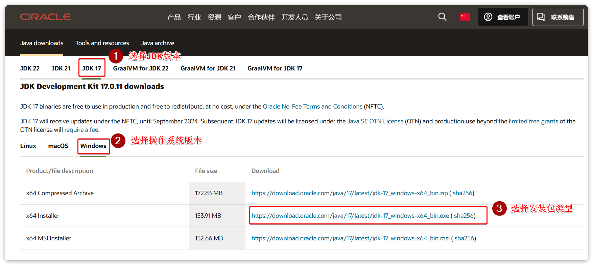

下载时根据操作系统（如 Windows）、系统架构（如 x64）选择对应的安装包类型即可。

### 2.4 验证 JDK 是否安装成功

安装完成后，可以通过 CMD 命令行测试是否安装成功，步骤如下：

1. 同时按下键盘上的 Win + R 键，会打开一个运行窗口
1. 在窗口中输入 cmd，然后按下键盘上的 Enter 键，弹出 DOS 窗口
1. 在 DOS 窗口输入命令，测试 Java 工具及其版本是否正确


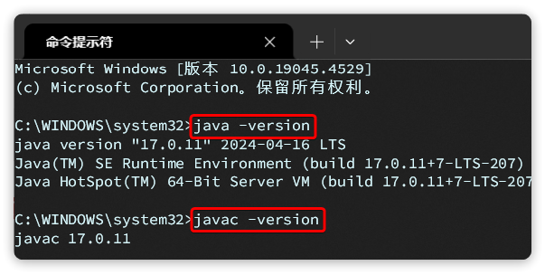

测试命令：

```cmd
java -version
javac -version
```

### 2.5 javac 与 java 命令

安装 JDK 后，bin 目录下包含两个最重要的命令程序：

- javac.exe：编译工具，负责将 Java 源码翻译成计算机可以识别的字节码
- java.exe：执行工具，负责运行编译后的 Java 程序

说明：我们写好的 Java 程序都是高级语言，计算机底层是硬件，不能识别这些语言，必须先通过 javac 编译工具进行翻译，然后再通过 java 执行工具执行，才可以驱动机器干活。

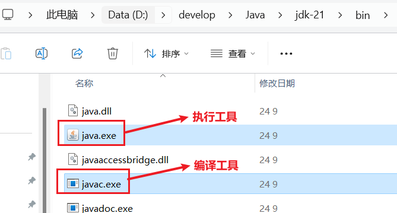

### 2.6 JDK 的组成

- JVM（Java Virtual Machine）：Java 虚拟机，真正运行 Java 程序的地方。
- 核心类库：Java 自己写好的程序，给程序员自己的程序调用的。
- JRE（Java Runtime Environment）：Java 的运行环境，包含 JVM 和核心类库。
- JDK（Java Development Kit）：Java 开发工具包，包括上面所有内容（JVM、核心类库、JRE、开发工具）。

### 2.7 补充：DOS 常用命令

| 常用命令 | 作用 |
| --- | --- |
| 盘符：`D:`、`E:` | 切换盘符 |
| `dir` | 查看当前路径下的文件信息 |
| `cd` | 进入单级目录：`cd itheima`；回退到上一级目录：`cd ..`；回退到盘符根目录：`cd /` |
| `cls` | 清屏 |
| `tab` | 自动补全指定字符开头的单词 |
| `↑` / `↓` 键 | 查看历史命令 |
| `exit` | 退出 |

### 2.8 小结

- 要使用 Java，必须先安装什么？去哪里下载？JDK（Java Development Kit）开发者工具包，在 Oracle 官网下载。
- LTS 版本有哪些？很多企业还在使用哪个 JDK 版本？JDK 8、11、17、21；很多企业还在使用 JDK 8 / JDK 11。
- 如何验证 JDK 是否安装成功了？打开命令行窗口，输入 `java -version`、`javac -version` 看版本号。
- JDK 中最重要的 2 个命令程序是什么？各自的作用是啥？javac（编译工具）、java（执行工具）。

## 3. 第一个 Java 程序 HelloWorld

### 3.1 Java 程序的开发步骤

开发一个 Java 程序要经历三个步骤：

1. 编写代码：创建源码文件 `HelloWorld.java`，文件后缀必须是 `.java`
1. 编译代码：使用 `javac` 命令将源码编译成字节码文件 `HelloWorld.class`
1. 运行代码：使用 `java` 命令运行程序，在控制台输出结果

对应的命令：

```cmd
javac HelloWorld.java
java HelloWorld
```

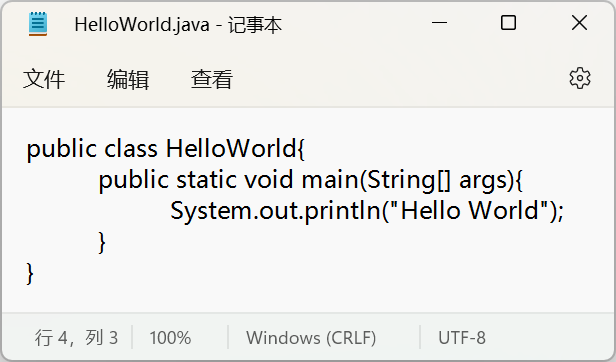


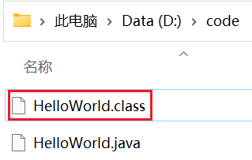

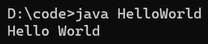

### 3.2 Hello World 程序代码解析

```java
public class HelloWorld {
    public static void main(String[] args) {
        System.out.println(" Hello World !");
    }
}
```

逐行解析：

- `public`：权限修饰符，后面会详细讲解。对于 public 暂时理解：限制类名称和文件名需要保持一致。
- `class`：定义一个类，后面跟上的是类名称（HelloWorld）。
- `main` 方法：程序执行时的入口点，main 方法也称之为主方法。
- `System.out.println(...)`：打印语句，使程序在控制台打印双引号所包裹的内容。

### 3.3 初学者常见错误与解决方案

**1. Windows 的文件扩展名没有勾选**

- 现象：新建的文件实际上是 `HelloWorld.java.txt` 之类的文本文件。
- 解决方案：必须勾选文件扩展名，再新建 Java 文件。

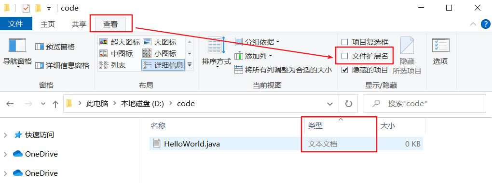

**2. 代码写了，但是忘记保存了**

- 解决方案：写完代码后必须保存（Ctrl + S）。

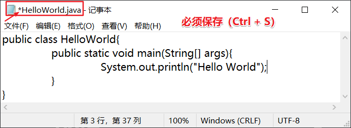

**3. 文件名和类名不一致**

- 现象：编译时报错：类 HelloWorld 是公共的，应在名为 `HelloWorld.java` 的文件中声明。
- 解决方案：文件名称必须与代码中的类名称保持一致。

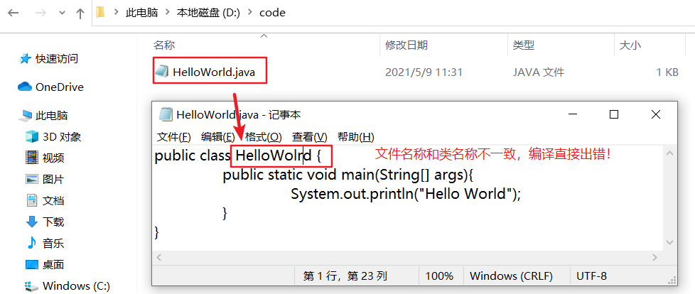

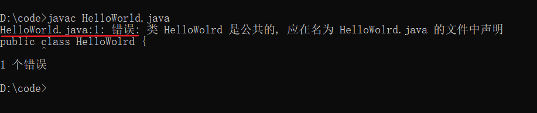

**4. 大小写错误，单词拼写错误，存在中文符号，找不到 main 方法**

- 现象：关键字大小写写错（如把 `public` 写成 `Public`）、单词拼写错误、代码中混入中文符号、找不到 `main` 方法等。
- 解决方案：仔细检查代码，必须使用英文模式下的符号，类名、方法名与关键字的大小写要正确。

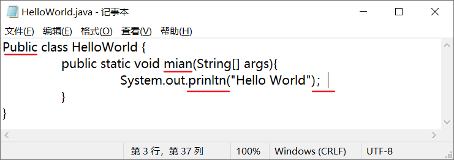

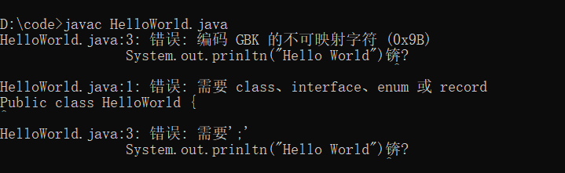

**5. 括号不配对**

- 现象：代码中的大括号、小括号数量不匹配，编译报错。
- 解决方案：检查并补全括号，保证左右括号一一配对。

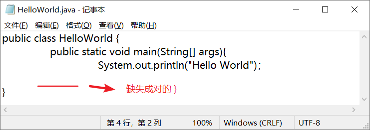

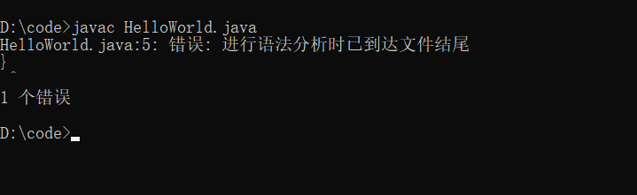

**6. 编译、执行工具使用不当**

- 现象：编译时误用了 `java` 命令，或运行时误用了 `javac` 命令。
- 解决方案：编译使用 `javac`，运行使用 `java`。

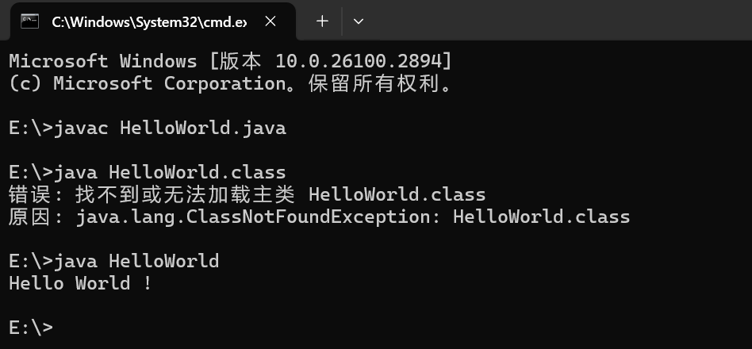


### 3.4 小结

1. 开发一个 Java 程序要经历哪三个步骤？编写、编译（javac）、运行（java）。
1. Java 代码编写有什么基本要求？
   - 文件名称的后缀必须是 `.java` 结尾
   - 文件名称必须与代码的类名称一致
   - 必须使用英文模式下的符号

## 4. Java 程序执行原理

### 4.1 计算机底层与机器语言

- 计算机底层都是硬件电路，可以通过不通电和通电表示 0、1。
- 机器语言就是由 0 和 1 组成的指令，例如 `00011100 00110101`。
- 最早期的程序员就是通过机器语言编程的形式来编写程序的。

### 4.2 编程语言发展历程

- 机器语言 → 汇编语言 → 高级语言。
- 高级语言更简单，使用接近人类自己的语言书写代码，再将其翻译成计算机能理解的机器指令。

### 4.3 Java 的跨平台原理

不管是什么样的高级编程语言，最终都要翻译成计算机底层可以识别的机器语言。Java 程序可以在任意操作系统中运行，这就是跨平台。

跨平台的原理：在需要运行 Java 应用程序的操作系统上，安装一个与操作系统对应的 Java 虚拟机（JVM，Java Virtual Machine）即可。

- Windows 版 JVM 虚拟机
- Linux 版 JVM 虚拟机
- MacOS 版 JVM 虚拟机

### 4.4 小结

- Java 程序的执行原理是什么样的？不管是什么样的高级编程语言，最终要翻译成计算机底层可以识别的机器语言。
- 机器语言是由什么组成的？0 和 1。
- Java 跨平台指的是什么？原理又是什么？Java 程序可以在任意操作系统中运行；在不同的操作系统中，安装与之对应版本的 JVM 虚拟机。

## 5. Java 环境配置

### 5.1 什么是 Path 环境变量

Path 环境变量用于记住程序路径，方便在命令行窗口的任意目录启动程序。

举例：QQ 程序安装在 `D:\App\QQ\QQ.exe`。


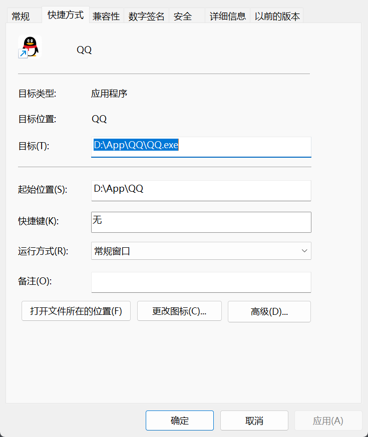

- 在程序所在目录（`D:\App\QQ`）下，直接输入 `QQ` 即可运行。

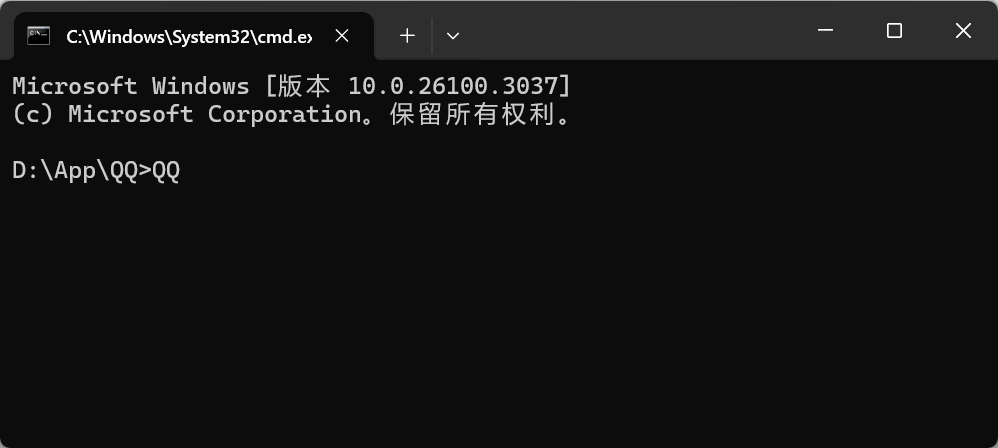

- 在其他目录（如 `C:\`）下，直接输入 `QQ` 无法运行。

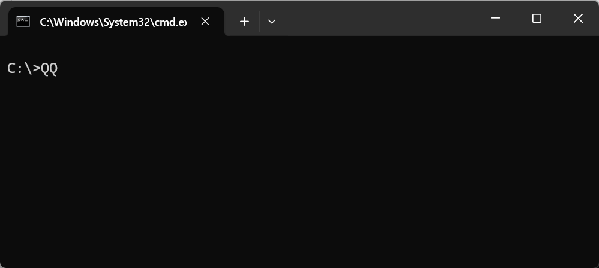

- 跨盘符（如 `E:\`）同样无法运行。


- 在用户目录下直接输入 `QQ` 也无法运行。

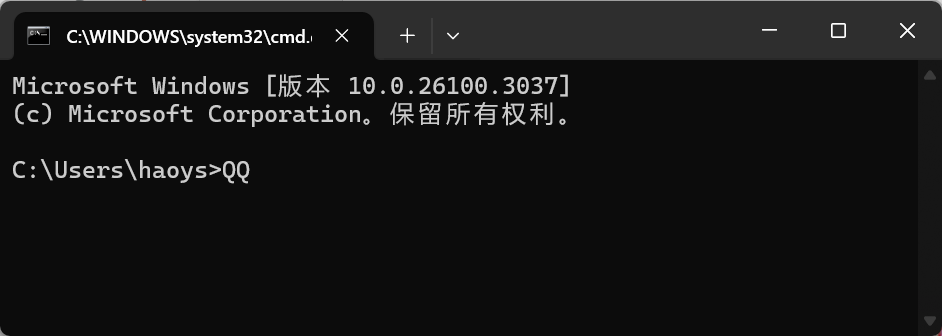

把程序的路径配置到 Path 环境变量中后，就可以在命令行窗口的任意目录启动该程序。

### 5.2 Path 环境变量的位置与原理

- Path 环境变量的位置：此电脑 → 属性 → 高级系统设置 → 高级 → 环境变量。
- Path 环境变量的原理：当我们在 Path 中配置某个程序路径后，在命令行窗口启动程序时，系统会按照 Path 中配置的路径去查找该程序。


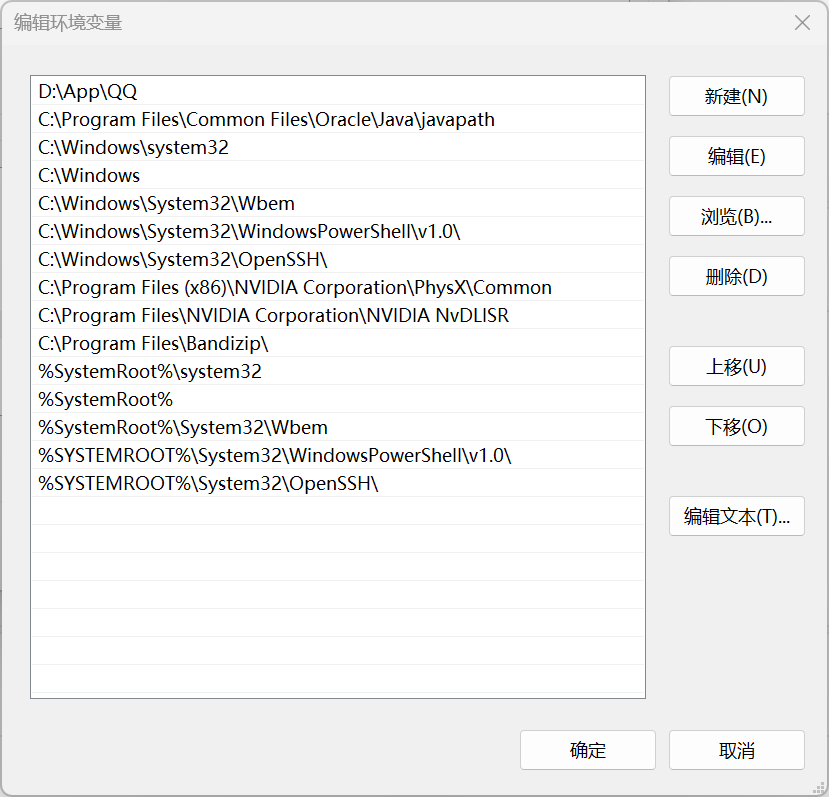

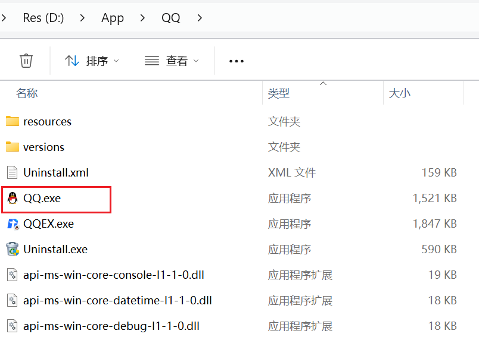

### 5.3 配置 Path 与 JAVA_HOME

- 配置示例：在 Path 中添加 JDK 的 bin 目录，例如 `E:\develop\Java\jdk21\bin`（本机路径，不要照抄，去复制自己电脑上的路径）。
- 目前较新的 JDK 安装时会自动配置 javac、java 程序的路径到 Path 环境变量中，因此 javac、java 可以直接使用。
- 注意：以前的老版本 JDK 在安装时没有自动配置 Path 环境变量，此时必须自己配置 Path 环境变量。
- JAVA_HOME：告诉操作系统 JDK 安装在了哪个位置（将来其他技术要通过这个环境变量找 JDK）。

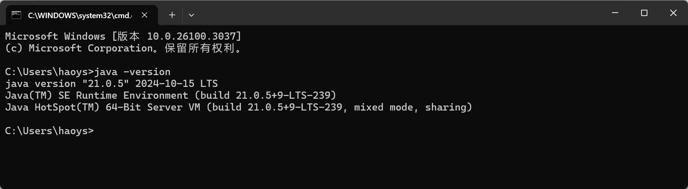

### 5.4 验证配置是否成功

重新配置了环境变量后，必须检测是否配置成功：打开命令行窗口，输入 `java -version` 看版本提示。

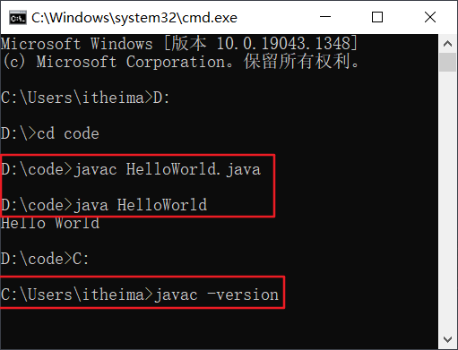

```cmd
java -version
```

### 5.5 小结

- 什么是 Path 环境变量？用于配置程序的路径，方便我们在命令行窗口的任意目录下启动该程序。
- JDK 安装时，关于环境变量的配置，需要注意什么？较新版本的 JDK 会自动配置 PATH 环境变量，较老的 JDK 版本则不会；建议还是自己配置一下 PATH、JAVA_HOME。
