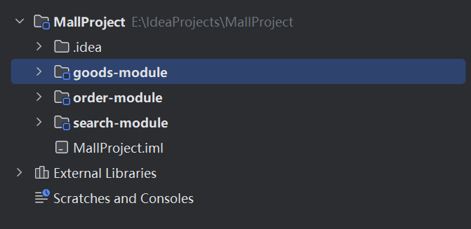
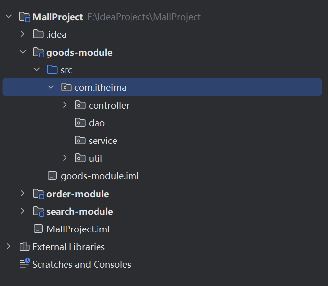
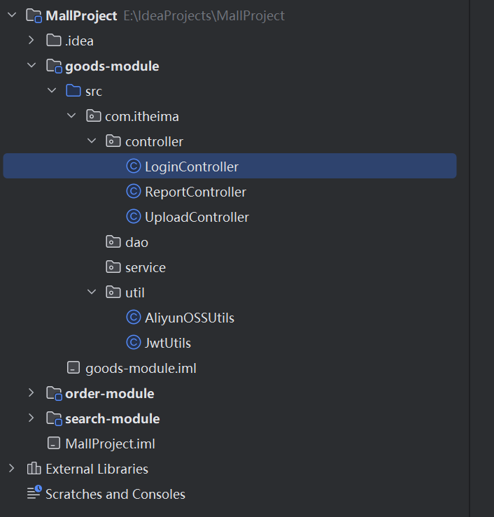
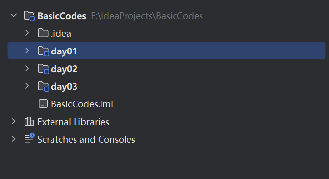
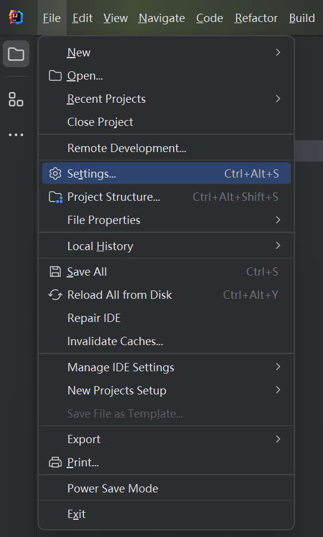
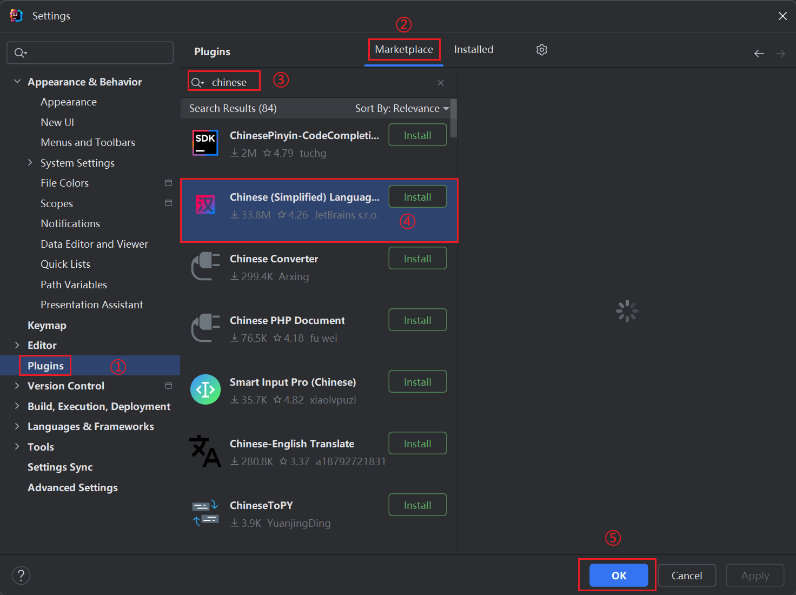

# 第二章：IDEA 开发工具

本章内容包括：

- IDEA 介绍和安装
- IDEA 中的第一个代码
- IDEA 使用操作

## 1. IDEA 介绍和安装

### 1.1 什么是 IDE

IDE 是 Integrated Development Environment（集成开发环境）的缩写。

1. IDE 集成环境：把代码的编写、编译、执行、调试等多种功能综合到一起的开发工具。
1. 使用 IDE 可以省去手动配置编译、运行环境的麻烦，把精力集中在代码本身。

### 1.2 为什么需要开发工具

1. 高级开发工具可以帮助我们编写程序、提高开发效率。
1. 编写 Java 程序需要经过编写、编译、执行、调试等多个环节，IDE 把这一整套流程集中在一起，操作更简单。

### 1.3 常见的 Java 开发工具

当前主流的 Java 开发工具主要有 3 种：

1. IntelliJ IDEA：JetBrains 出品，功能强大，是本课程使用的开发工具。
1. Eclipse：老牌开源 IDE，插件生态丰富。
1. NetBeans：开源 IDE，由 Apache 基金会维护。

### 1.4 IntelliJ IDEA 简介

1. IDEA 全称 IntelliJ IDEA，是目前使用最多的 Java 开发集成环境。
1. 官方定位为 the Leading Java and Kotlin IDE（领先的 Java 和 Kotlin IDE）。
1. 官方网址为 https://www.jetbrains.com/idea/（官网页面标题：IntelliJ IDEA – the Leading Java and Kotlin IDE (jetbrains.com)）。

### 1.5 本章小结

1. 什么是 IDE？——把代码的编写、编译、运行、调试等多种功能综合到一起的开发工具。
1. IDEA 是什么？——全称 IntelliJ IDEA，是目前使用最多的 Java 开发集成环境。

## 2. IDEA 中的第一个代码

### 2.1 Java 项目的代码层级结构

IDEA 中创建 Java 项目后，代码按照 Project → Module → Package → Class 的层级组织：

1. Project：项目，最顶层的工程。
1. Module：模块，一个 Project 下可以有多个 Module。
1. Package：包，用于组织和管理类文件。
1. Class：类，最终编写代码的地方。

层级关系可以用下面的结构图表示：

```text
Project（项目）
└── Module（模块）
    └── Package（包）
        └── Class（类）
```

### 2.2 Project 与 Module 的关系

1. 一个 Project（项目）下可以创建多个 Module（模块）。
1. 例如：一个电商项目 Project 下，可以划分出商品模块、搜索模块、订单模块、购物车模块等多个 Module。

### 2.3 Module 内部的代码分层

一个业务模块（例如商品模块）内部，代码通常分为 3 层：

1. 前端交互代码：负责与前端交互，接收请求并返回结果，通常对应 controller 层。
1. 业务代码：负责处理业务逻辑，通常对应 service 层。
1. 数据访问代码：负责读写数据，通常对应 dao 层。

### 2.4 实际项目结构示例

下面以 MallProject 为例，展示多模块项目在 IDEA 中的实际结构：

项目根目录 MallProject 下包含多个模块，例如 goods-module、order-module、search-module。



goods-module 模块内 src 目录下，通过包 com.itheima 组织代码，包内按职责分为 controller、dao、service、util 等包。



controller 包中存放具体的类文件，例如 LoginController、ReportController、UploadController；util 包中存放工具类，例如 AliyunOSSUtils、JwtUtils。



完整的结构可以用下面的目录树表示：

```text
MallProject（Project）
├── .idea（IDEA 配置文件目录）
├── goods-module（Module）
│   ├── src
│   │   └── com.itheima（Package）
│   │       ├── controller
│   │       │   ├── LoginController
│   │       │   ├── ReportController
│   │       │   └── UploadController
│   │       ├── dao
│   │       ├── service
│   │       └── util
│   │           ├── AliyunOSSUtils
│   │           └── JwtUtils
│   └── goods-module.iml（模块描述文件）
├── order-module（Module）
├── search-module（Module）
├── MallProject.iml（项目模块描述文件）
├── External Libraries（外部依赖库）
└── Scratches and Consoles（草稿与控制台）
```

### 2.5 基础篇的项目约定

1. 整个基础篇只创建一个 Project（例如 BasicCodes），方便统一管理。
1. 今后每一天的学习内容都创建一个新的 Module（例如 day01、day02、day03）。
1. 项目中 .idea 目录存放 IDEA 的配置信息，iml 文件是模块描述文件，External Libraries 中显示项目依赖的外部库。



### 2.6 中文插件安装（可选）

英文界面看不习惯的同学，可以考虑暂时安装中文语言包插件；不过实际工作中通常是英文界面，所以建议只在学习初期临时使用。

安装步骤如下：

1. 点击菜单 File → Settings（快捷键 Ctrl+Alt+S）。



1. 在设置窗口左侧选择 Plugins（插件）。
1. 顶部切换到 Marketplace（市场）标签页。
1. 在搜索框中输入 chinese。
1. 在结果中找到 Chinese (Simplified) Language Pack（作者 JetBrains s.r.o.），点击 Install 安装。
1. 安装完成后点击 OK 保存设置。



### 2.7 本章小结（常见问题速查）

1. IDEA 中的层级结构是什么？——project、module、package、class。
1. Project、Module、Package 本质上来讲是什么？——文件夹，用来管理类文件。
1. 生成 main 方法的快捷键是什么？——psvm（也可以输入 main 后回车补全）。
1. 生成打印输出的快捷键是什么？——sout。

在类中输入 psvm 后回车，IDEA 会自动补全为：

```java
public static void main(String[] args) {

}
```

输入 sout 后回车，IDEA 会自动补全为：

```java
System.out.println();
```

## 3. IDEA 使用操作

### 3.1 类文件操作

1. 新建类文件：在对应的包上右键 → New → Java Class，输入类名即可。
1. 删除类文件：在类文件上右键 → Delete，或选中后按 Delete 键。
1. 修改类文件：双击类文件在编辑区打开，修改后保存即可。

### 3.2 模块操作

1. 新建模块：在项目上右键 → New → Module，或通过 File → New → Module 创建。
1. 删除模块：右键模块 → Delete，或在 Project Structure 中移除。
1. 修改模块：右键模块 → Open Module Settings，查看和修改模块配置。
1. 导入模块：通过 File → New → Module from Existing Sources 导入已有模块。

### 3.3 项目操作

1. 新建项目：在 IDEA 欢迎页点击 New Project，或通过 File → New → Project 创建。
1. 打开项目：在欢迎页点击 Open，或通过 File → Open 打开已有项目。
1. 关闭项目：File → Close Project。
1. 修改项目：File → Project Structure（快捷键 Ctrl+Alt+Shift+S）中修改项目设置。

### 3.4 学习建议

1. IDEA 的操作很多，不急于一时，慢慢熟练就好。
1. 建议先掌握常用的增删改查操作，再逐步探索其他功能。
