# 一、运算符

运算就是：对变量和字面量操作的符号

## 1.算数运算符

### 1.1.基本语法

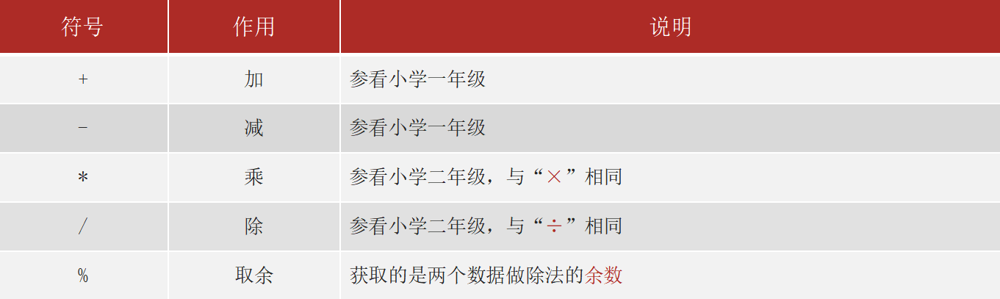

### 1.2.注意事项：

/ 和 % 的区别：两个数据做除法，/ 取结果的商，% 取结果的 余数。

整数操作只能得到整数，要想得到小数，必须有浮点数参与运算或者直接给被除数乘以1.0。

```java
System.out.println(5 / 2);        // 结果为2
System.out.println(5 / 2.0);      // 结果为2.5
System.out.println(1.0 * 5 / 2);  // 结果为2.5
-------------------------------------------------------------
System.out.println(5 % 2);        // 结果为1
System.out.println(4 % 2);        // 结果为0
```

### 1.3.案例-数值拆分

需求：将数字 123 拆分出个位、十位、百位后，打印在控制台

分析：

个位的计算：数值 % 10  

> 123 除以 10（商12，余数为3）

十位的计算：数值 / 10 % 10

> 123 除以 10 （商12，余数为3，整数相除只能得到整数）
>
> 12 除以 10 （商1，余数为2）

百位的计算：数值 / 10 / 10 % 10

> 123 / 10 / 10 % 10（123 / 10 得到12，12  / 10 得到1，1 % 10 得到 1）

公式总结：

```java
公式总结：
个位 ：数值 % 10
十位 ：数值 / 10 % 10
百位 ：数值 / 10 / 10 % 10        ------》 数值 / 100 % 10 
千位 ：数值 / 10 / 10 / 10 % 10;  ------》 数值 / 1000 % 10 
...
```

## 2.字符串拼接

### 2.1.概述

“+”号在java中如果参与数学运算就是加法运算

“+”符号与字符串运算的时候是用作连接符的，不会进行数学运算，会进行字符串拼接，其结果依然是一个字符串。

```java
System.out.println("abc" + 12);

//以下代码输出的结果是
int a = 6；
System.out.println("abc" + a);
System.out.println(a + 5);
System.out.println("itheima" + a + 'a');
System.out.println(a + 'a' + "itheima");
System.out.println(a + (5+6));
```

### 2.2.案例-短信验证码通知

需求：请将验证码使用变量保存，然后再java程序使用字符串拼接技术，将以下内容打印在控制台


## 3.自增自减运算符

### 3.1.概述

让变量的值加 1或减 1的操作

++ 和 -- 既可以放在变量的后边，也可以放在变量的前边。


### 3.2.注意事项

自增自减运算符只能操作变量，不能操作字面量

```java
//System.out.println(10++); 报错
int a = 10;
System.out.println(a++);
```

避免同一个表达式中多次使用：在复杂表达式中多次使用自增 / 自减可能导致逻辑混乱（虽然 Java 有明确的运算规则，但可读性极差）。

```java
int a = 3;
int result = a++ + ++a; // 不建议这样写！
// 解析：a初始为3 → a++先取3（a变为4） → ++a先让a变为5（再取5） → 结果=3+5=8
```

### 3.3.自增自减书写位置

++/-- 在前，先自增再操作

++/-- 在后，先操作再自增

**前缀形式（`++变量` / `--变量`）**

先修改变量的值，再使用变量的新值

```java
//前缀递增
int a = 3;
int b = ++a; //前缀自增：先让a加1（a变为4），再将a的值（4）赋给b

System.out.println(a); // 输出：4（a已自增）
System.out.println(b); // 输出：4（使用的是自增后的值）
//前缀递减
int c = 5;
int d = --c; //前缀自减：先让c减1（c变为4），再将c的值（4）赋给d

System.out.println(c); // 输出：4（c已自减）
System.out.println(d); // 输出：4（使用的是自减后的值）
```

**后缀形式（`变量++` / `变量--`）**

先使用变量原来的值，再修改变量的值。

```java
//后缀递增
int a = 3;
int b = a++;//后缀自增：先将a的原值(3)赋给b，再让a加1(a变为4)

System.out.println(a); // 输出：4（a已自增）
System.out.println(b); // 输出：3（使用的是自增前的值）
//后缀递减
int c = 5;
int d = c--; //后缀自减：先将c的原值(5)赋给d，再让c减1(c变为4)

System.out.println(c); // 输出：4（c已自减）
System.out.println(d); // 输出：5（使用的是自减前的值）
```

###  3.4.案例-面试题

需求：以下代码输出结果是什么？

```java
int p = 4;
int q = p-- + 2;
System.out.println(p);
System.out.println(q);
```

```java
int a = 1;
int b = 2;
int c = a++ + ++b; 
System.out.println(a);
System.out.println(b);
System.out.println(c);
```

```java
int x = 3;
x++; 
int y = 3;
++y;
System.out.println(x);
System.out.println(y);
```

```java
int c = 10;
int d = 5;
int rs3 = c++ + ++c - --d - ++d + 1 + c--;
System.out.println(rs3);
System.out.println(c);
System.out.println(d);
```

## 4.类型转换

###  4.1.概述 

类型转换是将一种数据类型的值转换为另一种数据类型的过程。

由于 Java 是强类型语言（每个变量和表达式都有明确的类型，且类型在编译期严格检查），不同类型的变量在赋值、运算或传递时必须满足类型兼容规则，否则会报错。类型转换正是为了解决这种 “不兼容” 问题而存在的。

类型转换分为以下两种转换方式：

- 隐式转换 （自动类型转换和运算过程中的隐式转换）
- 强制类型转换

### 4.2.隐式转换

**自动类型转换**

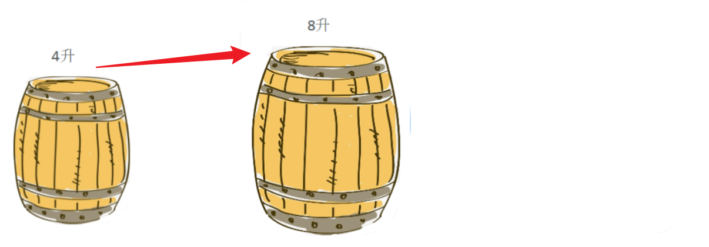

把一个取值范围小的数值或者变量，赋值给另一个取值范围大的变量

自动类型转换：我们不需要手动操作，JVM(java虚拟机)会自动完成

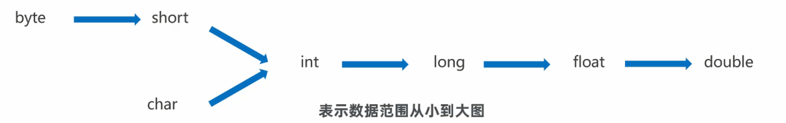

> 核心规则：从小范围类型 → 大范围类型（“向上转换”）。
>
> 两种类型兼容的数据，并且目标类型“容量”大于源类型，JVM会自动将源类型转为目标类型，不需要写额外的代码；
>
> 理解为：类型范围小的变量，可以直接赋值给类型范围大的变量。

```java
//源类型
byte a = 12；
//目标类型
int b = a;
System.out.println(b);
```

- 源类型a的数据类型是byte占有1个字节的内存

- 目标类型b的数据类型是int占有4个字节的内存

  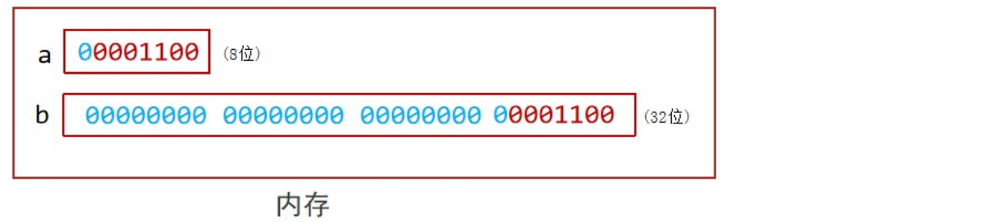

多学一点

计算机中的存储单位

- 计算机的核心存储设备是内存（RAM），它由无数个“存储单元”组成，每个单元可以存储1个二进制数字（0或1），我们称为1个比特（bit）。
- 为了方便管理数据，<b style="color:red">8个比特划分为1个基本单位“字节（Byte）</b>”，这就<b style="color:red">是计算机存储数据的最小“可寻址单位”</b>。每个字节都有唯一的编号，称为内存地址（类似于房间号），CPU会通过地址精准定位和操作数据。

```
地址：0x0001 → 存储字节：00001010（二进制，对应十进制10）  
地址：0x0002 → 存储字节：00000110（二进制，对应十进制6）  
```

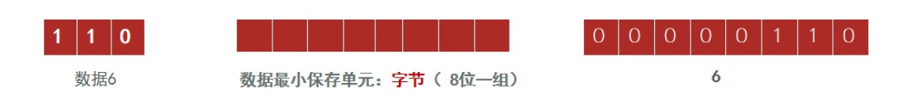

**运算过程中的隐式转换**

- 取值范围小的数据，和取值范围大的数据进行运算，小的会先提升为大的之后，再进行运算
- <b style="color:red">byte short char 三种数据在运算的时候，都会提升为int，然后再进行运算</b>
- char类型参与运算时是拿着编码表中的数值进行运算

```java
public static void main(String[] args) {
    byte a = 10;
    byte b = 20;
    byte c = a + b; //报错
}
```

**强制类型转换**

- 把一个取值范围大的数值或者变量，赋值给另一个取值范围小的变量，不允许直接赋值，需要加入强制转换
- 格式：目标数据类型 变量名 = (目标数据类型) 被强转的数据;
- 注意：强制转换有可能造成精度损失，使用的时候要考虑清楚；

```java
    public static void main(String[] args) {
        double a = 12.3;
        //int b = a;  //报错
        //强制转换后
        int b = (int) a;
    }
```

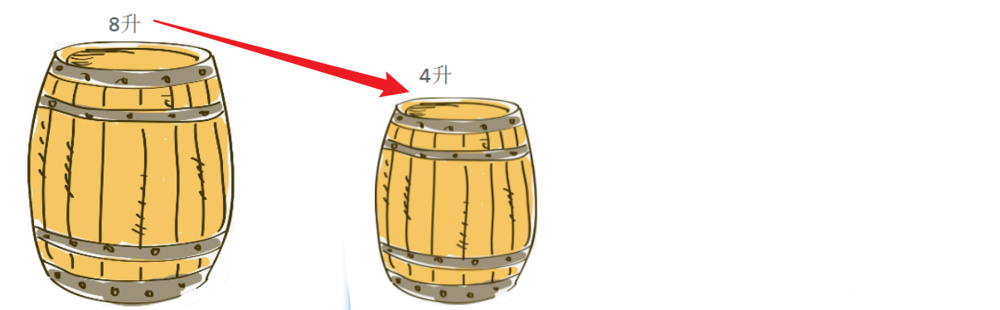

### 4.3.案例-面试题

阅读代码, 分析是否存在错误, 如果有请说明原因并改正.

```java
byte b1 = 3;

byte b2 = 4;

byte b3 = b1 + b2;
```

```java
package com.itheima.test;

public class TypeChangeTest {
    /*
        阅读代码, 分析是否存在错误, 如果有请说明原因并改正.

        byte b1 = 3;
        byte b2 = 4;
        byte b3 = b1 + b2;

        原因: b1和b2是两个byte类型的数据, 相加的时候会直接提升为int, 提升之后就是两个int相加
                结果还是int这里将int类型的结果, 赋值给byte类型的变量
                属于大的给小的赋值, 不能直接赋值, 需要强转, 或者改变类型.

        改正:
                1. byte b3 = (byte)(b1 + b2);
                2. int b3 = b1 + b2;

        byte b = 3 + 4;

        回答: 这句代码不会出现错误, Java存在字面量优化机制, 在编译的时候(javac)就会完成运算
                字节码文件: byte b = 7;
     */
    public static void main(String[] args) {
        byte b = 3 + 4;
        System.out.println(b);
    }
}
```

## 5.赋值运算符

### 5.1.基本赋值运算符

定义变量和表达式里面的" = "号是赋值作用，会把右侧的值赋值给左侧的变量；

```java
int a = 10; // 先看“=”右边，把数据10赋值给左边的变量a存储。
```

### 5.2.扩展赋值运算符

扩展运算符实现数据的算术运算，通过特殊的书写方式实现数据的累加、累乘等操做。

特点：扩展的赋值运算符自带强制类型转换。

| 符号 | 用法 | 作用       | 底层代码形式           |
| ---- | ---- | ---------- | ---------------------- |
| +=   | a+=b | 加后赋值   | a = (a 的类型)(a + b); |
| -=   | a-=b | 减后赋值   | a = (a 的类型)(a - b); |
| *=   | a*=b | 乘后赋值   | a = (a 的类型)(a * b); |
| /=   | a/=b | 除后赋值   | a = (a 的类型)(a /b);  |
| %=   | a%=b | 取余后赋值 | a = (a 的类型)(a % b); |

以下代码的结果是什么？（特点）

```java
// 代码1
byte x = 10;
byte y = 30;
x = x + y;
```

```java
// 代码2
byte x = 10;
byte y = 30;
x += y；
```

## 6.关系运算符

在 Java 中，关系运算符用于比较两个操作数（可以是变量、常量或表达式）之间的关系，运算结果始终是一个布尔值（boolean）：`true`（表示关系成立）或`false`（表示关系不成立）。

| 符号 | 例子   | 作用                      | 结果                            |
| ---- | ------ | ------------------------- | ------------------------------- |
| >    | a>b    | 判断 a 是否大于 b         | 成立返回 true、不成立返回 false |
| >=   | a>=b   | 判断 a 是否大于或者等于 b | 成立返回 true、不成立返回 false |
| <    | a<b    | 判断 a 是否小于 b         | 成立返回 true、不成立返回 false |
| <=   | a<=b   | 判断 a 是否小于或者等于 b | 成立返回 true、不成立返回 false |
| ==   | a==b   | 判断 a 是否等于 b         | 成立返回 true、不成立返回 false |
| !=   | a != b | 判断 a 是否不等于 b       | 成立返回 true、不成立返回 false |

```java
int a = 5;
int b = 2;
System.out.println(a > b);
System.out.println(a >= b);
System.out.println(a < b);
System.out.println(a <= b);
System.out.println(a == b);
System.out.println(a != b);
```

## 7.逻辑运算符

### 7.1.普通逻辑运算符

在 Java 中，逻辑运算符主要用于连接布尔表达式（返回`boolean`类型的表达式），最终结果也是`boolean`类型（`true`或`false`）。

理解为：把多个条件放在一起运算，最终返回布尔类型的值：true、false。

| 符号 | 叫法     | 例子           | 运算逻辑                                                     |
| ---- | -------- | -------------- | ------------------------------------------------------------ |
| &    | 逻辑与   | 2 > 1 & 3 > 2  | 多个条件必须都是 true，结果才是 true；有一个是 false，结果就是 false |
| \|   | 逻辑或   | 2 > 1 \| 3 < 5 | 多个条件中只要有一个是 true，结果就是 true；                 |
| !    | 逻辑非   | !(2 > 1)       | 就是取反：你真我假，你假我真。!true == false、!false == true |
| ^    | 逻辑异或 | 2 > 1 ^ 3 > 1  | 前后条件的结果相同，就直接返回 false，前后条件的结果不同，才返回 true |

特点：

- 逻辑&：无论左边表达式结果如何，右边表达式一定会执行。

```java 
int e = 1;
boolean result5 = (e > 2) & (++e > 0); 
System.out.println(result5); 
System.out.println(e);
```

- 逻辑|：无论左边表达式结果如何，右边表达式一定会执行。

```java 
int f = 1;
boolean result6 = (f > 0) | (++f > 2); 
System.out.println(result6); 
System.out.println(f); 
```

- 逻辑非 ！：一元运算符，对布尔值取反（`!true`为`false`，`!false`为`true`）。

```java
boolean c = true;
boolean result3 = !c; 
System.out.println(result3); 

boolean d = false;
boolean result4 = !d; 
System.out.println(result4); 
```

- 逻辑异或：当左右两个布尔表达式结果不同时（一个`true`，一个`false`），结果为`true`；否则为`false`。

```java
boolean g = true, h = false;
boolean result7 = g ^ h; 
boolean result8 = g ^ g;
boolean result9 = h ^ h;
```

###  7.2.短路运算符

**短路与 &&**

- 作用：当左右两个布尔表达式  同时为`true` 时，结果为`true`；否则为`false`。
- 短路特性：若左边表达式为`false`，则右边表达式不会执行（直接返回`false`）。

```java
int a = 1;
boolean result1 = (a > 2) && (++a > 0); 
System.out.println(result1); 
System.out.println(a); 
```

**短路或：||**

```java
int b = 1;
boolean result2 = (b > 0) || (++b > 2); 
System.out.println(result2);
System.out.println(b);
```

如果改成以下代码执行结果是

```java
int b = 1;
boolean result2 = (b < 0) || (++b > 2); 
System.out.println(result2);
System.out.println(b);
```

## 8.三元运算符

三元运算符（也称为条件运算符）是唯一的三目运算符，语法简洁，用于根据条件的真假执行不同的表达式并返回结果。

### 8.1.基本语法

```tcl
条件表达式 ? 表达式1 : 表达式2
```

### 8.2.执行逻辑

先计算条件表达式（结果必须是`boolean`类型：`true`或`false`）。

如果条件表达式为`true`，则执行表达式 1，并返回其结果。

如果条件表达式为`false`，则执行表达式 2，并返回其结果。

### 8.3.使用场景

1.简单的条件判断

```java
int a = 10;
int b = 20;

// 判断a和b的大小，返回较大的值
int max = (a > b) ? a : b; 
System.out.println(max);
```

2.不同类型的兼容场景

```java
int score = 85;

// 表达式1和表达式2都是String类型，兼容
String result = (score >= 60) ? "及格" : "不及格"; 
System.out.println(result); 
```

> 注意：表达式 1 和表达式 2 的类型必须兼容，否则编译错误。
> 错误示例：int x = (true) ? "abc" : 123;（String 和 int 无法兼容）。

3.嵌套使用（不推荐过度嵌套，影响可读性）

```java
int num = 5;

// 嵌套判断：先判断是否为正数，再判断是否大于10
String desc = (num > 0) ? (num > 10 ? "大于10的正数" : "10以内的正数") : "非正数";
System.out.println(desc); 
```

###  8.4.案例-成绩判断

定义一个score成绩变量，使用三元运算符输出结果

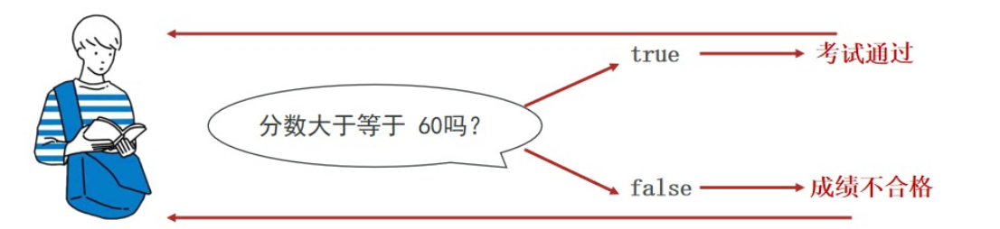

```java
public static void main(String[] args) {
    int score = 90;
    String res = score >=60 ? "成绩合格" : "成绩不合格";
    System.out.println(res);
}
```

### 8.5.案例-求最大值

```java
public static void main(String[] args) {
    int a = 10;
    int b = 20;
    int c = 60;
    //01- 找出前两个整数的最大值
    int tempMax = a < b ? a : b;
    //02- 找出三个整数的最大值
    int max = tempMax > c ? tempMax : c;
    System.out.println("最大值为： " + max);
}
```

## 9.运算符优先级

| 优先级 | 运算符                    |
| ------ | ------------------------- |
| 1      | . () {}                   |
| 2      | !、~、++、--              |
| 3      | *、/、%                   |
| 4      | +、-                      |
| 5      | <<、>>、>>>               |
| 6      | <、<=、>、>=、instanceof  |
| 7      | ==、!=                    |
| 8      | &                         |
| 9      | ^                         |
| 10     | \|                        |
| 11     | &&                        |
| 12     | \|\|                      |
| 13     | ?:                        |
| 14     | =、+=、-=、*=、/=、%=、&= |

```java
public static void main(String[] args) {
    int a = 10;
    int b = 20;
    System.out.println(a > b || a < b && a > b);
}
```

记住短路&& 的优先级大于 短路||

合理使用 小括号就可以你不用记忆表格

```java
public static void main(String[] args) {
    int a = 10;
    int b = 20;
    System.out.println(a > b || (a < b && a > b));
}
```

# 二、Scanner键盘输入API

## 1.Scanner 类简介

`Scanner` 是 Java 5 引入的工具类，支持接收多种数据类型（整数、浮点数、字符串等），使用简单。

## 2.使用步骤

1.导入 Scanner 类：需要在代码开头导入 `java.util.Scanner`（否则需写全类名 `java.util.Scanner`）。

2.创建 Scanner 对象：关联输入源（键盘输入对应 `System.in`）。

3.调用方法获取输入：根据数据类型调用 `nextInt()`、`nextDouble()`、`nextLine()` 等方法。

```java
import java.util.Scanner;

public class Test01 {
    public static void main(String[] args) {
        //新建一个扫描器，方便用户输入内容
        Scanner sc = new Scanner(System.in);
        System.out.println("请输入您要判断的非0数字");
        //定义一个变量存储用户输入的内容
        int n = sc.nextInt();
        //用三元运算符判断输出结果，结果用一个字符串变量存储
        String res = n > 0 ? "您输入的是一个正数" :"您输入的是一个负数";
        System.out.println(res);
    }
}
```

# 三、方法

## 1.方法的概述和好处

方法（函数）：<b style="color:red">一段具有独立功能的代码块，不调用就不执行</b>

使用方法的好处

- 可以将挤在一起的臃肿代码，按照功能进行分类管理，提高维护性
- 提高代码的复用性

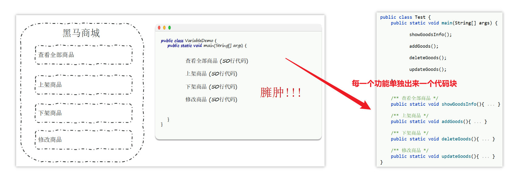此时假设上架商品功能出现问题，我们主要关注 addGoods 这个方法里面的代码即可，维护起来就比之前方便了

而且如果需要上架多次商品，只需要对 addGoods 方法进行多次调用即可，不需要反复编写里面的代码。

## 2.方法的定义和调用

### 2.1.无参无返回值方法

定义和调用

```java
//定义
public static void 方法名(){
    方法体
}
//调用--直接调用
方法名();
```

案例 - 求算两个整数的最大值

需求：定义一个方法，方法中定义两个整数变量，求出最大值并打印在控制台

分析：

1. 根据格式编写方法，方法名自己给出（见名知意 小驼峰命名法）
2. 方法内部定义出两个 int 类型变量
3. 使用三元运算符求出最大值
4. 调用该方法，让内部的逻辑执行起来

```java
public static void main(String[] args) {
	getMax();
}

public static void getMax(){
	int a = 10;
	int b = 20;
	int max = a > b ? a : b;
	System.out.println("最大值为:" + max);
}
```

### 2.2.有参数无返回值方法

前面的方法getMax()只能求10和20的最大值，如果想要求任意两个数的最大值，我们换需要书写多个方法，对于代码编写来说也没有达到简化的和复用性的提高，此时我们可以给方法设置相关的形参，然后再调用的时候传递对应类型的实参就可以得到不同数字的最大值

定义和调用

```java
//定义
public static void 方法名(形参1,形参2){
    方法体
}
//调用--直接调用
方法名(实参,实参2);
```

形参：全称形式参数，是指在定义方法时，所声明的参数

实参：全称实际参数，调用方法时，所传入的参数

案例-求任意两个数中的最大值

```java
public static void main(String[] args) {
    getMax(8,29);
}

public static void getMax(int a, int b){
    int max = a > b ? a : b;
    System.out.println("最大值为:" + max);
}
```

### 2.3.带返回值的方法

A 方法产生的数据,  B 方法想要使用的话,  就需要定义带返回值的方法

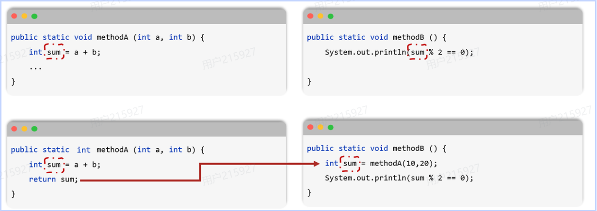

定义和调用

```java
//定义
public static 数据类型 方法名(形参1,形参2){
    return 方法体;
}
//调用--直接调用
数据类型 结果变量名 = 方法名(实参,实参2);
使用结果变量
```

案例-求任意两个数中的最大值并返回

```Java
public class MethodTest {
    public static void main(String[] args) {
        int max = getMax(10, 20);
        System.out.println("最大值为:" + max);
    }

    public static int getMax(int a, int b){
        int max = a > b ? a : b;
        return max;
    }
}
```

## 3.方法通用定义格式

方法的定义格式实际上只有一种，我们是拆成了三个部门让大家循序渐进的接受，现在我们整合一下，介绍通用定义格式。

```java
修饰符 返回值类型 方法名(形参列表) {
    // 方法体（需要执行的功能代码）
    return 返回值; // 若返回值类型不是void，必须有return
}
```

修饰符：暂时都使用public static 修饰。

返回值类型：方法执行后返回结果的类型。

- 若方法不需要返回结果，用void（无返回值）；
- 若需要return返回结果，必须指定类型（如int、String等），return返回的数据必须要和指定的数据类型一致；

方法名：自定义的名字，遵循 “小驼峰命名法”（首字母小写，后续单词首字母大写，如`getSum`、`reverseArray`）。

形参列表：可以有多个，甚至可以没有； 如果有多个形参，多个形参必须用“,”隔开，且不能给初始化值。

- 例：`(int a, int b)` 表示需要两个 int 类型的参数。
- 若不需要参数，括号里留空`()`。

方法体：花括号{}中的代码，实现具体功能。

- 若返回值类型不是void，必须用return语句返回对应类型的结果；
- 若返回值类型是void，可以省略return（或用return;提前结束方法）

## 4.方法练习案例

定义方法时，要做到两个明确

- 明确参数：主要是明确参数的类型和数量
- 明确返回值类型：主要是明确方法操作完毕之后是否有结果数据，如果有，写对应的数据类型，如果没有，写void

调用方法时

- void类型的方法，直接调用即可
- 非void类型的方法，推荐用变量接收调用

需求1：设计一个方法，方法能够计算出两个小数的和

```Java
package com.itheima.test;

public class MethodTest1 {
    public static void main(String[] args) {

        double sum = getSum(11.1, 22.2);
        System.out.println("sum=" + sum);
    }
    /*
        1. 明确参数   double num1, double num2
        2. 明确返回值    double
     */
    public static double getSum(double num1, double num2) {
        return num1 + num2;
    }
}
```

需求2 : 设计一个方法, 能够计算出3个整数的最小值

```Java
package com.itheima.test;

public class MethodTest1 {
    public static void main(String[] args) {
        int min = getMin(20, 10, 30);
        System.out.println("min=" + min);
    }
    /*
        1. 明确参数     int num1, int num2, int num3
        2. 明确返回值    int
     */
    public static int getMin(int num1, int num2, int num3) {
        int tempMin = num1 < num2 ? num1 : num2;
        int min = tempMin < num3 ? tempMin : num3;
        return min;
    }

}
```

需求3 : 设计一个方法, 方法能够打印出用户的个人信息 (姓名, 年龄, 身高, 性别)

```Java
package com.itheima.test;

public class MethodTest1 {
    public static void main(String[] args) {
        printUserInfo("张三", 23, 180.1, '男');
    }

    /*
        1. 明确参数     String name, int age, double height, char gender
        2. 明确返回值    void
     */
    public static void printUserInfo(String name, int age, double height, char gender) {
        System.out.println("姓名为:" + name);
        System.out.println("年龄为:" + age);
        System.out.println("身高为:" + height);
        System.out.println("性别为:" + gender);
    }
}
```

## 5.方法在计算机中的执行原理

### 5.1.概述

方法没有被调用的时候，在方法区中的字节码文件中存放

方法被调用的时候，需要进入到栈内存中运行

栈的先进后出，保证了程序在执行过程中，避免了方法累积导致的内存溢出的问题；

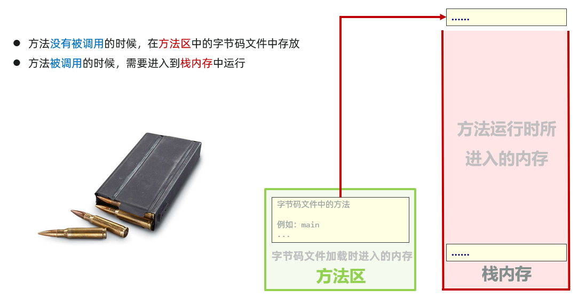

如下代码

```java
public class Test {
    public static void main(String[] args) {
        A();
    }

    public static void A(){
        B();
    }
    public static void B(){
        C();
    }
    public static void C(){
        System.out.println("方法的调用流程");
    }
}
```

```java
会先将main方法在栈内存中调用，随后将的调用顺序是main ---> 方法A ---> 方法B --->方法C
    
//然后在栈内存中一次从C方法开始执行：
1. 先执行方法C，执行完后会将方法C在栈内存中清除
2. 执行方法B，执行完后会将方法B在栈内存中清除
3. 执行方法A，执行完后会将方法A在栈内存中清除
4. 最后回到main方法，该程序执行完毕，将main方法也在栈内存中清除
```

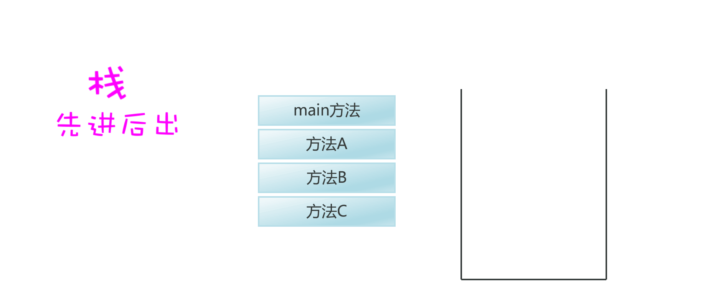

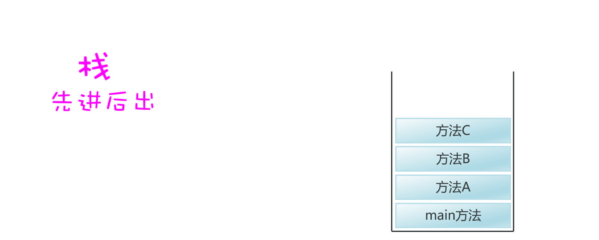

### 5.2.案例演示1

```java
public class Test {
    public static void main(String[] args) {
        System.out.println("开始");
        getMax();
        System.out.println("结束");
    }

    public static void getMax() {
        int num1 = 10;
        int num2 = 20;
        int max = num1 > num2 ? num1 : num2;
        System.out.println(max);
    }
}
```

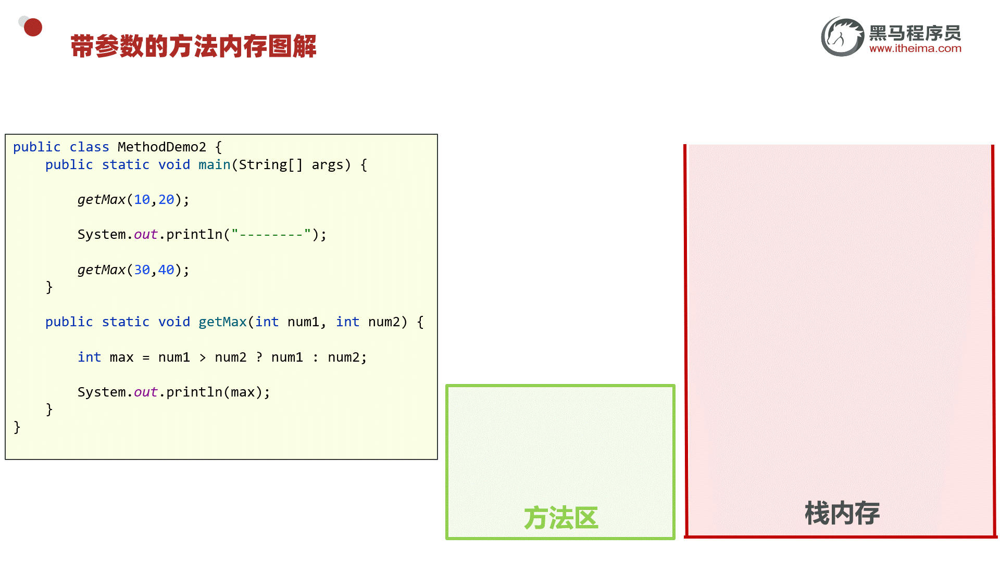

### 5.2.案例演示2

```java
public class Demo2Method {
    public static void main(String[] args) {
        study();
    }
    private static void study() {
        eat();
        System.out.println("学习");
        sleep();
    }
    
    private static void eat() {
        System.out.println("睡觉");
    }
    
    private static void sleep() {
        System.out.println("吃饭");
    }
}
```


## 6.方法的注意事项

方法不调用就不执行

方法与方法之间是平级关系，不能嵌套定义

方法的编写顺序和执行顺序无关

方法的返回值类型为void，表示该方法没有返回值，没有返回值的方法可以省略return语句不写，如果要编写return，后面不能跟具体的数据。

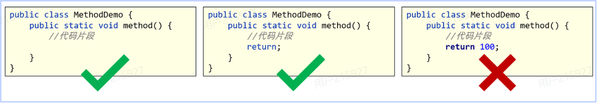

return语句下面，不能编写代码，因为永远执行不到，属于无效的代码（一旦执行到`return`语句，当前方法会立即停止，后续代码不再执）

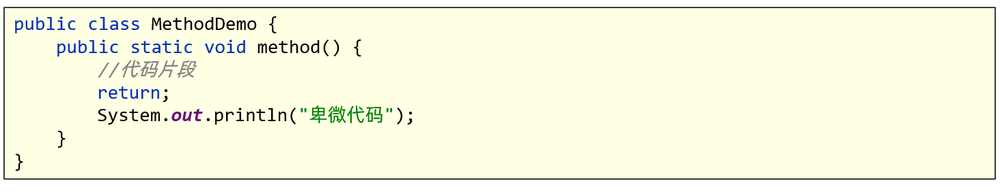

## 7.方法重载

### 7.1.定义

一个类中，出现多个方法的名称相同，但是它们的形参列表是不同的，那么这些方法就称为方法重载了。

```java
public class MethodOverLoad {
    public static void main(String[] args) {
        //认识方法重载
        test();
        test(3);
    }
    public static void test() {
        System.out.println("---test1---");
    }
    public static void test(int a) {
        System.out.println("---test1---" + a);
    }
}

```

### 7.2.方法重载的注意事项

一个类中，只要方法的名称相同、形参列表不同，那么它们就是方法重载了，其它的都不管（如：修饰符，返回值类型是否一样都无所谓）。

形参列表不同指的是：形参的个数、类型、顺序不同，不关心形参的名称。

> 同类型参数顺序不一样不算重载，只有不同类型的参数顺序不一样才算重载。

```java
public class MethodOverLoad {
    public static void main(String[] args) {
        System.out.println(add(1, 2));
        System.out.println(add(1, 2, 3));
        System.out.println(add(1.5, 2.5));
        System.out.println(add(2, 3.5));
    }

    // 1. 两个int相加（参数数量2，类型int）
    public static int add(int a, int b) {
        return a + b;
    }

    // 2. 三个int相加（参数数量3，类型int）
    public static int add(int a, int b, int c) {
        return a + b + c;
    }

    // 3. 两个double相加（参数类型double）
    public static double add(double a, double b) {
        return a + b;
    }

    // 4. int和double相加（参数顺序不同）
    public static double add(int a, double b) {
        return a + b;
    }

    // 5. double和int相加（参数顺序不同）
    public static double add(double a, int b) {
        return a + b;
    }
}
```

### 7.3.应用场景

开发中我们经常需要为处理一类业务，提供多种解决方案，此时用方法重载来设计是很专业的。

调用方法的时候,会通过参数的不同来区分调用的是哪个方法。

开发武器系统，功能需求如下：

1. 可以默认发一枚武器。
2. 可以指定地区发射一枚武器。
3. 可以指定地区发射多枚武器。

```java
public class MethodOverLoad {
    public static void main(String[] args) {
        //掌握方法重载的应用场景
        fire();
        fire("米国");
        fire("小日子",10000);
    }

    private static void fire() {
        System.out.println("默认给岛国发射1枚武器");
    }
    private static void fire(String country) {
        System.out.println("给"+country+"发射1枚武器");
    }
    private static void fire(String country, int number) {
        System.out.println("给"+country+"发射"+number+"枚武器");
    }
}
```

# 四、 IDEA 集成通义灵码

DEA之前的编程方式

- 程序的编码工作，还是需要程序员思考，并逐行编写。

AI出现后，IDEA可以集成很多辅助编程的AI编程插件

- 阿里巴巴 通义灵码
- 官网：https://lingma.aliyun.com/lingma/download

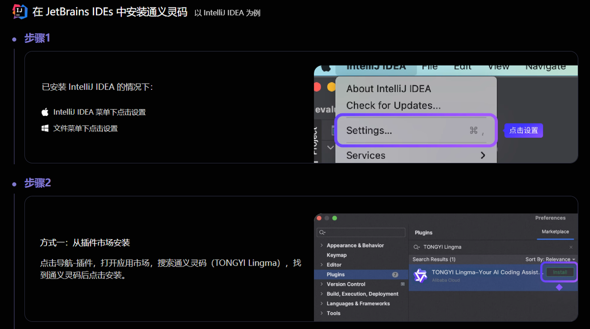

安装成功后，可以将刚刚方法的案例，使用通义灵码生成

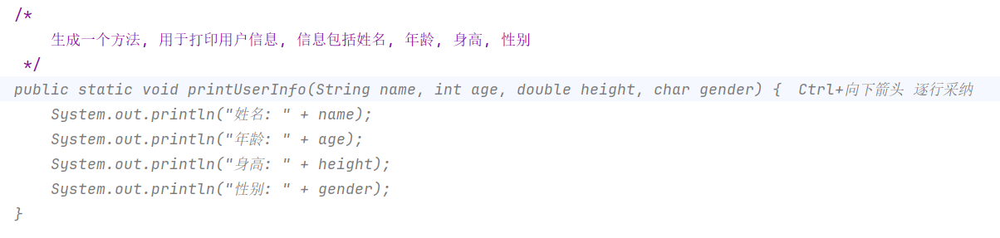

可以发现，IDEA 集成了 AI 插件之后，我们的编码效率要比之前高很多，但是目前我们还处于打基础的阶段，如果过度依赖 AI 可能就会导致根基不稳，后面的学习就会受阻

所以目前建议大家暂时先禁用 AI 插件，等我们把基础打牢固了，再将插件打开


