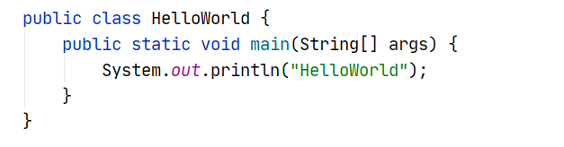
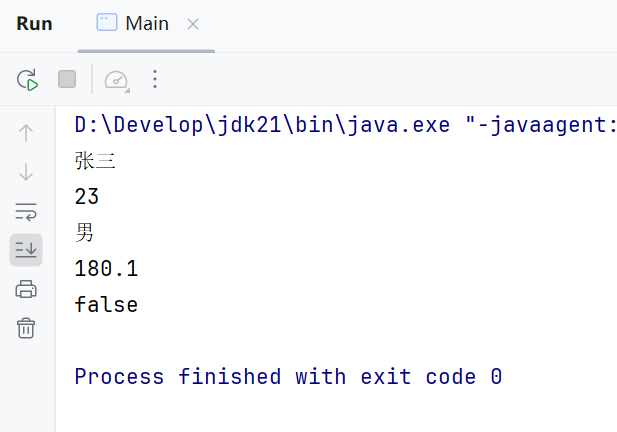
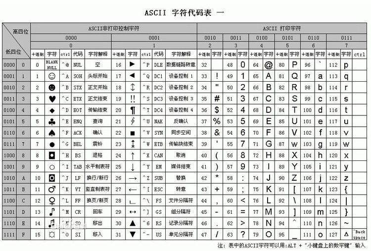

# 第三章：Java 基础语法

本章内容包括：

- 注释
- 关键字
- 字面量
- 变量
- 标识符
- 数据类型

## 1. 注释

### 1.1 什么是注释

注释是写在程序中对代码进行解释说明的文字，方便自己和其他人查看，以便理解程序。

Java 注释有三种写法：单行注释、多行注释、文档注释。

### 1.2 三种注释的写法与示例

1. 单行注释：`// 注释内容`，只能写一行。
1. 多行注释：`/* 注释内容 */`，可以写多行。
1. 文档注释：`/** 注释内容 */`，可以写多行。

完整示例：

```java
public class HelloWorld {
    public static void main(String[] args) {

        System.out.println("HelloWorld");

        System.out.println("HelloWorld");
    }
}
```

在代码中加入注释的写法：

```java
/**
 * 通过class关键字定义了一个类，类名叫做 HelloWorld
 * public 起到限制作用，限制文件名和类名保持一致
 */
```

```java
        // 这是一个单行注释，有效范围是从   // 开始到当前行结尾
```

```java
        /*
              这是一个
              多行注释
         */
```

三种注释的书写格式：

```java
// 注释内容，只能写一行
```

```java
/*
   注释内容1
   注释内容2
*/
```

```java
/**
   注释内容
   注释内容
*/
```

### 1.3 注意事项

注释内容不会参与编译和运行。

### 1.4 小结

1. 注释是什么：写在程序中对程序进行解释说明的文字。
1. Java 程序中书写注释的方式有 3 种，分别是单行注释 `//`、多行注释 `/* */`、文档注释 `/** */`。
1. 注释有什么特点：不影响程序的执行，编译后的 class 文件中已经没有注释了。

## 2. 关键字

### 2.1 什么是关键字

关键字：被 Java 赋予了特定涵义的英文单词。

例如，创建类时使用的 `class` 就是关键字：



### 2.2 注意事项

Java 中的关键字已经被赋予了特殊的涵义，不允许作为标识符使用（不能用来给类、变量、方法等起名字）。

### 2.3 常用关键字列表

常用关键字如下：

`goto`、`enum`、`double`、`long`、`import`、`extends`、`else`、`finally`、`int`、`final`、`interface`、`public`、`return`、`strictfp`、`void`、`this`、`throw`、`volatile`、`while`、`transient`、`instanceof`、`synchronized`、`protected`、`throws`、`package`、`class`、`short`、`float`、`for`、`if`、`byte`、`implements`、`private`、`static`、`native`、`default`、`super`、`switch`、`try`、`new`、`case`、`catch`、`const`、`assert`、`boolean`、`break`、`continue`、`char`、`abstract`

补充说明：其中 `goto` 和 `const` 是 Java 的保留字，目前并未在 Java 中使用。

## 3. 字面量

### 3.1 什么是字面量

字面量：就是程序中能直接书写的数据。学习这个知识的重点是：搞清楚 Java 程序中数据的书写格式。

### 3.2 常用数据的书写格式

| 常用数据 | 说明 | 程序中的写法 | 生活中的写法 |
| --- | --- | --- | --- |
| 整数 | 写法一致 | 666，-88 | 666，-88 |
| 小数 | 写法一致 | 13.14，-5.21 | 13.14，-5.21 |
| 字符串 | 程序中必须使用双引号 | “HelloWorld”，“你好” | 你好 |
| 字符 | 程序中必须使用单引号，有且仅能一个字符 | ‘A’，‘0’，‘我’ | A，0，我 |
| 布尔值 | 只有两个值：true 代表真，false 代表假 | true、false | 真、假 |
| 空值 | 一个特殊的值，空值（后面会讲解作用，暂时不管） | 值是 null | （空） |

### 3.3 代码示例

```java
public class Main {
    public static void main(String[] args) {
        System.out.println("HelloWorld");
        System.out.println(10086);
        System.out.println(180.1);
        System.out.println(男);
    }
}
```

注意：`男` 是字符，实际书写时字符必须使用单引号，即 `'男'`；课件原例中未加引号，正好对应“字符必须使用单引号”这条规则。

### 3.4 字面量练习

需求：请将自己的个人信息打印在控制台（姓名、年龄、性别、身高、婚姻状况）。



参考示例：

```java
public class Info {
    public static void main(String[] args) {
        System.out.println("张三");
        System.out.println(23);
        System.out.println('男');
        System.out.println(180.1);
        System.out.println(false);
    }
}
```

要点：姓名是字符串，用双引号；年龄是整数，直接书写；性别是字符，用单引号；身高是小数；婚姻状况用布尔值 `true` 或 `false`。

### 3.5 小结

1. 关键字指的是被 Java 赋予了特定含义的英文单词，关键字不允许作为标识符使用。
1. 字面量这个知识要求掌握的是数据在程序中的书写格式。
1. 字符和字符串的书写格式要求：字符必须用单引号围起来，有且仅能一个字符；字符串必须用双引号围起来。
1. 几个常见的特殊值的书写格式：`true`、`false`、`null`。

## 4. 变量

### 4.1 什么是变量与定义格式

变量就是内存中的一块区域，可以理解成一个盒子，用来装程序要处理的数据。


变量的定义格式：

```java
数据类型 变量名称 =  变量值;
```

格式说明：

1. 数据类型：限制盒子中只能存储某种数据形式，例如 `int`（整数类型）、`double`（小数类型）。
1. 变量名称：自己起的名字。
1. `=`：赋值。
1. 变量值：要存入的数据。

示例：

```java
int age = 18;
```

### 4.2 变量的特点

变量里装的数据是可以被替换的。

```java
int age = 18;
age = 19;

System.out.println(age);
age = age + 1;
System.out.println(age);
```

运行结果：

```text
19
20
```

运行过程：

1. `int age = 18;`：把 18 存入变量 age。
1. `age = 19;`：把 age 中的值替换成 19。
1. `System.out.println(age);`：输出 19。
1. `age = age + 1;`：取出 19，加 1 得到 20，再存入变量（替换原来的值）。
1. `System.out.println(age);`：输出 20。

盒子里装的数据依次是 18、19、20，体现了变量中的数据可以被替换。

### 4.3 变量的应用场景

变量有啥应用场景呢？写程序对数据进行处理就很方便了。

例如用变量记录考试成绩（80、87、83），成绩变化时直接替换变量里的值即可，代码更灵活、管理更方便。

### 4.4 变量的注意事项

1. 变量要先声明才能使用。
1. 变量是什么类型，就必须装什么类型的数据。
1. 变量只在自己所归属的 `{ }` 范围内有效。
1. 同一个范围内，变量的名称不能一样。
1. 变量定义的时候可以不赋初始值，但在使用时，变量里必须有值。
1. 一条语句可以定义多个变量，中间使用逗号分隔。

### 4.5 小结

1. 变量是什么，完整的定义格式：变量是内存中的一块区域，可以理解成盒子，用来记住程序要处理的数据；格式为 `数据类型 变量名称 = 数据;`。
1. 为什么要用变量，有什么好处：使用变量记录要处理的数据，编写的代码更灵活，管理代码更方便。
1. 变量有什么特点：变量里装的数据可以被替换；基于这个特点，适合用来处理不断变化的数据。

## 5. 标识符

### 5.1 什么是标识符

标识符：就是给类、方法、变量等起名字的符号。

代码示例：

```java
public class Demo {

    public static void main(String[] args) {

        int salary = 12000;
        System.out.println(salary);

        salary = 15000;
        System.out.println(salary);

        int age = 18;
        System.out.println(age);

    }
}
```

其中 `Demo`、`main`、`args`、`salary`、`age` 都是标识符，分别是类名、方法名、变量名。

### 5.2 标识符命名规则

1. 由数字、字母、下划线（_）和美元符（$）组成。
1. 不能以数字开头。
1. 不能是关键字。
1. 区分大小写（`Class` 和 `class` 不是同一个标识符）。

### 5.3 命名规则练习

判断下面哪些变量名不符合规则：

```text
bj      b2      2b
class   _2b     #itheima
ak47    Class   helloworld
```

不符合规则的变量名及原因：

1. `2b`：以数字开头。
1. `class`：是关键字。
1. `#itheima`：包含特殊符号 `#`，不属于数字、字母、下划线、美元符。

其余 `bj`、`b2`、`_2b`、`ak47`、`Class`、`helloworld` 都符合规则（`Class` 与关键字 `class` 区分大小写，因此合法）。

### 5.4 标识符命名规范（驼峰命名法）


小驼峰命名法：用于变量、方法。

1. 标识符是一个单词的时候，所有字母小写，范例 1：`name`。
1. 标识符由多个单词组成的时候，从第二个单词开始，首字母大写，范例 2：`firstName`。

大驼峰命名法：用于类。

1. 标识符是一个单词的时候，首字母大写，范例 1：`Student`。
1. 标识符由多个单词组成的时候，每个单词的首字母大写，范例 2：`GoodStudent`。

### 5.5 小结

1. 什么是标识符，需要注意什么：标识符就是名字（给类、方法、变量起名字的符号）。
1. 命名规则：由数字、字母、下划线、美元符等组成，不能以数字开头，不能用关键字，不能用特殊符号（如 `&`、`%`）。
1. 命名规范：见名知义，驼峰命名（类用大驼峰，变量和方法用小驼峰）。

## 6. 数据类型

### 6.1 数据类型的分类

Java 中的数据类型大体分为两类：

1. 基本数据类型
1. 引用数据类型

补充：引用数据类型包括类、接口、数组等，例如 `String` 就属于引用数据类型。

### 6.2 基本数据类型一览

| 数据类型 | 关键字 | 内存占用（字节） | 取值范围 |
| --- | --- | --- | --- |
| 整数 | byte | 1 | -128~127 |
|  | short | 2 | -32768~32767 |
|  | int | 4 | -2147483648~2147483647（10 位数） |
|  | long | 8 | -9223372036854775808 ~ 9223372036854775807（19 位数） |
| 浮点数 | float | 4 | 1.401298e-45 到 3.402823e+38 |
|  | double | 8 | 4.9000000e-324 到 1.797693e+308 |
| 字符 | char | 2 | 0~65535 |
| 布尔 | boolean | 1 | true、false |

说明：`e+38` 表示乘以 10 的 38 次方；`e-45` 表示乘以 10 的负 45 次方。

### 6.3 默认类型

所有整数默认是 `int`，所有小数默认是 `double`。

```java
public class Test {
    public static void main(String[] args) {
        System.out.println(10);
        System.out.println(12.3);
    }
}
```

代码中的 `10` 默认是 `int` 类型，`12.3` 默认是 `double` 类型。

补充：定义 `long` 类型变量时，超出 `int` 范围的值需要加 `L` 后缀，例如 `long l = 10000000000L;`；定义 `float` 类型变量时需要加 `F` 后缀。

### 6.4 编码表（ASCII）

编码表是计算机中字节到字符的一套对应关系。

ASCII 码表：American Standard Code for Information Interchange，美国信息交换标准代码。



补充：字符在计算机底层是按整数存储的，例如 `'A'` 对应 65，`'a'` 对应 97，`'0'` 对应 48，这也是 char 类型变量可以接收整数类型数据的原因。

### 6.5 练习：用变量保存个人信息

需求：请将自己的个人信息，使用变量保存，并展示在控制台（姓名、年龄、性别、身高、婚姻状况）。

参考示例：

```java
public class Info {
    public static void main(String[] args) {
        String name = "张三";
        int age = 23;
        char gender = '男';
        double height = 180.1;
        boolean married = false;

        System.out.println(name);
        System.out.println(age);
        System.out.println(gender);
        System.out.println(height);
        System.out.println(married);
    }
}
```

要点：姓名用 `String`，年龄用 `int`，性别用 `char`，身高用 `double`，婚姻状况用 `boolean`。

### 6.6 小结

1. Java 中的数据类型大体分为两类：基本数据类型、引用数据类型。
1. 整数类型首选 `int`，小数类型首选 `double`。
1. 定义字符串类型的变量，类型选 `String`。
1. 所有整数默认是 `int`，所有小数默认是 `double`。
1. `char` 类型的变量可以接收整数类型的数据吗？可以。字符在底层按编码表以整数存储，例如 `char c = 97;` 表示字符 `'a'`。

