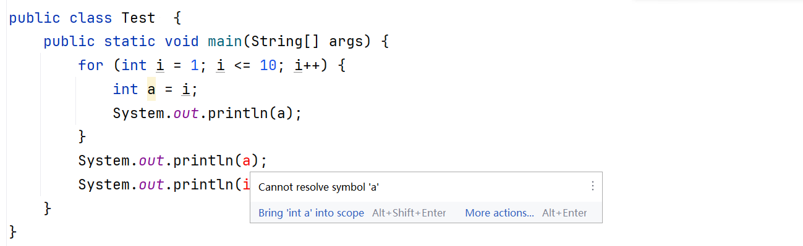

# 一、流程控制语句

所谓的流程控制语句就是：控制程序代码执行顺序

程序中最经典的三种执行顺序如下：


- 顺序结构：自上而下的执行代码，遇到了异常就会停止后面代码的执行
- 分支结构：根据条件，选择对应代码执行
- 循环结构：控制某段代码重复执行


# 二、顺序结构

顺序结构是程序默认的执行方式：代码从上到下依次执行，没有任何跳转或判断。

是所有程序的基础，大多数简单代码都遵循此结构。

```Java
public class OrderDemo {
    public static void main(String[] args) {
        int a = 10;  // 第一步执行
        int b = 20;  // 第二步执行
        int sum = a + b;  // 第三步执行
        System.out.println(sum);  // 第四步执行（输出30）
    }
}
```

# 三、分支结构

分支结构用于根据条件判断执行不同的代码块，主要有`if-else`和`switch-case`两种。

## 1.if-else 结构

根据判断条件（布尔表达式）的结果（`true`/`false`）执行不同分支


### 1.1.单分支if

语法格式

```java
if (条件表达式) {
    // 条件为true时执行的代码块
}
```

执行流程：首先判断条件表达式的结果，如果为true执行语句体，为 false 就不执行语句体。

```java
public class IfDemo1 {
    public static void main(String[] args) {
        double score = 85.5;  
        
        // 单分支：仅当分数≥60时就会提示成绩及格
        if (score >= 60) {
            System.out.println("恭喜，成绩及格了！");
        }
        System.out.println("程序结束了！");
    }
}
```

注意事项：if 语句中，如果大括号控制的只有一行代码，则大括号可以省略不写（但不推荐）。

```java
public class IfDemo1 {
    public static void main(String[] args) {
        double score = 85.5;  
        
        // 单分支：仅当分数≥60时就会提示成绩及格
		if (score >= 60) System.out.println("恭喜，成绩及格了！");
        System.out.println("程序结束了！");
    }
}
```

### 1.2.双分支if-else

语法格式

```java
if (条件表达式) {
    // 条件为true时执行的代码块1
} else {
    // 否则执行的代码块2
}
```

执行流程：判断条件为true时执行代码块1,否则执行else的代码块2

```java
public class IfDemo1 {
    public static void main(String[] args) {
        double score = 85.5;  
        
        // 单分支：仅当分数≥60时执行提示
        if (score >= 60) {
            System.out.println("恭喜，成绩及格了！");
        } else {
            System.out.println("没及格，好好努力吧~~~");
        }
        
        System.out.println("程序结束了！");
    }
}
```

### 1.3.多分支if-else if-else

语法格式

```java
if (条件1) {
    // 条件1为true时执行
} else if (条件2) {
    // 条件1为false，条件2为true时执行
} else if (条件3) {
    // 条件2为false，条件3为true时执行
}
...
else {
    // 所有条件都为false时执行（可选）
}
```

执行流程

- 先判断条件1的值，如果为true则执行语句体1，分支结束；如果为false则判断条件2的值
- 如果值为true就执行语句体2，分支结束；如果为false则判断条件3的值
- ...
- 如果没有任何条件为true，就执行else分支的语句体n+1。

```java
//判断一个int类型的数，是整数、负数还是零（可以更改为用户输入一个整数造作判断）
int num = 5;
if (num > 0) {
    System.out.println("正数");
} else if (num < 0) {
    System.out.println("负数");
} else {
    System.out.println("零"); 
}
```

### 1.4.案例

**案例1-成绩判断**

需求：键盘录入考试成绩，根据成绩所在的区间，程序打印出不同的奖励机制


```java
System.out.println("山地自行车一辆");   
System.out.println("游乐场玩一次");
System.out.println("变形金刚玩具一个");   
System.out.println("胖揍一顿");
```

```java 
分析：
	.使用Scanner录入用户输入成绩，并使用变量score接受
	·使用 if...else if...else 组织程序逻辑
```

**案例2：密码校验**

需求: 键盘录入用户名和用户密码, 如果用户名为”小哈“，密码为 ”123456“, 程序输出用户登录成功，否则输出密码或者用户名有误

```java 
分析：
	.使用Scanner录入用户输入的密码，并使用变量接受
	.使用 if...else 组织程序逻辑
```

注意：密码正常应该使用字符串字符串的比较比较特殊目前暂不介绍。

**案例3：是否为会员**

用户键盘输入数字，如果是1就是VIP会员，是2就是非VIP会员，其他数字则提醒用户输入错误

```
分析：
	.使用Scanner录入用户输入的命令，并使用变量接受
	.使用 if...else if...else 组织程序逻辑
```

### 1.5.面试点

连续写多个if和  if-esle if-else 区别是什么？

- 连续写多个if，所有的if语句都要判断一遍
- if-esle if-else :只需要匹配一个true，后面的条件不在进行判断，效率会更高

## 2.switch-case分支结构

用于多值匹配的分支选择，根据表达式的值匹配`case`后的常量，执行对应代码块。

### 2.1.语法格式

```java
// 表达式类型：int、char、String（Java 7+）、enum等
switch (表达式) {  
    case 值1:
        // 表达式等于常量1时执行
        break;  // 跳出switch（不写会"穿透"到下一个case）
    case 值2:
        // 表达式等于常量2时执行
        break;
    ...
    default:  // 所有case都不匹配时执行（可选）
        // 执行语句
        break;
}
```

### 2.2.执行流程

先执行表达式的值，再拿着这个值去与case后的值进行匹配。

与哪个case后的值匹配为true就执行哪个case块的代码，遇到break就跳出switch分支。

如果全部case后的值与之匹配都是false，则执行default块的代码。

### 2.3.案例

用户输入 1-7 的整数，程序输出对应的星期几（1 = 周一，2 = 周二 .......7 = 周日），输入其他数字则提示错误。

```java
1.周一：埋头苦干，解决bug              
2.周二：请求大牛程序员帮忙  
3.周三：今晚啤酒、龙虾、小烧烤  
4.周四：主动帮助新来的女程序解决bug
5.周五：今晚吃鸡          
6.周六：与王婆介绍的小芳相亲
7.周日：郁郁寡欢、准备上班。
```

```java
Scanner sc = new Scanner(System.in);
System.out.println("请输入1~7之间的任意命令");
int num = sc.nextInt();
switch (num) {
    case 1:
        System.out.println("周一：埋头苦干，解决bug");
        break;
    case 2:
        System.out.println("周二：请求大牛程序员帮忙 ");
        break;
    case 3:
        System.out.println("周三：埋头苦干，解决bug");
        break;
    case 4:
        System.out.println("周四：今晚啤酒、龙虾、小烧烤 ");
        break;
    case 5:
        System.out.println("周五：主动帮助新来的女程序解决bug!");
        break;
    case 6:
        System.out.println("周六：相亲");
        break;
    case 7:
        System.out.println("周日：郁郁寡欢、准备上班。");
        break;
    default:
        System.out.println("你输入的命令不符合要求，请输入1~7之间的数字！");
        break;
}
```

### 2.4.注意事项

表达式类型只能是byte、short、int、char，JDK5开始支持枚举，JDK7开始支持String、不支持double、float、long。

case给出的值不允许重复，且只能是字面量，不能是变量。

正常使用switch的时候，不要忘记写break，否则会出现穿透现象。

### 2.5.switch穿透性

**概述**

当存在多个case分支的代码相同时，可以把相同的代码放到一个case块中，其他的case块都通过穿透性穿透到该case块执行代码即可，这样可以简化代码。

**案例**

用户输入月份（如 “一月”“二月”），程序输出对应的季节（春季：3-5 月，夏季：6-8 月，秋季：9-11 月，冬季：12-2 月）。

```java
import java.util.Scanner;

public class SwitchSeasonDemo {
    public static void main(String[] args) {
        //引入扫描器
        Scanner sc = new Scanner(System.in);
        System.out.print("请输入月份（如：一月、二月）：");
         // 获取用户输入的字符串
        String month = sc.next(); 

        // switch-case判断字符串对应的季节
        switch (month) {
            case "三月":
            case "四月":
            case "五月":  
           // 多个case可共用一个执行体（利用穿透性）
                System.out.println(month + "是春季");
                break;
            case "六月":
            case "七月":
            case "八月":
                System.out.println(month + "是夏季");
                break;
            case "九月":
            case "十月":
            case "十一月":
                System.out.println(month + "是秋季");
                break;
            case "十二月":
            case "一月":
            case "二月":
                System.out.println(month + "是冬季");
                break;
            default:
                System.out.println("输入错误！请输入正确的月份（如：一月）");
                break;
        }
    }
}
```

# 三、循环结构

循环结构用于重复执行某段代码，直到满足终止条件。

Java 提供三种循环：`for`、`while`、`do-while`。

## 1.for 循环

适合已知循环次数的场景，结构清晰


### 1.1.语法格式

```java
for (初始化表达式/变量; 循环条件; 迭代语句/步长/步进) {
    // 循环体（条件为true时执行）
}
```

1.初始化表达式：声明一个「循环计数器变量」，并赋初始值，只执行 1 次。

- 作用：定义循环的起点，比如 `int i = 0` 表示循环从 0 开始
- 变量名：行业通用`i`、`j`、`k`（index 的缩写），也可以自定义名称

2.条件判断表达式：必须是布尔值（true/false），循环的「执行开关」。

- 作用：判断是否继续执行循环体，满足条件 (true) 就执行，不满足 (false) 就跳出循环

3.迭代语句（步进表达式 / 更新表达式）：循环体执行完毕后，必然执行的代码。

- 作用：更新计数器变量的值，控制循环次数（要么 +、要么 -），比如 `i++`(i 自增 1)、`i+=2`(i 自增 2)、`i--`(i 自减 1)

4.循环体：被`{}`包裹的代码，循环的核心业务逻辑。

- 注意：如果循环体只有一行代码，`{}`可以省略；如果是多行代码，`{}`绝对不能省（推荐永远写 {}，规范且避免 bug）

### 1.2.执行流程

初始化 → 判断条件（true 则执行循环体） → 迭代 → 重复判断...


```java
// 输出3次HelloWorld
for (int i = 0; i < 3; i++) {
    System.out.println("Hello World");
}
```

> 1. 初始化 int = 0  ---> 只执行1次
> 2. 判断 0 < 3 ---> true ---> 打印helloWorld 
> 3. 迭代自增 加1 （i++） ---> i变成  1
> 4. 判断 1 < 3 ---> true ---> 打印helloWorld 
> 5. 迭代自增 加1 （i++） ---> i变成  2
> 6. 判断 2 < 3 ---> true ---> 打印helloWorld 
> 7. 迭代自增 加1 （i++） ---> i变成  3
> 8. 判断 3 < 3 ---> false ---> 结束循环
>

### 1.3.案例

**案例1：求和**

需求：求1-5之间的数据和，并把求和结果在控制台输出

**案例2：求奇数的和**

需求：求1-10之间的奇数和，并把求和结果在控制台输出。

**案例3：模拟计时器**

需求：请设计一个方法timer，使用循环在控制台，打印以下效果

```
------1~3------
1
2
3
------3~1------
3
2
1
------10秒倒计时下课------
倒计时：10秒
倒计时：9秒
倒计时：8秒
倒计时：7秒
倒计时：6秒
倒计时：5秒
倒计时：4秒
倒计时：3秒
倒计时：2秒
倒计时：1秒
下课啦~~~
```

**案例4：打印水鲜花数**

需求：设计一个方法printNarcissisticNumber,在控制台输出所有的“水仙花数”，并且计算个数；

- 水仙花数：一个三位数，其各位数字的立方和等于该数本身，如 153=1³+5³+3³）。
- 示例：153、370、371、407

> 提示：
>
> - 循环变量 `num` 从 100 开始，到 999 结束（`num <= 999`）；
> - 每次循环中，拆分 `num` 的百位（`num/100`）、十位（`num/10%10`）、个位（`num%10`）；
> - 计算立方和，若等于 `num` 则输出。

输出结果如下

```
153
370
371
407
100~99之间的水仙花数有：4个
```

```java
public class Test {
    public static void main(String[] args) {
        printNarcissisticNumber();
    }

    private static void printNarcissisticNumber() {
        //定义计数器count
        int count = 0;
        //循环100~999的数字查找满足 水仙花条件的数
        for (int i = 100; i <= 999; i++) {
            //求出百十个位数
            int bai = i / 100;
            int shi = i / 10 % 10;
            int ge = i % 10;
            //判断百十个位数的立方相加是否等于i自己
            int sum = bai * bai * bai
                    + shi * shi * shi
                    + ge * ge * ge;
            if (sum == i) {
                System.out.println(i);
                count++;
            }
        }
    }
}
```

### 1.4.注意事项

for循环  中定义的变量，只能在当前for循环{}中使用，在整个循环结束后，都会从内存中释放，不能再for循环以外使用



### 1.5.循环嵌套

**定义**

所谓的循环嵌套，指的是 在一个循环的【循环体】中，完整的写了另一个循环。

- 外层写的这个循环 → 叫做 外层 for 循环
- 内层写的这个循环 → 叫做 内层 for 循环

**特点**

- 核心特点（重中之重）： for 循环嵌套，本质就是 外循环控制行数，内循环控制列数
- 嵌套循环不止两层，还可以多层嵌套（三层 / 四层），但开发中最多用两层，三层及以上极少用（效率低）

**语法格式**

```java
// 外层for循环
for (①初始化外变量; ②外循环条件; ③外循环迭代) {
    // 外层循环体
    
    // 内层for循环（写在外层循环体中，是外层循环体的一部分）
    for (①初始化内变量; ②内循环条件; ③内循环迭代) {
        // 内层循环体：真正要重复执行的核心代码
    }
}
```

 核心执行规律：外循环走 1 次，内循环跑完整 1 圈（执行全部次数）

**完整执行步骤拆解**

1. 执行 外层循环 的「初始化表达式」 → 只执行1 次；
2. 执行 外层循环 的「条件判断」，结果是`false`则整个嵌套循环结束；结果是`true`，则执行外层循环体；
3. 进入外层循环体后，执行 内层循环 的完整流程：初始化→判断→循环体→迭代变量，直到内层循环的条件为 false，内层循环彻底结束；
4. 内层循环结束后，执行 外层循环 的「迭代表达式」，更新外层循环变量；
5. 回到步骤 2，重新判断外层循环条件，重复执行；
6. 直到外层循环条件为`false`，整个嵌套循环全部结束。

**案例练习**

案例 1：打印矩形

需求：在控制台打印一个 `3行5列` 的星号矩形，效果如下：

```
*
*
*
```

```java
public class Test1 {
    public static void main(String[] args) {
        // 外层循环：控制行数，要打印3行 → 循环3次
        for (int i = 1; i <= 3; i++) {
            // 内层循环：控制每行的列数，每行打印5个星号 → 循环5次
            for (int j = 1; j <= 5; j++) {
                System.out.print("*"); // print 不换行，核心！
            }
            System.out.println(); // 内层循环结束后，换行，开始下一行
        }
    }
}
```

```java
//执行流程
1.外层初始化：`i=1` → 判断`1<=3` → true；

2.执行内层循环：`j=1→5`，打印 5 个`*` → 内层结束，执行换行；

3.外层步进：`i++` → `i=2` → 判断`2<=3` → true；

4.执行内层循环：`j=1→5`，打印 5 个`*` → 内层结束，执行换行；

5.外层步进：`i++` → `i=3` → 判断`3<=3` → true；

6.执行内层循环：`j=1→5`，打印 5 个`*` → 内层结束，执行换行；

7.外层步进：`i++` → `i=4` → 判断`4<=3` → false；

8.整个嵌套循环结束。
```

案例 2：打印直角三角形

需求：打印 `5行` 的直角三角形星号，效果如下：

```
*

*

*
```

核心规律

这个案例和矩形的区别：每行打印的星号数量，和当前的行数是一致的

- 第 1 行 → 打印 1 个星号
- 第 2 行 → 打印 2 个星号
- 第 n 行 → 打印 n 个星号
- ......

```java
public class Test1 {
    public static void main(String[] args) {
        // 外层循环：控制行数，打印3行
        for (int i = 1; i <= 3; i++) {
            // 内层循环：控制列数，每行打印i个星号（关键：j<=i）
            for (int j = 1; j <= i; j++) {
                System.out.print("*");
            }
            System.out.println(); // 换行
        }
    }
}
```

## 2.while循环

适合循环次数不确定的场景，先判断条件，条件为`true`才执行循环体


### 2.1.语法格式

```java
初始化变量;
while (循环条件) {
    循环体：条件为 true 时执行的代码块;
    迭代语句;
}
```

### 2.2.执行流程

`while` 循环的执行步骤可以概括为 “判断→执行→迭代自增→再判断”，具体流程如下：

```java 
int i = 0;
while (i < 3) {
	System.out.println("Hello World");
    i++;
 }
System.out.println("循环结束！");
```

> 1. 循环一开始，执行int i = 0 一次。
> 2. 此时  i=0 ，接着计算机执行循环条件语句：0 < 3 返回true , 计算机就进到循环体中执行，输出 ：helloWorld ，然后执行迭代语句i++。
> 3. 此时  i=1 ，接着计算机执行循环条件语句：1 < 3 返回true , 计算机就进到循环体中执行，输出 ：helloWorld ，然后执行迭代语句i++。
> 4. 此时  i=2 ，接着计算机执行循环条件语句：2 < 3 返回true , 计算机就进到循环体中执行，输出 ：helloWorld ，然后执行迭代语句i++。
> 5. 此时  i=3 ，然后判断循环条件：3 < 3 返回false, 循环立即结束！！随后输出“循环结束”；
>

### 2.3.案例

**案例1：累加求和**

需求：累加求和 —— 计算 1 到 100 的和

**案例2：水仙花数**

需求：在控制台输出所有的“水仙花数”，并且计算个数；

- 水仙花数：一个三位数，其各位数字的立方和等于该数本身，如 153=1³+5³+3³）。
- 示例：153、370、371、407

> 提示：
>
> - 循环变量 `num` 从 100 开始，到 999 结束（`num <= 999`）；
> - 每次循环中，拆分 `num` 的百位（`num/100`）、十位（`num/10%10`）、个位（`num%10`）；
> - 计算立方和，若等于 `num` 则输出。

输出结果如下：

```te
153
370
371
407
100~99之间的水仙花数有：4个
```

参考代码（先自己写哦）

```java
int count = 0;  //计数器
int num = 100;
while (num <= 999) {
    //求出百十个位数
    int bai = num / 100;
    int shi = num / 10 % 10;
    int ge = num % 10;
    //判断百十个位数的立方相加是否等于num自己
    int sum = bai * bai * bai
            + shi * shi * shi
            + ge * ge * ge;
    if (sum == num) {
        System.out.println(num);
        count++;
    }
    //迭代自增继续下一次循环
    num++;
}
System.out.println("100~99之间的水仙花数有：" + count + "个");
```

**案例3：折纸叠到珠穆朗玛峰的高度**

需求：世界最高山峰珠穆朗玛峰高度是：8848.86米=8848860毫米，假如我有一张足够大的纸，它的厚度是0.1毫米。请问：该纸张折叠多少次，可以折成珠穆朗玛峰的高度？

```java
//分析
一张纸的厚度：通常取 0.1 毫米（现实中普通 A4 纸厚度约 0.07~0.1 毫米，方便计算取 0.1）
珠穆朗玛峰的高度：8848.86 米（最新官方数据）
核心规律：每对折 1 次，纸张的厚度就 ×2（对折 n 次，厚度 = 初始厚度 × 2ⁿ）
单位统一：先把单位转成一致，避免计算错误
0.1 毫米 = 0.0001 米
珠峰高度 = 8848.86 米
```

```java 
public static void main(String[] args) {
    // 定义变量并统一单位
    double paperThickness = 0.0001; //初始厚度 0.1毫米 = 0.0001米
    double zhuFnengHeight = 8848.86;    //珠峰高度   单位是 米
    int count = 0;    //对折次数计数器

    while (paperThickness < zhuFnengHeight) {
        //对折
        paperThickness *= 2;
        //统计次数
        count++;
    }
    // 3. 输出结果
    System.out.println("对折次数：" + count + " 次");
    System.out.println("此时纸张厚度：" + paperThickness + " 米");
    System.out.println("超过珠峰高度：" + (paperThickness - zhuFnengHeight) + " 米");
}
```

## 3.do-while循环

`do-while` 循环的核心特点是 “先执行循环体，后判断循环条件”，因此 循环体至少会执行一次。这一特性让它在 “循环体必须先执行一次” 的场景中非常实用（如用户输入验证、菜单交互等）。

### 3.1.语法格式

```java
初始化语句;
do {
    循环体：需要重复执行的代码块;
    迭代语句;
} while (循环条件);  // 注意末尾的分号！
```

### 3.2.执行流程

1.首先执行 `do` 后的循环体（首次执行，不判断条件）

2.执行迭代语句进行自增操作

3.拿新的迭代值和循环条件进行判断。

- 如果是true就继续执行循环体
- 如果是false就立即停止循环

```java 
//以下代码会打印一句   “你好AI智能体开发~~~”
public static void main(String[] args) {
    int i = 5;
    do {
        System.out.println("你好AI智能体开发~~~");
        
    } while (i <= 5);
}
```

## 4.三种循环的区别

1.for循环 和 while循环（先判断后执行）; do...while （先执行后判断）

2.for循环和while循环的执行流程是一模一样的，功能上无区别，for能做的while也能做，反之亦然。

3.使用规范：如果已知循环次数建议使用for循环，如果不清楚要循环多少次建议使用while循环。

4.其他区别：for循环中，控制循环的变量只在循环中使用。while循环中，控制循环的变量在循环后还可以继续使用。

```java
    int num = 0;
    while(num<3){
        System.out.println(num);
        num++;
    }
    System.out.println(num+3); //6

    for (int i = 0; i < 3; i++) {
        System.out.println(i);
    }
    System.out.println(i); //报错
```

## 5.跳转关键字

在 Java 中，`break`、`continue`都是用于改变程序执行流程的跳转语句，但它们的作用场景和效果有本质区别。

### 5.1.概述

1.break   :  跳出并结束当前所在循环的执行或者switch判断语句。

- 有10个大枣，当我吃到了3个时候，发现枣里面有虫子，我就将剩余的枣全部放弃不吃了；

2.continue:  用于跳出当前循环的当次执行，直接进入循环的下一次执行

- 有10个大枣，当我吃到了3个时候，发现枣里面有虫子，丢掉当前这个，继续吃其他的

### 5.2.注意事项

break : 只能用于结束所在循环, 或者结束所在switch分支的执行。

continue : 只能在循环中进行使用.

### 5.4.break

核心作用：立即终止当前所在的循环（for/while/do-while） 或switch-case 结构，跳出后执行该结构后面的代码。

示例：打印1~10的数字，如果打印到6就停止其他数的打印

```java
    public static void main(String[] args) {
        for (int i = 1; i <= 10; i++) {
            System.out.println("检查数字：" + i);
            if (i  == 6) { // 找到6
                System.out.println("找到目标~~~~~~~~："+i);
                break; // 跳出当前for循环
            }
        }
        System.out.println("循环结束");
    }
```

```
检查数字：1
检查数字：2
检查数字：3
检查数字：4
检查数字：5
检查数字：6
找到目标~~~~~~~~：6
循环结束
```

### 5.5.continue

核心作用：仅跳过当前循环迭代的剩余代码，直接进入下一次循环的判断（不会终止整个循环）。

示例：打印1~10的数字，只打印奇数

```java
public static void main(String[] args) {
    for (int i = 1; i <= 10; i++) {
        if (i % 2 == 0) {
            continue;
        }
        System.out.println(i);
    }
    System.out.println("循环结束");
}
```

执行结果

```
1
3
5
7
9
循环结束
```

## 6.return关键词

### 6.1.定义

在 Java 中，`return`关键字是用于控制方法执行流程的核心关键字，主要作用是结束当前方法的执行，并（可选地）向方法调用者返回一个值。

终止方法执行：

- 一旦执行到`return`语句，当前方法会立即停止，后续代码不再执

返回值（可选）：

- 如果方法声明了返回类型（非`void`），`return`必须携带一个与返回类型匹配的值；
- 如果方法是`void`（无返回值），`return`可以不带值（仅用于终止方法）。

### 6.2.案例

```java
public class Test {
    public static void main(String[] args) {
        chu(6,2);
        chu(6,0);
    }

    public static void chu(int a, int b) {
        //除法不允许除数为0
        if (b == 0) {
            System.out.println("除数不能为0，请确认！");
            return; //结束方法 不执行后面的代码
        }
        int res = a / b;
        System.out.println(a + " ÷ " + b + " = " + res);
    }

}
```

## 7.1.死循环

可以一直执行下去的一种循环，如果没有干预不会停下来。


```java
for ( ; ; ) {
	System.out.println("Hello World1");
}
```

```java
// 经典写法
while (true) {
    System.out.println("Hello World2");
}
```

```java
do {
    System.out.println("Hello World3");
} while (true);
```

# 四、随机数Random类

Random 类是 Java 中用于生成 伪随机数 的工具类（位于 java.util 包下），相比 Math.random() 更灵活，支持生成多种类型的随机数（整数、小数、布尔值等）。

## 1.基本用法

### 1.1.导入类

使用 `Random` 前需导入

```java
import java.util.Random;
```

### 1.2.创建Random对象

```java
Random random = new Random();
```

## 2.生成0~指定整数范围类的随机数

方法：nextInt(n) 

- 生成 [0, n) 范围内的随机整数（含 0，不含 n）
- `nextInt(10)` → 0~9 之间的整数

```java
Random rand = new Random();
int x = rand.nextInt(10);
System.out.println(x);
```

## 3.Random生成指定区间随机数

### 3.1.公式

求[min, max] 范围内的数（适用于任意整数范围），公式为：

```java
random.nextInt(max - min + 1) + min
```

备注：random是创建Random对象的时候我们自己命名的对象名；

### 3.2.案例1

打印5~15之间的随机数


```java
Random rand = new Random();
int x = rand.nextInt(15 - 5 + 1) + 5;
System.out.println(x);
```

### 3.3.案例2

模拟一个点名系统，一个班级有5个学生，程序每执行一次就会随机选择一名学生回答问题：

提示：

1. 使用多个变量存储班级学生姓名
2. 创建Random对象，随机获取1~5之间的随机数
3. 使用switch-case进行对比，比如随机数是1就打印 name1+"：回答问题"，随机数是3就打印name3+"：回答问题"

```java
 //学员姓名信息存储
 String name1 = "唐僧";
 String name2 = "孙悟空";
 String name3 = "猪八戒";
 String name4 = "沙和尚";
 String name5 = "哪吒";
 //实现点名
 Random random = new Random();
 //获取1-5 之间的随机数
 int num = random.nextInt(5 - 1 + 1) + 1;
 System.out.println(num);
 //拿得到的随机数在switch中进行对比
 switch (num) {
     case 1:
         System.out.println(name1 + "：回答问题");
         break;
     case 2:
         System.out.println(name2 + "：回答问题");
         break;
     case 3:
         System.out.println(name3 + "：回答问题");
         break;
     case 4:
         System.out.println(name4 + "：回答问题");
         break;
     case 5:
         System.out.println(name5 + "：回答问题");
         break;
 }
```

## 4.随机布尔值

### 4.1.方法：nextBoolean()

```java 
 boolean isFlag = rand.nextBoolean();
```

### 4.2.案例

模拟抛硬币

```java
Random rand = new Random();
boolean isFlag = rand.nextBoolean();
if (isFlag) {
    System.out.println("抛硬币结果：正面");
} else {
    System.out.println("抛硬币结果：反面");
}
```
