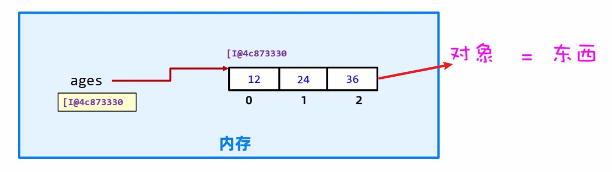
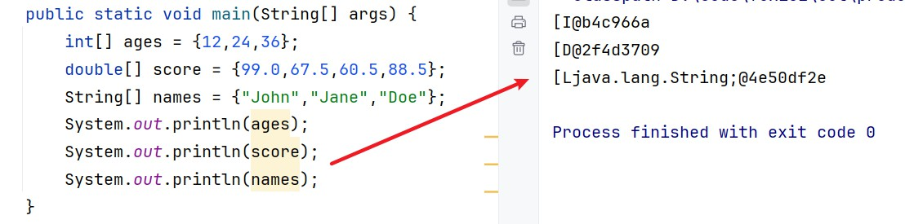
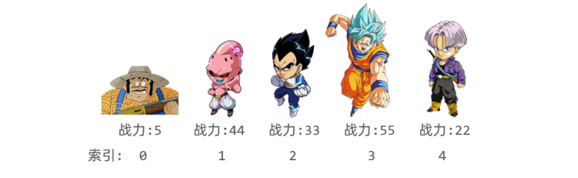
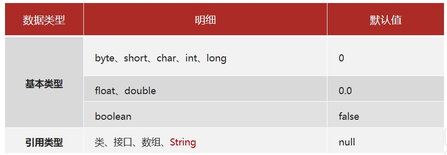
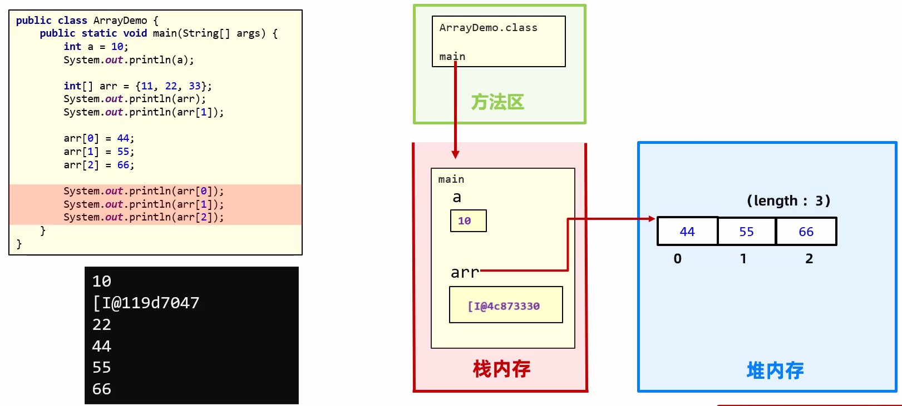
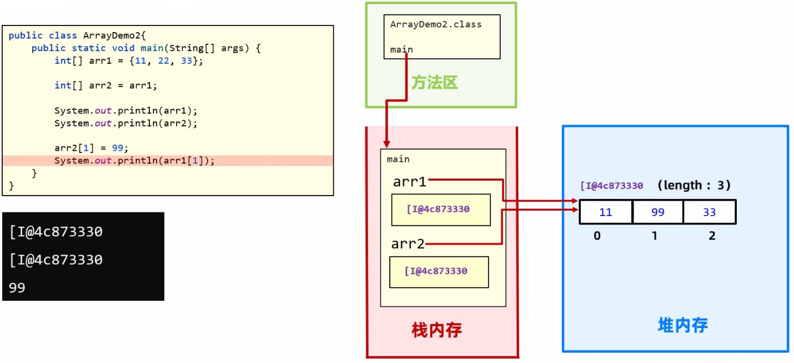
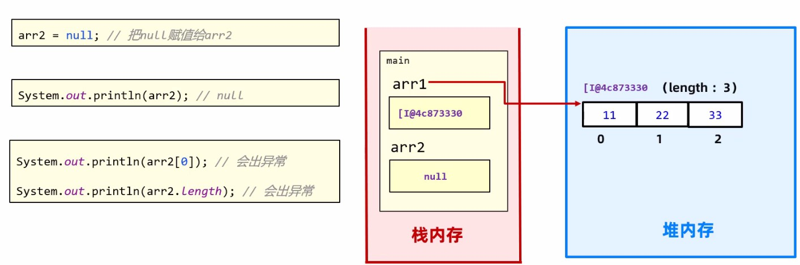
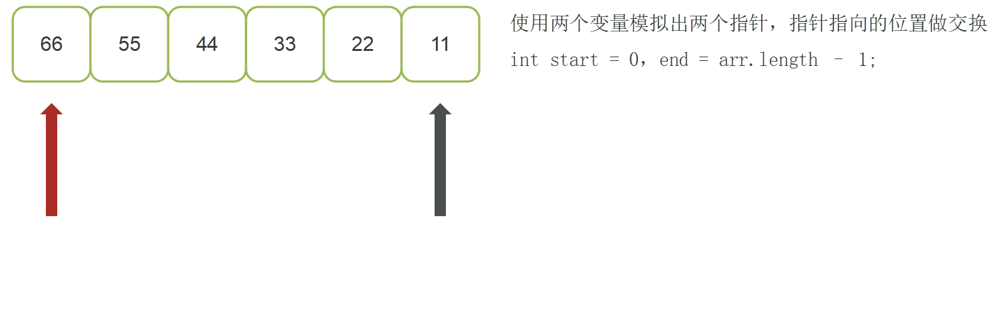
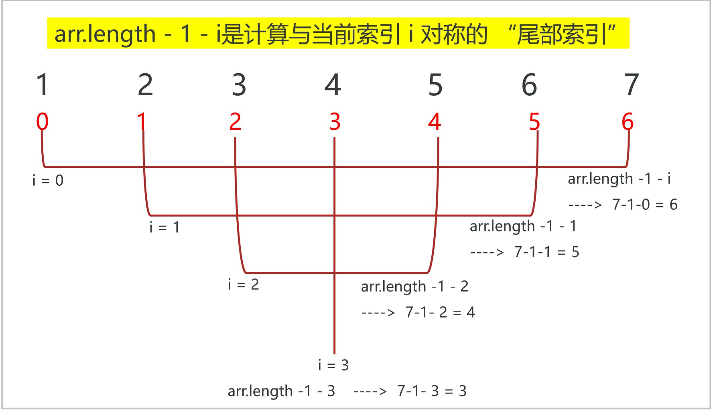

# 一、认识数组

## 1.什么是数组

在 Java 中，**数组（Array）** 是一种用于存储**相同类型数据**的容器，它是一种**引用类型**，长度固定（一旦创建，长度不可改变）。

数组可以存储基本类型（如`int`、`char`）或引用类型（如`String`、对象）的数据。

<b style="color:red;">理解为：数组就是一个容器，用来存一批同种类型的数据。</b>

```java
//20, 10, 80, 60, 90
  int[] arr = {20, 10, 80, 60, 90};
//牛二, 西门, 全蛋
  String[] names = {"牛二", "西门", "全蛋"};
```

## 2.为什么使用数组

### 2.1.问题引入

之前我们使用变量和随机数Random配合switch完成了一个点名功能，代码如下：

```java
 //学员姓名信息存储
 String name1 = "唐僧";
 String name2 = "孙悟空";
 String name3 = "猪八戒";
 String name4 = "沙和尚";
 String name5 = "哪吒";
 //实现点名
 Random random = new Random();
 //获取1-5 之间的随机数
 int num = random.nextInt(5 - 1 + 1) + 1;
 System.out.println(num);
 switch (num) {
     case 1:
         System.out.println(name1 + "：回答问题");
         break;
     case 2:
         System.out.println(name2 + "：回答问题");
         break;
     case 3:
         System.out.println(name3 + "：回答问题");
         break;
     case 4:
         System.out.println(name4 + "：回答问题");
         break;
     case 5:
         System.out.println(name5 + "：回答问题");
         break;
 }
```

这种写法存储学生的姓名，我们需要定义多（5）个变量，新增了学生需要在定义变量，导致**代码冗余、难以维护**的问题。

<b style="color:red">数组可将这些数据集中管理，大幅简化代码,让程序的逻辑更清晰。</b>

### 2.2数组优化案例

使用数组将学生名字统一存储，方便管理，代码也简洁，逻辑更清楚

```java
String[] studentNames = {"唐僧","孙悟空","猪八戒","沙和尚","哪吒","白素贞"};
Random random = new Random();
int index = random.nextInt(studentNames.length);
System.out.println(studentNames[index] + "：出来回答问题");
```

# 二、数组的定义

数组的定义分为静态初始化和动态初始化两种

## 1.静态初始化数组

直接指定数组中的所有元素，由系统自动计算长度。

也就是：**定义数组的时候直接给数组赋值**。

```java
// 语法：数组类型[] 数组名 = new 数组类型[]{元素1, 元素2, ...};
  int[] ages = new int[]{12, 24, 36}
  String[] fruits = String[]{"苹果", "香蕉", "橙子"};

// 简化写法：数组类型[] 数组名 = {元素1, 元素2, ...};
  int[] ages = {12, 24, 36};
  String[] fruits = {"苹果", "香蕉", "橙子"};
```

注意

- “数据类型[] 数组名”也可写成 “数据类型 数组名[] ”。
-  什么类型的数组只能存放什么类型的数据。

## 2.数组在计算机中的基本原理



1.我们创建了一个数组，int[] ages = {12, 24, 36};此时就会：

2.在计算内存中会新建一个ages的变量空间，一开始是空的；

3.随后会在内存中新建一块新的空间区域，我们称之为数组对象（连续空间）有一个访问地址，在里面可以存储我们的数组值，每一个值都有一个对应的编号（称之为索引，从0开始计算）

4.数组对象会把自己的地址交给空的变量空间ages，随后ages就会指向该地址访问数组数据；



注意：因为数组变量名中存储的是数组在内存中的地址，所以数组是一种引用数据类型。

# 三、访问数组

## 1.基本访问数组

数组元素通过**索引（index）** 访问，索引从`0`开始。

```java 
数组名[索引值]
```

```java
int[] ages = {12,24,36};
//访问数组
System.out.println(ages[0]);
System.out.println(ages[1]);
System.out.println(ages[2]);
String[] names = {"小张","小明","小花"};
//访问数组
System.out.println(names[0]);
System.out.println(names[1]);
System.out.println(names[2]);
```

## 2.获取数组的长度

数组有一个内置的`length`属性，用于获取数组长度（元素个数）。

语法格式

```java 
数组名.length
```

```java 
int[] nums = {1, 2, 3};
System.out.println(nums.length); // 输出：3（长度为3）
```

## 3.数组的最大索引值

数组的最大索引为 `数组长度-1`,前提条件是数组的元素个数大于0

语法格式

```java 
数组名.length - 1;
```

如果访问数组时，使用的索引超过了数组最大索引会出什么问题？

```java
String[] names = {"小张","小明","小花"};
//访问数组
System.out.println(names[0]);
System.out.println(names[1]);
System.out.println(names[2]);
System.out.println(names[3]); //Index 3 out of bounds for length 3
```

执行程序时会出bug，出现一个索引越界的异常提示（ArrayIndexOutOfBoundsException）。


# 四、数组遍历

## 1.概述

如果需要将数组的值一个一个访问使用就需要遍历

遍历数组即逐个访问所有元素，通过**for 循环**使用索引值挨个访问遍历数组。

遍历数组可以用来求和、元素搜索、找最大值、最小值等


```java
int[] scores = {85, 92, 78};
// 遍历并打印所有元素
for (int i = 0; i < scores.length; i++) { 
    // i从0到length-1
    System.out.println(scores[i]);
}
```

## 2.案例-数组求和

需求：某部门5名员工的销售额分别是：16、26、36、6、100，请计算出他们部门的总销售额。

分析：
把这5个数据拿到程序中去 ---> 使用数组

```java
int[] money = {16, 26, 36, 6, 100};
```

遍历数组中的每个数据，然后在外面定义求和变量把他们累加起来。

```java
public static void main(String[] args) {
    int[] money = {16, 26, 36, 6, 100};
    int totalMoney = 0;
    for (int i = 0; i < money.length; i++) {
        totalMoney += money[i];
    }
    System.out.println("总销售额为：" + totalMoney + "万");
}
```

## 2.案例-求最大值和最小值

某款游戏中不同人物的战力值不同，请用数组将所有人物的战力值存储，然后求出最大战力



实现步骤：

1.把战力值数据拿到程序中去，用数组power装起来。

```java
int[] power = {5, 44, 33, 55, 22};
```

2.定义一个变量用于记录最终的最大值和最小值。

```java
int max = power[0]; // 建议存储数组的第一个元素值作为参照
int min = power[0]; // 建议存储数组的第一个元素值作为参照
```

3.从第二个位置开始：遍历数组的数据，如果遍历的当前数据大于max变量存储的数据，则替换变量存储的数据为当前数据。

4.从第二个位置开始：遍历数组的数据，如果遍历的当前数据小于min变量存储的数据，则替换变量存储的数据为当前数据。

5.循环结束后输出max，min变量即可。

```java
/public class Test6 {
    public static void main(String[] args) {
        int[] powers = {5,44,33,55,22};
        //求最大值
        int resMax = getMax(powers);
        System.out.println("最大战力值为："+resMax);
        
        int resMin = getMin(powers);
        System.out.println("最小战力值为："+resMin);
    }
    //求一个数组的最大值max，然后返回使用
    public static int getMax(int[] arr){
        //定义一个变量max用来存放最大值，默认第一个就是最大值
        int max = arr[0];
        //遍历数组，和max对比，如果比max大，就赋值给max
        for (int i = 0; i < arr.length; i++) {
            if (arr[i] > max) {
                max = arr[i];
            }
        }
        return max;
    }
    //求一个数组的最小值min，然后返回使用
    public static int getMin(int[] arr){
        int min = arr[0];//认为第一个值就是最小值
        for (int i = 0; i < arr.length; i++) {
            if (arr[i] < min) {
                min = arr[i];
            }
        }
        return min;
    }
}
```

# 五、动态初始化数组

定义数组时先不存入具体的元素值，只确定数组存储的数据类型和数组的长度，系统会为元素分配**默认值**，后续再手动赋值。

## 1.语法格式

```java
//创建数组
数组类型[] 数组名 = new 数组类型[长度];

//给数组赋值
数组名[索引值] = 值;

```

```java
//动态定义数组
int[] ages = new int[3];
//赋值
ages[0] = 20;
ages[1] = 18;
ages[2] = 22;
```

## 2.练习

动态创建一个明星姓名数组names，要求有6位明星，然后分别赋值为：黄晓明、胡歌、吴京、张译、彭于晏、杨洋；最后将所有数据遍历打印在控制台；

## 3.动态初始化数组元素默认值




# 六、数组在计算机中的执行原理

## 1.数组的执行原理

ArrayDemo.java通过Javac的编译，生成ArrayDemo.class文件

ArrayDemo.class会在JVM虚拟机中运行，Java将在虚拟机中内存区域划分为：**方法区、栈、堆**、本地方法栈、寄存器5个功能区，我们目前只需要了解前面三个即可。

- **方法区：**字节码文件先加载到方法区
- **栈：**方法运行时所进入的内存，因为变量是存在方法中的，所以变量也存在这里
- **堆：**new出来的东西会在这块内存中开辟空间并产生地址

```java
public class ArrayDemo {
    public static void main(String[] args) {
        int a = 10;
        System.out.println(a);

        int[] arr = {11, 22, 33};
        System.out.println(arr);
        System.out.println(arr[1]);

        arr[0] = 44;
        arr[1] = 55;
        arr[2] = 66;
        
        System.out.println(arr[0]);
        System.out.println(arr[1]);
        System.out.println(arr[2]);
    }
}
```

以上代码的执行过程如下：

1. 编译好的ArrayDemo.calss文件会先加载进入方法区；
2. 然后将main方法进入到占内存执行;
3. 执行

```java
int a = 10;
//int a = 10;会直接在栈内存中开辟一个空的空间命名为a,将10存进去
System.out.println(a);
//所以打印的结果是10
```

4. 执行

```java
int[] arr = {11, 22, 33};
//int[] arr先在栈内存中创建一个空变量占位
//= {11, 22, 33}会在堆内存中创建一个空间用来存储11,22,33的数据，并且有一个访问地址[I@b4c966a
////将堆内存中访问地址[I@b4c966a 赋值给arr的变量，arr会根据地址去堆内存中查找数据
System.out.println(arr);
//所以打印结果是 [I@b4c966a
System.out.println(arr[1]);
//arr[1]是arr通过 [I@b4c966a去对内存中找到的对应位置的值，所以打印结果是 22
```

5. 执行

```java
arr[0] = 44;
arr[1] = 55;
arr[2] = 66;
//去堆内存中找到对应的位置对其值进行修改
System.out.println(arr[0]);
System.out.println(arr[1]);
System.out.println(arr[2]);
//最后三行会打印最新更改的值 44、55、66
```



## 2.多个变量指向同一个数组

```Java
public class ArrayDemo2 {
    public static void main(String[] args) {
        int[] arr1 = {11,22,33};
        int[] arr2 = arr1;

        System.out.println(arr1);
        System.out.println(arr2);

        arr2[1] = 99;
        System.out.println(arr1[1]);
    }
}
```

以上代码的执行过程

1. 编译好的ArrayDemo2.calss文件会先加载进入方法区；
2. 然后将main方法进入到占内存执行;
3. 执行

```java
int[] arr1 = {11,22,33};
//int[] arr1先在栈内存里面新建一个arr1的空变量占位，
// = {11,22,33}；会在堆内存中创建一个空间用来存储11,22,33的数据，并且有一个访问地址[I@b4c966a
//将堆内存中访问地址[I@b4c966a 赋值给arr1的变量，arr1会根据地址去堆内存中查找数据，
```

4. 执行

```Java
int[] arr2 = arr1;
//int[] arr2会在栈内存中新建一个arr2的空变量占位
//= arr1 会将堆内存中已经有的访问地址[I@b4c966a给arr2，arr2会根据地址去堆内存中查找数据。
```

5. 执行

```Java
System.out.println(arr1);
System.out.println(arr2);
//打印 两个一样的地址[I@b4c966a
```

6. 执行

```java
arr2[1] = 99;
//arr2根据地址去堆内存中找到对应的数据位置进行修改值
System.out.println(arr1[1]);
//因为arr1和arr2都指向同一个地址，arr2改变了地址中的值，arr1访问的值也跟着改变，所以此处打印 99
```



## 3.数组变量存储的地址是null

如果某个数组变量存储的地址是null，那么该变量将不再指向任何数组对象。

```java
public class ArrayDemo2 {
    public static void main(String[] args) {
        int[] arr1 = {11,22,33};
        int[] arr2 = arr1;

        System.out.println(arr1);
        System.out.println(arr2);

        arr2[1] = 99;
        System.out.println(arr1[1]);
        //把null赋值给了arr2
        arr2 = null;
        //可以正常打印arr2，打印结果是null
		System.out.println(arr2); 
        //以下两行代码均报错：空指针异常NullPointerException
		System.out.println(arr2[0]); 
        System.out.println(arr2.length);
    }
}

```



# 七、printf打印

printf打印：按照指定格式将数据输出；

在格式化输出场景中%作为占位符实现”拼接”效果；

**常见占位符规则**：

```java
%s：字符串占位符
%d：整数占位符
%f：浮点数占位符
%c：字符占位符
```

**注意:** 

%s可以兼容所有的占位符，如果需要设置精度较高的浮点数需要改写为%.2f(表示保留两位浮点数)


# 八、综合案例

## 1.案例-评委打分案例

**需求：**

在编程竞赛中，有6个评委为参赛的选手打分，分数为0-100的整数分。

选手的最后得分为：去掉一个最高分和一个最低分后 的4个评委平均值

**分析:**

6名评委的打分是后期录入的，一开始不知道具体的分数，因此定义一个动态初始化的数组存分数。

```java 
double[] scores = new double[6];
```

遍历数组中的每个位置，每次提示用户录入一个评委的分数，并存入到数组对应的位置。

需要判断输入的成绩不能小于0，大于100

遍历数组中的每个元素进行，求最低分、最高分、总分 和 平均分，最终算出平均分打印出来即可。

```java 
import java.util.Scanner; 

public class Test3 {
    public static void main(String[] args) {
        Scanner sc = new Scanner(System.in);
        //动态定义数组
        int[] scores = new int[6];
        //通过遍历录入每一个评委的分数
        for (int i = 0; i < scores.length; i++) {
            System.out.println("请输入第" + (i + 1) + "个评委的分数");
            int score = sc.nextInt();
            //判断输入的成绩是否满足在 0~100 之间
            if (score >= 0 && score <= 100) {
                //满足成绩要求直接存进当前索引位置
                scores[i] = score;
            } else {
                //输入的成绩不在0~100之间的成绩就提醒重新输入
                System.out.println("输入有误，请输入0~100之间的分数~~~");
                //需要将索引值返回到输入错误的位置
                i--;
            }
        }
        //最小值
        int min = scores[0];
        for (int i = 1; i < scores.length; i++) {
            if (scores[i] < min) {
                min = scores[i];
            }
        }
        System.out.println("最低分是：" + min);
        //最大值
        int max = scores[0];
        for (int i = 1; i < scores.length; i++) {
            if (scores[i] > max) {
                max = scores[i];
            }
        }
        System.out.println("最高分是：" + max);

        //再次遍历有数据的数组求和和平均分数
        //求和
        int sum = 0;
        for (int i = 0; i < scores.length; i++) {
            sum += scores[i];
        }

        //求平均值
        double avg = 0;
        avg = (sum - min - max) * 1.0 / (scores.length - 2);
        System.out.println("总成绩是：" + sum);
        System.out.println("平均成绩是" + avg);
    }
}
```

优化成方法

```java
import java.util.Scanner;

public class Test2 {
    public static void main(String[] args) {
        //成绩录入调用方法
        int[] scores = initData();
        //求最小值
        int min = getMin(scores);
        System.out.println("最低分是：" + min);
        //求最大值
        int max = getMax(scores);
        System.out.println("最高分是：" + max);

        // 求和
        int sum = getSum(scores);
        System.out.println("总成绩是：" + sum);
        
        //计算平均值 (sum - max - min) / 数组长度-2
        double avg = ((sum - max - min) * 1.0) / (arr1.length - 2);
        System.out.println("平均分是：" + avg);
    }

    //成绩录入方法initData，最终需要返回一个数组
    public static int[] initData() {
        Scanner sc = new Scanner(System.in);
        System.out.println("请输入6个评委的分数：");
        int[] arr = new int[6];
        for (int i = 0; i < arr.length; i++) {
            System.out.println("第" + (i + 1) + "个评委评分：");
            int score = sc.nextInt();
            if (score >= 0 && score <= 100) {
                arr[i] = score;
            } else {
                System.out.println("输入有误，请输入0~100之间的分数~~~");
                //需要将索引值返回到输入错误的位置
                i--;
            }
        }
        return arr;
    }

    //求最小值
    public static int getMin(int[] arr) {
        int min = arr[0];
        for (int i = 1; i < arr.length; i++) {
            if (arr[i] < min) {
                min = arr[i];
            }
        }
        return min;
    }

    //求最大值
    public static int getMax(int[] arr) {
        int max = arr[0];
        for (int i = 1; i < arr.length; i++) {
            if (arr[i] > max) {
                max = arr[i];
            }
        }
        return max;
    }

    //求和
    public static int getSum(int[] arr) {
        int sum = 0;
        for (int i = 0; i < arr.length; i++) {
            sum += arr[i];
        }
        return sum;
    }
}
```

## 2.案例-统计及格人数

**需求：**

某班级学生的Java考试成绩是：99, 100, 62, 15, 48, 65, 98, 99, 5, 59.5, 75; 请统计及格学生总人数。

**分析:**

把这一批成绩数据拿到程序中去 ---> 使用静态初始化的数组装起来。

```java
double[] scores = {99, 100, 62, 15, 48, 65, 98, 99, 5, 59.5, 75};
```

使用for循环遍历数组中的每个成绩，并在循环外定义一个计数变量count。

每遍历一个数据，判断该数据是否大于等于60分，满足条件则让count 加 1。

```java
//定义数组scores将所有成绩存储
double[] scores = {99, 100, 62, 15, 48, 65, 98, 99, 5, 59.5, 75};
//定义一个计数器用来表示及格人数
int count = 0;
for (int i = 0; i < scores.length; i++) {
    //如果遍历到的成绩大于等于60就及格，就将count值进行+1
    if (scores[i] >= 60) {
        count++;
    }
}
//循环结束后输出计数器的值
System.out.println("几个总人数有：" + count + "人");
```

## 3.案例-交换两数值

临时变量`temp`的作用，就像生活中 “腾地方”—— 比如你想把两个杯子里的水互换，总得先找个空杯子临时装一下其中一杯水，不然直接倒会把原来的水弄丢。

```java
//假设要交换变量a和b的值，a=10，b=20，目标是让a=20、b=10。
int a = 10;
int b = 20;

int temp;  //准备一个空“杯子”
temp = a;  //先把a的“水”（10）倒进temp，此时temp=10
a = b;     //再把b的“水”（20）倒进a，此时a=20
b = temp;  //最后把temp里的“水”（原来的a=10）倒进b，此时b=10

System.out.println(a);
System.out.println(b);
```

临时变量`temp`的核心作用就是 **“暂时保存其中一个值”**，防止在交换过程中，原来的值被覆盖丢失。就像搬东西时先找个临时角落放一下，不然直接替换会把原来的东西弄丢～

## 4.案例-翻转数组

需求：某个数组有5个数据：{11,22,33,44,55,66}请将这个数组中的数据进行反转。

[11,22,33,44,55,66]  反转后 [66,55,44,33,22,11]

### 4.1.方法1

翻转数组就是将数组的前后值进行两两交换，我们可以使用两个变量模拟两个指针start和end，指针指向位置做交换

当两个指针，第一个start的值 <= 第二个end的值就停止循环交换



**while循环实现**

```java

public static void main(String[] args) {
    int[] arr = {16, 26, 36, 6, 100};
    int start = 0, end = arr.length - 1;
    //开始指针 小于或者大于 结束指针的时候 就跳出while循环
    while (start <= end) {
        int temp = arr[start];
        arr[start] = arr[end];
        arr[end] = temp;
        start++;
        end--;
    }
    //打印数组
    System.out.println("[");
    for (int i = 0; i < arr.length; i++) {
        if (i == arr.length - 1) {
            System.out.print(arr[i]);
        } else {
            System.out.print(arr[i] + ", ");
      }
    }
    System.out.println("]");
}
```

**for循环实现**

```java
//以下方法比较繁琐，可以进一步简化
public static void main(String[] args) {
    int[] arr = {16, 26, 36, 6, 100};
    int start = 0, end = arr.length - 1;
    for (int i = 0; i < arr.length; i++) {
        if (start > end) {
            //如果start > end 就停止循环遍历数组
            break;
        } else {
            int temp = arr[start];
            arr[start] = arr[end];
            arr[end] = temp;
            start++;
            end--;
        }
    }
}
```

**进一步简化**

```java
public class Test1 {
    public static void main(String[] args) {
        int[] arr = {16, 26, 36, 6, 100};
        reverseArray(arr);
    }

    public static void reverseArray(int[] arr) {
        //可以直接将开始start和结束end指针变量直接在for循环里面同时定义
        for (int start = 0, end = arr.length - 1; start < end; start++, end--) {
            int temp = arr[start];
            arr[start] = arr[end];
            arr[end] = temp;
        }
        //Arrays.toString方法是java提供的直接数组快速打印工具
        // 作用是：直接把整个数组的内容，以 [元素1, 元素2, 元素3...] 的格式完整打印出来，
        // 不用手写 for 循环遍历打印
        System.out.println(Arrays.toString(arr));
    }
}
```

### 4.2.方法2

通过`for`循环遍历数组前半部分，直接交换对称位置的元素

```java
int[] arr = {10, 20, 30, 40, 50};
for (int i = 0; i < arr.length / 2; i++) {
    //开始定义一个临时变量temp,存储循环到的值
    int temp = arr[i];
   //将当前循环到的值更改为最后一个索引的值
   //arr.length - 1 - i是计算与当前索引 i 对称的 “尾部索引”
    arr[i] = arr[arr.length - 1 - i];
    //arr[0] = arr[5-1-0]=arr[4]
    //arr[1] = arr[5-1-1]=arr[3]
    //arr[2] = arr[5-1-2]=arr[2]
    //同时将最后一个索引的值更改为temp的值
    arr[arr.length - 1 - i] = temp;
}
for (int i = 0; i < arr.length; i++) {
    System.out.print(arr[i] + " ");//50, 40, 30, 20, 10
}
```



