# 一、面相对象编程

## 1.概述

Java 面向对象（Object-Oriented Programming，简称 OOP）是 Java 编程语言的核心思想之一。它通过“对象”来组织代码，使程序更模块化、可重用、易维护。

核心思想是：把现实世界中的事物，都抽象成「类」(模版)和「对象」（利用模版创建的实体对象），以「事物」为核心，关注事物有什么特征、能做什么行为，而不是关注步骤。

我们之前缩写的代码是面相过程编程的，我们只需要：关注「步骤」，我要做一件事，需要第一步做什么、第二步做什么、第三步做什么，是「执行者」思维。

## 2.案例引导

### 2.1.需求分析

实现「明星唱歌、商演、自我介绍」功能，分别用【面向过程】和【面向对象】完成，用一模一样的明星信息（周杰伦、刘德华），直观对比，一眼看出面向对象的所有好处。

实现功能：
- 有 2 位明星：周杰伦（45 岁、中国、代表作七里香）、刘德华（62 岁、中国、代表作冰雨）
- 每位明星都能执行 3 个行为：自我介绍、唱歌、商业演出

控制台打印结果如下：

```
============= 周杰伦 =============
大家好，我是中国歌手周杰伦，今年45岁，代表作《七里香》
周杰伦正在演唱《七里香》，掌声响起！
周杰伦(45岁，中国)正在参加商业演出，人气爆棚！
============= 刘德华 =============
大家好，我是中国歌手刘德华，今年62岁，代表作《冰雨》
刘德华正在演唱《冰雨》，掌声响起！
刘德华(62岁，中国)正在参加商业演出，人气爆棚！
```

### 2.2.面向过程编程实现

面向过程 = 按步骤写代码，关注【怎么做】，一步一步执行，变量 + 方法，所有功能揉在一起，代码是「流水账」模式。

```java
public class Star_mxgc {
    public static void main(String[] args) {
        System.out.println("============ 周杰伦 ============");
        //定义周杰伦的属性
        String name1 = "周杰伦";
        int age1 = 45;
        String country1 = "中国";
        String works1 = "七里香";
        //调用方法
        introduce(name1, age1, country1, works1);
        sing(name1, works1);
        show(name1, age1, country1);

        System.out.println("============ 刘德华 ============");
        //定义周杰伦的属性
        String name2 = "刘德华";
        int age2 = 62;
        String country2 = "中国";
        String works2 = "冰雨";
        //调用方法
        introduce(name2, age2, country2, works2);
        sing(name2, works2);
        show(name2, age2, country2);
    }
    //自我介绍方法
    public static void introduce(String name,int age,String country,String works) {
        System.out.println("大家好，我是" + country + "歌手" + name + "，今年" + age + "岁，代表作《" + works + "》");
    }
    //商业演出方法
    public static void show(String name, int age, String country) {
        System.out.println(name + "(" + age + "岁，" + country + ")正在参加商业演出，人气爆棚！");
    }
    //唱歌方法
    public static void sing(String name, String works) {
        System.out.println(name + "正在演唱《" + works + "》，掌声响起！");
    }
}
```

### 2.3.面向对象编程实现

**分析**

面相过程编程代码繁琐，如果想要重新增加一个明星，就要重新定义一堆变量，调用方法时还要把所有变量一个个传参，参数多了容易写错、漏写；


接下来我们就使用面向对象来进行编程：

面向对象 = 先定义模板，再创建对象，关注【谁来做】，把明星的属性（姓名 / 年龄）和行为（唱歌 / 演出）封装在一起，一个明星就是一个独立的对象，各司其职。

**类和对象**

面相对象编程：<b style="color:red">需要先设计 对象类 ，然后再使用对象类创建实例对象</b>

class类(对象类)：是对一类具有相同属性和行为的事物的抽象描述。可以理解为“模板”或“蓝图”。

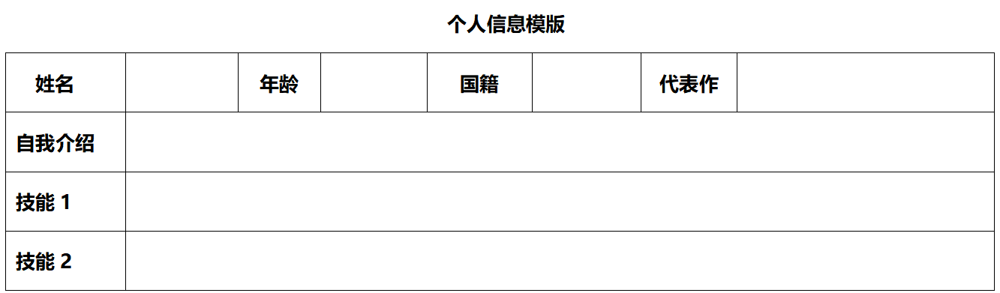

object对象（实例对象）：是类的具体实例。通过 `new` 关键字创建。

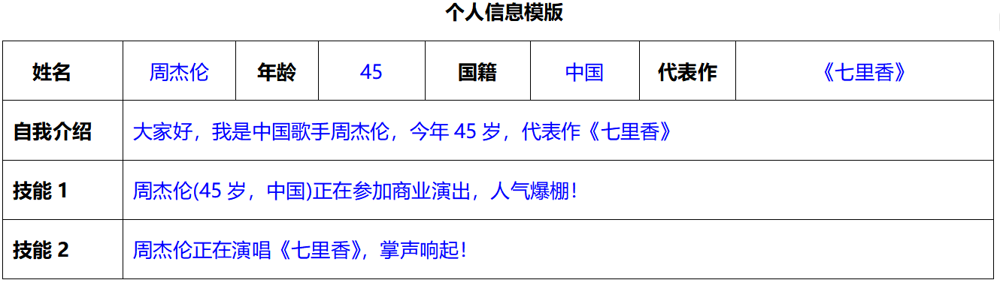

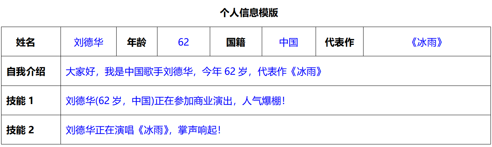

```
 所有明星都有的特征：姓名（name）、年龄（age）、国籍（country）、代表作（works）；
 所有明星都会的动作：唱歌（sing）、演出（show）、自我介绍（introduce）。
----------------------------------------------------------------------------------------
我们可以把这些特征和动作都封装到一个 明星对象类Star里面，就相当于我们设计一个明星信息的表格，然后每个明星只需要按照我们模版填写数据即可生成一个明星实例。
```

```java
//明星对象类
public class Star {
    //成员属性（变量）
    String name;
    int age;
    String country;
    String works;

    //成员方法（对象行为方法）
    //自我介绍
    public void introduce() {
        System.out.println("大家好，我是" + country + "歌手" + name + "，今年" + age + "岁，代表作《" + works + "》");
    }
    //商业演出方法
    public void show() {
        System.out.println(name + "(" + age + "岁，" + country + ")正在参加商业演出，人气爆棚！");
    }
    //唱歌方法
    public void sing() {
        System.out.println(name + "正在演唱《" + works + "》，掌声响起！");
    }
}
```

测试类

```java
public class Test {
    public static void main(String[] args) {
        System.out.println("========== 创建实例对象周杰伦 ==========");
        Star star1 = new Star();
        //设置实例对象的相关属性值
        star1.name = "周杰伦";
        star1.age = 45;
        star1.works = "七里香";
        //实例对象执行相应方法
        star1.introduce();
        star1.show();
        star1.sing();

        System.out.println("========== 创建实例对象刘德华 ==========");
        Star star2 = new Star();
        //设置实例对象的相关属性值
        star2.name = "刘德华";
        star2.age = 62;
        star2.works = "冰雨";
        //实例对象执行相应方法
        star2.introduce();
        star2.show();
        star2.sing();
    }
}
```

## 3.面相对象编程的好处

###  3.1.代码简洁

> 代码更简洁，调用更简单

面向过程：新增一个明星，就要重新定义一堆变量，调用方法时还要把所有变量一个个传参，参数多了容易写错、漏写；

面向对象：新增一个明星，只需要一行代码 `new Star()` 创建对象，然后使用`对象名.属性="属性值"`设置对象的属性值，调用方法时直接 `对象名.方法名()` 就行，不用传任何参数，因为对象自己就带着所有属性。

举例：新增一个「林俊杰」，面向过程要写 4 行变量 + 3 次传参调用；面向对象只需要：

```java
Star star3 = new Star();
//设置实例对象的相关属性值
star3.name = "林俊杰";
star3.age = 44;
star3.works = "一千年以后";
```

###  3.2.易于理解

> 属性和行为【绑定在一起】，符合现实逻辑，更好理解

- 面向过程：属性是零散的变量，方法是独立的函数，明星的名字、年龄和唱歌的行为是分开的，代码里看不出「周杰伦唱歌」的关联性，只是单纯传参调用；
- 面向对象：明星的属性（姓名 / 年龄）和行为（唱歌 / 演出）封装在一个 Star 类里，一个明星对象就是一个完整的整体，star1.sing()` 就是「周杰伦唱歌」，`star2.show()`就是「刘德华演出」，和现实世界的逻辑完全一致，就像你让明星做事一样，特别好理解。

###  3.3.代码复用性高

> 【代码复用性极高】，新增功能 / 扩展超级方便（最核心的好处），这是面向对象最牛的优点，也是工作中为什么必须用面向对象的原因！

**场景 1：新增一个属性（比如：明星身高）**

面向过程：要在所有相关方法的参数里都加一个身高参数，还要在调用方法时传身高值，所有用到明星的地方都要改，牵一发而动全身，改一处漏十处，特别容易出错；

面向对象：只需要在`Star`类里加一行 double height;在`introduce()`里加一句身高的打印就行，所有明星对象自动拥有这个属性，不用改任何调用代码，新增属性一步到位。

**场景 2：新增一个行为（比如：明星跳舞）**

面向过程：要写一个新的 dance () 方法，然后在调用时给每个明星传参调用，代码里到处都是新增的调用语句；

面向对象：只需要在`Star`类里新增一个 dance () 方法，所有明星对象都可以直接调用`对象名.dance()`，一次编写，所有对象复用，毫无成本。

**场景 3：新增 100 个明星**

面向过程：要写100 组变量 + 100 次方法调用，代码量直接翻倍，冗余到爆炸；

面向对象：只需要写100 行 new Star (...)，然后调用方法就行，代码整洁，逻辑清晰。

###  3.4.代码易维护

> 代码【易维护、易修改】，出错好排查

面向过程：所有功能揉在一起，方法和变量互相调用，一个地方改代码，可能导致多个地方出错，排查 bug 时要翻遍所有代码，维护成本极高；

面向对象：每个类都是独立的模块，`Star`类只负责明星的属性和行为，测试类只负责调用对象，各司其职。如果唱歌的逻辑要改，只需要改`Star`类里的`sing()`方法，所有明星的唱歌行为都会同步更新，不用改其他代码，一处修改，处处生效，bug 也好排查。

## 4.练习案例

### 4.1.需求分析

1.定义一个手机类 (Phone)

属性: 

- 品牌 brand
- 颜色 color
- 价格 price

行为: 

- 打电话 (call)   -   输出给 xxx 打电话	
- 发短信 (sendMessage)  -  输出群发短信 

2.编写一个手机测试类 (PhoneTest)

3.创建两个手机对象,  并给属性赋值

>  1. 小米,  白色,  4999
>  2. 华为,  黑色,  6999
>  3. 赋值之后, 校验自己有没有赋值成功, 使用打印语句校验, 调用两个对象各自的成员方法

```
用小米手机给小哈打电话~~~
小米手机发了一条群发短信
```

### 4.2.构建对象类

```java 
public class Phone {
    //成员属性（变量）
    String brand;
    String color;
    double price;

    //成员方法
    public void call(String name){
        System.out.println("用"+brand+"手机给"+name+"打电话~~");
    }
    public void sendMessage(){
        System.out.println(brand+"手机发了一条群发信息~~~");
    }
}
```

### 4.3.创建实例对象

```java
public class PhoneTest {
    public static void main(String[] args) {
        Phone phone1 = new Phone();
        //给phone1实例对象属性赋值
        phone1.brand ="小米";
        phone1.color ="白色";
        phone1.price=4999.9;
        //打印属性
        System.out.println(phone1.brand);
        System.out.println(phone1.color);
        System.out.println(phone1.price);
        //调用成员方法
        phone1.call("小哈叔");
        phone1.sendMessage();

        //华为手机，黑色，6999.9
        //......
    }
}
```

## 5.对象的存储原理

> 了解对象在内存中的操作流程，有利于我们今后更好的理解复杂案例
>

以一个 Student 学生类为例

```java
public class Student {
    String name;
    int age;

    public void study() {
        System.out.println("学习Java");
    }

    public void eat() {
        System.out.println("吃饭");
    }
}
```

### 5.1.单个对象内存图

```java
public class TestStudent {
    public static void main(String[] args) {
        Student stu = new Student();
        System.out.println(stu);

        System.out.println(stu.name);
        System.out.println(stu.age);
        stu.name = "张三";
        stu.age = 23;
        System.out.println(stu.name);
        System.out.println(stu.age);

        stu.study();
        stu.eat();
    }
}
```

代码执行顺序和原理解析

1.先执行TestStudent测试类，将TestStudent.class字节码文件放在方法区

2.先执行main方法

- 在栈内存新建 Student stu 变量，随后在堆内存中new一个对象，会产生一个对象地址2f4d3709
- 将地址赋值给 stu 变量，
- 打印stu变量获得结果 是地址 Phone.Student@2f4d3709

```java
Student stu = new Student();
System.out.println(stu); //Phone.Student@2f4d3709
//没有进行属性赋值打印结果为 null和0
System.out.println(stu.name); //null
System.out.println(stu.age);  //0
//给实体对象属性进行赋值，打印结果为张三、23
stu.name = "张三";
stu.age = 23;
System.out.println(stu.name); //张三
System.out.println(stu.age); //23
```

3.然后再占内存中调用study和eat方法，

- 先执行study方法打印结果 -- 学习Java，然后将study方法在栈内存中清除
- 再执行eat方法打印结果 -- 吃饭,然后将eat方法在栈内存中清除
- 最后main放完全执行完毕，也会在栈内存中清除，这个程序彻底结束

```java
stu.study(); //学习Java
stu.eat(); //吃饭
```


### 5.2.两个对象内存图

```java
public class Test {
    public static void main(String[] args) {
        Student stu1 = new Student();
        stu1.name = "张三";
        stu1.age = 23;

        Student stu2 = new Student();
        stu2.name = "李四";
        stu2.age = 24;

        System.out.println(stu1.name);
        System.out.println(stu1.age);

        stu1.study();
        stu2.study();
    }
}
```

代码执行顺序和原理解析

1.先执行TestStudent测试类，将TestStudent.class字节码文件放在方法区

2.先执行main方法

- 在栈内存新建 Student stu1 变量，随后在堆内存中new第一个对象stu1，随后在堆内存中new一个对象，会产生一个对象地址将地址赋值给 stu1 变量，随后进行属性设置

```java
Student stu1 = new Student();
stu1.name = "张三";
stu1.age = 23;
```

- 在栈内存新建 Student stu2 变量，随后在堆内存中new第一个对象stu2，随后在堆内存中new一个对象，会产生一个对象地址将地址赋值给 stu2 变量，随后进行属性设置

```java
Student stu2 = new Student();
stu2.name = "李四";
stu2.age = 24;
```

- 打印对应结果

```java
System.out.println(stu1.name);//张三
System.out.println(stu1.age);//23
stu1.study();//学习java
stu2.study();//学习java
```


### 5.3.两个对象指向同一个地址引用

```java
public class Test {
    public static void main(String[] args) {
        Student stu1 = new Student();
        stu1.name = "张三";
        stu1.age = 23;

        Student stu2 = stu1;
        stu2.name = "小哈叔";

        System.out.println(stu1.name);
        System.out.println(stu2.name);
    }
}
```

代码执行顺序和原理解析

1.先执行TestStudent测试类，将TestStudent.class字节码文件放在方法区

3.先执行main方法

- 在栈内存新建 Student stu1 变量，随后在堆内存中new第一个对象stu1，随后在堆内存中new一个对象，会产生一个对象地址将地址赋值给 stu1 变量，随后进行属性设置

```java
Student stu1 = new Student();
stu1.name = "张三";
stu1.age = 23;
```

- 在栈内存新建 Student stu2 变量，将stu1在堆里面的地址赋值给stu2，此时stu1和stu1两个实例对象执行的是对内存中同一个地址stu2设置name属性的时候会将堆内存中的数据修改

```java
Student stu2 = stu1;
//此处会把堆内存中数据修改
stu2.name = "小哈叔";
System.out.println(stu1.name); //小哈叔
System.out.println(stu2.name); //小哈叔
```

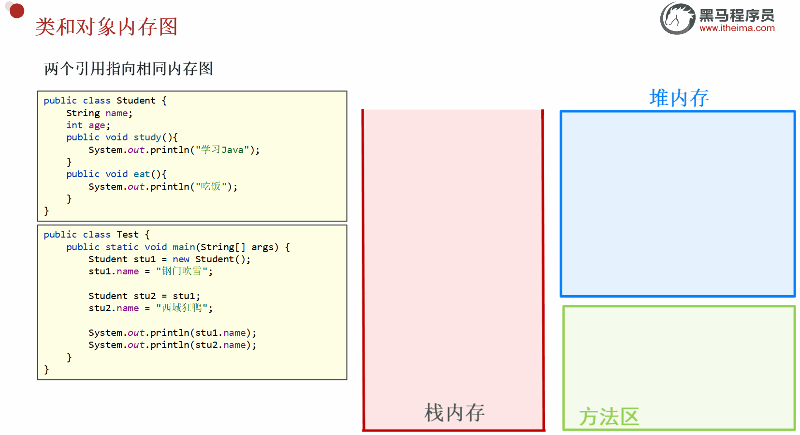

## 6.成员变量和局部变量

```java
public class Student {
    //成员属性（变量）
    String name;
    int age;

    //成员方法 -- 小括号中name是局部变量
    public void chat(String name) {
        System.out.println("在给" + name + "打电话聊天！");
    }
}
```

### 6.1.成员变量

> 成员变量也叫【全局变量】

定义：定义在 类中、方法体之外 的变量，属于整个类的「成员」，是类的属性。

作用域：整个类中有效，类里的所有方法、构造方法都能直接访问它。

存储位置：对象创建后，成员变量存放在 堆内存 (Heap) 中，随着对象的创建而存在，对象销毁而消失。

### 6.2.局部变量

定义：定义在 方法体内部、方法的形参列表、代码块（for/if/while）内部 的变量，属于局部的「临时变量」。

作用域：仅限自己的定义范围有效，出了这个范围（大括号 `{}`）就立刻失效，外部无法访问。

存储位置：存放在 栈内存 (Stack) 中，作用域执行完毕后，会被 JVM 的栈帧回收，占用内存小、释放快。

总结：

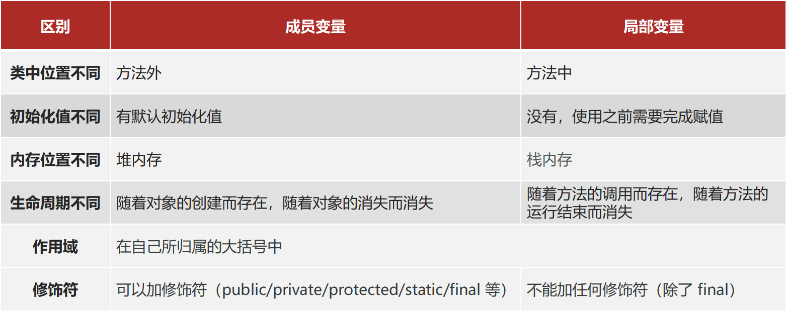

```java
public class Student {
    //成员属性（变量）
    String name;
    int age;

    //成员方法 -- 小括号中name是局部变量
    public void chat(String name) {
        final double pi = 3.14159265358979;
        System.out.println("在给" + name + "打电话聊天！");
    }
}
```

## 7.this关键字

### 7.1.this关键字介绍

this 代表当前类对象的引用（地址）

> 大白话解释：<span style="color:red">哪个对象调用了当前的方法 ，`this` 就指向哪个对象本身</span>；

```java
public class Student {
    //成员属性（变量）
    String name;
    int age;

    //成员方法
    public void print(){
        System.out.println(this);
    }
}
```

```java
public class Test{
    public static void main(String[] args) {
        Student s1 = new Student();
        System.out.println(s1); // 打印结果是什么
        s1.print(); // 打印结果是什么
    }
}
```

### 7.2.this关键字作用

> 只能在【成员方法】、【构造方法】、【代码块】中使用，绝对不能在静态 (static) 方法中使用；

1.解决成员变量名和局部变量名冲突的问题，用this来区分

2.this的作用——调用本类的成员

- <span style="color:red">this.本类成员变量</span>
- <span style="color:red">this.本类成员方法()</span>

```java
public class Student {
    //成员属性（变量）
    String name;
    int age;

    //成员方法中使用
    public void sayHello(String name) {
        System.out.println("Hello " + this.name);
    }
    
    //调用本类里面的成员方法
    public void print(){
        this.sayHello(name)
    }
}
```

```java
public class Test{
    public static void main(String[] args) {
        Student s1 = new Student();
        s1.name="小哈哈";
        s1.print(); //？？
    }
}
```

省略规则：

- this.本类成员变量; -- 如果不涉及重名问题，this可以省略不写；
- this.本类成员方法; --this可以直接省略不写；

### 7.3.this在计算机内存的原理

`this` 是一个引用变量，存储在栈内存中，指向堆内存中当前对象的地址；

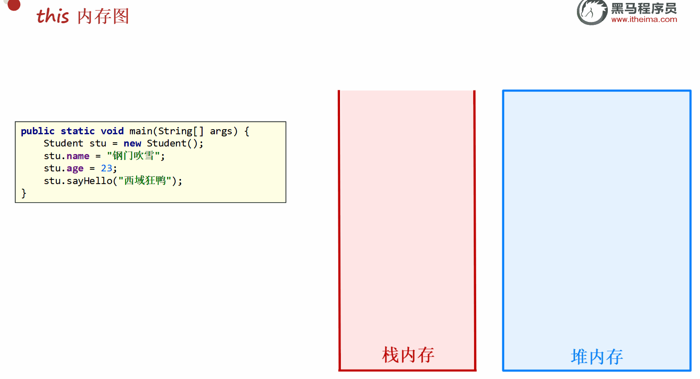
###  7.4.this关键字的访问原则

```java
public class Student {
    //成员属性（变量）
    String name;
    int age;

    //成员方法 -- 小括号中name是局部变量
    public void chat(String name) {
        System.out.println(name + "在给" + name + "打电话聊天！");
    }
}
```

```java
public class test{
     public static void main(String[] args) {
         Student s1 = new Student();
         s1.name ="小哈";
         s1.age = 18;
         //以下代码输出结果是什么？？？
         s1.chat("小米");
     }
 }
```

当局部变量和成员变量出现了重名的情况，java就会遵循—— <span style="color:red;">就近原则</span>

我们可以使用this关键字来区分局部变量和成员变量

```java
public class Student {
    //成员属性（变量）
    String name;
    int age;

    //成员方法 -- 小括号中name是局部变量
    public void chat(String name) {
        System.out.println(this.name + "在给" + name + "打电话聊天！");
    }
}
```

```java
public class test{
     public static void main(String[] args) {
         Student s1 = new Student();
         s1.name ="小哈";
         s1.age = 18;
         //以下代码输出结果是什么？？？
         s1.chat("小米");
     }
 }
```

## 8.构造器

### 8.1.构造器的作用

构造器，也叫 构造方法，是 Java 中专门用来创建实例对象的特殊方法；

Java 的构造器分为两种，无参构造器 和 有参构造器；

### 8.2.构造器的基本语法

**规则**

1.方法名与类名相同，必须完全一致

2.没有返回值，连void都没有

3.不能使用return返回结果数据

**无参构造器**

创建对象是会给 给成员变量赋「默认值」，创建对象后可以设置想要的值

成员变量默认值：int=0、String=null、double=0.0、boolean=false

```java
修饰符 类名(){
    
}
```

**有参构造器**

创建对象的同时，直接给成员变量赋我们想要的值，进行对象初始化

```java
修饰符 类名(参数1, 参数2, ...){
    // 方法体：把参数的值，赋值给成员变量
    // 使用this关键字区分成员变量和参数进行赋值操作！！
    this.成员变量名 = 参数名;
}
```

可以使用快捷操作创建构造器 Alt + Insert 然后选择 Constructor ，选择创建有参或者无参构造器即可

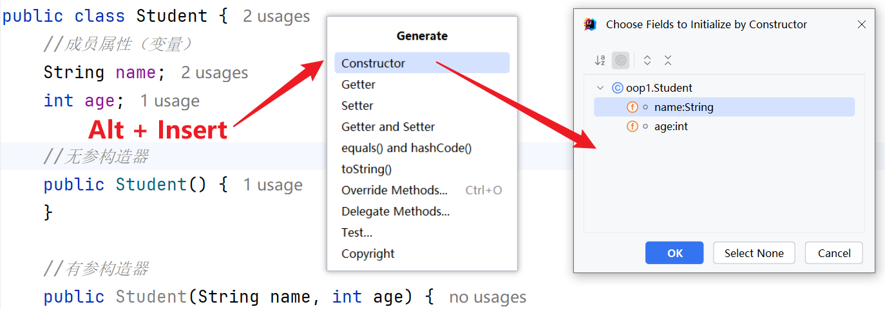

### 8.3.使用案例

```java
public class Student {
    //成员属性（变量）
    String name;
    int age;

    //无参构造器
    public Student() {
    }

    //有参构造器
    public Student(String name, int age) {
        this.name = name;
        this.age = age;
    }
}
```

###  8.4.注意事项

类中默认自带无参构造器：当一个类中没有手动定义任何构造器时，Java 编译器会自动为该类生成一个默认的无参构造器，我们可以通过这个默认无参构造器完成对象的创建。

如果在类中手动定义了有参构造器，编译器将不再自动生成默认的无参构造器，此时无法使用无参的方式创建对象；若需要继续使用无参构造器创建对象，就必须在类中手动定义一个无参构造器

简单理解为：

- 类中不写任何构造器时，会自动存在默认无参构造器，用于创建对象；
- 一旦手动编写了有参构造器，默认的无参构造器会自动消失；
- 如需继续使用无参构造器，必须手动补充定义一个无参构造器。

## 9.封装思想

### 9.1.封装介绍

面向对象的三大特征：封装、继承、多态


所谓的封装就是把某一个事物的相关数据（属性），以及操作数据的方法，用类设计到一个对象中去。

类就是一种封装。

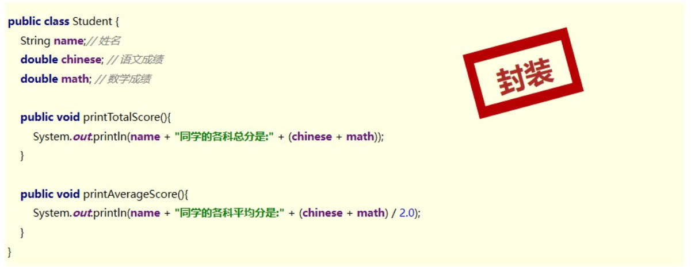

### 9.2.举个例子

**需求：**

计算出每一名学生的总成绩

展示学生的所有信息

| id   | 姓名 | 年龄 | 数学成绩 | 语文成绩 |
| ---- | ---- | ---- | -------- | -------- |
| 1    | 张三 | 23   | 90       | 87       |
| 2    | 李四 | 24   | 69       | 91       |

**分析：**

这些数据使用变量来存储的话，维护起来会特别麻烦，因为要定义很多的变量

数组存储呢？不行，因为数据类型不相同。

应该设计一个 Student 学生类来存储

```java
public class Student {
    //成员变量（属性）
    int id;
    String name;
    int age;
    double mathScore;
    double chineseScore;
}
```

**不封装造成的问题：**

如果在创建实例对象的时候，给成员属性赋值数据不合理非法是不会报错的，会造成数据不合理性

```java
public class Test {
    public static void main(String[] args) {
        Student1 s = new Student();
        s1.id = -1;
        s1.name = "小哈";
        s1.age = -18;
        s1.mathScore = 9000;
        s1.chineseScore =-80;
    }
}
```

### 9.3.封装的核心思想

**核心思想——合理隐藏，合理暴露**

以生活中的汽车为举例，汽车不需要将内部的零件都暴露出来，相反的，是需要封装起来的，不然不安全，它需要暴露出来的，仅仅是驾驶员需要操作的部件；


### 9.4.封装的具体步骤

️ 步骤 1：给类的成员变量，添加 `private` 私有修饰符

- 作用：被private修饰的成员变量，只能在当前类的内部访问 / 赋值，外部类无法直接访问、直接修改，从根源上杜绝外部随意操作数据。
- 语法：private 数据类型 变量名; 例：private String name; private int age;

️ 步骤 2：在类的内部，提供 public 修饰的、成对的 getXxx () /setXxx () 方法

- 作用：这是给外部类提供的「唯一合法访问入口」，是类对外开放的接口；
- 分工明确：
  getXxx()：获取值，有返回值，返回对应成员变量的值，无参数；
  setXxx()：设置值，无返回值 (void)，有参数，给对应成员变量赋值；

### 9.5.代码优化

按照封装的核心思想“合理隐藏，合理暴露”将所有的成员变量进行private关键字的修饰进行合理隐藏处理

设置set和get方法进行数据的合理暴露操作

```java
public class Student {
    //合理隐藏
    private int id;
    private String name;
    private int age;
    private double mathScore;
    private double chineseScore;

    //合理暴露
    public int getId() {
        return id;
    }

    public void setId(int id) {
        this.id = id;
    }

    public String getName() {
        return name;
    }

    public void setName(String name) {
        this.name = name;
    }

    public int getAge() {
        return age;
    }
	//进行非法过滤后，用户输入的数据不合理时，代码运行是会提醒用户
    public void setAge(int age) {
        if (age >= 0 && age <= 130) {
            this.age = age;
        } else {
            System.out.println("您的年龄不合法，请输入0~130之间的数值");
        }
    }

    public double getMathScore() {
        return mathScore;
    }

    public void setMathScore(double mathScore) {
        this.mathScore = mathScore;
    }

    public double getChineseScore() {
        return chineseScore;
    }

    public void setChineseScore(double chineseScore) {
        this.chineseScore = chineseScore;
    }
}
```

测试代码

```java
public class Test {
    public static void main(String[] args) {
        Student s1 = new Student();
        //设置数据
        s1.setId(1);
        s1.setName("小哈");
        s1.setAge(18);
        s1.setMathScore(88.9);
        s1.setChineseScore(100);
        //获取数据
        System.out.println(s1.getId());
        System.out.println(s1.getName());
        System.out.println(s1.getAge());
        System.out.println(s1.getMathScore());
        System.out.println(s1.getChineseScore());
    }
}
```

### 9.6.封装的好处

**1.保证数据的安全性和正确性**

封装的核心价值，没有之一。外部无法直接操作私有变量，所有赋值都要通过setXxx()方法，我们可以在方法中添加数据校验逻辑，过滤非法值（比如年龄负数、分数超过 100），避免数据被篡改或赋值为无效值，从根源上保障数据的有效性。

**2.隐藏类的内部实现细节**

封装遵循「对内开放，对外隐藏」原则：类的内部逻辑（变量怎么定义、方法怎么实现、数据怎么处理）全部隐藏，外部类只需要知道「调用哪个方法能完成需求」，不需要关心内部的实现细节，降低了代码的耦合度。

通俗举例：你用手机打电话，只需要按号码拨号即可，不用关心手机内部的芯片、信号如何工作，手机把内部细节封装了。

比如我们之前使用的 Random类和Scanner类,我们只需要使用不需要去深入了解内部的构造，值知道能使用它们实现什么功能

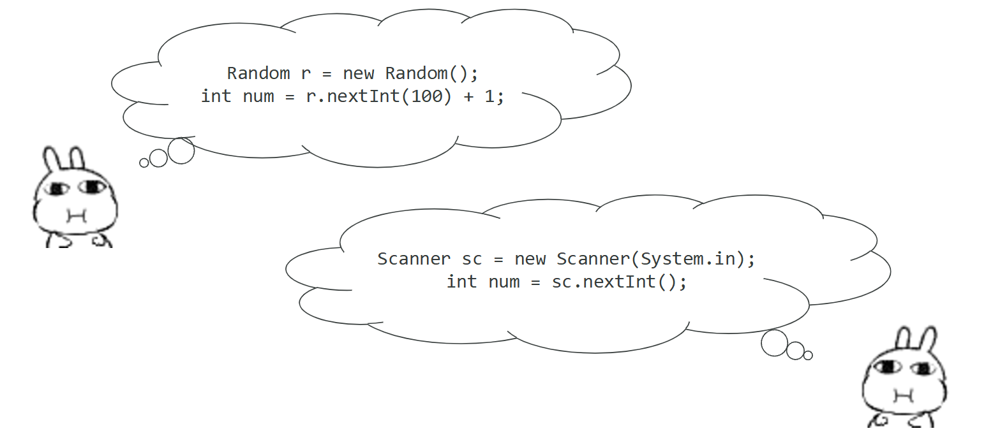

**3.提升代码的可维护性 & 可扩展性**

如果需要修改类的内部逻辑（比如修改年龄的合法范围、给姓名加非空校验），只需要修改类内部的方法即可，外部所有调用该方法的代码，一行都不用改。后续新增属性 / 功能，只需要新增私有变量 + 对应的 get/set 方法，不会影响原有代码，大大降低了代码的维护成本。

比如我们需要对用户的数学成绩进行合法过滤，可以直接在类内部修改，外部的调用不需要进行修改

```java 
public void setMathScore(double mathScore) {
    if (mathScore >= 0 && mathScore <= 100) {
        this.mathScore = mathScore;
    } else {
        System.out.println("您输入的数学成绩不合理，请输入0~100的数");
    }
}
```

### 9.7.权限修饰符

Java 的权限修饰符（访问修饰符） 是用来控制【类、成员变量、成员方法、构造方法】的可访问范围 的关键字；

本质作用是：封装代码、控制访问权限、保证程序安全性、解耦代码，是 Java 封装特性的核心实现手段。

java中常用的权限修饰符只有4个，按照权限大小排序如下：

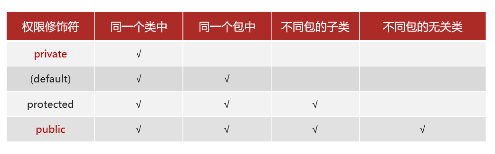

- 【公共权限】public —— 任意位置都可以访问

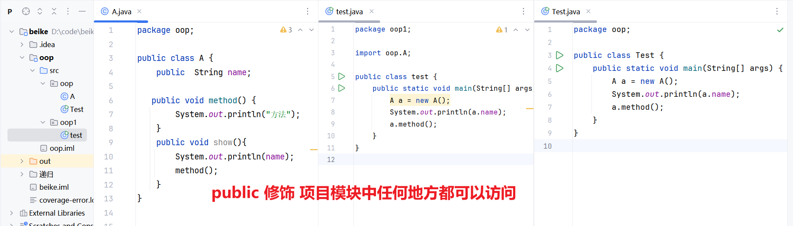

- 【受保护权限】protected —— 同一个类中，同一个包中，不同包的子类（继承关系）中访问
- 【默认权限】default  —— 同一个类中，同一个包中都可以访问

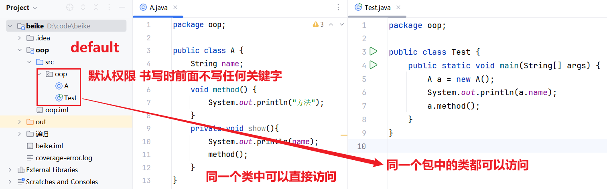

- 【私有权限】private —— 只能在同一个类中访问

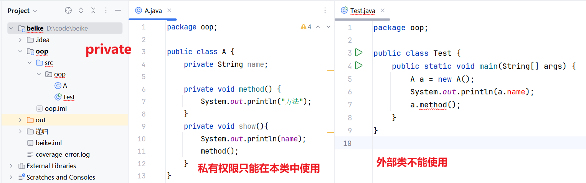

## 10.实体类

### 10.1.概述

JavaBean 实体类是 Java 开发中 “标准化的数据容器”，通过严格的规范（公共类、私有属性、getter/setter、无参构造器）实现数据的安全封装。遵循其规范，能大幅提升代码的通用性和可维护性。

实体类只负责数据存取，而对数据的处理交给其他类来完成，以实现数据和数据业务处理相分离。

简单理解就是封装数据的类

### 10.2.设置实体类的条件

1.类必须是公共的（public）

2.类中的成员变量全部私有，并提供public修饰的getXx/setXx方法。

3.类中需要提供一个无参数构造器，有参数构造器可选。

```java
package pojo;

public class Student {
    //成员变量（属性）
    private int id;
    private String name;
    private int age;
    private double mathScore;
    private double chineseScore;
    //无参构造器
    public Student() {
    }
    //有参构造器
    public Student(int id, String name, int age, double mathScore, double chineseScore) {
        this.id = id;
        this.name = name;
        this.age = age;
        this.mathScore = mathScore;
        this.chineseScore = chineseScore;
    }
    //set和get方法

    public int getId() {
        return id;
    }

    public void setId(int id) {
        this.id = id;
    }

    public String getName() {
        return name;
    }

    public void setName(String name) {
        this.name = name;
    }

    public int getAge() {
        return age;
    }

    public void setAge(int age) {
        this.age = age;
    }

    public double getMathScore() {
        return mathScore;
    }

    public void setMathScore(double mathScore) {
        this.mathScore = mathScore;
    }

    public double getChineseScore() {
        return chineseScore;
    }

    public void setChineseScore(double chineseScore) {
        this.chineseScore = chineseScore;
    }
}
```

JavaBean 我们通常会保存在一个 pojo 的包中，popj = Plain Ordinary Java Object，翻译：简单的、普通的 Java 对象。

JavaBean ≈ pojo （在日常开发中，二者是同一个东西，可以划等号）

> 严格区别（了解即可，不用深究）：
>
> - JavaBean：是 Sun 公司定义的「Java 标准规范」，要求更严格；
>
> - POJO：是程序员约定的「开发规范」，更简洁、更接地气；
>
> - 在企业开发中，我们写的 Student、User、Order 这类类，
>
>   既叫 JavaBean，也叫 POJO。

# 二、static关键字

### 1.概述

 static 是静态的意思，可以修饰成员变量，也可以修饰成员方法

被static修饰的成员, 被该类的所有对象所共享

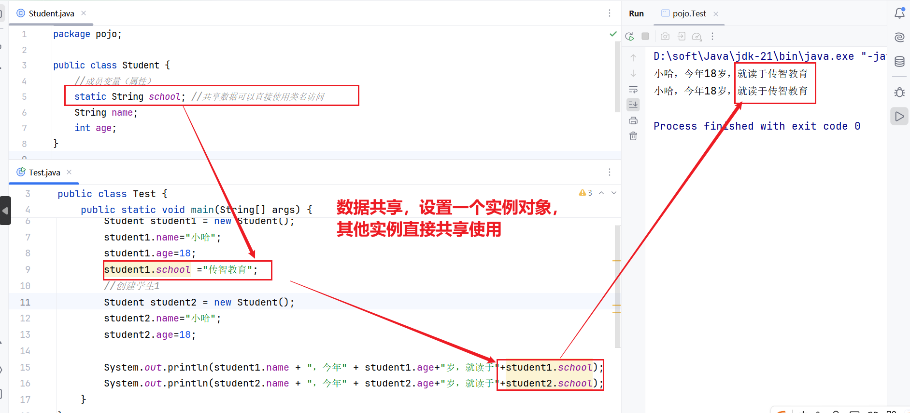

多了一种调用方式, 可以通过类名调用

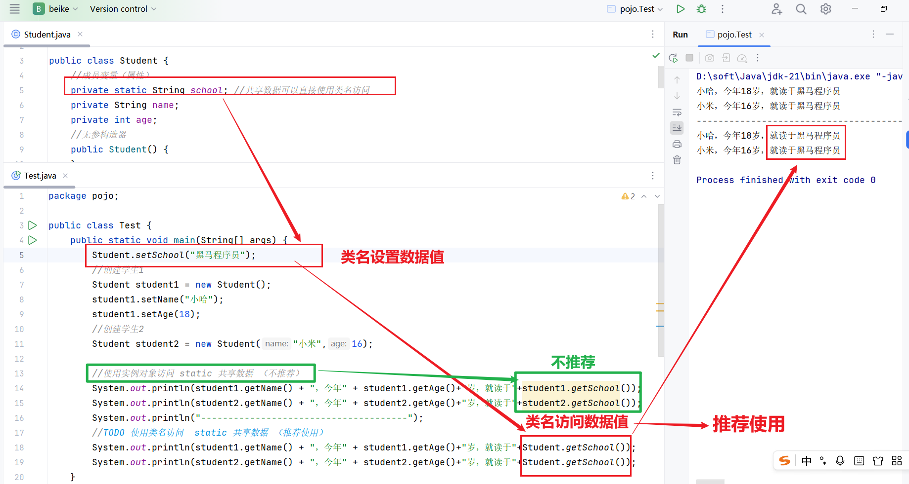

随着类的加载而加载, 优先于对象存在

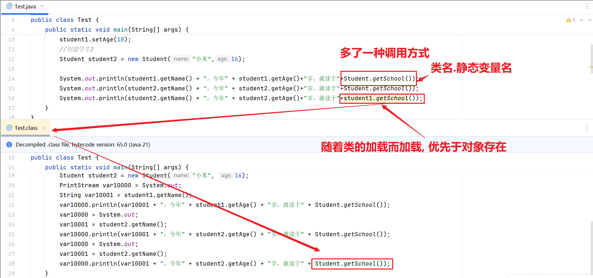

```java
public class Student {
    //成员变量（属性）
    private static String school; //共享数据可以直接使用类名访问
    private String name;
    private int age;
    //无参构造器
    public Student() {
    }
    //有参构造器
    public Student(String name, int age) {
        this.name = name;
        this.age = age;
    }
    //set和get方法

}
```

```java
public class Test {
    public static void main(String[] args) {
        Student.setSchool("黑马程序员");
        //创建学生1
        Student student1 = new Student();
        student1.setName("小哈");
        student1.setAge(18);
        //创建学生2
        Student student2 = new Student("小米",16);

        //使用实例对象访问 static 共享数据 （不推荐）
        System.out.println(student1.getName() + "，今年" + student1.getAge()+"岁，就读于"+student1.getSchool());
        System.out.println(student2.getName() + "，今年" + student2.getAge()+"岁，就读于"+student2.getSchool());
        System.out.println("--------------------------------------");
        //TODO 使用类名访问  static 共享数据 （推荐使用）
        System.out.println(student1.getName() + "，今年" + student1.getAge()+"岁，就读于"+Student.getSchool());
        System.out.println(student2.getName() + "，今年" + student2.getAge()+"岁，就读于"+Student.getSchool());
    }
}
```

### 2.内存中的原理


### 3.注意事项

**static 中不允许使用 this 关键字**

this 代表对象的地址，地址是创建对象之后才有的东西，所以 static 中不能使用 this

static 方法中,  只能访问静态成员 (直接访问)

- 因为 static 的成员随着类的加载而加载，非静态的成员需要创建对象后才能使用；
- 静态成员存在的时候，非静态的成员还没有，所以无法在静态方法中，访问非静态成员，除非创建对象访问。

```java
public class Test1 {
    int num = 10;
    public static void main(String[] args) {
        //报错，虽然numbianhemain方法在同一个{}范围内，但是static静态方法中只能访问静态成员
        System.out.println(num);
    }
}
```

**解决方案**

方案1：创建对象访问（不推荐）

```java
public class Test1 {
    int num = 10;
    public static void main(String[] args) {
        //方案1：创建测试对象
        Test1 t = new Test1();
        System.out.println(t.num);
    }
}
```

方案2：将成员变量修改成static修饰的变量

```java
public class Test1 {
    //方案2：将成员属性更改为 static修饰的成员
    static int num = 10;

    public static void main(String[] args) {
        System.out.println(num);
    }
}
```

### 4.工具类

**概述**

Java 工具类是封装了通用、高频复用逻辑的类

核心特点是全静态方法，无需创建对象，直接通过 类名.方法名 调用，能大幅简化开发、避免重复造轮子。

主要分为两大类
- JDK原生工具类（无依赖直接使用），涵盖字符串（`String`）、数字（`Integer`/`Long`）、数学计算（`Math`）、集合操作（`Collections`）、数组处理（`Arrays`）、判空（`Objects`）、日期时间（`java.time` 包下类）等场景，满足日常开发 80% 的需求。
- 第三方工具包（需 引入以来，补充原生不足），比如Apache Maven

当然开发中，我们也需要自定义一些工具类，属于开发中的标配操作，不管是小项目还是大厂项目，都需要写字自己的自定义工具类，这是做开发必备的习惯；

**创建自定义工具类**

什么时候必须写自定义工具类？
- 项目里面同一段业务逻辑，在多个地方重复书写（校验手机号、格式化金额）
- JDK原生工具类和第三方工具类，解决不了的业务需求
- 项目中一段代码逻辑需要通义维护、统一修改（比如规则变了，只需改1处，不用全局找）

自定义工具类【固定编写规范】（就 3 条，死记，万能通用）
- 类里面的所有业务方法，全部加 public static  → 不用 new 对象调用，直接类名.方法名()调用
- 类里面一定要写：私有化无参构造方法（构造器）private 类名(){}→ 防止别人创建对象（工具类创建对象毫无意义）
- 类名命名规范：XXXUtil / XXXUtils（比如 BloodPressureUtil、CommonUtil、DateUtil）。

-------------------------------------------------------------------------------------------------------------------------------------------------------


需求

1.创建一个工具类ValidateCodeUtil，用来完成项目验证码生成功能，该类包含了以下两个功能

- generateNumberCode  生成指定长度的【纯数字验证码】
- generateMixCode 生成指定长度的【数字+大小写字母 混合验证码】

2.编写一个ValidateCodeUtil使用的帮助文档

```java 
package com.itheima.utils;
/
 * 这是一个验证码生成工具类，内部提供了生成指定位数的验证码
 * 纯数字验证码、大小写字母数字混合的验证码
 * @version 1.0
 * @author 小哈
 */

import java.util.Random;

public class ValidateCodeUtil {
    static Random r = new Random();

    //私有化构造器，禁止实例化，工具类的固定规范
    private ValidateCodeUtil() {
    }

    /
     * 生成指定长度的【纯数字验证码】【开发最常用】
     * 适用：短信验证码、登录验证码、注册验证码 （推荐4/6位）
     * @param length 验证码长度
     * @return codeStr  纯数字验证码字符串
     */
    public static String generateNumberCode(int length) {
        //非法参数兜底
        //验证长度一般建议4~8位，如果用请求的不在这个范围内，直接用4位兜底
        if (length <= 0 || length > 8) {
            length = 4;
        }
        //定义一个字符串用来存储生成的验证码
        String codeStr = "";
        for (int i = 0; i < length; i++) {
            //生成0~9的随机数
            int num = r.nextInt(10);
            codeStr += num;
        }
        return codeStr;
    }

    /
     * 生成指定长度的【数字+大小写字母 混合验证码】
     * 适用：图形验证码、注册页面验证码、支付验证 （推荐4位）
     * @param length 验证码长度
     * @return codeStr 混合验证码字符串
     */
    public static String generateMixCode(int length){
        //非法参数兜底
        //验证长度一般建议4~8位，如果用请求的不在哲噶范围内，直接用4位兜底
        if (length <= 0 || length > 8) {
            length = 4;
        }
        // 验证码字符库：数字 + 大小写字母
        String codeData = "0123456789abcdefghijklmnopqrstuvwxyzABCDEFGHIJKLMNOPQRSTUVWXYZ";
        String codeStr = "";
        for (int i = 0; i < length; i++) {
            // 随机获取字符库中的索引
            int index = r.nextInt(codeData.length());
            //获取一个字符串中，指定下标位置 的「单个字符」
            codeStr += codeData.charAt(index);
        }
        return codeStr;
    }
}

```

**测试使用自定义工具包**

IDEA 直接关联模块（无需 Maven、无需配置、零门槛），操作步骤（一共 3 步，IDEA 图形化操作）

- 步骤 1：打开 IDEA，点击顶部菜单栏 → `File` → `Project Structure` (快捷键 `Ctrl+Alt+Shift+S`)
- 步骤 2：在弹出的窗口中，左侧选择 `Modules` → 选中要调用工具类的业务模块（比如 `user` 模块）
- 步骤 3：右侧选择 `Dependencies` → 点击最右侧的 + 号 → 选择 `Module Dependency` → 选中你的`common`模块 → 点击`OK`保存！

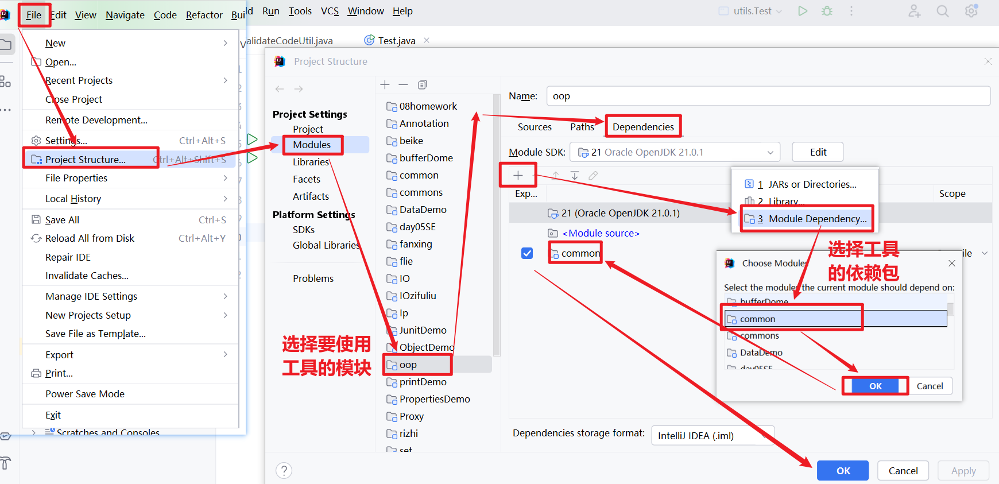

```java
import com.itheima.utils.ValidateCodeUtil;

public class Test {
    public static void main(String[] args) {
        // 1. 生成6位纯数字验证码（登录/短信常用）
        String numberCode = ValidateCodeUtil.generateNumberCode(6);
        System.out.println("生成的6为数字验证码是："+numberCode);

        //2. 生成6位混合验证码（登录/短信常用）
        String mixCode = ValidateCodeUtil.generateMixCode(6);
        System.out.println("生成的6为混合验证码验是："+mixCode);
    }
}
```

**制作工具包使用帮助文档**

封装好工具类以后，建议配置一份帮助文档，有以下5点好处：

- 降低使用门槛：新人不用问，看文档就能直接调用，避免试错。
- 明确使用边界：标注适用场景和避坑点，防止方法被滥用、误用。
- 减少沟通成本：不用反复答疑，团队协作效率翻倍。
- 方便维护迭代：版本更新有迹可循，重构、测试都有参考依据。
- 符合企业规范：代码更专业，面试、项目交付都加分。

具体的步骤：

第一步：打开需要制作帮助文档的工具类，菜单栏选择Tools

第二步：选择 Generate JavaDoc  （如果存在多个工具类选择  -- Module“commom”【commom是公用模块名哦】）

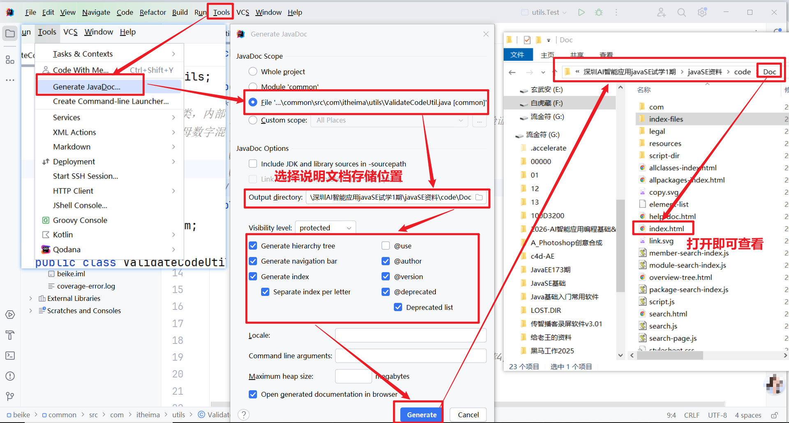

# 三、重新认识main方法

```java
public class HelloWorld {
    public static void main(String[] args) {
        System.out.println("HelloWorld");
    }
}
```

public：被 JVM 调用，访问权限足够大

static：被 JVM 调用，不用创建对象；因为 main 方法是静态的，所以测试类中其他方法也需要是静态的

void：被 JVM 调用，不需要给 JVM 返回值

main：一个通用的名称，虽然不是关键字，但是被 JVM 识别

String [] args：以前用于接收键盘录入数据的，现在没用

```java
//打印args
package utils;

public class Test1 {
    public static void main(String[] args) {
        for (int i = 0; i < args.length; i++) {
            System.out.println(args[i]);
        }
    }
}
```

使用命令行javac解析、java运行java程序时，如果在java文件里面写了package包名，在使用java运行时会出现以下错误，需要使用命令 cd.. 回到 src的目录文件夹，然后 手动输入  java  包名.类名  即可，如下图

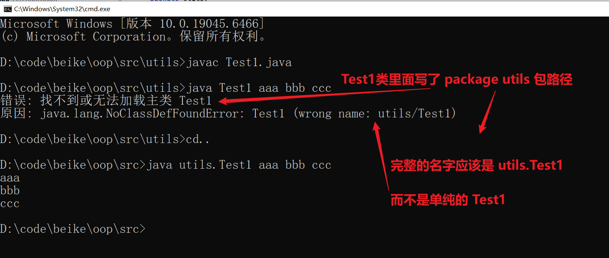

# 四、综合案例

## 1.案例说明

**需求**

展示系统中的全部电影(每部电影展示：名称、价格)。

允许用户根据电影编号（id）查询出某个电影的详细信息。

**目标** 
使用所学的面向对象编程实现以上2个需求。

```
1,"水门桥",38.9,9.8,"徐克","吴京","12万人想看"
2,"出拳吧",39,7.8,"唐晓白","田雨","3.5万人想看"
3,"月球陨落",42,7.9,"罗兰","贝瑞","17.9万人想看"
4,"一点到家",35,8.7,"徐宏宇","刘昊然","10.8万人想看"
```


## 2.实现步骤

**第一步：创建实体——电影实体类Movie**

```java
public class Movie {
    //定义成员变量
    private int id;   //编号
    private String name; //名字
    private double price; //价格
    private double scroe; //评分
    private String director; //导演
    private String actor;//主演
    private String info;//描述
    //构造器
    public Movie() {
    }

    public Movie(int id, String name, double price, double scroe, String director, String actor, String info) {
        this.id = id;
        this.name = name;
        this.price = price;
        this.scroe = scroe;
        this.director = director;
        this.actor = actor;
        this.info = info;
    }
    //setter/getter方法

    public int getId() {
        return id;
    }

    public void setId(int id) {
        this.id = id;
    }

    public String getName() {
        return name;
    }

    public void setName(String name) {
        this.name = name;
    }

    public double getPrice() {
        return price;
    }
```

**第二步：创建操作类MovieOperator专门实现对象操作**

```java
public class MovieOperator {
    //展示所有电影信息，需要传一个电影数据数组
    public static void show(Movie[] movies) {
        System.out.println("======所有电影信息如下======");
        for (int i = 0; i < movies.length; i++) {
            Movie movie = movies[i];//遍历到的当前电影数据
            //使用实体类Movie提供的get方法获取数据
            System.out.println("电影编号：" + movie.getId());
            System.out.println("电影名称：" + movie.getName());
            System.out.println("电影价格：" + movie.getPrice());
            System.out.println("电影评分：" + movie.getScroe());
            System.out.println("导演：" + movie.getDirector());
            System.out.println("主演：" + movie.getActor());
            System.out.println("电影简介：" + movie.getInfo());
            System.out.println("----------------------------");
        }
    }

    //根据id查询某一部电影详情
    public static void searchMovieId(int id, Movie[] movies) {
        System.out.println("======您所查询的电影详情如下======");
        for (int i = 0; i < movies.length; i++) {
            Movie movie = movies[i];
            if (movie.getId() == id) {
                System.out.println("电影编号：" + movie.getId());
                System.out.println("电影名称：" + movie.getName());
                System.out.println("电影价格：" + movie.getPrice());
                System.out.println("电影评分：" + movie.getScroe());
                System.out.println("导演：" + movie.getDirector());
                System.out.println("主演：" + movie.getActor());
                System.out.println("电影简介：" + movie.getInfo());
                return;
            }
        }
        System.out.println("没有查到相关信息！！！");
    }
}
```

**第三步：使用实体类和操作类**

```java
public class Test {
    public static void main(String[] args) {
        //使用Movie实体类创建一个数组对象，用来存放电影数据
        Movie[] movies = new Movie[4];
        //使用Movie实体类里面的有参构造器给数组传值
        movies[0] = new Movie(1,"水门桥",38.9,9.8,"徐克","吴京","12万人想看");
        movies[1] = new Movie(2,"出拳吧",39,7.8,"唐晓白","田雨","3.5万人想看");
        movies[2] = new Movie(3,"月球陨落",42,7.9,"罗兰","贝瑞","17.9万人想看");
        movies[3] = new Movie(4,"一点到家",35,8.7,"徐宏宇","刘昊然","10.8万人想看");

        //创建一个电影操作MovieOperator的使用对象operator
        MovieOperator operator = new MovieOperator();

        //系统界面
        Scanner sc = new Scanner(System.in);
        System.out.println("======欢迎进入电影信息管理系统======");
        while (true) {
            System.out.println("1.查看所有电影信息");
            System.out.println("2.根据id查找某一电影信息");
            System.out.println("3.退出");
            System.out.println("======请选择您的命名======");
            int command = sc.nextInt();
            switch (command) {
                case 1:
                    operator.show(movies);
                    break;
                case 2:
                    System.out.println("请输入您要查询的电影ID");
                    int id = sc.nextInt();
                    operator.searchMovieId(id,movies);
                    break;
                case 3:
                    System.out.println("成功退出系统");
                    //System.exit(0);
                    //break;
                    return;//退出当前方法运行
                default:
                    System.out.println("您输入的命令不正确！请重新输入!!!");
            }
        }
    }
}
```


