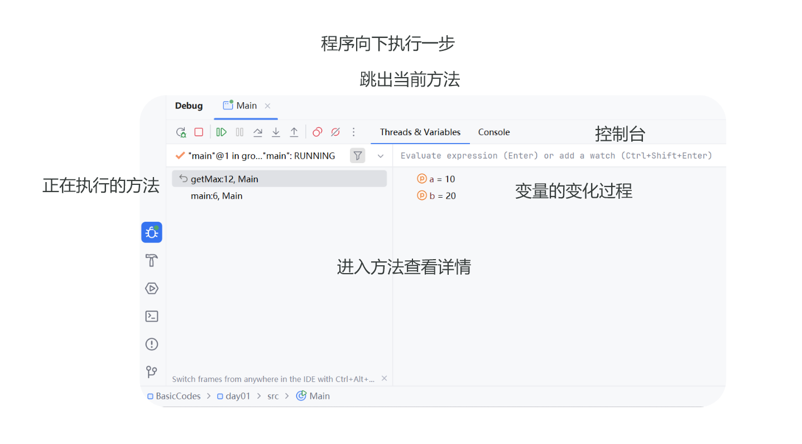
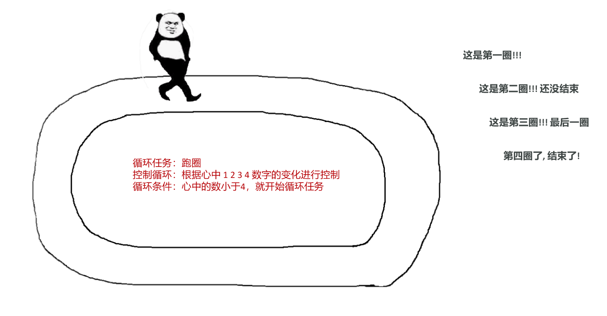

# 第六章：流程控制语句

本章内容包括：

- 流程控制语句分类
- 分支结构 if
- 分支结构 switch
- Debug 工具
- 循环结构 for
- 循环结构 while
- 循环结构 do…while
- break、continue
- Random 生成随机数

## 1. 流程控制语句分类

### 1.1 什么是流程控制语句

流程控制语句：控制程序代码执行顺序的语句。

### 1.2 三种基本结构

- 顺序结构：程序默认的执行方式，代码从上到下依次执行
- 分支结构：根据条件选择执行某段代码，代表语句是 if、switch
- 循环结构：让一段代码重复执行很多次，代表语句是 for、while、do…while

### 1.3 顺序结构

顺序结构是程序默认的执行流程，没有特定的语法结构，按照代码的先后顺序依次执行，程序中大多数的代码都是这样执行的。

执行流程图：

```
┌────────┐
│  开始  │
└───┬────┘
    ▼
┌────────┐
│ 语句A  │
└───┬────┘
    ▼
┌────────┐
│ 语句B  │
└───┬────┘
    ▼
┌────────┐
│ 语句C  │
└───┬────┘
    ▼
┌────────┐
│  结束  │
└────────┘

```

代码示例：

```java
public class Test {
    public static void main(String[] args) {
        System.out.println("A");
        System.out.println("B");
        System.out.println("C");
    }
}
```

控制台输出：

```text
A
B
C
```

## 2. 分支结构 if

### 2.1 if 第一种格式（单 if）

格式：

```java
if (判断条件) {
    语句体;
}
```

执行流程：

1. 首先计算判断条件的结果
1. 如果条件的结果为 true 就执行语句体
1. 如果条件的结果为 false 就不执行语句体

### 2.2 if 第二种格式（if…else）

格式：

```java
if (判断条件) {
    语句体1;
} else {
    语句体2;
}
```

执行流程：

1. 首先计算判断条件的结果
1. 如果条件的结果为 true 就执行语句体 1
1. 如果条件的结果为 false 就执行语句体 2

### 2.3 if 第三种格式（if…else if…else）

格式：

```java
if (判断条件1) {
    语句体1;
} else if (判断条件2) {
    语句体2;
}
...
else {
    语句体n+1;
}
```

执行流程：

1. 首先计算判断条件 1 的值
1. 如果值为 true 就执行语句体 1；如果值为 false 就计算判断条件 2 的值
1. 如果值为 true 就执行语句体 2；如果值为 false 就计算判断条件 3 的值
1. ...
1. 如果没有任何判断条件为 true，就执行语句体 n+1

### 2.4 案例：考试奖励

需求：键盘录入考试成绩，根据成绩所在的区间，程序打印出不同的奖励。

分数区间：

- 95~100 分
- 90~94 分
- 80~89 分
- 80 分以下

参考代码：

```java
import java.util.Scanner;

public class Test {
    public static void main(String[] args) {
        Scanner sc = new Scanner(System.in);
        System.out.println("请输入考试成绩：");
        int score = sc.nextInt();

        if (score >= 95 && score <= 100) {
            System.out.println("95~100 分对应的奖励");
        } else if (score >= 90 && score <= 94) {
            System.out.println("90~94 分对应的奖励");
        } else if (score >= 80 && score <= 89) {
            System.out.println("80~89 分对应的奖励");
        } else {
            System.out.println("80 分以下对应的奖励");
        }
    }
}
```

### 2.5 if 语句注意事项

1. if 语句中，如果大括号控制的是一条语句，大括号可以省略不写
1. if 语句的 ( ) 和 { } 之间不要写分号
1. if 语句的 ( ) 中需要产生 boolean 类型的结果，根据结果决定程序的走向

### 2.6 小结

- if 分支可以根据条件，选择执行某段程序，应用场景很多，例如成绩判断、登录校验等
- if 分支的写法有 3 种：单 if、if…else、if…else if…else

## 3. 分支结构 switch

### 3.1 switch 格式与执行流程

格式：

```java
switch(表达式) {
    case 值1：
        语句体1;
        break;
    case 值2：
        语句体2;
        break;
    …
    default：
        语句体n+1;
        break;
}
```

switch 是通过比较值来决定执行哪条分支。

执行流程：

1. 先计算表达式的值，再拿着这个值去与 case 后的值进行匹配
1. 与哪个 case 后的值匹配为 true 就执行哪个 case 块的代码，遇到 break 就跳出 switch 分支
1. 如果全部 case 后的值与之匹配都是 false，则执行 default 块的代码

### 3.2 if 与 switch 的比较

- if 适合做条件是区间判断的情况
- switch 适合做：条件是比较值的情况、代码优雅、性能较好

### 3.3 switch 语句注意事项

1. 表达式类型只能是 byte、short、int、char，不支持 double、float、long
1. JDK 5 开始支持枚举
1. JDK 7 开始支持 String
1. case 给出的值不允许重复，且只能是字面量，不能是变量
1. 正常使用 switch 的时候，不要忘记写 break，否则会出现穿透现象

### 3.4 小结（思考题）

- switch 表达式的值可以是：byte、short、int、char，JDK 5 开始支持枚举，JDK 7 开始支持 String
- 如果省略了 break，会出现穿透现象：匹配到某个 case 后，会继续向下执行后面的 case 代码，直到遇到 break 或 switch 结束
- case 后面的值不可以是变量，只能是字面量

## 4. Debug 工具

### 4.1 什么是 Debug

- Debug 是供程序员使用的程序调试工具
- 它可以用于查看程序的执行流程，也可以用于追踪程序执行过程来调试程序
- Debug 调试又被称为断点调试，断点其实是一个标记，告诉 Debug 从标记的地方开始查看

### 4.2 Debug 界面区域说明



各区域的作用：

1. 程序向下执行一步（Step Over）
1. 进入方法查看详情（Step Into）
1. 跳出当前方法（Step Out）
1. 控制台：查看程序运行过程中的输出
1. 正在执行的方法：查看方法调用的执行栈
1. 变量的变化过程：查看变量在每一步执行后的取值

### 4.3 断点与结束调试

- 点击左侧行号设置断点，再点一次取消断点
- 结束 Debug 模式：点击 Stop 按钮结束调试

## 5. 循环结构 for

### 5.1 循环介绍

循环可以让一段代码重复执行很多次。

应用场景：例如登录功能只给 3 次登录机会，就需要让登录的代码重复执行：

```java
public static void login() {
    Scanner sc = new Scanner(System.in);
    System.out.println("请输入您的密码：");
    int password = sc.nextInt();
    if (password == 123456) {
        System.out.println("登录成功");
    } else {
        System.out.println("登录失败");
    }
}
```

跑圈案例（以"跑圈"为例理解循环）：

- 循环任务：跑圈
- 控制循环：根据心中 1 2 3 4 数字的变化进行控制
- 循环条件：心中的数小于 4，就开始循环任务
- 执行过程：第一圈 → 第二圈（还没结束）→ 第三圈（最后一圈）→ 第四圈（结束）



### 5.2 for 循环格式

格式：

```java
for (初始化语句; 条件判断语句; 条件控制语句 )  {
    循环体语句;
}
```

跑圈案例与 for 循环四部分的对应：

1. 初始化语句：定义变量 `int i = 1;`
1. 条件判断语句：循环条件 `i < 4`
1. 循环体语句：循环任务 `sout("跑圈");`
1. 条件控制语句：改变变量 `i++;`

### 5.3 for 循环执行流程

1. 执行初始化语句
1. 执行条件判断语句，看结果是 true 还是 false
1. false 则结束循环，true 则继续
1. 执行循环体语句
1. 执行条件控制语句
1. 回到第 2 步继续判断

### 5.4 案例：打印 10 次你好

需求：请使用循环，在控制台打印出 10 次你好。

参考代码：

```java
public class ForDemo {
    public static void main(String[] args) {
        for (int i = 1; i <= 10; i++) {
            System.out.println("你好");
        }
    }
}
```

### 5.5 案例：模拟计时器

需求：请使用循环在控制台打印数字 1~3 和 3~1 的数据。

参考代码：

```java
public class ForDemo {
    public static void main(String[] args) {
        for (int i = 1; i <= 3; i++) {
            System.out.println(i);
        }

        for (int i = 3; i >= 1; i--) {
            System.out.println(i);
        }
    }
}
```

控制台输出：

```text
1
2
3
3
2
1
```

思路积累：

- 循环中，用于控制循环的变量，还可以放在循环体中继续进行使用
- 条件控制语句并不一定是 ++，也可以是 --

### 5.6 案例：求 1~100 之间的偶数和

需求：求 1-100 之间的偶数和，并把求和结果在控制台输出。

分析：

1. 定义求和变量 sum，准备记录累加的结果
1. 使用 for 循环，分别获取数据 1 - 100
1. 循环使用 if 语句，筛选出偶数数据
1. 将每一个偶数数据，和 sum 变量进行累加
1. 循环结束后，打印求和后的结果

参考代码：

```java
public class SumDemo {
    public static void main(String[] args) {
        int sum = 0;

        for (int i = 1; i <= 100; i++) {
            if (i % 2 == 0) {
                sum += i;
            }
        }

        System.out.println(sum);
    }
}
```

控制台输出：

```text
2550
```

思路积累：今后若遇到的需求是求 xxx 的和，就要联想到求和变量 sum。

### 5.7 案例：水仙花数

需求：在控制台输出所有的"水仙花数"。

什么是"水仙花数"？

- 水仙花数是一个三位数，例如 111、222、333、370、371、520、999
- 水仙花数的个位、十位、百位的数字立方和等于原数

判断示例：

- 123：1³ + 2³ + 3³ = 1 + 8 + 27 = 36，不等于 123，不是水仙花数
- 371：3³ + 7³ + 1³ = 27 + 343 + 1 = 371，等于 371，是水仙花数

分析：

1. 通过 for 循环，获取到所有的三位数 100 - 999
1. 在循环内部，将每一个三位数拆分为（个位，十位，百位）
1. 加入 if 筛选条件：`if (ge*ge*ge + shi*shi*shi + bai*bai*bai == 原数)`
1. 满足条件则输出水仙花数

参考代码：

```java
public class NarcissusDemo {
    public static void main(String[] args) {
        for (int i = 100; i <= 999; i++) {
            int ge = i % 10;
            int shi = i / 10 % 10;
            int bai = i / 100;

            if (ge * ge * ge + shi * shi * shi + bai * bai * bai == i) {
                System.out.println(i);
            }
        }
    }
}
```

控制台输出：

```text
153
370
371
407
```

### 5.8 案例：统计水仙花数的个数

需求：在控制台输出所有的"水仙花数"，并统计出水仙花数的个数。

分析：

1. 定义计数器变量 count，准备统计水仙花数的个数
1. 通过 for 循环，获取到所有的三位数 100 - 999
1. 在循环内部，将每一个三位数拆分为（个位，十位，百位）
1. 加入 if 筛选条件
1. 满足条件则输出水仙花数，count 变量++
1. 打印 count 所记录的值

参考代码：

```java
public class NarcissusCountDemo {
    public static void main(String[] args) {
        int count = 0;

        for (int i = 100; i <= 999; i++) {
            int ge = i % 10;
            int shi = i / 10 % 10;
            int bai = i / 100;

            if (ge * ge * ge + shi * shi * shi + bai * bai * bai == i) {
                count++;
                System.out.println(i);
            }
        }

        System.out.println(count);
    }
}
```

控制台输出：

```text
153
370
371
407
4
```

思路积累：今后若遇到的需求是统计 xxx，就要联想到计数器变量 count。

### 5.9 for 循环注意事项

1. 循环 { } 中定义的变量，在每一轮循环结束后，都会从内存中释放
1. 循环 ( ) 中定义的变量，在整个循环结束后，都会从内存中释放
1. 循环语句 ( ) 和 { } 之间不要写分号

### 5.10 循环嵌套

循环嵌套：在循环语句中，继续出现循环语句。

执行流程：外循环执行一次，内循环执行一圈。

代码示例：

```java
for(int i = 1; i <= 5; i++) {
     for(int j = 1; j <= 5; j++) {
        System.out.println("HelloWorld");
     }
}
```

思路：如果一个循环任务还要继续执行多次，使用外循环包裹。

### 5.11 案例：循环嵌套打印图形

需求 1：使用 * 在控制台打印出 4 行 5 列的矩形。

```text
*****
*****
*****
*****
```

需求 2：使用 * 在控制台打印出 5 行的直角三角形。

```text
*
**
***
****
*****
```

参考代码：

```java
public class NestedLoopDemo {
    public static void main(String[] args) {
        // 4 行 5 列的矩形
        for (int i = 1; i <= 4; i++) {
            for (int j = 1; j <= 5; j++) {
                System.out.print("*");
            }
            System.out.println();
        }

        // 5 行的直角三角形
        for (int i = 1; i <= 5; i++) {
            for (int j = 1; j <= i; j++) {
                System.out.print("*");
            }
            System.out.println();
        }
    }
}
```

### 5.12 小结

- 循环语句的作用：可以将一段代码重复执行很多次
- 循环嵌套：在循环中继续编写循环语句，外循环执行一次，内循环执行一圈

## 6. 循环结构 while

### 6.1 while 格式与执行流程

格式：

```java
初始化语句;
while (循环条件) {
    循环体语句;
    迭代语句;
}
```

举例：

```java
int i = 1;
while (i <= 3) {
    System.out.println("HelloWorld");
    i++;
}
```

while 的执行流程与 for 一致：先判断循环条件，条件为 true 执行循环体，再执行迭代语句，然后继续判断，直到条件为 false 结束循环。

### 6.2 案例：珠穆朗玛峰

需求：世界最高山峰珠穆朗玛峰高度是 8848.86 米 = 8848860 毫米，假如有一张足够大的纸，它的厚度是 0.1 毫米。请问：该纸张折叠多少次，可以折成珠穆朗玛峰的高度？

分析：

1. 定义变量存储珠穆朗玛峰的高度、纸张的高度
1. 使用 while 循环来控制纸张折叠，循环条件是（纸张厚度 < 山峰高度），循环每执行一次，就表示纸张折叠一次，并把纸张厚度变为原来两倍
1. 循环外定义计数变量 count，循环每折叠一次纸张，让 count 变量 +1

变量定义：

```java
double peakHeight = 8848860;  // 山峰高度
double paperThickness = 0.1;  // 纸张厚度
```

参考代码：

```java
public class WhileDemo {
    public static void main(String[] args) {
        double peakHeight = 8848860;
        double paperThickness = 0.1;
        int count = 0;

        while (paperThickness < peakHeight) {
            paperThickness *= 2;
            count++;
        }

        System.out.println(count);
    }
}
```

控制台输出：

```text
27
```

### 6.3 while 与 for 的区别

- 功能上完全一样，for 能解决的 while 也能解决，反之亦然
- 使用规范：知道循环次数，使用 for；不知道循环次数，建议使用 while

## 7. 循环结构 do…while

### 7.1 do…while 格式与执行流程

格式：

```java
初始化语句;
do {
    循环体语句;
    条件控制语句;
} while (循环条件);
```

举例：

```java
int i = 0;
do {
    System.out.println("Hello World!");
    i++;
} while( i < 3);
```

do...while 循环的特点：先执行后判断，也就是说无论循环条件是否成立，循环体至少会执行一次。

### 7.2 三种循环的区别

- for 循环和 while 循环：先判断后执行
- do...while：先执行后判断
- for 循环和 while 循环的执行流程一模一样，功能上无区别，for 能做的 while 也能做，反之亦然
- 使用规范：如果已知循环次数建议使用 for 循环；如果不清楚要循环多少次建议使用 while 循环
- 其他区别：for 循环中，控制循环的变量只在循环中使用；while 循环中，控制循环的变量在循环后还可以继续使用

代码对比：

```java
int i = 0;
while (i < 3) {
    System.out.println("Hello World");
    i++;
}
System.out.println(i);
```

```java
for (int i = 0; i < 3; i++ ) {
    System.out.println(“Hello World");
}
System.out.println(i);
```

小结：

- for 和 while 是先判断后执行，do...while 是先执行后判断
- 明确循环次数推荐使用 for，不明确循环次数推荐使用 while
- for 循环结束后，控制循环的变量不可以继续使用，while 则相反

## 8. break、continue

### 8.1 跳转控制语句

- break：终止循环体内容的执行，也就是说结束当前的整个循环
- continue：跳过某次循环体内容的执行，继续下一次的执行

### 8.2 注意事项

- break 只能在循环和 switch 当中进行使用
- continue 只能在循环中进行使用

### 8.3 标号控制嵌套循环

如果出现循环嵌套，默认操作内层循环，如需改动，可以使用标号控制。

代码示例（使用标号 lo 终止外层循环）：

```java
lo:
for (int i = 1; i <= 5; i++) {
    for (int j = 1; j <= 5; j++) {
        if (j == 2) {
            break lo;
        }
    }
}
```

小结：

- break 结束循环，结束 switch 语句
- continue 跳过某次循环，继续下一次

## 9. Random 生成随机数

### 9.1 Random 使用步骤

使用 Random 分为三步：导包、创建对象、生成随机数。

1. 导包：告诉程序去 JDK 的哪个包中找随机数生成器，`import java.util.Random;`
1. 创建对象：代表得到随机数生成器对象，`Random r = new Random();`
1. 生成随机数：生成一个随机数，指定随机范围，`int num1 = r.nextInt(10);`

代码示例：

```java
import java.util.Random;

public class Test {
    public static void main(String[] args) {
        Random r = new Random();

        int num1 = r.nextInt(10);
    }
}
```

注意：`r.nextInt(n)` 生成 0~n 的随机数，但是不包含 n。

### 9.2 产生 1~100 的随机数

需求：产生一个 1~100 的随机数，只传入一个参数怎么做？

思路：先产生 0~99 的随机数，再加 1，就得到 1~100 的随机数。

```java
int num = r.nextInt(100) + 1;
```

### 9.3 案例：猜数字小游戏

需求：

1. 产生一个 1~100 之间的随机数作为中奖数字
1. 随后键盘录入用户猜的数字进行比对
1. 没有猜中的话给出提示，直到用户猜对为止，程序结束

参考代码：

```java
import java.util.Random;
import java.util.Scanner;

public class GuessNumberDemo {
    public static void main(String[] args) {
        Random r = new Random();
        int number = r.nextInt(100) + 1;

        Scanner sc = new Scanner(System.in);

        while (true) {
            System.out.println("请输入您猜的数字：");
            int guess = sc.nextInt();

            if (guess > number) {
                System.out.println("猜大了");
            } else if (guess < number) {
                System.out.println("猜小了");
            } else {
                System.out.println("猜中了");
                break;
            }
        }
    }
}
```
