# 一、继承

### 1.继承概述

Java 中的继承（Inheritance） 是面向对象三大特性（封装、继承、多态）之一，核心思想是 “复用已有类的代码，实现类之间的层次关系”。

多个子类如果有相同的属性和方法，不需要在每个子类中重复编写，只需要把这些共性内容抽取到父类中，所有子类通过继承直接「拿来即用」，极大减少冗余代码。

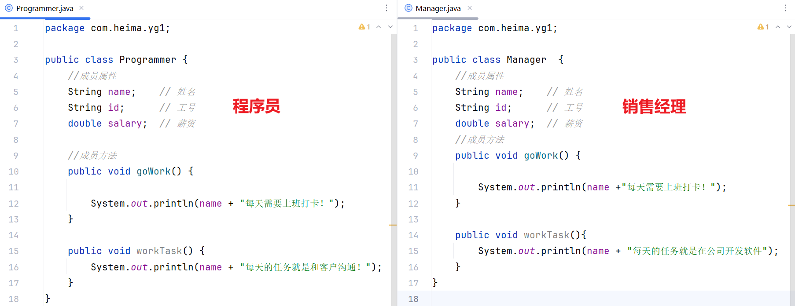

如图所示：

- 公司的员工有程序员Programmer和经理Manager，都有各自的姓名name、工号id、薪资salary
- 如果每个类都单独设置，此时代码会冗余繁琐，此时我们就可以使用继承来简化代码

### 2.使用语法

Java中提供了一个关键字extends，用这个关键字，可以让一个类和另一个类建立起父子关系。

```java
// 父类（基类/超类）：被继承的类
class 父类名 {
    
}

// 子类（派生类）：继承父类的类
class 子类名 extends 父类名 {
    
}
```

### 3.使用案例

第一步：将共性的属性提取出来设置给一个父类Employee员工类

注意：我们可以将属性私有化 合理隐藏，然后使用get和set方法合理暴露（此处暂不操作）

```java
public class Employee {
    //共有属性
    String name;    // 姓名（共性）
    String id;      // 工号（共性）
    double salary;  // 薪资（共性）
    //共有方法
    public void goWork() {
        System.out.println(name +"每天需要上班打卡！");
    }
}
```

第二步：让子类 程序员类 Programmer 和 经理类 Manager 继承父类，同时也有自己独立的方法

```java
public class Programmer extends Employee{
    //成员独有方法
    public void workTask(){
        System.out.println(name + "每天的任务就是和客户沟通！");
    }
}
```

```java
public class Manager extends Employee{
    //成员独有方法
    public void workTask(){
        System.out.println(name + "每天的任务就是在公司写代码，调试bug");
    }
}
```

第三步测试：

```java
public class Test {
    public static void main(String[] args) {
        //创建程序员实例
        Programmer p = new Programmer();
        p.name = "小哈";
        p.id = "KF001";
        p.salary = 18000.0;
        System.out.println(p.name + "，是公司的一名程序员,每月薪资是：" + p.salary);
        p.goWork();
        p.workTask();

        System.out.println("---------------------------------");

        //创建经理实例
        Manager m = new Manager();
        m.name = "小米";
        m.id = "JL001";
        m.salary = 28000.0;
        System.out.println(m.name + "，是公司的一名销售经理,每月薪资是：" + m.salary);
        m.goWork();
        m.workTask();
    }
}
```

测试结果

```
小哈，是公司的一名程序员,每月薪资是：18000.0
小哈每天需要上班打卡！
小哈每天的任务就是在公司写代码，调试bug
---------------------------------
小米，是公司的一名销售经理,每月薪资是：28000.0
小米每天需要上班打卡！
小米每天的任务就是和客户沟通！
```

### 4.何时使用继承

当类与类之间，存在相同 (共性) 的内容，并且产生了 is a 的关系，就可以考虑使用继承，来优化代码

```
学生：姓名，年龄　　　　　项目经理：姓名，工号，工资
老师：姓名，年龄　　　　　程序员：姓名，工号，工资
-------------         ---------------------
人：姓名，年龄　　　　　　员工：姓名，工号，工资
```

### 5.继承中成员变量的访问特点

继承中访问成员变量，遵循「就近原则」：谁离我近，我就用谁的

> 在子类中调用一个变量，JVM 会按「从小范围到大范围」的顺序查找，找到即停止，找不到才继续找
>
> 查找优先级：子类局部变量 → 子类的成员变量 → 父类的成员变量 → 报错

如果存在局部变量想要访问子类成员或者想要调用父类成员，可以使用this和super关键字

- this：调用本类成员
- super：调用父类成员

```java
public class Fu {
    //父类成员变量
    String name = "FatherName";
}
```

```java
class Zi extends Fu {
    //子类成员变量
    String name = "SonName";

    public void show() {
        //局部变量
        String name = "LocalName";
        //直接打印 name：遵循就近原则，优先访问方法内的局部变量；
        System.out.println(name); //LocalName
        
        //this.name：this 代表当前子类对象，访问子类的成员变量 ；
        System.out.println(this.name);//SonName
        
        //super.name：super 代表父类对象，访问父类的成员变量 
        System.out.println(super.name);//FatherName
    }
}
```

测试

```java
public class Test {
    public static void main(String[] args) {
        Zi zi = new Zi();
        zi.show();
    }
}
```

### 6.继承中成员方法的访问特点

#### 6.1.方法重写

思考：子类继承了父类之后，如果编写的方法结构和父类相同，但是方法内逻辑不相同，创建子类对象，调用方法的时候，执行的是父类方法逻辑，还是子类方法逻辑？

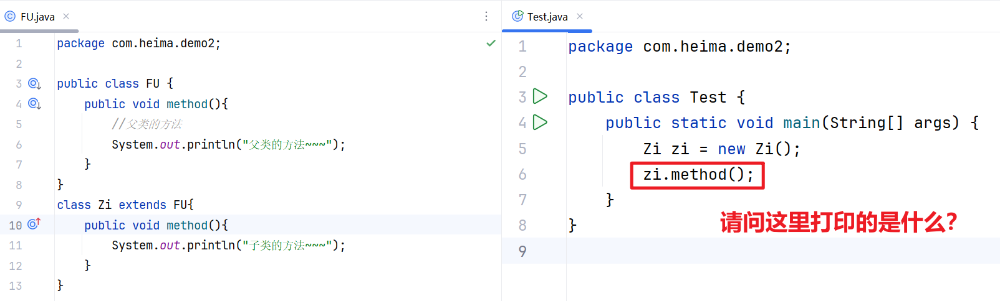

以上代码执行的结果是“子类的方法~~~”，但是不是就近原则访问，而是方法的重写

在 Java 中，方法重写（Override） 是指子类重新定义父类中已有的方法，使子类对象在调用该方法时，执行的是子类的实现而非父类的实现。这是实现多态的核心机制之一。

简单理解为：当子类觉得父类中的某个方法不好用，或者无法满足自己的需求是，<span style="color:red;">子类可以重写一个方法名称，参数列表一样的方法</span >，去覆盖父类的这个方法；

格式要求：子类重写父类方法的时候，方法声明需要和父类完全一致；

#### 6.2.引导案例

**需求说明：**

1.定义父类 `Employee`（员工类）

- 定义私有成员变量：`private String name`（员工姓名）
- 为私有姓名提供对应的 `getter` 和 `setter` 方法
- 定义成员方法 `work()`：输出内容为 `姓名 + 每天早上8:00准时打卡上班！`

2.定义子类 `Developer`（开发人员类）

- 让该类继承父类 `Employee`

- 重写父类的 `work()` 方法（必须添加 `@Override` 注解）

- 重写后的work()方法输出以下三行内容：

   > 姓名 + 每天早上 10:00 准时打卡上班！
   >
   > 打完卡后就开始工作：写代码，调试 Bug~~
   >
   > 姓名 + 每天晚上 8:30 准时打卡下班！

- 注意：子类中不能直接访问父类的私有成员变量 name，必须通过父类提供的 getName () 方法获取姓名

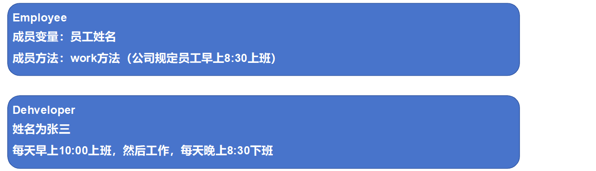

**代码实现：**

员工类Employee

```java
public class Employee {
    //成员属性
    private String name;    // 姓名

    public String getName() {
        return name;
    }

    public void setName(String name) {
        this.name = name;
    }

    //工作方法
    public void work() {
        System.out.println(name +"每天早上8:00准时打卡上班！");
    }
}
```

开发人员

```java
public class Developer extends Employee {
    //方法重写
    @Override
    public void work() {
        //super.work();//保留父类的逻辑（根据需求删除或者保留）
        System.out.println(getName() +"每天早上10:00准时打卡上班！");
        System.out.println("打完卡后就开始工作：写代码，调试Bug~~");
        System.out.println(getName() +"每天晚上8:30准时打卡下班！");
    }
}
```

测试类

```java
public class Test {
    public static void main(String[] args) {
        Developer d1 = new Developer();
        d1.setName("小哈叔");
        d1.work();
    }
}
```

打印结果

```
小哈叔每天早上10:00准时打卡上班！
打完卡后就开始工作：写代码，调试Bug~~
小哈叔每天晚上8:30准时打卡下班！
```

#### 6.3.方法重写的注意事项

重写小技巧：使用Override注解，他可以指定java编译器，检查我们方法重写的格式是否正确（比如重新的方法名和原来不一样就会报错或者形参列表不一样），代码可读性也会更好。

子类重写父类方法时，访问权限必须大于或者等于父类该方法的权限（ public > protected > default）。

私有方法、静态方法不能被重写，如果重写会报错的。

### 7.继承的特点

#### 7.1.概述

Java只支持单继承，不支持多继承，但支持多层继承

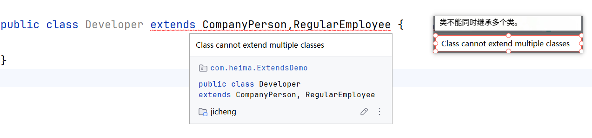

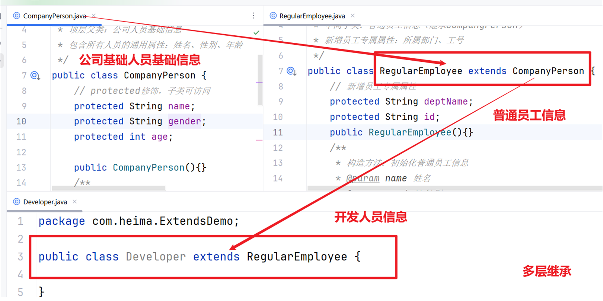

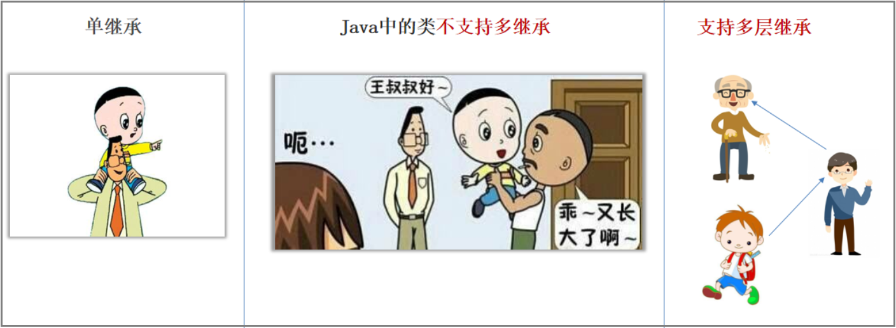


#### 7.2.案例

需求： 如图所示，基于「公司人员体系」设计多层继承结构，最终输出指定格式的员工信息：

```
小哈，性别男，23岁，所属部门 - 软件开发部，工号SF006，薪资为8000
```

```java
// 顶层父类：公司人员信息
/
 * 顶层父类：公司人员基础信息
 * 包含所有人员的通用属性：姓名、性别、年龄
 */
public class CompanyPerson {
    // protected修饰，子类可访问
    protected String name;
    protected String gender;
    protected int age;

    public CompanyPerson(){}
    /
     * 构造方法：初始化基础人员信息
     * @param name 姓名
     * @param gender 性别
     * @param age 年龄
     */
    public CompanyPerson(String name, String gender, int age) {
        this.name = name;
        this.gender = gender;
        this.age = age;
    }
}
```

```java 
//RegularEmployee（中间子类）
/
 * 中间子类：普通员工信息（继承CompanyPerson）
 * 新增员工专属属性：所属部门、工号
 */
public class RegularEmployee extends CompanyPerson {
    // 新增员工专属属性
    protected String deptName;
    protected String id;
	
     public RegularEmployee(){}
    /
     * 构造方法：初始化普通员工信息
     * @param name 姓名
     * @param gender 性别
     * @param age 年龄
     * @param deptName 所属部门
     * @param id 工号
     */
    public RegularEmployee(String name, String gender, int age, String deptName, String id) {
        // 调用父类构造方法初始化基础信息
        super(name, gender, age);
        this.deptName = deptName;
        this.id = id;
    }
}
```

```java 
//Developer（底层子类）
/
 * 底层子类：开发人员（继承RegularEmployee）
 * 新增开发人员专属属性：薪资
 */
public class Developer extends RegularEmployee {
    // 开发人员专属属性（私有，仅本类访问）
    private double salary;
	
    public Developer(){}
    /
     * 构造方法：初始化开发人员信息
     * @param name 姓名
     * @param gender 性别
     * @param age 年龄
     * @param deptName 所属部门
     * @param id 工号
     * @param salary 薪资
     */
    public Developer(String name, String gender, int age, String deptName, String id, double salary) {
        // 调用父类构造方法初始化员工信息
        super(name, gender, age, deptName, id);
        this.salary = salary;
    }

    /
     * 输出开发人员完整信息（严格匹配指定格式）
     */
    public void showInfo() {
        System.out.println(name + "，性别" + gender + "，" + age + "岁，所属部门 - " + deptName + "，工号" + id + "，薪资为" + (int)salary);
    }
}
```

测试

```java
/
 * 测试类：运行并验证多层继承的输出结果
 */
public class TestDemo {
    public static void main(String[] args) {
        // 实例化开发人员对象，传入指定参数
        Developer dev = new Developer("小哈", "男", 23, "软件开发部", "SF006", 8000);
        // 调用方法输出信息
        dev.showInfo();
    }
}
```

#### 7.3.this和super关键字

this代表当前对象的引用，指向 “自己”，用来区分自己的属性 / 方法和外部变量（如构造方法参数）

super代表父类对象的引用，指向 “老爸 / 爷爷”，用来访问父类的属性、方法、构造方法

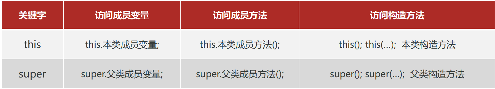

**super访问成员变量和方法的细节**

>  super.父类成员变量
>
>  super.父类成员方法()

如果调用的成员，在子类中不存在，super可以省略不写,

实际上子类继承了父类，此时子类就有了一份父类的成员变量，所以我们访问的是this.成员变量 和 this.成员方法

```java
public class Demo1 {
    public static void main(String[] args) {
        Zi zi = new Zi();
        zi.method();
    }
}
class Fu {
    int num = 10;
    public void show(){
        System.out.println("Ful类的show方法~~~");
    }
}
/*
     super的调用细节：
        super.父类成员变量
        super.父类成员方法();
        如果调用的成员，在子类中不存在，super可以省略不写,
        实际上子类继承了父类，此时子类就有了一份父类的成员变量，
        所以我们访问的是this.成员变量 和 this.成员方法
 */
class Zi extends Fu{
    //子类中访问父类的成员和方法
    public void method(){
        //System.out.println(super.num);
        System.out.println(num);
        //super.show();
        show();
    }
}
```

**this访问构造器方法**

this访问本类构造器

- this()
- this(参数)

举个例子：如果某一个项目在1.0版本完成上线后，需要升级2.0版本，需要一个新功能，这个功能是在原本构造器的基础上添加一些参数，此时就需要用到this访问构造器

```java
/*
    项目1.0 版本 记录明星的姓名年龄性别
 */
public class Demo2 {
    public static void main(String[] args) {
        Star star = new Star("黄晓明",48,'男');
        System.out.println(star);
    }
}
class Star {
    String name;
    int age;
    char sex;

    public Star() {
    }
    public Star(String name, int age,char sex) {
        this.name = name;
        this.age = age;
        this.sex = sex;
    }
}
```

项目升级2.0，新功能，记录明星的姓名、年龄、性别、身高和代表作，次数你要是直接更改有参构造器，1.0项目的中所有实例对象都要更改，会造成很大的不方便，此时我们就可以，在类中多定义一个构造器器完成，使用this访问本类构造器简化代码

理解为：类中存在多个构造器，某些构造器中的内容已经被其他构造器实现，直接使用this调用即可，而且this调用是必须放在构造方法的第一行；

```java
/*
    项目1.0 版本 记录明星的姓名年龄性别
    项目升级2.0，记录明星的姓名、年龄、性别、身高和代表作
 */
public class Demo2 {
    public static void main(String[] args) {
        Star star1 = new Star("黄晓明",48,'男');
        //项目2.0的功能不影响1.0部分使用
        Star star2 = new Star("刘德华",64,'男',174,"《忘情水》");
    }
}
class Star {
    String name;
    int age;
    char sex;
    double height;
    String masterpiece;

    public Star() {
    }
    public Star(String name, int age,char sex) {
        this.name = name;
        this.age = age;
        this.sex = sex;
    }
	//新功能构造器
    public Star(String name, int age, char sex, double height, String masterpiece) {
        //name、age、sex前面的构造器定义过了
        //this.name = name;
        //this.age = age;
        //this.sex = sex;
        //使用this调用本类构造器简化代码
        this(name,age,sex);
        this.height = height;
        this.masterpiece = masterpiece;
    }
}
```

**子类构造器的特点**

子类的全部构造器，都会先调用父类的构造器，再执行自己。

子类构造器是如何实现调用父类构造器的：

默认情况下，子类全部构造器的第一行代码都是 super() （写不写都有） ，它会调用父类的无参数构造器。
如果父类没有无参数构造器，则我们必须在子类构造器的第一行手写super(….)，指定去调用父类的有参数构造器。

有无参构造器时

```java
public class Fu {
    public Fu() {
        System.out.println("~~~父类的无参构造器被执行啦~~~");
    }
}
```

```java
class Zi extends Fu {
    public Zi() {
        //super(); //默认存在
        System.out.println("~~~子类的无参构造器执行啦~~~");
    }
}
```

```java
public class Test {
    public static void main(String[] args) {
        Zi zi1 = new Zi();
        Zi zi2 = new Zi();
    }
}
```

有参构造器时，必须在子类构造器的第一行手写super(….)

```java
public class Fu {
    public Fu(String name,int age) {
        System.out.println("~~~父类的有参构造器被执行啦~~~");
    }
}
```

```java
class Zi extends Fu {
    public Zi(int a) {
        super(name,age); //直接调用父类的有参构造器
        System.out.println("~~~子类的有参构造器执行啦111~~~");
    }
}
```

### 8.综合案例

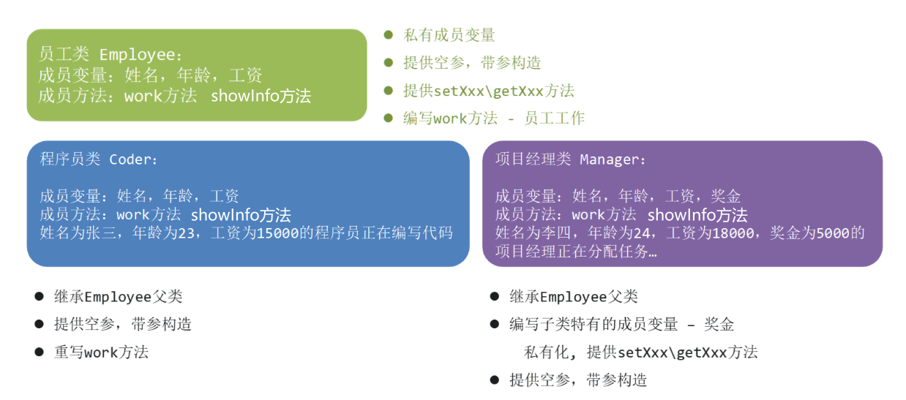

在控制台打印以下结果

```
姓名为小哈，年龄23，工资为15000.0的程序员
正在编写代码~~~
姓名为苗苗，年龄25，工资为18000.0项目经理,奖金为5000.0
正在分配任务~~~
```

#### 8.1.员工父类

```java
public class Employee {
    private String name;
    private int age;
    private double salary;
    //无参构造器
    public Employee() {
    }
    //有参构造器
    public Employee(String name, int age, double salary) {
        this.name = name;
        this.age = age;
        this.salary = salary;
    }
    //set/get方法
    .......
    //成员方法
    public void work(){
        System.out.println("正在工作");
    }
    public void showInfo(){
        System.out.println("姓名为"+name+"，年龄"+age+"，工资为"+salary+"的员工");
    }
}
```

#### 8.2.程序员类

```java
public class Coder extends Employee{
    public Coder() {
    }

    public Coder(String name, int age, double salary) {
        super(name, age, salary);
    }

    @Override
    public void work() {
        System.out.println("正在编写代码~~~");
    }

    @Override
    public void showInfo(){
        System.out.println("姓名为"+getName()+"，年龄"+getAge()+"，工资为"+getSalary()+"的程序员");
    }
}
```

#### 8.3.项目经理类

```java
public class Manager extends Employee {
    private double bonus;
	
    public double getBonus() {
        return bonus;
    }

    public void setBonus(double bonus) {
        this.bonus = bonus;
    }···

    public Manager() {
    }

    public Manager(double bonus) {
        this.bonus = bonus;
    }

    public Manager(String name, int age, double salary, double bonus) {
        super(name, age, salary);
        this.bonus = bonus;
    }
    @Override
    public void work() {
        System.out.println("正在分配任务~~~");

    }
    @Override
    public void showInfo(){
        System.out.println("姓名为"+getName()+"，年龄"+getAge()+"，工资为"+getSalary()+"项目经理,奖金为"+getBonus());
    }
}
```

#### 8.4.测试类

```java
public class Test {
    public static void main(String[] args) {
        Coder c1 = new Coder("小哈",23,15000);
        c1.showInfo();
        c1.work();

        Manager m1 = new Manager("苗苗",25,18000,5000);
        m1.showInfo();
        m1.work();
    }
}
```

# 二、Object类

### 1.概述

在 Java 中，`java.lang.Object` 是所有类的根类（超类），任何类都直接或间接继承自 `Object`。

简单理解为：object类是java所有类的祖宗类。我们写的任何一个类，其实都是object的子类或子孙类。

以下代码，Father默认继承了Object，可以使用Object的相关方法

```java
public class Object {
    public static void main(String[] args) {
        Father f = new Father();
        f.name = "王小哈";
        //Father 默认继承了Object类的相关操作
        System.out.println(f.toString());
    }
}
```

###  2.关于toString()

`toString()` 是 Java 中 `Object` 类的一个核心方法，所有类都默认继承了它，主要作用是返回对象的字符串表示形式，方便我们打印、调试和理解对象的内容。

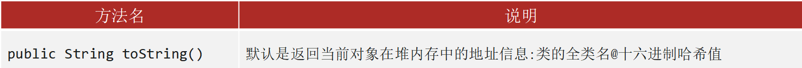

toString() 直接打印对象时 类名@十六进制哈希值（如 Person@1b6d3586），几乎没有实际意义；
```java
public class Test {
    public static void main(String[] args) {
        Developer dev = new Developer("小哈","男",23,"软件开发部","SF006",8000);
        System.out.println(dev.toString());//com.heima.ExtendsDemo.Developer@1d81eb93
    } 
}
```
开发中输出对象变量，更多的时候是希望看到对象的内容数据而不是对象的地址信息

此时我们就可以通过方法重写得到我们想要的数据内容

- 需要去对应的类里面重写toString()方法
- IDEA快捷方式 Alt + Insert

```java
@Override
public String toString() {
    return "Developer{" +
            "name='" + name + '\'' +
            ", gender='" + gender + '\'' +
            ", age=" + age +
            ", deptName='" + deptName + '\'' +
            ", id='" + id + '\'' +
            ", salary=" + salary +
            '}';
}
```

# 三、final关键字

## 1.概述

final 关键字是最终的意思，可以修饰（方法，类，变量）

final 修饰的特点

- 修饰方法：表明该方法是最终方法，不能被重写
- 修饰类：表明该类是最终类，不能被继承
- 修饰变量：表明该变量是常量，不能再次被赋值

### 1.1.修饰类

被 `final` 修饰的类不能被继承（即没有子类）。

```java
public final class Fu {

}
//Fu类被final修饰了，最终类不能被继承
class Zi extends Fu{} //报错
```

### 1.2.修饰方法

被 `final` 修饰的方法不能被子类重写（override），但可以被继承和调用。

常用于保护核心方法逻辑不被修改。

```java
public class Parent {
    public final void eat(){};
}

class Child extends Parent {
    @Override
    public void eat() { //报错
    }
}
```

### 1.3.修饰变量（常量）

被 `final` 修饰的变量一旦赋值，就不能再修改（即成为常量）。

必须在声明时或构造方法中初始化，否则会报错。

final修饰基本类型的变量，变量存储的数据不能被改变。

final修饰引用类型的变量，变量存储的地址不能被改变，但地址所指向对象的内容是可以被改变的。

```java
public class Fu2 {
    //01 - 成员变量  基本类型
    public final int number = 1;
    //02 - 引用类型
    public final int[] num = new int[2];
    //03 - 对象类型（引用数据类型）
    public final Student student = new Student();

    public static void main(String[] args) {
        Fu2 f = new Fu2();
        //01 - 不能修改final修饰的变量
        //f.number = 42; //报错
        //f.number = 68; //报错  ...

        //02 - 引用数据类型，不能修改的是地址值，但是地址值中的元素是可以修改的
        f.num[0] = 11;
        f.num[0] = 12;
       // f.num = new int[12]; //报错，不能修改final修饰的引用数据类型的地址
        
        //03 - 修改Student对象的name属性
        f.student.name =  "小哈";
        //重新赋值是可以的，因为对象是引用数据类型，不能修改的是地址值
        f.student.name =  "小米"; 
    }
}
```

## 2.常量

### 1.概述

定义：使用了static final修饰的成员变量就被称为常量。

作用：通常用于记录系统的配置信息，常用来定义一些固定的值-“统一管理、安全可控、提升效率”；

命名规范：
- 如果是一个单词，所有字母大写
- 如果是多个单词，所有字母大写，中间用下划线_分割

### 2.案例

```java
/
 * 学生信息管理系统 - 通用常量类
 * 存储系统基础配置、版权信息等全局常量
 */
public class SystemConstants {

    // ======== 核心规范：私有化构造器，禁止实例化 ======================
    private SystemConstants() {}

    // ===== 1. 系统基础信息常量（分组注释，结构清晰） ======================
    / 系统名称 */
    public static final String PROJECT_NAME = "学生信息管理系统";
    / 系统版本号 */
    public static final String PROJECT_VERSION = "1.0.0";

    // ====================== 2.作者信息常量 ======================
    / 软件开发者 */
    public static final String AUTHOR_NAME = "小哈";
    / 开发公司名称 */
    public static final String COMPANY_NAME = "程序员";
    / 公司备案号（公安备案） */
    public static final String RECORD_NUMBER = "京公网安备325158574号";

}
```

测试类

```java
public class TestConstants {
    public static void main(String[] args) {
        // 打印系统基础信息
        System.out.println("=== 系统信息 ===");
        System.out.println("系统名称：" + SystemConstants.PROJECT_NAME);
        System.out.println("版本号：" + SystemConstants.PROJECT_VERSION);
        System.out.println("开发者：" + SystemConstants.AUTHOR_NAME);
        System.out.println("开发公司：" + SystemConstants.COMPANY_NAME);
        System.out.println("备案号：" + SystemConstants.RECORD_NUMBER);
    }
}
```

```
=== 系统信息 ===
系统名称：学生信息管理系统
版本号：1.0.0
开发者：小哈
开发公司：程序员
备案号：京公网安备325158574号
```

# 四、抽象类

当多个类有共同的属性和行为，我们可以把共同属性和行为抽取出来作为父类使用，但某些行为父类无法直接实现，将这些行为编写为抽象方法，具体功能交给子类实现。

在Java中有一个关键字叫：abstract 就是抽象的意思，可以用来修饰类、成员方法；

abstract修饰类，这个类就是抽象类，修饰方法，这个方法就是抽象方法。

## 1.基本语法

```java
public abstract class 类名 {
    public abstract 返回值类型 方法名(形参列表);
}
```

```java
//被abstract修饰的类就叫做抽象类
public abstract class Fu {
    //被abstract修饰的方法就是抽象方法(不需要写大括号)
    public abstract void show();
}
```

## 2.引导案例

比如动物类Animal类，我们可以设置某种实例动物的名字，需要设置一个动物吃东西方法eat和叫声方法cry，但是不能确定具体那种动物吃什么东西和怎么叫，需要具体动物继承实现；

```
=== 猫的行为 ===
橘猫：喵喵喵~
橘猫：吃小鱼干🐟

=== 狗的行为 ===
金毛：汪汪汪！
金毛：吃骨头🦴
```

```java
public abstract class Animal {
    String name;

    //行为：抽象方法的作用，把一类的某一个功能交给子类进行实现
    public abstract void eat();
    public abstract void cry();
}
```

此时以下代码会报错，需要我们实现具体方法

```java
public class Cat extends Animal {
}
```

```java
public class Dog extends Animal {
}
```

## 3.注意事项

抽象类中不一定有抽象方法，有抽象方法的类一定是抽象类。

抽象类中可以有构造器（子类继承使用）和普通成员方法（子类继承直接调用）。

```java
public abstract class Animal {
    String name;
    int age;

    //行为：抽象方法的作用，把一类的某一个功能交给子类进行实现
    public abstract void eat();
    public abstract void cry();

    //普通成员方法 喝水，动物喝水一致
    public void drink(){
        System.out.println("喝山水~~~");
    };
    //构造器，可以有但是不能创建对象，主要是用来给子类使用
    public Animal(){}

    public Animal(String name, int age) {
        this.name = name;
        this.age = age;
    }
}
```

抽象类不能创建对象（不能实例化），作为一种特殊的父类，让子类继承并实现。

```java
public static void main(String[] args) {
    Animal animal = Animal(); //报错
}
```

一个类继承抽象类，必须重写完抽象类的全部抽象方法，否则这个类也必须定义成抽象类。

```java
public class Cat extends Animal {
    @Override
    public void eat() {
        System.out.println("猫吃鱼儿~~");
    }
    @Override
    public void cry() {
        System.out.println("喵喵喵~~~");
    }
}
```

## 4.综合案例

之前写过 `Employee` 父类和 `Coder` 子类，父类的 `work()` 和`showInfo()`方法返回 “员工工作” 和 “员工信息”，但不同员工（程序员、经理、测试）的工作内容完全不同，父类的 `work()`和`showInfo()` 逻辑其实是 “无意义的默认值”，我们是硬写~~~~

此时我们就可以将`Employee`改成抽象类，将work方法和showInfo方法抽象成抽象方法

```java
public abstract class Employee {
    private String name;
    private int age;
    private double salary;
    //无参构造器
    public Employee() {
    }
    //有参构造器
    public Employee(String name, int age, double salary) {
        this.name = name;
        this.age = age;
        this.salary = salary;
    }
    //set/get方法---自己写
    
    //成员方法
    public abstract void work();
    public abstract void showInfo();
}
```

## 5.关键字的冲突问题 

final：被 abstract 修饰的方法，强制要求子类重写，被 final 修饰的方法子类不能重写

private：被 abstract 修饰的方法，强制要求子类重写，被 private 修饰的方法子类不能重写

static：被 static 修饰的方法可以类名调用，类名调用抽象方法没有意义

# 五、模版设计模式

设计模式一般是架构师必备知识，用来开发框架使用的，我们需要了解一下，后期面试笔试的时候会有用，后期使用框架的时候有助于我们看框架源码。

## 1.设计模式概述

Java 中的设计模式是一套经过总结的、解决特定问题的代码设计经验，目的是让代码更易维护、可扩展、复用性更高。简单理解为：

一个问题通常有n种解法，其中肯定有一种解法是最优的，这个最优的解法被人总结出来了，称之为设计模式。

设计模式有20多种，对应20多种软件开发中会遇到的问题。

我们需要了解两个问题即可：设计模式能解决什么问题？怎么写？

## 2.模版设计模式简介

把抽象类整体就可以看做成一个模板，模板中不能决定的东西定义成抽象方法，让使用模板的类（继承抽象类的类）去重写抽象方法实现需求 

模板方法设计模式的写法

1. 定义抽象类：作为流程模板的载体，封装通用逻辑与规范。
2. 在抽象类中定义两类核心方法：
   - 模板方法：聚合所有固定的通用流程代码（如业务主流程），是对外提供的核心入口；
   - 抽象方法：仅声明方法规范，无具体实现，将个性化逻辑交由子类完成（强制子类重写）。
3. 模板方法建议用 final 修饰（参考 Java 核心类如 DateFormat）：
   - 模板方法是流程的 “骨架”，直接给子类对象使用的，禁止子类重写；
   - 若子类重写模板方法，会破坏统一的流程规范，导致模板方法失去 “流程统一” 的核心价值。

 就好比我们小时候写作文

- 作文标题和作文结尾就是固定的通用流程 -- 写在模版方法中
- 作文具体内容需要不同人实现 -- 抽象方法实现

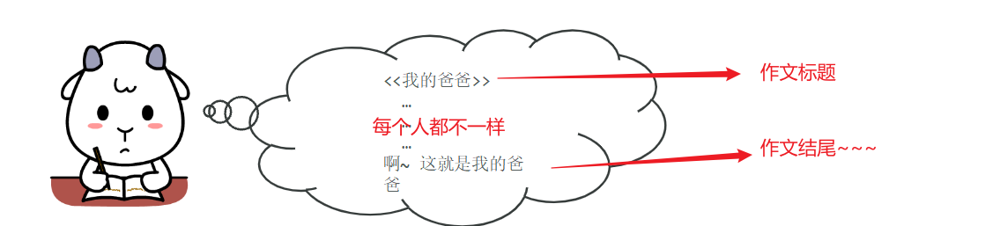

抽象模版

```java
public abstract class TextTemplate {
    public void write(){
        System.out.println("《我的爸爸》");
        body();
        System.out.println("啊~~~这就是我的爸爸！");
    }
    //具体功能交给子类实现
    public abstract void body();
}
```

子类继承实现

```java
public class XiaoHa extends TextTemplate{
    @Override
    public void body() {
        System.out.println("那是一个秋天，风儿缠绵，记忆中爸爸骑着自行车接我放学回家，"+
                "我的脚卡在了车链子李，爸爸蹬不动，就站起来蹬...");
    }
}
```

测试类

```java
public class Test {
    public static void main(String[] args) {
        XiaoHa xiaoHa = new XiaoHa();
        xiaoHa.write();
    }
}
```

## 3.模版设计模式的作用

解决方法中存在重复代码的问题。

模板设计模式的优势，模板已经定义了通用结构，使用者只需要关心自己需要实现的功能即可

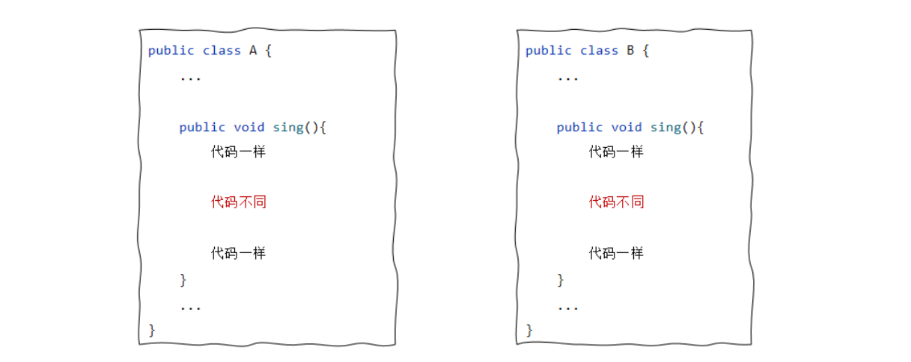

## 4.案例

需求：

公司需统一所有岗位员工的日常工作核心流程，同时保留不同岗位的工作内容差异化，避免流程混乱、工作无明确产出的问题。

核心需求

1. 所有岗位员工遵循统一的日常工作流程，流程固定为：打卡上班→开展核心工作→输出工作成果→整理工作→打卡下班，不允许任意篡改流程顺序；
2. 不同岗位（程序员、经理、测试工程师等）的核心工作内容、工作产出可个性化定义，需明确具体工作动作和产出物；
3. 后续新增岗位（如产品经理、设计师）时，可快速扩展，无需修改原有流程逻辑。

具体要求

统一流程要求（所有岗位通用，不可修改）

- 第一步：打卡上班，到工位就位；
- 第二步：开展本岗位核心工作（个性化）；
- 第三步：输出本岗位工作成果（个性化）；
- 第四步：整理桌面，总结当日工作；
- 第五步：打卡下班，离开公司。

```
=== 程序员的一天 ===
 打卡上班，到工位就位
张三：编写Java代码、修复Bug、联调接口
张三：产出可运行的代码、修复Bug清单
 整理桌面，总结当日工作
 打卡下班，离开公司

=== 经理的一天 ===
 打卡上班，到工位就位
李四：开项目会议、制定计划、协调资源
李四：产出项目计划文档、会议纪要
 整理桌面，总结当日工作
 打卡下班，离开公司

```

抽象类模版

```java
// 抽象类：所有员工的工作模板（模板设计模式核心）
public abstract class EmployeeWorkTemplate {
    // 核心：模板方法（用final锁死流程，子类不能改）
    public final void doDailyWork() {
        // 步骤1：通用流程——上班（固定逻辑）
        goToWork();
        // 步骤2：个性化流程——核心工作（留空白，子类实现）
        coreWork();
        // 步骤3：个性化流程——工作产出（留空白，子类实现）
        workOutput();
        // 步骤4：通用流程——结束工作（固定逻辑）
        finishWork();
        // 步骤5：通用流程——下班（固定逻辑）
        getOffWork();
    }

    // 通用方法1：上班（所有员工都一样，写死）
    private void goToWork() {
        System.out.println(" 打卡上班，到工位就位");
    }

    // 通用方法2：结束工作（所有员工都一样，写死）
    private void finishWork() {
        System.out.println(" 整理桌面，总结当日工作");
    }

    // 通用方法3：下班（所有员工都一样，写死）
    private void getOffWork() {
        System.out.println(" 打卡下班，离开公司\n");
    }

    // 抽象方法1：核心工作（个性化，子类必须实现）
    public abstract void coreWork();

    // 抽象方法2：工作产出（个性化，子类必须实现）
    public abstract void workOutput();
}
```

程序员

```java
// 程序员子类：只填“核心工作+工作产出”的空白，不用碰通用流程
public class Programmer extends EmployeeWorkTemplate {
    private String name; // 程序员姓名

    public Programmer(String name) {
        this.name = name;
    }

    // 实现抽象方法：程序员的核心工作
    @Override
    public void coreWork() {
        System.out.println(name + "：编写Java代码、修复Bug、联调接口");
    }

    // 实现抽象方法：程序员的工作产出
    @Override
    public void workOutput() {
        System.out.println(name + "：产出可运行的代码、修复Bug清单");
    }
}
```

经理

```java
// 经理子类：只填自己的个性化细节
public class Manager extends EmployeeWorkTemplate {
    private String name; // 经理姓名

    public Manager(String name) {
        this.name = name;
    }

    @Override
    public void coreWork() {
        System.out.println(name + "：开项目会议、制定计划、协调资源");
    }

    @Override
    public void workOutput() {
        System.out.println(name + "：产出项目计划文档、会议纪要");
    }
}
```

测试

```java
public class EmployeeTemplateDemo {
    public static void main(String[] args) {
        // 程序员的一天：调用模板方法，自动走完整流程
        Programmer programmer = new Programmer("张三");
        System.out.println("=== 程序员的一天 ===");
        programmer.doDailyWork();

        // 经理的一天：流程不变，只改细节
        Manager manager = new Manager("李四");
        System.out.println("=== 经理的一天 ===");
        manager.doDailyWork();

    }
}
```
