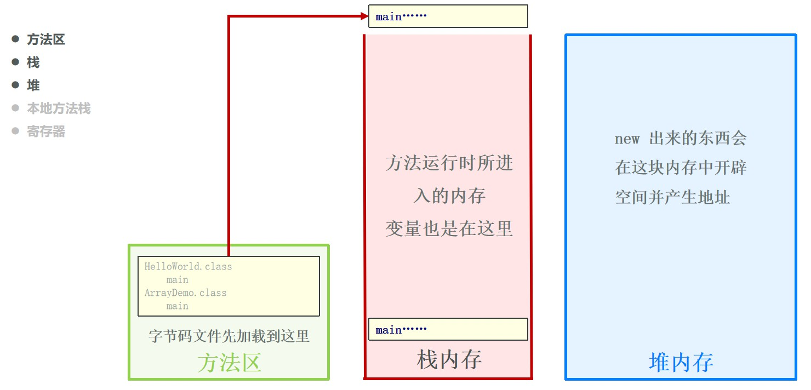
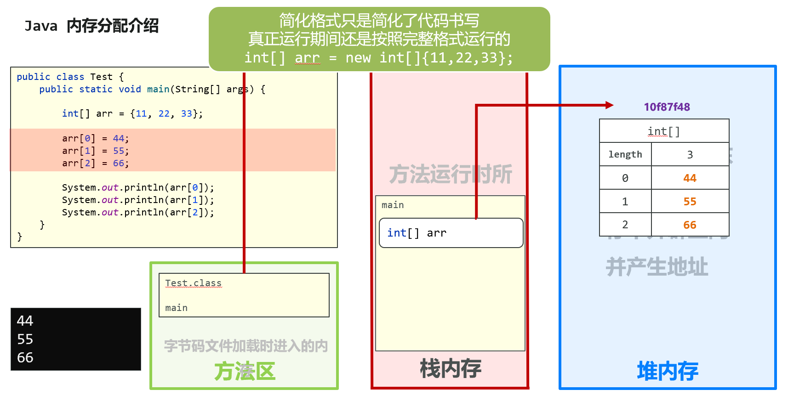
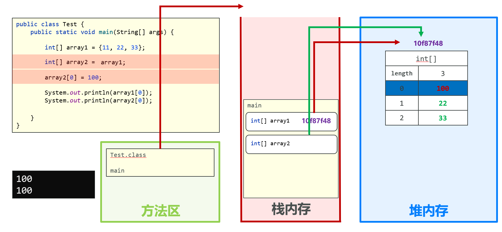
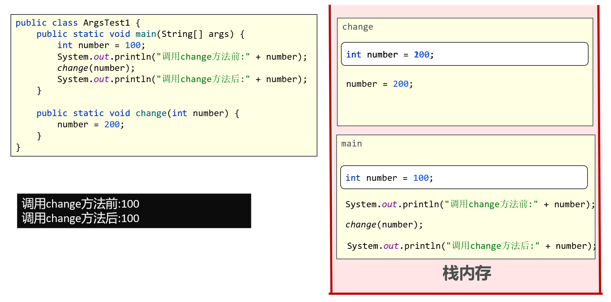
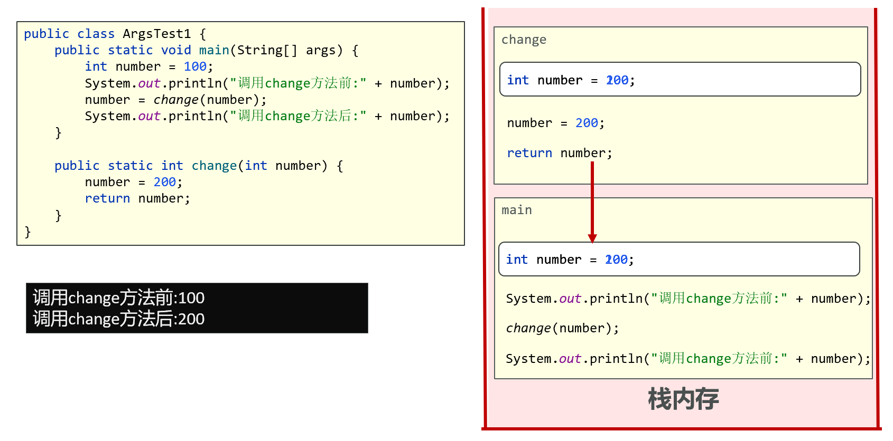
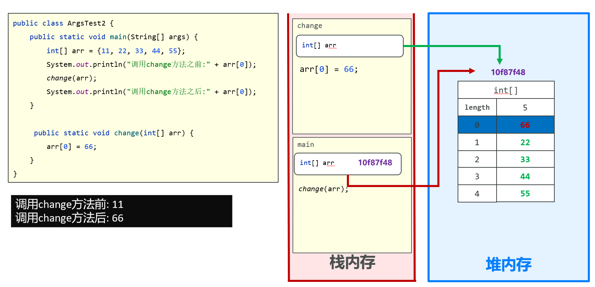
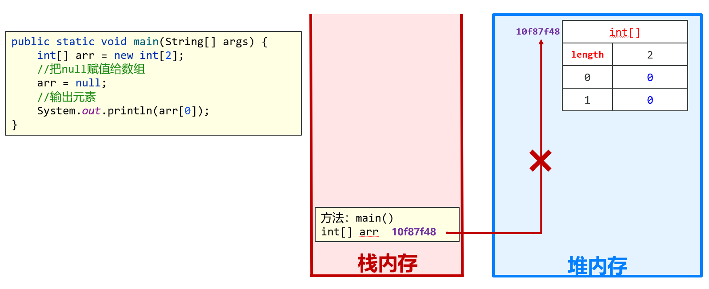

# 第七章：数组

本章内容包括：

- 数组介绍
- 数组的定义和静态初始化
- 数组元素访问
- 数组遍历操作
- 数组动态初始化
- 数组内存图
- 数组常见问题
- 二维数组

## 1. 数组介绍

### 1.1 什么是数组

在 Java 中，**数组（Array）** 是一种用于存储**相同类型数据**的容器，它是一种**引用类型**，长度固定（一旦创建，长度不可改变）。

数组可以存储基本类型（如`int`、`char`）或引用类型（如`String`、对象）的数据。

<b style="color:red;">理解为：数组就是一个容器，用来存一批同种类型的数据。</b>

```java
//20, 10, 80, 60, 90
  int[] arr = {20, 10, 80, 60, 90};
//牛二, 西门, 全蛋
  String[] names = {"牛二", "西门", "全蛋"};
```

### 1.2 什么时候使用数组

如果要操作的数据有多个，并且还属于一个整体，就可以考虑使用数组。

问题案例

```java
 //学员姓名信息存储
 String name1 = "唐僧";
 String name2 = "孙悟空";
 String name3 = "猪八戒";
 String name4 = "沙和尚";
 String name5 = "哪吒";
 //实现点名
 Random random = new Random();
 //获取1-5 之间的随机数
 int num = random.nextInt(5 - 1 + 1) + 1;
 System.out.println(num);
 switch (num) {
     case 1:
         System.out.println(name1 + "：回答问题");
         break;
     case 2:
         System.out.println(name2 + "：回答问题");
         break;
     case 3:
         System.out.println(name3 + "：回答问题");
         break;
     case 4:
         System.out.println(name4 + "：回答问题");
         break;
     case 5:
         System.out.println(name5 + "：回答问题");
         break;
 }
```

数组优化案例

```java
String[] studentNames = {"唐僧","孙悟空","猪八戒","沙和尚","哪吒","白素贞"};
Random random = new Random();
int index = random.nextInt(studentNames.length);
System.out.println(studentNames[index] + "：出来回答问题");
```

### 1.3 场景引入

- 常见需求：找出最大值、找出最小值、计算销售总额
- 如果使用单个变量，需要定义很多变量（如 int a = 10、int b = 20……int i = 90），代码重复且难以管理
- 使用数组后，可以把 10、20、30……90 这些同类数据放入同一个容器中，统一存储和操作

## 2. 数组的定义和静态初始化

### 2.1 数组的定义

数组有两种定义格式：

- 格式一：数据类型[] 数组名
- 格式二：数据类型 数组名[]

范例：

- 格式一范例：`int[] array`
- 格式二范例：`int array[]`

定义数组的代码演示：

```java
public class Demo1Array {
    public static void main(String[] args) {
        int[] array1;
        int array2[];

        System.out.println(array1);
        System.out.println(array2);

        int a;
        System.out.println(a);

    }
}
```

说明：演示代码只是展示两种定义格式。局部变量未初始化时不能直接打印使用（会编译报错），实际使用前必须先完成初始化。

### 2.2 数组静态初始化

- 初始化：就是在内存中为数组容器开辟空间，并将数据存入容器中的过程
- 完整格式：数据类型[] 数组名 = new 数据类型[] { 元素1，元素2，元素3… };
- 简化格式：数据类型[] 数组名 = { 元素1，元素2，元素3… };

完整格式范例：

```java
int[] array = new int[]{ 11，22，33 };
double[] array2 = new double[] { 11.1，22.2，33.3};
```

简化格式范例：

```java
int[] array = { 11，22，33 };
double[] array2 = { 11.1，22.2，33.3};
```

注意事项：简化格式只是简化了代码书写，真正运行期间还是按照完整格式运行的，即 `int[] arr = new int[]{11,22,33};`。

### 2.3 打印数组名

```java
public class Demo1Array {
    public static void main(String[] args) {
        int[] array1 = {11, 22, 33};
        System.out.println(array1);

        double[] array2 = {44.4, 55.5, 66.6};
        System.out.println(array2);
    }
}
```

- 打印数组名，会看到数组在内存中的十六进制地址值
- 输出示例：`[I@10f87f48`、`[D@b4c966a`
- 补充：`[I` 表示 int 类型数组，`[D` 表示 double 类型数组，`@` 后面是数组在堆内存中的十六进制地址

### 2.4 小结

1. 数组的定义格式为：`数据类型[] 数组名;`（或 `数据类型 数组名[];`）
1. 数组的静态初始化格式为：`数据类型[] 数组名 = new 数据类型[]{元素1, 元素2, 元素3...};`，或简化格式 `数据类型[] 数组名 = {元素1, 元素2, 元素3...};`
1. 打印数组名会看到十六进制内存地址

## 3. 数组元素访问

### 3.1 访问格式

- 格式：`数组名[索引];`
- 索引（角标、下标）是数组容器中空间的编号，编号从 0 开始，逐个 +1 增长
- 数组就像一个小组，元素从 0 号开始编号，通过编号即可找到对应的元素
- 例如数组中存有 10、20、30、40，则 `array[2]` 访问的是第 3 个元素 30

```java
int[] ages = {12,24,36};
//访问数组
System.out.println(ages[0]);
System.out.println(ages[1]);
System.out.println(ages[2]);
String[] names = {"小张","小明","小花"};
//访问数组
System.out.println(names[0]);
System.out.println(names[1]);
System.out.println(names[2]);
```

### 3.2 数组长度

- `数组名.length`：动态获取数组的长度（元素的个数）
- 最后一个元素的索引为 `length - 1`

```java
int[] nums = {1, 2, 3};
System.out.println(nums.length); // 输出：3（长度为3）
```

## 4. 数组遍历操作

### 4.1 遍历介绍

- 数组遍历：依次访问数组中的每一个元素
- 遍历方式：从索引 0 开始，每次索引 +1，直到访问完最后一个元素

```java
int[] scores = {85, 92, 78};
// 遍历并打印所有元素
for (int i = 0; i < scores.length; i++) { 
    // i从0到length-1
    System.out.println(scores[i]);
}
```

### 4.2 案例一：求偶数和

需求：已知数组元素为 `{11,22,33,44,55}`，请将数组中偶数元素取出并求和，最后打印求和结果。

分析：

1. 静态初始化数组
1. 定义求和变量
1. 遍历数组取出每一个元素
1. 判断当前元素是否是偶数，是的话跟求和变量做累加操作
1. 打印求和变量

```java
public class Demo {
    public static void main(String[] args) {
        //1.静态初始化数组
        int[] arr = {11,22,33,44,55};
        //2.定义求和变量，初始值0
        int sum = 0;

        //3.遍历数组每一个元素
        for (int i = 0; i < arr.length; i++) {
            int num = arr[i];
            //4.判断是否是偶数：对2取余等于0
            if(num % 2 == 0){
                sum = sum + num; // 偶数就累加
            }
        }
        //5.打印求和结果
        System.out.println("数组偶数总和：" + sum);
    }
}
```

### 4.3 案例二：求最大值

需求：已知数组元素为 `{5,44,33,55,22}`，请找出数组中最大值并打印在控制台。

思路（擂台思想）：

1. 定义 max 变量来记录擂台上不断变化的数据
1. 数组中 0 号选手先上台，因此 `int max = arr[0];`
1. 遍历数组取出每一个元素，索引从 1 开始
1. 逐个进行比较，找到更大的，max 变量记录更大的数据
1. 遍历后打印 max 变量所记录的值

```java
public class MaxDemo {
    public static void main(String[] args) {
        //1.定义数组
        int[] arr = {5,44,33,55,22};
        //2.擂台：让第一个元素先上台
        int max = arr[0];

        //3.遍历，索引从1开始（0号已经当擂主了）
        for(int i = 1; i < arr.length; i++){
            //取出当前选手
            int num = arr[i];
            //4.如果当前元素比擂主max大，更新max
            if(num > max){
                max = num;
            }
        }
        //5.输出最大值
        System.out.println("数组最大值：" + max);
    }
}
```

### 4.4 案例三：数组元素反转

需求：已知一个数组 `arr = {11, 22, 33, 44, 55};`，用程序实现把数组中的元素值交换，交换后的数组 `arr = {55, 44, 33, 22, 11};`，并在控制台输出交换后的数组元素。

铺垫：实现两个变量的数据交换（如 `int a = 10;`、`int b = 20;`），需要定义第三个变量完成交换。就像啤酒和红酒互换位置，需要借助第三个容器。

```java
int c = a;
a = b;
b = c;
```

反转思路：使用两个变量模拟出两个指针，指针指向的位置做交换。

1. 定义指针：`int start = 0，end = arr.length – 1;`
1. 交换条件：`start < end`
1. 交换内容：`arr[start]` 和 `arr[end]`
1. 每次交换后：`start++`，`end--`
1. 当 start >= end 时停止交换

```java
public class ReverseDemo {
    public static void main(String[] args) {
        int[] arr = {11, 22, 33, 44, 55};

        //1.定义双指针：start从头，end从尾巴
        int start = 0;
        int end = arr.length - 1;

        //2.循环交换：start < end才交换；相遇/交叉就停止
        while (start < end) {
            // 借助第三方变量交换 arr[start] 和 arr[end]
            int temp = arr[start];
            arr[start] = arr[end];
            arr[end] = temp;

            //4.头指针往后走，尾指针往前走
            start++;
            end--;
        }

        //遍历输出反转之后数组
        for (int i = 0; i < arr.length; i++) {
            System.out.print(arr[i] + " ");
        }
    }
}
```

## 5. 数组动态初始化

### 5.1 动态初始化的格式

- 格式：`数据类型[] 数组名 = new 数据类型[数组长度];`
- 范例：`int[] arr = new int[3];`
- 动态初始化：初始化时只指定数组长度，由系统为数组分配初始值

```java
//动态定义数组
int[] ages = new int[3];
//赋值
ages[0] = 20;
ages[1] = 18;
ages[2] = 22;
```

### 5.2 系统默认初始值

| 数据类型 | 明细 | 默认值 |
| --- | --- | --- |
| 基本数据类型 | 整数 | 0 |
| 基本数据类型 | 小数 | 0.0 |
| 基本数据类型 | 字符 | '\u0000'，常见体现为空白字符 |
| 基本数据类型 | 布尔 | false |
| 引用数据类型 | 类、接口、数组 | null |

### 5.3 动态初始化与静态初始化对比

| 对比项 | 动态初始化 | 静态初始化 |
| --- | --- | --- |
| 格式 | `数据类型[] 数组名 = new 数据类型[长度];` | `数据类型[] 数组名 = {元素1, 元素2, 元素3...};` |
| 特点 | 手动指定长度，系统自动分配默认初始化值 | 手动指定元素，系统计算出数组长度 |
| 场景 | 不明确要操作元素的时候 | 明确具体要操作的元素 |

### 5.4 案例：评委打分

需求：

1. 在编程竞赛中，有 6 个评委为参赛的选手打分，分数为 0-100 的整数分
1. 选手的最后得分为：去掉一个最高分和一个最低分后的 4 个评委平均值

思路参考：

1. 分数个数确定（6 个），可以用动态初始化定义长度为 6 的数组存储分数
1. 遍历数组：累加总分，同时找出最高分和最低分
1. 最后得分 =（总分 - 最高分 - 最低分）÷ 4

```java
public class JudgeScore {
    public static void main(String[] args) {
        // 1. 定义数组存储6位评委分数
        int[] scores = {85, 92, 78, 90, 88, 95};

        // 2. 初始化变量：总分、最高分、最低分
        int sum = 0;
        int max = scores[0];
        int min = scores[0];

        // 一次遍历：累加总分 + 同时找最高分、最低分
        for (int i = 0; i < scores.length; i++) {
            int score = scores[i];
            sum += score;

            // 更新最高分
            if (score > max) {
                max = score;
            }
            // 更新最低分
            if (score < min) {
                min = score;
            }
        }

        // 3. 计算最终得分：去掉1个最高分、1个最低分，剩余4个取平均
        // 除以 4.0 保证结果为小数，避免整数除法截断
        double finalScore = (sum - max - min) / 4.0;

        System.out.println("最高分：" + max);
        System.out.println("最低分：" + min);
        System.out.println("选手最终得分：" + finalScore);
    }
}
```

## 6. 数组内存图

### 6.1 Java 内存分配介绍

- 栈：方法运行时所进入的内存
- 堆：new 出来的东西会在这块内存中开辟空间并产生地址
- 方法区：字节码文件加载时进入的内存
- 本地方法栈、寄存器：了解即可



### 6.2 数组创建与修改的内存图

```java
public class Test {
    public static void main(String[] args) {

        int[] arr = {11, 22, 33};

        arr[0] = 44;
        arr[1] = 55;
        arr[2] = 66;

        System.out.println(arr[0]);
        System.out.println(arr[1]);
        System.out.println(arr[2]);
    }
}
```

内存过程：

1. 方法区：加载 Test.class 字节码文件，main 方法进入栈内存执行
1. 栈内存：main 方法运行时所进入的内存，栈中的 arr 变量保存数组对象的地址值（如 10f87f48）
1. 堆内存：new 出来的数组在堆中开辟空间，数组中包含 length = 3 以及 11、22、33 等元素数据
1. 执行 `arr[0] = 44;`、`arr[1] = 55;`、`arr[2] = 66;`，直接修改堆内存中对应位置的元素

注意事项：简化格式只是简化了代码书写，真正运行期间还是按照完整格式运行的，即 `int[] arr = new int[]{11,22,33};`。



### 6.3 两个数组指向相同内存图

```java
public class Test {
    public static void main(String[] args) {

        int[] array1 = {11, 22, 33};

        int[] array2 = array1;

    }
}
```

- `int[] array2 = array1;` 赋值给 array2 的是数组在堆内存中的地址，array1 和 array2 指向同一个数组对象
- 继续执行 `array2[0] = 100;`，通过 array2 修改堆内存中的元素
- 因为两个变量指向同一个数组，所以打印结果都为 100：

```java
System.out.println(array1[0]);
System.out.println(array2[0]);
```

结论：数组变量之间直接赋值传递的是地址，两个变量操作的是同一个数组。



### 6.4 方法参数传递内存图：基本数据类型

```java
public class ArgsTest1 {
    public static void main(String[] args) {
        int number = 100;
        System.out.println("调用change方法前:" + number);
        change(number);
        System.out.println("调用change方法后:" + number);
    }

    public static void change(int number) {
        number = 200;
    }
}
```

- 输出结果：调用 change 方法前: 100，调用 change 方法后: 100
- 原因：基本数据类型参数传递的是值，change 方法中的 `number = 200;` 只修改了方法栈中的副本，不影响 main 方法中的 number



如果需要方法内修改生效，用返回值接收：

```java
public class ArgsTest1 {
    public static void main(String[] args) {
        int number = 100;
        System.out.println("调用change方法前:" + number);
        number = change(number);
        System.out.println("调用change方法后:" + number);
    }

    public static int change(int number) {
        number = 200;
        return number;
    }
}
```

- 输出结果：调用 change 方法前: 100，调用 change 方法后: 200
- 原因：change 方法通过 return 把修改后的值返回，main 方法用变量接收后完成修改



### 6.5 方法参数传递内存图：引用数据类型

```java
public class ArgsTest2 {
    public static void main(String[] args) {
        int[] arr = {11, 22, 33, 44, 55};
        System.out.println("调用change方法之前:" + arr[0]);
        change(arr);
        System.out.println("调用change方法之后:" + arr[0]);
    }

     public static void change(int[] arr) {
        arr[0] = 66;
    }
}
```

- 输出结果：调用 change 方法之前: 11，调用 change 方法之后: 66
- 原因：数组是引用数据类型，传递的是地址值。change 方法中的形参 arr 与 main 方法中的 arr 指向同一个数组对象，所以 `arr[0] = 66;` 会直接修改堆内存中的数据，调用方也能看到修改结果



## 7. 数组常见问题

### 7.1 索引越界异常

- 异常名称：ArrayIndexOutOfBoundsException（索引越界异常）
- 产生原因：访问了数组中不存在的索引
- 合法索引范围：0 到 length - 1，例如长度为 5 的数组，合法索引是 0-4

### 7.2 空指针异常

- 异常名称：NullPointerException（空指针异常）
- 产生原因：当引用数据类型变量被赋值为 null 之后，地址的指向被切断，还继续访问堆内存数据，就会引发空指针异常

```java
public static void main(String[] args) {
    int[] arr = new int[2];
    //把null赋值给数组
    arr = null;
    //输出元素
    System.out.println(arr[0]);
}
```

内存分析：

1. `int[] arr = new int[2];` 在堆中创建长度为 2 的数组，栈中 arr 保存数组地址
1. 执行 `arr = null;` 后，arr 不再保存堆内存地址，指向被切断
1. 此时执行 `System.out.println(arr[0]);`，找不到堆内存中的数组对象，抛出空指针异常



## 8. 二维数组（了解）

### 8.1 二维数组的概念

- 二维数组是一种容器，该容器用于存储一维数组
- 使用思路：要操作的一维数组有多个，并且属于同一个整体
- 例如四个季度的销售额：第一季度 22、66、44，第二季度 77、33、88，第三季度 25、45、65，第四季度 11、66、99。每个季度是一个一维数组，四个一维数组同属一个整体，可以用二维数组存储

### 8.2 二维数组的定义与初始化

- 完整格式：`数据类型[][] 数组名 = new 数据类型[][] {{元素1,元素2},{元素1, 元素2}};`
- 简化格式：`数据类型[][] 数组名 = {{元素1,元素2}, {元素1, 元素2}};`

完整格式范例：

```java
int[][] arr = new int[][]{{11,22},{33,44}};
```

简化格式范例：

```java
int[][] arr = {{11,22},{33,44}};
```

### 8.3 二维数组元素访问

- 格式：`数组名[索引][索引];`
- 第一个索引定位一维数组，第二个索引定位该一维数组中的元素
- 范例：`arr[1][0];` 表示访问第二个一维数组的第一个元素（值为 33）

### 8.4 二维数组遍历

需求：已知一个二维数组 `arr = { {11 , 22 , 33} , {33 , 44 , 55} };`，遍历该数组，取出所有元素并打印。

分析：

1. 遍历二维数组，取出里面每一个一维数组
1. 在遍历的过程中，对每一个一维数组继续完成遍历，获取内部存储的每一个元素

```java
for (int i = 0; i < arr.length; i++) {
    // arr[i] 就是每一个一维数组
    for (int j = 0; j < arr[i].length; j++) {
		System.out.println(arr[i][j]);
    }
}
```

说明：外层循环取出每一个一维数组，内层循环在 j 循环体内取出元素 `arr[i][j]` 并打印。
