# 一、接口

## 1.定义

Java 接口是 “规范 / 契约”，核心作用是定义标准、解耦和实现多态，<span style=color:red>弥补了类单继承的不足</span>；

java提供了一个关键字interface,用这个关键字我们可以定义出一个特殊的结构 ---- 接口。

```java
public interface 接口名{
    //成员变量（常量）
    //成员方法（抽象方法）
}
```

接口中成员变量，都是常量，默认加了public static final

接口中的成员方法，都是抽象方法，默认加了public abstract

接口中不允许设置构造方法

```java
//JDK 1.7 的接口实现
public interface A {
    //成员变量：必须是公共静态常量（需要赋值）
    public static final String NAME = "hello";
    // public static final 可以省略不写
    int AGE = 18;

    //成员方法：都是公共的抽象方法（不能有方法体）
    //public abstract可以省略不写
    public abstract void show();
}
```

```java
public class Test {
    public static void main(String[] args) {
        //使用方法： 因为是静态常量可以直接用类名方位
        //接口名.属性名
        System.out.println(A.NAME);
        System.out.println(A.AGE);
    }
}
```

## 2.接口的使用

接口使用抽象方法制定好规则后，需要让其他类按照这个规则实现相关功能

接口不能创建对象，接口是用来被类实现（implements）的，实现接口的类称为实现类。

```java
修饰符 class 实现类 implements 接口1,接口2,接口3,...{
    
}
```

一个类可以实现多个接口（接口可以理解成干爹），实现类实现多个接口，必须重写完接口的全部抽象方法，否则实现类需要定义成抽象类。

接口的好处：弥补了单继承的不足，一个类可以实现多个接口。

```java
//实现类
public class A implements B,C {
}
```

```java
//接口
public interface B {
}
```

```java
//接口
public interface C {
}
```

案例

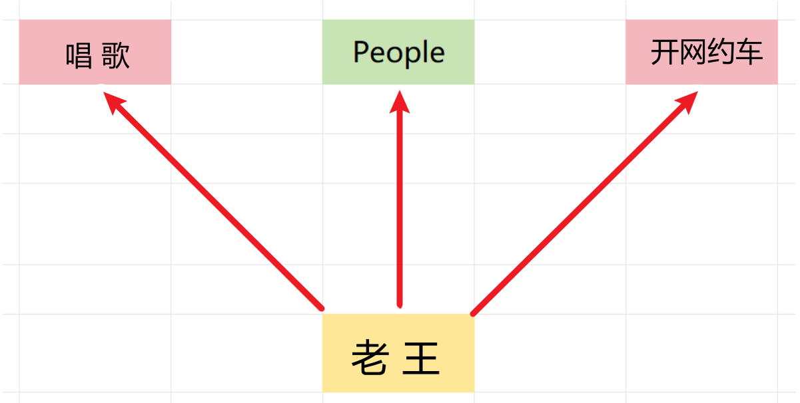

People人类的定义里面抽取人相关的属性和方法

```java
public class People {
    private String name;
    private int age;

    public String getName() {
        return name;
    }

    public void setName(String name) {
        this.name = name;
    }

    public int getAge() {
        return age;
    }

    public void setAge(int age) {
        this.age = age;
    }
}
```

LaoWang类单继承People类，然后使用接口实现 Driver司机,Singer歌手的功能

```java
public class LaoWang extends People implements Driver,Singer {
    private String skill;

    public String getSkill() {
        return skill;
    }

    public void setSkill(String skill) {
        this.skill = skill;
    }
	//接口中的抽象方法必须要重写
    @Override
    public void driver() {
        System.out.println("下班后还要去开滴滴~~~");
    }

    @Override
    public void singer() {
        System.out.println("休息的时候在酒吧唱歌挣钱~~~");
    }
}
```

```java
public interface Driver {
    //抽象方法： 开车功能
    public abstract void driver();
}
```

```java
public interface Singer {
    //抽象类：唱歌功能
    public abstract void singer();
}
```

## 3.接口的优势和作用

1.解决类单继承的问题，通过接口，我们可以让一个类有一个亲爹的同时，还可以找多个干爹去扩展自己的功能。

2.一个类可以实现多个接口，同时一个接口也可以被多个类实现。这样做的好处是我们的程序就可以面相接口编程了，这样我们程序员就可以很方便的灵活切换各种业务实现。

```java
public class Test1 {
    public static void main(String[] args) {
        //Runnable runnable = new Cat();
        Runnable runnable = new Duck();
        runnable.run();
    }
}
```

## 4.类和接口的各种关系

### 4.1.接口和类的关系

实现关系，可以单实现，也可以多实现，甚至可以在继承一个类的同时，实现多个接口

```java
public class LaoWang extends People implements Driver,Singer{}
```

### 4.2.接口和接口的关系

接口文件是一个多继承关系，一个接口可以继承多个接口，用类实现的时候需要重写所有的接口方法

```java
public class Test {

}
interface A {
    void a();
}
interface B {
    void b();
}
//接口和接口之间是多继承关系
interface C extends A, B {
    void c();
}
//使用Student 类实现接口C，需要重写ABC三个接口的方法
class Student implements C {
    @Override
    public void c() {

    }

    @Override
    public void a() {

    }

    @Override
    public void b() {

    }
}
```

# 二、抽象类和接口的对比

## 1.基本对比

成员变量 :

- 抽象类 : 可以定义变量, 也可以定义常量
- 接口 : 只能定义常量 

成员方法

- 抽象类 : 可以是定义具体方法, 也可以定义抽象方法
- 接口 : 只能定义抽象方法

构造方法

- 抽象类 : 有，是给子类使用
- 接口 : 没有

## 2.抽象类的使用场景

抽象类是对事物进行抽象（描述事物）

比如以下项目中，我们可以看到项目经理、程序员、人事，成员属性就一致，但是成员方法确定具体，我们就可以使用抽象完成，然后再让子类去实现

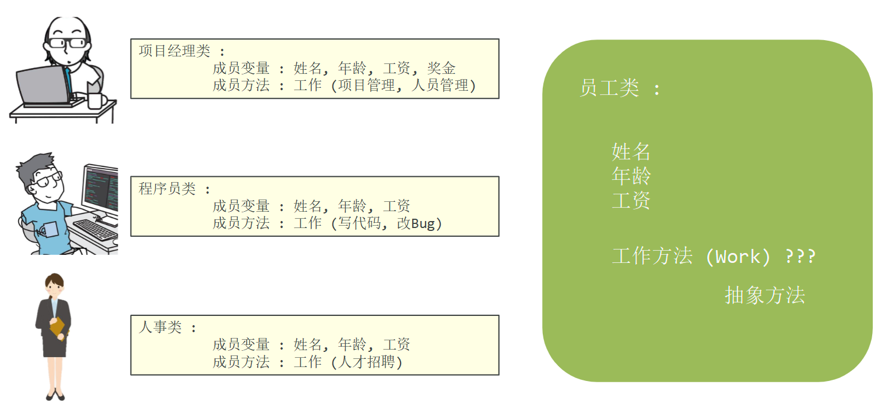

## 3.接口的使用场景

接口对行为进行抽象（制定规则）

接口可以为程序制定规则，代码更加规范

就好比实际开发中我们需要写一个业务订单功能逻辑，里面包含了创建订单、查询订单、查询订单列表、取消订单、完结订单、支付订单


如果我们直接在订单类里面书写，不设计接口的话代码可读性差，而且有可能漏写某些功能~~~

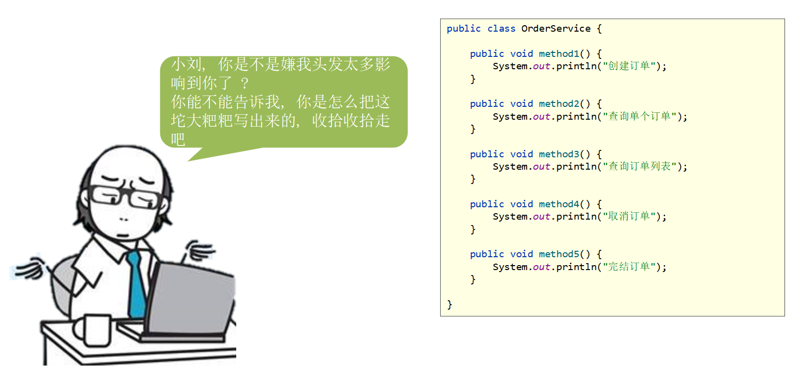

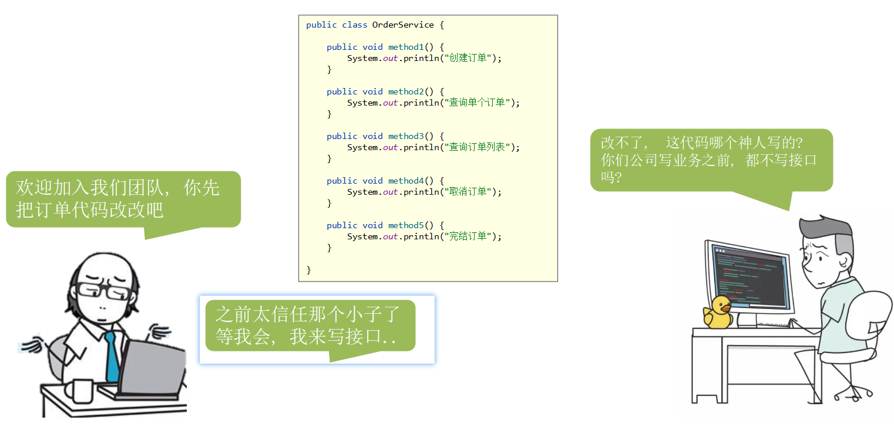

我们要是提前写好了接口，在里面设置好相关的抽象方法，我们在实现功能是直接用相关类实现接口就可以，而且只要接口里面设置好了业务接口，类实现是必须要全部重写，就不会出现漏写的问题

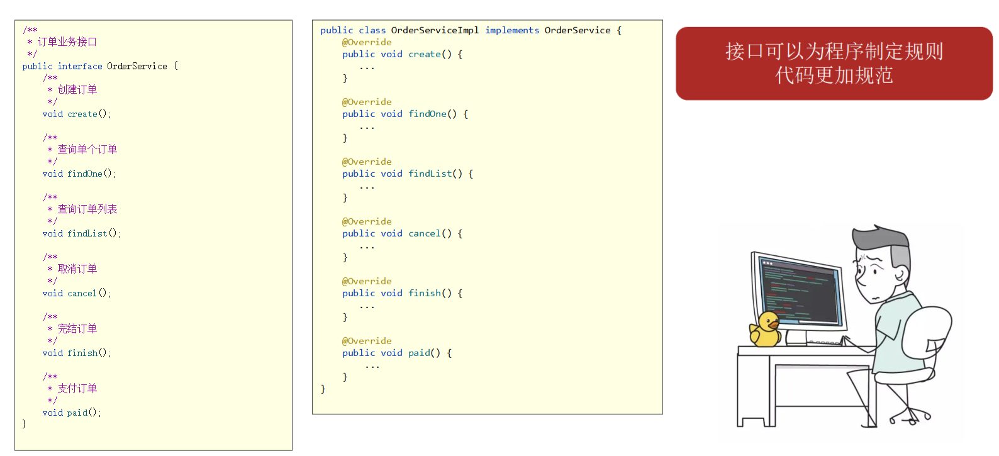

# 三、接口的新特性

## 1.新特性介绍

JDK8的新特性：接口中可以定义有方法体的方法。（默认、静态）

JDK9的新特性：

- 接口中可以定义私有方法。
- 增强了接口能力，更便于项目的扩展和维护。

从 JDK 8 版本开始，接口中的方法允许带有方法体，可以编写逻辑了，这么设计的原因是为了解决接口升级的问题。

假如张三开发的项目，在项目 1.0 版本的时候，接口中有2个抽象方法，成功开发完毕，项目上线，但是在项目 2.0 版本的时候，需要丰富新功能，要加入 10个新方法进去，如果这10个方法都是抽象方法，所有的实现类都要改动，牵一发动全身，维护成本太高了

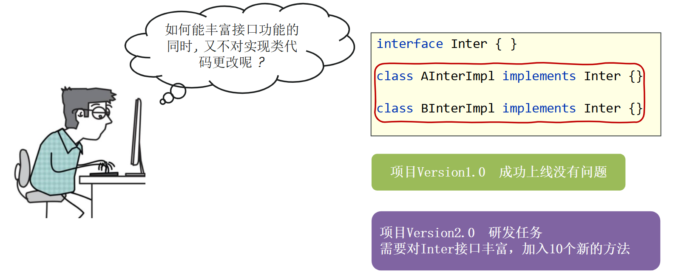

如何能够加入新功能的同时，又不需要改造实现类呢？设想，要是接口中的方法能够带有方法体，而且实现类可以直接拿去用，这就方便了。

## 2.默认方法

允许在接口中定义非抽象方法，但是需要使用关键字 default 修饰，这些方法就是默认方法

作用：解决接口升级的问题，不需要改之前代码，就可以使用default修饰的方法实现

```java
//接口中默认方法的定义格式：public可以省略，但是default不能省略
格式：public default 返回值类型 方法名(参数列表) {}
范例：public default void show() {}
```

注意事项

- 默认方法不是抽象方法，所以不强制被重写  (但是可以被重写，重写的时候去掉default关键字)
- public可以省略，default不能省略
- 如果实现了多个接口，多个接口中存在相同的方法声明，子类就必须对该方法进行重写（逻辑冲突）

项目1.0版本

```java
public class TestInterface1 {
    public static void main(String[] args) {
        OrderServiceImplA a = new OrderServiceImplA();
        a.create();
        a.cancel();
    }
}
interface OrderService {
    void create();//创建订单
    void cancel();//取消订单
}
class OrderServiceImplA implements OrderService {
    @Override
    public void create() {
			System.out.println("创建A订单~~~");
    }

    @Override
    public void cancel() {
			System.out.println("取消A订单~~~");
    }
}

class OrderServiceImplB implements OrderService {
    @Override
    public void create() {
			System.out.println("创建B订单~~~");
    }

    @Override
    public void cancel() {
			System.out.println("取消B订单~~~");
    }
}
```

项目升级，需要多加几个方法，如果使用抽象方法实现，就会出现之前写的所有的实现都需要跟着重写，工作太繁琐

我们就可以使用 default

```java
public class TestInterface1 {
    public static void main(String[] args) {
        OrderServiceImplA a = new OrderServiceImplA();
        a.create();
        a.cancel();
        //默认的default修饰的方法可以调用
        a.paid();
    }
}

interface OrderService {
    void create();//创建订单
    void cancel();//取消订单

    //新建一个支付功能
    public default void paid(){
        System.out.println("支付功能~~~");
    };
}

class OrderServiceImplA implements OrderService {
    @Override
    public void create() {
			System.out.println("创建A订单~~~");
    }

    @Override
    public void cancel() {
			System.out.println("取消A订单~~~");
    }
    //TODO 默认方法不是抽象方法，所以不强制被重写  (但是可以被重写，重写的时候去掉default关键字)
    @Override
    public void paid(){
        System.out.println("订单A支付功能被新增了~~~~~");
    }
}

class OrderServiceImplB implements OrderService {
    @Override
    public void create() {
			System.out.println("创建B订单~~~");
    }

    @Override
    public void cancel() {
			System.out.println("取消B订单~~~");
    }
}
```

逻辑冲突问题

如果一个类实现了两个接口，但是两个接口中的默认方法是一样的，但是逻辑不一样，此时会报错，应该能怎么处理？

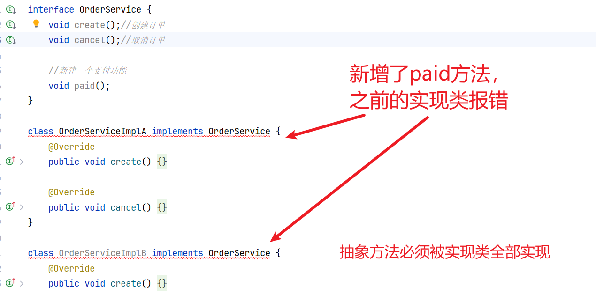

```java
public class Test {
    public static void main(String[] args) {

    }
}
interface A {
    default void method() {
        System.out.println("A的逻辑~~~");
    }
}
interface B {
    default void method() {
        System.out.println("B的逻辑~~~");
    }
}
class C implements A,B{
    @Override
    public void method() {
        A.super.method();
        B.super.method();
    }
}
```

## 3.静态方法

接口中允许定义 static 静态方法

```java 
//接口中静态方法的定义格式：
格式：public static 返回值类型 方法名(参数列表) {}
范例：public static void show() {}
```

注意事项

- 静态方法只能通过接口名调用，不能通过实现类名或者对象名调用
- public可以省略，static不能省略

```java
public class TestInterface1 {
    public static void main(String[] args) {
        OrderServiceImplA a = new OrderServiceImplA();
        a.create();
        a.cancel();
        //静态方法只能使用 接口名调用
        OrderService.show();
       // a.show(); 报错
    }
}

interface OrderService {
    void create();//创建订单
    void cancel();//取消订单
    //新建一个静态方法只能使用 接口名调用
    public static void show(){
        System.out.println("静态方法~~~");
    };
}

class OrderServiceImplA implements OrderService {
    @Override
    public void create() {

    }
    @Override
    public void cancel() {

    }
}

class OrderServiceImplB implements OrderService {
    @Override
    public void create() {

    }
    @Override
    public void cancel() {

    }
}
```

## 4.私有方法

接口中允许定义 private 私有方法

```java 
//接口中私有方法的定义格式：
格式1：private 返回值类型 方法名(参数列表) {}
范例1：private void show() {}

格式2：private static 返回值类型 方法名(参数列表) {}
范例2：private static void method() {}

```

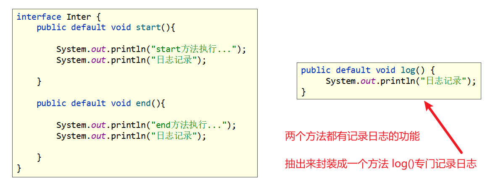

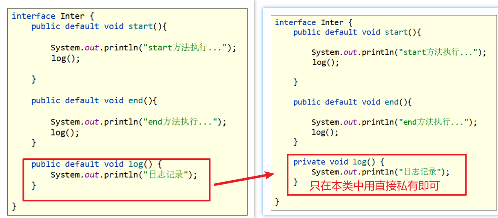

# 四、多态（Polymorphism‌）

同一个行为具有多个不同表现形式或形态的能力（概念先不聊，先聊前提条件）

## 1.多态的前提条件

想要实现多态必须满足以下三个条件

- 有继承 / 实现关系
- 有方法重写
- 有父类引用指向子类对象

```java
public class PolymorphismDemo1 {
    public static void main(String[] args) {
        //直接创建子类对象 -- 子类引用，指向子类引用
        Zi z = new Zi();

        //父类引用，指向子类对象（以多态的形式创建了对象）
        Fu f = new Zi();
    }
}
class Fu{
    int num = 10;
    public void show(){
        System.out.println("Fu ~~~show~~~");
    }
}
class Zi extends Fu{
    int num = 20;
    @Override
    public void show(){
        System.out.println("Zi ~~~show~~~");
    }
}
```

## 2.多态的成员访问特点

```java
public static void main(String[] args) {
    //直接创建子类对象 -- 子类引用，指向子类引用
    Zi z = new Zi();
    System.out.println(z.num);//20
    z.show();//Zi ~~~show~~~

    //父类引用，指向子类对象（以多态的形式创建了对象）
    Fu f = new Zi();
    System.out.println(f.num);//10
    f.show();//Zi ~~~show~~~
}
```

成员变量：编译看左边（父类），执行看左边（父类）

- 多态创建完对象，调用成员变量，编译时会检查，调用的数据在父类中是否存在
- 如果不存在，编译阶段直接报错
- 如果实例对象是用子类创建的，执行的时候就访问子类的数据（子类引用指向子类对象）
- 如果实例对象是用父类创建的，指向的时候就访问父类super区域内数据（父类的引用指向子类对象）

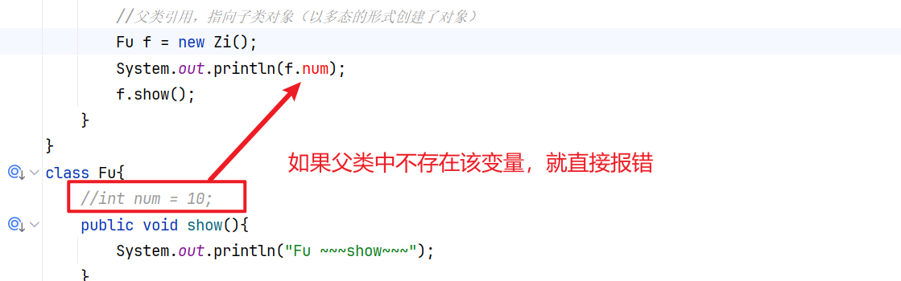

- 如果存在就执行（还是看左边的父类），因为是父类引用，所以访问存在局限性，只能访问super空间的数据

  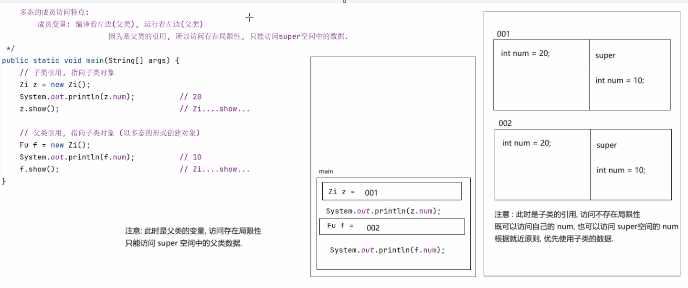

成员方法：编译看左边（父类），执行看右边（子类）

- 多态创建完对象，调用成员方法，编译时会检查，调用的方法在父类中是否存在
- 如果不存在，编译阶段直接报错
- 如果存在运行的时候一定执行子类的方法逻辑（如果调用的方法是抽象方法，执行的话一点意义没有）

```java
public class PolymorphismDemo2 {
    public static void main(String[] args) {
        //接口类型变量 指向实现类对象（多态创建）
        Inter i = new InterImpl();
        i.show();
    }
}
interface Inter{
    void show();
}
class InterImpl implements Inter{
    @Override
    public void show() {
        System.out.println("实现类重写后的show方法~~~");
    }
}
```

静态成员：多态创建完对象，调用静态成员时，编译看左边（父类），执行看左边（父类）

- static修饰的成员，推荐使用类名调用
- f.show(); ---> 解析后字节码文件中 ---> Fu.show();

```java
public class PolymorphismDemo2 {
    public static void main(String[] args) {
        //接口类型变量 指向实现类对象（多态创建）
        Fu1 f = new Son();
        //字节码文件中都是Fu1.show();
        f.show();
        Fu1.show();
    }
}

class Fu1 {
    public static void show() {
        System.out.println("Fu...show....");
    }
}

class Son extends Fu1 {
    //@Override 静态修饰方法不能重写的
    public static void show() {
        System.out.println("实现类重写后的show方法~~~");
    }
}
```

## 3.多态的好处和弊端

### 3.1.多态的好处 

提高了程序的扩展性

- 对象多态 : 将方法的形参定义为父类类型, 这个方法可以接收该父类的任意子类对象 
- 行为多态 : 同一个行为, 具有多个不同表现形式或形态的能力

```Java
public abstract class Animal {
    public abstract void eat();
}
```

```Java
public class Dog extends Animal{
    @Override
    public void eat() {
        System.out.println("🐕狗吃骨头~~~");
    }
    public void lookDoor(){
        System.out.println("狗看门~~~");
    }
}
```

```Java
public class Cat extends Animal{
    @Override
    public void eat() {
        System.out.println("🐱猫吃🐟~~~");
    }
    public void catchMouse() {
        System.out.println("🐱抓老鼠~~~");
    }
}
```

```java
public class Test {
    public static void main(String[] args) {
        //方法中定义参数是对象，此时传参也要传对象
        /*
        useDog(new Dog());
        useCat(new Cat());
         */
        useAnimal(new Dog());
        useAnimal(new Cat());
    }
    /*
    //定义一个使用Dog对象的方法
    public static void useDog(Dog dog){
        dog.eat();
    }
    //定义一个使用Dog对象的方法
    public static void useCat(Cat cat){
        cat.eat();
    }
     */
    /*想要定义一些使用动物类的方法，如果有多个动物，此时代码或冗余*/
    //此时我们就可以定义一个方法,专门用来使用动物方法
    //将方法的参数设置为 父类类型，此时该方法就可以接收该父类的所有子类对象
    //这就提高了代码扩展性
    public static void useAnimal(Animal animal) {
        animal.eat();
    }
}
```

### 3.2.多态的弊端 

不能直接调用子类特有的属性和行为

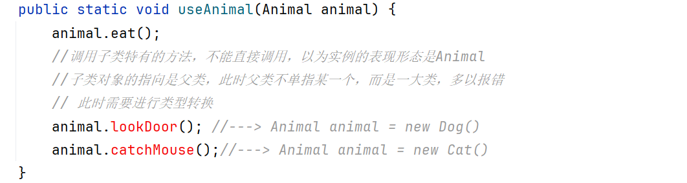

```java
public class Test1 {
    public static void main(String[] args) {
        //方法中定义参数是对象，此时传参也要传对象
        //对象多态
        useAnimal(new Dog());
        useAnimal(new Cat());
    }
    public static void useAnimal(Animal animal) {
        animal.eat();
        //调用子类特有的方法，不能直接调用，因为实例的表现形态是Animal
        //子类对象的指向是父类，此时父类不单指某一个，而是一大类，多以报错
        // 此时需要进行类型转换
        //animal.lookDoor(); //---> Animal animal = new Dog()
        //animal.catchMouse();//---> Animal animal = new Cat()
        //进行强制类型转换（向下转型：父转子，小类型转到大类型）
        Dog dog = (Dog) animal;
        dog.lookDoor();
       
    }
}
```

### 3.3.多态的两种转型

向上转型：从子到父（父类引用指向子类对象）

```java
Fu f = new Zi();
```

向下转型（强制类型转换）：父到子（将父类引用所指向的对象, 转交给子类类型）

```
Zi z = (Zi)f;
```

### 3.4.多态中的转型问题 

如果被转的引用类型变量，对应的实际类型和目标类型不是同一种类型，那么在转换的时候就会出现ClassCastException （类型转换异常）

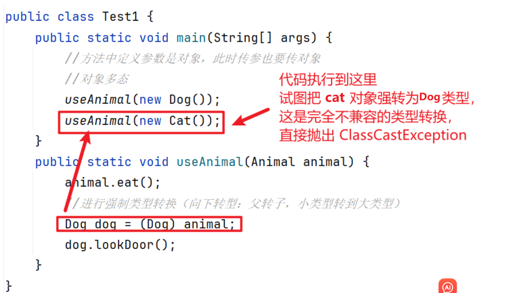

解决方案：使用关键字 instanceof进行强转类型的判断

使用格式：

```
对象名 instanceof 类型
```

判断一个对象是否是一个类的实例

通俗的理解：判断关键字左边的对象，是否是右边的类型，返回boolean类型结果

```java
public class Test1 {
    public static void main(String[] args) {
        //方法中定义参数是对象，此时传参也要传对象
        //对象多态
        useAnimal(new Dog());
        useAnimal(new Cat());
    }
    public static void useAnimal(Animal animal) {
        animal.eat();
        //进行强制类型转换（向下转型：父转子，小类型转到大类型）
        if (animal instanceof Dog) {
            Dog dog = (Dog) animal;
            dog.lookDoor();
        } else if (animal instanceof Cat) {
            Cat cat = (Cat) animal;
            cat.catchMouse();
        }
    }
}
```

# 五、多态案例

## 1.模拟订单业务

```java
//订单业务接口
public interface OrderService {
    //创建单个订单
    void create();

    //查询单个订单
    void findOne();

    //查询订单列表
    void findList();

    //取消订单
    void cancel();

    //完结订单
    void finish();

    //支付订单
    void paid();
}
```

```java
public class OrderServiceImpl implements OrderService {
    @Override
    public void create() {
        System.out.println("创建订单");
    }

    @Override
    public void findOne() {
        System.out.println("查询单个订单");
    }

    @Override
    public void findList() {
        System.out.println("查询订单列表");
    }

    @Override
    public void cancel() {
        System.out.println("取消订单");
    }

    @Override
    public void finish() {
        System.out.println("完结订单");
    }

    @Override
    public void paid() {
        System.out.println("支付订单");
    }
}
```

```java
public class OverseasServiceImpl implements OrderService {

    public void check() {
        System.out.println("IP地址检测");
    }

    @Override
    public void create() {
        System.out.println("国外业务 --- 创建订单");
    }

    @Override
    public void findOne() {
        System.out.println("国外业务 --- 查询单个订单");
    }

    @Override
    public void findList() {
        System.out.println("国外业务 --- 查询订单列表");
    }

    @Override
    public void cancel() {
        System.out.println("国外业务 --- 取消订单");
    }

    @Override
    public void finish() {
        System.out.println("国外业务 --- 完结订单");
    }

    @Override
    public void paid() {
        System.out.println("国外业务 --- 支付订单");
    }
}
```

```java
import java.util.Scanner;

public class Test {
    public static void main(String[] args) {
        Scanner sc = new Scanner(System.in);
        System.out.println("请输入:  1. 国内订单   2. 国外订单");

        int choice = sc.nextInt();
        switch (choice) {
            case 1:
                // 创建国内订单的业务类
                // Dog  dog = new Dog();
                OrderServiceImpl orderService = new OrderServiceImpl();
                orderService.create();
                orderService.findOne();
                orderService.findList();
                orderService.cancel();
                orderService.finish();
                orderService.paid();
                break;
            case 2:
                // 创建国外订单的业务类
                // Cat cat  = new Cat();
                OverseasServiceImpl overseasService = new OverseasServiceImpl();
                overseasService.create();
                overseasService.findOne();
                overseasService.findList();
                overseasService.cancel();
                overseasService.finish();
                overseasService.paid();
                break;
        }
    }
}
```

以上代码用户输入1会执行国内业务订单，输入2执行国外业务订单，但是代码冗余可以使用多态优化

```java
import java.util.Scanner;

public class Test {
    public static void main(String[] args) {
        Scanner sc = new Scanner(System.in);
        System.out.println("请输入:  1. 国内订单   2. 国外订单");

        int choice = sc.nextInt();

        // OrderServiceImpl orderService; // Dog dog
        OrderService orderService;    // Animal animal 多态
        switch (choice) {
            case 1:
                // 创建国内订单的业务类
                // animal = new Dog();
                orderService = new OrderServiceImpl();
                break;
            case 2:
                // 创建国外订单的业务类
                // animal = new Cat();
                orderService = new OverseasServiceImpl();
                // 调用自己独有 检测IP的方法
                // orderService.check();报错
                // Dog dog = (Dog) animal;
                OverseasServiceImpl overseasService = new OverseasServiceImpl();
                overseasService.check();
                break;
            default:
                // 如果用户输入的命名不是1和2 就默认是国内订单
                orderService = new OrderServiceImpl();
        }

        orderService.create();
        orderService.findOne();
        orderService.findList();
        orderService.cancel();
        orderService.finish();
        orderService.paid();
    }
}
```

## 2.模拟支付业务


```java
//支付接口
public interface Payment {
    void pay(double money);
}
```

```java
//平台支付
public class PlatformPaymentImpl implements Payment {

    @Override
    public void pay(double money) {
        System.out.println("通过平台成功支付" + money + "元");
    }
}
```

```java
//银行卡支付
public class BankcardPaymentImpl implements Payment {

    @Override
    public void pay(double money) {
        System.out.println("通过银行卡成功支付" + money + "元");
    }
}
```

```java
//信用卡支付
public class CreditCardPaymentImpl implements Payment {

    @Override
    public void pay(double money) {
        System.out.println("通过信用卡成功支付" + money + "元");
    }
}
```

测试 - 非多态调用

```java
import java.util.Scanner;

public class Test {
    public static void main(String[] args) {
        Scanner sc = new Scanner(System.in);
        System.out.println("请选择支付方式:  1. 支付平台支付   2. 银行卡网银支付  3. 信用卡快捷支付");
        int command = sc.nextInt();
        double money;//要支付的钱
        switch (command) {
            case 1:
                PlatformPaymentImpl p = new PlatformPaymentImpl();
                System.out.println("请输入您要支付的金额~~");
                money = sc.nextDouble();
                p.pay(money);
                break;
            case 2:
                BankcardPaymentImpl b = new BankcardPaymentImpl();
                money = sc.nextDouble();
                b.pay(money);
                break;
            case 3:
                CreditCardPaymentImpl c = new CreditCardPaymentImpl();
                money = sc.nextDouble();
                c.pay(money);
                break;
        }
    }
}
```

多态简化调用

```java
import java.util.Scanner;

public class Test1 {
    public static void main(String[] args) {
        Scanner sc = new Scanner(System.in);
        System.out.println("请选择支付方式:  1. 支付平台支付   2. 银行卡网银支付  3. 信用卡快捷支付");
        int command = sc.nextInt();
        double money;//要支付的钱
        Payment payment = null;   //定义   父类引用
        switch (command) {
            case 1:
                //PlatformPaymentImpl p = new PlatformPaymentImpl();
                payment = new PlatformPaymentImpl();
                break;
            case 2:
                //BankcardPaymentImpl b = new BankcardPaymentImpl();
                payment = new BankcardPaymentImpl();
                break;
            case 3:
                //CreditCardPaymentImpl c = new CreditCardPaymentImpl();
                payment = new CreditCardPaymentImpl();
                break;
        }
        System.out.println("请输入您要支付的金额~~");
        money = sc.nextDouble();
        payment.pay(money);
    }
}
```

# 六、Object类的equals方法

## 1.概述

equals()是 Java 中判断对象内容是否相等的核心方法


父类equals方法存在的意义就是为了被子类重写，以便子类自己来定制比较规则

java 自带的核心类（如`String`、`Integer`、`Date`）都重写了`equals()`，用于判断内容相等：

==和equals()方法的区别

| 类型     | 用法                                                       | 适用场景                                              |
| :------- | ---------------------------------------------------------- | ----------------------------------------------------- |
| ==       | 判断引用地址是否相同（是否指向同一个对象）                 | 基本数据类型（int/long 等）、判断对象是否是同一个实例 |
| equals() | 默认和`==`一样（判断地址），但可重写为判断对象内容是否相同 | 引用数据类型（String、自定义类、对象）判断内容相等    |

## 2.字符串对比

Srting 定义字符串直接复制的字符串值对比

```java
public static void main(String[] args) {
    String name1 = "123456";
    String name2 = "123456";
    System.out.println(name1 == name2); //true
    System.out.println(name1.equals(name2)); //true
}
```

字符串常量池：JVM 为了节省内存，会把所有字符串字面量（比如 `"123456"`）缓存到一块特殊的内存区域（常量池），相同内容的字面量只会创建一个对象。

## 3.对象对比

```java
public class Student {
    String name;
    int age;
    public Student(){}
    public Student(String name, int age) {
        this.name = name;
        this.age = age;
    }
}
```

```java
public class Test2 {
    public static void main(String[] args) {
        Student s1=new Student("小哈",23);
        Student s2=new Student("小哈",23);
        System.out.println(s1.equals(s2));//？
    }
}
```

对比两个对象是否相等，Object自带的equals底层是==,两个对象都是new出来的，在堆内存中会有自己的地址，所以以上代码判断结果是false


- 如果想要判断两个外观一样的对象一致，我们必须要重写equals方法
- 快捷键 Alt + Insert

```java
class Student {
    String name;
    int age;
    public Student(){}
    public Student(String name, int age) {
        this.name = name;
        this.age = age;
    }

    @Override
    public boolean equals(Object o) {
        if (this == o) return true;
        if (o == null || getClass() != o.getClass()) return false;
        Student student = (Student) o;
        return age == student.age && Objects.equals(name, student.name);
    }

    @Override
    public int hashCode() {
        return Objects.hash(name, age);
    }
}
```

## 4.解读生成的equals

```Java
package com.itheima.pojo;

import java.util.Objects;

public class Student {
    private String name;
    private int age;

    @Override
    public boolean equals(Object o) {
        // this: stu1
        // o : stu2
        if (this == o) {
            // 如果两个对象的地址相同, 代表是同一块内存空间, 里面的内容肯定相同.
            return true;
        }

        // 代码如果可以执行到这里, 说明stu1肯定不是null值
        // stu1不是null, stu2为null, 直接返回false
        // 比较两个对象的字节码, 如果字节码不相同, 代表类型不一致, 返回false
        if (o == null || this.getClass() != o.getClass()) {
            return false;
        }

        // 向下转型, 调用子类特有的属性
        Student student = (Student) o;

        // 比较两个对象的属性值
        return this.age == student.age && Objects.equals(this.name, student.name);
    }

    ...
}
```

# 七、Objects工具类的equals方法

## 1.Objects简介

`Objects`是 JDK 7 新增的工具类，专门用来处理`Object`相关的通用操作，核心价值是简化空指针判断、统一对象操作逻辑、避免手动写重复的空安全代码。

以下代码：

- 如果给对象赋值为null，此时使用equals对比会出现“空指针异常”问题，我们需要手动判断，代码冗余且容易出错
- 而`Objects`把这些通用逻辑封装成静态方法，一行代码就能搞定，既简洁又安全，我们直接调用就可以。

```java
public class Test2 {
    public static void main(String[] args) {
        Student s1=null;
        Student s2=new Student("小哈",23);
        System.out.println(s1.equals(s2));//？
    }
}
class Student {
    String name;
    int age;
    public Student(){}
    public Student(String name, int age) {
        this.name = name;
        this.age = age;
    }
    
    @Override
    public boolean equals(Object o) {
        //如果地址一致 就直接返回 true 并停止方法的运行
        if (this == o) return true;
        //被对比着(this).equals(对比者)
        //如果 对比者 是null 或者 两者的字节吗文件不一样就直接返回 false，并停止方法的运行
        if (o == null || getClass() != o.getClass()) return false;
        //以上两个if都咩有执行，就正式让两个对象进行更深层次对比
        //被对比着(this)类型是Student，对比者是Object祖宗类型，两者类型不一致无法对比
        // 使用向下强制转换，将Object祖宗类型强制转换成 Student
        Student student = (Student) o;
        //然后去对比所有的成员属性
        return age == student.age && Objects.equals(name, student.name);
    }

    @Override
    public int hashCode() {
        return Objects.hash(name, age);
    }
}
```

手动判断 和 Objects.equals对比

Objects 中的 equals 方法仅仅是个工具类中的方法

- 底层依赖于我们自己编写的equals方法，如果不重写还是按照==比较地址
- 优势：加入了健壮性判断

```java
public class Test2 {
    public static void main(String[] args) {
        Student s1 = null;
        Student s2 = new Student("小哈", 23);
        /*if (s1 == null || s2 == null) {
            System.out.println("对象不能为空~~");
           return;
        } else {
            System.out.println(s1.equals(s2));
        }*/
        System.out.println(Objects.equals(s1, s2));
    }
}
```

## 2.Objects常用方法

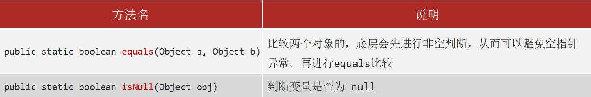

```java
public static void main(String[] args) {
    Student s1 = new Student("小哈", 23);
    Student s2 = new Student("小哈", 23);
    Student s3 = null;
    Student s4 = s1;
    
    System.out.println(Objects.equals(s1, s2));
    
    System.out.println(Objects.isNull(s3));
    
    System.out.println(Objects.isNull(s4));
    
    System.out.println(Objects.equals(s1, s4));
}
```

# 八、代码块

在Java类下，使用 { } 括起来的代码被称为代码块

分类：
- 局部代码块
- 构造代码块
- 静态代码块
- 同步代码块

## 1.局部代码块

位置: 方法中的一对{}    

作用: 限定变量的生命周期, 提早释放内存.（Debug演示）

```Java
public class CodeBlock {

    public static void main(String[] args) {
        {
            int num = 10;
            System.out.println(num);
        }
        
        System.out.println(num);    // 这里会报错, num 变量已经被释放了
    }
}
```

## 2.构造代码块

位置: 类中方法外的一对 {}    

特点: 

- 创建对象的时候被调用执行, 无论使用哪一个构造方法创建对象, 都要执行构造代码块 
- 优先于构造方法执行.            

作用: 如果发现所有构造方法中, 存在相同的代码，就可以考虑将这段相同的代码抽取到构造代码块中.

```java
public class Test3 {
    public static void main(String[] args) {
        Student1 s1 = new Student1();
        Student1 s2 = new Student1(10);
    }
}
class Student1 {
    {
        System.out.println("~~~~~~Student1类的构造代码块执行了~~~~~~");
    }

    public Student1() {
        System.out.println("Student1类的空参数构造方法...");
    }

    public Student1(int num) {
        System.out.println("Student1类的带参数构造方法...");
    }

}
```

```
~~~~~~Student1类的构造代码块执行了~~~~~~
Student1类的空参数构造方法...
~~~~~~Student1类的构造代码块执行了~~~~~~
Student1类的带参数构造方法...
```

## 3.静态代码块

位置: 类中方法外的一对 {} 需要加入static关键字

特点: 随着类的加载而执行
- 字节码加载的时候, 静态代码块就会执行
- 因为字节码文件只加载一次, 静态代码块也只执行一次.

作用: 用于执行一些初始化操作（哪些代码只需要执行一次就放在静态代码块中）.

```java
public class Test3 {
    public static void main(String[] args) {
        Student1 s1 = new Student1();
        Student1 s2 = new Student1(10);
    }
}
class Student1 {
    static {
        System.out.println("Student类的静态代码块");
    }
    {
        System.out.println("Student1类的构造代码块执行了~~~~");
    }

    public Student1() {
        System.out.println("Student1类的空参数构造方法...");
    }

    public Student1(int num) {
        System.out.println("Student1类的带参数构造方法...");
    }
}
```

```
Student类的静态代码块
Student1类的构造代码块执行了~~~~
Student1类的空参数构造方法...
Student1类的构造代码块执行了~~~~
Student1类的带参数构造方法...
```

**员工案例（静态代码块）**

核心需求：定义员工薪资等级的固定阈值（比如经理底薪、普通员工底薪），用静态代码块初始化这些规则，保证只加载一次，后续计算员工薪资时直接复用。

```java
/
 * 体现静态代码块初始化固定规则的作用
 */
public class Employee {
    // 静态变量：存储薪资等级的固定阈值（全局共用）
    public static double MANAGER_BASE_SALARY; // 经理底薪
    public static double STAFF_BASE_SALARY;   // 普通员工底薪
    public static double BONUS_RATIO;         // 绩效奖金比例

    // 静态代码块：类加载时初始化薪资规则（仅执行一次）
    static {
        System.out.println("=== 静态代码块执行：初始化薪资规则 ===");
        MANAGER_BASE_SALARY = 8000;  // 经理底薪8000
        STAFF_BASE_SALARY = 4000;    // 普通员工底薪4000
        BONUS_RATIO = 0.2;           // 绩效奖金为底薪的20%
    }

    // 员工实例变量
    private String name;    // 姓名
    private String position; // 职位（经理/普通员工）
    private double performance; // 绩效分（1.0为满分）

    // 构造器：初始化员工信息
    public Employee(String name, String position, double performance) {
        this.name = name;
        this.position = position;
        this.performance = performance;
    }

    // 计算员工总薪资（复用静态代码块初始化的规则）
    public double calculateSalary() {
        double baseSalary;
        // 根据职位获取底薪（用静态变量，不用写死数值）
        if ("经理".equals(position)) {
            baseSalary = MANAGER_BASE_SALARY;
        } else {
            baseSalary = STAFF_BASE_SALARY;
        }
        // 总薪资 = 底薪 + 底薪*奖金比例*绩效分
        return baseSalary + baseSalary * BONUS_RATIO * performance;
    }

    // 打印员工薪资信息
    public void printSalary() {
        System.out.println(name + "（" + position + "）的薪资：" + calculateSalary() + "元");
    }

    // 主方法：测试功能（新手入口）
    public static void main(String[] args) {
        // 创建员工对象（触发类加载，静态代码块先执行）
        Employee emp1 = new Employee("张三", "经理", 0.9); // 经理，绩效0.9
        Employee emp2 = new Employee("李四", "普通员工", 1.0); // 普通员工，绩效1.0

        // 计算并打印薪资
        emp1.printSalary();
        emp2.printSalary();

        // 再次创建员工，静态代码块不会重复执行
        Employee emp3 = new Employee("王五", "普通员工", 0.8);
        emp3.printSalary();
    }
}
```

```
=== 静态代码块执行：初始化薪资规则 ===
张三（经理）的薪资：9440.0元
李四（普通员工）的薪资：4800.0元
王五（普通员工）的薪资：4640.0元
```

# 九、package 包

## 1.概述

包本质来说就是文件夹,  用来管理类文件的

建包的语法格式：package 公司域名倒写.技术名称。包名建议全部英文小写，且具备意义

```
package com.itheima.pojo;
public class Student {}
```

建包语句必须在第一行，一般IDEA工具会帮助创建

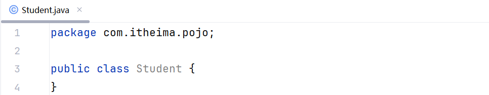

## 2.导包  

相同包下的类可以直接访问，不同包下的类必须导包,才可以使用！导包格式：import 包名.类名;

如果导入的类在 java.lang 包 (核心包) , 就不需要编写 import 导包代码(比如String/System)

假如一个类中需要用到不同类，而这个两个类的名称是一样的，那么默认只能导入一个类，另一个类要带包名访问

```java
package com.itheima.packagedemo;

public class Scanner {
}
```

```java
package com.itheima.packagedemo;

public class TestPackage {
    public static void main(String[] args) {
        //scanner是使用我们自己新建的Scanner类文件创建的
        //我们自己新建的Scanner类和 java.util中的命名冲突
        //所以在实际开发中类的命名不能和Java自带关键字重复
        Scanner scanner = new Scanner();
        //如果想要使用java.util中的就需要全类名名导入
        java.util.Scanner sc = new java.util.Scanner(System.in);
        int command = sc.nextInt();
    }
}
```

# 十、内部类

内部类就是定义在一个类里面的类

## 1.成员内部类（了解）

### 1.1.语法格式：

```java
class Outer {
	// 内部类
	class Inner {
	}
}
```

创建对象的格式 :

```java
格式：外部类名.内部类名 对象名 = new 外部类对象().new 内部类对象();
范例：Outer.Inner in = new Outer().new Inner();
```

```java
public class InnerDemo {
    public static void main(String[] args) {
        Outer.Inner inner = new Outer().new Inner();
        System.out.println(inner.a);
        inner.show(); 
    }
}
class Outer {
    class Inner {
        int a = 10;
        public void show(){
            System.out.println("Inner~~~show~~~");
        }
    }
}
```

### 1.2.内部内成员访问

内部类访问外部类的成员直接访问即可，包括私有成员，因为内部类本身就是外部类的一部分；

外部类访问内部类的成员，需要先创建内部类的对象再去访问

```java
public class InnerDemo {
    public static void main(String[] args) {
        Outer.Inner inner = new Outer().new Inner();
        System.out.println(inner.a);
        inner.show();
        System.out.println("------ 内部类访问外部类 ------");
        inner.innerPrint();
        System.out.println("------ 外部类访问内部类 ------");
        Outer outer = new Outer();
        outer.outerPrint();
    }
}
class Outer {
    int num = 100;
    public void method() {
        System.out.println("外部类的方法~~~");
    }
    //外部类访问内部类不能直接访问，需要创建实力对象访问
    public void outerPrint(){
        //System.out.println(a); 报错
        //show();
        //创建内部对象访问（因为在外部类里面，就直接创建即可）
        Inner inner = new Inner();
        System.out.println(inner.a);
        inner.show();
    }
    class Inner {
        int a = 10;
        public void show(){
            System.out.println("Inner~~~show~~~");
        }
        //内部类访问外部类成员直接访问
        public void innerPrint(){
            System.out.println(num);
            method();
        }
    }
}
```

请观察如下代码，写出合适的代码对应其注释要求输出的结果。

```java
public class Test {

}
class Outer{
    int num = 150;
    class Inner{
        int num = 110;
        public void print(){
            int num = 78;
            System.out.println();// 78
            System.out.println();// 110
            System.out.println();// 150
        }
    }
}
```

## 2.为什么学习内部类

原因：封装性更好

需求：写一个Javabean类描述汽车。

属性：汽车的品牌，车龄，颜色，发动机的品牌，使用年限。

```java 
public class Test {

}
class Car {
    String carName;
    int carAge;
    int carColor;
    //发动机
    class Engine {
        String engineName;
        int engineAge;
    }
}
```

注意：不推荐定义内部类，如果要适应内部类调用很麻烦，我们了解有这种写法就可以，以后看别人代码能看明白就可以。

## 3.静态内部内（了解）

有 static 修饰的成员内部类

```java
class Outer {
	static class Inner {
	}
}
```

静态内部类创建对象的格式：    

```java
格式：外部类名.内部类名 对象名 = new 外部类名.内部类对象();
范例：Outer.Inner in = new Outer.Inner();
```

```java
public class Test {
    public static void main(String[] args) {
        Outer.Inner inner = new Outer.Inner();
        inner.show();
        //静态方法方位
        Outer.Inner.method();
    }
}
class Outer{
   static class Inner{
       public void show(){
           System.out.println("Inner show");
       }
       public static void method(){
           System.out.println("Inner method");
       }
   }
}
```

## 4.局部内部类（了解）

局部内部类放在方法、代码块、构造器等执行体中

```java
public class Test {
    public static void main(String[] args) {
        A obj = new A();
        obj.f();
    }
}
class A {
    public void f() {
        class B{
            public void print() {
                System.out.println("局部内部类是鸡肋语法~~");
            }
        }
        //局部内部类只能在方法创建实力对象
        B b = new B();
        b.print();
    }
}
```

## 5.匿名内部内

### 5.1.思考案例

思考：调用方法时，方法的形参是接口，我们应该传入的是什么？

```java
public class Test {
    public static void main(String[] args) {
        useInter(new Cat());
        useInter(new Dog());
    }
    //方法的形参是一个接口，此时传入的应该是一个接口的实现类，使用多态的生成实参
    //Runnable r = new Cat();
    //Runnable r = new Dog();
    public static void useInter(Runnable r) {
        r.run();
    }
}
//Runnable 接口实现某一个动物的正在跑的功能
interface Runnable {
    void run();
}
class Cat implements Runnable {
    @Override
    public void run() {
        System.out.println("猫仔奔跑~~~");
    }
}
class Dog implements Runnable {
    @Override
    public void run() {
        System.out.println("狗仔奔跑~~~");
    }
}
```

### 5.2.匿名内部类

概述：匿名内部类本质上是一个特殊的局部内部类（定义在方法内部）

前提：需要存在一个接口或类

```java
new 类或接口(){
    //类体(一般是方法重写)
}
```

new 类 ------> 继承这个类，并且创建了一个实例类对象，然后重写方法

new 接口 ------> 实现这个类，并且创建了一个实现接口的类对象，然后重写方法

```java 
public class Test1 {
    public static void main(String[] args) {
        //1.实现了接口 2.重写了方法 3.创建了实现类对象
        new Runnable1() {
            @Override
            public void run() {
                System.out.println("小猫在奔跑~~~");
            }
        }.run();
        //1.继承了类 2.重写了方法 3.创建了一个实例对象
        new Animal() {
            @Override
            public void eat() {
                System.out.println("小猫在吃鱼~~~");
            }
        }.eat();

    }
}
abstract class Animal {
    public abstract void eat();
}

interface Runnable {
    void run();
}
```

### 5.3.思考案例优化

```java
public class Test1 {
    public static void main(String[] args) {
        //1.实现了接口 2.重写了方法 3.创建了实现类对象
        Runnable1 r1 = new Runnable1() {
            @Override
            public void run() {
                System.out.println("小狗在奔跑~~~");
            }
        };
        useInter(r1);
        //----------------------------------------------
        useInter(new Runnable1() {
            @Override
            public void run() {
                System.out.println("小猫在奔跑~~~");
            }
        });
    }
    //使用接口的方法
    public static void useInter(Runnable1 r) {
        r.run();
    }
}
interface Runnable {
    void run();
}
```

### 5.4.总结

作用：用于更方便的创建一个子类对象，不需要我们自己去包里面手动创建多余的类文件。

使用匿名内部类的好处：代码测试的时候不需要我们去创建多余的类文件，简化代码 。

使用场景：如果需要调用一个方法的形参是 接口 或者 抽象类，那么就可以使用匿名内部类快速构建这个参数对象。

注意：如果一个接口或者父类中的抽象方法只有一个或两个，就建议使用匿名内部类，如果里面的抽象方法很多就不建议是用匿名内部内，建议使用正常的实现类完成；

```Java
//测试类
public class Test {
    public static void main(String[] args) {
        //接口中抽象方法太多，建议使用普通实现类完成
        useFu(new Son());
    }

    public static void useFu(Fu f) {
        f.show();
        f.eat();
        f.sleep();
        f.play();
        f.run();
    }
}
//定义的接口，里面有多个抽象方法
interface Fu {
    void show();

    void eat();

    void sleep();

    void play();

    void run();
}

//普通实现类
class Son implements Fu {
    @Override
    public void show() {
        System.out.println("show~~~");
    }

    @Override
    public void eat() {
        System.out.println("eat~~~");
    }

    @Override
    public void sleep() {
        System.out.println("sleep~~~");
    }

    @Override
    public void play() {
        System.out.println("play~~~");
    }

    @Override
    public void run() {
        System.out.println("run~~~");
    }
}
```

### 5.5.案例

设计一个算术运算接口 maths ，里面设置第一个抽象方法getMaths,能计算任意两个数的各种算术结果

要求所有运算的表达式拼接格式统一：`操作数1 运算符 操作数2 = 结果`

> 两数相减（格式：`a - b = 结果`，如 `5 - 2 = 3`）
>
> 两数相乘（格式：`a × b = 结果`，如 `4 × 6 = 24`）
>
> 两数取余（格式：`a % b = 结果`，如 `7 % 3 = 1`）

输出结果如下

```
2 + 3 = 5
5 ÷ 2 = 2.5
```

```Java
public class Test1 {
    public static void main(String[] args) {
        //两个数相加
        String resSum = mathsMethod(2, 3, new maths() {
            @Override
            public String getMaths(int a, int b) {
                return a + " + " + b + " = " + (a + b);
            }
        });
        System.out.println(resSum);
        //相隔数相除
        String resDiv = mathsMethod(5, 2, new maths() {
            @Override
            public String getMaths(int a, int b) {
                return a + " ÷ " + b + " = " + (1.0 * a / b);
            }
        });
        System.out.println(resDiv);
    }

    //使用书序运算的方法可以
    public static String mathsMethod(int a, int b, maths m) {
        return m.getMaths(a, b);
    }
}


interface maths {
    //任意两个数做各种数学运算
    String getMaths(int a, int b);
}
```

# 十一、Lambda表达式

## 1.概述和作用

Lambda表达式是JDK 8开始新增的一种语法形式； 

<span style="color:red;">作用：用于简化匿名内部类的代码写法。</span>

注意 :  Lambda表达式只能简化函数式接口的匿名内部类!!!
-  函数式接口：首先必须是接口、其次接口中有且仅有一个抽象方法的形式；
- 通常我们会在接口上加上一个@FunctionalInterface注解，标记该接口必须是满足函数式接口。

## 2.格式 — () -> {}

()表达式接口中的唯一的方法

{} 表示方法体

```java
(被重写方法的形参列表) -> {
	被重写方法的方法体代码。
}
```

## 3.使用lambda的条件

只能是一个接口

接口中只有一个抽象方法

基本语法演示

```java
public interface Swimming {
    void swim();
}
```

```java
public class Test {
    public static void main(String[] args) {
       //Swimming swimming = new Swimming() {
       //    @Override
       //    public void swim() {
       //        System.out.println("正在在游泳~~~");
       //    }
       //};
       //swimming.swim();

        //TODO Lambda表达式改写
        Swimming swimming =() ->{
            System.out.println("正在在游泳~~~");
        };
        swimming.swim();
    }
}
```

有参数表达式演示

```java
public interface Swimming {
  //设置参数，返回值为String
  String swim(String name);
}
```

```java
public class Test {
    public static void main(String[] args) {
        //TODO Lambda表达式改写
        Swimming swimming = (String name) -> {
            return name + "，在游泳~~~";
        };
        System.out.println(swimming.swim("小猫"));
    }
}
```

## 4.Lambda的省略写法

参数类型可以省略不写。

如果只有一个参数，参数类型可以省略，同时()也可以省略。

如果Lambda表达式中的方法体代码只有一行代码，可以省略大括号不写，同时要省略分号！此时，如果这行代码是return语句，也必须去掉return不写。

```java
public class Test {
    public static void main(String[] args) {
        //TODO Lambda表达式改写
        Swimming swimming = name -> name + "，在游泳~~~";
        System.out.println(swimming.swim("小猫"));
    }
}
```

