# 一、API简介 

## 1.概述

API （全称 Application Programming Interface：应用程序编程接口）

就是别人写好的一些程序，给咱们程序员直接拿去调用即可解决问题的。

## 2.为什么要学习API

不要重复造轮子：实际开发中我们的很多功能都是可以重复使用，或者在行业内应用广泛，这些功能有些前辈可能都已经写好了，我们只需要使用就可以，提高开发效率。

比如之前所使用Scanner、Random都是别人提前写好的，我们直接使用就可以。

## 3.怎么学习API

我们可以通过API文档进行学习，目前我们使用的JDK的API文档，后期大家可能会接触到其他API（阿里的API、微信的API、字节的API、甚至与后期开发的时候我们也要编写自己的API文档，供别人使用）。

JDK的API文档里面提供了java开发JDK所需要的所有类，类里面有一堆的方法，我们将这写方法称之为API，比如Random方法

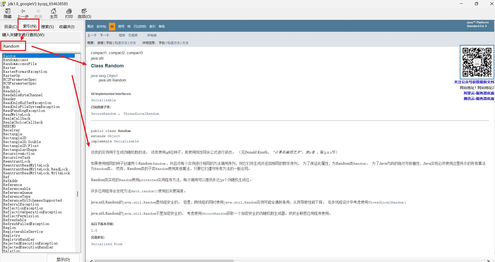

我们今天学习两个API里面的类，Sting、ArrayList，学习他们提供的功能方法。

# 二、String字符串

在 Java 中，`String`是用于表示字符串（字符序列）的类，属于`java.lang`包（无需显式导入），是开发中最常用的数据类型之一。

## 1.概述

String代表字符串对象，可以用来封装字符串数据，并提供了很多操作字符串的方法。

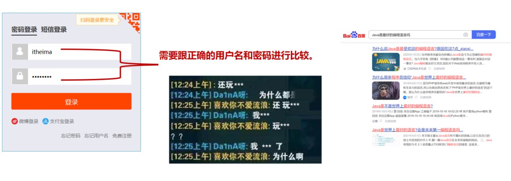

## 2.创建字符串的方法

### 2.1.双引号封装

```java
String  字符串名 = "字符串值"
```

```java
String name = "小哈";
String schoolName = "JAVA程序员";
```

### 2.2.构造器初始化

| 构造器                         | 说明                                   |
| ------------------------------ | -------------------------------------- |
| public String()                | 创建一个空白字符串对象，不含有任何内容 |
| public String(String original) | 根据传入的字符串内容，来创建字符串对象 |
| public String(char[] chars)    | 根据字符数组的内容，来创建字符串对象   |
| public String(byte[] bytes)    | 根据字节数组的内容，来创建字符串对象   |

```java
/*使用面向对象创建一个空白字符串*/
//使用String的无参构造器，创建一个空字符串对象（长度为 0，内容为空）
String str1 = new String();
System.out.println(str1); 

/*根据字符内容创建一个字符串*/
//使用String的字符串参数构造器，直接根据传入的字符串字面量"JAVA程序员"创建对象。
String str2 = new String("JAVA程序员");
System.out.println(str2);

/*使用面向对象创建一个空白字符串*/
//使用String的字符数组参数构造器，将字符数组chars的内容转换为字符串。字符数组中的元素会按顺序拼接
char[] chars = {'我','爱','中','国'};
String str3 = new String(chars);
System.out.println(str3);


//使用String的字节数组参数构造器，将字节数组bytes（内容为{97,98,99}）转换为字符串。字节会被默认解码为对应字符（基于 ASCII 编码：97 对应'a'，98 对应'b'，99 对应'c'）
byte[] bytes = {97,98,99};
String str4 = new String(bytes);
System.out.println(str4);
```

## 3.字符串的常用方法

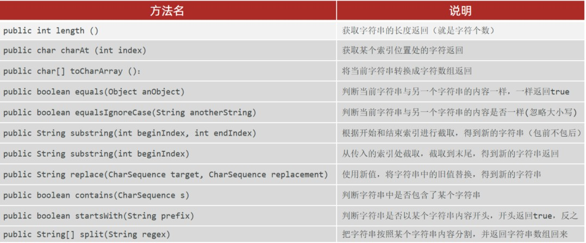

### 3.1.length()

获取字符串的长度

```java
字符串名.length();
```

```java 
String str1 = "JAVA程序员";
System.out.println(str1.length());
```

### 3.2.charAt(索引值)

获 取字符串中某个索引值位置的字符值

```
字符串名.charAt(索引值);
```

```java
String str2 = "JAVA程序员";
System.out.println(str2.charAt(3));
```

### 3.3.toCharArray()

将当前字符串转换成字符数组返回

```java 
字符串名.toCharArray()
```

```java
String str3 = "JAVA程序员";
char[] charArray = str3.toCharArray();
System.out.println(charArray);
```

### 3.4.equals(比较字符串对象名)

判断当前字符串和另一个字符串内容是否一致，返回值布尔值

```java
String str4 = "JAVA程序员";
String str5 = "JAVA程序员呀";
boolean result = str4.equals(str5);
System.out.println(result);
```

### 3.5.equalsIgnoreCase(比较字符串对象名)

判断当前字符串和另一个字符串内容是否一致，忽略大小写，返回值布尔值

```java
String str6 = "abcD";
String str7 = "ABcD";
boolean result1 = str6.equalsIgnoreCase(str7);
System.out.println(result1);
```

### 3.6.substring(开始索引,结束索引)

根据开始和结束索引进行字符串截取，包前不包后

```java
String str8 = "我们都是好孩子";
String result2 = str8.substring(0,6);
System.out.println(result2);
```

### 3.7.substring(开始索引)

从某一个索引值开始截取，一直到字符串末尾

```java 
String str9 = "我们都是好孩子";
String result3 = str9.substring(3);
System.out.println(result2);
```

### 3.8.replace(目标字符，替换内容)

使用新值，将字符串中的旧值替换

```java
String str10 = "我们都是好孩子";
String result3 = str10.replace("都是","*");
System.out.println(result3);
```

### 3.9.contains(字符内容)

判断字符串里面是否包含某一些字符值

```java
String str11 = "我们都是在JAVA学习java的学生，我们爱java";
boolean result4 = str11.contains("java");
boolean result5 = str11.contains("Java");
System.out.println(result4);
System.out.println(result5);
```

### 3.10.startsWith("字符内容")

判断字符串是否以某个内容开头，返回布尔值

```java
String str12 = "王大锤";
boolean result6 = str12.startsWith("王");
boolean result7 = str12.startsWith("李");
System.out.println(result6);
System.out.println(result7);
```

### 3.11.split(分隔符号)

```
按照指定的分隔符,将字符串拆分成字符串数组，返回字符串数组
```

```java
String str13 = "唐僧,猴子,猪猪,沙沙";
String[] result14 = str13.split(",");
System.out.println(result14);
for (int i = 0; i < result14.length; i++) {
    System.out.println(result14[i]);
}
```

## 4.案例

### 4.1.用户登录

**需求：**

系统正确的登录名和密码是：itheima/123456，请在控制台开发一个登录界面，接收用户输入的登录名和密码，判断用户是否登录成功，登录成功后展示：“欢迎进入系统!”，即可停止程序（注意：要求最多给用户三次登录机会）。 

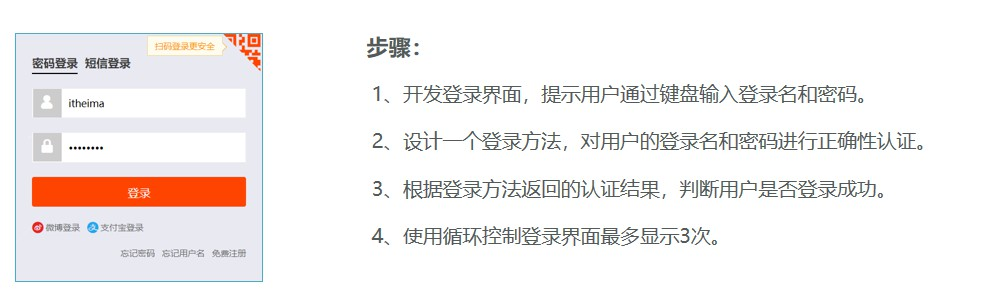

**代码实现：**

```java
public class Test2 {
    public static void main(String[] args) {
        login();
    }

    public static void login() {
        Scanner sc = new Scanner(System.in);
        int i = 0;
        int count = 3;
        do {
            //准备两个原始用户名和密码
            String okUserName = "小哈";
            String okUserPassword = "123456";
            //用户输入
            System.out.println("请输入您的用户名");
            String userName = sc.nextLine();
            System.out.println("请输入您的密码");
            String password = sc.nextLine();
            //判断用户输入的和原来是否一致
            if (okUserName.equals(userName) && okUserPassword.equals(password)) {
                System.out.println("登录成功！");
                return; //成功后结束当前方法
            } else {
                if(count != 0){
                    System.out.println("您的密码错误，请重新输入！");
                    System.out.println("您还剩余" + count + "次登录机会");
                    count--;
                } else {
                    System.out.println("您3次机会已经用完，请60分钟后重试！！！");
                }
            }
            i++;
        } while (i <= 3);
        sc.close();//关闭 Scanner 对象的方法，主要作用是释放与 Scanner 关联的资源
    }
}
```

### 4.2.统计字符次数

**需求 :** 

键盘录入一个字符串，统计该字符串中大写字母字符，小写字母字符，数字字符出现的次数(不考虑其他字符)

例如 :  aAb3&c2B*4CD1，以下是输出结果

```
小写字母 : 3个
大写字母 : 4个
数字字母 : 4个
```

**代码实现：**

```Java
package com.itheima.test;

import java.util.Scanner;

public class StringTest2 {
    /*
        需求 : 键盘录入一个字符串，统计该字符串中大写字母字符，小写字母字符，数字字符出现的次数
        (不考虑其他字符)

        例如 :  aAb3&c2B*4CD1

        小写字母 : 3个
        大写字母 : 4个
        数字字母 : 4个
     */
    public static void main(String[] args) {
        Scanner sc = new Scanner(System.in);
        System.out.println("请输入: ");
        String content = sc.next();

        // 1. 定义三个计数器变量
        int smallCount = 0;
        int bigCount = 0;
        int numCount = 0;
        // 2. 将字符串转换为字符数组
        char[] arr = content.toCharArray();
        // 3. 遍历字符数组, 获取每一个字符
        for (int i = 0; i < arr.length; i++) {
            // 4. 判断当前字符是哪一种
            if (arr[i] >= 'a' && arr[i] <= 'z') {
                // 5. 对应的计数器自增
                smallCount++;
            } else if (arr[i] >= 'A' && arr[i] <= 'Z') {
                bigCount++;
            } else if (arr[i] >= '0' && arr[i] <= '9') {
                numCount++;
            }
        }
        // 6. 遍历结束后, 打印计数器的值
        System.out.println("小写字母: " + smallCount);
        System.out.println("大写字母: " + bigCount);
        System.out.println("数字字符: " + numCount);
    }
}
```

### 4.3.手机号屏蔽

**需求：**

以字符串的形式从键盘接受一个手机号，将中间四位号码屏蔽

最终效果为：1561234

**代码实现：**

```Java
package com.itheima.test;

import java.util.Scanner;

public class StringTest3 {
    /*
        需求：以字符串的形式从键盘接受一个手机号，将中间四位号码屏蔽
        最终效果为：1561234

        1. 截取前三位        156
        2. 截取后四位        1234
        3. 拼接         156 + "" + 1234
     */
    public static void main(String[] args) {
        Scanner sc = new Scanner(System.in);
        System.out.println("请输入手机号: ");
        String tel = sc.next();

        // 1. 截取前三位
        String start = tel.substring(0, 3);
        // 2. 截取后四位
        String end = tel.substring(7);
        // 3. 拼接
        System.out.println(start + "" + end);
    }
}
```

### 4.4.敏感词替换

**需求：**

键盘录入一个 字符串，如果字符串中包含（TMD），则使用 * 替换

**代码实现：**

```Java
import java.util.Scanner;

public class StringMethodDemo4 {
    public static void main(String[] args) {
       method();
    }

    private static void method() {
        Scanner sc = new Scanner(System.in);
        System.out.println("请输入: ");
        String msg = sc.next();
        msg = msg.replace("TMD", "*");
        System.out.println(msg);
    }
}
```

## 5.字符串的注意事项

### 5.1.内容不可改变

String对象的内容不可改变，被称为不可变字符串对象。

```java
/*
  System.identityHashCode(Object)：
  获取对象的「身份哈希码」（可看作 “逻辑地址”，JVM 基于对象地址生成）
*/
public static void main(String[] args) {
    String name = "黑马";
    System.out.println(System.identityHashCode(name));
    name += "程序员";
    System.out.println(System.identityHashCode(name));
    name += "播妞";
    System.out.println(System.identityHashCode(name));
    System.out.println(name);
}
```

name指向的字符串对象确实变了啊，那为何还说String的对象都是不可变字符串对象？

注意：只要是以“...”方式写出的字符串对象，会在堆内存中的字符串常量池（StringTable）中存储。

每次试图改变字符串对象实际上是新产生了新的字符串对象了，变量每次都是指向了新的字符串对象，之前字符串对象的内容确实是没有改变的，因此说String的对象是不可变的。

执行流程如下：

1. 执行以下代码：

```java
String name = "黑马";
//main方法在栈内存中新建一个String name变量，然后将“黑马”存进堆内存的“字符串常量池”，生成一个地址给变量使用
```

2. 执行以代码：

```java 
name += "程序员";
//将“程序员”存入常量池，然后拼接“黑马程序员”放在堆内存，生成一个新地址，赋值给String name变量使用
name += "播妞";
//和上一行代码执行流程一样，将“播妞”放在常量池，然后拼接“黑马程序员播妞”放在堆内存
System.out.println(name);
//最后输出 “黑马程序员播妞”
```

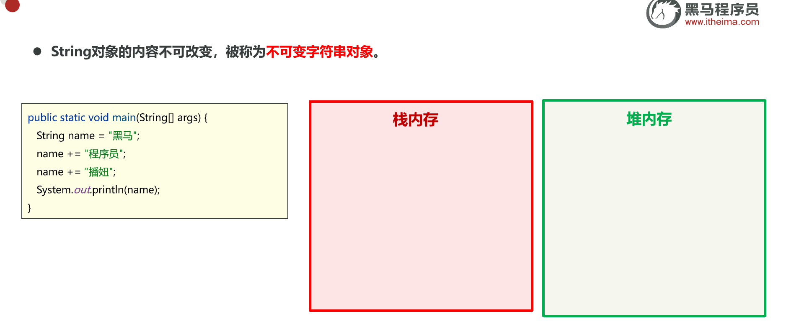


### 5.2.常量池复用

只要是以“...”方式写出的字符串对象，会存储到字符串常量池，且相同内容的字符串只存储一份

```java 
public class Test {
    public static void main(String[] args) {
        String s1 = "abc";
        String s2 = "abc";
        System.out.println(s1 == s2);//?
    }
}
```

执行流程如下：

```java
String s1 = "abc";
//main方法在栈内存中新建一个s1变量，然后将“abc”存进堆内存的“字符串常量池”，生成一个地址给变量使用
String s2 = "abc";
//main方法在栈内存中新建一个s2变量，然后将常量池里面的“abc”地址给s2变量使用
System.out.println(s1 == s2);//true
```

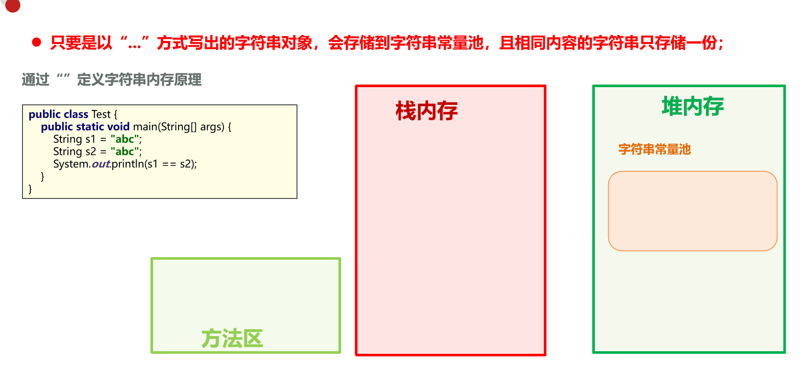

### 5.3.每次new都会创建新对象

通过new方式创建字符串对象，每new一次都会产生一个新的对象放在堆内存中。

```java
public class Test2 {
    public static void main(String[] args) {
        char[] chs = {'a', 'b', 'c'};
        String s1 = new String(chs);
        String s2 = new String(chs);
        System.out.println(s1 == s2);
    }
}
```

执行流程如下：

```java
char[] chs = {'a', 'b', 'c'};
//main方法在栈内存中新建一个chs变量，随后去堆内存创建数据，并且生成地址给chs变量
String s1 = new String(chs);
//在栈内存新建一个s1变量，随后去堆内存new一个数据出来，并生成一个地址给s1
String s2 = new String(chs);
//在栈内存新建一个s2变量，随后去堆内存new一个数据出来，并生成一个地址给s2
System.out.println(s1 == s2);
//两个地址不同，所以返回false
```

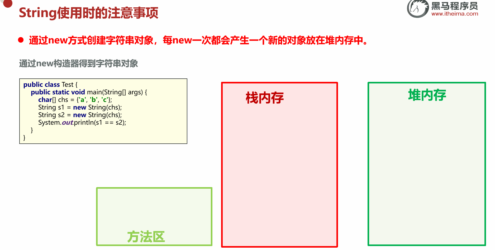

## 6.问答题

阅读程序并回答问题

```java
public class Test2 {
    public static void main(String[] args) {
        String s2 = new String("abc"); //创建了几个对象
        String s1 = "abc"; //创建了几个对象
        System.out.println(s1 == s2);
    }
}
```

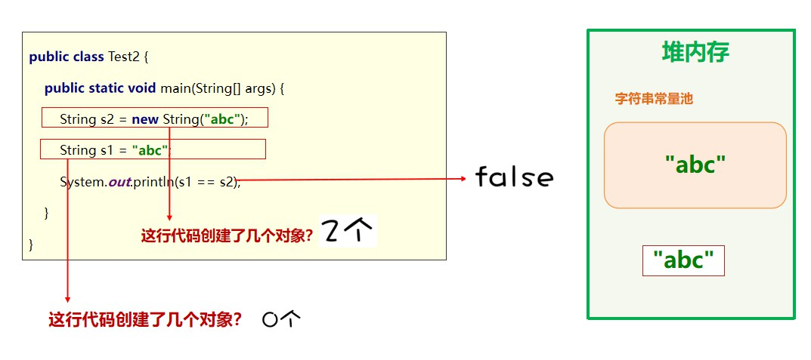

```java
public class Test2 {
    public static void main(String[] args) {
        String s1 = "abc";
        String s2 = "ab";
        String s3 = s2 + "c";
        System.out.println(s1 == s3);
    }
}
```

```java
public class Test2 {
    public static void main(String[] args) {
        String s1 = "abc";
        String s2 = "a" + "b" + "c";
        System.out.println(s1 == s2);
    }
}
```

Java存在编译优化机制，程序在编译时： “a” + “b” + “c” 会直接转成 “abc”，以提高程序的执行性能

# 三、StringBuilder

## 1.作用

作用：StringBuilder 可以提高字符串的操作效率

以下代码执行结果

- String字符串拼接需要：2946毫秒
- StringBuilder字符串拼接需要：4毫秒

```java
public class Test {
    public static void main(String[] args) {
        stringMethod();
        sbMethod();
    }
    public static void stringMethod(){
        //1970年1月1日 0时0分0秒到现在时间的毫秒数
        long startTime = System.currentTimeMillis();
        String str = "";
        for (int i = 0; i < 100000; i++) {
            str += i;
        }
        long endtTime = System.currentTimeMillis();
        System.out.println("String字符串拼接需要："+(endtTime - startTime)+"毫秒");
    }
    public static void sbMethod(){
        //1970年1月1日 0时0分0秒到现在时间的毫秒数
        long startTime = System.currentTimeMillis();
        StringBuilder sb = new StringBuilder("");
        for (int i = 0; i < 100000; i++) {
            sb.append(i);
        }
        long endtTime = System.currentTimeMillis();
        System.out.println("StringBuilder字符串拼接需要："+(endtTime - startTime)+"毫秒");
    }
}
```

## 2.特点

StringBuilder 是字符串的缓冲区,  我们可以将其理解为是一种容器 

容器可以添加任意数据类型，但是只要进入这个容器，全部变为字符串

```Java
package com.itheima.stringbuilder;

public class StringBuilderDemo2 {
    /*
        StringBuilder是字符串的缓冲区, 可以将其理解为是一种容器.
                    - 容器可以添加任意数据类型, 但是只要进入这个容器, 全部变成字符串.
     */
    public static void main(String[] args) {
        StringBuilder sb = new StringBuilder();

        sb.append(10);
        sb.append('a');
        sb.append(12.3);
        sb.append(false);
        sb.append("你好");

        System.out.println(sb);
    }
}
```

StringBuilder 是一种可变的字符序列

```Java
package com.itheima.stringbuilder;

public class StringBuilderDemo2 {
    public static void main(String[] args) {
        /*
        	 StringBuilder是一个可变的字符序列.
        	 System.identityHashCode(Object)：
        	 获取对象的「身份哈希码」（可看作 “逻辑地址”，JVM 基于对象地址生成）
        */
       StringBuilder sb = new StringBuilder();
       System.out.println(System.identityHashCode(sb));

        sb.append("Hello World");
        System.out.println(System.identityHashCode(sb));

        sb.append(" World");
        System.out.println(System.identityHashCode(sb));
        System.out.println(sb);
    }

}
```

## 3.StringBuiler的方法

### 3.1.构造方法

| 构造方法                         | 说明                                           |
| -------------------------------- | ---------------------------------------------- |
| public StringBuilder()           | 创建一个空的字符串缓冲区(容器)                 |
| public StringBuilder(String str) | 创建一个字符串缓冲区, 并初始化好指定的参数内容 |

```Java
// 创建一个空白的字符串缓冲区
StringBuilder sb1 = new StringBuilder();
System.out.println(sb1);

// 创建一个字符串缓冲区, 并指定初始值.
StringBuilder sb2 = new StringBuilder("abc");
System.out.println(sb2);
```

### 3.2.常用方法

| 方法名                                 | 说明                                                |
| -------------------------------------- | --------------------------------------------------- |
| public StringBuilder append (任意类型) | 添加数据，并返回对象本身                            |
| public StringBuilder reverse()         | 反转容器中的内容                                    |
| public int length()                    | 返回长度 ( 字符出现的个数)                          |
| public String toString()               | 通过toString()就可以实现把StringBuilder转换为String |

```java 
public class Test1 {
    /*
        StringBuilder的构造方法:

            1. public StringBuilder() : 创建一个空白的字符串缓冲区
            2. public StringBuilder(String str) : 创建一个字符串缓冲区, 并指定初始值.

        StringBuilder的成员方法:

            1. public StringBuilder append(任意类型): 添加数据到缓冲区的尾部, 返回对象自己
            2. public StringBuilder reverse() : 反转缓冲区的内容
            3. public int length() : 获取长度
            4. public String toString() : 转换为String类型
     */
    public static void main(String[] args) {
        StringBuilder sb = new StringBuilder();
        //append方法(可以链式编程)
        sb.append("红色");
        sb.append("蓝色");
        sb.append("绿色");

        // 链式编程: 如果方法的返回值是对象, 就可以继续向下调用方法
        //sb.append("红色").append("蓝色").append("绿色");
        System.out.println(sb);

        // 反转缓冲区的内容
        sb.reverse();
        System.out.println(sb);

        // 获取长度
        System.out.println(sb.length());

        //转换为String类型，想要调用方法StringBuilder没有，但是String有就转成String
        String[] arr = sb.toString().split("色");

        for (int i = 0; i < arr.length; i++) {
            System.out.println(arr[i]);
        }
        
    }
}
```

## 4.案例

### 4.1.回文字符串

需求：

键盘接受一个字符串，程序判断出该字符串是否是对称字符串，并在控制台打印是或不是

```
客上天然居，居然天上客
我为人人，人人为我
上海自来水来自海上
蜜蜂采蜂蜜
风扇能扇风
奶牛产牛奶
```

代码实现：

```Java
package com.itheima.test;

import java.util.Scanner;

public class StringBuilderTest1 {
    /*
        需求：键盘接受一个字符串，程序判断出该字符串是否是回文字符串，并在控制台打印是或不是
        回文字符串：123321、111
        非回文字符串：123123

        思路: 对接收到的字符串反转, 如果反转后的字符串, 和原字符串相同, 就是回文字符串

        String --- StringBuilder 的转换.
     */
    public static void main(String[] args) {
        Scanner sc = new Scanner(System.in);
        System.out.println("请输入: ");
        String content = sc.next();

        // 将String转换为StringBuilder调用内部的反转方法.
        StringBuilder sb = new StringBuilder(content);
        sb.reverse();

        // 判断是否是回文字符串
        // content: String类型
        // sb: StringBuilder类型
        //将StringBuilder类型转成String类型
        if (content.equals(sb.toString())) {
            System.out.println("是回文字符串");
        } else {
            System.out.println("不是回文字符串");
        }
    }
}
```

### 4.2.拼接字符串

需求：

定义一个方法，把 int 数组中的数据按照指定的格式拼接成一个字符串返回。

调用该方法，并在控制台输出结果。

例如：数组为int[] arr = {1,2,3};  -----  执行方法后的输出结果为：[1, 2, 3]

代码实现：

```Java
package com.itheima.test;

public class StringBuilderTest2 {
    /*
        需求：定义一个方法，把 int 数组中的数据按照指定的格式拼接成一个字符串返回。
          调用该方法，并在控制台输出结果。
          例如：数组为int[] arr = {1,2,3};
          执行方法后的输出结果为：[1, 2, 3]
     */
    public static void main(String[] args) {
        int[] arr = {1, 2, 3};

        System.out.println(arrayToString(arr));
    }

    public static String arrayToString(int[] arr) {
        
		//代码健壮性判断，如果传入的数组是null 或 数组长度为0
        if (arr == null || arr.length == 0) {
            return "[]";
        }

        // 创建StringBuilder对象, 用于拼接操作，如果字符串拼接用的很多就使用
        StringBuilder sb = new StringBuilder("[");

        // 遍历数组, 取出每一个元素 (排除最后一个)
        for (int i = 0; i < arr.length - 1; i++) {
            sb.append(arr[i]).append(", ");
        }

        // 单独添加最后一个元素, 拼接 ]
        sb.append(arr[arr.length - 1]).append("]");
		
        //方法需要返回的是String类型需要转一下
        return sb.toString();
    }
}
```

## 5.StringBuilder原理

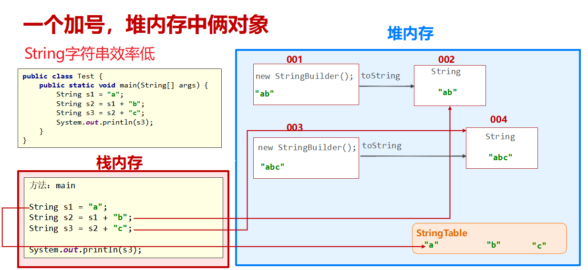

StringBuilder核心逻辑：

1.初始 “空位”：创建 `StringBuilder` 时，默认给一个能装 16 个字符的 “空数组”（不管是汉字、字母、数字，一个字符占一个位置），这 16 个位置就是初始空位；

2.逐位填充：调用 `append` 时，把要加的字符挨个填到空位置上，填一个少一个空位，比如 append ("上海") 就填 2 个空位，剩 14 个；

3.扩容触发：当要加的 字符数 > 剩余空位 时，就触发扩容

-  默认把数组扩大到「旧容量 ×2+2」（比如 16→34，4→10），
- 把原来的字符全部 “搬” 到新数组里，旧数组直接丢弃；

4.继续填充：扩容后有了新的空位，继续把剩下的字符填进去，全程只操作这一个数组，不新建额外对象。

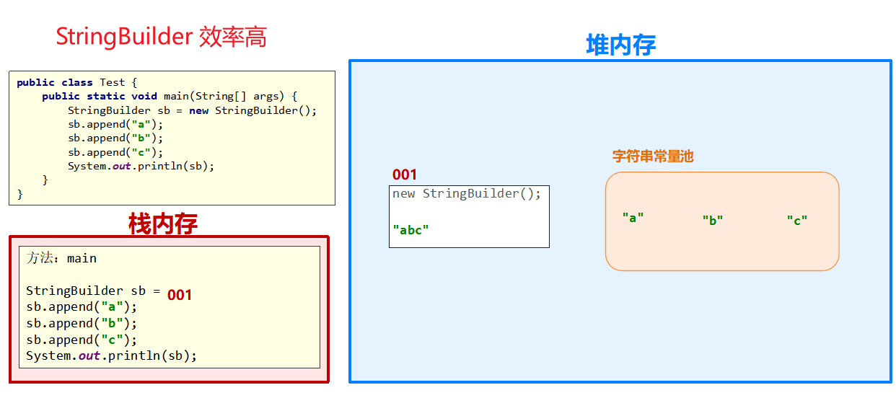

# 四、StringBuffer

StringBuffer 和 StringBuilder的构造器和操作方法都一致

如果设置线程访问，StringBuffer更安全，但是效率低

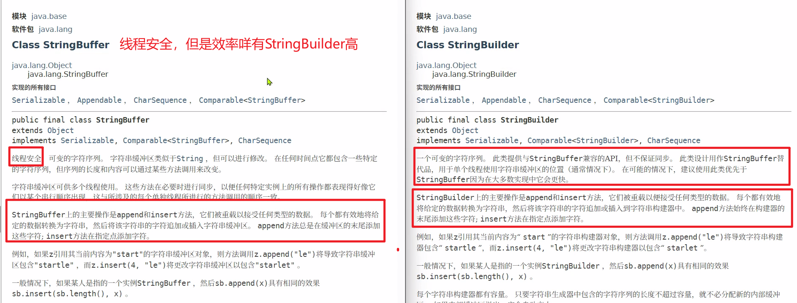

# 五、ArrayList

## 1.概述

我们之前存储一组数据用的是数组，但是数组定义完成并启动后，长度就固定了，后期想要改变很麻烦，如果用集合大小可变，开发中用的更多！

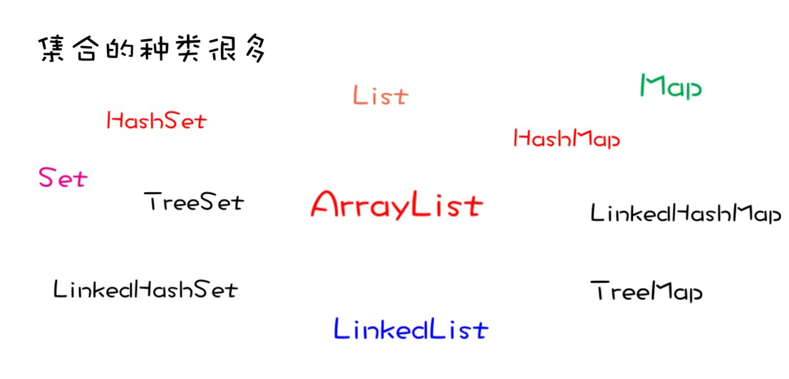

ArrayList` 是 Java 集合框架中最常用的类之一，本质是动态数组（长度可以自动调整），相比普通数组（长度固定）更灵活，适合存储不确定数量的元素。

`ArrayList` 可以进行创建、添加、获取、修改、删除、遍历等操作


## 2.ArryList的创建

ArryList是用的最多、最常见的一种集合。

| 构造器             | 说明                 |
| ------------------ | -------------------- |
| public ArrayList() | 创建一个空的集合对象 |

<font style="color:red;">创建约束数据类型的ArrayList集合</font>

- 集合里面存放的数据必须是同类的数据类型，否则会报错
- 没有固定长度：是动态数组，根据存储元素来进行增长
- 需要指定存储1的数据类型
- 不支持基本数据类型，必须是引用数据类型或者我们自定义类型(javabaen实体类型)

```java
ArrayList<数据类型> 集合名 = new ArrayList<>();
```

```java
ArrayList<String> list = new ArrayList<>();
```

## 3.ArrayList的操作

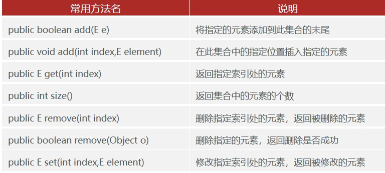

### 3.1.add(数据)

将指定的元素添加到当前集合的末尾

```java
list.add("小哈");
list.add("小明");
list.add("小花");
System.out.println(list);//[小哈, 小明, 小花]
```

### 3.2.add(索引值,数据)

在集合的某个索引位置添加数据

```java
list.add(1,"小乖");
System.out.println(list); //[小哈, 小乖, 小明, 小花]
```

### 3.3.get(索引值)

根据索引值获取当前位置的数据

```java
String res = list.get(1);
System.out.println(res); //小乖
```

### 3.4.size()

获取当前集合的数组长度

```java
int size = list.size();
System.out.println(size);//4
```

### 3.5.remove(索引值)

根据索引值删除当前索引位置的数据，返回被删除的元素

```java
String res = list.remove(1);
System.out.println("被删除的元素是："+res);
System.out.println(list);//[小哈, 小明, 小花]
```

### 3.6.remove(元素的值)

根据指定的元素数据值，删除元素，返回布尔值

注意：如果删除时，数据重复出现，默认删除第一个数据

```java
boolean flag = list.remove("小明");
System.out.println(flag);
System.out.println(list);//[小哈, 小花]
```

### 3.7.set(索引值，新数据)

根据索引位置，修改元素值，返回被修改的元素

```java
String res2 = list.set(1,"小米");
System.out.println("被修改的元素值之前是："+res2);
System.out.println(list);//[小哈, 小米]
```

### 3.8.遍历集合

使用for循环遍历集合

```java
 for (int i = 0; i < list.size(); i++) {
     System.out.println(list.get(i));
 }
```

## 4.案例

### 4.1.删除集合中的元素

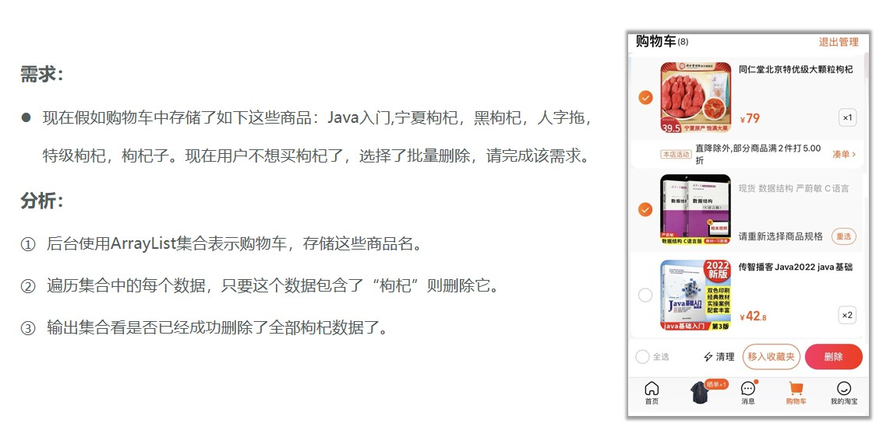

方法1：

```java
import java.util.ArrayList;

public class Test2 {
    public static void main(String[] args) {
        ArrayList<String> list = new ArrayList<>();
        list.add("Java入门");
        list.add("宁夏枸杞");
        list.add("黑枸杞");
        list.add("人字拖");
        list.add("特级枸杞");
        list.add("枸杞子");

        for (int i = 0; i < list.size(); i++) {
            String str = list.get(i);
            if (str.contains("枸杞")){
                list.remove(i);
                i--;
            }
        }
        System.out.println(list);
    }
}
```

方法2：倒着遍历

```java
for (int i = list.size()-1; i > 0; i--) {
    String str = list.get(i);
    if (str.contains("枸杞")){
        list.remove(i);
    }
}
```

### 4.2.集合存储字符串并遍历

需求：创建一个存储字符串的集合，内部存储3个字符串元素，使用程序实现在控制台遍历该集合

```Java
package com.itheima.test;

import java.util.ArrayList;

public class ArrayListTest1 {
    public static void main(String[] args) {
        ArrayList<String> list = new ArrayList<>();

        list.add("张三");
        list.add("上官玉米");
        list.add("李四");
        list.add("诸葛钢铁");
        list.add("王五");

        // 集合遍历的场景: 如果要实现的需求, 需要操作到集合中的每一个元素.
        for (int i = 0; i < list.size(); i++) {
            String name = list.get(i);
            if (name.length() == 4) {
                System.out.println(name);
            }
        }

    }
}
```

### 4.3.集合存储学生对象并遍历

需求：创建一个存储学生对象的集合，存储3个学生对象，使用程序实现在控制台遍历该集合，将年龄大于18的打印在控制台

在模块下专们简历一个pojo的包，专门用来存放javabean对象

```Java
import com.itheima.pojo.Student;

import java.util.ArrayList;

public class ArrayListTest2 {
    /*
        需求：创建一个存储学生对象的集合，存储3个学生对象，使用程序实现在控制台遍历该集合
     */
    public static void main(String[] args) {
        Student stu1 = new Student("张三", 23);
        Student stu2 = new Student("李四", 14);
        Student stu3 = new Student("王五", 15);

        ArrayList<Student> list = new ArrayList<>();
        list.add(stu1);
        list.add(stu2);
        list.add(stu3);

        for (int i = 0; i < list.size(); i++) {
            // 从集合中取出[每一个]学生对象
            Student stu = list.get(i);
            // 获取每一个学生对象的年龄, 进行判断.大于18 的打印
            if (stu.getAge() < 18) {
                System.out.println(stu);
            }
        }
    }
}
```

### 4.4.综合案例

ArrayList的综合案例-模仿外卖系统中的商家系统

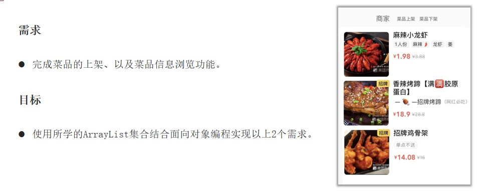

```
======欢迎来来到商家菜品管理系统======
1.添加菜品（add）
2.浏览菜品（get）
3.下架菜品（remove）
4.修改菜品（set）
5.退出
======请选择您的命令======
```

四个操作功能

```java
public void start() {...}
// 修改菜品价格
private void modifyDish() {...}
// 菜品下架
private void removeDish() {...}
// 菜品上架
public void addDish() {...}
// 浏览菜单
public void showDish() {...}
```

第一步：新建 Dish 实体类，封装菜品的数据

```java
public class Dish {
    //私有成员变量
    private int id; //编号
    private String name; //菜名
    private double oldPrice; //原价
    private double vipPrice; //现价
    private String info; //描述
    //构造器
    public Dish() {
    }

    public Dish(int id, String name, double oldPrice, double vipPrice, String info) {
        this.id = id;
        this.name = name;
        this.oldPrice = oldPrice;
        this.vipPrice = vipPrice;
        this.info = info;
    }
    //set/get方法

    public int getId() {
        return id;
    }

    public void setId(int id) {
        this.id = id;
    }

    public String getName() {
        return name;
    }

    public void setName(String name) {
        this.name = name;
    }

    public double getOldPrice() {
        return oldPrice;
    }

    public void setOldPrice(double oldPrice) {
        this.oldPrice = oldPrice;
    }

    public double getVipPrice() {
        return vipPrice;
    }

    public void setVipPrice(double vipPrice) {
        this.vipPrice = vipPrice;
    }

    public String getInfo() {
        return info;
    }

    public void setInfo(String info) {
        this.info = info;
    }
}
```

第二步、设置操作类

```java
public class DishCms {
    //成员属性
    Scanner sc = new Scanner(System.in);
    //1.创建一个集合用来存放数据
    ArrayList<Dish> itemList = new ArrayList<>();
    //=====以上代码方可以在整个里面使用======公用的

    public void start() {
        //2.模拟初始菜品，程序加载的时候就要有数据
        Dish dish1 = new Dish(1,"宫保鸡丁", 19.1, 9.9, "单点不送");
        itemList.add(dish1);
        Dish dish2 = new Dish(2,"鱼香肉丝", 18.8, 6.9, "鲜香麻辣");
        itemList.add(dish2);
        Dish dish3 = new Dish(3,"麻辣小龙虾", 188.8, 36.9, "够辣够爽");
        itemList.add(dish3);
        //3.编写菜单控制页面
        while (true) {
            System.out.println("======欢迎来来到商家菜品管理系统======");
            System.out.println("1.添加菜品（add）");
            System.out.println("2.浏览菜品（get）");
            System.out.println("3.下架菜品（remove）");
            System.out.println("4.修改菜品（set）");
            System.out.println("5.退出");
            System.out.println("=====请选择您的命令======");
            int command = sc.nextInt();
            switch (command) {
                case 1:
                    //添加菜品
                    addDish();
                    break;
                case 2:
                    //浏览菜单
                    showDish();
                    break;
                case 3:
                    //下架菜品
                    removeDish();
                    break;
                case 4:
                    //修改菜品价格
                    modifyDish();
                    break;
                case 5:
                    System.exit(0);
                    break;
                default:
                    break;
            }
        }
    }
    //修改菜品价格
    private void modifyDish() {
        System.out.println("请输入您要修改的菜品名字");
        String dishName = sc.next();
        boolean flag = false;
        //循环集合查找名字一样的菜品，修改即可
        for (int i = 0; i < itemList.size(); i++) {
            Dish dish = itemList.get(i);
            if (dishName.equals(dish.getName())) {
                //找到这个菜品了
                //原价
                System.out.println("请输入修改的原价价格");
                double oldPrice = sc.nextDouble();
                dish.setOldPrice(oldPrice);
                //现价
                System.out.println("请输入修改的现价价格");
                double vipPrice = sc.nextDouble();
                dish.setVipPrice(vipPrice);
                System.out.println("菜品修改成功！");
                flag = true;
                break;
            }
        }
        //循环结束后，flag还是false就提醒用户输入不正确
        if (flag == false) {
            System.out.println("没找到您的菜品，请检查后重新输入...");
        }
    }
    //菜品下架
    private void removeDish() {
        System.out.println("请输入您要下架的菜品名称");
        String dishName = sc.next();
        boolean flag = false;//设置信号为默认没有这个菜品
        //循环集合查找名字一样的菜品，删除即可
        for (int i = 0; i < itemList.size(); i++) {
            //每一循环都能拿到一样菜品
            Dish dish = itemList.get(i);
            //判断拿到的菜品名称是否一样
            if (dishName.equals(dish.getName())) {
                itemList.remove(i);
                System.out.println("删除" + dishName + "成功！");
                //如果找到了菜品就将信号为更改
                flag = true;
                break;//找到后就停止当前判断
            }
        }
        //循环结束后，flag还是false就提醒用户输入不正确
        if (flag == false) {
            System.out.println("没找到您的菜品，请检查后重新输入...");
        }
    }
    //菜品上架
    public void addDish() {
        //使用无参狗仔新建一个Dish类的实体菜品对象dish
        //将dish菜品对象添加到itemList集合中
        Dish dish = new Dish();
        System.out.println("请输入菜品名称");
        String name = sc.next();
        dish.setName(name);
        System.out.println("请输入菜品原价");
        double price = sc.nextDouble();
        dish.setOldPrice(price);
        System.out.println("请输入菜品现价");
        double vipPrice = sc.nextDouble();
        dish.setVipPrice(vipPrice);
        System.out.println("请输入菜品信息");
        String info = sc.next();
        dish.setInfo(info);
        //将社会好的菜品添加到集合中使用
        itemList.add(dish);
    }
    //浏览菜单
    public void showDish() {
        //遍历打印菜品信息
        for (int i = 0; i < itemList.size(); i++) {
            //循环到的某一个菜品
            Dish dish = itemList.get(i);
            System.out.println("编号："+dish.getId());
            System.out.println("菜名："+dish.getName());
            System.out.println("原价："+dish.getOldPrice());
            System.out.println("现价："+dish.getVipPrice());
            System.out.println("描述："+dish.getInfo());
            System.out.println("----------------------------");
        }
    }
}
```

第三步：测试使用

```java
public class Test {
    public static void main(String[] args) {
        //打开菜单
        DishCms dishCms = new DishCms();
        dishCms.start();
    }
}
```