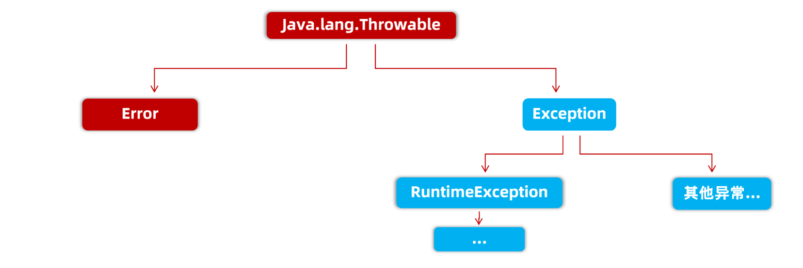
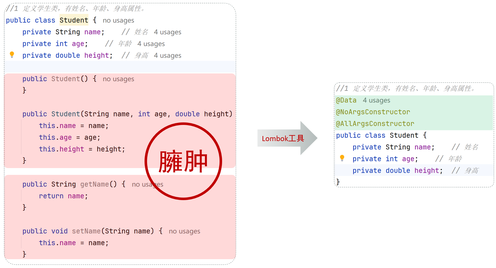
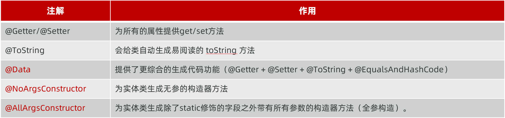

# 一、枚举

## 1.概述

枚举是一种特殊类，用于定义固定、有限、可控的一组常量对象。

核心用途：替代普通常量，解决参数乱传、数据不规范问题。

枚举本质：

- 编译器自动继承Enum 父类
- 枚举类默认是final 最终类，不能被继承
- 枚举常量 = public static final 枚举对象

## 2.语法

```java
public enum 枚举名 {
    // 第一行：罗列枚举常量（必须放最前面）
    常量1, 常量2, 常量3;

    // 第二行开始：可以定义成员变量、构造器、方法
}
```

## 3.核心特性

1.常量在前：枚举第一行必须是常量列表，其他代码只能写在后面。

2.构造器私有：枚举构造器默认私有，手动写也只能 private，外部不能 new 对象。

3.常量即对象：每个枚举常量，都是枚举类的一个单例对象。

4.自动生成方法：编译器自动生成两个核心静态方法：       

- `values()`：获取所有枚举对象数组
- `valueOf(String name)`：根据名称获取指定枚举对象

5.不可继承：枚举默认 final，不能被继承。

## 4.代码示例

```java
// 性别枚举
public enum Gender {
    // 常量对象，调用有参构造
    MAN("男"),
    WOMAN("女");

    // 成员变量
    private String desc;

    // 私有构造器
    private Gender(String desc){
        this.desc = desc;
    }

    // getter方法
    public String getDesc() {
        return desc;
    }
}
```

```java
public class Test {
    public static void main(String[] args) {
        // 1. 获取单个枚举对象
        Gender g1 = Gender.MAN;

        // 2. 获取所有枚举对象
        Gender[] values = Gender.values();

        // 3. 根据名字获取枚举
        Gender g2 = Gender.valueOf("WOMAN");

        // 4. 获取枚举携带的数据
        System.out.println(g1.getDesc()); // 男
    }
}
```

# 二、方法引用

## 1.概述

定义：方法引用是Lambda 表达式的简化写法，用于直接引用已有类/对象的方法，替代简洁的 Lambda 代码。

核心语法：`类名/对象名::方法名`

核心前提：Lambda 表达式中仅调用一个方法，且箭头前后参数形式、数量完全一致，才可使用方法引用。

优先级说明：核心掌握 Lambda 表达式，方法引用作为简化优化写法，了解并会使用即可。

## 2. 代码对比

```java
public class Demo01 {
    public static void main(String[] args) {
        Double[] arr = {3.5, 9.0, 5.6, 1.2, 7.8};

        // 原始 Lambda 写法
        Arrays.sort(arr, (o1, o2) -> Double.compare(o1, o2));

        // 简化：静态方法引用
        Arrays.sort(arr, Double::compare);

        System.out.println("排序后：" + Arrays.toString(arr));
    }
}
```

## 3. 禁用场景

参数顺序/形式不一致时，不能使用方法引用！

示例：`(o1, o2) -> Double.compare(o2,o1)` 参数顺序颠倒，不满足条件，无法简化。

## 4.实例方法引用

```java
public class Demo02 {
    public static void main(String[] args) {
        ArrayList<String> list = new ArrayList<>();
        list.add("张益达");
        list.add("王大锤");

        // 原始 Lambda 写法
        list.forEach(s -> System.out.println(s));

        // 简化：实例方法引用
        list.forEach(System.out::println);
    }
}
```

# 三、异常

## 1.什么是异常

异常：程序运行过程中出现的问题。

例如：`int[] arr={10,20,30}; System.out.println(arr[3]);` 访问不存在数组下标，产生异常。

异常控制台信息分为三部分：

- 异常类型：是什么错误
- 异常原因：为什么出错
 - 异常位置：哪一行代码出错

## 2.异常继承体系



Throwable：根类，两个子类

- `Error`：错误，JVM本身问题，我们代码管不了
- `Exception`：我们常说的异常，需要我们处理修复

## 3.异常的分类分类

**1.运行时异常 RuntimeException及其子类**

编译阶段不会报错，运行程序才报错

不需要 throws 声明，JVM默认自动向上抛出

举例：数组越界、空指针

**2.编译时异常（受检异常），除RuntimeException以外的Exception子类**

写代码编译阶段就报红色波浪线

必须手动处理，否则编译不通过

举例：文件找不到、日期解析异常 作用：提前提醒开发者，这块代码容易出错，要小心

## 4.异常的处理方式

> 出现异常如果不做处理，异常向上抛，最终给到JVM，程序直接终止运行

**1.throws 向上抛出异常（丢给调用者处理）**

写在方法声明处，把异常向外抛给调用方 

语法：

```java
方法名() throws 异常类1,异常类2{

}
```

规则：

- 运行时异常：不需要写throws，默认自动抛出
- 编译时异常：必须写throws声明，否则编译报错

注意：如果所有调用者都继续throws不处理，异常最后给到JVM，程序还是会停止。

**2.try‑catch 捕获异常（自己处理异常）**

捕获之后异常就消化掉，程序可以继续往下执行，不会终止 

语法：

```java
try{
    // 有可能出现异常的代码
}catch(异常类型 e){
    // 异常发生后的处理逻辑
    e.printStackTrace(); //打印完整异常信息，定位bug
}
```

 IDE小技巧：
 - alt+enter：快速添加throws抛出异常
 - ctrl+alt+t：快速包裹try‑catch捕获异常

## 5.throw关键字

语法：

```java
throw new 异常类("错误提示信息");
```

用途：

- 把业务问题以异常形式通知上层调用者；
- 区别普通打印语句，普通输出只是文字，异常可以携带完整错误栈信息。

示例：

```java
if(age <0 || age >=150){
    throw new RuntimeException("年龄不合法");
}
```

区分 throw 和 throws：

 | 关键字 | 位置       | 作用                                       |
 | ------ | ---------- | ------------------------------------------ |
 | throw  | 方法内部   | 主动抛出一个异常对象                       |
 | throws | 方法声明上 | 声明本方法可能抛出哪些异常，交给调用者处理 |

## 6.自定义异常

使用场景：Java自带异常不够用，业务特有错误，自己造异常类。

两种选择：

1. 继承 Exception → 自定义【编译时异常】

   抛出该异常时，方法必须加`throws`声明，强制调用者处理

2. 继承 RuntimeException → 自定义【运行时异常】

   抛出该异常，不需要throws声明

自定义异常固定步骤：

1. 创建类，继承`Exception`或者`RuntimeException`
2. 构造方法：带String message参数，调用父类构造`super(message)`，接收错误提示
3. 业务代码中使用 `throw new 自定义异常("提示")`抛出

代码示例：

```java
//编译时异常版本
public class AgeException extends Exception{
    public AgeException(String message){
        super(message);
    }
}
```

# 四、泛型

## 1.概述

### 1.1.什么是泛型

在类、接口、方法上定义类型变量（`<T>`、`<E>`），用来约束数据类型，实现类型参数化。

简单理解：把数据类型当作参数传递。

### 1.2.泛型核心作用

编译期类型检查：只能存储指定类型，杜绝类型错乱

省去强制类型转换，代码更简洁安全

避免类型转换异常

### 1.3.泛型特点

泛型只支持引用类型，不支持基本数据类型

泛型擦除：泛型仅在编译阶段生效，编译后统一擦除为 Object，运行时无泛型

## 2.泛型的三种定义

### 2.1. 泛型类

定义格式：类名后定义泛型

```java
public class 类名<T,E,K,V> {
    // 类中可以直接使用 T 作为类型
}
```

使用时机：创建对象时确定具体类型

常用泛型标识：

- E：Element 元素
- T：Type 类型
- K/V：Key/Value 键值类型

```java
public class GenericClassDemo {
    public static void main(String[] args) {
        // 指定泛型为Integer
        StudentDemo<Integer> s1 = new StudentDemo<>();
        s1.setName("张伟");
        s1.setValue(20);
        System.out.println("s1 = " + s1);

        // 指定泛型为String
        StudentDemo<String> s2 = new StudentDemo<>("张益达","北京");
        System.out.println("s2 = " + s2);
    }
}

// 自定义泛型类
class StudentDemo<T> {
    private String name;
    private T value;

    public StudentDemo() {}

    public StudentDemo(String name, T value) {
        this.name = name;
        this.value = value;
    }

    public String getName() {
        return name;
    }

    public void setName(String name) {
        this.name = name;
    }

    public T getValue() {
        return value;
    }

    public void setValue(T value) {
        this.value = value;
    }

    @Override
    public String toString() {
        return "StudentDemo{" +
                "name='" + name + '\'' +
                ", value=" + value +
                '}';
    }
}
```

### 2.2. 泛型接口

定义格式：接口名后定义泛型

```java
public interface 接口名<T> {
    // 方法可直接使用泛型T
}
```

使用时机：实现类实现接口时，指定具体类型

代码示例：

```java
public class GenericInterfaceDemo {
    public static void main(String[] args) {
        InterImpl inter = new InterImpl();
        inter.set("张益达",22);
        Integer value = inter.get("张益达");
        System.out.println("value = " + value);
    }
}

// 泛型接口
interface Inter<K,V> {
    void set(K key, V value);
    V get(K key);
}

// 实现类指定泛型具体类型
class InterImpl implements Inter<String,Integer>{
    @Override
    public void set(String key, Integer value) {
        System.out.println(key+"="+value);
    }

    @Override
    public Integer get(String key) {
        System.out.println("key = "+key);
        return 0;
    }
}
```

### 2.3. 泛型方法

定义格式：修饰符和返回值之间声明 <T>

```java
public static <T> 返回值类型 方法名(T[] arr){

}
```

特点：方法专属泛型，不受类泛型约束，调用方法时自动确定类型。

代码示例：

```java
public class GenericMethodDemo {
    public static void main(String[] args) {
        Integer[] arr={10,20,30,40,50};
        int index = getIndex(arr, 20);
        System.out.println("查找20在数组中的索引：" + index);

        System.out.println("-----------------------");

        Double[] arr2={10.5,20.6,30.7,40.8,50.9};
        index = getIndex(arr2, 20.6);
        System.out.println("查找20.6在数组中的索引：" + index);
    }

    // 自定义泛型方法：适配任意类型数组
    public static<T> int getIndex(T[] arr, T value){
        for (int i = 0; i < arr.length; i++) {
            if(arr[i].equals(value)){
                return i;
            }
        }
        return -1;
    }
}
```

## 3.通配符与上下限

主要用于方法参数，适配多种泛型类型

### 3.1. ? 通配符

? 代表任意未知类型

写法：`ArrayList<?>`

### 3.2. 泛型上限：<? extends 父类>

只能是：当前类 或 它的子类

例：`? extends Animal` → 接收 Animal、Dog、Cat

### 3.3. 泛型下限：<? super 子类>

只能是：当前类 或 它的父类

例：`? super Dog` → 接收 Dog、Animal、Object

子类泛型集合不是父类泛型集合的子类

如：`ArrayList<Dog>` 和 `ArrayList<Animal>` 无继承关系，必须用通配符适配。

### 3.4.代码示例

```java
import java.util.ArrayList;

public class GenericLimitDemo {
    public static void main(String[] args) {
        ArrayList<Dog> dogList=new ArrayList<>();
        dogList.add(new Dog("旺财"));
        dogList.add(new Dog("大黄"));
        print(dogList);

        ArrayList<Cat> catList=new ArrayList<>();
        catList.add(new Cat("花卷"));
        catList.add(new Cat("毛毛"));
        print(catList);
    }

    // 泛型上限：只接收Animal及子类
    public static void print(ArrayList<? extends Animal> list) {
        for (int i = 0; i < list.size(); i++) {
            Animal animal = list.get(i);
            System.out.println(animal);
            System.out.println(animal.getName());
        }
    }
}

// 父类动物
class Animal {
    private String name;

    public Animal() {}
    public Animal(String name) {
        this.name = name;
    }

    public String getName() {
        return name;
    }

    public void setName(String name) {
        this.name = name;
    }

    @Override
    public String toString() {
        return "Animal{" +
                "name='" + name + '\'' +
                '}';
    }
}

// 子类狗
class Dog extends Animal{
    public Dog() {}
    public Dog(String name) {
        super(name);
    }
}

// 子类猫
class Cat extends Animal{
    public Cat() {}
    public Cat(String name) {
        super(name);
    }
}

```


## 4.包装类（配合泛型使用）

### 4.1. 为什么需要包装类

泛型/集合不支持基本类型，只能存对象，包装类 = 基本类型的对象形式。

### 4.2. 基本类型与包装类对应

byte → Byte

short → Short

int → Integer

long → Long

float → Float

double → Double

char → Character

boolean → Boolean

### 4.3. 自动装箱 & 自动拆箱

自动装箱：基本类型 → 包装对象  例：`Integer a = 10;`

自动拆箱：包装对象 → 基本类型  例：`int b = a;`

### 4.4. 包装类核心功能

基本类型 <=> 字符串转换

- 字符串转数字：`Integer.parseInt()` / `Double.parseDouble()`
- 数字转字符串：`Integer.toString(数字)`

### 4.5.代码示例

```java
import java.util.ArrayList;

public class WrapperDemo {
    public static void main(String[] args) {
        // 1. 自动装箱、自动拆箱
        Integer a = 130; // 自动装箱
        int b = a;       // 自动拆箱
        System.out.println(b);

        // 集合使用包装类（不支持基本类型）
        ArrayList<Integer> list = new ArrayList<>();
        list.add(120); // 自动装箱
        int num = list.get(0); // 自动拆箱

        // 2. 基本类型转字符串
        int j = 23;
        String rs1 = Integer.toString(j);
        System.out.println(rs1 + 1);

        // 3. 字符串转基本类型
        String str = "98";
        int i1 = Integer.parseInt(str);
        System.out.println(i1 + 2);

        String str2 = "98.8";
        double d = Double.parseDouble(str2);
        System.out.println(d + 2);
    }
}
```

# 五、lombok工具

Lombok是一个实用的Java类库，能通过注解的形式自动生成构造器、getter/setter、equals、hashcode、toString等方法，并可以自动化生成日志变量，简化java开发、提高效率。



Lombok 常用的注解：




