# 一、集合概述

集合是一种容器，用来装数据的，类似于数组，但集合的大小可变，开发中也非常常用。

除了`ArrayList`集合，Java还提供了很多种其他的集合，如下图所示：

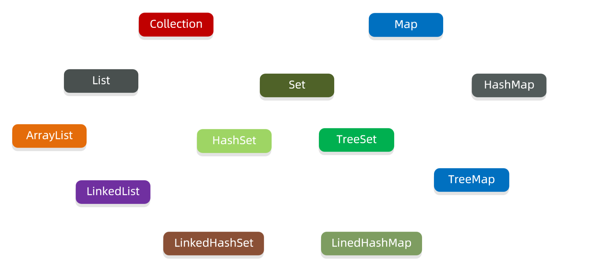

集合分为两类，一类是单列集合，元素是一个一个的，另一类是双列集合，元素是一对一对的。

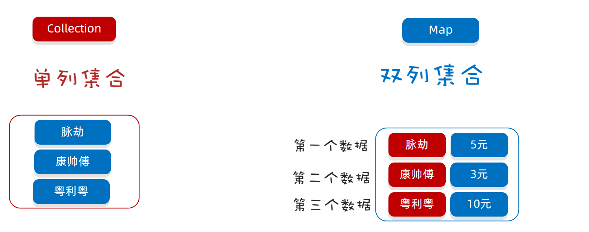

Collection : 代表单列集合，每个元素（数据）只包含一个值

Map : 代表双列集合，每个元素包含两个值（键值对）

Collection是单列集合的根接口，Collection接口下面又有两个子接口List接口、Set接口，List和Set下面分别有不同的实现类，及特点如下:

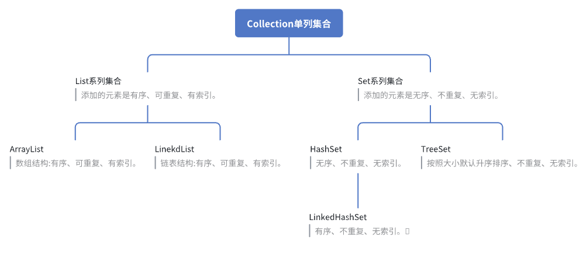

# 二、Collection单列集合

## 1.常用方法

因为`Collection`是单列集合的祖宗，它规定的方法（功能）是全部单列集合都会继承的。

所以我们要先学习`Collection`中定义的功能:

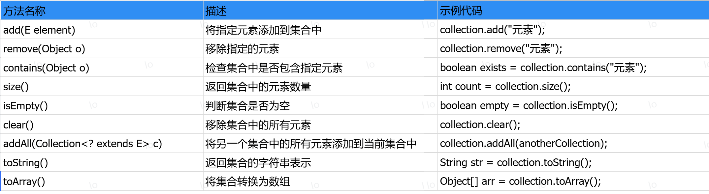

```Java
package com.itheima.d1_collection;

import java.util.ArrayList;
import java.util.Arrays;
import java.util.Collection;
import java.util.HashSet;

/*
	目标：演示Collection集合的通用方法。
    由于Collection是所有单列集合的根接口，所以Collection接口的方法，所有单列集合都能够使用
 */
public class Demo2 {
    public static void main(String[] args) {
        Collection<String> coll = new ArrayList<>();
        //public boolean add(E e) 把给定的对象添加到当前集合中
        coll.add("脉劫");  //返回true表示添加成功，返回false表示添加失败(set集合存重复值会返回false)
        coll.add("康帅傅");
        coll.add("粤利粤");
        coll.add("康帅傅");
        System.out.println(coll);  //[脉劫, 康帅傅, 粤利粤, 康帅傅]

        //public void clear() 清空集合中所有的元素
        //coll.clear();
        //System.out.println(coll);  //[]

        //public boolean remove(E e) 把给定的对象在当前集合中删除
        boolean remove = coll.remove("康帅傅");  //注意：默认移除第一次出现的数据，如果要移除全部则需要遍历
        System.out.println("是否移除成功 = " + remove);  //true
        System.out.println(coll);  //[脉劫, 粤利粤, 康帅傅]

        //public boolean contains(Object obj) 判断当前集合中是否包含给定的对象
        //boolean contains = coll.contains("雷碧");  //false
        boolean contains = coll.contains("粤利粤");  //true
        System.out.println("是否包含 = " + contains);

        //public boolean isEmpty() 判断当前集合是否为空
        boolean empty = coll.isEmpty();  //false
        System.out.println("集合是否为空 = " + empty);

        //public int size() 返回集合中元素的个数。
        int size = coll.size();
        System.out.println("集合中元素的个数 = " + size);

        //public Object[] toArray() 把集合中的元素，存储到数组中
        Object[] arr = coll.toArray();
        System.out.println("把集合中的元素，存储到数组中 = " + Arrays.toString(arr));
    }
}
```

最后，我们总结一下Collection集合的常用功能其子类，如`ArrayList`、`LinkedList`、`HashSet`、`LinkedHashSet`、`TreeSet`集合都可以调用这些方法。

## 2.遍历方式 

各位同学，接下来我们学习一下Collection集合的遍历方式。有同学说：“集合的遍历之前不是学过吗？就用普通的for循环啊? “ 没错！之前是学过集合遍历，但是之前学习过的遍历方式，只能遍历List集合，不能遍历Set集合，因为以前的普通for循环遍历需要索引，只有List集合有索引，而Set集合没有索引。

所以我们需要学习通用的遍历方式，能够遍历所有集合。

### 2.1.迭代器遍历

迭代器:是用来遍历集合的专用方式\(数组没有迭代器\)，在Java中迭代器的代表是Iterator。

Collection集合获取迭代器的方法：

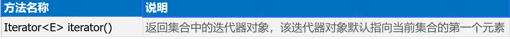

Iterator迭代器中的常用方法:

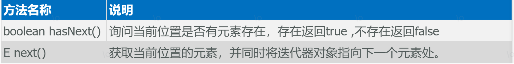

基于上述方法,我们快来完成遍历吧

```Java
package com.itheima.d1_collection;

import java.util.ArrayList;
import java.util.Collection;
import java.util.Iterator;
import java.util.function.Consumer;

/*
    目标：演示单列集合的通用遍历方式
 */
public class Demo3 {
    public static void main(String[] args) {
        Collection<String> c1 = new ArrayList<>();
        c1.add("脉劫");
        c1.add("康帅傅");
        c1.add("粤利粤");
        c1.add("大个核桃");
        //需求1 ：使用迭代器遍历Collection集合中的每一个元素，并打印输出
        //1 获取Iterator迭代器对象
        Iterator<String> it = c1.iterator();
        //2 使用while循环遍历获取每个元素
        while (it.hasNext()){  //判断当前位置是否有值，如果有就返回true。底层通过游标变量cursor!=size来判断
            String name = it.next();
            System.out.println(name);
        }
        System.out.println("--------------");
        //需求2 ：使用增强for遍历Collection集合中的每一个元素，并打印输出

        //需求3 ：使用forEach()+Lambda表达式遍历Collection集合中的每一个元素，并打印输出

    }
}
```

迭代器代码的原理如下：

- 当调用iterator\(\)方法获取迭代器时，当前指向第一个元素

- hasNext\(\)方法则判断这个位置是否有元素，如果有则返回true，进入循环

- 调用next\(\)方法获取元素，并将当前元素指向下一个位置，

- 等下次循环时，则获取下一个元素，依此内推

### 2.2.增强for循环

同学们刚才我们学习了迭代器遍历集合，但是这个代码其实还有一种更加简化的写法，叫做增强for循环。

格式如下：

```Java
for (元素的数据类型 变量名 : 数组或者集合) {

}
```

操作代码如下:

```Java
package com.itheima.d1_collection;

import java.util.ArrayList;
import java.util.Collection;
import java.util.Iterator;
import java.util.function.Consumer;

/*
    目标：演示单列集合的通用遍历方式
 */
public class Demo3 {
    public static void main(String[] args) {
        Collection<String> c1 = new ArrayList<>();
        c1.add("脉劫");
        c1.add("康帅傅");
        c1.add("粤利粤");
        c1.add("大个核桃");
        //需求1 ：使用迭代器遍历Collection集合中的每一个元素，并打印输出
        //1 获取Iterator迭代器对象
        Iterator<String> it = c1.iterator();
        //2 使用while循环遍历获取每个元素
        System.out.println("--------------");
        
        //需求2 ：使用增强for遍历Collection集合中的每一个元素，并打印输出
        //快捷键：数组名/集合名.for+回车
        for (String s : c1) {
            if(s.equals("粤利粤")){
                continue;
            }
            System.out.println(s);
        }
        System.out.println("--------------");
        
        //需求3 ：使用forEach()+Lambda表达式遍历Collection集合中的每一个元素，并打印输出
        
    }
}
```

增强for可以用来遍历集合或者数组。

增强for遍历集合，本质就是迭代器遍历集合的简化写法。

### 2.3.forEach\(\)\+Lambda表达式

得益于JDK 8开始的新技术Lambda表达式，提供了一种更简单、更直接的方式来遍历集合。

需要使用Collection的如下方法来完成

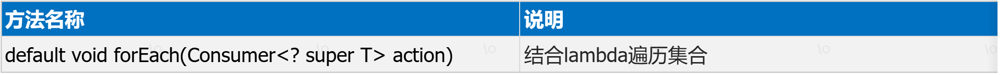

```Java
package com.itheima.d1_collection;

import java.util.ArrayList;
import java.util.Collection;
import java.util.Iterator;
import java.util.function.Consumer;

/*
    目标：演示单列集合的通用遍历方式
 */
public class Demo3 {
    public static void main(String[] args) {
        Collection<String> c1 = new ArrayList<>();
        c1.add("脉劫");
        c1.add("康帅傅");
        c1.add("粤利粤");
        c1.add("大个核桃");
        //需求1 ：使用迭代器遍历Collection集合中的每一个元素，并打印输出
        ///1 获取Iterator迭代器对象
        Iterator<String> it = c1.iterator();
        //2 使用while循环遍历获取每个元素
        
        //需求2 ：使用增强for遍历Collection集合中的每一个元素，并打印输出
       
        //需求3 ：使用forEach()+Lambda表达式遍历Collection集合中的每一个元素，并打印输出
        c1.forEach(s -> {
           /* if(s.equals("粤利粤")){
                //问题：不能使用break和continue？因为lambda表达式时匿名内部类的简写，break/continue在重写的方法中而不是循环中，所以用不了。
                continue;  
            }*/
            System.out.println(s);
        });

        /*c1.forEach(new Consumer<String>() {
            @Override
            public void accept(String s) {
                if(s.equals("粤利粤")){
                    //continue;  //报错，continue写在for/while循环中，此处没有写在循环中
                    return;
                }
                System.out.println(s);
            }
        });*/
    }
}
```

# 三、List集合

前面我们已经把`Collection`通用的功能学习完了，接下来我们学习Collection下面的一个子体系List集合。如下所示：

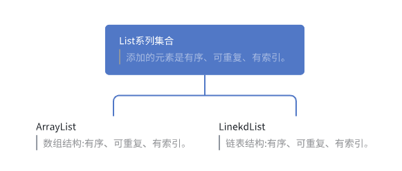

注:`ArrayList`和`LinkedList`底层实现不同,所以应用场景有所区别。

## 1.List集合的使用

List集合是索引的，所以多了一些有索引操作的方法，如下所示:

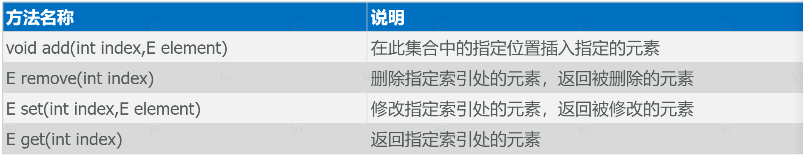

演示代码:

```Java
package com.itheima.d2_list;

import java.util.ArrayList;
import java.util.List;

/*
目标：演示List集合特点、特有方法、遍历方式
 */
public class Demo1 {
    public static void main(String[] args) {
        List<String> list = new ArrayList<>();
        list.add("脉劫");
        list.add("康帅傅");
        list.add("粤利粤");
        list.add("康帅傅");
        System.out.println(list);   //[脉劫, 康帅傅, 粤利粤, 康帅傅]
        //public void add(int index, E element) 在此集合中的指定位置插入指定的元素
        list.add(1,"大个核桃");
        System.out.println(list);   //[脉劫, 大个核桃, 康帅傅, 粤利粤, 康帅傅]
        //public E remove(int index) 删除指定索引处的元素，返回被删除的元素
        list.remove(2);
        System.out.println(list);   //[脉劫, 大个核桃, 粤利粤, 康帅傅]
        //public E set(int index, E element) 修改指定索引处的元素，返回被修改的元素
        list.set(2,"雷碧");
        System.out.println(list);   //[脉劫, 大个核桃, 雷碧, 康帅傅]
        //public E get(int index) 返回指定索引处的元素
        String s = list.get(1);
        System.out.println(s);  //大个核桃
    }
}
```

List集合支持的遍历方式

```Java
package com.itheima.d2_list;

import java.util.ArrayList;
import java.util.List;

/*
目标：演示List集合特点、特有方法、遍历方式
 */
public class Demo1 {
    public static void main(String[] args) {
        List<String> list = new ArrayList<>();
        list.add("脉劫");
        list.add("康帅傅");
        list.add("粤利粤");
        list.add("康帅傅");
        System.out.println(list);   //[脉劫, 康帅傅, 粤利粤, 康帅傅]
        //public void add(int index, E element) 在此集合中的指定位置插入指定的元素
        list.add(1,"大个核桃");
        System.out.println(list);   //[脉劫, 大个核桃, 康帅傅, 粤利粤, 康帅傅]
        //public E remove(int index) 删除指定索引处的元素，返回被删除的元素
        list.remove(2);
        System.out.println(list);   //[脉劫, 大个核桃, 粤利粤, 康帅傅]
        //public E set(int index, E element) 修改指定索引处的元素，返回被修改的元素
        list.set(2,"雷碧");
        System.out.println(list);   //[脉劫, 大个核桃, 雷碧, 康帅傅]
        //public E get(int index) 返回指定索引处的元素
        String s = list.get(1);
        System.out.println(s);  //大个核桃
        System.out.println("-------------------");
        //遍历1：fori遍历
        for (int i = 0; i < list.size(); i++) {
            System.out.println(list.get(i));
        }
        System.out.println("-------------------");
        //遍历2：增强for遍历
        for (String s2 : list) {
            System.out.println(s2);
        }
        System.out.println("-------------------");
        //遍历3：forEach()+lambda表达式遍历
        list.forEach(s3-> System.out.println(s3));
    }
}
```

List系列集合的特点是什么？

ArrayList、LinekdList ：有序，可重复，有索引。

List系列集合支持几种遍历方式?

1. for循环（因为List集合有索引）

2. 迭代器 

3. 增强for循环

4. Lambda表达式

## 2.ArrayList底层的原理

为了让同学们更加透彻的理解ArrayList集合，接下来，学习一下ArrayList集合的底层原理。

ArrayList是Java中最常用的动态数组实现，它通过一个动态扩展的数组来存储元素。了解其底层原理有助于优化代码性能，尤其是在处理大量数据时。

```Java
package com.heima.list;

import java.util.ArrayList;
import java.util.List;

public class ArrayListDemo {

    public static void main(String[] args) {
        //集合的初始化长度
        //无参构造
        //List<String> list = new ArrayList<>();
        //创建时指定数组长度
        //ArrayList<String> list = new ArrayList<>(5);
        //传入一个集合 构建一个新的ArrayList集合对象
        //List<String> list = new ArrayList<>(List.of("hello", "world", "java"));

        //演示添加多个元素, 扩容装不下的情况
        List<String> list = new ArrayList<>(7);
        list.addAll(List.of("AAA", "BBB", "CCC","DDD","EEE","FFF")); //6
        list.addAll(List.of("AAA", "BBB", "CCC","DDD","EEE","FFF")); //12
        list.addAll(List.of("AAA", "BBB", "CCC","DDD","EEE","FFF","GGG")); //期望19个够存    1.5被扩容 18
        list.add("HHH"); //期望20个够存    1.5被扩容 28

        //在ArrayList集合的非尾部新增元素, 这个时候新增位置之后的元素向后移动
        list.add(2, "XXX");
        list.remove(2);
    }
}
```

ArrayList集合的原理 :

1.底层结构 :  数组 , 对数组进行了扩展, 实现了动态扩容的功能

2.初始容量 :

- 通无参构造 new ArrayList\(\) 创建集合对象, 会在底层创建一个默认长度为0的数组 , 第一次添加元素的时候回再创建一个新的长度为10的数组

- 通过有参构造 new ArrayList\(int capacity\) 创建的集合对象, 会在底层创建一个指定长度的数组

- 通过有参构造 new ArrayList\(Collection c\) 创建的集合对象, 会在底层创建一个和传入的集合对象长度相同的数组

3.扩容机制 :

- 当集合中的数组存满了, 新添加的元素存不下了 , 会进行自动扩容 , 每次扩容是之前长度的1\.5倍\(本质是一个右移1位的操作\)

- 批量添加元素 , 如果扩容1\.5倍之后的容量还不够的情况下, 以实际需求为准

4.新增和删除的原理 :

- 添加元素 : 如果是在尾部追加, 直接将元素追加到数组尾部 , 非尾部新增元素, 会将指定位置以及之后的元素向后移动\(数组元素的copy操作\) , 空出位置, 再将新增的元素放进去

- 删除元素 : 如果是在尾部删除 , 直接从数组尾部删除元素 , 非尾部删除元素, 会将指定位置之后的元素向前移动\(数组元素的copy操作\) , 最后元素设置为NUll

5.ArrayList集合的特点 :

- 根据索引访问元素的效率高

- 非尾部节点元素的新增和删除涉及到数组元素的复制位移操作, 效率低

6.基于其底层的数据结构特点其特点如下 : 

- 查询速度快（注意：是根据索引查询数据快）

- 查询数据通过地址值和索引定位，查询任意数据耗时相同。

- 增删数据效率低：操作中可能需要把后面很多的数据进行前移。

## 3.LinkedList底层的原理

学习完ArrayList底层原理之后，接下来我们看一下LinkedList集合的底层原理。

LinkedList底层是链表结构，链表结构是由一个一个的节点组成，一个节点由数据值、下一个元素的地址组成。

上面的链表是单向链表，它的方向是从头节点指向尾节点的，只能从左往右查找元素，这样查询效率比较慢；还有一种链表叫做双向链表，不光可以从做往右找，还可以从右往左找。

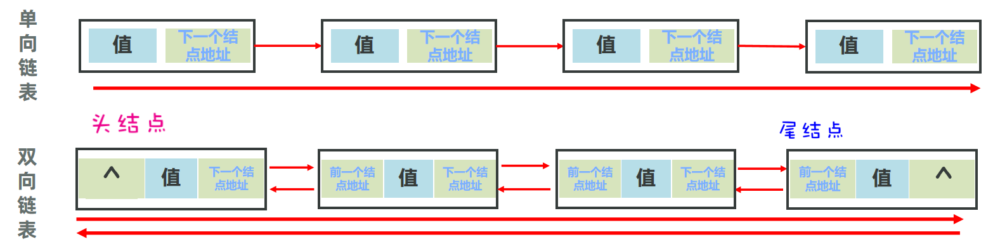

LinkedList特点：查询慢，增删相对较快，但对首尾元素进行增删改查的速度是极快的

LinkedList集合是基于双向链表实现，所以相对于ArrayList新增了一些可以针对头尾进行操作的方法，如下所示：

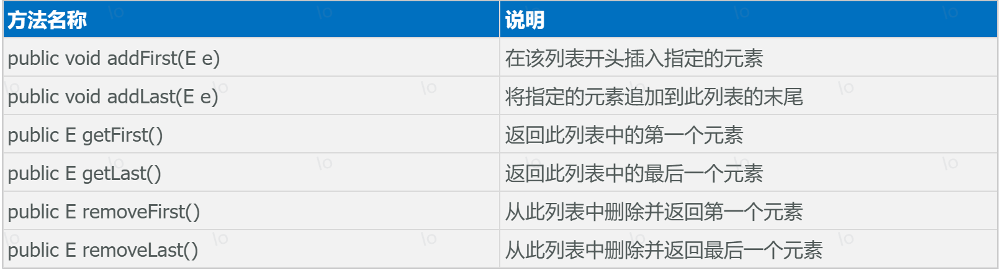

```Java
package com.itheima.d2_list;

import java.util.LinkedList;

/*
目标：了解LinkedList首尾操作的相关方法
 */
public class Demo3 {
    public static void main(String[] args) {
        LinkedList<Integer> list = new LinkedList<>();
        //public void addFirst(E e) 在该列表开头插入指定的元素
        list.addFirst(10);
        list.addFirst(20);
        list.addFirst(30);
        System.out.println(list);  //[30, 20, 10]
        //public void addLast(E e) 将指定的元素追加到此列表的末尾
        list.addLast(100);
        list.addLast(200);
        list.addLast(300);
        System.out.println(list); //[30, 20, 10, 100, 200, 300]
        //public E getFirst() 返回此列表中的第一个元素
        System.out.println("list.getFirst() = " + list.getFirst()); //30
        //public E getLast() 返回此列表中的最后一个元素
        System.out.println("list.getLast() = " + list.getLast());   //300
        //public E removeFirst() 从此列表中删除并返回第一个元素
        System.out.println("移除第一个值 = " + list.removeFirst());
        //public E removeLast()
        System.out.println("移除最后一个值 = " + list.removeLast());
        System.out.println(list);   //[20, 10, 100, 200]
    }
}
```

**LinkedList集合的原理 :**

1.数据结构 : 底层是由双向链表构成, 其中的每个元素就是一个Node对象\(元素属性  next属性  prev属性\)

- 元素属性: 记录的就是链表节点存储的元素值
- next属性 : 节点的下一个元素的指针
- prev属性 : 节点的上一个元素的指针

在LinkedList集合对象中会维护链表的首尾元素 , 方便首尾操作

2.数据操作 : 链表的增删查

① 链表新增操作 :

- 尾部新增 : 创建Node对象, 获取链表尾节点 , 将尾部节点的next指向新节点 , 将新节点的prev属性指向尾节点
- 头部新增 : 创建Node对象, 获取链表头节点 , 将头节点的prev属性指向新节点 , 将新节点的next属性指向头节点
- 中间新增 : 创建Node对象 , 获取链表指定位置的元素节点 , 上一个节点next指针指向新增节点, 新增节点的prev指针指向上一个节点 , 新增节点的next指针指向下一个节点 , 下一个节点的prev指针指向新增节

② 链表删除 :

- 尾部删除 : 获取链表尾节点, 获取尾节点的prev节点, 将尾节点的prev节点的next属性指向null , 尾部节点的prev设置为null
- 头部删除 : 获取链表头节点, 将头节点的next属性设置为null, 新的头结点的prev设置为null
- 中间删除 : 获取需要被删除的节点 , 获取需要被删除节点的prev节点, 获取需要被删除节点的next节点 , 将prev节点的next设置为next节点 , 将next节点的prev属性设置为prev节点 , 被删除节点的prev和next属性设置为null

③ 链表查询 : 从头部或者尾部根据指针一个个访问节点元素进行比较, 匹配的返回

**ArrayList和LinkedList有什么相同点和区别 ?**

相同 : 都是List接口的实现类, 都是有序, 可重复,有索引的集合类

区别:

1. 底层数据结构不同 : ArrayList底层是数组, LinkedList底层是双向链表 

2. ArrayList集合基于数组实现的,实现了数组的动态扩容, LinkedList集合基于链表实现的可以无限延展 

3. ArrayList集合因为是基于数组实现的, 所以根据索引访问元素的时候效率高, 但是对非尾部元素进行增删操作的时候涉及到数据元素的移动和复制 , 所以效率低 

4. LinkedList集合因为是基于双向链表实现的,查询元素的时候需要从链表的首节点或者尾部节点开始一个个查找, 效率比较低, 但是在进行增删操作的时候只需要修改next和prev指针即可, 不涉及元素移动, 效率比较高 

5. LinkedList集合在存储数据的时候不仅需要存储元素值还需要存储前后指针, 所以需要占用更大的内存空间 

6. 使用场景不同 :

    ArrayList 适合根据索引查询的场景, 不适合频繁对元素进行非尾部增删的场景

    LinkedList 适合频繁对元素进行增删的场景, 不适合查询元素的场景

## 4.LinkedList应用场景

刚才我们学习了LinkedList集合，那么LinkedList集合有什么用呢？可以用它来设计栈结构、队列结构。

我们先来认识一下队列结构，队列结构你可以认为是一个上端开口，下端也开口的管子的形状。元素从上端入队列，从下端出队列,所以特点是先进先出,后进后出。

代码演示:

```Java
package com.heima.list;

import java.util.LinkedList;

/**
 * 队列 : 先进先出
 */
public class Queue<T> {
    private LinkedList<T> list = new LinkedList<>();

    public void offer(T t){
        list.addFirst(t);
    }

    public T poll(){
        return list.removeLast();
    }
}

class QueueTest{
    public static void main(String[] args) {
        Queue<String> queue = new Queue<>();
        queue.offer("A");
        queue.offer("B");
        queue.offer("C");
        queue.offer("D");
        queue.offer("E");
        queue.offer("F");

        for (int i = 0; i < 6; i++) {
            String poll = queue.poll();
            System.out.println(poll);
        }
    }
}
```

接下来，我们再用LinkedList集合来模拟一下栈结构的效果。还是先来认识一下栈结构长什么样。栈结构可以看做是一个上端开头，下端闭口的水杯的形状。

元素永远是上端进，也从上端出，先进入的元素会压在最底下，所以栈结构的特点是先进后出，后进先出。

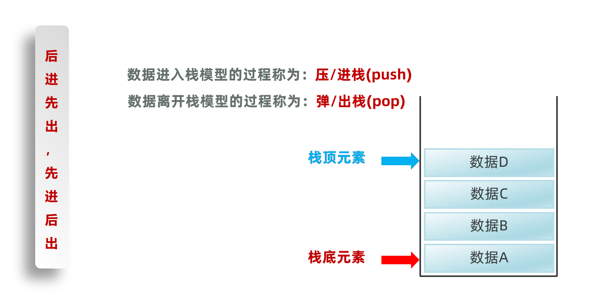

代码演示

```Java
package com.heima.list;

import java.util.LinkedList;

/**
 * 栈 : 先进后出
 *
 * @param <T>
 */
public class Stack<T> {
    private LinkedList<T> list = new LinkedList<>();

    /**
     * 压栈
     *
     * @param t
     */
    public void push(T t) {
        list.addLast(t);
    }

    public T pop() {
        return list.removeLast();
    }

    @Override
    public String toString() {
        return "Stack{" +
                "list=" + list +
                '}';
    }
}

class StackTest {
    public static void main(String[] args) {
        Stack<String> stack = new Stack<>();
        stack.push("A");
        stack.push("B");
        stack.push("C");
        stack.push("D");
        stack.push("E");
        stack.push("F");
        System.out.println(stack);

        for (int i = 0; i < 6; i++) {
            String ele = stack.pop();
            System.out.println(ele);
        }
    }
}
```

# 四、Set集合

## 1.Set集合的特点

前面一天学习了单列集合的List集合,今天来学习下Set集合。

Set集合是属于Collection体系下的另一个分支，它的特点如所示

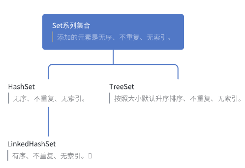

下面我们用代码简单演示一下，每一种Set集合的特点。

```Java
package com.itheima.d3_set.demo1;

import java.util.HashSet;
import java.util.LinkedHashSet;
import java.util.TreeSet;

/*
	目标：演示Set集合的特点，运行下面的代码总结HashSet集合、LinkedHashSet集合、TreeSet集合的元素特点
    不同set集合的特点：
      HashSet无序、不重复、无索引。
      LinkedHashSet 有序、不重复、无索引。
      TreeSet 无序、不重复、无索引、元素可排序

 */
public class Demo1 {
    public static void main(String[] args) {
        HashSet<String> set1 = new HashSet<>(); //HashSet无序、不重复、无索引。
        set1.add("bca");
        set1.add("aca");
        set1.add("bac");
        set1.add("bac");
        set1.add("cba");
        System.out.println(set1);

        System.out.println("-------------------------------------");
        LinkedHashSet<String> set2 = new LinkedHashSet<>(); //LinkedHashSet 有序、不重复、无索引。
        set2.add("bca");
        set2.add("aca");
        set2.add("bac");
        set2.add("bac");
        set2.add("cba");
        System.out.println(set2);

        System.out.println("---------------------------------------");
        TreeSet<String> set3 = new TreeSet<>(); //TreeSet 无序、不重复、无索引、元素可排序
        set3.add("bca");
        set3.add("aca");
        set3.add("bac");
        set3.add("bac");
        set3.add("cba");
        System.out.println(set3);
    }
}
```

Set系列集合特点： 无序：添加数据的顺序和获取出的数据顺序不一致； 不重复； 无索引;

Set要用到的常用方法，基本上就是Collection提供的！！ 自己几乎没有额外新增一些常用功能！

## 2.HashSet集合的底层原理

接下来，为了让同学们更加透彻的理解HashSet为什么可以去重，我们来看一下它的底层原理。

HashSet集合底层是基于哈希表实现的，那么什么是哈希我们先了解下

### 2.1.哈希值

我们先来了解下哈希值的概念:

哈希值: 就是一个int类型的随机值，Java中每个对象都有一个哈希值。

Java中的所有对象，都可以调用Obejct类提供的hashCode方法，返回该对象自己的哈希值。

```Java
package com.itheima.d3_set.demo1;

/*
	目标：演示hashCode()方法的作用
	对象hash值特点：
      1 同一个对象多次调用hashCode()方法返回的哈希值是相同的。
      2 不同的对象，它们的哈希值一般不相同，但也有可能会相同(哈希碰撞)。

 */
public class Demo2 {
    public static void main(String[] args) {
        //需求：创建2个Student对象，并获取这两个Student对象的哈希值，观察哈希值是否相同
        Student s1 = new Student("张益达", 18);
        Student s2 = new Student("张益达", 18);

        //哈希值：是JVM根据对象的地址或者属性值算出来的一个int类型整数，默认是根据地址值得到的，如果期望根据属性值得到哈希值，那么就需要重写hashCode方法(alt+insert)
        System.out.println("s1.hashCode() = " + s1.hashCode()); //1324119927
        System.out.println("s2.hashCode() = " + s2.hashCode()); //81628611

        //1 同一个对象多次调用hashCode()方法返回的哈希值是相同的。
        System.out.println("s1.hashCode() = " + s1.hashCode()); //1324119927

        //2 不同的对象，它们的哈希值一般不相同，但也有可能会相同(哈希碰撞)。
        System.out.println("通话".hashCode());    //1179395
        System.out.println("重地".hashCode());    //1179395
    }
}
```

经过代码演示,我们得到对象哈希值的特点:

- 同一个对象多次调用hashCode\(\)方法返回的哈希值是相同的。

- 不同的对象，它们的哈希值大概率不相等，但也有可能会相等\(哈希碰撞\)。

### 2.2.哈希表原理

HashSet集合底层是基于哈希表实现的，哈希表根据JDK版本的不同，也是有点区别的

- JDK8以前：哈希表 = 数组\+链表

- JDK8以后：哈希表 = 数组\+链表\+红黑树

总之:哈希表是一种增删改查数据，性能都较好的数据结构

**JDK8以前:哈希表 = 数组\+链表**

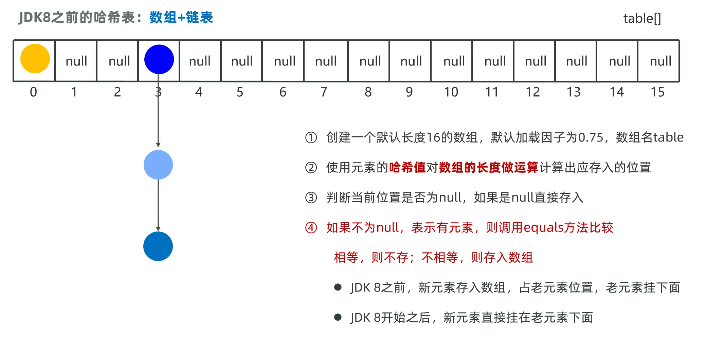

**JDK8以后:哈希表 = 数组\+链表\+红黑树**

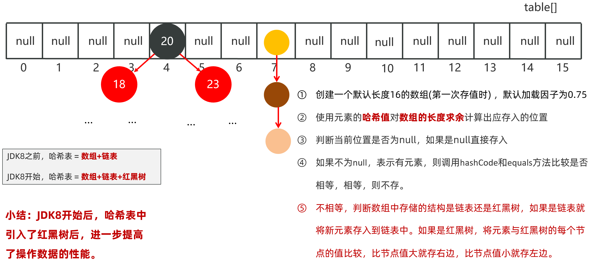

**HashSet存储原理:** 

1.当第一次往HashSet存元素时，底层会创建一个长度为`16`的`数组table`。 

2.根据元素数据算出哈希值。 比如可以基于哈希值对数组长度取余，算出存储的位置。 

3.判断该位置是否为null,是，直接将这个对象存到该位置。 不为空，继续做equals比较？ 

4.对象的和在该位置上其他对象进行 equals比较。 如果结果都是false,说明不是相同对象，可以存储。 如果相同，不存储。 

**扩容原理及底层存储原理:** 

1.底层数组默认长度是16，加载因子0\.75，如果数组中超过12个位置存储了元素，数组要扩容， 阈值 0\.75\*16=12 扩容至两倍。

2.数组索引某个位置有多个对象存进来了。 jdk8之前 采用头插法 形成链表。 jdk8之后 采用尾插法 形成链表。 

3.jdk8之后，如果链表长度超过了8个 且数组长度\>=64 就会以红黑树形式出现，提高查找和增删效率。 

## 3.HashSet去重练习

前面我们学习了`HashSet`存储元素的原理，依赖于两个方法：

- 一个是`hashCode`方法用来确定在底层数组中存储的位置

- 另一个是用`equals`方法判断新添加的元素是否和集合中已有的元素相同。

要想保证在`HashSet`集合中没有重复元素，我们需要重写元素类的`hashCode`和`equals`方法

需求:  创建一个存储学生对象的集合，存储多个学生对象，要求：多个学生对象的成员变量值相同时，我们就认为是同一个对象，要求只保留一个

分析:

- 定义学生类，创建HashSet集合对象, 创建学生对象

- 把学生添加到集合

- 在学生类中重写两个方法，hashCode\(\)和equals\(\)，自动生成即可

- 遍历集合\(增强for\)

先定义一个学生类 重写hashCode\(\)和equals\(\)方法

```Java
package com.itheima.d3_set.demo2;

import java.util.Objects;

public class Student {
    private String name;
    private int age;

    public Student() {
    }

    public Student(String name, int age) {
        this.name = name;
        this.age = age;
    }

    public String getName() {
        return name;
    }

    public void setName(String name) {
        this.name = name;
    }

    public int getAge() {
        return age;
    }

    public void setAge(int age) {
        this.age = age;
    }

    //set集合去重原理：重写equals()和hashCode()方法
    @Override
    public boolean equals(Object o) {
        //当前student对象和传进来的o对象使用==比较的是地址值，如果地址值一样，那就是同一个对象，返回true。
        if (this == o) return true;
        //判断传进来的o对象的类型是否是Student类型，如果是就强转成student。此处是判断o不是Student类型，则返回false。
        if (!(o instanceof Student student)) return false;
        //传进来的o对象也是Student对象，接着就比较当前Student对象和o对象的name与age属性
        return age == student.age && Objects.equals(name, student.name);
    }

    @Override
    public int hashCode() {
        return Objects.hash(name, age);
    }

    @Override
    public String toString() {
        return "Student{" +
                "name='" + name + '\'' +
                ", age=" + age +
                '}';
    }
}
```

2.再定义测试类,进行测试

```Java
package com.itheima.d3_set.demo2;

import java.util.HashSet;

/*
    需求：
        创建一个set集合，存储多个学生对象，使用程序实现在遍历打印该集合中的学生。
    要求：
        如果学生对象的所有成员变量的值相同，我们就认为是同一个对象，需要去重。
    分析：
        1 定义学生类
        2 创建HashSet集合对象
        3 创建学生对象，把学生添加到集合
        4 在学生类中重写两个方法，hashCode（）和equals（），自动生成即可。
        5 遍历集合(增强for)打印学生

 */
public class Demo3 {
    public static void main(String[] args) {
        //1 定义学生类
        //2 创建HashSet集合对象
        HashSet<Student> set = new HashSet<>();
        //3 创建学生对象，把学生添加到集合
        set.add(new Student("张益达",20));
        set.add(new Student("张伟",23));
        set.add(new Student("张益达",20));
        set.add(new Student("张大炮",29));
        // 5 遍历集合(增强for)打印学生
        set.forEach(student -> System.out.println(student));
    }
}
```

打印结果如下，我们发现存了两个张益达，当时实际打印出来只有一个，而且是无序的。

```Plain Text
Student{name='张伟', age=23}
Student{name='张益达', age=20}
Student{name='张大炮', age=29}
```

## 4.LinkedHashSet的底层原理

接下来，我们再学习一个`HashSet`的子类`LinkedHashSet`类。`LinkedHashSet`它底层采用的是也是哈希表结构，只不过额外新增了一个双向链表来维护元素的存取顺序。如下下图所示：

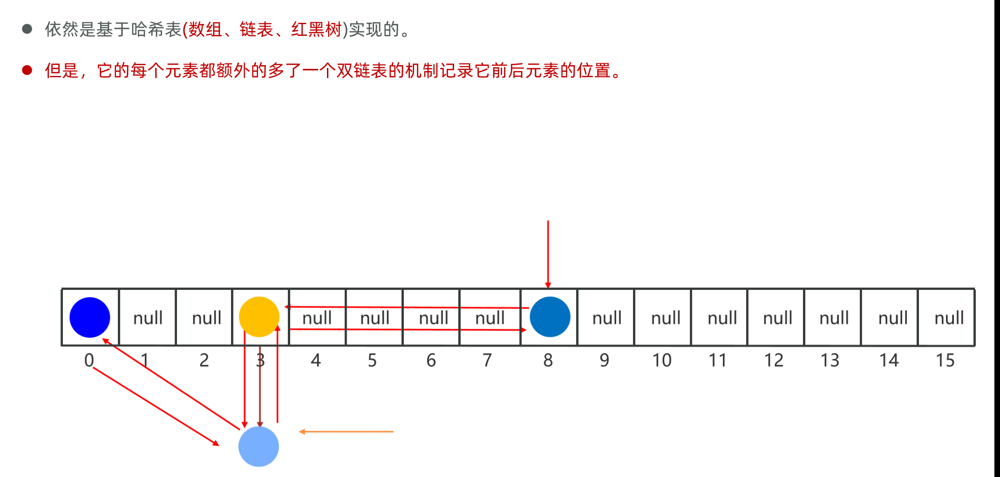

每次添加元素，就和上一个元素用双向链表连接一下。第一个添加的元素是双向链表的头节点，最后一个添加的元素是双向链表的尾节点。

把上个案例中的集合改成`LinkedList`集合，我们观察效果怎样

```Java
public class Test{
    public static void main(String[] args){
        Set<Student> students = new LinkedHashSet<>();
        Student s1 = new Student("至尊宝",20, 169.6);
        Student s2 = new Student("蜘蛛精",23, 169.6);
        Student s3 = new Student("蜘蛛精",23, 169.6);
        Student s4 = new Student("牛魔王",48, 169.6);

        students.add(s1);
        students.add(s2);
        students.add(s3);
        students.add(s4);

        for(Student s : students){
            System.out.println(s);
        }
    }
}
```

打印结果如下

```Plain Text
Student{name='至尊宝', age=20, height=169.6}
Student{name='蜘蛛精', age=23, height=169.6}
Student{name='牛魔王', age=48, height=169.6}
```

## 5.TreeSet集合

最后，我们学习一下`TreeSet`集合。`TreeSet`集合的特点是可以对元素进行排序，但是必须指定元素的排序规则。

如果往集合中存储`String`类型的元素，或者`Integer`类型的元素，它们本身就具备排序规则，所以直接就可以排序。

```java
Set<Integer> set1= new TreeSet<>();
set1.add(8);
set1.add(6);
set1.add(4);
set1.add(3);
set1.add(7);
set1.add(1);
set1.add(5);
set1.add(2);
System.out.println(set1); //[1,2,3,4,5,6,7,8]
Set<String> set2= new TreeSet<>();
set2.add("a");
set2.add("c");
set2.add("e");
set2.add("b");
set2.add("d");
set2.add("f");
set2.add("g");
System.out.println(set1); //[a,b,c,d,e,f,g]
```

如果往`TreeSet`集合中存储自定义类型的元素，比如说`Teacher`类型，则需要我们自己指定排序规则，否则会出现异常。

```Java
public class SetDemo3 {
    public static void main(String[] args) {
        // 目标：搞清楚TreeSet集合对于自定义对象的排序
        TreeSet<Student> ts= new TreeSet<>();
        //保存学生对象
        ts.add(new Student("小王", 92, 85));
        ts.add(new Student("小张", 80, 90));
        ts.add(new Student("老王", 92, 85));
        ts.add(new Student("小李", 88, 82));
        ts.add(new Student("小赵", 90, 90));
        //遍历集合并打印
        ts.forEach(student -> System.out.println(student));
    }
}
```

此时运行代码，会直接报错。

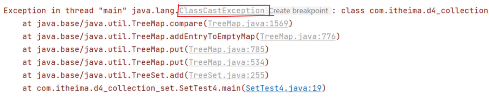

原因是`TreeSet`不知道按照什么条件对`Teacher`对象来排序。

结论：`TreeSet`集合默认不能 给自定义对象排序啊，因为不知道大小规则。

如果需要对对象进行排序,两种方案 : 

1. 对象类实现一个Comparable比较接口，重写compareTo方法，指定大小比较规则

2. public TreeSet（Comparator c）集合自带比较器Comparator对象，指定比较规则

3. 对象类实现一个Comparable比较接口，重写compareTo方法，指定大小比较规则

```Java
// 排序方式一：让元素类实现Comparable接口，实现compareTo方法
public class Student implements Comparable<Student>{
    private String name;
    private int math;   //数学成绩
    private double chinese;   //语文成绩

    public Student() {
    }
    public Student(String name, int math, double chinese) {
        this.name = name;
        this.math = math;
        this.chinese = chinese;
    }

    public String getName() {
        return name;
    }

    public void setName(String name) {
        this.name = name;
    }

    public int getMath() {
        return math;
    }

    public void setMath(int math) {
        this.math = math;
    }

    public double getChinese() {
        return chinese;
    }

    public void setChinese(double chinese) {
        this.chinese = chinese;
    }

    @Override
    public String toString() {
        return "Student{" +
                "name='" + name + '\'' +
                ", math=" + math +
                ", chinese=" + chinese +
                '}';
    }

    @Override
    public int compareTo(Student o) {
        //此方法对比comparator中的compare(Student o1, Student o2)方法：在compareTo方法中this相当于o1，形参o相当于o2
        //1 先按照数学降序
        int result = o.getMath() - this.getMath();
        //2 数学一样，就按照语文降序
        if (result == 0) {
            result = Double.compare(o.getChinese(), this.getChinese());
        }
        //3 语文也一样，就按照姓名升序
        if (result == 0) {
            result = this.getName().compareTo(o.getName());
        }
        return result;
    }
}
```

此时，再运行测试类，结果如下

```
Student{name='老王', math=92, chinese=85.0}
Student{name='小王', math=92, chinese=85.0}
Student{name='小赵', math=90, chinese=90.0}
Student{name='小李', math=88, chinese=82.0}
Student{name='小张', math=80, chinese=90.0}
```

4. public TreeSet（Comparator c）集合自带比较器Comparator对象，指定比较规则

```Java
public class Demo4 {
    public static void main(String[] args) {
        // 排序方式一：让元素类实现Comparable接口，实现compareTo方法
        //TreeSet<Student> ts = new TreeSet<>();

        //排序方式二：在创建TreeSet集合时，传递一个比较器对象，比较器是Comparator接口的实现类对象
        TreeSet<Student> ts = new TreeSet<>(new Comparator<Student>() {
            @Override
            public int compare(Student o1, Student o2) {
                //1 先按照数学降序
                int result = o2.getMath() - o1.getMath();
                //2 数学一样，就按照语文降序
                if (result == 0) {
                    result = Double.compare(o2.getChinese(), o1.getChinese());
                }
                //3 语文也一样，就按照姓名升序
                if (result == 0) {
                    result = o1.getName().compareTo(o2.getName());
                }
                return result;
            }
        });
        //保存学生对象，为了凸显按照姓名排序，此处学生姓名都用了英文
        ts.add(new Student("tom", 88, 90));
        ts.add(new Student("tony", 98, 99));
        ts.add(new Student("jerry", 88, 90));
        ts.add(new Student("kimi", 82, 88));
        //遍历打印
        ts.forEach(student -> System.out.println(student));
    }
}
```

运行结果：为了凸显按照姓名排序，此处学生姓名都用了英文。

```
Student{name='kimi', math=82, chinese=88.0}
Student{name='jerry', math=88, chinese=90.0}
Student{name='tom', math=88, chinese=90.0}
Student{name='tony', math=98, chinese=99.0}
```

# 五、Collections工具类

## 1.工具使用

有了可变参数的基础，我们再学习Collections这个工具类就好理解了，因为这个工具类的方法中会用到可变参数。

注意Collections并不是集合，它比Collection多了一个s，一般后缀为s的类很多都是工具类。这里的Collections是用来操作Collection的工具类。它提供了一些好用的静态方法，如下

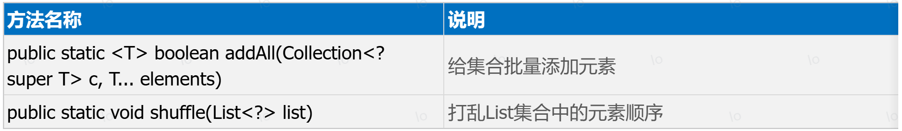

我们把这些方法用代码来演示一下：

```Java
package com.itheima.d4_collections;

import java.util.ArrayList;
import java.util.Collections;
import java.util.List;

/*
    目标：演示可变参数的用法，Collections工具类的常用方法
 */
public class Demo {
    public static void main(String[] args) {
        //public static <T> boolean addAll(Collection<? super T> c, T...elements) 给集合批量添加元素
        List<Integer> list = new ArrayList<>();
        Collections.addAll(list, 10, 39, 20, 62, 51, 29);
        System.out.println(list);
        
        //public static void shuffle(List<?> list) 打乱List集合中的元素顺序
        Collections.shuffle(list);
        System.out.println(list);
        
        //public static <T> void sort(List<T> list) 对List集合中的元素进行升序排序
        Collections.sort(list);
        System.out.println(list);
        
        //public static <T> void sort(List<T> list, Comparator<? super T> c) 对List集合中元素按照比较器对象指定的规则进行排序
        Collections.sort(list,(o1,o2)->o2-o1);
        System.out.println(list);
    }
}
```

## 2.可变参数

关于可变参数我们首先要知道它是什么，然后要知道它的本质。搞清楚这两个问题，可变参数就算你学明白了

- 可变参数是一种特殊的形式参数，定义在方法、构造器的形参列表处，它可以让方法接收多个同类型的实际参数

- 可变参数在方法内部，本质上是一个数组

接下来，我们编写代码来演示一下

```Java
package com.itheima.d4_collections;

import java.util.ArrayList;
import java.util.Collections;
import java.util.List;

/*
    目标：演示可变参数的用法，Collections工具类的常用方法
 */
public class Demo {
    public static void main(String[] args) {
        int result = getSum();
        System.out.println("result = " + result);
        result = getSum(10);
        System.out.println("result = " + result);
        result = getSum(10, 20);
        System.out.println("result = " + result);
        result = getSum(10, 20, 30);
        System.out.println("result = " + result);
        int[] arr = {10, 20, 30, 40, 50};
        result = getSum(arr);
        System.out.println("result = " + result);
    }
    
    //说明1：可变参数的本质是数组，在方法中可以将可变参数当作数组中
    //说明2：如果参数列表还有其它形参，可变参数必须是最后一个。
    public static int getSum(/*double x,*/ int... numbers) {
        int sum = 0;
        for (int i = 0; i < numbers.length; i++) {
            sum += numbers[i];
        }
        return sum;
    }
}
```

最后还有一些错误写法，需要让大家写代码时注意一下，不要这么写哦！！！

- 一个形参列表中，只能有一个可变参数；否则会报错

- 一个形参列表中如果多个参数，可变参数需要写在最后；否则会报错

