# 一、Map集合

## 1.Map集合概述

前面我们已经把单列集合学习完了，接下来我们要学习的是双列集合。首先我们还是先认识一下什么是双列集合。

所谓双列集合，就是说集合中的元素是一对一对的。Map集合中的每一个元素是以`key=value`的形式存在的，一个`key=value`就称之为一个键值对，而且在java中有一个类叫Entry类，Entry的对象用来表示键值对对象。

所有的Map集合有如下的特点：键不能重复，值可以重复，每一个键只能找到自己对应的值。

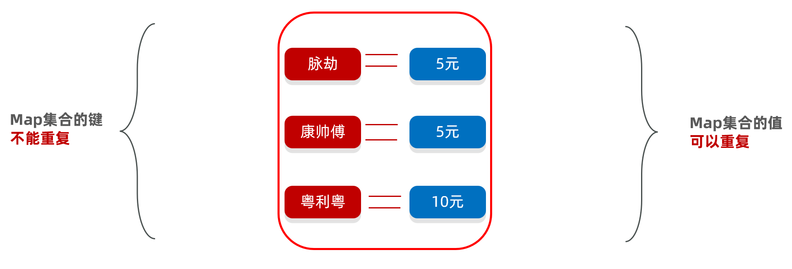

下面我们先写一个`Map`集合，保存几个键值对，体验一下Map集合的特点

```java
public class MapDemo1 {
    public static void main(String[] args) {
        // 目标：认识Map集合的体系特点。
        // 1、创建Map集合
        // Map特点/HashMap特点：无序，不重复，无索引，键值对都可以是null, 值不做要求（可以重复）
        // LinkedMap特点：有序，不重复，无索引，键值对都可以是null, 值不做要求（可以重复）
        // TreeMap: 按照键可排序，不重复，无索引
        Map<String,Integer> map = new HashMap<>(); // 一行经典代码
        //Map<String,Integer> map = new LinkedHashMap<>();
        map.put("嫦娥", 20);
        map.put("女儿国王", 31);
        map.put("嫦娥", 28) ;
        map.put("铁扇公主", 38);
        map.put("紫霞", 31);
        map.put(null, null);
        System.out.println(map); // {null=null, 嫦娥=28, 铁扇公主=38, 紫霞=31, 女儿国王=31}
    }
}
```

Map集合在什么业务场景下使用?


在表达购物车中商品和商品数量时可以使用 ,  统计文字出现次数时可以使用。

总之: 需要存储一一对应的数据时，就可以考虑使用Map集合来做

Map集合也有很多种，在java中使用不同的类来表示的，每一种Map集合其键的特点是有些差异的，值是键的一个附属值，所以我们只关注键的特点就可以了。

Map常见体系如下:

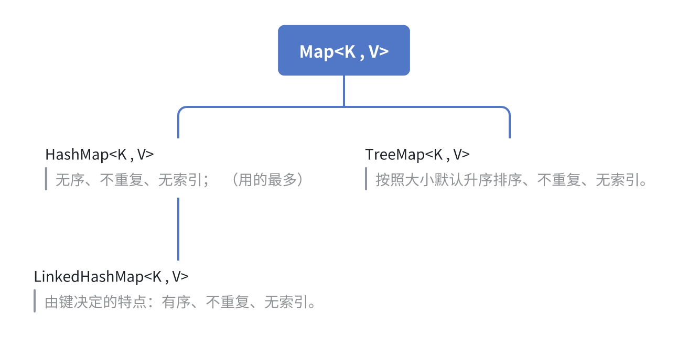

## 2.Map集合的常用方法

我们已经认识了Map集合，接下来我们学习一下Map集合提供了那些方法供我们使用。由于Map是所有双列集合的父接口，所以我们只需要学习Map接口中每一个方法是什么含义，那么所有的Map集合方法你就都会用了

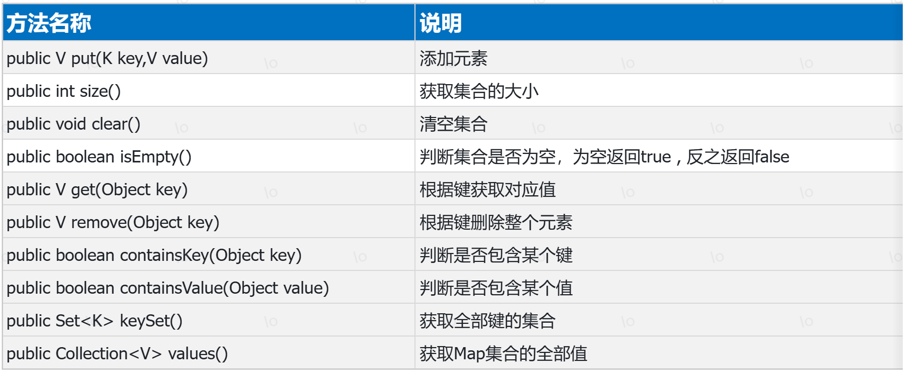

```java
package com.itheima.d1_map;

import java.util.*;

/*
目标：演示Map集合的常用方法
 */
public class Demo1 {
    public static void main(String[] args) {
        Map<String, Integer> map = new HashMap<>();
    //public V put(K key, V value) 添加/修改元素，key不存在就是添加，key存值就是修改并返回旧值。
        map.put("脉劫", 5);  //如果是添加元素，返回值就是null
        map.put("康帅傅",2);
        map.put("粤利粤",10);
        Integer value= map.put("脉劫", 6); //如果键不存在就表示添加，键存在就表示修改(替换值)
        //System.out.println("value= " + value);  //5
        System.out.println(map);

        //public int size() 获取集合的大小
        int size = map.size();
        System.out.println("集合的大小 = " + size);

        //public void clear() 清空集合
        //map.clear();
        //System.out.println(map);

        //public boolean isEmpty() 判断集合是否为空，为空返回true
        boolean empty = map.isEmpty();
        System.out.println("集合是否为空 = " + empty);

        //public V get(Object obj) 根据键获取对应值
        Integer value = map.get("脉劫");
        System.out.println("根据键获取对应值 = " + value);

        //public V remove(Object key) 根据键删除整个元素,返回被删除的value值。
        map.remove("脉劫");
        System.out.println(map);

        //public boolean containsKey(Object key) 判断是否包含某个键
        boolean containsKey = map.containsKey("脉劫");
        System.out.println("判断是否包含某个键 = " + containsKey);

        //public boolean containsValue(Object value) 判断是否包含某个值
        boolean containsValue = map.containsValue(5);
        System.out.println("判断是否包含某个值 = " + containsValue);

        //public Set<K> keySet() 获取全部键的集合
        Set<String> keys = map.keySet();
        System.out.println("全部键的集合 = " + keys);

        //public Collection<V> values() 获取全部值的集合
        Collection<Integer> values = map.values();
        System.out.println("获取全部值的集合 = " + values);

    }
}
```

## 3.Map集合的遍历方式

### 3.1.键找值

Map集合一共有三种遍历方式，我们先来学习第一种，他需要用到下面的两个方法

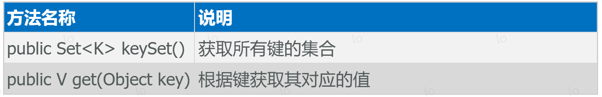

原理:先获取Map集合全部的键，再通过遍历键来找值

```java
public class Demo2 {
    public static void main(String[] args) {
        Map<String, Integer> map = new HashMap<>();
        map.put("脉劫", 5);
        map.put("康帅傅",2);
        map.put("粤利粤",10);
        //1 public Set<K> keySet() 获取所有键的集合
        Set<String> keys = map.keySet();
        //2 遍历所有的键(set集合)，public V get(Object key) 根据键获取其对应的值
        for (String key : keys) {  //key="脉劫",key="康帅傅",key="粤利粤"
            Integer value = map.get(key);
            System.out.println(key + " = " + value);
        }
    }
}
```

### 3.2.遍历Entry键值

接下来我们学习Map集合的第二种遍历方式，这种遍历方式更加符合面向对象的思维。

前面我们介绍过，Map集合是用来存储键值对的，而每一个键值对实际上是一个Entry对象。

原理: 是直接获取每一个Entry对象，把Entry存储扫Set集合中去，再通过Entry对象获取键和值。

涉及如下方法:

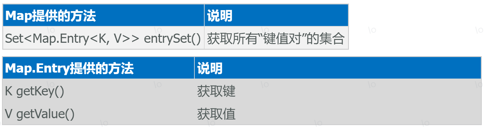

代码演示:

```java
public class Demo2 {
    public static void main(String[] args) {
        Map<String, Integer> map = new HashMap<>();
        map.put("脉劫", 5);
        map.put("康帅傅",2);
        map.put("粤利粤",10);
        //1 获取所有的键值对对象的集合  Set<Map.Entry<K, V>> entrySet()
        Set<Map.Entry<String, Integer>> entries = map.entrySet();
        //2 遍历键值对集合，通过每一个键值对对象获取key和value并打印
        for (Map.Entry<String, Integer> entry : entries) {
            //entry就是一个键值对对象。entry={key="脉劫"",value=5}
            //通过每一个键值对对象获取key和value并打印
            String key = entry.getKey();
            Integer value = entry.getValue();
            System.out.println(key + " = " + value);
        }
    }
}
```

### 3.3.forEach\(\)方法

Map集合的第三种遍历方式，需要用到下面的一个方法`forEach`，而这个方法是JDK8版本以后才有的。调用起来非常简单，最好是结合的lambda表达式一起使用。

原理: 调用forEach\(\)方法，结合lambda使用。

涉及如下方法:

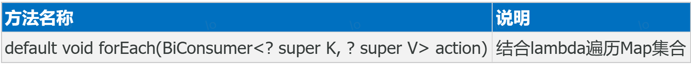

代码如下：

```java
public class Demo2 {
    public static void main(String[] args) {
        Map<String, Integer> map = new HashMap<>();
        map.put("脉劫", 5);
        map.put("康帅傅",2);
        map.put("粤利粤",10);
        map.forEach((key, value) -> System.out.println(key + " = " + value));
    }
}
```

## 4.Map综合集合案例

学习完Map集合的基本用法之后，接下来我们做一个综合案例，将Map集合运用一下

需求: 

某个班级80名学生，现在需要组织秋游活动，班长提供了四个景点依次是（A、B、C、D）,每个学生只能选择一个景点，请统计出最终哪个景点想去的人数最多

分析：

1. 定义数组保存80名学生的投票结果：["C", "B", "A", "D", "B", "B", ...]
2. 定义一个Map集合用于存储统计的结果，Map<String，Integer>，键是景点(ABCD)，值代表投票数量。
3. 遍历数组，获取一个景点，判断Map集合中的键是否存在该景点，
4. 不存在存入“景点=1“。存在，获取原来的次数，+1后再存回去
5. 最后遍历打印集合中的投票结果。例如，打印结果如下：

```java
A=20
B=20
C=15
D=25
```

代码案例：

```java
public class Demo3 {
    public static void main(String[] args) {
        //1 定义数组保存80名学生的投票结果：["C", "B", "A", "D", "B", "B", ...]
        String[] votes = {"C", "B", "A", "D", "B", "B", "D", "C", "D", "C", "A", "C", "A", "B", "C", "D", "A", "B", "A", "B", "B", "D", "A", "B", "D", "D", "C", "C", "D", "C", "B", "A", "C", "B", "D", "C", "B", "D", "B", "B", "B", "A", "B", "C", "B", "A", "C", "C", "B", "A", "A", "B", "B", "D", "B", "C", "A", "A", "D", "A", "D", "A", "C", "B", "B", "B", "A", "A", "D", "D", "C", "C", "D", "B", "B", "B", "D", "A", "C", "A"};
        //2 定义一个Map集合用于存储统计的结果，Map<String，Integer>，键是景点(ABCD)，值代表投票数量。
        Map<String,Integer> map = new HashMap<>();
        //3 遍历数组，获取一个景点，判断Map集合中的键是否存在该景点，
        for (String key : votes) {  //key="C",key="B",key="A",...
            //判断Map集合中的键是否存在该景点
            if(map.containsKey(key)){
                //4 存在，获取原来的次数，+1后再存回去
                int count = map.get(key);
                map.put(key,count+1);  //+1后再存回去
            }else{
                //4 不存在存入“景点=1“。
                map.put(key,1);
            }
        }
        //5 最后遍历打印集合中的投票结果。例如，打印结果如下
        System.out.println(map);
    }

}
```

## 5.Map集合子类特点

1.`HashMap`特点: 无序、不重复、无索引

HashMap跟HashSet的底层原理是一模一样的，都是基于哈希表实现的

实际上：原来学的Set系列集合的底层就是基于Map实现的，只是Set集合中的元素只要键数据，不要值数据而已

2.`LinkedHashMap`特点:有序、不重复、无索引

底层数据结构依然是基于哈希表实现的，只是每个键值对元素又额外的多了一个双链表的机制记录元素顺序\(保证有序\)

实际上：原来学习的LinkedHashSet集合的底层原理就是LinkedHashMap

3.`TreeMap`特点：无序、不重复、无索引、可排序\(按照键的大小默认升序排序，只能对键排序\)

实际上：TreeMap跟TreeSet集合的底层原理是一样的，都是基于红黑树实现的排序

# 二、Stream流

接下来我们学习一个全新的知识，叫做Stream流（也叫Stream API）。它是从JDK8以后才有的一个新特性，是专业用于对集合或者数组进行便捷操作的。有多方便呢？我们用一个案例体验一下，然后再详细学习。

## 1.Stream流体验

案例需求：

有一个List集合，元素有`"张三丰","张无忌","周芷若","赵敏","张强"`，找出姓张，且是3个字的名字，存入到一个新集合中去。

### 1.1.集合玩法

```java
public class StreamDemo1 {
    public static void main(String[] args) {
        // 目标：认识Stream流，掌握其基本使用步骤。体会它的优势和特点。
        List<String> list = new ArrayList<>();
        list.add("张无忌");
        list.add("周芷若");
        list.add("赵敏");
        list.add("张强");
        list.add("张三丰");
        list.add("张翠山");
        // 1、先用传统方案：找出姓张的人，名字为3个字的，存入到一个新集合中去。
        List<String> newList = new ArrayList<>();
        for (String name : list) {
            if(name.startsWith("张") && name.length() == 3){
                newList.add(name);
            }
        }
        System.out.println(newList);
    }
}
```

### 1.2.Stream流玩法

用Stream流来做，代码是这样的（ps: 是不是想流水线一样，一句话就写完了）

```java
// 2、使用Stream流解决
list.stream()
        .filter(name->name.startsWith("张") && name.length()==3)
        .forEach(name-> System.out.println(name));
```

先不用知道这里面每一句话是什么意思，具体每一句话的含义，待会再一步步学习。现在只是体验一下。

学习Stream流我们接下来，会按照下面的步骤来学习。

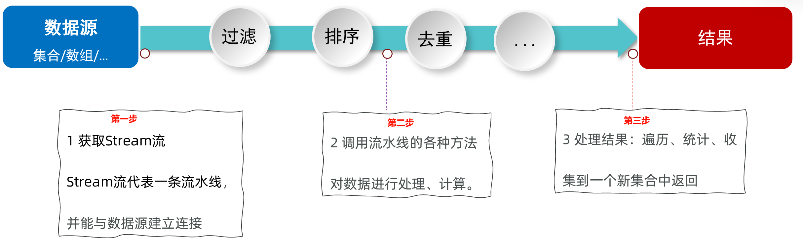

## 2.Stream流的创建

接下来我们正式来学习Stream流。先来学习如何创建Stream流、或者叫获取Stream流。

主要掌握下面三点：

1、如何获取单列集合List集合的Stream流？

2、如何获取Map集合的Stream流？

3、如何获取数组的Stream流？

直接上代码演示，这也是Stream操作的第一步。

```java
public class Demo2 {
    public static void main(String[] args) {
        // 1、如何获取List集合的Stream流？
        List<String> list = new ArrayList<>();
        Collections.addAll(list, "张三丰","张无忌","周芷若","赵敏","张强");
        //Stream<String> stream = list.stream();
        list.stream().forEach(name-> System.out.println(name));

        // 2、如何获取Set集合的Stream流？
        Set<String> set = new HashSet<>();
        Collections.addAll(set, "刘德华","张曼玉","蜘蛛精","马德","德玛西亚");
        set.stream().forEach(name-> System.out.println(name));

        // 3、如何获取Map集合的Stream流？
        Map<String, Double> map = new HashMap<>();
        map.put("古力娜扎", 172.3);
        map.put("迪丽热巴", 168.3);
        map.put("马尔扎哈", 166.3);
        map.put("卡尔扎巴", 168.3);
        //获取Entry对象的set集合，在通过set集合获取Stream流对象。每一个Entry对象封装了key和value。
        Set<Map.Entry<String, Double>> entries = map.entrySet();
        entries.stream().forEach(entry-> System.out.println(entry));

        // 4、如何获取数组的Stream流？
        String[] arr = {"张翠山", "东方不败", "唐大山", "独孤求败"};
        //4.1 Arrays.stream(数组)
        Arrays.stream(arr).forEach(name-> System.out.println(name));
        //4.2 Stream.of(可变参数)
        Stream.of(arr).forEach(name-> System.out.println(name));
    }
}
```

## 3.函数式接口

### 3.1.什么是函数式接口

函数式接口是java 8引入的一个重要特性，它是指仅包含一个抽象方法的接口（可以包含多个默认方法或静态方法）。这类接口的主要目的是支持Lambda表达式的使用，为函数式编程提供基础

常见的函数式接口示例：

- Runnable接口（只有一个run\(\)方法）

- Comparator接口（只有一个compare\(\)抽象方法）

- java\.util\.function包中的`Predicate`、`Function`、`Consumer`、`Supplier`等

使用场景：

1. 作为Lambda表达式的目标类型

2. 作为方法引用的目标类型

3. 在流式操作\(Stream API\)中作为参数传递

可以在接口上添加`@FunctionalInterface`注解用于明确标识一个接口是函数式接口，它会在编译时检查接口是否符合函数式接口的条件（即只能有一个抽象方法）

### 3.2.Stream流中常用的函数式接口

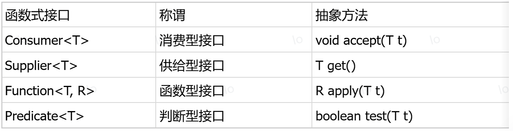

## 4.Stream流的中间方法

中间方法指的是：调用完方法之后其结果是一个新的Stream流，于是可以继续调用方法，这样一来就可以支持链式编程\(流式编程\)，这也是Stream操作的第二步。

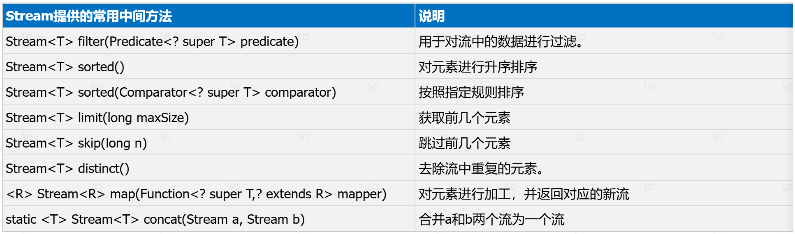

话不多说，直接上代码演示

```java
public class Demo3 {
    public static void main(String[] args) {
        List<Double> scores = new ArrayList<>();
        Collections.addAll(scores, 88.5, 100.0, 60.0, 99.0, 9.5, 99.6, 25.0);
        // 需求1：找出成绩大于等于60分的数据，并升序后，再输出。
        scores.stream()
                //filter方法表示筛选/过滤，在lambda中定义筛选条件，符合条件的数据就保留，不符合就删除
                .filter(score -> score >= 60)
                .sorted()  //默认升序，如果Stream流中是自定义对象类型数据，该类型要实现comparable接口
                .forEach(number -> System.out.println(number));
        
        // 需求2：找出年龄大于等于23,且年龄小于等于30岁的学生，并按照年龄降序输出
        List<Student> students = new ArrayList<>();
        Student s1 = new Student("蜘蛛精", 26, 172.5);
        Student s2 = new Student("蜘蛛精", 26, 172.5);
        Student s3 = new Student("紫霞", 23, 167.6);
        Student s4 = new Student("白晶晶", 25, 169.0);
        Student s5 = new Student("牛魔王", 35, 183.3);
        Student s6 = new Student("牛夫人", 34, 168.5);
        Collections.addAll(students, s1, s2, s3, s4, s5, s6);
        students.stream()
                .filter(student -> student.getAge() >= 23 && student.getAge() <= 30)  //使用lambda定义筛选条件
                .sorted((stu1, stu2) -> stu2.getAge() - stu1.getAge()) //按照年龄降序输出
                .forEach(student -> System.out.println(student));

        // 需求3：取出身高最高的前3名学生，并输出。
        students.stream()
                .sorted((stu1, stu2) -> Double.compare(stu2.getHeight(), stu1.getHeight()))  //按照身高降序
                .limit(3)  //获取前3个元素
                .forEach(student -> System.out.println(student));

        // 需求4：取出身高倒数的2名学生，并输出
        students.stream()
                .sorted((stu1, stu2) -> Double.compare(stu2.getHeight(), stu1.getHeight()))  //按照身高降序
                .skip(4) //跳过前2个元素
                .forEach(student -> System.out.println(student));

        // 需求5：找出身高超过168的学生、去除重复的学生（属性值相同，则认为元素重复）、获取所有学生的姓名、并输出
        students.stream()
                .filter(student -> student.getHeight() > 168) //定义筛选条件
                .distinct() //去除重复元素，要求元素要重写hashCode和equals方法
                //需求：stream流原本装的是student对象，限制要换成只装学生的姓名，最后打印的是学生的姓名
                .map(student -> student.getName())  //将流中A类型数据转换成B类型。此处是将Student类型转换成String类型，因为需要提到只要学生的姓名(String类型)
                .forEach(name -> System.out.println(name));

        // 需求6：将以下两个集合中的数据合并后输出
        List<Integer> list1 = List.of(10, 20, 30, 40, 50);
        List<Integer> list2 = List.of(100, 200, 300, 400, 500);
        //Stream<Integer> stream = Stream.concat(list1.stream(), list2.stream());
        Stream.concat(list1.stream(), list2.stream())
                .forEach(number -> System.out.println(number));
    }
}
```

## 5.Stream流的终结方法 

终结方法：指的是调用完成后，不会返回新Stream了，没法继续使用流了。这也是Stream操作的第三步。

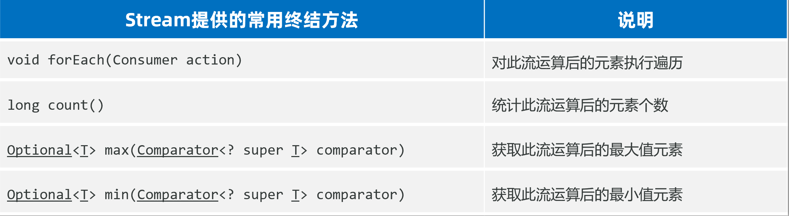

代码示例如下：

```java
public class Demo4 {
    public static void main(String[] args) {
        List<Student> students = new ArrayList<>();
        Student s1 = new Student("蜘蛛精", 26, 172.5);
        Student s2 = new Student("蜘蛛精", 26, 172.5);
        Student s3 = new Student("紫霞", 23, 167.6);
        Student s4 = new Student("白晶晶", 25, 169.0);
        Student s5 = new Student("牛魔王", 35, 183.3);
        Student s6 = new Student("牛夫人", 34, 168.5);
        Collections.addAll(students, s1, s2, s3, s4, s5, s6);
        // 需求1：请计算出身高超过168的学生有几人。
        long count = students.stream()
                .filter(student -> student.getHeight() > 168)  //过滤条件
                .count();  //返回Stream流中元素的个数
        System.out.println("身高超过168的学生人数 = " + count);
        
        // 需求2：请找出身高最高的学生对象，并输出。
        Student student = students.stream()
                //返回值为Optional对象，数据通过Optional对的的get方法获取。比较器中都定义升序。
                .max((o1, o2) -> Double.compare(o1.getHeight(), o2.getHeight()))  
                .get();
        System.out.println("student = " + student);
        
        // 需求3：请找出身高最矮的学生对象，并输出。
        student = students.stream()
                //返回值为Optional对象，数据通过Optional对的的get方法获取。比较器中都定义升序。
                .min((o1, o2) -> Double.compare(o1.getHeight(), o2.getHeight()))  
                .get();
        System.out.println("student = " + student);
    }

}
```

## 6.收集stream流中的数据

收集Stream流中的数据：就是把Stream流操作后的结果转回到集合或者数组中去返回。

注意：Stream流是操作集合/数组的手段，并不能用来保存数据。集合/数组才是存储数据的容器。

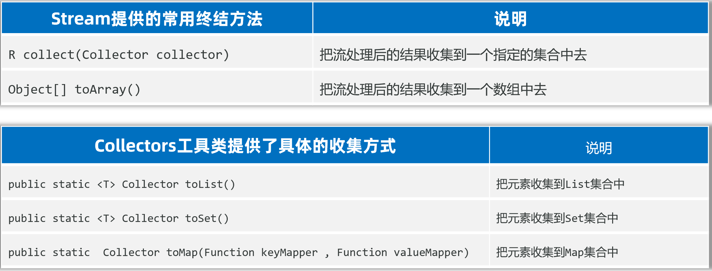

代码示例：

```java
public class Demo5 {
    public static void main(String[] args) {
        List<Student> students = new ArrayList<>();
        Student s1 = new Student("蜘蛛精", 26, 172.5);
        Student s2 = new Student("蜘蛛精", 26, 172.5);
        Student s3 = new Student("紫霞", 23, 167.6);
        Student s4 = new Student("白晶晶", 25, 169.0);
        Student s5 = new Student("牛魔王", 35, 183.3);
        Student s6 = new Student("牛夫人", 34, 168.5);
        Collections.addAll(students, s1, s2, s3, s4, s5, s6);
        
        // 需求1：请找出身高超过170的学生对象，并放到一个新集合中去返回。
        List<Student> list = students.stream()
                .filter(student -> student.getHeight() > 170)
                .collect(Collectors.toList()); //Collectors.toList()得到回收到list集合的Collector对象
        list.forEach(student -> System.out.println(student));
        Set<Student> set = students.stream()
                .filter(student -> student.getHeight() > 170)
                .collect(Collectors.toSet());  //Collectors.toSet()得到回收到set集合的Collector对象
        set.forEach(student -> System.out.println(student));

        // 需求2：请找出身高超过170的学生对象，并把学生对象的名字和身高，存入到一个Map集合返回。
        Map<String, Double> map = students.stream()
                .filter(student -> student.getHeight() > 170)
                .distinct()  //去重
                //student -> student.getName()：取学生对象的姓名作为map集合的key
                //student -> student.getHeight()：取学生对象的身高作为map集合的value
                .collect(Collectors.toMap(student -> student.getName(), student -> student.getHeight()));

        System.out.println(map);

        // 需求3：请找出身高超过170的学生对象，存到一个数组中去
        Object[] arr = students.stream()
                .filter(student -> student.getHeight() > 170)
                .toArray();  //得到一个Object类型的数组
        for (int i = 0; i < arr.length; i++) {
            System.out.println(arr[i]);
        }
        Student[] arr2 = students.stream()
                .filter(student -> student.getHeight() > 170)
                //value表示数组的长度，stream流中有几个值，value就是几
                .toArray(value -> new Student[value]); //得到一个Student类型的数组
        for (int i = 0; i < arr2.length; i++) {
            System.out.println(arr2[i]);
        }
    }
}
```

# 三、正则表达式

## 1.概念和作用

正则表达式：就是由一些特定的字符组成字符串，代表的是一个规则。

作用1：用来校验数据格式是否符合规则\(合法\)。例如：校验电话、邮箱、QQ号等

String类提供了匹配正则表达式的方法来校验字符串是否合法：

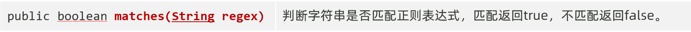

作用2：在一段文本中查找满足要求的内容。例如：从下方文本中提取出所有的身份证号【使用较少】

代码示例：

```java
public class Demo1 {
    public static void main(String[] args) {
        System.out.println(checkQQ("123abc"));
        System.out.println(checkQQ("0123"));
        System.out.println(checkQQ("123"));
        System.out.println(checkQQ("1234567"));
        System.out.println("---------------------");
        System.out.println(checkQQByRegExp("123abc"));
        System.out.println(checkQQByRegExp("0123"));
        System.out.println(checkQQByRegExp("123"));
        System.out.println(checkQQByRegExp("1234567"));
    }

    /*
        在下面方法中使用传统方式，校验qq号码是否符合要求
        1、判断qq号码是否为null,不是以0开头的，满足6-20之间的长度,
        2、必须全部是数字。
        如果满足条件，返回true; 否则返回false
     */
    public static boolean checkQQ(String qq){
        if(qq==null){
            return false;  //为null、就返回false表示不合法
        }
        if(qq.startsWith("0") || qq.length()<6 || qq.length()>20){
            return false;  //不满足要求
        }
        for (int i = 0; i < qq.length(); i++) {
            char ch = qq.charAt(i);
            if(ch<'0' || ch>'9'){
                return false;
            }
        }
        return true;  //符合要求
    }

    /*
        在下面方法中使用传统方式，校验qq号码是否符合要求
        1、判断qq号码是否为null,不是以0开头的，满足6-20之间的长度,
        2、必须全部是数字。
        如果满足条件，返回true; 否则返回false
     */
    public static boolean checkQQByRegExp(String qq){
        return qq!=null&&qq.matches("[1-9]\\d{5,19}");
    }
}
```

## 2.语法规则

普通字符\(只匹配单个字符\)

```java
[abc]         : 只能是a, b, 或c
[^abc]        : 除了a, b, c之外的任何字符
[0-9]         : 0到9的数字
[a-zA-Z]      : a到z A到Z, 包括（范围）
[a-z&&[def]]  : d, e, 或f(交集)
[a-z&&[^bc]]  : a到z, 除了b和c（等同于[ad-z]）
[a-z&&[^m-p]] : a到z, 除了m到p（等同于[a-lq-z]）
```

特殊字符\(也只匹配单个字符\)

```java
.      : 任何字符
\d     : 一个数字: [0-9]
\D     : 非数字: [^0-9]
\s     : 一个空白字符:
\S     : 非空白字符: [^\s]
\w     : [a-zA-Z_0-9]
\W     : [^\w] 一个非单词字符
```

数量词

```java
X?      X 出现 0次 或者 1次（可有可无）
X*      X 出现 0次或多次
X+      X 出现 1次或多次（至少一次）
X{n}    X 恰好出现 n 次
X{n,}   X 至少出现 n 次
X{n,m}  X 出现 n~m 次（大于等于n，小于等于m）
```

代码示例：

```java
public class Demo2 {
    public static void main(String[] args) {
        // 1、字符类(只能匹配单个字符)
       //说明：带 [内容] 的规则都只能用于匹配单个字符，不能匹配多个字符
        // [abc] 只能匹配a、b、c
        System.out.println("----------[abc] 只能匹配a、b、c-----------");
        System.out.println("b".matches("[abc]"));    // true
        System.out.println("d".matches("[abc]"));   // false
       System.out.println("ab".matches("[abc]")); // false

        //[^abc] 不能是a、b、c
        System.out.println("----------[^abc] 不能是a、b、c-----------");
        System.out.println("d".matches("[^abc]"));   //true
        System.out.println("中".matches("[^abc]"));   //true
        System.out.println("a".matches("[^abc]"));  // false

        //[a-zA-Z] 只能是a-z A-Z的字符
        System.out.println("----------[a-zA-Z] 只能是a-z A-Z的字符-----------");
        System.out.println("b".matches("[a-zA-Z]")); // true
        System.out.println("2".matches("[a-zA-Z]")); // false

        // 2、预定义字符(只能匹配单个字符)  .  \d  \w 
        // . 可以匹配任意一个字符
        System.out.println("----------. 可以匹配任意一个字符-----------");
        System.out.println("周".matches(".")); // true
        System.out.println("周周".matches(".")); // false

        // \转义
        System.out.println("---------- \\ 表示转义-----------");
        System.out.println("\"");

        // \d 表示数字，等价于[0-9]
        System.out.println("---------- \\d 表示数字，等价于[0-9]-----------");
        System.out.println("3".matches("\\d"));  //true
        System.out.println("a".matches("\\d"));  //false
       
        //  \w 表示字母、数字、或下划线，等价于[a-zA-Z_0-9]
        System.out.println("---------- \\w 表示字母、数字、或下划线，等价于[a-zA-Z_0-9]-----------");
        System.out.println("a".matches("\\w"));  // true
        System.out.println("_".matches("\\w")); // true
        System.out.println("周".matches("\\w")); // false
       System.out.println("23232".matches("\\d")); // false 注意：以上预定义字符都只能匹配单个字符。

        // 3、数量词： ?   *   +   {n}   {n, }  {n, m}
        System.out.println("---------- 3、数量词： ?  -----------");
        System.out.println("a".matches("\\w?"));   // true ? 代表0次或1次
        System.out.println("".matches("\\w?"));    // true
        System.out.println("abc".matches("\\w?")); // false

        System.out.println("---------- 3、数量词：  *  -----------");
        System.out.println("abc12".matches("\\w*"));   // true * 代表0次或多次
        System.out.println("".matches("\\w*"));        // true
        System.out.println("abc12周".matches("\\w*")); // false

        System.out.println("---------- 3、数量词：  +  -----------");
        System.out.println("abc12".matches("\\w+"));   // true + 代表1次或多次
        System.out.println("".matches("\\w+"));       // false
        System.out.println("abc12周".matches("\\w+")); // false

        System.out.println("---------- 3、数量词：  {n}   {n, }  {n, m}  -----------");
        System.out.println("a3c".matches("\\w{3}"));   // true {3} 代表要正好是n次
        System.out.println("abcd".matches("\\w{3}"));  // false
        System.out.println("abcd".matches("\\w{3,}"));     // true {3,} 代表是>=3次
        System.out.println("ab".matches("\\w{3,}"));     // false
        System.out.println("abcde周".matches("\\w{3,}"));     // false
        System.out.println("abc232d".matches("\\w{3,9}"));     // {3, 9} 代表是  大于等于3次，小于等于9次

        // 4、其他几个常用的符号：或：| 、  分组：()
        // 需求1：要求要么是3个小写字母，要么是3个数字。
        System.out.println("-------需求1：要求要么是3个小写字母，要么是3个数字。-------");
        System.out.println("abc".matches("[a-z]{3}|\\d{3}")); // true
        System.out.println("ABC".matches("[a-z]{3}|\\d{3}")); // false
        System.out.println("123".matches("[a-z]{3}|\\d{3}")); // true
        System.out.println("A12".matches("[a-z]{3}|\\d{3}")); // false

        // 需求2：必须是”我爱“开头，中间可以是至少一个”编程“，最后至少是1个”666“
        System.out.println("-------需求2：必须是”我爱“开头，中间可以是至少一个”编程“，最后至少是1个”666“。-------");
        System.out.println("我爱编程编程666666".matches("我爱(编程)+(666)+"));
        System.out.println("我爱编程编程66666".matches("我爱(编程)+(666)+"));
    }
}
```

## 3.案例实操

需求：

1. 使用正则表达式，校验电话号码（手机\|座机）是否合法，比如：18676769999、010\-34242424、0713\-3121699、01034242424、07133121699都是合法的。

2. 使用正则表达式，校验邮箱账号是否合法，比如：itheima0009@163\.com、itheima@itcast\.com\.cn、25143242@qq\.com 都是合法的。

代码示例：

```java
public class Demo3 {
    public static void main(String[] args) {
        System.out.println(checkNumber("12012341234")); //false
        System.out.println(checkNumber("15512341234")); //true
        System.out.println(checkNumber("010-34242424")); //true
        System.out.println(checkNumber("010-3422424")); //false
        System.out.println(checkNumber("01053422424")); //true
        System.out.println("--------------");
        System.out.println(checkEmail("abc@163.com"));  //true
        System.out.println(checkEmail("abc163.com"));  //false
        System.out.println(checkEmail("abc@163"));  //false
    }

    /*
    需求1：使用正则表达式，校验电话号码（手机|座机）是否合法
      比如：18676769999、010-34242424、0713-3121699、01034242424、07133121699都是合法的
     */
    public static boolean checkNumber(String tel) {
        return tel.matches("(1[3-9]\\d{9})|(0\\d{2}-?\\d{8})|(0\\d{3}-?\\d{7})");
    }

    /*
    需求2：使用正则表达式，校验邮箱账号是否合法
      比如：itheima0009@163.com、itheima@itcast.com.cn、25143242@qq.com 都是合法的
     */
    public static boolean checkEmail(String email) {
        return email.matches("\\w+([-+.]\\w+)*@\\w+([-.]\\w+)*\\.\\w+([-.]\\w+)*");
    }
}
```

# 

