# 一、File类

## 1.File概述

接下来，我们要学习的知识是一个File类。我们先建立一些统一认知,再进行讲解会更好。

先问大家一个问题，目前你写代码时存储数据，可以用哪些方案? 

答案如下图所示：可以是变量、可以是数组、可以是对象、可以是集合，但是这些数据都是存储在内存中的，只要程序执行结束，或者断点了，数据就消失了。不能永久存储。

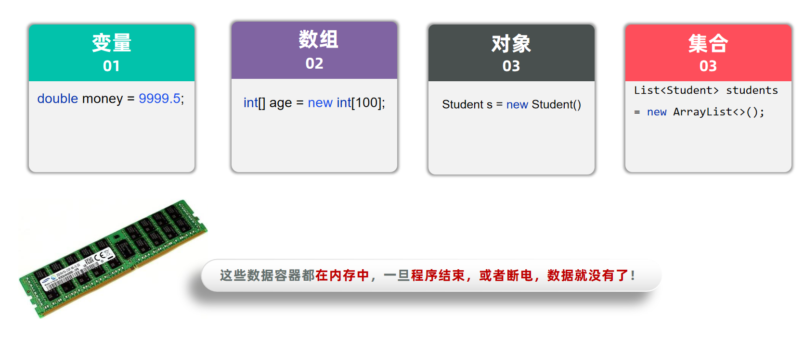

有些数据要长久保存，该怎么办呢？

答案如下图所示：可以将数据以文件的形式存在硬盘里，即使程序结束了，断点了只要硬盘没坏，数据就永久存在。

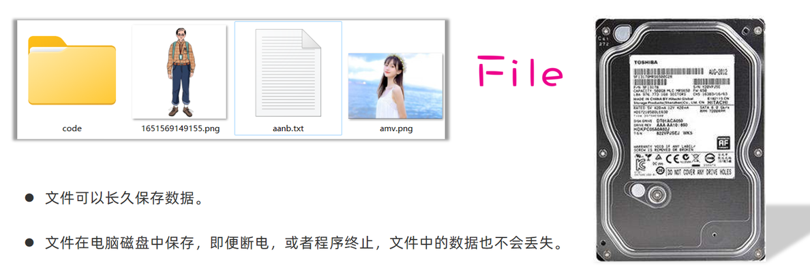

而现在要学习的File类，它的就用来表示当前系统下的文件（也可以是文件夹），通过File类提供的方法可以获取文件大小、判断文件是否存在、创建文件、创建文件夹等。

但是需要我们注意：File对象只能对文件进行操作，不能操作文件中的内容。

## 2.File对象的创建

File类: File类的对象可以代表文件/文件夹，并可以调用其提供的方法对象文件进行操作

学习`File`类和其他类一样，第一步是创建`File`类的对象。 想要创建对象，我们得看`File`类有哪些构造方法

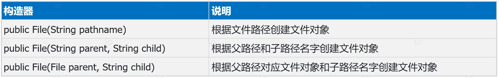

注意：

- File对象既可以代表文件、也可以代表文件夹

- File封装的对象仅仅是一个路径名，这个路径可以是存在的，也允许是不存在的

关于路径的写法,有两种常见封装方式:

- 绝对路径：从盘符开始（C:）

- 相对路径：不带盘符，默认到当前项目\(是project，不是module\)中寻找文件/目录。

下面我们演示一下，File类创建对象的代码：

```java
public class Demo1 {
    public static void main(String[] args) {
        //绝对路径：带盘符的路径
        //public File (String pathname) 根据文件路径创建文件对象
        File file = new File("D:\\itheima\\a.txt");
        System.out.println("file = " + file);

        //public File (String parent, String child) 根据父路径和子路径名字创建文件对象
        file = new File("D:\\itheima","a.txt");
        System.out.println("file = " + file);;

        //public File (File  parent, String child) 根据父路径对应文件对象和子路径名字创建文件对象
        file = new File(new File("D:\\itheima"),"a.txt");
        System.out.println("file = " + file);

        //相对路径：不带盘符，默认从当前项目(java-upgrade)下查找
        file = new File("day04-file-io-properties-xml/a.txt"); //在当前模块中找a.txt
        System.out.println("file = " + file);
        file = new File("day04-file-io-properties-xml/src/b.txt");//在当前模块下的src目录中找b.txt
        System.out.println("file = " + file);
        file = new File("day04-file-io-properties-xml/src/com/itheima/c.txt"); 
        System.out.println("file = " + file);
    }
}
```

## 3.File判断和获取方法

刚才我们创建File对象的时候，会传递一个文件路径过来。但是File对象封装的路径是存在还是不存在，是文件还是文件夹其实是不清楚的。好在File类提供了方法可以帮我们做判断以及获取文件详情信息。

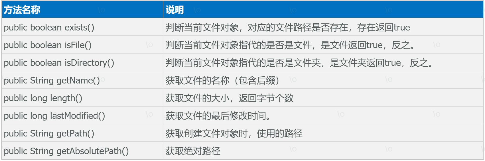

代码演示:

```java
public class Demo2 {
    public static void main(String[] args) throws IOException {
        File file = new File("day04-file-io-properties-xml/a.txt");
        //File file = new File("day04-file-io-properties-xml/b.txt");
        //File file = new File("day04-file-io-properties-xml/src");
        //public boolean exists() 判断当前文件对象，对应的文件路径是否存在，存在返回true
        System.out.println("判断当前文件/目录是否存在 = " + file.exists());
        
        //public boolean isFile() 判断当前文件对象指代的是否是文件，是文件返回true，反之返回false
        System.out.println("是否是文件 = " + file.isFile());
        
        //public boolean isDirectory() 判断当前文件对象指代的是否是文件夹，是文件夹返回true，反之返回false。
        System.out.println("是否是文件夹(目录) = " + file.isDirectory());
        
        //public String getName() 获取文件的名称（包含后缀）
        System.out.println("文件名称 = " + file.getName());
        
        //public long length() 获取文件的大小，返回字节个数
        System.out.println("文件大小(单位：字节) = " + file.length());
    }
}
```

## 4.创建和删除方法

我们不能不用java代码创建一个文件或者文件夹呀？答案是有的，不光可以创建还可以删除。

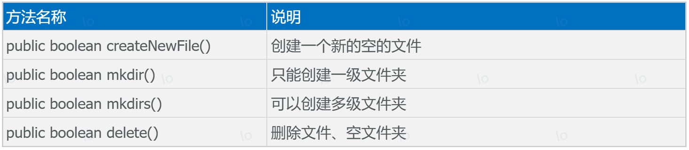

File类提供了创建和删除文件的方法，话不多少，看代码。

需要注意的是：

1\.`mkdir()`: 只能创建单级文件夹

2\.`mkdirs()`: 才能创建多级文件夹

3\.`delete()`: 文件可以直接删除，但是文件夹只能删除空的文件夹，文件夹有内容删除不了。

```java
public class Demo2 {
    public static void main(String[] args) throws IOException {
        //public boolean createNewFile()：创建一个新文件（文件内容为空），创建成功返回true,反之。
        file = new File("day04-file-io-properties-xml/b.txt");
        System.out.println("创建文件是否成功 = " + file.createNewFile());

        //public boolean mkdir()：用于创建文件夹，注意：只能创建一级文件夹
        file = new File("day04-file-io-properties-xml/aaa");
        System.out.println("创建一级目录是否成功 = " + file.mkdir());

        //public boolean mkdirs()：用于创建文件夹，注意：可以创建多级文件夹
        file = new File("day04-file-io-properties-xml/bbb/ccc");
        System.out.println("创建多级目录是否成功 = " + file.mkdirs());

        //public boolean delete()：删除文件，或者空文件，注意：不能删除非空文件夹。
        file = new File("day04-file-io-properties-xml/b.txt");
        System.out.println("删除文件或者空目录是否成功 = " + file.delete());
    }
}
```

## 5.遍历文件夹方法

有人说，想获取到一个文件夹中的内容，有没有方法呀？也是有的，下面我们就学习两个这样的方法。

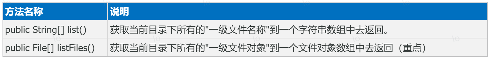

```java
public class Demo2 {
    public static void main(String[] args) throws IOException {
        file = new File("day04-file-io-properties-xml");
        File[] files = file.listFiles();
        for (File f : files) {
            System.out.println(f);
        }
    }
}
```

使用file的`listFiles`方法时的注意事项：

- 当file是文件，或者路径不存在时，返回null。

- 当file是空文件夹时，返回一个长度为0的数组。

- 当file是一个有内容的文件夹时，将里面所有一级文件和文件夹的路径放在File数组中返回。

- 当file是一个文件夹且里面有隐藏文件时，将里面所有文件和文件夹的路径放在File数组中返回，包含隐藏文件

- 当file是一个文件夹，但是没有权限访问该文件夹时，返回null。

## 6.字符集

前面我们已经学习了File类，通过File类的对象可以对文件进行操作，但是不能操作文件中的内容。要想操作文件中的内容，我们还得学习IO流。但是在正式学习IO流之前，我们还需要学习一个前置知识叫做字符集，只有我们把字符集搞明白了，再学习IO流才会更加丝滑。

### 6.1.字符集的来历

所以，接下来我们正式学习一下字符集。先了解一下字符集的来历。

我们知道计算机是美国人发明的，由于计算机能够处理的数据只能是0和1组成的二进制数据，为了让计算机能够处理字符，于是美国人就把他们会用到的每一个字符进行了编码（所谓编码，就是为一个字符编一个二进制数据），如下图所示：

美国人常用的字符有英文字母、标点符号、数字以及一些特殊字符，这些字符一共也不到128个，所以他们用1个字节来存储1字符就够了。

美国人把他们用到的字符和字符对应的编码总结成了一张码表，这张码表叫做ASCII码表（也叫ASCII字符集）

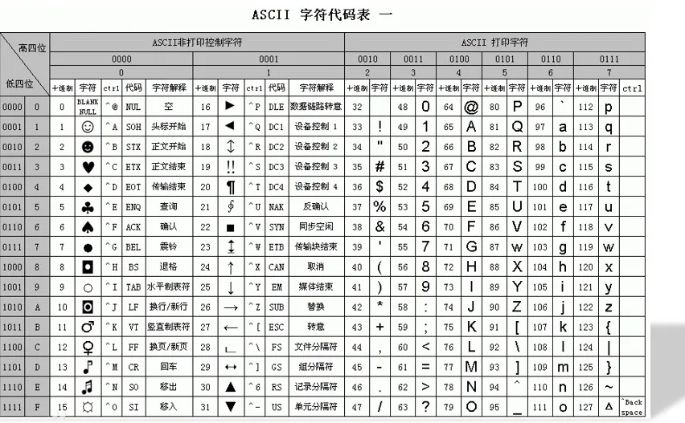

其实计算机只在美国用是没有问题的，但是计算机慢慢的普及到全世界，当普及到中国的时候，在计算机中想要存储中文，那ASCII字符集就不够用了，因为中文太多了，随便数一数也有几万个字符。

于是中国人为了在计算机中存储中文，也编了一个中国人用的字符集叫做GBK字符集，这里面包含2万多个汉字字符，GBK中一个汉字采用两个字节来存储，为了能够显示英文字母，GBK字符集也兼容了ASCII字符集，在GBK字符集中一个字母还是采用一个字节来存储。

### 6.2.汉字和字母的编码特点

讲到这里，我们可能有有这么一个疑问： 如果一个文件中既有中文，也有英文，那计算机怎么知道哪几个字节表示一个汉字，哪几个字节表示一个字母呢？

其实这个问题问当想当有水平，接下来，就带着同学们了解一下，计算机是怎么识别中文和英文的。

比如：在文件中存储一个`我a你`，底层其实存储的是这样的二进制数据。


需要我们注意汉字和字母的编码特点：

- 如果是存储字母，采用1个字节来存储，一共8位，其中第1位是0

- 如果是存储汉字，采用2个字节来存储，一共16位，其中第1位是1

当读取文件中的字符时，通过识别读取到的第1位是0还是1来判断是字母还是汉字

- 如果读取到第1位是0，就认为是一个字母，此时往后读1个字节。

- 如果读取到第1位是1，就认为是一个汉字，此时往后读2个字节。

### 6.3.Unicode字符集

咱们国家可以用GBK字符集来表示中国人使用的文字，那世界上还有很多其他的国家，他们也有自己的文字，他们也想要自己国家的文字在计算机中处理，于是其他国家也在搞自己的字符集，就这样全世界搞了上百个字符集，而且各个国家的字符集互不兼容。 这样其实很不利于国际化的交流，可能一个文件在我们国家的电脑上打开好好的，但是在其他国家打开就是乱码了。


为了解决各个国家字符集互不兼容的问题，由国际化标准组织牵头，设计了一套全世界通用的字符集，叫做`Unicode`字符集。在`Unicode`字符集中包含了世界上所有国家的文字，一个字符采用4个字节存储。

在`Unicode`字符集中，采用一个字符4个字节的编码方案，又造成另一个问题：如果是说英语的国家，他们只需要用到26大小写字母，加上一些标点符号就够了，本身一个字节就可以表示完，用4个字节就有点浪费。

于是又对`Unicode`字符集中的字符进行了重新编码，一共设计了三种编码方案。分别是`UTF-32`、`UTF-16`、`UTF-8`; 其中比较常用的编码方案是UTF\-8。

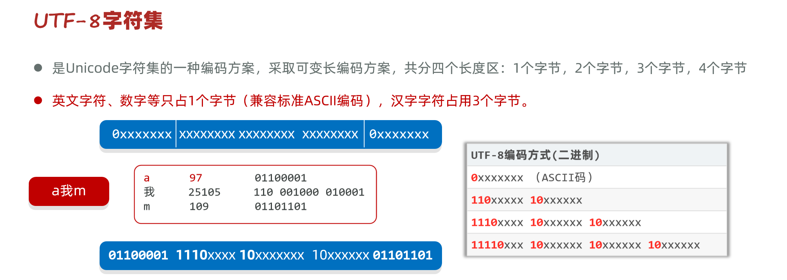

下面我们详细介绍一下UTF\-8这种编码方案的特点。

- UTF\-8是一种可变长的编码方案，工分为4个长度区

- 英文字母、数字占1个字节兼容\(ASCII编码\)

- 汉字字符占3个字节

- 极少数字符占4个字节

### 6.4.字符集小结

最后，我们将前面介绍过的字符集小结一下

- ASCII字符集：《美国信息交换标准代码》，包含英文字母、数字、标点符号、控制字符

  特点：1个字符占1个字节

- GBK字符集：中国人自己的字符集，兼容ASCII字符集，还包含2万多个汉字

  特点：1个字母占用1个字节；1个汉字占用2个字节

- Unicode字符集：包含世界上所有国家的文字，有三种编码方案，最常用的是UTF\-8
- UTF\-8编码方案：英文字母、数字占1个字节兼容\(ASCII编码\)、汉字字符占3个字节

注意：

- 字符编码时使用的字符集，和解码时使用的字符集必须一致，否则会出现乱码；
- 英文，数字一般不会乱码，因为很多字符集都兼容了ASCII编码。


### 6.5.编码和解码

搞清楚字符集的知识之后，我们接下来再带着同学们使用java代码完成编码和解码的操作。

其实`String`类中就提供了相应的方法，可以完成编码和解码的操作。

编码：把字符串按照指定的字符集转换为字节数组

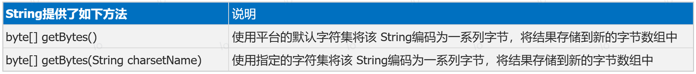

解码：把字节数组按照指定的字符集转换为字符串

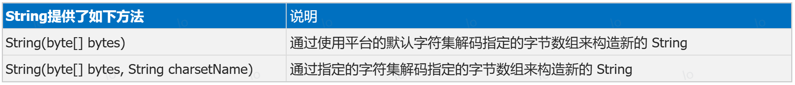

```java
public class Demo3 {
    public static void main(String[] args) throws UnsupportedEncodingException {
        String s="我ai中国";
        //编码
        //byte[] getBytes() 使用平台的默认字符集将该 String编码为一系列字节，将结果存储到新的字节数组中
        byte[] bytes = s.getBytes();
        System.out.println("UTF-8编码后 = " + Arrays.toString(bytes));

        //解码
        //String (byte[] bytes) 通过使用平台的默认字符集解码指定的字节数组来构造新的 String
        String str = new String(bytes);
        System.out.println("UTF-8解码后 = " + str);

        System.out.println("-------------------");

        //编码
        //byte[] getBytes(String charsetName) 使用指定的字符集将该 String编码为一系列字节，将结果存储到新的字节数组中
        bytes = s.getBytes("gbk");
        System.out.println("GBK编码后 = " + Arrays.toString(bytes));

        //解码
        //String (byte[] bytes, String charsetName) 通过指定的字符集解码指定的字节数组来构造新的 String
        str = new String(bytes,"gbk");
        System.out.println("GBK解码后 = " + str);
    }
}
```

# 二、IO流 

## 1.IO流概述

在前面我们已经学习过File类。但是我们知道File只能操作文件，但是不能操作文件中的内容。我们也学习了字符集，不同的字符集存字符数据的原理是不一样的。有了前面两个知识的基础，接下来我们再学习IO流，就可以对文件中的数据进行操作了。

IO流的作用：就是可以对文件或者网络中的数据进行读、写的操作。如下图所示

- 把数据从磁盘、网络中读取到程序中来，用到的是输入流。
- 把程序中的数据写入磁盘、网络中，用到的是输出流。

简单记：输入流（读数据）、输出流（写数据）

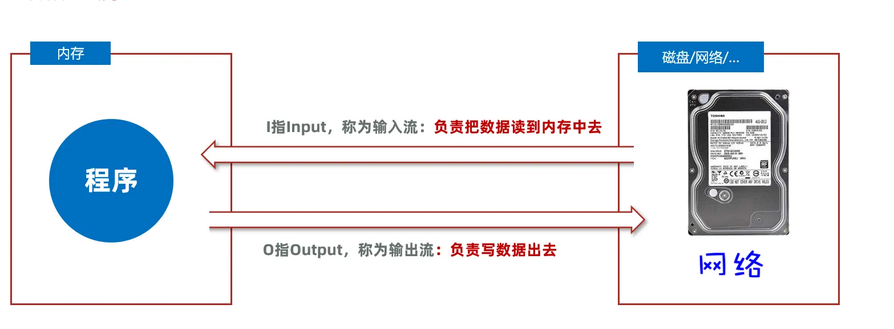

IO流在java中有很多种，不同的流来干不同的事情。

java把各种流用不同的类来表示，这些流的继承体系如下图所示：

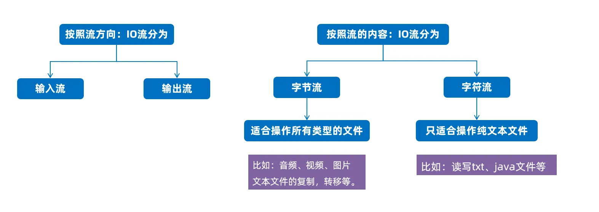

简而言之IO流分为两大派系：

- 字节流：字节流又分为字节输入流、字节输出流

- 字符流：字符流由分为字符输入流、字符输出流


## 2.字节流

### 2.1.字节流\-字节输入流 

我们认识了什么是IO流，接下来我们学习字节流中的字节输入流，用InputStream来表示。

作用：以内存为基准，可以把磁盘文件中的数据以字节的形式读入到内存中去。

但是InputStream是抽象类，我们用的是它的子类，叫FileInputStream。

需要用到的方法如下所示：有构造方法、成员方法

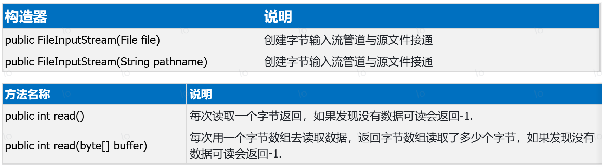

**一次读取一个字节**

```java
public class FileInputStreamDemo1 {
    public static void main(String[] args) throws Exception {
        // 目标：掌握文件字节输入流读取文件中的字节数组到内存中来。
        // 1、创建文件字节输入流管道于源文件接通
        // InputStream is = new FileInputStream(new File("src\\dlei02.txt"));
        InputStream is = new FileInputStream("src\\dlei02.txt"); // 简化写法
        // 2、开始读取文件中的字节并输出： 每次读取一个字节
        // 定义一个变量记住每次读取的一个字节
        int by;
        while ((by = is.read()) != -1) {
            System.out.print((char) b);
        }
        // 每次读取一个字节的问题：性能较差,读取汉字输出一定会乱码！
        is.close();
    }
}
```

注意:每次读取一个字节的问题：性能较差,读取汉字输出一定会乱码！

**一次读取一个字节数组**

```java
public class Demo01 {
    public static void main(String[] args) throws IOException {
        //1 创建流对象(FileInputStream对象)
        //1.1 FileInputStream(File file)：创建字节输入流管道与源文件对象接通
        //FileInputStream fis = new FileInputStream(new File("day04-file-io-properties-xml/a.txt"));
        //1.2 FileInputStream(String pathname)：创建字节输入流管道与源文件路径接通
        //注意：读数据的路径一定是一个存在的文件路径,不能是文件夹路径
        //FileInputStream fis = new FileInputStream("day04-file-io-properties-xml/a.txt");
        FileInputStream fis = new FileInputStream("day04-file-io-properties-xml/Demo01.java");
        //2 读数据
        //2.1 int read()：每次读取一个字节返回，如果字节已经没有可读的返回-1、
        //int by = fis.read();
        //System.out.println("by = " + by);
        //2.2 int read(byte[] buffer)：每次读取一个字节数组，返回读取的字节个数，如果字节已经没有可读的返回-1
        byte[] bytes = new byte[1024];
        int len=0;  //保存读到的字节个数,如果没读到就返回-1
        /*int len = fis.read(bytes);  //返回读到的字节个数,如果没读到就返回-1
        System.out.println("读到的字节个数 = " + len);
        System.out.println("读到字节数据 = " + Arrays.toString( bytes));
        System.out.println("读到字节数据 = " + new String(bytes));*/
        /* while循环中做的事：
            1、(len =  fis.read(bytes)) 使用fis读取文件中的数据，读到的数据保存到bytes数组中，然后将字节个数赋值给len变量
            2、判断len的值不等于-1，表示没读完
         */
        while (  (len = fis.read(bytes)) !=-1){
            //参数1：要转成字符串的字节数组。参数2：从0索引处转。参数3：转换的字节个数
            String s = new String(bytes,0,len);  //将字节数组转成字符串。
            System.out.println(s);
        }
        //3 释放资源(关闭流)
        fis.close();
    }
}
```

注意:读取性能得到了提升，但读取汉字输出还是会乱码。

结论: 读取文本适合用字符流；字节流适合做数据的转移，比如：文件复制

### 2.2.字节流\-字节输出流

前面我们学习了使用`FIleInputStream`读取文件中的字节数据。然后就迫不及待的想学习往文件中写入数据了。

作用：以内存为基准，把内存中的数据以字节的形式写出到文件中去。

写输入的流程如下图所示

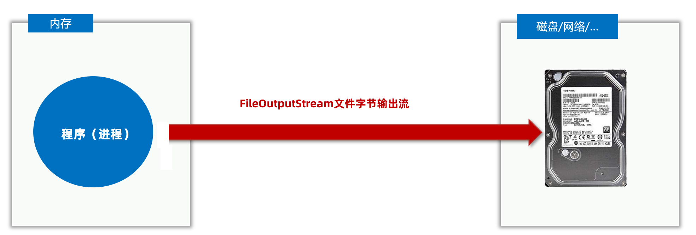

往文件中写数据需要用到OutputStream下面的一个子类FileOutputStream。

需要用到的方法如下所示：有构造方法、成员方法

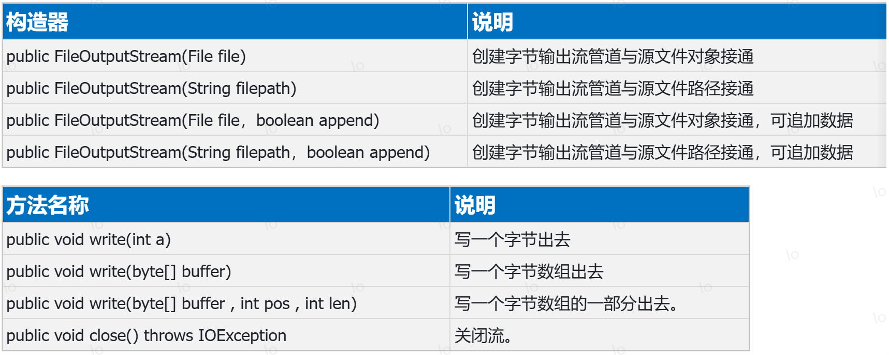

代码如下：

```java
public class Demo02 {
    public static void main(String[] args) throws IOException {
        //1 创建流对象(字节输出流FileOutputStream) 说明：如果文件不存在，内部会帮我们创建文件
        //FileOutputStream fos = new FileOutputStream("day04-file-io-properties-xml/b.txt");
        //参数1：表示要写数据的文件路径。参数2：true表示追加，false表示覆盖。不传递默认时覆盖
        FileOutputStream fos = new FileOutputStream("day04-file-io-properties-xml/b.txt",true);
        //2 写数据
        //2.1  write(int a)：写一个字节出去
        //fos.write(97);
        //fos.write(98);
        //fos.write(99);

        //2.2 write(byte[] buffer)：写一个字节数组出去
        //byte[] bytes = {97,98,99,100,101,102};
        //fos.write(bytes);

        //2.3 write(byte[] buffer , int pos , int len)：写一个字节数组的一部分出去
        //fos.write(bytes,1,3);  //从数组的1索引处开始写，写3个。也就是输出bcd

        //需求1：使用 字节输出流 将"我爱Java" 写到当前模块的b.txt中。
        //fos.write("我爱Java\r\n".getBytes());
        //fos.write("我爱Java\r\n".getBytes());

        //需求2：使用 字节输出流 向当前模块的b.txt中追加5行"乾坤未定,你我皆是黑马"。
        for (int i = 0; i < 5; i++) {
            fos.write("乾坤未定,你我皆是黑马\r\n".getBytes());
        }

        //3 释放资源(关闭流对象)
        fos.close();
    }
}
```

### 2.3.字节流\-文件复制

同学们，我们在前面已经把字节输入流和字节输出流都学习完了。现在我们就可以用这两种流配合起来使用，做一个文件复制的综合案例。

比如：我们要复制一张图片，从磁盘`D:/resource/meinv.png`的一个位置，复制到`C:/data/meinv.png`位置。

复制文件的思路如下图所示：

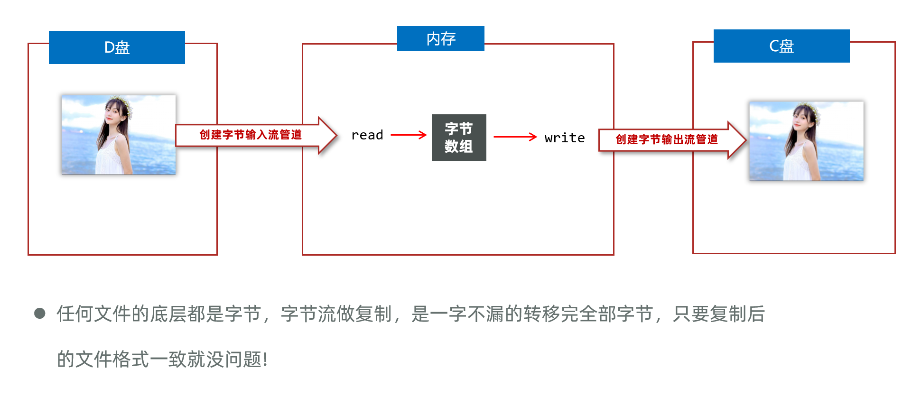

步骤:

1. 需要创建一个FileInputStream流与源文件接通，创建FileOutputStream与目标文件接通

2. 然后创建一个数组，使用FileInputStream每次读取一个字节数组的数据，存如数组中

3. 然后再使用FileOutputStream把字节数组中的有效元素，写入到目标文件中

代码如下：

```java
public class Demo03 {
    public static void main(String[] args) throws IOException {
        //1 创建字节输入流和输出流对象
        FileInputStream fis = new FileInputStream("D:\\image\\e.jpg");
        FileOutputStream fos = new FileOutputStream("day04-file-io-properties-xml/e.jpg");
        //2 循环读写文件，一边读一边写，一次读写一个字节数组
        byte[] bytes = new byte[1024];   //保存读到的字节数据
        int len=0;  //保存读到的字节个数，如果事-1表示读完了。
        while ( (len = fis.read(bytes)) !=-1 ){
            //将读到的字节数组写出去
            fos.write(bytes,0,len); //读到几个就写几个
        }
        //3 释放资源(关闭流)
        fis.close();
        fos.close();
    }
}
```

### 2.4.资源释放

前面我们已经学习了字节流，也强调过，流使用完之后一定要释放资源。但是我们之前的代码都是将异常抛出处理的,交给了JVM处理,如果我们想要自行进行异常处理该怎么办呢？

在JDK7以前，和JDK7以后分别给出了不同的处理方案。

**JDK7以前的资源释放**

在JDK7版本以前，我们可以使用try\.\.\.catch\.\.\.finally语句来处理。格式如下

```java
try{
    //有可能产生异常的代码
}catch(异常类 e){
    //处理异常的代码
}finally{
    //释放资源的代码
    //finally里面的代码有一个特点，不管异常是否发生，finally里面的代码都会执行。
}
```

改造上面的复制代码：

```java
public class Demo04 {
    public static void main(String[] args){
        //方式一：掌握try-catch-finally资源释放的使用
        //做法：选中要放到try中的代码,使用ctrl+alt+t--->try/catch/finally
        FileInputStream fis = null;
        FileOutputStream fos = null;
        try {
            //1 创建字节输入流和输出流对象
            fis = new FileInputStream("D:\\image\\e.jpg");
            fos = new FileOutputStream("day04-file-io-properties-xml/e.jpg");
            //2 循环读写文件，一边读一边写，一次读写一个字节数组
            byte[] bytes = new byte[1024];
            int len=0;  //保存读到的字节个数，如果事-1表示读完了。
            while (  (len = fis.read(bytes)) !=-1 ){
                //将读到的字节数组写出去
                fos.write(bytes,0,len);
            }
        } catch (IOException e) {
            //e.printStackTrace();
            System.out.println("文件复制失败！");
        } finally {
            //System.out.println("finally");
            // finally：放在try-catch后面的，无论是正常执行还是异常执行代码，最后一定要执行，除非JVM退出。
            //3 释放资源(关闭流)
            try {
               if(fis!=null){
                   fis.close();
               }
            } catch (IOException e) {
                e.printStackTrace();
            }
            try {
                if(fos!=null){
                    fos.close();
                }
            } catch (IOException e) {
                e.printStackTrace();
            }
        }

    }
}
```

finally代码区的特点：无论try中的程序是正常执行了，还是出现了异常，最后都一定会执行finally区，除非JVM终止。

作用：一般用于在程序执行完成后进行资源的释放操作（专业级做法）。

**JDK7以后的资源释放**

刚才很多同学已经发现了`try...catch...finally`处理异常，并释放资源代码比较繁琐。java在JDK7版本为我们提供了一种简化的是否资源的操作，它会自动是否资源。代码写起来也想当简单。

格式如下：

```java
try(定义资源1;定义资源2;…）{
    可能出现异常的代码;
}catch(异常类名 变量名){
    异常的处理代码;
}
```

注意:

1. \(\) 中只能放置资源，否则报错 2: 什么是资源呢？ 资源一般指的是最终实现了AutoCloseable接口。如下所示:

2. try\-with\-resource做法：选中要放到try中的代码\-\-\-\>ctrl\+alt\+t\-\-\-\>选择try/catch\-\-\-\>最后在try使用\(\)包裹流对象

```java
public class Demo05 {
    public static void main(String[] args){
        //方式二：掌握try-with-resource资源释放的使用
        //做法：选中要放到try中的代码,使用ctrl+alt+t--->try/catch--->将创建流对象的代码方法try后面的()中
        try (//1 创建字节输入流和输出流对象
             FileInputStream fis = new FileInputStream("D:\\image\\e.jpg");
             FileOutputStream fos = new FileOutputStream("day04-file-io-properties-xml/e.jpg");){
            //2 循环读写文件，一边读一边写，一次读写一个字节数组
            byte[] bytes = new byte[1024];
            int len=0;  //保存读到的字节个数，如果事-1表示读完了。
            while (  (len = fis.read(bytes)) !=-1 ){
                //将读到的字节数组写出去
                fos.write(bytes,0,len);
            }
        } catch (IOException e) {
            e.printStackTrace();
        }
    }
}
```

## 3.字符流

前面我们学习了字节流，使用字节流可以读取文件中的字节数据。但是如果文件中有中文使用字节流来读取，就有可能只读到半个汉字的情况，这样会导致乱码。虽然使用读取全部字节的方法不会出现乱码，但是如果文件过大又不太合适。

所以java专门为我们提供了另外一种流，叫字符流，可以字符流是专门为读取文本数据而生的。

### 3.1.字符流\-字符输入流

先来学习字符输入流Reader，由于是抽象类,所以我们来学习其子类FileReader类。

作用：以内存为基准，把内存中的数据以字符的形式写出到文件中去。

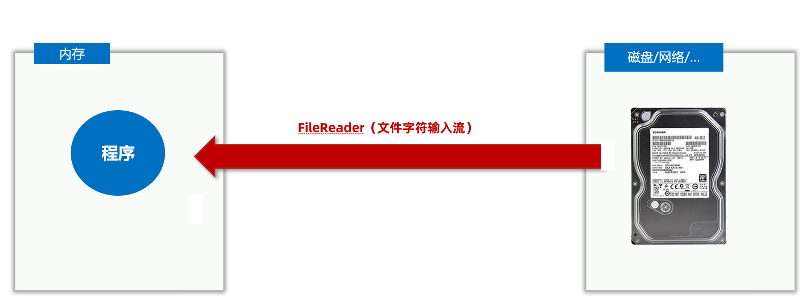

需要用到的方法如下所示：有构造方法、成员方法

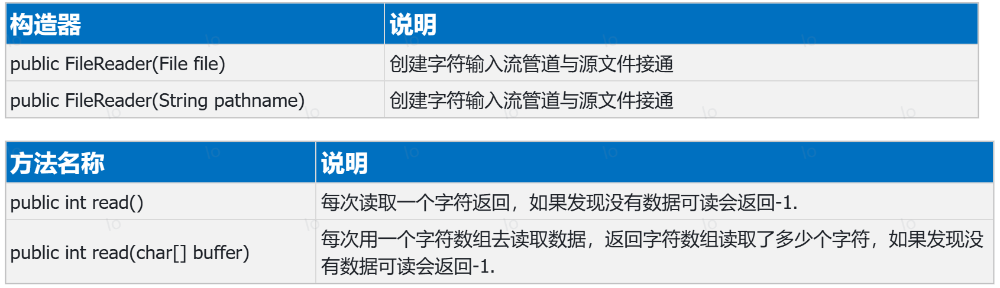

```java
public class FileReaderDemo1 {
    public static void main(String[] args) {
        // 目标：掌握文件字符输入流读取字符内容到程序中来。
        try (
            // 1、创建文件字符输入流与源文件接通
            Reader fr = new FileReader("src\\dlei06.txt");
        ) {
            // 2、定义一个字符数组，每次读多个字符
            char[] chs = new char[3];
            int len; // 用于记录每次读取了多少个字符
            while ((len = fr.read(chs)) != -1){
                // 3、每次读取多个字符，并把字符数组转换成字符串输出
                String str = new String(chs,0,len);
                System.out.print(str);
            }
            // 拓展：文件字符输入流每次读取多个字符，性能较好，而且读取中文
            // 是按照字符读取，不会出现乱码！这是一种读取中文很好的方案。
        }catch (Exception e){
            e.printStackTrace();
        }
    }
}
```

字符输入流是按照字符读取，不会出现乱码！这是一种读取中文很好的方案。

### 3.2.字符流\-字符输出流

我们学习了FileReader，它可以将文件中的字符数据读取到程序中来。接下来，我们就要学习字符输出流Writer的子类FileWriter了，它可以将程序中的字符数据写入文件。

作用：以内存为基准，把内存中的数据以字符的形式写出到文件中去。

需要用到的方法如下所示：有构造方法、成员方法

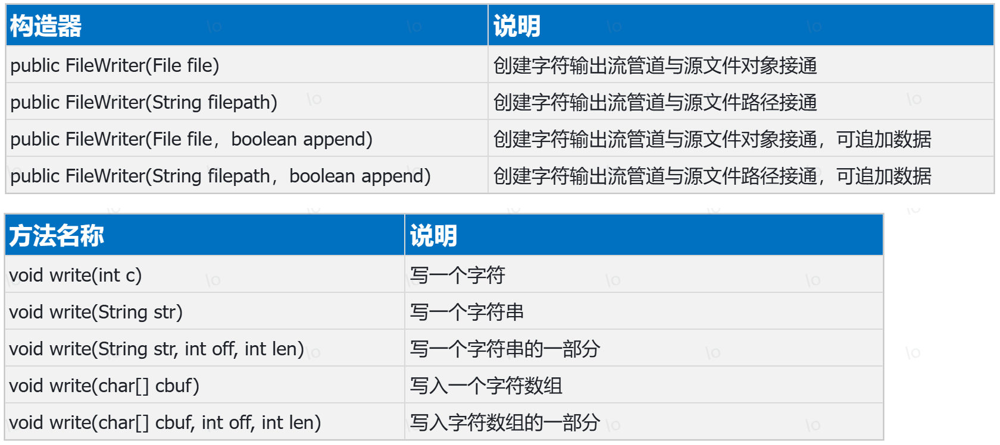

接下来，用代码演示一下：

```java
public class FileWriterDemo1 {
    public static void main(String[] args) {
        // 目标：搞清楚文件字符输出流的使用：写字符出去的流。
        try (
            // 1. 创建一个字符输出流对象，指定写出的目的地。
            //Writer fw = new FileWriter("src/dlei07-out.txt"); // 覆盖管道
            Writer fw = new FileWriter("src/dlei07-out.txt", true); // 追加数据
        ){
            // 2. 写一个字符出去：  public void write(int c)
            fw.write('a');
            fw.write(98);
            fw.write('磊');
            fw.write("\r\n"); // 换行
            // 3、写一个字符串出去：  public void write(String str)
            fw.write("java");
            fw.write("我爱Java，虽然Java不是最好的编程之一,但是可以挣钱");
            fw.write("\r\n"); // 换行
            // 4、写字符串的一部分出去：  public void write(String str, int off, int len)
            fw.write("java", 1, 2);
            fw.write("\r\n"); // 换行
            // 5、写一个字符数组出去：  public void write(char[] cbuf)
            char[] chars = "java".toCharArray();
            fw.write(chars);
            fw.write("\r\n"); // 换行
            // 6、写字符数组的一部分出去：  public void write(char[] cbuf, int off, int len)
            fw.write(chars, 1, 2);
            fw.write("\r\n"); // 换行
            //fw.flush(); // 刷新缓冲区，将缓冲区中的数据全部写出去。
            // 刷新后，流可以继续使用。
            // fw.close(); // 关闭资源，关闭包含了刷新！关闭后流不能继续使用！
        } catch (Exception e) {
            e.printStackTrace();
        }
    }
}
```

FileWriter写的注意事项：FileWriter写完数据之后，必须刷新或者关闭，写出去的数据才能生效。

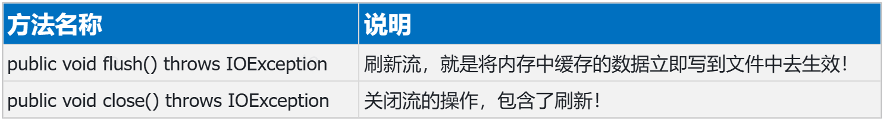

### 3.3.字符流\-文件复制

```java
public class Demo2 {
    public static void main(String[] args) throws IOException {
        //需求：使用字符流(FileReader、FileWriter)完成文件复制。
        try( //1 创建字符输入流和输出流对象
             FileReader fr = new FileReader("day04-file-io-properties-xml/Demo01.java");
             FileWriter fw = new FileWriter("day04-file-io-properties-xml/Demo02.java");) {
            //2 循环读写文件，一边读一边写，一次读写一个字符数组
            char[] chars = new char[1024];
            int len = 0; //保存读到的字符个数，如果为-1表示读完了。
            while ( (len=fr.read(chars))!=-1 ){
                fw.write(chars,0,len);
                fw.flush();  //刷新流，将流中的内容刷出到文件中，刷新完毕之后流对象还可以继续使用
            }
        } catch (IOException e) {
            e.printStackTrace();
        }
    }
}
```

## 4.缓冲流

学习完字符流之后，接下来我们学习一下缓冲流。我们还是先来认识一下缓存流，再来说一下它的作用。

缓冲流的作用：可以对原始流进行包装，提高原始流读写数据的性能。

### 4.1.缓冲字节流

我们先来学习字节缓冲流是如何提高读写数据的性能的。

作用：可以提高字节输入流读取数据的性能

原理：缓冲字节输入流自带了8KB缓冲池；缓冲字节输出流也自带了8KB缓冲池。

由于是来提升原始流性能的所以，需要封装一个原始流对象进来。构造方法如下

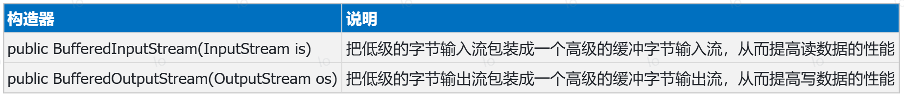

用一个复制文件来演示下使用:

```java
public class BufferByteDemo {
    public static void main(String[] args) throws IOException {
        //1. 创建缓冲字节输入输出流
        BufferedInputStream bis = new BufferedInputStream(new FileInputStream("day04-file-io-properties-xml/Demo01.java"));
        BufferedOutputStream bos = new BufferedOutputStream(new FileOutputStream("day04-file-io-properties-xml/Demo02.java"));
        //2. 读写文件
        byte[] bytes = new byte[10];
        int len;
        while ((len = bis.read(bytes)) != -1) {
            bos.write(bytes, 0, len);
        }
        //关闭流
        bis.close();
        bos.close();
    }
}
```

注意:字节缓冲流在功能上并无很大变化，性能提升了。

### 4.2.缓冲字符流

接下来，我们学习另外两个缓冲流——字符缓冲流。它的原理和字节缓冲流是类似的，它底层也会有一个8KB的数组，但是这里是字符数组。字符缓冲流也不能单独使用，它需要依赖于原始字符流一起使用。

作用：自带8K（8192）的字符缓冲池，可以提高字符输入流读取字符数据的性能。

BufferedReader读数据时：它先原始字符输入流一次性读取8KB的数据存入缓冲流内部的数组中（ps: 先一次多囤点货），再从8KB的字符数组中读取一个字符或者多个字符（把消耗屯的货）。

创建BufferedReader对象需要用到BufferedReader的构造方法，内部需要封装一个原始的字符输入流，我们可以传入FileReader


而且BufferedReader还要特有的方法，一次可以读取文本文件中的一行


BufferedWriter写数据时： 它是先把数据写到字符缓冲流内部的8BK的数组中（ps: 先攒一车货），等数组存满了，再通过原始的字符输出流，一次性写到目标文件中去（把囤好的货，一次性运走）。如下图所示

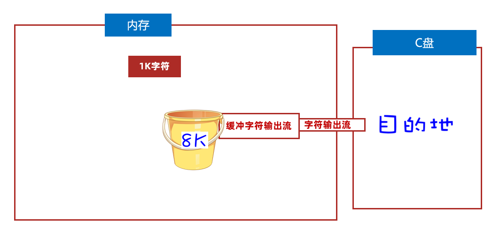

创建BufferedWriter对象时需要用到BufferedWriter的构造方法，而且内部需要封装一个原始的字符输出流，我们这里可以传递FileWriter。


而且BufferedWriter新增了一个功能，可以用来写一个换行符


接下来，用代码演示一下，字符缓冲流

```java
public class Demo01 {
    public static void main(String[] args){
        //需求：使用字符流(BufferedReader、BufferedWriter)完成文件复制。
        try (//1 创建缓冲字符输入流和输出流对象
             BufferedReader br = new BufferedReader(new FileReader("day04-file-io-properties-xml/Demo01.java"));
             BufferedWriter bw = new BufferedWriter(new FileWriter("day04-file-io-properties-xml/Demo02.java"));){
            //2 循环读写文件，一边读一边写，一次读一行
            String line = null;
            while ((line = br.readLine())!=null){
                bw.write(line);
                //换行
                bw.newLine();
            }
        } catch (IOException e) {
           e.printStackTrace();
        }
    }
}
```

### 4.3.缓冲流读写文件效率测试

需求用例：

定义方法分别使用原始的字节流，以及字节缓冲流复制一个文件\(10MB就行\)，记录耗时。

测试步骤：

1. 使用原始的字节流按照一个一个字节的形式复制文件。

2. 使用原始的字节流按照字节数组的形式复制文件。

3. 使用高效的缓冲字节流按照一个一个字节的形式复制文件。

4. 使用高效的缓冲字节流按照字节数组的形式复制文件。

```java
public class Demo02 {
    public static void main(String[] args) throws IOException {
        copy1(); //1 使用原始的字节流按照一个一个字节的形式复制文件。
        copy2(); //2 使用原始的字节流按照字节数组的形式复制文件。
        copy3(); //3 使用高效的缓冲字节流按照一个一个字节的形式复制文件.
        copy4(); //4 使用高效的缓冲字节流按照字节数组的形式复制文件。
    }

    //1 使用原始的字节流按照一个一个字节的形式复制文件。
    public static void copy1() throws IOException {
        //获取开始时间，毫秒值
        long start = System.currentTimeMillis();

        //1 创建字节输入流和输出流对象
        FileInputStream fis = new FileInputStream("要读取的文件路径");
        FileOutputStream fos = new FileOutputStream("要写入的文件路径");
        //2 循环读写，一次读写一个字节
        int by=0;
        while ((by=fis.read())!=-1){
            fos.write(by);
        }
        //3 释放资源
        fis.close();
        fos.close();

        //获取结束时间，毫秒值
        long end = System.currentTimeMillis();
        System.out.println("1 使用原始的字节流按照一个一个字节的形式复制文件 = " + (end-start));
    }


    //2 使用原始的字节流按照字节数组的形式复制文件。
    public static void copy2() throws IOException {
        //获取开始时间，毫秒值
        long start = System.currentTimeMillis();

        //1 创建字节输入流和输出流对象
        FileInputStream fis = new FileInputStream("要读取的文件路径");
        FileOutputStream fos = new FileOutputStream("要写入的文件路径");
        //2 循环读写，一次读写一个字节数组
        int len=0;
        byte[] bytes=new byte[1024];
        while ((len=fis.read(bytes))!=-1){
            fos.write(bytes,0,len);
        }
        //3 释放资源
        fis.close();
        fos.close();

        //获取结束时间，毫秒值
        long end = System.currentTimeMillis();
        System.out.println("2 使用原始的字节流按照字节数组的形式复制文件 = " + (end-start));
    }


    //3 使用高效的缓冲字节流按照一个一个字节的形式复制文件.
    public static void copy3() throws IOException {
        //获取开始时间，毫秒值
        long start = System.currentTimeMillis();

        //1 创建字节缓冲输入流和输出流对象
        BufferedInputStream bis = new BufferedInputStream(new FileInputStream("要读取的文件路径"));
        BufferedOutputStream bos = new BufferedOutputStream(new FileOutputStream("要写入的文件路径"));
        //2 循环读写，一次读写一个字节
        int by=0;
        while ((by=bis.read())!=-1){
            bos.write(by);
        }
        //3 释放资源
        bis.close();
        bos.close();

        //获取结束时间，毫秒值
        long end = System.currentTimeMillis();
        System.out.println("3 使用高效的缓冲字节流按照一个一个字节的形式复制文件 = " + (end-start));
    }

    //4 使用高效的缓冲字节流按照字节数组的形式复制文件。
    public static void copy4() throws IOException {
        //获取开始时间，毫秒值
        long start = System.currentTimeMillis();

        //1 创建字节缓冲输入流和输出流对象
        BufferedInputStream bis = new BufferedInputStream(new FileInputStream("要读取的文件路径"));
        BufferedOutputStream bos = new BufferedOutputStream(new FileOutputStream("要写入的文件路径"));
        //2 循环读写，一次读写一个字节数组
        int len=0;
        byte[] bytes=new byte[1024];
        while ((len=bis.read(bytes))!=-1){
            bos.write(bytes,0,len);
        }
        //3 释放资源
        bis.close();
        bos.close();

        //获取结束时间，毫秒值
        long end = System.currentTimeMillis();
        System.out.println("4 使用高效的缓冲字节流按照字节数组的形式复制文件 = " + (end-start));
    }
}
```

## 5.IO框架

最后，再给我们补充讲解一个知识，叫做Hutool框架。它有什么用呢？我们只学习了IO流对文件复制，能不能复制文件夹呀？ 

当然是可以咯，但是如果让我们自己写复制文件夹的代码需要用到递归，还是比较麻烦的。如果使用Hutool框架，只需要一个方法即可完成

Hutool框架也称Hutool工具包：其本质是别人写好的一些字节码文件（class文件），打包成了一个jar包。

Hutool工具包：Hutool是一个小而全的java工具类库，通过静态方法封装各种操作，降低相关API的学习成本，提高工作效率，使java拥有函数式语言般的优雅，hutool工具包由各种Util工具类组成。

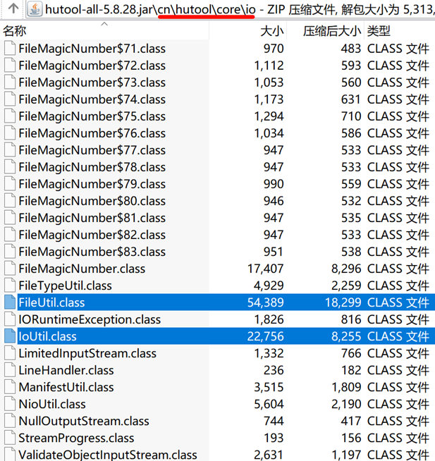

我们只需要把`hutool-all-5.8.28.jar`包引入到我们的项目中，就可以直接用了。 

这里给们介绍一个jar包中提供的工具类叫FileUtil和IoUtil，它的部分功能如下，很方便，你一看名字就知道怎么用了。

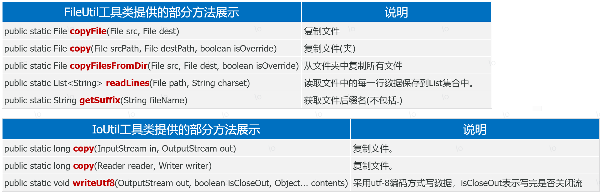

在写代码之前，先需要引入jar包，具体步骤如下

1. 在模块的目录下，新建一个lib文件夹

2. 把jar包复制粘贴到lib文件夹下

3. 选择lib下的jar包，右键点击Add As Library，然后就可以用了。

4. 在类中导包使用jar包中提供的api

代码如下：

```java
public class Demo {
    public static void main(String[] args) throws IOException {
        //public static File copyFile(File src, File dest) 复制文件
        FileUtil.copyFile(new File("day04-file-io-properties-xml/day03.txt"),new File("day04-file-io-properties-xml/day04.txt"));

        //public static File copy(File srcPath, File destPath, boolean isOverride)复制文件(夹)
        FileUtil.copy(new File("D:\\image"),new File("day04-file-io-properties-xml"),false);  //复制文件夹
        // public static File copyFilesFromDir(File src, File dest, boolean isOverride)从文件夹中复制所有文件
        FileUtil.copyFilesFromDir(new File("D:\\image"),new File("day04-file-io-properties-xml"),false);

        //public static List<String> readLines(File path, String charset)读取文件中的每一行数据保存到List集合中。
        List<String> list = FileUtil.readLines(new File("day04-file-io-properties-xml/day03.txt"), "utf-8");
        list.forEach(s-> System.out.println(s));

        //public static long copy(Reader reader, Writer writer)复制文件。
        /*try (FileReader fr =new FileReader("day04-file-io-properties-xml/day03.txt");
             FileWriter fw = new FileWriter("day04-file-io-properties-xml/day04.txt");){
            IoUtil.copy(fr,fw);
        } catch (Exception e) {
           e.printStackTrace();
        }*/
    }
}
```

# 三、Properties文件

## 1.认识properties文件

txt是我们最常用的文本文件，但是txt文件中存储时间没有固定的格式没很不方便。

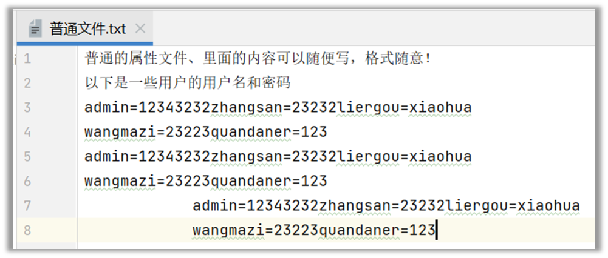

于是就有了其它文本文件来存储程序需要的数据，例如properties文件、xml文件，我们先介绍properties文件，它有固定的语法格式，文件中的数据以`key=value`的方式存储。

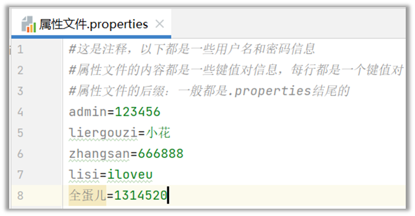

需要注意的是：

1. 在properties属性文件中，\#后面的属于注释

2. 属性文件中的key不能重复，值都是字符串不需要用引号引起来。

创建Properties文件：在`模块名`上鼠标右键\-\-\-\>New\-\-\-\>Resource Bundle


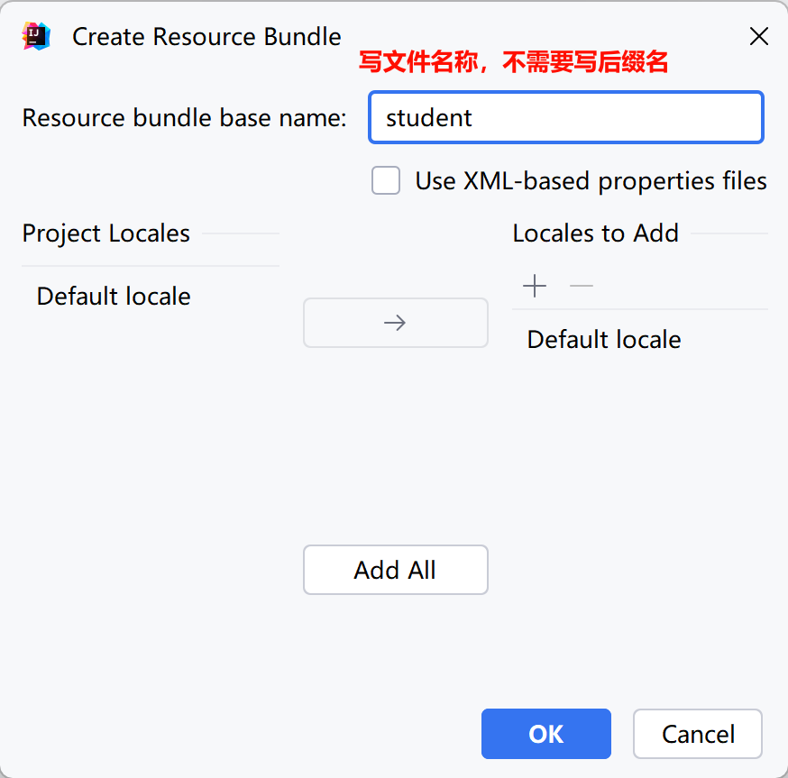

```Properties
# 注释
# 姓名
name=张益达
# 年龄
age=20
# 地址
address=北京
# key不能重复
#address=上海
```

## 2.文件解析\-读数据

接下来我们讲解如何读取properties文件中的数据，需要使用到一个Properties对象，它的继承体系结构如下：

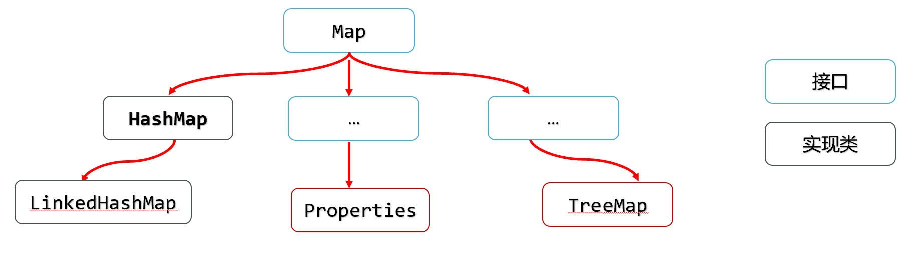

Properties对象是一个Map集合（键值对集合），但是我们一般不会当集合使用。

核心作用：Properties是用来代表属性文件的，通过Properties可以读写属性文件里的内容。

使用Properties读取属性文件里的键值对数据

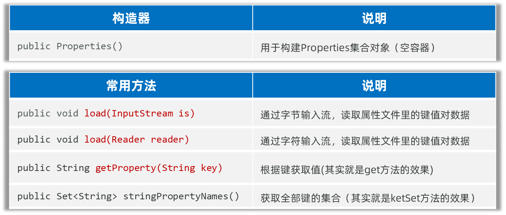

properties文件

```Properties
username=张益达
age=20
address=北京
```

读取properties文件中的内容

```java
public class Demo {
    public static void main(String[] args) throws IOException {
        //1 创建Properties对象
        Properties properties = new Properties();
        //2 调用load方法，读取文件中的数据到Properties对象中
        FileReader fr = new FileReader("day04-file-io-properties-xml/student.properties");
        properties.load(fr);
        //3 根据键获取值并打印
        String name = properties.getProperty("name");
        String age = properties.getProperty("age");
        String address = properties.getProperty("address");
        System.out.println("name = " + name);
        System.out.println("age = " + age);
        System.out.println("address = " + address);

        //4 释放资源
        fr.close();
    }
}
```

问题：读取到的数据是乱码的？

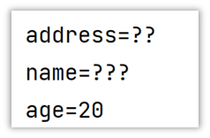

原因：idea中定义properties属性文件默认采用的是iso\-8859\-1编码，我们程序读文件采用的是utf\-8编码


解决：先复制properties文件中的内容，再修改文件的编码，具体设置如下：File\-\-\>Settings\-\-\>Editor\-\-\>File Encodings

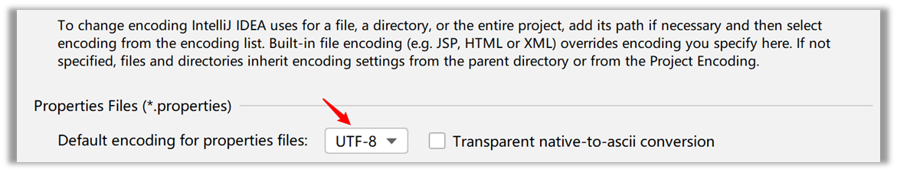

# 四、XML文件

## 1.认识xml文件

XML（ 全称EXtensible Markup Language， 可扩展标记语言 ）本质是一种存储数据的格式，可以用来存储结构复杂的数据以及数据之间的关系。

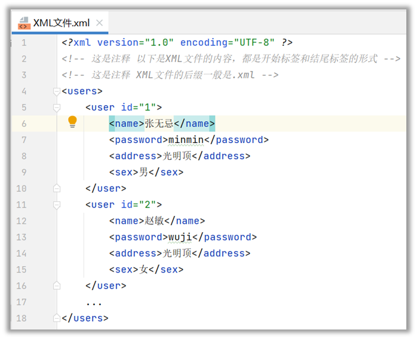

XML的创建

就是创建一个XML类型的文件，要求文件的后缀必须使用xml，如hello\_world\.xml

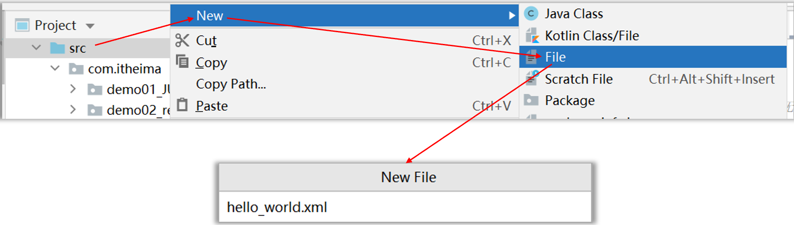

XML的语法规则

1. XML文件的后缀名为：xml，文档声明必须是第一行，在文件中写一个\<箭头就有提示

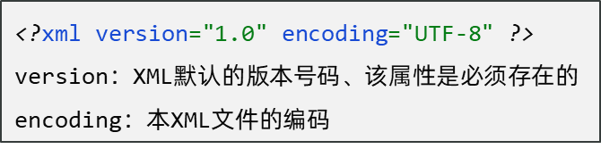

2. XML中可以定义注释信息：\<\!–\- 注释内容 \-\-\>

3. XML中的“\<标签名\>” 称为一个元素，一般是成对出现的，标签名自定义\(见名知意\)，标签要正确嵌套。

4. XML中只能由一个根标签，每个标签都可以有0个或者多个属性，属性值必须用引号引起来。

5. XML中书写”\<”、“\&”等，可能会出现冲突，导致报错，此时可以用如下特殊字符替代。

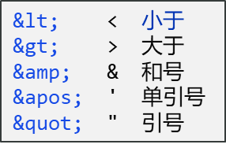

6. XML中可以写一个叫CDATA的数据区: \<\!\[CDATA\[   …内容…  \]\]\>，里面的内容会以纯文本的形式体现，也能解决特殊字符冲突问题。

XML的应用场景

应用场景：经常用来做为程序/框架的配置文件，或者在网络中作为数据的载体进行传输。

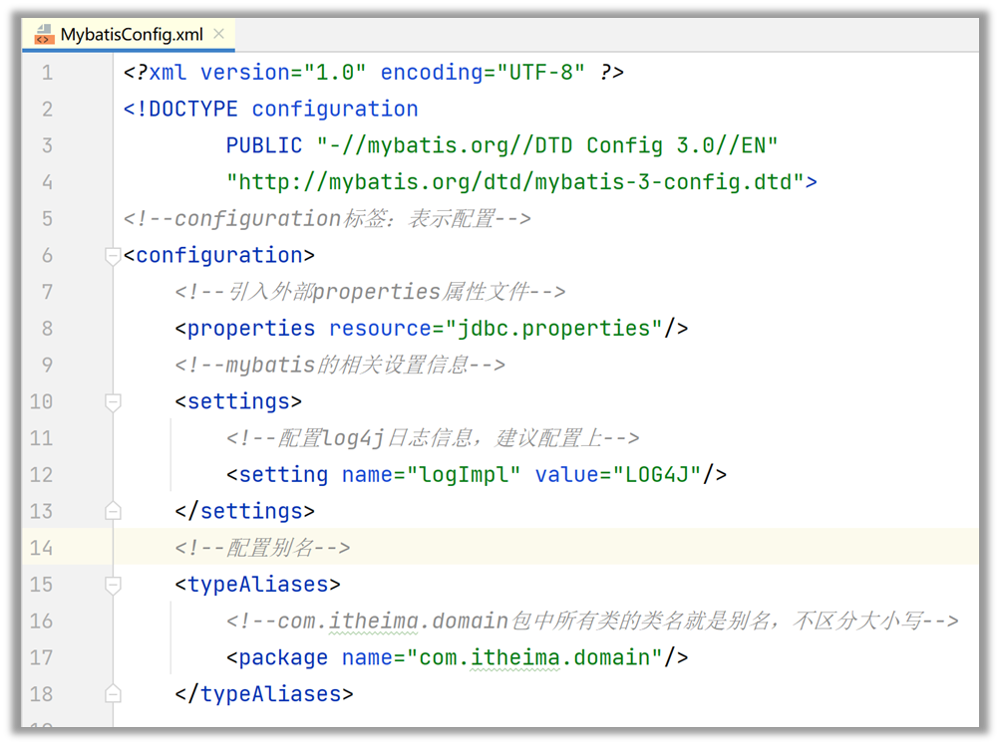

```XML
<?xml version="1.0" encoding="utf-8" ?>
<!--注释快捷键：ctrl+/  或者 ctrl+shift+/ -->
<!--根标签：最外层的标签叫根标签，有且仅有一个-->
<students>
    <!--标签的属性语法： 属性名="属性值" 多组属性用空格隔开-->
    <student id="1">
        <name>张三</name>
        <age>23</age>
        <address>武汉</address>
    </student>

    <student id="2">
        <name>李四</name>
        <age>24</age>
        <address>成都</address>
    </student>

    <student id="3">
        <name>王五</name>
        <age>25</age>
        <address>郑&lt;州</address>
<!--        <address><![CDATA[郑<州]]></address>-->
    </student>
</students>
```

## 2.文件解析\-读数据

使用程序读取XML文件中的数据

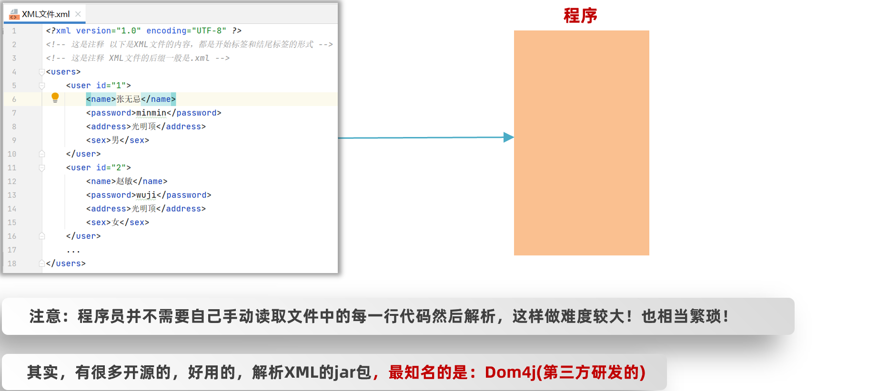

Dom4j解析XML\-得到Document对象

SAXReader：Dom4j提供的解析器，可以认为是代表整个Dom4j框架

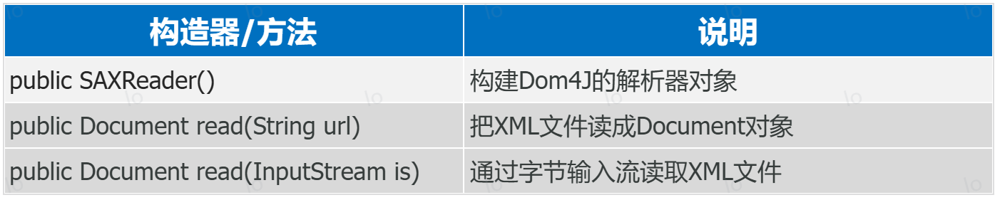

Document提供的方法


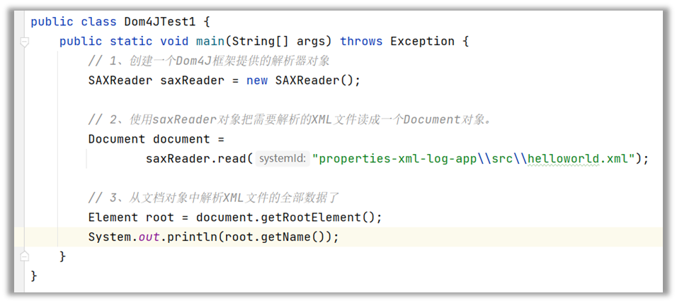

Element提供的方法

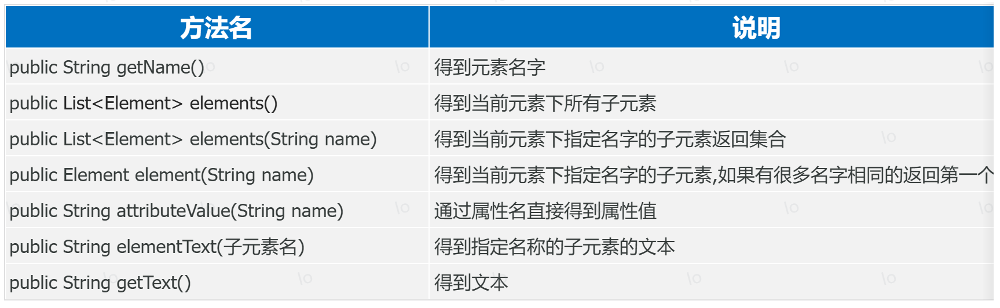

```java
public class Demo02 {
    public static void main(String[] args) throws DocumentException {
        //1 创建SAXReader解析器对象
        SAXReader saxReader = new SAXReader();
        //2 调用read方法，读取xml文件，得到Document文档对象
        Document document = saxReader.read(new File("day04-file-io-properties-xml/student.xml"));
        //3 通过Document文档对象获取根标签对象
        Element rootElement = document.getRootElement();  //<students>标签
        //4 通过根标签对象获取所有名称叫student的子标签对象(集合)
        List<Element> studentList = rootElement.elements("student");
        //5 遍历子标签组成的集合，获取每个student标签内的id、name、age、address并打印
        for (Element studentElement : studentList) {  //<student id="1">、<student id="2">、...
            //System.out.println(studentElement);
            //获取id属性、name、age、address子标签的文本
            String id = studentElement.attributeValue("id");
            String name = studentElement.elementText("name");
            String age = studentElement.elementText("age");
            String address = studentElement.elementText("address");
            System.out.println(id + " " + name + " " + age + " " + address);
        }
    }
}
```

