# 一、多线程概述

接下来我们来学习一个全新而且非常重要的知识，叫做多线程。首先聊聊什么是线程？

线程其实是程序中的一条执行路径。

我们之前写过的程序，其实都是单线程程序，如下图代码，如果前面的for循环没有执行完，for循环下面的代码是不会执行的。

怎样的程序才是多线程程序呢？ 如下图所示，12306网站就是支持多线程的，因为同时可以有很多人一起进入网站购票，而且每一个人互不影响。


再比如百度网盘，可以同时下载或者上传多个文件。这些程序中其实就有多条执行路径，每一条执行执行路径就是一条线程，所以这样的程序就是多线程程序。

认识了什么是多线程程序，那如何使用java创建线程呢？ java提供了几种创建线程的方式。

# 二、线程的创建方式

## 1.继承Thread类

java为开发者提供了一个类叫做Thread，此类的对象用来表示线程。

创建线程并执行线程的步骤如下

1. 定义一个子类继承Thread类，并重写run方法

2. 创建Thread的子类对象

3. 调用start方法启动线程（启动线程后，会自动执行run方法中的代码）

代码如下

```java
//1 定义一个类MyThread继承线程类java.lang.Thread，重写run()方法
public class MyThread extends Thread{
	//在此方法中定义线程要做的事，将来启动MyThread线程之后该方法会自动指向
    @Override
    public void run() {
        //super.run();  //调用父类的run方法，如果不需要可以注释掉或者删掉。
        for (int i = 0; i < 10; i++) {
            System.out.println("子线程执行了...");
        }
    }
}
```

```java
public class Demo {
    public static void main(String[] args) {
        //2 创建MyThread类的对象
        MyThread myThread = new MyThread();
        //3 调用线程对象的start(方法启动线程（启动后自动执行run()方法）
        myThread.start();
        //注意1：直接调用run()方法会把run()方法当成普通方法执行，此时相当于还是单线程执行。只有调用start()方法才是启动一个新的线程执行
        //myThread.run();

        //注意2：不要把主线程任务放在启动子线程之前，这样主线程一直是先跑完的，相当于是一个单线程的效果了。
        //让主线程也打印10次"主线程(main)执行了"
        for (int i = 0; i < 10; i++) {
            System.out.println("主线程(main)执行了...");
        }
    }
}
```

打印结果如下图所示，我们会发现MyThread和main线程在相互抢夺CPU的执行权（注意：哪一个线程先执行，哪一个线程后执行，目前我们是无法控制的，每次输出结果都会不一样）

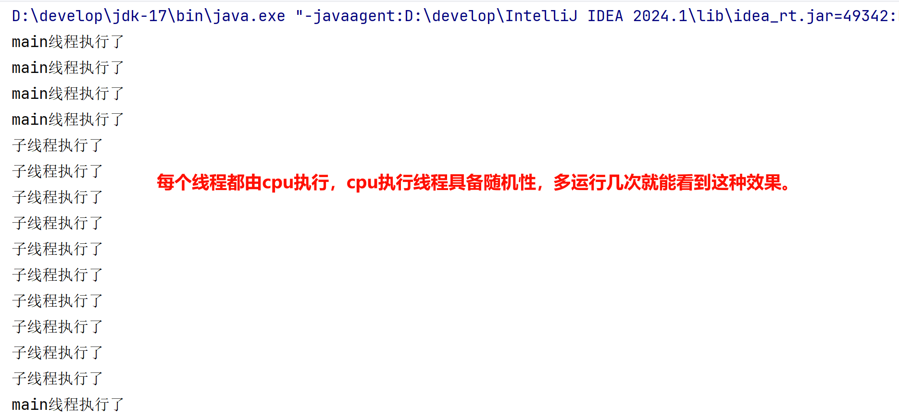

注意事项:

1.启动线程必须是调用start方法，不是调用run方法。

如果直接调用run方法就不认为是一条线程启动了，而是把Thread当做一个普通对象，此时run方法中 的执行的代码会成为主线程的一部分。

2.不要把主线程任务放在启动子线程之前。

这样主线程一直是先跑完的，相当于是一个单线程的效果了。

## 2.Runnable接口

接下来我们学习线程的第二种创建方式。java为开发者提供了一个`Runnable`接口，该接口中只有一个`run`方法，意思就是通过`Runnable`接口的实现类对象专门来表示线程要执行的任务。

Runnable接口的使用方式有两种 : 

1. 创建一个类实现Runnable接口

2. 使用匿名内部类

具体步骤如下

1. 先写一个`Runnable`接口的实现类，重写run方法\(这里面就是线程要执行的代码\)
2. 再创建一个`Runnable`实现类的对象
3. 创建一个`Thread`对象，把Runnable实现类的对象传递给`Thread`
4. 调用Thread对象的start\(\)方法启动线程（启动后会自动执行Runnable里面的run方法）


代码如下：

```java
//1 定义一个线程任务类MyRunnable实现Runnable接口，重写run方法
public class MyRunnable implements Runnable{
    //线程启动后，该方法自动执行，在方法中定义线程要做的事。
    @Override
    public void run() {
        for (int i = 0; i < 10; i++) {
            System.out.println("子线程执行了");
        }
    }
}
```

```java
public class Demo {
    public static void main(String[] args) {
        /*//2 创建MyRunnable任务对象
        MyRunnable runnable = new MyRunnable();
        //3 创建Thread对象，把MyRunnable任务对象交给Thread处理(通过Thread构造器传递)。
        Thread thread = new Thread(runnable);
        //4 调用线程对象的start()方法启动线程
        thread.start();*/
        
        //程序优化：使用匿名内部类代替MyRunnable实现类
        /*new Thread(new Runnable() {
            @Override
            public void run() {
                for (int i = 0; i < 10; i++) {
                    System.out.println("子线程执行了...");
                }
            }
        }).start();*/

        //程序优化：使用lambda表达式代替匿名内部类
        new Thread(() -> {
            for (int i = 0; i < 10; i++) {
                System.out.println("子线程执行了");
            }
        }).start();

        //需求：循环打印10次主线程执行了
        for (int i = 0; i < 10; i++) {
            System.out.println("main线程执行了");
        }
    }
}
```

运行上面代码，结果如下图所示（注意：没有出现下面交替执行的效果也是一种情况，也是正常的）


## 3.Callable接口

接下来，我们学习线程的第三种创建方式。已经有两种了为什么还有要第三种呢？ 

这样，我们先分析一下前面两种都存在的一个问题。

如果线程执行完毕后有一些数据需要返回，他们重写的run方法均不能直接返回结果。

怎么解决这个问题呢?

JDK5提供了Callable接口和FutureTask类来创建线程，它最大的优点就是有返回值。

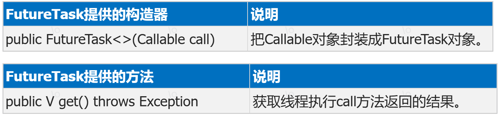

在Callable接口中有一个call方法，重写call方法就是线程要执行的代码，它是有返回值的

```java
接口中包含call方法 
    public T call(){
        ...线程执行的代码...
        return 结果;
    }
```

第三种创建线程的方式，步骤如下

1. 先定义一个Callable接口的实现类，重写call方法

2. 创建Callable实现类的对象

3. 创建FutureTask类的对象，将Callable对象传递给FutureTask

4. 创建Thread对象，将Future对象传递给Thread

5. 调用Thread的start\(\)方法启动线程\(启动后会自动执行call方法\)

6. 等call\(\)方法执行完之后，会自动将返回值结果封装到FutrueTask对象中

7. 调用FutrueTask对的get\(\)方法获取返回结果

代码如下：

```java
//1.1 定义一个类实现Callable接口，重写call方法，封装要做的事情，和要返回的数据。
public class MyCallable implements Callable<Integer> {  //泛型表示返回的结果类型
    /**
      相当于之前的run方法，定义线程要做的事
     * @return 可以返回线程执行完之后的结果
     * @throws Exception
     */
    @Override
    public Integer call() throws Exception {
        for (int i = 0; i < 10; i++) {
            System.out.println("子线程执行了");
        }
        //计算1~100之间的数字之和并返回
        int sum = 0;
        for (int i = 1; i <= 100; i++) {
            sum += i;
        }
        return sum;
    }
}
```

```java
public class Demo {
    public static void main(String[] args) throws ExecutionException, InterruptedException {
        //1.2 把Callable类型的对象封装成FutureTask（线程任务对象）。
        FutureTask<Integer> futureTask = new FutureTask<>(new MyCallable());
        //2 创建Thread对象，把FutureTask任务对象交给Thread对象。
        Thread thread = new Thread(futureTask);
        //3 调用Thread对象的start方法启动线程。
        thread.start();

        //需求：循环打印10次主线程执行了。当循环到5时，获取子线程执行完毕的结果。
        for (int i = 0; i < 10; i++) {
            System.out.println("main线程执行了");
            //当i=5时，获取子线程执行完毕的结果。
            if (i == 5) {
                //get()方法是一个阻塞的方法，如果子线程没有执行完，get()方法后面的代码都不会执行，需要等到子线程返回结果后才可以继续往下执行。
                Integer sum = futureTask.get();
                System.out.println("sum = " + sum);
            }
        }
    }
}
```

效果如图:

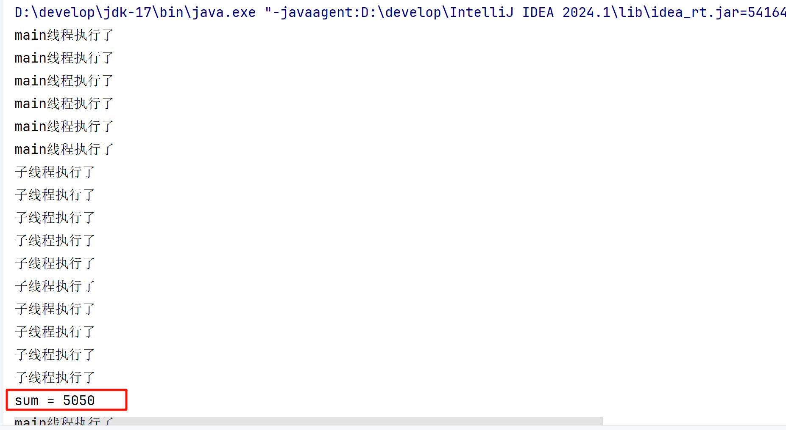

## 4.三种优缺点比较

请对对比说一下三种线程的创建方式，和不同点？

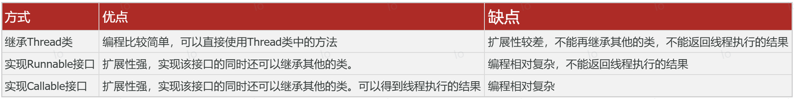

# 三、线程常用方法

前面我们提到过Thread类表示线程类,那都具备哪些常用的功能呢?我们来学习一下

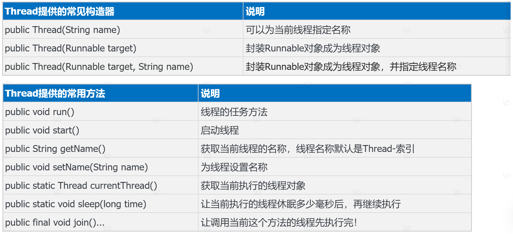

下面我们演示一下构造,getName\(\),start\(\),run\(\)这些方法的使用效果。

```java
public class Demo01 {
    public static void main(String[] args) {
        //需求1：创建子线程对象，并启动
        new Thread(()->{
            for (int i = 0; i < 10; i++) {
                //获取当前线程对象，并调用getName方法获取线程名称，默认线程名称是Thread-索引
                String name = Thread.currentThread().getName();
                System.out.println(name+" 子线程执行了");
            }
        }).start();
        //需求2：创建子线程对象，名称叫 "播妞" 并启动
        new Thread(()->{
            for (int i = 0; i < 10; i++) {
                //获取当前线程对象，并调用getName方法获取线程名称，默认线程名称是Thread-索引
                String name = Thread.currentThread().getName();
                System.out.println(name+" 子线程执行了");
            }
        },"播妞").start();

        //需求：循环打印10次主线程执行了
        for (int i = 0; i < 10; i++) {
            String name = Thread.currentThread().getName();  //获取主线程名称
            System.out.println(name+"线程执行了");
        }
    }
}
```

执行上面代码，效果如下图所示，我们发现每一条线程都有自己了名字了。


然后再演示一下sleep这个方法是什么效果。

```java
public class Demo02 {
    public static void main(String[] args) throws InterruptedException {
        for (int i = 0; i < 10; i++) {
            //static void sleep(long time)：让当前线程休眠指定的时间后再继续执行，单位为毫秒
            Thread.sleep(1000);
            System.out.println("奥里给！！！");
        }
    }
}
```

通过观察发现sleep方法：让当前执行的线程进入休眠状态，直到时间到了，才会继续执行。

最后再演示一下join这个方法是什么效果。

```java
public class Demo02 {
    public static void main(String[] args) throws InterruptedException {
        /*for (int i = 0; i < 10; i++) {
            //static void sleep(long time)：让当前线程休眠指定的时间后再继续执行，单位为毫秒
            Thread.sleep(1000);
            System.out.println("奥里给！！！");
        }*/

        Thread t1 = new Thread(() -> {
            for (int i = 0; i < 10; i++) {
                //获取当前线程对象，并调用getName方法获取线程名称，默认线程名称是Thread-索引
                String name = Thread.currentThread().getName();
                System.out.println(name + " 子线程执行了");
            }
        });

        //需求2：创建子线程对象，名称叫 "播妞" 并启动
        Thread t2 = new Thread(() -> {
            for (int i = 0; i < 10; i++) {
                //获取当前线程对象，并调用getName方法获取线程名称，默认线程名称是Thread-索引
                String name = Thread.currentThread().getName();
                System.out.println(name + " 子线程执行了");
            }
        }, "播妞");

        t2.start();
        //join方法：调用该方法的线程优先执行完毕
        t2.join();
        //先启动t2线程，后启动t1线程
        t1.start();
    }
}
```

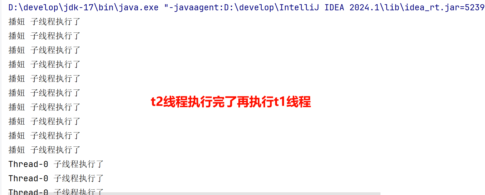

# 四、线程安全问题

各位小伙伴，前面我们已经学习了如何创建线程，以及线程的常用方法。接下来，我们要学习一个在实际开发过程中，使用线程时最重要的一个问题，叫线程安全问题。

## 1.线程安全问题概述

首先，什么是线程安全问题呢？

线程安全问题指的是，多个线程同时操作同一个共享资源，且存在修改动作时，可能会出现业务安全问题。

下面通过一个取钱的案例给同学们演示一下。

案例需求如下

场景：小明和小红是一对夫妻，他们有一个共享账户，余额是10万元，小红和小明同时来取钱，并且2人各自都在取钱10万元，可能出现什么问题呢？

如下图所示，小明和小红假设都是一个线程，本类每个线程都应该执行完三步操作，才算是完成的取钱的操作。


但是真实执行过程可能是下面这样子的

1. 小红线程只执行了判断余额是否足够（条件为true），然后CPU的执行权就被小红线程抢走了。

2. 小红线程也执行了判断了余额是否足够（条件也是true）, 然后CPU执行权又被小明线程抢走了。

3. 小明线程由于刚才已经判断余额是否足够了，直接执行第2步，吐出了10万元钱，此时共享账户月为0。然后CPU执行权又被小红线程抢走。

4. 小红线程由于刚刚也已经判断余额是否足够了，直接执行第2步，吐出了10万元钱，此时共享账户月为\-10万。

你会发现，在这个取钱案例中，两个人把共享账户的钱都取了10万，但问题是只有10万块钱啊！！！

以上取钱案例中的问题，就是线程安全问题的一种体现。

线程安全问题出现的原因:

1. 存在多个线程在同时执行

2. 同时访问一个共享资源

3. 存在修改该共享资源

## 2.线程安全问题的代码演示

案例需求:

小明和小红是一对夫妻，他们有一个共享账户，余额是10万元，小红和小明同时来取钱，并且2人各自都在取钱10万元，可能出现什么问题呢？

分析:

1.怎样描述小明和小红的共同账户呢？

设计一个账户类，创建一个账户对象，代表2人的共享账户。

2.怎样模拟两人同时取钱？

设计一个线程类，创建并启动两个线程，在线程的run方法中调用账户的取钱方法。

先定义一个共享的账户类

```java
@Data
@AllArgsConstructor
@NoArgsConstructor
public class Account {
    private String cardId; // 卡号
    private double money; // 余额

    // 小明和小红都到这里来了取钱
    public void drawMoney(double money) {
        // 拿到当前谁来取钱。
        String name = Thread.currentThread().getName();
        // 判断余额是否足够
        if (this.money >= money) {
            // 余额足够，取钱
            System.out.println(name + "取钱成功，吐出了" + money + "元成功！");
            // 更新余额
            this.money -= money;
            System.out.println(name + "取钱成功，取钱后，余额剩余" + this.money + "元");

        } else {
            // 余额不足
            System.out.println(name + "取钱失败，余额不足");
        }
    }
}
```

再定义一个是取钱的线程类

```java
// 取钱线程类
public class DrawThread extends Thread{
    private Account acc; // 记住线程对象要处理的账户对象。

    public DrawThread(String name, Account acc) {
        super(name);
        this.acc = acc;
    }

    @Override
    public void run() {
        // 小明 小红 取钱
        acc.drawMoney(100000);
    }
}
```

注意:为保障账户唯一性,所以账户需要设置为成员变量,并在构造中进行传递。

最后，再写一个测试类，在测试类中创建两个线程对象

```java
public class ThreadDemo1 {
    public static void main(String[] args) {
        // 目标：模拟线程安全问题。
        // 1、设计一个账户类：用于创建小明和小红的共同账户对象，存入10万。
        Account acc = new Account("ICBC-110", 100000);

        // 2、设计线程类：创建小明和小红两个线程，模拟小明和小红同时去同一个账户取款10万。
        new DrawThread("小明", acc).start();
        new DrawThread("小红", acc).start();
    }
}
```

运行程序，执行效果如下。你会发现两个人都取了10万块钱，余额为\-10完了。

## 3.多个窗口共卖100张票案例


需求：

某一趟火车还剩下100张票，现在有三个窗口同时卖票，请使用多线程实现各个窗口的卖票情况，要求剩余票数为0时就停止卖票。

分析：

1. 三个窗口同时卖票，可以使用三个线程来模拟这三个窗口。
2. 三个窗口共卖这100张票，相当于做同一个任务，因此需要一个Runnable任务对象。
3. 在任务对象中重写run方法，定义卖票逻辑，只有当剩余票数大于0才可以卖票。
4. 启动三个线程开始卖票，观察打印结果。

```java
public class Demo {
    public static void main(String[] args) {
        //2 三个窗口共卖这100张票，相当于做同一个任务，因此需要一个Runnable任务对象。
        Runnable runnable = new Runnable() {
            //3.1 定义变量ticket初始值位100，表示总票数
            private int ticket = 100;

            @Override
            public void run() {
                //3 在任务对象中重写run方法，定义卖票逻辑，只有当剩余票数大于0才可以卖票。
                //3.2 定义while死循环，表示线程一直卖票
                while (true) {
                    try {
                        //为了更清晰的看到卖票过程，所以用了一个休眠
                        Thread.sleep(20);
                    } catch (InterruptedException e) {
                        e.printStackTrace();
                    }
                    //3.3 在循环中判断票数大于0，打印哪个线程卖了第几张票，卖完之后票数-1
                    if(ticket>0){
                        //打印哪个线程卖了第几张票
                        String name = Thread.currentThread().getName();
                        System.out.println(name+"正在卖第"+ticket+"张票");
                        //卖完之后票数-1
                        ticket--;
                    }else{
                        //3.4 如果票数不大于0了，就结束循环
                        break;
                    }
                }
            }
        };
        //1 三个窗口同时卖票，可以使用三个线程来模拟这三个窗口。
        Thread t1 = new Thread(runnable,"窗口1");
        Thread t2 = new Thread(runnable,"窗口2");
        Thread t3 = new Thread(runnable,"窗口3");
        //4 启动三个线程开始卖票，观察打印结果。
        t1.start();
        t2.start();
        t3.start();
    }
}
```

## 4.线程同步方案

为了解决前面的线程安全问题，我们可以使用线程同步思想。

线程同步的核心思想为:

让多个线程先后依次访问共享资源，这样就可以避免出现线程安全问题。

最常见的是加锁方案:

加锁：每次只允许一个线程加锁，加锁后才能进入访问，访问完毕后自动解锁，然后其他线程才能再加锁进来。

举例说明:

假设小明先执行共享资源,这个时候小红只能等待,等小明线程执行完了，把余额改为0，出去了就会释放锁。

这时小红线程就可以加锁进来执行，就不会出现负10W了。如下图所示。


采用加锁的方案，就可以解决前面两个线程都取10万块钱的问题。怎么加锁呢？java提供了三种方案

1\.同步代码块

2\.同步方法

3\.Lock锁

### 4.1.同步代码块

我们先来学习同步代码块。

作用：把访问共享资源的核心代码给上锁，以此保证线程安全。

格式:

```java
synchronized(同步锁) { 
   访问共享资源的核心代码
}
```

原理：每次只允许一个线程加锁后进入，执行完毕后自动解锁，其他线程才可以进来执行。

实现方案代码:

```java
@Data
@AllArgsConstructor
@NoArgsConstructor
public class Account {
    private String cardId; // 卡号
    private double money; // 余额

    // 小明和小红都到这里来了取钱
    public void drawMoney(double money) {
        // 拿到当前谁来取钱。
        String name = Thread.currentThread().getName();
        // 判断余额是否足够
        synchronized (this) {
            if (this.money >= money) {
                // 余额足够，取钱
                System.out.println(name + "取钱成功，吐出了" + money + "元成功！");
                // 更新余额
                this.money -= money;
                System.out.println(name + "取钱成功，取钱后，余额剩余" + this.money + "元");

            } else {
                // 余额不足
                System.out.println(name + "取钱失败，余额不足");
            }
        }
    }
}
```

此时再运行测试类，观察是否会出现不合理的情况。

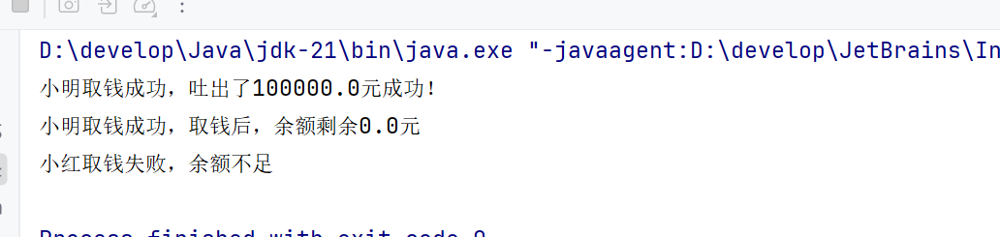

最后，再给同学们说一下锁对象如何选择的问题

- 建议把共享资源作为锁对象, 不要将随便无关的对象当做锁对象

- 对于实例方法，建议使用this作为锁对象

- 对于静态方法，建议把类的字节码\(类名\.class\)当做锁对象

### 4.2.售票案例(同步代码块)

```java
public class Demo01 {
    public static void main(String[] args) {
//2 三个窗口共卖这100张票，相当于做同一个任务，因此需要一个Runnable任务对象。
        Runnable runnable = new Runnable() {
            //3.1 定义变量ticket初始值位100，表示总票数
            private int ticket = 100;
            //确保多个线程使用的是同一个锁对象即可，锁对象可以是任意对象。
            private Object obj = new Object();

            @Override
            public void run() {
                //3 在任务对象中重写run方法，定义卖票逻辑，只有当剩余票数大于0才可以卖票。
                //3.2 定义while死循环，表示线程一直卖票
                while (true) {
                    try {
                        Thread.sleep(20);
                    } catch (InterruptedException e) {
                        e.printStackTrace();
                    }
                    //1 锁对象可以是任意对象,只要确保多个线程使用的是同一个对象即可
                    //synchronized (obj) {  //obj是锁对象
                    //2 this表示当前runnable对象，由于多个线程用的是同一个runnable对象，所以此处this可以作为锁对象。
                    //synchronized (this) {
                   //3 Class<Demo01> aClass = Demo01.class; //jvm将class文件加载进内存就会生成一个Class对象，一个class文件对应一个Class对象。这个Class对象就可以作为锁对象。
                    synchronized (Demo01.class) {
                        //3.3 在循环中判断票数大于0，打印哪个线程卖了第几张票，卖完之后票数-1
                        if (ticket > 0) {
                            //打印哪个线程卖了第几张票
                            String name = Thread.currentThread().getName();
                            System.out.println(name + "正在卖第" + ticket + "张票");
                            //卖完之后票数-1
                            ticket--;
                        } else {
                            //3.4 如果票数不大于0了，就结束循环
                            break;
                        }
                    }
                }
            }
        };
        //1 三个窗口同时卖票，可以使用三个线程来模拟这三个窗口。
        Thread t1 = new Thread(runnable, "窗口1");
        Thread t2 = new Thread(runnable, "窗口2");
        Thread t3 = new Thread(runnable, "窗口3");
        //4 启动三个线程开始卖票，观察打印结果。
        t1.start();
        t2.start();
        t3.start();
    }
}
```

### 4.3.同步方法

接下来，学习同步方法解决线程安全问题。

作用：把访问共享资源的核心方法给上锁，以此保证线程安全。

格式:

```java
修饰符 synchronized 返回值类型 方法名称(形参列表) {
      操作共享资源的代码
}
```

原理：每次只能一个线程进入，执行完毕以后自动解锁，其他线程才可以进来执行。

代码演示

```java
@Data
@AllArgsConstructor
@NoArgsConstructor
public class Account {
    private String cardId; // 卡号
    private double money; // 余额

    // 小明和小红都到这里来了取钱
    public synchronized void drawMoney(double money) {
        // 拿到当前谁来取钱。
        String name = Thread.currentThread().getName();
        // 判断余额是否足够
        if (this.money >= money) {
            // 余额足够，取钱
            System.out.println(name + "取钱成功，吐出了" + money + "元成功！");
            // 更新余额
            this.money -= money;
            System.out.println(name + "取钱成功，取钱后，余额剩余" + this.money + "元");

        } else {
            // 余额不足
            System.out.println(name + "取钱失败，余额不足");
        }
    }
}
```

改完之后，再次运行测试类，观察是否会出现不合理的情况。

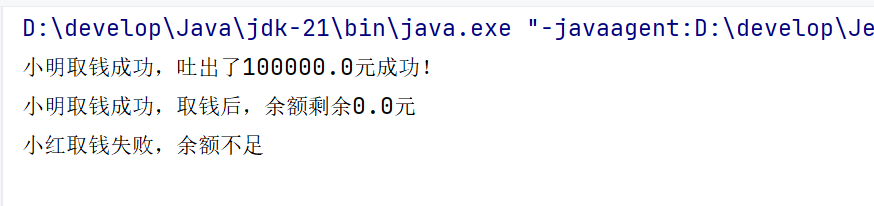

接着，再问同学们一个问题，同步方法有没有锁对象？锁对象是谁？

同步方法也是有锁对象，只不过这个锁对象没有显示的写出来而已。

- 对于实例方法，锁对象其实是this（也就是方法的调用者）

- 对于静态方法，锁对象时类的字节码对象（类名\.class）

最终，总结一下同步代码块和同步方法有什么区别？

1. 不存在哪个好与不好，只是一个锁住的范围大，一个范围小

2. 同步方法是将方法中所有的代码锁住

3. 同步代码块是将方法中的部分代码锁住

### 4.4.售票案例(同步方法)

```java
public class Demo02 {
    public static void main(String[] args) {
        //2 三个窗口共卖这100张票，相当于做同一个任务，因此需要一个Runnable任务对象。
        Runnable runnable = new Runnable() {
            //3.1 定义变量ticket初始值位100，表示总票数
            private static int ticket = 100; //如果同步方法是static修饰的，那么变量也得static

            @Override
            public void run() {
                //3 在任务对象中重写run方法，定义卖票逻辑，只有当剩余票数大于0才可以卖票。
                //3.2 定义while死循环，表示线程一直卖票
                while (true) {
                    try {
                        Thread.sleep(20);
                    } catch (InterruptedException e) {
                        e.printStackTrace();
                    }
                    //调用sellTicket同步方法，对操作共享数据的代码加锁
                    sellTicket();
                    //判断票数如果不大于0，就结束循环
                    if(ticket==0){
                        break;
                    }
                }
            }
            //private synchronized void sellTicket(){
            private static synchronized void sellTicket(){
                //3.3 在循环中判断票数大于0，打印哪个线程卖了第几张票，卖完之后票数-1
                if(ticket>0){
                    //打印哪个线程卖了第几张票
                    String name = Thread.currentThread().getName();
                    System.out.println(name+"正在卖第"+ticket+"张票");
                    //卖完之后票数-1
                    ticket--;
                }
            }
        };

        //1 三个窗口同时卖票，可以使用三个线程来模拟这三个窗口。
        Thread t1 = new Thread(runnable,"窗口1");
        Thread t2 = new Thread(runnable,"窗口2");
        Thread t3 = new Thread(runnable,"窗口3");
        //4 启动三个线程开始卖票，观察打印结果。
        t1.start();
        t2.start();
        t3.start();
    }
}
```

### 4.5.Lock锁

接下来，我们再来学习一种，线程安全问题的解决办法，叫做Lock锁。

它是JDK5开始提供的一个新的锁定操作，通过它可以创建出锁对象进行加锁和解锁，更灵活、更方便、更强大。

Lock是接口，不能直接实例化，可以采用它的实现类ReentrantLock来构建Lock锁对象。

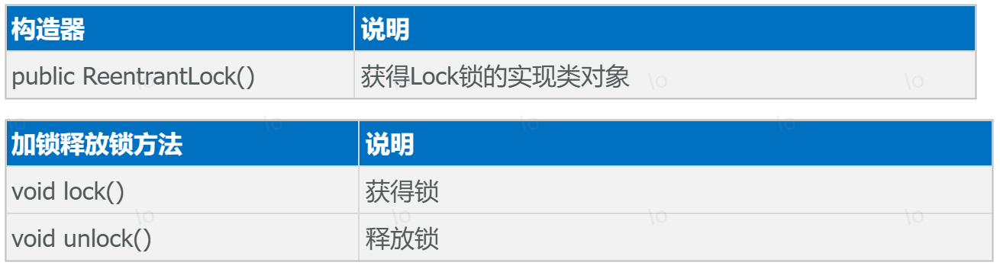

使用格式:

1.首先在成员变量位置，创建一个Lock接口的实现类对象（这个对象就是锁对象）

```java
private final Lock lk = new ReentrantLock();
```

2.在需要上锁的地方加入下面的代码

```java
lk.lock(); // 加锁
     //...中间是被锁住的代码...
     lk.unlock(); // 解锁
```

使用Lock锁改写前面DrawThread中取钱的方法，代码如下

```java
@Data
@AllArgsConstructor
@NoArgsConstructor
public class Account {
    private String cardId; // 卡号
    private double money; // 余额
    private final Lock lk = new ReentrantLock(); // 保护锁对象

    // 小明和小红都到这里来了取钱
    public void drawMoney(double money) {
        // 拿到当前谁来取钱。
        String name = Thread.currentThread().getName();
        lk.lock(); // 上锁
        try {
            // 判断余额是否足够
            if (this.money >= money) {
                // 余额足够，取钱
                System.out.println(name + "取钱成功，吐出了" + money + "元成功！");
                // 更新余额
                this.money -= money;
                System.out.println(name + "取钱成功，取钱后，余额剩余" + this.money + "元");
            } else {
                // 余额不足
                System.out.println(name + "取钱失败，余额不足");
            }
        } finally {
            lk.unlock();// 解锁
        }
    }
}
```

运行程序结果，观察是否有线程安全问题。

到此三种解决线程安全问题的办法我们就学习完了。

### 4.6.售票案例(Lock锁)

```java
public class Demo03 {
    public static void main(String[] args) {
        //2 三个窗口共卖这100张票，相当于做同一个任务，因此需要一个Runnable任务对象。
        Runnable runnable = new Runnable() {
            //3.1 定义变量ticket初始值位100，表示总票数
            private int ticket = 100;
            //①、创建Lock锁对象，使用的是ReentrantLock实现类
            private Lock lock = new ReentrantLock();  //多态的体现

            @Override
            public void run() {
                //3 在任务对象中重写run方法，定义卖票逻辑，只有当剩余票数大于0才可以卖票。
                //3.2 定义while死循环，表示线程一直卖票
                while (true) {
                    try {
                        Thread.sleep(20);
                    } catch (InterruptedException e) {
                        e.printStackTrace();
                    }
                    //②、加锁
                    lock.lock();
                    //3.3 在循环中判断票数大于0，打印哪个线程卖了第几张票，卖完之后票数-1
                    if(ticket>0){
                        //打印哪个线程卖了第几张票
                        String name = Thread.currentThread().getName();
                        System.out.println(name+"正在卖第"+ticket+"张票");
                        //卖完之后票数-1
                        ticket--;
                        //③、解锁(释放锁)
                        lock.unlock();
                    }else{
                        //③、解锁(释放锁)
                        lock.unlock();
                        //3.4 如果票数不大于0了，就结束循环
                        break;
                    }
                }
            }
        };
        //1 三个窗口同时卖票，可以使用三个线程来模拟这三个窗口。
        Thread t1 = new Thread(runnable,"窗口1");
        Thread t2 = new Thread(runnable,"窗口2");
        Thread t3 = new Thread(runnable,"窗口3");
        //4 启动三个线程开始卖票，观察打印结果。
        t1.start();
        t2.start();
        t3.start();
    }
}
```

# 五、线程生命周期

## 1.状态介绍

线程生命周期指的是一个线程从创建到销毁所经历的不同状态变化过程。在java中，线程的生命周期由java\.lang\.Thread类定义，并通过Thread\.State枚举明确标识了线程可能处于的6种状态：

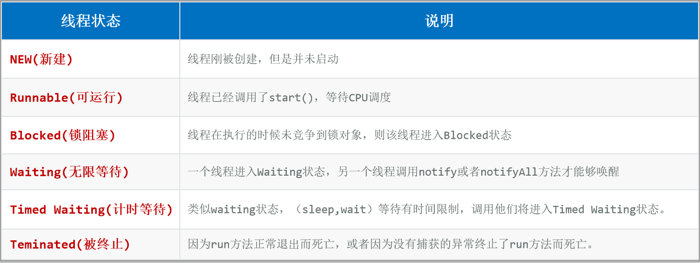

状态切换流程如下：

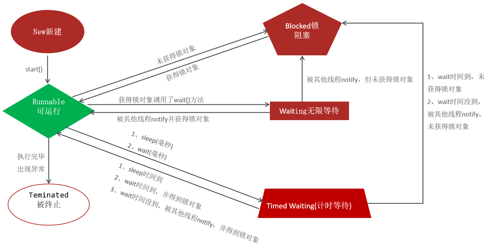

## 2.状态变化案例

```java
/*
    线程的生命周期：线程从创建都结束经历的各个状态叫线程的生命周期，且各个状态之间可以相互转换。
    NEW：新建，创建完一个线程对象之后就是NEW状态，启动之前。
    RUNNABLE：就绪(可运行)，调用start()方法之后，线程进入就绪状态，等待CPU调度，CPU调度之后，线程进入运行状态。
    TERMINATED：终止状态，线程运行结束或者中途出现一次了，都进入终止状态。
    BLOCKED：锁阻塞，线程在执行的时候未竞争到锁对象，则该线程进入Blocked状态
    WAITING：无限等待，线程中使用锁对象.wait()该线程就进入无限等待状态，直到另一个线程调用notify或者notifyAll方法才能够唤醒
    TIMED WAITING：计时等待，类似waiting状态，(sleep,wait)等待有时间限制，调用他们将进入Timed Waiting状态。
 */
public class Demo04 {
    public static void main(String[] args) throws InterruptedException {
        Object obj = new Object();  //锁对象
        //子线程
        Thread thread = new Thread(() -> {
            for (int i = 0; i < 10; i++) {
                System.out.println("子线程执行了");
            }

            /*synchronized (obj) {
                try {
                    //wait()方法必须在同步代码块/同步方法中使用锁对象调用，表示当前线程无限等待，直到被其它线程唤醒
                    obj.wait();
                } catch (InterruptedException e) {
                    throw new RuntimeException(e);
                }
            }*/
            try {
                Thread.sleep(3000);  //休眠3000毫秒，在主线程中打印子线程的状态TIMED_WAITING(计时等待)
            } catch (InterruptedException e) {
                throw new RuntimeException(e);
            }
        });
        //获取子线程的状态并打印
        System.out.println("子线程的状态 = " + thread.getState());    //NEW(新建)

        thread.start();
        System.out.println("子线程的状态 = " + thread.getState());    //RUNNABLE(可运行)


        //主线程：需求：循环打印10次主线程执行了
        for (int i = 0; i < 10; i++) {
            System.out.println("main线程执行了");
        }
        //Thread.sleep(20);  //等待10毫秒，让子线程执行完毕
        //System.out.println("子线程的状态 = " + thread.getState());    //TERMINATED(终止)

        //如果子线程中使用了 锁对象.wait()方法，那么状态就是WAITING(无限等待)，直到其它线程唤醒它
        //Thread.sleep(20);
        //System.out.println("子线程状态 = " + thread.getState()); //WAITING

        //打印完子线程的WAITING状态之后，主线程开始唤醒子线程，重新打印子线程的状态 BLOCKED
        /*synchronized (obj){
            //notify()方法必须在同步代码块/同步方法中使用锁对象调用，表示唤醒调用wait()方法的线程
            obj.notify();
        }
        //唤醒子线程之后，子线程的状态可能是BLOCKED(锁阻塞) 或者 RUNNABLE(可运行)
        System.out.println("子线程的状态 = " + thread.getState());    //BLOCKED(锁阻塞)*/

        //子线程休眠3秒过程中，在主线程中打印子线程的状态
        Thread.sleep(20);
        System.out.println("子线程状态 = " + thread.getState()); ////TIMED_WAITING(计时等待)
    }
}
```

输出结果如下：

```Plain Text
子线程状态 = NEW
子线程状态 = RUNNABLE
子线程执行了...
子线程状态 = WAITING
子线程状态 = BLOCKED
子线程执行了...
```

# 六、线程池

## 1.线程池概述

接下来我们学习一下线程池技术。先认识一下什么是线程池技术？ 

其实，线程池就是一个可以复用线程的技术。

不使用线程池的问题:

假设：用户每次发起一个请求给后台，后台就创建一个新的线程来处理，下次新的任务过来肯定也会创建新的线程，如果用户量非常大，创建的线程也讲越来越多。然而，创建线程是开销很大的，并且请求过多时，会严重影响系统性能。

而使用线程池，就可以解决上面的问题。

如下图所示，线程池内部会有一个容器，存储几个核心线程，假设有3个核心线程，这3个核心线程可以处理3个任务。

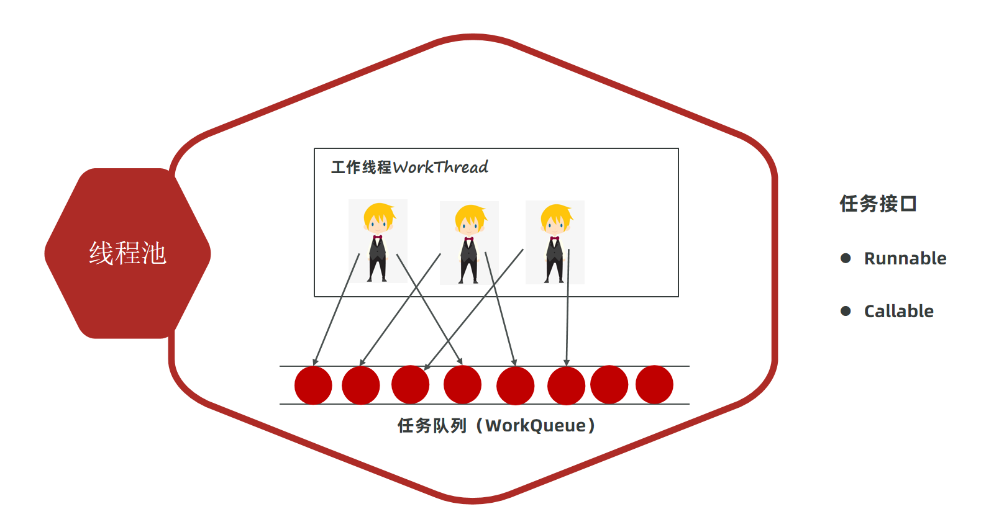

但是任务总有被执行完的时候，假设第1个线程的任务执行完了，那么第1个线程就空闲下来了，有新的任务时，空闲下来的第1个线程可以去执行其他任务。依此内推，这3个线程可以不断的复用，也可以执行很多个任务。

所以，线程池就是一个线程复用技术，它可以提高线程的利用率。

既然这么强大,那如何创建线程池对象呢?

在JDK5版本中提供了代表线程池的接口ExecutorService,那如何创建线程池对象呢，下面有两种方式提供参考:

方式一：使用ExecutorService的实现类ThreadPoolExecutor自创建一个线程池对象。

方式二：使用Executors（线程池的工具类）调用方法返回不同特点的线程池对象。

## 2.ThreadPoolExecutor创建线程池

在开发中很多时候我们都是通过,ExecutorService的实现类ThreadPoolExecutor自创建一个线程池对象来使用。

下面是它的构造器，参数比较多，不要怕，干就完了^\_^。

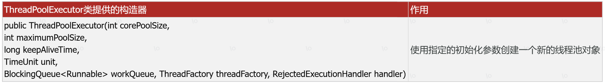

参数解释:

- corePoolSize : 指定线程池的核心线程的数量。 

- maximumPoolSize：指定线程池的最大线程数量。

- keepAliveTime ：指定临时线程的存活时间。

- unit：指定临时线程存活的时间单位\(秒、分、时、天）

- workQueue：指定线程池的任务队列。

- threadFactory：指定线程池的线程工厂。

- handler：指定线程池的任务拒绝策略（线程都在忙，任务队列也满了的时候，新任务来了该怎么处理）


接下来，用这7个参数的构造器来创建线程池的对象。代码如下

```java
/**
   ThreadPoolExecutor构造器参数：
        核心线程数，
        最大线程数，
        临时线程最大存活时间，
        存活时间的单位，
        任务队列（等待的任务），
        创建线程的线程工厂（Executors.defaultThreadFactory()），
        拒绝策略（默认策略：new ThreadPoolExecutor.AbortPolicy()）
 */
public class Demo01 {
    public static void main(String[] args){
        ThreadPoolExecutor pool = new ThreadPoolExecutor(3,    //核心线程数，
                5,  //最大线程数，
                2,  //临时线程最大存活时间，
                TimeUnit.SECONDS, //存活时间的单位
                new LinkedBlockingQueue<>(10),  //任务队列（等待的任务），最多放10个任务
                Executors.defaultThreadFactory(),  //创建线程的线程工厂
                new ThreadPoolExecutor.AbortPolicy()  //拒绝策略，默认的
        );

        System.out.println(pool);
    }
}
```

这仅仅是创建出来了线程池,该怎么使用呢?我们来学习下如何使用线程池执行线程任务。

## 3.线程池执行Runnable任务

创建好线程池之后，接下来我们就可以使用线程池执行任务了。

线程池执行的任务可以有两种，一种是Runnable任务；一种是callable任务。

下面的execute方法可以用来执行Runnable任务。

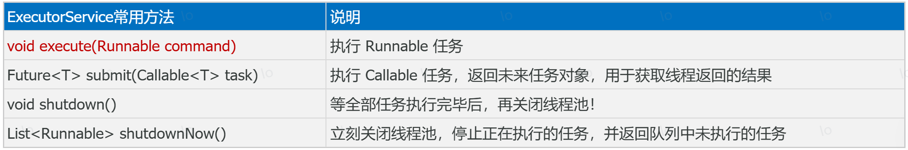

```java
/**
  ExecutorService的常用api：
    execute(Runnable runnable)：执行任务/命令，没有返回值，一般用来执行 Runnable 任务
    Future<T> submit(Callable<T> task)：执行任务，返回未来任务对象获取线程结果，一般拿来执行Callable任务
    shutdown()：等任务执行完毕后关闭线程池
    shutdownNow()：立刻关闭，停止正在执行的任务，并返回队列中未执行的任务
*/
public class Demo02 {
    public static void main(String[] args) throws ExecutionException, InterruptedException {
        //1 创建线程池对象
       ThreadPoolExecutor pool = new ThreadPoolExecutor(3,    //核心线程数，
             5,  //最大线程数，
             2,  //临时线程最大存活时间，
             TimeUnit.SECONDS, //存活时间的单位
             new LinkedBlockingQueue<>(10),  //任务队列（等待的任务），最多放10个任务
             Executors.defaultThreadFactory(),  //创建线程的线程工厂
             new ThreadPoolExecutor.AbortPolicy()  //拒绝策略
       );
       //2 执行任务
       //2.1 execute(Runnable runnable)：执行任务/命令，没有返回值，一般用来执行 Runnable 任务
       for (int i = 1; i <= 10; i++) {
          int finalI = i;  //finalI等价于final修饰，因为finalI变量只赋值了一次。每次循环都是一个新变量
          //final int finalI = i;  //final修饰的变量为最终变量
          pool.execute(()->{
             //lambda表达式中使用局部变量，变量必须是最终变量(final修饰)，或者 变量等价于最终变量(只赋值一次，没有二次赋值)
             System.out.println(Thread.currentThread().getName()+"正在执行 "+ finalI);
          });
       }

       //2.2 Future<T> submit(Callable<T> task)：执行任务，返回未来任务对象获取线程结果，一般拿来执行Callable任务
       /*for (int i = 0; i < 10; i++) {
          Future<String> future = pool.submit(() -> {
             System.out.println(Thread.currentThread().getName() + "正在执行");
             return Thread.currentThread().getName();
          });
          //获取结果。get()方法是一个阻塞的方法，如果当前线程没有返回结果，就不会继续循环
          String s = future.get();
          System.out.println("s = " + s);
       }*/

       //3 关闭线程池（在服务器程序中，一般线程不关闭）
       //3.1 shutdown()：等任务执行完毕后关闭线程池
       pool.shutdown();
       //3.2 shutdownNow()：立刻关闭，停止正在执行的任务，并返回队列中未执行的任务
       //List<Runnable> list = pool.shutdownNow();
       //list.forEach(runnable -> System.out.println(runnable));
    }
}
```

执行效果如下：

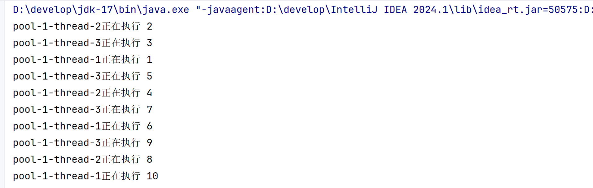

## 4.线程池执行Callable任务

接下来，我们学习使用线程池执行Callable任务。callable任务相对于Runnable任务来说，就是多了一个返回值。

执行Callable任务需要用到下面的submit方法


```java
/**
  ExecutorService的常用api：
    execute(Runnable runnable)：执行任务/命令，没有返回值，一般用来执行 Runnable 任务
    Future<T> submit(Callable<T> task)：执行任务，返回未来任务对象获取线程结果，一般拿来执行Callable任务
    shutdown()：等任务执行完毕后关闭线程池
    shutdownNow()：立刻关闭，停止正在执行的任务，并返回队列中未执行的任务
*/
public class Demo02 {
    public static void main(String[] args) throws ExecutionException, InterruptedException {
        //1 创建线程池对象
       ThreadPoolExecutor pool = new ThreadPoolExecutor(3,    //核心线程数，
             5,  //最大线程数，
             2,  //临时线程最大存活时间，
             TimeUnit.SECONDS, //存活时间的单位
             new LinkedBlockingQueue<>(10),  //任务队列（等待的任务），最多放10个任务
             Executors.defaultThreadFactory(),  //创建线程的线程工厂
             new ThreadPoolExecutor.AbortPolicy()  //拒绝策略
       );
       //2 执行任务
       //2.1 execute(Runnable runnable)：执行任务/命令，没有返回值，一般用来执行 Runnable 任务
       /*for (int i = 1; i <= 10; i++) {
          int finalI = i;  //finalI等价于final修饰，因为finalI变量只赋值了一次。每次循环都是一个新变量
          //final int finalI = i;  //final修饰的变量为最终变量
          pool.execute(()->{
             //lambda表达式中使用局部变量，变量必须是最终变量(final修饰)，或者 变量等价于最终变量(只赋值一次，没有二次赋值)
             System.out.println(Thread.currentThread().getName()+"正在执行 "+ finalI);
          });
       }*/

       //2.2 Future<T> submit(Callable<T> task)：执行任务，返回未来任务对象获取线程结果，一般拿来执行Callable任务
       for (int i = 0; i < 10; i++) {
          Future<String> future = pool.submit(() -> {
             System.out.println(Thread.currentThread().getName() + "正在执行");
             return Thread.currentThread().getName();
          });
          //获取结果。get()方法是一个阻塞的方法，如果当前线程没有返回结果，就不会继续循环
          String s = future.get();
          System.out.println("s = " + s);
       }

       //3 关闭线程池（在服务器程序中，一般线程不关闭）
       //3.1 shutdown()：等任务执行完毕后关闭线程池
       pool.shutdown();
       //3.2 shutdownNow()：立刻关闭，停止正在执行的任务，并返回队列中未执行的任务
       //List<Runnable> list = pool.shutdownNow();
       //list.forEach(runnable -> System.out.println(runnable));
    }
}
```

执行后，结果如下图所示

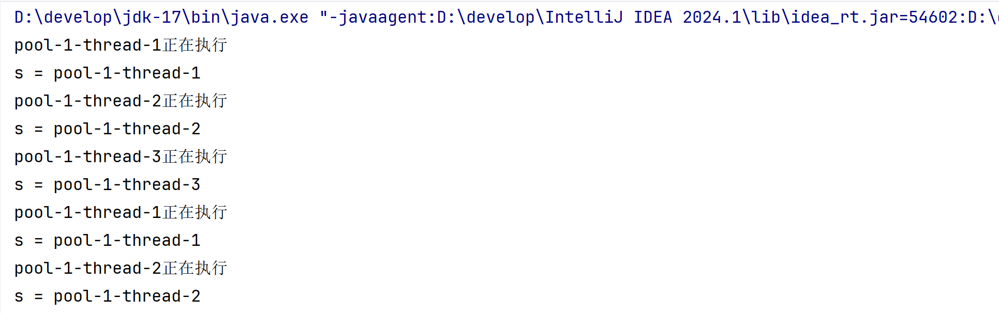

## 5.线程池的执行原理和拒绝策略

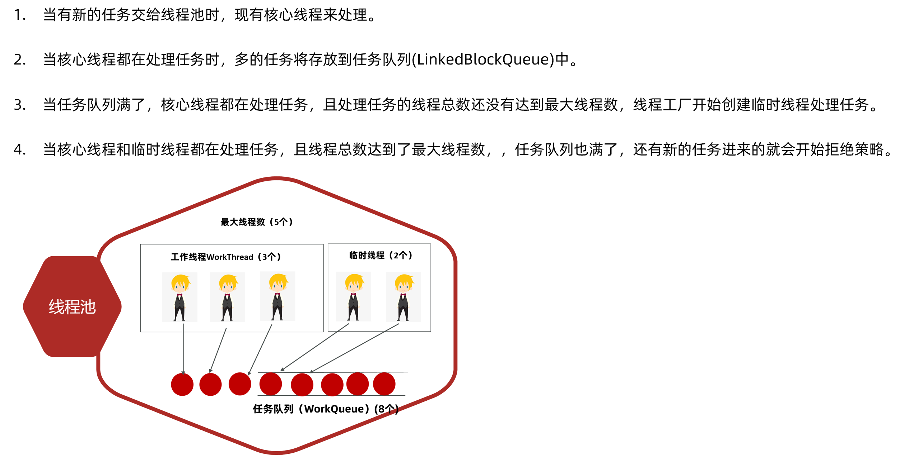

关于线程池的使用，我们需要注意下面的两个问题

1.临时线程什么时候创建？

新任务提交时，发现核心线程都在忙、任务队列满了、并且还可以创建临时线程，此时会创建临时线程。

2.什么时候开始拒绝新的任务？

核心线程和临时线程都在忙、任务队列也满了、新任务过来时才会开始拒绝任务。

补充任务拒绝策略:

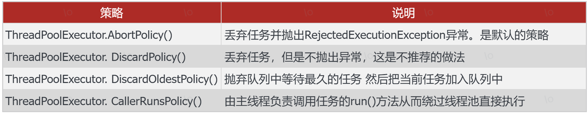

```java
//目标：了解线程池的拒绝策略
/**
  拒绝策略：
       ThreadPoolExecutor.AbortPolicy：丢弃任务并抛出RejectedExecutionException异常
       ThreadPoolExecutor.DiscardPolicy：丢弃任务，但是不抛出异常
       ThreadPoolExecutor.DiscardOldestPolicy：抛弃队列中等待最久的任务 然后把当前任务加入队列中
       ThreadPoolExecutor.CallerRunsPolicy：由主线程负责调用任务的run()方法从而绕过线程池直接执行
*/
public class Demo03 {
    public static void main(String[] args) {
        //1 创建线程池对象
        ThreadPoolExecutor pool = new ThreadPoolExecutor(3,    //核心线程数，
                5,  //最大线程数，
                2,  //临时线程最大存活时间，
                TimeUnit.SECONDS, //存活时间的单位
                new LinkedBlockingQueue<>(10),  //任务队列（等待的任务），最多放10个任务
                Executors.defaultThreadFactory(),  //创建线程的线程工厂
                //ThreadPoolExecutor.AbortPolicy：丢弃任务并抛出RejectedExecutionException异常
                //new ThreadPoolExecutor.AbortPolicy()
                //ThreadPoolExecutor.DiscardPolicy：丢弃任务，但是不抛出异常
                //new ThreadPoolExecutor.DiscardPolicy()
                //ThreadPoolExecutor.DiscardOldestPolicy：抛弃队列中等待最久的任务 然后把当前任务加入队列中
                //new ThreadPoolExecutor.DiscardOldestPolicy()
                //ThreadPoolExecutor.CallerRunsPolicy：由主线程负责调用任务的run()方法从而绕过线程池直接执行
                new ThreadPoolExecutor.CallerRunsPolicy()
        );
        //2 执行任务
        //2.1 execute(Runnable runnable)：执行任务/命令，没有返回值，一般用来执行 Runnable 任务
        for (int i = 1; i <= 16; i++) {
            int finalI= i;  //finalI等价于final修饰，因为finalI变量只赋值了一次。每次循环都是一个新变量
            //final int finalI = i;  //final修饰的变量为最终变量
            pool.execute(()->{
                //lambda表达式中使用局部变量，变量必须是最终变量(final修饰)，或者 变量等价于最终变量(只赋值一次)
                System.out.println(Thread.currentThread().getName()+"正在执行 "+ finalI);
            });
        }
        //3 关闭线程池（在服务器程序中，一般线程不关闭）
        //3.1 shutdown()：等任务执行完毕后关闭线程池
        pool.shutdown();
    }
}
```

## 6.线程池工具类Executors

大家可能会觉得前面创建线程池的代码参数太多、记不住，有没有快捷的创建线程池的方法呢？

有的。java为开发者提供了一个创建线程池的工具类，叫做Executors，它提供了方法可以创建各种不同特点的线程池。如下表所示

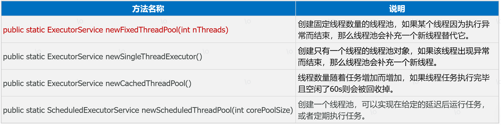

注意:这些方法的底层，都是通过线程池的实现类ThreadPoolExecutor创建的线程池对象。

接下来，我们演示一下创建固定线程数量的线程池。

```java
//目标：掌握使用使用Executors工具类实现线程池
/**
  newCachedThreadPool()：线程数量随着任务增加而增加，如果线程任务执行完毕且空闲了一段时间则会被回收掉
  newFixedThreadPool(int nThreads)：创建固定线程数量的线程池，如果某个线程因为执行异常而结束，那么线程池会补充一个新线程替代它
  newSingleThreadExecutor()：创建只有一个线程的线程池对象，如果该线程出现异常而结束，那么线程池会补充一个新线程
  newScheduledThreadPool(int corePoolSize)：创建一个线程池，可以实现在给定的延迟后运行任务，或者定期执行任务
*/
public class Demo04 {
    public static void main(String[] args) {
        //1 newCachedThreadPool()：线程数量随着任务增加而增加，如果线程任务执行完毕且空闲了一段时间则会被回收掉
        //特点：没有核心线程，只有临时线程，且线程总数为Integer.MAX_VALUE。如果并发量巨大，内存中会有大量的线程堆积，容易导致OOM(内存溢出)
        //ExecutorService pool = Executors.newCachedThreadPool();

        //2 newFixedThreadPool(int nThreads)：创建固定线程数量的线程池，如果某个线程因为执行异常而结束，那么线程池会补充一个新线程替代它
        //特点：只有核心线程，没有临时线程，任务队列的容量为Integer.MAX_VALUE。如果并发量巨大，内存中会有大量的任务对象堆积，容易导致OOM(内存溢出)
        //ExecutorService pool = Executors.newFixedThreadPool(3);

        //3 newSingleThreadExecutor()：创建只有一个线程的线程池对象，如果该线程出现异常而结束，那么线程池会补充一个新线程
        //特点：只有1核心线程，没有临时线程，任务队列的容量为Integer.MAX_VALUE。如果并发量巨大，内存中会有大量的任务对象堆积，容易导致OOM(内存溢出)
        //ExecutorService pool = Executors.newSingleThreadExecutor();

        //4 newScheduledThreadPool(int corePoolSize)：创建一个线程池，可以实现在给定的延迟后运行任务，或者定期执行任务
        //特点：可以延迟执行任务，但是线程总数为Integer.MAX_VALUE。如果并发量巨大，内存中会有大量的线程堆积，容易导致OOM(内存溢出)
        ScheduledExecutorService pool = Executors.newScheduledThreadPool(3);
        pool.schedule(()->{System.out.println("子线程任务执行了");},5, TimeUnit.SECONDS);  //5s后执行任务
    }
}
```

Executors创建线程池这么好用，为什么不推荐同学们使用呢？原因在这里：看下图，这是《阿里巴巴java开发手册》提供的强制规范要求。

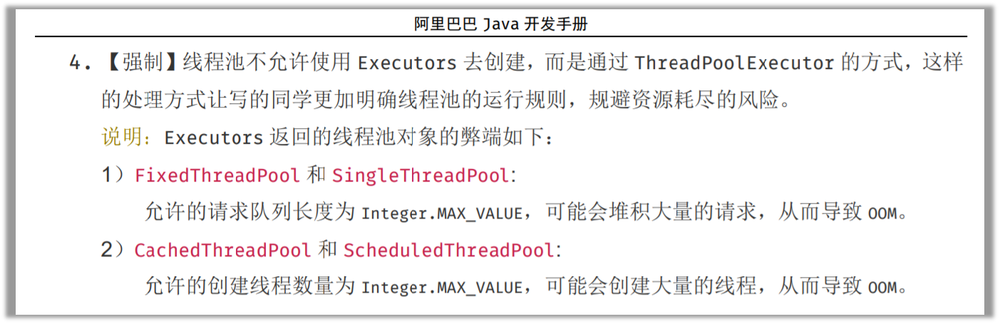

