# 一、网络编程概述

## 1.网络编程概念及作用

叫网络编程意思就是编写的应用程序可以与网络上其他设备中的应用程序进行数据交互。

网络编程有什么用呢？这个就不言而喻了，比如我们经常用的微信收发消息就需要用到网络通信的技术、在比如我们打开浏览器可以浏览各种网络、视频等也需要用到网络编程的技术。

总之网络编程作用：可以让设备中的程序与网络上其他设备中的程序进行数据交互的技术（实现网络通信）。

## 2.网络通信架构

我们知道什么是网络编程、也知道网络编程能干什么后了，那java给我们提供了哪些网络编程的解决方案呢？

java提供的网络编程的解决方案都是在java\.net包下。在正式学习java网络编程技术之前，我们还需要学习一些网络通信的前置知识理论知识，只有这些前置知识做基础，我们学习网络编程代码编写才起来才能继续下去。

首先我们聊聊网络通信的基本架构。

基本的通信架构有2种形式：CS架构（ Client客户端/Server服务端 ） 、 BS架构\(Browser浏览器/Server服务端\)。

- CS架构的特点：CS架构需要用户在自己的电脑或者手机上安装客户端软件，然后由客户端软件通过网络连接服务器程序，由服务器把数据发给客户端，客户端就可以在页面上看到各种数据了。

- BS架构的特点：BS架构不需要开发客户端软件，用户只需要通过浏览器输入网址就可以直接从服务器获取数据，并由服务器将数据返回给浏览器，用户在页面上就可以看到各种数据了。


这两种结构不管是CS、还是BS都是需要用到网络编程的相关技术。我们学习java的程序员，以后从事的工作方向主要还是BS架构的。

注意:

无论是CS架构，还是BS架构的软件都必须依赖网络编程！

java提供了哪些网络编程解决方案？

java\.net\.\*包下提供了网络编程的解决方案！

# 二、网络编程三要素

## 1.介绍

我们前面已经知道什么是网络编程了。接下来我们还需要学习一些网络编程的基本概念，才能去编写网络编程的应用程序。

有哪三要素呢？分别是IP地址、端口号、通信协议

1. IP地址：表示设备在网络中的地址，是网络中设备的唯一标识

2. 端口号：应用程序在设备中唯一的标识

3. 协议：连接和数据在网络中传输的规则。

如下图所示：假如想要用微信给唔西迪西发送爱你哟

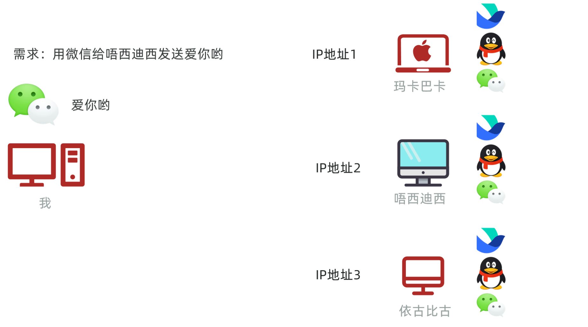

流程如下

1. 先通过ip地址找到对方的电脑

2. 再通过端口号找到对方的电脑上的应用程序

3. 按照双方约定好的规则发送、接收数据


## 2.IP地址

接下来，我们详细介绍一下IP地址。

IP（Ineternet Protocol）全称互联网协议地址，是分配给网络设备的唯一表示。

IP地址分为：IPV4地址、IPV6地址

IPV4地址：

 由32个比特位（4个字节）组成，如果下图所示:


但是由于采用二进制不容易阅读，于是就将每8位看成一组，把每一组用十进制表示（叫做点分十进制表示法）。


所以就有了我们经常看到的IP地址形式，如：192\.168\.1\.66

IPV6地址:

经过不断的发展，现在越来越多的设备需要联网，IPV4地址已经不够用了，所以扩展出来了IPV6地址。

IPV6采用128位二进制数据来表示（16个字节），号称可以为地球上的每一粒沙子编一个IP地址，

IPV6比较长，为了方便阅读，每16位编成一组，每组采用十六进制数据表示，然后用冒号隔开（称为冒分十六进制表示法），如下图所示

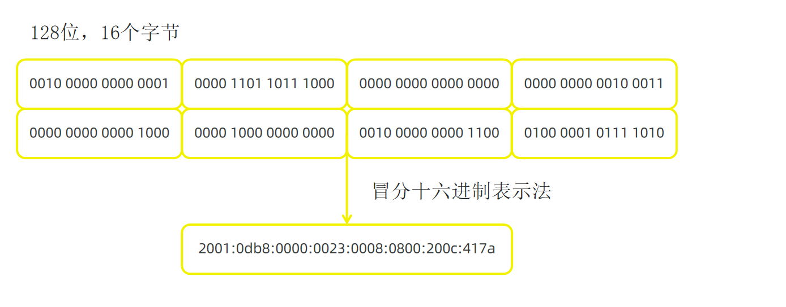

我们在命令行窗口输入`ipconfig`命令，同样可以看到ipv6地址，如下图所示

现在的网络设备，一般IPV4和IPV6地址都是支持的。

聊完什么是IP地址和IP地址分类之后，接下来再给大家介绍一下和IP地址相关的一个东西，叫做域名。

我们在浏览器上访问某一个网站是，就需要在浏览器的地址栏输入网址，这个网址的专业说法叫做域名。

比如：百度的域名是www\.baidu\.com。

域名和IP其实是一一对应的，由运营商来管理域名和IP的对应关系。我们在浏览器上敲一个域名时，首先由运营商的域名解析服务，把域名转换为ip地址，再通过IP地址去访问对应的服务器设备。

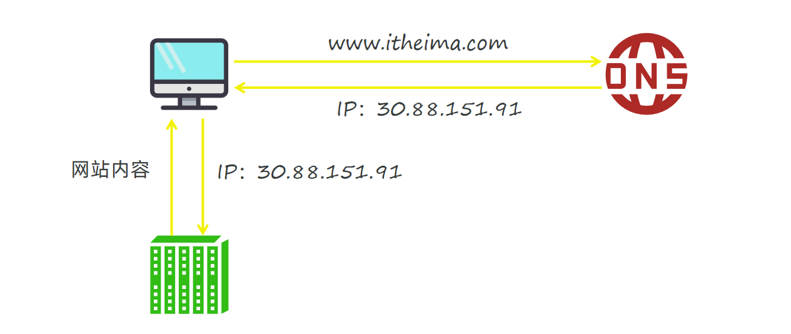

关于IP地址，还有一个特殊的地址需要我们记住一下。就是我们在学习阶段进行测试时，经常会自己给自己消息，需要用到一个本地回送地址：`127.0.0.1`

最后给大家介绍两个和IP地址相关的命令

ipconfig: 查看本机的ip地址

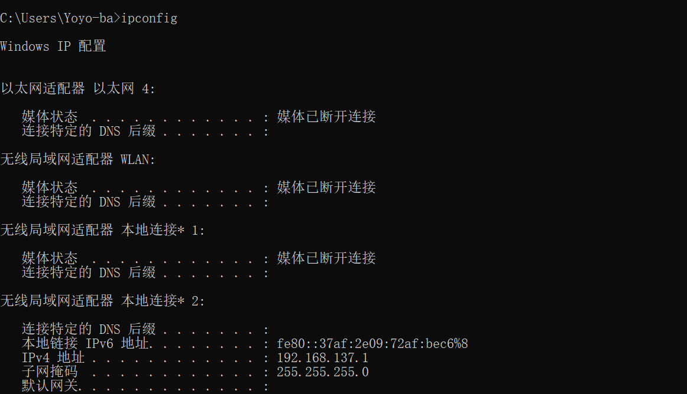

pring 域名/ip 检测当前电脑与指定的ip是否连通

ping命令出现以下的提示，说明网络是通过的

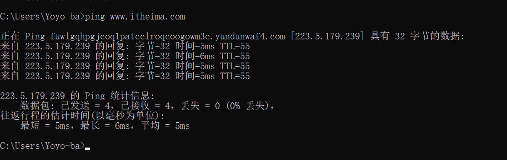

## 3.InetAddress类

我们学习了网络编程的三要素之一，IP地址。

按照面向对象的设计思想，java中也有一个类用来表IP地址，这个类是InetAddress类。

我们在开发网络通信程序的时候，可能有时候会获取本机的IP地址，以及测试与其他地址是否连通，这个时候就可以使用InetAddress类来完成。下面学习几个InetAddress的方法。

演示上面几个方法的效果

```java
/**
  InetAddress类：表示ip地址
  常用api：
       static InetAddress getLocalHost()：返回本主机的地址对象
       static InetAddress getByName(String host)：得到指定主机的IP地址对象，参数是域名或者IP地址
       String getHostName()：获取此IP地址的主机名
       String getHostAddress()：返回IP地址字符串
       boolean isReachable(int timeout)：在指定毫秒内连通该IP地址对应的主机，连通返回true
 */
public class Demo {
    public static void main(String[] args) throws IOException {
        //static InetAddress getLocalHost()：返回本主机的地址对象
        //InetAddress inetAddress = InetAddress.getLocalHost();
        //System.out.println("inetAddress = " + inetAddress); //zhouxiangyang/192.168.13.24

        //static InetAddress getByName(String host)：得到指定主机的IP地址对象，参数是域名或者IP地址
        //InetAddress inetAddress = InetAddress.getByName("www.itheima.com");
        //System.out.println("inetAddress = " + inetAddress); //www.itheima.com/223.5.179.239
        InetAddress inetAddress = InetAddress.getByName("192.168.13.69");
        System.out.println("inetAddress = " + inetAddress); //   /192.168.13.69

        //String getHostName()：获取此IP地址的主机名
        String hostName = inetAddress.getHostName();
        System.out.println("hostName = " + hostName);   //zhouxiangyang
        //String getHostAddress()：返回IP地址字符串
        String hostAddress = inetAddress.getHostAddress();
        System.out.println("hostAddress = " + hostAddress); //192.168.13.24

        //boolean isReachable(int timeout)：在指定毫秒内连通该IP地址对应的主机，连通返回true
        boolean reachable = inetAddress.isReachable(1000);
        System.out.println("reachable = " + reachable);
    }
}
```

效果如图:

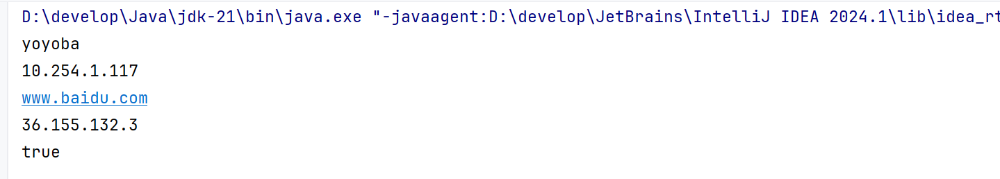

## 4.端口号

端口号：指的是计算机设备上运行的应用程序的标识，被规定为一个16位的二进制数据，范围（0\~65535）

端口号分为一下几类（了解一下）

- 周知端口：0\~1023，被预先定义的知名应用程序占用（如：HTTP占用80，FTP占用21）

- 注册端口：1024\~49151，分配给用户经常或者某些应用程序

- 动态端口：49152\~65536，之所以称为动态端口，是因为它一般不固定分配给某进程，而是动态分配的。

注意：我们自己开发的程序一般选择使用注册端口，且一个设备中不能出现两个程序的端口号一样，否则报错。


## 5.协议

前面我们已经学习了IP地址和端口号，但是想要完成数据通信还需要有通信协议。

网络上通信的设备，事先规定的连接规则，以及传输数据的规则被称为网络通信协议。

为了让世界上各种上网设备能够互联互通，肯定需要有一个组织出来，指定一个规则，大家都遵守这个规则，才能进行数据通信。

只要按照OSI网络参考模型制造的设备，就可以在国际互联网上互联互通。

其中传输层有两个协议，是我们今天会接触到的（UDP协议、TCP协议）

UDP协议特点


TPC协议特点

三次握手如下图所示：目的是确认通信双方，手法消息都是正常没问题的

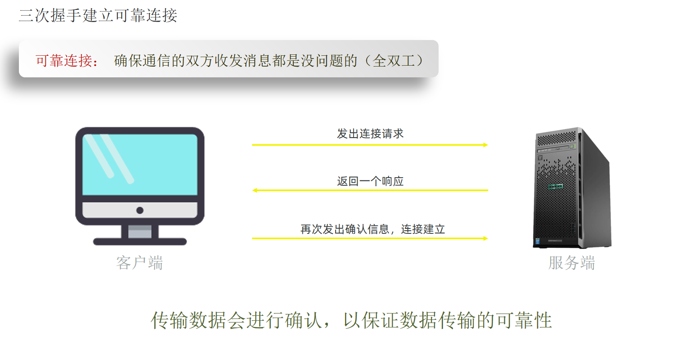

四次挥手如下图所示：目的是确保双方数据的收发已经完成，没有数据丢失

# 三、TCP通信

先回顾下TCP通信特点:

特点：面向连接、可靠通信。

通信双方事先会采用“三次握手”方式建立可靠连接，实现端到端的通信；底层能保证数据成功传给服务端。

java提供了一个java\.net\.Socket类来实现TCP通信。

我们先讲一下Socket完成TCP通信的流程，再讲代码怎么编写就很好理解了。如下图所示

1. 当创建Socket对象时，就会在客户端和服务端创建一个数据通信的管道，在客户端和服务端两边都会有一个Socket对象来访问这个通信管道。

2. 现在假设客户端要发送一个“在一起”给服务端，客户端这边先需要通过Socket对象获取到一个字节输出流，通过字节输出流写数据到服务端

3. 然后服务端这边通过Socket对象可以获取字节输入流，通过字节输入流就可以读取客户端写过来的数据，并对数据进行处理。

4. 服务端处理完数据之后，假设需要把“没感觉”发给客户端端，那么服务端这边再通过Socket获取到一个字节输出流，将数据写给客户端

5. 客户端这边再获取输入流，通过字节输入流来读取服务端写过来的数据。

## 1.TCP通信代码（一发一收）

### 1.1.TCP客户端

客户端程序就是通过java\.net包下的Socket类来实现的。

相关方法如下:

| 方法                             | 说明                                     |
| -------------------------------- | ---------------------------------------- |
| `Socket(String host,int port)`   | 构造方法，创建套接字，连接指定 ip 和端口 |
| `OutputStream getOutputStream()` | 获取输出流，**向服务端发数据**           |
| `InputStream getInputStream()`   | 获取输入流，**读取服务端返回的数据**     |
| `close()`                        | 关闭 socket，释放连接资源                |

下面我们写一个客户端，用来往服务端发数据。

```java
/*
 tcp客户端发送数据
   构造器：
      Socket(String host,int port)：创建发送端的Socket对象与服务端连接，参数为服务端程序的ip和端口
   常用方法：
      InputStream getOutputStream()：获得字节输出流对象
      OutputStream getInputStream()：获得字节输入流对象
 */
public class ClientDemo01 {
    public static void main(String[] args) throws IOException {
        System.out.println("-------------客户端的启动了---------------");
        //1 创建客户端的socket对象，请求与服务端的连接。
        //参数1：服务端的ip地址，127.0.0.1表示访问本机。参数2：服务的程序的端口号
        Socket socket = new Socket("127.0.0.1", 8888);
        //2 使用socket对象调用getOutputStream()方法得到字节输出流。
        //OutputStream os = socket.getOutputStream();
        DataOutputStream dos = new DataOutputStream(socket.getOutputStream());
        //3 使用字节输出流完成数据的发送，
        //os.write("我爱❤️郑州".getBytes());
        dos.writeUTF("我爱❤️郑州");
        //4 释放资源：关闭socket管道。
        //os.close();  //如果是自己new的流对象，就需要自己close关闭，如果是获取的，可以不管。
        dos.close();
        socket.close();
    }
}
```

### 1.2.TCP服务端

上面我们只是写了TCP客户端，还没有服务端，接下来我们把服务端写一下。

服务端是通过java\.net包下的ServerSocket类来实现的。

| 方法                     | 说明                                                   |
| ------------------------ | ------------------------------------------------------ |
| `ServerSocket(int port)` | 构造，开启本机监听端口                                 |
| `Socket accept()`        | **阻塞方法！等待客户端连接，有连接才返回 Socket 对象** |
| `close()`                | 关闭服务套接字                                         |

```java
/**
  tcp服务端代码接收数据
    构造器：ServerSocket(int port)：注册服务端端口
    常用方法：
        Socket accept()：等待接收客户端的Socket通信连接，连接成功返回Socket对象与客户端建立端到端通信
 */
public class ServerDemo01 {
    public static void main(String[] args) throws IOException {
        System.out.println("-------------服务端的启动了---------------");
        //1 创建ServerSocket对象，注册服务端端口。
        //注意：此处注册的端口号必须和客户端连接使用的端口号一样，否则客户端连不上。
        ServerSocket ss = new ServerSocket(8888);
        //2 调用ServerSocket对象的accept()方法，等待客户端的连接，并得到Socket管道对象。
        Socket socket = ss.accept();  //阻塞的方法，直到有客户端连接成功才继续向下执行。

        //需求：获取客户端的ip地址
        String ip = socket.getInetAddress().getHostAddress();

        //3 通过Socket对象调用getInputStream（）方法得到字节输入流、完成数据的接收。
        DataInputStream dis = new DataInputStream(socket.getInputStream());
        //读取数据
        String message = dis.readUTF();
        System.out.println("接收到"+ip+"发来的消息：" + message);
        //4 释放资源：关闭socket管道
        dis.close();
        socket.close();
        ss.close();
    }
}
```

开启服务器

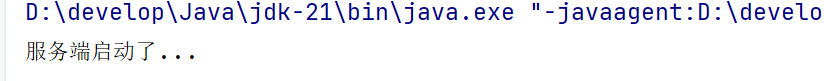

开启客户端发消息

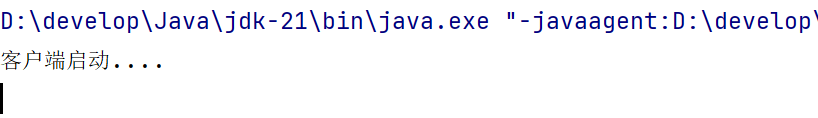

服务器接收的消息

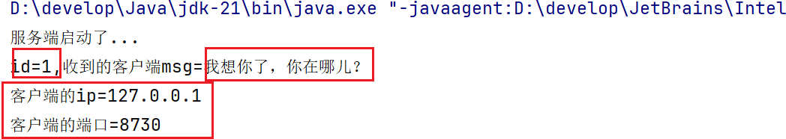

## 2.TCP通信（多发多收）

到目前为止，我们已经完成了客户端发送消息、服务端接收消息，但是客户端只能发一次，服务端只能接收一次。现在我想要客户端能过一直发消息，服务端能够一直接收消息。

下面我们把客户端代码改写一下，采用键盘录入的方式发消息，为了让客户端能够一直发，我们只需要将发送消息的代码套一层循环就可以了，当用户输入exit时，客户端退出循环并结束客户端。

### 2.1.TCP客户端

```java
/*
    tcp客户端多发消息
 */
public class ClientDemo02 {
    public static void main(String[] args){
        System.out.println("-------------客户端的启动了---------------");
        try(//1 创建客户端的socket对象，请求与服务端的连接
            //参数1：服务端的ip地址，127.0.0.1表示本机。参数2：服务端程序的端口号
            Socket socket = new Socket("192.168.16.26", 8888);
            //2 使用socket对象调用getOutputStream（）方法得到字节输出流
            DataOutputStream dos = new DataOutputStream(socket.getOutputStream());){

            //需求：客户端使用死循环，让用户不断输入消息，当输入exit时表示退出。
            //①、创建Scanner扫描器对象
            Scanner sc = new Scanner(System.in);
            //②、while死循环不停输入
            while (true){
                //③、提示并获取用户输入的内容
                String message = sc.next();
                //④、如果内容是exit表示退出(结束循环)
                if("exit".equals(message)){
                    break;
                }
                //⑤、如果内容不是exit，就发送给服务端
                //3 使用字节输出流完成数据的发送
                dos.writeUTF(message);
            }
            System.out.println("客户端消息发送完成");
        } catch (IOException e) {
            e.printStackTrace();
        }
    }
}
```

### 2.2.TCP服务端

为了让服务端能够一直接收客户端发过来的消息，服务端代码也得改写一下。

我们只需要将读取数据的代码加一个循环就可以了。

```java
/**
    tcp服务端多收消息
 */
public class ServerDemo02 {
    public static void main(String[] args){
        System.out.println("-------------服务端的启动了---------------");
        try (//1 创建ServerSocket对象，注册服务端端口。
             ServerSocket ss = new ServerSocket(8888);
             //2 调用ServerSocket对象的accept（）方法，等待客户端的连接，并得到Socket管道对象。
             Socket socket = ss.accept();
             //3 通过Socket对象调用getInputStream（）方法得到字节输入流、完成数据的接收。
             DataInputStream dis = new DataInputStream(socket.getInputStream());){

            //获取客户端的ip地址（唯一标识）
            String ip = socket.getInetAddress().getHostAddress();

            //需求：服务端也使用死循环，不断的接收消息，当客户断开连接时结束循环。
            while (true){
                try {
                    String msg = dis.readUTF();  //读数据
                    System.out.println("收到"+ip+"发送的消息：" + msg);
                } catch (IOException e) {
                    // 客户端断开连接，退出循环
                    System.out.println("客户端 " + ip + " 已断开连接");
                    break; //结束循环，客户端就会正常停止
                }
            }
        } catch (IOException e) {
            e.printStackTrace();
        }
    }
}
```

但是需要我们注意的时，如果客户端Socket退出之后，就表示连接客户端与服务端的数据通道被关闭了，这时服务端就会出现异常。

先启动服务器再启动客户端,实现交互

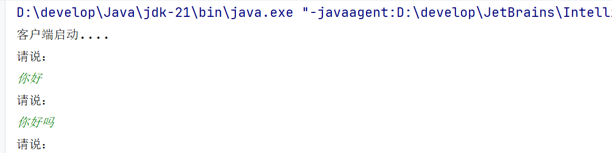

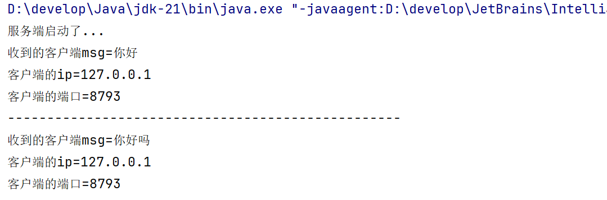

## 3.TCP通信（多线程改进）

上面案例中我们写的服务端程序只能和一个客户端通信，如果有多个客户端连接服务端，此时服务端是不支持的。

为了让服务端能够支持多个客户端通信，就需要用到多线程技术。

具体的实现思路如下图所示：

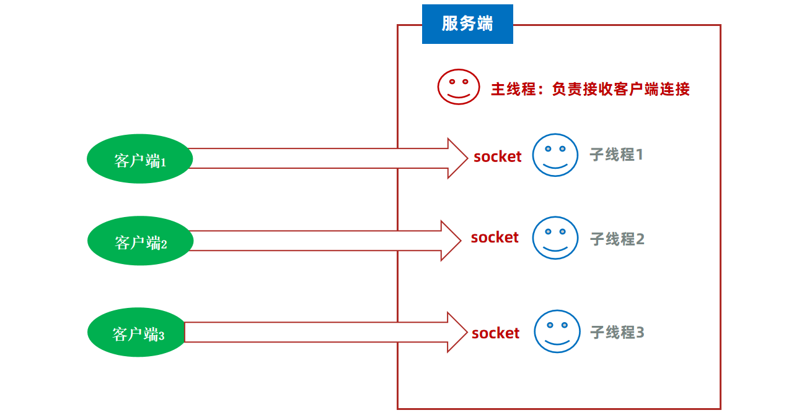

每当有一个客户端连接服务端，在服务端这边就为Socket开启一条线程取执行读取数据的操作，来多少个客户端，就有多少条线程。按照这样的设计，服务端就可以支持多个客户端连接了。

按照上面的思路，改写服务端代码。

### 3.1.多线程改进服务端

客户端代码不需要做任何修改。

服务器端代码如下

```java
/**
    tcp服务端利用 多线程 接收多个客户端发送过来的消息
 */
public class ServerDemo03 {
    public static void main(String[] args) {
        System.out.println("-------------服务端的启动了---------------");
        try (//1 创建ServerSocket对象，注册服务端端口。
             //注意：此处注册的端口号必须和客户端连接使用的端口号一样，否则客户端连不上。
             ServerSocket ss = new ServerSocket(8888);){
            //一、在主线程中使用while(true)循环，等待客户端的连接
            while (true){
                //2 调用ServerSocket对象的accept()方法，等待客户端的连接，并得到Socket管道对象。
                Socket socket = ss.accept();  //阻塞的方法，直到有客户端连接成功才继续向下执行。
                //3 通过Socket对象调用getInputStream（）方法得到字节输入流、完成数据的接收。
                DataInputStream dis = new DataInputStream(socket.getInputStream());
                //获取客户端的ip地址
                String ip = socket.getInetAddress().getHostAddress();
                //二、只要有客户端连接进来，就开启一个子线程，子线程负责接收当前这个客户端发送过来的消息
                new Thread(()->{
                    //需求：服务端也使用死循环，不断的接收消息，当客户断开连接时结束循环。
                    while (true){
                        try {
                            //读取数据，阻塞的方法，直到客户端有消息过来就继续往下执行。当客户端退出后，此处就读不到消息，就会抛出EOFException异常。
                            String message = dis.readUTF();
                            System.out.println("接收到" + ip + "发来的消息：" + message);
                        } catch (Exception e) {
                            // 客户端断开连接，正常退出循环
                            System.out.println(ip + " 已断开连接");
                            break;
                        }
                    }
                }).start();
            }
        } catch (IOException e) {
            e.printStackTrace();
        }
    }
}
```

### 3.2.线程池改进服务端

我们当前的服务端程序在运行时，每次有一个客户端请求，都会开启一个线程处理发送过来的消息。如果遇到高并发时，服务器很容易出现宕机。如何优化?

答案：使用线程池优化

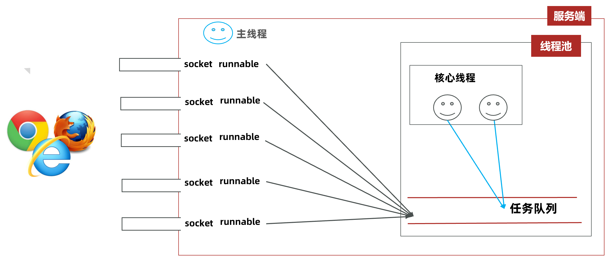

服务端代码如下：

```java

/**
 tcp服务端利用 线程池 接收多个客户端发送过来的消息（对demo4/ServerDemo03进行优化） 
*/
public class ServerDemo04 {
    public static void main(String[] args) {
        //创建线程池对象
        ThreadPoolExecutor pool = new ThreadPoolExecutor(3, 5, 5, TimeUnit.SECONDS,
                new LinkedBlockingQueue<>(10),
                Executors.defaultThreadFactory(),
                new ThreadPoolExecutor.DiscardPolicy());
        System.out.println("-------------服务端的启动了---------------");
        try (//1 创建ServerSocket对象，注册服务端端口。
             //注意：此处注册的端口号必须和客户端连接使用的端口号一样，否则客户端连不上。
             ServerSocket ss = new ServerSocket(8888);) {
            //一、在主线程中使用while(true)循环，等待客户端的连接
            while (true) {
                //2 调用ServerSocket对象的accept()方法，等待客户端的连接，并得到Socket管道对象。
                Socket socket = ss.accept();  //阻塞的方法，直到有客户端连接成功才继续向下执行。
                //3 通过Socket对象调用getInputStream（）方法得到字节输入流、完成数据的接收。
                DataInputStream dis = new DataInputStream(socket.getInputStream());
                //二、只要有客户端连接进来，就让线程池执行一个任务，子线程负责接收当前这个客户端发送过来的消息
                pool.execute(() -> {
                    //获取客户端的ip地址
                    String ip = socket.getInetAddress().getHostAddress();
                    System.out.println(ip + "连接上了...");
                    //需求：服务端也使用死循环，不断的接收消息，当客户断开连接时结束循环。
                    while (true) {
                        try {
                            //读取数据，阻塞的方法，直到客户端有消息过来就继续往下执行。当客户端退出后，此处就读不到消息，就会抛出EOFException异常。
                            String message = dis.readUTF();
                            System.out.println("接收到" + ip + "发来的消息：" + message);
                        } catch (Exception e) {
                            // 客户端断开连接，正常退出循环
                            System.out.println(ip + " 已断开连接");
                            break;
                        }
                    }
                });
            }
        } catch (IOException e) {
            e.printStackTrace();
        }
    }
}
```

# 四、反射

## 1.反射概述

在学习反射之前，有几个点需要给大家提前交代一下，接下来我们学习的反射、注解等知识点，这些技术都是以后学习框架、或者做框架的底层源码。给同学们讲这些技术的目的，是为了以后我们理解框架、或者自己开发框架给别人用作铺垫的。我们都会采用先带着大家充分的认识它们，然后再了解其作用和应用场景。

接下来，我们就需要带着同学们认识一下什么是反射。

在API文档中对反射有详细的说明，我们去了解一下。在`java.lang.reflect`包中对反射的解释如下图所示

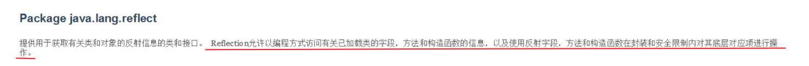

解释就是：反射技术，指的是加载类的字节码到内存，并以编程的方法解剖出类中的各个成分（成员变量、方法、构造器等）。

反射有啥用呢？其实反射是用来写框架用的，说起来比较抽象。为了方便理解，给大家看一个我们见过的例子：平时我们用IDEA开发程序时，用对象调用方法，IDEA会有代码提示，idea会将这个对象能调用的方法都给你列举出来，供你选择，如果下图所示

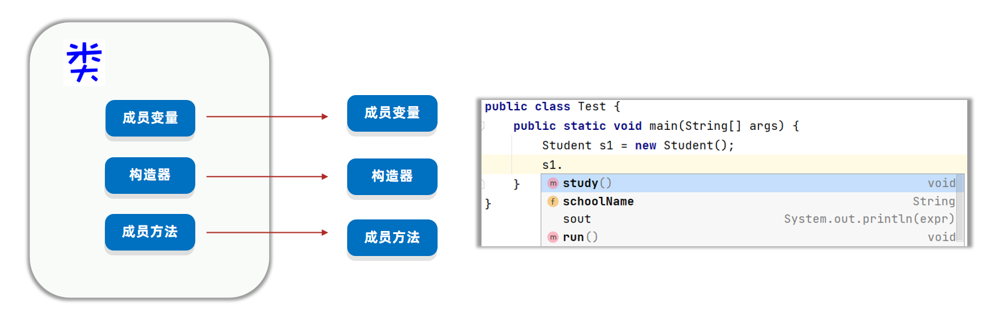

问题是IDEA怎么知道这个对象有这些方法可以调用呢?

原因是对象能调用的方法全都来自于类，IDEA通过反射技术就可以获取到类中有哪些方法，并且把方法的名称以提示框的形式显示出来，所以你能看到这些提示了！

好了，认识了反射是什么之后，接下来我还想给大家介绍一下反射具体学什么？

因为反射得到的是类的信息，那么反射的第一步首先获取到类才行。由于java的设计原则是万物皆对象，获取到的类其实也是以对象的形式体现的，叫字节码对象，用Class类来表示。

获取到字节码对象之后，再通过字节码对象就可以获取到类的组成成分了，这些组成成分其实也是对象，

其中每一个成员变量用Field类的对象来表示、每一个成员方法用Method类的对象来表示，每一个构造器用Constructor类的对象来表示。

如下图所示：

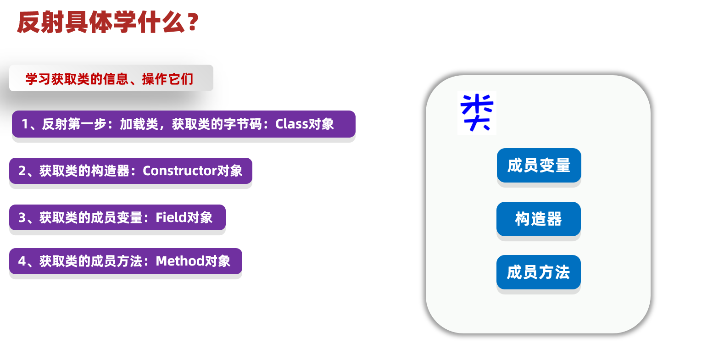

## 2.获取类的字节码

反射的第一步：是将字节码加载到内存，我们需要获取到的字节码对象。

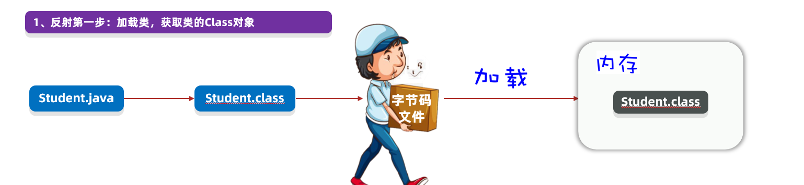

我们先准备好一个学生类,如下:

```java
public class Student {
    private String name;
    private int age;
    public String gender;

    public Student() {
    }

    public Student(String name) {
        this.name = name;
    }

    private Student(String name, int age) {
        this.name = name;
        this.age = age;
    }

    protected Student(String name, int age, String gender) {
        this.name = name;
        this.age = age;
        this.gender = gender;
    }

    public String getName() {
        return name;
    }

    public void setName(String name) {
        this.name = name;
    }
    public int getAge() {
        return age;
    }

    public void setAge(int age) {
        this.age = age;
    }

    public String getGender() {
        return gender;
    }
    public void setGender(String gender) {
        this.gender = gender;
    }
    private void show() {
        System.out.println("我是私有方法！");
    }
    @Override
    public String toString() {
        return "Student{" +
                "name='" + name + '\'' +
                ", age=" + age +
                ", gender='" + gender + '\'' +
                '}';
    }
}
```

获取Class对象有三种方式:

1. Class c1 = 类名\.class

2. 调用Class提供方法：public static Class forName\(String package\)； 

3. Object提供的方法： public Class getClass\(\)； Class c3 = 对象\.getClass\(\);

代码演示如下:

```java
/**
 目标：掌握获取Class类对象的三种方式
 需求：分别利用三种方式获取Student类的字节码对象
 获取Class类对象的三种方式：
 方式1：Class类静态方法forName(String className)
 方式2：类名.class
 方式3：对象.getClass()
 使用Class对象实例化对象
 T newInstance(): 调用无参数构造方法实例化对象 */
public class Demo01 {
    public static void main(String[] args) throws Exception {
        //需求：分别利用三种方式获取Student类的字节码对象
        //方式1：Class类静态方法forName(String className)
        Class<?> studentClass = Class.forName("com.itheima.d2_reflect.Student");
        System.out.println(studentClass);

        //方式2：类名.class
        Class<Student> studentClass2 = Student.class;
        System.out.println(studentClass2);
        //true，说明一个类的Class对象有且仅有一个
        System.out.println(studentClass == studentClass2);

        //方式3：对象.getClass()---->通过Student对象得到Class对象
        Student student = new Student();
        Class<? extends Student> studentClass3 = student.getClass();
        System.out.println(studentClass3);

        //需求：通过Class对象得到Student对象（实例化对象）,执行的时非私有的空参构造器
        Student stu = (Student) studentClass.newInstance();
        System.out.println(stu);
    }
}
```

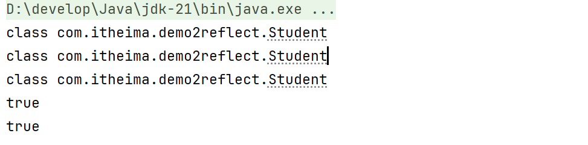

ps:不管用哪一种方式，获取到的字节码对象其实是同一个。

## 3.获取类的构造器

我们已经可以获取到类的字节码对象了。

接下来，我们学习一下通过字节码对象获取构造器，并使用构造器创建对象。

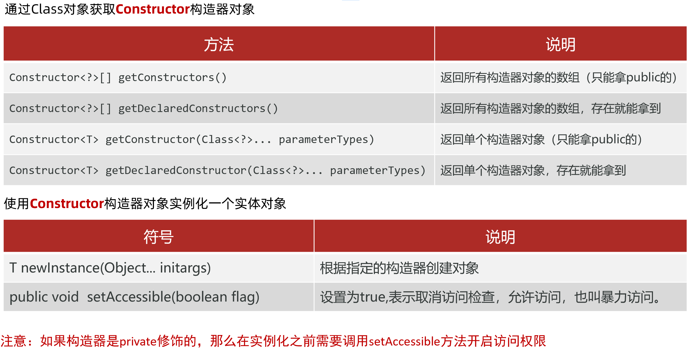

获取构造器，需要用到Class类提供的几个方法，如下所示：

```java
/**
  目标：掌握利用反射获取构造器Constructor对象
  需求：利用反射获取Student类的构造器对象，并利用构造器对象创建Student对象
  获取构造器的方法：
   Constructor<?>[] getConstructors()：返回所有构造器对象的数组（只能拿public的）
   Constructor<?>[] getDeclaredConstructors()：返回所有构造器对象的数组，存在就能拿到
   Constructor<T> getConstructor(Class<?>... parameterTypes)：返回单个构造器对象（只能拿public的）
   Constructor<T> getDeclaredConstructor(Class<?>... parameterTypes)：返回单个构造器对象，存在就能拿到
 
  创建对象的方法：
       T newInstance(Object... initargs)：根据指定的构造器创建对象
       void setAccessible(boolean flag)：设置为true,表示取消访问检查，进行暴力反射
 */
public class Demo02 {
    public static void main(String[] args) throws Exception {
        //1 获取Student类的Class对象
        Class<Student> studentClass = Student.class;
        //2 获取Constructor构造器对象
        //2.1 Constructor<?>[] getConstructors()：返回所有构造器对象的数组（只能拿public的）
        //Constructor<?>[] constructors = studentClass.getConstructors();

        //2.2 Constructor<?>[] getDeclaredConstructors()：返回所有构造器对象的数组，存在就能拿到
        /*Constructor<?>[] constructors = studentClass.getDeclaredConstructors();
        for (Constructor<?> constructor : constructors) {
            System.out.println(constructor);
        }*/
        //2.3 Constructor<T> getConstructor(Class<?>... parameterTypes)：返回单个构造器对象（只能拿public的）
        //Constructor<Student> constructor = studentClass.getConstructor();  //获取public修饰的空参构造器-->Student()
        //Constructor<Student> constructor = studentClass.getConstructor(String.class);  //Student(String)
        //Constructor<Student> constructor = studentClass.getConstructor(String.class,int.class);  //报错，因为这个构造器不是public修饰的

        //2.4 Constructor<T> getDeclaredConstructor(Class<?>... parameterTypes)：返回单个构造器对象，存在就能拿到
        Constructor<Student> constructor = studentClass.getDeclaredConstructor(String.class,int.class);
        //Constructor<Student> constructor = studentClass.getDeclaredConstructor(String.class,int.class,String.class);
        System.out.println("constructor = " + constructor);

        //3 使用构造器对象实例化Student对象
        //Student student = constructor.newInstance();  //相当于Student student = new Student();
        //Student student = constructor.newInstance("张益达");  //相当于Student student = new Student("张益达");
        //注意：如果构造器是private修饰的，那么在访问之前需要开启访问全选，也叫暴力反射
        constructor.setAccessible(true);
        Student student = constructor.newInstance("张益达",20);  //相当于Student student = new Student("张益达",20);
        System.out.println("student = " + student);
    }
}
```

## 4.反射获取成员变量\&使用

我们已经学习了获取类的构造方法并使用。接下来，我们再学习获取类的成员变量，并使用。

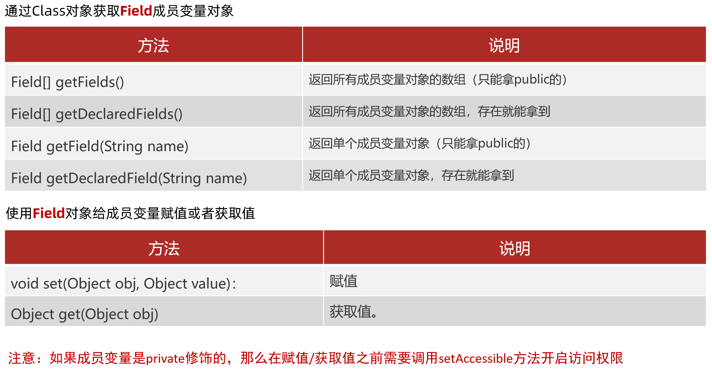

其实套路是一样的，在Class类中提供了获取成员变量的方法，如下所示。

```java
/**
  目标：掌握利用反射获取成员变量Field对象
  需求：获取Student类中的各个属性Field对象，并给属性赋值、获取属性的值
  获取成员变量的方法：
       Field[] getFields()：返回所有成员变量对象的数组（只能拿public的）
       Field[] getDeclaredFields()：返回所有成员变量对象的数组，存在就能拿到
       Field getField(String name)：返回单个成员变量对象（只能拿public的）
       Field getDeclaredField(String name)：返回单个成员变量对象，存在就能拿到
 
  Field类中用于取值、赋值的方法：
       void set(Object obj, Object value)：赋值
       Object get(Object obj)：获取值
 */
public class Demo03 {
    public static void main(String[] args) throws Exception {
        //1 获取Class对象
        Class<Student> studentClass = Student.class;

        //2 获取成员变量Field对象
        //2.1 Field[] getFields()：返回所有成员变量对象的数组（只能拿public的）
        //Field[] fields = studentClass.getFields();
        //2.2 Field[] getDeclaredFields()：返回所有成员变量对象的数组，存在就能拿到
        /*Field[] fields = studentClass.getDeclaredFields();
        for (Field field : fields) {
            System.out.println(field);
        }*/
        //2.3 Field getField(String name)：返回单个成员变量对象（只能拿public的）
        Field genderField = studentClass.getField("gender");
        System.out.println("genderField = " + genderField);
        //2.4 Field getDeclaredField(String name)：返回单个成员变量对象，存在就能拿到
        Field nameField = studentClass.getDeclaredField("name");
        System.out.println("nameField = " + nameField);

        //3 操作成员变量对象(赋值和取值)
        //实例化学生对象，赋值和取值的时候要用，需要指定给哪个对象的属性赋值和取值。
        Student student = studentClass.newInstance();
        //3.1 赋值：void set(Object obj, Object value)
        genderField.set(student, "男");  //相当于：student.gender="男"
        //注意：如果给private修饰的成员变量赋值和取值，在操作之前需要取消访问权限
        nameField.setAccessible(true);
        nameField.set(student, "张益达");  //相当于：student.name="张益达"

        //3.2 取值：Object get(Object obj)：获取值
        String value = (String) genderField.get(student);  //相当于：String value = student.gender
        System.out.println("value = " + value);
        System.out.println(student);
    }
}
```

执行结果:

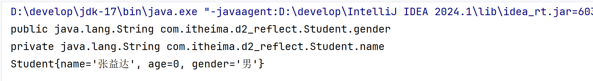

## 5.反射获取成员方法

我们已经学习了反射获取构造方法、反射获取成员变量，还剩下最后一个就是反射获取成员方法并使用了。

在java中反射包中，每一个成员方法用Method对象来表示，通过Class类提供的方法可以获取类中的成员方法对象。如下所示:

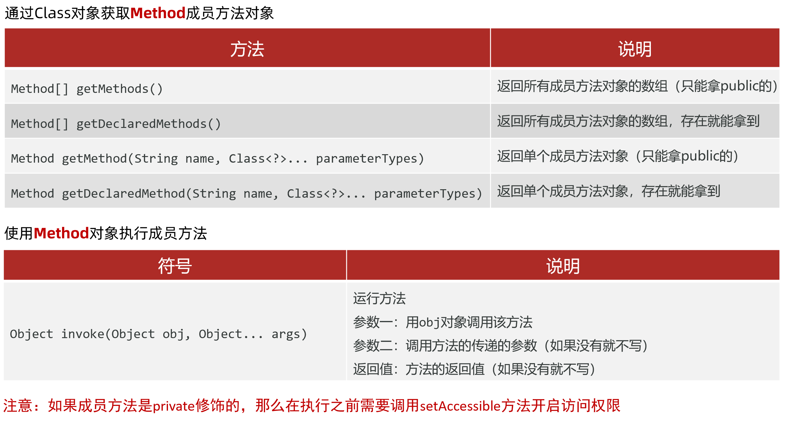

接下来，通过反射获取Student类中的成员方法，每一个成员方法都是一个Method对象哦。

```java
/**
  目标：掌握利用反射获取方法Method对象
  需求：获取Student类中的各个方法Method对象，并且调用方法
  获取成员方法的api：
       Method[] getMethods()：返回所有成员方法对象的数组（只能拿public的）
       Method[] getDeclaredMethods()：返回所有成员方法对象的数组，存在就能拿到
       Method getMethod(String name, Class<?>... parameterTypes)：返回单个成员方法对象（只能拿public的）
       Method getDeclaredMethod(String name, Class<?>... parameterTypes)：返回单个成员方法对象，存在就能拿到
 
  触发执行的方法：
       Object invoke(Object obj, Object... args)
               运行方法
               参数一：用obj对象调用该方法
               参数二：调用方法的传递的参数（如果没有就不写）
               返回值：方法的返回值（如果没有就不写）
 */
public class Demo04 {
    public static void main(String[] args) throws Exception {
        //1 获取Class对象
        Class<Student> studentClass = Student.class;

        //2 获取成员方法Method对象
        //2.1 Method[] getMethods()：返回所有成员方法对象的数组（只能拿public的）
        //Method[] methods = studentClass.getMethods(); //注意：还可以获取父类身上继承下来的public修饰的方法

        //2.2 Method[] getDeclaredMethods()：返回所有成员方法对象的数组，存在就能拿到
        /*Method[] methods = studentClass.getDeclaredMethods(); //注意：不会获取到父类身上继承下来的方法
        for (Method method : methods) {
            System.out.println(method);
        }*/

        //2.3 Method getMethod(String name, Class<?>... parameterTypes)：返回单个成员方法对象（只能拿public的）
        Method setName = studentClass.getMethod("setName", String.class);  //public修饰
        Method getName = studentClass.getMethod("getName");  //public修饰

        //2.4 Method getDeclaredMethod(String name, Class<?>... parameterTypes)：返回单个成员方法对象，存在就能拿到
        Method show = studentClass.getDeclaredMethod("show");  //private修饰
        System.out.println("method = " + show);

        //3 操作成员方法对象(调用/执行方法)
        Student student = studentClass.newInstance();
        //参数1：用obj对象调用该方法。参数2：调用方法传递的参数值。返回值：调用方法的返回值
        //Object invoke(Object obj, Object... args)
        setName.invoke(student,"张益达");  //相当于：student.setName("张益达")
        String name = (String) getName.invoke(student);  //相当于：String name = student.getName();
        System.out.println("name = " + name);
        //调用私有的show方法
        show.setAccessible(true);  //开启访问权限
        show.invoke(student);

    }
}
```

执行上面的代码，运行结果如下图所示：

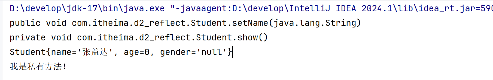

## 6.反射的应用场景

### 6.1.反射的作用

反射最重要的作用是：适合做java的框架或者工具类。基本上，主流的框架都会基于反射设计出一些通用的功能。

例如：有两个jar包commons\-beanutils\-1\.9\.3\.jar 和commons\-logging\-1\.2\.jar，该jar包中有一个BeanUtils工具类，该类有一个静态方法populate\(Object Bean,Map map\),该方法可以将map集合中的数据按照key封装到一个javabean对象中。

要求：javabean的属性名要和map集合key的名称一样才可以封装。

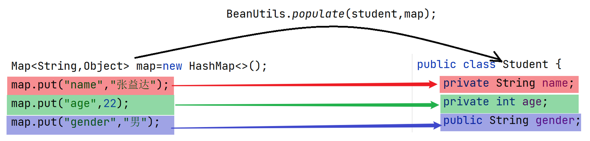

BeanUtils的使用代码示例：

```java
/**
  需求：使用BeanUtils工具类将map集合中的数据按照key封装到一个javabean对象中
  实现步骤：
      第一步：导入commons-beanutils-1.9.3.jar和commons-logging-1.2.jar包
      第二步：创建Map集合对象，保存数据，要求Map集合的key要和Student的成员变量名称一致
      第三步：创建Student对象
      第四步：调用BeanUtils的populate(Object Bean,Map map)方法封装数据到Student对象中
 */
public class Demo05 {
    public static void main(String[] args) throws Exception {
        //第一步：导入commons-beanutils-1.9.3.jar包
        //第二步：创建Map集合对象，保存数据，要求Map集合的key要和Student的成员变量名称一致
        Map<String,Object> map=new HashMap<>();
        map.put("name","张益达");
        map.put("age",22);
        map.put("gender","男");
        //第三步：创建Student对象
        Student student=new Student();
        System.out.println("封装前student = " + student);
        //第四步：调用BeanUtils的populate(Object Bean,Map map)方法封装数据到Student对象中
        BeanUtils.populate(student,map);
        System.out.println("封装后student = " + student);
    }
}
```

### 6.2.反射的应用

清楚了BeanUtils工具类的作用，接下来我们也可以使用反射技术定义一个MyBeanUtils工具类，在MyBeanUtils工具类中提供一个populate方法，实现和BeanUtils工具类中populate方法一样的逻辑。

```TypeScript
public class MyBeanUtils {

    /**
     需求：将map集合中的数据按照key封装(设置)到参数1对象的对应属性身上
     * @param bean 要封装数据的对象
     * @param map 保存数据的map集合
     */
    public static void populate(Object bean, Map<String, Object> map){
        
    }
}
```

分析一下该怎么做?

1. 获取Bean的class对象

2. 获取map集合所有的key

3. 遍历所有key，根据key获取field对象

4. 将key对应的value值设置给field对象

5. 编写方法内部的代码，往文件中存储对象的属性名和属性值

接下来按照上述步骤，进行代码实现：

```java
public class MyBeanUtils {
    /**
     需求：将map集合中的数据按照key封装(设置)到参数1对象的对应属性身上
     * @param bean 要封装数据的对象
     * @param map 保存数据的map集合
     */
    public static void populate(Object bean, Map<String, Object> map) throws NoSuchFieldException, IllegalAccessException {
        //1 获取Bean的Class对象--->反射第一步
        Class<?> aClass = bean.getClass();
        //2 获取map集合的所有key。Set<String>
        Set<String> keys = map.keySet();
        //3 遍历所有的键，根据键获取成员变量对象--->反射第二步
        for (String key : keys) {  //key="name",key="age",key="gender" ,也是成员变量的名字
            Field field = aClass.getDeclaredField(key);
            //开启访问权限，因为成员变量被private修饰
            field.setAccessible(true);
            //4 给成员变量设置值--->反射第三步
            field.set(bean,map.get(key));
        }
    }
}
```

在测试类中使用MyBeanUtils工具类

```java
/**
  需求：使用BeanUtils工具类将map集合中的数据按照key封装到一个javabean对象中
  实现步骤：
      第一步：导入commons-beanutils-1.9.3.jar和commons-logging-1.2.jar包
      第二步：创建Map集合对象，保存数据，要求Map集合的key要和Student的成员变量名称一致
      第三步：创建Student对象
      第四步：调用BeanUtils的populate(Object Bean,Map map)方法封装数据到Student对象中
 */
public class Demo05 {
    public static void main(String[] args) throws Exception {
        //第一步：导入commons-beanutils-1.9.3.jar包
        //第二步：创建Map集合对象，保存数据，要求Map集合的key要和Student的成员变量名称一致
        Map<String,Object> map=new HashMap<>();
        map.put("name","张益达");
        map.put("age",22);
        map.put("gender","男");
        //第三步：创建Student对象
        Student student=new Student();
        System.out.println("封装前student = " + student);
        //第四步：调用BeanUtils的populate(Object Bean,Map map)方法封装数据到Student对象中
        //BeanUtils.populate(student,map);
        //自定义MyBeanUtils工具类，也提供一个populate方法，作用和/BeanUtils工具类中的populate方法一样
        MyBeanUtils.populate(student,map);
        System.out.println("封装后student = " + student);
    }
}
```

运行效果如下：

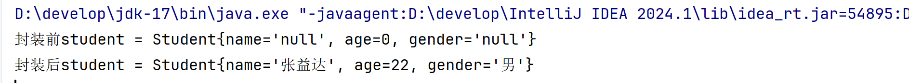


