# 一、注解

## 1.注解概述

注解和反射一样，都是用来做框架的，我们这里学习注解的目的其实是为了以后学习框架或者做框架做铺垫的。

java注解是代码中的特殊标记，比如@Override、@Data等

作用：让其他程序根据注解信息决定怎么执行该程序。

比如：@Override注解可以用在方法上，用来标记这个方法是重写方法，被@Override注解标记的方法能够被IDEA识别进行语法检查。

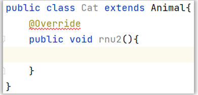

注意：注解不光可以用在方法上，还可以用在类上、变量上、构造器上等位置。

上面我们说的@Overide、@Data注解注解是别人定义好给我们用的，将来如果需要自己去开发框架，就需要我们自己定义注解。

## 2.自定义注解

自定义注解,就是自己定义注解。定义格式如下:

```java
public @interface 注解名称 {

    public 属性类型 属性名() default 默认值 ;

 }
```

那我们快速定义一个吧

自定义一个注解:名字自己定义即可

```java
public @interface MyAnno {
    //1、属性可有可无，根据实际需求来定义。
    //2、属性类型：Java支持的数据类型基本上都可以使用
    //3、默认值可以定义也可以不定义，如果不指定默认值，那么使用该注解时就必须给这个属性赋值。
    //String[] name();
    //String name();
    String name() default "";
    int age() default 0;
    //value属性：如果有且仅有一个要赋值且名称叫value的属性，在给value属性赋值时可以省略value名称不写！!
    //如果有多个属性需要赋值时，那么value名称是不能省略的。
    String value();
}
```

定义一个测试类使用注解:\(注解在类中多个位置都可以使用\)

```java
/*
  注解的定义格式：
       public @interface 注解名称 {
               public 属性类型 属性名() default 默认值 ;
       }
       1、属性可有可无，根据实际需求来定义。
       2、属性类型：Java支持的数据类型基本上都可以使用
       3、默认值可以定义也可以不定义，如果不指定默认值，那么使用该注解时就必须给这个属性赋值。
  特殊属性：value
       如果只有一个属性需要赋值，并且属性的名称是value，则value可以省略，直接定义值即可
 */
@MyAnno(name = "类名", age = 18,value = "a")
public class Demo02{
    @MyAnno(name = "成员变量", age = 22,value = "b")
    private String name;

    @MyAnno(age = 20,value = "c")
    public void show(){}

    public static void main(@MyAnno("d") String[] args) {

    }
}
```

简单记使用,注解注天注地注空气,类中的任何位置都可以加上注解。

在注解这里有个特殊属性名需要大家注意:value属性。

注意：如果注解中只有一个名字叫value属性要赋值，使用注解时，value名称可以不写\!\!

我们定义一个A注解给大家演示一下

```java
public @interface MyAnno {
    //1、属性可有可无，根据实际需求来定义。
    //2、属性类型：Java支持的数据类型基本上都可以使用
    //3、默认值可以定义也可以不定义，如果不指定默认值，那么使用该注解时就必须给这个属性赋值。
    //String[] name();
    //String name();
    String name() default "";
    int age() default 0;
    //value属性：如果有且仅有一个要赋值且名称叫value的属性，在给value属性赋值时可以省略value名称不写！!
    //如果有多个属性需要赋值时，那么value名称是不能省略的。
    String value();
}
```

使用时,会发现如下场景value名称可以省略:

```java
/*
  注解的定义格式：
       public @interface 注解名称 {
               public 属性类型 属性名() default 默认值 ;
       }
       1、属性可有可无，根据实际需求来定义。
       2、属性类型：Java支持的数据类型基本上都可以使用
       3、默认值可以定义也可以不定义，如果不指定默认值，那么使用该注解时就必须给这个属性赋值。
  特殊属性：value
       如果只有一个属性需要赋值，并且属性的名称是value，则value可以省略，直接定义值即可
 */
@MyAnno(name = "", value = "a")
public class Demo02{
    @MyAnno(value = "b",name = "张益达")
    private String name;
    @MyAnno("c")  //默认给value赋值
    public void show(){}

    public static void main(@MyAnno(name = "snake", value = "d") String[] args) {

    }
}
```

## 3.注解原理

到这里关于定义注解的格式、以及使用注解的格式就学习完了。那注解的本质是什么呢?

想要搞清楚注解本质是什么东西，我们可以把注解的字节码进行反编译，在cmd中，使用javap MyTest1\.class就可以反编译了。

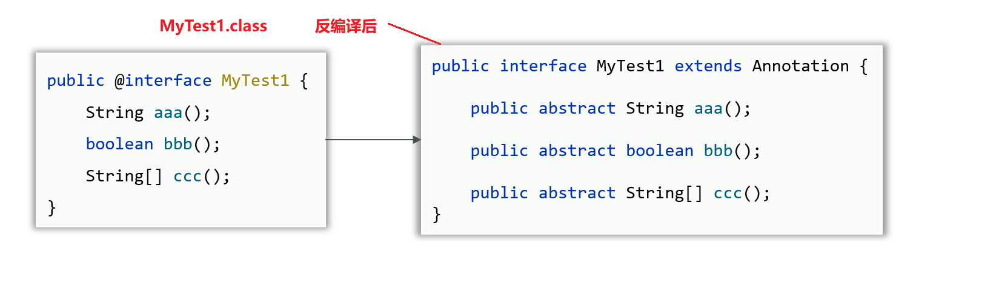

经过对MyTest1注解字节码反编译我们会发现：

1. 注解本质是一个接口，java中所有注解都是继承了Annotation接口的。

2. @注解\(…\)：其实就是一个实现类对象，实现了该注解以及Annotation接口。

## 4.元注解

刚才我们已经认识了注解以及注解的基本使用。接下来我们还需要学习几种特殊的注解，叫做元注解。

什么是元注解？

元注解是注解注解的注解。

我们看一个例子

如图: 在Test注解上,有两个注解Test注解的注解,那么上面这两个注解注解的注解就被称为元注解。

上面的两个元注解是最经典的元注解,那么它们都有什么作用呀？

接下来分别看一下@Target注解和@Retention注解有什么作用，如下所示

@Target是用来声明注解只能用在那些位置，比如：类上、方法上、成员变量上等

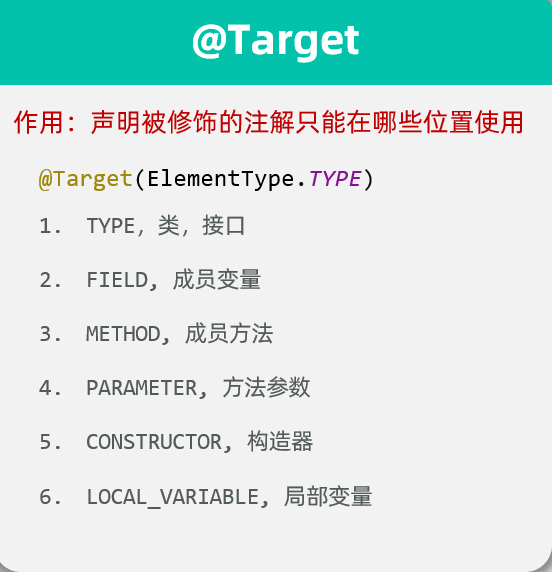

@Retetion是用来声明注解保留周期，比如：源代码时期、字节码时期、运行时期

ps:上述两个元注解的属性值都是使用枚举类型来表达的哦。

我们来演示一下如何使用

### 4.1.@Target 注解使用演示

我们先定义一个注解

```java
public @interface MyTest1 {
}
```

我们定义一个测试类,在没有使用元注解的时候,使用如下

```java
@MyTest1
public class AnnotationDemo2 {

    @MyTest1
    private int age;

    @MyTest1
    public AnnotationDemo2(){
    }

    @MyTest1
    public static void main(String[] args) {
        // 目标：搞清楚元注解的作用。
    }

    @MyTest1
    public void getAgeTest(){
    }
}
```

我们发现注解现在可以用在类上,属性上,构造上,方法\.\.\.都没有报错。

接下来我们在注解上使用元注解修饰一下

```java
@Target({ElementType.METHOD, ElementType.FIELD}) // 表示注解的作用目标为方法,成员变量
public @interface MyTest1 {
}
```

我们再看测试类

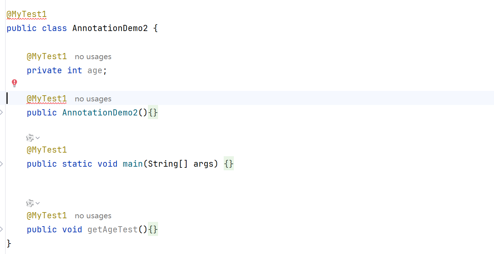

@Target选值是METHOD,FIELD时，就表示注解使用范围是方法和属性,故而类上和构造上就报错。

到这里@Target元注解的使用就演示完毕了。

### 4.2.@Retetion元注解的使用

@Retetion是用来声明注解保留周期，比如：源代码时期、字节码时期、运行时期

- @Retetion\(RetetionPloicy\.SOURCE\): 注解保留到源代码时期、字节码中就没有了

- @Retetion\(RetetionPloicy\.CLASS\): 注解保留到字节码中、运行时注解就没有了

- @Retetion\(RetetionPloicy\.RUNTIME\)：注解保留到运行时期

【自己写代码时，比较常用的是保留到运行时期】

```java
@Target({ElementType.METHOD, ElementType.FIELD}) // 表示注解的作用目标为方法,成员变量
@Retention(RetentionPolicy.RUNTIME) // 表示注解的保留策略: 编译器运行时(一直活着)
public @interface MyTest1 {
}
```

注意：注解默认是保留到字节码中,所以如果想在运行时解析到注解,需要保留到运行期。

说明：只要是定义注解，基本上都会使用@Taget和@Retention注解。好了，恭喜大家！学习到这里，注解技术已经学习完毕了。

### 4.3.代码案例

```java
/*
  主要的元注解有两个：
       @Target: 约束自定义注解只能在哪些地方使用
           TYPE，类，接口
           FIELD, 成员变量
           METHOD, 成员方法
           PARAMETER, 方法参数
           CONSTRUCTOR, 构造器
           LOCAL_VARIABLE, 局部变量
       @Retention：申明注解作用的阶段
           SOURCE：注解只作用在源码阶段，生成的字节码文件中不存在
           CLASS：注解作用在源码阶段，字节码文件阶段，运行阶段不存在，默认值.
           RUNTIME：注解作用在源码阶段，字节码文件阶段，运行阶段（开发常用）
 */
@Target({ElementType.TYPE,ElementType.METHOD,ElementType.FIELD})  //MyAnno注解只能写在类/接口、方法、成员变量上
//@Retention(RetentionPolicy.SOURCE) //MyAnno注解只作用在源码阶段，生成的字节码文件中不存在
//@Retention(RetentionPolicy.CLASS) //MyAnno注解作用在源码阶段，字节码文件阶段，运行阶段不存在，默认值.
@Retention(RetentionPolicy.RUNTIME) //MyAnno注解作用在源码阶段，字节码文件阶段，运行阶段（开发常用）
//@Documented
//@Inherited
public @interface MyAnno {
    //1、属性可有可无，根据实际需求来定义。
    //2、属性类型：Java支持的数据类型基本上都可以使用
    //3、默认值可以定义也可以不定义，如果不指定默认值，那么使用该注解时就必须给这个属性赋值。
    //String[] name();
    //String name();
    String name() default "";
    int age() default 0;
    //value属性：如果有且仅有一个要赋值且名称叫value的属性，在给value属性赋值时可以省略value名称不写！!
    //如果有多个属性需要赋值时，那么value名称是不能省略的。
    String value();
}
```

```java
/**
  注解的定义格式：
       public @interface 注解名称 {
               public 属性类型 属性名() default 默认值 ;
       }
       1、属性可有可无，根据实际需求来定义。
       2、属性类型：Java支持的数据类型基本上都可以使用
       3、默认值可以定义也可以不定义，如果不指定默认值，那么使用该注解时就必须给这个属性赋值。
  特殊属性：value
       如果只有一个属性需要赋值，并且属性的名称是value，则value可以省略，直接定义值即可
  元注解：修饰注解的注解
  主要的元注解有两个：
       @Target: 约束自定义注解只能在哪些地方使用
           TYPE，类，接口
           FIELD, 成员变量
           METHOD, 成员方法
           PARAMETER, 方法参数
           CONSTRUCTOR, 构造器
           LOCAL_VARIABLE, 局部变量
       @Retention：申明注解的生命周期
           SOURCE：注解只作用在源码阶段，生成的字节码文件中不存在
           CLASS：注解作用在源码阶段，字节码文件阶段，运行阶段不存在，默认值.
           RUNTIME：注解作用在源码阶段，字节码文件阶段，运行阶段（开发常用）
  注意的应用场景：定义框架时，可以通过注解将一些数据传递给框架使用。我们平时很少自定义注解，但是经常使用框架提供的注解。例如：使用lombok提供@Data、@NoArgsConstructor、@AllArgsConstructor...
 */
@MyAnno(name = "张伟", value = "a")
public class Demo02{

    @MyAnno(value = "b",name = "张益达")
    private String name;

    @MyAnno("c")  //默认给value赋值
    public void show(){}

    public static void main(/*@MyAnno(name = "snake", value = "d")*/ String[] args) {
        //注解解析：结合反射实现。
        //技巧：获取类上的注解找Class对象，获取方法上的注解找Method对象，获取成员变量上的注解找Field对象
        Class<Demo02> demo02Class = Demo02.class;
        //获取类上的MyAnno注解
        MyAnno myAnno = demo02Class.getAnnotation(MyAnno.class);
        System.out.println("myAnno = " + myAnno);
        //获取属性值
        String name = myAnno.name();
        String value = myAnno.value();
        System.out.println("name = " + name);
        System.out.println("value = " + value);
    }
}
```

> 小结：
>
> 注解的应用场景：定义框架时，可以通过注解将一些数据传递给框架使用。我们平时很少自定义注解，但是经常使
>
> 用框架提供的注解。例如：使用lombok提供@Data、@NoArgsConstructor、@AllArgsConstructor\.\.\. 所以关于
>
> 注解这一知识点，我们只需要掌握如何使用框架提供的注解即可。

# 二、单元测试

## 1.单元测试概述

单元测试:就是针对最小的功能单元:方法，编写测试代码对其进行正确性测试。

咱们之前是如何进行单元测试的？ 有啥问题 ？

比如说我们写了一个学生管理系统，有添加学生、修改学生、删除学生、查询学生等这些功能。

要对这些功能这几个功能进行测试，我们是在main方法中编写代码来测试的。

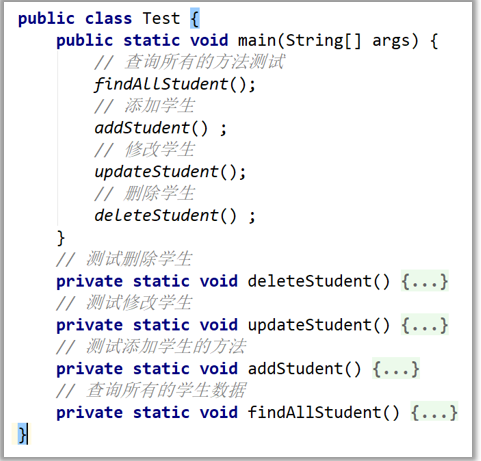

但是在main方法中写测试代码有如下的几个问题：

1. 只能在main方法编写测试代码，去调用其他方法进行测试。

2. 无法实现自动化测试，一个方法测试失败，可能影响其他方法的测试。

3. 无法得到测试的报告，需要程序员自己去观察测试是否成功。


为了测试更加方便，有一些第三方的公司或者组织提供了很好用的测试框架，给开发者使用。

这里给同学们介绍一种Junit测试框架。

Junit是第三方公司开源出来的，用于对代码进行单元测试的工具（IDEA已经集成了junit框架）。

相比于在main方法中测试有如下几个优点:

1. 可以灵活的编写测试代码，可以针对某个方法执行测试，也支持一键完成对全部方法的自动化测试，且各自独立。
2. 不需要程序员去分析测试的结果，会自动生成测试报告出来。

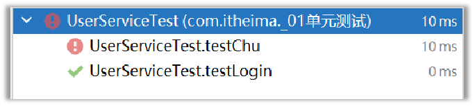

## 2.单元测试快速入门

我们知道单元测试是什么之后，接下来我们使用一下。

由于Junit是第三方提供的，所以我们需要把jar包导入到我们的项目中，才能使用，具体步骤如下：

1. 将Junit框架的jar包导入到项目中（注意：IDEA集成了Junit框架，不需要我们自己手工导入了）

2. 为需要测试的业务类，定义对应的测试类，并为每个业务方法，编写对应的测试方法（必须：公共、无参、无返回值）

3. 测试方法上必须声明@Test注解，然后在测试方法中，编写代码调用被测试的业务方法进行测试；

4. 开始测试：选中测试方法，右键选择“JUnit运行” ，如果测试通过则是绿色；如果测试失败，则是红色

接下来，我们就按照上面的步骤，来做一个案例使用一下:

需求：某个系统，有多个业务方法，请使用Junit单元测试框架，编写测试代码，完成对这些方法的正确性测试

1）先准备一个类表示业务方法，假设写了一个User类，代码如下

```java
public class User {

    /**
     * 给定一个身份证号, 计算出该用户的年龄
     * @param idcard 身份证号
     */
    public Integer getAge(String idcard){
        //1 截取身份证号索引的6~14位，不包括14位,得到出生年月日
        String birthday = idcard.substring(6, 14);  //birthday="20011018"
        //2 将字符串类型的年月日解析成LocalDate对象
        LocalDate parse = LocalDate.parse(birthday, DateTimeFormatter.ofPattern("yyyyMMdd"));
        //3 计算当前时间距离出生日期的时间间隔
        return Period.between(parse, LocalDate.now()).getYears();
    }

    /**
     * 给定一个身份证号, 计算出该用户的性别
     * @param idcard 身份证号
     */
    public String getGender(String idcard){
        //1 截取身份证号索引的16位，也就是倒数第二位
        String gender = idcard.substring(16, 19);
        //2 转换成整数
        int number = Integer.parseInt(gender);
        //3 奇数表示男，偶数表示女
        return number % 2 == 1 ? "男" : "女";
    }

}
```

2）接下来，写一个测试类，测试User具类中的方法能否正常使用。

```java
/*
   需求：定义单元测试类，测试UserService中的方法
   测试方法注意点：
       1、必须无参数 无返回值的非静态方法，Junit4中的测试方法必须是公开的(public)
       2、测试方法必须使用@Test注解标记。
    预期结果的正确性测试：断言
       Assertions.assertEquals(错误的标识消息, 预期结果, 实际结果);
   Junit5.xxxx版本其它注解：
       @DisplayName：指定测试类、测试方法显示的名称(默认为类名、方法名)
       @ParameterizedTest：参数化测试的注解(可以让单个测试运行多次，每次运行时仅参数不同)，用了该注解就不需要@Test注解
       @ValueSource：参数化测试的参数来源，赋予测试方法参数，与参数化测试注解ParameterizedTest配合使用
       @BeforeEach：用来修饰实例方法，该方法会在每一个测试方法执行之前执行一次
       @AfterEach：用来修饰实例方法，该方法会在每一个测试方法执行之后执行一次
       @BeforeClass：用来静态修饰方法，该方法会在所有测试方法之前只执行一次
       @AfterClass：用来静态修饰方法，该方法会在所有测试方法之后只执行一次
 */
public class UserTest {

    //必须无参数 无返回值的非静态方法，Junit4中的测试方法必须是公开的(public)
    @Test  //表示该方法是一个测试方法，可以像main方法一样独立运行
    /*public*/ void testGetAge(){
        User user = new User();
        Integer age = user.getAge("421127200110182853");
        System.out.println("age = " + age);
    }

    //写完一个测试方法之后，后续的测试方法可以使用alt+insert--->Test Method生成

    @Test
    void testGetGender() {
        User user = new User();
        String gender = user.getGender("421127200110182853");
        System.out.println("gender = " + gender);
    }
}
```

写完代码之后，我们会发现测试方法左边，会有一个绿色的三角形按钮。点击这个按钮，就可以运行测试方法。

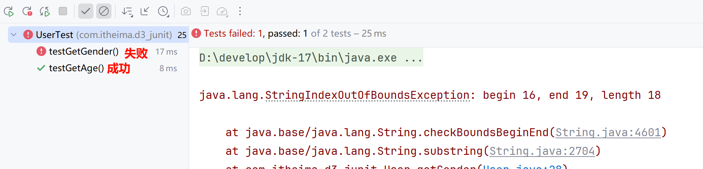

## 3.断言

JUnit提供了一些辅助方法，用来帮我们确定被测试的方法是否按照预期的效果正常工作，这种方式称为断言

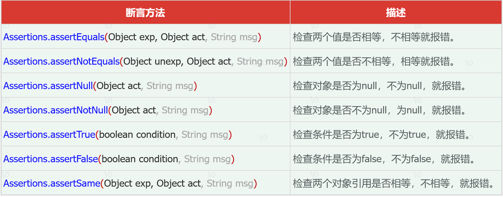

```java
/*
   需求：定义单元测试类，测试UserService中的方法
   
   测试方法注意点：
       1、必须无参数 无返回值的非静态方法，Junit4中的测试方法必须是公开的(public)
       2、测试方法必须使用@Test注解标记。
    预期结果的正确性测试：断言
       Assertions.assertEquals(错误的标识消息, 预期结果, 实际结果);
   Junit5.xxxx版本其它注解：
       @DisplayName：指定测试类、测试方法显示的名称(默认为类名、方法名)
       @ParameterizedTest：参数化测试的注解(可以让单个测试运行多次，每次运行时仅参数不同)，用了该注解就不需要@Test注解
       @ValueSource：参数化测试的参数来源，赋予测试方法参数，与参数化测试注解ParameterizedTest配合使用
       @BeforeEach：用来修饰实例方法，该方法会在每一个测试方法执行之前执行一次
       @AfterEach：用来修饰实例方法，该方法会在每一个测试方法执行之后执行一次
       @BeforeClass：用来静态修饰方法，该方法会在所有测试方法之前只执行一次
       @AfterClass：用来静态修饰方法，该方法会在所有测试方法之后只执行一次
 */
public class UserTest {

    //必须无参数 无返回值的非静态方法，Junit4中的测试方法必须是公开的(public)
    @Test  //表示该方法是一个测试方法，可以像main方法一样独立运行
    /*public*/ void testGetAge(){
        User user = new User();
        Integer age = user.getAge("421127200110182853");
        //System.out.println("age = " + age);
        //通过断言测试来判断方法是否按照预期执行。（将实际结果和预期结果比较，一样就显示绿条表示通过，不一样就是红色/黄色感叹号表示失败。）
        Assertions.assertEquals(24,age);  //参数1是预期值，参数2是实际值
    }

    //写完一个测试方法之后，后续的测试方法可以使用alt+insert--->Test Method生成

    @Test
    void testGetGender() {
        User user = new User();
        String gender = user.getGender("421127200110182863");
        //System.out.println("gender = " + gender);
        //Assertions.assertEquals("女",gender);  //参数1是预期值，参数2是实际值
        Assertions.assertEquals("女",gender,"性别获取不正确！"); //参数1是预期值，参数2是实际值
    }
}
```

## 4.常用注解

在JUnit中还提供了一些注解，还增强其功能，常见的注解有以下几个：

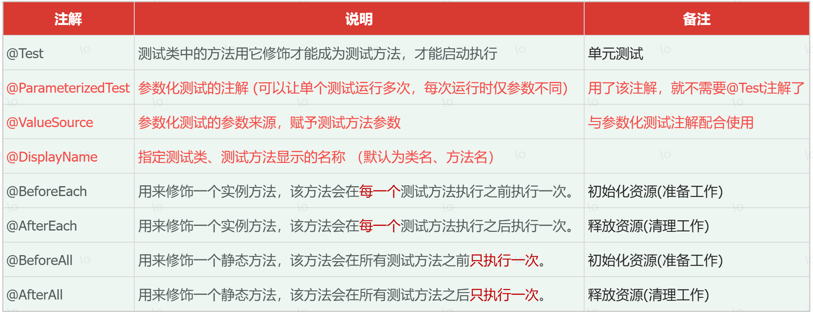

```java
/*
   需求：定义单元测试类，测试UserService中的方法
   测试方法注意点：
       1、必须无参数 无返回值的非静态方法，Junit4中的测试方法必须是公开的(public)
       2、测试方法必须使用@Test注解标记。
    预期结果的正确性测试：断言
       Assertions.assertEquals(错误的标识消息, 预期结果, 实际结果);
   Junit5.xxxx版本其它注解：
       @DisplayName：指定测试类、测试方法显示的名称(默认为类名、方法名)
       @ParameterizedTest：参数化测试的注解(可以让单个测试运行多次，每次运行时仅参数不同)，用了该注解就不需要@Test注解
       @ValueSource：参数化测试的参数来源，赋予测试方法参数，与参数化测试注解ParameterizedTest配合使用
       @BeforeEach：用来修饰实例方法，该方法会在每一个测试方法执行之前执行一次
       @AfterEach：用来修饰实例方法，该方法会在每一个测试方法执行之后执行一次
       @BeforeAll：用来静态修饰方法，该方法会在所有测试方法之前只执行一次
       @AfterAll：用来静态修饰方法，该方法会在所有测试方法之后只执行一次
 */
@DisplayName("测试User类") // @DisplayName：指定测试类、测试方法显示的名称(默认为类名、方法名)
public class UserTest {

    User user ;
    @BeforeEach //@BeforeEach：用来修饰实例方法，该方法会在每一个测试方法执行之前执行一次
    public void beforeEach(){
       System.out.println("beforeEach");
       user = new User();
    }

    @AfterEach //@AfterEach：用来修饰实例方法，该方法会在每一个测试方法执行之后执行一次
    public void afterEach(){
        System.out.println("afterEach");
    }

    @BeforeAll  //@BeforeAll：用来静态修饰方法，该方法会在所有测试方法之前只执行一次
    public static void beforeAll(){
        System.out.println("beforeAll");
    }
    @AfterAll  //@AfterAll：用来静态修饰方法，该方法会在所有测试方法之后只执行一次
    public static void afterAll(){
        System.out.println("afterAll");
    }

    //必须无参数 无返回值的非静态方法，Junit4中的测试方法必须是公开的(public)
    @Test  //表示该方法是一个测试方法，可以像main方法一样独立运行
    @DisplayName("测试getAge方法")
    /*public*/ void testGetAge(){
        Integer age = user.getAge("421127200110182853");
        System.out.println("age = " + age);
        //通过断言测试来判断方法是否按照预期执行。（将实际结果和预期结果比较，一样就显示绿条表示通过，不一样就是红色/黄色感叹号表示失败。）
        Assertions.assertEquals(24,age);  //参数1是预期值，参数2是实际值
    }

    //写完一个测试方法之后，后续的测试方法可以使用alt+insert--->Test Method生成
    //@Test
    @DisplayName("测试getGender方法")
    //@ParameterizedTest：参数化测试的注解(可以让单个测试运行多次，每次运行时仅参数不同)，用了该注解就不需要@Test注解
    @ParameterizedTest
    //@ValueSource：参数化测试的参数来源，赋予测试方法参数，与参数化测试注解ParameterizedTest配合使用
    @ValueSource(strings = {"421127200110182853","420881199901011263"})
    void testGetGender(String idCard) {
        String gender = user.getGender(idCard);
        System.out.println("gender = " + gender);
        //判断
        switch (idCard){
            case "421127200110182853"-> Assertions.assertEquals("男",gender,"性别获取不正确！");
            case "420881199901011263"-> Assertions.assertEquals("女",gender,"性别获取不正确！");
            default -> System.out.println("传递的值不正确");
        }
    }
}
```

# 三、日志技术

## 1.认识日志以及logback

### 1.1.什么是日志

程序运行过程中产生的信息\(数据\)叫日志，我们可以把这些信息输出到控制台、文件等地方。一旦程序出现bug，或者出现一些意外的情况，程序员可以通过分析日志文件，来排查问题。

如下是正常的日志信息

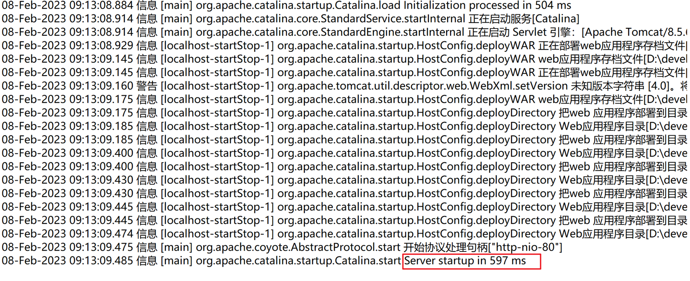

如下是异常日志信息

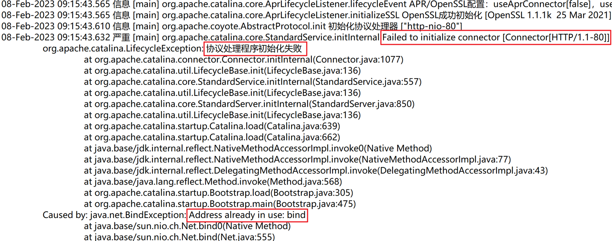

### 1.2.什么是日志技术

把信息输出到控制台或者存储到文件/数据库中的技术叫日志技术。

System\.out\.println\(“…”\)是不是日志技术呢?  No！No！No！

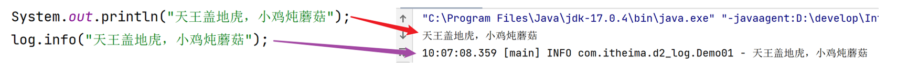

输出语句的弊端：

- 信息只会展示在控制台

- 不能将日志记录到其他的位置（文件，数据库）。

- 想取消日志，需要修改源代码才可以完成

### 1.3.日志技术的体系结构

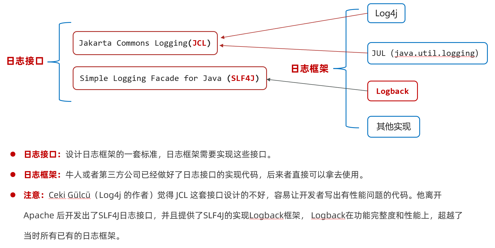

### 1.4.logback日志框架

官网地址：[https://logback\.qos\.ch](https://logback.qos.ch/)

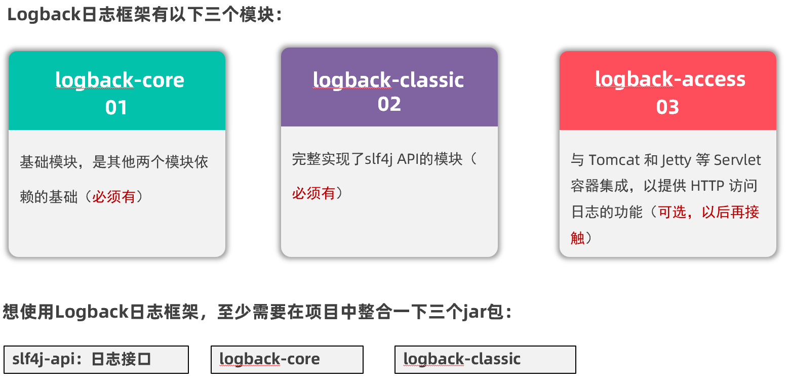

## 2.快速入门

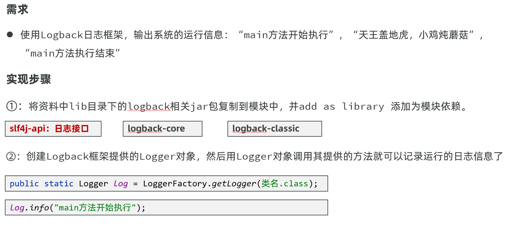

```java
//目标：掌握在项目中导入Logback日志技术并使用
/*
   需求：利用logback日志技术，将日志信息打印在控制台
   Logback日志技术导入步骤：
        1.将资料中lib目录下的logback相关jar包复制到模块中，并add as library 添加为模块依赖
        2.创建Logback框架提供的Logger对象，然后用Logger对象调用其提供的方法就可以记录运行的日志信息了
            Logger log=loggerFactory.getLogger(类.class);
            log.info("main方法开始执行");
            log.info("天王盖地虎，小鸡炖蘑菇");
            log.info("main方法执行结束");
   注意：如果项目中引入了lombok工具包，可以在类上使用@Slf4j注解，idea在编译阶段可以为我们自动生成log对象。
 */
@Slf4j
public class Demo01 {
    //参数值：Demo01.class表示日志信息是Demo01类中输出的。
    //private static Logger log = LoggerFactory.getLogger(Demo01.class);
    public static void main(String[] args) {
        log.info("main方法开始执行");
        log.info("天王盖地虎，小鸡炖蘑菇");
        log.info("main方法执行结束");
        //需求：以日志的形式输出name和age信息。
        String name="张益达";
        int age=20;
        //方式一：字符串拼接
        log.info("姓名："+name+" ,年龄："+age+"岁");
        //方式二：使用{}占位符【推荐】
        log.info("姓名：{} ,年龄：{}岁",name,age);
    }
}
```

> 注意：如果项目中引入了lombok工具包，可以在类上使用@Slf4j注解，idea在编译阶段可以为我们自动生成log对象。
>

## 3.配置文件

我们可以在src目录中提供一个logback\.xml配置文件来对Logback日志框架进行个性化控制

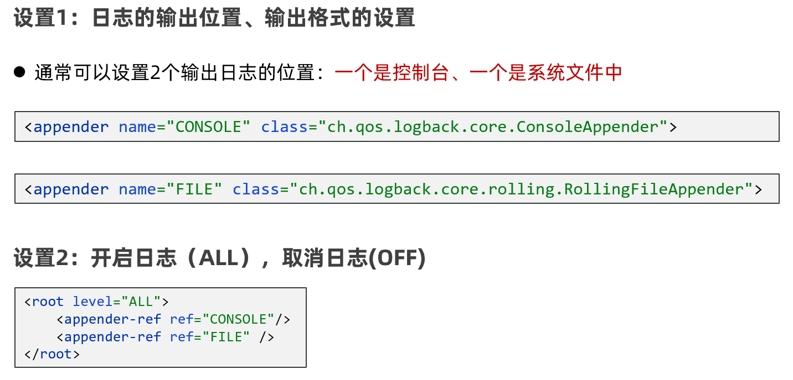

```XML
<?xml version="1.0" encoding="UTF-8"?>
<configuration>
    <!--
        CONSOLE ：表示当前的日志信息是可以输出到控制台的。
    -->
    <appender name="CONSOLE" class="ch.qos.logback.core.ConsoleAppender">
        <!--输出流对象 默认 System.out 如果想显示红色信息，可以改为 System.err-->
        <target>System.out</target>
        <encoder>
            <!--格式化输出：%d表示日期，%thread表示线程名，%-5level：级别，从左显示5个字符宽度，
            %c：哪个类输出的日志，%msg：日志消息，%n是换行符-->
            <pattern>%d{yyyy-MM-dd HH:mm:ss.SSS} [%thread] [%-5level] %c : %msg%n</pattern>
        </encoder>
    </appender>

    <!-- File是输出的方向通向文件的 -->
    <appender name="FILE" class="ch.qos.logback.core.rolling.RollingFileAppender">
        <encoder>
            <!--%logger{36}和上述%c作用一样-->
            <pattern>%d{yyyy-MM-dd HH:mm:ss.SSS} [%thread] %-5level %logger{36} - %msg%n</pattern>
            <charset>utf-8</charset>
        </encoder>

        <!--日志输出路径-->
        <file>D:/log/itheima-data.log</file>
        <!--指定日志文件拆分和压缩规则-->
        <rollingPolicy
                class="ch.qos.logback.core.rolling.SizeAndTimeBasedRollingPolicy">
            <!--通过指定压缩文件名称，来确定分割文件方式-->
            <fileNamePattern>D:/log/itheima-data-%d{yyyy-MM-dd}-%i.log.zip</fileNamePattern>
            <!--文件拆分大小-->
            <maxFileSize>100KB</maxFileSize>
        </rollingPolicy>
    </appender>

    <!--

    level:用来设置打印级别，大小写无关：TRACE, DEBUG, INFO, WARN, ERROR, ALL 和 OFF
    <root>可以包含零个或多个<appender-ref>元素，标识这个输出位置将会被本日志级别控制。
    -->
    <root level="ALL">
        <appender-ref ref="CONSOLE"/>
        <appender-ref ref="FILE" />
    </root>
</configuration>
```

## 4.日志级别

日志级别指的是日志信息的类型，用于控制系统中哪些类型的日志可以输出，常见的日志级别如下\(由低到高\):

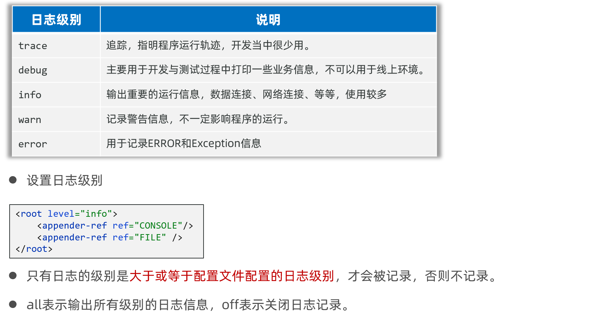

```java
//目标：掌握在程序中打印不同级别的日志
/*
   级别程度排序：TRACE< DEBUG< INFO< WARN< ERROR
        默认级别是debug（忽略大小写）

   级别作用：控制系统中哪些日志级别是可以输出的
        只输出级别不低于设定级别的日志信息

   使用方式：在root标签中的level属性中配置
        ALL：打开全部日志信息
        OFF：关闭全部日志信息
 */
@Slf4j
public class Demo02 {
    public static void main(String[] args) {
        log.trace("trace级别日志信息");
        log.debug("debug级别日志信息");
        log.info("info级别日志信息");
        log.warn("warn级别日志信息");
        log.error("error级别日志信息");
    }
}
```

logback\.xml配置文件中设置日志级别

```XML
    <!--

    level:用来设置打印级别，大小写无关：TRACE, DEBUG, INFO, WARN, ERROR, ALL 和 OFF
    <root>可以包含零个或多个<appender-ref>元素，标识这个输出位置将会被本日志级别控制。
    -->
<!--    <root level="DEBUG">  &lt;!&ndash;开发和测试阶段使用debug级别&ndash;&gt;-->
    <root level="INFO">  <!--线上环境使用info级别，那么别info级别低的日志信息都不展示-->
        <appender-ref ref="CONSOLE"/>
        <appender-ref ref="FILE" />
    </root>
```

运行效果

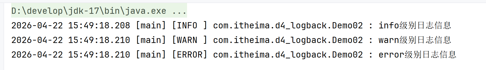

# 四、动态代理

## 1.动态代理概述

本次我们学习一个java的高级技术叫做动态代理。这是设计模式中的一种,多数用于框架的底层,学习此技术目的就是为了后期在使用框架时更好的理解框架的原理。

首先我们认识一下代理长什么样？我们以大明星“超越”例。

假设现在有一个明星叫超越，她有唱歌和跳舞的本领，作为明星是要用唱歌和跳舞来赚钱的，但是每次做节目，唱歌的时候要准备话筒、收钱，再唱歌；跳舞的时候也要准备场地、收钱、再唱歌。


超越觉得我擅长的做的事情是唱歌，和跳舞，但是每次唱歌和跳舞之前或者之后都要做一些繁琐的事情，有点烦。

于是超越就找个一个经济公司，请了一个代理人，代理超越处理这些事情，如果有人想请超越演出，直接找代理人就可以了。如下图所示

我们说超越的代理是中介公司派的，那中介公司怎么知道，要派一个有唱歌和跳舞功能的代理呢？

解决这个问题，java使用的是接口，超越想找代理，在java中需要超越实现了一个接口，接口中规定要唱歌和跳舞的方法。java就可以通过这个接口为超越生成一个代理对象，只要接口中有的方法代理对象也会有。

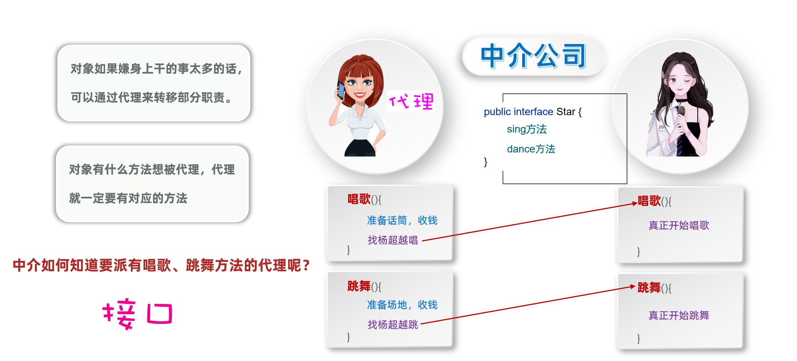

接下来我们就先把有唱歌和跳舞功能的接口，和实现接口的大明星类定义出来。

明星行为接口

```java
public interface Star {
    
	// 提供唱歌方法
    public String sing();

	//提供跳舞方法
    public String dance();
}
```

明星类:

```java
//大明星：提供唱歌和跳舞两个功能
public class BigStar implements Star{

	//提供唱歌方法
    public String sing(){
        System.out.println("开始唱歌>>>");
        return "谢谢1";
    }

	//提供跳舞方法
    public String dance(){
        System.out.println("开始跳舞>>>闪电五连鞭>>>");
        return "谢谢2";
    }
}
```

定义中介公司使用JDK中的方式给明星产生代理对象

那jdk中提供了怎么生成代理的功能如下:

java\.lang\.reflect\.Proxy类：提供了为对象产生代理对象的方法：

```java
public static Object newProxyInstance(ClassLoader loader, Class<?>[] interfaces, InvocationHandler h) 
参数一：类加载器，为代理对象生成class对象，从而产生代理对象。
参数二：接口们，规定生成代理对象和目标对象要实现相同的接口，从而具有相同的功能。
参数三：调用处理器，当调用代理对象方法时，该处理器就来处理代理逻辑。也就是用来定义代理对象要做的事。
返回值：生成的代理对象。
```

测试类中代码如下:

```java
/*
    动态代理开发步骤：
        1、定义接口(Star)，里面定义行为(sing和dance方法)，表示目标对象和代理对象都具有的功能。
        2、定义目标类(BigStart)实现Star接口，重写sing和dance方法，这个实现类的对象代表被代理的对象。
        3、定义一个测试类，在测试类创建目标对象，然后为其创建一个代理对象返回。（重点）
        4、代理对象中，首先需要输出”收首付款” ，然后调用目标对象方法唱歌和跳舞方法，最后输出”收尾款”。
        5、有了代理对象之后，调用代理对象的sing和dance方法，观察输出结果。

    Proxy类获取动态代理对象：
        public static Object newProxyInstance(ClassLoader loader, Class<?>[] interfaces, InvocationHandler h)
            参数一：类加载器，为代理对象生成class对象，从而产生代理对象。
            参数二：接口们，规定生成代理对象和目标对象要实现相同的接口，从而具有相同的功能。
            参数三：调用处理器，当调用代理对象方法时，该处理器就来处理代理逻辑。也就是用来定义代理对象要做的事。
            返回值：生成的代理对象。
    InvocationHandler接口中的invoke方法：
        public Object invoke(Object proxy, Method method, Object[] args)
            参数一：代理对象。
            参数二：调用代理对象的方法。
            参数三：调用代理对象方法传递的参数值。
            返回值：哪里调用代理对象方法，此处的返回值就返回到哪里。
 */
public class Demo {
    public static void main(String[] args) {
        //3、定义一个测试类，在测试类创建目标对象，然后为其创建一个代理对象返回。（重点）
        //3.1 创建目标对象
        BigStar bigStar = new BigStar();
        /* 3.2 创建一个代理对象
            ClassLoader loader：类加载器，为代理对象生成class对象，从而产生代理对象。一般给谁生成代理对象就通过谁获取类加载器
            Class<?>[] interfaces：接口们，规定生成代理对象和目标对象要实现相同的接口，从而具有相同的功能。
            InvocationHandler h：调用处理器，当调用代理对象方法时，该处理器就来处理代理逻辑。也就是用来定义代理对象要做的事
           返回值：生成的代理对象。
         */
        ClassLoader loader = bigStar.getClass().getClassLoader();
        Class<?>[] interfaces = {Star.class};
        Star proxyObj = (Star) Proxy.newProxyInstance(loader, interfaces, new InvocationHandler() {
            //只要代理对象方法被调用了，此invoke方法就会执行，需要在此方法中定义代理对象要做的事。
            @Override
            public Object invoke(Object proxy, Method method, Object[] args) throws Throwable {
                //4、代理对象中，首先需要输出”收首付款” ，然后调用目标对象方法唱歌和跳舞方法，最后输出”收尾款”。
                System.out.println("收首付款");
                System.out.println("让大明星唱歌跳舞");
                System.out.println("收尾款");
                return null;
            }
        });

        //5、有了代理对象之后，调用代理对象的sing和dance方法，观察输出结果。
        proxyObj.sing();
        proxyObj.dance();
    }
}
```

```java
/*
    动态代理开发步骤：
        1、定义接口(Star)，里面定义行为(sing和dance方法)，表示目标对象和代理对象都具有的功能。
        2、定义目标类(BigStart)实现Star接口，重写sing和dance方法，这个实现类的对象代表被代理的对象。
        3、定义一个测试类，在测试类创建目标对象，然后为其创建一个代理对象返回。（重点）
        4、代理对象中，首先需要输出”收首付款” ，然后调用目标对象方法唱歌和跳舞方法，最后输出”收尾款”。
        5、有了代理对象之后，调用代理对象的sing和dance方法，观察输出结果。

    Proxy类获取动态代理对象：
        public static Object newProxyInstance(ClassLoader loader, Class<?>[] interfaces, InvocationHandler h)
            参数一：类加载器，为代理对象生成class对象，从而产生代理对象。
            参数二：接口们，规定生成代理对象和目标对象要实现相同的接口，从而具有相同的功能。
            参数三：调用处理器，当调用代理对象方法时，该处理器就来处理代理逻辑。也就是用来定义代理对象要做的事。
            返回值：生成的代理对象。
    InvocationHandler接口中的invoke方法：
        public Object invoke(Object proxy, Method method, Object[] args)
            参数一：代理对象。
            参数二：调用代理对象的方法。
            参数三：调用代理对象方法传递的参数值。
            返回值：哪里调用代理对象方法，此处的返回值就返回到哪里。
 */
public class Demo {
    public static void main(String[] args) {
        //1 创建目标对象(BigStar)
        BigStar bigStar = new BigStar();
        /*2 创建代理对象
          ClassLoader loader：类加载器，为代理对象生成class对象，从而产生代理对象。
          Class<?>[] interfaces：接口们，规定生成代理对象和目标对象要实现相同的接口，从而具有相同的功能。
          InvocationHandler h：调用处理器，当调用代理对象方法时，该处理器就会执行。也就是用来定义代理对象要做的事。
          返回值：生成的代理对象（proxyObj）。
         */
        ClassLoader loader = bigStar.getClass().getClassLoader();  //给谁代理就通过谁获取类加载器
        Class<?>[] interfaces = {Star.class};
        //注意：此处将返回的代理对象必须强转成Star接口类型，否则无法调用sing()和dance()方法
        Star proxyObj = (Star) Proxy.newProxyInstance(loader, interfaces, new InvocationHandler() {
            /**
             在invoke方法中义代理对象要做的事,代理对象的任何方法被调用，invoke方法都会执行
             * @param proxy 代理对象
             * @param method 调用代理对象的方法。例如：下面proxyObj.sing()调用sing方法，method就是sing方法
             * @param args 调用代理对象方法传递的参数值
             * @return 哪里调用代理对象方法，此处的返回值就返回到哪里
             */
            @Override
            public Object invoke(Object proxy, Method method, Object[] args) throws Throwable {
                //错误类型：StackOverflowError：栈溢出错误。打印对象名会执行对象的toString方法，代理对象的toString方法调用了，invoke方法又会执行，死循环了。
                //System.out.println("proxy = " + proxy.toString());
                //System.out.println("method = " + method);
                //System.out.println("args = " + Arrays.toString(args));
                System.out.println("收首付款...");
                //调用目标对象方法，然目标对象干活(唱歌、跳舞)
                //要求：外面调用了代理对象什么方法，此处就需要调用目标对象什么方法(需要知道外面调用代理对象的什么方法)
                Object result = method.invoke(bigStar, args);
                System.out.println("收尾款...");
                return result;
            }
        });

        //3 调用代理对象方法(如果直接使用目标对象，那么就没有增强的效果)
        String value = proxyObj.sing();
        System.out.println("调用sing方法的返回值：" + value );
        value  = proxyObj.dance();
        System.out.println("调用dance方法的返回值：" + value );
        System.out.println("------------------");
        //proxyObj.equals(new Demo());
    }
}
```

执行效果:

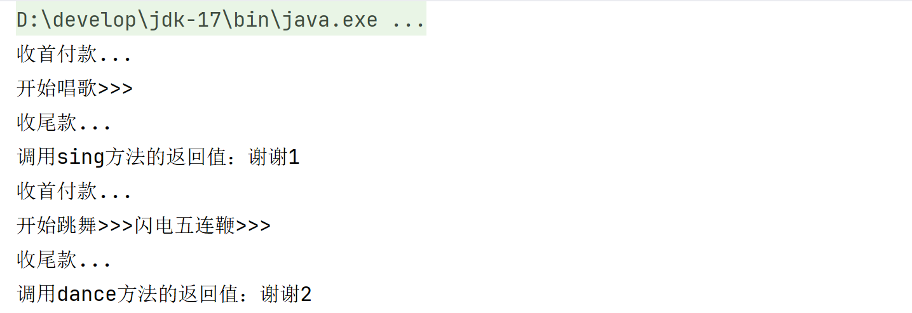

结论:动态代理可以实现,在不侵入源代码的情况下,实现功能的增强。

## 2.动态代理的作用

需求：通过动态代理技术，实现记录操作Map集合的各个方法的耗时。

### 2.1.代码实现

```java
/*
需求：通过动态代理技术，实现记录操作Map集合的各个方法的耗时。
 */
@Slf4j
public class Demo02 {
    public static void main(String[] args) {
        //1 创建目标对象
        Map<String,Integer> map = new HashMap<>();
        
        //2 创建代理对象
        ClassLoader loader = map.getClass().getClassLoader();
        Class<?>[] interfaces = {Map.class};
        Map<String,Integer> proxyMap = (Map<String, Integer>) Proxy.newProxyInstance(loader, interfaces, new InvocationHandler() {
            @Override
            public Object invoke(Object proxy, Method method, Object[] args) throws Throwable {
                //2.1 获取开始时间
                long start = System.nanoTime();
                //2.2 调用目标对象方法(和调用代理对象方法一样的方法)
                Object result = method.invoke(map, args);
                //2.3 获取结束时间
                long end = System.nanoTime();
                //System.out.println("执行"+method.getName() + "方法，传递的参数值是"+ Arrays.toString(args) +"，执行共耗时：" + (end-start)+"纳秒");
                //log.info("执行方法" + method.getName() + "耗时：" + (end - start) + "纳秒");
                log.info("执行方法{}耗时：{}纳秒",method.getName(),(end - start));
                return result;
            }
        });

        //3 调用代理对象方法
        //存值
        proxyMap.put("张益达",20);
        proxyMap.put("张伟",26);
        proxyMap.put("张大炮",23);
        //取值
        Integer value = proxyMap.get("张益达");
        System.out.println("value = " + value);
        //移除值
        proxyMap.remove("张大炮");
        //打印集合中的数据
        System.out.println(proxyMap);
    }
}
```

### 2.2.好处总结 

通过代码可以发现动态代理好处如下:

1. 减少重复代码

2. 代码无侵入

3. 提高开发效率

4. 维护方便

那将来在那可以用的到呢？

在我们后面学习的spring框架中`AOP思想`可以为我们的对象产生代理对象,去实现较复杂的增强。

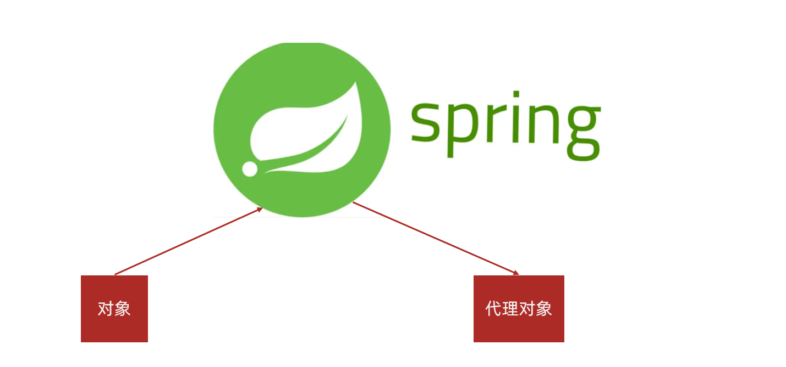
