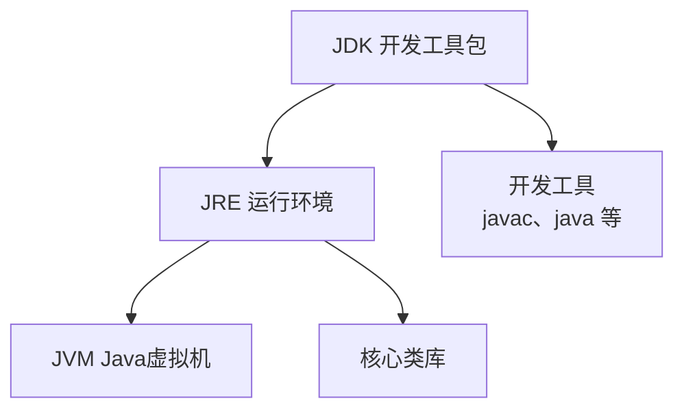
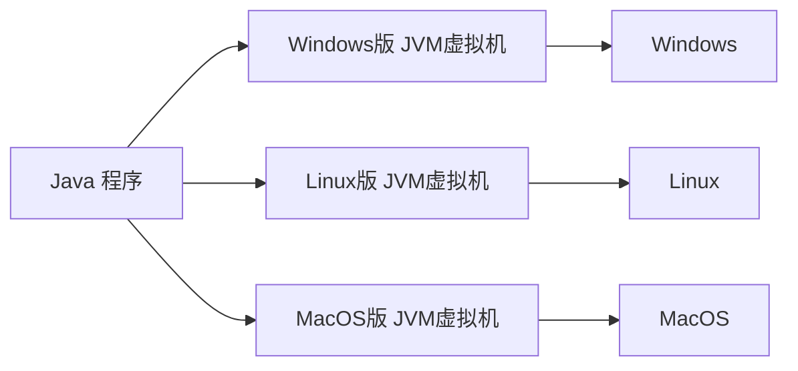

# 第一章：Java 开发环境搭建

## 目录

1. Java 背景介绍
2. JDK 工具的下载和安装
3. 第一个 Java 程序 HelloWorld
4. Java 程序执行原理
5. Java 环境配置

---

## 第 1 章 Java 背景介绍

### 1.1 Java 的由来

- Java 是一门**高级编程语言**（计算机高级编程语言）。
- 1995 年由 **James Gosling（詹姆斯·高斯林）** 在 **Sun 公司**开发。
- 2009 年 Sun 公司被 **Oracle 公司（甲骨文）** 收购，此后 Java 归 Oracle 所有。
- 詹姆斯·高斯林被誉为"Java 之父"：
  - 1955 年出生于加拿大
  - 1977 年获得卡尔加里大学计算机学士学位
  - 1983 年获得卡内基梅隆大学计算机博士学位

### 1.2 学习 Java 能做什么

| 方向 | 典型例子 |
| --- | --- |
| 桌面应用开发 | IDEA、Eclipse（开发工具本身也是 Java 写的） |
| 企业级应用开发 | 微服务、大型互联网应用（Java 最主要的应用场景） |
| 移动应用开发 | Android |
| 服务器系统 | 应用的后台 |
| 大数据开发 | Hadoop |
| 游戏开发 | 我的世界（Minecraft） |

### 1.3 Java 的三大技术平台

| 平台 | 全称 | 定位 |
| --- | --- | --- |
| Java SE | Java Standard Edition（标准版） | Java 技术的核心和基础 |
| Java EE | Java Enterprise Edition（企业版） | 企业级应用开发的一套解决方案 |
| Java ME | Java Micro Edition（小型版） | 针对移动设备应用的解决方案 |

### 1.4 本章小结（问答）

- **Java 是什么？** 一门高级编程语言。
- **Java 是哪家公司研发的，现在属于哪家公司？** Sun 公司研发，现在属于 Oracle 公司。
- **Java 之父是谁？** 詹姆斯·高斯林（James Gosling）。
- **Java 能做什么？** 基本上什么都可以干，主要做企业服务端开发。
- **Java 有哪三大平台？** JavaSE（标准版）、JavaEE（企业版）、JavaME（小型版）。

---

## 第 2 章 JDK 工具的下载和安装

### 2.1 什么是 JDK

- 开发 Java 程序必须先安装 **JDK（Java Development Kit，Java 开发工具包）**。
- **LTS 版本（Long-Term-Support，长期支持版本）**：JDK 7、8、11、17、21。
- 很多企业目前仍在使用 **JDK 8 / JDK 11**。
- 使用占比趋势（统计年份为 2020、2022、2023、2024）：
  - JDK 8：2020 年占比最高（约 80% 以上），随后逐年下降；
  - JDK 11：在 2022–2023 年成为主流版本；
  - JDK 17：自 2023 年起快速增长，2024 年已成为主要版本之一；
  - JDK 21：2024 年刚出现，占比还很小。

### 2.2 JDK 的下载

- 官方下载地址：Oracle 官网的 "Java Downloads | Oracle 中国"。
- 下载三步：
  1. **选择 JDK 版本**（如 JDK 17、JDK 21 等 LTS 版本）；
  2. **选择操作系统版本**（Windows / Linux / macOS）；
  3. **选择安装包类型**：一般选 `x64 Installer`（.exe 图形安装包），也可选 `x64 Compressed Archive`（.zip 免安装压缩包）或 `x64 MSI Installer`。
- 以 JDK 17.0.11 为例，Windows x64 Installer 安装包约 153.91 MB。

### 2.3 安装完成后的验证

安装完成后，通过 CMD 命令行测试是否安装成功：

1. 同时按下键盘上的 **Win + R** 键，打开"运行"窗口；
2. 在窗口中输入 `cmd`，按 **Enter** 键，弹出 DOS 命令行窗口；
3. 在命令行中输入以下命令，查看 Java 工具及其版本：

```text
java -version
javac -version
```

成功示例（JDK 17.0.11）：

```text
java version "17.0.11" 2024-04-16 LTS
Java(TM) SE Runtime Environment (build 17.0.11+7-LTS-207)
Java HotSpot(TM) 64-Bit Server VM (build 17.0.11+7-LTS-207...)
javac 17.0.11
```

### 2.4 javac 与 java 命令

- 我们写好的 Java 程序都是**高级语言**，计算机底层硬件不能直接识别这些语言；
- 必须先通过 **javac（编译工具）** 进行翻译；
- 然后再通过 **java（执行工具）** 执行，才能驱动机器干活。
- 这两个命令位于 JDK 安装目录的 `bin` 文件夹下（`javac.exe`、`java.exe`）。

### 2.5 JDK 的组成



| 组成部分 | 说明 |
| --- | --- |
| **JVM**（Java Virtual Machine） | Java 虚拟机，真正运行 Java 程序的地方 |
| **核心类库** | Java 自己写好的程序，给程序员自己的程序调用 |
| **JRE**（Java Runtime Environment） | Java 的运行环境 = JVM + 核心类库 |
| **JDK**（Java Development Kit） | Java 开发工具包，包含以上所有 = JRE + 开发工具 |

### 2.6 本章小结（问答）

- **要使用 Java 必须先安装什么？去哪里下载？** JDK（Java Development Kit）开发者工具包；Oracle 官网。
- **LTS 版本有哪些？很多企业还在使用哪个 JDK 版本？** JDK 8、11、17、21；很多企业还在使用 JDK 8 / JDK 11。
- **如何验证 JDK 是否安装成功？** 打开命令行窗口，输入 `java -version`、`javac -version` 查看版本号。
- **JDK 中最重要的两个命令程序是什么？各自作用？** javac（编译工具）、java（执行工具）。

### 补充：DOS 常用命令

| 常用命令 | 作用 |
| --- | --- |
| `盘符:` | 切换盘符，如 `D:`、`E:` |
| `dir` | 查看当前路径下的文件信息 |
| `cd 目录名` | 进入单级目录，如 `cd itheima` |
| `cd ..` | 回退到上一级目录 |
| `cd /` | 回退到盘符根目录 |
| `cls` | 清屏 |
| `Tab` 键 | 自动补全指定字符开头的单词 |
| `↑` / `↓` 键 | 查看历史命令 |
| `exit` | 退出 |

---

## 第 3 章 第一个 Java 程序 HelloWorld

### 3.1 Java 程序的开发步骤


1. **编写代码**：用记事本等编辑器编写 `HelloWorld.java`（`.java` 后缀的源代码文件）；
2. **编译代码**：命令行执行 `javac 程序名.java`（如 `javac HelloWorld.java`），生成 `.class` 字节码文件；
3. **运行代码**：命令行执行 `java 程序名`（如 `java HelloWorld`，**不带后缀**），控制台输出结果。

### 3.2 HelloWorld 代码及逐行解释

```java
public class HelloWorld {
    public static void main(String[] args) {
        System.out.println("Hello World !");
    }
}
```

| 代码部分 | 作用 |
| --- | --- |
| `class` | 定义一个类，后面跟上的是类名称 |
| `main` 方法 | 程序执行时的入口点，main 方法也称之为主方法 |
| `System.out.println("...")` | 打印语句，使程序在控制台打印双引号所包裹的内容 |
| `public` | 权限修饰符（后面章节详细讲解）；现阶段暂时理解为"限制类名称和文件名需要保持一致" |

### 3.3 常见错误与解决办法（共 6 类）

**1. Windows 的文件扩展名没有勾选**

- 现象：新建的文件实际名为 `HelloWorld.java.txt`，文件类型显示为"文本文档"，而不是 JAVA 文件。
- 解决：在文件资源管理器"查看"选项卡中勾选"文件扩展名"，再新建 Java 文件。

**2. 代码写对了，但是忘记保存**

- 现象：记事本标题栏文件名前出现 `*` 号，表示修改后尚未保存。
- 解决：按 `Ctrl + S` 保存文件。

**3. 文件名和类名不一致**

- 现象：文件叫 `HelloWorld.java`，但代码里写的是 `public class HelloWolrd`（类名拼错）。
- 报错：

```text
HelloWorld.java:1: 错误: 类 HelloWolrd 是公共的，应在名为 HelloWolrd.java 的文件中声明
public class HelloWolrd {
```

- 解决：`public` 类的类名必须与文件名保持一致。

**4. 大小写错误、单词拼写错误、存在中文符号、找不到 main 方法**

- 常见错误写法：
  - `Public class HelloWorld`（P 大写，应为小写 `public`）；
  - `mian`（应为 `main`，导致找不到主方法）；
  - 字符串引号用了中文全角引号 `“ ”` 等中文符号。
- 典型报错：

```text
错误: 编码 GBK 的不可映射字符 (0x9B)
错误: 需要 class、interface、enum 或 record
错误: 需要';'
```

- 解决：关键字全小写且拼写正确；main 方法签名必须为 `public static void main(String[] args)`；代码中的符号（括号、引号、分号）全部使用英文半角。

**5. 括号不配对**

- 现象：大括号/小括号缺少配对的另一半（如 main 方法少一个 `}`）。
- 报错：

```text
HelloWorld.java:5: 错误: 进行语法分析时已到达文件结尾
```

- 解决：所有括号成对出现，写完代码后检查一遍。

**6. 编译、执行工具使用不当**

- 错误用法：`java HelloWorld.class`（运行命令带了 `.class` 后缀）。
- 报错：

```text
错误: 找不到或无法加载主类 HelloWorld.class
原因: java.lang.ClassNotFoundException: HelloWorld.class
```

- 正确用法：编译 `javac HelloWorld.java`（带后缀），运行 `java HelloWorld`（不带后缀）。

### 3.4 本章小结（问答）

- **开发一个 Java 程序要经历哪三个步骤？** 编写、编译（javac）、运行（java）。
- **Java 代码编写有什么基本要求？**
  - 文件名称的后缀必须是 `.java` 结尾；
  - 文件名称必须与代码的类名称一致；
  - 必须使用英文模式下的符号。

---

## 第 4 章 Java 程序执行原理

### 4.1 计算机底层只能识别 0 和 1

- 计算机底层都是硬件电路，通过"不通电"和"通电"表示 `0` 和 `1`。
- 机器语言示例：`00011100 00110101`。
- 最早期的程序员通过机器语言编程：在穿孔纸带上打孔记录二进制指令（有孔 = 1，无孔 = 0），再通过电传打字机等设备输入计算机执行。

### 4.2 编程语言发展历程


- 高级语言更简单，使用接近人类自己的语言书写代码，再将其翻译成计算机能理解的机器指令。
- 不管是什么样的高级编程语言，最终都要翻译成计算机底层可以识别的机器语言。

### 4.3 Java 的跨平台原理



- **总结**：在需要运行 Java 应用程序的操作系统上，安装一个与操作系统对应的 **JVM（Java Virtual Machine，Java 虚拟机）** 即可。
- Java 程序本身不直接依赖操作系统，JVM 作为"翻译官/桥梁"，因此 Java 可以实现"一次编写，到处运行"的跨平台能力。

### 4.4 本章小结（问答）

- **Java 程序的执行原理是什么？** 不管是什么样的高级编程语言，最终都要翻译成计算机底层可以识别的机器语言。
- **机器语言是由什么组成的？** 0 和 1。
- **Java 跨平台指的是什么？原理又是什么？** Java 程序可以在任意操作系统中运行；在不同的操作系统中，安装与之对应版本的 JVM 虚拟机。

---

## 第 5 章 Java 环境配置

### 5.1 什么是 Path 环境变量

- **Path 环境变量**用于记住程序路径，方便在命令行窗口的任意目录启动程序。
- 例子（QQ）：QQ 实际安装位置为 `D:\App\QQ\QQ.exe`。把 `D:\App\QQ` 配置到 Path 环境变量后，无论在 C 盘、D 盘还是 E 盘的任意目录下，输入 `QQ` 都能直接启动该程序，无需输入完整路径。

### 5.2 Path 环境变量的位置与原理

- **位置**：`此电脑 → 属性 → 高级系统设置 → 高级 → 环境变量`。
- **原理**：当我们在 Path 中配置了某个程序路径后，命令行窗口启动该程序时，系统会按照 Path 中记录的路径去查找并启动程序。

### 5.3 配置 Path（针对 JDK）

- 配置示例：

```text
Path = E:\develop\Java\jdk21\bin
```

- 注意：**这是本机路径，不要照抄，要去自己电脑上复制 JDK 安装目录下的 `bin` 文件夹路径**。
- 注意事项：
  - 目前较新的 JDK 安装时会**自动**将 javac、java 程序的路径配置到 Path 环境变量中，因此 javac、java 可以直接使用；
  - 以前较老的 JDK 在安装时**没有**自动配置 Path 环境变量，此时必须自己手动配置；
  - 建议自己确认或手动配置好 "PATH" 和 "JAVA_HOME"。

### 5.4 验证配置是否成功

- 重新配置环境变量后，必须检测是否配置成功：打开命令行窗口，输入 `java -version`、`javac -version` 查看版本提示。
- 验证目标：命令行窗口的任意目录下都可以直接使用 `javac` 和 `java` 命令。
- 成功示例（JDK 21）：

```text
java version "21.0.5" 2024-10-15 LTS
Java(TM) SE Runtime Environment (build 21.0.5+9-LTS-239)
Java HotSpot(TM) 64-Bit Server VM (build 21.0.5+9-LTS-239, mixed mode, sharing)
```

### 5.5 JAVA_HOME

- **JAVA_HOME**：告诉操作系统 JDK 安装在了哪个位置。
- 作用：将来其他技术（如 Maven、Tomcat、IDEA 等）要通过这个环境变量找到 JDK。

### 5.6 本章小结（问答）

- **什么是 Path 环境变量？** 用于配置程序的路径，方便我们在命令行窗口的任意目录下启动该程序。
- **JDK 安装时，关于环境变量的配置需要注意什么？** 较新版本的 JDK 会自动配置 PATH 环境变量，较老的 JDK 版本则不会；建议还是自己配置一下 "PATH" 和 "JAVA_HOME"。

---

## 附：全章核心速查

- **一句话流程**：编写 `.java` 源代码 → `javac` 编译生成 `.class` 字节码 → `java` 运行（由 JVM 执行）→ 控制台输出结果。
- **关键命令**：
  - `javac 程序名.java`：编译；
  - `java 程序名`：运行（不带后缀）；
  - `java -version` / `javac -version`：验证安装与环境配置。
- **核心概念**：
  - JDK ⊃ JRE（JVM + 核心类库）+ 开发工具；
  - JVM 是 Java 跨平台的关键；
  - Path 用于记住程序路径，JAVA_HOME 用于告诉系统 JDK 的安装位置。
