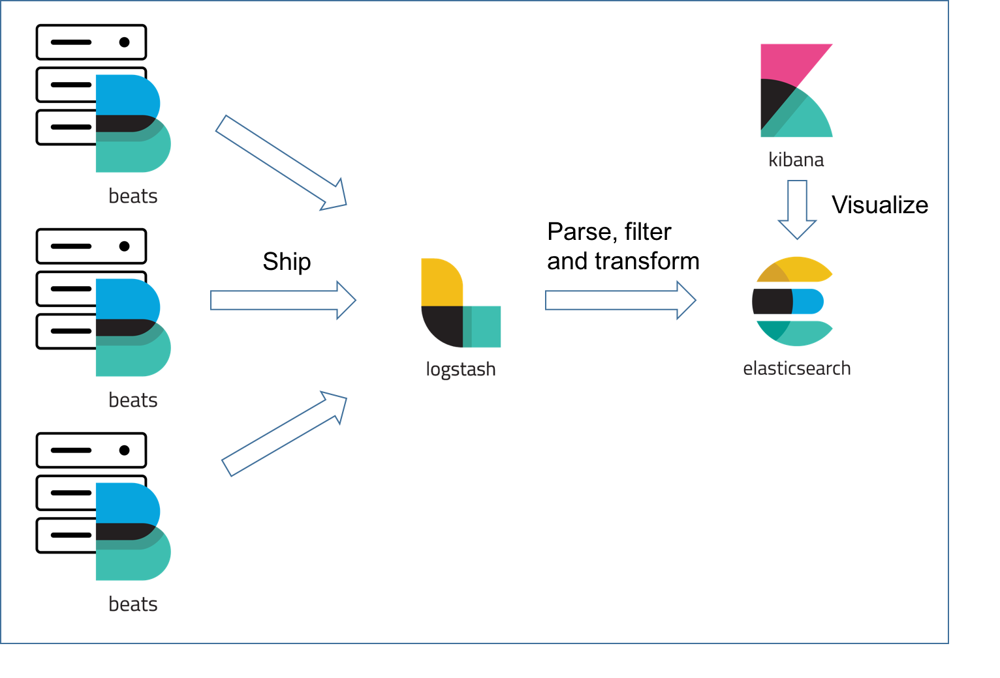
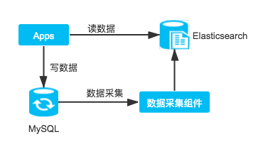
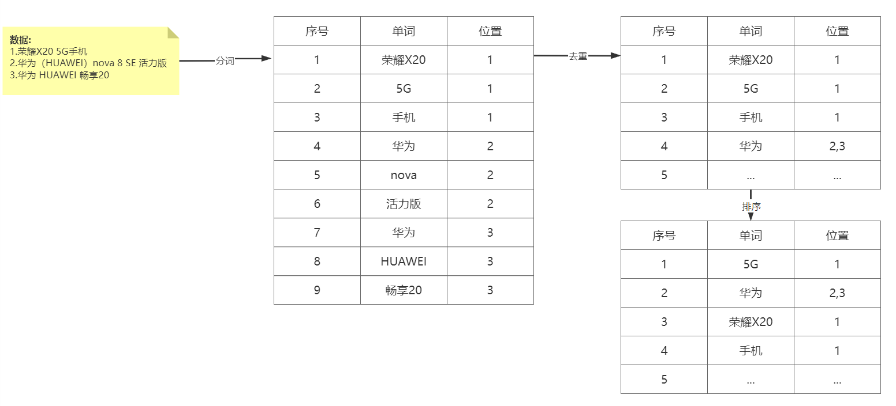
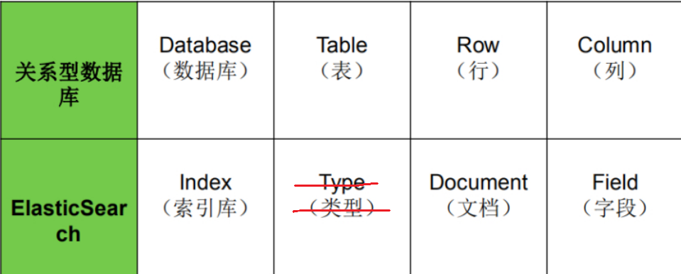
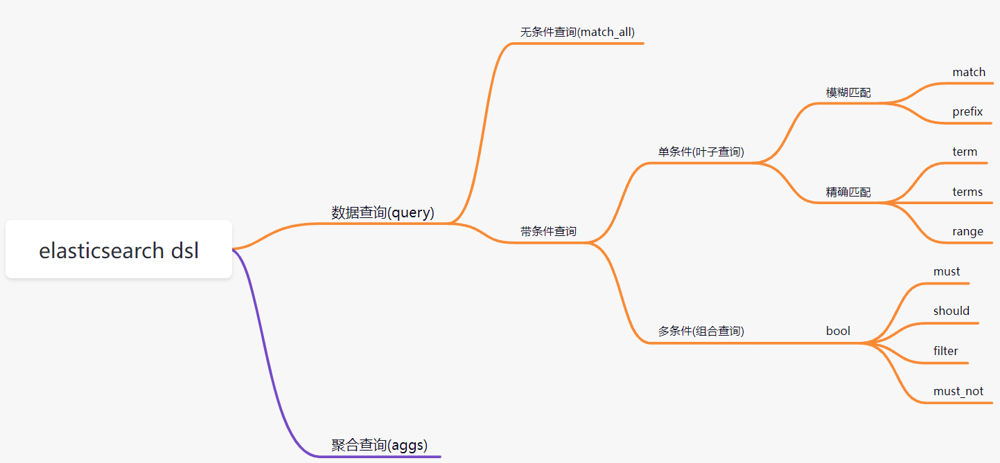

# 1 Elasticsearch概述

## 1.1 elasticsearch简介

官网: https://www.elastic.co/

ElasticSearch是一个基于Lucene的搜索服务器。它提供了一个分布式多用户能力的全文搜索引擎，基于RESTful web接口。Elasticsearch是用Java开发的，并作为Apache许可条款下的开放源码发布，是当前流行的企业级搜索引擎。 

[Elastic](https://so.csdn.net/so/search?q=Elastic&spm=1001.2101.3001.7020)官方宣布Elasticsearch进入Version 8，在速度、扩展、高相关性和简单性方面开启了一个全新的时代。

说明：Elasticsearch 8最低jdk版本要求jdk17，当前我们选择Elasticsearch版本：Elasticsearch8.5.0

## 1.2 Elasticsearch的特性

**实时**
理论上数据从写入Elasticsearch到数据可以被搜索只需要1秒左右的时间，实现`准实时`的数据索引和查询。

**分布式、可扩展** 
天生的分布式的设计，数据分片对于应用层透明，扩展性良好，可以轻易的进行节点扩容，支持上百甚至上千的服务器节点，支持`PB级别`的数据存储和搜索。

**稳定可靠**
Elasticsearch的分布式、数据冗余特性提供更加可靠的运行机制，且经过大型互联网公司众多项目使用，可靠性得到验证。

**高可用**
数据多副本、多节点存储，单节点的故障不影响集群的使用。

**Rest API** 
Elasticsearch提供标准的Rest API，这使得所有支持Rest API的语言都能够轻易的使用Elasticsearch，具备多语言通用的支持特性，易于使用。Elasticsearch Version 8以后，去除了以前Transport API、High-Level API、Low-Level API，统一标准的Rest API，这将使得Elasticsearch更加容易使用，原来被诟病的API混乱问题终于得到完美解决。

**高性能**
Elasticsearch底层构建基于Lucene，具备强大的搜索能力，即便是PB级别的数据依然能够实现秒级的搜索。

**多客户端支持**
支持Java、Python、Go、PHP、Ruby等多语言客户端，还支持JDBC、ODBC等客户端。

**安全支持**
提供单点登录SSO、加密通信、集群角色、属性的访问控制，支持审计等功能，在安全层面上还支持集成第三方的安全组件，在Version 8以后，默认开启了HTTPS，大大简化了安全上的配置。

## 1.3 Elasticsearch应用场景

**搭建日志系统**
日志系统应该是Elasticsearch使用最广泛的场景之一了，Elasticsearch支持海量数据的存储和查询，特别适合日志搜索场景。广泛使用的ELK套件(Elasticsearch、Logstash、Kibana)是日志系统最经典的案例，使用Logstash和Beats组件进行日志收集，Elasticsearch存储和查询应用日志，Kibana提供日志的可视化搜索界面。



**搭建数据分析系统**
Elasitcsearch支持数据分析，例如强大的数据聚合功能，通过搭配Kibana，提供诸如直方图、统计分组、范围聚合等方便使用的功能，能够快速实现一些数据报表等功能。
在数字化转型的大行其道的当下，需要从海量数据中发现数据的规律，从而做出一定的决策，Elasticsearch一定是最适合的解决方案之一。


**搭建搜索系统**
Elasticsearch为搜索而生，用于搭建**全文搜索系统**是自然而然的事情，它能够提供快速的索引和搜索功能，还有相关的评分功能、分词插件等，支持丰富的搜索特性，可以用于搭建大型的搜索引擎，更加常用语实现站内搜索，例如银行App、购物App等站内商品、服务搜索。



**作为独立数据库系统**
Elasticsearch本身提供了数据持久化存储的能力，并且提供了增删改查的功能，在某些应用场景下可以**直接当做数据库系统**来使用，既提供了存储能力，又能够同时具备搜索能力，整体技术架构会比较简单，例如博客系统、评论系统。需要注意的是，**Elasticsearch不支持事务**，且**写入的性能相对关系型数据库稍弱**，所有需要使用事务的场景都不能将Elasticsearch当做唯一的数据库系统，这使得这种使用场景很少见。

> 面试题：Mysql和Elasticsearch的区别？
>
> Elasticsearch（ES）和MySQL是两种不同类型的数据库系统，它们在查询语言、索引结构、使用场景以及性能与架构方面有所区别。以下是具体分析：
>
> 1. **查询语言**：MySQL使用的是结构化查询语言（SQL），这是一种通用的查询语言，适用于各种关系型数据库系统。而Elasticsearch使用的是自己的查询语言(DSL)，基于JSON格式，这使得它更适合于处理复杂的搜索和全文匹配任务。
> 2. **索引结构**：MySQL主要使用B+树作为索引结构，这是一种平衡多路搜索树，适合存储和检索有序的数据。Elasticsearch则使用倒排索引，这对于全文搜索计算更为高效。
> 3. **使用场景**：MySQL更适合处理事务性操作，如电商网站的下单支付等业务，因为它能够确保数据的安全和一致性。Elasticsearch则更擅长处理大规模的数据搜索和分析，如日志分析、全文搜索等场景。
> 4. **性能与架构**：Elasticsearch在处理大量非结构化数据时通常比MySQL更快，因为它是为分布式环境设计的，能够水平扩展以处理大量数据。而MySQL在处理结构化数据和小到中等规模的数据时表现更佳。
>
> 总的来说，Elasticsearch和MySQL在查询语言、索引结构等方面存在显著差异。选择哪种数据库取决于具体的应用场景和需求。

## 1.4 全文搜索引擎

Google，百度类的网站搜索，它们都是根据网页中的**关键字**生成索引，我们在搜索的时候输入关键字，它们会将该关键字即索引匹配到的所有网页返回；还有常见的项目中应用日志的搜索等等。对于这些非结构化的数据文本，关系型数据库搜索不是能很好的支持。

一般**传统数据库**，全文检索都实现的很鸡肋，因为一般也没人用数据库存文本字段（text）。进行全文检索需要**扫描整个表**，如果数据量大的话即使对SQL的语法**优化**，也收效甚微。建立了索引，但是维护起来也很麻烦，对于 insert 和 update 操作都会重新构建索引。

这里说到的**全文搜索引擎**指的是目前广泛应用的主流**搜索引擎**。它的工作原理是计算机索引程序通过扫描文章中的每一个词，**对每一个词建立一个索引，指明该词在文章中出现的次数和位置**，当用户查询时，检索程序就根据事先建立的索引进行查找，并将查找的结果反馈给用户的检索方式。这个过程类似于通过字典中的检索字表查字的过程。


## 1.5 倒排索引

正排索引： 文档-关键字

倒排索引：关键字-文档




**倒排索引步骤:**

- 数据根据词条进行**分词**，同时记录文档索引位置
- 将词条相同的数据化进行**去重合并**
- 对词条进行**排序**

**搜索过程:**

先将搜索词语进行**分词**，分词后再**倒排索引列表查询文档位置**(docId)。根据docId**查询文档数据。**


# 2 elasticsearch核心概念

### 2.1 es对照数据库



### 2.2 索引(Index)（表）

一个索引就是一个拥有几分相似特征的文档的集合。比如说，你可以有一个客户数据的索引，另一个产品目录的索引，还有一个订单数据的索引。一个索引由一个名字来标识（必须全部是小写字母），并且当我们要对这个索引中的文档进行索引、搜索、更新和删除的时候，都要使用到这个名字。在一个集群中，可以定义任意多的索引。 

能搜索的数据必须索引，这样的好处是可以提高查询速度，比如：新华字典前面的目录就是索引的意思，目录可以提高查询速度。

***Elasticsearch索引的精髓：一切设计都是为了提高搜索的性能。***

### 2.3 类型(Type)

在一个索引中，你可以定义一种或多种类型。

一个类型是你的索引的一个逻辑上的分类/分区，其语义完全由你来定。通常，会为具有一组共同字段的文档定义一个类型。不同的版本，类型发生了不同的变化

```java
// 索引: ecommerce
//   Type: product  → 商品文档
//   Type: user     → 用户文档
//   Type: order    → 订单文档
```

| 版本 | Type                                           |
| ---- | ---------------------------------------------- |
| 5.x  | 支持多种type                                   |
| 6.x  | 只能有一种type                                 |
| 7.x  | 默认不再支持自定义索引类型（默认类型为：_doc） |
| 8.x  | 默认类型为：_doc                               |

> Elasticsearch在6版本中弃用type类型的原因主要有以下几点：
>
> 1. 性能考虑
>
>    - 在Elasticsearch的设计初期，借鉴了关系型数据库的概念引入了type。然而，Elasticsearch是基于Lucene的搜索引擎，其核心优势在于全文检索功能，这种功能依赖于倒排索引。倒排索引的生成是基于index而非type，多个type的存在反而会增加索引的复杂度，进而影响搜索速度和性能。为了保持“一切为了搜索”的宗旨，去除type是合理的选择。
>
> 2. 数据结构简化
>
>    - 在Elasticsearch中，如果一个index里存在多个type，所有不同type的同名字段内部使用的是同一个Lucene字段存储。例如，user类型的user_name字段和tweet类型的user_name字段是存储在一个field里的，两个类型里的user_name必须有一样的字段定义。这可能导致一些问题，比如希望同一个索引中某个字段在不同type里有不同的数据类型或存储方式时无法实现。而且，这种设计会导致数据稀疏，影响Lucene有效压缩数据的能力。
>
> 3. 避免误解和错误使用
>
>    - 很多人将Elasticsearch与关系型数据库进行类比，把index类比为数据库，把type类比为表。但实际上，这两者有很大的不同。在关系型数据库中，表是相互独立的，一个表中的列和另外一个表中的同名列没有关系，互不影响。但在Elasticsearch的type中则不是这样，这种错误的类比容易导致对Elasticsearch的错误理解和使用，从而引发各种问题。
>
> 4. 逐步过渡的需要
>
>    - 由于历史原因，前期Elasticsearch支持一个index下存在多个type，很多项目都在使用这一特性。如果直接去除type的概念，会对这些项目造成很大的影响，需要进行大量的业务、功能和代码修改。因此，采取逐步过渡的方式，先在6.X版本限制一个index只能有一个type，然后在7.X版本中完全去除type，这样可以给开发者更多的时间来适应和调整。

### 2.4 文档(Document)

mysql中的一行记录，java一个对象表示，es中文档--JSON对象

一个文档是一个可被索引的基础信息单元，也就是一条数据

比如：你可以拥有某一个客户的文档，某一个产品的一个文档，当然，也可以拥有某个订单的一个文档。文档以**JSON（Javascript Object Notation）格式**来表示，而JSON是一个到处存在的互联网数据交互格式。

在一个index/type里面，你可以存储任意多的文档。

### 2.5 字段(Field)

相当于是数据表的字段，对文档数据根据不同属性进行的分类标识。

### 2.6 映射(Mapping)

mapping是处理数据的方式和规则方面做一些限制，如：某个字段的数据类型、默认值、分析器、是否被索引等等。这些都是映射里面可以设置的，其它就是处理ES里面数据的一些使用规则设置也叫做映射，按着最优规则处理数据对性能提高很大，因此才需要建立映射，并且需要思考如何建立映射才能对性能更好。

# 4 Elasticsearch 基础功能

参考文档：https://www.elastic.co/guide/en/elasticsearch/reference/8.5/elasticsearch-intro.html

 我们在Kibana（前面已经安装过） 软件给大家演示基本操作

详见《软件环境安装》

### 4.1 分词器-----组词的规则

官方提供的分词器有这么几种: standard、Letter、Lowercase、Whitespace、UAX URL Email、Classic、Thai等，中文分词器可以使用第三方的比如IK分词器。前面我们已经安装过了。

Standard分词器: 默认分词器 ，对中文的分词特点：单字切分

~~~json
POST _analyze
{
  "analyzer": "standard",
  "text": "我是中国人"
}

~~~


IK分词器: 中文分词器,分词特点:中文词语级别拆分

```json
POST _analyze
{
  "analyzer": "ik_max_word",
  "text": "我们都是中国人"
}

POST _analyze
{
  "analyzer": "ik_smart",
  "text": "我们都是中国人"
}


```


### 4.2 索引操作

ES 软件的索引可以类比为 MySQL 中表的概念，创建一个索引，类似于创建一个表

#### 4.2.1 创建索引

语法: PUT /{索引名称}

```json
PUT /my_index

结果:
{
  "acknowledged" : true,
  "shards_acknowledged" : true,
  "index" : "my_index"
}
```

#### 4.2.2 查看所有索引

```java
GET /_cat/indices
GET /_cat/indices?v
```

#### 4.2.3 查看单个索引

语法: GET /{索引名称}

```json
GET /my_index
```

#### 4.2.4 删除索引

语法: DELETE /{索引名称}

```json
DELETE /my_index
结果:
{
  "acknowledged" : true
}
```

### 4.3 文档操作

文档是 ES 软件搜索数据的最小单位, 不依赖预先定义的模式，所以可以将文档类比为表的一行JSON类型的数据。我们知道关系型数据库中，要提前定义字段才能使用，在Elasticsearch中，对于字段是非常灵活的，有时候我们可以忽略该字段，或者动态的添加一个新的字段。

#### 4.3.1 添加文档

语法:

~~~shell
PUT /{索引名称}/{类型}/{id}
{
	jsonbody
}
~~~


在创建数据时，需要指定唯一性标识，请求范式 POST，PUT 都可以

```shell
PUT /my_index/_doc/1
{
  "title": "小米手机",
  "category": "手机",
  "images": "http://www.gulixueyuan.com/xm.jpg",
  "price": 3999
}

POST /my_index/_doc/2
{
  "title": "华为电脑",
  "category": "电脑",
  "images": "http://www.gulixueyuan.com/xm.jpg",
  "price": 5000
}
```

#### 4.3.2 根据id查看文档

语法:GET /{索引名称}/{类型}/{id}

```shell
GET /my_index/_doc/1
```

#### 4.3.3 查询所有文档

##### 语法: GET /{索引名称}/_search

```tex
GET /my_index/_search
```

#### 4.3.4 修改文档

语法:   需要指定唯一性标识，请求范式 POST，PUT 都可以

~~~
PUT /{索引名称}/{类型}/{id}
{
	jsonbody
}
~~~


```shell
PUT /my_index/_doc/1
{
  "title": "小米手机",
  "category": "手机",
  "images": "http://www.gulixueyuan.com/xm.jpg",
  "price": 4500
}

```

#### 4.3.5 修改局部属性

语法: 

POST /{索引名称}/_update/{docId}
{
  "doc": {
    "属性": "值"
  }
}

**注意：这种更新只能使用post方式。**

```shell
POST /my_index/_update/1
{
  "doc": {
    "price": 4500
  }
}
```

### 4.3.6 批量修改属性

```shell
PUT /_bulk
{ "update": { "_index": "my_index", "_id": "1" } }
{ "doc": { "price": 3899, "title": "小米手机3 升级版22" } }
{ "update": { "_index": "my_index", "_id": "2" } }
{ "doc": { "price": 2999, "title": "小米手机2222" } }
```


#### 4.3.6 删除文档

语法: DELETE /{索引名称}/{类型}/{id}

```shell
DELETE /my_index/_doc/1
```

### 4.4 映射mapping 

创建数据库表需要设置字段名称，类型，长度，约束等；索引库也一样，需要知道这个索引下有哪些字段，每个字段有哪些约束信息，这就叫做**映射(mapping)**。

#### 4.4.1 查看映射

语法: GET /{索引名称}/_mapping

```json
GET /my_index/_mapping
```

#### 4.4.2 动态映射

在关系数据库中，需要事先创建数据库，然后在该数据库下创建数据表，并创建 表字段、类型、长度、主键等，最后才能基于表插入数据。而Elasticsearch中不 需要定义Mapping映射（即关系型数据库的表、字段等），在文档写入 Elasticsearch时，会根据文档字段**自动识别类型**，这种机制称之为**动态映射**。

映射规则对应:

| 数据        | 对应的类型 |
| ----------- | ---------- |
| null        | 字段不添加 |
| true\|flase | boolean    |
| 字符串      | text       |
| 数值        | long       |
| 小数        | float      |
| 日期        | date       |

#### 4.4.3 静态映射

静态映射是在Elasticsearch中也可以事先定义好映射，即手动映射，包含文档的各字段类型、分词器等，这称为**静态映射**。

```shell
#删除原创建的索引
DELETE /my_index

#创建索引，并同时指定映射关系和分词器等。
PUT /my_index
{
  "mappings": {
    "properties": {
      "title": {
        "type": "text",
        "index": true,
        "analyzer": "ik_max_word",
        "search_analyzer": "ik_smart"
      },
      "category": {
        "type": "keyword",
        "index": true
      },
      "images": {
        "type": "keyword",
        "index": true
      },
      "price": {
        "type": "integer",
        "index": true
      }
    }
  }
}

```

**type分类如下: ** 

-  字符串：text(支持分词)和 keyword(不支持分词)。 
-  text：该类型被用来索引长文本，在创建索引前会将这些文本进行分词，转化为词的组合，建立索引；允许es来检索这些词，text类型不能用来排序和聚合。 
-  keyword：该类型不能分词，可以被用来检索过滤、排序和聚合 ,用text进行分词模糊检索。 
-  数值型：long、integer、short、byte、double、float   
-  日期型：date 
-  布尔型：boolean 

# 5 DSL高级查询

### 5.1 DSL概述

Query DSL概述: Domain Specific Language(领域专用语言)，Elasticsearch提供了基于JSON的DSL来定义查询。

**DSL概览:**

> DSL(Domain Specific Language)，英译中的结果就是，领域特定语言。DSL指的是专注于某个应用程序领域的计算机语言，又译作领域专用语言。不同于其他计算机语言，顾名思义，这种语言只用在某些特定的领域。ES DSL是专门属于ES的查询语言，elasticsearch提供标准Restful风格的查询DSL来定义查询。
>
> 
>
> 可以将查询DSL看作由两种子句组成的查询的AST(Abstract Syntax Tree)：
>
> 
>
> 一种是lqc(leaf query clauses，叶查询语句)，可以理解为SQL里的where查询，在特定的字段中查找特定值，例如match，term或range查询，这些查询可以单独使用；
>
> 
>
> 第二种是cqc(Compound query clauses，复合查询语句)，用于组合多个**查询must、should、must_not、filter**



准备数据:

```shell
PUT /my_index/_doc/1
{"id":1,"title":"华为笔记本电脑","category":"电脑","images":"http://www.gulixueyuan.com/xm.jpg","price":5388}

PUT /my_index/_doc/2
{"id":2,"title":"华为手机","category":"手机","images":"http://www.gulixueyuan.com/xm.jpg","price":5500}

PUT /my_index/_doc/3
{"id":3,"title":"小米手机","category":"手机","images":"http://www.gulixueyuan.com/xm.jpg","price":3600}

PUT /my_index/_doc/4
{"id":4,"title":"小米电脑","category":"电脑","images":"http://www.gulixueyuan.com/xm2.jpg","price":8000}
```

### 5.2 DSL查询

#### 5.2.1 查询所有文档

match_all"查询类型匹配所有文档

```shell
POST /my_index/_search
{
  "query": {
    "match_all": {}
  }
}

```

#### 5.2.2 匹配查询(match)

在Elasticsearch中，"match"关键字用于执行全文搜索，并具有模糊匹配的功能。在进行模糊匹配查询时，系统会对提供的文本进行分词后再进行匹配（注意： text类型才分词，keyword类型就不会分词）

match:

```shell
POST /my_index/_search
{
  "query": {
    "match": {
      "title": "华为智能手机"
    }
  }
}

```

#### 5.2.3 多字段匹配

在Elasticsearch中，"multi_match"查询类型用于执行多个字段的全文搜索,它允许用户在一个查询中指定多个字段.

```shell
POST /my_index/_search
{
  "query": {
    "multi_match": {
      "query": "华为智能手机",
      "fields": ["title","category"]
    }
  }
}

```

#### 5.2.4 关键字精确查询

**term:关键字不会进行分词。**

在Elasticsearch中，"term"查询不会对查询关键字进行分词，直接去找对应的字段去做匹配。

```shell
POST /my_index/_search
{
  "query": {
   "term": {
     "title": {
       "value": "华为手机"
     }
   }
  }
}

```

#### 5.2.6 多关键字精确查询

在Elasticsearch中，"terms"查询类型用于匹配多个值。它要求字段的值必须与指定的值列表中的任意一个值相等，否则不会返回任何结果

```shell
# 得到小米和华为的所有产品

POST /my_index/_search
{
  "query": {
    "terms": {
      "title": [
        "华为",
        "小米"
      ]
    }
  }
}

```


#### 5.2.9 组合查询

bool 各条件之间有and,or或not的关系

- must: 各个条件都必须满足，所有条件是and的关系  &
- should: 各个条件有一个满足即可，即各条件是or的关系 ||
- must_not: 不满足所有条件，即各条件是not的关系 !=
- filter: 与must效果等同，但是它不计算得分，效率更高点。

##### must

```shell
# 查询价格大于3000小于6000的华为手机

POST /my_index/_search
{
  "query": {
    "bool": {
      "must": [
        {
          "match": {
            "title": "华为"
          }
        },
        {
          "match": {
            "category": "手机"
          }
        },
        {
          "range": {
            "price": {
              "gte":3000,
              "lte": 6000
            }
          }
        }
      ]
    }
  }
}

```

##### should

```shell
POST /my_index/_search
{
  "query": {
    "bool": {
      "should": [
        {
          "match": {
            "title": "华为"
          }
        },
        {
          "match": {
            "category": "手机"
          }
        },
        {
          "range": {
            "price": {
              "gte":3000,
              "lte": 6000
            }
          }
        }
      ]
    }
  }
}

```

##### must_not

```shell
POST /my_index/_search
{
  "query": {
    "bool": {
      "must_not": [
        {
          "match": {
            "title": "华为"
          }
        },
        {
          "match": {
            "category": "手机"
          }
        },
        {
          "range": {
            "price": {
              "gte":3000,
              "lte": 6000
            }
          }
        }
      ]
    }
  }
}

```

##### filter

**_score的分值为0**

在Elasticsearch中，"filter"查询类型用于组合多个查询条件，并返回满足所有条件的文档。它与"must"查询类型类似，但不同之处在于，"filter"查询条件不会对结果进行评分，只会影响结果集的过滤

```shell
POST /my_index/_search
{
  "query": {
    "bool": {
      "filter": [
        {
          "match": {
            "title": "华为"
          }
        },
        {
          "match": {
            "category": "手机"
          }
        },
        {
          "range": {
            "price": {
              "gte":3000,
              "lte": 6000
            }
          }
        }
      ]
    }
  }
}

```

#### 5.2.11 排序

```shell
# 所有手机升序排列

POST /my_index/_search
{
  "query": {
    "match": {
      "category": "手机"
    }
  },

  "sort": [
    {
      "price": {
        "order": "asc"
      }
    }
  ]
}
```

#### 5.2.12 分页查询

分页的两个关键属性:from、size。

- from: 当前页的起始索引，默认从0开始。 from = (pageNum - 1) * size
- size: 每页显示多少条

```shell
# 3条数据为一页，显示第2页的列表

POST /my_index/_search
{
  "from": 3,
  "size": 3
}
```


