## 一、Redis概述

### 1.介绍

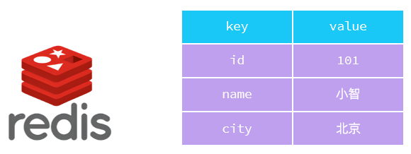

Redis是一个基于内存的key\-value结构的数据库，在项目开发中常用于做高速缓存、消息队列。（NoSQL数据库）

官网：https://redis.io

中文网：https://www.redis.net.cn/

主要特点：

- 基于内存存储，读写性能极高

- 丰富的数据类型支持，value支持多种数据类型，功能丰富

- 单线程，每个命令都具备原子性

- 支持数据的持久化

- 企业应用十分广泛

> NoSql：（Not Only SQL），不仅仅是SQL，泛指 非关系型数据库。NoSql数据库并不是要取代关系型数据库，而是关系型数据库的补充。
>
> - 关系型数据库：Mysql、Oracle、SQL Server、DB2 等。
>
> - 非关系型数据库：Redis、MongoDB、MemCached 等。
>

### 2.安装

1.将资料中提供的 `redis-windows-7.2.3.zip` 解压到指定目录\(没有中文\)下。

Redis的Windows版属于绿色软件，直接解压即可使用，解压后目录结构如下：

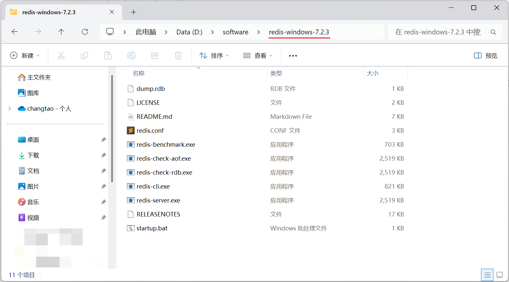

2.双击 `startup.bat` 脚本，即可运行Redis数据库。

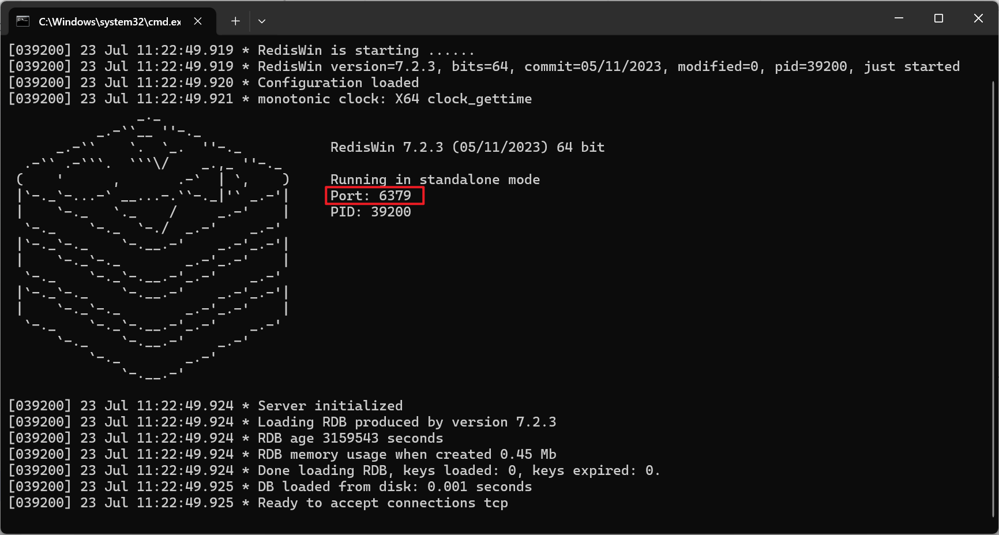

这样，就将Redis数据库启动起来了，启动起来后，我们可以双击  `redis-cli.exe` 打开Redis的客户端，输入一个指令 ping，如果响应了PONG，那就说明客户端和服务端连接上了。

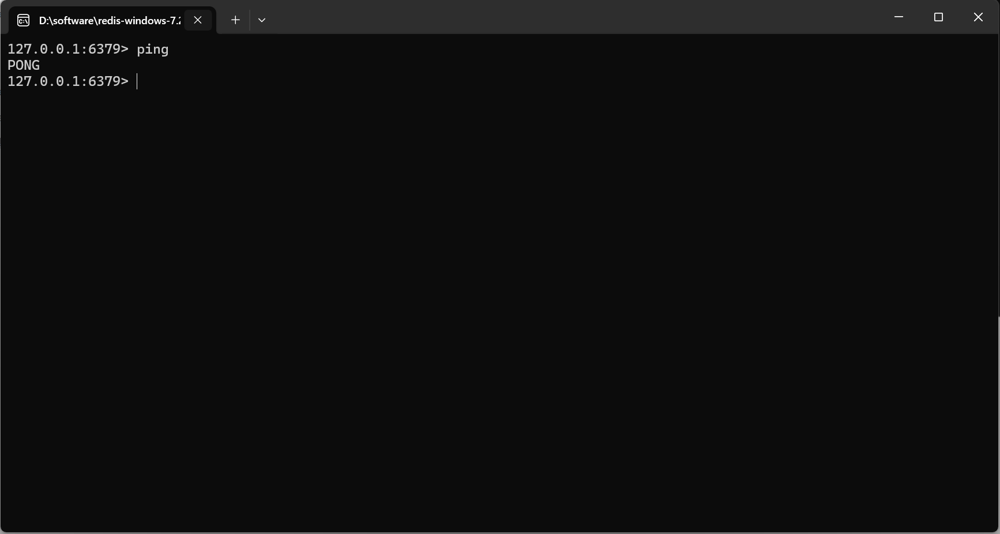

> 双击 `redis-cli.exe` ，会打开redis的客户端，默认连接的就是本机的6379端口的redis服务。
>
> 如果，要连接的是远程的Redis服务器，可以通过指定如下参数，进行连接：
>
> - \-h ：ip地址
>
> - \-p ：端口号
>
> - 比如：`redis-cli.exe -h 192.168.100.200 -p 6379`

## 二、Redis数据类型

### 1.介绍

Redis存储的是key\-value结构的数据，其中key是字符串类型，value有5种常用的数据类型：

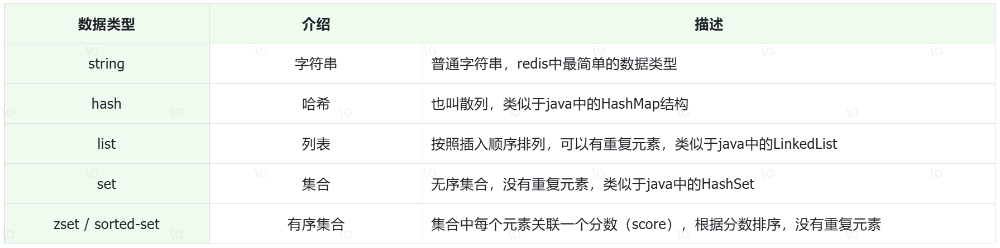

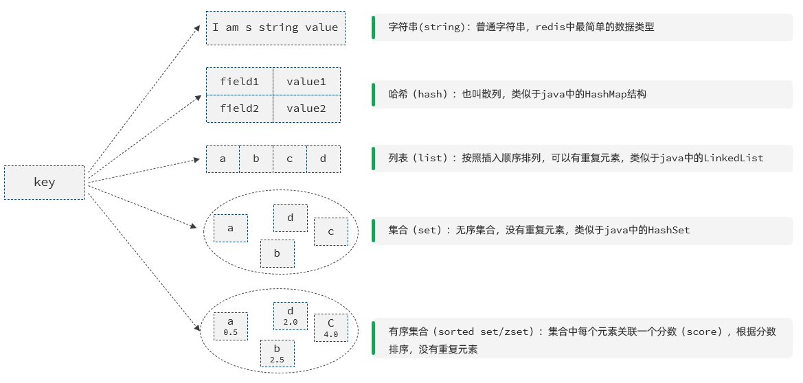

### 2.String

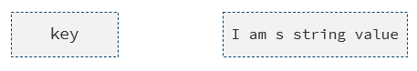

Redis 中字符串类型常用命令：

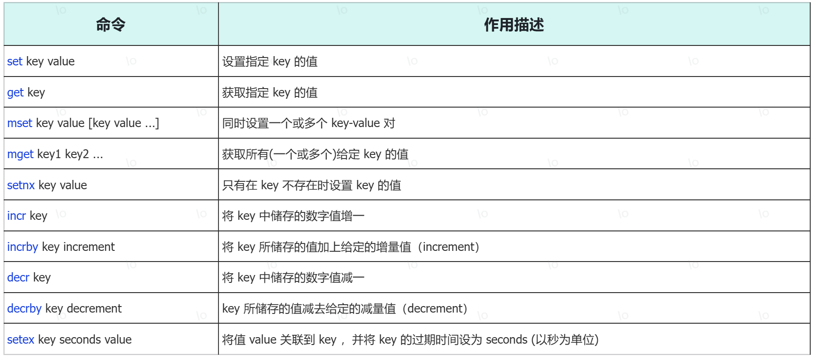

更多命令可以参考Redis中文网：https://www.redis.net.cn

### 3.Hash

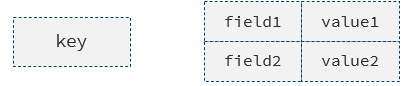

Hash是一个string类型的field和value的映射表，特别适合存储对象。常见的操作命令：

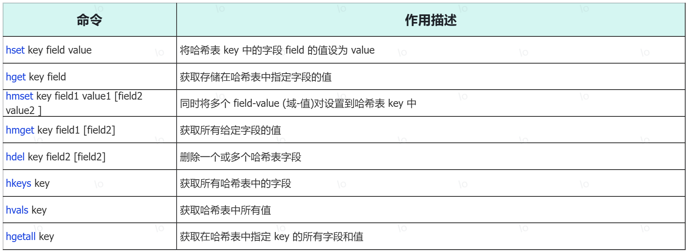

更多命令可以参考Redis中文网：https://www.redis.net.cn

### 4.List

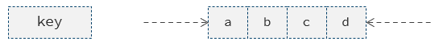

List（列表）是简单的字符串列表，按照插入顺序排序，可以出现重复的元素。常用命令有：

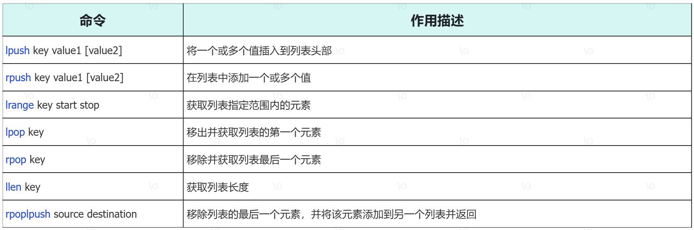

更多命令可以参考Redis中文网：https://www.redis.net.cn

### 5.Set

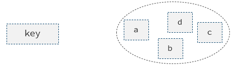

Set（集合）是无序集合，集合中不能出现重复元素。常用命令有：

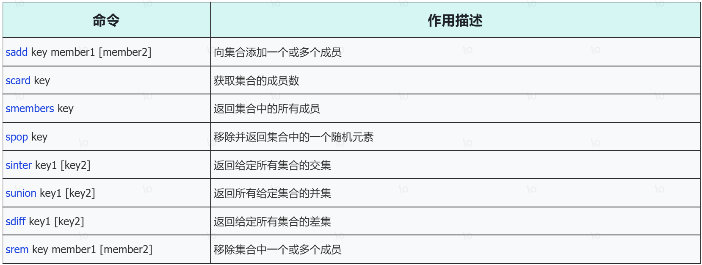

更多命令可以参考Redis中文网：https://www.redis.net.cn

### 6.Zset

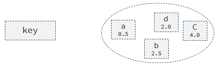

Sorted Set（有序集合）和集合一样不允许重复的成员，不同的是每个元素都会关联一个double类型的分数，redis正是通过分数来对集合中的成员进行排序。常用命令有：

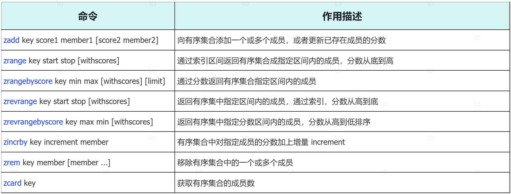

更多命令可以参考Redis中文网：https://www.redis.net.cn

### 7.Redis通用命令

所谓通用命令，指的是不区分数据类型都可以使用的命令：

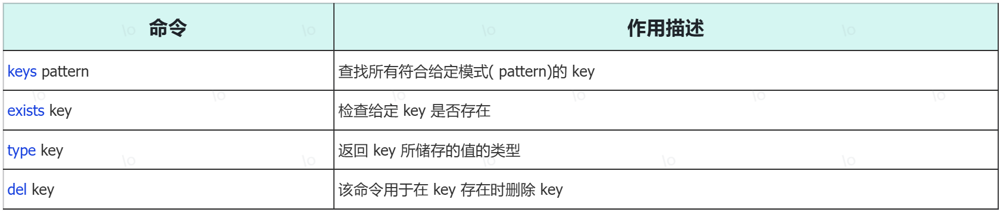

## 三、java程序操作Redis

### 1.Redis的java客户端

前面我们讲解了Redis的常用命令，这些命令是我们操作Redis的基础，那么我们在java程序中应该如何操作Redis呢？这就需要使用Redis的java客户端，就如同我们使用Mybatis操作MySQL数据库一样。

Redis 的 java 客户端很多，常用的几种：

- Jedis

- Lettuce

- Spring Data Redis

Spring生态中的Spring Data项目提供了统一的数据库操作框架，其中Spring Data Redis模块对Redis底层客户端进行了高度封装，显著简化了Redis数据库的开发和操作，这也是现在企业项目开发操作Redis的主流方式，因此我们重点学习Spring Data Redis。

### 2.Spring Data Redis

#### 3.1.介绍

Spring Data Redis 是 Spring 的一部分，提供了在 Spring 应用中通过简单的配置就可以访问 Redis 服务，对 Redis 底层开发包进行了高度封装。在 Spring 项目中，可以使用Spring Data Redis来简化 Redis 操作。

网址：https://spring.io/projects/spring-data-redis

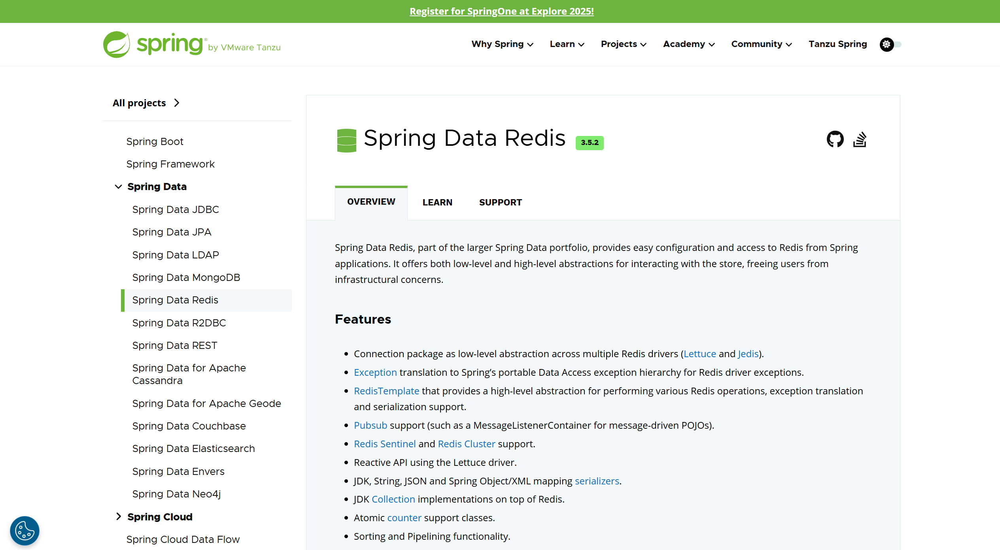

Spring Boot提供了对应的Starter，maven坐标：

```xml
<dependency>
        <groupId>org.springframework.boot</groupId>
        <artifactId>spring-boot-starter-data-redis</artifactId>
</dependency>
```

Spring Data Redis中提供了一个高度封装的类：RedisTemplate，对相关api进行了归类封装,将同一类型操作封装为operation接口，具体分类如下：

- ValueOperations：string数据操作

- SetOperations：set类型数据操作

- ZSetOperations：zset类型数据操作

- HashOperations：hash类型的数据操作

- ListOperations：list类型的数据操作


#### 3.2.入门程序

1.在 `pom.xml` 中引入SpringDataRedis的依赖

在 `qk-management` 模块的 `pom.xml` 中引入如下依赖:

```xml
<dependency>
    <groupId>org.springframework.boot</groupId>
    <artifactId>spring-boot-starter-data-redis</artifactId>
</dependency>
```

2.`application.yml` 中配置Redis的数据库信息

指定连接的是本地的Redis，注解地址 127\.0\.0\.1 ，端口号 6379。

```yaml
spring:
  data:
    redis:
      host: 127.0.0.1
      port: 6379
```

3.注入`RedisTemplate`操作Redis数据库

```java
package com.qk;

import org.junit.jupiter.api.Test;
import org.springframework.beans.factory.annotation.Autowired;
import org.springframework.boot.test.context.SpringBootTest;
import org.springframework.data.redis.core.RedisTemplate;
import java.util.concurrent.TimeUnit;

@SpringBootTest
public class RedisTest {

    @Autowired
    private RedisTemplate<Object, Object> redisTemplate;
    
    //操作string类型
    @Test
    public void testString(){
        //存
        redisTemplate.opsForValue().set("name", "QK");
        //取
        System.out.println(redisTemplate.opsForValue().get("name"));

        //设置过期时间
        redisTemplate.opsForValue().set("gender", "男", 60, TimeUnit.SECONDS);
        //取
        System.out.println(redisTemplate.opsForValue().get("gender"));
    }

}
```

操作完毕后，我们可以看到数据确实存入了Redis，有两个key：name、gender。

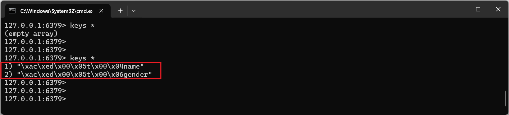

> 由于SpringDataRedis中提供的核心API，RedisTemplate底层在操作key、value的时候，对key和value进行了序列化操作，默认是通过`JdkSerializationRedisSerializer`实现的序列化，所以最终展示出来的就是我们看到的这个key，这个key就是序列化之后的效果。
>
> 在存入数据的时候，会自动的对数据进行序列化，在查询数据的时候，会自动的对查询的结果进行反序列化。
>

如果我们想看到普通字符串类型的key（比如：`name`，`gender`，而不是：`"\xac\xed\x00\x05t\x00\x04name"`），不要按照默认的序列化方式，进行序列化，我们是可以自己指定序列化方式的。具体操作如下：

在 `qk-management` 模块的 `com.qk.config` 包下增加一个配置类:

```java
package com.qk.config;

import org.springframework.context.annotation.Bean;
import org.springframework.context.annotation.Configuration;
import org.springframework.data.redis.connection.RedisConnectionFactory;
import org.springframework.data.redis.core.RedisTemplate;
import org.springframework.data.redis.serializer.StringRedisSerializer;

@Configuration
public class RedisConfig {

    //指定Redis的key的序列化方式为string
    @Bean
    public RedisTemplate<Object, Object> redisTemplate(RedisConnectionFactory redisConnectionFactory) {
        //自定义RedisTemplate
        RedisTemplate<Object, Object> template = new RedisTemplate<>();
        template.setConnectionFactory(redisConnectionFactory);

        //指定序列化方式
        template.setKeySerializer(new StringRedisSerializer());
        template.setHashKeySerializer(new StringRedisSerializer());
        return template;
    }

}
```

> @Configuration：用来声明当前类是一个配置类（也是IOC容器的bean，底层封装了@Component注解）。
>
> @Bean：声明bean的注解，作用在方法上，会将方法的返回值对象加入IOC容器，成为IOC容器的bean对象。

#### 2.3.操作

上述入门程序中，我们演示了string类型操作的方式，下面我们再来演示一下其他数据类型的操作：

```java
/**
 * list 类型测试
 */
@Test
public void testList(){
    //存一个
    redisTemplate.opsForList().leftPush("mylist", "A");
    //存多个
    redisTemplate.opsForList().leftPushAll("mylist", "B", "C", "D");
    //移除一个
    System.out.println(redisTemplate.opsForList().rightPop("mylist"));
    //取所有
    System.out.println(redisTemplate.opsForList().range("mylist", 0, -1));
}

/**
 * set 类型测试
 */
@Test
public void testSet(){
    //存
    redisTemplate.opsForSet().add("myset", "A", "B", "C", "D", "E", "F", "G");
    //取所有
    System.out.println(redisTemplate.opsForSet().members("myset"));
    //获取集合大小
    System.out.println(redisTemplate.opsForSet().size("myset"));
    //取一个
    System.out.println(redisTemplate.opsForSet().pop("myset"));
}

/**
 * hash测试
 */
@Test
public void testHash(){
    //存
    redisTemplate.opsForHash().put("myhash", "name", "QK");
    redisTemplate.opsForHash().put("myhash", "age", "18");
    redisTemplate.opsForHash().put("myhash", "gender", "男");
    //取
    System.out.println(redisTemplate.opsForHash().get("myhash", "name"));
    System.out.println(redisTemplate.opsForHash().get("myhash", "age"));
    //获取所有key
    System.out.println(redisTemplate.opsForHash().keys("myhash"));
    //获取所有value
    System.out.println(redisTemplate.opsForHash().values("myhash"));
}

/**
 * zset 测试
 */
@Test
public void testZset(){
    //存
    redisTemplate.opsForZSet().add("myzset", "A", 1);
    redisTemplate.opsForZSet().add("myzset", "B", 2);
    redisTemplate.opsForZSet().add("myzset", "C", 3);
    redisTemplate.opsForZSet().add("myzset", "D", 4);
    redisTemplate.opsForZSet().add("myzset", "E", 5);
    redisTemplate.opsForZSet().add("myzset", "F", 6);
    // 取
    System.out.println(redisTemplate.opsForZSet().range("myzset", 0, -1));
    // 根据分数取
    System.out.println(redisTemplate.opsForZSet().rangeByScore("myzset", 0, 3));
}
```
