# 一、Maven概述

## 1.基本介绍


Maven 是一款用于管理和构建Java项目的工具，是Apache旗下的一个开源项目 。

Apache 软件基金会，成立于1999年7月，是目前世界上最大的最受欢迎的开源软件基金会，也是一个专门为支持开源项目而生的非盈利性组织。

开源地址：`https://www.apache.org/index.html#projects-list`

那我们之前在JavaSE阶段，没有使用Maven，依然可以构建Java项目。 我们为什么现在还要学习Maven呢 ? 那接下来，我们就来聊聊Maven的作用。

## 2.Maven的作用

Maven的作用主要体现在以下三个方面：

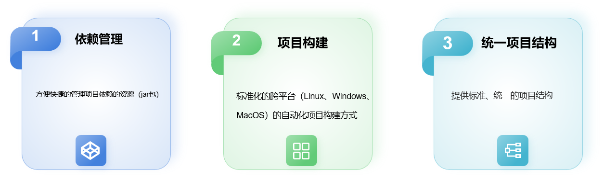

### 2.1.依赖管理

方便快捷的管理项目依赖的资源\(jar包\)，避免版本冲突问题。

使用maven前

我们项目中要想使用某一个jar包，就需要把这个jar包从官方网站下载下来，然后再导入到项目中。然后在这个项目中，就可以使用这个jar包了。

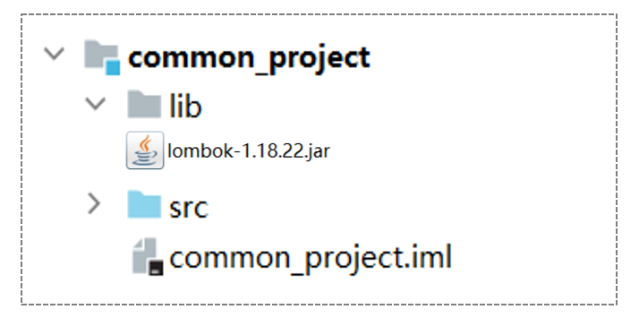

使用maven后

当使用maven进行项目依赖\(jar包\)管理，则很方便的可以解决这个问题。 我们只需要在maven项目的pom\.xml文件中，添加一段如下图所示的配置即可实现。

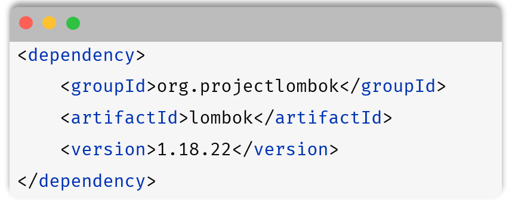

在maven项目的配置文件中，加入上面这么一段配置信息之后，maven会自动的根据配置信息的描述，去下载对应的依赖。 然后在项目中，就可以直接使用了。 

### 2.2.项目构建

Maven还提供了标准化的跨平台的自动化构建方式。

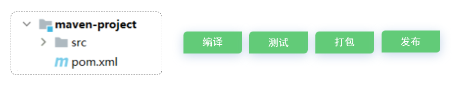

如上图所示我们开发了一套系统，代码需要进行编译、测试、打包、发布等过程，这些操作是所有项目中都需要做的，如果需要反复进行就显得特别麻烦，而Maven提供了一套简单的命令来完成项目构建。

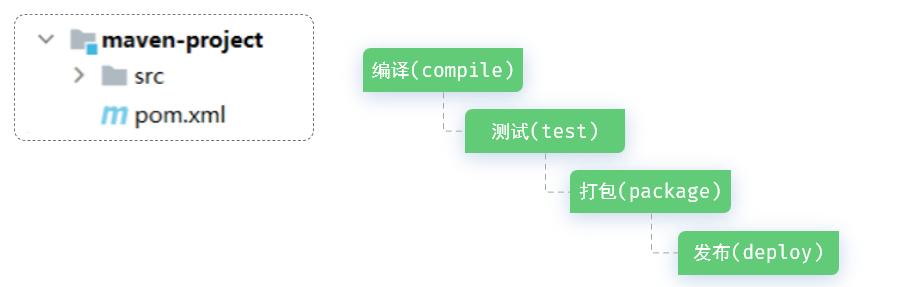

通过Maven中的命令，就可以很方便的完成项目的编译\(compile\)、测试\(test\)、打包\(package\)、发布\(deploy\) 等操作。 

而且这些操作都是跨平台的，也就是说无论你是Windows系统，还是Linux系统，还是Mac系统，这些命令都是支持的。

### 2.3.统一项目结构

Maven 还提供了标准、统一的项目结构 。

未使用Maven

由于java的开发工具呢，有很多，除了大家熟悉的IDEA以外，还有像早期的Eclipse、MyEclipse。而不同的开发工具，创建出来的java项目的目录结构是存在差异的，那这就会出现一个问题。

Eclipse创建的java项目，并不能直接导入IDEA中。 IDEA创建的java项目，也没有办法直接导入到Eclipse中。

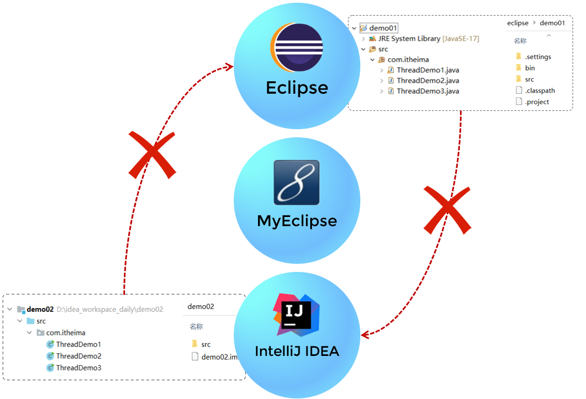

使用maven后

而如果我们使用了Maven这一款项目构建工具，它给我们提供了一套标准的java项目目录。如下所示：


也就意味着，无论我们使用的是什么开发工具，只要是基于maven构建的java项目，最终的目录结构都是相同的，如图所示。 那这样呢，我们使用Eclipse、MyEclipse、IDEA创建的maven项目，就可以在各个开发工具直接直接导入使用了，更加方便、快捷。

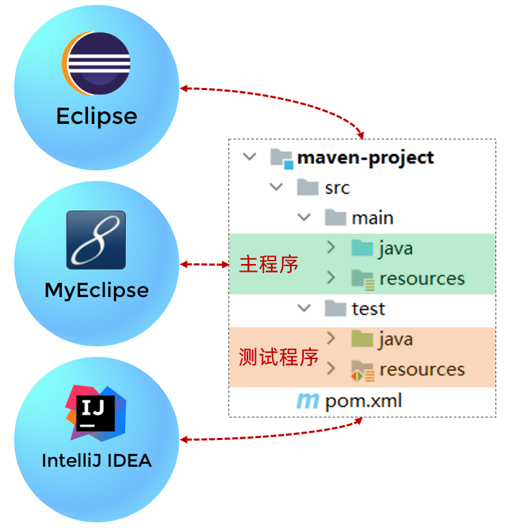

而在上面的maven项目的目录结构中，main目录下存放的是项目的源代码，test目录下存放的是项目的测试代码。 而无论是在main还是在test下，都有两个目录，一个是java，用来存放源代码文件；另一个是resources，用来存放配置文件。

# 二、Maven安装

认识了Maven后，我们就要开始使用Maven了，那么首先我们要进行Maven的下载与安装。

## 1.下载

下载地址：[https://maven.apache.org/download.cgi](https://maven.apache.org/download.cgi)

## 2.安装步骤

Maven安装配置步骤：

1. 在非中文目录下解压 apache\-maven\-3\.9\.6\.zip 和 maven\_repository\.zip本地仓库。

2. 配置本地仓库：修改 conf/settings\.xml 中的 \<localRepository\> 

3. 配置阿里云私服：修改 conf/settings\.xml 中的 \<mirrors\> 标签

4. 配置maven构建项目使用的JDK的版本：修改conf/settings\.xml 中的profile环境为JDK17

5. 配置Maven环境变量：将maven的bin目录加入PATH环境变量

具体操作如下：

1.在非中文目录下解压 apache\-maven\-3\.9\.6\.zip 和 maven\_repository\.zip本地仓库

建议解压到没有中文、特殊字符的路径下。如解压到 `D:\develop` 下。

解压缩后的目录结构如下：

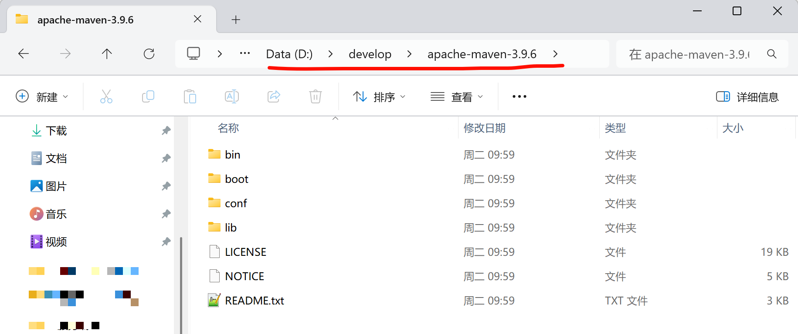

- bin目录 ： 存放的是可执行命令。（mvn 命令重点关注）

- conf目录 ：存放Maven的配置文件。（settings\.xml配置文件后期需要修改）

- lib目录 ：存放Maven依赖的jar包。（Maven也是使用java开发的，所以它也依赖其他的jar包）

本地仓库目录如下：

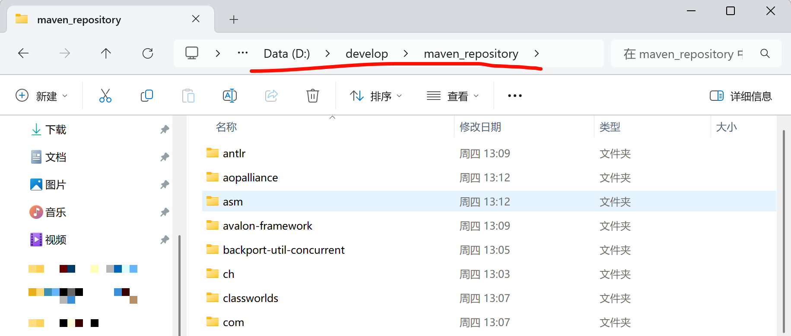


2.配置阿里云私服：修改 conf/settings\.xml 中的 \<mirrors\> 标签

- 使用超级记事本软件，打开settings\.xml文件，定位到53行

- 复制`<localRepository>`标签，粘贴到注释的外面

- 复制本地仓库的路径，替换掉`<localRepository>`标签体中的路径 

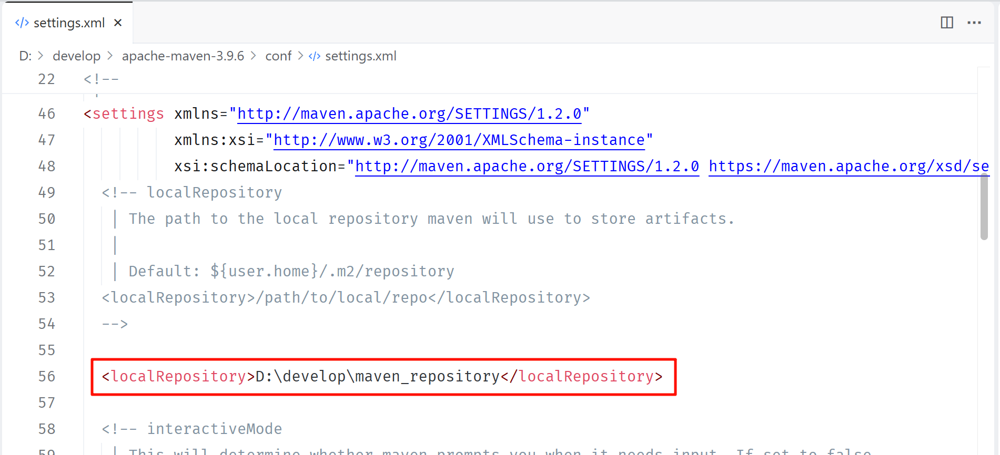


3.配置阿里云镜像仓库

由于中央仓库在国外，所以下载jar包速度可能比较慢，而阿里公司提供了一个远程仓库，里面基本也都有开源项目的jar包。

进入到conf目录下修改settings\.xml配置文件：

- 使用超级记事本软件，打开settings\.xml文件，定位到160行左右

- 在`<mirrors>`标签下为其添加子标签`<mirror>`，内容如下：

```XML
<mirror>
    <id>alimaven</id>
    <name>aliyun maven</name>
    <url>http://maven.aliyun.com/nexus/content/groups/public/</url>
    <mirrorOf>central</mirrorOf>
</mirror>
```

注意配置的位置，在`<mirrors> ... </mirrors>`中间添加配置。如下图所示：

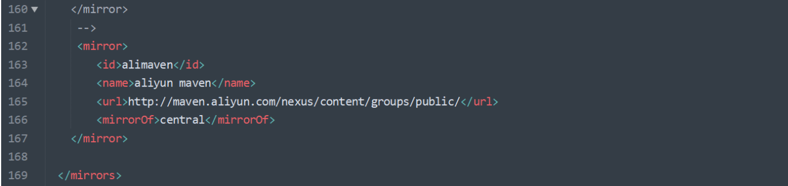

4.配置maven构建项目使用的JDK的版本：修改conf/settings\.xml 中的profile环境为JDK17

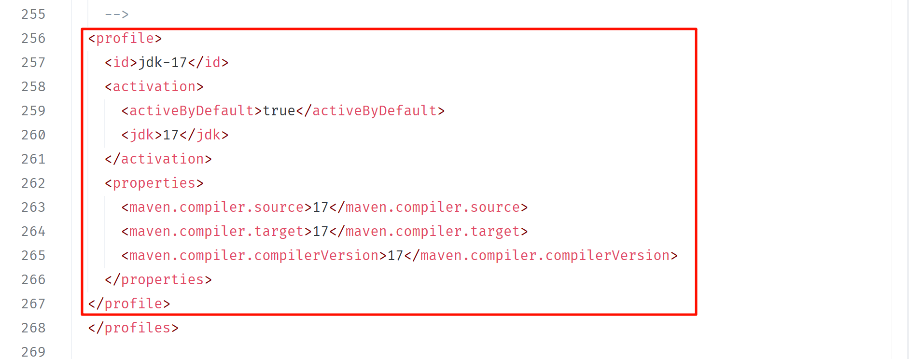

```XML
<profile>
    <id>jdk-17</id>
    <activation>
      <activeByDefault>true</activeByDefault>
      <jdk>17</jdk>
    </activation>
    <properties>
      <maven.compiler.source>17</maven.compiler.source>
      <maven.compiler.target>17</maven.compiler.target>
      <maven.compiler.compilerVersion>17</maven.compiler.compilerVersion>
    </properties>
</profile>
```

5.配置Maven环境变量：将maven的bin目录加入PATH环境变量

将Maven的bin目录路径配置到系统环境变量的Path中

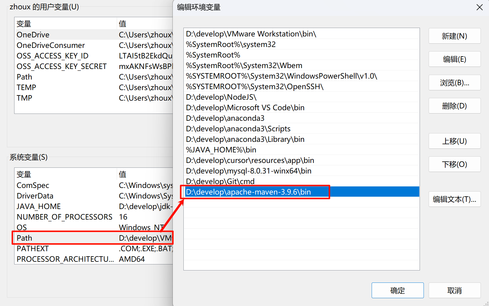

检查JAVA\_HOME配置的jdk路径是否正确，如果Java的环境变量没配置正确，Maven也无法运行。

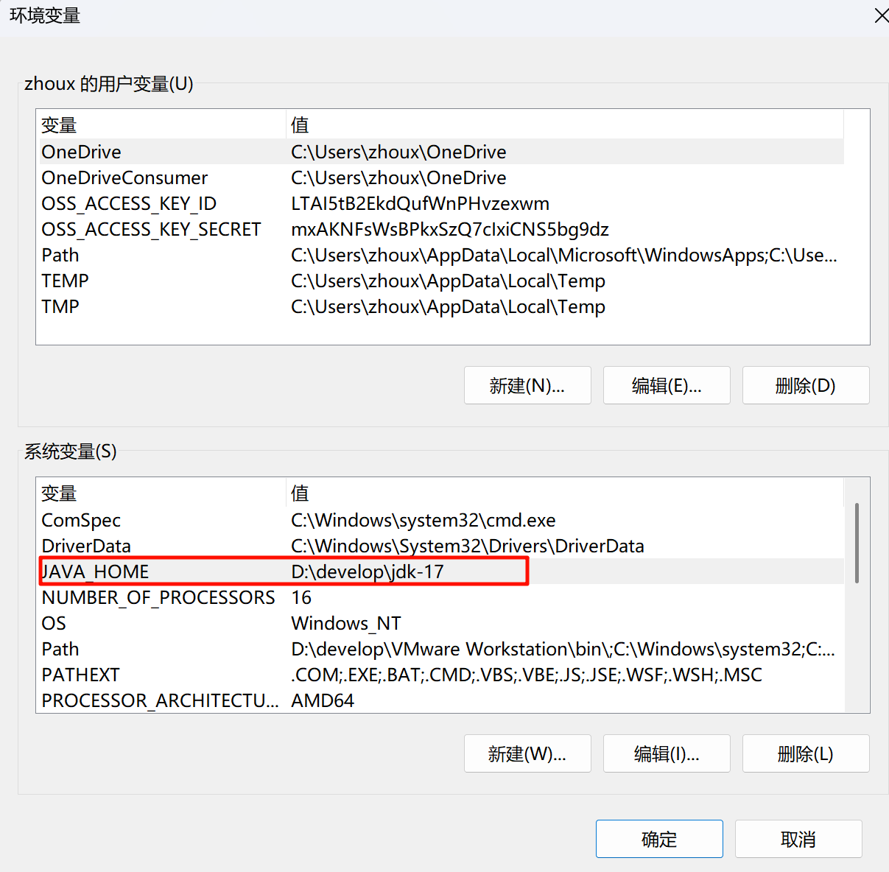

打开DOS命令提示符进行验证，出现如图所示表示安装成功 。

命令为：`mvn -v`

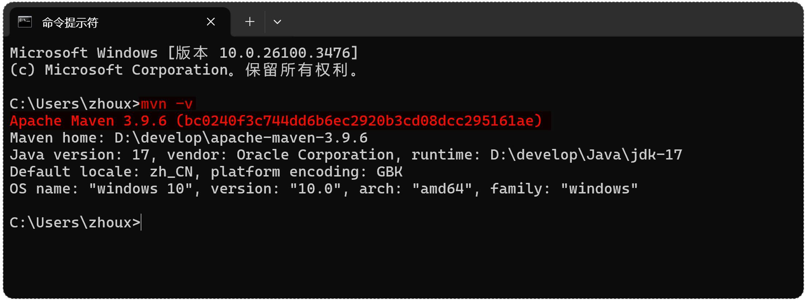

## 3.Maven模型

> 项目对象模型 \(Project Object Model\)
>
> 依赖管理模型\(Dependency\)
>
> 构建生命周期/阶段\(Build lifecycle \& phases\)

1.构建生命周期/阶段\(Build lifecycle \& phases\)

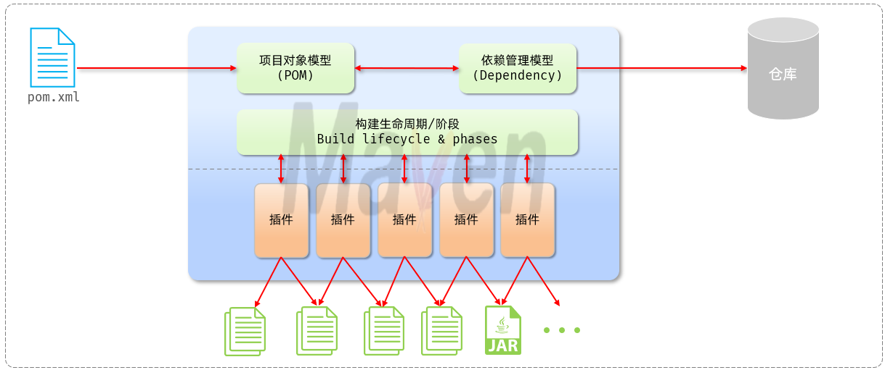

以上图中紫色框起来的部分，就是用来完成标准化构建流程 。当我们需要编译，Maven提供了一个编译插件供我们使用；当我们需要打包，Maven就提供了一个打包插件供我们使用等。 

2.项目对象模型 \(Project Object Model\)


以上图中紫色框起来的部分属于项目对象模型，就是将我们自己的项目抽象成一个对象模型，有自己专属的坐标，如下图所示是一个Maven项目：

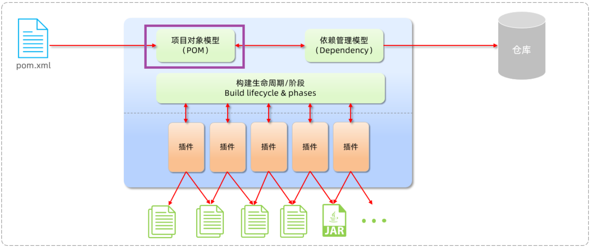

> 坐标，就是资源\(jar包\)的唯一标识，通过坐标可以定位到所需资源\(jar包\)位置。
> 
> 坐标的组成部分：
> 
> - groupId: 组织名
> 
> - arfitactId: 模块名
> 
> - Version: 版本号
> 

3.依赖管理模型\(Dependency\)

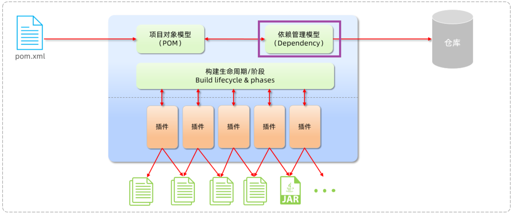

以上图中紫色框起来的部分属于依赖管理模型，是使用坐标来描述当前项目依赖哪些第三方jar包。

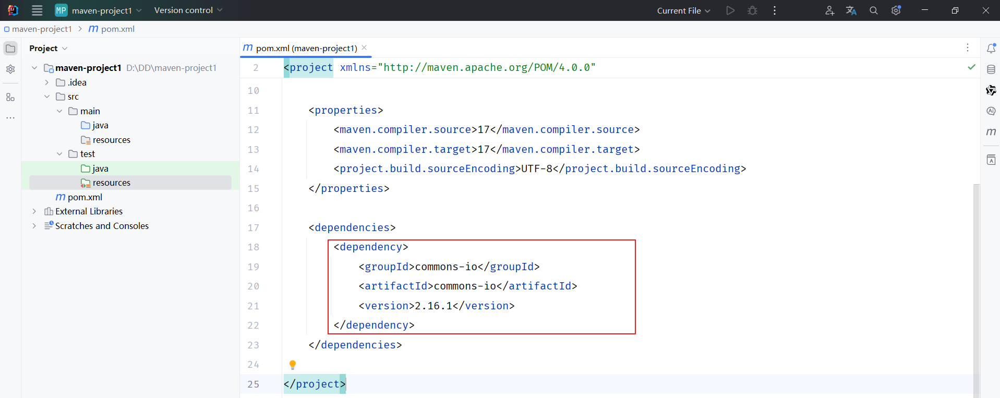

之前我们项目中需要jar包时，直接就把jar包复制到项目下的lib目录，而现在我们只需要在pom\.xml中配置依赖的配置文件即可。 而这个依赖对应的jar包其实就在我们本地电脑上的maven仓库中。 

如下图，就是本地的maven仓库中的jar文件：

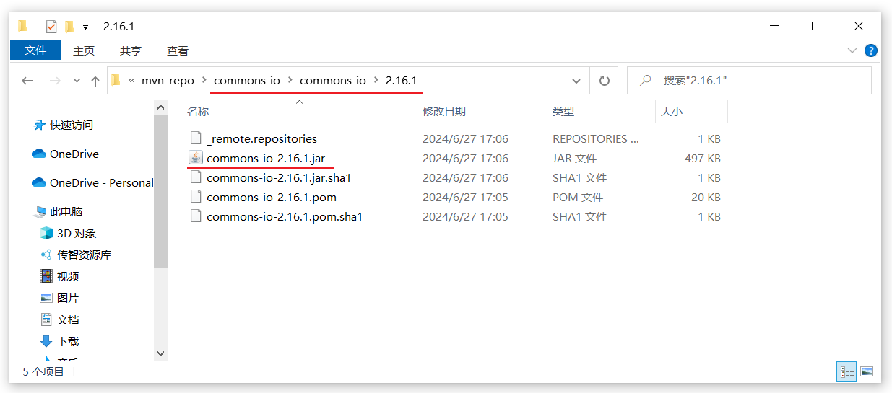

# 三、Idea中集成Maven

## 1.配置Maven环境

我们要想在IDEA中使用Maven进行项目构建，就需要在IDEA中集成Maven，那么就需要在IDEA中配置与maven的关联。

全局设置

1.进入IDEA的欢迎页面

选择 IDEA中 File  =\>  `close project` =\> `Customize` =\> `All settings`


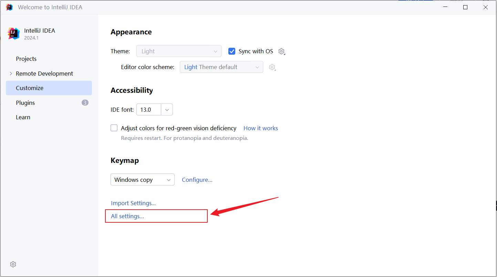

2.打开 All settings , 选择 `Build,Execution,Deployment`  =\>  `Build Tools`  =\>  `Maven`

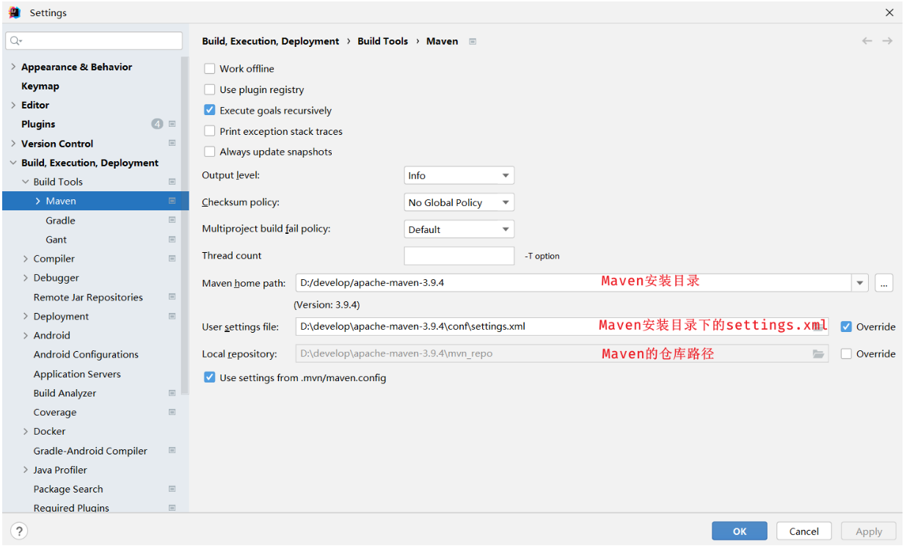

这里所设置的maven的环境信息，并未指定任何一个project，此时设置的信息就属于全局配置信息。 以后，我们再创建project，默认就是使用我们全局配置的信息。

## 2.创建项目

1.创建一个空项目，命名为 web\-project01

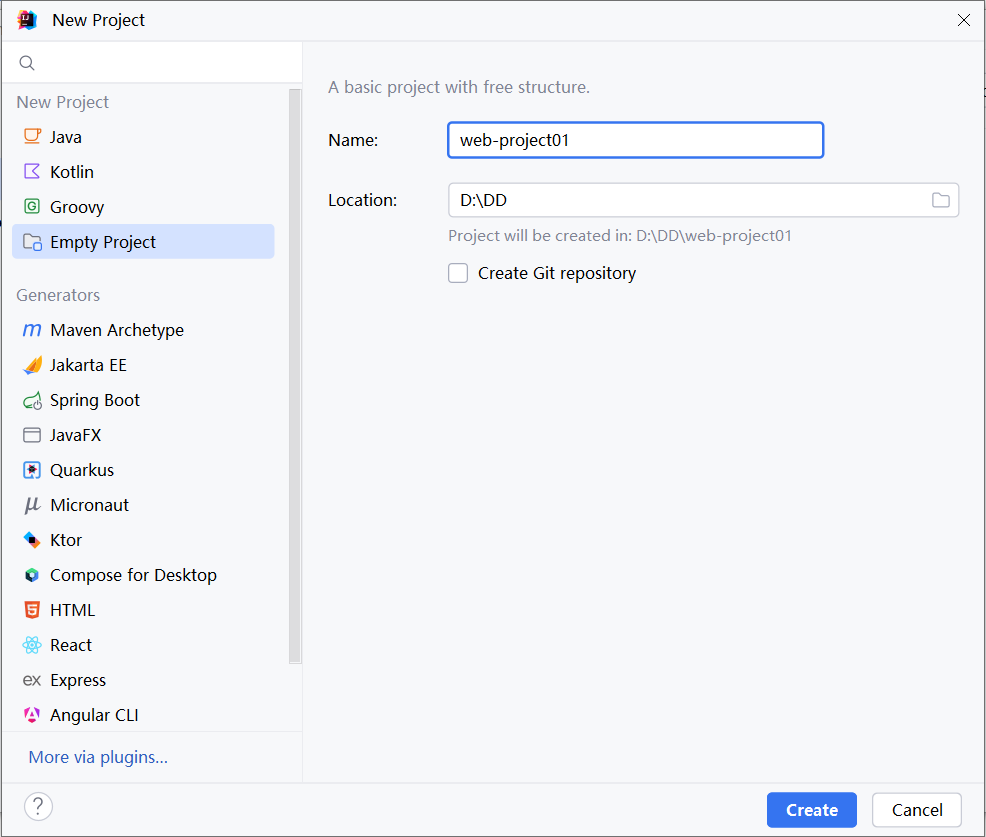

2.创建好项目之后，进入项目中，要设置JDK的版本号。选择小齿轮，选择 `Project Structure`


3.创建模块，选择Java语言，选择Maven。 填写模块的基本信息


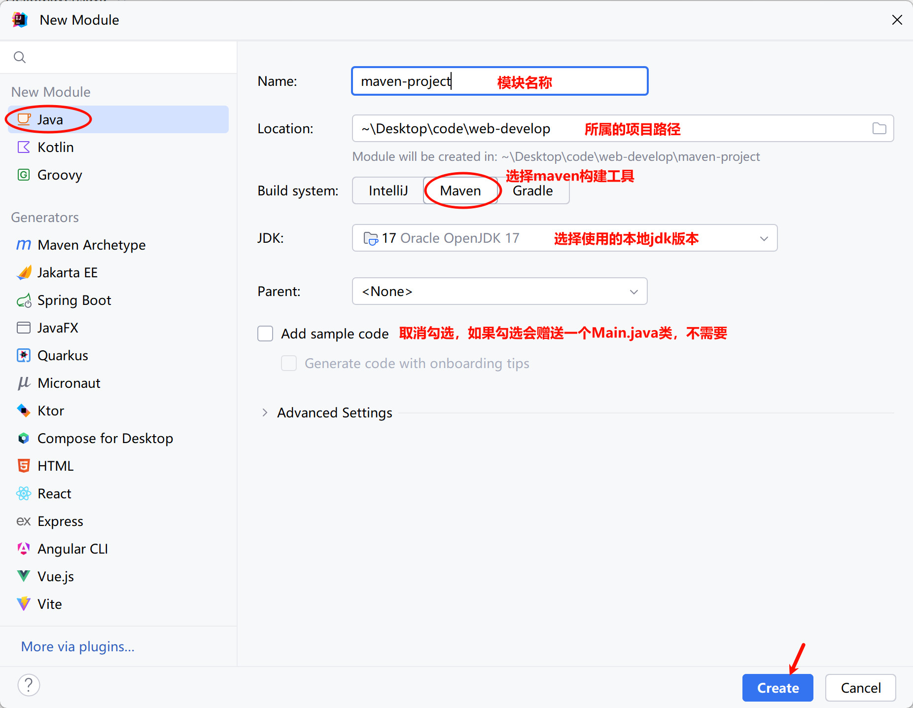

4.在maven项目中，创建HelloWorld类，并运行

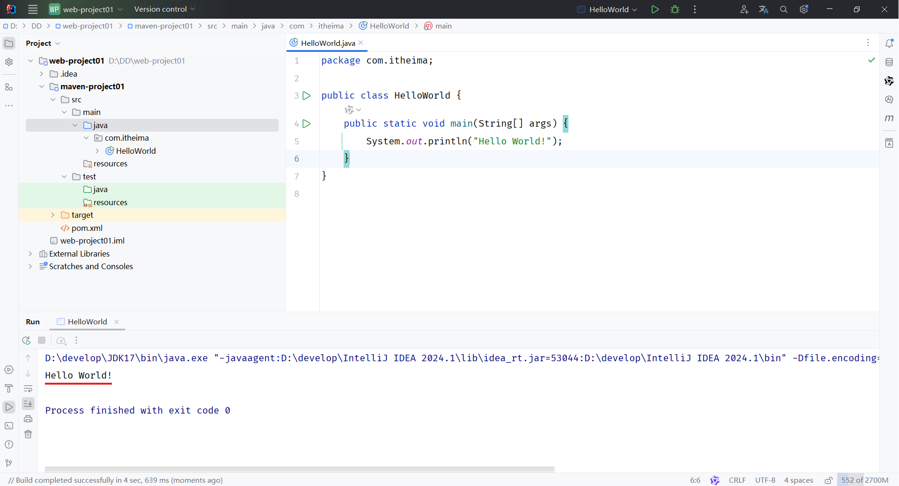

Maven项目的目录结构:

```java
maven-project01
├── src                     源代码目录和测试代码目录
│   ├── main                源代码目录
│   │   ├── java            源代码java文件目录
│   │   └── resources       源代码配置文件目录
│   └── test                测试代码目录
│       ├── java            测试代码java目录
│       └── resources       测试代码配置文件目录
└── target                  编译、打包生成文件存放目录
```

## 3.导入Maven项目

在IDEA中导入Maven项目，有三种方式。

建议：将要导入的maven项目复制到自己的项目目录下

方式一：`File` \-\> `Project Structure` \-\> `Modules` \-\> `Import Module` \-\> `选择maven项目的pom.xml`。

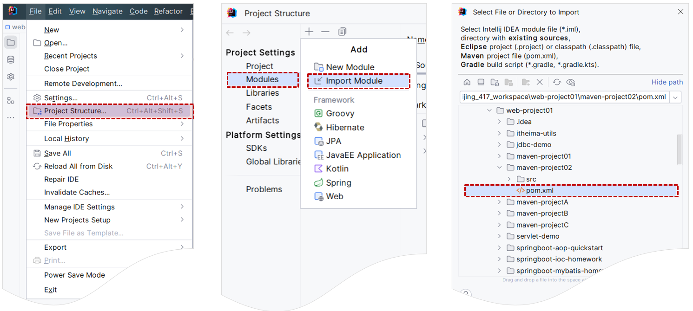

方式二：`Maven面板` \-\> `+（Add Maven Projects）` \-\> `选择maven项目的pom.xml`。


方式三：在pom\.xml上鼠标右键 \-\> Add as Maven Project【推荐】

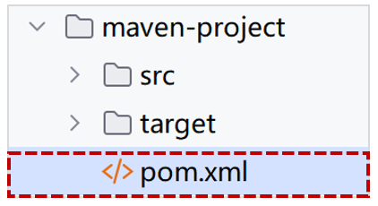


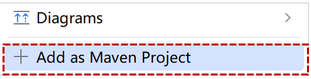

## 4.pom文件详解

POM \(Project Object Model\) ：指的是项目对象模型，用来描述当前的maven项目。

使用pom\.xml文件来描述当前项目。 pom\.xml文件如下：

```XML
*<?*xml version="1.0" encoding="UTF-8"*?>*
<project xmlns="http://maven.apache.org/POM/4.0.0"
         xmlns:xsi="http://www.w3.org/2001/XMLSchema-instance"
         xsi:schemaLocation="http://maven.apache.org/POM/4.0.0 http://maven.apache.org/xsd/maven-4.0.0.xsd">
    <!-- POM模型版本 -->
    <modelVersion>4.0.0</modelVersion>

    <!-- 当前项目坐标 -->
    <groupId>com.itheima</groupId>
    <artifactId>maven-project01</artifactId>
    <version>1.0-SNAPSHOT</version>
    
    <!-- 项目的JDK版本及编码 -->
    <properties>
        <maven.compiler.source>17</maven.compiler.source>
        <maven.compiler.target>17</maven.compiler.target>
        <project.build.sourceEncoding>UTF-8</project.build.sourceEncoding>
    </properties>

</project>
```

pom文件详解：

- `<project>` ：pom文件的根标签，表示当前maven项目

- `<modelVersion>`：声明项目描述遵循哪一个POM模型版本

    虽然模型本身的版本很少改变，但它仍然是必不可少的。目前POM模型版本是4\.0\.0

- 坐标 ：

    `<groupId>` `<artifactId>` `<version>`

    定位项目在本地仓库中的位置，由以上三个标签组成一个坐标

- `<maven.compiler.source>` ：编译JDK的版本

- `<maven.compiler.target>` ：运行JDK的版本

- `<project.build.sourceEncoding>` : 设置项目的字符集

# 四、依赖管理

## 1.什么是坐标

Maven中的坐标是资源的唯一标识 , 通过该坐标可以唯一定位资源位置

使用坐标来定义项目或引入项目中需要的依赖

Maven坐标主要组成：

- groupId：定义当前Maven项目隶属组织名称（通常是域名反写，例如：com\.itheima）

- artifactId：定义当前Maven项目名称（通常是模块名称，例如 order\-service、goods\-service）

- version：定义当前项目版本号

    SNAPSHOT: 功能不稳定、尚处于开发中的版本，即快照版本

    RELEASE: 功能趋于稳定、当前更新停止，可以用于发行的版本

如下图就是使用坐标表示一个项目：


注意：

- 上面所说的资源可以是插件、依赖、当前项目。

- 我们的项目如果被其他的项目依赖时，也是需要坐标来引入的。

## 2.基本配置

依赖：指当前项目运行所需要的jar包。一个项目中可以引入多个依赖：

例如：在当前工程中，我们需要用到logback来记录日志，此时就可以在maven工程的pom\.xml文件中，引入logback的依赖。具体步骤如下：

1.在pom\.xml中编写`<dependencies>`标签

2.在`<dependencies>`标签中使用`<dependency>`引入坐标

3.定义坐标的 `groupId`、`artifactId`、`version`

```XML
<dependencies>
    <!-- 依赖 : spring-context -->
    <dependency>
        <groupId>org.springframework</groupId>
        <artifactId>spring-context</artifactId>
        <version>6.1.4</version>
    </dependency>
</dependencies>
```

4.点击刷新按钮，引入最新加入的坐标

刷新依赖：保证每一次引入新的依赖，或者修改现有的依赖配置，都可以加入最新的坐标


注意事项：

- 如果引入的依赖，在本地仓库中不存在，将会连接远程仓库 / 中央仓库，然后下载依赖（这个过程会比较耗时，耐心等待）

- 如果不知道依赖的坐标信息，可以到mvn的中央仓库（https://mvnrepository\.com/）中搜索 （见下图）。

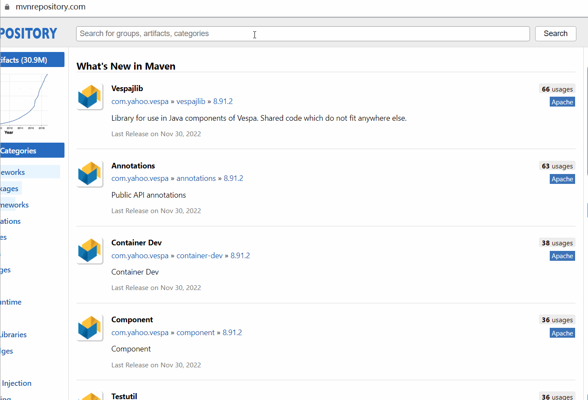

## 3.传递依赖

我们上面在pom\.xml中配置了一项依赖，就是spring\-context，但是我们通过右侧的maven面板可以看到，其实引入进来的依赖，并不是这一项，有非常多的依赖，都引入进来了。我们可以看到如下图所示：


为什么会出现这样的现象呢? 那这里呢，就涉及到maven中非常重要的一个特性，那就是Maven中的 依赖传递。

所谓maven的依赖传递，指的就是如果在maven项目中，A 依赖了B，B依赖了C，C依赖了D，那么在A项目中，也会有C、D依赖，因为依赖会传递。

那如果，传递下来的依赖，在项目开发中，我们确实不需要，此时，我们可以通过Maven中的排除依赖功能，来将这个依赖排除掉。

## 4.排除依赖


排除依赖：指主动断开依赖的资源，被排除的资源无需指定版本。

配置形式如下：

```XML
<dependency>
    <groupId>org.springframework</groupId>
    <artifactId>spring-context</artifactId>
    <version>6.1.4</version>

    <!--排除依赖, 主动断开依赖的资源-->
    <exclusions>
        <exclusion>
            <groupId>io.micrometer</groupId>
            <artifactId>micrometer-observation</artifactId>
        </exclusion>
    </exclusions>
</dependency>
```

依赖排除示例：

1.默认通过maven的依赖传递，传递下来了 `micrometer-observation` 的依赖。


2.加入排除依赖的配置之后，该依赖就被排除掉了。


# 五、生命周期

## 1.介绍

Maven的生命周期就是为了对所有的构建过程进行抽象和统一。 描述了一次项目构建，经历哪些阶段。

在Maven出现之前，项目构建的生命周期就已经存在，软件开发人员每天都在对项目进行清理，编译，测试及部署。虽然大家都在不停地做构建工作，但公司和公司间、项目和项目间，往往使用不同的方式做类似的工作。

Maven从大量项目和构建工具中学习和反思，然后总结了一套高度完美的，易扩展的项目构建生命周期。这个生命周期包含了项目的清理，初始化，编译，测试，打包，集成测试，验证，部署和站点生成等几乎所有构建步骤。

Maven对项目构建的生命周期划分为3套（相互独立）：

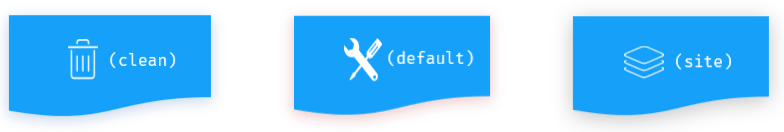

- clean：清理工作。

- default：核心工作。如：编译、测试、打包、安装、部署等。

- site：生成报告、发布站点等。

三套生命周期又包含哪些具体的阶段呢, 我们来看下面这幅图:

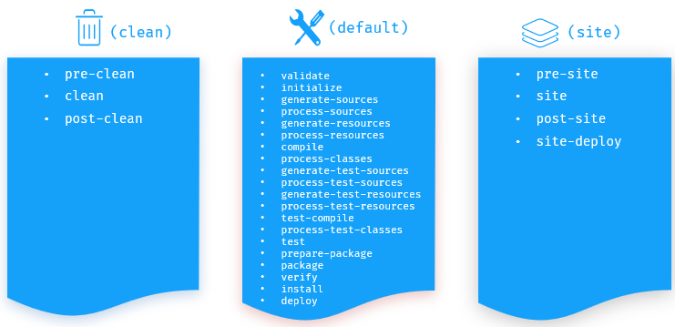

每套生命周期包含一些阶段（phase），阶段是有顺序的，后面的阶段依赖于前面的阶段。

我们看到这三套生命周期，里面有很多很多的阶段，这么多生命周期阶段，其实我们常用的并不多，主要关注以下几个：

- clean：移除上一次构建生成的文件

- compile：编译项目源代码

- test：使用合适的单元测试框架运行测试\(junit\)

- package：将编译后的文件打包，如：jar、war等

- install：安装项目到本地仓库

Maven的生命周期是抽象的，这意味着生命周期本身不做任何实际工作。在Maven的设计中，实际任务（如源代码编译）都交由插件来完成。

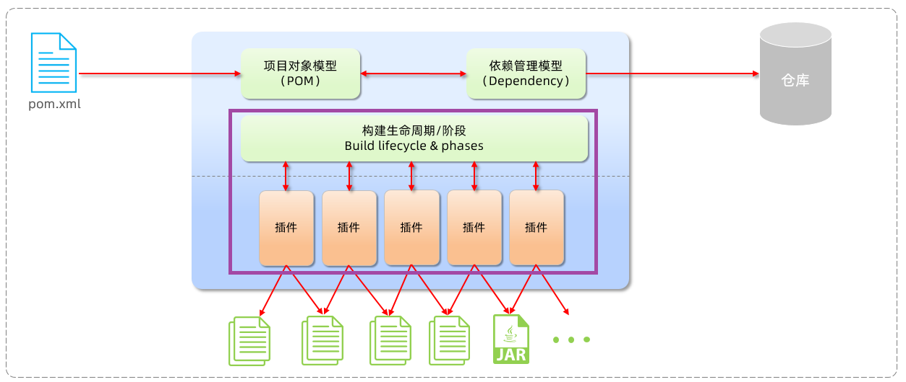

IDEA工具为了方便程序员使用maven生命周期，在右侧的maven工具栏中，已给出快速访问通道。

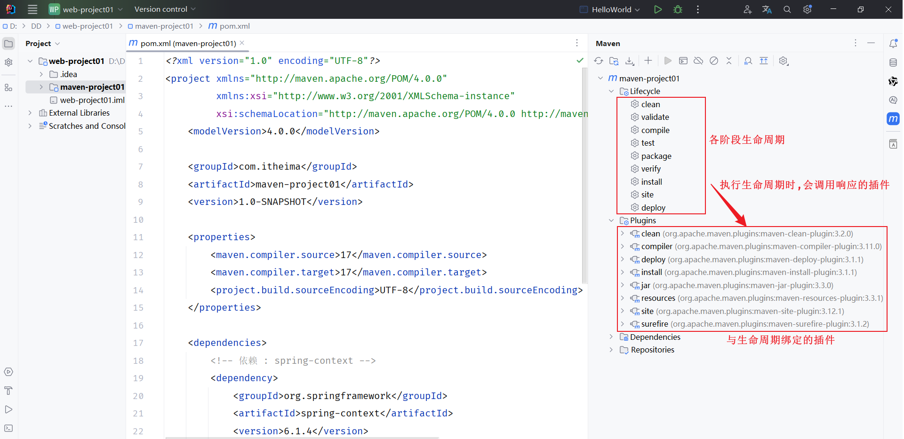

生命周期的顺序是：`clean` \-\-\> `validate` \-\-\> `compile` \-\-\> `test` \-\-\> `package` \-\-\> `verify` \-\-\> `install` \-\-\> `site` \-\-\> `deploy`

我们需要关注的就是：`clean` \-\-\>  `compile` \-\-\> `test` \-\-\> `package`  \-\-\> `install`

说明：在同一套生命周期中，我们在执行后面的生命周期时，前面的生命周期都会执行。

思考：当运行package生命周期时，clean、compile生命周期会不会运行？

clean不会运行，compile会运行。  因为compile与package属于同一套生命周期，而clean与package不属于同一套生命周期。

## 2.执行

在日常开发中，当我们要执行指定的生命周期时，有两种执行方式：

- 在idea工具右侧的maven工具栏中，选择对应的生命周期，双击执行

- 在DOS命令行中，通过maven命令执行

方式一：在idea中执行生命周期

选择对应的生命周期，双击执行


其他的生命周期都是类似的道理，双击运行即可。

方式二：在命令行中执行生命周期

打开maven项目对应的磁盘目录


在当前目录下打开CMD


类似的道理，我们也可以在命令执行：

- mvn compile

- mvn test

- mvn package

- mvn install    

# 六、Maven常见问题

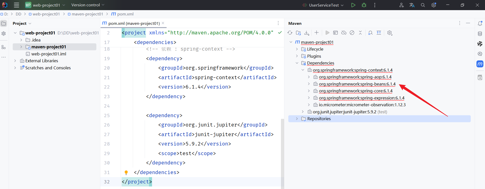

问题现象：Maven项目中添加的依赖，未正确下载，造成右侧Maven面板中的依赖报红，再次reload重新加载也不会再下载。

产生原因：由于网络原因，依赖没有下载完整导致的，在maven仓库中生成了xxx\.lastUpdated文件，该文件不删除，不会再重新下载。

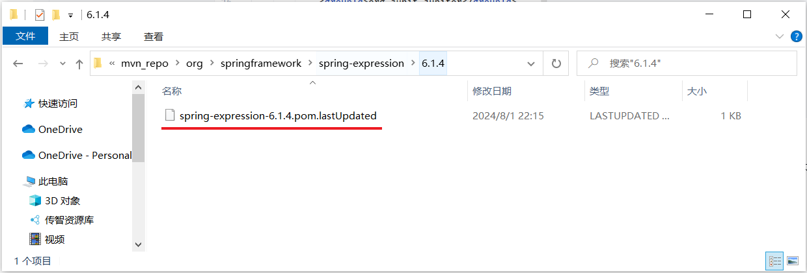

解决方案：

1. 打开File\-\-\>settings\-\-\>Build, Execution, Deployment\-\-\>Build Tools\-\-\>Maven。检查Maven是否配置好了。

2. 检查maven的settings\.xml配置，看有没有报错，如果有就解决掉。

3. 如果以上两点都排除了，那么就找到本地仓库里面的`一键清理本地仓库缓存.bat`，双击运行它清理xxx\.lastUpdated文件。

4. 清理完毕之后在maven中点击刷新，重新加载依赖。如果依赖下载了之后，maven面板可能还会报红，此时可以关闭IDEA，重新打开IDEA加载此项目即可。

为了使大家能够方便的解决这个问题，大家可以将资料中提供的 del\.bat 批处理脚本，拷贝到maven的安装目录下。 双击这个文件，就可以递归删除该目录下所有的 xxx\.lastUpdated 文件。 放置目录如下所示：

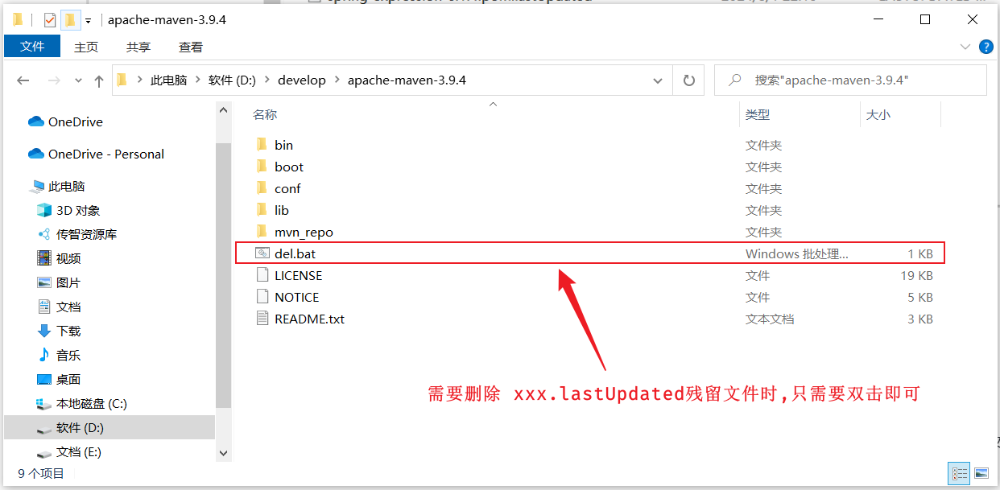


