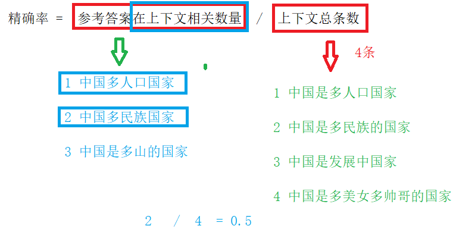
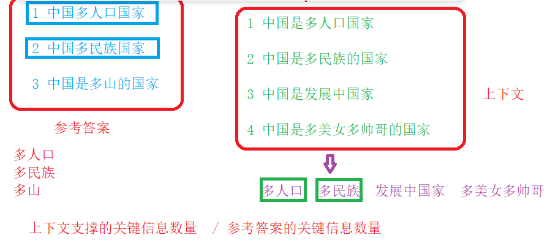
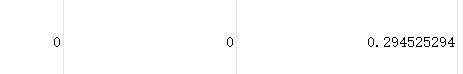
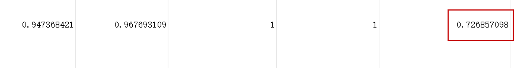
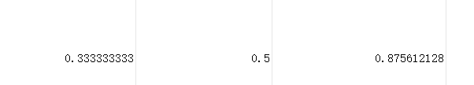
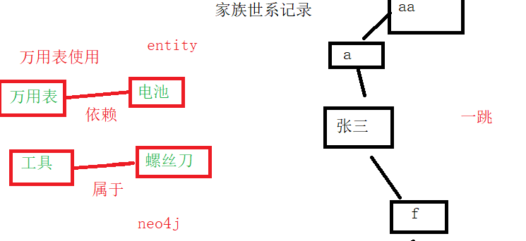

## 一、评估的意义和作用

**1、交付验收的标准，可量化的指标。**比如评分大于0.7

**2、项目各个环节的参数设定依据，根据评估对参数进行调整**

* 比如最大切片大小2000, 2000有设置依据

**3、找出项目流程中问题，**对这些问题进行持续优化改进

* 比如模型问题、知识库问题
* 为什么使用bgem3，为什么选择.....
* **以上这些都有依据，这些依据就是评估**

## 二、目前主流评估方法

**1、人工**

**2、LLM**

* **RAG项目评估，评估框架（python包）RAGAS**

## 三、RAGAS

* **RAGAS作用：用相对自动化的方式衡量 RAG 的关键质量**

### 1、使用RAGAS，准备工作（4个资料）

- **Question（问题）**

-- 提问的问题，比如万用表如何测量电压

- **Contexts（检索到的上下文证据）**：通常是 top-k 文档片段

-- 简单理解，提交LLM提示词内容信息

- **Answer (RAG流程生成的答案)**

-- 项目执行之后答案结果

-- reranker之后结果，也可以答案生成节点之后结果

- **Ground_truth（参考答案）**

-- 类似于hyde，有区别

### 2、RAGAS评估指标（常见五种）

- **第一个 Faithfulness（忠实性/证据一致性）**

衡量答案中的陈述是否能被给定 contexts 支撑；越高表示越不容易“编”。

**-- RAG生成的答案 和 上下文证据 匹配度**，**如果匹配度高评分高**

--- Answer (RAG流程生成的答案) 和 Contexts（检索到的上下文证据）

-- 举例：开卷考试

**-- 分数低原因：**

1 证据缺失，问题答案啊在上下文证据没有（不完整）

2 在上下文证据冗余数据，噪音过大

3 模型能力不足

4 提示词强度不够

- **第二个 Answer Relevancy（回答相关性）**

**-- 原始问题 和 RAG生成答案进行对比，是否相关**

-- 比如问熊猫问题，回答必须是熊猫问题，不能是老虎问题

**-- 分数低原因：**

1 模型能力不足

2 用户问题很抽象，提问很不明确

3 提示词问题

4 商品名识别不好，改写问题没改好

* **第三个 Context Precision（上下文精确率）**

**-- 比较 上下文证据 和 参考答案 对比**

**精确率 =  参考答案在上下文相关数量  /  上下文总条数**

* **第四个  Context Recall（上下文召回率）**

**-- 比较 上下文证据 和 参考答案 对比**

-- 这里面 关键信息提取，由RAGAS完成的

**召回率  =  上下文支撑的关键信息数量  / 参考答案的关键信息数量**  

- **第五个 Answer Correctness / Similarity（正确性/相似度）**

**-- 把RAG生成答案 和 参考答案比对**

这个指标只是一个衡量目的，本身不具备优化作用

### 3 RAGAS评估步骤

#### 第一步 准备评估测试集

（准备多个问题，每个问题有参考答案，参考答案，通过阅读文档编写参考答案）使用 csv格式 （文本，表格）

#### 第二步 编写评估程序，运行得到结果

* 读取评估测试集，得到多个问题和对应参考答案
* 根据问题运行rag程序，得到rag生成答案
* 获取上下文证据数据
* 准备好四个资料，模型工具（llm、embedding等）
* 运行评估程序代码，得到结果（五个指标）
* 把得到结果（五个指标）写入文件（输出到csv格式）

#### 第三步 根据评估结果，定位具体问题，对问题改进

#### 第四步 回归测试

## 四、评估问题

### 1、上下文内容缺失（切片丢失）

* **体现出来：上下文精确率 和 上下文召回率打分很低，可能分数就是0**

  

* **精确率 和 召回率： 参考答案 和 上下文内容比对**

  -- 参考答案 在 上下文内容匹配度低，分数低

  

* **造成当前问题原因：**

  -- 因为获取上下文内容，经过很多步骤，这些步骤中，某个步骤出现问题

  **-- 具体有哪些环节（步骤）**

  1 向量检索 / hyde检索    向量（密集和稀疏向量）比对，截取前30

  2 RRF 多路召回，根据各路排名 * 权重 得到综合排名，取前15名

  3 Reranker 精读重排（精排），断崖截取 ，最少 最多，截取阈值

* **三步问题具体分析**

**1 向量检索 / hyde检索：** 向量模型很弱，截取前30范围太小

**-- 解决：**换一个强大一点向量模型，范围扩大，从前30 变成 50

**2 RRF 多路召回：**计算排名不准确，取前15范围太小

**-- 解决：**取前15范围扩大

**3 Reranker 精读重排（精排），断崖截取**

**-- 解决1:**  断崖截取有最大和最小值，设置不合理，**把最大值扩大** 

**-- 解决2：Reranker模型本身问题**

* bge-reranker的窗口比较小，512token
* chunk切片内容超过512token，把超过部分舍弃掉
* **解决： 换一个窗口更大的模型**

​                  **把切片尺寸变小**，比如之前每个切片2000，变成500

* **这样解决缺陷：**

​       换一个窗口更大的模型：成本提高

​       把切片尺寸变小：语义连贯性变差

### 2、RAGAS正确性分数低，其他指标高

* **这个问题是因为提示词质量不高**
* 解决：优化提示词，调整回答风格，增加例子

### 3、缺失逻辑

* 在文档内容中，有一些特别数据，比如警告，加粗等，但是这些数据从人角度很重要，但是大语言认为这些就是普通内容，不会把这些内容特别重视，造成逻辑缺失，换句话说，大语言模型幻觉一种体现

* **解决方案：** 使用**图谱**解决

#### 1 图谱作用

* **RAG本身有缺陷**，因为文档切分，切分很多切片，造成语义不连贯了，比如内容分布到多个切片里面，想要获取内容从多个切片获取到，很容易造成内容不完整（逻辑缺失）
* **使用图谱解决这个问题的**

-- **跨切片关联内容查找**

