# 1 **大模型概述**

## 1.1 **大模型基本原理**

大语言模型本质上是一种基于海量文本训练得到的文本生成模型，可以看作是一个规模非常庞大，包含了非常多参数的函数。

对于普通函数而言，是给定一个输入，经过固定规则计算后得到一个输出。大模型也是类似的过程：我们输入一段文本，模型经过内部计算后，输出接下来最可能出现的文本内容。

具体来说：我们输入给大模型prompt之后，其内部会将这些prompt按照一定的规则切割成一个一个的token，这里的 token 可以是一个字、一个词，也可以是词的一部分。经过内部运算，大模型输出下一个token的概率分布，并根据该概率分布采样，得到下一个token。模型并不是一次性生成完整答案，而是不断重复“预测下一个 token”的过程，逐步生成句子、段落乃至完整对话。

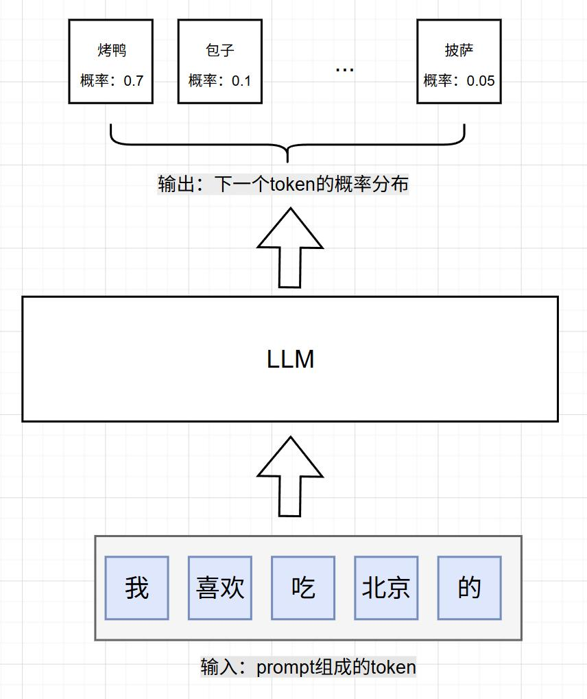

通过在大规模语料上进行这种训练，模型能够学习到语言的语法结构、表达方式、知识关联以及一定的推理模式。因此，虽然它的底层训练目标看起来只是“预测下一个 token”，但当模型规模、训练数据和训练方法达到一定程度后，模型就能够表现出问答、摘要、翻译、信息抽取、代码生成等多种能力。

## 1.2 **大模型结构**

当前主流的大语言模型大多基于 Transformer 架构构建，Transformer架构是在2017发布的非常知名的论文：《[Attention is all you need](https://arxiv.org/pdf/1706.03762)》当中所定义的一种用于做NLP（自然语言处理）的创新架构，其架构图如下所示：

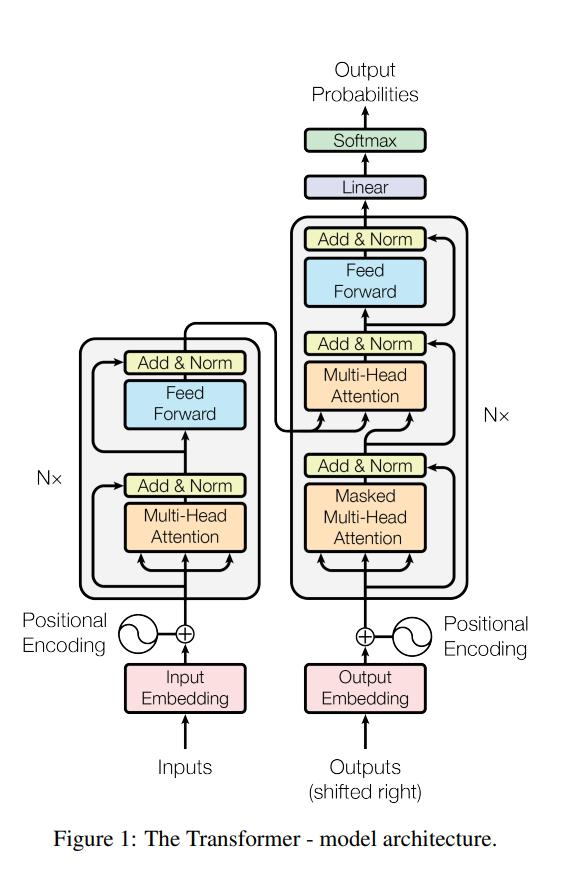

现代几乎所有语言模型采用都是 Decoder-only 结构，也就是去除掉了Transfomer当中的编码器Encoder，例如 GPT、DeepSeek、Qwen 等。对于本课程来说，不需要深入掌握 Transformer 的数学细节，只需要理解它是当前大模型最常用的基础结构，能够帮助模型根据上下文生成后续文本。

从整体上看，一个典型的大语言模型可以简单分为输入层、Transformer Block 堆叠层和输出层三个部分。这些层内部包含大量矩阵，这些矩阵中的数值，就是**模型的参数**。

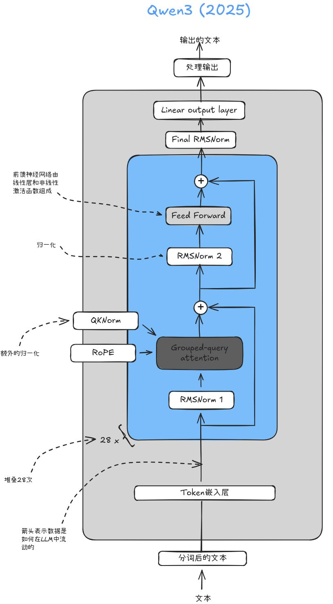

### 1.2.1 **输入层**

输入层负责把用户输入的文本转换成模型可以计算的数字表示。模型不能直接理解文字，因此会先把文本切分成一个个 token，再把每个 token 和模型的参数，经过矩阵运算，转换成表示token初始语义信息的向量。

输入层的作用，可以简单理解为：把“文字”变成“模型能处理的数字”，其也是为后续 Transformer Block 提供初始的语义信息。

### 1.2.2 **Transformer Block**

Transformer Block 是大模型中最核心的计算部分，通常会堆叠很多层。每一层内部主要包含注意力机制和前馈神经网络。可以简单理解为，token 进入 Transformer Block 后，会不断和前文中的 token 建立联系，模型会根据上下文更新它的表示，使这个表示不仅包含 token 本身的信息，也包含它在当前句子或对话中的语义关系。

### 1.2.3 **输出层**

经过多层 Transformer Block 计算后，每个 token 都会得到一个新的向量表示。对于文本生成任务来说，模型通常会使用最后一个位置对应的向量，经过输出层的计算，得到下一个 token 在整个词表上的概率分布。

例如，假设经过 Transformer Block 计算后，最后一个 token 对应的向量是一个 128 维向量，而模型的词表大小是 50000。那么输出层会把这个 128 维向量转换成一个 50000 维向量，其中每一个位置都对应词表中的一个 token。这个 50000 维向量当中任意一个维度的值，就表示下一个token是取当前索引位置处的token的概率。

模型在生成文本时，会根据这个概率分布选择或采样出下一个 token，然后把新生成的 token 加到原来的输入后面，继续预测下一个 token。这个过程不断重复，就形成了完整的句子或回答。

## 1.3 **大模型发展历程**

自 2018 年 GPT-1 发布以来，到如今的GPT-5.x，GPT 系列的发展推动了现代大语言模型训练范式的逐步成熟，形成了以 “预训练—监督微调—对齐” 为核心的三阶段开发框架：

- **预训练（Pre-training）**

基于超大规模无标注语料进行自监督学习，使模型获得通用语言建模能力、广泛的世界知识以及基本的推理与泛化能力。

- **监督微调（Supervised Fine-tuning, SFT）**

利用人工构建的指令—响应示例或高质量对话数据对模型进行进一步训练，**使其能够更好地理解指令**，并输出更加规范、稳定且贴合任务需求的内容。

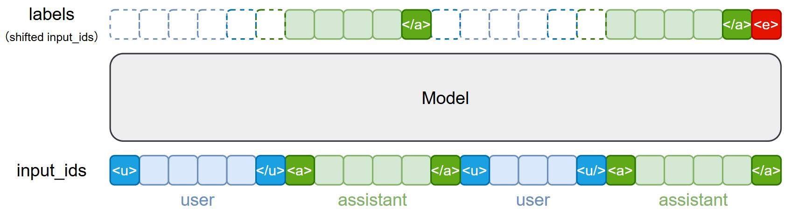

- **对齐（Alignment）**

通过引入人类偏好、行为规范、安全约束与价值观等因素，使模型的行为更符合用户期望。对齐方式包括RLHF（奖励模型 + 强化学习）以及DPO、ORPO、KTO 等无需强化学习的偏好优化方法。对齐阶段的目标是让模型在真实应用场景中表现得更有帮助、更安全、更可靠。

这一“三阶段”开发范式在实践中得到广泛验证，已成为业界主流的大语言模型训练框架。

# 2 **大模型适配概述**

当前，大语言模型在通用场景下已展现出强大的语言理解与生成能力。然而，当应用于特定行业、专业任务或独特语境时，其表现可能无法直接满足实际需求。为了提升模型在具体业务场景中的适用性、稳定性与输出质量，需要对其进行针对性的调整与增强。

在实践中常见且具有代表性的适配方法包括：**提示词工程（Prompt Engineering）、微调（Fine-tuning）、检索增强生成（Retrieval Augmented Generation，RAG）。** 这些方法从不同层面优化模型，各有其适用场景与优势。

## 2.1 **适配方法概览**

### 2.1.1 **提示词工程**

提示词工程是一种通过精心设计输入指令、示例与结构，以引导大语言模型生成预期输出的技术。该方法的核心优势在于无需调整模型内部参数，仅通过优化提示即可显著改善模型输出的质量、稳定性与可控性。因其成本低、迭代速度快、灵活性高，提示词工程通常是模型适配的首选方案。

在实际应用中，有效的提示词工程关键在于：清晰定义任务目标、严格约束输出格式、提供高质量示例，并最大限度地减少指令的歧义。通过持续的提示迭代与测试，模型在特定任务上的表现会趋于稳定，更贴合实际需求。

然而，提示词工程的效能受限于模型本身的内在能力、上下文窗口长度以及任务的复杂程度。对于专业性要求极高或需要严格行为一致性的场景，仅依赖提示可能无法达到理想效果，通常需要与其他适配方法结合使用。更系统的提示词技巧可参考：[https://www.promptingguide.ai](https://www.promptingguide.ai)。

### 2.1.2 **微调**

微调是指在预训练语言模型的基础上，使用带标注的数据集进一步训练模型，使其输出更贴合任务需求或更符合人类偏好。**微调主要用于让模型更稳定地学习特定任务、格式、语气或业务风格**。例如：微调可以让客服模型始终按公司话术、固定格式和品牌语气回复，也可以让分类模型更稳定地输出指定标签。

根据训练目标的不同，微调通常分为两类范式：

- **监督微调（Supervised Fine-tuning）**：利用包含明确示例和正确输出的标注数据，通过监督学习让模型直接学习任务规则和输出格式。
- **偏好对齐（Preference Alignment）**：基于偏好数据调整模型的输出倾向，使其生成更符合人类偏好的回答方式，常用于提升回答质量、一致性或安全性。

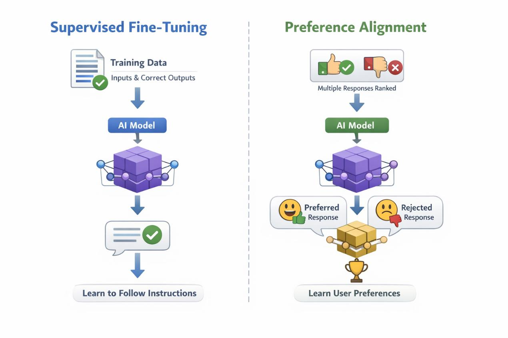

微调的效果依赖于标注数据的质量、覆盖范围和任务定义的清晰度。当数据具备代表性和一致性时，模型通常能够在目标任务上获得显著提升；反之，模糊或噪声较高的数据可能会限制微调效果。因此，构建高质量的标注集是微调能否发挥作用的关键。

### 2.1.3 **检索增强生成**

检索增强生成（RAG）是一种在模型推理阶段引入外部知识的方法。其核心思想是，先根据用户问题从外部知识源中检索相关信息，再将检索结果与原始问题一并提供给模型，使其能够在增强的上下文基础上生成回答。**RAG主要用于让模型在回答时检索并参考外部知识，以提升事实准确性和知识时效性**。

由于无需修改模型参数，RAG 特别适用于知识更新频繁或需要处理大量私有知识的场景。

典型流程是：系统首先根据用户问题，从外部知识源（如向量数据库）中检索相关文本片段；随后将这些检索到的内容与原始问题一并输入模型，由模型在增强后的上下文基础上生成回答。

RAG 在企业问答、文档智能、专业咨询等场景中尤为实用，能有效弥补模型静态知识的不足。但其效果高度依赖于外部知识库的质量、检索的准确性以及信息与问题的相关度。因此，构建高质量的知识源和优化的检索流程是 RAG 系统可靠运行的核心保障。

## 2.2 **适配方法选择策略**

在构建基于大语言模型的应用时，不同适配方法各有其优缺点与适用场景。为实现最佳的投入产出比，需要结合具体任务需求进行系统性决策。下图展示了一个常用的渐进式决策流程，可帮助开发者根据任务特性选择最合适的适配路径：

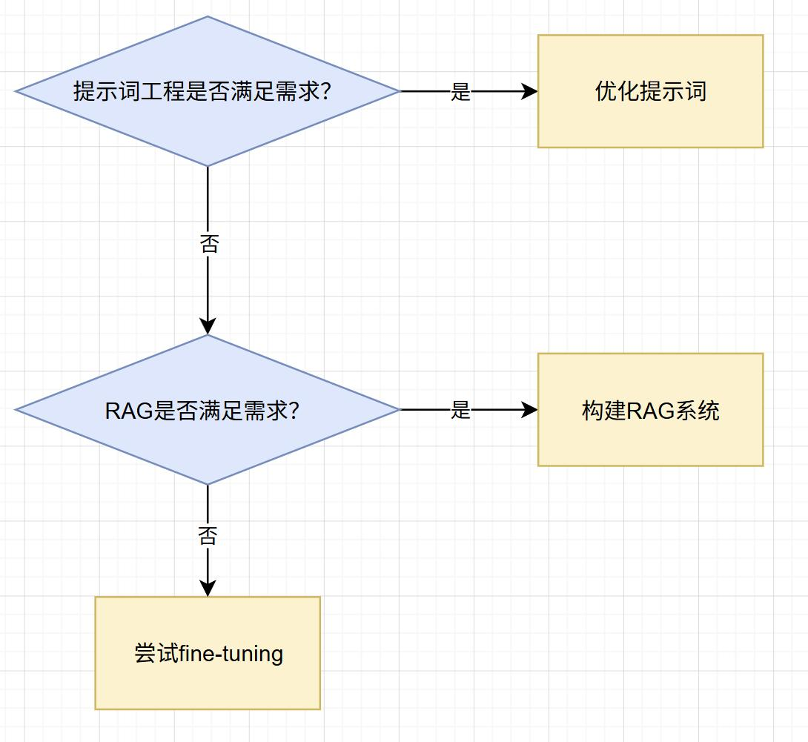

# 3 **微调整体流程**

微调整体流程可以分为以下多个环节：

模型选择-> 数据准备 -> 微调训练 -> 模型验证

## 3.1 **模型选择**

在进行微调训练时，首先需要面临是选择什么样的模型来进行训练，也就是模型规模的选择。

在模型规模方面，参数量越大的模型通常能力越强，但显存占用、训练成本和推理成本也更高。因此模型并不是越大越好，而应根据任务复杂度、硬件资源、响应速度和部署成本综合选择。实践中可以先从成本可控的中小规模 Instruct Model 开始验证，再根据效果决定是否扩大模型规模。

常见任务及可选择的模型类型参考：

- 意图识别、文本分类等：1B-7B；
- 智能客服FAQ/工单辅助：7B-14B；
- 企业知识库问答/RAG：7B-14B起步，复杂场景14B-32B；
- NL2SQL/自然语言转SQL：简单场景7B-14B，复杂场景14B-32B；
- 本地轻量部署、边缘设备：0.5B-4B。

注意：上述只作为初始选型参考，最终仍应通过任务评测确定。对于多数业务微调项目，可以先选择 7B/8B 或 14B 级别的做基线实验；如果评测发现复杂推理、长上下文理解或结构化输出稳定性不足，再考虑升级到 32B 或更大模型。

## 3.2 **数据准备**

在微调大语言模型时，**数据是决定模型性能与适用性的关键因素**。模型表现，很大程度上取决于其训练数据的质量。根据数据的来源与可访问性，通常可分为两大类：公共数据源与私有数据源。

公共数据集也即在HuggingFace、ModelScope等平台已经存在的数据。一般企业不会完全使用公开数据集来进行微调，但是其可以作为数据补充，将公开数据集和企业内部的私有数据集混合，减少构建数据的压力。

## 3.3 **微调训练**

在微调整体流程中，训练阶段是模型真正根据任务数据进行调整的核心环节。我们会把准备好的训练数据送入模型，让模型在已有预训练能力的基础上继续学习，使它逐渐适应当前任务的数据格式、回答风格、领域知识或偏好要求。

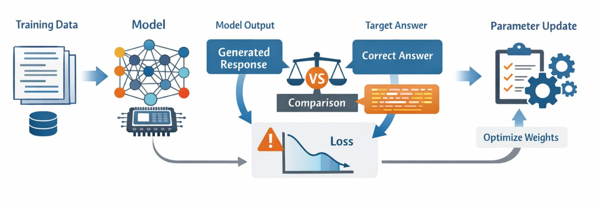

**按照训练目标，可以对LLM 的微调训练分成两种不同的形式**：

- **监督微调**：也就是 SFT（Supervised Fine-Tuning）。SFT 使用带有标准答案的数据进行训练，例如“指令-回答”“问题-答案”“输入-输出”等格式。**SFT的核心目标是让LLM先根据标准答案学习基本的输出格式**。
- **偏好对齐训练**：偏好对齐是在SFT之后，**其核心目标是让模型输出人类更喜欢的回答**。偏好对齐训练可以分为使用强化学习的方式和不使用强化学习的方式。前面所讲到RLHF即为使用强化学习来进行偏好对齐训练，人类偏好通过奖励模型来表达。而DPO则是典型的不使用强化学习的方式，其偏好通过同一个prompt下的“更优回答”和“较差回答”来表达，直接使用偏好数据，来训练模型。

**按照参数更新方式，也可以对LLM的微调训练分成两种不同的方式**：

- 全参数微调：全参数微调会更新模型的全部参数，训练自由度最高，但资源消耗也最大。
- 参数高效微调：仅更新少量参数或引入少量可训练模块，在显著降低资源消耗的同时，高效适配目标任务。常见的参数高效微调的方法有：LoRA, QLoRA等。

## 3.4 **模型验证**

在模型完成微调后，需要通过验证环节评估模型是否真正学习到了目标任务能力，并具备一定的泛化能力。

其核心原理是：针对具体业务场景，准备未参与训练、且能够代表真实业务分布的输入，让模型进行自回归生成。

对模型生成的结果，可以通过客观指标、业务专家人工评估，或者使用更强大的模型作为 Judge 进行评分。

通过模型验证，可以发现模型在哪些类型的任务上仍然表现不理想。针对这些 Bad Case，可以进一步分析问题、补充或增强相应类型的数据，再进行下一轮微调，从而持续提升模型能力。

# 4 **微调数据准备**

在微调大语言模型时，数据是决定模型性能与适用性的关键因素。模型表现，很大程度上取决于其训练数据的质量。根据数据的来源与可访问性，通常可分为两大类：公共数据源与私有数据源。

## 4.1 **公共数据源**

公共数据集易于获取，通常是绝佳的起点，常用的数据共享平台有：

- Hugging Face Hub

[Hugging Face Hub](https://huggingface.co/)是一个不可或缺的资源，它托管了数千个数据集，这些数据集可以通过 datasets 库轻松访问。用户可以根据任务类型（如文本生成、文本摘要等）、语言以及数据集的许可证进行筛选，从而快速找到符合需求的数据。

- Model Scope

[ModelScope](https://modelscope.cn/home)是阿里巴巴旗下的模型开放平台，提供了一系列高质量的开源模型与数据集。ModelScope 的数据集覆盖了多个领域，包括但不限于自然语言处理、计算机视觉和多模态任务。

## 4.2 **私有数据源**

私有数据源是指企业或组织内部拥有的数据集，这些数据可能受到版权保护或隐私限制，仅限于内部使用或特定授权范围内使用。以下是常见的私有数据源：

- 企业内部文档: 包括公司的历史文件、报告、邮件、会议记录等，这些数据可以用来训练模型以更好地理解公司业务流程和专业知识。
- 客户反馈数据: 来自客户的评论、投诉、建议等信息，可以帮助企业改进产品和服务质量。
- 专有数据库: 某些行业可能拥有专门构建的数据库，如医疗健康领域的电子病历、金融领域的交易记录等。

私有数据通常并非专为模型微调而准备，因此在使用前往往需要经过清洗、结构化和标注等预处理步骤。为了构建高质量的领域特定训练集，企业可以根据实际需求，由内部专业团队或外部众包平台对原始数据进行系统化整理与标注。

此外，还可以借助自动化工具提升整体效率，例如使用 [Easy Dataset](https://github.com/ConardLi/easy-dataset) 等开源方案。在人机协同的工作模式下，企业能够更高效地将私有知识转化为高质量的微调数据，从而更有力地支撑模型在特定业务场景中的性能提升。

## 4.3 **数据集格式**

在大型语言模型的监督微调中，数据集的构建格式至关重要，常见的格式可分为两类：指令式 与 对话式。

### 4.3.1 **指令式**

指令式数据集用于训练模型执行明确的单轮任务，如翻译、摘要或问答。其典型格式源自斯坦福大学的 Alpaca 项目，结构简洁、易于使用。

其每条样本包含三个字段：

- instruction：描述模型需要执行的任务；
- input：任务所需的上下文或附加信息；
- output：模型应生成的正确回答。

例如：

```json
{
  "instruction": "将以下英文翻译成中文",
  "input": "Large language models are transforming AI.",
  "output": "大语言模型正在改变人工智能。"
}
```

训练时，这些字段通常会通过一个提示模板（prompt template）组合成结构统一的输入字符串，以帮助模型更好的学习任务指令。

```markdown
### 指令：
{instruction}
### 输入：
{input}
### 回复：
{output}
```

### 4.3.2 **对话式**

对话式数据集用于训练模型进行多轮对话，例如聊天机器人、虚拟助手等。这类数据通常以消息序列的形式组织，强调发言者角色与对话流程。目前广泛采用的格式主要有 ShareGPT 格式 和 OpenAI 格式。

##### 4.3.2.1.1 **ShareGPT 格式**

ShareGPT 格式源于用户在社区中分享的与 ChatGPT 的真实对话记录，常用于保存多轮对话数据集。

每条数据样本由一个名为 conversations 的列表构成，列表中的每个元素代表一次发言，包含两个关键字段：

- from：标识发言者的角色，通常取值为 "human"（表示用户）或 "gpt"（表示模型助手）；
- value：该轮对话的具体文本内容。

例如：

```json
{
  "conversations": [
    {
      "from": "human",
      "value": "你能解释一下什么是机器学习吗？"
    },
    {
      "from": "gpt",
      "value": "机器学习是人工智能的一个分支，它允许计算机系统通过数据和经验自动改进其性能。"
    },
    {
      "from": "human",
      "value": "它主要有哪些类型？"
    },
    {
      "from": "gpt",
      "value": "主要类型包括监督学习、无监督学习、半监督学习和强化学习等。"
    }
  ]
}
```

##### 4.3.2.1.2 **OpenAI 格式**

OpenAI 格式是 OpenAI 官方在其 API 微调功能中推广的一种通用消息列表格式，兼具灵活性与表达力，可同时支持单轮和多轮对话。

每个训练样本是一个包含 messages 字段的字典，其中 messages 是一个有序列表，每条消息包含以下字段：

- role：发言者角色，常见值包括：system、user和assistant。
- content：消息的具体文本内容。

例如：

```json
{
  "messages": [
    {
      "role": "system",
      "content": "你是一名专业的营养师。你的回答应基于科学知识，提供务实、健康的建议，并避免提供任何医疗诊断。"
    },
    {
      "role": "user",
      "content": "我最近感觉下午很疲惫，有什么健康的零食推荐吗？"
    },
    {
      "role": "assistant",
      "content": "下午感到疲惫是常见的现象，选择正确的零食可以帮助稳定能量水平。以下是一些推荐：\n1.  **一把坚果和干果**：提供健康的脂肪、蛋白质和天然糖分，能快速补充能量。\n2.  **希腊酸奶**：富含蛋白质，能提供持久的饱腹感。\n3.  **一个苹果或一根香蕉**：富含维生素和膳食纤维，是方便的天然能量来源。\n请记得结合充足的水分摄入，因为脱水也会导致疲劳。"
    }
  ]
}
```

在实际训练中，无论采用哪种原始格式，通常都会通过 Chat Template（例如ChatML）将多轮消息组织成结构统一的字符串，确保模型能够正确解析对话结构并学习交互模式。这一标准化步骤对于提升模型的对话理解与生成能力至关重要。

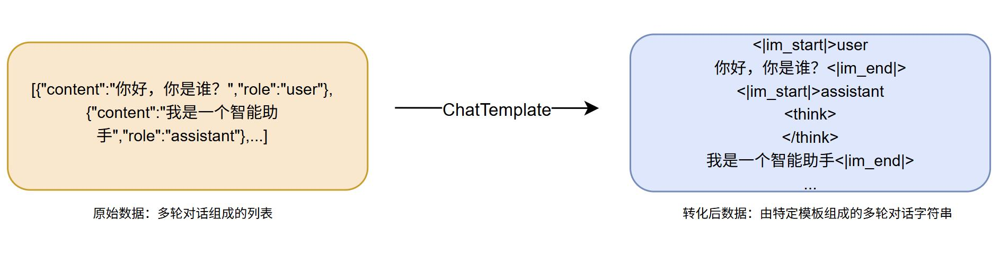

# 5 **微调方法选择**

根据是否更新模型全部参数，监督微调（SFT）的方法可分为两类：

- **全参数微调（Full Fine-tuning）**
- **参数高效微调（Parameter-Efficient Fine-tuning, PEFT）**

## 5.1 **全参数微调**

全参数微调是一种在微调过程中更新模型全部参数的方法。它能最大限度地适配目标任务，通常获得最优性能。

但由于大语言模型参数量庞大（数十亿至数千亿），全参数微调对显存、算力和训练时间要求极高，单设备通常无法承载模型参数、优化器状态与激活值，必须依赖分布式训练技术才能实施。

因此，全参数微调适用于资源充足、对性能要求严苛、且拥有高质量标注数据的场景。在实际应用中，常作为参数高效微调无法满足需求时的高成本备选方案。

## 5.2 **参数高效微调**

### 5.2.1 **概述**

参数高效微调（Parameter-Efficient Fine-tuning, PEFT）是一系列微调方法，其核心思想是仅更新少量参数或引入少量可训练模块，在显著降低资源消耗的同时，高效适配目标任务。目前，最先进的PEFT方法已经能实现与全参微调相当的性能。

PEFT 的兴起可追溯至 2019 年前后。当时以 BERT、GPT-2 为代表的预训练模型规模迅速扩大，传统全参数微调的资源成本逐渐难以承受。伴随模型规模持续膨胀，这种矛盾愈发凸显，由此推动了 PEFT 技术的快速发展，形成了包括 Prompt Tuning、Prefix Tuning、P-Tuning、Adapter、LoRA 等多条技术路线，如下图所示：

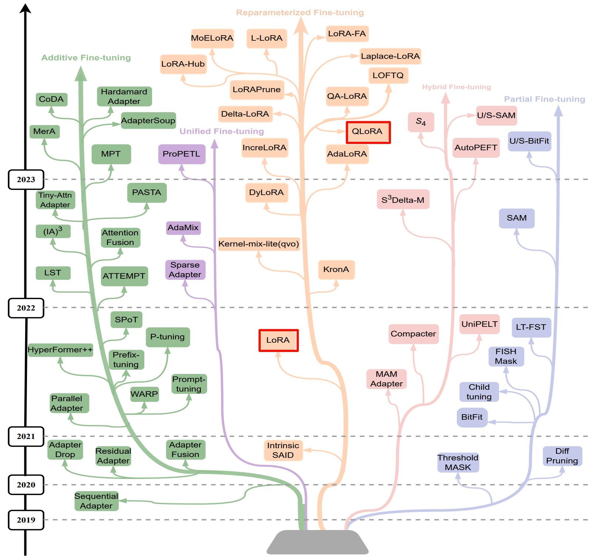

在众多方法中，LoRA（Low-Rank Adaptation）因其结构简洁、训练高效、稳定，已成为当前大语言模型监督微调（SFT）的主流选择；其量化版本 QLoRA （Quantized Low-Rank Adaptation）进一步融合量化技术，将微调门槛降至消费级 GPU 也可运行的水平。相比之下，其他 PEFT 方法因在效率、稳定性或通用性等方面存在局限，已逐渐边缘化。

### 5.2.2 **LoRA**

##### 5.2.2.1.1 **概述**

LoRA（Low-Rank Adaptation）是一种高效且广泛使用的参数高效微调方法，由微软研究院于 2021 年提出。因其训练成本低、适配能力强、推理无额外开销等优势，已成为当前大语言模型监督微调（SFT）中最广泛使用的技术。

##### 5.2.2.1.2 **原理**

在传统的全参数微调（Full Fine-tuning）中，模型中的某个参数矩阵 $W_{0}\in \mathbb{R}^{d\times k}$ 会在训练过程中被更新为：

$$
W=W_{0}+\Delta W
$$

其中 $\Delta W$ 是微调阶段需要学习的完整增量矩阵。

LoRA 的作者在实践中观察到： $\Delta W$  往往具有**低秩结构**，也就是说它的有效自由度远低于其表面维度。基于这一关键现象，LoRA 将 $\Delta W$ 近似分解为两个低秩矩阵的乘积：

$$
\Delta W\approx AB,A\in \mathbb{R}^{d\times r}, \hspace{0.25em} \hspace{1pt} B\in \mathbb{R}^{r\times k},
$$

其中 $r\ll min (d,k)$ ，通常取 4、8 或 16 等远小于原始维度的数值。这样，微调后的权重矩阵可写为：

$$
W=W_{0}+AB.
$$

如下图所示：

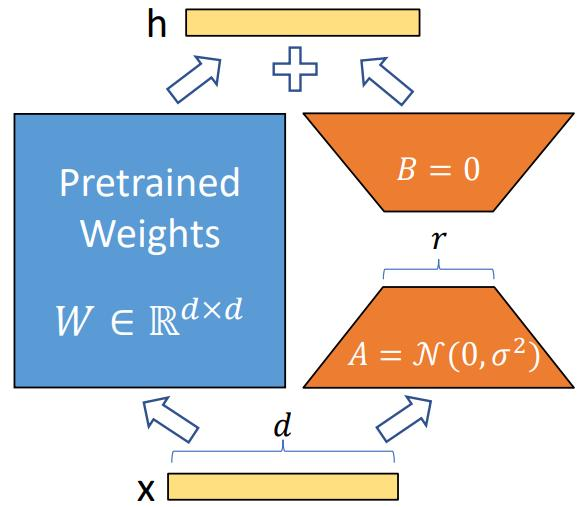

在训练过程中，LoRA **完全冻结原始权重** $W_{0}$ ，仅对新增的低秩矩阵 $A$ 和 $B$ 进行优化。这大幅减少了需要更新的参数量，同时也避免了对大规模模型权重的直接修改，使微调过程更加轻量、高效。

在推理阶段，低秩增量 $AB$ 可以无缝合并回原始权重 $W_{0}$ 中，不会引入额外的计算复杂度，因此 LoRA 的高效性不仅体现在训练中，也体现在推理过程中。如下图所示：

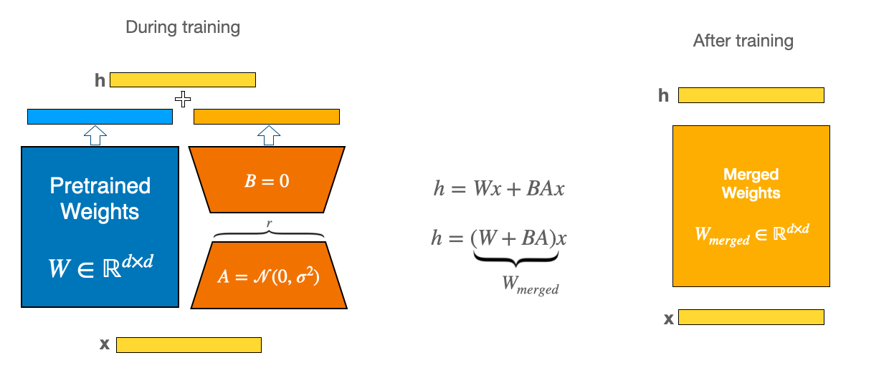

由于秩 $r$ 很小，LoRA 的参数开销和计算成本都极低。例如，对 $d=k=4096$ 的权重矩阵进行全参数更新需要约 16M 个参数，而采用 LoRA（如 $r=8$ ）时，仅需：

$$
4096\times 8+8\times 4096=65,536
$$

个参数，占原始权重的仅约 0.4%。这种数量级的压缩使得在有限资源下微调大模型成为可能，也使得在多个任务之间共享底层模型、仅保存轻量级 LoRA 适配器成为现实。

### 5.2.3 **QloRA**

##### 5.2.3.1.1 **概述**

QLoRA（Quantized Low-Rank Adaptation）是 LoRA 的量化增强版本，由华盛顿大学和微软研究院于 2023 年提出。QLoRA 在 LoRA 的基础上引入 4-bit 量化技术，在几乎不损失性能的前提下，将大语言模型微调的硬件门槛大幅降低，使得数十亿参数级别的模型可在单张消费级 GPU（如 RTX 3090/4090）上完成高效微调。

##### 5.2.3.1.2 **原理**

QLoRA 的核心思想是：先对预训练模型权重进行 4-bit 量化以压缩显存占用，再在其上应用 LoRA 进行参数高效微调。

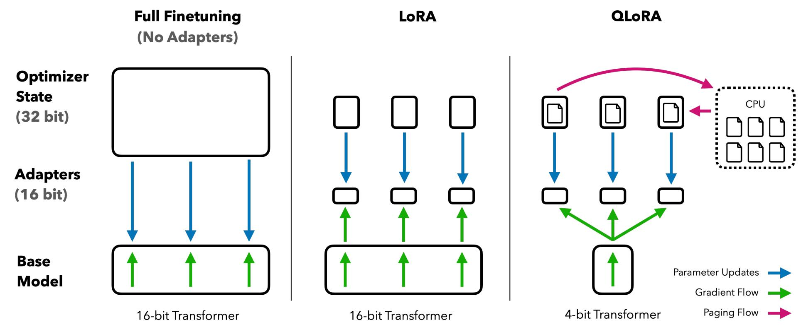

1. **量化的原理**

量化（Quantization） 是一种通过降低数值精度（例如从 16-bit 降至 4-bit）来压缩模型、节省显存的技术。传统 4-bit 量化通常采用如下流程：

1. 使用权重的最大绝对值（absmax）将权重归一化到区间 $[-1,1]$ ；
2. 将该区间均匀划分为 $2^{4}=16$ 个等距格点；
3. 每个权重被映射到最近的格点，并以对应的 4-bit 索引存储。

具体如下图所示：

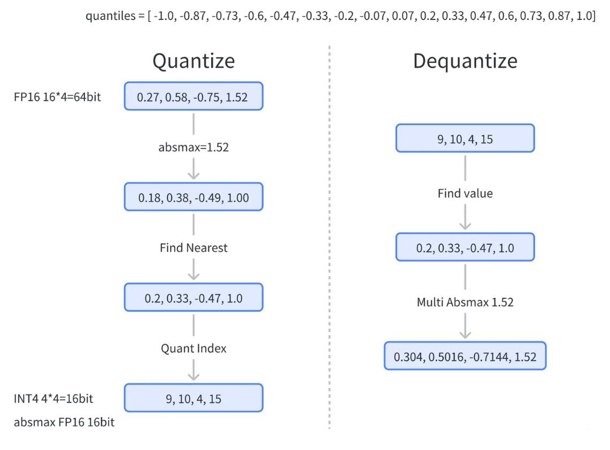

然而，大语言模型的权重分布并非均匀，而是近似服从标准正态分布（均值为 0，方差为 1）。在这种分布下，传统均匀量化存在明显缺陷：

- 在权重密集的 0 附近，格点相对不足，导致量化误差较大；
- 在权重稀疏的两端，格点又相对冗余，造成信息利用率低下。

为解决这一问题，QLoRA 提出了 4-bit NormalFloat（NF4）量化，专为标准正态分布设计：

- 将标准正态分布按累积概率均分为 16 个等概率区间；
- 每个区间选取其中位数作为该区间的量化代表值。

这样得到的量化格点在 0 附近更密集，在两端更稀疏，与权重的实际分布高度匹配，从而显著降低量化误差。

# 6 **分布式训练**

当想对大型模型，进行全参微调，或者是想进一步加快微调速度，已达到单卡瓶颈时，可在多卡环境下进行分布式训练。本节首先介绍分布式训练中的几种并行策略，再讲解一种基于数据并行策略理论而实现的一种使用技术ZeRO。

## 6.1 **数据并行**

数据并行（Data Parallelism）的核心思想是在多张 GPU 上各放置一份完整的模型副本，并让不同 GPU 并行处理不同的数据子集。这样做的主要目的，是提升训练吞吐量，从而加快整体训练速度。

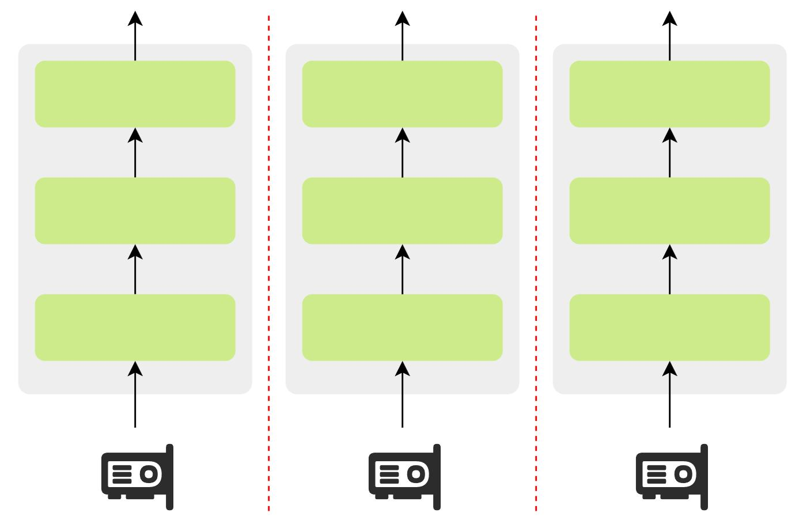

数据并行训练过程中，需要保证各副本参数一致，具体训练流程如下：

1. **每个 GPU 独立处理本地数据子集**，完成前向计算、反向传播并得到本地梯度。
2. **跨 GPU 进行梯度汇总**，将所有梯度进行平均，使每个 GPU 获得相同的全局梯度。
3. **各 GPU 使用相同的全局梯度独立更新参数**，从而保证所有模型副本继续保持一致。

## 6.2 **流水线并行**

流水线并行的核心思想是将大语言模型按层纵向切分，把不同层分配到多个设备上，每个设备负责一个模型分段。其目标是降低单设备的显存占用，使超大规模模型能够在有限硬件资源下完成推理。

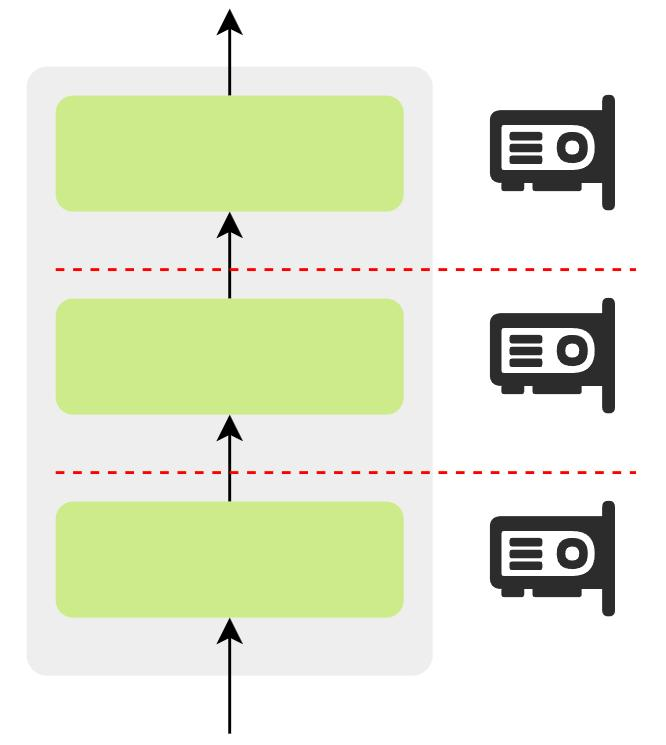

推理过程中，前向计算从第一个设备开始，逐级将中间激活值传递给下一个设备，直到完成整个模型的前向传播，这种按层接力的执行方式允许多个设备协同工作，但也会导致部分设备在等待上下游计算完成时处于空闲状态。

## 6.3 **张量并行**

张量并行的做法是将模型单层内部的张量计算拆分到多个设备上并行执行，每个设备仅持有部分权重和中间结果。其目标仍是突破单设备显存和计算能力的限制，使超大模型的单层也能在多设备上协同完成。

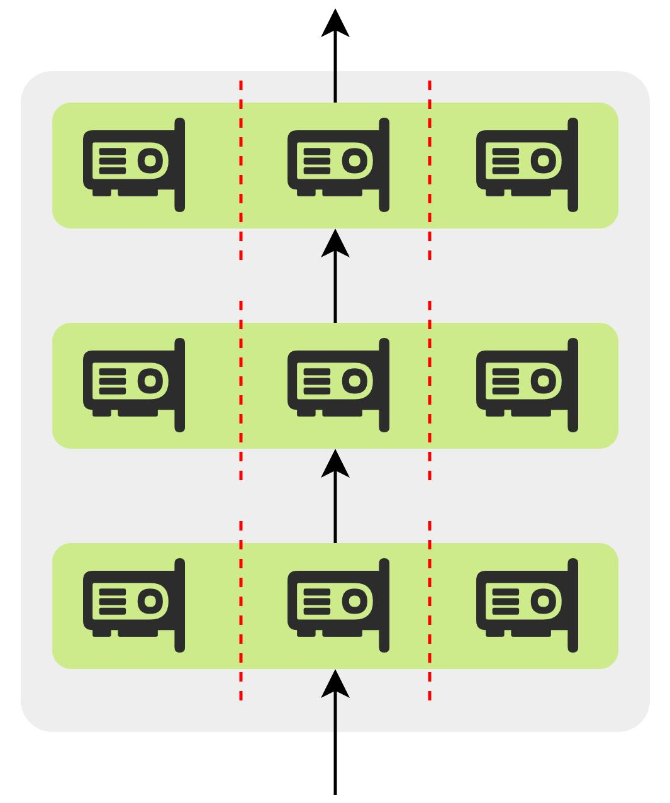

在现代 Transformer 模型中，计算瓶颈通常出现在激活矩阵与大权重矩阵的乘法操作上。由于矩阵乘法可分解为多个独立或可累加的点积运算，因此可以将权重矩阵均匀切分，每个设备仅持有其中一部分，然后将激活数据广播到所有设备，各设备使用本地分片权重独立完成部分矩阵乘法，再通过设备间通信聚合计算结果，得到完整的矩阵乘积。

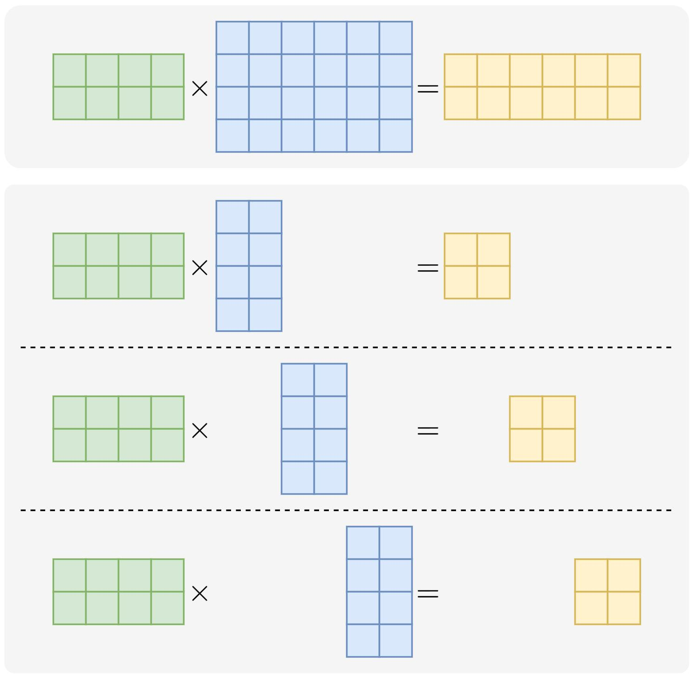

## 6.4 **ZeRO技术**

### 6.4.1 **概述及核心原理**

[ZeRO](https://arxiv.org/pdf/1910.02054)（Zero Redundancy Optimizer）是由微软研究院提出一套分布式训练技术。它可视为对传统数据并行的深度增强。

在标准数据并行中，每个设备都保存完整的模型状态，导致跨设备的冗余存储，并严重限制了可训练模型的规模。

ZeRO 的核心思想是：**分片存储、按需加载**。它不再让每块 GPU 都完整保存一整套模型状态，而是将模型状态切分成多个分片，分布式地存储在不同的 GPU 上；在执行某一层的前向或反向传播时，再通过高效的集体通信，按需、临时地从其他设备拉取当前计算所需的分片参数，并在用完后立即释放。

训练过程中，需要保存和维护的模型状态主要由以下三部分组成：

- 模型参数（Parameters）：网络各层的权重与偏置；
- 梯度（Gradients）：反向传播过程中为更新参数而计算的梯度；
- 优化器状态（Optimizer States）：如 Adam 的一阶矩、二阶矩等辅助变量。

针对上述部分模型状态，ZeRO 将分片策略划分为三个逐级递进的阶段：

- ZeRO-1：优化器状态分片
- ZeRO-2：优化器状态 + 梯度分片
- ZeRO-3：优化器状态 + 梯度分片 + 模型参数分片

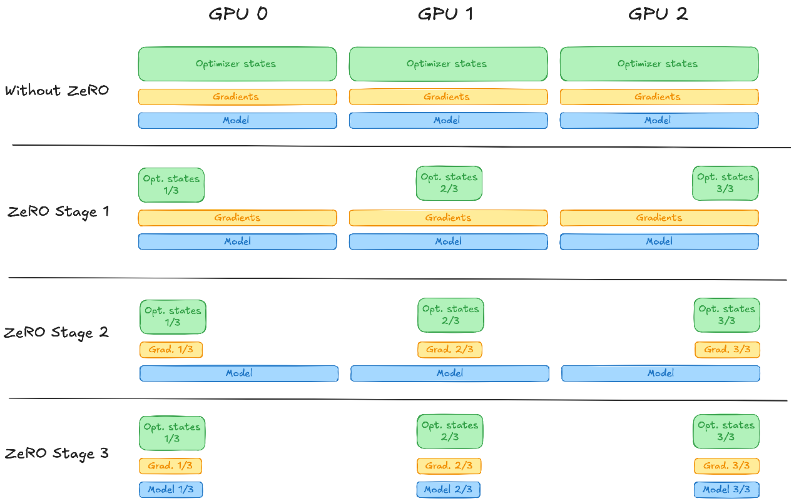

这种分阶段设计的核心意义在于：为显存节省与通信开销之间提供可调节的平衡点。用户可依据硬件资源、模型规模与训练效率等需求，灵活选择不同的分片级别——阶段越高，单卡显存占用越低，但通信成本随之上升；阶段越低，实现更简单、通信压力更小，但显存节省有限。

这种递进式结构使 ZeRO 能够在从中小规模到超大规模的不同训练场景中都保持良好的适配性与扩展性。

ZeRO-3的具体实现细节可参考[官方博客](https://www.microsoft.com/en-us/research/blog/zero-deepspeed-new-system-optimizations-enable-training-models-with-over-100-billion-parameters/)。

# 7 **微调实操**

LLaMA Factory 是一个简单易用且高效的大型语言模型（Large Language Model）训练与微调平台。通过 LLaMA Factory，可以在无需编写任何代码的前提下，在本地完成上百种预训练模型的微调。

## 7.1 **安装LLaMA-Factory**

1. **下载源码**

使用git下载：

```shell
git clone https://github.com/hiyouga/LLaMA-Factory.git
```

autodl内置代理加速：[https://www.autodl.com/docs/network\_turbo/](https://www.autodl.com/docs/network_turbo/)

配置代理加速：

```shell
source /etc/network_turbo
```

取消代理加速：

```shell
unset http_proxy && unset https_proxy
```

2. **安装依赖**

使用UV，创建一个python 3.12环境：

```shell
uv venv --python 3.12
```

激活环境：

```shell
source .venv/bin/activate
```

安装依赖：

```shell
uv pip install -e . -i https://pypi.tuna.tsinghua.edu.cn/simple
```

验证安装成功：

```shell
llamafactory-cli version
```

## 7.2 **启动LLaMA-Factory**

启动webui：

```shell
llamafactory-cli webui
```

不占用前台的方式启动：

```shell
nohup llamafactory-cli webui >llama_factory.log 2>&1 &
```

看到“Running on local URL:  http://0.0.0.0:7860”即启动成功。

如果使用autodl服务器启动，本地电脑访问需开启SSH隧道，在本地电脑执行：

```shell
ssh -CNg -L 7860:127.0.0.1:7860 root@connect.nmb2.seetacloud.com -p 16652
```

也可以使用AutoDL提供的图形化界面工具配置代理隧道：

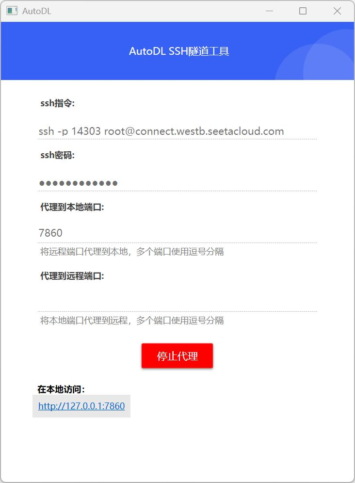

浏览器打开http://localhost:7860/

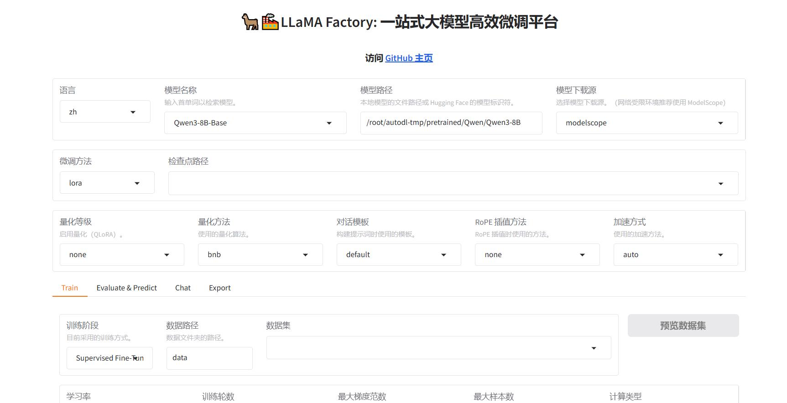

## 7.3 **准备模型**

在使用LLaMA-Factory进行微调时，可以通过LLaMA-Factory在训练时下载模型，也可以提前将模型下载好之后，配置本地路径，直接使用本地的模型。

通过ModelScope下载Qwen3-0.6B模型至model/Qwen3-0.6B路径下，命令如下：

```shell
modelscope download --model Qwen/Qwen3-0.6B --local_dir model/Qwen3-0.6B
```

## 7.4 **准备数据集**

LLaMA-Factory目前支持 [Alpaca](https://llamafactory.readthedocs.io/zh-cn/latest/getting_started/data_preparation.html) 格式和 [ShareGPT](https://llamafactory.readthedocs.io/zh-cn/latest/getting_started/data_preparation.html) 格式的数据集。我们自己整理好格式的数据需要添加到数据集信息中。

3. **处理数据格式**

首先先将课程资料中的数据，上传至LLaMa-Factory目录中。

在LLaMa-Factory目录下，使用以下脚本，将数据整理成LLaMa-Factory所需要的格式，并保存至data/keywords\_data\_sharegpt.jsonl中。

```python
from datasets import load_dataset


def convert_to_qwen_format(examples):
    conversations = []
    # 遍历每个对话样本,注意开启batch时，会自动套一层list
    for conv_list in examples["conversation"]:
        # 重建符合Qwen3标准的消息结构
        for conv in conv_list:
            conversations.append([
                {"role": "user", "content": conv['human'].strip()},
                {"role": "assistant", "content": conv['assistant'].strip()}
            ])
    return {"messages": conversations}


if __name__ == '__main__':
    dataset = load_dataset("json", data_files="data/keywords_data_train.jsonl", split="train")

```

格式化数据为 Chatgpt 格式

```python
dataset = dataset.map(
    convert_to_qwen_format,
    batched=True,
    remove_columns=dataset.column_names
)

dataset.to_json("data/keywords_data_sharegpt.jsonl", force_ascii=False)

```

4. **添加数据集**

修改dataset\_info.json文件，添加数据集信息

```json
{
    "keywords_extract": {
        "file_name": "keywords_data_sharegpt.jsonl",
        "formatting": "sharegpt",
        "columns": {
            "messages": "messages"
        },
        "tags": {
            "role_tag": "role",
            "content_tag": "content",
            "user_tag": "user",
            "assistant_tag": "assistant"
        }
    }
}
```

在web ui上就可以看到数据集，选中后，可以在页面预览数据。


## 7.5 **使用LoRA进行微调**

2. **配置模型**

配置前面已经下载好的模型，模型名称选择Custom，模型路径配置本地路径即可：

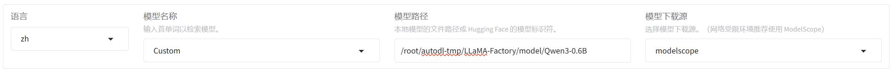

3. **配置使用LoRA**

在微调方法栏，配置使用lora，即可启用LoRA微调

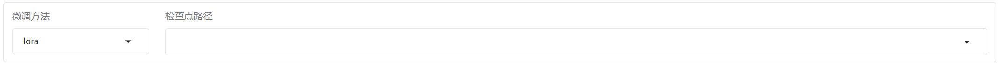

4. **配置训练轮数和最大样本数**

配置训练总轮数以及每个数据集最多使用的样本数。

在不设置最大样本数时，每个 epoch 会遍历完整训练集，因此理论训练样本量约为训练集样本数 × 训练轮数。

在设置最大样本数后，训练前会先将可用训练样本限制到该数量以内，因此理论训练样本量约为 min(训练集样本数, 最大样本数) × 训练轮数。

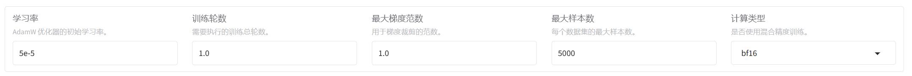

5. **配置保存位置**

设置输出目录，后续训练过程中的检查点以及其他相关数据，都会保存至该目录当中去。

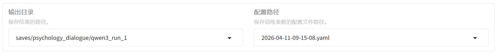

## 7.6 **模型权重导出**

通过LLaMA-Factory，可将训练好后得到的LoRA适配器参数和基座模型参数进行合并导出：

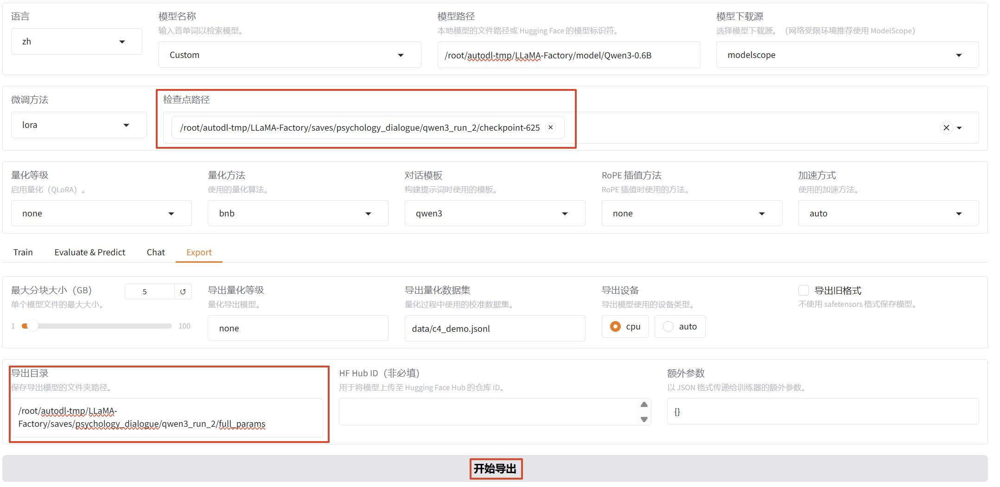

# 8 **模型部署**

在实际生产环境下，微调之后的模型，需要经过部署之后，才能使用。部署的本质就是将模型转换成可通过HTTP调用的服务，本章介绍如何使用vLLM对大模型进行部署以及如何在实际代码当中进行调用。

## 8.1 **vLLM模型部署**

### 8.1.1 **简介**

vLLM 是一个面向大语言模型推理的高性能推理框架，专为大规模并发请求优化，底层基于PyTorch 构建。

vLLM项目主页：[https://docs.vllm.ai/en/latest/index.html](https://docs.vllm.ai/en/latest/index.html)

Github开源地址：[https://github.com/vllm-project/vllm](https://github.com/vllm-project/vllm)

从各种基准测试数据来看，同等配置下，使用 vLLM 框架与 Transformer 等传统推理库相比，其吞吐量可以提高一个数量级，这归功于以下几个特性：

- 高级 GPU 优化：利用 CUDA 和 PyTorch 最大限度地提高 GPU 利用率，从而实现更快的推理速度。
- 高级内存管理：通过PagedAttention算法实现对显存的高效管理，减少内存浪费，从而优化大模型的运行效率。
- 批处理功能：支持连续批处理和异步处理，从而提高多个并发请求的吞吐量。
- 安全特性：内置 API 密钥支持和适当的请求验证，不像其他完全跳过身份验证的框架。
- 易用性：支持多种流行的大型语言模型，并兼容 OpenAI 的 API 服务器。

### 8.1.2 **安装**

环境要求：

- OS: Linux
- Python: 3.9 -- 3.12

创建并激活vllm环境

```shell
uv venv --python 3.12
```

安装vllm

```shell
uv pip install vllm -i https://pypi.tuna.tsinghua.edu.cn/simple
```

查看安装信息

```shell
uv pip show vllm
```

### 8.1.3 **启动**

此处使用vllm将前面经过微调后的模型进行部署操作，首先需要将原模型目录和微调后的模型目录都拷贝到vllm\_dir目录下（按照个人实际操作过程中的目录结构调整）。

启动命令：

```shell
vllm serve /root/autodl-tmp/vllm_dir/Qwen3-0.6B-sft-lora \
--served-model-name Qwen3-0.6B-sft-lora \
--tokenizer /root/autodl-tmp/vllm_dir/Qwen3-0.6B \
--max-model-len 32768
```

注意：小写的k，单位是1000；大写的K，单位是1024

正式运行应后台运行：

```shell
nohup vllm serve /root/autodl-tmp/vllm_dir/Qwen3-0.6B-sft-lora \
--served-model-name Qwen3-0.6B-sft-lora \
--tokenizer /root/autodl-tmp/vllm_dir/Qwen3-0.6B \
--max-model-len 32K \
```

> vllm.log 2>&1 &

### 8.1.4 **调用**

5. **快速测试**

```shell
curl http://localhost:8000/v1/chat/completions \
  -H "Content-Type: application/json" \
  -d '{
    "model": "Qwen3-0.6B-sft-lora",
    "messages": [
      {
        "role": "user",
        "content": "抽取出下文中的关键词：\n目的分析结节性甲状腺肿(NG)合并甲状腺微小癌(TMC)的超声声像图特点,以提高 TMC 的术前超声检出率.资料与方法回顾性分析经手术病理证实的64例 NG 合并 TMC 的超声声像图表现,并以同病例邻近癌灶且直径≤1cm 的 NG 结节作为对照.结果 TMC 与 NG 结节在形态、边界、回声强度、声晕、微小钙化、囊性变与血流分布等方面差异有统计学意义(P <0.01),回声均匀程度差异无统计学意义(P >0.05).颈部淋巴结肿大超声检出率为89.47%(17/19).结论 TMC 具有与 NG 结节不同的声像图特点,TMC 的灰阶超声特点为低回声、无声晕、有微小钙化、无囊性变等,彩色多普勒超声显示病灶内部血流信号丰富或无血流,周边少或无血流信号.在 NG 检查中重点观察≤1cm 的低回声结节,以及早发现 TMC."
      }
    ]
  }'

```

6. **代码调用（openai库）**

安装openai库

```shell
uv pip install openai -i https://pypi.tuna.tsinghua.edu.cn/simple
```

测试代码

```python
from openai import OpenAI

# 连接本地 vLLM 服务
client = OpenAI(
    base_url="http://localhost:8000/v1/",
    api_key="none"  # 占位符，本地部署可忽略
)

# 请求对话接口
response = client.chat.completions.create(
    model="Qwen3-0.6B-sft-lora",  # 模型名需要和vLLM启动时保持一致
    messages=[
        {
            "role": "user",
            "content": "抽取出下文中的关键词：\n目的分析结节性甲状腺肿(NG)合并甲状腺微小癌(TMC)的超声声像图特点,以提高 TMC 的术前超声检出率.资料与方法回顾性分析经手术病理证实的64例 NG 合并 TMC 的超声声像图表现,并以同病例邻近癌灶且直径≤1cm 的 NG 结节作为对照.结果 TMC 与 NG 结节在形态、边界、回声强度、声晕、微小钙化、囊性变与血流分布等方面差异有统计学意义(P <0.01),回声均匀程度差异无统计学意义(P >0.05).颈部淋巴结肿大超声检出率为89.47%(17/19).结论 TMC 具有与 NG 结节不同的声像图特点,TMC 的灰阶超声特点为低回声、无声晕、有微小钙化、无囊性变等,彩色多普勒超声显示病灶内部血流信号丰富或无血流,周边少或无血流信号.在 NG 检查中重点观察≤1cm 的低回声结节,以及早发现 TMC. "
        }
    ],
    extra_body={
        "chat_template_kwargs": {"enable_thinking": False}  # 关闭思考过程输出
    }
)

# 打印结果
print(response.choices[0].message.content)

```

7. **Langchain调用**

安装langchain库

```shell
uv pip install langchain-core langchain-openai -i https://pypi.tuna.tsinghua.edu.cn/simple
```

测试代码

```python
from langchain_openai import ChatOpenAI
from langchain_core.messages import HumanMessage

llm = ChatOpenAI(
    model="Qwen3-0.6B-sft-lora",
    base_url="http://localhost:8000/v1/",
    api_key="none",
    temperature=0
)

# 构建消息（支持多角色）
messages = [
    HumanMessage(
        content="抽取出下文中的关键词：\n目的分析结节性甲状腺肿(NG)合并甲状腺微小癌(TMC)的超声声像图特点,以提高 TMC 的术前超声检出率.资料与方法回顾性分析经手术病理证实的64例 NG 合并 TMC 的超声声像图表现,并以同病例邻近癌灶且直径≤1cm 的 NG 结节作为对照.结果 TMC 与 NG 结节在形态、边界、回声强度、声晕、微小钙化、囊性变与血流分布等方面差异有统计学意义(P <0.01),回声均匀程度差异无统计学意义(P >0.05).颈部淋巴结肿大超声检出率为89.47%(17/19).结论 TMC 具有与 NG 结节不同的声像图特点,TMC 的灰阶超声特点为低回声、无声晕、有微小钙化、无囊性变等,彩色多普勒超声显示病灶内部血流信号丰富或无血流,周边少或无血流信号.在 NG 检查中重点观察≤1cm 的低回声结节,以及早发现 TMC. "
    )
]

# 调用模型获取响应
response = llm.invoke(messages)
print(response.content)

```

