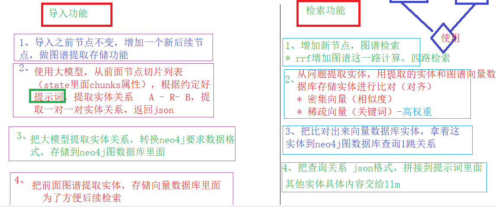
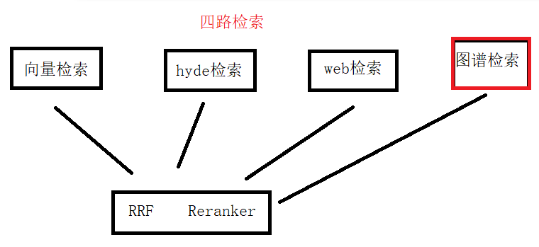
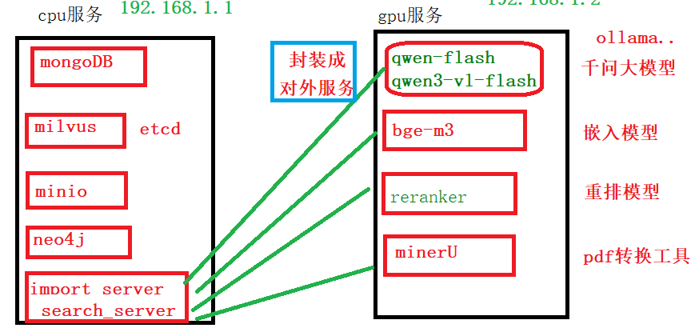
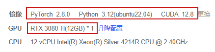

## 一、图谱实现流程

1、图谱作用：多切片内容逻辑缺失问题

2、图谱实现流程






## 二、项目部署

**1、部署服务器规划**




**2、cpu服务部署**

* 开通腾讯云服务器，安装docker等相关工具
* 使用docker容器部署各个服务
* 应用（导入服务、检索服务），首先构建docker镜像（Dockerfile文件），再使用容器启动


**3、gpu服务部署**

* **大模型使用方式**

1、大厂商提供模型能力，调用提供api地址，获取api key

2、云服务方式：我们租用服务器，在服务器自己部署大模型

3、完全本地部署

* **bge-m3 和 reranker模型部署**

**-- 第一步 准备云服务器 atuodl算力云**

* 选择python相关环境（安装好python环境）




**-- 第二步 在云服务器python环境下载依赖**

```
pip install FlagEmbedding fastapi uvicorn transformers accelerate sentence-transformers -i https://pypi.tuna.tsinghua.edu.cn/simple
```


**-- 第三步 准备要部署的模型**

1 bge-m3模型

2 reranker模型

方式一：直接在云服务器下载

方式二：把windows本地两个模型上传


**-- 第四步 把两个模型封装服务**

编写python代码，封装服务 fastapi uvicorn


**-- 第五步 启动模型服务**

```
# 后台运行，日志输出到bge.log
nohup python server1.py > bge.log 2>&1 &

# 查看启动日志
tail -f bge.log
```


**-- 第六步 端口转发**

因为模型服务部署在一台机器中，应用在另外一台机器中

如果腾讯云或者阿里云，有公网ip

**算力云没有，算力云方式端口转发**

两种方式：

第一种 使用固定两个端口号对应域名测试

**第二种 使用端口转发（推荐）**

