# 一、目标

今天开始，我们学习一个新的项目，基于若依框架+AI的养老项目

具体的学习目标如下：

- 掌握星海智伴项目核心业务流程、系统架构、技术架构
- 能够熟悉若依框架的基本信息，包括它的功能、版本、特性等
- 能够独立完成若依框架的前后端项目的环境搭建
- 能够熟悉前后端代码的结构
- 能够独立使用若依代码生成实现业务快速开发
- 能够熟练掌握在线接口工具的使用

# 二、项目介绍

## 1.行业背景

中国老龄化程度加深，我国老龄事业和养老服务体系的发展得到了国家的高度重视，在国家政策的支持下，我国智慧养老产业主体持续增多，产业链不断整合，发展前景较好。我国正在形成一个多元化“互联网\+养老”的智慧老年护理服务系统，智慧养老是我国的必然趋势

市场规模及预测


2026年中国养老产业市场规模达到18\.5万亿元，同比增长14\.7%。

预计2023\-2027年中国养老产业迎来较快速增长。预计2027年中国养老产业市场规模达21\.1万亿元

## 2.整体业务流程

星海智伴系统为养老院量身定制开发专业的养老管理软件产品；涵盖来访管理、入退管理、在住管理、服务管理、财务管理等功能模块，涉及从来访参观到退住办理的完整流程。

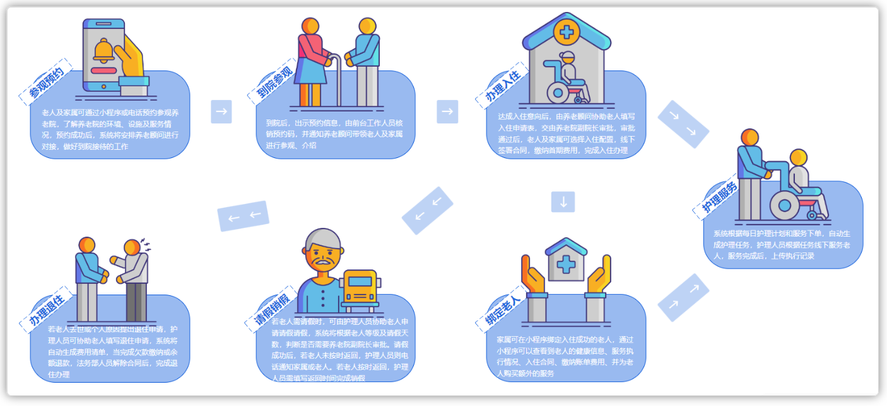

星海智伴项目分为两端，一个是管理后台，另外一个是家属端

管理后台：养老院员工使用，入住、退住，给老人服务记录等等

家属端：养老院的老人家属使用，查看老人信息，缴费，下订单等等

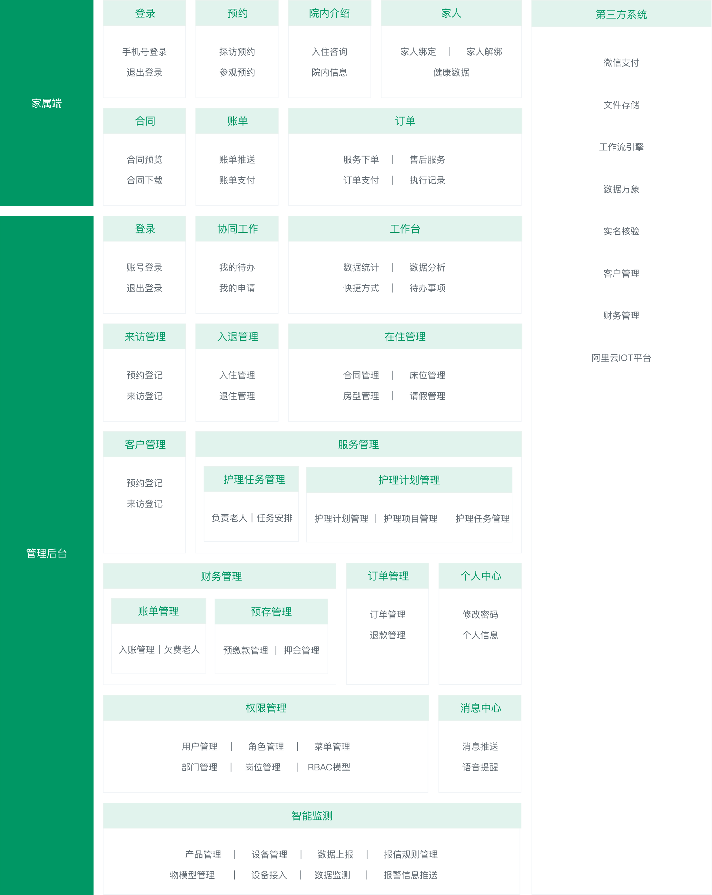

后台系统\-业务主页效果：

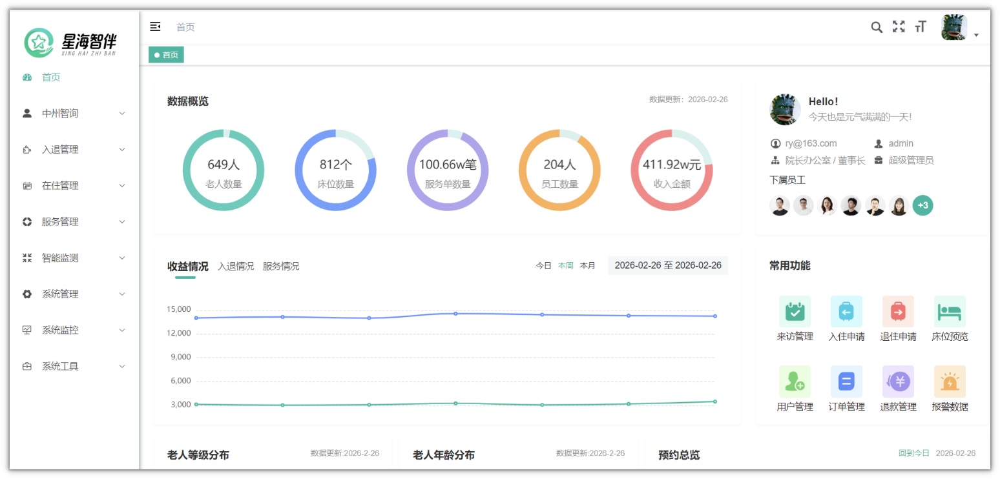

小程序端\-首页


## 3.技术架构

下图展现了星海智伴项目主要使用的技术：

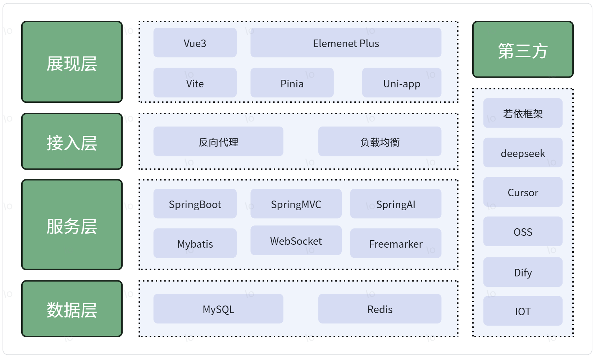

前端主要使用的Vue3\+Element Plus

后端主要使用的是若依框架作为基础架构，当然后端也集成了很多其他的技术，比如有Springboot、SpringAI、Mybatis、Swagger、Spring cache、Spring Security、Mybatis\-plus等

数据存储主要使用到了Mysql和Redis

使用了nginx来作为反向代理和前端的静态服务器

其他技术：华为云物联网平台IOT、对象存储OSS、微信登录、阿里百炼大模型、Deepseek、Coze、Dify、AI工具辅助开发等

## 4.若依框架

### 4.1.基本介绍

若依（RuoYi）框架是一款基于Spring Boot、Spring Cloud等开源框架搭建的企业级开发平台。它的主要目标是提供全面的解决方案，以简化企业级应用开发，提高开发效率。以下是对若依框架的详细介绍：

1. 模块化设计：若依框架采用模块化的设计，使得应用可以根据需求进行灵活的扩展和定制。每个模块都可以独立部署和升级，这大大提高了系统的可维护性和可扩展性。

2. 前后端分离：框架采用前后端分离的开发模式，后端专注于数据处理和API接口的提供，前端则负责页面的展示和用户交互。这种模式使得前后端职责明确，进一步提高了开发效率和代码的可维护性。

3. 权限管理：若依框架提供了完善的用户权限管理功能，包括角色管理、菜单授权、部门管理等，便于对系统权限进行灵活的配置和管理。

4. 代码生成器：框架内置代码生成器，能够快速生成前后端代码，减少重复劳动，提高开发效率。通过简单的配置即可生成基础的增删改查代码。

5. 定时任务：若依框架集成了定时任务模块，支持动态添加定时任务，可以通过界面对定时任务进行管理与调度。此外，框架还能实时查看系统运行日志和在线用户信息，监控服务状态和性能。

6. 易于集成：若依框架可以轻松地与其他常用技术栈集成，如Mysql、Redis、消息队列等。这使得开发者可以根据项目需求灵活地选择合适的技术组件，降低技术门槛和成本。

此外，若依框架还集成了许多常用功能模块，如文件上传下载、消息推送、数据字典、日志管理等。

总的来说，若依框架是一款功能丰富、易于扩展和定制的企业级开发平台，适用于各种Web应用程序的开发。它能够帮助开发者快速构建功能完备的应用，提高开发效率，降低维护成本。

若依官网地址：[https://ruoyi.vip/]()

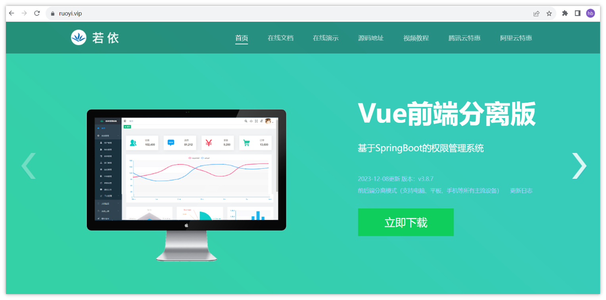

若依框架分为四个版本：

- 前后端不分离版本RuoYi（单体）

- 前后端分离版RuoYi\-Vue（单体）本项目使用版本

- 微服务版本RuoYi\-Cloud

- 移动端版RuoYi\-App

> 前三个都提供了前后端的项目，移动版可以适配RuoYi\-Vue和RuoYi\-Cloud
>

### 4.2.RuoYi\-Vue前后端分离版

我们项目中重点讲解的是RuoYi\-Vue前后端分离版本

文档地址：[https://doc.ruoyi.vip/ruoyi-vue/](https://doc.ruoyi.vip/ruoyi-vue/)

RuoYi\-Vue 是一个 java EE 企业级快速开发平台，基于经典技术组合（Spring Boot、Spring Security、MyBatis、Jwt、Vue），内置模块如：部门管理、角色用户、菜单及按钮授权、数据权限、系统参数、日志管理、代码生成等。在线定时任务配置；支持集群，支持多数据源，支持分布式事务。

演示地址：[http://vue.ruoyi.vip](http://vue.ruoyi.vip)

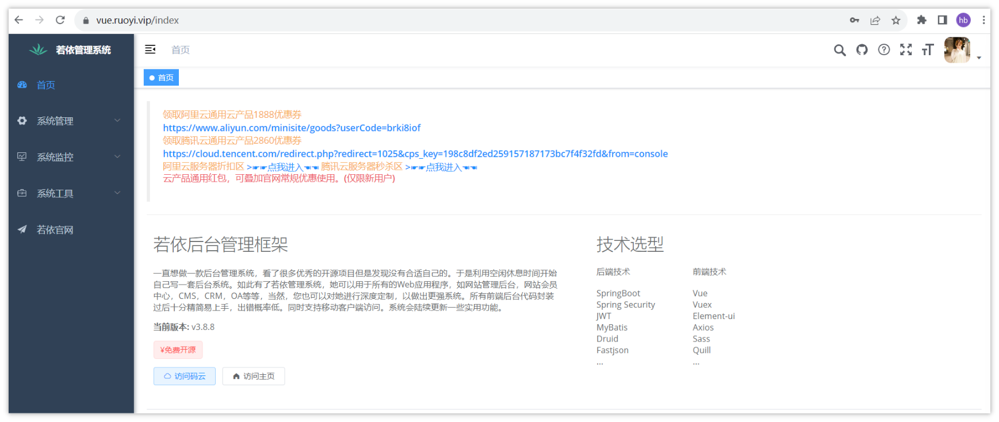

### 4.3.技术选型

1.系统环境

- java EE 8    →    jdk 17

- Servlet 3\.0

- Apache Maven 3

2.主框架

- Spring Boot 2\.2\.x

- Spring Framework 5\.2\.x

- Spring Security 5\.2\.x   安全框架

3.持久层

- Apache MyBatis 3\.5\.x

- Hibernate Validation 6\.0\.x   校验框架

- Alibaba Druid 1\.2\.x

4.视图层

- Vue 2\.6\.x   →   Vue3

- Axios 0\.21\.x

- Element 2\.15\.x   →   Element Plus

# 三、环境搭建

熟悉了若依的基本情况之后，下面，我们就快速上手，来把这个框架搭建起来，并且需要顺利跑起来

## 1.准备工作

基础软件准备

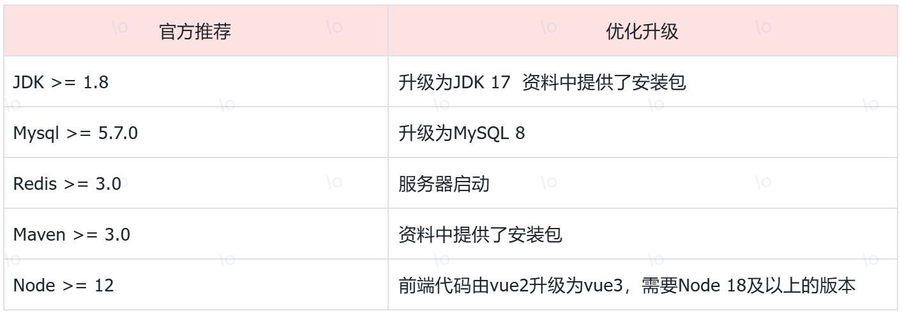

一般企业中服务器都是部署了一些项目中公用的基础环境，比如Mysql、Redis等这些。这些服务都是部署在linux服务器中，这些服务可能是部署在公司的一个机房中，也有可能是云服务器（中小企业居多）。

在我们学习的过程中，为了还原更真实的企业环境，我们可以在VM Ware软件中来部署linux服务器，当做我们开发中的公用服务器，具体的VM Ware的服务配置

### 1.1.安装Mysql

服务器启动之后，执行以下创建容器的脚本\(虚拟机已经提供好,不需要执行\)

```bash
docker run -p 3306:3306  \
--restart=always   \
--name  mysql \
-e MYsql_ROOT_PASSWORD=heima123 \
-e TZ=Asia/Shanghai \
-v /usr/local/mysql/data:/var/lib/mysql \
-v /usr/local/mysql/conf:/etc/mysql/conf.d \
-d mysql:8.0.29 \
--lower-case-table-names=1
```

> - `-d`: 表示以后台模式运行容器。
> 
> - `-p`: 将容器的3306端口映射到宿主机的3306端口。
> 
> - `--restart=always`: 即当Docker服务重启或容器异常退出时，容器会自动重启。
> 
> - `-e MYsql_ROOT_PASSWORD=heima123`: Mysql的root用户的密码。
> 
> - `--lower-case-table-names=1`: 设置Mysql以忽略表名的大小写。值为1表示所有表名在文件系统中都以小写存储，适用于Windows和Mac OS系统
> 

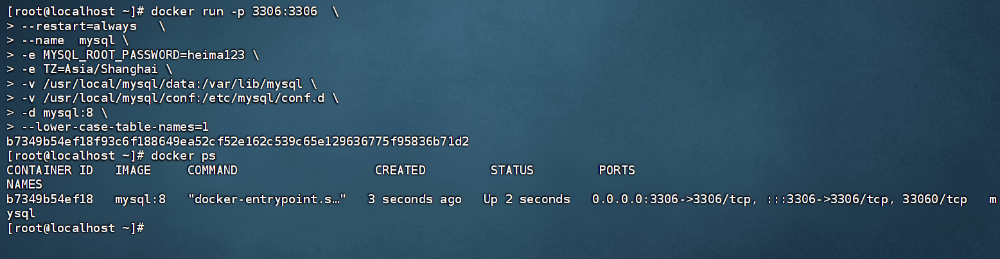

### 1.2.安装Redis

执行以下脚本创建容器\(虚拟机已经提供好,不需要执行\)

```bash
docker run -d --name redis --restart=always -p 6379:6379 redis redis-server --requirepass 123456
```

> `redis-server --requirepass 123456`: 在启动Redis服务时设置密码为`123456`

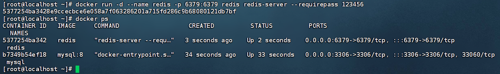

## 2.运行后端项目

### 2.1.代码下载和打开

代码下载地址：[https://gitee\.com/y\_project/RuoYi\-Vue](https://gitee.com/y_project/RuoYi-Vue)[ ](https://gitee.com/y_project/RuoYi-Vue)  

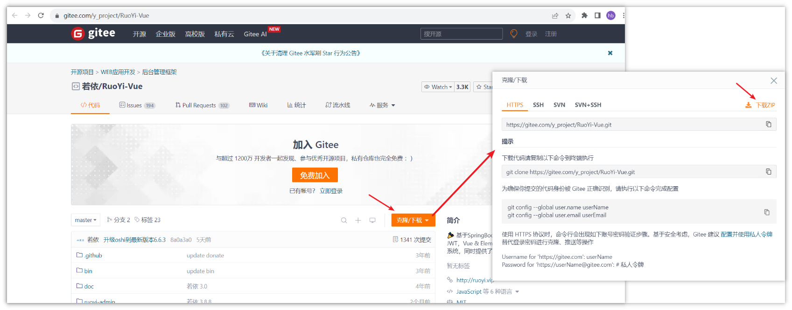

### 2.2.修改项目名称和包名称

后端代码包名全局替换

- 由`com.ruoyi` 改为 `com.xhzb`
- 参考链接：https://gitee.com/lpf_project/RuoYi-MT/releases
- 可以使用资料中提供的包名修改器

标准配置

先把代码压缩为zip文件，然后使用下面的工具选择这个代码压缩文件

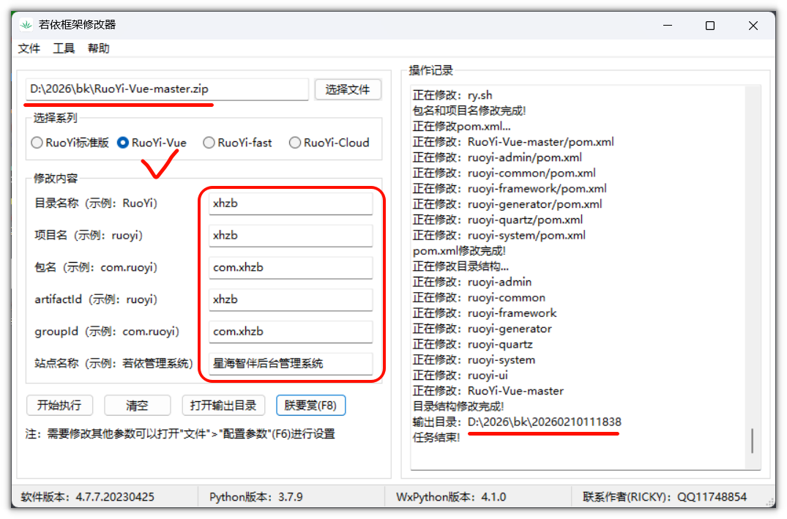

找到对应的目录，使用IDEA打开后的效果：

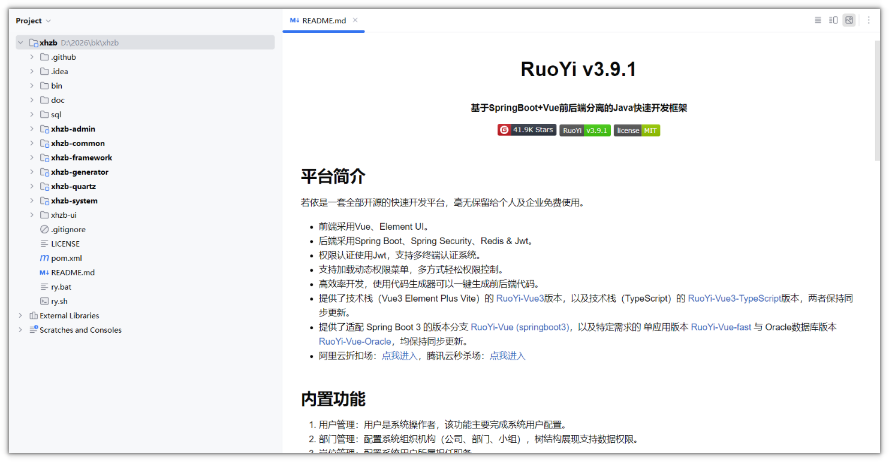

### 2.3.maven配置

打开之后，需要配置maven的本地仓库，建议从资料中获取本地仓库（初次下载较慢）

idea中的配置

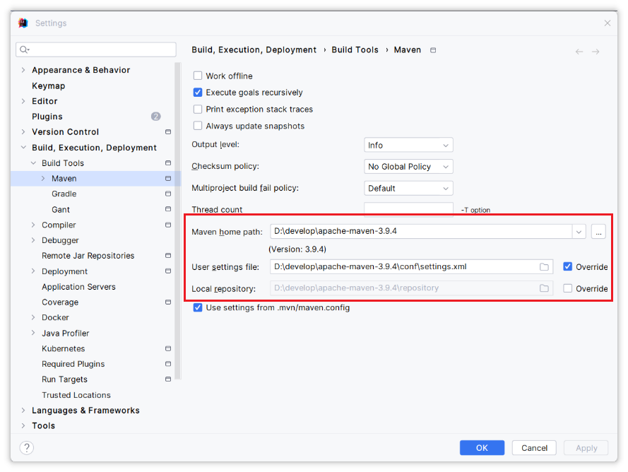

修改idea中的项目编码为utf\-8

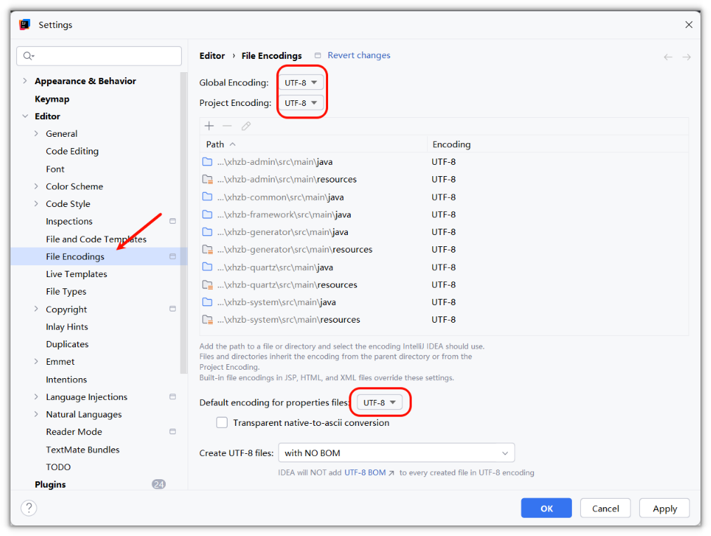

修改JDK的版本为17（已经是17了不需要修改）

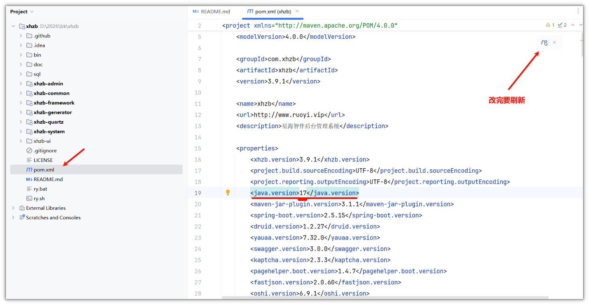

### 2.4.数据库准备和配置

在idea中创建数据库连接

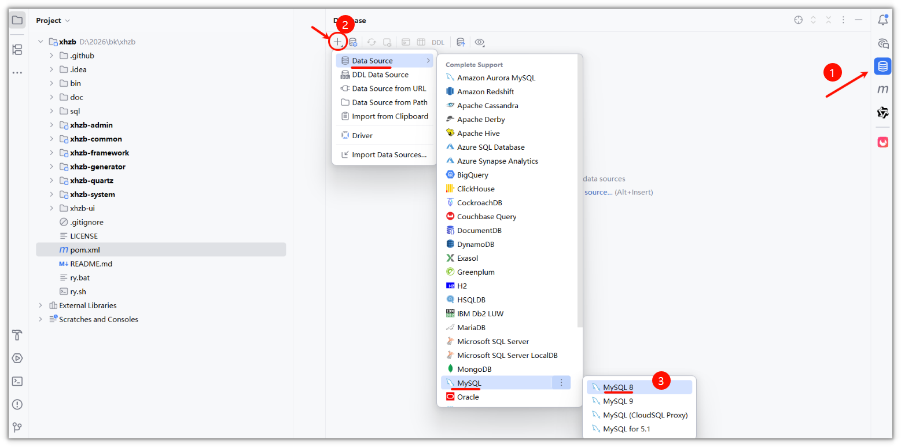

输入Mysql链接地址、用户名和密码

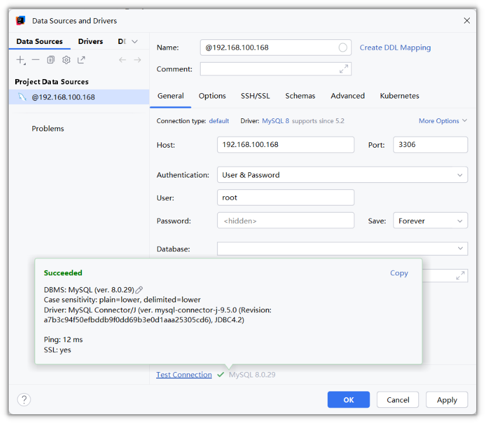

然后在数据库连接中，右键来创建数据库

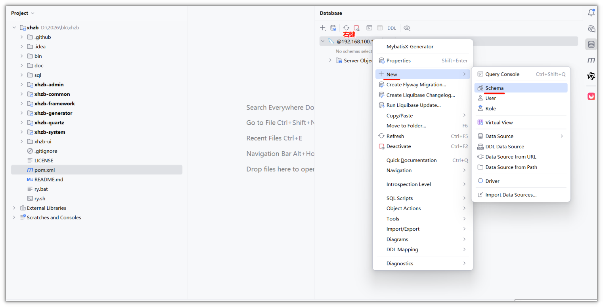

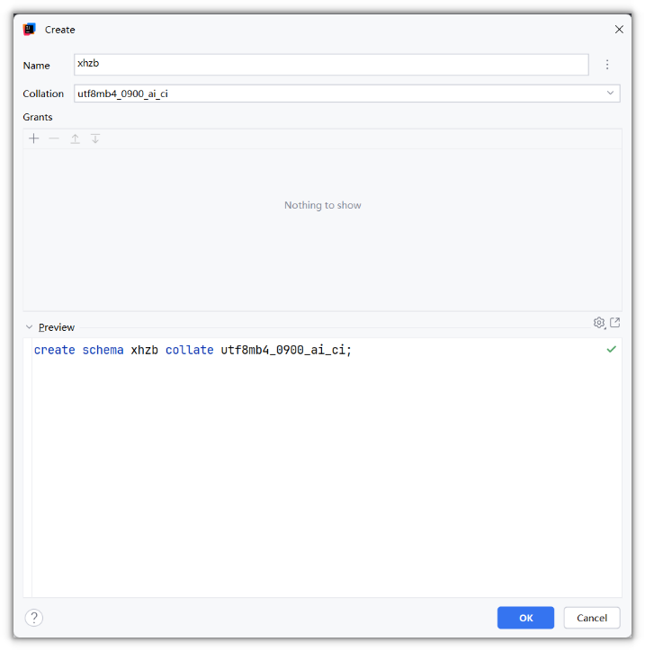

创建数据库 xhzb

编码为：utf8mb4\_0900\_ai\_ci

导入项目根目录下的sql/ry\_20260321\.sql文件，idea中导入流程，如下图

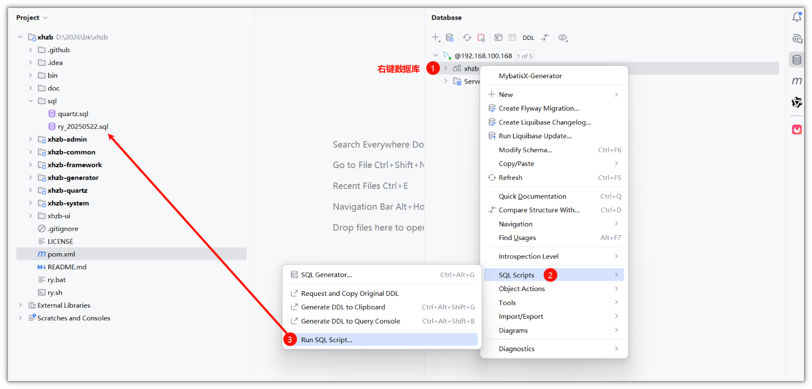

执行成功的效果，共有20张表

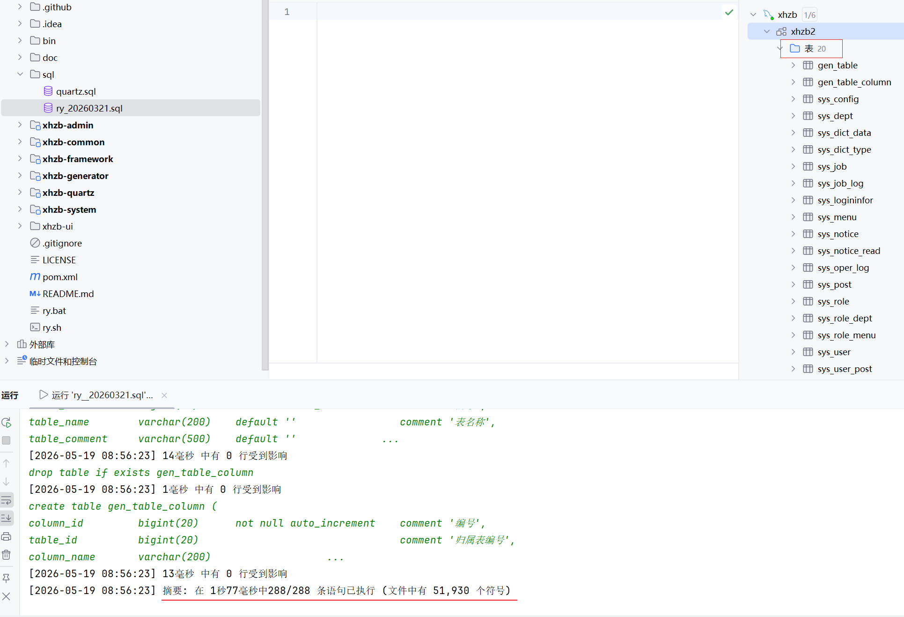

sql执行成功以后，修改数据库连接，找到`xhzb-admin`模块中的`resources`目录下的`application-druid.yml`

```yaml
# 数据源配置
spring:
    datasource:
        type: com.alibaba.druid.pool.DruidDataSource
        driverClassName: com.mysql.cj.jdbc.Driver
        druid:
            # 主库数据源
            master:
                url: jdbc:mysql://192.168.100.168:3306/xhzb?useUnicode=true&characterEncoding=utf8&zeroDateTimeBehavior=convertToNull&useSSL=true&serverTimezone=GMT%2B8
                username: root
                password: heima123
```

### 2.5.Redis配置

找到xhzb\-admin模块中的`resources`目录下的`application.yml`，如下配置：

```yaml
# Spring配置
spring:
  redis:
    # 地址
    host: 192.168.100.168
    # 端口，默认为6379
    port: 6379
    # 数据库索引
    database: 0
    # 密码
    password: 123456
    # 连接超时时间
    timeout: 10s
    lettuce:
      pool:
        # 连接池中的最小空闲连接
        min-idle: 0
        # 连接池中的最大空闲连接
        max-idle: 8
        # 连接池的最大数据库连接数
        max-active: 8
        # #连接池最大阻塞等待时间（使用负值表示没有限制）
        max-wait: -1ms
```

### 2.6.运行项目

找到`xhzb-admin`模块中的运行`com.xhzb.RuoYiApplication.java`，出现如下图表示启动成功。

```bash
(♥◠‿◠)ﾉﾞ  若依启动成功   ლ(´ڡ`ლ)ﾞ  
 .-------.       ____     __        
 |  _ _   \      \   \   /  /    
 | ( ' )  |       \  _. /  '       
 |(_ o _) /        _( )_ .'         
 | (_,_).' __  ___(_ o _)'          
 |  |\ \  |  ||   |(_,_)'         
 |  | \ `'   /|   `-'  /           
 |  |  \    /  \      /           
 ''-'   `'-'    `-..-'    
```

## 3.运行前端项目

### 3.1.前提

官方推荐的前端项目，使用的是vue3，需要使用node 18版本以上，在web项目学习阶段已安装

### 3.2.代码下载

目前下载的代码中，其中ruoyi\-ui这个目录就是前端的代码，不过这个代码是基于vue2开发的

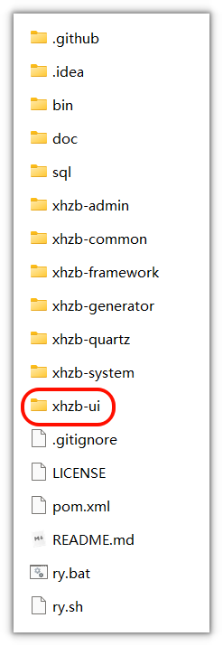


> 如果需要使用vue2为基础开发语言的前端，就可以使用上述的代码，运行方式跟下方描述相同
>

我们需要使用基于vue3开发的代码，官方推荐的地址：https://gitcode.com/yangzongzhuan/RuoYi-Vue3

可以在资料中找到，解压到工作空间即可

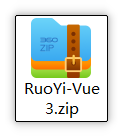


### 3.3.安装依赖和项目运行

进入到代码的根目录，然后执行以下命令：

```bash
npm install --registry=https://registry.npmmirror.com/
```

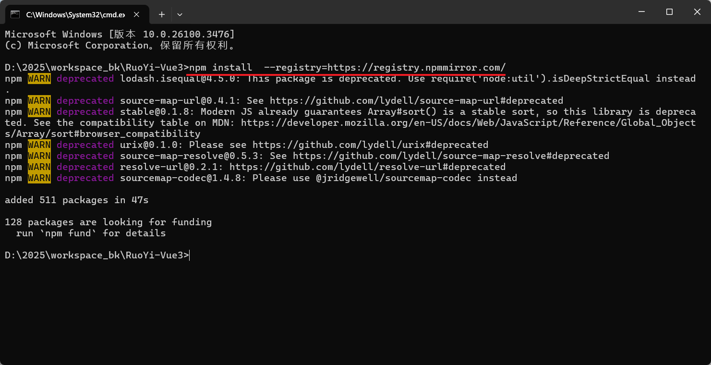

> 资料中提供的前端项目已安装依赖，先尝试是否可以正常运行项目，如果不能正常运行，再重新安装依赖
> 

### 3.4.启动项目

如果依赖已经安装完成，配置也已修改，则可以直接启动项目

```bash
npm run dev
```

启动成功之后的效果：

```bash
PS D:\workspace\project-ry-xhzb-vue3> npm run dev

  VITE v5.0.4  ready in 1247 ms

  ➜  Local:   http://localhost:80/
  ➜  Network: http://169.254.117.147:80/
  ➜  Network: http://192.168.200.1:80/
  ➜  Network: http://172.16.17.191:80/
  ➜  press h + enter to show help
```

启动前后端成功后，可以访问页面，地址：http://localhost:80/

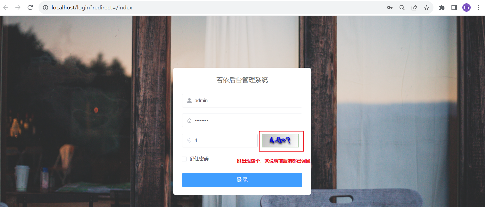

# 四、前后端项目结构

环境搭建完毕之后，接下来，我们深入熟悉一下若依这个框架，我们主要从代码的层面来熟悉项目

- 前后端的代码结构

- 阅读部分代码，熟悉开发套路和规范

- 代码共包含了两部分内容，一是后端的代码结构及配置，二是前端的代码结构及执行流程

## 1.后端代码

### 1.1.代码结构

官方文档的介绍

```bash
com.ruoyi     
├── common            // 工具类
│       └── annotation                    // 自定义注解
│       └── config                        // 全局配置
│       └── constant                      // 通用常量
│       └── core                          // 核心控制
│       └── enums                         // 通用枚举
│       └── exception                     // 通用异常
│       └── filter                        // 过滤器处理
│       └── utils                         // 通用类处理
├── framework         // 框架核心
│       └── aspectj                       // 注解实现
│       └── config                        // 系统配置
│       └── datasource                    // 数据权限
│       └── interceptor                   // 拦截器
│       └── manager                       // 异步处理
│       └── security                      // 权限控制
│       └── web                           // 前端控制
├── ruoyi-generator   // 代码生成
├── ruoyi-quartz      // 定时任务
├── ruoyi-system      // 系统代码   存放 domain，mapper，service
├── ruoyi-admin       // 后台服务   存放 controller
├── ruoyi-xxxxxx      // 其他模块
```

模块间的依赖关系

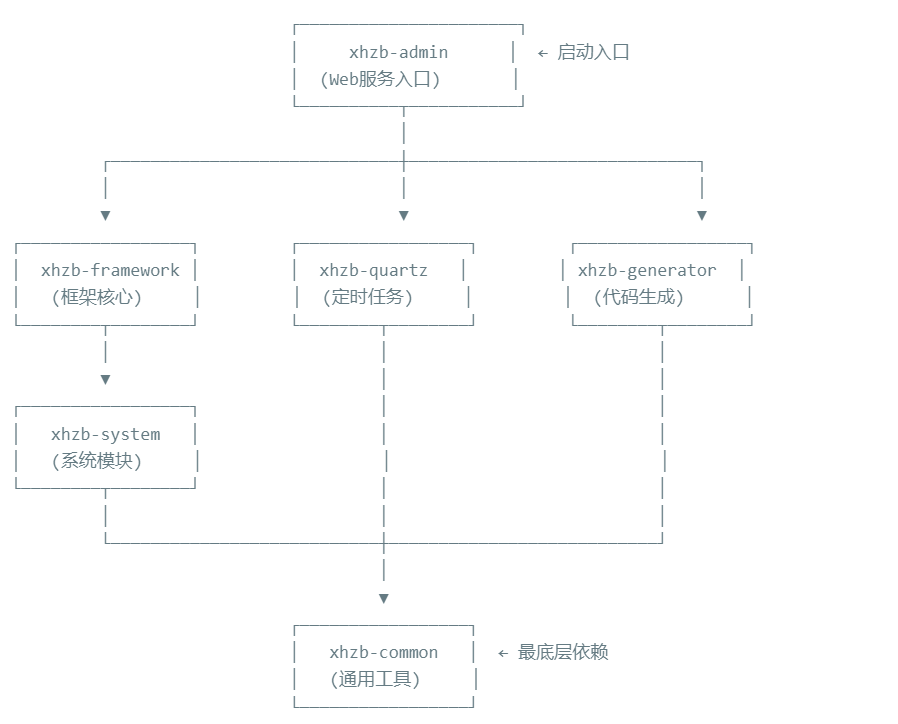

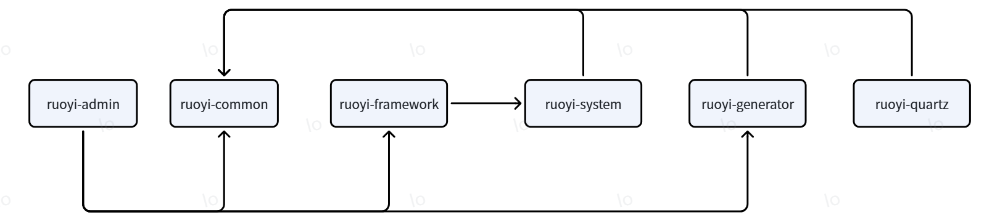

### 1.2.新增maven模块

可以在目前若依提供的项目结构上添加自己的模块，后期我们自己开发的功能代码都存放到这个模块中

模块名称：xhzb\-nursing\-platform

参考官方文档：[新建子模块](http://doc.ruoyi.vip/ruoyi/document/htsc.html#%E6%96%B0%E5%BB%BA%E5%AD%90%E6%A8%A1%E5%9D%97)

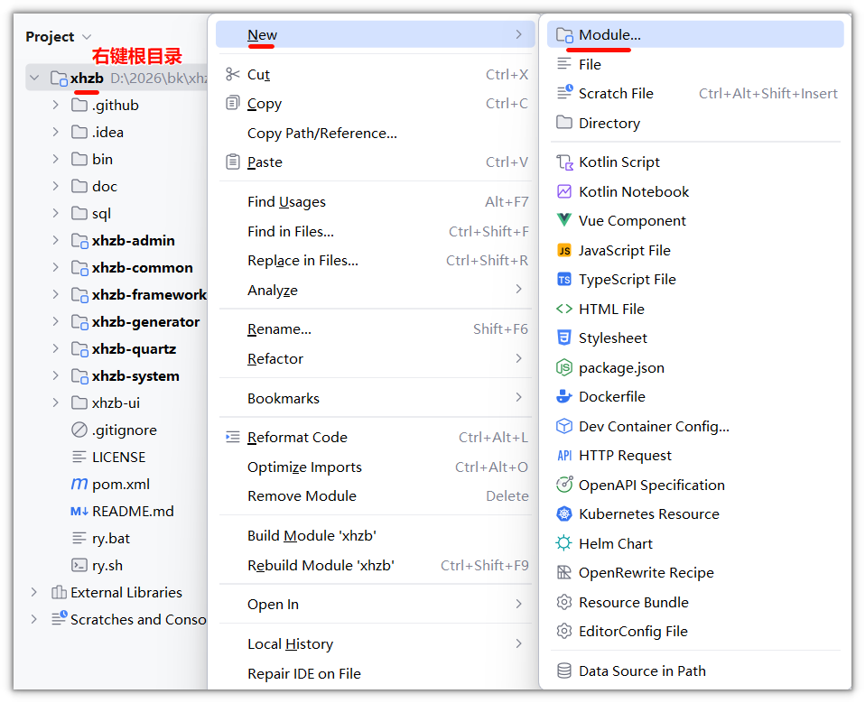

创建xhzb\-nursing\-platform模块，如下效果

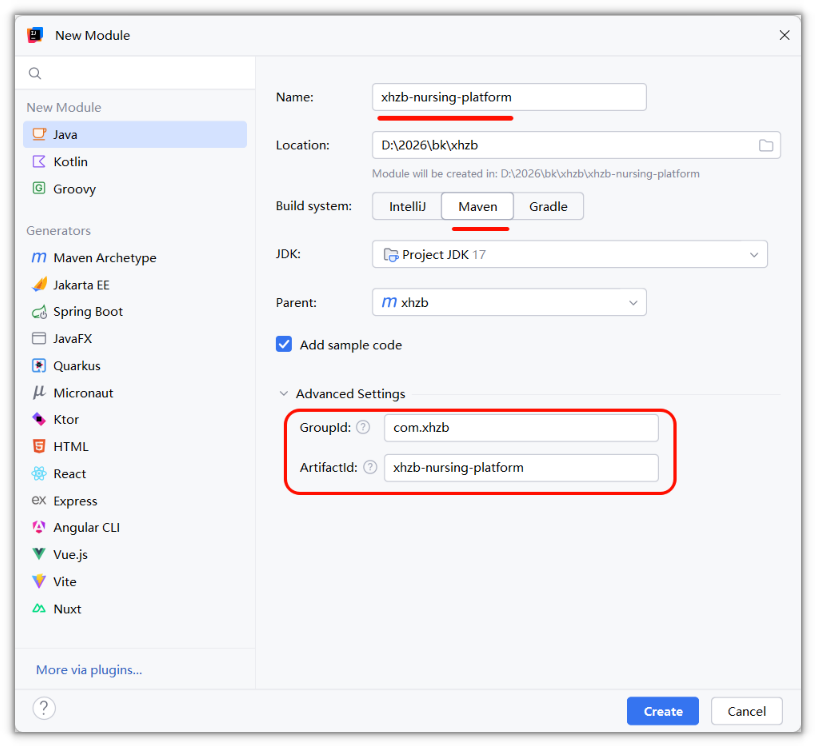

修改父工程`xhzb`的pom文件，方便对新创建的模块进行管理

```xml
<!-- 依赖声明 -->
<dependencyManagement>
    <dependencies>

        <!-- 其他配置略 -->

        <!-- 养老项目专用模块 -->
        <dependency>
            <groupId>com.xhzb</groupId>
            <artifactId>xhzb-nursing-platform</artifactId>
            <version>${xhzb.version}</version>
        </dependency>

    </dependencies>
</dependencyManagement>
```

在新创建的模块`xhzb-nursing-platform`中新增以下依赖，方便间接依赖spring、mysql等依赖

```xml
<dependencies>
    <dependency>
        <groupId>com.xhzb</groupId>
        <artifactId>xhzb-framework</artifactId>
    </dependency>
</dependencies>
```

该项目的入口模块为`xhzb-admin`，新增的业务模块需要让被`xhzb-admin`依赖才能生效，在`xhzb-admin`中的pom文件中新增`xhzb-nursing-platform`的依赖

```xml
<!-- 养老模块 -->
<dependency>
    <groupId>com.xhzb</groupId>
    <artifactId>xhzb-nursing-platform</artifactId>
</dependency>
```

注意事项：修改了任意模块的pom文件，都别忘了刷新maven，不然不生效

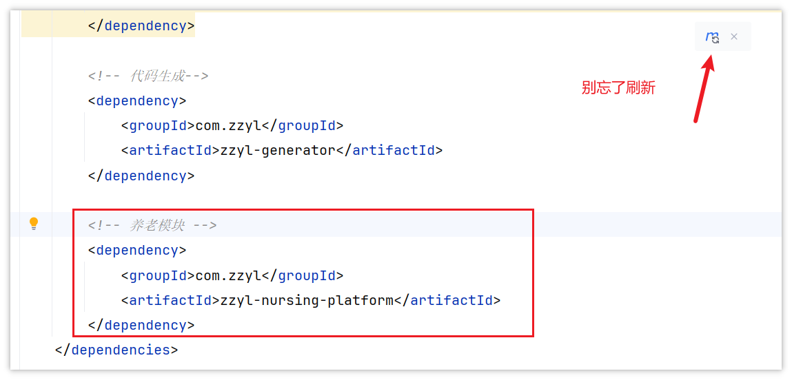

### 1.3.项目中的配置

项目中的配置文件都在xhzb\-admin模块下，如下图：

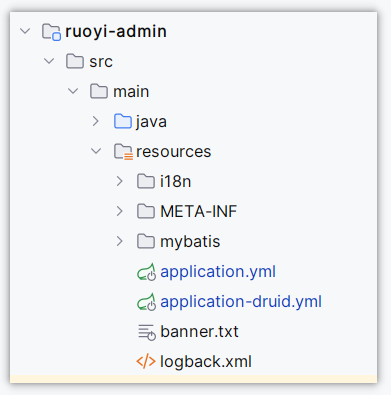

- i18n：国际化处理

- META\-INF：存储了项目的元信息（*描述数据的数据*），无需修改

- mybatis：mybatis相关的配置信息

- application\.yml：项目中的核心配置

- application\-druid\.yml：数据库连接配置

- banner\.txt：默认的banner图标信息，项目启动，控制台打印显示

- logback\.xml：日志配置

最主要的两个配置文件：application\.yml和application\-druid\.yml

application\.yml

```yaml
# 项目相关配置
ruoyi:
  # 名称
  name: RuoYi
  # 版本
  version: 3.8.9
  # 版权年份
  copyrightYear: 2025
  # 文件路径 示例（ Windows配置D:/ruoyi/uploadPath，Linux配置 /home/ruoyi/uploadPath）
  profile: D:/ruoyi/uploadPath
  # 获取ip地址开关
  addressEnabled: false
  # 验证码类型 math 数字计算 char 字符验证
  captchaType: math

# 开发环境配置
server:
  # 服务器的HTTP端口，默认为8080
  port: 8080
  servlet:
    # 应用的访问路径
    context-path: /
  tomcat:
    # tomcat的URI编码
    uri-encoding: UTF-8
    # 连接数满后的排队数，默认为100
    accept-count: 1000
    threads:
      # tomcat最大线程数，默认为200
      max: 800
      # Tomcat启动初始化的线程数，默认值10
      min-spare: 100

# 日志配置
logging:
  level:
    com.xhzb: debug
    org.springframework: warn

# 用户配置
user:
  password:
    # 密码最大错误次数
    maxRetryCount: 5
    # 密码锁定时间（默认10分钟）
    lockTime: 10

# Spring配置
spring:
  # 资源信息
  messages:
    # 国际化资源文件路径
    basename: i18n/messages
  profiles:
    active: druid
  # 文件上传
  servlet:
    multipart:
      # 单个文件大小
      max-file-size: 10MB
      # 设置总上传的文件大小
      max-request-size: 20MB
  # 服务模块
  devtools:
    restart:
      # 热部署开关
      enabled: true
  # redis 配置
  redis:
    # 地址
    host: 192.168.100.168
    # 端口，默认为6379
    port: 6379
    # 数据库索引
    database: 0
    # 密码
    password: 123456
    # 连接超时时间
    timeout: 10s
    lettuce:
      pool:
        # 连接池中的最小空闲连接
        min-idle: 0
        # 连接池中的最大空闲连接
        max-idle: 8
        # 连接池的最大数据库连接数
        max-active: 8
        # #连接池最大阻塞等待时间（使用负值表示没有限制）
        max-wait: -1ms

# token配置
token:
  # 令牌自定义标识
  header: Authorization
  # 令牌密钥
  secret: abcdefghijklmnopqrstuvwxyz
  # 令牌有效期（默认30分钟）
  expireTime: 30

# MyBatis配置
mybatis:
  # 搜索指定包别名
  typeAliasesPackage: com.xhzb.**.domain
  # 配置mapper的扫描，找到所有的mapper.xml映射文件
  mapperLocations: classpath*:mapper/**/*Mapper.xml
  # 加载全局的配置文件
  configLocation: classpath:mybatis/mybatis-config.xml

# PageHelper分页插件
pagehelper:
  helperDialect: mysql
  supportMethodsArguments: true
  params: count=countsql

# Swagger配置
swagger:
  # 是否开启swagger
  enabled: true
  # 请求前缀
  pathMapping: /dev-api

# 防止XSS攻击
xss:
  # 过滤开关
  enabled: true
  # 排除链接（多个用逗号分隔）
  excludes: /system/notice
  # 匹配链接
  urlPatterns: /system/*,/monitor/*,/tool/*
```

application\-druid\.yml

```yaml
# 数据源配置
spring:
    datasource:
        type: com.alibaba.druid.pool.DruidDataSource
        driverClassName: com.mysql.cj.jdbc.Driver
        druid:
            # 主库数据源
            master:
                url: jdbc:mysql://192.168.100.128:3306/xhzb?useUnicode=true&characterEncoding=utf8&zeroDateTimeBehavior=convertToNull&useSSL=true&serverTimezone=GMT%2B8
                username: root
                password: heima123
            # 从库数据源
            slave:
                # 从数据源开关/默认关闭
                enabled: false
                url: 
                username: 
                password: 
            # 初始连接数
            initialSize: 5
            # 最小连接池数量
            minIdle: 10
            # 最大连接池数量
            maxActive: 20
            # 配置获取连接等待超时的时间
            maxWait: 60000
            # 配置连接超时时间
            connectTimeout: 30000
            # 配置网络超时时间
            socketTimeout: 60000
            # 配置间隔多久才进行一次检测，检测需要关闭的空闲连接，单位是毫秒
            timeBetweenEvictionRunsMillis: 60000
            # 配置一个连接在池中最小生存的时间，单位是毫秒
            minEvictableIdleTimeMillis: 300000
            # 配置一个连接在池中最大生存的时间，单位是毫秒
            maxEvictableIdleTimeMillis: 900000
            # 配置检测连接是否有效
            validationQuery: SELECT 1 FROM DUAL
            testWhileIdle: true
            testOnBorrow: false
            testOnReturn: false
            webStatFilter: 
                enabled: true
            statViewServlet:
                enabled: true
                # 设置白名单，不填则允许所有访问
                allow:
                url-pattern: /druid/*
                # 控制台管理用户名和密码
                login-username: ruoyi
                login-password: 123456
            filter:
                stat:
                    enabled: true
                    # 慢sql记录
                    log-slow-sql: true
                    slow-sql-millis: 1000
                    merge-sql: true
                wall:
                    config:
                        multi-statement-allow: true
```

### 1.4.表结构

刚才我们已经导入了关于若依的表结构，目前已经提供了20张表，我们可以先简单熟悉一下每个表代表的含义：

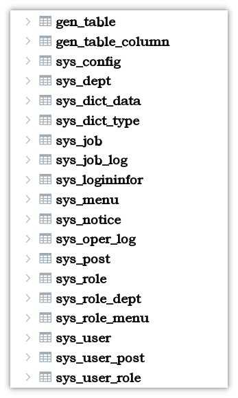

表结构说明及关系

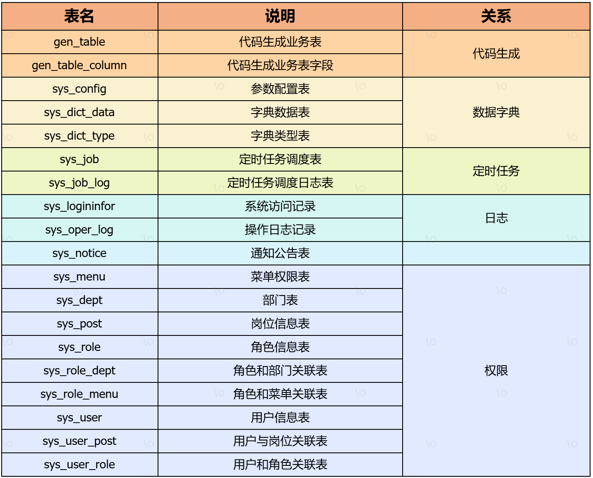

权限模型RBAC

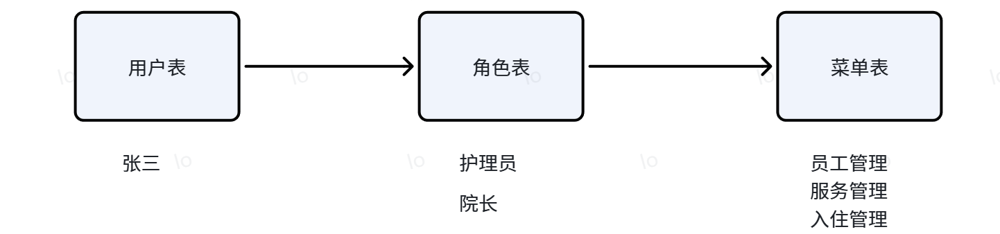

## 2.前端代码

### 2.1.代码结构

如下图：

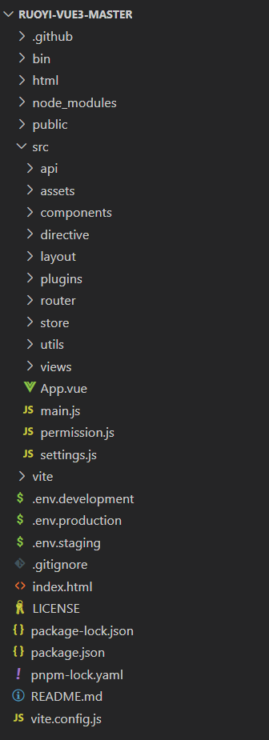

详细目录或文件说明：

```bash
├── bin                        // 执行脚本
├── public                     // 公共文件
│   ├── favicon.ico            // favicon图标
├── src                        // 源代码
│   ├── api                    // 所有请求,后台的api接口，后期开发重点目录
│   ├── assets                 // 主题 字体等静态资源
│   ├── components             // 全局公用组件
│   ├── directive              // 全局指令
│   ├── layout                 // 布局
│   ├── plugins                // 通用方法
│   ├── router                 // 路由
│   ├── store                  // 全局 store管理
│   ├── utils                  // 全局公用方法
│   ├── views                  // view，存储vue组件，后期开发重点目录
│   ├── App.vue                // 入口页面
│   ├── main.js                // 入口 加载组件 初始化等
│   ├── permission.js          // 权限管理
│   └── settings.js            // 系统配置
├── vite                       // 前端构建工具
├── .env.development           // 开发环境配置
├── .env.production            // 生产环境配置
├── .env.staging               // 测试环境配置
├── .gitignore                 // git 忽略项
├── LICENSE                    // 许可证
├── package-lock.json          // 锁定项目依赖的具体版本号
├── package.json               // 配置项目的信息、名称、版本号、描述信息等
├── pnpm-lock.yaml             // 锁定项目依赖的具体版本号
└── vite.config.js             // 用于配置 Vue.js 项目的全局选项，可修改后台访问接口路径
```

### 2.2.核心配置

在开发阶段，配置的修改是较少的，主要关于一个配置文件即可\-\-\-\>vite\.config\.js

```javascript
import { defineConfig, loadEnv } from 'vite'
import path from 'path'
import createVitePlugins from './vite/plugins'

const baseUrl = 'http://localhost:8081' // 后端接口

// https://vitejs.dev/config/
export default defineConfig(({ mode, command }) => {
  const env = loadEnv(mode, process.cwd())
  const { VITE_APP_ENV } = env
  return {
    // 部署生产环境和开发环境下的URL。
    // 默认情况下，vite 会假设你的应用是被部署在一个域名的根路径上
    // 例如 https://www.ruoyi.vip/。如果应用被部署在一个子路径上，你就需要用这个选项指定这个子路径。例如，如果你的应用被部署在 https://www.ruoyi.vip/admin/，则设置 baseUrl 为 /admin/。
    base: VITE_APP_ENV === 'production' ? '/' : '/',
    plugins: createVitePlugins(env, command === 'build'),
    resolve: {
      // https://cn.vitejs.dev/config/#resolve-alias
      alias: {
        // 设置路径
        '~': path.resolve(__dirname, './'),
        // 设置别名
        '@': path.resolve(__dirname, './src')
      },
      // https://cn.vitejs.dev/config/#resolve-extensions
      extensions: ['.mjs', '.js', '.ts', '.jsx', '.tsx', '.json', '.vue']
    },
    // 打包配置
    build: {
      // https://vite.dev/config/build-options.html
      sourcemap: command === 'build' ? false : 'inline',
      outDir: 'dist',
      assetsDir: 'assets',
      chunkSizeWarningLimit: 2000,
      rollupOptions: {
        output: {
          chunkFileNames: 'static/js/[name]-[hash].js',
          entryFileNames: 'static/js/[name]-[hash].js',
          assetFileNames: 'static/[ext]/[name]-[hash].[ext]'
        }
      }
    },
    // vite 相关配置
    server: {
      port: 80,
      host: true,
      open: true,
      proxy: {
        // https://cn.vitejs.dev/config/#server-proxy
        '/dev-api': {
          target: baseUrl,
          changeOrigin: true,
          rewrite: (p) => p.replace(/^\/dev-api/, '')
        },
         // springdoc proxy
         '^/v3/api-docs/(.*)': {
          target: baseUrl,
          changeOrigin: true,
        }
      }
    },
    css: {
      postcss: {
        plugins: [
          {
            postcssPlugin: 'internal:charset-removal',
            AtRule: {
              charset: (atRule) => {
                if (atRule.name === 'charset') {
                  atRule.remove()
                }
              }
            }
          }
        ]
      }
    }
  }
})

```

别名

- `~` 代表 `./`

- `@`代表src目录

前端服务端口\-\-\-\> `port: 80`

后端服务地址\-\-\-\> `target: '``http://localhost:8080``'`

路径重写\-\-\-\> `rewrite: (p) => p.replace(/^\/dev-api/, '')`

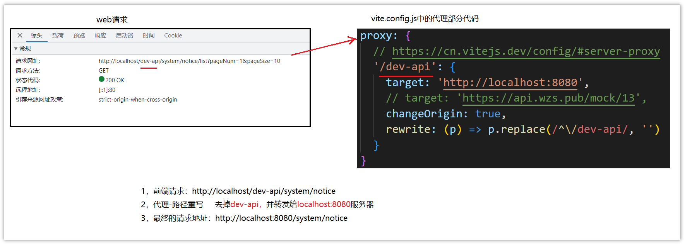

# 五、功能快速开发

熟悉了项目的基本信息之后，接下来，我们来快速感受一下若依框架的代码生成的功能

若依提供的代码生成功能，可以基于表结构快速生成前后端的代码，下面，我们快速感受一下单表的代码生成

## 1.准备工作

我们首先开发的是养老项目的护理项目模块，我们需要准备两部分内容，一个是一级菜单，第二个是表结构

### 1.1.菜单

我们要开发的模块是护理项目模块，而护理模块是子菜单，我们需要先在若依项目中创建一个主菜单，方便对护理项目进行分类

最终的效果：

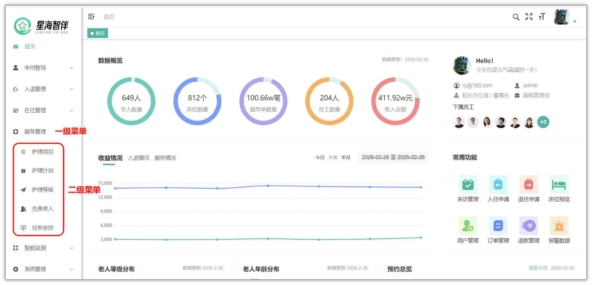

准备主菜单\-\-\>服务管理，详细配置，如下：

菜单名称:服务管理

显示排序:0

路由地址:nursing

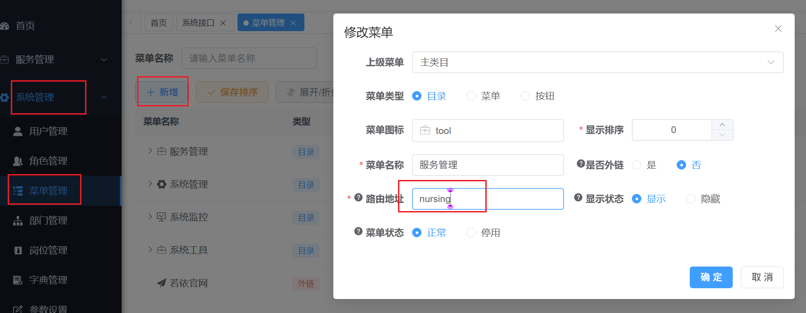

刷新页面的效果：

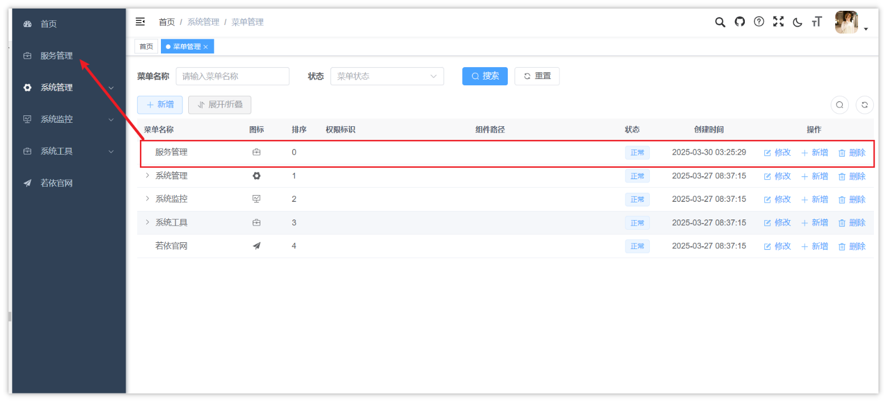

### 1.2.表结构

护理项目表结构定义如下：

```sql
CREATE TABLE `nursing_project` (
  `id` bigint NOT NULL AUTO_INCREMENT COMMENT '编号',
  `name` varchar(100) CHARACTER SET utf8mb4 COLLATE utf8mb4_0900_ai_ci DEFAULT NULL COMMENT '名称',
  `order_no` int DEFAULT NULL COMMENT '排序号',
  `unit` varchar(50) CHARACTER SET utf8mb4 COLLATE utf8mb4_0900_ai_ci DEFAULT NULL COMMENT '单位',
  `price` decimal(10,2) DEFAULT NULL COMMENT '价格',
  `image` varchar(255) CHARACTER SET utf8mb4 COLLATE utf8mb4_0900_ai_ci DEFAULT NULL COMMENT '图片',
  `nursing_requirement` varchar(255) CHARACTER SET utf8mb4 COLLATE utf8mb4_0900_ai_ci DEFAULT NULL COMMENT '护理要求',
  `status` int NOT NULL DEFAULT '1' COMMENT '状态（0：禁用，1：启用）',
  `create_by` varchar(50) CHARACTER SET utf8mb4 COLLATE utf8mb4_0900_ai_ci DEFAULT NULL COMMENT '创建人',
  `update_by` varchar(50) CHARACTER SET utf8mb4 COLLATE utf8mb4_0900_ai_ci DEFAULT NULL COMMENT '更新人',
  `remark` varchar(255) CHARACTER SET utf8mb4 COLLATE utf8mb4_0900_ai_ci DEFAULT NULL COMMENT '备注',
  `create_time` datetime NOT NULL DEFAULT CURRENT_TIMESTAMP COMMENT '创建时间',
  `update_time` datetime DEFAULT CURRENT_TIMESTAMP ON UPDATE CURRENT_TIMESTAMP COMMENT '更新时间',
  PRIMARY KEY (`id`) USING BTREE,
  UNIQUE KEY `name` (`name`) USING BTREE
) ENGINE=InnoDB AUTO_INCREMENT=1 DEFAULT CHARSET=utf8mb4 COLLATE=utf8mb4_0900_ai_ci ROW_FORMAT=DYNAMIC COMMENT='护理项目表';
```

把以上sql导入到若依对应的数据库中即可

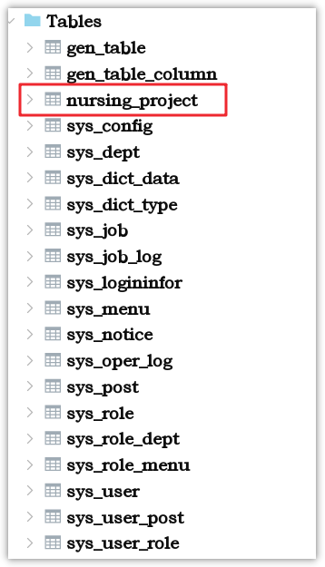

## 2.代码生成

找到系统工具\-\-\>代码生成，然后点击导入按钮

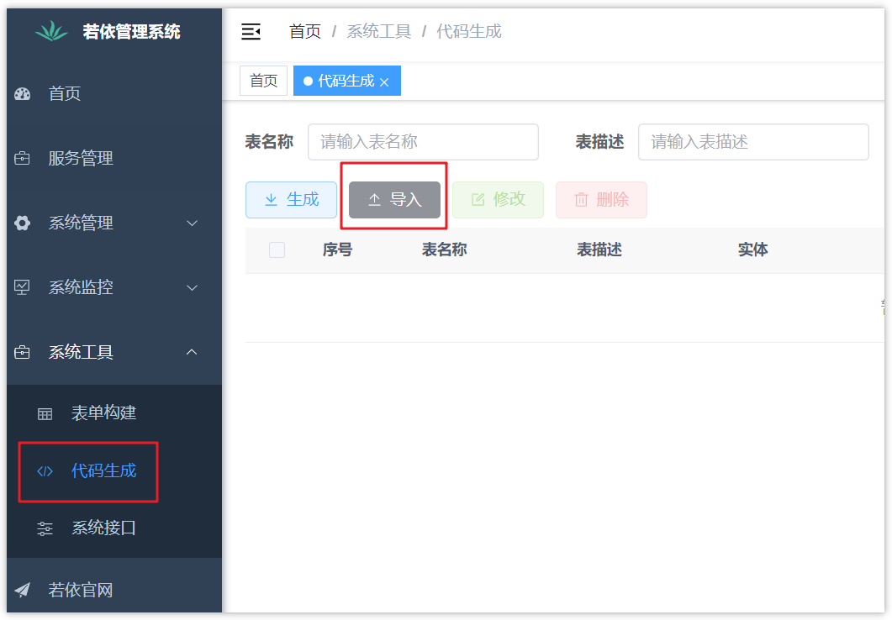

选中nursing\_project表结构，点击确定

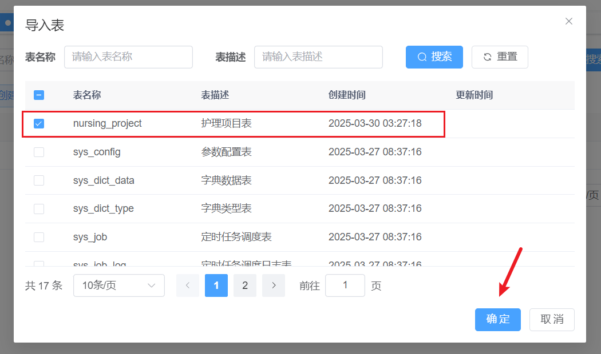

目前在代码生成列表中，可以看到需要生成的数据

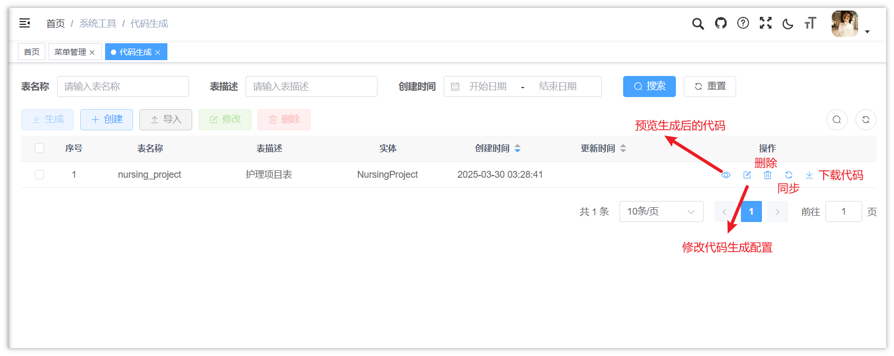

> 该数据对应了5个按钮
> 
> - 预览生成后的代码
> 
> - 修改代码生成的配置（常用）
> 
> - 删除代码生成
> 
> - 同步表结构（导入之后改动表的情况）
> 
> - 下载离线代码包
> 

在生成之前，我们需要对代码生成做一些配置，我们可以点击编辑按钮，可以看到有三部分的配置

- 基本信息

- 字段信息

- 生成信息

下图是基本信息，可以根据自己的需求修改：表、实体、表描述、作者相关的数据

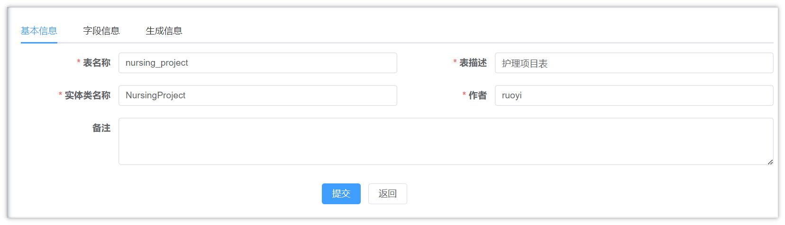

下图是字段信息，详细描述如下图：

|字段信息|描述|
|---|---|
|字段列名|表中的字段列名称|
|字段描述|字段的描述，读取的comment信息，可根据实际情况更改|
|物理类型|数据库所对应的字段类型|
|java类型|java实体类中属性的类型，可改，例如，状态字段：Long类型可以修改为Integer|
|java属性|java实体类中所对应的属性名称|
|插入|新增的时候，需要插入的字段|
|编辑|修改的时候，需要插入的字段|
|列表|列表查询需要展示的字段|
|查询|列表查询，需要的条件字段|
|查询方式|与上面查询条件配合，选择对应的查询方式|
|必填|在插入和新增的时候，这个字段是否是必填项，可生成校验|
|显示类型|前端代码使用的组件，可根据实际情况选择|
|字典类型|字典管理是用来维护数据类型的数据，如下拉框、单选按钮等，可自定义|

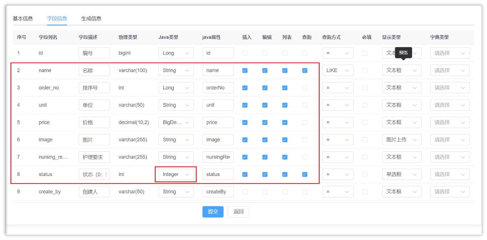

下图是指生成信息，可以按照自己的实际情况，来修改包路径，模块名称，上级菜单

修改完成后，点击提交按钮

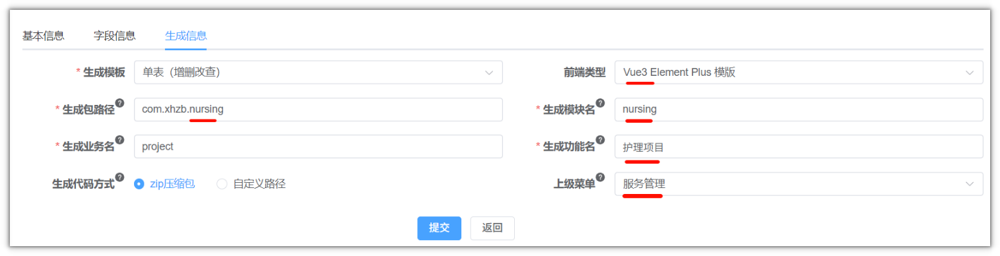

等我们修改完毕后，提交之后回到了列表页，这个时候就可以点击下载按钮，去下载代码包

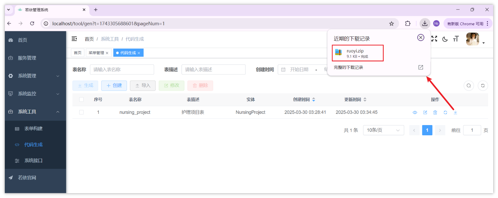

下载后的代码包，解压后，包含了三部分，如下图：

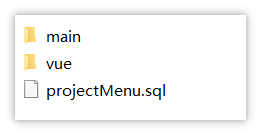

> - main 后端的代码
> 
> - vue  前端的代码
> 
> - projectMenu\.sql  菜单关系的sql数据
> 

执行projectMenu\.sql文件中的内容，内容为菜单的数据

```sql
-- 菜单 sql 在服务管理中新增了一个子菜单为护理项目
insert into sys_menu (menu_name, parent_id, order_num, path, component, is_frame, is_cache, menu_type, visible, status, perms, icon, create_by, create_time, update_by, update_time, remark)
values('护理项目', '2000', '1', 'project', 'serve/project/index', 1, 0, 'C', '0', '0', 'nursing:project:list', '#', 'admin', sysdate(), '', null, '护理项目菜单');

-- 按钮父菜单ID  获取护理项目的id
SELECT @parentId := LAST_INSERT_ID();

-- 按钮 sql  新增5个按钮，分别是查询、新增、修改、删除、导出，父菜单为护理项目
insert into sys_menu (menu_name, parent_id, order_num, path, component, is_frame, is_cache, menu_type, visible, status, perms, icon, create_by, create_time, update_by, update_time, remark)
values('护理项目查询', @parentId, '1',  '#', '', 1, 0, 'F', '0', '0', 'nursing:project:query',        '#', 'admin', sysdate(), '', null, '');

insert into sys_menu (menu_name, parent_id, order_num, path, component, is_frame, is_cache, menu_type, visible, status, perms, icon, create_by, create_time, update_by, update_time, remark)
values('护理项目新增', @parentId, '2',  '#', '', 1, 0, 'F', '0', '0', 'nursing:project:add',          '#', 'admin', sysdate(), '', null, '');

insert into sys_menu (menu_name, parent_id, order_num, path, component, is_frame, is_cache, menu_type, visible, status, perms, icon, create_by, create_time, update_by, update_time, remark)
values('护理项目修改', @parentId, '3',  '#', '', 1, 0, 'F', '0', '0', 'nursing:project:edit',         '#', 'admin', sysdate(), '', null, '');

insert into sys_menu (menu_name, parent_id, order_num, path, component, is_frame, is_cache, menu_type, visible, status, perms, icon, create_by, create_time, update_by, update_time, remark)
values('护理项目删除', @parentId, '4',  '#', '', 1, 0, 'F', '0', '0', 'nursing:project:remove',       '#', 'admin', sysdate(), '', null, '');

insert into sys_menu (menu_name, parent_id, order_num, path, component, is_frame, is_cache, menu_type, visible, status, perms, icon, create_by, create_time, update_by, update_time, remark)
values('护理项目导出', @parentId, '5',  '#', '', 1, 0, 'F', '0', '0', 'nursing:project:export',       '#', 'admin', sysdate(), '', null, '');
```

把main目录拷贝后，找到后端xhzb\-nursing\-platform模块，选中src目录，进行拷贝，效果如下：

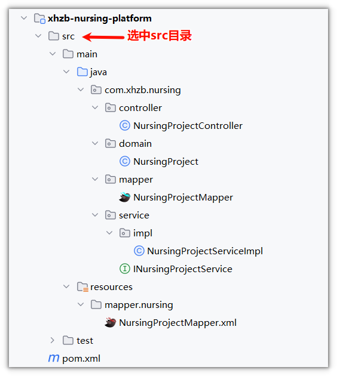

打开vue文件夹，里面包含了两部分内容

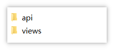

> api是指后端的接口定义代码
> 
> views中包含了vue组件的前端代码

选中这两个文件夹，打开前端项目，选中src目录进行拷贝，效果如下：

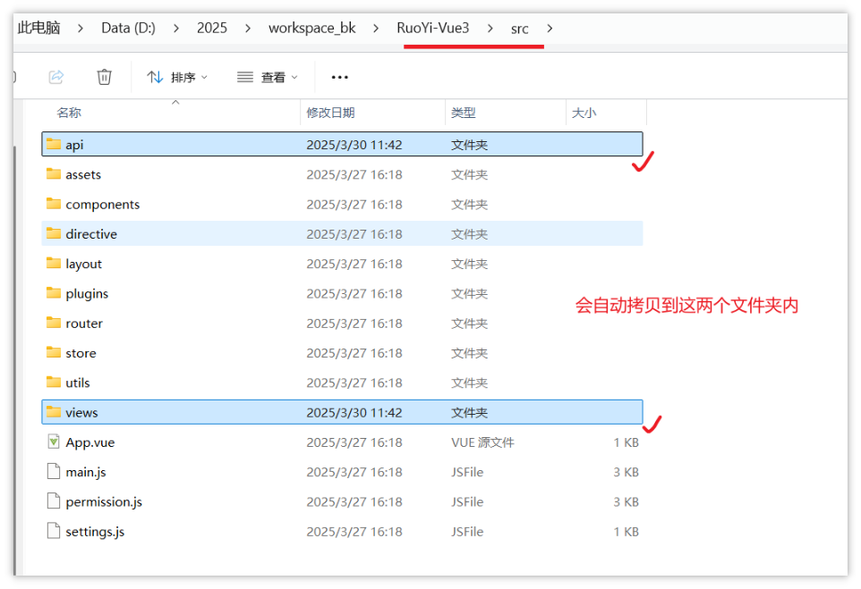

如果编辑器不能拷贝就在文件夹里面拷贝,打开src文件夹,粘贴到里面

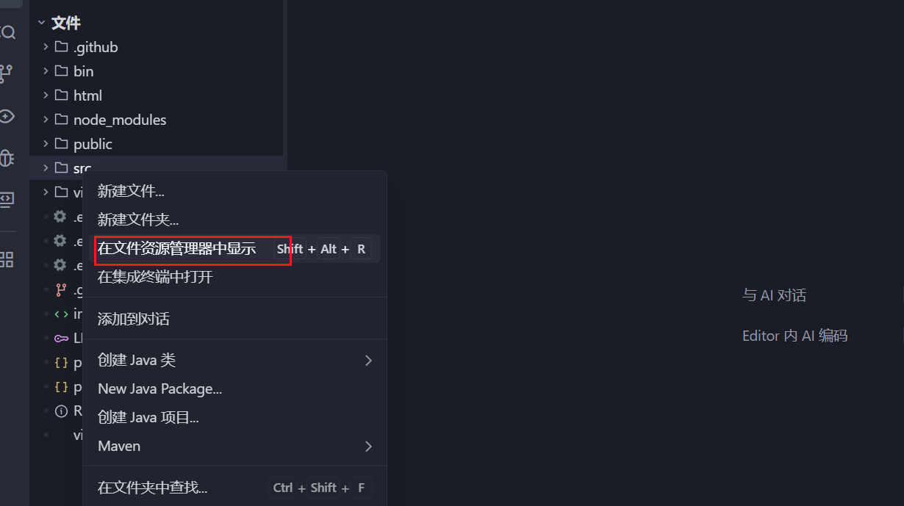

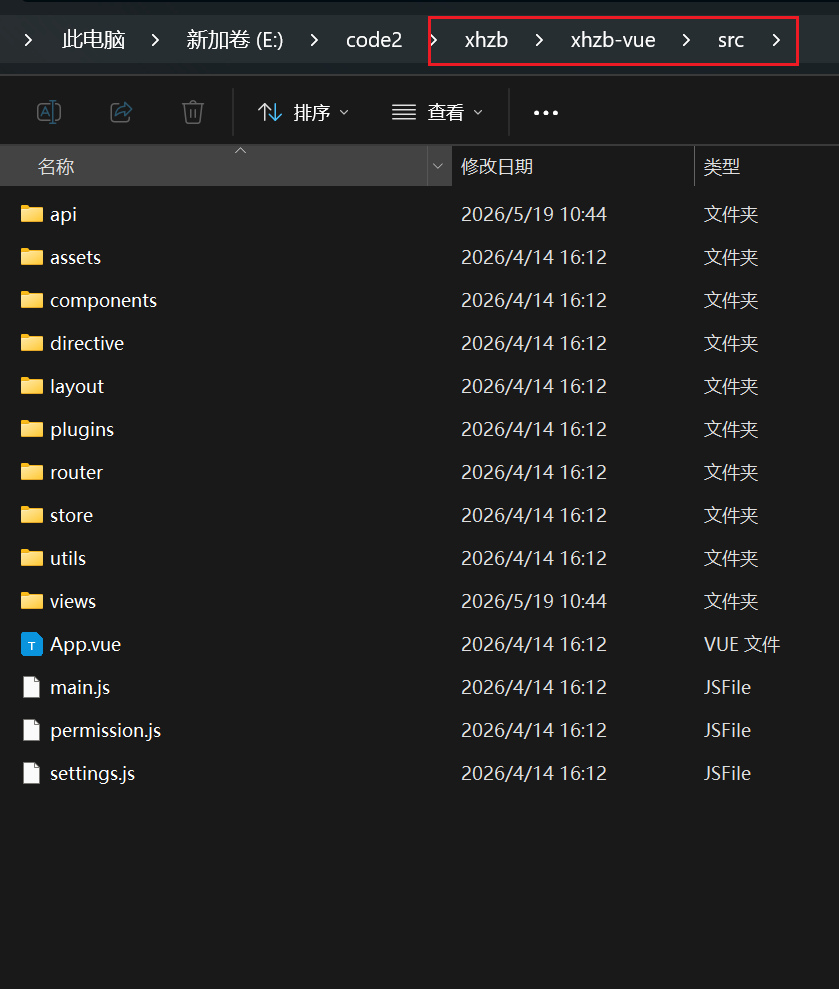

拷贝后的效果：

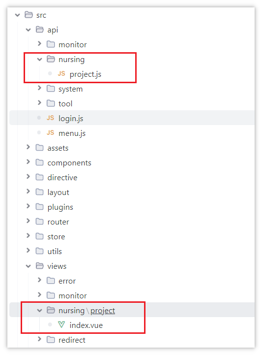

等代码拷贝完成后，重新启动前后端项目，打开页面，可以在服务管理中看到子菜单护理项目，如下图

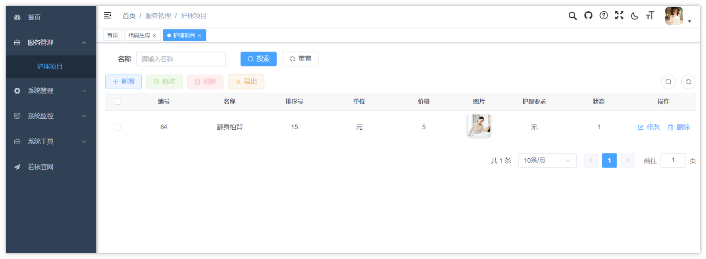

可以对护理项目进行一些操作，比如，新增、修改、删除、查询等

## 3.代码阅读

刚才自动生成的代码，我们已经测试过了，可以做到基本的增删改查，我们是不需要修改任何代码的，当然也不是很完美，后面，我们还会进行修改调整。

在修改优化之前，我们先来读一下自动生成的代码长什么样子，共分为两部分：后端和前端

### 3.1.后端代码

下面这个是控制层的代码NursingProjectController ，详细如下：

```java
package com.xhzb.nursing.controller;

import java.util.List;
import javax.servlet.http.HttpServletResponse;
import org.springframework.security.access.prepost.PreAuthorize;
import org.springframework.beans.factory.annotation.Autowired;
import org.springframework.web.bind.annotation.GetMapping;
import org.springframework.web.bind.annotation.PostMapping;
import org.springframework.web.bind.annotation.PutMapping;
import org.springframework.web.bind.annotation.DeleteMapping;
import org.springframework.web.bind.annotation.PathVariable;
import org.springframework.web.bind.annotation.RequestBody;
import org.springframework.web.bind.annotation.RequestMapping;
import org.springframework.web.bind.annotation.RestController;
import com.xhzb.common.annotation.Log;
import com.xhzb.common.core.controller.BaseController;
import com.xhzb.common.core.domain.AjaxResult;
import com.xhzb.common.enums.BusinessType;
import com.xhzb.nursing.domain.NursingProject;
import com.xhzb.nursing.service.INursingProjectService;
import com.xhzb.common.utils.poi.ExcelUtil;
import com.xhzb.common.core.page.TableDataInfo;

/**
 * 护理项目Controller
 * 
 * @author ruoyi
 * @date 2026-03-05
 */
@RestController
@RequestMapping("/nursing/project")
public class NursingProjectController extends BaseController
{
    @Autowired
    private INursingProjectService nursingProjectService;

    /**
     * 查询护理项目列表
     */
    @PreAuthorize("@ss.hasPermi('nursing:project:list')")
    @GetMapping("/list")
    public TableDataInfo list(NursingProject nursingProject)
    {
        startPage();
        List<NursingProject> list = nursingProjectService.selectNursingProjectList(nursingProject);
        return getDataTable(list);
    }

    /**
     * 导出护理项目列表
     */
    @PreAuthorize("@ss.hasPermi('nursing:project:export')")
    @Log(title = "护理项目", businessType = BusinessType.EXPORT)
    @PostMapping("/export")
    public void export(HttpServletResponse response, NursingProject nursingProject)
    {
        List<NursingProject> list = nursingProjectService.selectNursingProjectList(nursingProject);
        ExcelUtil<NursingProject> util = new ExcelUtil<NursingProject>(NursingProject.class);
        util.exportExcel(response, list, "护理项目数据");
    }

    /**
     * 获取护理项目详细信息
     */
    @PreAuthorize("@ss.hasPermi('nursing:project:query')")
    @GetMapping(value = "/{id}")
    public AjaxResult getInfo(@PathVariable("id") Long id)
    {
        return success(nursingProjectService.selectNursingProjectById(id));
    }

    /**
     * 新增护理项目
     */
    @PreAuthorize("@ss.hasPermi('nursing:project:add')")
    @Log(title = "护理项目", businessType = BusinessType.INSERT)
    @PostMapping
    public AjaxResult add(@RequestBody NursingProject nursingProject)
    {
        return toAjax(nursingProjectService.insertNursingProject(nursingProject));
    }

    /**
     * 修改护理项目
     */
    @PreAuthorize("@ss.hasPermi('nursing:project:edit')")
    @Log(title = "护理项目", businessType = BusinessType.UPDATE)
    @PutMapping
    public AjaxResult edit(@RequestBody NursingProject nursingProject)
    {
        return toAjax(nursingProjectService.updateNursingProject(nursingProject));
    }

    /**
     * 删除护理项目
     */
    @PreAuthorize("@ss.hasPermi('nursing:project:remove')")
    @Log(title = "护理项目", businessType = BusinessType.DELETE)
    @DeleteMapping("/{ids}")
    public AjaxResult remove(@PathVariable Long[] ids)
    {
        return toAjax(nursingProjectService.deleteNursingProjectByIds(ids));
    }
}
```

以上代码我们就可以使用AI协助我们来阅读代码，我们可以让AI为每一行代码添加上注释，方便我们阅读

> Prompt
>
> 我们可以把整个类的代码给AI，然后在最后添加一句话：
> 你是一个资深的java开发工程师，帮我给上述代码的每一行都添加上注释进行说明

说明:

1.继承了BaseController，其中BaseController详细定义如下图：

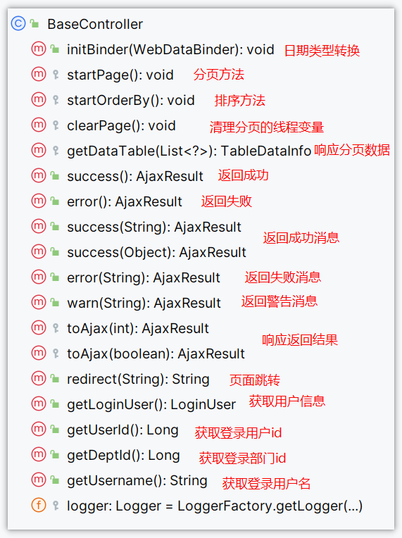

2.符合RestFul请求风格

3.返回值有两个：TableDataInfo 和  AjaxResult   

TableDataInfo 返回分页相关数据

```json
{
    "total": 2,
    "rows": [
        {
            "createBy": "admin",
            "createTime": "2024-03-25 21:29:45",
            "updateBy": "",
            "updateTime": null,
            "remark": "管理员",
            "noticeId": "2",
            "noticeTitle": "维护通知：2018-07-01 若依系统凌晨维护",
            "noticeType": "1",
            "noticeContent": "维护内容",
            "status": "0"
        }
    ],
    "code": 200,
    "msg": "查询成功"
}
```

AjaxResult   继承了HashMap  有标准的接口响应结构

```json
{"msg":"操作成功","code":200}


{
    "msg": "操作成功",
    "code": 200,
    "data": {
        "createBy": "admin",
        "createTime": "2024-03-25 21:29:45",
        "remark": "管理员",
        "noticeId": "1",
        "noticeTitle": "温馨提醒：2018-07-01 若依新版本发布啦",
        "noticeType": "2",
        "noticeContent": "新版本内容",
        "status": "0"
    }
}
```

4.陌生注解

- `@PreAuthorize`  在方法上使用，主要作用判断当前登录人是否有权限访问该方法   ps:后期会细讲

- `@Log`在方法上使用，作用是把操作这个方法的行为做一个日志记录      ps:后期会细讲

5.后端其他代码

比如service、mapper，这些代码都是基础的CRUD，操作数据使用的mybatis，详细请阅读代码

6.分页逻辑

详细分页逻辑如下图：

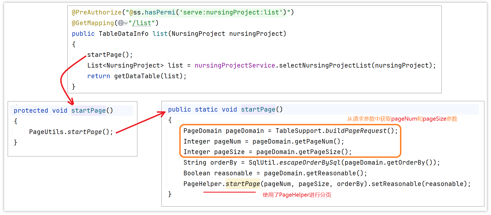

当调用了startPage\(\)方法后主要干了两件事：

- 从请求参数中获取到pageNum和pageSize两个参数，如果有其他参数也会获取，比如是orderBy参数

- 调用了PageHelper\.startPage\(\)方法，来进行分页处理

### 3.2.前端代码

1.菜单路由规则，映射关系

> 知识回顾：
> 
> 路由：实现不同页面间的导航和视图切换，是路径与组件的对应关系
> 

我们来看一下目前护理项目这个菜单的配置项，如下图

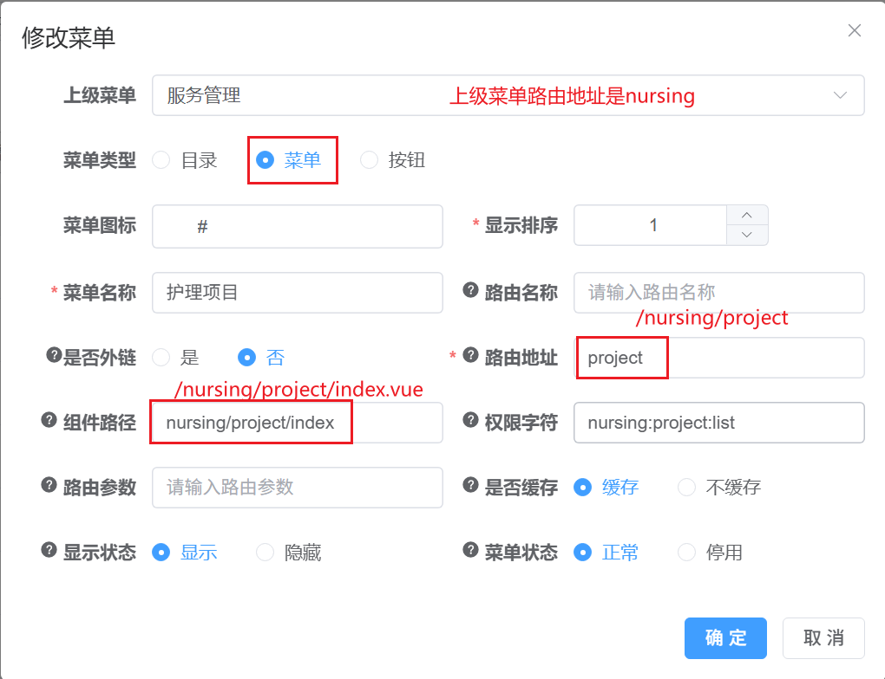

这个菜单的类型为菜单，菜单需要有对应的组件路径

父菜单的路由地址\+当前菜单的路由地址 就可以访问组件路径对应的组件

即： 访问：`/nursing/project`    渲染的组件为：`@/views/nursing/project/index.vue`

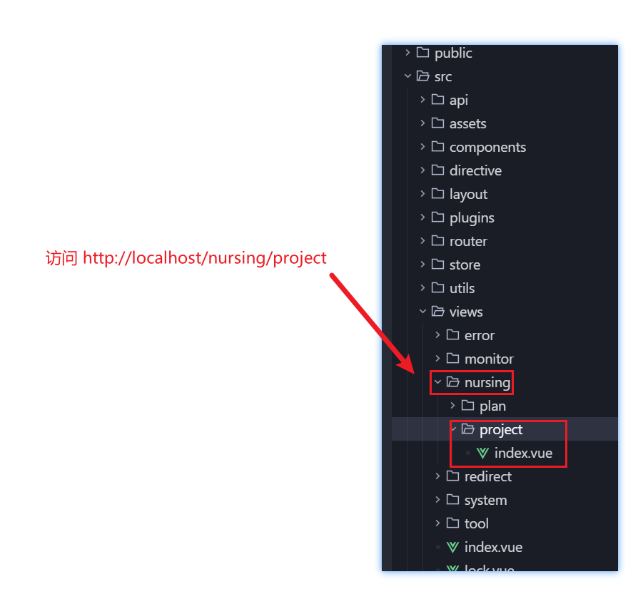


测试案例

在服务管理中新增一个菜单\(护理计划\)，配置如下:

- 上级菜单：服务管理

- 路由地址：plan

- 组件路径：nursing/plan/index

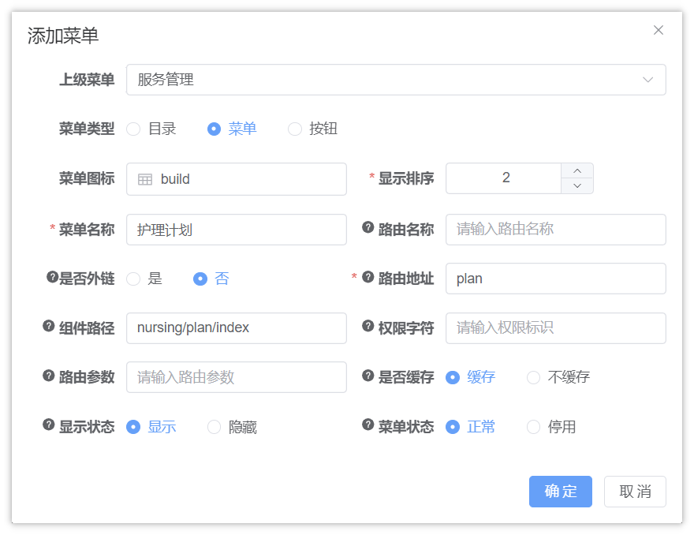

在`@/views/nursing/plan`目录中新增一个index\.vue组件\(需要新增一个plan目录\)

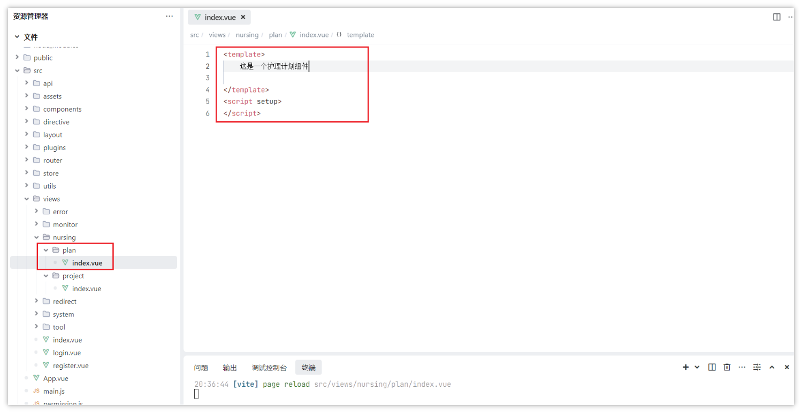

测试是否能正常访问这个组件

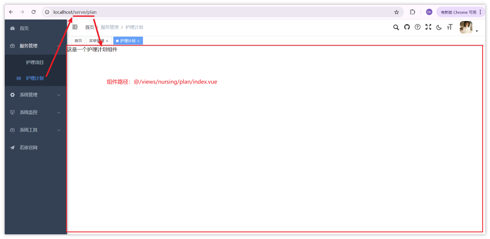

2.代码阅读

刚才生成代码中包含了两部分内容，第一个是api，第二个是组件

我们先来看`@/api/serve/nursingProject.js`

```javascript
import request from '@/utils/request'

// 查询护理项目列表
export function listNursingProject(query) {
  return request({
    url: '/serve/nursingProject/list',
    method: 'get',
    params: query
  })
}

// 查询护理项目详细
export function getNursingProject(id) {
  return request({
    url: '/serve/nursingProject/' + id,
    method: 'get'
  })
}

// 新增护理项目
export function addNursingProject(data) {
  return request({
    url: '/serve/nursingProject',
    method: 'post',
    data: data
  })
}

// 修改护理项目
export function updateNursingProject(data) {
  return request({
    url: '/serve/nursingProject',
    method: 'put',
    data: data
  })
}

// 删除护理项目
export function delNursingProject(id) {
  return request({
    url: '/serve/nursingProject/' + id,
    method: 'delete'
  })
}

```

这里面的5个接口定义，与后台提供的接口是一一对应的

其中`@/utils/request`这个js封装了拦截器和工具函数，实现了对HTTP请求和响应的统一处理和管理


我们接下来再来看组件的代码，地址：`src\views\serve\nursingProject\index.vue`

为了更方便阅读这个代码，我们依然可以使用通义灵码或者是AI大模型添加注释或者解释代码

> Prompt
>
> 把这个组件的代码给大模型，然后跟上一句话
>
> 你是一个资深的前端开发工程师，帮我给解读一下上述代码，并且给每行代码上添加注释说明
>

解释后的代码如下：

```javascript
<template>
  <div class="app-container">

    <!-- 搜索表单  start -->
    <el-form :model="queryParams" ref="queryRef" :inline="true" v-show="showSearch" label-width="68px">
      <el-form-item label="名称" prop="name">
        <el-input
          v-model="queryParams.name"
          placeholder="请输入名称"
          clearable
          @keyup.enter="handleQuery"
        />
      </el-form-item>
      <el-form-item>
        <el-button type="primary" icon="Search" @click="handleQuery">搜索</el-button>
        <el-button icon="Refresh" @click="resetQuery">重置</el-button>
      </el-form-item>
    </el-form>
    <!-- 搜索表单 end -->

    <!-- 按钮区域 start -->
    <el-row :gutter="10" class="mb8">
      <el-col :span="1.5">
        <el-button
          type="primary"
          plain
          icon="Plus"
          @click="handleAdd"
          v-hasPermi="['serve:project:add']"
        >新增</el-button>
      </el-col>
      <el-col :span="1.5">
        <el-button
          type="success"
          plain
          icon="Edit"
          :disabled="single"
          @click="handleUpdate"
          v-hasPermi="['serve:project:edit']"
        >修改</el-button>
      </el-col>
      <el-col :span="1.5">
        <el-button
          type="danger"
          plain
          icon="Delete"
          :disabled="multiple"
          @click="handleDelete"
          v-hasPermi="['serve:project:remove']"
        >删除</el-button>
      </el-col>
      <el-col :span="1.5">
        <el-button
          type="warning"
          plain
          icon="Download"
          @click="handleExport"
          v-hasPermi="['serve:project:export']"
        >导出</el-button>
      </el-col>
      <right-toolbar v-model:showSearch="showSearch" @queryTable="getList"></right-toolbar>
    </el-row>
    <!-- 按钮区域 end -->

    <!-- 数据展示区域 start -->
    <el-table v-loading="loading" :data="projectList" @selection-change="handleSelectionChange">
      <el-table-column type="selection" width="55" align="center" />
      <el-table-column label="编号" align="center" prop="id" />
      <el-table-column label="名称" align="center" prop="name" />
      <el-table-column label="排序号" align="center" prop="orderNo" />
      <el-table-column label="单位" align="center" prop="unit" />
      <el-table-column label="价格" align="center" prop="price" />
      <el-table-column label="图片" align="center" prop="image" width="100">
        <template #default="scope">
          <image-preview :src="scope.row.image" :width="50" :height="50"/>
        </template>
      </el-table-column>
      <el-table-column label="护理要求" align="center" prop="nursingRequirement" />
      <el-table-column label="状态" align="center" prop="status" />
      <el-table-column label="创建时间" align="center" prop="createTime" width="180">
        <template #default="scope">
          <span>{{ parseTime(scope.row.createTime, '{y}-{m}-{d}') }}</span>
        </template>
      </el-table-column>
      <el-table-column label="操作" align="center" class-name="small-padding fixed-width">
        <template #default="scope">
          <el-button link type="primary" icon="Edit" @click="handleUpdate(scope.row)" v-hasPermi="['serve:project:edit']">修改</el-button>
          <el-button link type="primary" icon="Delete" @click="handleDelete(scope.row)" v-hasPermi="['serve:project:remove']">删除</el-button>
        </template>
      </el-table-column>
    </el-table>
    <!-- 数据展示区域 end -->
    

    <!-- 分页组件 start -->
    <pagination
      v-show="total>0"
      :total="total"
      v-model:page="queryParams.pageNum"
      v-model:limit="queryParams.pageSize"
      @pagination="getList"
    />
    <!-- 分页组件 end -->

    <!-- 新增或修改弹窗  start -->
    <!-- 添加或修改护理项目对话框 -->
    <el-dialog :title="title" v-model="open" width="500px" append-to-body>
      <el-form ref="projectRef" :model="form" :rules="rules" label-width="80px">
        <el-form-item label="名称" prop="name">
          <el-input v-model="form.name" placeholder="请输入名称" />
        </el-form-item>
        <el-form-item label="排序号" prop="orderNo">
          <el-input v-model="form.orderNo" placeholder="请输入排序号" />
        </el-form-item>
        <el-form-item label="单位" prop="unit">
          <el-input v-model="form.unit" placeholder="请输入单位" />
        </el-form-item>
        <el-form-item label="价格" prop="price">
          <el-input v-model="form.price" placeholder="请输入价格" />
        </el-form-item>
        <el-form-item label="图片" prop="image">
          <image-upload v-model="form.image"/>
        </el-form-item>
        <el-form-item label="护理要求" prop="nursingRequirement">
          <el-input v-model="form.nursingRequirement" placeholder="请输入护理要求" />
        </el-form-item>
      </el-form>
      <template #footer>
        <div class="dialog-footer">
          <el-button type="primary" @click="submitForm">确 定</el-button>
          <el-button @click="cancel">取 消</el-button>
        </div>
      </template>
    </el-dialog>
    <!-- 新增或修改弹窗  end -->
  </div>
</template>

<script setup name="Project">
// 引入后端接口
import { listProject, getProject, delProject, addProject, updateProject } from "@/api/serve/project";
// 获取当前实例代理对象，用于访问组件的数据、方法等属性。
const { proxy } = getCurrentInstance();

// 列表数据
const projectList = ref([]);
// 是否显示弹窗
const open = ref(false);
// 加载状态
const loading = ref(true);
// 是否显示搜索栏
const showSearch = ref(true);
//记录被选中的id集合
const ids = ref([]);
//是否是单选，用于是否高亮修改按钮
const single = ref(true);
//是否是多选，用于是否高亮删除按钮
const multiple = ref(true);
//总条数
const total = ref(0);
// 标题
const title = ref("");

const data = reactive({
  // 新增或修改表单数据
  form: {},
  // 查询参数
  queryParams: {
    pageNum: 1,
    pageSize: 10,
    name: null,
    status: null,
  },
  // 表单校验
  rules: {
    status: [
      { required: true, message: "状态不能为空", trigger: "change" }
    ],
  }
});
//toRefs将传入的数据对象的特定属性转换为响应式对象
const { queryParams, form, rules } = toRefs(data);

/** 查询护理项目列表 */
function getList() {
  loading.value = true;
  listProject(queryParams.value).then(response => {
    projectList.value = response.rows;
    total.value = response.total;
    loading.value = false;
  });
}

// 取消按钮
function cancel() {
  open.value = false;
  reset();
}

// 表单重置
function reset() {
  form.value = {
    id: null,
    name: null,
    orderNo: null,
    unit: null,
    price: null,
    image: null,
    nursingRequirement: null,
    status: null,
    createBy: null,
    updateBy: null,
    remark: null,
    createTime: null,
    updateTime: null
  };
  proxy.resetForm("projectRef");
}

/** 搜索按钮操作 */
function handleQuery() {
  queryParams.value.pageNum = 1;
  getList();
}

/** 重置按钮操作 */
function resetQuery() {
  proxy.resetForm("queryRef");
  handleQuery();
}

// 多选框选中数据
function handleSelectionChange(selection) {
  ids.value = selection.map(item => item.id);
  single.value = selection.length != 1;
  multiple.value = !selection.length;
}

/** 新增按钮操作 */
function handleAdd() {
  reset();
  open.value = true;
  title.value = "添加护理项目";
}

/** 修改按钮操作 */
function handleUpdate(row) {
  reset();
  const _id = row.id || ids.value
  getProject(_id).then(response => {
    form.value = response.data;
    open.value = true;
    title.value = "修改护理项目";
  });
}

/** 提交按钮 */
function submitForm() {
  proxy.$refs["projectRef"].validate(valid => {
    if (valid) {
      if (form.value.id != null) {
        updateProject(form.value).then(response => {
          proxy.$modal.msgSuccess("修改成功");
          open.value = false;
          getList();
        });
      } else {
        addProject(form.value).then(response => {
          proxy.$modal.msgSuccess("新增成功");
          open.value = false;
          getList();
        });
      }
    }
  });
}

/** 删除按钮操作 */
function handleDelete(row) {
  const _ids = row.id || ids.value;
  proxy.$modal.confirm('是否确认删除护理项目编号为"' + _ids + '"的数据项？').then(function() {
    return delProject(_ids);
  }).then(() => {
    getList();
    proxy.$modal.msgSuccess("删除成功");
  }).catch(() => {});
}

/** 导出按钮操作 */
function handleExport() {
  proxy.download('serve/project/export', {
    ...queryParams.value
  }, `project_${new Date().getTime()}.xlsx`)
}

getList();
</script>
```

组件主要使用Vue3\+Element plus组件进行开发

完成了护理项目的增删改查

# 六、在线接口文档

刚才我们测试都是基于前端项目完成的，如果后期开发中，前端还未开发完成，我们也需要对于后端的接口来进行测试，这个怎么做呢？

- 使用postman或者apifox来进行测试

- 使用在线接口工具进行测试（常用）

如果使用post或者是apifox，那么接口的定义必须要清楚的知道接口的路径，请求方式，出参和入参，这样才能很好的进行测试。

现在如果我们与前端对接，需要提供详细的接口文档才行，不过在开发的过程中，接口文档可能不能及时的提供，或者是更新不及时，就会造成信息闭塞，造成不必要的效率降低。

所以，一般的前后端分离的项目，都会采用在线的接口工具进行调试，可以实时的展示接口的详细数据，也可以很方便的对接口进行测试。

## 1.Swagger介绍

Swagger 是一个规范和完整的框架，用于生成、描述、调用和可视化 RESTful 风格的 Web 服务

官网：https://swagger.io/autolink

它的主要作用是：

- 使得前后端分离开发更加方便，有利于团队协作

- 接口的文档在线自动生成，降低后端开发人员编写接口文档的负担

- 功能测试 

Spring已经将Swagger纳入自身的标准，建立了Spring\-swagger项目，现在叫Springfox。通过在项目中引入Springfox ，即可使用Swagger。

Springfox（Swagger 2） 已停止维护，不兼容 Spring Boot 3/4。

Spring Boot 4 必须使用 springdoc\-openapi v3\.x，v2\.x 仅支持 Spring Boot 3\.x。

访问地址：

- Swagger UI：`/swagger-ui.html`

- OpenAPI 文档：`/v3/api-docs`

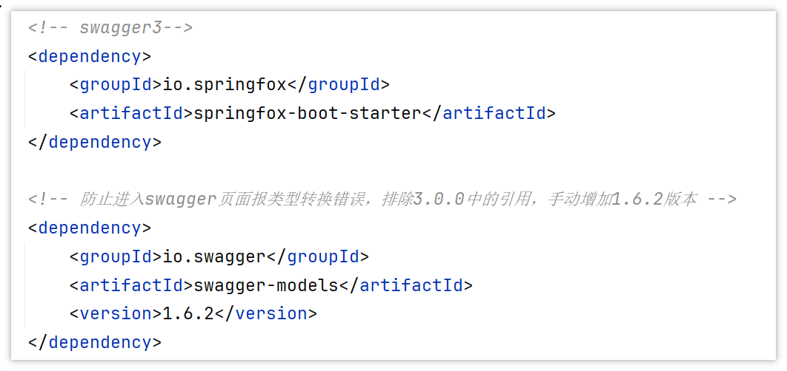

## 2.项目中集成

目前若依框架已经集成了swagger，核心配置如下：

1.关键依赖

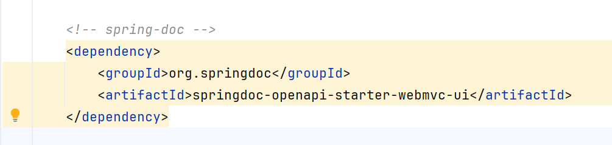

目前这些依赖在`xhzb-admin`模块的pom文件，需要挪到`xhzb-common`模块中，方便其他模块进行依赖使用

2.核心配置类

位置：com\.xhzb\.web\.core\.config\.SwaggerConfig

请设计prompt提示词，来阅读以下代码

```typescript
package com.xhzb.web.core.config;

import org.springframework.beans.factory.annotation.Autowired;
import org.springframework.context.annotation.Bean;
import org.springframework.context.annotation.Configuration;
import com.xhzb.common.config.RuoYiConfig;
import io.swagger.v3.oas.models.Components;
import io.swagger.v3.oas.models.OpenAPI;
import io.swagger.v3.oas.models.info.Contact;
import io.swagger.v3.oas.models.info.Info;
import io.swagger.v3.oas.models.security.SecurityRequirement;
import io.swagger.v3.oas.models.security.SecurityScheme;

/**
 * Swagger3 (OpenAPI 3.0) 接口文档配置类
 * <p>
 * 用于配置和管理系统的 API 接口文档，提供以下功能：
 * <ul>
 *   <li>配置 API 文档的基本信息（标题、描述、版本等）</li>
 *   <li>设置接口的认证机制（Bearer Token）</li>
 *   <li>生成可视化的接口文档页面</li>
 * </ul>
 * </p>
 * 
 * @author ruoyi
 * @see io.swagger.v3.oas.models.OpenAPI
 */
@Configuration
public class SwaggerConfig
{
    /** 系统基础配置，包含应用名称和版本等信息 */
    @Autowired
    private RuoYiConfig ruoyiConfig;
    
    /**
     * 创建自定义的 OpenAPI 配置对象
     * <p>
     * 该方法配置了：
     * <ul>
     *   <li>安全认证方案（API Key + Bearer Token）</li>
     *   <li>全局安全要求（所有接口默认需要认证）</li>
     *   <li>API 基本信息（标题、描述、联系人、版本）</li>
     * </ul>
     * </p>
     *
     * @return OpenAPI 配置对象，包含完整的 API 文档配置信息
     */
    @Bean
    public OpenAPI customOpenApi()
    {
        return new OpenAPI().components(new Components()
            // 设置认证的请求头，定义 API Key 的安全方案
            .addSecuritySchemes("apikey", securityScheme()))
            // 为所有接口添加全局安全要求，使用 apikey 进行认证
            .addSecurityItem(new SecurityRequirement().addList("apikey"))
            // 设置 API 文档的基本信息
            .info(getApiInfo());
    }
    
    /**
     * 创建安全认证方案配置
     * <p>
     * 配置基于 JWT Token 的认证方式：
     * <ul>
     *   <li>类型：API Key</li>
     *   <li>参数名：Authorization</li>
     *   <li>传递位置：HTTP Header</li>
     *   <li>认证方案：Bearer</li>
     * </ul>
     * </p>
     * <p>
     * 客户端调用接口时需要在请求头中添加：
     * {@code Authorization: Bearer <your_jwt_token>}
     * </p>
     *
     * @return SecurityScheme 安全认证方案对象
     */
    @Bean
    public SecurityScheme securityScheme()
    {
        return new SecurityScheme()
            // 设置认证类型为 API Key
            .type(SecurityScheme.Type.APIKEY)
            // 设置请求头参数名称为 Authorization
            .name("Authorization")
            // 设置参数传递位置为 HTTP Header
            .in(SecurityScheme.In.HEADER)
            // 设置认证方案为 Bearer
            .scheme("Bearer");
    }
    
    /**
     * 构建 API 文档的基本信息
     * <p>
     * 包含以下信息：
     * <ul>
     *   <li>标题：若依管理系统_接口文档</li>
     *   <li>描述：系统功能模块说明</li>
     *   <li>联系人：从配置中读取的应用名称</li>
     *   <li>版本：从配置中读取的应用版本号</li>
     * </ul>
     * </p>
     *
     * @return Info 对象，包含 API 文档的元数据信息
     */
    public Info getApiInfo()
    {
        return new Info()
            // 设置 API 文档标题
            .title("标题：若依管理系统_接口文档")
            // 设置 API 文档描述信息
            .description("描述：用于管理集团旗下公司的人员信息,具体包括XXX,XXX模块...")
            // 设置作者/联系人信息，从 RuoYiConfig 中获取应用名称
            .contact(new Contact().name(ruoyiConfig.getName()))
            // 设置 API 版本号，从 RuoYiConfig 中获取版本信息
            .version("版本号:" + ruoyiConfig.getVersion());
    }
}
```

2.访问地址

方式一：系统内部访问

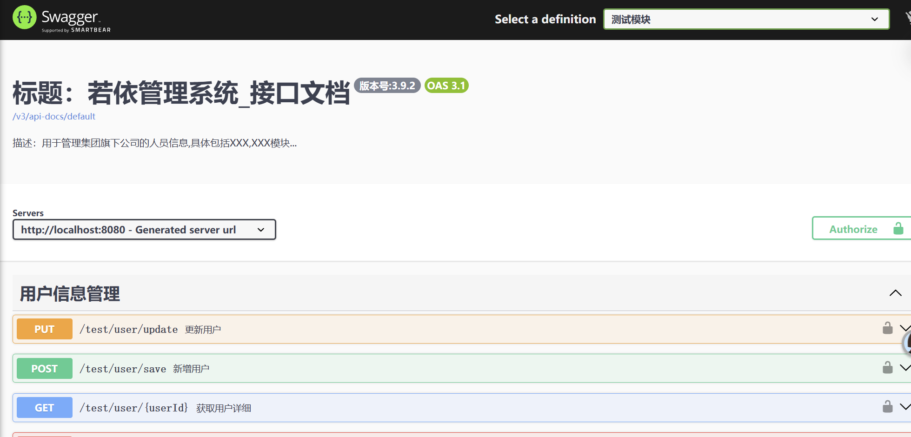

方式二：服务地址+/swagger-ui/index.html  --- >  http://localhost:8080/swagger-ui/index.html

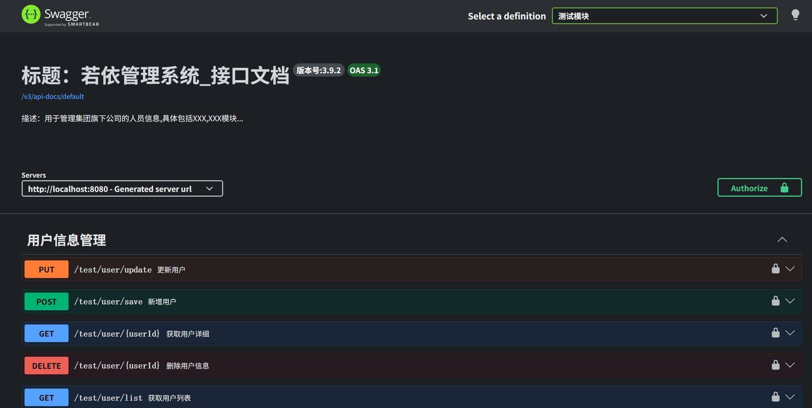

## 3.集成Knife4j

knife4j是为java MVC框架集成Swagger生成Api文档的增强解决方案,前身是swagger\-bootstrap\-ui,取名knife4j是希望它能像一把匕首一样小巧,轻量,并且功能强悍\!

目前，一般都使用knife4j框架。

集成方式参考链接：[插件集成 | RuoYi](https://doc.ruoyi.vip/ruoyi-vue/document/cjjc.html#集成knife4j实现swagger文档增强)

1.在`zzyl-common\pom.xml` 模块中添加整合依赖

```xml
<dependency>
    <groupId>com.github.xiaoymin</groupId>
    <artifactId>knife4j-openapi3-jakarta-spring-boot-starter</artifactId>
    <version>4.4.0</version>
</dependency>
```

2.修改代码

```java
com.xhzb.framework.config.SecurityConfig

// 增加
.requestMatchers("/webjars/**", "/doc.html").permitAll()
```

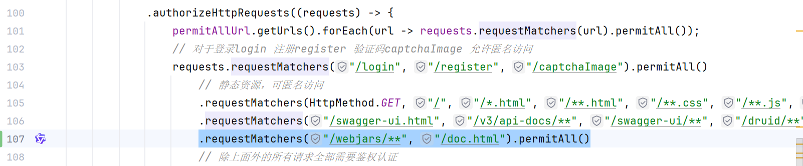

3.修改前端项目`src\views\tool\swagger\index.vue` 跳转地址

```javascript
// const url = ref(import.meta.env.VITE_APP_BASE_API + "/swagger-ui/index.html")
const url = ref(import.meta.env.VITE_APP_BASE_API + "/doc.html")
```

实现后的效果

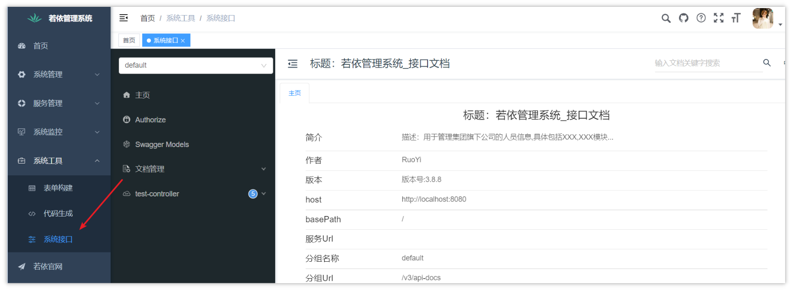

可以设置全局参数

由于若依中的所有接口都已经做了安全校验，在访问之前，我们必须设置一个全局参数来获取到登录之后的token才可以正常访问，不然会报一个401错误

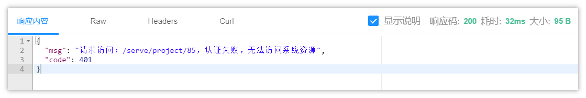

解决：

当我们正常登录系统之后，就可以在后端获取一个jwt生成的token，这个token是登录成功的标识，后期其他请求都需要携带这个token才能正常访问

我们可以在浏览器中打开F12，查看网络，当登录成功后可以查看返回的token

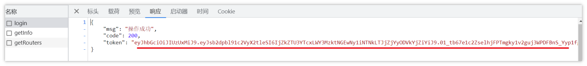

有了token以后，就可以把这个token设置到全局参数中

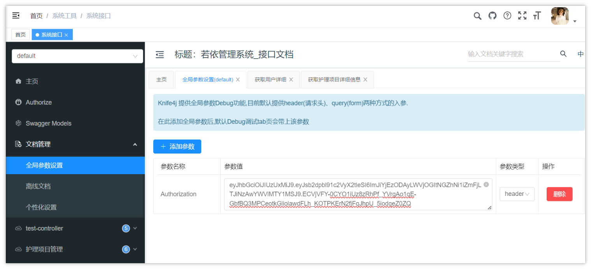

可以下载离线文档

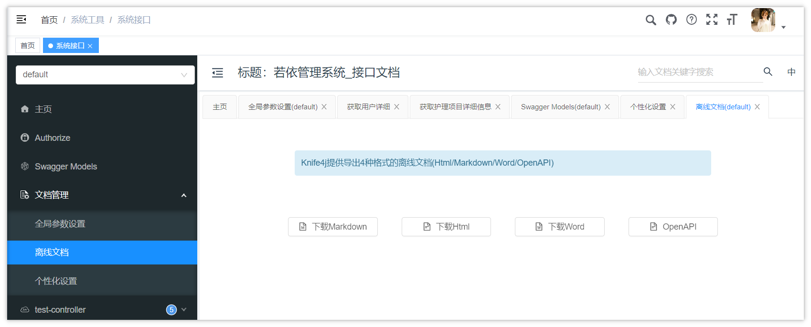

提供了更好的接口文档阅读界面

提供了更方便的接口测试

## 4.项目中使用

如果现在想要测试护理项目，我们发现在swagger中并没有护理项目相关的接口，如果想要展示这些接口，我们需要添加上必要的注解来进行说明才能阅读和访问。

### 4.1.常见注解

通过注解可以控制生成的接口文档，使接口文档拥有更好的可读性，常用注解如下：

|老 Swagger2（已废弃）|新 OpenAPI3|说明|
|---|---|---|
|@Api|@Tag|用在类上，描述Controller的作用|
|@ApiOperation|@Operation|用在方法上，说明方法的用途、作用|
|@ApiParam|@Parameter|用在方法的参数上，描述单个形参的含义|
|@ApiImplicitParam|@Parameter|用在方法上，描述单个形参的含义，与上面相比使用范围更广|
|@ApiModel|@Schema|用在类上，用对象来接收参数或者返回参数，描述类的含义|
|@ApiModelProperty|@Schema|用在类的属性上，用对象来接收参数或者返回参数，描述字段的含义|

### 4.2.Controller的方法参数说明

我们熟悉了这些注解之后，我们可以让AI协助我们快速完成注解的编写：

> Prompt
>
> 把整个NursingProjectController类给AI，然后在最后添加上一句话：
>
> 帮我给上述代码添加上swagger注解说明，要求每个参数也要进行说明
>

生成后的代码如下：

```typescript
package com.xhzb.nursing.controller;

import java.util.List;

import com.xhzb.common.core.domain.R;
import io.swagger.v3.oas.annotations.Operation;
import io.swagger.v3.oas.annotations.Parameter;
import io.swagger.v3.oas.annotations.media.Schema;
import io.swagger.v3.oas.annotations.tags.Tag;
import jakarta.servlet.http.HttpServletResponse;
import org.springframework.security.access.prepost.PreAuthorize;
import org.springframework.beans.factory.annotation.Autowired;
import org.springframework.web.bind.annotation.GetMapping;
import org.springframework.web.bind.annotation.PostMapping;
import org.springframework.web.bind.annotation.PutMapping;
import org.springframework.web.bind.annotation.DeleteMapping;
import org.springframework.web.bind.annotation.PathVariable;
import org.springframework.web.bind.annotation.RequestBody;
import org.springframework.web.bind.annotation.RequestMapping;
import org.springframework.web.bind.annotation.RestController;
import com.xhzb.common.annotation.Log;
import com.xhzb.common.core.controller.BaseController;
import com.xhzb.common.core.domain.AjaxResult;
import com.xhzb.common.enums.BusinessType;
import com.xhzb.nursing.domain.NursingProject;
import com.xhzb.nursing.service.INursingProjectService;
import com.xhzb.common.utils.poi.ExcelUtil;
import com.xhzb.common.core.page.TableDataInfo;

/**
 * 护理项目Controller
 * 
 * @author itheima
 * @date 2026-04-15
 */
@Tag(name = "护理项目")
@RestController
@RequestMapping("/nursing/project")
public class NursingProjectController extends BaseController
{
    @Autowired
    private INursingProjectService nursingProjectService;

    /**
     * 查询护理项目列表
     */
    @Operation(summary = "查询护理项目列表")
    @PreAuthorize("@ss.hasPermi('nursing:project:list')")
    @GetMapping("/list")
    public TableDataInfo list(NursingProject nursingProject)
    {
        startPage();
        List<NursingProject> list = nursingProjectService.selectNursingProjectList(nursingProject);
        return getDataTable(list);
    }

    /**
     * 导出护理项目列表
     */
    @Operation(summary = "导出护理项目列表")
    @PreAuthorize("@ss.hasPermi('nursing:project:export')")
    @Log(title = "护理项目", businessType = BusinessType.EXPORT)
    @PostMapping("/export")
    public void export(HttpServletResponse response, NursingProject nursingProject)
    {
        List<NursingProject> list = nursingProjectService.selectNursingProjectList(nursingProject);
        ExcelUtil<NursingProject> util = new ExcelUtil<NursingProject>(NursingProject.class);
        util.exportExcel(response, list, "护理项目数据");
    }

    /**
     * 获取护理项目详细信息
     */
    @Operation(summary = "获取护理项目详细信息")
    @PreAuthorize("@ss.hasPermi('nursing:project:query')")
    @GetMapping(value = "/{id}")
    public R<NursingProject> getInfo(@Parameter(description = "护理项目ID") @PathVariable("id") Long id)
    {
        return R.ok(nursingProjectService.selectNursingProjectById(id));
    }

    /**
     * 新增护理项目
     */
    @Operation(summary = "新增护理项目")
    @PreAuthorize("@ss.hasPermi('nursing:project:add')")
    @Log(title = "护理项目", businessType = BusinessType.INSERT)
    @PostMapping
    public AjaxResult add(@Parameter(description = "护理项目实体") @RequestBody NursingProject nursingProject)
    {
        return toAjax(nursingProjectService.insertNursingProject(nursingProject));
    }

    /**
     * 修改护理项目
     */
    @Operation(summary = "修改护理项目")
    @PreAuthorize("@ss.hasPermi('nursing:project:edit')")
    @Log(title = "护理项目", businessType = BusinessType.UPDATE)
    @PutMapping
    public AjaxResult edit(@Parameter(description = "护理项目实体") @RequestBody NursingProject nursingProject)
    {
        return toAjax(nursingProjectService.updateNursingProject(nursingProject));
    }

    /**
     * 删除护理项目
     */
    @Operation(summary = "删除护理项目")
    @PreAuthorize("@ss.hasPermi('nursing:project:remove')")
    @Log(title = "护理项目", businessType = BusinessType.DELETE)
    @DeleteMapping("/{ids}")
    public AjaxResult remove(@Parameter(description = "护理项目ID列表") @PathVariable Long[] ids)
    {
        return toAjax(nursingProjectService.deleteNursingProjectByIds(ids));
    }
}
```

直接替换我们自己的NursingProjectController类即可，然后进行测试，效果如下：

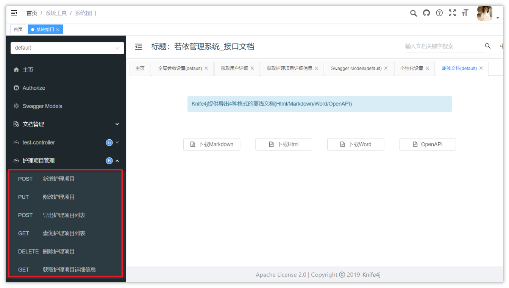

### 4.3.请求体参数

一般的形参，如：id，status等这些，在controller的方法可以使用@Parameter注解进行描述，如果接口是post、put请求，可能接收的是一个请求体参数，上面两个注解并不能很好的进行描述，这个时候需要使用新的注解：@Schema

比如，在新增护理项目的时候，接收的参数为NursingProject实体类，我们可以用这些注解在实体类中进行描述

如下代码：

```java
package com.xhzb.nursing.domain;

import java.math.BigDecimal;

import io.swagger.v3.oas.annotations.media.Schema;
import org.apache.commons.lang3.builder.ToStringBuilder;
import org.apache.commons.lang3.builder.ToStringStyle;
import com.xhzb.common.annotation.Excel;
import com.xhzb.common.core.domain.BaseEntity;

/**
 * 护理项目对象 nursing_project
 * 
 * @author itheima
 * @date 2026-04-15
 */
@Schema(description = "护理项目实体")
public class NursingProject extends BaseEntity
{
    private static final long serialVersionUID = 1L;

    /** 编号 */
    @Schema(title = "护理项目ID")
    private Long id;

    /** 名称 */
    @Schema(title = "护理项目名称")
    @Excel(name = "名称")
    private String name;

    /** 排序号 */
    @Schema(title = "护理项目排序号")
    @Excel(name = "排序号")
    private Long orderNo;

    /** 单位 */
    @Schema(title = "护理项目单位")
    @Excel(name = "单位")
    private String unit;

    /** 价格 */
    @Schema(title = "护理项目价格")
    @Excel(name = "价格")
    private BigDecimal price;

    /** 图片 */
    @Schema(title = "护理项目图片")
    @Excel(name = "图片")
    private String image;

    /** 护理要求 */
    @Schema(title = "护理项目护理要求")
    @Excel(name = "护理要求")
    private String nursingRequirement;

    /** 状态（0：禁用，1：启用） */
    @Schema(title = "护理项目状态" )
    @Excel(name = "状态", readConverterExp = "0=：禁用，1：启用")
    private Long status;

    public void setId(Long id) 
    {
        this.id = id;
    }

    public Long getId() 
    {
        return id;
    }

    public void setName(String name) 
    {
        this.name = name;
    }

    public String getName() 
    {
        return name;
    }

    public void setOrderNo(Long orderNo) 
    {
        this.orderNo = orderNo;
    }

    public Long getOrderNo() 
    {
        return orderNo;
    }

    public void setUnit(String unit) 
    {
        this.unit = unit;
    }

    public String getUnit() 
    {
        return unit;
    }

    public void setPrice(BigDecimal price) 
    {
        this.price = price;
    }

    public BigDecimal getPrice() 
    {
        return price;
    }

    public void setImage(String image) 
    {
        this.image = image;
    }

    public String getImage() 
    {
        return image;
    }

    public void setNursingRequirement(String nursingRequirement) 
    {
        this.nursingRequirement = nursingRequirement;
    }

    public String getNursingRequirement() 
    {
        return nursingRequirement;
    }

    public void setStatus(Long status) 
    {
        this.status = status;
    }

    public Long getStatus() 
    {
        return status;
    }

    @Override
    public String toString() {
        return new ToStringBuilder(this,ToStringStyle.MULTI_LINE_STYLE)
            .append("id", getId())
            .append("name", getName())
            .append("orderNo", getOrderNo())
            .append("unit", getUnit())
            .append("price", getPrice())
            .append("image", getImage())
            .append("nursingRequirement", getNursingRequirement())
            .append("status", getStatus())
            .append("createBy", getCreateBy())
            .append("updateBy", getUpdateBy())
            .append("remark", getRemark())
            .append("createTime", getCreateTime())
            .append("updateTime", getUpdateTime())
            .toString();
    }
}
```

由于这个类继承了BaseEntity，我们也可以通过上面两个注解对BaseEntity进行描述

> 注意：由于目前的swagger相关的依赖都在ruoyi\-admin中，而BaseEntity类在ruoyi\-common模块中，所以我们需要把swagger相关的所有依赖，从ruoyi\-admin模块中拷贝到ruoyi\-common模块中，删除ruoyi\-admin中swagger相关的依赖，因为ruoyi\-admin模块依赖了ruoyi\-common
>

添加注解之后的效果：

```java
package com.xhzb.common.core.domain;

import java.io.Serializable;
import java.util.Date;
import java.util.HashMap;
import java.util.Map;
import com.fasterxml.jackson.annotation.JsonFormat;
import com.fasterxml.jackson.annotation.JsonIgnore;
import com.fasterxml.jackson.annotation.JsonInclude;
import io.swagger.v3.oas.annotations.media.Schema;

/**
 * Entity基类
 * 
 * @author ruoyi
 */
@Schema(description = "Entity基类")
public class BaseEntity implements Serializable
{
    private static final long serialVersionUID = 1L;

    /** 搜索值 */
    @JsonIgnore
    @Schema(title = "搜索值")
    private String searchValue;

    /** 创建者 */
    @Schema(title = "创建者")
    private String createBy;

    /** 创建时间 */
    @Schema(title = "创建时间")
    @JsonFormat(pattern = "yyyy-MM-dd HH:mm:ss")
    private Date createTime;

    /** 更新者 */
    @Schema(title = "更新者")
    private String updateBy;

    /** 更新时间 */
    @Schema(title = "更新时间")
    @JsonFormat(pattern = "yyyy-MM-dd HH:mm:ss")
    private Date updateTime;

    /** 备注 */
    @Schema(title = "备注")
    private String remark;

    /** 请求参数 */
    @Schema(title = "请求参数")
    @JsonInclude(JsonInclude.Include.NON_EMPTY)
    private Map<String, Object> params;

    public String getSearchValue()
    {
        return searchValue;
    }

    public void setSearchValue(String searchValue)
    {
        this.searchValue = searchValue;
    }

    public String getCreateBy()
    {
        return createBy;
    }

    public void setCreateBy(String createBy)
    {
        this.createBy = createBy;
    }

    public Date getCreateTime()
    {
        return createTime;
    }

    public void setCreateTime(Date createTime)
    {
        this.createTime = createTime;
    }

    public String getUpdateBy()
    {
        return updateBy;
    }

    public void setUpdateBy(String updateBy)
    {
        this.updateBy = updateBy;
    }

    public Date getUpdateTime()
    {
        return updateTime;
    }

    public void setUpdateTime(Date updateTime)
    {
        this.updateTime = updateTime;
    }

    public String getRemark()
    {
        return remark;
    }

    public void setRemark(String remark)
    {
        this.remark = remark;
    }

    public Map<String, Object> getParams()
    {
        if (params == null)
        {
            params = new HashMap<>();
        }
        return params;
    }

    public void setParams(Map<String, Object> params)
    {
        this.params = params;
    }
}
```

在线文档展示的效果：

新增或修改

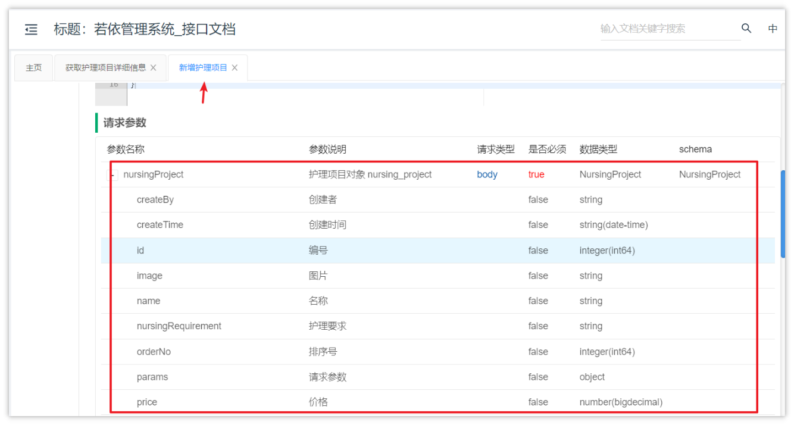

查询一个

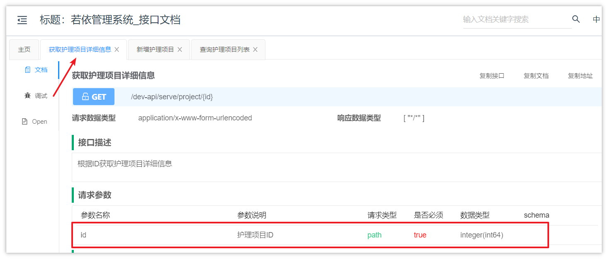

### 4.4.响应体参数

当我们去查询护理项目的时候，并不能展示详细的返回结果，如下图

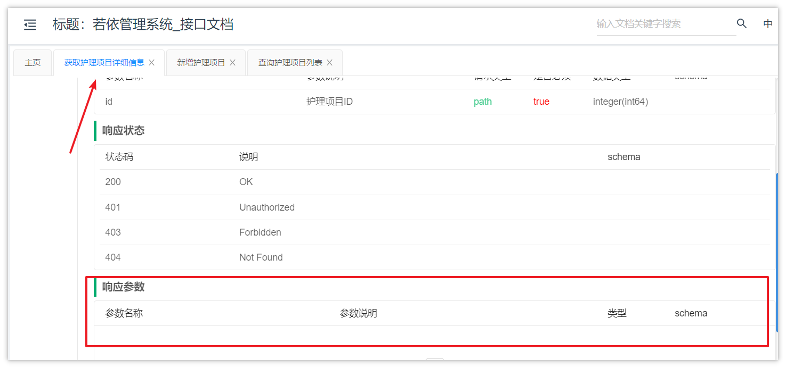

想要解决这个问题，有两步操作

使用@Schema注解对返回值的类型进行说明（已完成）

需要在controller类的方法上指定返回值类型

- 返回一个对象

- 返回数据列表（分页或不分页）

1.返回一个对象

在目前的代码中，返回一个对象的接口代码，是根据id查询对应的对象，并返回

详细代码如下：

```java
@operation("获取护理项目详细信息")
@PreAuthorize("@ss.hasPermi('nursing:nursingProject:query')")
@GetMapping(value = "/{id}")
public AjaxResult getInfo(@Parameter(description = "护理项目ID") @PathVariable("id") Long id)
{
    return success(nursingProjectService.selectNursingProjectById(id));
}
```

这个代码并不能在swagger中去展示详细的返回结果说明，因为目前的返回值是一个AjaxResult，并没有指定泛型

我们需要使用若依框架中提供的另外一个返回值类型

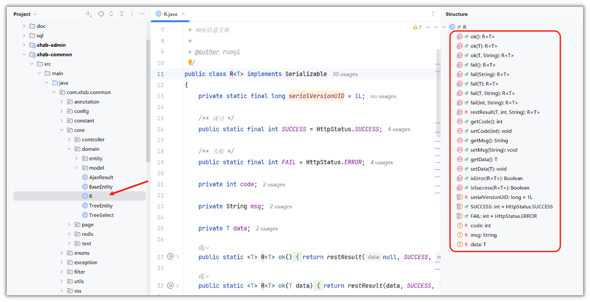

> 在R这个类中也提供了详细的返回值的方法，比如有成功的，有失败的等等
> 

修改NursingProjectController类中的方法返回值：

```java
/**
 * 获取护理项目详细信息
 */
@PreAuthorize("@ss.hasPermi('nursing:project:query')")
@GetMapping(value = "/{id}")
@operation(value = "获取护理项目详细信息", notes = "根据ID获取护理项目详细信息")
public R<NursingProject> getInfo(@PathVariable("id") Long id)
{
    NursingProject nursingProject = nursingProjectService.selectNursingProjectById(id);
    return R.ok(nursingProject);
}
```

最终的效果如下：

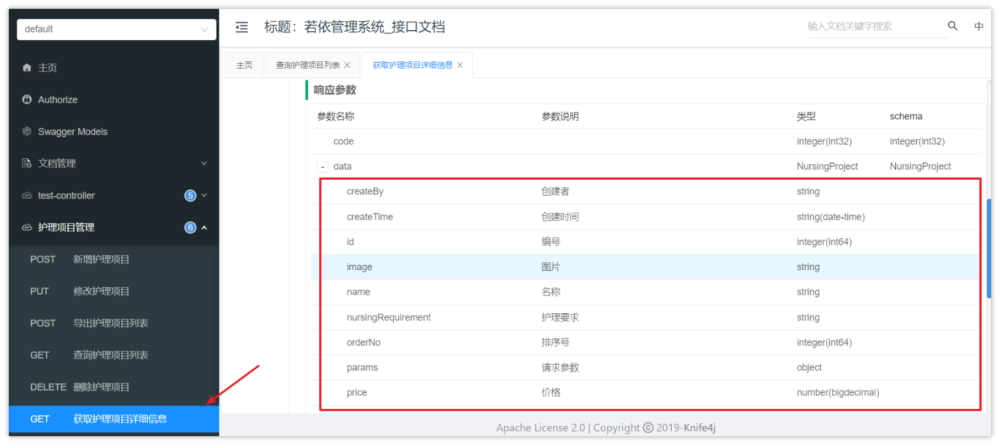

2.返回分页对象

目前的分页列表查询的返回值是TableDataInfo这个类，我们需要改造下这个类，让它具备接收泛型的能力

- 定义类中的泛型T

- 把类中的所有 ? 改为T

```java
/**
 * 表格分页数据对象
 * 
 * @author ruoyi
 */
public class TableDataInfo<T> implements Serializable
{
    private static final long serialVersionUID = 1L;

    /** 总记录数 */
    private long total;

    /** 列表数据 */
    private List<T> rows;

    /** 消息状态码 */
    private int code;

    /** 消息内容 */
    private String msg;

    /**
     * 表格数据对象
     */
    public TableDataInfo()
    {
    }

    /**
     * 分页
     * 
     * @param list 列表数据
     * @param total 总记录数
     */
    public TableDataInfo(List<T> list, int total)
    {
        this.rows = list;
        this.total = total;
    }


    public List<T> getRows()
    {
        return rows;
    }

    public void setRows(List<T> rows)
    {
        this.rows = rows;
    }
    
    //其他代码略...
   
}
```

修改controller中分页列表查询的返回值

```java
/**
 * 查询护理项目列表
 */
@PreAuthorize("@ss.hasPermi('nursing:project:list')")
@GetMapping("/list")
@ApiOperation(value = "查询护理项目列表", notes = "根据护理项目条件查询护理项目列表")
public TableDataInfo<List<NursingProject>> list(
    @Parameter(description = "护理项目查询条件", required = false) NursingProject nursingProject)
{
    startPage();
    List<NursingProject> list = nursingProjectService.selectNursingProjectList(nursingProject);
    return getDataTable(list);
}
```

重启服务，查看分页接口的返回值效果：

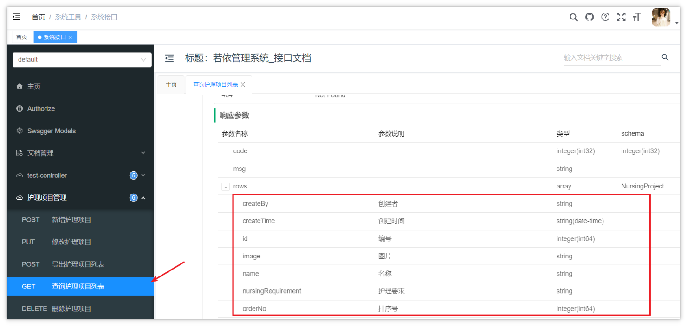

# 七、作业

把之前创建的前端护理计划删掉

除主键外和关联主键外的其他int类型的字段都改为integer

nursing\_plan:

- 包路径：com\.xhzb\.nursing

- 模块名：nursing

- 业务名：nursingPlan

- 功能名：护理计划

- 上级菜单:服务管理

nursing\_project\_plan:

- 包路径：com\.xhzb\.nursing

- 模块名：nursing

- 业务名：projectPlan

- 功能名：护理项目和护理计划关联

- 上级菜单: 不需要

nursing\_level:

- 包路径：com\.xhzb\.nursing

- 模块名：nursing

- 业务名：nursingLevel

- 功能名：护理等级

- 上级菜单:服务管理

```sql
CREATE TABLE `nursing_plan` (
  `id` int NOT NULL AUTO_INCREMENT COMMENT '编号',
  `sort_no` int DEFAULT NULL COMMENT '排序号',
  `plan_name` varchar(255) CHARACTER SET utf8mb4 COLLATE utf8mb4_0900_ai_ci NOT NULL DEFAULT '' COMMENT '名称',
  `status` tinyint NOT NULL DEFAULT '0' COMMENT '状态 0禁用 1启用',
  `create_time` datetime NOT NULL COMMENT '创建时间',
  `update_time` datetime DEFAULT NULL COMMENT '更新时间',
  `create_by` bigint DEFAULT NULL COMMENT '创建人id',
  `update_by` bigint DEFAULT NULL COMMENT '更新人id',
  `remark` varchar(255) CHARACTER SET utf8mb4 COLLATE utf8mb4_0900_ai_ci DEFAULT NULL COMMENT '备注',
  PRIMARY KEY (`id`) USING BTREE,
  UNIQUE KEY `plan_name` (`plan_name`) USING BTREE
) ENGINE=InnoDB AUTO_INCREMENT=175 DEFAULT CHARSET=utf8mb4 COLLATE=utf8mb4_0900_ai_ci ROW_FORMAT=DYNAMIC COMMENT='护理计划表';

-- 不需要前端文件 不需要controller
CREATE TABLE `nursing_project_plan` (
  `id` int NOT NULL AUTO_INCREMENT,
  `plan_id` int NOT NULL COMMENT '计划id',
  `project_id` int NOT NULL COMMENT '项目id',
  `execute_time` varchar(50) CHARACTER SET utf8mb4 COLLATE utf8mb4_0900_ai_ci NOT NULL COMMENT '计划执行时间',
  `execute_cycle` int NOT NULL COMMENT '执行周期 0 天 1 周 2月',
  `execute_frequency` int NOT NULL COMMENT '执行频次',
  `create_time` datetime NOT NULL COMMENT '创建时间',
  `update_time` datetime DEFAULT NULL COMMENT '更新时间',
  `create_by` bigint DEFAULT NULL COMMENT '创建人id',
  `update_by` bigint DEFAULT NULL COMMENT '更新人id',
  `remark` varchar(255) CHARACTER SET utf8mb4 COLLATE utf8mb4_0900_ai_ci DEFAULT NULL COMMENT '备注',
  PRIMARY KEY (`id`) USING BTREE
) ENGINE=InnoDB AUTO_INCREMENT=1859 DEFAULT CHARSET=utf8mb4 COLLATE=utf8mb4_0900_ai_ci ROW_FORMAT=DYNAMIC COMMENT='护理计划和项目关联表';


CREATE TABLE `nursing_level` (
  `id` int NOT NULL AUTO_INCREMENT COMMENT '主键ID',
  `name` varchar(50) CHARACTER SET utf8mb4 COLLATE utf8mb4_0900_ai_ci NOT NULL COMMENT '等级名称',
  `lplan_id` int NOT NULL COMMENT '护理计划ID',
  `fee` decimal(10,2) NOT NULL COMMENT '护理费用',
  `status` tinyint(1) NOT NULL DEFAULT '1' COMMENT '状态（0：禁用，1：启用）',
  `description` varchar(255) CHARACTER SET utf8mb4 COLLATE utf8mb4_0900_ai_ci DEFAULT NULL COMMENT '等级说明',
  `create_time` datetime NOT NULL DEFAULT CURRENT_TIMESTAMP COMMENT '创建时间',
  `create_by` bigint DEFAULT NULL COMMENT '创建人id',
  `update_by` bigint DEFAULT NULL COMMENT '更新人id',
  `remark` varchar(255) CHARACTER SET utf8mb4 COLLATE utf8mb4_0900_ai_ci DEFAULT NULL COMMENT '备注',
  `update_time` datetime DEFAULT CURRENT_TIMESTAMP ON UPDATE CURRENT_TIMESTAMP COMMENT '更新时间',
  PRIMARY KEY (`id`) USING BTREE,
  UNIQUE KEY `name` (`name`) USING BTREE
) ENGINE=InnoDB AUTO_INCREMENT=100 DEFAULT CHARSET=utf8mb4 COLLATE=utf8mb4_0900_ai_ci ROW_FORMAT=DYNAMIC COMMENT='护理等级表';
```
