# 一、目标

今天的目标为：

- 能够使用Element Plus组件改造护理项目的列表展示
- 能够使用若依框架的字典功能配合Element Plus组件展示状态数据
- 能够使用Element Plus组件改造护理项目的新增和修改的弹窗
- 能够独立完成护理计划的接口开发
- 能够独立完成护理等级的接口开发

# 二、护理项目页面改造

## 1.列表查询

### 1.1.问题分析 

护理项目中的效果图：

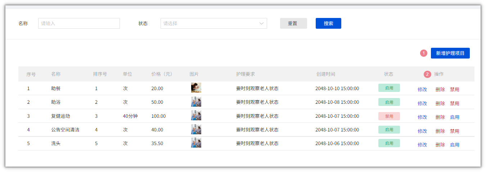

目前使用若依快速代码生成的效果图：

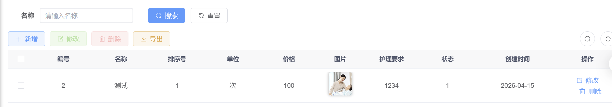

经过我们的对比，有以下几点不同

- 没有序号,多了编号,和复选框

- 创建时间，时间展示格式：`yyyy-MM-dd hh:mm:ss`

- 搜索栏缺少状态条件

- 状态展示为数字，应该展示禁用或启用

- 缺少禁用按钮和功能，删除多余按钮功能

### 1.2.前端代码阅读

找到src/views/nursing/project/index\.vue文件，护理项目的前端代码已经添加了详细的注释，如下：

```vue
<template>
  <div class="app-container">
    <!-- 查询表单 -->
    <el-form :model="queryParams" ref="queryRef" :inline="true" v-show="showSearch" label-width="68px">
      <el-form-item label="名称" prop="name">
        <el-input
          v-model="queryParams.name"
          placeholder="请输入名称"
          clearable
          @keyup.enter="handleQuery"
        />
      </el-form-item>
      <el-form-item>
        <el-button type="primary" icon="Search" @click="handleQuery">搜索</el-button>
        <el-button icon="Refresh" @click="resetQuery">重置</el-button>
      </el-form-item>
    </el-form>

    <!-- 操作按钮区域 -->
    <el-row :gutter="10" class="mb8">
      <el-col :span="1.5">
        <el-button
          type="primary"
          plain
          icon="Plus"
          @click="handleAdd"
          v-hasPermi="['nursing:project:add']"
        >新增</el-button>
      </el-col>
      <el-col :span="1.5">
        <el-button
          type="success"
          plain
          icon="Edit"
          :disabled="single"
          @click="handleUpdate"
          v-hasPermi="['nursing:project:edit']"
        >修改</el-button>
      </el-col>
      <el-col :span="1.5">
        <el-button
          type="danger"
          plain
          icon="Delete"
          :disabled="multiple"
          @click="handleDelete"
          v-hasPermi="['nursing:project:remove']"
        >删除</el-button>
      </el-col>
      <el-col :span="1.5">
        <el-button
          type="warning"
          plain
          icon="Download"
          @click="handleExport"
          v-hasPermi="['nursing:project:export']"
        >导出</el-button>
      </el-col>
      <right-toolbar v-model:showSearch="showSearch" @queryTable="getList"></right-toolbar>
    </el-row>

    <!-- 数据表格 -->
    <el-table v-loading="loading" :data="projectList" @selection-change="handleSelectionChange">
      <el-table-column type="selection" width="55" align="center" />
      <el-table-column label="编号" align="center" prop="id" />
      <el-table-column label="名称" align="center" prop="name" />
      <el-table-column label="排序号" align="center" prop="orderNo" />
      <el-table-column label="单位" align="center" prop="unit" />
      <el-table-column label="价格" align="center" prop="price" />
      <el-table-column label="图片" align="center" prop="image" width="100">
        <template #default="scope">
          <image-preview :src="scope.row.image" :width="50" :height="50"/>
        </template>
      </el-table-column>
      <el-table-column label="护理要求" align="center" prop="nursingRequirement" />
      <el-table-column label="状态" align="center" prop="status" />
      <el-table-column label="操作" align="center" class-name="small-padding fixed-width">
        <template #default="scope">
          <el-button link type="primary" icon="Edit" @click="handleUpdate(scope.row)" v-hasPermi="['nursing:project:edit']">修改</el-button>
          <el-button link type="primary" icon="Delete" @click="handleDelete(scope.row)" v-hasPermi="['nursing:project:remove']">删除</el-button>
        </template>
      </el-table-column>
    </el-table>
    
    <!-- 分页组件 -->
    <pagination
      v-show="total>0"
      :total="total"
      v-model:page="queryParams.pageNum"
      v-model:limit="queryParams.pageSize"
      @pagination="getList"
    />

    <!-- 添加或修改护理项目对话框 -->
    <el-dialog :title="title" v-model="open" width="500px" append-to-body>
      <el-form ref="projectRef" :model="form" :rules="rules" label-width="80px">
        <el-form-item label="名称" prop="name">
          <el-input v-model="form.name" placeholder="请输入名称" />
        </el-form-item>
        <el-form-item label="排序号" prop="orderNo">
          <el-input v-model="form.orderNo" placeholder="请输入排序号" />
        </el-form-item>
        <el-form-item label="单位" prop="unit">
          <el-input v-model="form.unit" placeholder="请输入单位" />
        </el-form-item>
        <el-form-item label="价格" prop="price">
          <el-input v-model="form.price" placeholder="请输入价格" />
        </el-form-item>
        <el-form-item label="图片" prop="image">
          <image-upload v-model="form.image"/>
        </el-form-item>
        <el-form-item label="护理要求" prop="nursingRequirement">
          <el-input v-model="form.nursingRequirement" placeholder="请输入护理要求" />
        </el-form-item>
      </el-form>
      <template #footer>
        <div class="dialog-footer">
          <el-button type="primary" @click="submitForm">确 定</el-button>
          <el-button @click="cancel">取 消</el-button>
        </div>
      </template>
    </el-dialog>
  </div>
</template>

<script setup name="Project">
import { listProject, getProject, delProject, addProject, updateProject } from "@/api/nursing/project";

const { proxy } = getCurrentInstance();

const projectList = ref([]);
const open = ref(false);
const loading = ref(true);
const showSearch = ref(true);
const ids = ref([]);
const single = ref(true);
const multiple = ref(true);
const total = ref(0);
const title = ref("");

const data = reactive({
  form: {},
  queryParams: {
    pageNum: 1,
    pageSize: 10,
    name: null,
    status: null,
  },
  rules: {
  }
});

const { queryParams, form, rules } = toRefs(data);

/** 查询护理项目列表 */
function getList() {
  loading.value = true;
  listProject(queryParams.value).then(response => {
    projectList.value = response.rows;
    total.value = response.total;
    loading.value = false;
  });
}

// 取消按钮
function cancel() {
  open.value = false;
  reset();
}

// 表单重置
function reset() {
  form.value = {
    id: null,
    name: null,
    orderNo: null,
    unit: null,
    price: null,
    image: null,
    nursingRequirement: null,
    status: null,
    createBy: null,
    updateBy: null,
    remark: null,
    createTime: null,
    updateTime: null
  };
  proxy.resetForm("projectRef");
}

/** 搜索按钮操作 */
function handleQuery() {
  queryParams.value.pageNum = 1;
  getList();
}

/** 重置按钮操作 */
function resetQuery() {
  proxy.resetForm("queryRef");
  handleQuery();
}

// 多选框选中数据
function handleSelectionChange(selection) {
  ids.value = selection.map(item => item.id);
  single.value = selection.length != 1;
  multiple.value = !selection.length;
}

/** 新增按钮操作 */
function handleAdd() {
  reset();
  open.value = true;
  title.value = "添加护理项目";
}

/** 修改按钮操作 */
function handleUpdate(row) {
  reset();
  const _id = row.id || ids.value
  getProject(_id).then(response => {
    form.value = response.data;
    open.value = true;
    title.value = "修改护理项目";
  });
}

/** 提交按钮 */
function submitForm() {
  proxy.$refs["projectRef"].validate(valid => {
    if (valid) {
      if (form.value.id != null) {
        updateProject(form.value).then(response => {
          proxy.$modal.msgSuccess("修改成功");
          open.value = false;
          getList();
        });
      } else {
        addProject(form.value).then(response => {
          proxy.$modal.msgSuccess("新增成功");
          open.value = false;
          getList();
        });
      }
    }
  });
}

/** 删除按钮操作 */
function handleDelete(row) {
  const _ids = row.id || ids.value;
  proxy.$modal.confirm('是否确认删除护理项目编号为"' + _ids + '"的数据项？').then(function() {
    return delProject(_ids);
  }).then(() => {
    getList();
    proxy.$modal.msgSuccess("删除成功");
  }).catch(() => {});
}

/** 导出按钮操作 */
function handleExport() {
  proxy.download('nursing/project/export', {
    ...queryParams.value
  }, `project_${new Date().getTime()}.xlsx`)
}

getList();
</script>
```

### 1.3.字段处理\-序号和时间

**序号处理**

目前的代码中，如下代码

```vue
<!-- 数据展示区域 start -->
    <el-table v-loading="loading" :data="projectList" @selection-change="handleSelectionChange">
      <el-table-column type="selection" width="55" align="center" />  <!-- 复选框删除 -->
      <el-table-column label="编号" align="center" prop="id" />  <!-- 是序号不是编号 -->
      <!-- 其他代码略 -->
    </el-table>
<!-- 数据展示区域 end -->
```

目前在页面中展示的编号，接口中对应的字段是id（表中的主键值，并不能保证是连续的）

解决：

在Table表格组件中，提供了提供序号的表格进行展示 自定义索引

参考链接：https://element-plus.org/zh-CN/component/table.html

修改之后的代码：

```vue
<!-- 数据展示区域 start -->
    <el-table v-loading="loading" :data="projectList" @selection-change="handleSelectionChange">
      <el-table-column type="selection" width="55" align="center" />
      <el-table-column label="序号" type="index" align="center" />
      <!-- 其他代码略 -->
    </el-table>
<!-- 数据展示区域 end -->
```

最终效果：

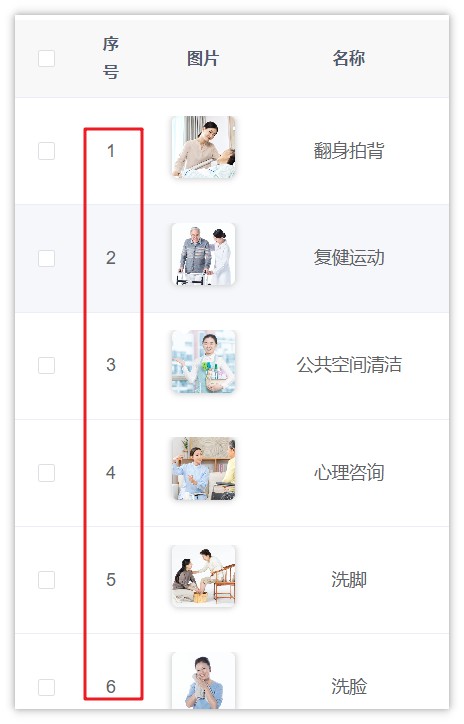

**时间展示处理**

目前的代码：

```vue
<!-- 数据展示区域 start -->
    <el-table v-loading="loading" :data="projectList" @selection-change="handleSelectionChange">
      <el-table-column type="selection" width="55" align="center" />
      <el-table-column label="创建时间" align="center" prop="createTime" width="180">
         <template #default="scope">
           <span>{{ parseTime(scope.row.createTime, '{y}-{m}-{d} {h}:{i}:{s}') }}</span>
         </template>
      </el-table-column>
      <!-- 其他代码略 -->
    </el-table>
<!-- 数据展示区域 end -->
```

很显然，目前在页面中显示就是年月日，我们需要在后边添加参数就可以了

> parseTime方法的作用就是来格式化日期字段的，方法中有两个参数
> 
> - 第一个参数，需要格式化的日期字段
> 
> - 第二个参数，格式化之后字符串展示效果
> 
> 如果想要展示 年月日 时分秒 则可以修改第二个参数：`{y}-{m}-{d} {h}:{i}:{s}`
> 

最终效果：

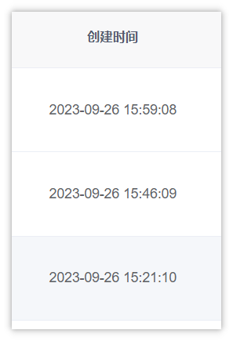

**护理要求展示**

当护理要求内容变多之后，这个表格装不下，可以采用：显示溢出工具提示的表格，连接如下：

显示溢出工具提示的表格

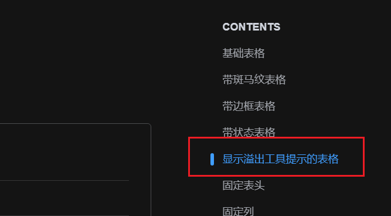

[Table 表格 | Element Plus](https://element-plus.org/zh-CN/component/table#显示溢出工具提示的表格)

修改代码：

```vue
<el-table v-loading="loading" :data="projectList" @selection-change="handleSelectionChange">
  <el-table-column type="index" label="序号" width="55" align="center" />
  <el-table-column label="名称" align="center" prop="name" />
  <el-table-column label="排序号" align="center" prop="orderNo" />
  <el-table-column label="单位" align="center" prop="unit" />
  <el-table-column label="价格" align="center" prop="price" />
  <el-table-column label="图片" align="center" prop="image" width="100">
    <template #default="scope">
      <image-preview :src="scope.row.image" :width="50" :height="50"/>
    </template>
  </el-table-column>
  <el-table-column label="护理要求" align="center" show-overflow-tooltip prop="nursingRequirement" />
</el-table>
```

### 1.4.状态样式调整

目前的状态显示中，都是数值表示，0或者1，我们想要的效果是启用或禁用

在数据展示部分，我们可以对某一个字段使用\<template\>标签来重构某个字段的显示

完成后的代码如下：

```vue
<!-- 数据展示区域 start -->
<el-table v-loading="loading" :data="projectList" @selection-change="handleSelectionChange">
  <el-table-column type="selection" width="55" align="center" />
  <el-table-column label="状态" align="center" prop="status" >
    <template #default="scope">
      <el-tag :type="scope.row.status === 1 ? 'success' : 'danger'">{{ scope.row.status === 1 ? '启用' : '禁用' }}</el-tag>
    </template>
  </el-table-column>
  <!-- 其他代码略... -->
</el-table>
<!-- 数据展示区域 end -->
```

> \<template \#default="scope"\> 这是一个Vue模板插槽的语法。`#default`表示默认插槽，`scope`是作用域参数，通过`scope`可以访问到父组件传递给插槽的任何数据
> 
> scope\.row 代表的是这一行数据
> 
> :type=success \| danger 表示显示不同的样式   success:成功   danger:危险

### 1.5.新增查询条件

在目前的后端代码中已经对状态的条件进行了检索，我们只需要修改前端的代码，在搜索的表单中添加一个新的条件即可。完成后的效果如下：

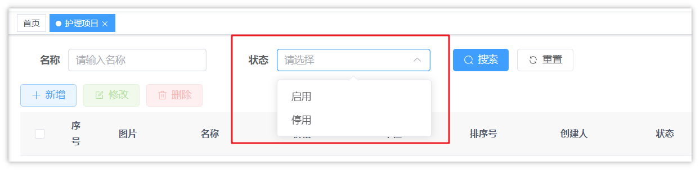

这里需要使用的是下拉选择的组件`<el-select>`

参考链接：https://element-plus.org/zh-CN/component/select.html

完成后的代码：

```vue
<!-- 搜索表单  start -->
<el-form :model="queryParams" ref="queryRef" :inline="true" v-show="showSearch" label-width="68px">
  <el-form-item label="名称" prop="name">
    <el-input v-model="queryParams.name" placeholder="请输入名称" clearable @keyup.enter="handleQuery" />
  </el-form-item>
  <el-form-item label="状态" prop="name">
    <el-select v-model="queryParams.status" placeholder="请选择" clearable>
      <el-option v-for="item in options" :key="item.value" :label="item.label" :value="item.value" />
    </el-select>
  </el-form-item>
  <el-form-item>
    <el-button type="primary" icon="Search" @click="handleQuery">搜索</el-button>
    <el-button icon="Refresh" @click="resetQuery">重置</el-button>
  </el-form-item>
</el-form>
<!-- 搜索表单 end -->

<script setup name="Project">

//下拉选择框的选择项
const options = ref([
  {
    value: 1,
    label: "启用"
  },
  {
    value: 0,
    label: "停用"
  }
])
</script>
```

> 后端需要的状态数据，可以参考已经提供的接口文档
> 
> 选择下拉选择组件之后，选择后的值需要绑定到查询的参数变量queryParams中

### 1.6.禁用功能开发

在目前的操作栏目中，只有两个按钮，分别是修改和删除，我们需要参考这两个按钮，新增一个禁用按钮，并且需要给这个注册方法事件，方便提交数据到后端进行修改

> 注意：我们无需新增后端的禁用接口，可直接使用修改这个接口
> 

新增按钮

```vue
<!-- 数据展示区域 start -->
<el-table v-loading="loading" :data="projectList" @selection-change="handleSelectionChange">
  <el-table-column type="selection" width="55" align="center" />
  <!-- 其他代码略... -->
  <el-table-column label="操作" align="center" class-name="small-padding fixed-width">
    <template #default="scope">
      <el-button link type="primary" icon="Edit" @click="handleUpdate(scope.row)"
        v-hasPermi="['serve:project:edit']">修改</el-button>
      <el-button link type="danger" icon="Delete" @click="handleDelete(scope.row)"
        v-hasPermi="['serve:project:remove']">删除</el-button>
      <el-button link type="primary" :icon="scope.row.status == 0 ? 'Lock' : 'Unlock'" @click="handleEnable(scope.row)" >{{ scope.row.status == 0 ? '启用' : '禁用' }}</el-button>
    </template>
  </el-table-column>
</el-table>
<!-- 数据展示区域 end -->
```

图标组件链接：https://element-plus.org/zh-CN/component/icon.html

按钮中绑定方法handleEnable\(scope\.row\)，调用后端接口

```javascript
//禁用或启用
const handleEnable = (row) => {
  //获取状态
  const status = row.status;
  //提示信息
  const info = status == 0 ? '启用' : '禁用';

  //构建参数
  const param = {
    id : row.id,
    status : status == 0 ? 1 : 0
  }
  //弹窗提示，并发送请求
  proxy.$modal.confirm('是否确认'+info+'护理项目的数据项？').then(function() {
    return updateProject(param);
  }).then(() => {
    getList();
    proxy.$modal.msgSuccess(info+"成功");
  }).catch(() => {});

}
```

最终效果：

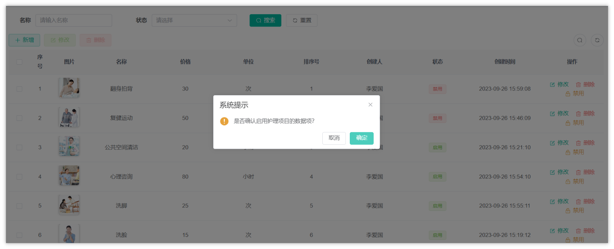

### 1.7.其他调整

如下图：

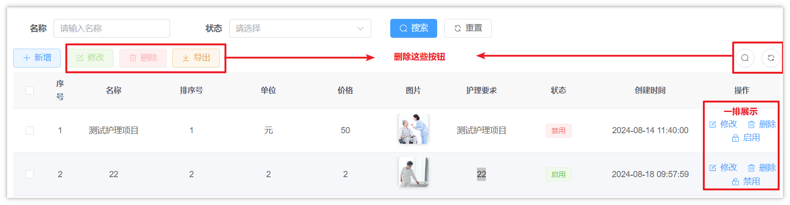

1. 删除一些没用的按钮

2. 其中操作这一栏的按钮需要一排展示（固定展示）

**删除无关按钮**

如下图，把对应的按钮代码注释掉或删除即可

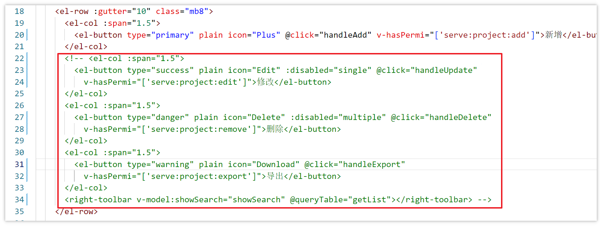

其中的导出的操作，也可以找到对应的handleExport方法，进行注释或删除

**操作列固定展示**

如果想要按钮一排展示，我们还需要参考Element Plus官网文档的Table组件的说明

https://element-plus.org/zh-CN/component/table.html

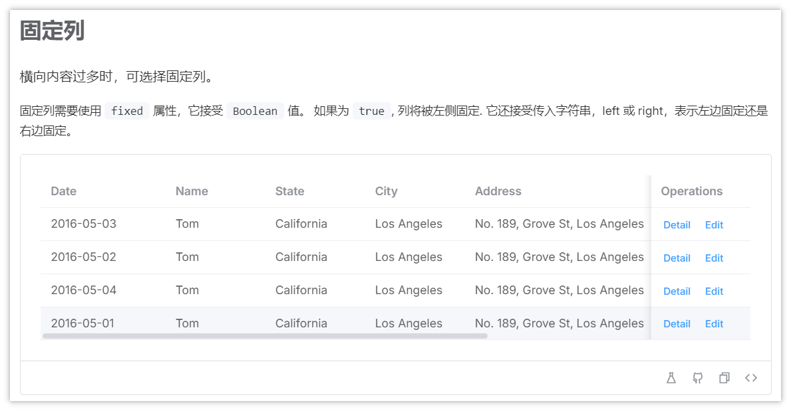

代码修改如下：

```vue
<el-table v-loading="loading" :data="projectList" @selection-change="handleSelectionChange">
      
      <!-- 其他字段省略.... -->
      
      <el-table-column label="操作" fixed="right" width="200" align="center" class-name="small-padding fixed-width">
        <template #default="scope">
          <el-button link type="primary" icon="Edit" @click="handleUpdate(scope.row)"
            v-hasPermi="['serve:project:edit']">修改</el-button>
          <el-button link type="primary" icon="Delete" @click="handleDelete(scope.row)"
            v-hasPermi="['serve:project:remove']">删除</el-button>
          <el-button link type="primary" :icon="scope.row.status == 0 ? 'Lock' : 'Unlock'" @click="handleEnable(scope.row)"
            v-hasPermi="['serve:project:edit']">{{ scope.row.status == 0 ? '启用':'禁用' }}</el-button>
        </template>
      </el-table-column>
    </el-table>
```

fixed  列是否固定在左侧或者右侧。  left \| right

width  对应列的宽度

## 2.数据字典

### 2.1.什么是数据字典

字典管理是用来维护数据类型的数据，如下拉框、单选按钮、复选框、树选择的数据，方便系统管理员维护。主要功能包括：字典分类管理、字典数据管理

> 简单的理解：数据字典就是企业中对一些常量的统一管理
> 

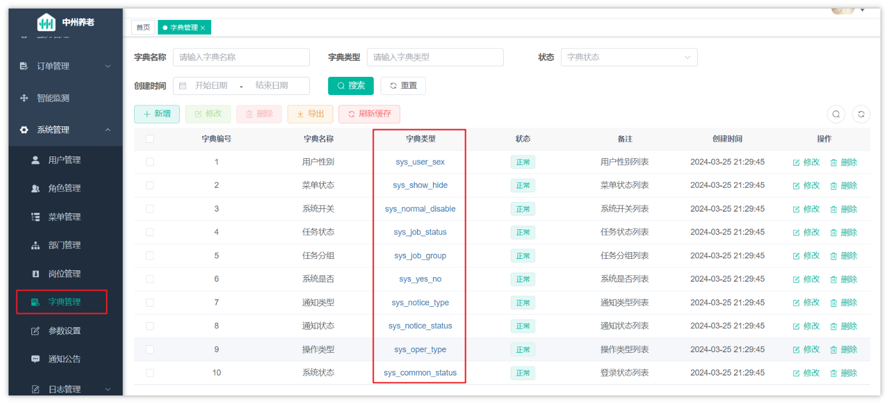

每个字典类型，可能会有多个值，比如，下面是用户性别的字典数据

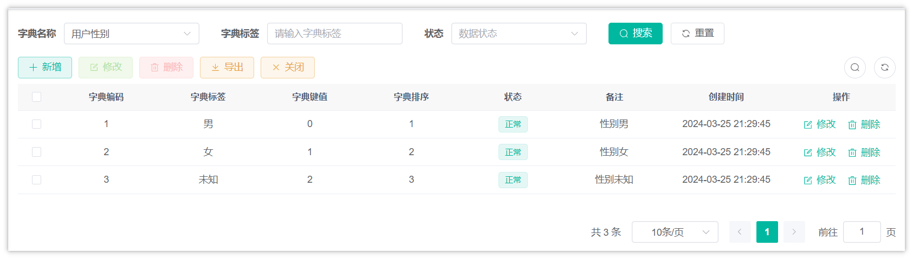

表关系

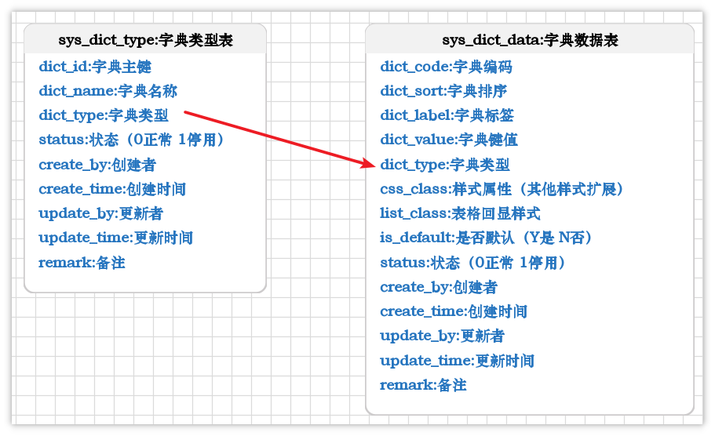

### 2.2.使用方式

在刚刚开发的护理项目中，有一需求就可以使用字典来完成数据的展示，如下图

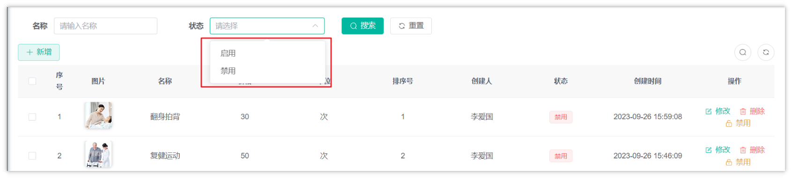

在展示查询条件状态的时候，有两个选项值，目前代码中是写死的内容，我们定义了一个options，如果使用字典可以先定义护理项目的状态，然后在组件中引用字典数据即可。下面是详细的操作步骤。

- 新增字典类型

- 新增字典数据


1.新增数据字典 nursing\_project\_status

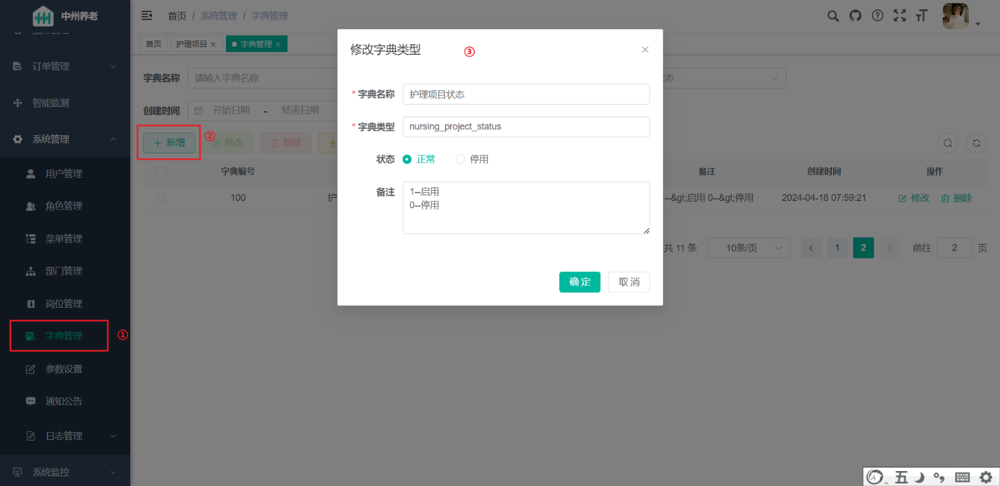

2.新增字典数据

选中字典类型，可以进入字典数据页面，对字典数据进行新增

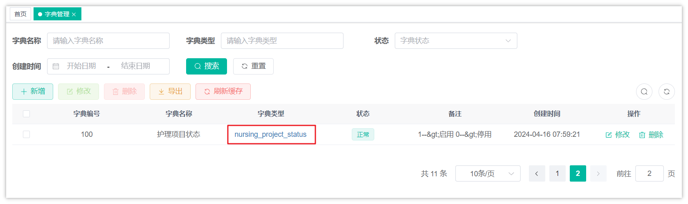

新增字典数据，添加两条数据

- 启用 1

- 禁用 0

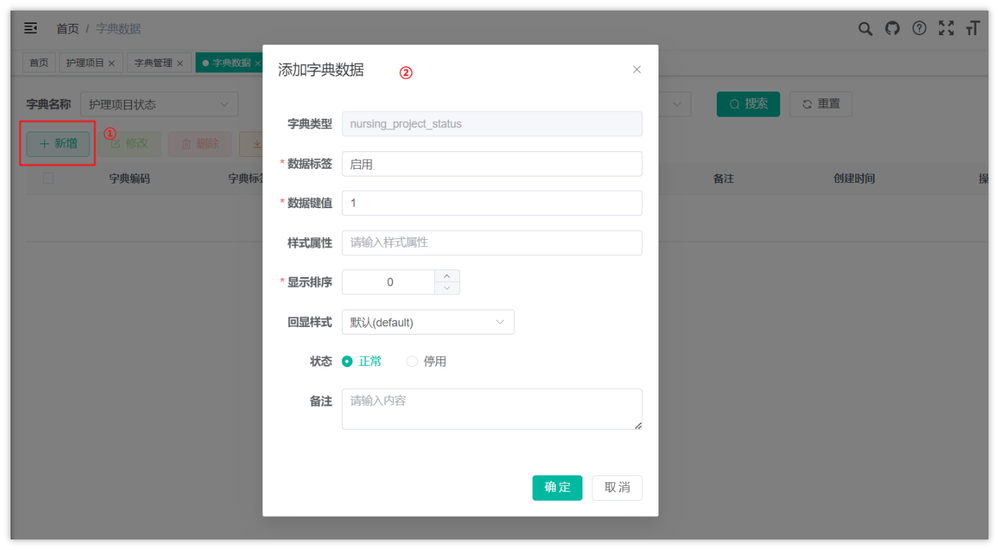

在护理项目的组件中引用字典并使用

```vue
<template>
  <div class="app-container">
    <el-form :model="queryParams" ref="queryRef" :inline="true" v-show="showSearch" label-width="68px">
      <el-form-item label="名称" prop="name">
        <el-input v-model="queryParams.name" placeholder="请输入名称" clearable @keyup.enter="handleQuery" />
      </el-form-item>
      <el-form-item label="状态" prop="name">
        <el-select v-model="queryParams.status" placeholder="请选择" clearable>
          <el-option 
          v-for="item in nursing_project_status" 
          :key="item.value" 
          :label="item.label" 
          :value="item.value" />
        </el-select>
      </el-form-item>
     
      <el-form-item>
        <el-button type="primary" icon="Search" @click="handleQuery">搜索</el-button>
        <el-button icon="Refresh" @click="resetQuery">重置</el-button>
      </el-form-item>
    </el-form>
    <!-- 其他代码略 -->
  </div>
</template>

<script setup name="Project">
import { listProject, getProject, delProject, addProject, updateProject } from "@/api/serve/project";

//获取当前组件的实例
const { proxy } = getCurrentInstance();

//引用数据字典 字段名称和字典类型保持一致
const { nursing_project_status } = proxy.useDict("nursing_project_status");

/* 
const options = ref([
  {
    value: 1,
    label: "启用"
  },
  {
    value: 0,
    label: "停用"
  }
]) */
</script>
```

> 注释掉或删除options 
> 
> 使用proxy调用全局方法useDict,传入字典类型，返回值就是我们想要的数据
> 
> 在el\-option标签中，循环获取字典数据
> 
> 使用数据字典之后，需要重启前端项目

## 3.护理项目\-新增弹窗改造

目前若依框架给提供的新增或修改的弹窗效果如下：

这个很显然不太符合我们的需求

目前生成好的效果

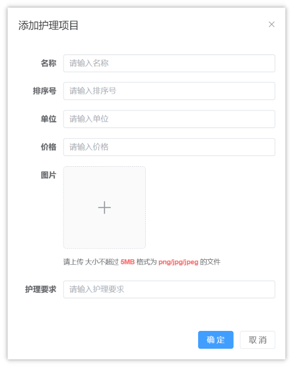

期望达到的效果

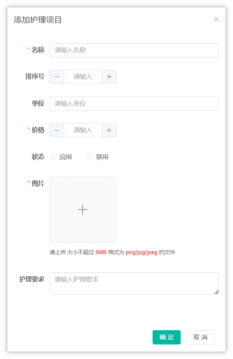

经过对比，需要修复的内容如下：

排序号和价格字段修改为数字输入框

数字输入框  https://element-plus.org/zh-CN/component/input-number.html

新增一个状态字段，这个字段是一个单选框

单选框  https://element-plus.org/zh-CN/component/radio.html

最终的代码，标颜色的部分是修改后的代码：

```vue
<!-- 添加或修改护理项目对话框 -->
<el-dialog :title="title" v-model="open" width="500px" append-to-body>
  <el-form ref="projectRef" :model="form" :rules="rules" label-width="80px">
    <el-form-item label="名称" prop="name">
      <el-input v-model="form.name" placeholder="请输入名称" />
    </el-form-item>

    <el-form-item label="排序号" prop="orderNo">
      <el-input-number v-model="form.orderNo" 
      placeholder="请输入" 
      :min="1" 
      :max="20" />
    </el-form-item>
    <el-form-item label="单位" prop="unit">
      <el-input v-model="form.unit" placeholder="请输入单位" />
    </el-form-item>
    <el-form-item label="价格" prop="price">
      <el-input-number v-model="form.price" 
      placeholder="请输入" 
      :min="1" 
      :max="100" 
      :step="1" />
    </el-form-item>

    <el-form-item label="状态" prop="status">
      <el-radio-group v-model="form.status">
        <el-radio v-for="dict in nursing_project_status" 
        :key="dict.value" 
        :label="dict.value"
        >{{ dict.label}}</el-radio>
      </el-radio-group>
    </el-form-item>

    <el-form-item label="图片" prop="image">
      <image-upload v-model="form.image" />
    </el-form-item>
    <el-form-item label="护理要求" prop="nursingRequirement">
      <el-input v-model="form.nursingRequirement" placeholder="请输入护理要求" type="textarea"/>
    </el-form-item>
  </el-form>
  <template #footer>
    <div class="dialog-footer">
      <el-button type="primary" @click="submitForm">确 定</el-button>
      <el-button @click="cancel">取 消</el-button>
    </div>
  </template>
</el-dialog>
```

## 4.护理项目修改数据回显不全

修改护理项目的index组件，把状态改为字符串类型

```javascript
/** 修改按钮操作 */
function handleUpdate(row) {
  reset();
  const _id = row.id || ids.value
  getProject(_id).then(response => {
    form.value = response.data;
    form.value.status = String(form.value.status)
    open.value = true;
    title.value = "修改护理项目";
  });
}
```

# 三、护理计划功能开发

到目前为止，我们已经完成了一个表的增删改查，并且也做了相应的优化，接下来，我们开始一个新的小模块，跟护理项目相关的模块，护理计划模块的开发

## 1.需求说明

我们打开原型来看：

列表查询

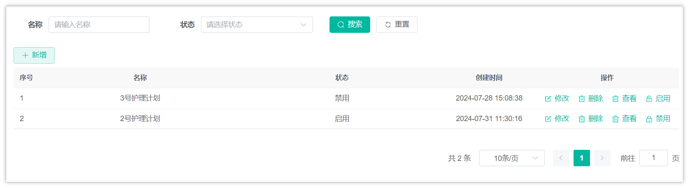

在这个页面中，同时也有一些按钮：新增、修改、删除、查看、禁用

新增或修改的弹窗

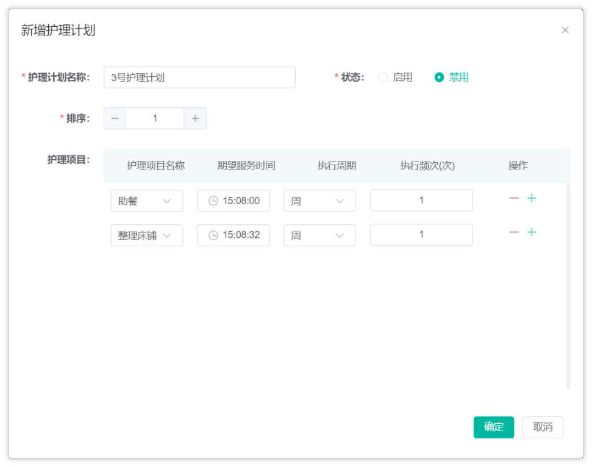

查看详情

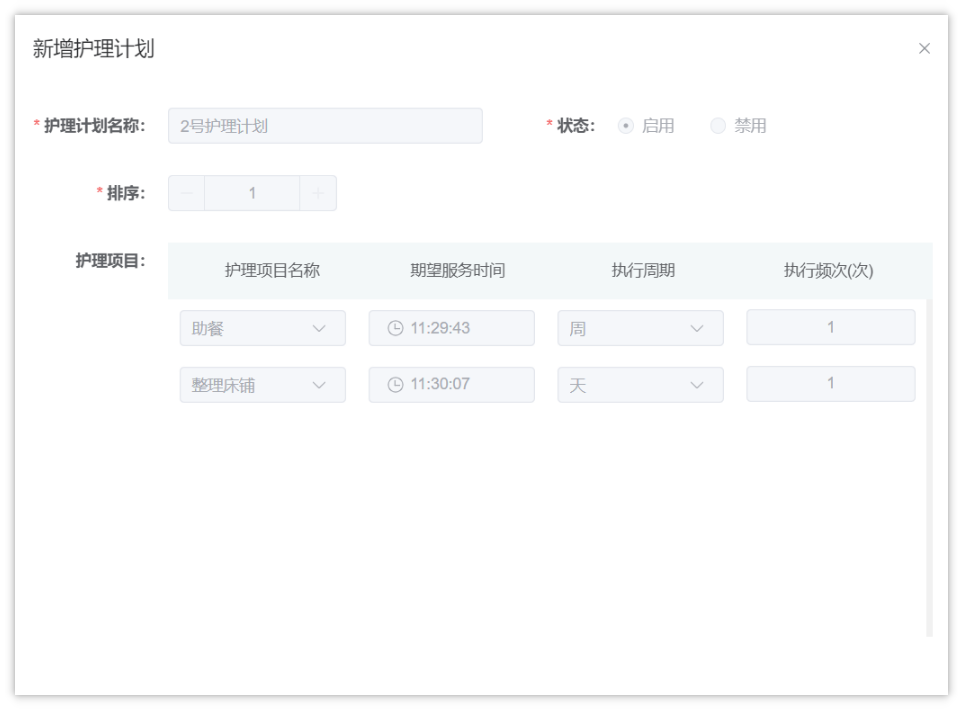

## 2.表关系说明

护理计划与护理项目的关系为多对多，需要有一张中间表nursing\_project\_plan

- 一个护理项目可以被多个护理计划引用

- 一个护理计划中也可以引用多个护理项目

- 具体的表关系，如下图：

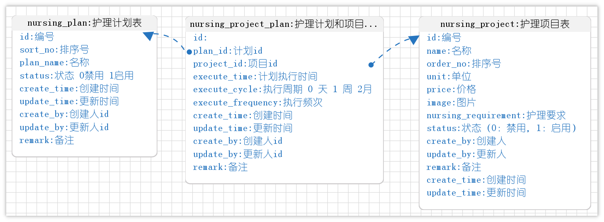

> 需求
>
> 服务管理：护理项目、护理计划、护理等级
>
> 后期给老人选配使用的，老人办理入住，要根据老人的健康情况、年龄推荐配置（护理等级）
>
> 不同的护理等级所关联的计划是不一样的，不同的计划，价格是不同的，服务也不一样
>

## 3.接口说明

详细的接口文档，请查看：[附录-接口文档 ](https://lining-lo.github.io/lining-lo-notes/星海智伴/附录-接口文档.html)

## 4.功能实现

### 4.1.准备工作

在第一天中，我们已经使用若依框架完成了护理计划和护理等级相关的代码生成，但是生成的代码并不能完全符合我们的业务需求，所以我们需要在生成代码的基础上进行改造

> 后期的开发套路也都差不多，都是对生成之后的代码进行改造
>

改造分为了两部分，分别是前端代码和后端代码。在护理计划这个模块，大家重点开发改造后端的代码

**前端代码准备**

前端代码可以使用当天资料中提供好的代码：

在这个文件夹中，包含了2个文件，大家需要拷贝到前端的对应目录下：

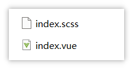

1.拷贝index\.scss和index\.vue到之前护理计划所对应的目录下，替换掉之前的

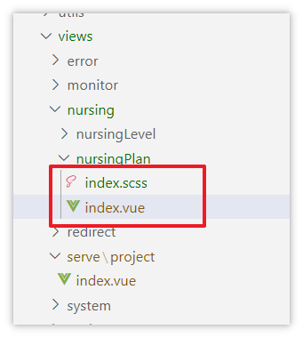

特别注意：在nursingPlan\.js文件中，定义了后端接口的路径，要保证与后端一致（如与自己的后端不一致，需要进行修正）

2.在@/api/nursing/project\.js中新增一个接口，查询所有的护理项目（一会会开发这个接口）

```javascript
//查询所有护理项目
export function getProjectAll() {
  return request({
    url: '/nursing/project/all',
    method: 'get'
  })
}
```

2.在src/assets/styles/variables\.mudule\.scss文件中添加一个颜色引用

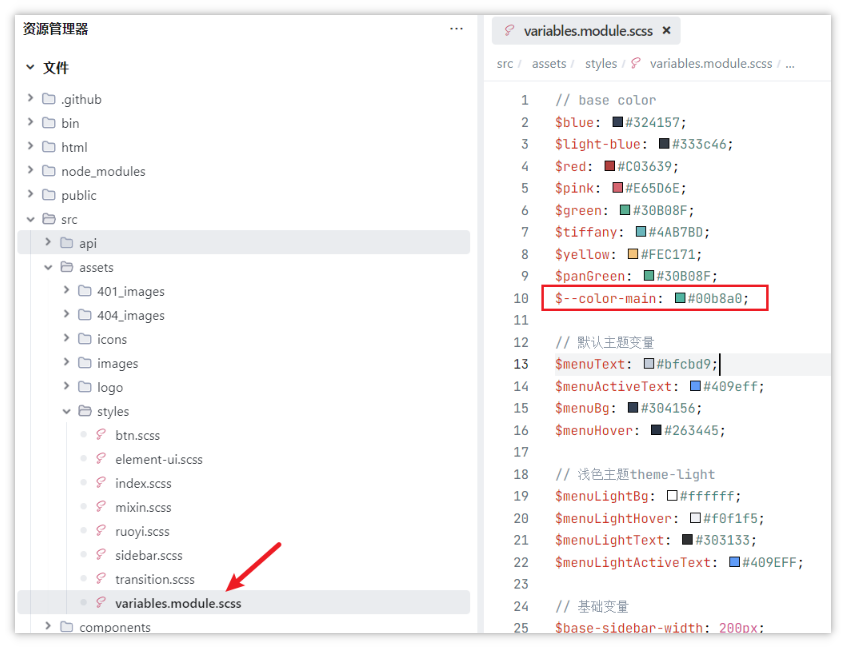

```css
$--color-main: #00b8a0;
```

集成之后，报错属于正常现象，因为还没有提供后端的接口

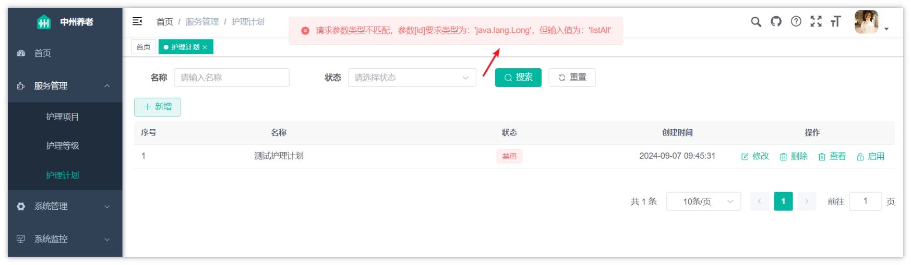

**后端代码准备**

在这个模块需要操作两张表，分别是：

- 护理计划表（nursing\_plan）  该表的代码已生成（之前已完成）

- 护理项目计划关系表\(nursing\_project\_plan\)  该表的代码需要生成部分（实体类、mapper相关）

1.打开后台管理系统，找到代码生成的菜单，导入nursing\_project\_plan表，然后直接预览，如下图

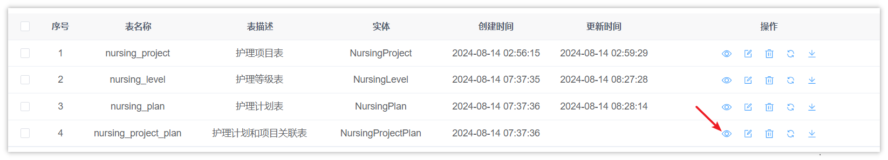

2.拷贝内容如下图所示（实体类和mapper相关）

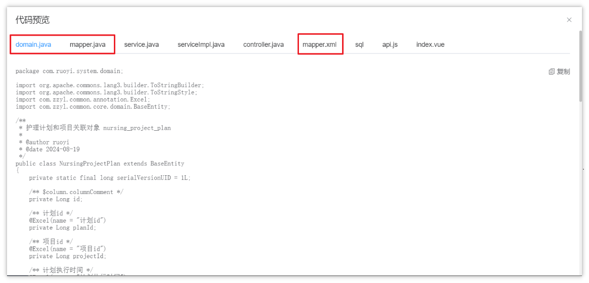

拷贝到项目中，如下：

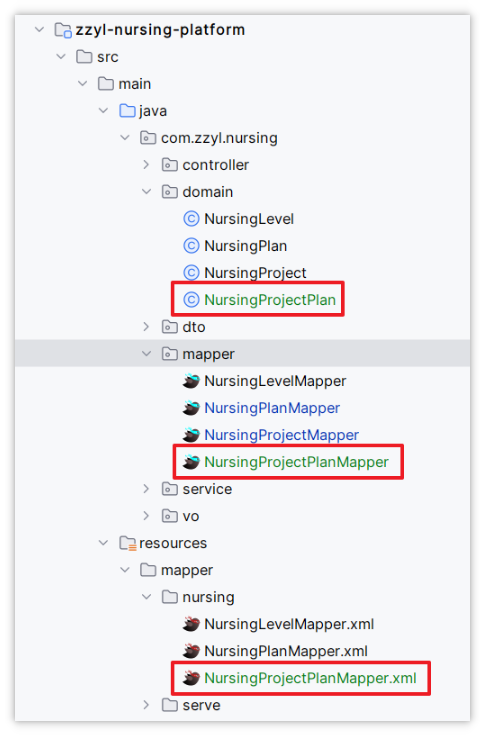

### 4.2.创建护理计划数据字典

在护理计划列表中，有一个状态选项，目前用的就是在数据字典 nursing\_plan\_status，效果如下：

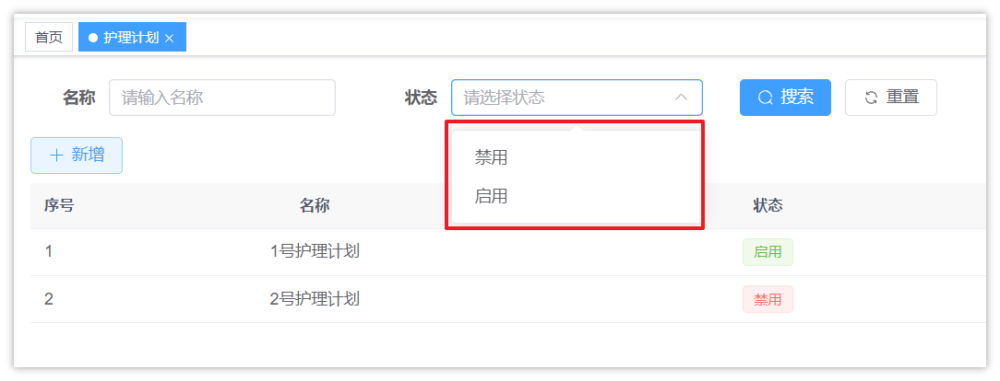

在系统管理/字典管理菜单中定义新的数据字典，详细定义如下：

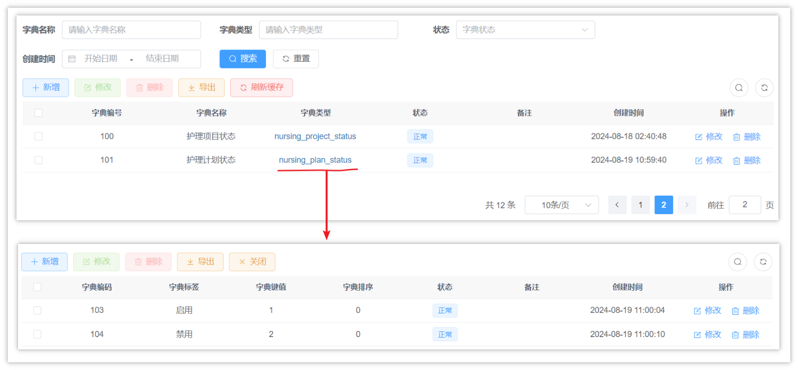

### 4.3.查询所有护理项目

在新增计划中，需要选择关联护理项目的列表，如下图

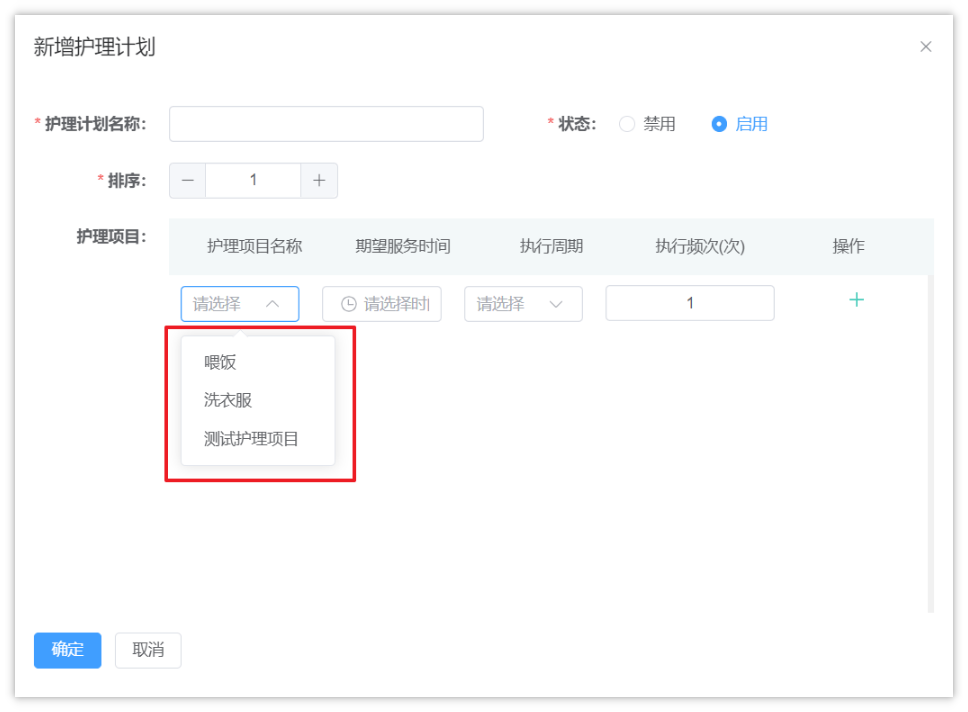

这个需要在护理项目的模块中定义一个查询的接口来查询所有的护理项目进行展示（需要结合接口文档中的定义）

1.控制层

在NursingProjectController中定义新的方法，如下：

```java
/**
 * 查询护理项目列表
 */
@GetMapping("/all")
public AjaxResult listAll()
{
    List<NursingProjectVo> list = nursingProjectService.selectAll();
    return success(list);
}
```

NursingProjectVo

> vo即“Value Object”的缩写，通常用于封装数据，便于数据的传输和访问。
>
> 使用“vo”作为方法返回值的命名后缀，主要目的是明确该方法返回一个值对象，而不是一个实体（Entity）或者数据访问对象（DAO）等。这样做的好处包括：
>
> 1.提高代码的可读性：其他开发者在阅读代码时，可以快速理解该方法返回一个值对象，而不是其他类型的对象。
>
> 2.明确对象的用途：值对象通常用于封装数据，以便在应用程序的不同部分之间传输。通过命名约定，可以清晰地表明这些对象的用途。
>
> 3.促进代码的一致性：在团队开发中，遵循共同的命名约定有助于保持代码的一致性，使得代码更易于维护和扩展。

依据接口文档中定义的返回值，该Vo具体的内容如下：

```java
package com.xhzb.nursing.domain.vo;

import lombok.Data;

@Data
public class NursingProjectVo {

    /**
     * 项目名称
     */
    private String label;

    /**
     * 项目ID
     */
    private String value;
}
```

项目中并没有添加lombok的依赖，可以在`xhzb-common`中添加如下依赖

```xml
<dependency>
    <groupId>org.projectlombok</groupId>
    <artifactId>lombok</artifactId>
    <version>1.18.38</version>
</dependency>
```

2.业务层

在INursingProjectService定义新的方法，如下：

```java
/**
 * 查询所有护理项目
 * @return
 */
List<NursingProjectVo> selectAll();
```

对应的实现方法：

```java
/**
 * 查询所有护理项目
 * @return
 */
@Override
public List<NursingProjectVo> selectAll() {
    return nursingProjectMapper.selectAll();
}
```

3.持久层

在NursingProjectMapper中定义新的方法，注意sql的返回值，要与接口文档中保持一致，如下：

```java
@Select("select id value,name label from nursing_project where status = 1 ")
List<NursingProjectVo> selectAll();
```

4.测试

重启服务，点击新增护理计划，检查是否能查看到所有的护理项目列表

### 4.4.新增

1.实现思路

接收到前端的参数包含了两部分内容，分别是：

- 护理计划相关的数据

- 护理计划绑定的护理项目列表（需要保存到nursing\_project\_plan中间表中）

- 由于涉及到了多张表操作，需要让多次数据库操作处于同一个事务下（保证数据一致性）

- 整体的处理逻辑如下：

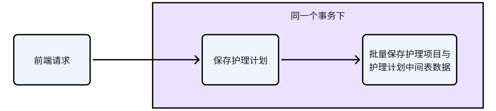

2.控制层

在NursingPlanController中修改add方法，按照接口定义的参数来创建对应的Dto参数，如下：

```java
/**
 * 新增护理计划
 */
@PreAuthorize("@ss.hasPermi('nursing:nursingPlan:add')")
@Log(title = "护理计划", businessType = BusinessType.INSERT)
@PostMapping
public AjaxResult add(@RequestBody NursingPlanDto dto)
{
    return toAjax(nursingPlanService.insertNursingPlan(dto));
}
```

NursingPlanDto

> DTO（Data Transfer Object）用于封装数据，以便在不同的软件应用程序之间传输，是一种开发规范
>

根据接口文档中参数的定义，类的内容如下：

```java
package com.xhzb.nursing.domain.dto;

import com.xhzb.nursing.domain.NursingProjectPlan;
import lombok.Data;

import java.util.List;

@Data
public class NursingPlanDto {


    private Long id;

    /**
     * 排序号
     */
    private Integer sortNo;

    /**
     * 计划名称
     */
    private String planName;

    /**
     * 状态（0：禁用，1：启用）
     */
    private Integer status;

    /**
     * 护理计划关联项目列表
     */
    List<NursingProjectPlanDto> projectPlans;
}
```

NursingProjectPlanDto 

```Java
package com.xhzb.nursing.domain.dto;

import com.xhzb.common.annotation.Excel;
import lombok.Data;

import java.util.Date;

@Data
public class NursingProjectPlanDto {

    /** $column.columnComment */
    private Long id;

    /** 计划id */
    private Long planId;

    /** 项目id */
    private Long projectId;

    /** 计划执行时间 */
    private String executeTime;

    /** 执行周期 0 天 1 周 2月 */
    private Long executeCycle;

    /** 执行频次 */
    private Long executeFrequency;

    /**
     * 创建时间
     */
    private Date createTime;
}
```

3.业务层

修改INursingPlanService中的insertNursingPlan方法，修改其参数，详细如下：

```java
/**
 * 新增护理计划
 * 
 * @param dto 护理计划
 * @return 结果
 */
public int insertNursingPlan(NursingPlanDto dto);
```

修改对应的实现类：

```java
/**
 * 新增护理计划
 * 
 * @param dto 护理计划
 * @return 结果
 */
@Transactional
@Override
public int insertNursingPlan(NursingPlanDto dto)
{
    // 保存护理计划
    NursingPlan nursingPlan = new NursingPlan();
    BeanUtils.copyProperties(dto,nursingPlan);
    nursingPlan.setCreateTime(DateUtils.getNowDate());
    nursingPlanMapper.insertNursingPlan(nursingPlan);

    //保存护理项目计划中间关系数据
    if(dto.getProjectPlans() != null && !dto.getProjectPlans().isEmpty()){
        dto.getProjectPlans().forEach(projectPlan -> {
            projectPlan.setPlanId(nursingPlan.getId());
            projectPlan.setCreateTime(DateUtils.getNowDate());
        });
        //批量保存
        return nursingProjectPlanMapper.batchInsert(dto.getProjectPlans());
    }
    return 0;
}
```

> 代码说明
>
> 1.`BeanUtils.`*`copyProperties`*`(dto,nursingPlan);`
>
> 含义是使用`BeanUtils`工具类将`dto`对象中的属性值拷贝到nursingPlan对象中，要求就是属性名和类型必须相同
>
> 2.在当前方法上添加了一个`@Transactional`，保存方法内的多个表操作具备事务的特性，这个注解也可以定义在类上，表示当前类中的所有方法，都具备事务特性

4.持久层

我们需要在NursingProjectPlanMapper中提供一个批量插入的方法，代码如下：

```java
int batchInsert(List<NursingProjectPlanDto> projectPlans);
```

对应的xml映射文件

```xml
<insert id="batchInsert">
    insert into nursing_project_plan (plan_id, project_id, execute_time, execute_cycle, execute_frequency, create_time) values
    <foreach collection="projectPlans" item="item" separator=",">
        (#{item.planId}, #{item.projectId}, #{item.executeTime}, #{item.executeCycle}, #{item.executeFrequency}, #{item.createTime})
    </foreach>

</insert>
```

### 4.5.根据id查询护理计划

1.思路说明

在修改护理计划或者是查看护理计划的时候，都需要查询护理计划的详细数据，并且这里面需要包含两部分内容，分别是，护理计划和护理计划关联的护理项目数据


2.控制层

无需改动

3.业务层

修改INursingPlanService中的selectNursingPlanById，定义符合接口规范的返回值

```java
/**
 * 查询护理计划
 * 
 * @param id 护理计划主键
 * @return 护理计划
 */
public NursingPlanVo selectNursingPlanById(Long id);
```

NursingPlanVo 

```java
package com.xhzb.nursing.domain.vo;

import com.xhzb.nursing.domain.NursingProjectPlan;
import lombok.Data;

import java.util.List;

@Data
public class NursingPlanVo {

    /**
     * 护理计划id
     */
    private Long id;

    /**
     * 排序号
     */
    private Integer sortNo;

    /**
     * 护理计划名称
     */
    private String planName;

    /**
     * 护理计划状态
     */
    private Integer status;

    List<NursingProjectPlanVo> projectPlans;

}
```

NursingProjectPlanVo 这个类就是把projectId改为了字符串类型，方便前端回显

```java
package com.xhzb.nursing.domain.vo;

import com.xhzb.common.annotation.Excel;
import lombok.Data;

@Data
public class NursingProjectPlanVo {

    /** 项目id */
    private String projectId;

    /** $column.columnComment */
    private Long id;

    /** 计划id */
    @Excel(name = "计划id")
    private Long planId;

    /** 计划执行时间 */
    @Excel(name = "计划执行时间")
    private String executeTime;

    /** 执行周期 0 天 1 周 2月 */
    @Excel(name = "执行周期 0 天 1 周 2月")
    private Long executeCycle;

    /** 执行频次 */
    @Excel(name = "执行频次")
    private Long executeFrequency;
}
```

修改其实现方法返回值，以及详细的实现逻辑如下：

```java
/**
 * 查询护理计划
 * 
 * @param id 护理计划主键
 * @return 护理计划
 */
@Override
public NursingPlanVo selectNursingPlanById(Long id)
{
    //查询护理计划
    NursingPlan nursingPlan = nursingPlanMapper.selectNursingPlanById(id);
    NursingPlanVo nursingPlanVo = new NursingPlanVo();
    BeanUtils.copyProperties(nursingPlan,nursingPlanVo);

    //根据护理计划ID查询护理项目的关系
    List<NursingProjectPlanVo> list = nursingProjectPlanMapper.selectByPlanId(id);
    nursingPlanVo.setProjectPlans(list);

    return nursingPlanVo;
}
```

4.持久层

在NursingProjectPlanMapper提供定义按照护理计划ID查询列表的方法，如下

```java
List<NursingProjectPlanVo> selectByPlanId(Long id);
```

对应的映射文件：

```xml
<resultMap type="com.xhzb.nursing.domain.NursingProjectPlanVo" id="NursingProjectPlanVoResult">
        <result property="id" column="id"/>
        <result property="planId" column="plan_id"/>
        <result property="projectId" column="project_id"/>
        <result property="executeTime" column="execute_time"/>
        <result property="executeCycle" column="execute_cycle"/>
        <result property="executeFrequency" column="execute_frequency"/>
    </resultMap>

    <select id="selectByPlanId" resultMap="NursingProjectPlanVoResult">
        <include refid="selectNursingProjectPlanVo"/>
        where plan_id = #{planId}
    </select>
```

`include `标签是引入其他SQL片段

`resultMap `是返回值的结果映射

### 4.6.修改

实现思路

当修改的时候，也是操作两种表，基本的思路是如下图：

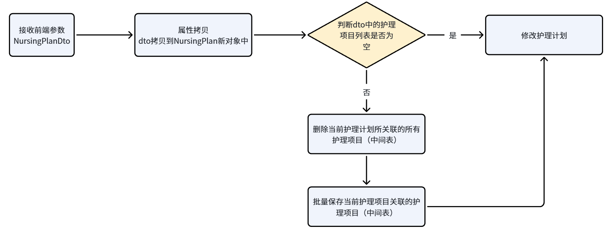

### 4.7.删除

实现思路

当删除的时候，也是操作两种表，基本的思路是如下图：


# 四、微实战\-护理等级

## 1.需求说明

下图是需要实现后的护理等级查询列表

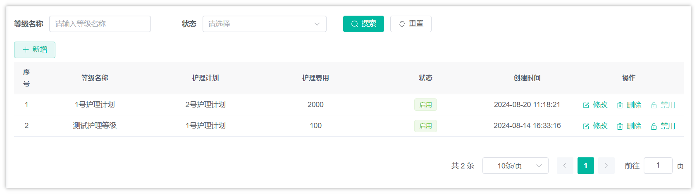

在这个列表中有一些按钮：新增、修改、删除、启用\|禁用

下图是新增和修改的弹窗，其中的护理计划是一个下拉列表

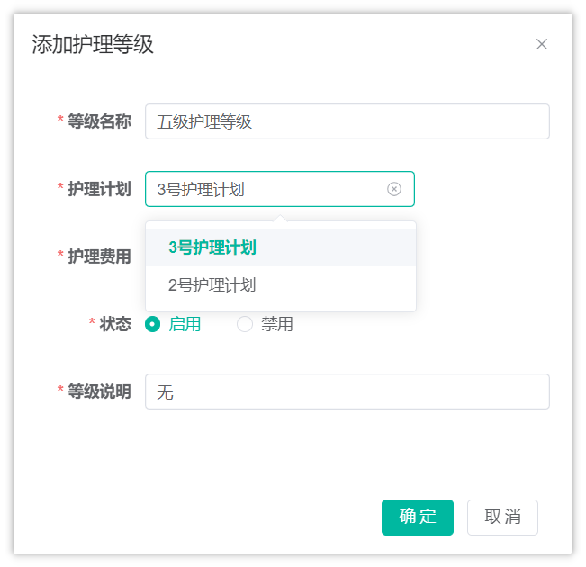

下拉框组件：https://element-plus.org/zh-CN/component/select.html

## 2.要求

请利用自己开发护理项目和护理计划的经验来开发护理等级模块。

重点提示：

- 读懂需求是首要任务

- 熟悉表中每一个字段含义是根本

- 一定要结合接口文档

## 3.提示

服务管理共有4张表
