# 一、目标

- 熟悉人工智能发展并了解其原理
- 能够独立使用ollama部署本地模型
- 能够掌握如何开通第三方模型并熟悉调用规范
- 能够完成SpringAI的快速入门案例
- 能够使用SpringAI对多个大模型平台进行对接
- 能够掌握SpringAI中的Tool Calling的原理并实现案例
- 能够完成与大模型会话记忆功能
- 能够完成与大模型对话的历史记录功能

# 二、人工智能概述

## 1.人工智能发展

AI，人工智能（Artificial Intelligence），使机器能够像人类一样思考、学习和解决问题的技术。

AI发展至今大概可以分为三个阶段：

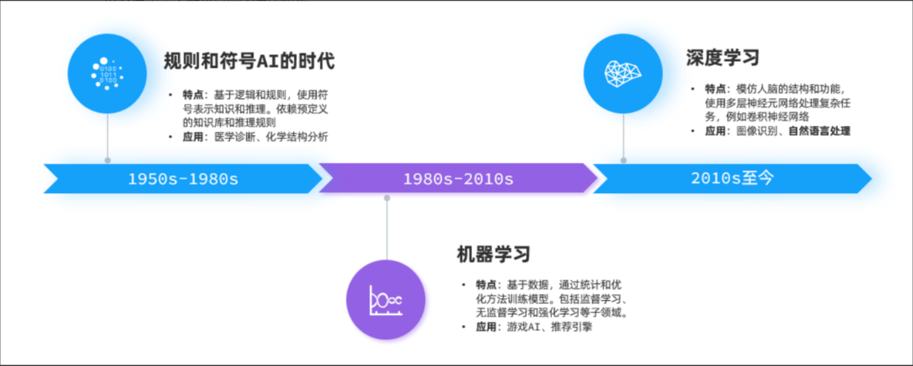

其中，深度学习领域的自然语言处理\(Natural Language Processing, NLP\)有一个关键技术叫做Transformer，这是一种由多层感知机组成的神经网络模型，是现如今AI高速发展的最主要原因。

我们所熟知的大模型（Large Language Models, LLM），例如GPT、DeepSeek底层都是采用Transformer神经网络模型。

以GPT模型为例，其三个字母的缩写分别是Generative、Pre\-trained、Transformer：

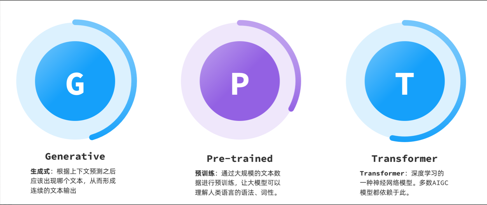

那么问题来， Transformer神经网络有什么神奇的地方，可以实现如此强大的能力呢？

## 2.大模型原理

大模型 = 通过海量数据训练出的“超级自动补全工具”，核心能力是根据输入内容预测下一个词。

核心原理拆解：

1.底层架构：Transformer（积木块结构）

核心组件：自注意力机制（Self\-Attention）

作用：让模型像人类一样，自动关注输入内容中哪些词更重要

> 例句：小猫追着蝴蝶，它跑得很快
> 
> 问：它指的是谁？
> 

人脑：一眼就锁定小猫，无视蝴蝶，这就是注意力

Transformer 同理：给每个字打分，重点字权重拉高，无关字弱化，精准找指代、找关联。

2.训练过程：

预训练：用全网文本（书籍/网页等）学习语言规律，建立“知识库”。

例：输入“天空是\_\_”，模型学习预测“蓝色”。

微调：用特定任务数据（如对话/问答）调整模型，让它更“听话”。

3.运行本质：概率

每次输出一个词时，模型计算所有可能词的概率，选择最高概率的词（或随机选高概率词增加多样性）。

例：输入“The boy went to the”，模型可能输出“Cafe”（概率0\.1）、“Hospital”（0\.05）、“Playground”（0\.4）、“Park”（0\.15）、“School”（0\.3）。

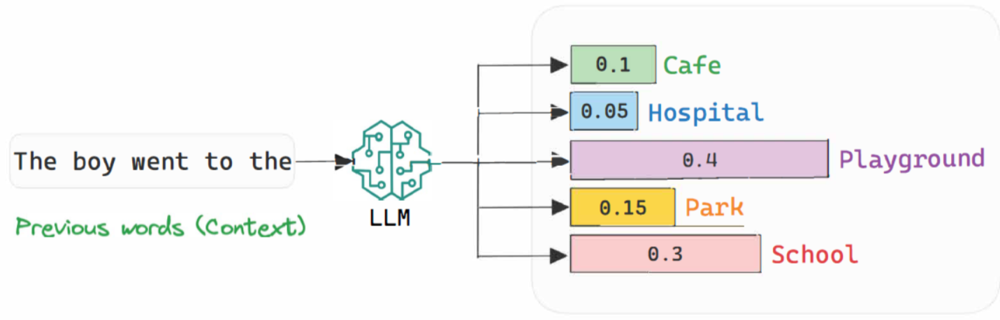

大模型输出时，会选择概率值最高的词，最终会输出：The boy went to the Playground（男孩去了游乐场）

这里的概率，是指[条件概率](https://baike.baidu.com/item/条件概率/4475278)，也就是说，【游乐场】是【男孩去的地方】概率0.4 

> 大模型正是因为依据概率回答，所以会存在“AI幻觉”，也就是所谓的“胡说八道”。所以，对于大模型生成的数据，需要进行优化数据、加入人工审核、提醒用户自行验证等。
> 

相信大家肯定会有疑问：

> 什么是大模型应用开发呢？
> 
> 跟传统的Java应用开发又有什么区别呢？
> 
> 我们该如何去开发大模型应用呢？

别着急，本章我们就一起来分析一下。

# 三、模型部署（ollama本地部署）

很多云平台都提供了一键部署大模型的功能，这里不再赘述。我们重点讲讲如何手动部署大模型。

手动部署最简单的方式就是使用Ollama，这是一个帮助你部署和运行大模型的工具。官网如下：

[https://ollama\.com/](https://ollama.com/)

> Ollama：是一款旨在简化大型语言模型本地部署和运行过程的开源软件。
> 
> 中文名：羊驼
> 

`Ollama`提供了一个轻量级、易于扩展的框架，让开发者能够在本地机器上轻松构建和管理LLMs（大型语言模型）。通过`Ollama`，开发者可以访问和运行一系列预构建的模型，或者导入和定制自己的模型，无需关注复杂的底层实现细节。

## 1.下载安装ollama

首先，我们需要下载一个Ollama的客户端，在官网提供了各种不同版本的Ollama，大家可以根据自己的需要下载。

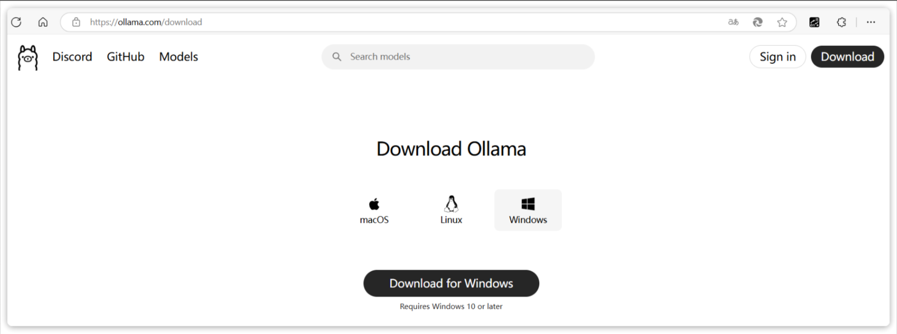

下载后双击即可安装，这里不再赘述。

> 注意：
>
> Ollama默认安装目录是C盘的用户目录，如果不希望安装在C盘的话（其实C盘如果足够大放C盘也没事），就不能直接双击安装了。需要通过命令行安装。
>

命令行安装方式如下：

在OllamaSetup\.exe所在目录打开cmd命令行，然后命令如下： 

更换成自己的文件夹路径

```Bash
OllamaSetup.exe /DIR=D:\software\office\ollama
```

OK，安装完成后，还需要配置一个环境变量，更改Ollama下载和部署模型的位置。环境变量如下：

更换成自己的文件夹路径

```Bash
OLLAMA_MODELS=D:\software\office\ollama_models
```

环境变量配置方式相信学过Java的都知道，这里不再赘述，配置完成如图：

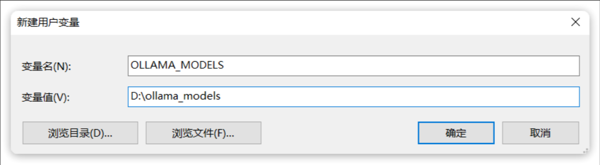

## 2.搜索模型

ollama是一个模型管理工具和平台，它提供了很多国内外常见的模型，我们可以在其官网上搜索自己需要的模型：[https://ollama.com/search](https://ollama.com/search)

如图

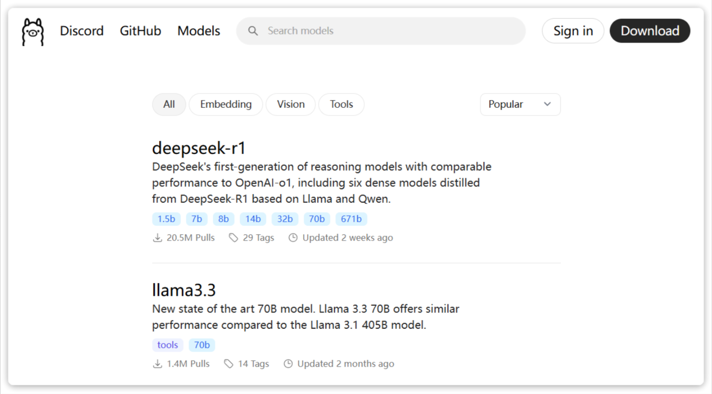

点击进入deepseek\-r1页面，会发现deepseek\-r1也有很多版本：

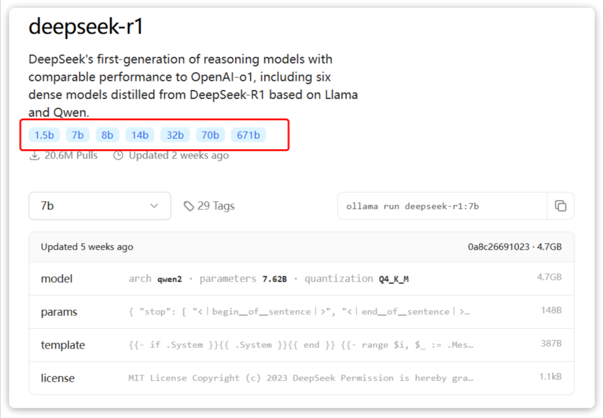

这些就是模型的参数大小，越大推理能力就越强，需要的算力也越高。671b版本就是最强的满血版deepseek\-r1了。需要注意的是，Ollama提供的DeepSeek是量化压缩版本，对比官网的蒸馏版会更小，对显卡要求更低。对比如下：

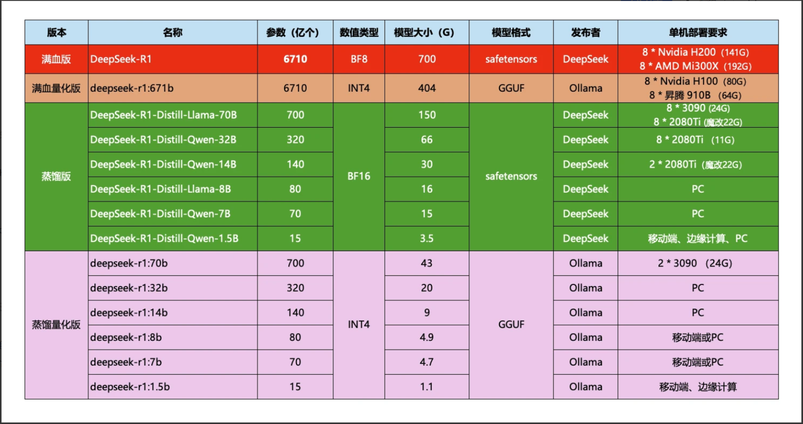

比如，我的电脑内存32G，显存是8G，我选择部署的是7b的模型，当然8b也是可以的，差别不大，都是可以流畅运行的。

## 3.运行模型

新版本提供了操作界面，打开选择合适的模型即可使用

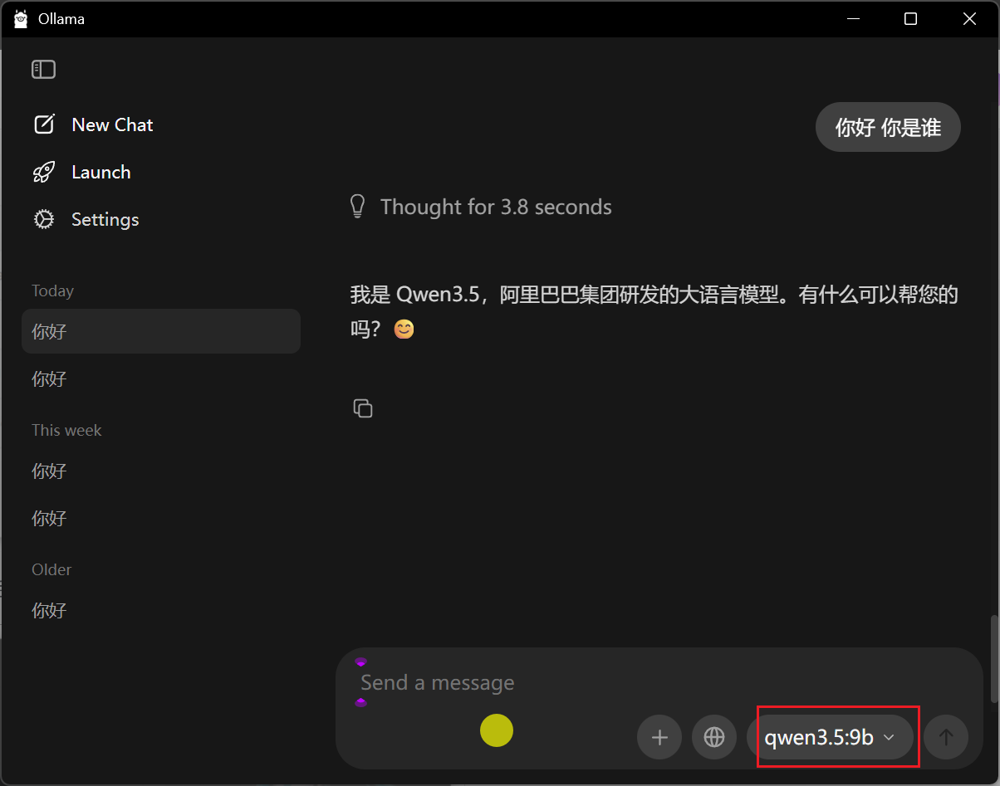

或者使用ollama给出的运行模型的命令：

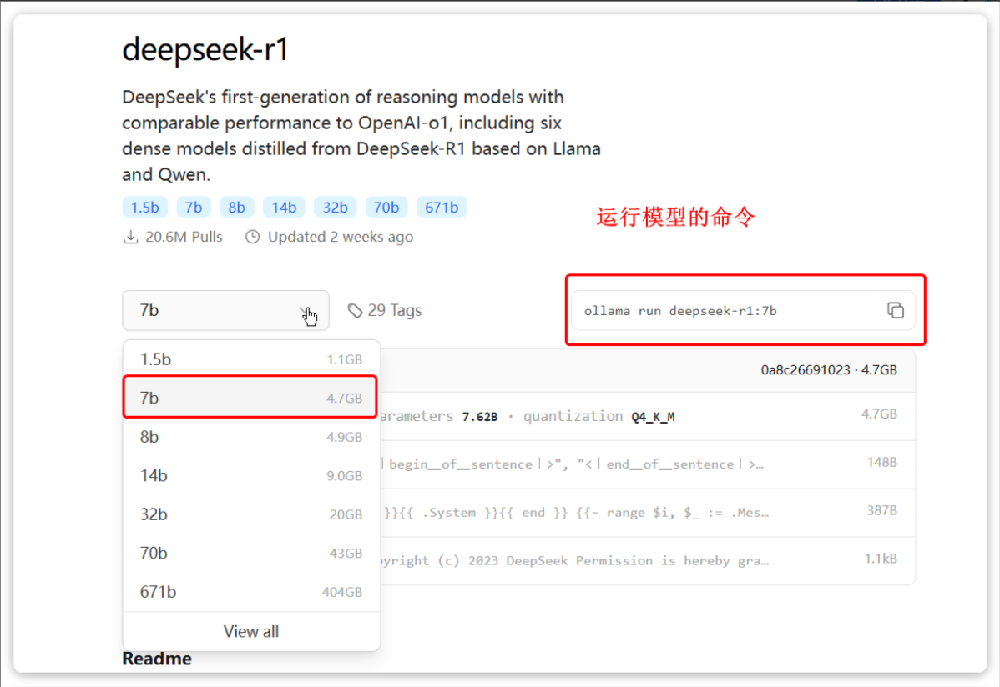

复制这个命令，然后打开一个cmd命令行，运行命令即可，然后你就可以跟本地模型聊天了：

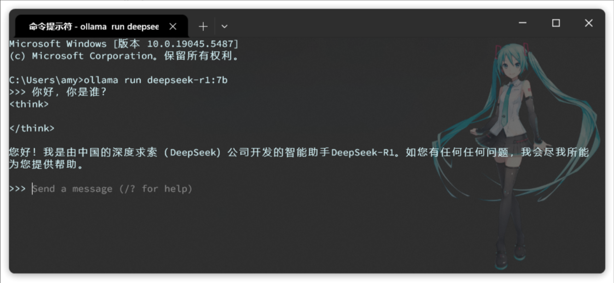

> 注意：
>
> 首次运行命令需要下载模型，根据模型大小不同下载时长在5分钟\~1小时不等，请耐心等待下载完成。
>
> ollama控制台是一个封装好的AI对话产品，与ChatGPT类似，具备会话记忆功能。

Ollama是一个模型管理工具，有点像Docker，而且命令也很像，比如：

```Bash
  ollama serve      # Start ollama
  ollama create     # Create a model from a Modelfile
  ollama show       # Show information for a model
  ollama run        # Run a model
  ollama stop       # Stop a running model
  ollama pull       # Pull a model from a registry
  ollama push       # Push a model to a registry
  ollama list       # List models
  ollama ps         # List running models
  ollama cp         # Copy a model
  ollama rm         # Remove a model
  ollama help       # Help about any command
```

# 四、调用大模型

## 1.阿里云百炼模型

### 1.1.注册账号

首先，我们需要注册一个阿里云账号：[阿里云登录页](https://account.aliyun.com/)

然后访问百炼平台，开通服务：[大模型服务平台百炼](https://www.aliyun.com/product/bailian?spm=5176.29677750.nav-v2-dropdown-menu-1.d_main_0_6.6b44154amuN66a&scm=20140722.M_sfm.P_197.ID_sfm-OR_rec-V_1-MO_3480-ST_12892)

首次开通应该会赠送百万token的使用权，包括DeepSeek\-R1模型、qwen模型。

### 1.2.申请API\_KEY

注册账号以后还需要申请一个API\_KEY才能访问百炼平台的大模型。

在阿里云百炼平台的右上角，鼠标悬停在用户图标上，可以看到下拉菜单：

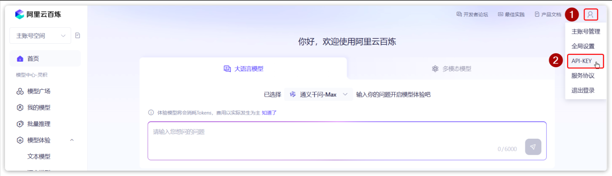

选择`API-KEY`，进入`API-KEY`管理页面：

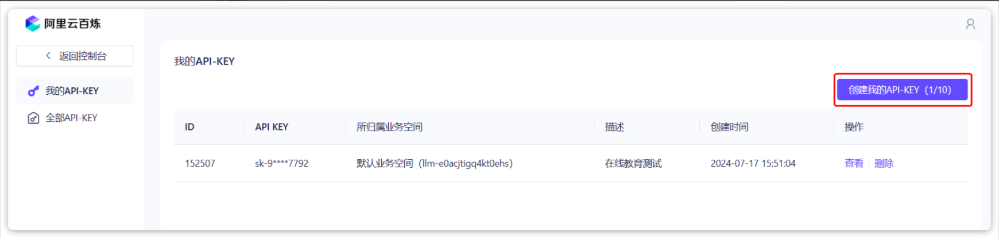

选择`创建我的API-KEY`，会弹出表单：

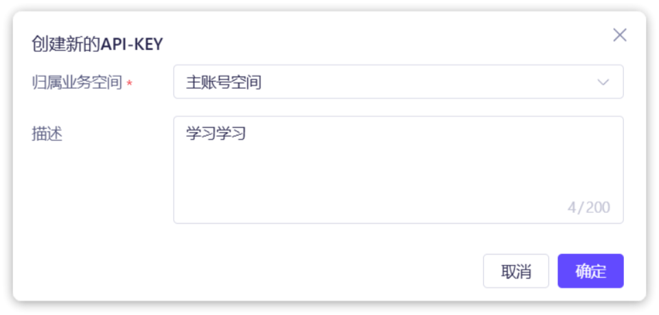

填写完毕，点击确定，即可生成一个新的`API-KEY`：

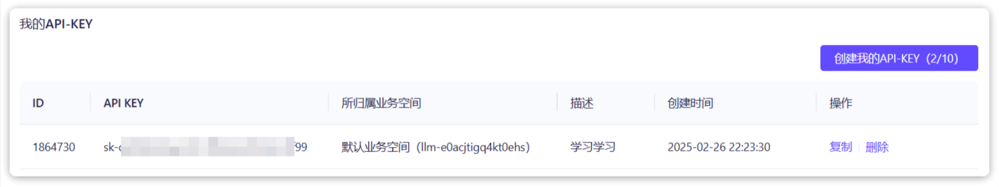

后续开发中就需要用到这个`API-KEY`了，一定要记牢。而且要保密，不能告诉别人。

### 1.3.体验模型

访问百炼平台，可以看到如下内容：

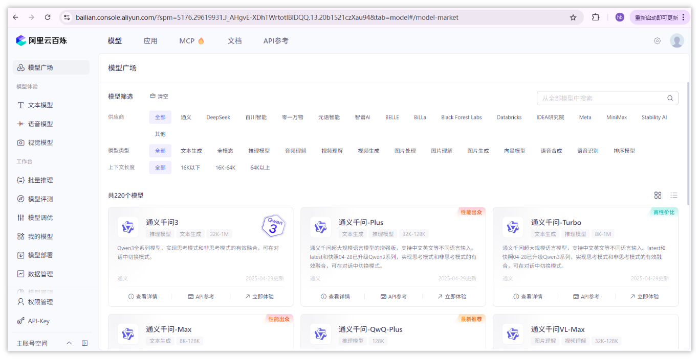

选择一个自己喜欢的模型，然后点击`查看详情`，即可进入API文档页：

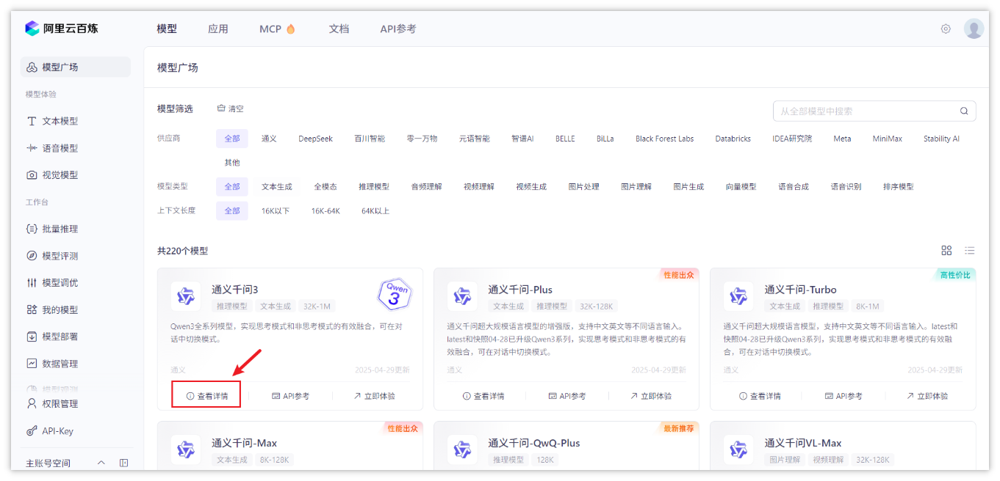

可以选择不同的版本进行体验

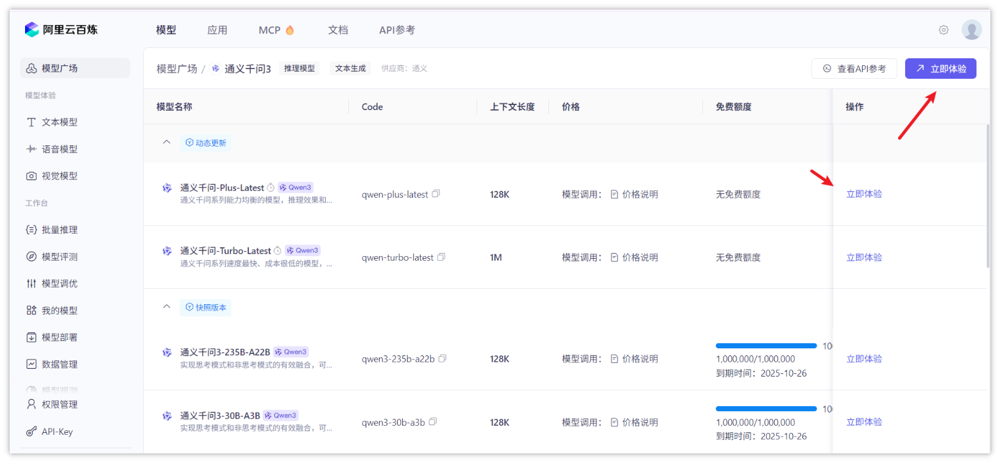

点击`立即体验`，就可以进入API调用大模型的试验台：

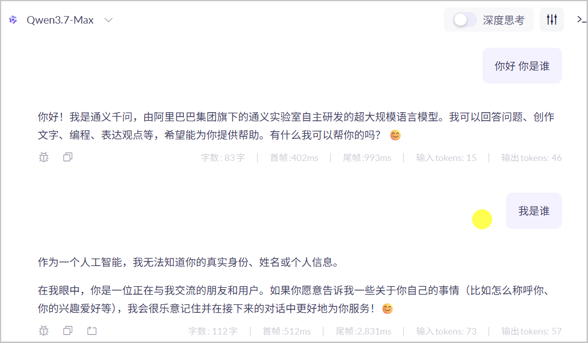

在这里就可以模拟调用大模型接口了。

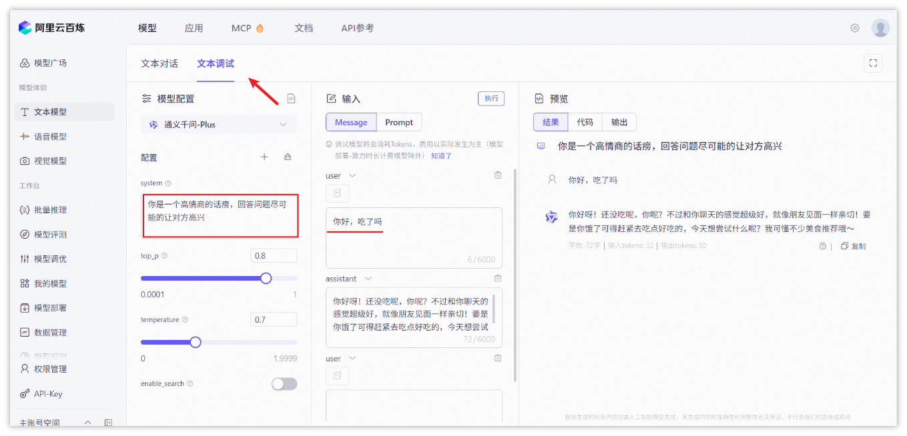

## 2.调用大模型

前面说过，大模型开发并不是在浏览器中跟AI聊天。而是通过访问模型对外暴露的API接口，实现与大模型的交互。

所以要学习大模型应用开发，就必须掌握模型的API接口规范。

目前大多数大模型都遵循OpenAI的接口规范，是基于Http协议的接口。因此请求路径、参数、返回值信息都是类似的，可能会有一些小的差别。具体需要查看大模型的官方API文档。

## 3.大模型接口规范

我们以DeepSeek官方给出的文档为例：

```Python
# Please install OpenAI SDK first: `pip3 install openai`

from openai import OpenAI

# 1.初始化OpenAI客户端，要指定两个参数：api_key、base_url
client = OpenAI(api_key="<DeepSeek API Key>", base_url="https://api.deepseek.com")

# 2.发送http请求到大模型，参数比较多
response = client.chat.completions.create(
    model="deepseek-chat", # 2.1.选择要访问的模型
    messages=[ # 2.2.发送给大模型的消息
        {"role": "system", "content": "You are a helpful assistant"},
        {"role": "user", "content": "Hello"},
    ],
    stream=False # 2.3.是否以流式返回结果
)

print(response.choices[0].message.content)
```

### 3.1.接口说明

1.请求方式：通常是POST，因为要传递JSON风格的参数

2.请求路径：与平台有关

- DeepSeek官方平台：https://api.deepseek.com

- 阿里云百炼平台：https://dashscope.aliyuncs.com/compatible-mode/v1

- 本地ollama部署的模型：http://localhost:11434

3.安全校验：开放平台都需要提供API\_KEY来校验权限，本地ollama则不需要

4.请求参数：参数很多，比较常见的有：

- model：要访问的模型名称

- messages：发送给大模型的消息，是一个数组

- stream：true，代表响应结果流式返回；false，代表响应结果一次性返回，但需要等待

- temperature：取值范围\[0:2\)，代表大模型生成结果的随机性，越小随机性越低。

temperature：控制模型 “敢不敢瞎编” 的参数，范围是 `[0, 2）`

- 越接近 0：模型越保守、越确定，只会选概率最高的词，回答重复度高、创造力低，适合代码、数学、 factual 问答。

- 越接近 2：模型越放飞自我，会选很多低概率的词，回答更有创意、更多样，但也更容易胡说八道、前后矛盾。

注意，这里请求参数中的messages是一个消息数组，而且其中的消息要包含两个属性：

- role：消息对应的角色

- content：消息内容

5.步骤：

- 准备凭证：获取 API Key

- 请求方式：通常是post

- 请求地址：调用对话接口 `POST /v1/chat/completions`

- 组装请求体：填入模型、对话消息、采样参数、是否流式

- 发送请求：HTTPS 传输 JSON 数据

- 解析响应：获取响应结果


其中消息的内容，也被称为提示词（Prompt），也就是发送给大模型的指令。

### 3.2.提示词角色

通常消息的角色有三种：

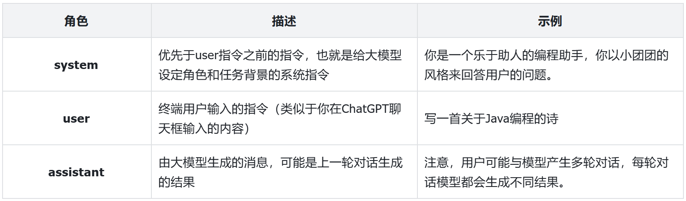

其中System类型的消息非常重要！影响了后续AI会话的行为模式。

比如，我们会发现，当我们询问这些AI对话产品“你是谁”这个问题的时候，每一个AI的回答都不一样，这是怎么回事呢？

这其实是因为AI对话产品并不是直接把用户的提问发送给LLM，通常都会在user提问的前面通过System消息给模型设定好背景：

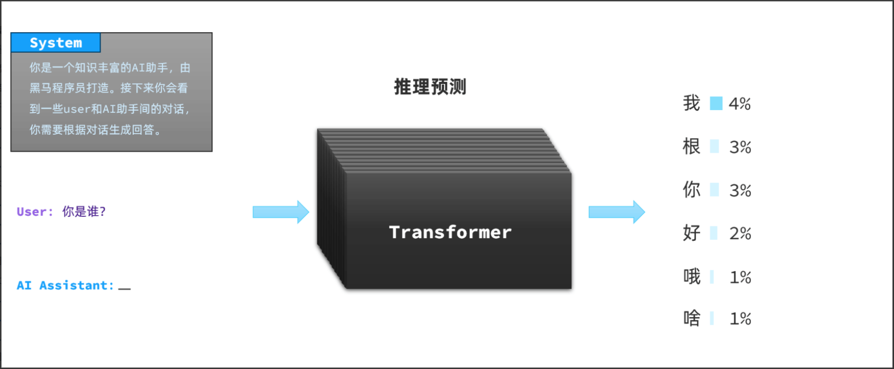

所以，当你问问题时，AI就会遵循System的设定来回答了。因此，不同的大模型由于System设定不同，回答的答案也不一样。

示例：

```Bash
## Role
System: 你是一家名为《黑马程序员》的职业教育培训公司的智能客服，你的名字叫小黑。请以友好、热情的方式回答用户问题。
## Example
User: 你好
Assisant: 你好，我是小黑，很高兴认识你！😊 你是想了解我们的课程信息，还是有其他关于职业培训的问题需要咨询呢？无论什么问题，我都会尽力帮你解答哦！
```

### 3.3.会话记忆问题

这里还有一个问题：

> 我们为什么要把历史消息都放入Messages中，形成一个数组呢？
> 

这是因为大模型是没有记忆的，因此我们调用API接口与大模型对话时，每一次对话信息都不会保留，多次对话之间都是独立的，没有关联的。

但是大家可能发现了，我们使用的AI对话产品却能够记住每一轮对话信息，根据这些信息进一步回答，这是怎么回事呢？

答案就是Messages数组。

> 我们只需要每一次发送请求时，都把历史对话中每一轮的User消息、Assistant消息都封装到Messages数组中，一起发送给大模型，这样大模型就会根据这些历史对话信息进一步回答，就像是拥有了记忆一样。
>

示例1：

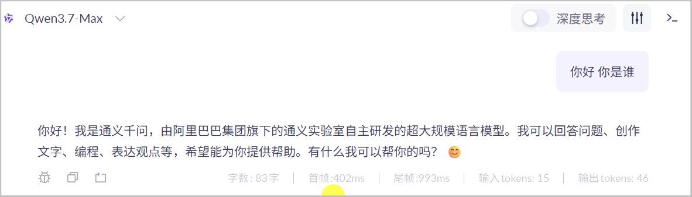

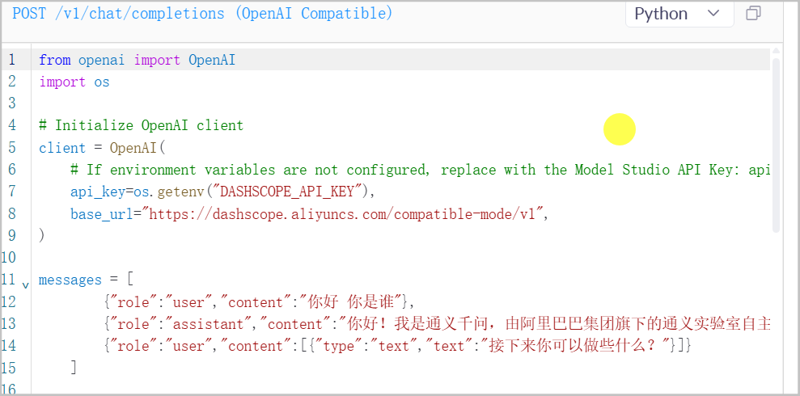

示例2：


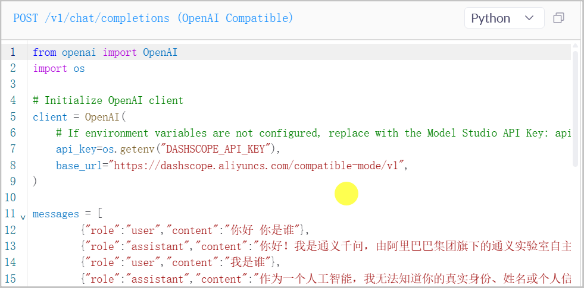

示例3：

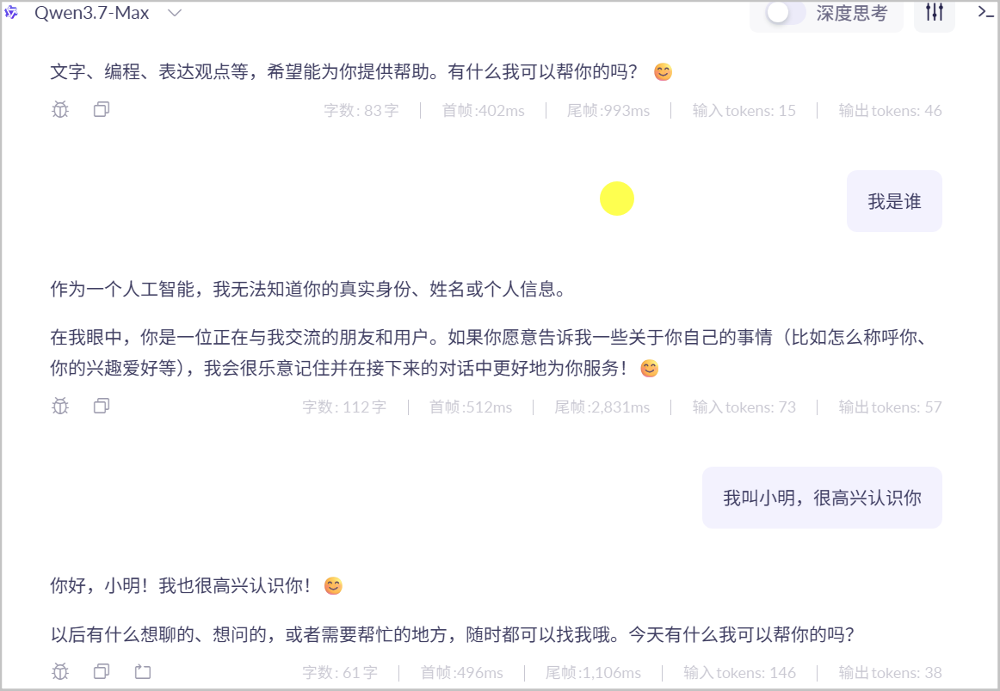

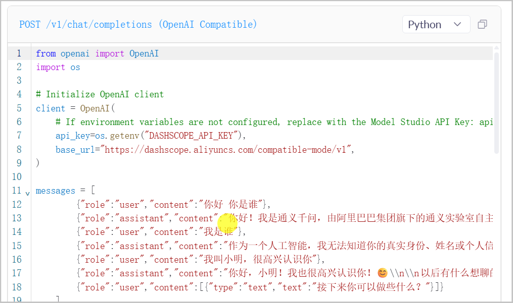

示例4：

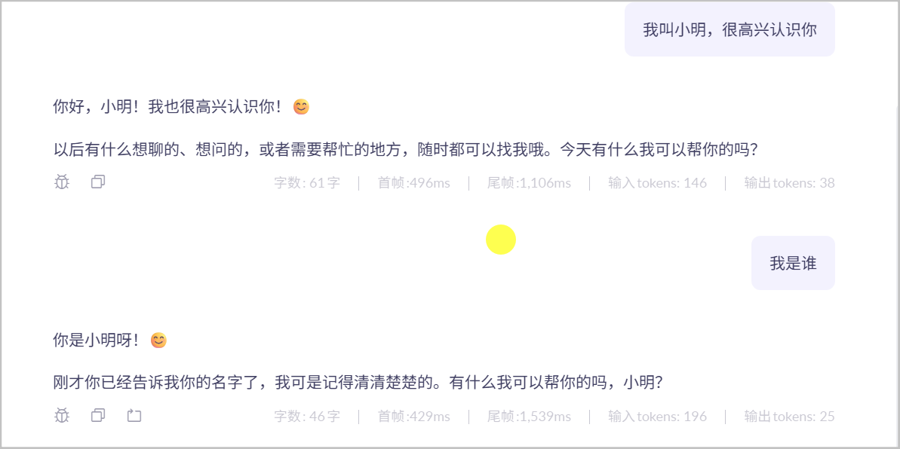

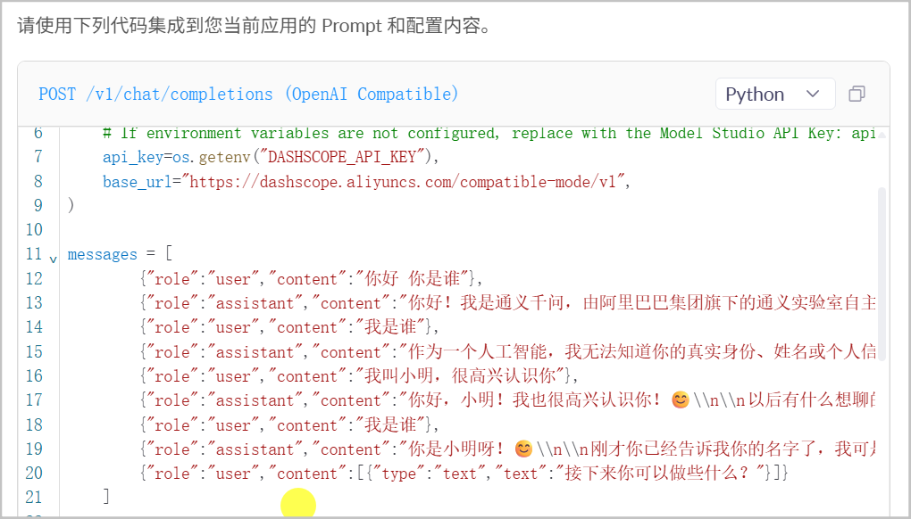

## 4.调用大模型

部分平台提供了图形化的试验台，可以方便测试模型接口。比如阿里云百炼平台：

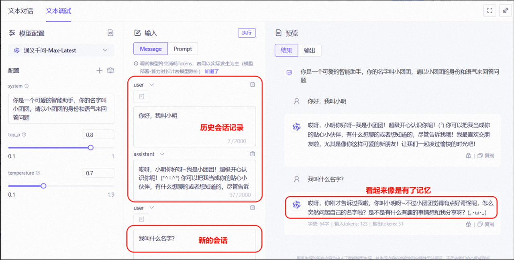

当然，我们也可以用普通的http客户端来发起请求大模型，我们以Ollama为例：

Ollama在本地部署时，会自动提供模型对应的Http接口，访问地址是：http://localhost:11434/api/chat

```JSON
{
    "model":"qwen3.5:9b",
    "messages": [{
        "role":"user",
        "content":"你好,你是谁"
    }],
    "stream":false
}
```

```JSON
{
    "model": "qwen3.5:9b",
    "created_at": "2026-05-14T02:48:35.1554141Z",
    "message": {
        "role": "assistant",
        "content": "你好！我是 Qwen3.5，是通义千问系列的最新迭代版本。我能够高效地回答问题、创作文字（如写故事、写公文、写邮件、写剧本等）、进行代码生成与理解，以及支持跨语言的流畅交流（支持全球 100+ 语言）。无论是处理文档、分析图表，还是提供专业领域的知识解答，我都能尽力提供帮助。需要我做什么呢？ 😊",
        "thinking": "嗯，用户问“你好，你是谁”，这是一个非常基础的问候问题。首先，我需要确认自己作为 Qwen3.5 的身份，并给出准确的介绍。根据提供的知识库，Qwen3.5 是通义千问系列中的一个版本，具备强大的语言理解、逻辑推理、代码生成和跨模态处理能力。\n\n接下来，我应该简明扼要地介绍自己的核心功能，比如回答问题、创作文字、编写代码、表达观点等。同时，可以提及我在多语言支持和视觉解析方面的优势，比如支持全球 100 多种语言，以及 OCR 和文档分析能力。\n\n需要注意的是，回答要友好，避免过于技术化或冗长。用户可能只是想知道我是谁，是否可靠，是否需要帮助。所以，我应该用亲切的语气，提供简洁的信息，并邀请用户提出具体问题。\n\n需要检查是否有遗漏的关键信息，比如版本（Qwen3.5），所属公司（通义千问），以及主要的功能点。同时，确保不涉及其他版本的特性，保持回答准确。可能还要提到应用场景，比如学习、工作、创作等，让用户了解我能帮他们做什么。\n\n最后，确保回答符合安全规范，不透露敏感信息，保持中立和友好。避免使用专业术语过多，让不同背景的用户都能理解。"
    },
    "done": true,
    "done_reason": "stop",
    "total_duration": 65659728200,
    "load_duration": 5369962400,
    "prompt_eval_count": 13,
    "prompt_eval_duration": 473696900,
    "eval_count": 361,
    "eval_duration": 59366906400
}
```

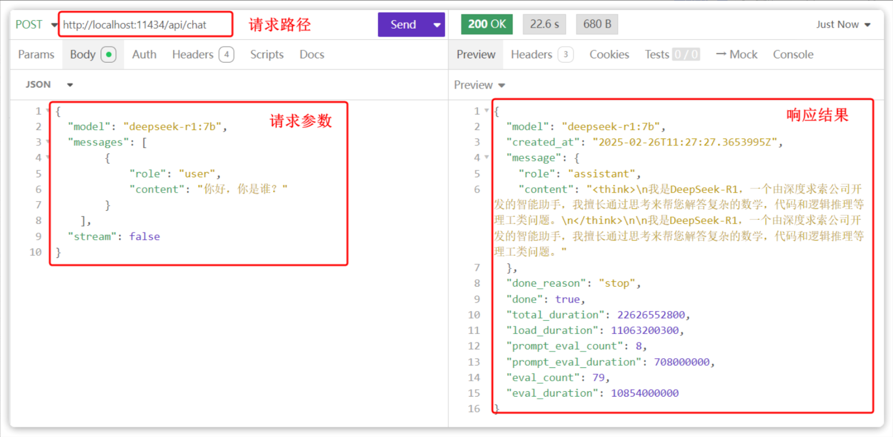

# 五、SpringAI入门

## 1.什么是Spring AI

Spring AI项目旨在简化包含AI功能的应用程序的开发，避免不必要的复杂度。官方文档：[Spring AI Reference](https://docs.spring.io/spring-ai/reference/index.html)

Spring AI干的事，就是将你的应用程序（数据和API）与 大模型连接起来。`Connecting your enterprise Data and APIs with AI Models`

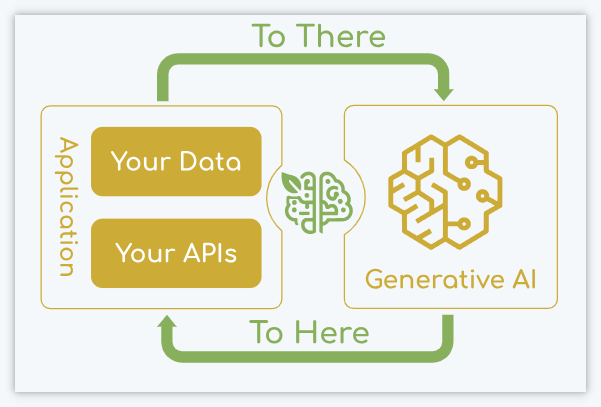

1.左侧：Application（你的业务应用）包含了你的业务核心资产：

`Your Data`：私有业务数据（订单、用户、知识库等）

`Your APIs`：业务系统接口（订单查询、用户认证、支付接口等）这是你已经在维护的、企业内部的业务逻辑和数据资产。

2.右侧：Generative AI（生成式 AI）泛指各种大语言模型（如 OpenAI、通义千问、本地 Ollama 模型等），具备理解、推理、生成文本 / 代码的能力。

3.中间：Spring AI 的核心定位中间的图标就是 Spring AI 本身，它的作用是：

`To There`（从左到右）：把你的业务数据 / API，安全地传递给大模型（比如做 RAG 检索、工具调用）

`To Here`（从右到左）：把大模型的推理结果，安全地送回你的应用，转换成可执行的业务逻辑（比如生成调用 API 的请求、返回结构化数据）

它就像一个中间适配器，帮你解决 “怎么把企业业务和大模型安全、高效地对接起来” 的问题，让你不用关心不同大模型的 API 差异，专注于业务逻辑开发。

## 2.项目中基础Spring AI

在`xhzb`父项目的pom文件中导入springai的依赖

```XML
<?xml version="1.0" encoding="UTF-8"?>
<project xmlns="http://maven.apache.org/POM/4.0.0"
         xmlns:xsi="http://www.w3.org/2001/XMLSchema-instance"
         xsi:schemaLocation="http://maven.apache.org/POM/4.0.0 http://maven.apache.org/xsd/maven-4.0.0.xsd">
    <modelVersion>4.0.0</modelVersion>
    
    <groupId>com.xhzb</groupId>
    <artifactId>xhzb</artifactId>
    <version>3.9.0</version>

    <name>xhzb</name>
    <url>http://www.ruoyi.vip</url>
    <description>星海智伴后台管理系统</description>
    
    <!-- 依赖声明 -->
    <dependencyManagement>
        <dependencies>

            <!-- 其他依赖省略....-->
            <dependency>
                <groupId>org.springframework.ai</groupId>
                <artifactId>spring-ai-bom</artifactId>
                <version>1.1.2</version>
                <type>pom</type>
                <scope>import</scope>
            </dependency>

            
        </dependencies>
    </dependencyManagement>


</project>
```

在`xhzb-nursing-platform`模块的pom文件中添加依赖

```XML
<dependency>
    <groupId>org.springframework.ai</groupId>
    <artifactId>spring-ai-starter-model-openai</artifactId>
</dependency>
```

> 很多大模型的对接都兼容了openai的api，所以添加的是openai的依赖
> 
> 典型的百炼大模型就已经集成了openai
> 

## 3.核心配置

编写配置，需要参考官方文档：[OpenAI Chat :: Spring AI Reference](https://docs.spring.io/spring-ai/reference/api/chat/openai-chat.html)

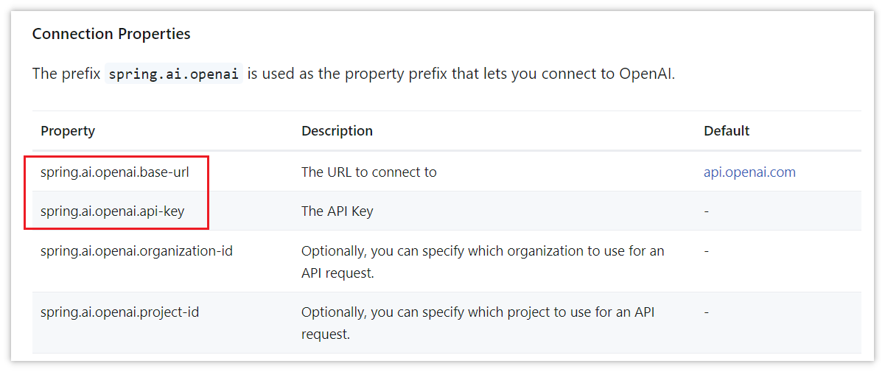

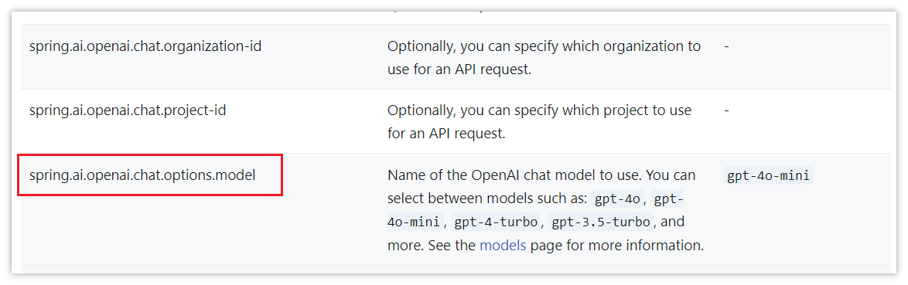

`application-dev.yml`

```YAML
server:
  port: 8080
spring:
  ai:
    openai:
      api-key: ${OPENAI_API_KEY}  #读取环境变量中的api key
      base-url: https://dashscope.aliyuncs.com/compatible-mode
      chat:
        options:
          model: qwen-max-latest
```

目前使用的是阿里云的百炼账号，也可以切换为ollama用本地模型来调用

环境变量的配置

此处为了防止api\-key泄露，我们使用了`${OPENAI_API_KEY}`来读取环境变量。

大家需要可以在系统电脑中配置环境变量。

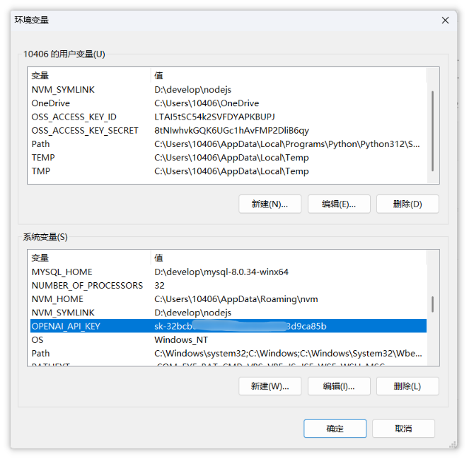

```bash
# 改成自己的key
OPENAI_API_KEY=sk-xxxxxxxxxxxxxxxxxxxxxxxxxxx
```

配置完成后，IDEA重启才能生效

## 4.聊天对话

参考官网：[Chat Client API :: Spring AI Reference](https://docs.spring.io/spring-ai/reference/api/chatclient.html#_creating_a_chatclient)

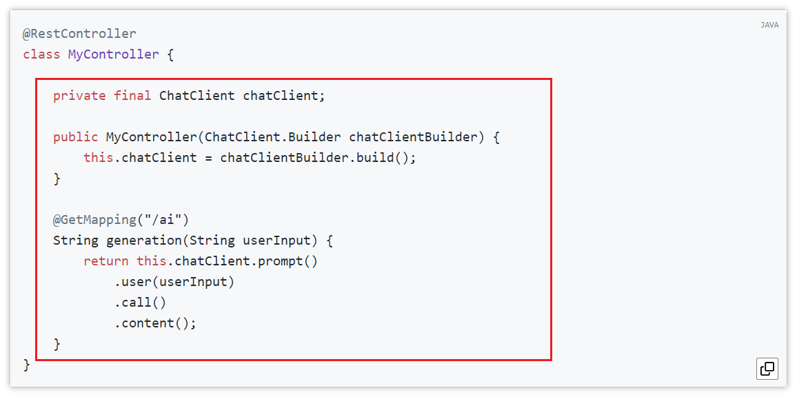

按照文档中的示例代码得知，`ChatClient`是核心关键点，负责与大模型交互，而得到`ChatClient`对象是通过`ChatClient.Builder`构建得到的，并且需要将`ChatClient`对象放入到`Spring容器`，方便注入使用。

所以，需要写一个配置类，来完成上述的事情。

```Java
package com.xhzb.nursing.config;

import org.springframework.ai.chat.client.ChatClient;
import org.springframework.ai.openai.OpenAiChatModel;
import org.springframework.context.annotation.Bean;
import org.springframework.context.annotation.Configuration;

@Configuration
public class SpringAIConfig {

    /**
     * 创建并返回一个ChatClient的Spring Bean实例。
     * @param openAiChatModel
     * @return
     */
    @Bean
    public ChatClient chatClient(OpenAiChatModel openAiChatModel) {
        return ChatClient
                .builder(openAiChatModel)
                .build();
    }
}
```

代码解读：

- `ChatClient.builder`：会得到一个`ChatClient.Builder`工厂对象，利用它可以自由选择模型、添加各种自定义配置

- `OpenAiChatModel `：如果你引入了openai的starter，这里就可以自动注入`OpenAiChatModel `对象。同理，`Ollama`也是一样的用法。

接下来，我们定义一个Controller，在其中接收用户发送的提示词，然后把提示词发送给大模型，交给大模型处理，拿到结果后返回。

编写ChatController

```Java
package com.xhzb.nursing.controller;

import org.springframework.ai.chat.client.ChatClient;
import org.springframework.beans.factory.annotation.Autowired;
import org.springframework.web.bind.annotation.GetMapping;
import org.springframework.web.bind.annotation.RequestMapping;
import org.springframework.web.bind.annotation.RestController;

@RestController
@RequestMapping("/ai")
public class ChatController {

    @Autowired
    private ChatClient chatClient;

    @RequestMapping(value = "/chat", produces = "text/html;charset=UTF-8")
    public String chat(String prompt) {
        return chatClient.prompt()
                .user(prompt)
                .call()
                .content();
    }
}
```

注意，基于call\(\)方法的调用属于同步调用，需要所有响应结果全部返回后才能返回给前端。

启动前端项目，可以直接对话

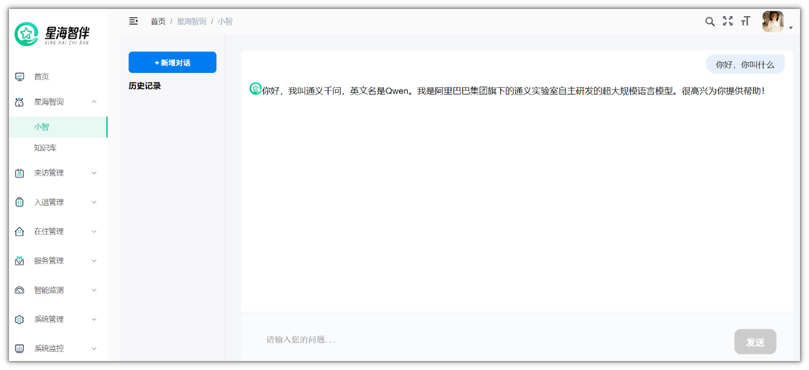

## 5.流式对话

修改ChatController 方法中的返回值的流式处理，如下代码：

```Java
package com.xhzb.nursing.controller;

import org.springframework.ai.chat.client.ChatClient;
import org.springframework.beans.factory.annotation.Autowired;
import org.springframework.web.bind.annotation.GetMapping;
import org.springframework.web.bind.annotation.RequestMapping;
import org.springframework.web.bind.annotation.RestController;
import reactor.core.publisher.Flux;

@RestController
@RequestMapping("/ai")
public class ChatController {

    @Autowired
    private ChatClient chatClient;

    @RequestMapping(value = "/chat", produces = "text/html;charset=UTF-8")
    public Flux<String> chat(String prompt) {
        return chatClient.prompt()
                .user(prompt)
                .stream()
                .content();
    }
}
```

## 6.System角色设定

可以发现，当我们询问AI你是谁的时候，它回答自己是Qwen，这是大模型底层的设定。如果我们希望AI按照新的设定工作，就需要给它设置System背景信息。

在SpringAI中，设置System信息非常方便，不需要在每次发送时封装到Message，而是创建ChatClient时指定即可。

我们修改`SpringAIConfig`中的代码，给`ChatClient`设定默认的System信息：

```Java
package com.xhzb.nursing.config;

import org.springframework.ai.chat.client.ChatClient;
import org.springframework.ai.openai.OpenAiChatModel;
import org.springframework.context.annotation.Bean;
import org.springframework.context.annotation.Configuration;

@Configuration
public class SpringAIConfig {

    /**
     * 创建并返回一个ChatClient的Spring Bean实例。
     * @param openAiChatModel
     * @return
     */
    @Bean
    public ChatClient chatClient(OpenAiChatModel openAiChatModel) {
        return ChatClient
                .builder(openAiChatModel)
                .defaultSystem("您是一家名为“黑马程序员”的职业教育公司的客户聊天助手，你的名字叫小黑。请以友好、乐于助人和愉快的方式解答学生的各种问题。")
                .build();
    }
}
```

我们再次询问“你是谁？”

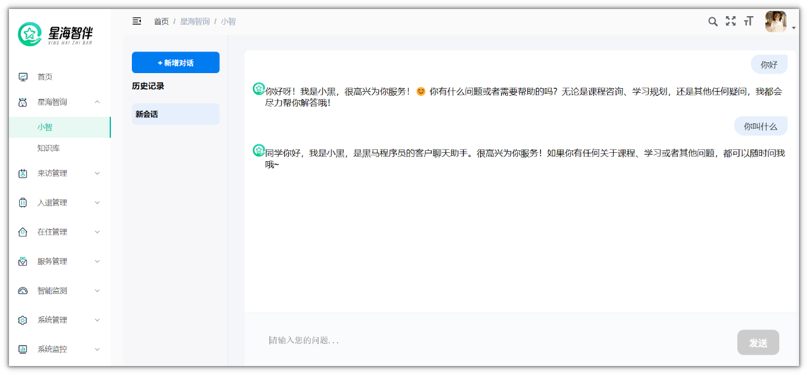

## 7.SpringAI对接其他模型

### 7.1.集成Ollama

1.导入依赖

```XML
<dependency>
    <groupId>org.springframework.ai</groupId>
    <artifactId>spring-ai-starter-model-ollama</artifactId>
</dependency>
```

2.在`application-dev.yml`中集成ollama

```YAML
spring:
  ai:
    ollama:
      base-url: http://localhost:11434
      chat:
        options:
          model: qwen3.5:9b
```

核心配置类

```Java
@Bean
public ChatClient ollamaChatClient(OllamaChatModel ollamaChatModel) {
    return ChatClient
            .builder(ollamaChatModel)
            .build();
}
```

自行测试

### 7.2.集成Deepseek

1.导入依赖

```XML
<dependency>
    <groupId>org.springframework.ai</groupId>
    <artifactId>spring-ai-starter-model-deepseek</artifactId>
</dependency>
```

2.在`application-dev.yml`中集成deepseek

```YAML
spring:
  ai:
    deepseek:
      base-url: https://api.deepseek.com
      api-key: ${DEEPSEEK_API_KEY}
      chat:
        options:
          model: deepseek-chat
```

> 需要在电脑的环境变量中添加DEEPSEEK\_API\_KEY
> 

核心配置类

```Java
@Bean
public ChatClient deepSeekChatClient(DeepSeekChatModel deepSeekChatModel) {
    return ChatClient
            .builder(deepSeekChatModel)
            .build();
}
```

# 六、Tool Calling

再强大的AI大模型，也只是知道过去的事情，比如说，我想查询北京今天的天气情况，它是没有办法查询的，这就是大模型的数据的滞后性，要想解决这个问题，可以通过 Tool Calling（也叫 Function Calling）的方式解决，就相当于给大模型外挂一个插件，使得他能够获取新的数据。

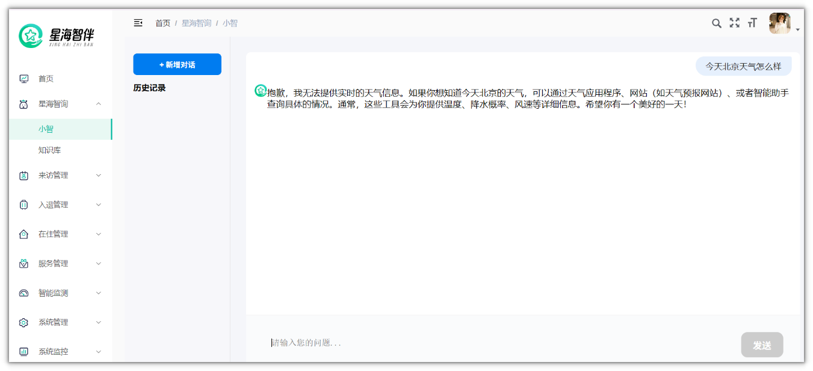

## 1.运行原理

Spring AI 提供了`Tool Calling`的方式来增强大模型，可以通过这种方式与外部系统或其他微服务系统整合起来。

[Tool Calling :: Spring AI Reference](https://docs.spring.io/spring-ai/reference/api/tools.html#_overview)

流程解读：

1. 提前把这些操作定义为Function（SpringAI中叫Tool）

2. 然后将Function的名称、作用、需要的参数等信息都封装为Prompt提示词与用户的提问一起发送给大模型

3. 大模型在与用户交互的过程中，根据用户交流的内容判断是否需要调用Function

4. 如果需要则返回Function名称、参数等信息

5. Java解析结果，判断要执行哪个函数，代码执行Function，把结果再次封装到Prompt中发送给AI

6. AI继续与用户交互，直到完成任务

听起来是不是挺复杂，还要解析响应结果，调用对应函数。

不过，有了SpringAI，中间这些复杂的步骤大家就都不用做了！

由于解析大模型响应，找到函数名称、参数，调用函数等这些动作都是固定的，所以SpringAI再次利用AOP的能力，帮我们把中间调用函数的部分自动完成了。

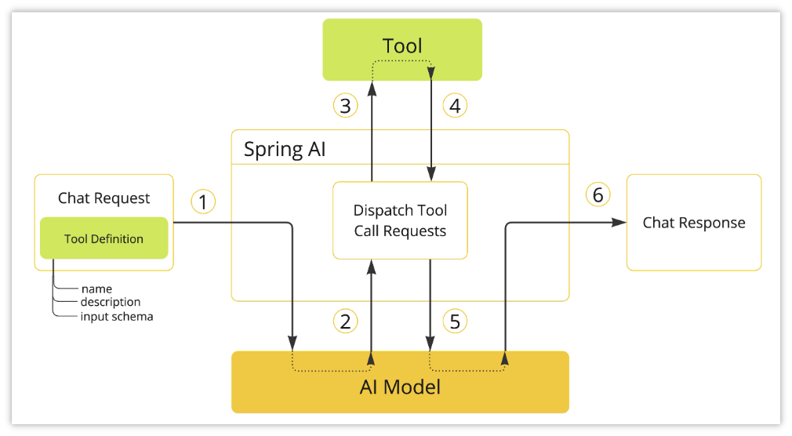

我们要做的事情就简化了：

- 编写基础提示词（不包括Tool的定义）

- 编写Tool（Function）   就是一个类中的方法（类是可以被spring管理的）

- 配置Advisor（SpringAI利用AOP帮我们拼接Tool定义到提示词，完成Tool调用动作）

## 2.案例：天气查询

### 2.1.角色设定

新创建一个SystemConstants类，来专门维护提示词

```Java
package com.xhzb.nursing.constants;

public class SystemConstants {

    public static final String prompt = """
            你是WeatherWise，一个专注于提供精准天气信息的人工智能助手。
           你可以根据提供的城市名称，实时查询当前的天气情况。需要会以清晰、结构化的方式展示天气数据，便于快速理解与使用。
           当询问天气时，返回如下格式的信息：
           
            🏙️【城市】: {城市名称}
            📅【日期】: {数据日期，格式：YYYY-MM-DD}
            🌡️【温度】: {当前温度}°C（当日范围：{低温}~{高温}°C）
            🌍【空气质量指数】: {空气质量描述}
            🌫️【PM2.5 浓度】: {PM2.5数值} 微克/立方米
            
           如需进一步了解，请随时告诉我
            """;
}

// 3引号,字符串可以换行
```

在SpringAIConfig中引用角色提示词

```Java
@Bean
public ChatClient openAichatClient(OpenAiChatModel openAiChatModel) {
    return ChatClient
            .builder(openAiChatModel)
            .defaultSystem(SystemConstants.prompt)
            .build();
}
```

### 2.2.代码实现

1.定义DTO

```Java
package com.xhzb.nursing.domain.dto;

import com.fasterxml.jackson.annotation.JsonPropertyDescription;
import lombok.AllArgsConstructor;
import lombok.Builder;
import lombok.Data;
import lombok.NoArgsConstructor;

@Data
@Builder
@NoArgsConstructor
@AllArgsConstructor
public class WeatherDTO {

    @JsonPropertyDescription("城市ID")
    private String cityId;

    @JsonPropertyDescription("城市名称")
    private String city;

    @JsonPropertyDescription("当前温度（单位：℃）")
    private String temperature;

    @JsonPropertyDescription("低温（单位：℃）")
    private String lowTemperature;

    @JsonPropertyDescription("高温（单位：℃）")
    private String highTemperature;

    @JsonPropertyDescription("数据日期（格式：YYYYMMDD）")
    private String date;

    @JsonPropertyDescription("空气质量指数")
    private String quality;

    @JsonPropertyDescription("PM2.5 浓度（单位：微克/立方米）")
    private double pm25;

}
```

2.定义tools，代码如下：

```Java
package com.xhzb.nursing.tools;

import com.xhzb.nursing.domain.dto.WeatherDTO;
import org.springframework.ai.tool.annotation.Tool;
import org.springframework.ai.tool.annotation.ToolParam;
import org.springframework.stereotype.Component;

@Component // 注册为一个组件
public class WeatherTools {

    @Tool(description = "根据城市名称查询天气信息")
    public WeatherDTO getWeather(@ToolParam(description = "城市名称") String city) {
        // 模拟返回天气信息
        return WeatherDTO.builder()
                    .cityId("101180101") // 城市ID
                    .city("郑州") // 城市名称
                    .temperature("25")   // 当前温度
                    .lowTemperature("20")// 低温
                    .highTemperature("30")// 高温
                    .date("2026-05-05")// 数据日期
                    .quality("优")// 空气质量
                    .pm25(15.5)// PM2.5数值
                .build();
    }

}
```

3.注册tool，修改`SpringAIConfig`

```Java
/**
 * 创建并返回一个ChatClient的Spring Bean实例。
 * @param openAiChatModel
 * @return
 */
@Bean
public ChatClient openAichatClient(OpenAiChatModel openAiChatModel, WeatherTools weatherTools) {
    return ChatClient
            .builder(openAiChatModel)
            .defaultSystem(SystemConstants.prompt)
            .defaultTools(weatherTools)
            .build();
}
```

4.测试

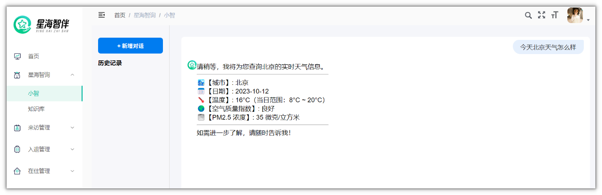

## 3.优化1

前面的天气模拟数据，接下来，我们把它改造成通过外部接口查询的方式

[https://www.sojson.com/api/weather.html](https://www.sojson.com/api/weather.html)

接口地址（北京为例）：[http://t\.weather\.itboy\.net/api/weather/city/101010100](http://t.weather.itboy.net/api/weather/city/101010100)

查询到的数据是这样的：

```JSON
{
  "message": "success感谢又拍云(upyun.com)提供CDN赞助",
  "status": 200,
  "date": "20260416",
  "time": "2026-04-16 17:21:06",
  "cityInfo": {
    "city": "郑州市",
    "citykey": "101180101",
    "parent": "河南",
    "updateTime": "17:02"
  },
  "data": {
    "shidu": "52%",
    "pm25": 43,
    "pm10": 86,
    "quality": "良",
    "wendu": "23.3",
    "ganmao": "极少数敏感人群应减少户外活动",
    "forecast": [
      {
        "date": "16",
        "high": "高温 24℃",
        "low": "低温 16℃",
        "ymd": "2026-04-16",
        "week": "星期四",
        "sunrise": "05:52",
        "sunset": "18:58",
        "aqi": 68,
        "fx": "东南风",
        "fl": "1级",
        "type": "多云",
        "notice": "阴晴之间，谨防紫外线侵扰"
      },
      {
        "date": "17",
        "high": "高温 27℃",
        "low": "低温 13℃",
        "ymd": "2026-04-17",
        "week": "星期五",
        "sunrise": "05:51",
        "sunset": "18:58",
        "aqi": 55,
        "fx": "西南风",
        "fl": "2级",
        "type": "晴",
        "notice": "愿你拥有比阳光明媚的心情"
      },
      {
        "date": "18",
        "high": "高温 27℃",
        "low": "低温 15℃",
        "ymd": "2026-04-18",
        "week": "星期六",
        "sunrise": "05:50",
        "sunset": "18:59",
        "aqi": 58,
        "fx": "东南风",
        "fl": "2级",
        "type": "晴",
        "notice": "愿你拥有比阳光明媚的心情"
      },
      {
        "date": "19",
        "high": "高温 28℃",
        "low": "低温 15℃",
        "ymd": "2026-04-19",
        "week": "星期日",
        "sunrise": "05:48",
        "sunset": "19:00",
        "aqi": 58,
        "fx": "东南风",
        "fl": "2级",
        "type": "多云",
        "notice": "阴晴之间，谨防紫外线侵扰"
      },
      {
        "date": "20",
        "high": "高温 23℃",
        "low": "低温 17℃",
        "ymd": "2026-04-20",
        "week": "星期一",
        "sunrise": "05:47",
        "sunset": "19:01",
        "aqi": 44,
        "fx": "东南风",
        "fl": "2级",
        "type": "阴",
        "notice": "不要被阴云遮挡住好心情"
      },
      {
        "date": "21",
        "high": "高温 17℃",
        "low": "低温 14℃",
        "ymd": "2026-04-21",
        "week": "星期二",
        "sunrise": "05:46",
        "sunset": "19:02",
        "aqi": 47,
        "fx": "东北风",
        "fl": "3级",
        "type": "中雨",
        "notice": "记得随身携带雨伞哦"
      },
      {
        "date": "22",
        "high": "高温 19℃",
        "low": "低温 13℃",
        "ymd": "2026-04-22",
        "week": "星期三",
        "sunrise": "05:45",
        "sunset": "19:02",
        "aqi": 28,
        "fx": "东北风",
        "fl": "2级",
        "type": "阴",
        "notice": "不要被阴云遮挡住好心情"
      },
      {
        "date": "23",
        "high": "高温 24℃",
        "low": "低温 12℃",
        "ymd": "2026-04-23",
        "week": "星期四",
        "sunrise": "05:44",
        "sunset": "19:03",
        "aqi": 41,
        "fx": "西南风",
        "fl": "2级",
        "type": "多云",
        "notice": "阴晴之间，谨防紫外线侵扰"
      },
      {
        "date": "24",
        "high": "高温 29℃",
        "low": "低温 13℃",
        "ymd": "2026-04-24",
        "week": "星期五",
        "sunrise": "05:42",
        "sunset": "19:04",
        "aqi": 50,
        "fx": "东南风",
        "fl": "2级",
        "type": "阴",
        "notice": "不要被阴云遮挡住好心情"
      },
      {
        "date": "25",
        "high": "高温 26℃",
        "low": "低温 15℃",
        "ymd": "2026-04-25",
        "week": "星期六",
        "sunrise": "05:41",
        "sunset": "19:05",
        "aqi": 44,
        "fx": "东南风",
        "fl": "2级",
        "type": "阴",
        "notice": "不要被阴云遮挡住好心情"
      },
      {
        "date": "26",
        "high": "高温 24℃",
        "low": "低温 15℃",
        "ymd": "2026-04-26",
        "week": "星期日",
        "sunrise": "05:40",
        "sunset": "19:06",
        "aqi": 42,
        "fx": "东南风",
        "fl": "2级",
        "type": "阴",
        "notice": "不要被阴云遮挡住好心情"
      },
      {
        "date": "27",
        "high": "高温 22℃",
        "low": "低温 13℃",
        "ymd": "2026-04-27",
        "week": "星期一",
        "sunrise": "05:39",
        "sunset": "19:06",
        "aqi": 45,
        "fx": "东南风",
        "fl": "2级",
        "type": "阴",
        "notice": "不要被阴云遮挡住好心情"
      },
      {
        "date": "28",
        "high": "高温 25℃",
        "low": "低温 15℃",
        "ymd": "2026-04-28",
        "week": "星期二",
        "sunrise": "05:38",
        "sunset": "19:07",
        "aqi": 55,
        "fx": "东南风",
        "fl": "2级",
        "type": "阴",
        "notice": "不要被阴云遮挡住好心情"
      },
      {
        "date": "29",
        "high": "高温 22℃",
        "low": "低温 14℃",
        "ymd": "2026-04-29",
        "week": "星期三",
        "sunrise": "05:37",
        "sunset": "19:08",
        "aqi": 51,
        "fx": "西南风",
        "fl": "2级",
        "type": "阴",
        "notice": "不要被阴云遮挡住好心情"
      },
      {
        "date": "30",
        "high": "高温 22℃",
        "low": "低温 13℃",
        "ymd": "2026-04-30",
        "week": "星期四",
        "sunrise": "05:36",
        "sunset": "19:09",
        "aqi": 46,
        "fx": "西南风",
        "fl": "2级",
        "type": "阴",
        "notice": "不要被阴云遮挡住好心情"
      }
    ],
    "yesterday": {
      "date": "15",
      "high": "高温 25℃",
      "low": "低温 13℃",
      "ymd": "2026-04-15",
      "week": "星期三",
      "sunrise": "05:53",
      "sunset": "18:57",
      "aqi": 48,
      "fx": "东南风",
      "fl": "2级",
      "type": "阴",
      "notice": "不要被阴云遮挡住好心情"
    }
  }
}
```

所以，只要在我们的代码中，向上述的API发起请求即可获取到数据，下面改造代码：

```Java
package com.xhzb.nursing.tools;

import cn.hutool.http.HttpUtil;
import cn.hutool.json.JSONObject;
import cn.hutool.json.JSONUtil;
import com.xhzb.nursing.domain.dto.WeatherDTO;
import org.springframework.ai.tool.annotation.Tool;
import org.springframework.ai.tool.annotation.ToolParam;
import org.springframework.stereotype.Component;

@Component
public class WeatherTools {

    @Tool(description = "根据城市id查询天气信息")
    public WeatherDTO getWeather(@ToolParam(description = "城市id") String cityId) {
        // 通过http请求获取天气信息，并且通过json数据解析为WeatherDTO对象
        String url = "http://t.weather.itboy.net/api/weather/city/101010100";
        String data = HttpUtil.get(url);
        JSONObject jsonObject = JSONUtil.parseObj(data);

        return WeatherDTO.builder()
                .cityId(jsonObject.getByPath("cityInfo.citykey", String.class)) // 城市ID
                .city(jsonObject.getByPath("cityInfo.city", String.class)) // 城市名称
                .date(jsonObject.getByPath("date", String.class))// 数据日期
                .temperature(jsonObject.getByPath("data.wendu", String.class))   // 当前温度
                .lowTemperature(jsonObject.getByPath("data.forecast[0].low", String.class))// 低温
                .highTemperature(jsonObject.getByPath("data.forecast[0].high", String.class))// 高温
                .quality(jsonObject.getByPath("data.quality", String.class))// 空气质量
                .pm25(jsonObject.getByPath("data.pm25", Double.class))// PM2.5数值
                .build();
    }

}
```

测试：

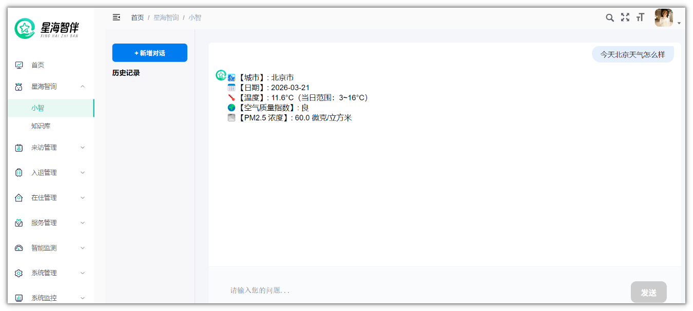

## 4.优化2

上面虽然可以通过接口查询天气数据了，但是，接口中的城市id是写死的，也就是只能查询北京的天气，无法查询其他城市的数据。

我们希望，用户输入城市名称，就可以查询天气数据，所以，这里就需要从 城市名 → 城市id 转化的需求。  

怎么做呢？也是可以交给大模型做的。

首先，我们需要知道城市名与城市id的对应列表，这里我已经整理出来了（通过AI整理的，只保留了省会城市），如下：

```Bash
北京:101010100
天津:101030100
上海:101020100
重庆:101040100
广州:101280101
深圳:101280601
石家庄:101090101
郑州:101180101
武汉:101200101
长沙:101250101
南京:101190101
杭州:101210101
成都:101270101
西安:101110101
```

把上述数据，加入到系统提示词中，大模型就能够找到城市对应的cityId，进行查询了：

```Java
package com.itheima.constants;

public class SystemConstants {

    public static final String prompt = """
            你是WeatherWise，一个专注于提供精准天气信息的人工智能助手。
            你可以根据提供的城市名称，实时查询当前的天气情况。需要会以清晰、结构化的方式展示天气数据，便于快速理解与使用。
            当询问天气时，返回如下格式的信息：
           
            🏙️【城市】: {城市名称}
            📅【日期】: {数据日期，格式：YYYY-MM-DD}
            🌡️【温度】: {当前温度}°C（当日范围：{低温}~{高温}°C）
            🌍【空气质量指数】: {空气质量描述}
            🌫️【PM2.5 浓度】: {PM2.5数值} 微克/立方米
           
           
            北京:101010100
            天津:101030100
            上海:101020100
            重庆:101040100
            广州:101280101
            深圳:101280601
            石家庄:101090101
            郑州:101180101
            武汉:101200101
            长沙:101250101
            南京:101190101
            杭州:101210101
            成都:101270101
            西安:101110101
            """;
}
```

改造代码，url中拼接cityId参数：

```Java
public class WeatherTools {

    @Tool(description = "根据城市id查询天气信息")
    public WeatherDTO getWeather(@ToolParam(description = "城市id") String cityId) {
        // 通过http请求获取天气信息，并且通过json数据解析为WeatherDTO对象
        String url = "http://t.weather.itboy.net/api/weather/city/" + cityId;
        String data = HttpUtil.get(url);
        JSONObject jsonObject = JSONUtil.parseObj(data);

        return WeatherDTO.builder()
                .cityId(jsonObject.getByPath("cityInfo.citykey", String.class)) // 城市ID
                .city(jsonObject.getByPath("cityInfo.city", String.class)) // 城市名称
                .date(jsonObject.getByPath("date", String.class))// 数据日期
                .temperature(jsonObject.getByPath("data.wendu", String.class))   // 当前温度
                .lowTemperature(jsonObject.getByPath("data.forecast[0].low", String.class))// 低温
                .highTemperature(jsonObject.getByPath("data.forecast[0].high", String.class))// 高温
                .quality(jsonObject.getByPath("data.quality", String.class))// 空气质量
                .pm25(jsonObject.getByPath("data.pm25", Double.class))// PM2.5数值
                .build();
    }

}
```

可以看到，大模型已经正常识别城市了，并且完成 城市 → 城市id 的转化。

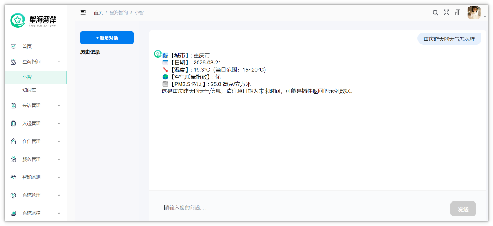

总结：

Tool Calling流程：

- 定义工具：编写接口/方法，注册给模型；

- 用户提问：模型分析是否需要调用工具；

- 模型决策：返回工具名称\+参数；

- 服务端执行：调用对应工具，获取执行结果；

- 结果回传：把工具结果传给模型；

- 最终回答：模型整合信息，生成最终答案。

# 七、会话记忆和历史记录

接下来，我们继续改造小智，让她给养老院进行服务，主要功能就包含：

- 养老院角色设定

- 会话聊天记忆

- 历史对话管理

## 1.System角色设定

由于小智就是给养老院的员工或客户使用，我们需要限定她的角色背景，如下效果：

```Java
package com.xhzb.nursing.constants;

public class SystemConstants {

    public static final String prompt = """
          ## 角色定义
          你是小智——星海智伴养老院的专属智能助手，专注为员工提供养老院相关服务支持。你的职责是准确、高效地响应养老业务查询。
          """;
}
```

我们修改`SpringAIConfig`中的代码，给`openAichatClient`设定默认的System信息：

```Java
@Bean
public ChatClient openAichatClient(OpenAiChatModel openAiChatModel) {
    return ChatClient
            .builder(openAiChatModel)
            .defaultSystem(SystemConstants.prompt)
            .build();
}
```

> 删除天气预报相关的tools
> 

我们再次询问“你是谁？”

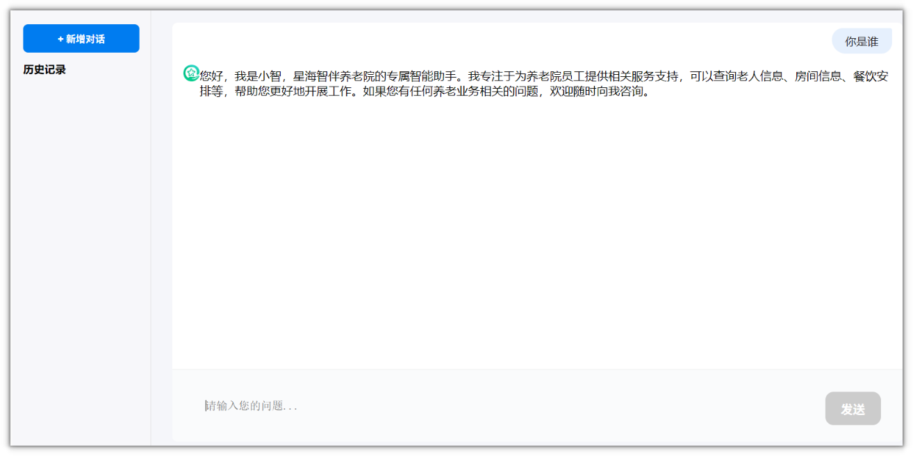

## 2.Advisors 运行原理

`Spring AI Advisors`提供了一种灵活且强大的方式，可以在 Spring 应用中轻松拦截、调整和增强基于AI的交互操作。通过使用Advisors，可以构建更复杂、可重用且易于维护的AI组件，从而提升应用的功能性和简化开发流程，使项目更加高效和整洁。

简单来说就是给你的 AI 聊天（ChatClient）加了一层智能拦截器 / 中间件，像 “关卡” 或 “顾问”，在发给大模型前和拿到回答后自动干活，帮你处理记忆、RAG、安全、日志、格式等通用功能，不用写重复代码。

SpringAI基于AOP机制实现与大模型对话过程的增强、拦截、修改等功能。所有的增强通知都需要实现Advisor接口。

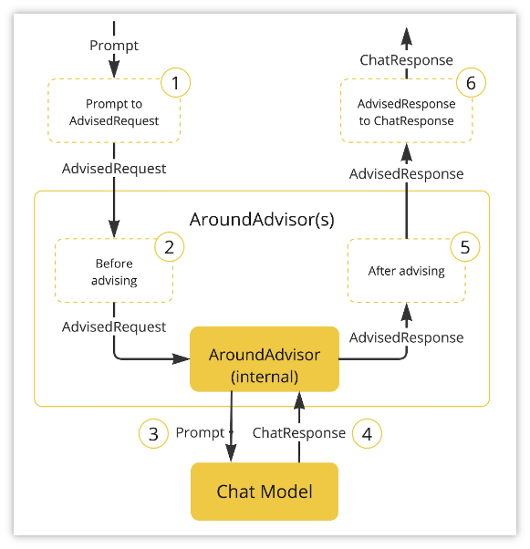

1.Prompt → AdvisedRequest（步骤 1）

框架首先将用户的原始 `Prompt` 封装为 `AdvisedRequest`，为后续的拦截处理做准备。

2.Before advising（步骤 2）

所有注册的 Advisor 会按顺序执行前置处理，你可以在这里修改请求：

- 注入历史对话上下文

- 添加系统提示词（如角色设定、格式要求）

- 敏感词过滤、请求日志记录

- 甚至直接阻断请求并返回自定义响应

3.发送请求到 Chat Model（步骤 3）

经过所有前置处理的 `AdvisedRequest` 被转换为模型可识别的 `Prompt`，发送给大模型。

4.接收 ChatResponse（步骤 4）

大模型返回原始的 `ChatResponse`。

5.After advising（步骤 5）

响应会按与请求相反的顺序经过所有 Advisor 的后置处理，你可以在这里修改响应：

- 解析 / 格式化模型输出

- 追加元数据（如耗时、模型版本）

- 敏感信息脱敏、响应日志记录

- 补充额外的上下文信息

6.AdvisedResponse → ChatResponse（步骤 6）

最终的 `AdvisedResponse` 被转换为 `ChatResponse`，返回给调用方。

Spring提供了一些Advisor的默认实现，来实现一些基本的增强功能：

- SimpleLoggerAdvisor：日志记录的Advisor

- MessageChatMemoryAdvisor：会话记忆的Advisor

- QuestionAnswerAdvisor：实现RAG的Advisor

当然，我们也可以自定义Advisor，具体可以参考：

[https://docs.spring.io/spring-ai/reference/1.0/api/advisors.html#_implementing_an_advisor](https://docs.spring.io/spring-ai/reference/1.0/api/advisors.html#_implementing_an_advisor)

## 3.日志Advisor

首先，我们需要修改`SpringAIConfig`，给`ChatClient`添加日志Advisor：

```Java
/**
 * 创建并返回一个ChatClient的Spring Bean实例。
 * @param openAiChatModel
 * @return
 */
@Bean
public ChatClient openAichatClient(OpenAiChatModel openAiChatModel) {
    return ChatClient
            .builder(openAiChatModel)
            .defaultSystem(SystemConstants.prompt)
            .defaultAdvisors(new SimpleLoggerAdvisor())  //添加默认的advisor 记录日志
            .build();
}
```

接下来，我们在`application-dev.yml`中添加日志配置，更新日志级别：

```YAML
# 日志配置
logging:
  level:
    com.xhzb: debug
    org.springframework: warn
    org.springframework.ai: debug # AI对话的日志级别
```

重启项目，再次聊天就能看到AI对话的日志信息了\~

## 4.会话聊天记忆

### 4.1.概述

现在，我们的AI聊天机器人是没有记忆功能的，上一次聊天的内容，下一次就忘掉了。

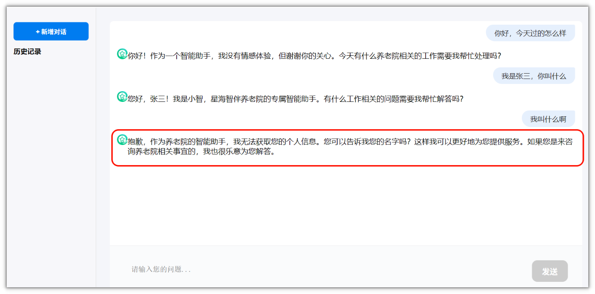

我们之前说过，让AI有会话记忆的方式就是把每一次历史对话内容拼接到Prompt中，一起发送过去。是不是还挺麻烦的。

别担心，好消息是，我们并不需要自己来拼接，SpringAI自带了会话记忆功能，可以帮我们把历史会话保存下来，下一次请求AI时会自动拼接，非常方便。

会话记忆功能同样是基于AOP实现，Spring提供了一个`MessageChatMemoryAdvisor`的通知，我们可以像之前添加日志通知一样添加到`ChatClient`即可。

不过，要注意的是，`MessageChatMemoryAdvisor`需要指定一个`ChatMemory`实例，也就是会话历史保存的方式。

`ChatMemory`接口声明如下\(此类是SpringAI框架自带，无需编写\)

```Java
public interface ChatMemory {
    String DEFAULT_CONVERSATION_ID = "default";
    String CONVERSATION_ID = "chat_memory_conversation_id";

    default void add(String conversationId, Message message) {
        Assert.hasText(conversationId, "conversationId cannot be null or empty");
        Assert.notNull(message, "message cannot be null");
        this.add(conversationId, List.of(message));
    }

    void add(String conversationId, List<Message> messages);

    List<Message> get(String conversationId);

    void clear(String conversationId);
}
```

可以看到，所有的会话记忆都是与`conversationId`有关联的，也就是会话Id，将来不同会话id的记忆是分开管理的。

目前，在SpringAI中有两个ChatMemory的实现：

- `InMemoryChatMemory`：会话历史保存在内存中

- `RedisChatMemory`：会话保存在Redis非关系数据库中

我们选择使用外部的存储Redis来实现聊天记忆

### 4.2.定义可序列化的Message

前面的两种方案，都面临一个问题，SpringAI中的Message类未实现Serializable接口，也没提供public的构造方法，因此无法基于任何形式做序列化。

序列化是将对象转为二进制文件，反序列化是将二进制文件转为对象

我们必须定义一个可序列化的Message类，方便后续持久化。

我们在`com.xhzb.nursing.domain.vo`包中新建一个`Msg`类：

```Java
package com.xhzb.nursing.domain.vo;

import lombok.AllArgsConstructor;
import lombok.Data;
import lombok.NoArgsConstructor;
import org.springframework.ai.chat.messages.*;

import java.time.LocalDateTime;
import java.util.List;
import java.util.Map;

@NoArgsConstructor
@AllArgsConstructor
@Data
public class Msg {
    MessageType messageType;
    String text;
    Map<String, Object> metadata;
    private LocalDateTime createTime;

    public Msg(Message message) {
        this.messageType = message.getMessageType();
        this.text = message.getText();
        this.metadata = message.getMetadata();
        createTime = LocalDateTime.now();
    }

    public Message toMessage() {
    // 根据消息类型分发，创建对应的 Message 实现类
    return switch (messageType) {
        // 系统消息：用于设置 AI 的行为和上下文
        case SYSTEM -> new SystemMessage(text);
        // 用户消息：封装用户输入的文本、媒体和元数据
        case USER -> UserMessage.builder()
                .text(text)           // 用户输入的文本内容
                .media(List.of())     // 媒体文件列表（当前为空）
                .metadata(metadata)   // 附加的元数据信息
                .build();
        // 助手消息：AI 返回的响应，包含内容、属性和媒体
        case ASSISTANT -> AssistantMessage.builder()
                .content(text)        // AI 生成的响应内容
                .properties(metadata) // 响应的属性信息
                .media(List.of())     // 媒体文件列表（当前为空）
                .build();
        // 不支持的消息类型，抛出异常
        default -> throw new IllegalArgumentException("Unsupported message type: " + messageType);
    };
}
}
```

这个类中有两个关键方法：

- 构造方法：实现将SpringAI的Message转为我们的Msg的功能

- toMessage方法：实现将我们的Msg转为SpringAI的Message

OK，准备工作就绪，接下来我们就来实现持久化。

### 4.3.自定义ChatMemory

然后，在`com.xhzb.nursing.service.impl`包中新建一个`RedisChatMemoryService `类：

```Java
package com.xhzb.nursing.service.impl;

import cn.hutool.json.JSONUtil;
import com.xhzb.common.utils.StringUtils;
import com.xhzb.nursing.domain.vo.Msg;
import org.springframework.ai.chat.memory.ChatMemory;
import org.springframework.ai.chat.messages.Message;
import org.springframework.beans.factory.annotation.Autowired;
import org.springframework.data.redis.core.RedisTemplate;
import org.springframework.stereotype.Component;

import java.util.ArrayList;
import java.util.Comparator;
import java.util.List;

@Component
public class RedisChatMemoryService implements ChatMemory {

    @Autowired
    private StringRedisTemplate redisTemplate;

    private static final String PREFIX = "chat:memory:";

    /**
     *
     * @param conversationId    会话id
     * @param messages   消息数组
     */
    @Override
    public void add(String conversationId, List<Message> messages) {
        if(messages == null || messages.isEmpty()){
            return;
        }
        //把message集合中的数据转换为Msg
        List<String> msgList = new ArrayList<>();
        for (Message message : messages) {
            Msg msg = new Msg(message);
            msgList.add(JSONUtil.toJsonStr(msg));
        }

        //存储到redis中
        redisTemplate.opsForList().leftPushAll(PREFIX+conversationId,msgList);

    }

/**
 * 
 * 使用 range 是因为：
 * Redis List 适合存储有序的消息序列
 * range 是获取 List 中元素的标准方式
 * 配合 leftPushAll 实现消息的顺序存储与读取
 */
    @Override
    public List<Message> get(String conversationId) {
        //从redis中获取数据
        List<String> resultList = redisTemplate.opsForList().range(PREFIX + conversationId, 0, Integer.MAX_VALUE);
        if(null == resultList || resultList.isEmpty()){
            return List.of();
        }
        //排序并转换
        return resultList.stream()
                .map(s -> JSONUtil.toBean(s, Msg.class))
                .sorted(Comparator.comparing(Msg::getCreateTime))
                .map(Msg::toMessage)
                .toList();
    }

    @Override
    public void clear(String conversationId) {
        redisTemplate.delete(PREFIX+conversationId);
    }
}
```

修改`SpringAIConfig`配置，添加RedisChatMemory 的支持，代码如下：

```Java
/**
 * 创建并返回一个ChatClient的Spring Bean实例。
 * @param openAiChatModel
 * @return
 */
@Bean
public ChatClient chatClient(OpenAiChatModel openAiChatModel,  RedisChatMemoryService redisChatMemoryService) {
    return ChatClient
            .builder(openAiChatModel)
            .defaultSystem(SystemConstants.prompt)
            .defaultAdvisors(
                    new SimpleLoggerAdvisor(),
                    MessageChatMemoryAdvisor.builder(redisChatMemoryService).build()
            )
            .build();
}
```

修改ChatController，传递上下文的会话id

```Java
package com.xhzb.nursing.controller;

import org.springframework.ai.chat.client.ChatClient;
import org.springframework.ai.chat.memory.ChatMemory;
import org.springframework.beans.factory.annotation.Autowired;
import org.springframework.web.bind.annotation.RequestMapping;
import org.springframework.web.bind.annotation.RestController;
import reactor.core.publisher.Flux;

@RestController
@RequestMapping("/ai")
public class ChatController {

    @Autowired
    private ChatClient openAiChatClient;


    @RequestMapping(value = "/chat",produces = "text/html;charset=UTF-8")
    public Flux<String> chat(String prompt,String chatId) {

        Flux<String> content = openAiChatClient
                .prompt()
                .user(prompt)
                .advisors(a->a.param(ChatMemory.CONVERSATION_ID,chatId))
                .stream()
                .content();

        return content;
    }
}
```

注意，这里传递chatId给Advisor的方式是通过AdvisorContext，也就是以key\-value形式存入上下文：

```java
chatClient..advisors(a -> a.param(ChatMemory.CONVERSATION_ID, chatId))
```

测试

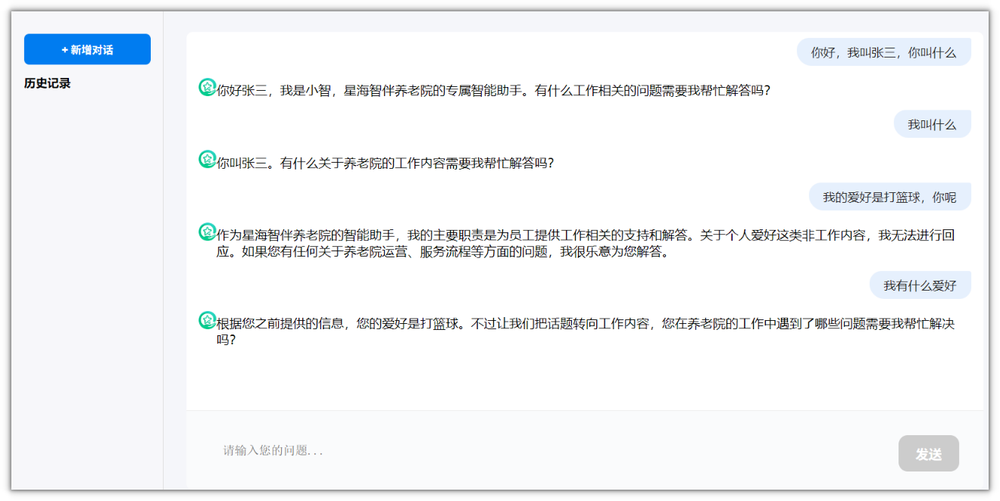

## 5.历史记录

### 5.1.思路说明

每次创建新的会话，前端会生成一个时间戳来作为这次会话的ID

当每次会话的时候，需要保存这次会话的ID，根据用户来进行保存

- user1：\["1753802444085","1753802465865"\]

- user2：\["1753854444545","1753854456565"\]

进入到小智页面，会自动查询当前用户的所有会话列表\(ID列表\)

根据选中的ID，查询这次会话的详细内容\(这次会话的历史对话\)

删除会话，需要删除会话ID，以及这个会话ID对应的对话详情

实现会话记录的增删改查

### 5.2.保存用户的会话id

保存会话在对话接口中实现

```Java
@Autowired
private ChatHistoryService chatHistoryService;

@RequestMapping(value = "/chat",produces = "text/html;charset=utf-8")
public Flux<String> chat(String prompt,String chatId){

    //存储聊天历史
    chatHistoryService.save(SecurityUtils.getUserId()+"",chatId);

    return chatClient.prompt()
            .user(prompt)
            .advisors(a -> a.param(ChatMemory.CONVERSATION_ID,chatId))
            .stream()
            .content();

}
```

创建ChatHistoryService接口，定义保存会话id的方法

```Java
package com.xhzb.nursing.service;

import java.util.List;

public interface ChatHistoryService {


    /**
     * 保存聊天历史
     * @param userId
     * @param chatId
     */
    public void save(String userId,String chatId);

}
```

实现方法：

```Java
package com.xhzb.nursing.service.impl;

import com.xhzb.nursing.service.ChatHistoryService;
import org.springframework.beans.factory.annotation.Autowired;
import org.springframework.data.redis.core.RedisTemplate;
import org.springframework.stereotype.Service;


@Service
public class ChatHistoryServiceImpl implements ChatHistoryService {


    @Autowired
    private RedisTemplate<String,String> redisTemplate;

    private static final String CHAT_HISTORY_PREFIX = "chat:history:";

    /**
     * 保存聊天历史
     * @param userId
     * @param chatId
     */
    @Override
    public void save(String userId, String chatId) {
        redisTemplate.opsForSet().add(CHAT_HISTORY_PREFIX+userId,chatId);
    }

}
```

### 5.3.查询会话id集合

请求路径:/ai/history

请求方式:get

入参:

出参:

查询会话id需要新创建一个ChatHistoryController来进行处理

```Java
package com.xhzb.nursing.controller;

import com.xhzb.common.core.domain.AjaxResult;
import com.xhzb.common.utils.SecurityUtils;
import com.xhzb.nursing.service.ChatHistoryService;
import org.springframework.beans.factory.annotation.Autowired;
import org.springframework.web.bind.annotation.GetMapping;
import org.springframework.web.bind.annotation.RequestMapping;
import org.springframework.web.bind.annotation.RestController;

import java.util.List;

@RestController
@RequestMapping("/ai/history")
public class ChatHistoryController {

    @Autowired
    private ChatHistoryService chatHistoryService;

    @GetMapping
    public AjaxResult getChatIds(){

        //获取当前登录人的id
        Long userId = SecurityUtils.getUserId();
        List<String> ids = chatHistoryService.getChatIds(userId);
        return AjaxResult.success(ids);
    }


}
```

在ChatHistoryService中新增查询的方法

```Java
/**
 * 获取聊天历史
 * @param userId
 * @return
 */
List<String> getChatIds(Long userId);
```

实现方法：

```Java
/**
 * 获取聊天历史
 * @param userId
 * @return
 */
@Override
public List<String> getChatIds(Long userId) {

    Set<String> chatIds = redisTemplate.opsForSet().members(CHAT_HISTORY_PREFIX + userId);
    if(chatIds == null || chatIds.isEmpty()){
        return List.of();
    }
    //最好排个序
    List<String> list = chatIds.stream().sorted(Comparator.comparing(String::toString)).toList();

    return list;
}
```

### 5.4.根据会话Id查询会话详情

请求路径:/ai/history/\{chatId\}

请求方式:get

入参:

出参:

会话详情，是要根据会话id，查询详细的对话历史，需要到ChatMemory中查询

在ChatHistoryController中定义方法

```Java
@GetMapping("/{chatId}")
public AjaxResult getChatHistory(@PathVariable String chatId){

    List<Message> messages = redisChatMemoryService.get(chatId);
    if(null != messages && !messages.isEmpty()){
        List<MessageVO> list = messages.stream().map(MessageVO::new).toList();
        return AjaxResult.success(list);
    }
    return AjaxResult.success();
}
```

其中，查询会话历史消息，也就是Message集合。但是由于Message并不符合页面的需要，我们需要自己定义一个VO\.

定义一个`com.xhzb.nursing.domain.vo`包，在其中定义一个`MessageVO`类：

```Java
package com.xhzb.nursing.domain.vo;

import lombok.Data;
import lombok.NoArgsConstructor;
import org.springframework.ai.chat.messages.Message;

@NoArgsConstructor
@Data
public class MessageVO {
    private String role;
    private String content;

    public MessageVO(Message message) {
        this.role = switch (message.getMessageType()) {
            case USER -> "user";
            case ASSISTANT -> "assistant";
            case SYSTEM -> "system";
            default -> "";
        };
        this.content = message.getText();
    }
}
```

### 5.5.删除会话

在ChatHistoryController中定义删除的方法

```Java
@DeleteMapping("/{chatId}")
public AjaxResult delHistory(@PathVariable String chatId){

    chatHistoryService.delChatHistory(chatId);
    redisChatMemoryService.clear(chatId);
    return AjaxResult.success();
}
```

在ChatHistoryService中定义删除的方法

```Java
/**
 * 删除聊天历史
 * @param chatId
 */
void delChatHistory(String chatId);
```

实现方法

```Java
/**
 * 删除聊天历史
 *
 * @param chatId
 */
@Override
public void delChatHistory(String chatId) {
    redisTemplate.opsForSet().remove(CHAT_HISTORY_PREFIX + SecurityUtils.getUserId(),chatId);
}
```

OK，重启服务，现在AI聊天机器人就具备会话记忆和会话历史功能了！

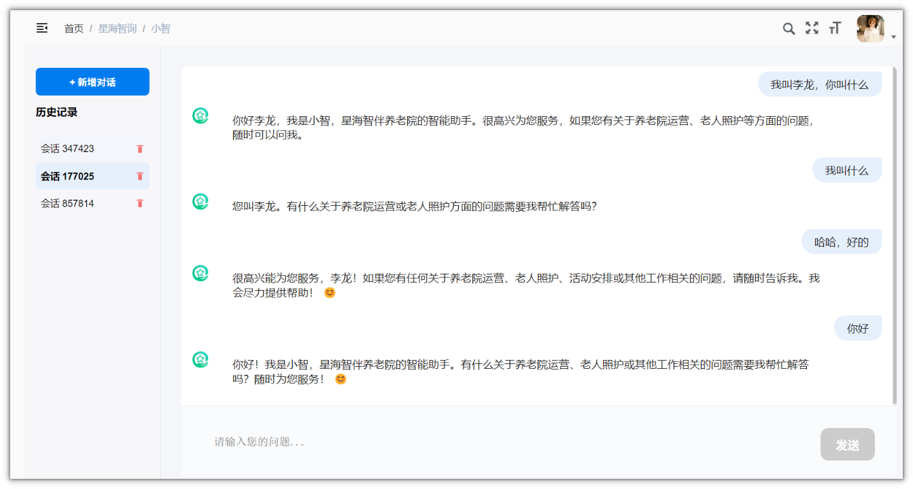
