# 一、目标

今日目标：

- 能够清楚的描述RAG系统的原理
- 能够清楚向量模型的特点并集成到项目中使用
- 能够掌握向量数据库redis-stack的搭建和使用
- 能够掌握常见的文档拆分策略
- 能够完成对星海智伴的RAG系统的开发

# 二、RAG基础

## 1.什么是大模型幻觉

近年来，随着ChatGPT的广泛应用，基于大规模语言模型（LLM）的技术已成为人工智能领域的研究和应用热点。尤其是大模型在各类自然语言处理任务中的成功应用，推动了多个行业的智能化转型。然而，当前市面上大多数大语言模型存在一个普遍的问题：这些模型主要依赖于过往的训练数据，无法动态获取最新的知识以及各企业特有的私有知识。这种局限性常常导致生成答案时出现“幻觉”问题，即模型提供的答案与实际情况不符或不准确。

## 2.如何解决大模型幻觉

目前业界解决幻觉问题最主流、最有效的技术路径就是大模型微调和RAG\(检索增强生成\)

1.基于企业私有知识的垂直领域微调：通过将企业领域的特定知识融合到大模型中，进行微调，使得模型能够更好地服务于垂直行业的专业需求。

2.基于企业私有知识的RAG（Retrieval\-Augmented Generation）问答系统：通过构建基于检索的问答框架，结合企业私有知识库，实现更为精准且动态更新的知识问答服务，从而减少幻觉问题的发生。

## 3.RAG原理

### 3.1.基本原理

下面这张图是来源于`Spring AI`官网文档，说明了RAG整体实现流程。

[AI Concepts :: Spring AI Reference](https://docs.spring.io/spring-ai/reference/concepts.html#concept-rag)

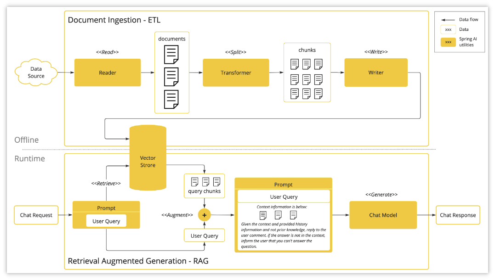

> 这张图展示了文档摄取（ETL）和检索增强生成（RAG）两个核心流程，具体可分为以下两部分：
>
> 1.文档摄取（ETL）流程（离线处理）
>
> - 数据读取：从数据源（如文档、数据库）读取原始文档。
>
> - 分割文档：通过分割模块（`<<Split>>`）将文档切分为更小的数据块（chunks）。
>
> - 转换数据：通过转换模块（`Transformer`）处理数据块（如向量化、添加元数据）。
>
> - 写入存储：将处理后的数据块写入向量数据库（`Vector Store`），为后续检索做准备。
>
> - 核心目标：将非结构化文档转化为结构化、可检索的向量数据。
>
> 2.检索增强生成（RAG）流程（实时处理）
>
> - 用户查询：接收用户提问（`Chat Request`）。
>
> - 检索相关块：从向量库中检索与查询最相关（相似度高）的数据块（`<<Retrieve>>`）。
>
> - 增强查询：将检索到的上下文信息（`Context information`）与用户问题结合，生成增强后的提示（`<<Augment>>`）。
>
> - 生成响应：通过聊天模型（`Chat Model`）生成回答。
>
> - 核心目标：通过外部知识库提升生成结果的准确性，解决了大模型信息缺失或滞后的问题。

### 3.2.相似度计算

在上述的原理中，我们知道，在向大模型发起请求前，需要到向量库（知识库）查询，而且是相似性的查询，那究竟什么是相似性查询？也就是说，如何判断两个文字相似呢？比如：`北京` 和 `北京市`，这两个词相似度高，`北京` 和 `天津市`，这两个词相似度就低。怎么做到呢？

1.先将数据（文字或图片等）向量化

为什么要向量化？什么是向量化？

这是因为，计算机无法直接理解文本、图片等非结构化数据，把图片、文字、语音这类非结构化内容，转换成一串数字，这串数字就是向量。

2.通过相似度算法进行判断

余弦相似度：是通过计算两个向量在多维空间中的夹角余弦值来评估它们的相似度。

欧式距离：是衡量空间中两点间直线距离典方法。

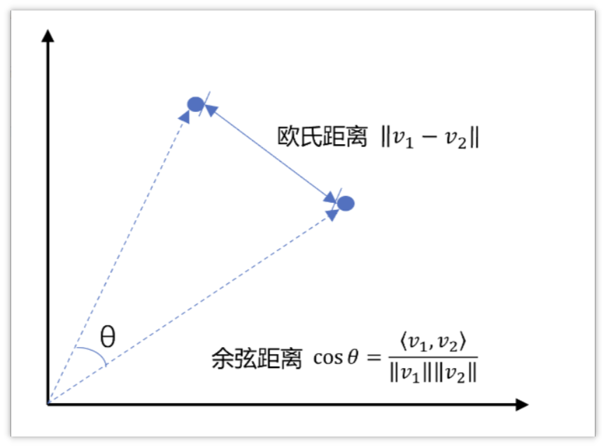

余弦相似度的取值范围是\[\-1, 1\]，夹角越小（即余弦值越接近于1），两个向量越相似。

欧式距离值约小约相似，反之越不相似

举个例子：

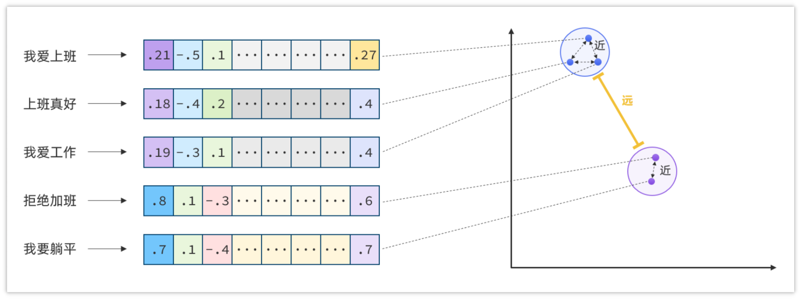

### 3.3.向量数据库

向量数据库就是用来存储向量数据的数据库，Spring AI也支持了很多的向量数据库，如下

[Vector Databases :: Spring AI Reference](https://docs.spring.io/spring-ai/reference/api/vectordbs.html#_vectorstore_implementations)

```Bash
Azure Vector Search - The Azure vector store.
Apache Cassandra - The Apache Cassandra vector store.
Chroma Vector Store - The Chroma vector store.
Elasticsearch Vector Store - The Elasticsearch vector store.
GemFire Vector Store - The GemFire vector store.
MariaDB Vector Store - The MariaDB vector store.
Milvus Vector Store - The Milvus vector store.
MongoDB Atlas Vector Store - The MongoDB Atlas vector store.
Neo4j Vector Store - The Neo4j vector store.
OpenSearch Vector Store - The OpenSearch vector store.
Oracle Vector Store - The Oracle Database vector store.
PgVector Store - The PostgreSQL/PGVector vector store.
Pinecone Vector Store - PineCone vector store.
Qdrant Vector Store - Qdrant vector store.
Redis Vector Store - The Redis vector store.
SAP Hana Vector Store - The SAP HANA vector store.
Typesense Vector Store - The Typesense vector store.
Weaviate Vector Store - The Weaviate vector store.
SimpleVectorStore - 一种简单的基于内存存储的持久化向量存储实现，适合用于教育目的。
```

## 4.向量模型

向量模型很多平台都支持，也可以使用ollama来部署向量模型，本次采用的百炼平台中提供的向量模型

阿里云百炼中支持了多种向量模型，如下图所示

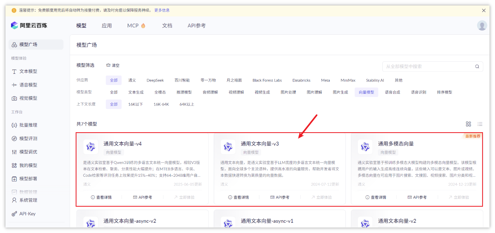

> 我们选择一个适中的向量模型，通用文本向量\-v3
> 

在提供的向量模型中，向量维度、费用、支持的语言都不太相同，如下图所示

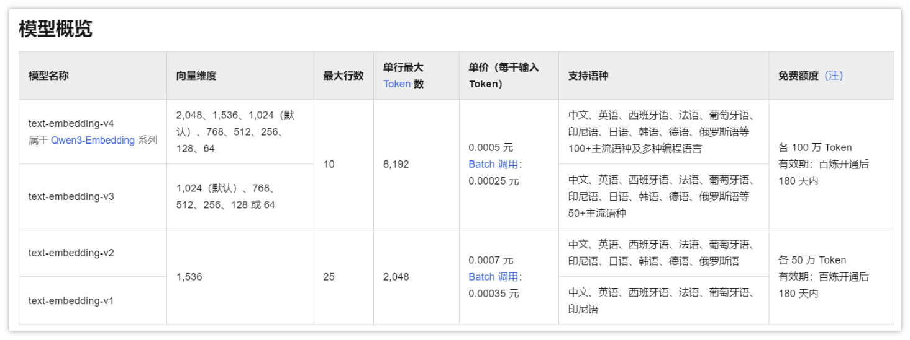

我们选择的text\-embedding\-v3最大支持1024维、支持包含中英文的50\+主流语种可进行向量化

> 赠送的百万token可适用此模型
> 
> 本地模型  BGE\-M3
> 

向量维度，就是把一句话 / 一段文字，变成一个「数字数组」时，这个数组里有多少个数字。

举个例子：

- 把 “今天天气真好” 这句话，变成一个向量
- 维度是 1024 → 就是生成一个长度为 1024 的数组：`[0.12, -0.34, 0.56, ...]`（一共 1024 个数字）
- 维度是 2048 → 就是生成一个长度为 2048 的数组，包含更多信息

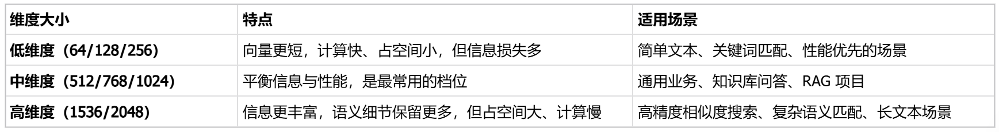

百炼的向量模型也兼容了openai的接口，所以我们依然可以使用springai来对接向量模型

在application\.yml文件中添加向量模型的支持

```YAML
spring:
  ai:
    openai:
      api-key: ${OPENAI_API_KEY}  #读取环境变量中的api key
      base-url: https://dashscope.aliyuncs.com/compatible-mode
      chat:
        options:
          model: qwen-max-latest
      embedding:
        options:
          model: text-embedding-v3
          dimensions: 1024
```

## 5.搭建向量数据库

### 5.1.创建容器

首先，你需要安装一个Redis Stack，这是Redis官方提供的拓展版本，其中有向量库的功能。

1.从当天资料中找到`redis-stack.tar` 上传到服务器中，加载为镜像（虚拟机已提供）

```Bash
docker load -i redis-stack.tar
```

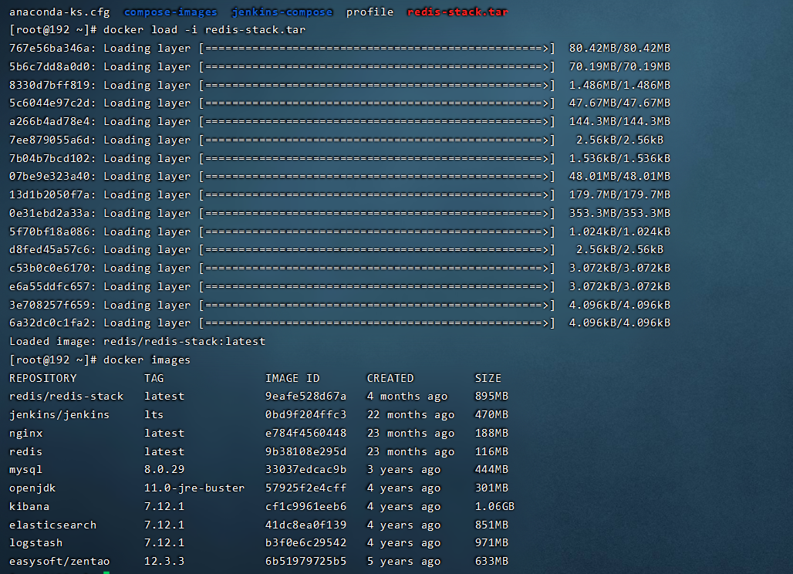

可以使用Docker安装：

```Bash
# 检查是否已经存在容器 redis-stack
docker ps -a 

# 存在直接启动
docker start redis-stack

# 不存在 运行新容器
docker run -d --restart=always --name redis-stack -p 6378:6379 -p 8801:8001 redis/redis-stack:latest
```

### 5.2.访问控制台

通过浏览器访问控制台：http://192.168.100.168:8801，注意，这里的IP要换成你自己的服务器IP

初次进入较慢，且需要同意条款，并提交

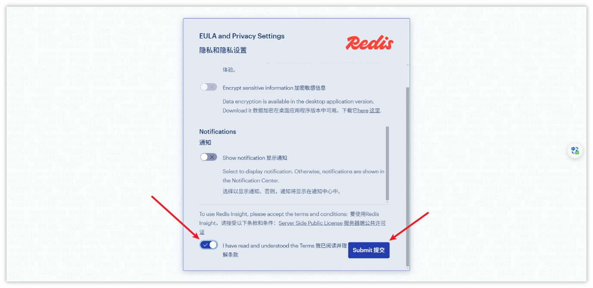

控制台效果

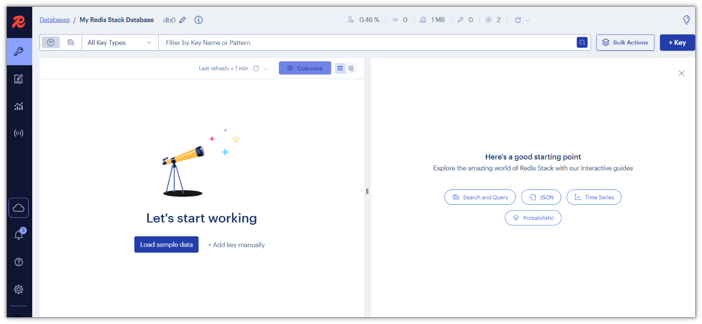

也可以使用之前安装的redis工具进行连接查看（注意，没有设置密码，可以直接连接）

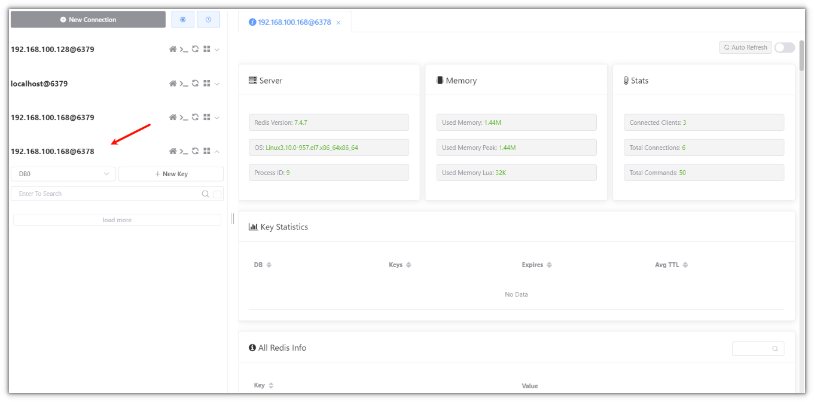

### 5.3.项目中集成向量数据库

在`xhzb-nursing-platform`的pom文件中添加新的依赖

```XML
<dependency>
    <groupId>org.springframework.ai</groupId>
    <artifactId>spring-ai-redis-store</artifactId>
</dependency>
```

新增配置类RedisVector的配置类

```Java
package com.xhzb.nursing.config;

import org.springframework.ai.embedding.EmbeddingModel;
import org.springframework.ai.embedding.TokenCountBatchingStrategy;
import org.springframework.ai.openai.OpenAiEmbeddingModel;
import org.springframework.ai.vectorstore.VectorStore;
import org.springframework.ai.vectorstore.redis.RedisVectorStore;
import org.springframework.context.annotation.Bean;
import org.springframework.context.annotation.Configuration;
import redis.clients.jedis.JedisPooled;

/**
 * Redis向量存储配置类
 * 用于配置基于Redis的向量数据库，支持AI语义搜索功能
 */
@Configuration
public class RedisVectorConfig {

    /**
     * 创建Jedis连接池实例
     * 用于连接Redis服务器，提供向量数据存储能力
     * 
     * @return JedisPooled Redis连接池对象
     */
    @Bean
    public JedisPooled jedisPooled() {
        // 连接到指定IP和端口的Redis服务器
        return new JedisPooled("192.168.100.168", 6378);
    }

    /**
     * 创建向量存储实例
     * 配置Redis作为向量数据库，用于存储和检索AI生成的向量嵌入
     * 
     * @param jedisPooled Redis连接池
     * @param openAiEmbeddingModel OpenAI嵌入模型，用于生成文本向量
     * @return VectorStore 向量存储对象
     */
    @Bean
    public VectorStore vectorStore(JedisPooled jedisPooled, OpenAiEmbeddingModel openAiEmbeddingModel) {
        return RedisVectorStore.builder(jedisPooled, openAiEmbeddingModel)
                .indexName("spring-ai-index")                // 设置向量索引名称，默认为"spring-ai-index"
                .prefix("doc:")                  // 设置Redis键前缀，默认为"doc:"
                .metadataFields(                         // 定义元数据字段，用于过滤和检索
                        RedisVectorStore.MetadataField.tag("country"),   // 国家标签字段
                        RedisVectorStore.MetadataField.numeric("year"))  // 年份数值字段
                .initializeSchema(true)                   // 是否初始化索引架构，默认false
                .batchingStrategy(new TokenCountBatchingStrategy()) // 批处理策略，按token数量分批处理
                .build();
    }

}
```

在xhzb\-admin中添加依赖：

```XML
<dependency>
    <groupId>org.springframework.boot</groupId>
    <artifactId>spring-boot-starter-test</artifactId>
</dependency>
```

测试向量模型，`xhzb-admin`模块中编写测试类，添加简单的文本

```Java
package com.xhzb.test;

import org.junit.jupiter.api.Test;
import org.springframework.ai.document.Document;
import org.springframework.ai.vectorstore.VectorStore;
import org.springframework.beans.factory.annotation.Autowired;
import org.springframework.boot.test.context.SpringBootTest;

import java.util.ArrayList;
import java.util.List;

@SpringBootTest
public class RedisVectorTest {

    @Autowired
    private VectorStore vectorStore;

    @Test
    public void test(){
        Document doc1 = new Document("延庆区位于北京西北部，以山地为主（山区占72.8%），拥有海陀山等自然景观，空气质量优异（2025年7月AQI达优级），是北京市生态涵养核心区。" );
        Document doc2 = new Document("北京八达岭长城是世界文化遗产，明代长城最精华段，素有“北门锁钥”之称，是万里长城的重要关隘与代表性景观。" );
        List<Document> list = new ArrayList<>();
        list.add(doc1);
        list.add(doc2);
        vectorStore.add(list);
    }
}
```

添加向量后的效果，可以通过redis链接工具查看

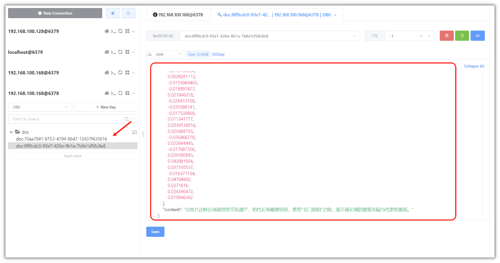

# 三、ETL Pipeline

[ETL Pipeline :: Spring AI Reference](https://docs.spring.io/spring-ai/reference/api/etl-pipeline.html)

ETL 是三个英文单词的缩写

- Extract\(提取\)  从数据源获取数据（如PDF、数据库、API）

- Transform\(转换\)   对数据进行处理（清洗、拆分、增强、结构化）

- Load\(加载\)   将数据写入目标系统（如向量数据库）

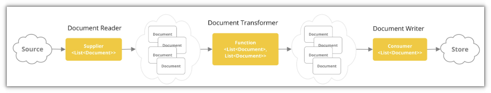

## 1.Reader（文档读取）

Spring AI原则上支持任意格式的文档，常见的有：TXT、PDF、HTML、JSON、MD等

### 1.1.读取普通文本

`TextReader`程序处理纯文本文件，并将其转换为对象列表`Document`。

```Java
package com.xhzb.test;

import org.junit.jupiter.api.Test;
import org.springframework.ai.document.Document;
import org.springframework.ai.reader.TextReader;
import org.springframework.boot.test.context.SpringBootTest;
import org.springframework.core.io.InputStreamResource;

import java.io.FileInputStream;
import java.io.FileNotFoundException;
import java.util.List;

public class ETLTest {


    @Test
    public void testLoadText() throws FileNotFoundException {
        // 读取文件
        InputStreamResource resource = new InputStreamResource(new FileInputStream("D:\\abc.txt"));
        // 创建TextReader
        TextReader textReader = new TextReader(resource);

        //追加一点东西(自定义)
        textReader.getCustomMetadata().put("filename", "abc.txt");

        // 读取文件内容
        List<Document> documentList = textReader.read();
        for (Document document : documentList) {
            System.out.println(document.getFormattedContent());
        }
    }

}
```

### 1.2.读取PDF

PDF读取分为了两类，按页读取和按段落读取

Xhzb\-nursing\-platform 中导入依赖

```XML
<dependency>
    <groupId>org.springframework.ai</groupId>
    <artifactId>spring-ai-pdf-document-reader</artifactId>
</dependency>
```

按页读取

```Java
@Test
public void testPDFByPage() throws FileNotFoundException {
    // 读取文件
    InputStreamResource resource = new InputStreamResource(new FileInputStream("D:\\护理员工工作手册.pdf"));

    PagePdfDocumentReader pdfReader = new PagePdfDocumentReader(resource,
            PdfDocumentReaderConfig.builder()
                    .withPageTopMargin(0) // 设置页眉边距
                    .withPageExtractedTextFormatter(ExtractedTextFormatter.builder()
                            .withNumberOfTopTextLinesToDelete(0) // 删除页眉顶部的文本行数
                            .build())
                    .withPagesPerDocument(1) // 每个文档的页数
                    .build());

    System.out.println(pdfReader.read());
}
```

按段落读取

```Java
@Test
public void testPDFByParagraph() throws FileNotFoundException {
    // 读取文件
    InputStreamResource resource = new InputStreamResource(new FileInputStream("D:\\护理员工工作手册.pdf"));

    ParagraphPdfDocumentReader pdfReader = new ParagraphPdfDocumentReader(resource,
            PdfDocumentReaderConfig.builder()
                    .withPageTopMargin(0) // 设置页眉边距
                    .withPageExtractedTextFormatter(ExtractedTextFormatter.builder()
                            .withNumberOfTopTextLinesToDelete(0) // 删除页眉顶部的文本行数
                            .build())
                    .withPagesPerDocument(1) // 每个文档的页数
                    .build());

    System.out.println(pdfReader.read());
}
```

## 2.Chunk（文档拆分策略）

`TextSplitter`抽象基类，用于帮助分割文档以适应 AI 模型的上下文窗口。

```Java
@Test
public void testTestSplitter() throws FileNotFoundException {

    // 读取文件
    InputStreamResource resource = new InputStreamResource(new FileInputStream("D:\\护理员工工作手册.pdf"));

    PagePdfDocumentReader pdfReader = new PagePdfDocumentReader(resource,
            PdfDocumentReaderConfig.builder()
                    .withPageTopMargin(0) // 设置页眉边距
                    .withPageExtractedTextFormatter(ExtractedTextFormatter.builder()
                            .withNumberOfTopTextLinesToDelete(0) // 删除页眉顶部的文本行数
                            .build())
                    .withPagesPerDocument(1) // 每个文档的页数
                    .build());


    // 创建TextSplitter
    TextSplitter textSplitter = new TokenTextSplitter();
    System.out.println("分隔之前的文档数："+pdfReader.read().size());
    List<Document> documents = textSplitter.apply(pdfReader.read());
    System.out.println("分隔之后的文档数："+documents.size());
    System.out.println(documents);

}
```

上述代码中，new TokenTextSplitter\(\)  在构造函数中，默认给了一些分隔策略，如下构造

```Java
public TokenTextSplitter() {
    this(800, 350, 5, 10000, true);
}
```

`chunkSize`：每个文本块的目标大小（以标记为单位）（默认值：800）。

`minChunkSizeChars`：每个文本块的最小长度（以字符为单位）（默认值：350）。

`minChunkLengthToEmbed`：要包含的数据块的最小长度（默认值：5）。

`maxNumChunks`：从文本生成的最大块数（默认值：10000）。

`keepSeparator`是否在数据块中保留分隔符（如换行符）（默认值：true）。

除此之外，我们也可以自定义分隔策略：

按照块大小进行分隔

```Java
TokenTextSplitter splitter = TokenTextSplitter.builder()
            .withChunkSize(1000)
            .withMinChunkSizeChars(400)
            .withMinChunkLengthToEmbed(10)
            .withMaxNumChunks(5000)
            .withKeepSeparator(true)
            .build();
```

## 3.写入向量库

如果文档已经读取，并且分隔完成，就可以直接存入到向量数据库中，默认会关联向量模型，对分块之后的内容，先向量化，然后存储

```Java
@Autowired
private VectorStore vectorStore;

@Test
public void testTestSplitter() throws FileNotFoundException {

    // 读取文件
    InputStreamResource resource = new InputStreamResource(new FileInputStream("D:\\护理员工工作手册.pdf"));

    PagePdfDocumentReader pdfReader = new PagePdfDocumentReader(resource,
            PdfDocumentReaderConfig.builder()
                    .withPageTopMargin(0) // 设置页眉边距
                    .withPageExtractedTextFormatter(ExtractedTextFormatter.builder()
                            .withNumberOfTopTextLinesToDelete(0) // 删除页眉顶部的文本行数
                            .build())
                    .withPagesPerDocument(1) // 每个文档的页数
                    .build());

    // 创建TextSplitter
    TextSplitter textSplitter = new TokenTextSplitter();
    System.out.println("分隔之前的文档数："+pdfReader.read().size());
    List<Document> documents = textSplitter.apply(pdfReader.read());
    System.out.println("分隔之后的文档数："+documents.size());
    
    //存储到向量数据库中，分批添加（每批最多10个）
    int batchSize = 10;
    for (int i = 0; i < documents.size(); i += batchSize) {
        List<Document> batch = documents.subList(i, Math.min(i + batchSize, documents.size()));
        vectorStore.add(batch);
        System.out.println("已添加批次: " + (i / batchSize + 1) + ", 数量: " + batch.size());
    }
}
```

> 上述代码，vectorStore需要从IOC容器中获取，所以需要在类上添加集成测试的注解：@SpringBootTest
> 

运行效果：

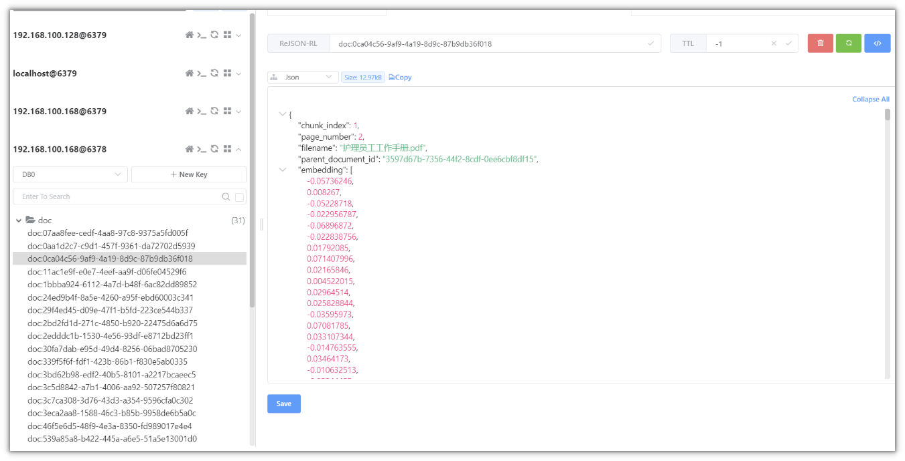

# 四、Retrieval（检索）

在对文档进行检索的时候，可以按照相似度阈值返回多少个文档\(TopK\)

xhzb\-nursing\-platform先导入依赖：

```XML
<dependency>
    <groupId>org.springframework.ai</groupId>
    <artifactId>spring-ai-rag</artifactId>
</dependency>
```

案例代码：

```JSON
@Test
public void testRetriever() {

    SearchRequest request = SearchRequest.builder()
            .topK(5)
            .similarityThreshold(0.5)
            .query("护理服务宗旨与核心价值是什么")
            .build();
    List<Document> documents = vectorStore.similaritySearch(request);
    log.info("检索到的文档数量:{}", documents.size());
    for (Document document : documents) {
        log.info("文档内容:{}", document.getFormattedContent());
    }


}
```

```Java
@Test
public void testRetriever() {
    DocumentRetriever retriever = VectorStoreDocumentRetriever.builder()
            .vectorStore(vectorStore)
            .similarityThreshold(0.5) // 设置相似度阈值
            .topK(5) // 设置返回的文档数量
            .build();
    List<Document> documents = retriever.retrieve(new Query("护理服务宗旨与核心价值是什么"));
    System.out.println(documents);
}
```

在返回的文档中，相似度越高的，会优先排在最前面

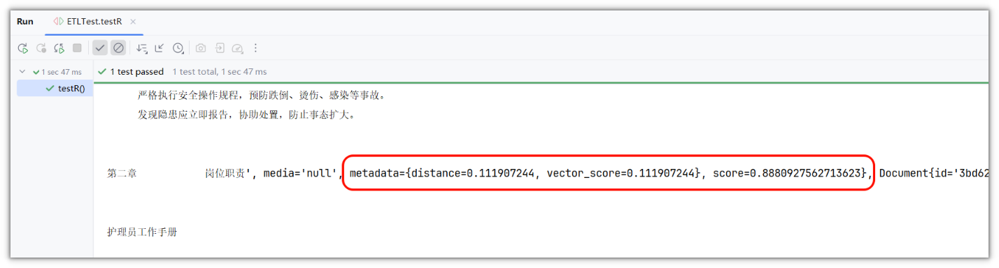

distance  越小越相似

score   越大越相关

# 五、知识库管理

## 1.需求分析

列表查询

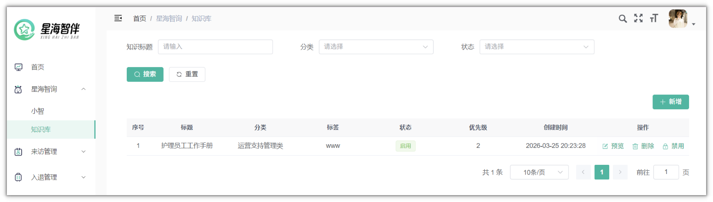

新增文档

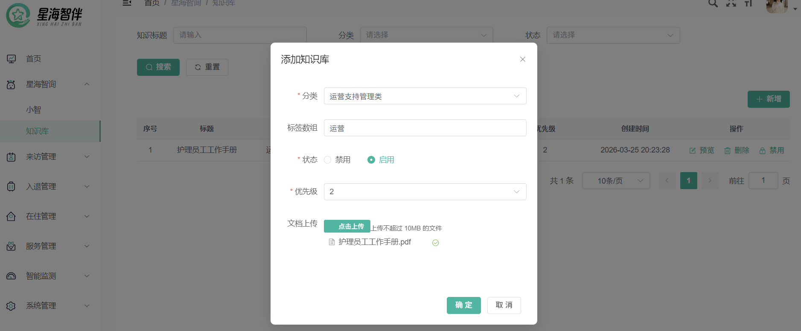

> 上传文档到oss中进行保存
> 
> 当点击确定之后，数据库中要保存文档信息，同时也要把文档的内容通过向量模型保存向量化数据到redis
> 
> 当文档被删除之后， 不仅会删除数据库中的文档，也会删除向量数据库中的数据

表结构：

```SQL
CREATE TABLE `knowledge_base` (
          `id` bigint NOT NULL AUTO_INCREMENT,
          `title` varchar(255) NOT NULL COMMENT '知识标题',
          `category` int unsigned NOT NULL COMMENT '分类',
          `tags` varchar(255) DEFAULT NULL COMMENT '标签数组',
          `status` tinyint NOT NULL COMMENT '状态 0-禁用  1-启用',
          `priority` tinyint unsigned NOT NULL DEFAULT '3' COMMENT '优先级(1-5)',
          `document_url` varchar(255) DEFAULT NULL COMMENT '文档访问URL',
          `create_time` datetime NOT NULL DEFAULT CURRENT_TIMESTAMP,
          `update_time` datetime NOT NULL DEFAULT CURRENT_TIMESTAMP ON UPDATE CURRENT_TIMESTAMP,
          `create_by` bigint DEFAULT NULL COMMENT '创建人id',
          `update_by` bigint DEFAULT NULL COMMENT '更新人id',
          `remark` text DEFAULT NULL COMMENT '备注',
          PRIMARY KEY (`id`)
) ENGINE=InnoDB AUTO_INCREMENT=1 DEFAULT CHARSET=utf8mb4 COLLATE=utf8mb4_0900_ai_ci COMMENT='知识库主表';
```

## 2.准备工作

### 2.1.代码生成

在代码生成模块中导入knowledge\_base表，详细配置如下：

状态的类型改为Integer

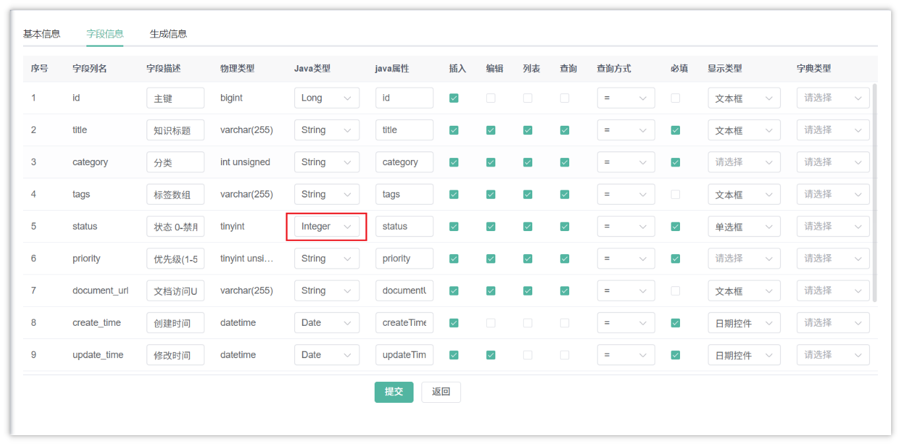

包路径：com\.xhzb\.nursing

模块名：nursing

业务名：knowledgeBase

功能名：知识库

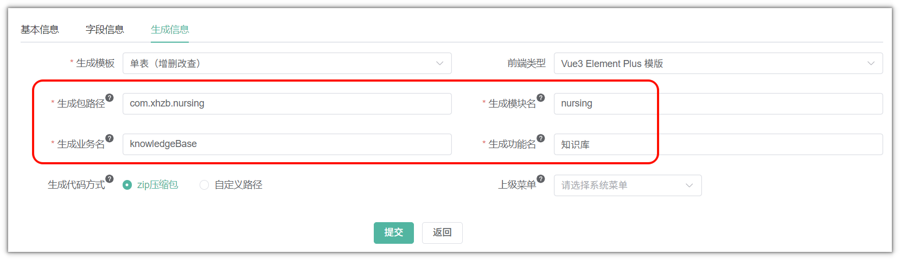

注意：代码生成下载后，只需要拷贝后端代码即可

### 2.2.导入依赖

需要在xhzb\-nursing\-platform模块中的pom文件导入vector\-store和pdf文档拆分的依赖

```XML
<dependency>
    <groupId>org.springframework.ai</groupId>
    <artifactId>spring-ai-advisors-vector-store</artifactId>
</dependency>
```

> spring\-ai\-advisors\-vector\-store  支持把向量数据集成到对话中chatClient

## 3.文档上传

在KnowledgeBaseController中添加上传文件的方法，可以参考智能护理项目上传图片的代码

```Java
@Autowired
private OSSAliyunFileStorageService fileStorageService;

@PostMapping("/upload")
public AjaxResult uploadFile(MultipartFile file) throws Exception {
    try {
        //文件名--->UUID.后缀
        String originalFilename = file.getOriginalFilename();
        String extension = originalFilename.substring(originalFilename.lastIndexOf("."));
        String filename = UUID.randomUUID().toString() + extension;

        //把文件上传到oss中
        String url = fileStorageService.store(filename, file.getInputStream());

        AjaxResult ajax = AjaxResult.success();
        ajax.put("url", url);
        ajax.put("fileName", url);
        ajax.put("originalFilename", file.getOriginalFilename());
        return ajax;
    } catch (Exception e) {
        return AjaxResult.error(e.getMessage());
    }
}
```

## 4.拆分文档及向量化

### 4.1.思路分析

添加文档的思路，参考下图：

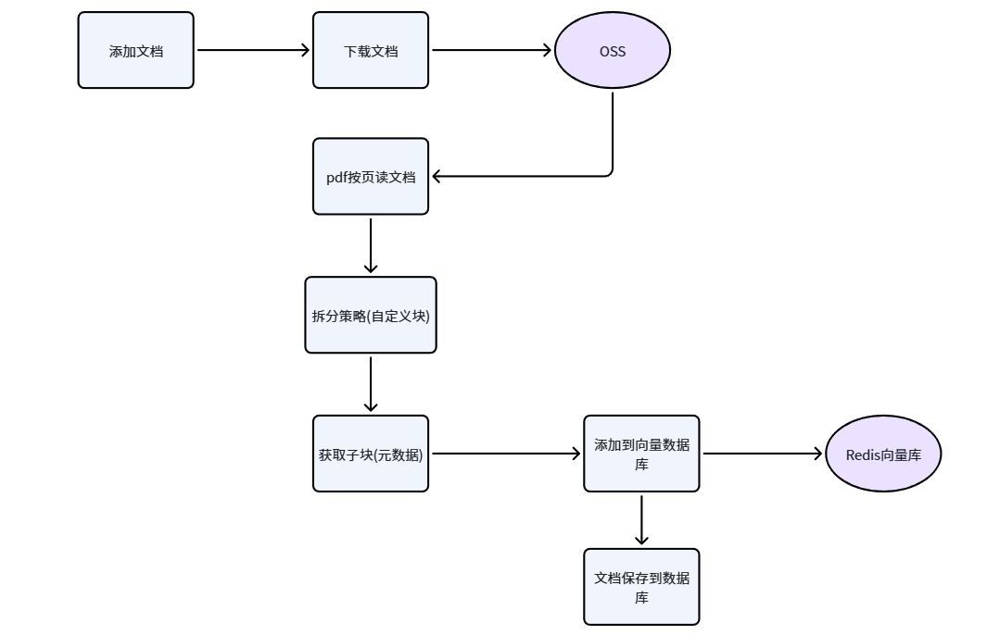

### 4.2.OSS添加下载功能

在xhzb\-oss模块中的OSSAliyunFileStorageService类中添加下载的代码，如下：

```Java
/**
 * 根据url从oss中下载文件
 */
public InputStream download(String pathUrl) {
    String prefix = "https://"+aliOssConfigProperties.getBucketName()+"."+ aliOssConfigProperties.getEndpoint()+"/";
    String key = pathUrl.replace(prefix, "");
    return ossClient.getObject(aliOssConfigProperties.getBucketName(), key).getObjectContent();
}
```

### 4.3.业务层代码

配置自定义分块策略，在SpringAIConfig中新增分隔策略

```Java
@Bean
public TextSplitter textSplitter() {
    return TokenTextSplitter.builder()
            .withChunkSize(500)  //目标块大小  token数
            .withMinChunkSizeChars(200) // 最小块的字符数
            .withMinChunkLengthToEmbed(10) // 最小的文本字符长度
            .withMaxNumChunks(10000)  //文档最大块数
            .withKeepSeparator(false)   //不保留换行符
            .build();
}
```

修改KnowledgeBaseServiceImpl类中的insertKnowledgeBase方法，如下：

```Java
@Autowired
private OSSAliyunFileStorageService fileStorageService;

@Autowired
private TextSplitter textSplitter;

@Autowired
private VectorStore vectorStore;

/**
 * 新增知识库主
 *
 * @param knowledgeBase 知识库主
 * @return 结果
 */
@Override
public int insertKnowledgeBase(KnowledgeBase knowledgeBase) {
    // 下载文件
    InputStream inputStream = fileStorageService.download(knowledgeBase.getDocumentUrl());
    if(inputStream == null){
        throw new BaseException("上传的文件不存在");
    }

    // 读取PDF
    PagePdfDocumentReader pdfReader = new PagePdfDocumentReader(new InputStreamResource(inputStream),
            PdfDocumentReaderConfig.builder()
                    .withPageExtractedTextFormatter(ExtractedTextFormatter.defaults())
                    .withPagesPerDocument(1) // 每1页PDF作为一个Document
                    .build()
    );

    // 对PDF进行拆分
    List<Document> documentList = textSplitter.split(pdfReader.read());
    
    //获取所有的文档的id
    List<String> documentIds = documentList.stream().map(Document::getId).toList();

    // 分批次存储到向量数据库
    int batchSize = 10;
    for (int i = 0; i < documentList.size(); i += batchSize) {
        List<Document> batch = documentList.subList(i, Math.min(i + batchSize, documentList.size()));
        // 3.写入向量库
        vectorStore.add(batch);
        System.out.println("已添加批次: " + (i / batchSize + 1) + ", 数量: " + batch.size());
    }

    // 保存知识库文档到数据库
    knowledgeBase.setCreateTime(DateUtils.getNowDate());
    knowledgeBase.setRemark(JSONUtil.toJsonStr(documentIds));
    return knowledgeBaseMapper.insertKnowledgeBase(knowledgeBase);
}
```

## 5.文档删除及删除向量化数据

当文档删除的时候，需要从向量数据库中删除

### 5.1.控制层

在KnowledgeBaseController中修改remove方法，只需要接收一个参数即可

```Java
/**
 * 删除知识库
 */
@PreAuthorize("@ss.hasPermi('nursing:knowledgeBase:remove')")
@Log(title = "知识库", businessType = BusinessType.DELETE)
@DeleteMapping("/{id}")
public AjaxResult remove(@PathVariable Long id)
{
    return toAjax(knowledgeBaseService.deleteKnowledgeBaseById(id));
}
```

### 5.2.业务层

修改KnowledgeBaseServiceImpl类中的deleteKnowledgeBaseById方法，添加删除向量的逻辑

```Java
/**
 * 删除知识库主信息
 * 
 * @param id 知识库主主键
 * @return 结果
 */
@Override
public int deleteKnowledgeBaseById(Long id)
{
    //查数据
    KnowledgeBase knowledgeBase = selectKnowledgeBaseById(id);
    if(null == knowledgeBase){
        throw new BaseException("知识库不存在");
    }
    // 删除向量中的数据
    String idsStr = knowledgeBase.getRemark();
    List<String> ids = JSONUtil.toList(idsStr, String.class);
    vectorStore.delete(ids);
    //OSS中的数据 也要删除
    fileStorageService.delete(knowledgeBase.getDocumentUrl());
    // 删除mysql的数据
    return knowledgeBaseMapper.deleteKnowledgeBaseById(id);
}
```

## 6.大模型结合Rag

修改SpringAIConfig的openAiChatClient方法，集成向量数据库查询

```Java
@Bean
public ChatClient openAiChatClient(OpenAiChatModel openAiChatModel, VectorStore vectorStore, RedisChatMemoryService redisChatMemoryService) {

    // 检索rag的数据
    QuestionAnswerAdvisor questionAnswerAdvisor = QuestionAnswerAdvisor
            .builder(vectorStore)
            .searchRequest(SearchRequest.builder()
                    .similarityThreshold(0.7d)
                    .topK(5)
                    .build())
            .build();

    return ChatClient
            .builder(openAiChatModel)
            .defaultSystem("你的名字叫小智，专门为养老院的员工进行服务，回答要特别客气！")
            .defaultAdvisors(new SimpleLoggerAdvisor(),
                    MessageChatMemoryAdvisor.builder(redisChatMemoryService).build(),
                    questionAnswerAdvisor)
            .build();
}
```

测试效果，目前已经可以查向量数据库的内容

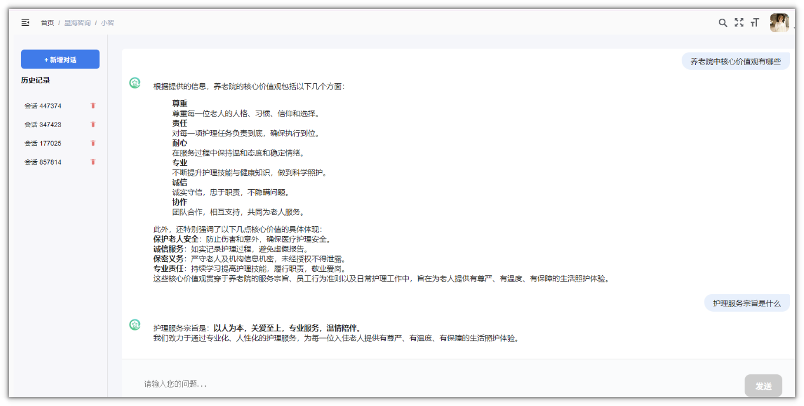
