# 一、目标

今天目标为：

- 能够清楚的描述智能评估模块的业务描述
- 能够独立完成新建健康评估的接口开发
- 能够独立完成查看评估详情的接口开发
- 能够独立完成修改健康评估的接口开发
- 能够独立完成AI大模型对健康指标进行评估的接口开发
- 能够独立完成取消健康评估的接口开发
- 能够独立完成删除健康评估的接口开发

# 二、需求说明

## 1.原型文档

健康评估是指老人办理入住前需上传体检报告，由AI自动进行分析，并对报告进行总结，同时给出合理的建议；

下图是健康评估列表页，展示了经过健康评估的老人列表。

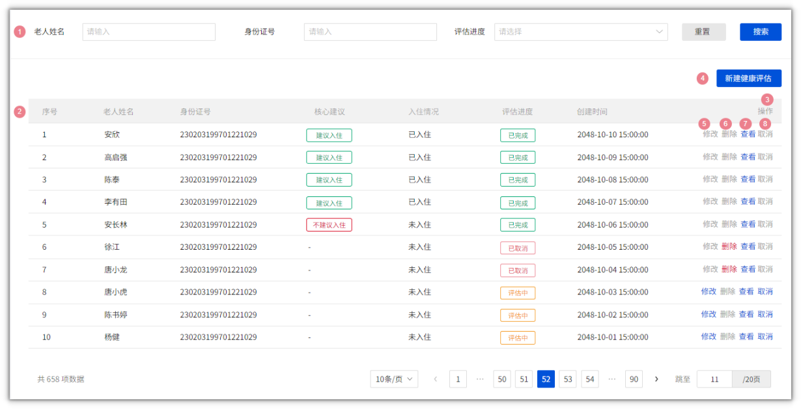

当点击了 新建健康评估 按钮之后会跳转页面，效果如下，需要基本信息及评估的信息，方便使用AI进行分析，详细的录入数据包括：

- 基本信息： 老人的基础数据及家人基本的联系方式等

- 健康评估：老人的疾病信息、意外事件、近30天的体检报告等

- 日常生活活动：日常生活自理能力，进食、洗澡、穿衣、大小便、行走等

- 精神状态：记忆能力、是否抑郁、是否有攻击行为等

- 感知觉和沟通：意识水平、视力、听力、沟通能力等

- 社会参与：生活能力、工作能力、空间和时间定向能力等

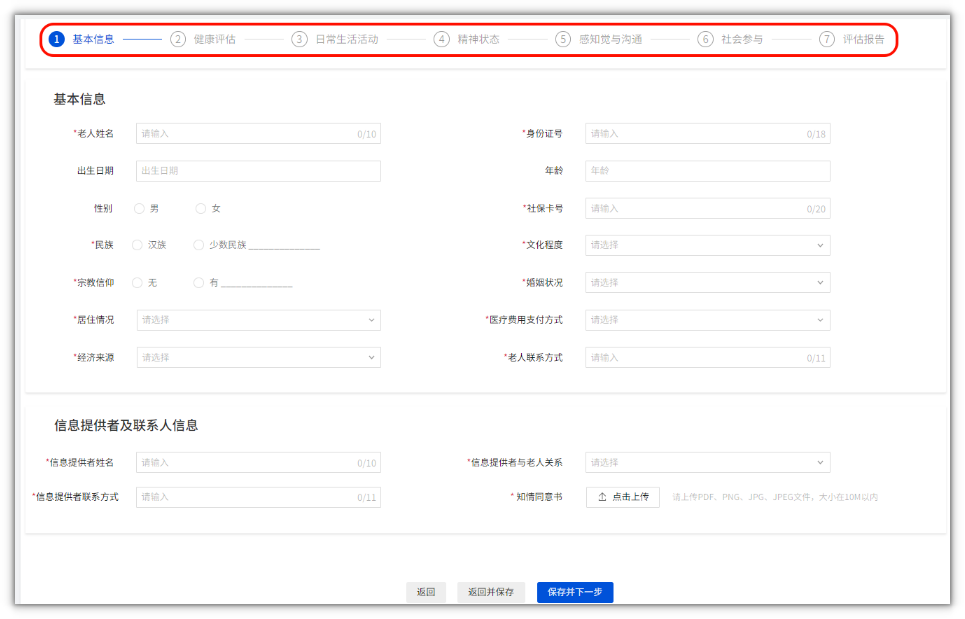

其他详细说明，请参考项目原型

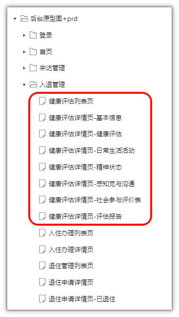

下图是健康评估的详情页面，是使用AI分析后的结果页，给了很多的数据，可以让护理员或销售来查看老人的健康状况，进一步更好的服务老人或者给老人推荐一些护理服务。

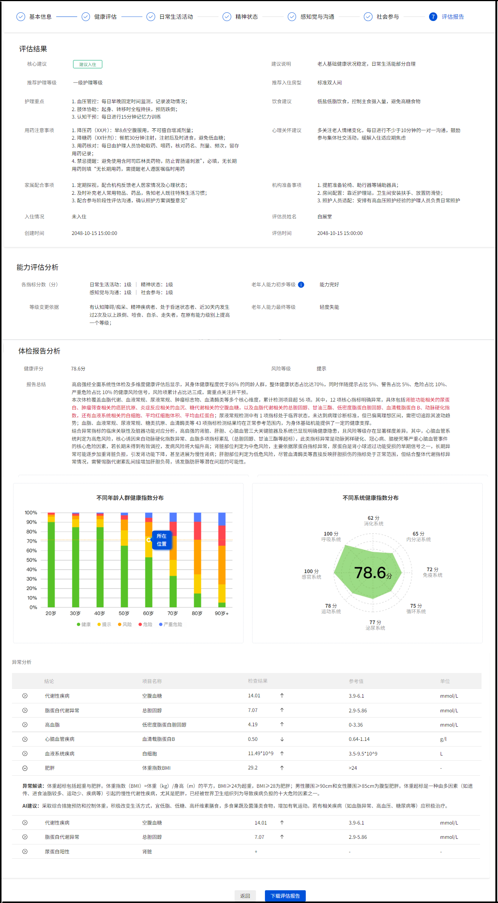

## 2.表结构说明

基于需求原型，可以创建三张表来管理健康评估

简图

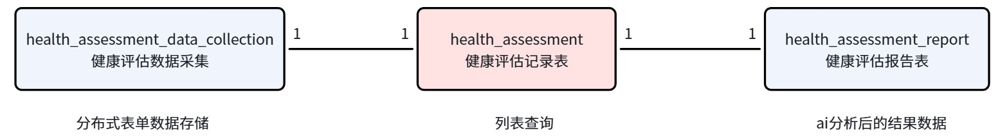

详细表表结构图

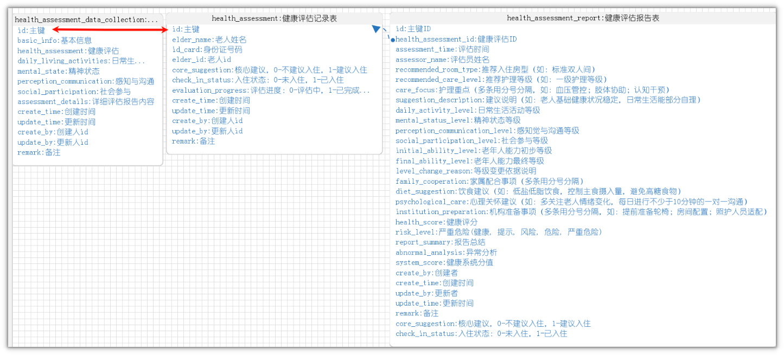

建表语句：

```sql
CREATE TABLE `health_assessment` (
  `id` bigint NOT NULL AUTO_INCREMENT COMMENT '主键',
  `elder_name` varchar(50) NOT NULL COMMENT '老人姓名',
  `id_card` varchar(18) NOT NULL COMMENT '身份证号码',
  `elder_id` bigint DEFAULT NULL COMMENT '老人id',
  `core_suggestion` tinyint(1) DEFAULT NULL COMMENT '核心建议，0-不建议入住，1-建议入住',
  `check_in_status` tinyint(1) DEFAULT NULL COMMENT '入住状态：0-未入住，1-已入住',
  `evaluation_progress` tinyint(1) DEFAULT NULL COMMENT '评估进度：0-评估中，1-已完成，2-已取消',
  `create_time` datetime DEFAULT NULL COMMENT '创建时间',
  `update_time` datetime DEFAULT NULL COMMENT '更新时间',
  `create_by` bigint DEFAULT NULL COMMENT '创建人id',
  `update_by` bigint DEFAULT NULL COMMENT '更新人id',
  `remark` varchar(255) DEFAULT NULL COMMENT '备注',
  PRIMARY KEY (`id`)
) ENGINE=InnoDB AUTO_INCREMENT=1 DEFAULT CHARSET=utf8mb4 COLLATE=utf8mb4_0900_ai_ci COMMENT='健康评估记录表';

CREATE TABLE `health_assessment_data_collection` (
  `id` bigint NOT NULL COMMENT '主键',
  `basic_info` text COMMENT '基本信息',
  `health_assessment` text COMMENT '健康评估',
  `daily_living_activities` text COMMENT '日常生活活动',
  `mental_state` text COMMENT '精神状态',
  `perception_communication` text COMMENT '感知与沟通',
  `social_participation` text COMMENT '社会参与',
  `assessment_details` text COMMENT '详细评估报告内容',
  `create_time` datetime DEFAULT NULL COMMENT '创建时间',
  `update_time` datetime DEFAULT NULL COMMENT '更新时间',
  `create_by` bigint DEFAULT NULL COMMENT '创建人id',
  `update_by` bigint DEFAULT NULL COMMENT '更新人id',
  `remark` varchar(255) DEFAULT NULL COMMENT '备注',
  PRIMARY KEY (`id`)
) ENGINE=InnoDB DEFAULT CHARSET=utf8mb4 COLLATE=utf8mb4_0900_ai_ci COMMENT='健康评估数据采集';

CREATE TABLE `health_assessment_report` (
  `id` bigint unsigned NOT NULL AUTO_INCREMENT COMMENT '主键ID',
  `health_assessment_id` bigint unsigned DEFAULT NULL COMMENT '健康评估ID',
  `assessment_time` datetime DEFAULT NULL COMMENT '评估时间',
  `assessor_name` varchar(50) DEFAULT NULL COMMENT '评估员姓名',
  `recommended_room_type` varchar(50) DEFAULT NULL COMMENT '推荐入住房型（如：标准双人间）',
  `recommended_care_level` varchar(20) DEFAULT NULL COMMENT '推荐护理等级（如：一级护理等级）',
  `care_focus` text COMMENT '护理重点（多条用分号分隔，如：血压管控；肢体协助；认知干预）',
  `suggestion_description` text COMMENT '建议说明（如：老人基础健康状况稳定，日常生活能部分自理）',
  `daily_activity_level` varchar(10) DEFAULT NULL COMMENT '日常生活活动等级',
  `mental_status_level` varchar(10) DEFAULT NULL COMMENT '精神状态等级',
  `perception_communication_level` varchar(10) DEFAULT NULL COMMENT '感知觉与沟通等级',
  `social_participation_level` varchar(10) DEFAULT NULL COMMENT '社会参与等级',
  `initial_ability_level` varchar(50) DEFAULT NULL COMMENT '老年人能力初步等级',
  `final_ability_level` varchar(50) DEFAULT NULL COMMENT '老年人能力最终等级',
  `level_change_reason` text COMMENT '等级变更依据说明',
  `family_cooperation` text COMMENT '家属配合事项（多条用分号分隔）',
  `diet_suggestion` text COMMENT '饮食建议（如：低盐低脂饮食，控制主食摄入量，避免高糖食物）',
  `psychological_care` text COMMENT '心理关怀建议（如：多关注老人情绪变化，每日进行不少于10分钟的一对一沟通）',
  `institution_preparation` text COMMENT '机构准备事项（多条用分号分隔，如：提前准备轮椅；房间配置；照护人员适配）',
  `health_score` varchar(20) DEFAULT NULL COMMENT '健康评分',
  `risk_level` varchar(20) DEFAULT NULL COMMENT '严重危险(健康, 提示, 风险, 危险, 严重危险)',
  `report_summary` text COMMENT '报告总结',
  `abnormal_analysis` text COMMENT '异常分析',
  `system_score` varchar(255) DEFAULT NULL COMMENT '健康系统分值',
  `create_by` varchar(255) DEFAULT NULL COMMENT '创建者',
  `create_time` datetime DEFAULT NULL COMMENT '创建时间',
  `update_by` varchar(255) DEFAULT NULL COMMENT '更新者',
  `update_time` datetime DEFAULT NULL COMMENT '更新时间',
  `remark` text COMMENT '备注',
  `core_suggestion` int DEFAULT NULL COMMENT '核心建议，0-不建议入住，1-建议入住',
  `check_in_status` tinyint DEFAULT NULL COMMENT '入住状态：0-未入住，1-已入住',
  PRIMARY KEY (`id`)
) ENGINE=InnoDB AUTO_INCREMENT=1 DEFAULT CHARSET=utf8mb4 COLLATE=utf8mb4_0900_ai_ci COMMENT='健康评估报告表';
```

## 3.接口说明

基于需求说明，在健康评估这个模块中，共有8个接口需要开发，分别是

- 列表查询

- 新建

- 修改

- 取消

- 删除

- 查看评估详情\(前6步\)

- AI评估

- 查看评估详情\(评估结果\)

由于后边的前端已经全部提供，所以大家开发必须要结合接口文档

关于健康评估的接口文档，参考链接：[附录-接口文档](https://lining-lo.github.io/lining-lo-notes/星海智伴/附录-接口文档.html)

# 三、接口开发

## 1.基础代码生成

1.在代码生成模块导入刚才创建的三张表

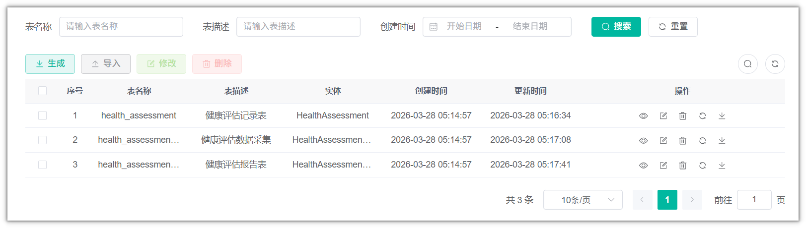

所有的tinyint或int类型  对应的Java类型为  Integer

所有的生成包路径：com\.xhzb\.nursing

所有的模块名：nursing

其中healthAssessment表中的业务名为：healthAssessment

主键和外键\(逻辑外键\)的类型为Long类型

日期相关：

- 创建时间\(createTime\)和修改时间\(updateTime\)类型不用改

- 其他的时间都改为LocalDateTime类型

2.全选，批量生成代码，只拷贝后端

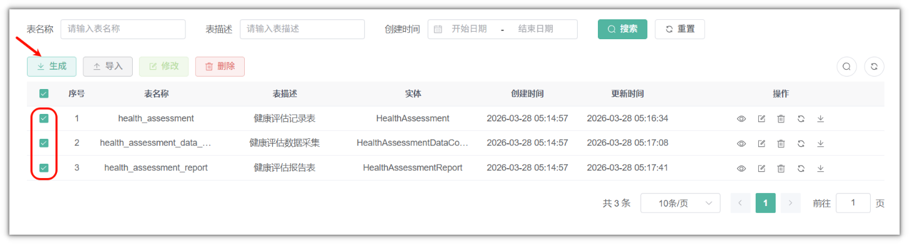

3.删除其他另外两个controller，只留下HealthAssessmentController

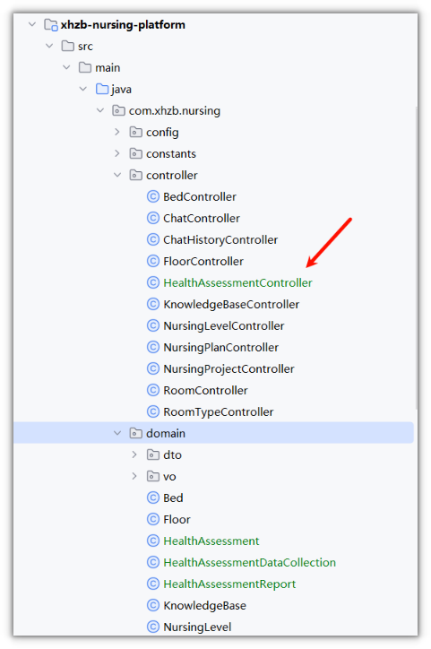

## 2.列表查询

代码生成自动完成，无需开发

## 3.新建健康评估

### 3.1.控制层

修改HealthAssessmentController类中的新增方法，根据接口文档定义Dto类，资料中已提供

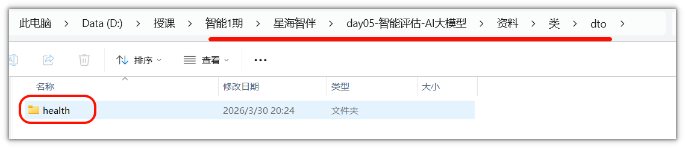

```Java
/**
 * 新增健康评估记录
 */
@PreAuthorize("@ss.hasPermi('nursing:healthAssessment:add')")
@Log(title = "健康评估记录", businessType = BusinessType.INSERT)
@PostMapping
@Operation(summary = "新增健康评估记录")
public AjaxResult add(@RequestBody ElderAssessmentDto dto)
{
    return success(healthAssessmentService.insertHealthAssessment(dto));
}
```

### 3.2.业务层

修改IHealthAssessmentService类中的新增方法，改为定义的Dto

```Java
/**
 * 新增健康评估记录
 * 
 * @param dto 健康评估记录
 * @return 结果
 */
public Long insertHealthAssessment(ElderAssessmentDto dto);
```

实现方法

```Java
@Autowired
private IHealthAssessmentDataCollectionService healthAssessmentDataCollectionService;

/**
 * 新增健康评估记录
 * @param dto 健康评估记录
 * @return 结果
 */
@Transactional(rollbackFor = Exception.class)
@Override
public Long insertHealthAssessment(ElderAssessmentDto dto)
{
    // 保存两份数据，评估记录表，评估数据收集表  注意，这两个表的主键是一样的
    HealthAssessment healthAssessment = new HealthAssessment();
    // 如果id不为空，则根据id查询评估基本信息
    if(dto.getId() != null){
        //查询状态  如果是评估完成，则不能再新增或修改
        HealthAssessment ha = getById(dto.getId());
        if(!ha.getEvaluationProgress().equals(0)){
            throw new BaseException("评估已完成，不能再次修改");
        }
        healthAssessment = ha;
    }else {
        // 入住状态  默认为0  未入住
        healthAssessment.setCheckInStatus(0);
        // 核心建议  默认为null
        healthAssessment.setCoreSuggestion(null);
        // 评估进度  默认为0  评估中
        healthAssessment.setEvaluationProgress(0);
    }
    
    // 老人姓名  从基本信息中获取
    healthAssessment.setElderName(dto.getBasicInfo().getElderName());
    // 身份证号码  从基本信息中获取
    healthAssessment.setIdCard(dto.getBasicInfo().getIdCard());
    // 保存，会自动主键返回
    saveOrUpdate(healthAssessment);

    //评估数据数据采集表
    HealthAssessmentDataCollection healthAssessmentDataCollection = new HealthAssessmentDataCollection();
    // 设置主键，与评估基本信息表的主键一致
    healthAssessmentDataCollection.setId(healthAssessment.getId());
    // 其余字段主要是为了方便展示使用，全部转换为JSON字符串中，存储到字段中
    // 基本信息
    healthAssessmentDataCollection.setBasicInfo(JSONUtil.toJsonStr(dto.getBasicInfo()));
    // 健康评估
    healthAssessmentDataCollection.setHealthAssessment(JSONUtil.toJsonStr(dto.getHealthAssessmentDto()));
    // 日常生活活动
    healthAssessmentDataCollection.setDailyLivingActivities(JSONUtil.toJsonStr(dto.getDailyLivingActivities()));
    // 精神状态
    healthAssessmentDataCollection.setMentalState(JSONUtil.toJsonStr(dto.getMentalState()));
    // 感知与沟通
    healthAssessmentDataCollection.setPerceptionCommunication(JSONUtil.toJsonStr(dto.getPerceptionAndCommunication()));
    // 社会参与
    healthAssessmentDataCollection.setSocialParticipation(JSONUtil.toJsonStr(dto.getSocialParticipation()));

    healthAssessmentDataCollectionService.saveOrUpdate(healthAssessmentDataCollection);

    //返回主键，方便前端查询或处理
    return healthAssessment.getId();
}
```

### 3.3.测试

直接在页面中进行测试，查看数据库保存的结果

## 4.查看评估详情\(前6步\)

### 4.1.控制层

无需改动

### 4.2.业务层

修改IHealthAssessmentService类中的根据Id查询方法的返回值类型，如下

```Java
/**
 * 查询健康评估记录
 * 
 * @param id 健康评估记录主键
 * @return 健康评估记录
 */
public HealthAssessmentDataCollection selectHealthAssessmentById(Long id);
```

实现方法

```Java
/**
 * 查询健康评估记录
 * 
 * @param id 健康评估记录主键
 * @return 健康评估记录
 */
@Override
public HealthAssessmentDataCollection selectHealthAssessmentById(Long id)
{
    return healthAssessmentDataCollectionService.getById(id);
}
```

### 4.3.测试

新增之后，点击修改之后，可以查看效果

## 5.修改健康评估

### 5.1.控制层

修改HealthAssessmentController类中的修改方法，根据接口文档定义Dto类，与新增方法一致

```Java
/**
 * 修改健康评估记录
 */
@PreAuthorize("@ss.hasPermi('nursing:healthAssessment:edit')")
@Log(title = "健康评估记录", businessType = BusinessType.UPDATE)
@PutMapping
@Operation(summary = "修改健康评估记录")
public AjaxResult edit(@RequestBody ElderAssessmentDto dto)
{
    return success(healthAssessmentService.updateHealthAssessment(dto));
}
```

### 5.2.业务层

修改IHealthAssessmentService类中的根据修改的方法

```Java
/**
 * 修改健康评估记录
 * 
 * @param dto 健康评估记录
 * @return 结果
 */
public Long updateHealthAssessment(ElderAssessmentDto dto);
```

实现方法

修改新增方法,提取新方法 同时支持更新和新增

```Java
/**
 * 新增健康评估记录
 * @param dto 健康评估记录
 * @return 结果
 */
@Transactional(rollbackFor = Exception.class)
@Override
public Long insertHealthAssessment(ElderAssessmentDto dto)
{
    return saveOrUpdateHealthAssessment(dto);
}

/**
 * 新增或修改健康评估记录
 * @param dto
 * @return
 */
private Long saveOrUpdateHealthAssessment(ElderAssessmentDto dto) {
    // 保存两份数据，评估基本信息表，评估详细数据表  注意，这两个表的主键是一样的
    HealthAssessment healthAssessment = new HealthAssessment();
    // 如果id不为空，则根据id查询评估基本信息
    if(dto.getId() != null){
        //查询状态  如果是评估完成，则不能再新增或修改
        HealthAssessment ha = getById(dto.getId());
        if(!ha.getEvaluationProgress().equals(0)){
            throw new BaseException("评估已完成，不能再次修改");
        }
        healthAssessment = ha;
    }else {
        // 入住状态  默认为0  未入住
        healthAssessment.setCheckInStatus(0);
        // 核心建议  默认为null
        healthAssessment.setCoreSuggestion(null);
        // 评估进度  默认为0  评估中
        healthAssessment.setEvaluationProgress(0);
    }
    // 老人姓名  从基本信息中获取
    healthAssessment.setElderName(dto.getBasicInfo().getElderName());
    // 身份证号码  从基本信息中获取
    healthAssessment.setIdCard(dto.getBasicInfo().getIdCard());
    // 保存，会自动主键返回
    saveOrUpdate(healthAssessment);

    //评估数据数据采集表
    HealthAssessmentDataCollection healthAssessmentDataCollection = new HealthAssessmentDataCollection();
    // 设置主键，与评估基本信息表的主键一致
    healthAssessmentDataCollection.setId(healthAssessment.getId());
    // 其余字段主要是为了方便展示使用，全部转换为JSON字符串中，存储到字段中
    // 基本信息
    healthAssessmentDataCollection.setBasicInfo(JSONUtil.toJsonStr(dto.getBasicInfo()));
    // 健康评估
    healthAssessmentDataCollection.setHealthAssessment(JSONUtil.toJsonStr(dto.getHealthAssessmentDto()));
    // 日常生活活动
    healthAssessmentDataCollection.setDailyLivingActivities(JSONUtil.toJsonStr(dto.getDailyLivingActivities()));
    // 精神状态
    healthAssessmentDataCollection.setMentalState(JSONUtil.toJsonStr(dto.getMentalState()));
    // 感知与沟通
    healthAssessmentDataCollection.setPerceptionCommunication(JSONUtil.toJsonStr(dto.getPerceptionAndCommunication()));
    // 社会参与
    healthAssessmentDataCollection.setSocialParticipation(JSONUtil.toJsonStr(dto.getSocialParticipation()));

    healthAssessmentDataCollectionService.saveOrUpdate(healthAssessmentDataCollection);

    //返回主键，方便前端查询或处理
    return healthAssessment.getId();
}

/**
 * 修改健康评估记录
 * 
 * @param dto 健康评估记录
 * @return 结果
 */
@Transactional(rollbackFor = Exception.class)
@Override
public Long updateHealthAssessment(ElderAssessmentDto dto)
{
    return saveOrUpdateHealthAssessment(dto);
}
```

### 5.3.测试

在前端中进行测试

## 6.AI评估

### 6.1.实现思路

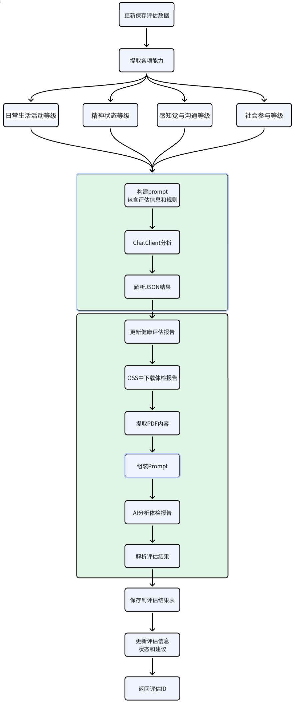

### 6.2.提示词设计

提示词1\-老人能力评估  \(参考文档：[附录-老年人评估表](https://lining-lo.github.io/lining-lo-notes/星海智伴/附录-老年人评估表.html)\)

```Bash
## 老人评估的的信息：
- 日常生活活动分级：0
- 精神状态分级：0
- 感知觉与沟通分级：0
- 社会参与分级：1
- 跌倒次数：0
- 噎食次数：0
- 自杀次数：0
- 走失次数：0
- 昏迷次数：0
- 痴呆疾病：0
- 精神疾病：0
- 是否确诊为认知障碍：1

## 评估规则1：
- 能力完好：
    日常生活活动、精神状态、感知觉与沟通分级均为0，社会参与分级为0或1
- 轻度失能：
    日常生活活动分级为0，但精神状态、感知觉与沟通中至少一项分级为1及以上，或社会参与的分级为2；
    或日常生活活动分级为1，精神状态、感知觉与沟通、社会参与中至少有一项的分级为0或1
- 中度失能：
    日常生活活动分级为1，但精神状态、感知觉与沟通、社会参与均为2，或有一项为3；
    或日常生活活动分级为2，且精神状态、感知觉与沟通、社会参与中有1-2项的分级为1或2
- 重度失能：
    日常生活活动的分级为3；
    或日常生活活动、精神状态、感知觉与沟通、社会参与分级均为2；
    或日常生活活动分级为2，且精神状态、感知觉与沟通、社会参与中至少有一项分级为3

## 评估原则2：
1.有认知障碍/痴呆、精神疾病者，在原有能力级别上提高一个等级；
2.近30天内发生过2次及以上跌倒、噎食、自杀、走失者，在原有能力级别上提高一个等级；
3.处于昏迷状态者，直接评定为重度失能；
4.若初步等级确定为“3重度失能”，则不考虑上述1-3中各情况对最终等级的影响，等级不再提高

## 匹配规则
1. 请根据老人的评估信息与规则1逐条进行比对，判断老人属于哪一种能力
2. 然后拿老人的评估信息逐条与规则2进行比对，再次判断老人属于哪一种能力。
3. 如果两次评级不一样，升级的理由是什么，理由只需要填写评估原则2 的一条或多条内容，把内容输出到reason中，不需要说明分析理由
4. 结合评估的原则，给出老人的两次评级，不需要输出分析过程，只需要输出json格式，不要出现markdown语法
格式为：
{{
    "preLevel": "能力完好|轻度失能|中度失能|重度失能",
    "finalLevel": "能力完好|轻度失能|中度失能|重度失能",
    "reason":"评估原则2中一条或多条"
}}
```

提示词2\-老人健康评估

```Bash
请以一个专业医生的视角来分析这份体检报告，报告中包含了一些异常数据，我需要您对这些数据进行解读，并给出相应的健康建议。
体检内容如下：

...内容略...

要求：
1. 提取体检报告中的“总检日期”；
2. 通过临床医学、疾病风险评估模型和数据智能分析，给该用户的风险等级和健康指数给出结果。风险等级分为：健康、提示、风险、危险、严重危险。健康指数范围为0至100分；
3. 对于体检报告有异常数据，请列出（异常数据的结论、体检项目名称、检查结果、参考值、单位、异常解读、建议）这8字段。解读异常数据，解决这些数据可能代表的健康问题或风险。分析可能的原因，包括但不限于生活习惯、饮食习惯、遗传因素等。基于这些异常数据和可能的原因，请给出具体的健康建议，包括饮食调整、运动建议、生活方式改变以及是否需要进一步检查或治疗等。
结论格式：异常数据的结论：肥胖，体检项目名称：体重指数BMI，检查结果：29.2，参考值>24，单位：-。异常解读：体重超标包括超重与肥胖。体重指数（BMI）=体重（kg）/身⾼（m）的平⽅，BMI≥24为超重，BMI≥28为肥胖；男性腰围≥90cm和⼥性腰围≥85cm为腹型肥胖。体重超标是⼀种由多因素（如遗传、进⻝油脂较多、运动少、疾病等）引起的慢性代谢性疾病，尤其是肥胖，已经被世界卫⽣组织列为导致疾病负担的⼗⼤危险因素之⼀。AI建议：采取综合措施预防和控制体重，积极改变⽣活⽅式，宜低脂、低糖、⾼纤维素膳⻝，多⻝果蔬及菌藻类⻝物，增加有氧运动。若有相关疾病（如⾎脂异常、⾼⾎压、糖尿病等）应积极治疗。
4. 根据这个体检报告的内容，分别是给人体的8大系统打分，每项满分为100分，8大系统分别为：呼吸系统、消化系统、内分泌系统、免疫系统、循环系统、泌尿系统、运动系统、感官系统
5. 给体检报告做一个总结，总结格式：体检报告中尿蛋⽩、癌胚抗原、⾎沉、空腹⾎糖、总胆固醇、⽢油三酯、低密度脂蛋⽩胆固醇、⾎清载脂蛋⽩B、动脉硬化指数、⽩细胞、平均红细胞体积、平均⾎红蛋⽩共12项指标提示异常，尿液常规共1项指标处于临界值，⾎脂、⾎液常规、尿液常规、糖类抗原、⾎清酶类等共43项指标提示正常，综合这些临床指标和数据分析：肾脏、肝胆、⼼脑⾎管存在隐患，其中⼼脑⾎管有“⾼危”⻛险；肾脏部位有“中危”⻛险；肝胆部位有“低危”⻛险。

# 输出要求：
最后，将以上结果输出为纯JSON格式，不要包含其他的文字说明，也不要出现Markdown语法相关的文字，所有的返回结果都是json，注意双引号的单引号的配合使用，详细格式如下：

{
  "healthScore": XX.XX,
  "riskLevel": "健康|提示|风险|危险|严重危险",
  "abnormalData": [
    {
      "conclusion": "异常数据的结论",
      "examinationItem": "体检项目名称",
      "result": "检查结果",
      "referenceValue": "参考值",
      "unit": "单位",
      "interpret":"对于异常的结论进一步详细的说明",
      "advice":"针对于这一项的异常，给出一些健康的建议"
    }
  ],
  "systemScore": {
    "breathingSystem": XX,
    "digestiveSystem": XX,
    "endocrineSystem": XX,
    "immuneSystem": XX,
    "circulatorySystem": XX,
    "urinarySystem": XX,
    "motionSystem": XX,
    "senseSystem": XX
  },
  "summarize": "体检报告的总结"
}
```

### 6.3.老人能力评估

**大模型准备**

之前对话模型，加入了很多的记忆和RAG的能力，现在不需要这些加入，可能会影响评估结果，多消费token，可以单独创建一个ChatClient专门用户评估

在SpringAIConfig中新增一个ChatClient，代码如下：

```java
@Bean
public ChatClient chatClientByAssessment(OpenAiChatModel openAiChatModel) {

    return ChatClient
            .builder(openAiChatModel)
            .defaultSystem("你是一个健康评估专家，专门用来评估老人的健康情况")
            .defaultAdvisors(new SimpleLoggerAdvisor())
            .build();
}
```

**控制层**

修改HealthAssessmentController类中的新增评估的方法，参数跟新增保持一致

```Java
/**
 * 评估数据
 */
@PostMapping("/assessmentData")
public AjaxResult assessmentData(@RequestBody ElderAssessmentDto dto) {
    return success(healthAssessmentService.assessmentData(dto));
}
```

**业务层**

在IHealthAssessmentService类中新增评估的方法，注意需要有返回值

```Java
/**
 *  评估数据
 * @param dto
 * @return
 */
Long assessmentData(ElderAssessmentDto dto) ;
```

实现方法

```Java
@Autowired
private ChatClient chatClientByAssessment;

@Autowired
private IHealthAssessmentReportService healthAssessmentReportService;

/**
 * 健康评估数据
 * @param dto
 * @return
 */
@Transactional(rollbackFor = Exception.class)
@Override
public Long assessmentData(ElderAssessmentDto dto) {

    // 更新数据
    Long id = saveOrUpdateHealthAssessment(dto);

    //获取各个指标等级
    // 生活能力等级
    String abilityRating = dto.getDailyLivingActivities().getAbilityRating();
    // 精神状态等级
    String mentalStateRating = dto.getMentalState().getAbilityRating();
    // 感知与沟通等级
    String perceptionAndCommunicationRating = dto.getPerceptionAndCommunication().getAbilityRating();
    // 社会参与等级
    String socialParticipationRating = dto.getSocialParticipation().getAbilityRating();

    // AI 分析获取能力评估结果
    // 跌倒
    Integer fall = dto.getHealthAssessmentDto().getRecent30Days().getFall();
    // 噎食
    Integer lost  = dto.getHealthAssessmentDto().getRecent30Days().getLost();
    //自杀
    Integer choking = dto.getHealthAssessmentDto().getRecent30Days().getChoking();
    //走失者
    Integer suicideAttempt = dto.getHealthAssessmentDto().getRecent30Days().getSuicideAttempt();
    //昏迷
    Integer coma = dto.getHealthAssessmentDto().getRecent30Days().getComa();
    // 痴呆
    String dementia = dto.getHealthAssessmentDto().getDiseaseDiagnosis().getDementia();
    // 精神疾病
    String mentalIllness = dto.getHealthAssessmentDto().getDiseaseDiagnosis().getMentalIllness();
    // 认知障碍
    Integer cognitiveImpairment = dto.getMentalState().getClockDrawingTest().getResult();
    // 画钟测验结果(0-正确，1-错误，2-确诊认知障碍)
    String cognitiveImpairmentStr = "无";
    if(cognitiveImpairment == 2){
        cognitiveImpairmentStr = "有";
    }
    // 获取prompt字符串
    String abilityPrompt = getAbilityPrompt(abilityRating, mentalStateRating, perceptionAndCommunicationRating, socialParticipationRating, fall, lost, choking, suicideAttempt, coma, dementia, mentalIllness, cognitiveImpairmentStr);
    String result = chatClientByAssessment.prompt().user(abilityPrompt).call().content();
    System.out.println(result);
    // 非空校验
    if(StringUtils.isEmpty(result)){
        throw new BaseException("AI分析结果为空");
    }

    // 解析json
    result = result.replaceAll("```json","").replaceAll("```","");
    // JSONObject 继承map，就是key和value数据结构
    JSONObject jsonObject = JSONUtil.parseObj(result);
    // 获取初步能力评估
    String preLevel = jsonObject.getStr("preLevel");
    // 获取最终能力评估
    String finalLevel = jsonObject.getStr("finalLevel");
    // 升级的理由
    String reason = jsonObject.getStr("reason");

    // 评估老人体检报告


    // 保存评估报告
    HealthAssessmentReport report = new HealthAssessmentReport();
    report.setHealthAssessmentId(id);
    report.setAssessmentTime(LocalDateTime.now());
    report.setAssessorName(SecurityUtils.getUsername());
    report.setDailyActivityLevel(abilityRating);
    report.setMentalStatusLevel(mentalStateRating);
    report.setPerceptionCommunicationLevel(perceptionAndCommunicationRating);
    report.setSocialParticipationLevel(socialParticipationRating);
    report.setInitialAbilityLevel(preLevel);
    report.setFinalAbilityLevel(finalLevel);
    report.setLevelChangeReason(reason);
    //入住状态
    report.setCheckInStatus(0);
    healthAssessmentReportService.save(report);

    log.info("老人能力评级完成...");

    return id;
}

/**
 * 获取prompt字符串
 * @param abilityRating 日常生活活动分级
 * @param mentalStateRating 精神状态分级
 * @param perceptionAndCommunicationRating 感知与沟通分级
 * @param socialParticipationRating 社会参与分级
 * @param fall
 * @param lost
 * @param choking
 * @param suicideAttempt
 * @param coma
 * @param dementia
 * @param mentalIllness
 * @param cognitiveImpairmentStr
 * @return
 */
private String getAbilityPrompt(String abilityRating, String mentalStateRating, String perceptionAndCommunicationRating, String socialParticipationRating, Integer fall, Integer lost, Integer choking, Integer suicideAttempt, Integer coma, String dementia, String mentalIllness, String cognitiveImpairmentStr) {
    String prompt = """
        ## 老人评估的的信息：
        - 日常生活活动分级：%s
        - 精神状态分级：%s
        - 感知觉与沟通分级：%s
        - 社会参与分级：%s
        - 跌倒次数：%s
        - 噎食次数：%s
        - 自杀次数：%s
        - 走失次数：%s
        - 昏迷次数：%s
        - 痴呆疾病：%s
        - 精神疾病：%s
        - 是否确诊为认知障碍：%s
        
        ## 评估规则1：
        - 能力完好：
            日常生活活动、精神状态、感知觉与沟通分级均为0，社会参与分级为0或1
        - 轻度失能：
            日常生活活动分级为0，但精神状态、感知觉与沟通中至少一项分级为1及以上，或社会参与的分级为2；
            或日常生活活动分级为1，精神状态、感知觉与沟通、社会参与中至少有一项的分级为0或1
        - 中度失能：
            日常生活活动分级为1，但精神状态、感知觉与沟通、社会参与均为2，或有一项为3；
            或日常生活活动分级为2，且精神状态、感知觉与沟通、社会参与中有1-2项的分级为1或2
        - 重度失能：
            日常生活活动的分级为3；
            或日常生活活动、精神状态、感知觉与沟通、社会参与分级均为2；
            或日常生活活动分级为2，且精神状态、感知觉与沟通、社会参与中至少有一项分级为3
        
        ## 评估原则2：
        1.有认知障碍/痴呆、精神疾病者，在原有能力级别上提高一个等级；
        2.近30天内发生过2次及以上跌倒、噎食、自杀、走失者，在原有能力级别上提高一个等级；
        3.处于昏迷状态者，直接评定为重度失能；
        4.若初步等级确定为“3重度失能”，则不考虑上述1-3中各情况对最终等级的影响，等级不再提高
        
        ## 匹配规则
        1. 请根据老人的评估信息与规则1逐条进行比对，判断老人属于哪一种能力
        2. 然后拿老人的评估信息逐条与规则2进行比对，再次判断老人属于哪一种能力。
        3. 如果两次评级不一样，升级的理由是什么，理由只需要填写评估原则2 的一条或多条内容，把内容输出到reason中，不需要说明分析理由
        4. 结合评估的原则，给出老人的两次评级，不需要输出分析过程，只需要输出json格式，不要出现markdown语法
        格式为：
        {{
            "preLevel": "能力完好|轻度失能|中度失能|重度失能",
            "finalLevel": "能力完好|轻度失能|中度失能|重度失能",
            "reason":"评估原则2中一条或多条"
        }}
        
        """;
    String str = prompt.formatted(abilityRating, mentalStateRating, perceptionAndCommunicationRating,
            socialParticipationRating, fall, lost, choking, suicideAttempt, coma, dementia, mentalIllness, cognitiveImpairmentStr
    );
    return str;
}
```

**测试**

可以在控制台看到评估结果即可

```java
{
    "preLevel": "中度失能",
    "finalLevel": "重度失能",
    "reason":"有认知障碍/痴呆、精神疾病者，在原有能力级别上提高一个等级；近30天内发生过2次及以上跌倒、噎食、自杀、走失者，在原有能力级别上提高一个等级；处于昏迷状态者，直接评定为重度失能"
}
```

检查数据库health\_assessment\_report是否保存成功

### 6.4.老人健康评估

**读取PDF内容工具类**

市面有很多工具类，我们可以直接使用，目前选择的是Apache PDFBox

Apache PDFBox库是一个用于处理PDF文档的开源Java工具。该项目允许创建新的PDF文档，编辑现有的文档，以及从文档中提取内容。

导入对应的依赖，在xhzb\-common模块中导入以下依赖：

```XML
<dependency>
    <groupId>org.apache.pdfbox</groupId>
    <artifactId>pdfbox</artifactId>
    <version>2.0.24</version>
</dependency>
```

创建工具类，通过pdf文件来读取内容，工具类路径：xhzb\-common模块下的com\.xhzb\.common\.utils\.PDFUtil

```Java
package com.xhzb.common.utils;

import org.apache.pdfbox.pdmodel.PDDocument;
import org.apache.pdfbox.text.PDFTextStripper;

import java.io.File;
import java.io.IOException;
import java.io.InputStream;

public class PDFUtil {

    public static String pdfToString(InputStream  inputStream) {

        PDDocument document = null;


        try {
            // 加载PDF文档
            document = PDDocument.load(inputStream);

            // 创建一个PDFTextStripper实例来提取文本
            PDFTextStripper pdfStripper = new PDFTextStripper();

            // 从PDF文档中提取文本
            String text = pdfStripper.getText(document);
            return text;

        } catch (IOException e) {
            e.printStackTrace();
        } finally {
            // 关闭PDF文档
            if (document != null) {
                try {
                    document.close();
                    inputStream.close();
                } catch (IOException e) {
                    e.printStackTrace();
                }
            }
        }
        return null;
    }
}
```

测试：找一个pdf文档来读取里面的内容为字符串

```Java
package com.xhzb.test;

import com.xhzb.common.utils.PDFUtil;

import java.io.FileInputStream;
import java.io.FileNotFoundException;

/**
 * @author qingshan
 * @date 2026/5/31 下午12:24
 * @description TODO
 */
public class PDFUtilTest {

    @Test
    public void testParsePDF() throws FileNotFoundException {
        FileInputStream fileInputStream = new FileInputStream("D:\\课程资料\\AI-3\\星海智伴\\day05-智能评估-AI大模型\\资料\\体检报告-刘爱国-男-69岁.pdf");

        String result = PDFUtil.pdfToString(fileInputStream);
        System.out.println(result);
    }

}
```

**继续AI评估\-体检报告**

继续优化完善HealthAssessmentServiceImpl中评估的内容

```Java
/**
 * 健康评估数据
 * @param dto
 * @return
 */
@Transactional(rollbackFor = Exception.class)
@Override
public Long assessmentData(ElderAssessmentDto dto) {

    // 更新数据
    Long id = saveOrUpdateHealthAssessment(dto);

    //获取各个指标等级
    // 生活能力等级
    String abilityRating = dto.getDailyLivingActivities().getAbilityRating();
    // 精神状态等级
    String mentalStateRating = dto.getMentalState().getAbilityRating();
    // 感知与沟通等级
    String perceptionAndCommunicationRating = dto.getPerceptionAndCommunication().getAbilityRating();
    // 社会参与等级
    String socialParticipationRating = dto.getSocialParticipation().getAbilityRating();

    // AI 分析获取能力评估结果
    // 跌倒
    Integer fall = dto.getHealthAssessmentDto().getRecent30Days().getFall();
    // 噎食
    Integer lost  = dto.getHealthAssessmentDto().getRecent30Days().getLost();
    //自杀
    Integer choking = dto.getHealthAssessmentDto().getRecent30Days().getChoking();
    //走失者
    Integer suicideAttempt = dto.getHealthAssessmentDto().getRecent30Days().getSuicideAttempt();
    //昏迷
    Integer coma = dto.getHealthAssessmentDto().getRecent30Days().getComa();
    // 痴呆
    String dementia = dto.getHealthAssessmentDto().getDiseaseDiagnosis().getDementia();
    // 精神疾病
    String mentalIllness = dto.getHealthAssessmentDto().getDiseaseDiagnosis().getMentalIllness();
    // 认知障碍
    Integer cognitiveImpairment = dto.getMentalState().getClockDrawingTest().getResult();
    // 画钟测验结果(0-正确，1-错误，2-确诊认知障碍)
    String cognitiveImpairmentStr = "无";
    if(cognitiveImpairment == 2){
        cognitiveImpairmentStr = "有";
    }
    // 获取prompt字符串
    String abilityPrompt = getAbilityPrompt(abilityRating, mentalStateRating, perceptionAndCommunicationRating, socialParticipationRating, fall, lost, choking, suicideAttempt, coma, dementia, mentalIllness, cognitiveImpairmentStr);
    String result = chatClientByAssessment.prompt().user(abilityPrompt).call().content();
    System.out.println(result);
    // 非空校验
    if(StringUtils.isEmpty(result)){
        throw new BaseException("AI分析结果为空");
    }

    // 解析json
    result = result.replaceAll("```json","").replaceAll("```","");
    // JSONObject 继承map，就是key和value数据结构
    JSONObject jsonObject = JSONUtil.parseObj(result);
    // 获取初步能力评估
    String preLevel = jsonObject.getStr("preLevel");
    // 获取最终能力评估
    String finalLevel = jsonObject.getStr("finalLevel");
    // 升级的理由
    String reason = jsonObject.getStr("reason");

    // 评估老人体检报告
    log.info("开始评估老人体检报告...");
    String res = getHealthReportPrompt(dto.getHealthAssessmentDto().getRecent30Days().getMedicalReport());
    // AI分析
    String healthReportJson = chatClientByAssessment.prompt().user(res).call().content();
    // 非空校验
    if(StringUtils.isEmpty(healthReportJson)){
        throw new BaseException("AI分析结果为空");
    }
    // 转换为JSON对象，实际为map
    healthReportJson = healthReportJson.replaceAll("```json","").replaceAll("```","");
    JSONObject healthReportJsonObj = JSONUtil.parseObj(healthReportJson);

    // 保存评估报告
    HealthAssessmentReport report = new HealthAssessmentReport();
    report.setHealthAssessmentId(id);
    report.setAssessmentTime(LocalDateTime.now());
    report.setAssessorName(SecurityUtils.getUsername());
    report.setDailyActivityLevel(abilityRating);
    report.setMentalStatusLevel(mentalStateRating);
    report.setPerceptionCommunicationLevel(perceptionAndCommunicationRating);
    report.setSocialParticipationLevel(socialParticipationRating);
    report.setInitialAbilityLevel(preLevel);
    report.setFinalAbilityLevel(finalLevel);
    report.setLevelChangeReason(reason);
    //入住状态
    report.setCheckInStatus(0);
    // 获取评估分值
    Double healthScore = healthReportJsonObj.getDouble("healthScore");
    report.setHealthScore(healthScore+"");
    // 核心建议  分值等于60 则建议入住
    if(healthScore >= 60){
        report.setCoreSuggestion(1);
    }else {
        report.setCoreSuggestion(0);
    }
    // 风险等级
    report.setRiskLevel(healthReportJsonObj.getStr("riskLevel"));
    // 报告总结
    report.setReportSummary(healthReportJsonObj.getStr("summarize"));
    // 异常分析
    report.setAbnormalAnalysis(JSONUtil.toJsonStr(healthReportJsonObj.get("abnormalData")));
    // 健康系统分值
    report.setSystemScore(JSONUtil.toJsonStr(healthReportJsonObj.get("systemScore")));

    healthAssessmentReportService.save(report);
    log.info("老人能力评级完成...");

    // 更新状态  评估进度  核心建议
    this.lambdaUpdate().eq(HealthAssessment::getId, id)
        .set(HealthAssessment::getEvaluationProgress, 1)
        .set(HealthAssessment::getCoreSuggestion, report.getCoreSuggestion())
        .update();

    return id;
}

@Autowired
private OSSAliyunFileStorageService fileStorageService;

/**
 *  评估老人体检报告
 * @param url
 * @return
 */
private String getHealthReportPrompt(String url) {

    // 下载体检报告
    InputStream inputStream = fileStorageService.download(url);
    if(inputStream == null){
        throw new BaseException("体检报告不存在");
    }

    // 读取体检报告的内容
    String content = PDFUtil.pdfToString(inputStream);

    String prompt = """
            请以一个专业医生的视角来分析这份体检报告，报告中包含了一些异常数据，我需要您对这些数据进行解读，并给出相应的健康建议。
            体检内容如下：
            %s
            要求：
            1. 提取体检报告中的“总检日期”；
            2. 通过临床医学、疾病风险评估模型和数据智能分析，给该用户的风险等级和健康指数给出结果。风险等级分为：健康、提示、风险、危险、严重危险。健康指数范围为0至100分；
            3. 对于体检报告有异常数据，请列出（异常数据的结论、体检项目名称、检查结果、参考值、单位、异常解读、建议）这8字段。解读异常数据，解决这些数据可能代表的健康问题或风险。分析可能的原因，包括但不限于生活习惯、饮食习惯、遗传因素等。基于这些异常数据和可能的原因，请给出具体的健康建议，包括饮食调整、运动建议、生活方式改变以及是否需要进一步检查或治疗等。
            结论格式：异常数据的结论：肥胖，体检项目名称：体重指数BMI，检查结果：29.2，参考值>24，单位：-。异常解读：体重超标包括超重与肥胖。体重指数（BMI）=体重（kg）/身⾼（m）的平⽅，BMI≥24为超重，BMI≥28为肥胖；男性腰围≥90cm和⼥性腰围≥85cm为腹型肥胖。体重超标是⼀种由多因素（如遗传、进⻝油脂较多、运动少、疾病等）引起的慢性代谢性疾病，尤其是肥胖，已经被世界卫⽣组织列为导致疾病负担的⼗⼤危险因素之⼀。AI建议：采取综合措施预防和控制体重，积极改变⽣活⽅式，宜低脂、低糖、⾼纤维素膳⻝，多⻝果蔬及菌藻类⻝物，增加有氧运动。若有相关疾病（如⾎脂异常、⾼⾎压、糖尿病等）应积极治疗。
            4. 根据这个体检报告的内容，分别是给人体的8大系统打分，每项满分为100分，8大系统分别为：呼吸系统、消化系统、内分泌系统、免疫系统、循环系统、泌尿系统、运动系统、感官系统
            5. 给体检报告做一个总结，总结格式：体检报告中尿蛋⽩、癌胚抗原、⾎沉、空腹⾎糖、总胆固醇、⽢油三酯、低密度脂蛋⽩胆固醇、⾎清载脂蛋⽩B、动脉硬化指数、⽩细胞、平均红细胞体积、平均⾎红蛋⽩共12项指标提示异常，尿液常规共1项指标处于临界值，⾎脂、⾎液常规、尿液常规、糖类抗原、⾎清酶类等共43项指标提示正常，综合这些临床指标和数据分析：肾脏、肝胆、⼼脑⾎管存在隐患，其中⼼脑⾎管有“⾼危”⻛险；肾脏部位有“中危”⻛险；肝胆部位有“低危”⻛险。
            
            # 输出要求：
            最后，将以上结果输出为纯JSON格式，不要包含其他的文字说明，也不要出现Markdown语法相关的文字，所有的返回结果都是json，注意双引号的单引号的配合使用，详细格式如下：
            
            {
              "healthScore": XX.XX,
              "riskLevel": "健康|提示|风险|危险|严重危险",
              "abnormalData": [
                {
                  "conclusion": "异常数据的结论",
                  "examinationItem": "体检项目名称",
                  "result": "检查结果",
                  "referenceValue": "参考值",
                  "unit": "单位",
                  "interpret":"对于异常的结论进一步详细的说明",
                  "advice":"针对于这一项的异常，给出一些健康的建议"
                }
              ],
              "systemScore": {
                "breathingSystem": XX,
                "digestiveSystem": XX,
                "endocrineSystem": XX,
                "immuneSystem": XX,
                "circulatorySystem": XX,
                "urinarySystem": XX,
                "motionSystem": XX,
                "senseSystem": XX
              },
              "summarize": "体检报告的总结"
            }
            
            """;
    return prompt.formatted(content);
}
```

## 7.查看评估详情\(评估结果\)

### 7.1.控制层

在HealthAssessmentController类中的新增查询的方法，只需要查询评估报告表即可

```Java
@Autowired
private IHealthAssessmentReportService healthAssessmentReportService;
/**
 * 获取健康评估记录详细信息
 */
@PreAuthorize("@ss.hasPermi('nursing:healthAssessment:query')")
@GetMapping(value = "/report/{id}")
public AjaxResult getReportInfo( @PathVariable("id") Long id)
{
    HealthAssessmentReport report = healthAssessmentReportService.lambdaQuery()
        .eq(HealthAssessmentReport::getHealthAssessmentId, id)
        .one();
    return success(report);
}
```

### 7.2.测试

在前端中进行测试


## 8.取消健康评估

自行实现


## 9.删除健康评估

自行实现


