# 一、目标

今日目标：

- 能够说的清楚入住功能在养老项目的业务描述
- 能够掌握根据需求独立设计入住办理相关的表结构
- 能够掌握根据需求独立分析入住办理的接口
- 能够使用若依框架快速生成入住功能后端基础代码
- 能够按照需求快速改造入住功能的接口

# 二、需求分析

在开发之前，我们必须要先来捋清楚需求，然后才能进行开发

## 1.入住办理列表页

原型文件如下：

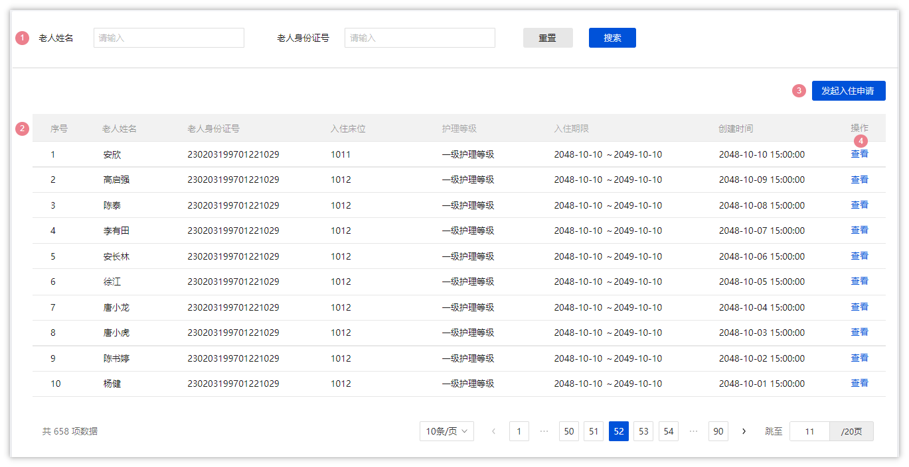

搜索：老人姓名为模糊搜索，老人身份证号为精准搜索；

列表数据：列表中所展示的数据是入住成功的，且未退住的老人信息

发起入住办理：点击【发起入住申请】进入到【入住申请详情页】；

查看：点击【查看】进入到【入住详情页】，数据回显，不可编辑，不显示文本框，只显示已填写/已选择的内容；

## 2.入住办理详情页

我们可以通过原型打开入住办理详情页，详细如下：

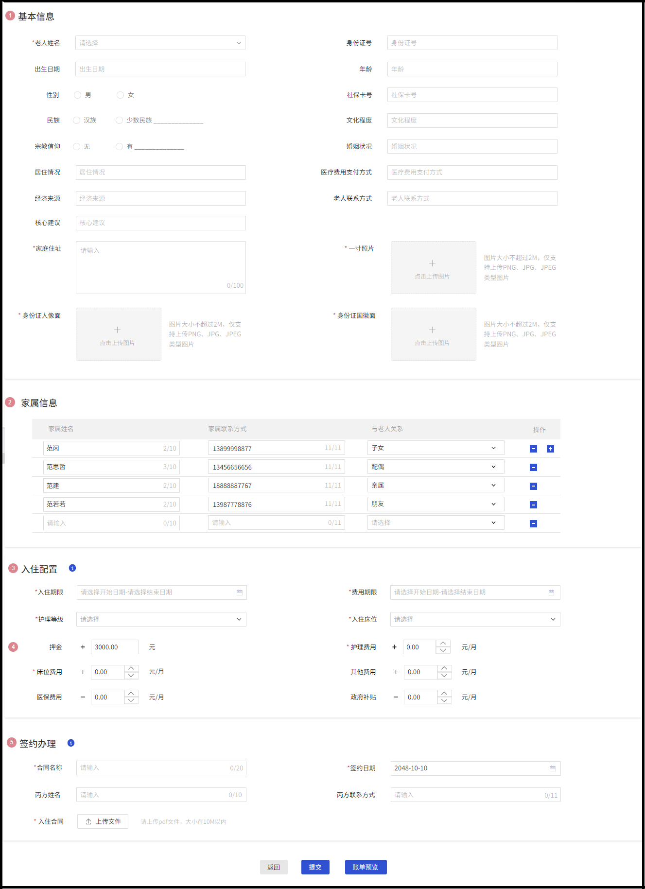

上述需求中，共包含了四部分：

- 基本信息：入住老人的基本信息，包含了姓名、年龄、身份证号、性别，住址、照片等信息

- 家属信息：入住老人的家属列表，可以有多个

- 入住配置：入住老人的在养老院的选择的费用信息，包含了护理等级，入住床位、入住期限等信息

- 签约办理：入住老人签订的合同信息

# 三、表结构设计

我们现在已经有能力去熟悉模块业务了，现在有了新的任务，不过呢，在我们开发之前，我们现在需要搞清楚几个问题

- 在前后端项目开发中，后端的开发流程是什么

- 如何设计一个表，有哪些规则或规范

那接下来呢，我们依次搞定这些问题。

## 1.后端开发流程

在开发接口之前呢，我们需要先熟悉一下，后端开发的流程，如下：

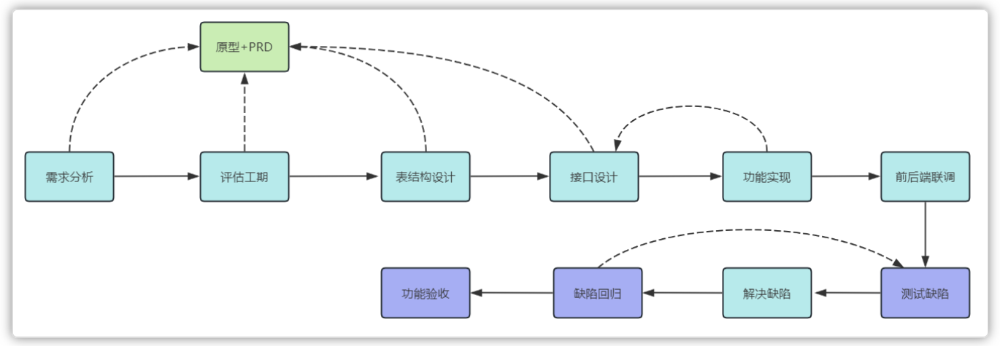

- 需求分析\(基于原型和PRD\)

- 开发计划\(工期评估\)

- 表结构设计\(基于原型和PRD\)

- 接口设计\(基于原型和PRD\)

- 功能实现\(基于接口设计\+原型\+PRD\)

- 前后端联调

- 测试提bug

- 前后端优化，再联调

- 测试回归bug

- 功能验收

## 2.如何设计表？

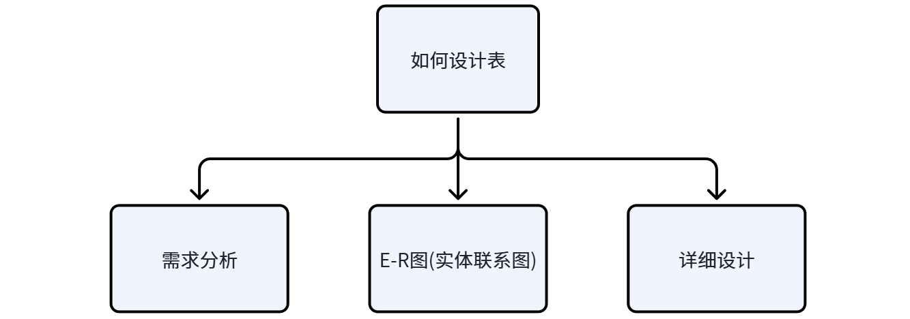

### 2.1.E\-R图

E\-R图也称实体\-联系图\(Entity Relationship Diagram\)，提供了表示实体类型、属性和联系的方法，用来描述现实世界的概念模型。

> 一个例子：
>
> 假设我们要设计一个简单的图书馆数据库系统。我们可以使用E\-R图来描述这个系统的数据模型
>
> 我们可能会有以下实体（Entities）：
>
> - 书籍（Book）
>
> - 作者（Author）
>
> - 图书馆成员（Library Member）
>
> 然后，我们可以描述它们之间的关系（Relationships）：
>
> - 一本书可以由一个或多个作者编写，这是一个“一对多”的关系。
>
> - 图书馆成员可以借阅多本书，而每本书也可以被多个图书馆成员借阅，这是一个“多对多”的关系。
>
> 最后，我们可以添加一些属性（Attributes）：
>
> - 书籍实体可能包括书名、ISBN号、出版日期等属性。
>
> - 作者实体可能包括姓名、国籍、出生日期等属性。
>
> - 图书馆成员实体可能包括会员号、姓名、联系信息等属性。
>

通过E\-R图，我们可以清晰地展示这些实体之间的关系和它们的属性，从而更好地理解图书馆数据库系统的数据模型。

上述例子的E\-R图

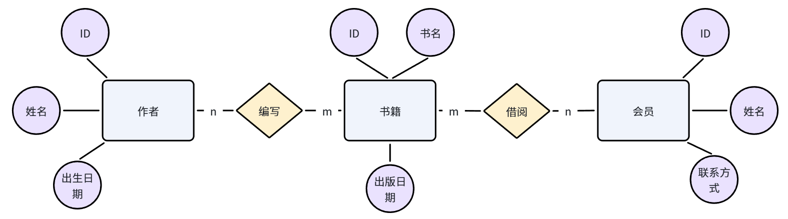

服务管理中的三张表

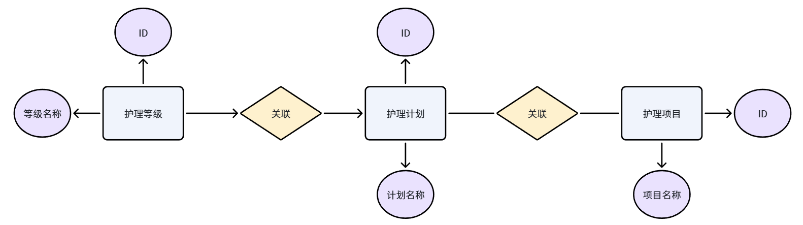

### 2.2.详细设计

1.命名（见名之意）  参考阿里开发手册

2.数据类型

基本准则

- 可靠性：考虑字段存储的内容长度，尽可能的合适（name  30\-50）

- 存储空间：在考虑可靠性的前提下，再次考虑存储空间

常见数据类型 

- 主键（必须存在）

- 自增
- UUID
- 雪花算法

InnoDB 聚簇索引必须依赖主键存储数据

无主键 → MySQL 自动生成隐藏主键，浪费资源、有性能瓶颈

有主键 → 增删改查极快、保证数据唯一、支持所有高级功能

所有业务表强制必须有主键，这是数据库设计的基础规范

3.冗余字段

- 创建时间
- 修改时间
- 创建人
- 修改人
- 备注

要结合业务的情况，再去设计冗余字段（为了提升性能，减少多表查询）

### 2.3.建表工具

使用传统数据库连接工具创建表结构

或者

我们可以借助AI大模型问答，写对应的提示词来创建表结构：

> Prompt
>
> 你是一个软件工程师，帮我生成MySQL的表结构，需求如下：
> 1，入住表（check\_in），包含的字段有：主键\(ID\)，老人id\(elder\_id\)、身份证号、入住开始时间、入住结束时间、护理等级、入住床位、状态（0:已入住、1:已退住）
> 2，表中其他必要字段：排序编号、创建时间\(create\_time\)、修改时间\(update\_time\)、创建人\(create\_by\)、修改人\(update\_by\)、备注\(remark\)这些字段
> 3，表的主键都是自增的
> 4，请为每个字段都添加上comment
> 5，帮我给生成的表中插入一些示例数据

## 3.入住相关表结构设计

### 3.1.表结构的E\-R图

通过需求分析，我们可以得到以下信息

1. 老人的基本信息里面的所有字段，都可以存储到老人表中，目前在已提供（elder表）

2. 老人关联的家属是一个列表

3. 老人选择的入住配置字段有很多，可以创建入住表来进行存储

4. 签约办理相关的内容可以存储到合同表中

整体的E\-R图结构如下：

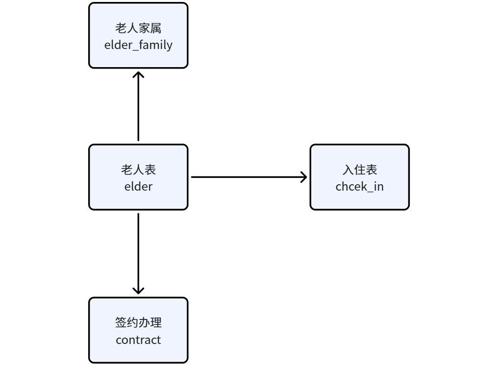

如果这么设计的话，其中的check\_in表的字段就非常的多，将会带来以下问题

- 性能下降，字段越多，数据库在执行查询时需要处理的数据量就越大，插入和更新尤为明显

- 维护困难：字段过多会使得表结构复杂，导致难以理解和维护，同时修改表结构也会变得更加复杂和耗时。

- 存储空间增加：每个额外的字段，即使大多数情况下为空或数据很少，也会占用额外存储空间，并可能导致数据库备份和恢复操作耗时增加。

- 可扩展性差：当表结构变得过于复杂时，添加新功能或进行其他类型的扩展可能会变得更加困难。

为了缓解这些问题，可以考虑以下策略：

- 垂直分割：将表垂直分割成多个较小的表，每个表包含相关的字段集。

- 归档旧数据：将不经常访问的旧数据归档到单独的表中或数据库中。

- 优化数据类型：确保使用适当的数据类型来存储数据，以减少存储空间的浪费并提高性能。

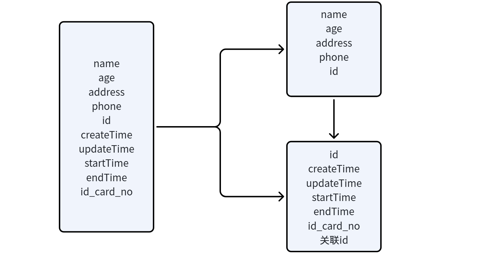

### 3.2.什么是垂直分割

垂直分割表是数据库管理中常用的一种优化技术，它通过将一个大表中的列分割成多个小表，每个小表包含原始表的一部分列，以达到优化数据存储和访问效率的目的。以下是垂直分割表的优缺点总结：

优点

- 提高查询性能：通过减少表的宽度，可以加快查询速度，特别是在涉及大量列的表中。当查询只需要访问部分列时，数据库系统只需扫描包含这些列的小表，减少了不必要的数据扫描量。

- 减少I/O操作：在读取数据时，数据库系统可以只读取需要的列，而无需扫描整个表，从而减少了I/O操作的次数和数据传输量。

缺点

- 增加复杂性：垂直分割表会增加数据库结构的复杂性，需要更多的管理和维护工作。例如，需要修改应用程序中的查询和更新操作，以适应新的表结构。

- 事务处理复杂：垂直分割表后，事务的处理可能会变得更加复杂。因为事务可能需要跨越多个子表，这增加了事务管理的难度和开销。

- 表连接操作增加：由于数据被分散到多个子表中，因此在查询时可能需要更多的表连接操作，这可能会增加CPU的开销和查询的响应时间。

经过垂直分割之后，其中的入住表可以分割为两个表

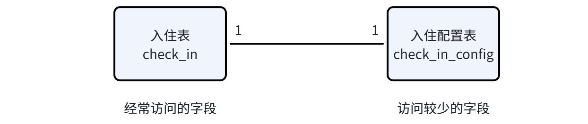

其中列表查询所展示的字段可以认为是经常访问的字段，详情中查看的字段认为是访问较少的字段，由此可以得出：

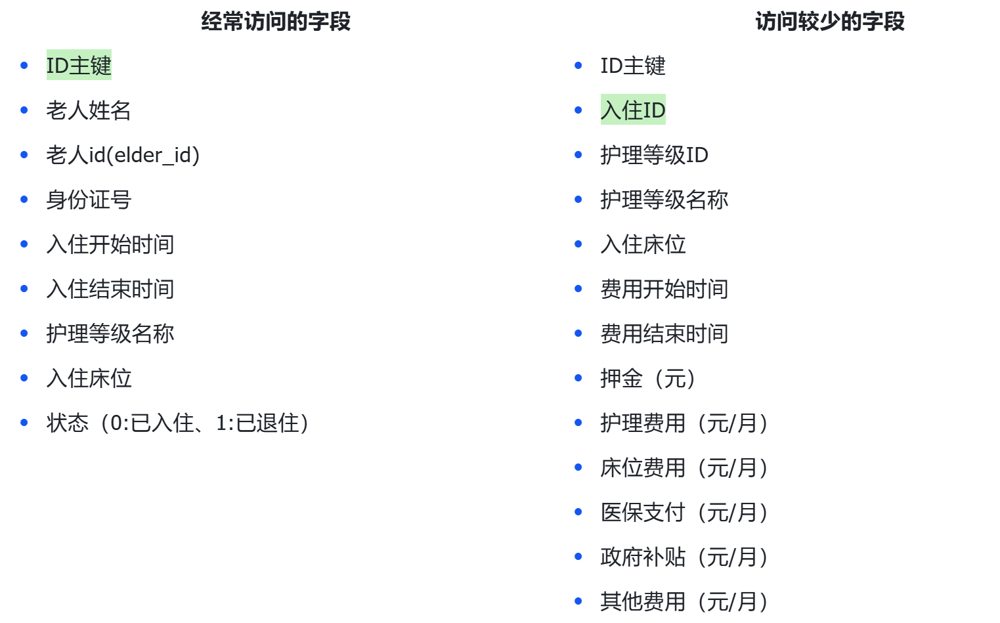

其中在经常访问的字段中，有一些冗余字段：

- 老人姓名

- 身份证号

- 护理等级名称

- 入住床位

> 在设计数据库表时，引入冗余字段是一种常见的优化手段，主要目的：
>
> 1. 冗余字段减少查询时的表连接操作，降低查询复杂性和执行时间。
>
> 2. 冗余字段简化查询逻辑，使查询语句更简洁易懂，易于维护和减少出错概率。
>

### 3.3.最终表结构

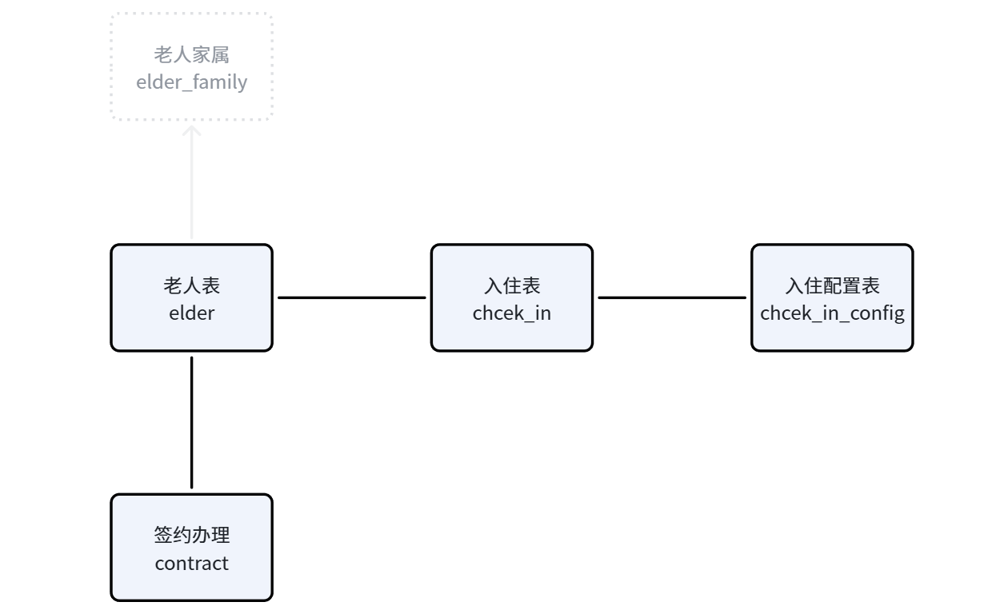

上图中的四张表的关系都是一对一的关系

废弃了老人家属表，由于后期主要用于展示，可以存储到入住表中的remark字段中（json形式）

根据之前的分析结合需求文档，我们可以使用AI协助创建表结构，共为三张表

> Prompt
>
> 你是一个软件工程师，帮我生成MySQL的表结构，需求如下：
> 1，入住表（check\_in），包含的字段有：主键\(ID\)，老人姓名\(elder\_name\)、老人id\(elder\_id\)、身份证号\(id\_card\_no\)、入住开始时间、入住结束时间、护理等级名称\(nursing\_level\_name\)、入住床位、状态（0:已入住、1:已退住）
>
> 2，入住配置表\(check\_in\_config\)，包含的字段有：主键\(ID\)，入住表ID、护理等级ID\(nursing\_level\_id\)、护理等级名称\(nursing\_level\_name\)、费用开始时间、费用结束时间、押金（元）、护理费用（元/月）、床位费用（元/月）、医保支付（元/月）、政府补贴（元/月）、其他费用（元/月）
>
> 其他要求：
> 1，表中其他必要字段：排序编号、创建时间\(create\_time\)、修改时间\(update\_time\)、创建人\(create\_by\)、修改人\(update\_by\)、备注\(remark\)这些字段
>
> 2，入住表和入住配置表是一对一的关系，不需要设置外键约束
> 3，表的主键都是自增的，类型为bigint
> 4，请为每个字段都添加上comment
> 5，帮我给生成的表中插入一些示例数据

为什么不需要设计外键约束？

> 将外键约束关联改为逻辑关联，主要出于以下考虑：
>
> 1. 性能优化：外键约束可能影响增删改效率，甚至引发死锁问题。逻辑关联则能避免这些性能瓶颈。
>
> 2. 设计灵活性：外键约束限制了数据库结构调整的自由度。逻辑关联则更加灵活，易于适应数据库结构的变化和多种关系模型。
>

最终的建表语句：

```SQL
CREATE TABLE `check_in` (
  `id` BIGINT NOT NULL AUTO_INCREMENT COMMENT '主键ID',
  `elder_name` VARCHAR(50) NOT NULL COMMENT '老人姓名',
  `elder_id` BIGINT NOT NULL COMMENT '老人ID',
  `id_card_no` CHAR(18) NOT NULL COMMENT '身份证号',
  `start_date` DATE NOT NULL COMMENT '入住开始时间',
  `end_date` DATE COMMENT '入住结束时间',
  `nursing_level_name` VARCHAR(50) NOT NULL COMMENT '护理等级名称',
  `bed_number` VARCHAR(50) NOT NULL COMMENT '入住床位',
  `status` TINYINT NOT NULL DEFAULT '0' COMMENT '状态 (0: 已入住, 1: 已退住)',
  `sort_order` INT NOT NULL DEFAULT '0' COMMENT '排序编号',
  `create_time` TIMESTAMP  COMMENT '创建时间',
  `update_time` TIMESTAMP  COMMENT '修改时间',
  `create_by` VARCHAR(50)  COMMENT '创建人',
  `update_by` VARCHAR(50)  COMMENT '修改人',
  `remark` VARCHAR(255) COMMENT '备注',
  PRIMARY KEY (`id`)
) ENGINE=InnoDB DEFAULT CHARSET=utf8mb4 COLLATE=utf8mb4_unicode_ci;

CREATE TABLE `check_in_config` (
  `id` BIGINT NOT NULL AUTO_INCREMENT COMMENT '主键ID',
  `check_in_id` BIGINT NOT NULL COMMENT '入住表ID',
  `nursing_level_id` BIGINT NOT NULL COMMENT '护理等级ID',
  `nursing_level_name` VARCHAR(50) NOT NULL COMMENT '护理等级名称',
  `fee_start_date` DATE NOT NULL COMMENT '费用开始时间',
  `fee_end_date` DATE COMMENT '费用结束时间',
  `deposit` DECIMAL(10, 2) NOT NULL COMMENT '押金（元）',
  `nursing_fee` DECIMAL(10, 2) NOT NULL COMMENT '护理费用（元/月）',
  `bed_fee` DECIMAL(10, 2) NOT NULL COMMENT '床位费用（元/月）',
  `insurance_payment` DECIMAL(10, 2) NOT NULL COMMENT '医保支付（元/月）',
  `government_subsidy` DECIMAL(10, 2) NOT NULL COMMENT '政府补贴（元/月）',
  `other_fees` DECIMAL(10, 2) NOT NULL COMMENT '其他费用（元/月）',
  `sort_order` INT NOT NULL DEFAULT '0' COMMENT '排序编号',
  `create_time` TIMESTAMP COMMENT '创建时间',
  `update_time` TIMESTAMP COMMENT '修改时间',
  `create_by` VARCHAR(50)  COMMENT '创建人',
  `update_by` VARCHAR(50)  COMMENT '修改人',
  `remark` VARCHAR(255) COMMENT '备注',
  PRIMARY KEY (`id`)
) ENGINE=InnoDB DEFAULT CHARSET=utf8mb4 COLLATE=utf8mb4_unicode_ci;
```

目前老人表已经存在，可以使用AI生成合同表，提示词如下：

> Prompt
>
> 你是一个软件工程师，帮我生成MySQL的表结构，需求如下：
> 1，合同表（contract），包含的字段有：主键\(ID\)，老人id\(elder\_id\)、合同名称、合同编号、协议地址、丙方手机号、丙方姓名、老人姓名、开始时间、结束时间、状态\(status   0：未生效，1：已生效，2：已过期, 3：已失效\)、签约日期、解除提交人、接触日期、接触协议地址
> 2，表中其他必要字段：排序编号、创建时间\(create\_time\)、修改时间\(update\_time\)、创建人\(create\_by\)、修改人\(update\_by\)、备注\(remark\)这些字段，这些字段默认为null
> 3，表的主键都是自增的，类型为bigint
> 4，请为每个字段都添加上comment
> 5，帮我给生成的表中插入一些示例数据

```SQL
CREATE TABLE `contract` (
  `id` BIGINT NOT NULL AUTO_INCREMENT COMMENT '主键ID',
  `elder_id` INT NOT NULL COMMENT '老人ID',
  `contract_name` VARCHAR(100) NOT NULL COMMENT '合同名称',
  `contract_number` VARCHAR(50) NOT NULL COMMENT '合同编号',
  `agreement_path` VARCHAR(255) NOT NULL COMMENT '协议地址（文件路径或URL）',
  `third_party_phone` VARCHAR(20) NOT NULL COMMENT '丙方手机号',
  `third_party_name` VARCHAR(50) NOT NULL COMMENT '丙方姓名',
  `elder_name` VARCHAR(50) NOT NULL COMMENT '老人姓名',
  `start_date` DATE NOT NULL COMMENT '开始时间',
  `end_date` DATE NOT NULL COMMENT '结束时间',
  `status` TINYINT NOT NULL DEFAULT '0' COMMENT '状态 (0: 未生效, 1: 已生效, 2: 已过期, 3: 已失效)',
  `sign_date` DATE NOT NULL COMMENT '签约日期',
  `termination_submitter` VARCHAR(50) COMMENT '解除提交人',
  `termination_date` DATE COMMENT '解除日期',
  `termination_agreement_path` VARCHAR(255) COMMENT '解除协议地址（文件路径或URL）',
  `sort_order` INT NOT NULL DEFAULT '0' COMMENT '排序编号',
  `create_time` TIMESTAMP COMMENT '创建时间',
  `update_time` TIMESTAMP COMMENT '修改时间',
  `create_by` VARCHAR(50)  COMMENT '创建人',
  `update_by` VARCHAR(50)  COMMENT '修改人',
  `remark` VARCHAR(255) COMMENT '备注',
  PRIMARY KEY (`id`)
) ENGINE=InnoDB DEFAULT CHARSET=utf8mb4 COLLATE=utf8mb4_unicode_ci;
```

# 四、接口设计

目前表结构我们已经准备好了，在开发之前，我们分析需求之后，还要确定我们需要开发的接口。设计接口也是我们后期开发中一个常规的工作。

## 1.接口四要素

搞明白需求之后，我们下面就可以来设计接口了，一个接口包含了四个基本要素，分别是：请求路径、请求方式、接口入参、接口出参（参数被称为报文）

1.请求路径 命名：以模块名称进行区分（英文）

2.请求方式（需要符合restFul风格）

- 查询  GET

- 新增 POST

- 修改 PUT

- 删除 DELETE

3.接口入参

路径参数

- 问号传参\-\-\-\-\>后端形参接收
- path传参\-\-\-\-\>后端PathVariable注解接收

请求体参数

- 前端：json对象

- 后端：对象接收，DTO

4.接口出参

统一格式 `{code:200,msg:"成功",data:{}}`

数据封装，一般为VO

- 敏感数据过滤

- 整合数据

## 2.接口测试

测试工具有很多，以下几个是比较常见的接口测试工具

- Postman

- Apifox

- Swagger   在线接口文档

- Knife4j     对swagger的增强，可生成离线接口文档

> 使用postman或者apifox工具测试接口，需知道明确的接口信息
> 

## 3.入住相关的接口

在入住办理这个模块中，共分为了7个接口，分别是：

1.分页查询入住列表

- 请求方式：GET

- 参数：分页条件查询（elderName、idNumber、pageNum、pageSize）

- 响应结果：参考若依框架定义的分页对象：`{total:120,rows:[],code:200,msg:成功或失败}`

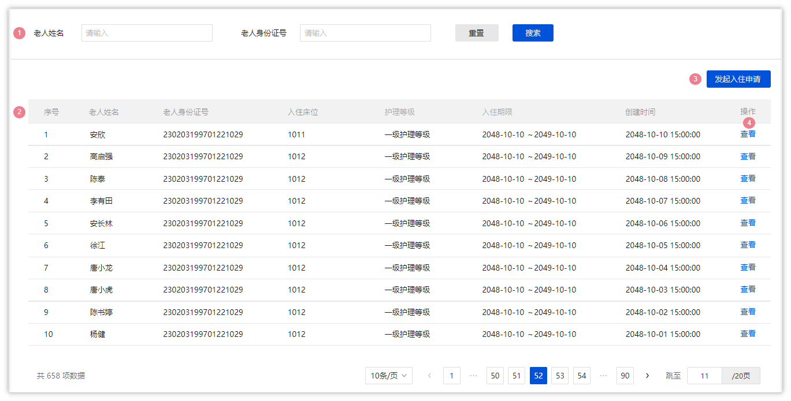

2.选中老人数据回显

- 请求方式：`GET`

- 请求路径：`/nursing/healthAssessment/elder/{id}`

- 请求参数：路径参数，评估id

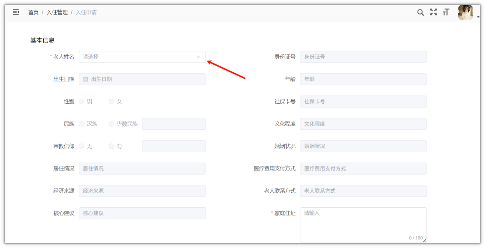

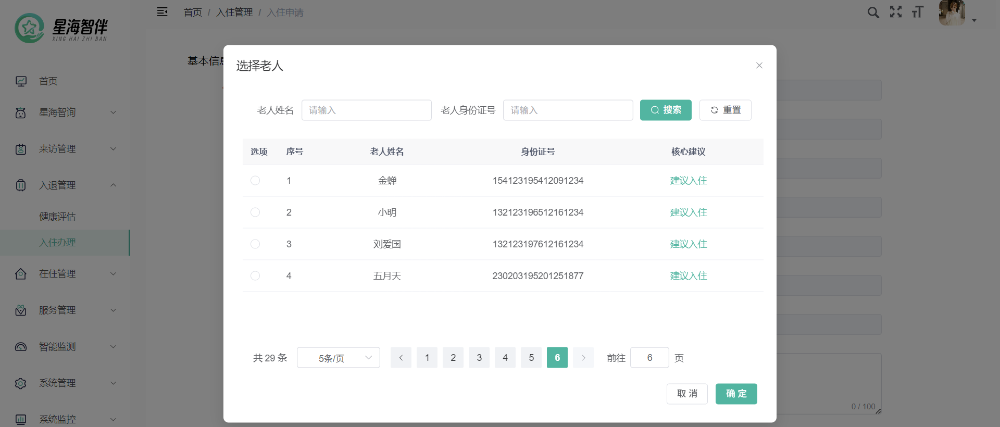

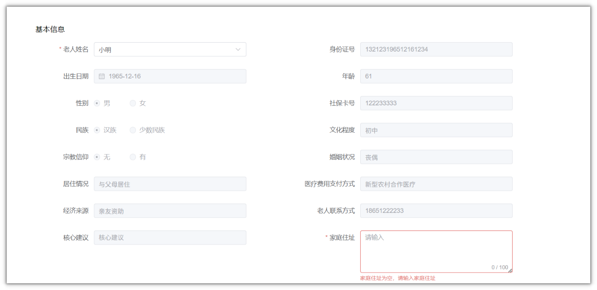

3.查询所有护理等级信息

- 请求方式：GET

- 参数：无

- 响应结果：参考若依框架定义的普通返回对象：`{msg:成功或失败,code:200,data:[]}`

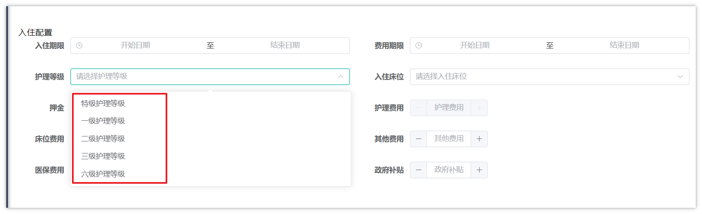

选择护理等级之后，可以自动填充护理费用这个这个

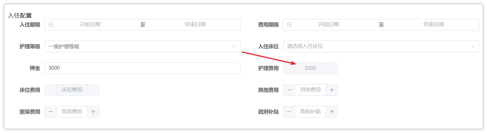

4.根据床位状态查询所有楼层数据

- 请求方式：GET

- 参数：status\(比较通用，只查询未入住的床位\)

- 响应结果：参考若依框架定义的普通返回对象：`{msg:成功或失败,code:200,data:[]}`

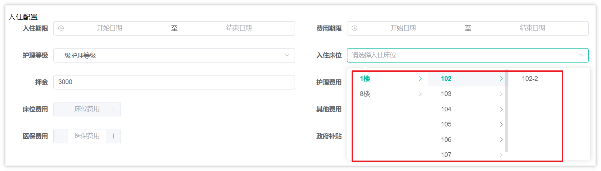

5.查询房间数据（楼层、房间、价格）

- 请求方式：GET

- 参数：选择之后的房间ID\(房间可以决定床位价格\)

- 响应结果：参考若依框架定义的普通返回对象：`{msg:成功或失败,code:200,data:{}}`

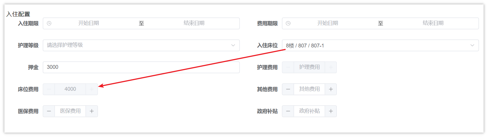

6.申请入住

填写入住信息之后，提交表单数据，进行保存，需要涉及到多张表\(老人表、入住表、入住配置表、合同表\)

- 请求方式：POST

- 参数：请求体数据，表单中的所有数据

- 响应结果：参考若依框架定义的普通返回对象：`{msg:成功或失败,code:200}`

7.查询入住详情

- 请求方式：GET

- 参数：入口在入住列表查询，可以传入入住ID

- 响应结果：参考若依框架定义的普通返回对象：`{msg:成功或失败,code:200,data:{}}`


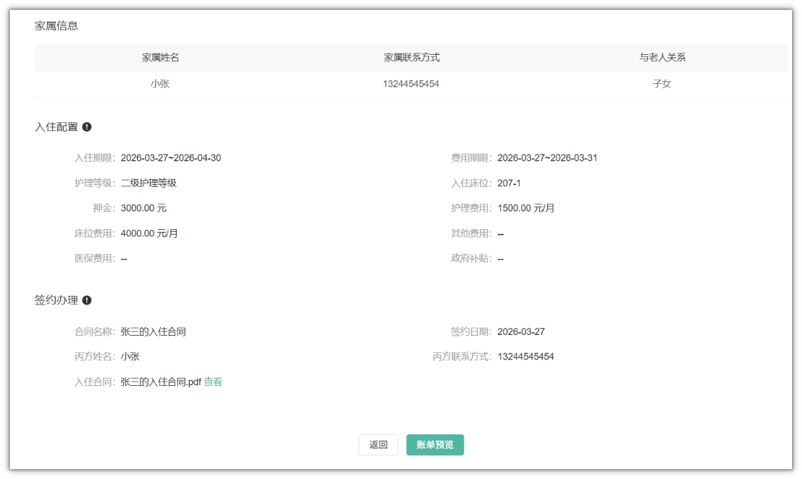

## 4.接口文档

详细定义请参考：[附录-接口文档](https://lining-lo.github.io/lining-lo-notes/星海智伴/附录-接口文档.html#二入退管理)

# 五、接口开发

## 1.基础代码生成

### 1.1.基础配置

把我们生成的四张表导入到代码生成中（入住表、入住配置表、合同表、老人表），如下图

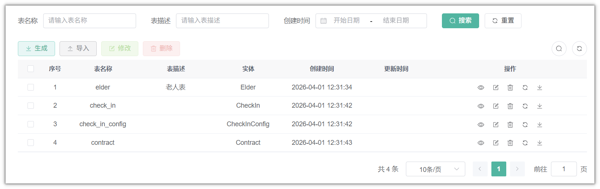

入住表\(check\_in\)代码生成配置

- 包路径：`com.xhzb.nursing`

- 模块名：`nursing`

- 业务名：`checkIn`

合同表\(contract\)代码生成配置

- 包路径：`com.xhzb.nursing`

- 模块名：`nursing`

- 业务名：`contract`

老人表\(elder\)代码生成配置

- 包路径：`com.xhzb.nursing`

- 模块名：`nursing`

- 业务名：`elder`

其他所有表的配置

- 包路径：`com.xhzb.nursing`

- 模块名：`nursing`

- 修改所有表中的日期类型为：LocalDateTime

- 创建时间和修改时间无需改动，还是Date类型

- 状态、性别、排序等改为Integer类型

- 所有的主键或关联的主键都是Long类型

### 1.2.批量生成导入

全选之后，点击代码生成，如下操作

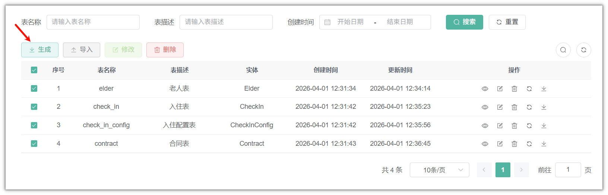

后端代码拷贝说明

把下载好的后端代码，统一拷贝到xhzb\-nursing\-platform模块中，如下效果

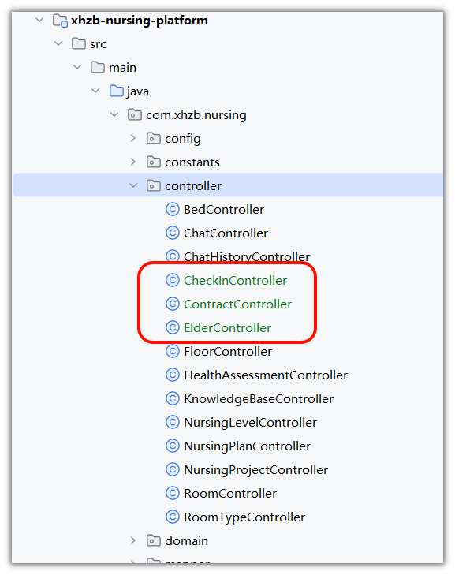

注意：删除掉CheckInConfigController这个类，后期用不到，留下其他的\(domain、service、mapper\)

## 2.分页查询入住列表

重新启动前后端项目，其中的入住的效果如下图

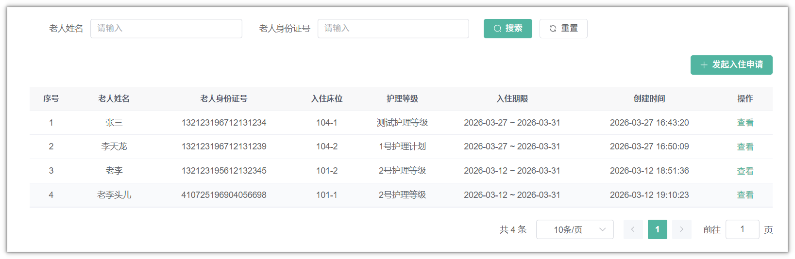

> 代码自动生成已包含该接口，无需开发 
> 

测试数据

```SQL
INSERT INTO `check_in`(`end_date`,`id_card_no`,`nursing_level_name`,`create_time`,`remark`,`elder_id`,`create_by`,`update_time`,`elder_name`,`id`,`bed_number`,`sort_order`,`start_date`,`status`) VALUES ('2026-03-31','132123196712131234','测试护理等级','2026-03-27 16:43:20.0','[{"kinship":"1","name":"13211223322","phone":"13211223322"}]',325,'1','2026-03-27 08:43:19.0','张三',1,'104-1',0,'2026-03-27',0);
INSERT INTO `check_in`(`end_date`,`id_card_no`,`nursing_level_name`,`create_time`,`remark`,`elder_id`,`create_by`,`update_time`,`elder_name`,`id`,`bed_number`,`sort_order`,`start_date`,`status`) VALUES ('2026-03-31','132123196712131239','1号护理计划','2026-03-27 16:50:09.0','[{"kinship":"0","name":"李天","phone":"13222334439"}]',326,'1','2026-03-27 08:50:08.0','李天龙',2,'104-2',0,'2026-03-27',0);
INSERT INTO `check_in`(`end_date`,`id_card_no`,`nursing_level_name`,`create_time`,`remark`,`elder_id`,`create_by`,`update_time`,`elder_name`,`id`,`bed_number`,`sort_order`,`start_date`,`status`) VALUES ('2026-03-31','132123195612132345','2号护理等级','2026-03-12 18:51:36.0','[{"kinship":"1","name":"小李","phone":"13212349900"}]',327,'1','2026-03-12 18:51:36.0','老李',3,'101-2',0,'2026-03-12',0);
INSERT INTO `check_in`(`end_date`,`id_card_no`,`nursing_level_name`,`create_time`,`remark`,`elder_id`,`create_by`,`update_time`,`elder_name`,`id`,`bed_number`,`sort_order`,`start_date`,`status`) VALUES ('2026-03-31','410725196904056698','2号护理等级','2026-03-12 19:10:23.0','[{"kinship":"0","name":"老王","phone":"15100000002"}]',328,'1','2026-03-12 19:10:23.0','老李头儿',4,'101-1',0,'2026-03-12',0);
```

## 3.查看老人信息详情\(入住字段填充\)

请求方式：`GET`

请求路径：`/nursing/healthAssessment/elder/{id}`

请求参数：路径参数，评估id

### 3.1.控制层

由于要查询入住评估信息，需要在HealthAssessmentController中新增一个查询的方法，如下

```Java
@GetMapping("/elder/{id}")
public AjaxResult getElderInfoById(@PathVariable Long id){
    Map<String,Object> list = healthAssessmentService.getElderInfoById(id);
    return success(list);
}
```

使用map作为返回值也是企业中常见的一种方式，优点是比较灵活

### 3.2.业务层

在IHealthAssessmentService接口中定义方法

```Java
/**
 * 查询老人信息
 * @param id
 * @return
 */
Map<String, Object> getElderInfoById(Long id);
```

实现方法：

```Java
/**
 * 查询老人详情
 * @param id
 * @return
 */
@Override
public Map<String, Object> getElderInfoById(Long id) {

    Map<String, Object> resultMap = new HashMap<>();

    // 查询主表 healthAssessment
    HealthAssessment healthAssessment = getById(id);
    resultMap.put("coreSuggestion",healthAssessment.getCoreSuggestion());
    resultMap.put("name",healthAssessment.getElderName());
    resultMap.put("idCardNo",healthAssessment.getIdCard());

    // 查询采集表 healthAssessmentDataColection
    // select basic_info from xxxx
    HealthAssessmentDataCollection healthAssessmentDataCollection = healthAssessmentDataCollectionService.lambdaQuery()
        .eq(HealthAssessmentDataCollection::getId, id)
        .select(HealthAssessmentDataCollection::getBasicInfo)
        .one();
    if(healthAssessmentDataCollection != null && !healthAssessmentDataCollection.getBasicInfo().isEmpty()){
        String basicInfoStr = healthAssessmentDataCollection.getBasicInfo();
        JSONObject jsonObject = JSONUtil.parseObj(basicInfoStr);

        resultMap.put("phone",jsonObject.getStr("elderContact"));

        resultMap.put("medicalPaymentMethod",jsonObject.getStr("medicalPaymentMethod"));
        resultMap.put("nation",jsonObject.getStr("nation"));
        resultMap.put("educationLevel",jsonObject.getStr("educationLevel"));
        resultMap.put("socialSecurityCard",jsonObject.getStr("socialSecurityCard"));
        resultMap.put("livingSituation",jsonObject.getStr("livingSituation"));
        resultMap.put("religiousBelief",jsonObject.getStr("religiousBelief"));
        resultMap.put("economicSource",jsonObject.getStr("economicSource"));
        resultMap.put("maritalStatus",jsonObject.getStr("maritalStatus"));

    }

    return resultMap;
}
```

测试效果：

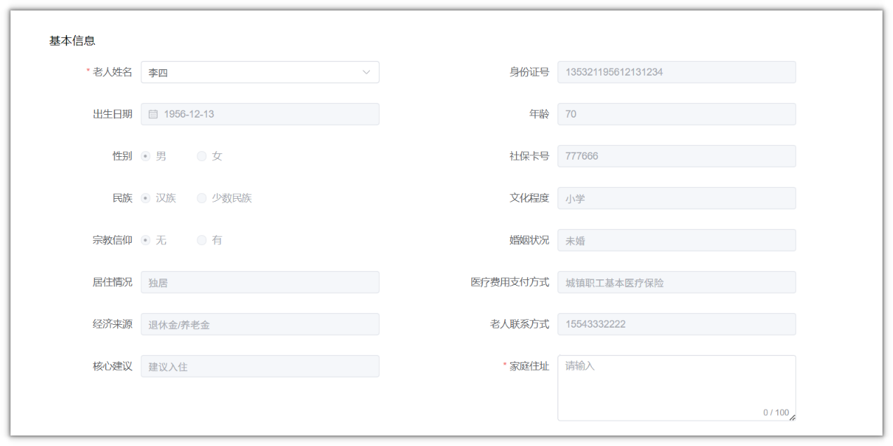

## 4.查询所有护理等级列表

接口地址:`/nursing/nursingLevel/listAll`

请求方式:`GET`

请求参数:

暂无

### 4.1.控制层

基于接口文档的定义，在NursingLevelController定义新的方法，如下：

```Java
@GetMapping("/listAll")
public AjaxResult listAll(){
    List<NursingLevel> list = nursingLevelService.lambdaQuery().eq(NursingLevel::getStatus, 1).list();
    return success(list);
}
```

### 4.2.测试

打开前端页面来测试，如下效果：

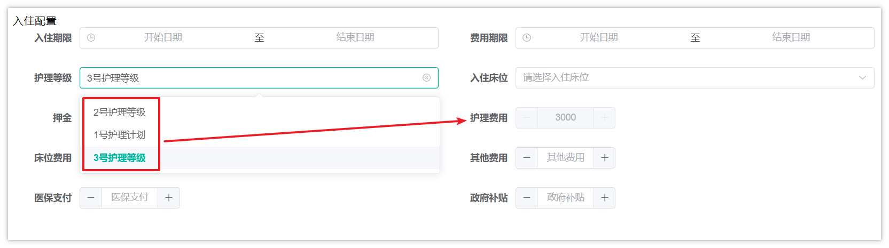

## 5.根据床位状态查询所有楼层数据

接口地址:`/elder/floor/getRoomAndBedByBedStatus/{status}`

请求方式:`GET`

请求参数:

|参数名称|参数说明|是否必须|
|---|---|---|
|status|床位状态，0：未入住，1：已入住|true|

### 5.1.思路说明

最终的效果图如下：

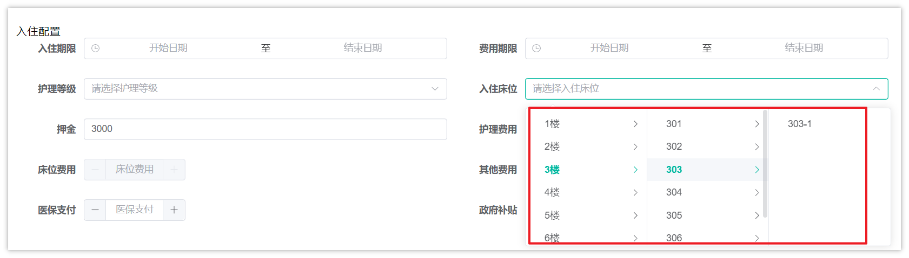

我们结合接口文档的数据结构，这个接口需要查询三张表的数据，分别是楼层表、房间表、床位表，它们的关系如下：


### 5.2.控制层

在FloorController中定义新的方法，如下：

```Java
@GetMapping("/getRoomAndBedByBedStatus/{status}")
public AjaxResult getRoomAndBedByBedStatus(@PathVariable Integer status){
    List<TreeVo> list = floorService.getRoomAndBedByBedStatus(status);
    return success(list);
}
```

TreeVo\(需要结合着接口文档的数据结构来编写vo类\)

```Java
package com.xhzb.nursing.domain.dto;


import io.swagger.v3.oas.annotations.media.Schema;
import lombok.Data;

import java.util.List;

@Data
@Schema(description = "树形结构VO")
public class TreeVo {

    /**
     * 菜单名称
     */
    @Schema(title = "菜单名称")
    private String label;

    /**
     * 菜单ID
     */
    @Schema(title = "菜单ID")
    private String value;

    /**
     * 子菜单
     */
    @Schema(title = "子菜单")
    private List<TreeVo> children;
}
```

### 5.3.业务层

在IFloorService中定义新的方法：

```Java
/**
 * 查询楼层房间床位
 * @param status
 * @return
 */
List<TreeVo> getRoomAndBedByBedStatus(Integer status);
```

实现方法：

```Java
/**
 * 查询楼层房间床位
 * @param status
 * @return
 */
@Override
public List<TreeVo> getRoomAndBedByBedStatus(Integer status) {
    return floorMapper.getRoomAndBedByBedStatus(status);
}
```

### 5.4.持久层

在FloorMapper中定义查询的方法

```Java
List<TreeVo> getRoomAndBedByBedStatus(Integer status);
```

xml映射文件

```XML
<resultMap id="TreeVoResultMap" type="com.xhzb.nursing.domain.vo.TreeVo">
    <id column="fid" property="value"></id>
    <result column="name" property="label"></result>
    <collection property="children" ofType="com.xhzb.nursing.domain.vo.TreeVo">
        <id column="rid" property="value"></id>
        <result column="code" property="label"></result>
        <collection property="children" ofType="com.xhzb.nursing.domain.vo.TreeVo">
            <id column="bid" property="value"></id>
            <result column="bed_number" property="label"></result>
        </collection>
    </collection>
</resultMap>

<select id="getRoomAndBedByBedStatus" resultMap="TreeVoResultMap">
    select f.id fid, f.name, r.id rid, r.code, b.id bid, b.bed_number
    from floor f
             left join room r on f.id = r.floor_id
             left join bed b on r.id = b.room_id
    where b.bed_status = #{status}
    order by f.id, r.id, b.id
</select>
```

### 5.5.测试

可以前端项目来查看效果

## 6.查询房间数据(楼层、房间、价格)

接口地址:`/elder/room/one/{id}`

请求方式:`GET`

请求参数:

|参数名称|参数说明|请求类型|是否必须|数据类型|
|---|---|---|---|---|
|id|房间ID|path|true|integer\(int64\)|

### 6.1.思路说明

效果图：

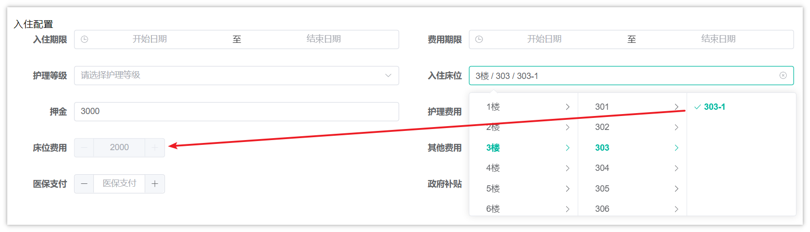

当选择了某一个床位之后，需要根据床位所在的房间，查询所匹配的价格，我们结合接口文档的返回结果来分析，这里面涉及到了3张表：

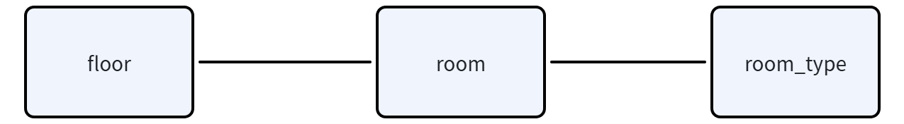

### 6.2.控制层

在RoomController中定义新的方法，如下：

```Java
@GetMapping("/one/{id}")
public R<RoomVo> getRoomById(@ApiParam(value = "房间ID", required = true) @PathVariable("id") Long id){
    RoomVo roomVo = roomService.getRoomById(id);
    return R.ok(roomVo);
}
```

RoomVo在代码中已提供，符合接口返回的要求

### 6.3.业务层

在IRoomService中定义新的方法：

```Java
/**
 * 按照房间id查询楼层、房间、价格
 * @param id
 * @return
 */
RoomVo getRoomById(Long id);
```

实现方法：

```Java
/**
 * 按照房间id查询楼层、房间、价格
 *
 * @param id
 * @return
 */
@Override
public RoomVo getRoomById(Long id) {
    return roomMapper.getRoomById(id);
}
```

### 6.4.持久层

在RoomMapper中定义新的方法，如下：

```Java
RoomVo getRoomById(Long id);
```

xml映射文件：

```XML
<select id="getRoomById" resultType="com.xhzb.nursing.domain.vo.RoomVo">
    select f.name floorName,f.id floorId,r.id roomId,r.code ,rt.price
    from floor f left join room r on f.id = r.floor_id
                 left join  room_type rt on rt.name = r.type_name
    where r.id = #{id}
</select>
```

### 6.5.测试

打开前端页面，查看效果，要选择一个床位关联了床位类型的数据进行测试

## 7.申请入住

接口地址:`/nursing/checkIn/apply`

请求方式:`POST`

涉及到的表

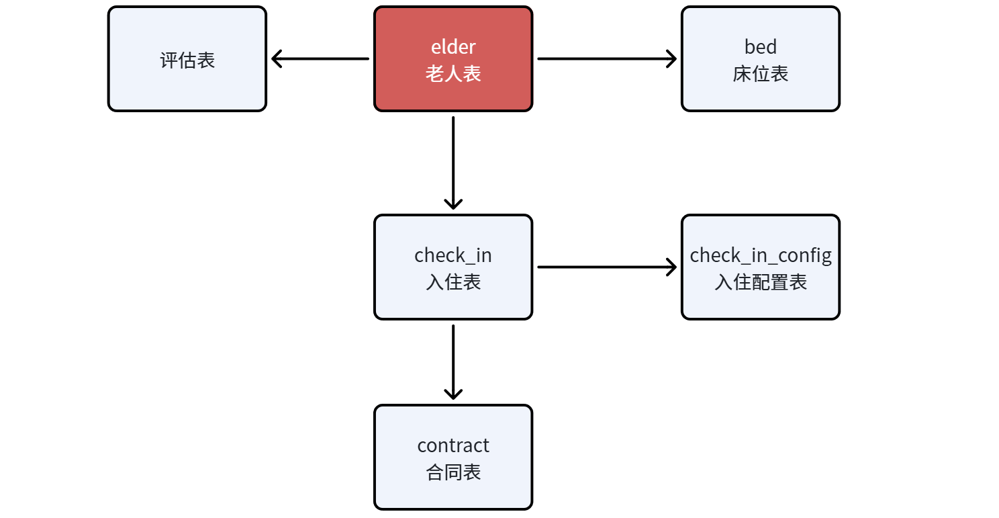

### 7.1.思路说明

申请入住的流程较长，涉及到多表中的操作，流程如下：

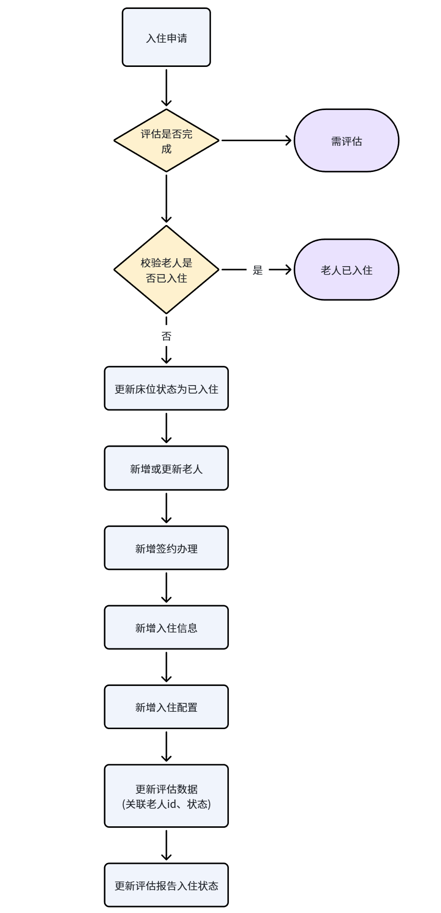

### 7.2.控制层

在CheckInController中定义申请入住的方法

```Java
@PostMapping("/apply")
public AjaxResult apply(@RequestBody CheckInApplyDto dto){
    checkInService.applyCheckIn(dto);
    return AjaxResult.success();
}
```

基于接口的入参分析，我们需要定义多个dto来接收参数，大家主要可以按照接口中的参数来定义类

也可以使用AI大模型，基于json接口帮我们生成java的类来接收数据

大家也可以使用资料中提供的代码

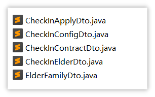

基本的结构如下：

```Java
public class CheckInApplyDto {

    //老人信息
    private CheckInElderDto checkInElderDto;
    
    //家属信息
    private List<ElderFamilyDto> elderFamilyDtoList;
   
    //入住配置
    private CheckInConfigDto checkInConfigDto;
   
    //签约办理
    private CheckInContractDto checkInContractDto;
}
```

注意：属性名称要与json结构中保持一致

### 7.3.业务层

基于刚才分析的思路，我们知道入住发起请求之后，需要涉及到多表张，共有5张表需要操作，分别是：老人表、床位表、入住表、入住配置表、合同表。

我们在ICheckInService中定义新的方法，如下：

```Java
/**
 * 申请入住
 * @param checkInApplyDto
 */
void applyCheckIn(CheckInApplyDto checkInApplyDto);
```

实现方法，需要添加事务的支持

```Java
@Autowired
private CheckInMapper checkInMapper;
@Autowired
private IHealthAssessmentService healthAssessmentService;
@Autowired
private IElderService elderService;
@Autowired
private IBedService bedService;
@Autowired
private IContractService contractService;
@Autowired
private ICheckInConfigService checkInConfigService;
@Autowired
private IHealthAssessmentReportService healthAssessmentReportService;

@Override
@Transactional(rollbackFor = Exception.class)
public void applyCheckIn(CheckInApplyDto dto) {
    // 判断评估是否完成
    HealthAssessment healthAssessment = healthAssessmentService.lambdaQuery()
            .eq(HealthAssessment::getId, dto.getHealthAssessmentId())
            .eq(HealthAssessment::getEvaluationProgress, 1)
            .one();
    if (Objects.isNull(healthAssessment)) {
        throw new IllegalArgumentException("评估未完成, 无法入住");
    }

    // 判断老人是否已入住
    Elder elder = elderService.lambdaQuery()
            .eq(Elder::getIdCardNo, dto.getCheckInElderDto().getIdCardNo())
            .in(Elder::getStatus, 0,1, 2)
            .one();
    if (Objects.nonNull(elder)) {
        throw new IllegalArgumentException("老人已入住, 无法重复入住");
    }

    // 更新床位状态为已入住
    Bed bed = bedService.lambdaQuery()
            .eq(Bed::getId, dto.getCheckInConfigDto().getBedId()).one();
    if (Objects.isNull(bed)) {
        throw new IllegalArgumentException("床位不存在");
    }
    bed.setBedStatus(1);
    bedService.updateById(bed);

    // 新增或更新老人信息
    elder = saveOrderUpdateElder(dto, bed);

    // 新增签约办理
    insertContract(dto, elder);

    // 新增入住信息
    CheckIn checkIn = insertCheckIn(dto, elder);

    // 新增入住配置
    insertCheckInConfig(dto, checkIn);

    // 更新评估数据 : 关联老人Id 和 入住状态
    healthAssessment.setElderId(elder.getId());
    healthAssessment.setCheckInStatus(1);
    healthAssessmentService.updateById(healthAssessment);

    // 更新评估报告 : 入住状态
    healthAssessmentReportService.lambdaUpdate()
            .eq(HealthAssessmentReport::getHealthAssessmentId, healthAssessment.getId())
            .set(HealthAssessmentReport::getCheckInStatus, 1)
            .update();
}

/**
 * @discription 新增入住配置
 * @Param
 * @param dto
 * @param checkIn
 * @author qingshan
 * @date 2026/5/15 下午4:48
 * @return
 */

private void insertCheckInConfig(CheckInApplyDto dto, CheckIn checkIn) {
    CheckInConfig checkInConfig = BeanUtil.toBean(dto.getCheckInConfigDto(), CheckInConfig.class);
    checkInConfig.setCheckInId(checkIn.getId());
    checkInConfigService.save(checkInConfig);
}

/**
 * @discription 新增入住信息
 * @Param
 * @param dto
 * @param elder
 * @author qingshan
 * @date 2026/5/15 下午4:48
 * @return
 */
private CheckIn insertCheckIn(CheckInApplyDto dto, Elder elder) {
    CheckIn checkIn = new CheckIn();
    checkIn.setElderId(elder.getId());
    checkIn.setElderName(elder.getName());
    checkIn.setIdCardNo(elder.getIdCardNo());
    checkIn.setStartDate(dto.getCheckInConfigDto().getStartDate());
    checkIn.setEndDate(dto.getCheckInConfigDto().getEndDate());
    checkIn.setNursingLevelName(dto.getCheckInConfigDto().getNursingLevelName());
    checkIn.setBedNumber(elder.getBedNumber());
    checkIn.setStatus(1);
    checkIn.setRemark(JSONUtil.toJsonStr(dto.getElderFamilyDtoList()));
    checkInMapper.insert(checkIn);
    return checkIn;
}

/**
 * @discription 新增签约办理
 * @Param
 * @param dto
 * @param elder
 * @author qingshan
 * @date 2026/5/15 下午4:48
 * @return
 */
private void insertContract(CheckInApplyDto dto, Elder elder) {
    Contract contract = BeanUtil.toBean(dto.getCheckInContractDto(), Contract.class);
    contract.setElderId(elder.getId());
    contract.setElderName(elder.getName());
    String contractNumber = CodeGenerator.generateContractNumber();
    contract.setContractNumber("HT" + contractNumber);
    contract.setStartDate(dto.getCheckInConfigDto().getStartDate());
    contract.setEndDate(dto.getCheckInConfigDto().getEndDate());
    contract.setStatus(LocalDateTime.now().isAfter(contract.getStartDate()) ? 1 : 0);
    contractService.save(contract);
}

/**
 * @discription 新增或更新老人信息
 * @Param
 * @param dto
 * @param bed
 * @author qingshan
 * @date 2026/5/15 下午4:48
 * @return
 */
private Elder saveOrderUpdateElder(CheckInApplyDto dto, Bed bed) {
    Elder elder = BeanUtil.toBean(dto.getCheckInElderDto(), Elder.class);
    elder.setStatus(1);
    elder.setBedId(bed.getId());
    elder.setBedNumber(bed.getBedNumber());

    Elder elderdb = elderService.lambdaQuery()
            .eq(Elder::getIdCardNo, dto.getCheckInElderDto().getIdCardNo())
            .eq(Elder::getStatus, 3)
            .one();
    if (Objects.nonNull(elderdb)) {
        elder.setId(elderdb.getId());
        elderService.updateById(elder);
    } else {
        elderService.save(elder);
    }
    return elder;
}
```

在创建合同的时候，需要生成一个合同的编号，编号的规则如下：

- 共有16位的数值

- 前12位的组成规则是：yyyyMMddHHmmss 案例：20250101101259

- 后4位是在当前时间内生成一个递增的数值，从1开始，案例：0001,9999（最大值）

- 我们可以通过AI大模型，帮助我们生成工具类：

> Prompt
>
> 帮我生成一个java工具类，可以生成一个编号，编号长度为16为，其中前12位是当前时间（年月日时分秒），后四位是当前时间累加的值，最小值为：0001  最大的值为：9999
>

已在代码中提供好

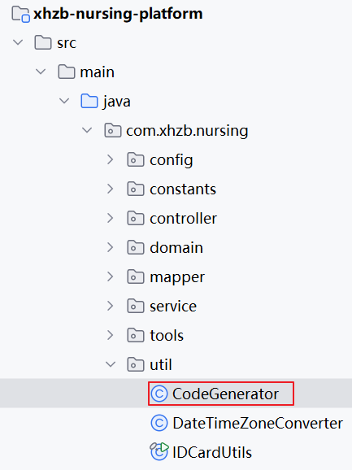

### 7.4.测试

在前端页面进行测试

请求成功后，查询数据库中，数据是否正常保存

- 入住表

- 入住配置表

- 老人表

- 合同表

- 床位的状态

## 8.申请入住详情

### 8.1.思路说明

如下图：

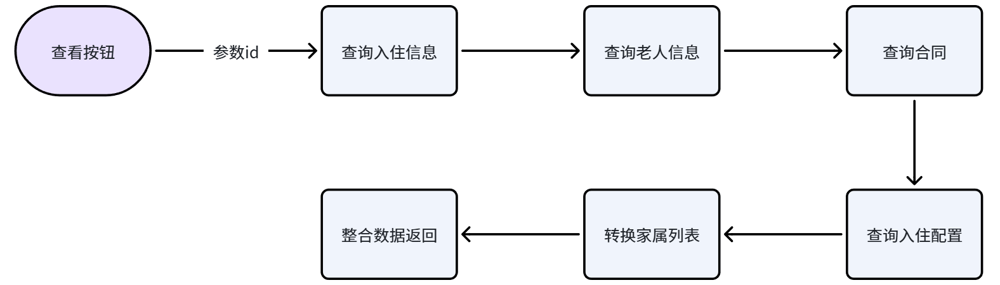

### 8.2.控制层

基于接口文档定义内容如下，在CheckInController中定义新的方法：

```Java
@GetMapping("/detail/{id}")
public AjaxResult detail(@PathVariable("id") Long id){
    CheckInDetailVo checkInDetailVo = checkInService.detail(id);
    return success(checkInDetailVo);
}
```

上述接口定义中，CheckInDetailVo 是接口的返回对象，思路与之前的入参差不多，也要严格按照接口文档中定义的json结构来定义类，或者使用AI生成对应的vo类，方便给前端传输数据。

在当天的资料中，已经提供了对应的vo类，大家可以直接拷贝：

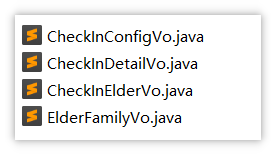

入住详情的其他代码，需要自行实现

提示：其中的合同信息使用实体类Contract
