# 一、目标

开发到现阶段，项目中的模块已经开发了一部分，不过呢，随着用户要求的不断提升可能会迭代出更多的需求需要计划开发，当然，在一个项目中大阶段完成之后，肯定是需要先把项目上线，让用户先用起来，然后再提新的问题进行升级。所以我们今天会先把项目部署起来，并且教会大家如果是线上的项目出了问题，如何更好的去解决。所以今天的内容就包含了以下几点：

- 能够完成前端项目的部署

- 能够完成后端项目的部署

- 能够掌握线上项目问题的排查思路和解决办法

# 二、项目开发模式

## 1.瀑布模型（Waterfall Model）

瀑布模型是一种顺序型开发模式，各个阶段按照顺序依次进行，每个阶段完成后才能进入下一个阶段。这种模式适用于需求稳定、开发周期长的项目。

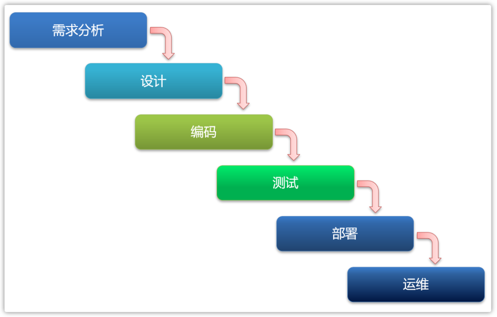

## 2.敏捷开发（Agile Development）

敏捷开发是一种迭代型开发模式，强调团队合作、用户参与和快速响应变化。敏捷开发方法包括Scrum、XP、Lean等，适用于需求不稳定、开发周期较短的项目。

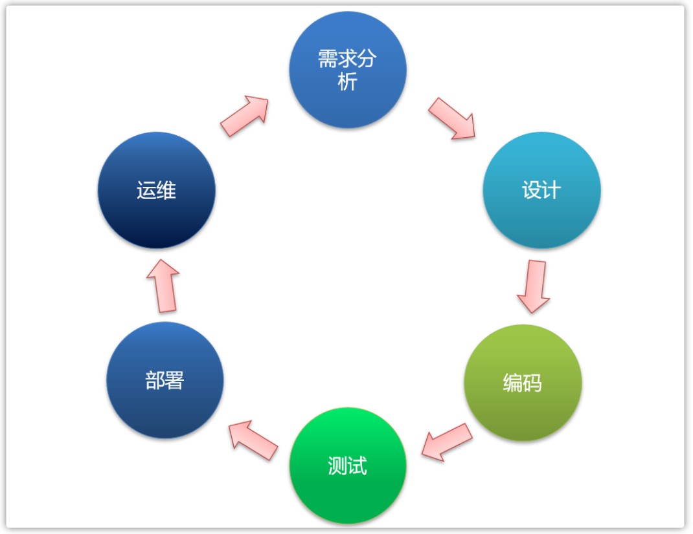

## 3.DevOps

DevOps是一种将开发和运维流程整合在一起的开发模式，强调自动化和持续交付。DevOps适用于需要频繁部署和更新的项目。

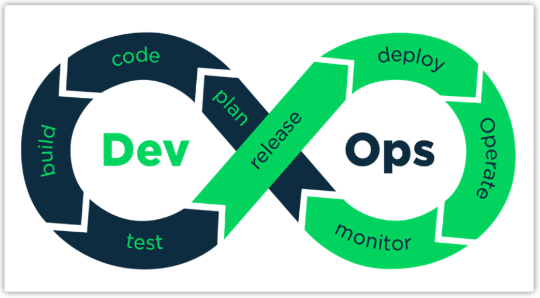

### 3.1.持续集成

持续集成 （Continuous integration，简称 CI） 指的是，频繁地（一天多次）将代码集成到主干。

它的好处主要有两个：

- 快速发现错误。每完成一点更新，就集成到主干，可以快速发现错误，定位错误也比较容易。

- 防止分支大幅偏离主干。如果不是经常集成，主干又在不断更新，会导致以后集成的难度变大，甚至难以集成。

持续集成的目的，就是让产品可以快速迭代，同时还能保持高质量。它的核心措施是，代码集成到主干之前，必须通过自动化测试。只要有一个测试用例失败，就不能集成。

Martin Fowler 说过，”持续集成并不能消除 Bug，而是让它们非常容易发现和改正。”

与持续集成相关的，还有两个概念，分别是持续交付和持续部署。

### 3.2.持续交付

持续交付（Continuous delivery）指的是，频繁地将软件的新版本，交付给质量团队或者用户，以供评审。如果评审通过，代码就进入生产阶段。

持续交付可以看作持续集成的下一步。它强调的是，不管怎么更新，软件是随时随地可以交付的。

### 3.3.持续部署

持续部署（continuous deployment）是持续交付的下一步，指的是代码通过评审以后，自动部署到生产环境。

持续部署的目标是，代码在任何时刻都是可部署的，可以进入生产阶段。

持续部署的前提是能自动化完成测试、构建、部署等步骤。

### 3.4.CI/CD流程

为了保证团队开发人员提交代码的质量，减轻了软件发布时的压力；持续集成中的任何一个环节都是自动完成的，无需太多的人工干预，有利于减少重复过程以节省时间、费用和工作量；

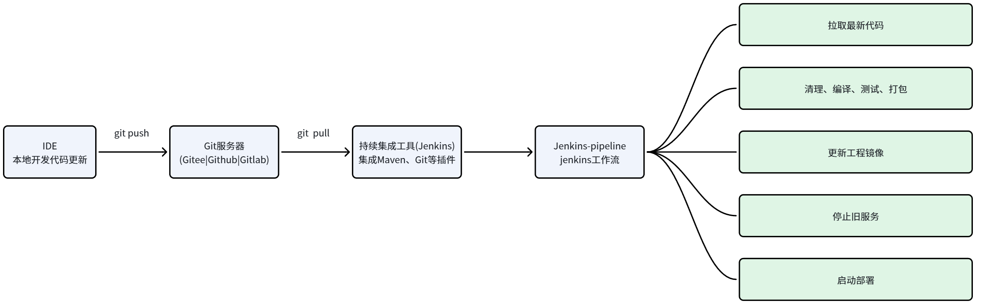

实现流程：

1. 开发人员持续将功能代码集成到公共功能集成分支，如: dev

2. 当功能积攒到一定节点，需要进行线上项目升级，需要基于持续集成软件进行一键发布；

3. 持续集成工具先对dev\|master分支代码进行拉取更新，然后对最新功能代码进行清理、编译、测试、打包、打镜像、部署等动作；

4. 如果构建失败，则发送邮件提醒代码提交人员或管理员；

要实现上面流程，我们需要了解一款支持持续集成的软件：Jenkins;

三者对比：

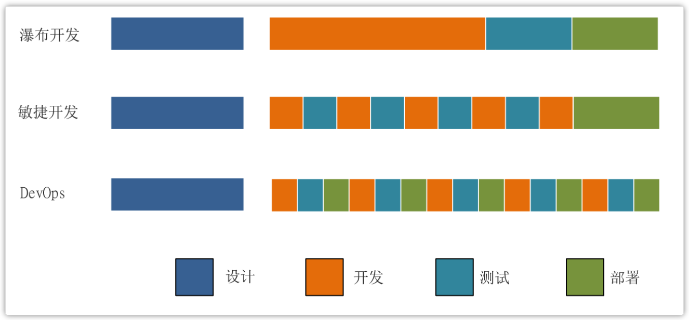

# 三、项目部署

## 1.整体部署思路

如下图

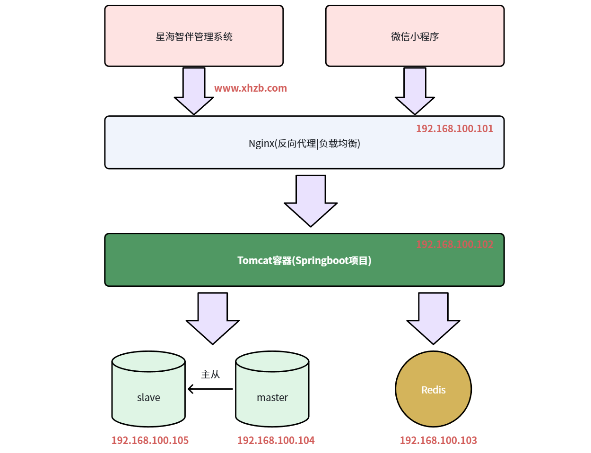

在企业正常的项目部署中，可能会涉及多台服务器共同使用，如上图中的Nginx、Tomcat、Redis、MySQL都会有对应的单独的服务器，让各个服务器进行互相通信即可完成部署

> 其中的微信小程序必须租腾讯的服务器才能完成部署，我们涉及不到
> 
> 在学习阶段，我们所有的服务都使用同一个虚拟机来完成项目的部署

## 2.环境准备

### 2.1.基础环境

软件环境：

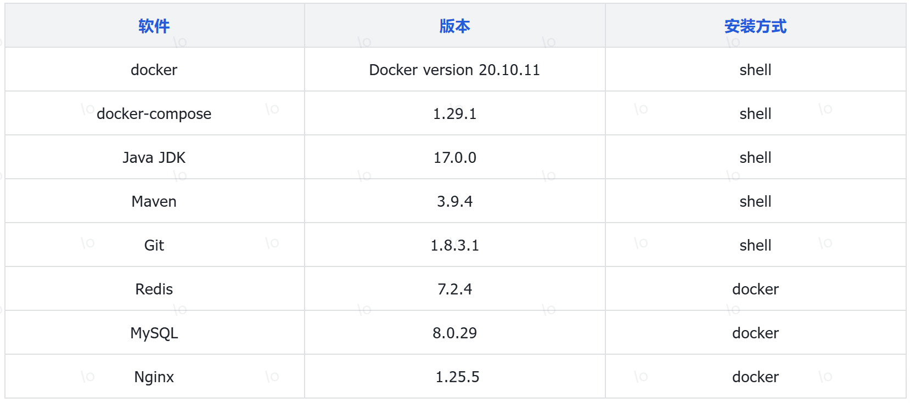

### 2.2.Jenkins介绍和安装

参考文档：[附录-Jenkins](https://lining-lo.github.io/lining-lo-notes/星海智伴/附录-Jenkins.html)

目前在提供的虚拟机中已经使用docker安装了jenkins，启动命令：`docker start jenkins`

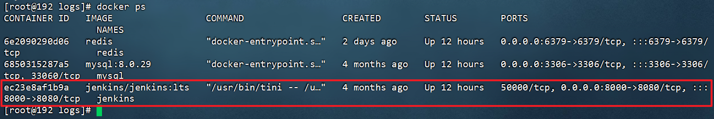

访问地址：http://192.168.100.168:8000/

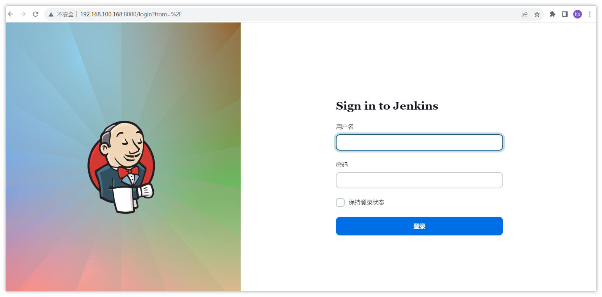

用户名：`zzyl`   密码：`itcast`

登录后的效果：

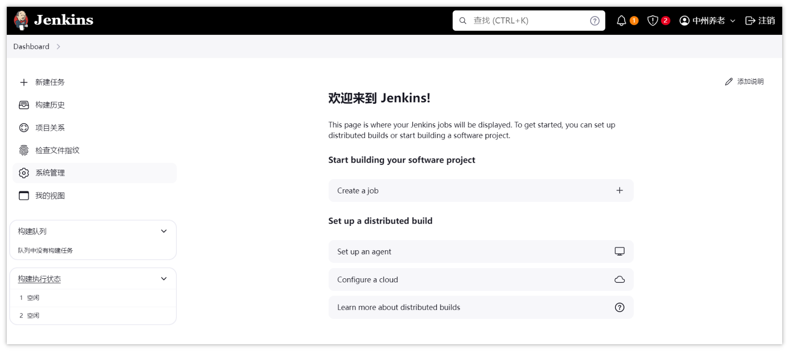

### 2.3.准备JDK

把资料中的环境准备中的jdk\-17\.0\.10\_linux\-x64\_bin\.tar\.gz上传到服务器，解压后改名为jdk，然后放到/usr/local/jenkins中

本地目录：/usr/local/jenkins  挂载容器的目录为：/var/jenkins\_home

```shell
# 删除老版本
rm -rf  /usr/local/jenkins/jdk

# 解压
tar -zxvf jdk-17.0.10_linux-x64_bin.tar.gz

# 改名并移动到指定目录
mv jdk-17.0.10 /usr/local/jenkins/jdk
```

上述操作完成之后，jdk在容器的目录为：/var/jenkins\_home/jdk

检查jenkins中jdk目录是否正确

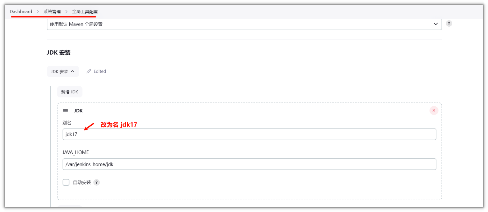

改完之后需要保存

### 2.4.准备Maven

在目前的容器中已经存在了maven，但是不符合我们当前项目的仓库要求，也可以不设置，就是下载很多东西，建议更新为自己最新的仓库

1.删除原有的maven

```Bash
rm -rf /usr/local/jenkins/maven
```

2.上传资料中的maven环境：apache\-maven\-3\.9\.4\.zip

是一个zip包，先在linux中解压

```Bash
unzip apache-maven-3.9.4.zip
```

> 如果系统中没有unzip  则可以安装：`sudo yum install unzip -y`
> 

3.移动并改名

```Bash
mv apache-maven-3.9.4 /usr/local/jenkins/maven
```

需要给maven的mvn命令赋权，执行权利 \(忽略\),若后续部署日志有以下信息需要执行

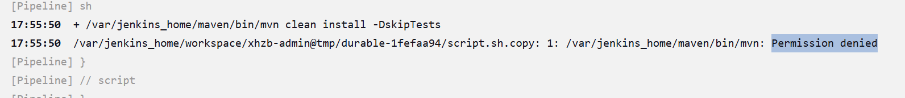

```Bash
# 进入容器
docker exec -it jenkins bash
# 找到meven的目录
cd /var/jenkins_home/maven/bin
# 赋权操作
chmod +x mvn
```

4.检查jenkins中的配置

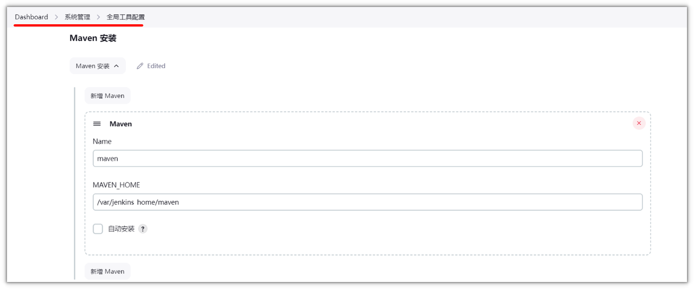

都改完之后，需要重新启动jenkins中容器

```Bash
docker restart jenkins
```

### 2.5.创建基础的JDK17镜像

1.上传后端部署资料中的jdk17\.tar包，然后加载为镜像

```Bash
docker load -i jdk17.tar
```

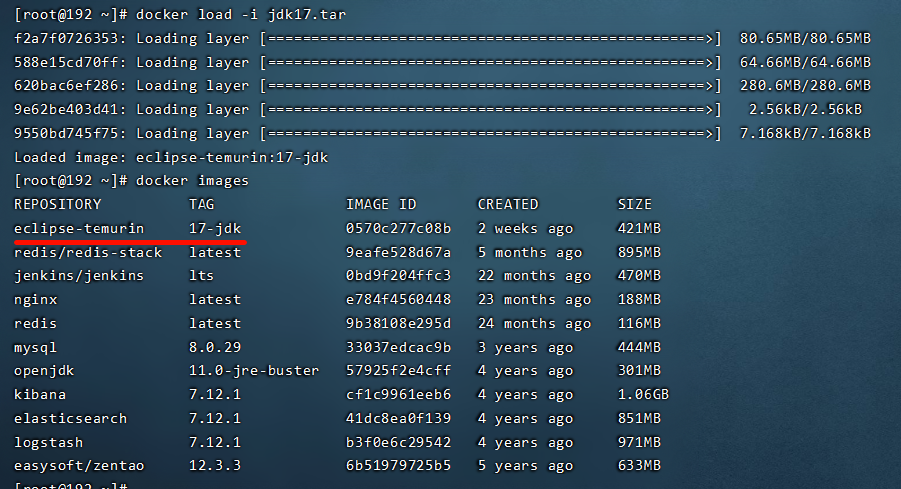

## 3.部署后端项目

### 3.1.多环境说明

在项目开发部署的过程中，一般都会有三套项目环境

- Development ：开发环境

- Production ：生产环境

- Test ：测试环境

例如：开发环境的mysql连接的是本地，生产环境需要连接线上的mysql环境

为了跟本地开发环境进行区分，则需要激活application\-prod\.yml来使用，在生产环境中有些配置需要修改下：

- 将dev的配置覆盖prod的配置

- 端口换成9000

- 日志级别改为 info

- 关闭swagger功能

```YAML
# 开发环境配置
server:
  # 服务器的HTTP端口，默认为8080
  port: 9000
  servlet:
    # 应用的访问路径
    context-path: /
  tomcat:
    # tomcat的URI编码
    uri-encoding: UTF-8
    # 连接数满后的排队数，默认为100
    accept-count: 1000
    threads:
      # tomcat最大线程数，默认为200
      max: 800
      # Tomcat启动初始化的线程数，默认值10
      min-spare: 100

# 日志配置
logging:
  level:
    com.xhzb: info
    org.springframework: info
    org.springframework.ai: info

# Spring配置
spring:
  ai:
    openai:
      api-key: ${OPENAI_API_KEY}  #读取环境变量中的api key
      base-url: https://dashscope.aliyuncs.com/compatible-mode
      chat:
        options:
          model: qwen-max-latest
      embedding:
        options:
          model: text-embedding-v3
          dimensions: 1024
    ollama:
      base-url: http://localhost:11434
      chat:
        options:
          model: qwen3.5:9b
    deepseek:
      base-url: https://api.deepseek.com
      api-key: ${DEEPSEEK_API_KEY}
      chat:
        options:
          model: deepseek-chat
  # 资源信息
  messages:
    # 国际化资源文件路径
    basename: i18n/messages
  # 文件上传
  servlet:
    multipart:
      # 单个文件大小
      max-file-size: 10MB
      # 设置总上传的文件大小
      max-request-size: 20MB
  # 服务模块
  devtools:
    restart:
      # 热部署开关
      enabled: true
  datasource:
    driverClassName: com.mysql.cj.jdbc.Driver
    url: jdbc:mysql://192.168.100.168:3306/xhzb?useUnicode=true&characterEncoding=utf8&zeroDateTimeBehavior=convertToNull&useSSL=true&serverTimezone=GMT%2B8
    username: root
    password: heima123
  # redis 配置
  data:
    redis:
      # 地址
      host: 192.168.100.168
      # 端口，默认为6379
      port: 6379
      # 数据库索引
      database: 0
      # 密码
      password: 123456
      # 连接超时时间
      timeout: 10s
      jedis:
        pool:
          enabled: true
# Springdoc配置
springdoc:
  api-docs:
    path: /v3/api-docs
  swagger-ui:
    enabled: false
    path: /swagger-ui.html
    tags-sorter: alpha
  group-configs:
    - group: 'default'
      display-name: '测试模块'
      paths-to-match: '/**'
      packages-to-scan: com.xhzb
# oss的配置，要根据自己实际情况来进行修改
oss:
  endpoint: oss-cn-beijing.aliyuncs.com
  accessKeyId: ${OSS_ACCESS_KEY_ID}
  accessKeySecret: ${OSS_ACCESS_KEY_SECRET}
  bucketName: hm-xhzb
```

在application\.yml文件中激活prod环境

```YAML
# 激活环境
spring:
  profiles:
    active: prod
```

### 3.2.代码合并

从dev\-\*开头的分支中，合并代码到master分支中

切换分支到master分支

注意：切换分支之间，必须提交代码commit操作

merge合并代码

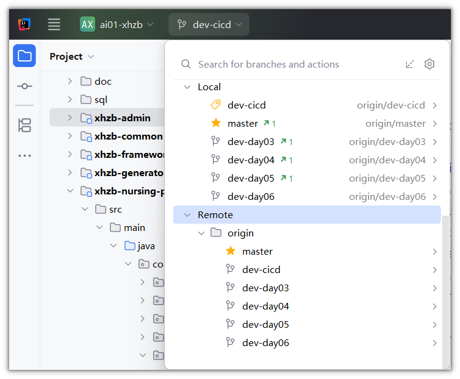

> 企业中正常需要合并代码，我们教学阶段可以不合并，用最新分支即可
> 

### 3.3.什么是流水线

Jenkins 流水线配置是 Jenkins 中用于定义和执行自动化构建、测试和部署过程的一种方式

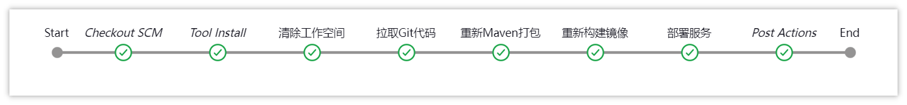

在声明式流水线中，整个流水线过程被定义在一个 `pipeline` 块中，该块包含了流水线执行所需的所有指令和阶段。

1.基本结构

声明式流水线的基本结构如下：

```java
pipeline {  
    agent any // 指定流水线运行的节点，any 表示任何可用的节点  
    stages {  
        stage('Stage Name') { // 定义阶段  
            steps {  
                // 定义在该阶段执行的步骤  
                echo 'Hello, World!'  
            }  
        }  
    }  
}
```

2. 主要指令和阶段

- agent：指定流水线或特定阶段在哪个节点上执行。

- stages：包含流水线中的所有阶段（stage），阶段是流水线的主要分组单元。

- stage：定义一个阶段，阶段内可以包含一个或多个步骤。

- steps：定义在某个阶段内执行的步骤，步骤是构建过程中的具体操作。

- post：定义在所有阶段完成后执行的操作，可以基于不同的条件（如成功、失败、总是）来执行。

- environment：定义流水线中的环境变量。

- options：定义全局选项和配置，如超时设置、并行执行等。

- parameters：定义流水线的参数，用于接收用户输入。

- triggers：定义触发流水线执行的条件或事件，如定时触发、代码推送触发等。

### 3.4.Jenkins 流水线配置

**新建任务**

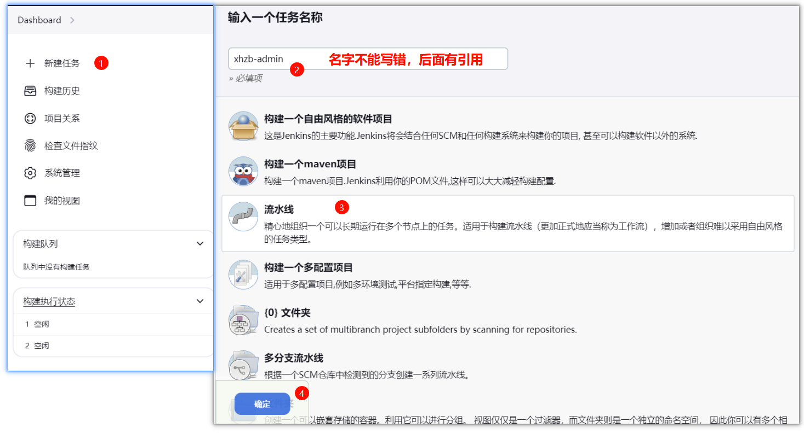

**输入项目名称**

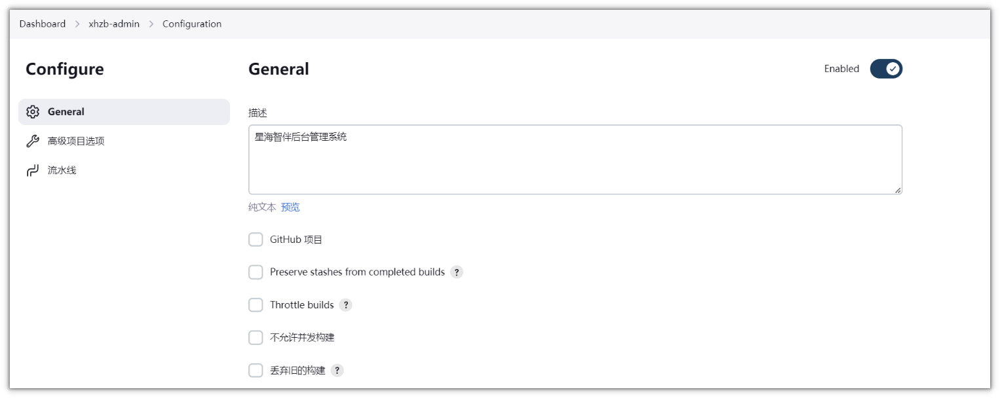

**参数化配置**

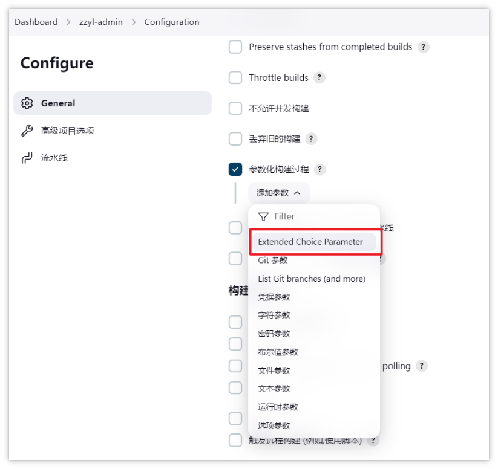

定义服务列表：services，多个服务建议用 "," 隔开

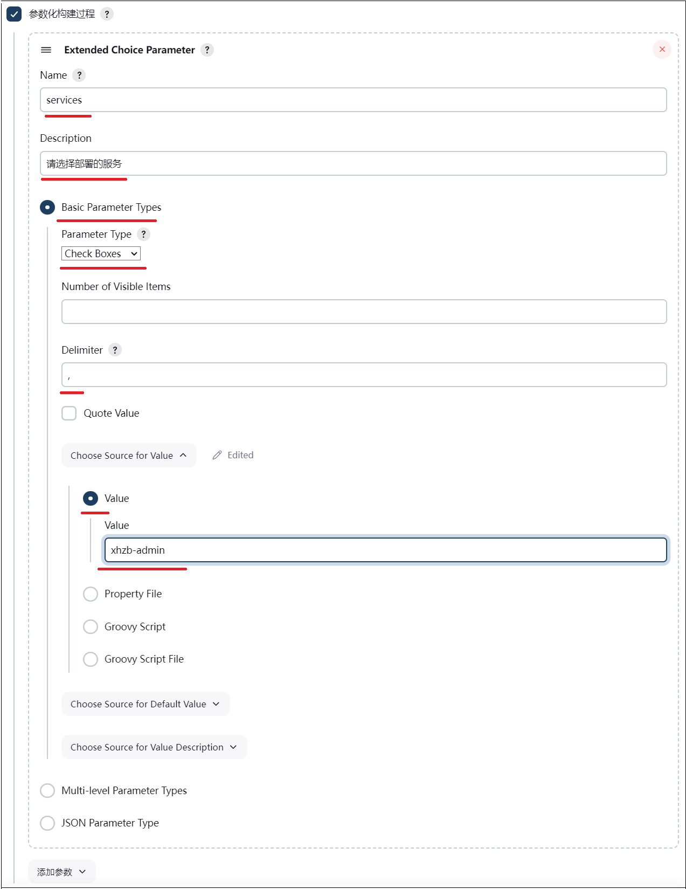

定义参数：GIT\_URL

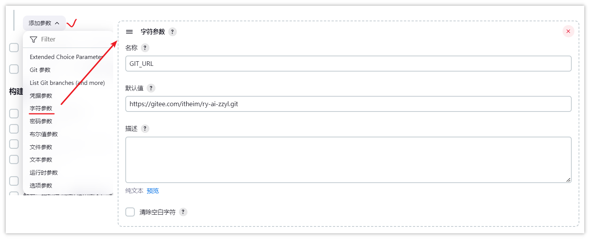

定义代码分支参数：GIT\_TAG

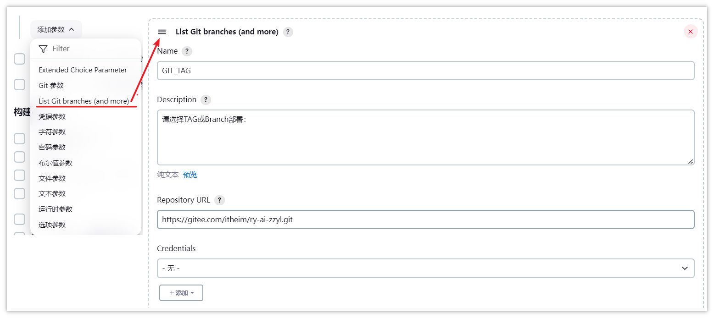

设置代码拉取的密码：

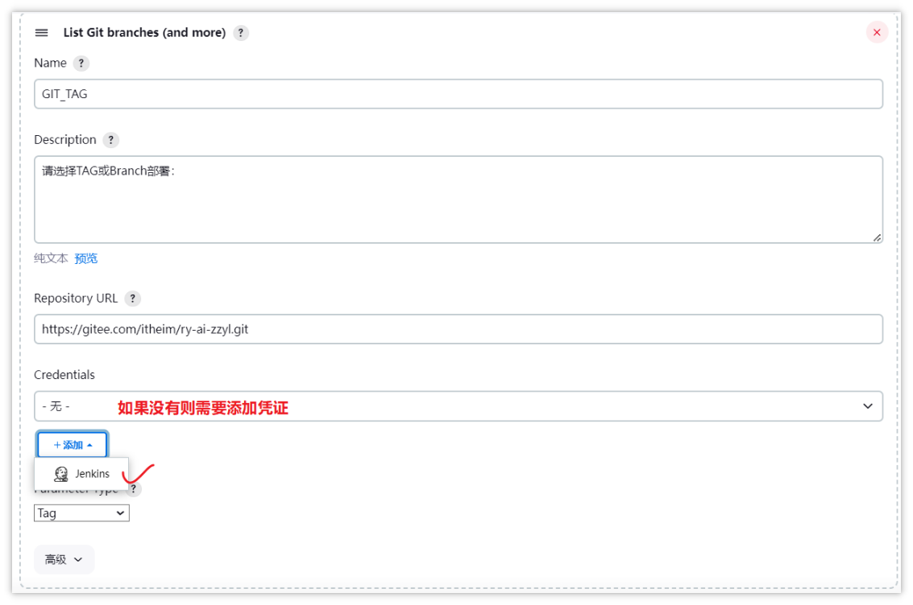

设置登录凭证：Gitee\_ID

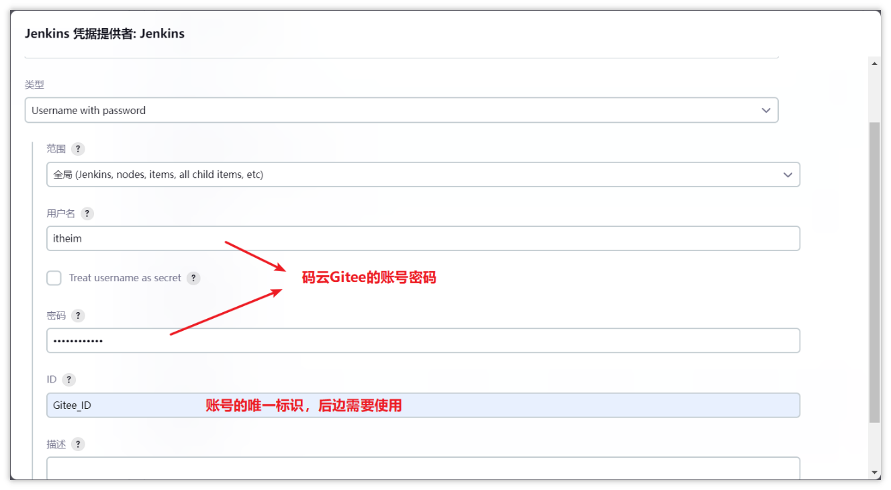

选择设置的密码和参数类型

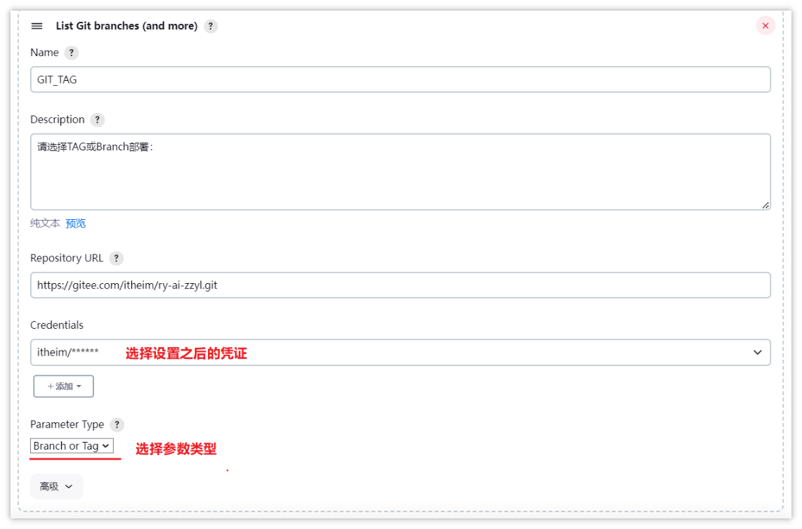

设置Docker打包镜像版本：Docker\_TAG

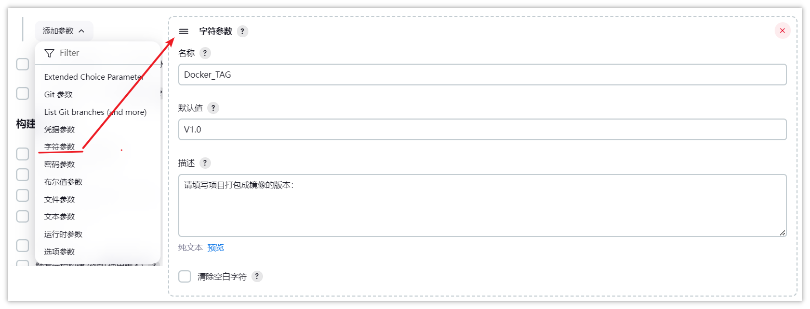

**流水线的配置，从代码仓库中读取Jenkinsfile文件**

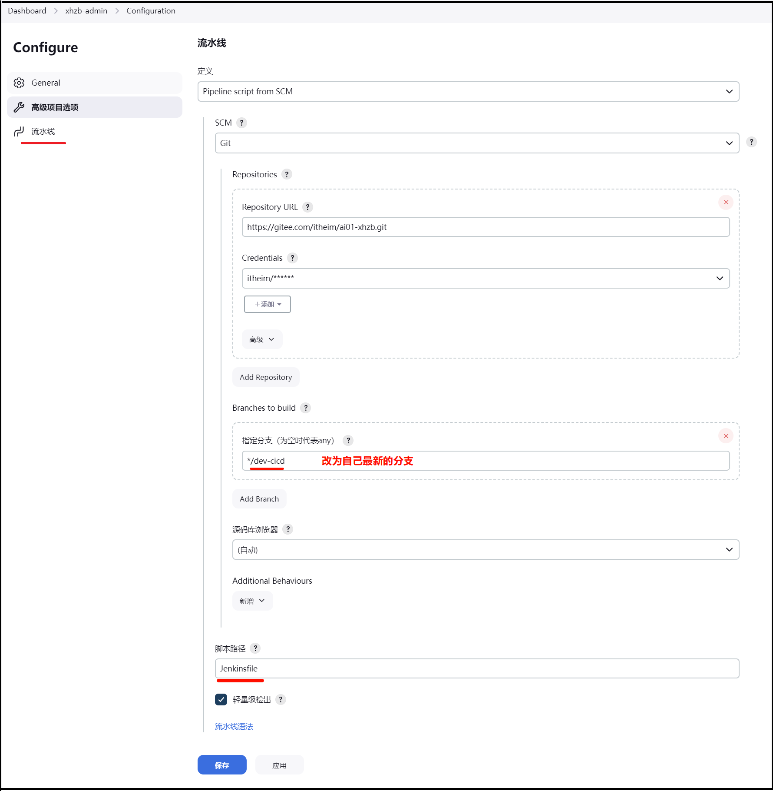

注意：git分支改为自己的最新的分支名称，不要使用master

点击应用和保存，基础设置完成，最终效果可以查看首页：

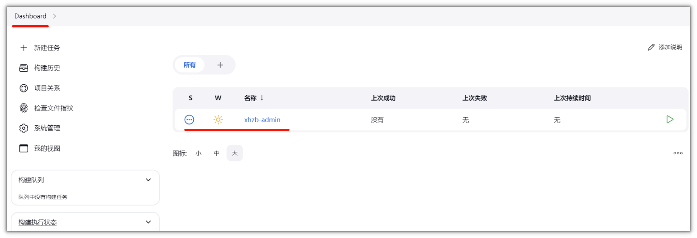

点击 xhzb\-admin 进入任务详情查看：

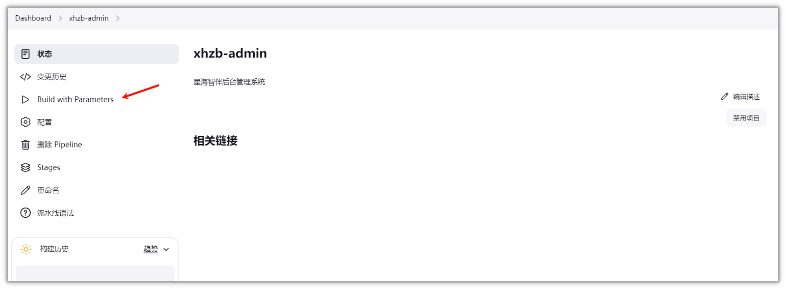

**新建 Jenkinsfile 文件并上传到代码仓库中， 在Jenkins中完成流水线配置**

将 Jenkinsfile 文件上传到Git做为共享配置使用，存储到`项目根目录`，命名必须是：`Jenkinsfile`

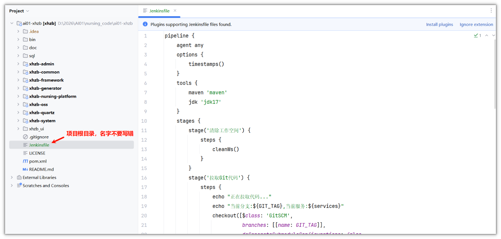

文件内容如下：

```java
pipeline {
    agent any
    options {
        timestamps()
    }
    tools {
        maven 'maven'
        jdk 'jdk17'
    }
    stages {
        stage('清除工作空间') {
            steps {
                cleanWs()
            }
        }
        stage('Build') {
            steps {
                sh 'java -version'
            }
        }
        stage('拉取Git代码') {
            steps {
                echo "正在拉取代码..."
                echo "当前分支:${GIT_TAG},当前服务:${services}"
                checkout([$*class*: 'GitSCM',
                          *branches*: [[*name*: *GIT_TAG*]],
                          *doGenerateSubmoduleConfigurations*: *false*,
                          *extensions*: [],
                          *submoduleCfg*: [],
                          *userRemoteConfigs*: [[*credentialsId*: 'Gitee_ID', *url*: *GIT_URL*]]
                ])
                sh "pwd"
            }
        }
        stage('重新Maven打包') {
            steps {
                script {
                    echo "正在执行maven打包...."
                    sh "/var/jenkins_home/maven/bin/mvn clean install -DskipTests"
                }
            }
        }
        stage('重新构建镜像') {
            steps {
                echo "当前打镜像tag:${DOCKER_TAG}"
                script {
                    for (ds in services.tokenize(",")) {
                         sh "pwd"
                         echo "进入target目录执行镜像打包......"
                         sh "cd ./${ds}/target/ && docker build -t ${ds}:${DOCKER_TAG} -f ../Dockerfile ."
                    }
                }
            }
        }
        stage('部署服务'){
            steps {
                script {
                    for (ws in services.tokenize(",")) {
                        sh "pwd"
                        sh "cd `pwd`"
                        echo "部署升级:${ws}服务"
                        sh "chmod +x ./${ws}/deploy.sh && sh ./${ws}/deploy.sh ${ws} ${DOCKER_TAG}"
                    }
                }
            }
        }

    }
    post {
        always {
            echo '任务构建完毕'
        }
    }
}
```

注意，其中的`Gitee_ID`要与jenkins中配置的gitee登录凭证ID一致

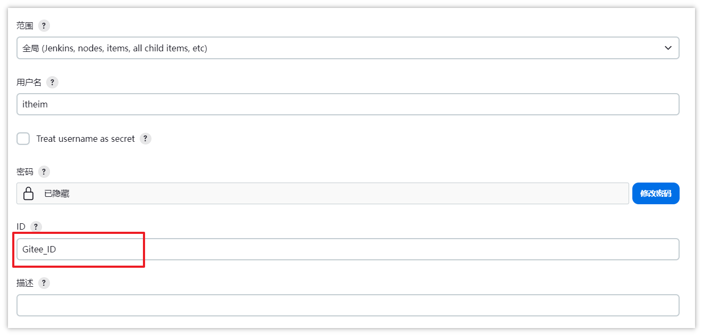

**在部署的项目模块\(xhzb\-admin\)目录下 新增两个文件**

deploy\.sh

```shell
#!/bin/bash
# 容器名称
container_name=$1
# 镜像名称
image_name=$1
# 镜像tag
image_tag=$2

# 判断容器是否存在
if docker ps -a | grep $container_name | awk '{print $1}'; then
  echo "容器 $container_name 存在"
  if docker ps | grep $container_name | awk '{print $1}';then
     echo "关闭正在运行的容器 $container_name"
     docker stop `docker ps | grep $container_name | awk '{print $1}'`
  else
    echo "容器 $container_name 都已关闭"
  fi
  # 删除容器
  echo "删除容器 $container_name"
  docker rm `docker ps -a | grep $container_name | awk '{print $1}'`
else
  echo "容器 $container_name 不存在"
fi

# 启动容器
echo "启动容器 $container_name"
if [ $container_name = "xhzb-admin" ]; then
    docker run -d --restart=always --name $container_name -v /usr/local/xhzb-admin/logs:/home/ruoyi/logs -p 9000:9000 $image_name:$image_tag
fi
```

Dockerfile

```shell
# 基础镜像
FROM eclipse-temurin:17-jdk
# 设定时区
ENV TZ=Asia/Shanghai
RUN ln -snf /usr/share/zoneinfo/$TZ /etc/localtime && echo $TZ > /etc/timezone

# 环境变量
ENV OSS_ACCESS_KEY_ID=xxxxxxxxxxxxxxxxxxxx
ENV OSS_ACCESS_KEY_SECRET=xxxxxxxxxxxxxxxxxxxxxx
ENV OPENAI_API_KEY=xxxxxxxxxxxxxxxxxxxxxx


# 拷贝jar包
COPY xhzb-admin.jar /app.jar

# 暴露端口
EXPOSE 9000

# 入口
ENTRYPOINT ["java", "-jar", "/app.jar"]
```

最终的代码结构

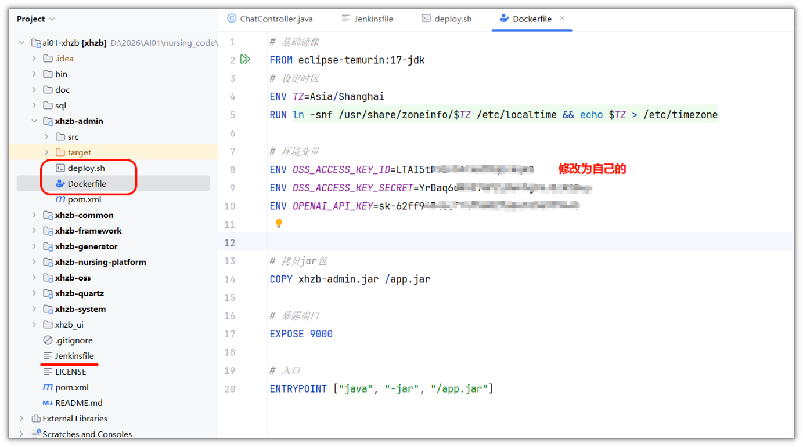

所有配置新增之后和修改之后，需要把代码提交，并且推送到远程仓库

**项目部署**

打开jenkins，找到刚才创建的项目，选择参数化构建，选择需要配置，如下图，点击Build开始构建

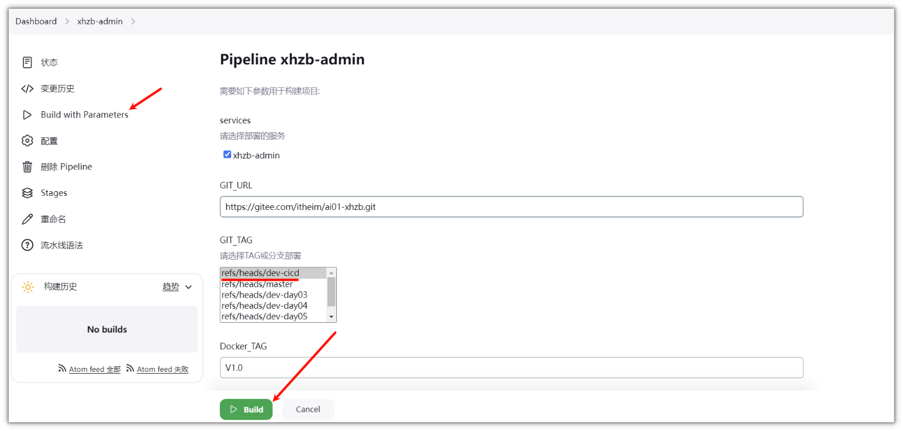

**查看日志**

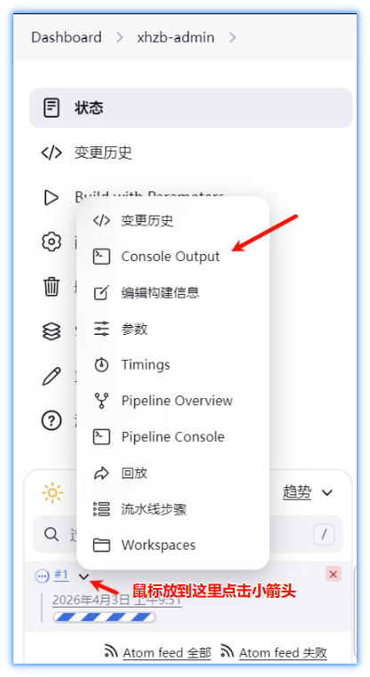

下面文档截图了部分的日志信息

```Bash
Started by user 中州养老
Obtained Jenkinsfile from git https://gitee.com/itheim/ai01-xhzb.git[Pipeline] Start of Pipeline[Pipeline] nodeRunning on Jenkins in /var/jenkins_home/workspace/xhzb-admin
[Pipeline] {[Pipeline] stage[Pipeline] { (Declarative: Checkout SCM)[Pipeline] checkoutSelected Git installation does not exist. Using Default
The recommended git tool is: NONE
using credential Gitee_ID
 > /usr/bin/git rev-parse --resolve-git-dir /var/jenkins_home/workspace/xhzb-admin/.git # timeout=10
Fetching changes from the remote Git repository
 > /usr/bin/git config remote.origin.url https://gitee.com/itheim/ai01-xhzb.git # timeout=10
Fetching upstream changes from https://gitee.com/itheim/ai01-xhzb.git
 > /usr/bin/git --version # timeout=10
 > git --version # 'git version 2.39.2'
using GIT_ASKPASS to set credentials 
 > /usr/bin/git fetch --tags --force --progress -- https://gitee.com/itheim/ai01-xhzb.git +refs/heads/*:refs/remotes/origin/* # timeout=10
 > /usr/bin/git rev-parse refs/remotes/origin/dev-cicd^{commit} # timeout=10
Checking out Revision 350454e15e0091a170cd1a95d0bdc6f4ce752487 (refs/remotes/origin/dev-cicd)
 > /usr/bin/git config core.sparsecheckout # timeout=10
 > /usr/bin/git checkout -f 350454e15e0091a170cd1a95d0bdc6f4ce752487 # timeout=10
Commit message: "cicd配置123"
 > /usr/bin/git rev-list --no-walk f8c7574ac077e20bca65adca8de8ae79d34da8e4 # timeout=10
[Pipeline] }
[Pipeline] // stage
[Pipeline] withEnv[Pipeline] {[Pipeline] timestamps[Pipeline] {[Pipeline] stage[Pipeline] { (Declarative: Tool Install)[Pipeline] tool[Pipeline] envVarsForTool[Pipeline] tool[Pipeline] envVarsForTool[Pipeline] }
[Pipeline] // stage
[Pipeline] withEnv[Pipeline] {[Pipeline] stage[Pipeline] { (清除工作空间)[Pipeline] tool[Pipeline] envVarsForTool[Pipeline] tool[Pipeline] envVarsForTool[Pipeline] withEnv[Pipeline] {[Pipeline] cleanWs14:44:11  [WS-CLEANUP] Deleting project workspace...
14:44:11  [WS-CLEANUP] Deferred wipeout is used...
14:44:11  [WS-CLEANUP] done
[Pipeline] }
[Pipeline] // withEnv
[Pipeline] }
[Pipeline] // stage
[Pipeline] stage[Pipeline] { (Build)[Pipeline] tool[Pipeline] envVarsForTool[Pipeline] tool[Pipeline] envVarsForTool[Pipeline] withEnv[Pipeline] {[Pipeline] sh14:44:12  + java -version
14:44:12  java version "17.0.10" 2024-01-16 LTS
14:44:12  Java(TM) SE Runtime Environment (build 17.0.10+11-LTS-240)
14:44:12  Java HotSpot(TM) 64-Bit Server VM (build 17.0.10+11-LTS-240, mixed mode, sharing)
[Pipeline] }
[Pipeline] // withEnv
[Pipeline] }
[Pipeline] // stage
[Pipeline] stage[Pipeline] { (拉取Git代码)[Pipeline] tool[Pipeline] envVarsForTool[Pipeline] tool[Pipeline] envVarsForTool[Pipeline] withEnv[Pipeline] {[Pipeline] echo14:44:12  正在拉取代码...
[Pipeline] echo14:44:12  当前分支:,当前服务:xhzb-admin
[Pipeline] checkout14:44:12  Selected Git installation does not exist. Using Default
14:44:12  The recommended git tool is: NONE
14:44:12  using credential Gitee_ID
14:44:12  Cloning the remote Git repository
14:44:12  Cloning repository https://gitee.com/itheim/ai01-xhzb.git14:44:12   > /usr/bin/git init /var/jenkins_home/workspace/xhzb-admin # timeout=10
14:44:12  Fetching upstream changes from https://gitee.com/itheim/ai01-xhzb.git14:44:12   > /usr/bin/git --version # timeout=10
14:44:12   > git --version # 'git version 2.39.2'
14:44:12  using GIT_ASKPASS to set credentials 
14:44:12   > /usr/bin/git fetch --tags --force --progress -- https://gitee.com/itheim/ai01-xhzb.git +refs/heads/*:refs/remotes/origin/* # timeout=10
14:44:14   > /usr/bin/git config remote.origin.url https://gitee.com/itheim/ai01-xhzb.git # timeout=10
14:44:14   > /usr/bin/git config --add remote.origin.fetch +refs/heads/*:refs/remotes/origin/* # timeout=10
14:44:14  Avoid second fetch
14:44:14  Seen branch in repository origin/dev-cicd
14:44:14  Seen branch in repository origin/dev-day03
14:44:14  Seen branch in repository origin/dev-day04
14:44:14  Seen branch in repository origin/dev-day05
14:44:14  Seen branch in repository origin/dev-day06
14:44:14  Seen branch in repository origin/master
14:44:14  Seen 6 remote branches
14:44:14   > /usr/bin/git show-ref --tags -d # timeout=10
14:44:14  Checking out Revision 350454e15e0091a170cd1a95d0bdc6f4ce752487 (origin/dev-cicd)
14:44:14   > /usr/bin/git config core.sparsecheckout # timeout=10
14:44:14   > /usr/bin/git checkout -f 350454e15e0091a170cd1a95d0bdc6f4ce752487 # timeout=10
14:44:14  Commit message: "cicd配置123"
[Pipeline] sh14:44:14  + pwd
14:44:14  /var/jenkins_home/workspace/xhzb-admin
[Pipeline] }
[Pipeline] // withEnv
[Pipeline] }
[Pipeline] // stage
[Pipeline] stage[Pipeline] { (重新Maven打包)[Pipeline] tool[Pipeline] envVarsForTool[Pipeline] tool
[Pipeline] envVarsForTool[Pipeline] withEnv[Pipeline] {[Pipeline] script[Pipeline] {[Pipeline] echo14:44:15  正在执行maven打包....
[Pipeline] sh14:44:15  + /var/jenkins_home/maven/bin/mvn clean install -DskipTests
14:44:18  [INFO] Scanning for projects...
14:44:18  [WARNING] 

# 打包过程省略...
# 打包过程省略...
# 打包过程省略...
 
14:44:51  [INFO] xhzb ............................................... SUCCESS [  0.394 s]
14:44:51  [INFO] xhzb-common ........................................ SUCCESS [ 10.693 s]
14:44:51  [INFO] xhzb-system ........................................ SUCCESS [  2.822 s]
14:44:51  [INFO] xhzb-framework ..................................... SUCCESS [  2.933 s]
14:44:51  [INFO] xhzb-quartz ........................................ SUCCESS [  1.188 s]
14:44:51  [INFO] xhzb-generator ..................................... SUCCESS [  1.369 s]
14:44:51  [INFO] xhzb-oss ........................................... SUCCESS [  1.013 s]
14:44:51  [INFO] xhzb-nursing-platform .............................. SUCCESS [  6.220 s]
14:44:51  [INFO] xhzb-admin ......................................... SUCCESS [  6.167 s]
14:44:51  [INFO] ------------------------------------------------------------------------
14:44:51  [INFO] BUILD SUCCESS
14:44:51  [INFO] ------------------------------------------------------------------------
14:44:51  [INFO] Total time:  33.518 s
14:44:51  [INFO] Finished at: 2026-04-03T06:44:51Z
14:44:51  [INFO] ------------------------------------------------------------------------
[Pipeline] }
[Pipeline] // script
[Pipeline] }
[Pipeline] // withEnv
[Pipeline] }
[Pipeline] // stage
[Pipeline] stage[Pipeline] { (重新构建镜像)[Pipeline] tool[Pipeline] envVarsForTool[Pipeline] tool[Pipeline] envVarsForTool[Pipeline] withEnv[Pipeline] {[Pipeline] echo14:44:52  当前打镜像tag:V1.0
[Pipeline] script[Pipeline] {[Pipeline] sh
14:44:52  + pwd
14:44:52  /var/jenkins_home/workspace/xhzb-admin
[Pipeline] echo14:44:52  进入target目录执行镜像打包......
[Pipeline] sh14:44:52  + cd ./xhzb-admin/target/
14:44:52  + docker build -t xhzb-admin:V1.0 -f ../Dockerfile .
14:44:54  Sending build context to Docker daemon  128.2MB

14:44:54  Step 1/9 : FROM eclipse-temurin:17-jdk
14:44:54   ---> 0570c277c08b
14:44:54  Step 2/9 : ENV TZ=Asia/Shanghai
14:44:54   ---> Using cache
14:44:54   ---> 70142f99fe55
14:44:54  Step 3/9 : RUN ln -snf /usr/share/zoneinfo/$TZ /etc/localtime && echo $TZ > /etc/timezone
14:44:54   ---> Using cache
14:44:54   ---> 875c81a2513e
14:44:54  Step 4/9 : ENV OSS_ACCESS_KEY_ID=xxxxxxxxxxxxxxxxxxxxxxxx
14:44:54   ---> Using cache
14:44:54   ---> f47eca9ecbdf
14:44:54  Step 5/9 : ENV OSS_ACCESS_KEY_SECRET=xxxxxxxxxxxxxxxxxxxxxxxx
14:44:54   ---> Using cache
14:44:54   ---> 10d154d84971
14:44:54  Step 6/9 : ENV OPENAI_API_KEY=sk-xxxxxxxxxxxxxxxxxxxxxxxx
14:44:54   ---> Using cache
14:44:54   ---> 2e9627e64fbf
14:44:54  Step 7/9 : COPY xhzb-admin.jar /app.jar
14:44:57   ---> 906e8a513478
14:44:57  Step 8/9 : EXPOSE 9000
14:44:57   ---> Running in c5b6ee52452e
14:44:57  Removing intermediate container c5b6ee52452e
14:44:57   ---> 5c080ff42cff
14:44:57  Step 9/9 : ENTRYPOINT ["java", "-jar", "/app.jar"]
14:44:57   ---> Running in f067eab827e4
14:44:57  Removing intermediate container f067eab827e4
14:44:57   ---> ee5c7de2212e
14:44:57  Successfully built ee5c7de2212e
14:44:57  Successfully tagged xhzb-admin:V1.0
[Pipeline] }
[Pipeline] // script
[Pipeline] }
[Pipeline] // withEnv
[Pipeline] }
[Pipeline] // stage
[Pipeline] stage[Pipeline] { (部署服务)[Pipeline] tool[Pipeline] envVarsForTool[Pipeline] tool[Pipeline] envVarsForTool[Pipeline] withEnv[Pipeline] {[Pipeline] script[Pipeline] {[Pipeline] sh14:44:58  + pwd
14:44:58  /var/jenkins_home/workspace/xhzb-admin
[Pipeline] sh
14:44:58  + pwd
14:44:58  + cd /var/jenkins_home/workspace/xhzb-admin
[Pipeline] echo14:44:58  部署升级:xhzb-admin服务
[Pipeline] sh14:44:58  + chmod +x ./xhzb-admin/deploy.sh
14:44:58  + sh ./xhzb-admin/deploy.sh xhzb-admin V1.0
14:44:58  ec8c9fed4603
14:44:58  容器 xhzb-admin 存在
14:44:59  ec8c9fed4603
14:44:59  关闭正在运行的容器 xhzb-admin
14:45:01  ec8c9fed4603
14:45:01  删除容器 xhzb-admin
14:45:01  ec8c9fed4603
14:45:01  启动容器 xhzb-admin
14:45:01  9640e7c59550072d1923b1b3f34850638e8f03971e6735d70aaae89f5454064e
[Pipeline] }
[Pipeline] // script
[Pipeline] }
[Pipeline] // withEnv
[Pipeline] }
[Pipeline] // stage
[Pipeline] stage[Pipeline] { (Declarative: Post Actions)[Pipeline] echo14:45:02  任务构建完毕
[Pipeline] }
[Pipeline] // stage
[Pipeline] }
[Pipeline] // withEnv
[Pipeline] }
[Pipeline] // timestamps
[Pipeline] }
[Pipeline] // withEnv
[Pipeline] }
[Pipeline] // node
[Pipeline] End of Pipeline
Finished: SUCCESS
```

### 3.5.查看docker容器

当项目部署成功之后，可以在docker中查看是否创建了对应的镜像和容器

也可以查看正在运行的容器

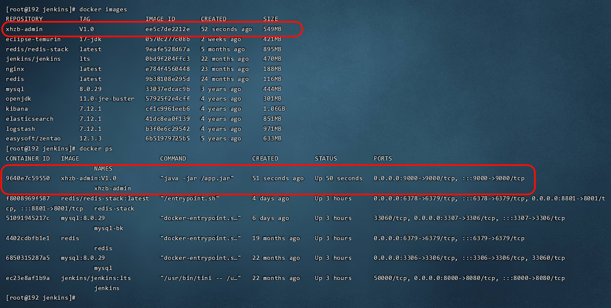

### 3.6.前后端测试

我们可以在本地的前端代码中，修改访问后端的地址，来验证服务是否可以正常访问

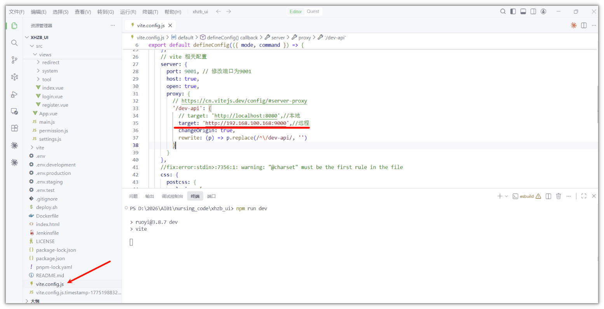

如果前端项目启动后，可以正常访问，并且可以获取数据，则表示成功

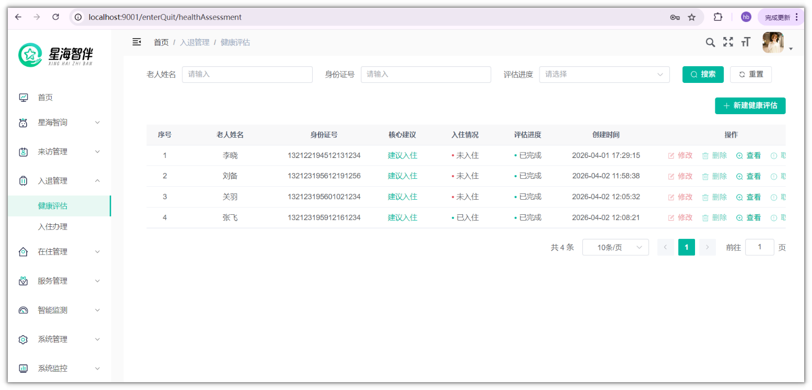

## 4.部署前端项目

前端项目我们可以采用nginx进行部署，需要使用nginx中的两个特性，分别是静态服务器和反向代理

如下图：

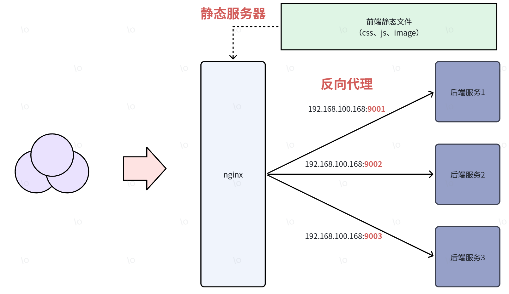

- 首先我们把目前的vue项目进行打包，打包成静态资源

- 使用docker创建nginx容器

- 部署静态资源（前端打包之后的静态资源）

- 配置反向代理服务访问

### 4.1.多环境选择打包

在前端项目中也有多环境配置，如下面的三个文件，不同的文件对应了不同的环境配置项

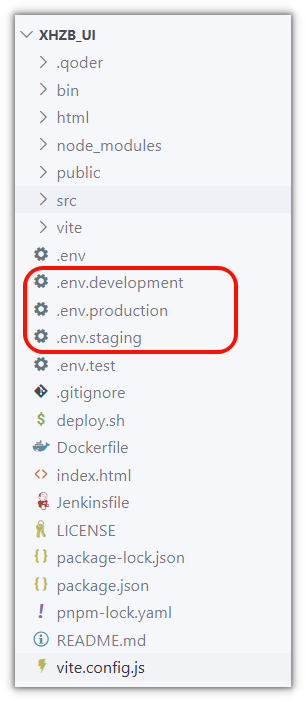

- development 开发环境

- production  正式环境

- staging  预发布环境

指定环境打包，打包命令：`npm run build:prod` （选择了正式环境）

- 打包成功之后，会在项目的根目录下生成一个文件夹  `dist`

- dist目录中存储的就是打包之后的静态文件，会压缩，存储较小，部署使用这里面内容

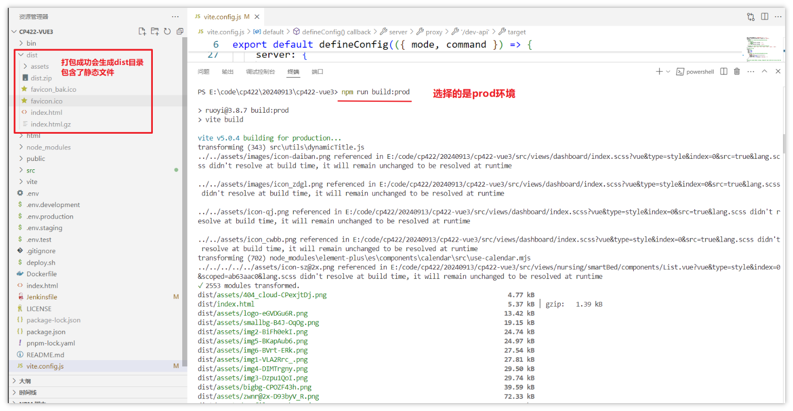

### 4.2.创建nginx容器

1.准备目录，创建容器需要做映射

创建两个目录：

```Bash
mkdir -p /usr/local/xhzb-vue/html
mkdir -p /usr/local/xhzb-vue/conf
```

2.启动容器

创建容器的命令，在目前提供的服务器中已经提供了nginx的镜像，可以直接使用

```Bash
docker run -d \
--name xhzb-vue \
-v /usr/local/xhzb-vue/html:/usr/share/nginx/html \
-v /usr/local/xhzb-vue/conf:/etc/nginx/conf.d \
-p 80:80 \
nginx:latest
```

容器创建成功

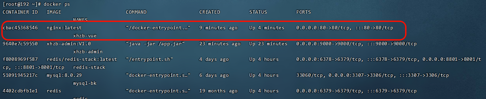

### 4.3.部署前端和配置反向代理

1.把前端项目打包之后的文件上传到服务器`/usr/local/xhzb-vue/html`目录中

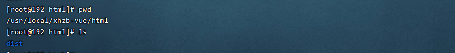

2.配置静态部署和反向代理

在`/usr/local/xhzb-vue/conf `目录下创建一个文件：`xhzb-vue.conf`  

可以使用当天资料中的文件

详细内容如下：

```Bash
# 配置代理服务  serve的地址为：星海智伴后台管理服务ip+端口
upstream  xhzb-admin{
    server 192.168.100.168:9000;
}

server {
    listen 80;
    # 访问静态服务
    location / {
        # 前端静态文件的目录
        root /usr/share/nginx/html/dist/;
        index index.html;
    }
    
    # 访问后端服务接口  注意目前是prod-api(正式环境)
    location /prod-api/ {
            proxy_pass http://xhzb-admin/; # 访问代理服务

            proxy_buffering off;          # 关闭Nginx缓冲（最重要）
            proxy_cache off;              # 关闭缓存
            chunked_transfer_encoding on; # 开启分块传输
            proxy_set_header Connection "";
            proxy_http_version 1.1;
            
            proxy_set_header HOST $host;  # 不改变源请求头的值
            proxy_pass_request_body on;  #开启获取请求体
            proxy_pass_request_headers on;  #开启获取请求头
            proxy_set_header X-Real-IP $remote_addr;   # 记录真实发出请求的客户端IP
            proxy_set_header X-Forwarded-For $proxy_add_x_forwarded_for;  #记录代理信息
            proxy_connect_timeout 200s;
            proxy_read_timeout 200s;
            proxy_send_timeout 200s;
    }
}
```

配置完成后，重启nginx容器 ,

```shell
docker restart xhzb-vue
```

效果：

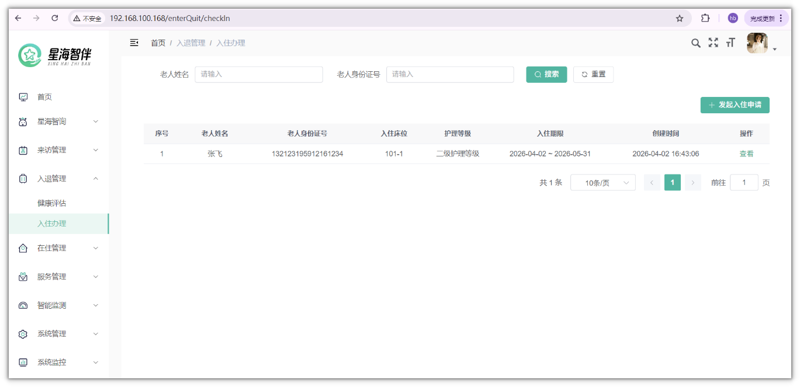

# 四、日志管理

查看日志信息对于运维和开发人员来说是非常必要的，常见的查看日志情况如下：

- 当应用程序或服务出现故障时，查看日志可帮助快速定位问题，了解故障前后的系统状态。

- 通过分析日志，可以监控应用程序性能，识别性能瓶颈或资源消耗异常。

- 在开发和测试过程中，查看日志有助于开发人员调试代码、定位并修复bug，同时也是验证应用程序功能是否正常的重要依据。

## 1.日志采集的方式

在项目的logback\.xml文件定义如下：

```XML
<?xml version="1.0" encoding="UTF-8"?>  
<configuration>  
    <!-- 定义日志文件的存放路径 -->  
    <property name="log.path" value="/home/ruoyi/logs" />  
    <!-- 定义日志输出的格式 -->  
    <property name="log.pattern" value="%d{HH:mm:ss.SSS} [%thread] %-5level %logger{20} - [%method,%line] - %msg%n" />  
  
    <!-- 控制台输出日志的配置 -->  
    <appender name="console" class="ch.qos.logback.core.ConsoleAppender">  
        <encoder>  
            <pattern>${log.pattern}</pattern>  
        </encoder>  
    </appender>  
  
    <!-- 系统信息日志文件的配置 -->  
    <appender name="file_info" class="ch.qos.logback.core.rolling.RollingFileAppender">  
        <file>${log.path}/sys-info.log</file>  
        <!-- 基于时间的滚动策略 -->  
        <rollingPolicy class="ch.qos.logback.core.rolling.TimeBasedRollingPolicy">  
            <!-- 日志文件的命名模式 -->  
            <fileNamePattern>${log.path}/sys-info.%d{yyyy-MM-dd}.log</fileNamePattern>  
            <!-- 保留日志的最大历史天数 -->  
            <maxHistory>60</maxHistory>  
        </rollingPolicy>  
        <encoder>  
            <pattern>${log.pattern}</pattern>  
        </encoder>  
        <!-- 过滤日志级别，只记录DEBUG级别的日志 -->  
        <filter class="ch.qos.logback.classic.filter.LevelFilter">  
            <level>DEBUG</level>  
            <onMatch>ACCEPT</onMatch>  
            <onMismatch>DENY</onMismatch>  
        </filter>  
    </appender>  
  
    <!-- 系统错误日志文件的配置 -->  
    <appender name="file_error" class="ch.qos.logback.core.rolling.RollingFileAppender">  
        <file>${log.path}/sys-error.log</file>  
        <rollingPolicy class="ch.qos.logback.core.rolling.TimeBasedRollingPolicy">  
            <fileNamePattern>${log.path}/sys-error.%d{yyyy-MM-dd}.log</fileNamePattern>  
            <maxHistory>60</maxHistory>  
        </rollingPolicy>  
        <encoder>  
            <pattern>${log.pattern}</pattern>  
        </encoder>  
        <!-- 过滤日志级别，只记录ERROR级别的日志 -->  
        <filter class="ch.qos.logback.classic.filter.LevelFilter">  
            <level>ERROR</level>  
            <onMatch>ACCEPT</onMatch>  
            <onMismatch>DENY</onMismatch>  
        </filter>  
    </appender>  
  
    <!-- 用户访问日志文件的配置 -->  
    <appender name="sys-user" class="ch.qos.logback.core.rolling.RollingFileAppender">  
        <file>${log.path}/sys-user.log</file>  
        <rollingPolicy class="ch.qos.logback.core.rolling.TimeBasedRollingPolicy">  
            <fileNamePattern>${log.path}/sys-user.%d{yyyy-MM-dd}.log</fileNamePattern>  
            <maxHistory>60</maxHistory>  
        </rollingPolicy>  
        <encoder>  
            <pattern>${log.pattern}</pattern>  
        </encoder>  
    </appender>  
  
    <!-- 设置系统模块（com.ruoyi）的日志级别为INFO -->  
    <logger name="com.ruoyi" level="info" />  
    <!-- 设置Spring框架的日志级别为WARN -->  
    <logger name="org.springframework" level="warn" />  
  
    <!-- 根日志处理器的配置，默认级别为INFO，只输出到控制台 -->  
    <root level="info">  
        <appender-ref ref="console" />  
    </root>  
  
    <!-- 另一个根日志处理器的配置，用于同时输出系统信息和错误日志 -->  
    <!-- 注意：通常一个<configuration>中只应有一个<root>元素，这里的配置可能是为了展示目的而重复，实际使用时应合并 -->  
    <root level="info">  
        <appender-ref ref="file_info" />  
        <appender-ref ref="file_error" />  
    </root>  
  
    <!-- 设置用户操作日志的级别为INFO，并指定输出到用户访问日志文件 -->  
    <logger name="sys-user" level="info">  
        <appender-ref ref="sys-user"/>  
    </logger>  
</configuration>
```

具体的生成的日志文件列表如下：

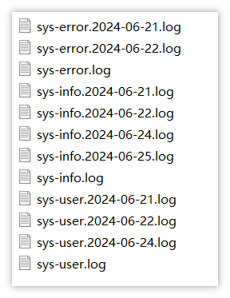

目前有三类文件，分别是sys\-error\.log、sys\-info\.log、sys\-user\.log文件

文件中不带日期记录的当天的日志

sys\-info\.log记录的是系统日志，包含了运行日志和错误日志（较全）

sys\-error\.log记录的是错误日志，排查错误一般看这个文件

sys\-user\.log记录的是用户登录相关的日志数据

## 2.Linux命令查看日志

作为程序员要具备查看日志的能力，当发生错误之后，我们可以通过查看日志中的错误来解决问题。

目前我们的线上服务都是使用docker启动容器来部署，我们主要讲解docker结合linux的命令来方便查找错误

### 2.1.docker logs 命令

基本用法：`docker logs [OPTIONS] CONTAINER`，其中`CONTAINER`是容器的名称或ID，`OPTIONS`是可选参数。

实时查看日志：使用`-f`或`--follow`参数，可以实时跟踪容器的日志输出。

例如，`docker logs -f mycontainer`。

查看日志尾部内容：使用`--tail`参数，可以仅显示日志的最后几行。

例如，`docker logs --tail=100 mycontainer`。

### 2.2.进入容器内部查看

如果容器的日志被写入到文件系统中，可以通过`docker exec`命令进入容器内部查看日志文件。

进入容器：`docker exec -it mycontainer /bin/bash`（或`/bin/sh`，取决于容器内的shell）。

进入日志所在位置: /home/ruoyi/logs

查看日志的所有内容：`(cat | more | less) sys-info.2024-08-01.log`

实时监控日志的变化

- 实时监控日志变化：`tail -f sys-info.log`

- 实时监控日志尾部100行日志：`tail -n 100 f sys-info.log`  （常用）

- 实时监控日志头部100行日志：`head -n 100 f sys-info.log`

按照关键字找日志的信息（常用）

- 查询日志文件中包含error的日志： `cat -n sys-info.log | grep -i 'error'`

- 日志太多，分页查询日志：`cat -n sys-info.log | grep 'error' | more`

## 3.ELK日志管理

在不同的项目组，可能查看日志的方式有所不同，我们刚才介绍的是使用linux的命令来查看和分析日志文件，不过，稍微上规模的公司，可能会搭建ELK日志系统来对日志进行收集、分析和管理。

### 3.1.什么是ELK

ELK是一个开源的日志管理平台，由三个核心组件组成：Elasticsearch、Logstash 和 Kibana。这三个组件共同协作，提供了一个从日志收集、处理、存储到分析、可视化的完整解决方案。

1.Elasticsearch：这是一个基于Lucene的搜索引擎，用于存储和搜索日志数据。它提供了强大的全文搜索功能，支持复杂的查询和聚合操作，并且能够处理大规模的日志数据。

2.Logstash：这是一个日志收集和处理工具，用于从各种数据源（如文件、数据库、网络等）中收集日志，并将其转换为Elasticsearch可以理解的格式。Logstash还提供了丰富的过滤功能，可以对日志数据进行清洗、转换和增强。

3.Kibana：这是一个Web界面，用于可视化Elasticsearch中的日志数据。它提供了直观的图形和工具，使用户能够轻松地搜索、分析和可视化日志数据，从而更好地理解系统的运行状态和性能。

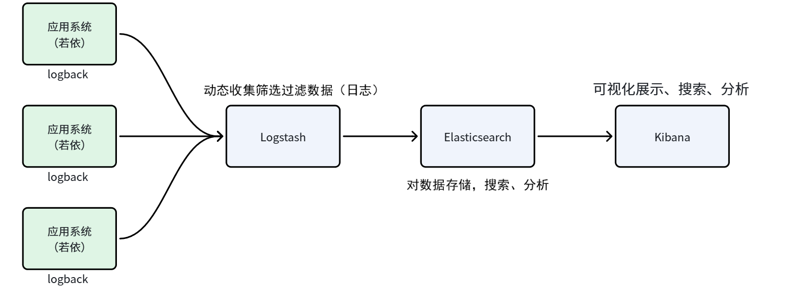

### 3.2.环境准备

1.服务启动

在提供的虚拟机中，已经安装了ELK这三个组件，大家可以启动linux中使用docker命令来启动起来

```Bash
docker start es
docker start kibana
docker start logstash
```

> 这三个服务占用内存较大，平常开发阶段可关闭
> 

2.logback\.xml 配置logstash

在zzyl\-admin模块中引入logstash相关的依赖

```XML
<dependency>
    <groupId>net.logstash.logback</groupId>
    <artifactId>logstash-logback-encoder</artifactId>
    <version>6.6</version>
</dependency>
```

在xhzb\-admin模块下新增一个文件：logback\-logstash\.xml，内容如下：

```XML
<?xml version="1.0" encoding="UTF-8"?>
<configuration>
    <!-- 日志存放路径 -->
    <property name="log.path" value="/home/ruoyi/logs" />
    <!-- 日志输出格式 -->
    <property name="log.pattern" value="%d{HH:mm:ss.SSS} [%thread] %-5level %logger{20} - [%method,%line] - %msg%n" />

    <!-- 控制台输出 -->
    <appender name="console" class="ch.qos.logback.core.ConsoleAppender">
       <encoder>
          <pattern>${log.pattern}</pattern>
       </encoder>
    </appender>

    <appender name="logstash" class="net.logstash.logback.appender.LogstashTcpSocketAppender">
        <!--logstash的服务地址和端口，可以实际情况设置-->
        <destination>192.168.100.168:5044</destination>
        <!-- 日志输出编码 -->
        <encoder charset="UTF-8" class="net.logstash.logback.encoder.LogstashEncoder">
            <providers>
                <timestamp>
                    <timeZone>UTC</timeZone>
                </timestamp>
                <pattern>
                    <pattern>
                        {
                        <!--应用名称 -->
                        "app": "ruoyi-admin",
                        <!--打印时间 -->
                        "timestamp": "%d{yyyy-MM-dd HH:mm:ss.SSS}",
                        <!--线程名称 -->
                        "thread": "%thread",
                        <!--日志级别 -->
                        "level": "%level",
                        <!--日志名称 -->
                        "logger_name": "%logger",
                        <!--日志信息 -->
                        "message": "%msg",
                        <!--日志堆栈 -->
                        "stack_trace": "%exception"
                        }
                    </pattern>
                </pattern>
            </providers>
        </encoder>
    </appender>

    <!-- 系统日志输出 -->
    <appender name="file_info" class="ch.qos.logback.core.rolling.RollingFileAppender">
        <file>${log.path}/sys-info.log</file>
        <!-- 循环政策：基于时间创建日志文件 -->
       <rollingPolicy class="ch.qos.logback.core.rolling.TimeBasedRollingPolicy">
            <!-- 日志文件名格式 -->
          <fileNamePattern>${log.path}/sys-info.%d{yyyy-MM-dd}.log</fileNamePattern>
          <!-- 日志最大的历史 60天 -->
          <maxHistory>60</maxHistory>
       </rollingPolicy>
       <encoder>
          <pattern>${log.pattern}</pattern>
       </encoder>
       <filter class="ch.qos.logback.classic.filter.LevelFilter">
            <!-- 过滤的级别 -->
            <level>DEBUG</level>
            <!-- 匹配时的操作：接收（记录） -->
            <onMatch>ACCEPT</onMatch>
            <!-- 不匹配时的操作：拒绝（不记录） -->
            <onMismatch>DENY</onMismatch>
        </filter>
    </appender>
    
    <appender name="file_error" class="ch.qos.logback.core.rolling.RollingFileAppender">
        <file>${log.path}/sys-error.log</file>
        <!-- 循环政策：基于时间创建日志文件 -->
        <rollingPolicy class="ch.qos.logback.core.rolling.TimeBasedRollingPolicy">
            <!-- 日志文件名格式 -->
            <fileNamePattern>${log.path}/sys-error.%d{yyyy-MM-dd}.log</fileNamePattern>
          <!-- 日志最大的历史 60天 -->
          <maxHistory>60</maxHistory>
        </rollingPolicy>
        <encoder>
            <pattern>${log.pattern}</pattern>
        </encoder>
        <filter class="ch.qos.logback.classic.filter.LevelFilter">
            <!-- 过滤的级别 -->
            <level>ERROR</level>
          <!-- 匹配时的操作：接收（记录） -->
            <onMatch>ACCEPT</onMatch>
          <!-- 不匹配时的操作：拒绝（不记录） -->
            <onMismatch>DENY</onMismatch>
        </filter>
    </appender>
    
    <!-- 用户访问日志输出  -->
    <appender name="sys-user" class="ch.qos.logback.core.rolling.RollingFileAppender">
       <file>${log.path}/sys-user.log</file>
        <rollingPolicy class="ch.qos.logback.core.rolling.TimeBasedRollingPolicy">
            <!-- 按天回滚 daily -->
            <fileNamePattern>${log.path}/sys-user.%d{yyyy-MM-dd}.log</fileNamePattern>
            <!-- 日志最大的历史 60天 -->
            <maxHistory>60</maxHistory>
        </rollingPolicy>
        <encoder>
            <pattern>${log.pattern}</pattern>
        </encoder>
    </appender>
    
    <!-- 系统模块日志级别控制  -->
    <logger name="com.ruoyi" level="info" />
    <!-- Spring日志级别控制  -->
    <logger name="org.springframework" level="warn" />

    <root level="info">
       <appender-ref ref="console" />
    </root>
    
    <!--系统操作日志-->
    <root level="info">
        <appender-ref ref="logstash" />
        <appender-ref ref="file_info" />
        <appender-ref ref="file_error" />
    </root>
    
    <!--系统用户操作日志-->
    <logger name="sys-user" level="info">
        <appender-ref ref="sys-user"/>
    </logger>
</configuration> 
```

我们只在正式环境集成logstash，方便监控日志，所以需修改`application-prod.yml`文件，指定新创建的日志文件

内容如下：

```YAML
logging:
  level:
    com.xhzb: debug
    org.springframework: warn
  config: classpath:logback-logstash.xml
```

### 3.3.使用ELK检索日志

1.查看索引文件

对接项目之后，可以启动项目，产生一些日志数据

然后打开kibana，访问地址：http://192.168.100.168:5601

找到索引管理，导航：Stack Management \-\-\> 索引管理

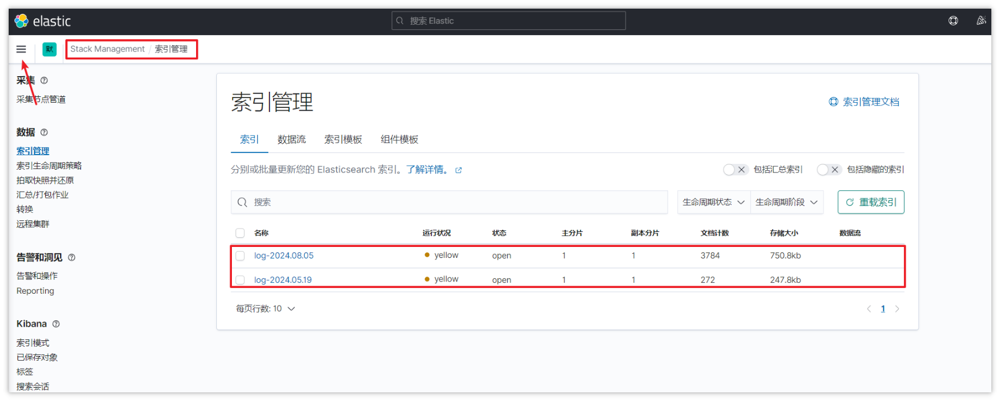

可以看到，日志文件都是按照日期进行区分的，每天一个日志索引文件

2.添加索引模式

如果想用kibana方便的查看日志的数据，可以添加索引模式，如下图

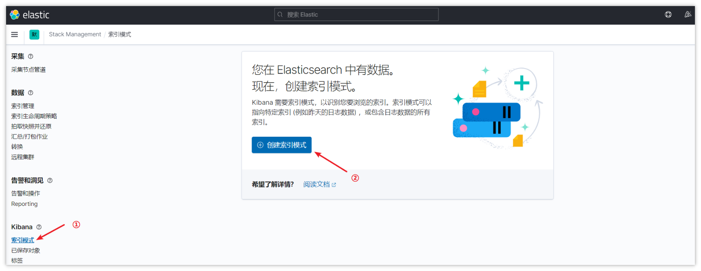

上图中，点击创建索引模式，然后可以添加索引模式，如下图

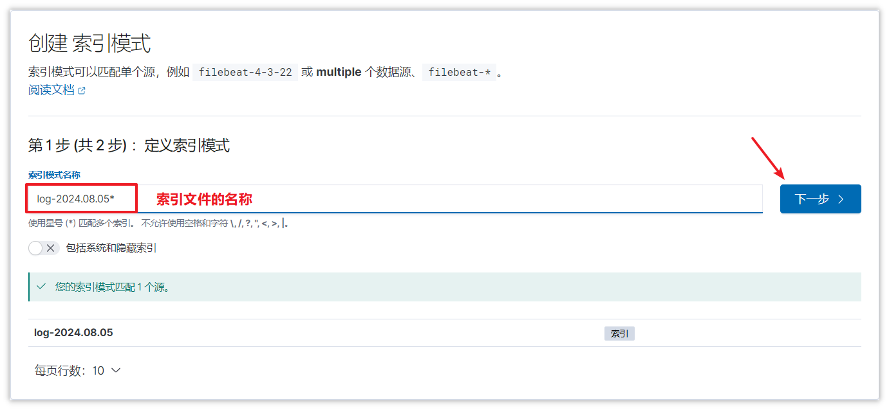

然后，选择时间戳作为时间段即可，就可以完成了，如下图

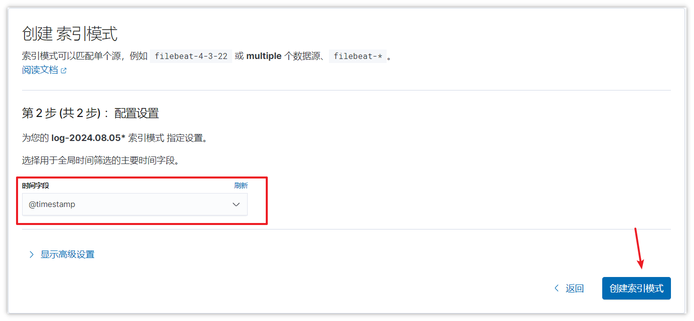

完成后的效果：

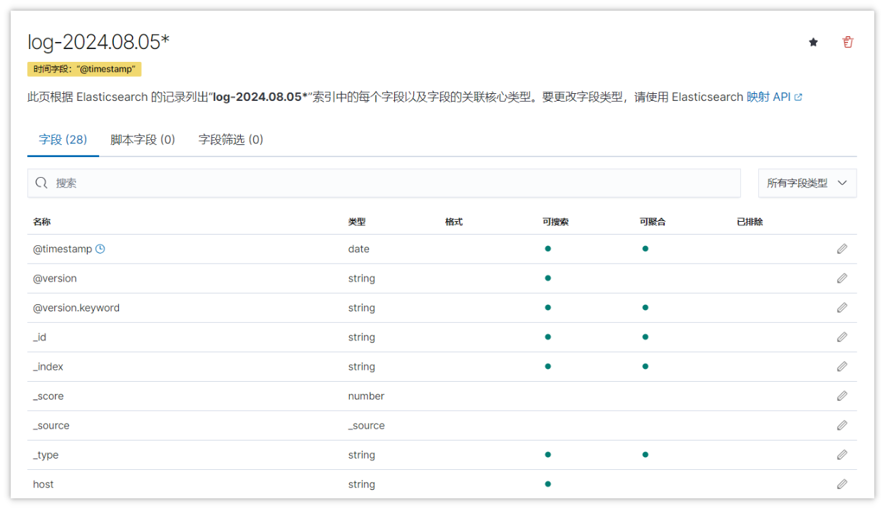

3.检索日志

打开Discover

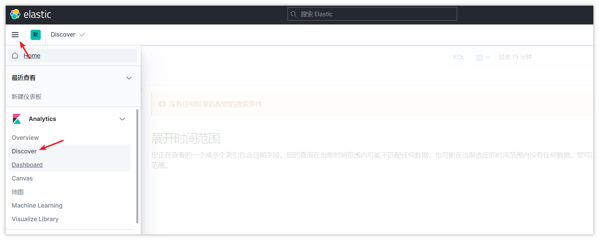

检索日志，选择不同的索引，可以按照不同的字段检索，或者在输入框直接输入内容，也是可以的

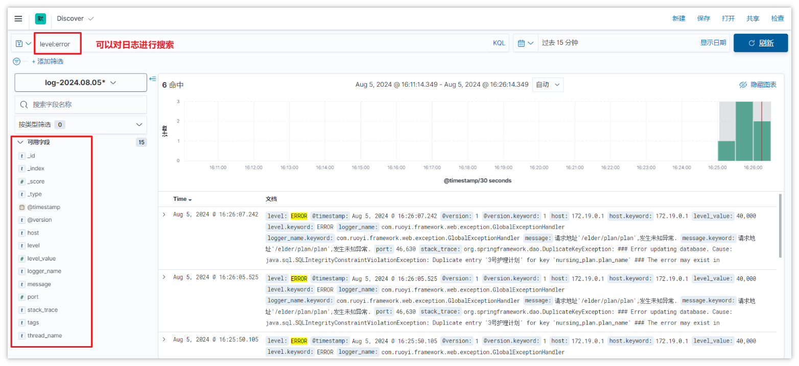

其他检索技巧

1.模糊搜索

使用通配符`*`可以匹配任意数量的字符，`?`可以匹配单个字符。例如，`nursing*`会匹配任何以“nursing”开头的单词。

2.时间范围查询

一般检查时间检索的字段为：`@timestamp`，可以提供以下几种时间范围查询方式

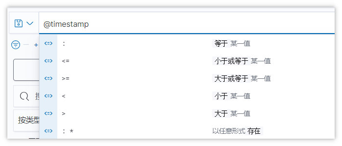

按照年查询

```Bash
@timestamp < "2026"
```

按照年月查询

```Bash
@timestamp < "2026-04"
```

按照年月日查询

```Bash
@timestamp:"2024-09-05"
```

按照年月日时分秒查询

```Bash
@timestamp < "2024-09-02T21:55:59"
```

3.字段搜索

通过指定字段名进行搜索，可以更精确地定位到包含特定信息的日志条目。

- `message:"exception"`会匹配消息字段中包含“exception”的日志条目。

- `level:error` 会匹配消息字段包含“error”的日志条目
