# 一、Jenkins简介

Jenkins，原名Hudson，2011年改为现在的名字，它 是一个开源的实现持续集成的软件工具。官方网站：https://www.jenkins.io/zh/

Jenkins 能实施监控集成中存在的错误，提供详细的日志文件和提醒功能，还能用图表的形式形象地展示项目构建的趋势和稳定性。

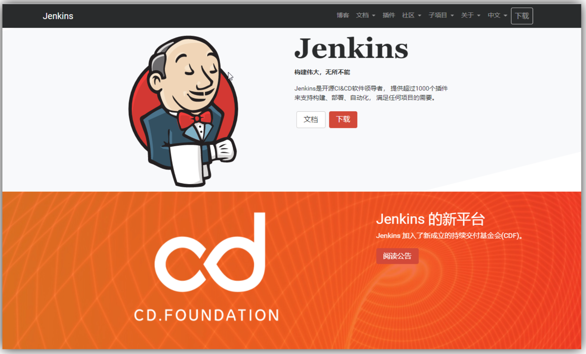

特点：

- 易配置：提供友好的GUI配置界面；

- 变更支持：Jenkins能从代码仓库（Subversion/CVS）中获取并产生代码更新列表并输出到编译输出信息中；支持永久链接：用户是通过web来访问Jenkins的，而这些web页面的链接地址都是永久链接地址，因此，你可以在各种文档中直接使用该链接；

- 集成E\-Mail/RSS/IM：当完成一次集成时，可通过这些工具实时告诉你集成结果（构建一次集成需要花费一定时间，有了这个功能，你就可以在等待结果过程中，干别的事情）；

- JUnit/TestNG测试报告：也就是用以图表等形式提供详细的测试报表功能；

- 支持分布式构建：Jenkins可以把集成构建等工作分发到多台计算机中完成；文件指纹信息：Jenkins会保存哪次集成构建产生了哪些jars文件，哪一次集成构建使用了哪个版本的jars文件等构建记录；

- 支持第三方插件：使得 Jenkins 变得越来越强大

# 二、Jenkins安装

## 1.基于docker\-compose 构建

```YAML
services:
  jenkins:
    image: jenkins/jenkins:lts
    container_name: jenkins
    ports:
      - "8000:8080"
    environment:
      - JAVA_OPTS=-Duser.timezone=GMT+08 -Xms2g -Xmx2g
    volumes:
      - /usr/local/jenkins:/var/jenkins_home
      - /var/run/docker.sock:/var/run/docker.sock
      - /usr/bin/docker:/usr/bin/docker
    user: root
```

云服务器需要放行端口：8000

使用 `docker-compose up -d ` 运行容器

浏览器访问：http://yourIp:8000，如下：

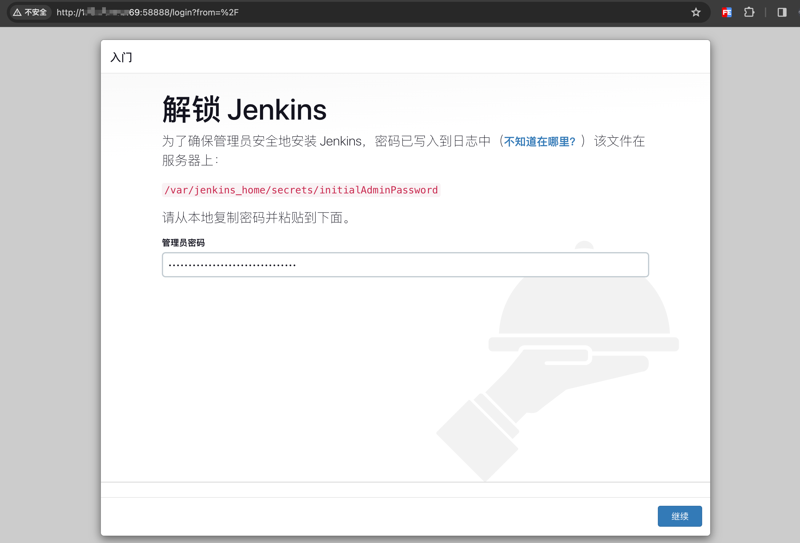

注意默认创建的 Jenkins 密码系统会生成随机密码：所在目录 `/var/jenkins_home/secrets/initialAdminPassword`

可以使用 ` cat /var/jenkins_home/secrets/initialAdminPassword 查看` 

或者 直接使用 docker 查看日志：

```Bash
[root@iZbp1e6qrh9y5n86a734doZ docker]# docker logs -f jenkins
Running from: /usr/share/jenkins/jenkins.war
webroot: /var/jenkins_home/war
2024-03-10 02:27:40.232+0000 [id=1]     INFO    winstone.Logger#logInternal: Beginning extraction from war file
2024-03-10 02:27:41.461+0000 [id=1]     WARNING o.e.j.s.handler.ContextHandler#setContextPath: Empty contextPath
2024-03-10 02:27:41.607+0000 [id=1]     INFO    org.eclipse.jetty.server.Server#doStart: jetty-10.0.13; built: 2022-12-07T20:13:20.134Z; git: 1c2636ea05c0ca8de1ffd6ca7f3a98ac084c766d; jvm 11.0.19+7
2024-03-10 02:27:42.067+0000 [id=1]     INFO    o.e.j.w.StandardDescriptorProcessor#visitServlet: NO JSP Support for /, did not find org.eclipse.jetty.jsp.JettyJspServlet
2024-03-10 02:27:42.168+0000 [id=1]     INFO    o.e.j.s.s.DefaultSessionIdManager#doStart: Session workerName=node0
2024-03-10 02:27:42.730+0000 [id=1]     INFO    hudson.WebAppMain#contextInitialized: Jenkins home directory: /var/jenkins_home found at: EnvVars.masterEnvVars.get("JENKINS_HOME")
2024-03-10 02:27:42.926+0000 [id=1]     INFO    o.e.j.s.handler.ContextHandler#doStart: Started w.@1835d3ed{Jenkins v2.387.3,/,file:///var/jenkins_home/war/,AVAILABLE}{/var/jenkins_home/war}
2024-03-10 02:27:42.954+0000 [id=1]     INFO    o.e.j.server.AbstractConnector#doStart: Started ServerConnector@3f390d63{HTTP/1.1, (http/1.1)}{0.0.0.0:8080}
2024-03-10 02:27:42.983+0000 [id=1]     INFO    org.eclipse.jetty.server.Server#doStart: Started Server@66b7550d{STARTING}[10.0.13,sto=0] @3348ms
2024-03-10 02:27:42.991+0000 [id=23]    INFO    winstone.Logger#logInternal: Winstone Servlet Engine running: controlPort=disabled
2024-03-10 02:27:43.281+0000 [id=30]    INFO    jenkins.InitReactorRunner$1#onAttained: Started initialization
2024-03-10 02:27:43.301+0000 [id=31]    INFO    jenkins.InitReactorRunner$1#onAttained: Listed all plugins
2024-03-10 02:27:44.364+0000 [id=29]    INFO    jenkins.InitReactorRunner$1#onAttained: Prepared all plugins
2024-03-10 02:27:44.559+0000 [id=31]    INFO    jenkins.InitReactorRunner$1#onAttained: Started all plugins
2024-03-10 02:27:44.669+0000 [id=29]    INFO    jenkins.InitReactorRunner$1#onAttained: Augmented all extensions
2024-03-10 02:27:44.968+0000 [id=30]    INFO    jenkins.InitReactorRunner$1#onAttained: System config loaded
2024-03-10 02:27:44.968+0000 [id=28]    INFO    jenkins.InitReactorRunner$1#onAttained: System config adapted
2024-03-10 02:27:44.969+0000 [id=28]    INFO    jenkins.InitReactorRunner$1#onAttained: Loaded all jobs
2024-03-10 02:27:44.970+0000 [id=31]    INFO    jenkins.InitReactorRunner$1#onAttained: Configuration for all jobs updated
2024-03-10 02:27:45.059+0000 [id=44]    INFO    hudson.util.Retrier#start: Attempt #1 to do the action check updates server
WARNING: An illegal reflective access operation has occurred
WARNING: Illegal reflective access by org.codehaus.groovy.vmplugin.v7.Java7$1 (file:/var/jenkins_home/war/WEB-INF/lib/groovy-all-2.4.21.jar) to constructor java.lang.invoke.MethodHandles$Lookup(java.lang.Class,int)
WARNING: Please consider reporting this to the maintainers of org.codehaus.groovy.vmplugin.v7.Java7$1
WARNING: Use --illegal-access=warn to enable warnings of further illegal reflective access operations
WARNING: All illegal access operations will be denied in a future release
2024-03-10 02:27:45.671+0000 [id=28]    INFO    jenkins.install.SetupWizard#init: 

*************************************************************
*************************************************************
*************************************************************

Jenkins initial setup is required. An admin user has been created and a password generated.
Please use the following password to proceed to installation:

c9c29f1dfa2a47849b7272dd82d855a3

This may also be found at: /var/jenkins_home/secrets/initialAdminPassword

*************************************************************
*************************************************************
*************************************************************

2024-03-10 02:28:10.198+0000 [id=28]    INFO    jenkins.InitReactorRunner$1#onAttained: Completed initialization
2024-03-10 02:28:10.228+0000 [id=22]    INFO    hudson.lifecycle.Lifecycle#onReady: Jenkins is fully up and running
2024-03-10 02:28:11.406+0000 [id=44]    INFO    h.m.DownloadService$Downloadable#load: Obtained the updated data file for hudson.tasks.Maven.MavenInstaller
2024-03-10 02:28:11.407+0000 [id=44]    INFO    hudson.util.Retrier#start: Performed the action check updates server successfully at the attempt #1
```

输入密码后等待初始化。

## 2.基础插件安装

1.选择 推荐安装 插件

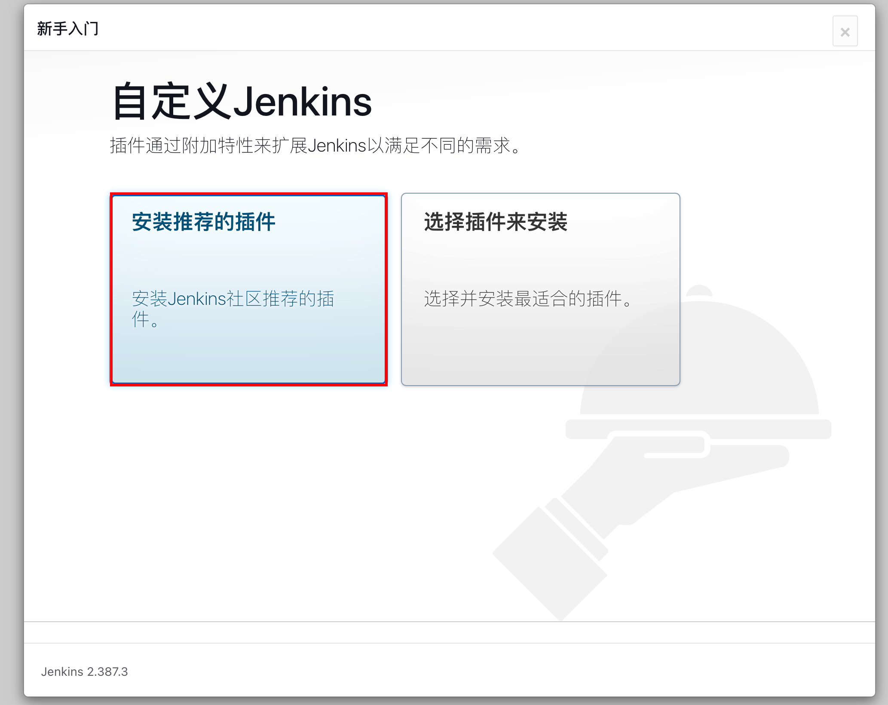

开始安装：

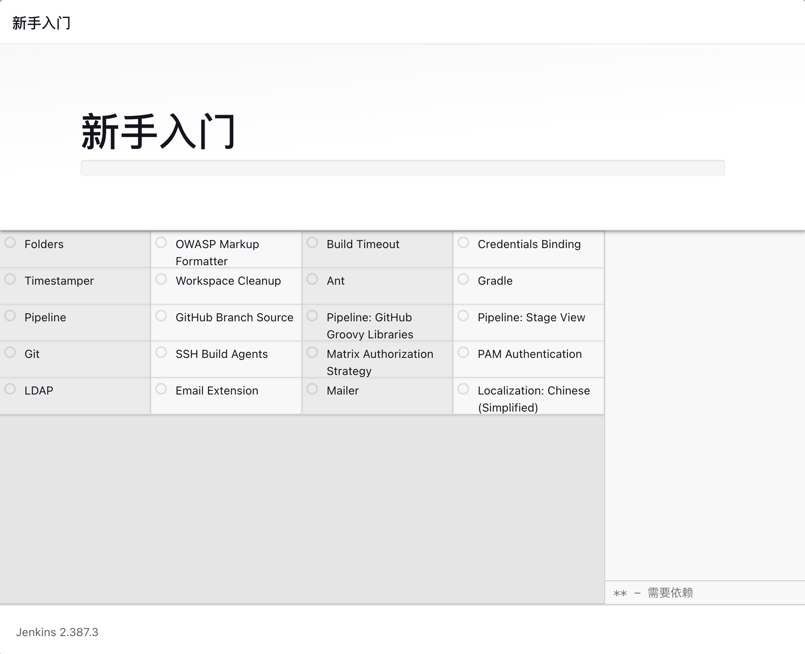

> 可能因为网络会安装失败，我们主要使用git、pipeline 和 chinese中文插件，可以直接继续忽略错误插件，或者点击重试尝试重新安装:
> 
> 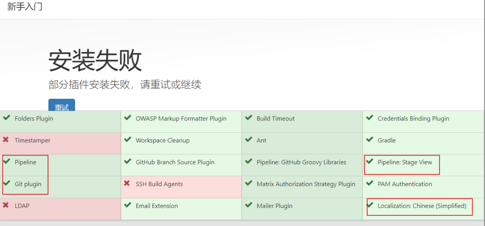
> 

2.设置管理员密码

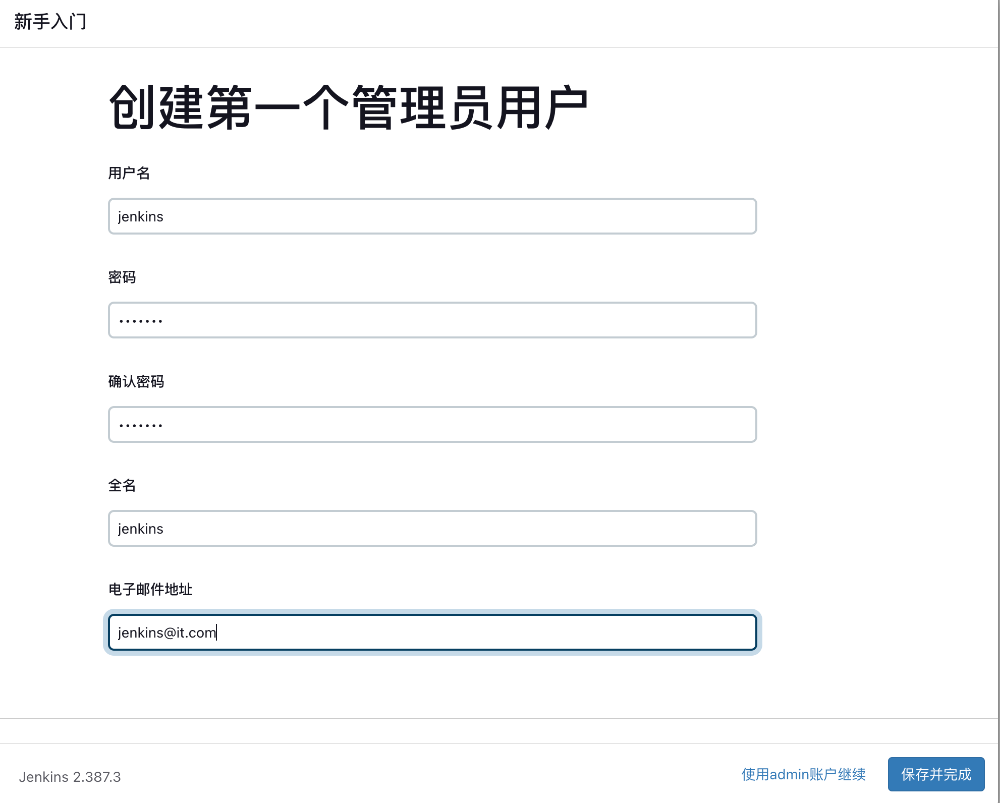

保存设置：

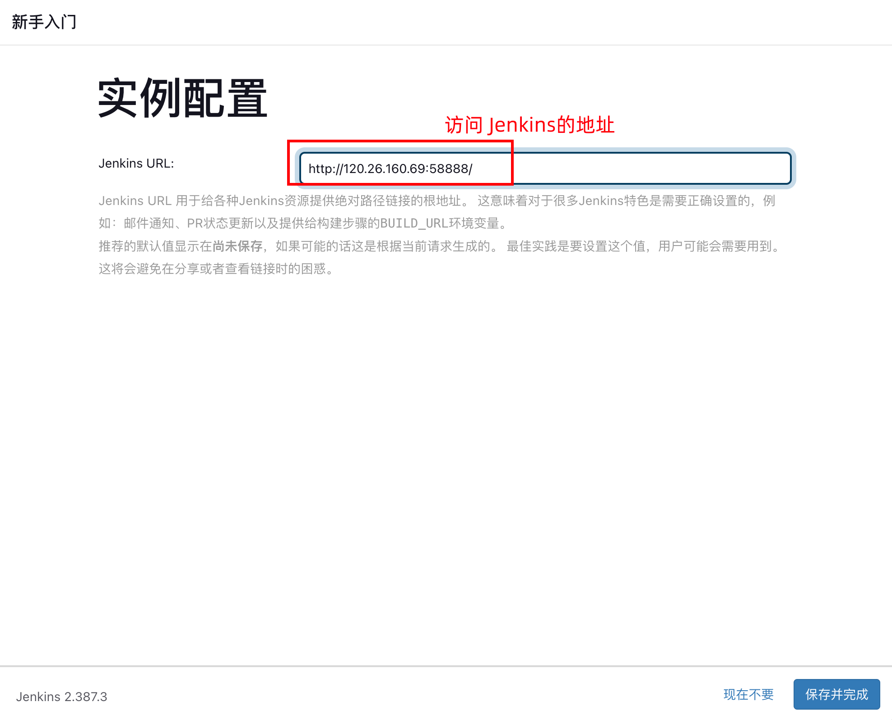

安装成功开始使用：

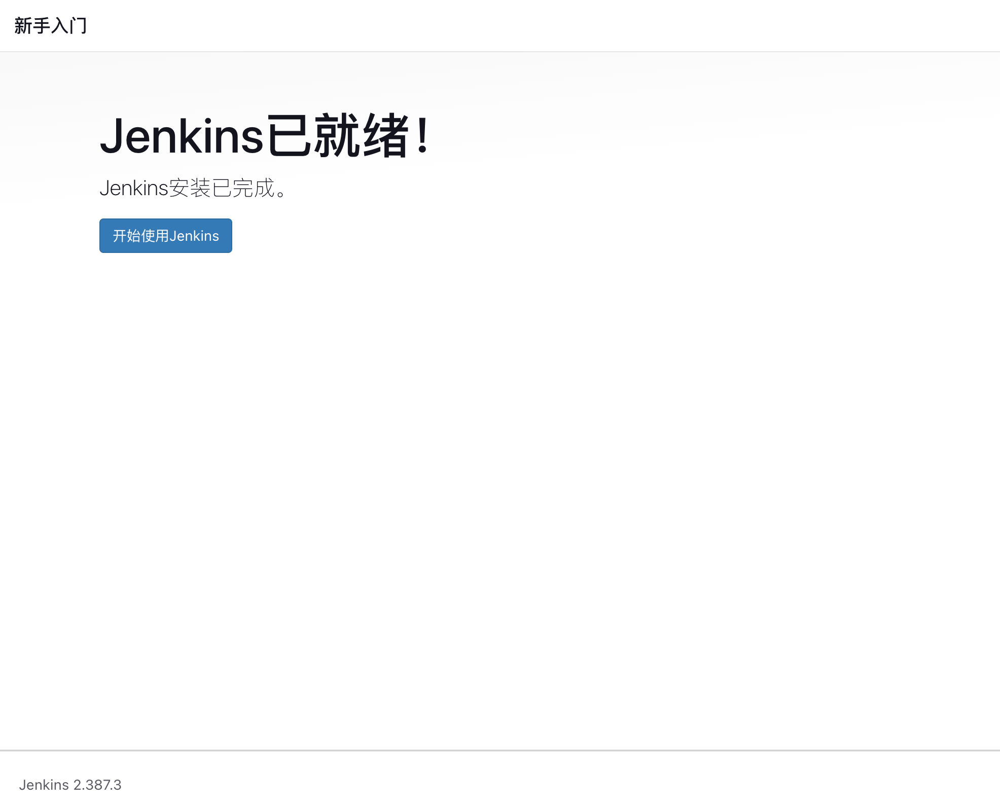

进入到Jenkins管理界面：

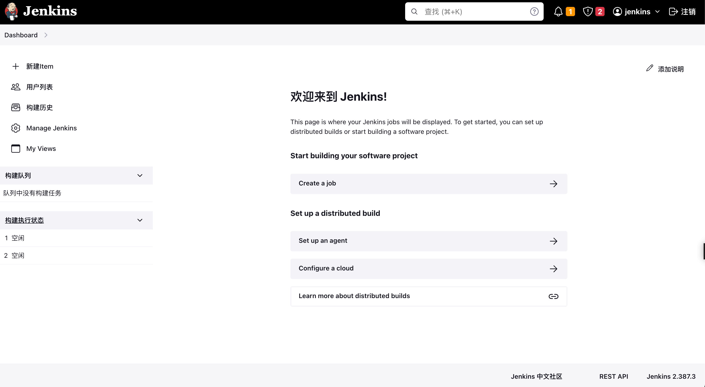

核心插件：git、git Paramter、maven integretion 、maven pipeline Docker等

## 3.git配置

系统管理  \-\-\> 全局工具配置

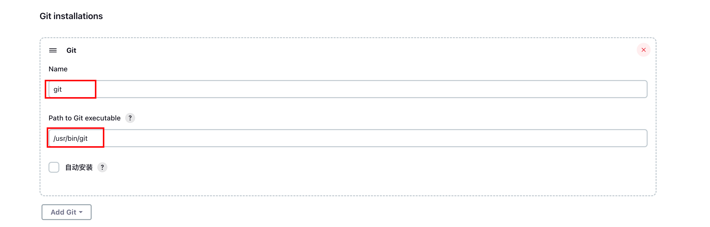


以下相关插件需要安装：

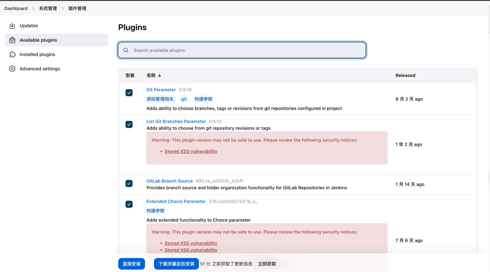

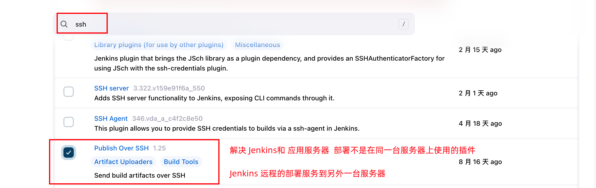

点击Manage Jenkins \-\-\> 系统管理 \-\-\> 点击插件管理 \-\-\> 进入到插件管理页面

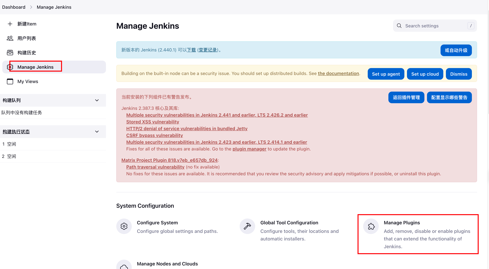

输入 maven  安装：

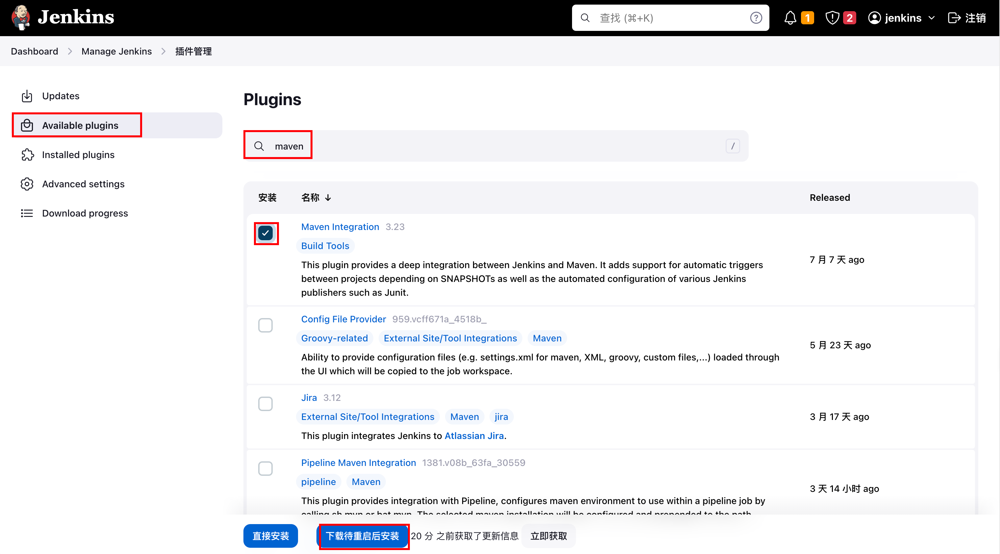

空闲时重启:

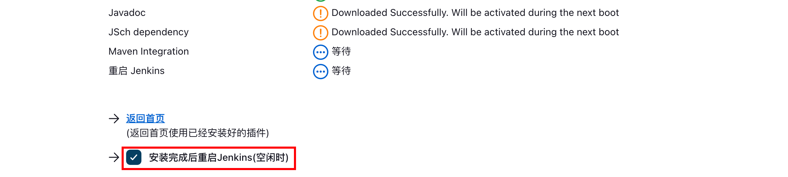


