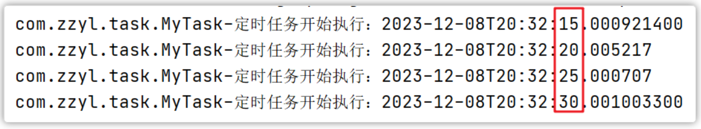
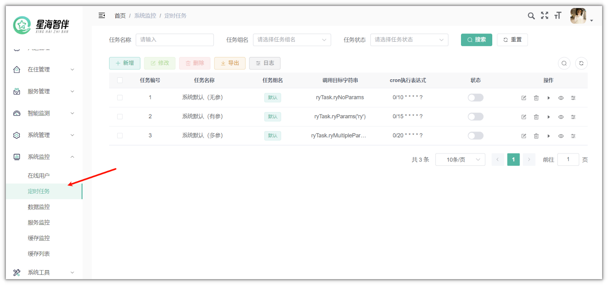
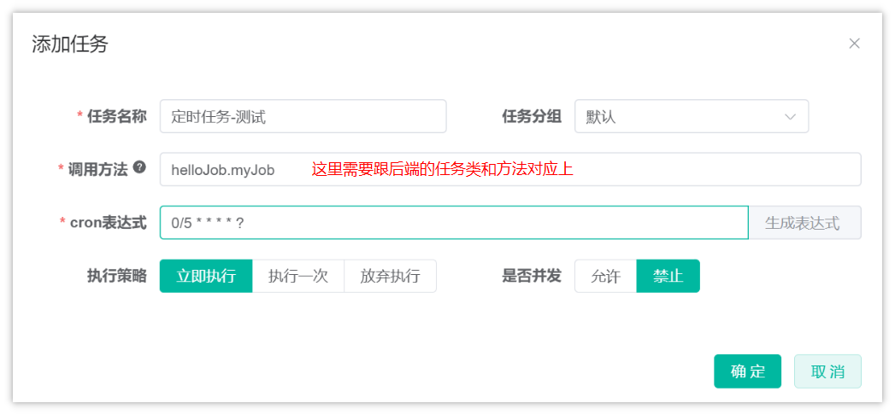
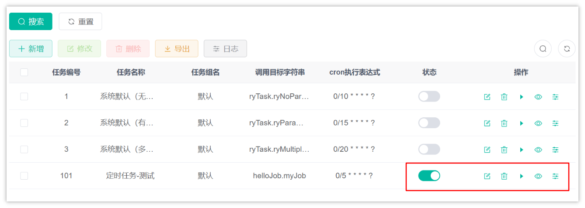
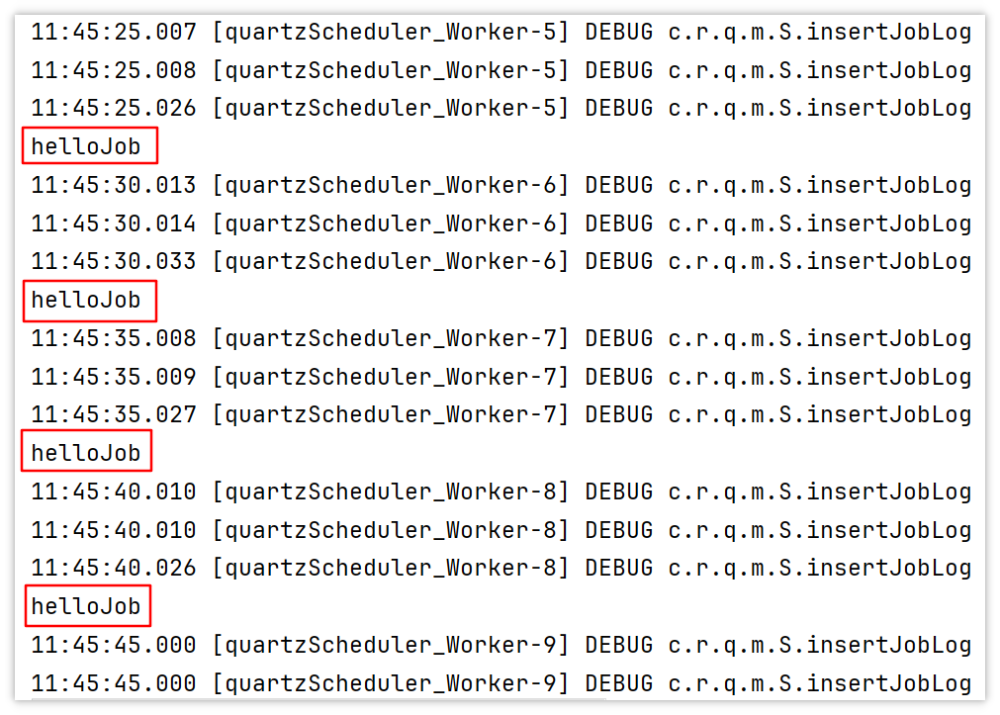
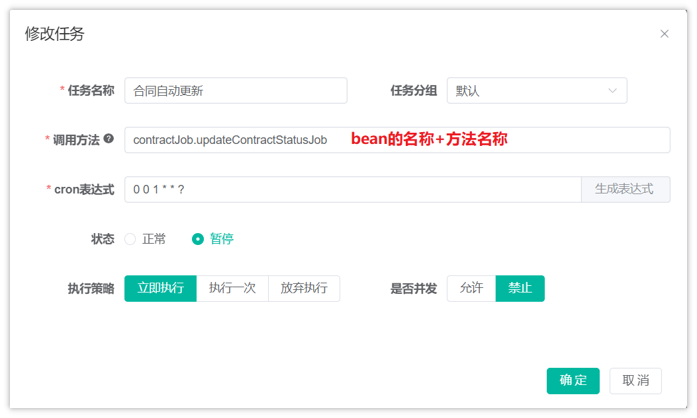

## 一、定时任务概述

任务调度是指系统为了自动完成特定任务，在约定的特定时刻去执行任务的过程。有了任务调度即可解放更多的人力，而是由系统自动去执行任务。

常用业务场景案例：

- 某电商系统需要在每天上午10点，下午3点，晚上8点发放一批优惠券。

- 某银行系统需要在信用卡到期还款日的前三天进行短信提醒。

- 某财务系统需要在每天凌晨0:10结算前一天的财务数据，统计汇总。

- 12306会根据车次的不同，设置某几个时间点进行分批放票。

如何实现任务调度？

- 多线程方式，结合sleep

- JDK提供的API，例如：Timer、ScheduledExecutor

- 框架，例如Quartz ，它是一个功能强大的任务调度框架，可以满足更多更复杂的调度需求

- spring task

- Xxl\-job  微服务阶段

## 二、cron表达式

在我们使用调度任务技术的时候，特别是调度框架，里面都支持使用日历的方式来设置任务制定的时间、频率等，通常情况下都会使用cron表达式来表达

cron表达式是一个字符串, 用来设置定时规则, 由七部分组成, 每部分中间用空格隔开, 每部分的含义如下表所示:

| 组成部分 | 含义              | 取值范围                  |
| -------- | ----------------- | ------------------------- |
| 第一部分 | Seconds (秒)      | 0－59                     |
| 第二部分 | Minutes(分)       | 0－59                     |
| 第三部分 | Hours(时)         | 0-23                      |
| 第四部分 | Day-of-Month(天)  | 1月31日                   |
| 第五部分 | Month(月)         | 0-11或JAN-DEC             |
| 第六部分 | Day-of-Week(星期) | 1-7(1表示星期日)或SUN-SAT |
| 第七部分 | Year(年) 可选     | 1970-2099                 |


另外, cron表达式还可以包含一些特殊符号来设置更加灵活的定时规则, 如下表所示:
| 符号 | 含义                                                         |
| ------ | ------------------------------------------------------------|
| ?    | 表示不确定的值。当两个子表达式其中一个被指定了值以后，为了避免冲突，需要将另外一个的值设为“?”。例如：想在每月20日触发调度，不管20号是星期几，只能用如下写法：0 0 0 20 * ?，其中最后以为只能用“?” |
| *    | 代表所有可能的值                                             |
| ,    | 设置多个值,例如”26,29,33”表示在26分,29分和33分各自运行一次任务 |
| -    | 设置取值范围,例如”5-20”，表示从5分到20分钟每分钟运行一次任务 |
| /    | 设置频率或间隔,如"1/15"表示从1分开始,每隔15分钟运行一次任务  |
| L    | 用于每月，或每周，表示每月的最后一天，或每个月的最后星期几,例如"6L"表示"每月的最后一个星期五" |
| W    | 表示离给定日期最近的工作日,例如"15W"放在每月（day-of-month）上表示"离本月15日最近的工作日" |
| #    | 表示该月第几个周X。例如”6#3”表示该月第3个周五                |


为了让大家更熟悉cron表达式的用法, 接下来我们给大家列举了一些例子, 如下表所示:
| cron表达式         | 含义                                    |
| ------------------ | --------------------------------------- |
| */5 * * * * ?      | 每隔5秒运行一次任务                     |
| 0 0 23 * * ?       | 每天23点运行一次任务                    |
| 0 0 1 1 * ?        | 每月1号凌晨1点运行一次任务              |
| 0 0 23 L * ?       | 每月最后一天23点运行一次任务            |
| 0 26,29,33 * * * ? | 在26分、29分、33分运行一次任务          |
| 0 0/30 9-17 * * ?  | 朝九晚五工作时间内每半小时运行一次任务  |
| 0 15 10 ? * 6#3    | 每月的第三个星期五上午10:15运行一次任务 |

## 三、Spring Task入门案例

1.导入maven坐标 spring\-context

目前项目中只要导入了springboot相关依赖会自动导入，这一步无需操作

2.自定义定时任务类

```Java
package com.xhzb.nursing.job;

import lombok.extern.slf4j.Slf4j;
import org.springframework.scheduling.annotation.Scheduled;
import org.springframework.stereotype.Component;

import java.time.LocalDateTime;

/**
 * @author sjqn
 */
@Component
@Slf4j
public class MyTask {

    /**
     * 定时任务 每隔5秒触发一次
     */
    @Scheduled(cron = "0/5 * * * * ?")
    public void executeTask(){
        log.info("定时任务开始执行：{}", LocalDateTime.now());
    }
}
```

启动类添加注解 @EnableScheduling

```Java
/**
 * 启动程序
 * 
 * @author ruoyi
 */
@SpringBootApplication(exclude = { DataSourceAutoConfiguration.class })
@EnableScheduling
public class RuoYiApplication
{
    public static void main(String[] args)
    {
        // System.setProperty("spring.devtools.restart.enabled", "false");
        SpringApplication.run(RuoYiApplication.class, args);
        System.out.println("(♥◠‿◠)ﾉﾞ  若依启动成功   ლ(´ڡ`ლ)ﾞ  \n" +
                " .-------.       ____     __        \n" +
                " |  _ _   \\      \\   \\   /  /    \n" +
                " | ( ' )  |       \\  _. /  '       \n" +
                " |(_ o _) /        _( )_ .'         \n" +
                " | (_,_).' __  ___(_ o _)'          \n" +
                " |  |\\ \\  |  ||   |(_,_)'         \n" +
                " |  | \\ `'   /|   `-'  /           \n" +
                " |  |  \\    /  \\      /           \n" +
                " ''-'   `'-'    `-..-'              ");
    }
}
```

启动项目即可执行，测试效果，每个5秒执行了一次方法，如下图：



## 四、若依中定时任务的使用

一般在项目中，避免不了要使用定时任务，在若依框架中，也提供了定时任务相关的功能，并且做到了可视化管理，方便来管理和维护项目中的定时任务。

在使用定时任务的时候，需要后端代码和后台系统协作才能更好的管理定时任务



### 1.后端代码

在后台添加任务处理类（支持spring bean的调用和Class类调用）

1.在定义bean的时候，使用 `@Component("ryTask")` 或 `@Service` 

调用目标字符串：`ryTask.ryParams('ry')` 

- `ryTask`是指bean的名称

- `ryParams`是bean的中方法，可以传参

2.Class类调用，可以指定类和方法即可

示例：com\.xhzb\.quartz\.task\.RyTask\.ryParams\("ry"\)

```Java
package com.xhzb.quartz.task;

import org.springframework.stereotype.Component;
import com.xhzb.common.utils.StringUtils;

/**
 * 定时任务调度测试
 * 
 * @author ruoyi
 */
@Component("ryTask")
public class RyTask
{
    public void ryMultipleParams(String s, Boolean b, Long l, Double d, Integer i)
    {
        System.out.println(StringUtils.format("执行多参方法： 字符串类型{}，布尔类型{}，长整型{}，浮点型{}，整形{}", s, b, l, d, i));
    }

    public void ryParams(String params)
    {
        System.out.println("执行有参方法：" + params);
    }

    public void ryNoParams()
    {
        System.out.println("执行无参方法");
    }
}
```

自定义任务类

在`xhzb-nursing-platform`模块下的`com.xhzb.nursing.job`包下新增HelloJob类，代码如下：

```Java
package com.xhzb.nursing.job;

import org.springframework.stereotype.Component;

@Component("helloJob")
public class HelloJob {

    public void myJob() {
        System.out.println("helloJob");
    }
}
```

> 注意：
>
> 默认情况下，任务类只能定义在`xhzb-quartz`模块下的`com.xhzb.quartz.task`包下，因为做了白名单的设置，不然任务会创建不成功，也可以修改白名单的设置：
>
> 在ruoyi-common模块中，找到com.xhzb.common.constant.Constants常量类
>
> 修改常量JOB_WHITELIST_STR ，这是一个数组，可以添加任意的任务类包名 public static final String[] JOB_WHITELIST_STR = { "com.xhzb.quartz.task","com.xhzb.nursing.job" };

### 2.后台系统创建任务

找到系统监控\-\-\>定时任务，可以新增任务，如下：



- 任务名称：自定义，如：定时查询任务状态

- 任务分组：根据字典`sys_job_group`配置，可自行进行配置

- 调用目标字符串：设置后台任务方法名称参数

- 执行表达式：可查询官方`cron`表达式介绍

- 执行策略：定时任务自定义执行策略

- 并发执行：是否需要多个任务间同时执行

创建完成后，在定时任务列表页可以对任务进行操作



> 可以对任务进行：状态开启、修改、删除、查看详情、任务调度日志
> 

开启任务后，可以在idea的控制台查看，任务的执行情况



> 任务是每隔5秒执行一次
> 

## 五、合同定时更新

1.合同状态批量更新执行逻辑

在IContractService中新增方法，没有参数，来批量更新合同状态

```Java
/**
 * 更新合同状态
 */
void updateContractStatus();
```

实现方法：

```Java
/**
 * 更新合同状态
 */
@Override
public void updateContractStatus() {
    //查询合同，状态为0的  开始时间小于等于当前时间
    LambdaQueryWrapper<Contract> queryWrapper = new LambdaQueryWrapper<>();
    queryWrapper.eq(Contract::getStatus,0);
    queryWrapper.le(Contract::getStartDate, LocalDateTime.now());
    List<Contract> list = list(queryWrapper);
    //判断是否为空
    /*if(list != null && list.size() > 0){

    }*/
    if(CollUtil.isEmpty(list)){
        return;
    }

    //更新合同状态
    list.forEach(contract -> {
        contract.setStatus(1);
    });

    //批量更新
    updateBatchById(list);
}
```

2.创建定时任务

在`com.xhzb.nursing.job`包创建定时任务类，包名有要求，要在若依定时任务支持的范围内

```Java
package com.xhzb.nursing.job;

import com.xhzb.nursing.service.IContractService;
import lombok.extern.log4j.Log4j;
import lombok.extern.slf4j.Slf4j;
import org.springframework.beans.factory.annotation.Autowired;
import org.springframework.stereotype.Component;

@Component("contractJob")
@Slf4j
public class ContractJob {

    @Autowired
    private IContractService contractService;

    public void updateContractStatusJob(){
        contractService.updateContractStatus();
        log.info("定时更新合同状态成功！");
    }
}
```

3.在后台系统中创建定时任务


