## 一、基本介绍

Mybatis\-Plus（简称MP）是一个基于Mybatis框架的增强工具，它在Mybatis的基础上只做增强而不做改变，旨在简化开发、提高效率。Mybatis\-Plus提供了一系列的功能和特性，使得开发人员能够更加高效地使用Mybatis进行数据库操作。

官网地址：`https://baomidou.com`、`https://mybatis.plus`

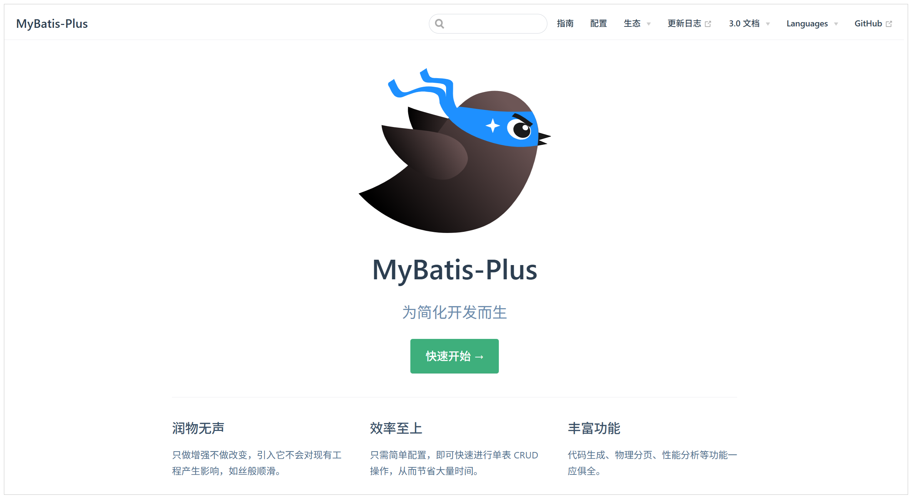

愿景：我们的愿景是成为 MyBatis 最好的搭档，就像魂斗罗 中的 1P、2P，基友搭配，效率翻倍。


特性：

- 无侵入：只做增强不做改变，引入它不会对现有工程产生影响，如丝般顺滑

- 强大的 CRUD 操作：内置通用 Mapper、通用 Service，仅仅通过少量配置即可实现单表大部分 CRUD 操作，更有强大的条件构造器，满足各类使用需求

- 损耗小：启动即会自动注入基本 CURD，性能基本无损耗，直接面向对象操作

- 强大的内置插件：内置分页插件（支持多种数据库，简化分页操作）、性能分析插件（快速定位慢查询）和全局拦截插件（智能阻断危险操作，支持自定义规则），助力高效安全开发。

## 二、入门程序

1.导入基础工程

咱们基于我们熟悉的轻客管家项目中的课程管理和活动管理模块的功能来完成开发，将资料中准备好 `mp-quickstart` 项目复制到`qk-parent`所在的文件夹中，然后用idea打开。

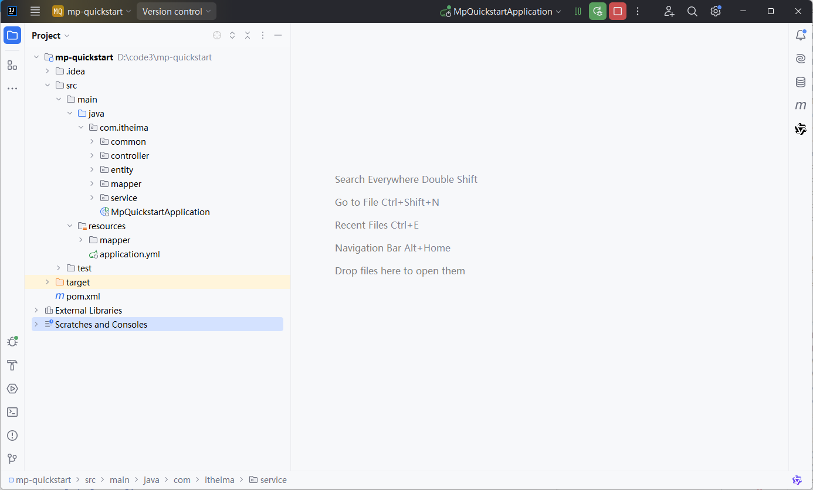

> 备注：在导入进来的基础工程 `mp-quickstart` 中已经基于Mybatis完成了课程管理、活动管理模块的功能开发，那接下来呢，我们要使用MybatisPlus来替换Mybatis，来看看MybatisPlus是如何简化Mybatis的操作的。
>

项目导入进来之后，我们直接将项目启动起来，然后打开前端页面可以看到课程管理、活动管理模块的功能全部正常。

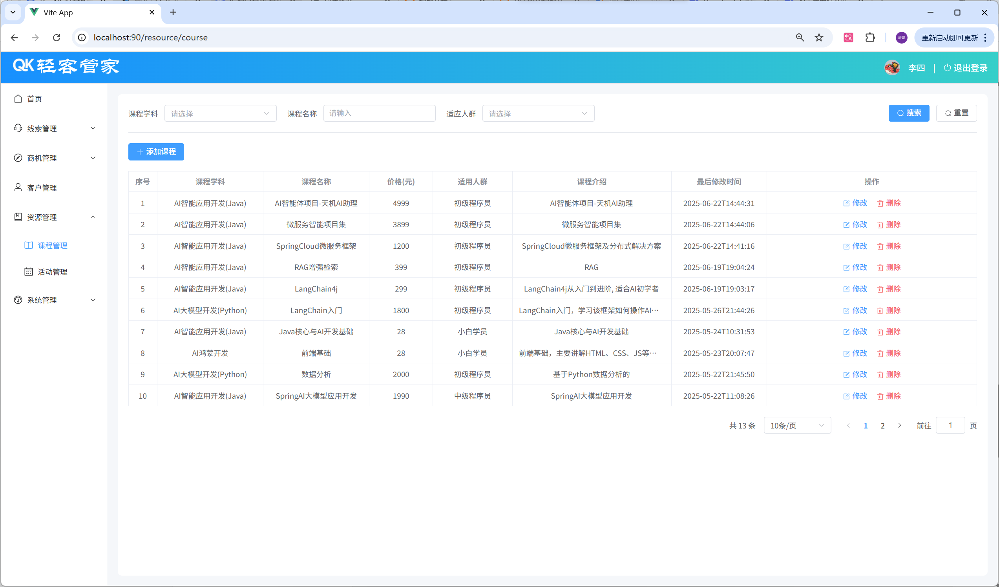

2.引入MybatisPlus依赖（替换掉Mybatis的依赖）

在 `mp-quickstart` 项目的 `pom.xml` 文件中，注释掉Mybatis的起步依赖，引入MybatisPlus的起步依赖。

```xml
<!--
<dependency>
    <groupId>org.mybatis.spring.boot</groupId>
    <artifactId>mybatis-spring-boot-starter</artifactId>
    <version>3.0.4</version>
</dependency>
-->

<!-- 基于springboot3 的 MybatisPlus的依赖 -->
<dependency>
    <groupId>com.baomidou</groupId>
    <artifactId>mybatis-plus-spring-boot3-starter</artifactId>
    <version>3.5.8</version>
</dependency>
```

替换掉依赖之后，我们刷新maven项目，重新启动服务之后，可以看到项目的功能依然可以正常访问。


那就说明MybatisPlus，确实是对项目无侵入的，对Mybatis只做增强不做改变，引入它不会对现有工程产生影响，如丝般顺滑。

3.在项目的application\.yml中配置日志输出及主键策略

```yaml
#mybatisPlus配置
mybatis-plus:
  configuration:
    log-impl: org.apache.ibatis.logging.stdout.StdOutImpl
    map-underscore-to-camel-case: true
  global-config:
    db-config:
      id-type: auto  #主键自动增长
```

4.定义Mapper接口，继承`BaseMapper<T>`，修改Service实现类中的代码

改造 `CourseMapper`，注释掉所有的接口方法，只需要让 `CourseMapper` 继承 `BaseMapper<Course>`，那么该Mapper接口就具备了增删改查的能力。

```java
package com.itheima.mapper;

import com.baomidou.mybatisplus.core.mapper.BaseMapper;
import com.itheima.entity.Course;

/**
 * 课程管理Mapper接口
 */
public interface CourseMapper extends BaseMapper<Course> {
    /*
    @Insert("INSERT INTO course (subject, name, price, target, description, create_time, update_time) VALUES (#{subject}, #{name}, #{price}, #{target}, #{description}, #{createTime}, #{updateTime})")
    void insert(Course course);

    @Select("SELECT id, subject, name, price, target, description, create_time, update_time FROM course WHERE id = #{id}")
    Course getCourseById(@Param("id") Integer id);

    void updateCourse(Course course);

    void deleteCourse(@Param("id") Integer id);
*/
    /**
     条件分页查询课程列表
     */
    List<Course> getCourses(String name, Integer subject, Integer target);
    
}
```

5.调整一下Service实现类中调用的Mapper接口方法

由于我们已经注释掉了我们之前自己在`CourseMapper`中定义的接口方法，现在要使用MybatisPlus框架给我们提供的Mapper接口方法，所以需要调整一下 在`CourseServiceImpl`中调用的Mapper接口方法。

具体调整地方如下：

```java
/**
 * 课程管理Service实现类
 */
@Service
public class CourseServiceImpl implements CourseService {

    @Autowired
    private CourseMapper courseMapper;

    /**
     * 新增课程
     */
    @Override
    public void addCourse(Course course) {
        course.setCreateTime(LocalDateTime.now());
        course.setUpdateTime(LocalDateTime.now());
        courseMapper.insert(course);
    }

    /**
     * 更新课程信息
     */
    @Override
    public void updateCourse(Course course) {
        course.setUpdateTime(LocalDateTime.now());
        courseMapper.updateById(course);
    }

    /**
     * 根据ID查询课程信息
     */
    @Override
    public Course getCourseById(Integer id) {
        return courseMapper.selectById(id);
    }

    /**
     * 根据ID删除课程信息
     */
    @Override
    public void deleteCourse(Integer id) {
        courseMapper.deleteById(id);
    }

    /**
     * 条件分页查询课程列表
     */
    @Override
    public PageResult<Course> getCourses(String name, Integer subject, Integer target, int page, int pageSize) {
        // 开始分页
        PageHelper.startPage(page, pageSize);
    
        // 执行查询
        List<Course> courses = courseMapper.getCourses(name, subject, target);
    
        // 获取分页信息
        Page<Course> pageInfo = (Page<Course>) courses;
    
        // 封装成 PageResult 对象
        return new PageResult<>(pageInfo.getTotal(), pageInfo.getResult());
    }
}
```

那接下来，我们就可以重新启动服务，进行测试了。

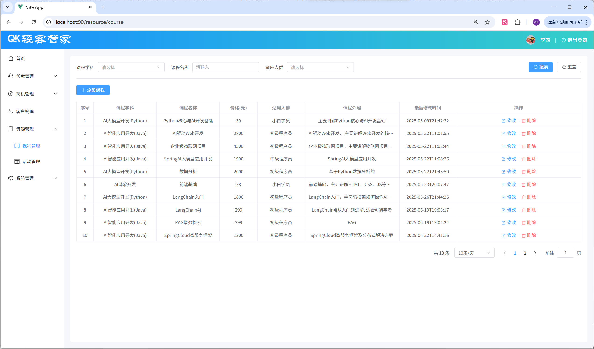

通过测试，我们可以看到课程管理中所有的功能都可以正常运行，但是我们在开发的过程中，是不是没有编写任何的SQL语句，且Mapper接口中我们也没有定义任何的接口方法。 这就是MybatisPlus的魅力，他可以帮我们完成绝大部分的CRUD的操作，满足我们日常开发的需求，简化开发、提高效率。

## 三、入门程序剖析

### 1.思考

入门程序中，我们仅仅是定义了一个接口`CourseMapper`继承了`BaseMapper<Course>`，并未指定要操作的数据库表、表中的字段，MybatisPlus是如何完成CRUD操作的呢？

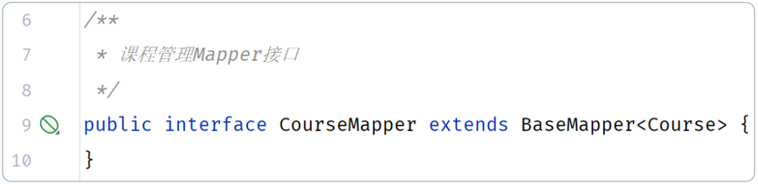

那这其实是因为MybatisPlus框架，在运行的时候，会通过扫描BaseMapper泛型中指定的实体类，并获取实体类相关信息作为数据库表的信息。具体的规则如下：

- 类名驼峰转下划线，作为表名。

- 属性名驼峰转下划线，作为表的字段名。

- 名为id的字段作为表的主键。

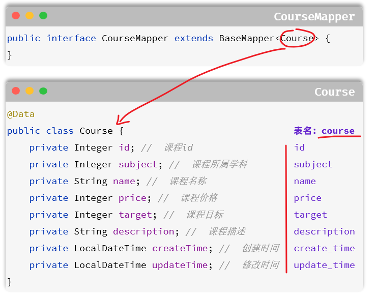

这样，就可以定位出要操作的表是 `course`，要操作的是 `course` 表中的 `id`、`subject`、`name`、`price`、`target`、`description`、`create_time`、`update_time` 字段。

### 2.常见注解

如果实体类与数据库表不符合默认的规则，MybatisPlus提供了常见的如下注解来指定表、字段的信息。

- @TableName：表名注解，标识实体类对应的表。

- @TableId：主键注解，标识实体类中的主键字段。

- @TableField：用来指定表中的普通字段信息。

如果表结构形式如下：

```SQL
create table tb_course (
    id int unsigned primary key auto_increment comment '课程id',
    subject tinyint unsigned not null comment '课程学科',
    name varchar(20) not null comment '课程名称',
    price int unsigned not null comment '课程价格（元）',
    target tinyint unsigned not null comment '适用人群',
    description varchar(100) comment '课程介绍',
    created datetime not null comment '创建时间',
    updated datetime not null comment '修改时间'
) comment '课程表';
```

那么最终的实体类，配置形式如下：

```java
@TableName("course")  //指定表名，如果表名符合"类名驼峰转下划线"则不用配置
public class Course {
    @TableId(value="id", type=IdType.AUTO) //指定主键id，如果属性名叫id则不用配置
    private Integer id; //  课程id
    
    @TableField("subject")   //指定对应的字段名成，如果符合"属性名驼峰转下划线"则不用配置
    private Integer subject; //  课程所属学科
    
    @TableField("name")
    private String name; //  课程名称
    
    @TableField("price")
    private Integer price; //  课程价格
    
    @TableField("target")
    private Integer target; //  课程目标
    
    @TableField("description")
    private String description; //  课程描述
    
    @TableField("create_time")     
    private LocalDateTime createTime; //  创建时间
    
    @TableField("update_time")
    private LocalDateTime updateTime; //  修改时间
}
```

> @TableId\(value="id", type=IdType\.AUTO\)
>
> IdType的常见类型： 
>
> - AUTO：自动增长
>- INPUT：用户输入ID
> - ASSIGN\_ID：雪花算法生成一个ID （分布式场景下使用）
>- ASSIGN\_UUID：生成一个UUID

> 一般情况下我们并不需要给字段添加`@TableField`注解，一些特殊情况除外：
>
> - 成员变量名与数据库字段名不一致
>
> - 成员变量不是数据库中的字段，则需要使用`exist`表明为`false`
>

## 四、核心功能

### 1.条件构建器

在执行查询、修改、删除时，经常会根据条件操作 ，而在MybatisPlus中支持各种复杂的where条件构建。具体的方法如下：

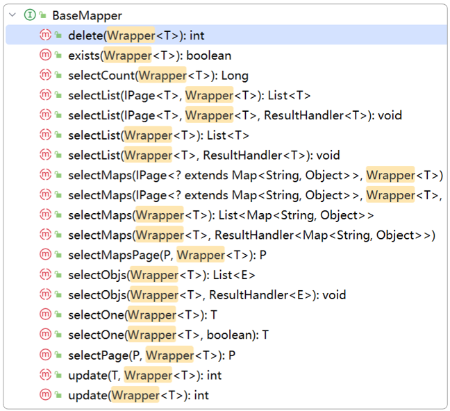

参数中的`Wrapper`就是条件构造的抽象类，其下有很多默认实现，继承关系如图：

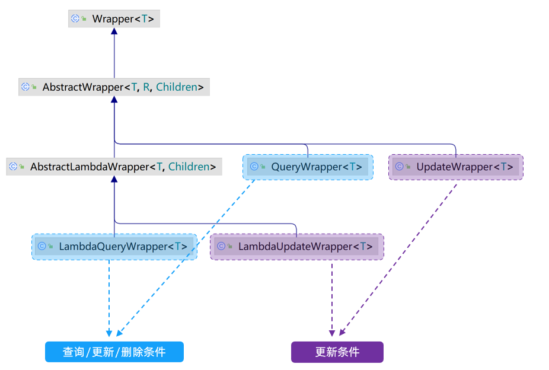

`Wrapper`的子类`AbstractWrapper`提供了where中包含的所有条件构造方法：

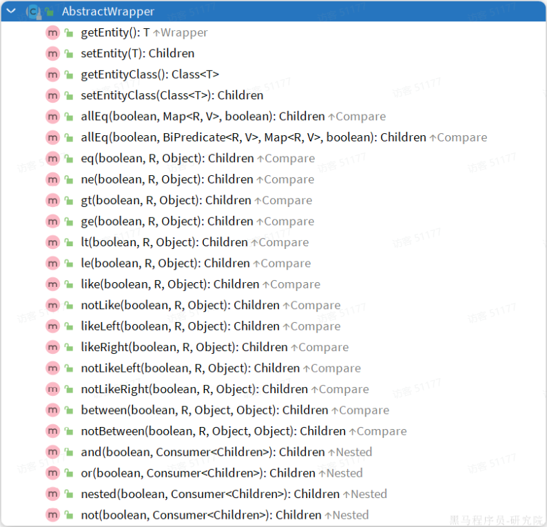

而`QueryWrapper`在`AbstractWrapper`的基础上拓展了一个`select`方法，允许指定查询字段：

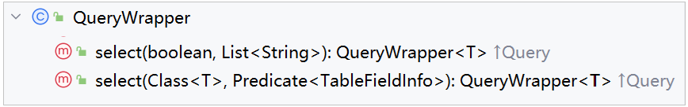

而`UpdateWrapper`在`AbstractWrapper`的基础上拓展了一个`set`方法，允许指定SQL中的SET部分：

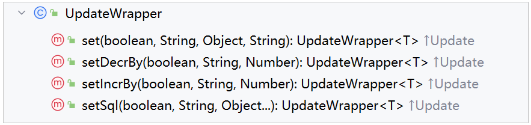

需求

```java
1. 根据课程的 学科 subject、名称 name、课程适用人群 target 查询课程信息，并根据更新时间 update_time 降序排序。
2. 根据课程的 学科 subject、名称 name、课程适用人群 target 查询课程的id、名称、价格、适用人群、课程描述 字段信息，并根据更新时间 update_time 降序排序。
3. 将id为1,2,3的课程价格调整为299。
4. 将id为4,5,6的课程价格统一上调99。
```

#### 1.1.QueryWrapper

无论是修改、删除、查询，都可以使用QueryWrapper来构建查询条件。接下来看一些例子：

1.根据课程的 学科 subject、名称 name、课程适用人群 target 查询课程信息，并根据更新时间 update\_time 降序排序

```java
package com.itheima;

import com.baomidou.mybatisplus.core.conditions.Wrapper;
import com.baomidou.mybatisplus.core.conditions.query.QueryWrapper;
import com.itheima.entity.Course;
import com.itheima.mapper.CourseMapper;
import org.junit.jupiter.api.Test;
import org.springframework.beans.factory.annotation.Autowired;
import org.springframework.boot.test.context.SpringBootTest;

import java.util.List;

@SpringBootTest
class MpQuickstartApplicationTests {

    @Autowired
    private CourseMapper courseMapper;

    /*
    1 根据课程的 学科 subject、名称 name、课程适用人群 target 查询课程信息，并根据更新时间 update_time 降序排序。
    select * from course where subject = ? and name like '%?%' and target = ? order by update_time desc;
     */
    @Test
    void test1() {
        //1 构建查询条件
        QueryWrapper<Course> queryWrapper = new QueryWrapper<>();
        queryWrapper.eq("subject",1) //where subject = 1
                .like("name","AI")  //and name like '%AI%'
                .eq("target",2) //and target = 2
                .orderByDesc("update_time"); //order by update_time desc;
        //2 执行查询
        List<Course> list = courseMapper.selectList(queryWrapper);
        //3 打印结果
        list.forEach(course -> System.out.println(course));
    }

}
```

关于QueryWrapper对象，可以直接new创建，也可以通过Wrappers工具类获取：

```java
@Test
void test2() {
    //1 构建查询条件
    QueryWrapper<Course> queryWrapper = Wrappers.query(Course.class)
            .eq("subject", 1) //where subject = 1
            .like("name", "ai")  //and name like '%ai%'
            .eq("target", 2) //and target = 2
            .orderByDesc("update_time");//order by update_time desc;
    //2 执行查询
    List<Course> list = courseMapper.selectList(queryWrapper);
    //3 打印结果
    list.forEach(course -> System.out.println(course));
}
```

如果想使用动态SQL，动态根据传入的条件是否有值，来决定是否组装这个查询条件，可以使用 eq、like 的重载方法，传入三个参数，第一个参数就是对应的条件。

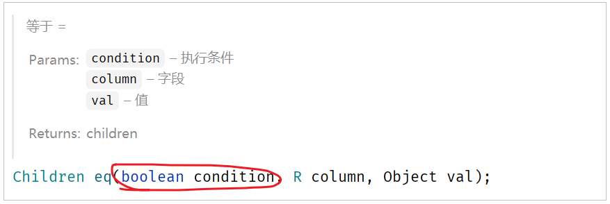

2.根据课程的 学科 subject、名称 name、课程适用人群 target 查询课程的 id、名称、价格、适用人群、课程描述 字段信息，并根据更新时间 update\_time 降序排序

```java
/*
2 根据课程的 学科 subject、名称 name、课程适用人群 target 查询课程的id、名称、价格、适用人群、课程描述 字段信息，并根据更新时间 update_time 降序排序。
select id,name,price,target,description from course where subject = ? and name like '%?%' and target = ? order by update_time desc;
 */
@Test
void test3() {
    //1 构建查询条件
    QueryWrapper<Course> queryWrapper = new QueryWrapper<>();
    queryWrapper.eq("subject",1) //where subject = 1
            .like("name","ai")  //and name like '%ai%'
            .eq("target",2) //and target = 2
            .orderByDesc("update_time") //order by update_time desc
            .select("id","name","price","target","description"); //select id,name,price,target,description

    //2 执行查询
    List<Course> list = courseMapper.selectList(queryWrapper);
    //3 打印结果
    list.forEach(course -> System.out.println(course));
}
```

3.将id为1,2,3的课程价格调整为299

```java
/*
    3 将id为1,2,3的课程价格调整为299。
    update course set price = ?,update_time=? where id in (1,2,3);
 */
@Test
void test4() {
    //1 构建修改条件
    QueryWrapper<Course> queryWrapper = new QueryWrapper<>();
    queryWrapper.in("id",1,2,3);  //where id in (1,2,3)
    //2 构建要修改内容（set后面的内容）
    Course course = new Course();
    course.setPrice(299);
    course.setUpdateTime(LocalDateTime.now());
    //3 执行修改
    courseMapper.update(course, queryWrapper);
}
```

#### 1.2.UpdateWrapper

1.将id为4,5,6的课程价格统一上调99

注意，这里的需求是价格在当前价格的基础上，要上调99元。 对应的SQL：`update course set price = price + 99 where id in (4,5,6);`

```java
/*
4 将id为4,5,6的课程价格统一上调99。
update course set price = price + 99 where id in (4,5,6);
 */
@Test
void test5() {
    //1 构建修改条件
    UpdateWrapper<Course> updateWrapper = new UpdateWrapper<>();
    updateWrapper.in("id",4,5,6);  //where id in (4,5,6)
    //2 构建要修改内容（set后面的内容）
    //updateWrapper.set("price", 233);  //price = 299 ，不符合要求
    updateWrapper.setSql("price=price+99");
    //updateWrapper.setSql("price=price+{0}",99); //{0}表示第一个占位符，99就是这个占位符的值。例如：updateWrapper.setSql("price = price + {0}, update_time = {1}", 99, LocalDateTime.now());
    //3 执行修改
    courseMapper.update(updateWrapper);
}
```

#### 1.3.LambdaQueryWrapper

无论是QueryWrapper还是UpdateWrapper在构造条件的时候都需要写死字段名称，这在编程规范中显然是不推荐的。那怎么样才能不写字段名，又能知道字段名呢？

其中一种办法是基于变量的`getter`方法结合反射技术来实现，因此我们只要将条件对应的字段的`getter`方法传递给Mybatis\-Plus，它就能计算出对应的字段名了。而传递方法可以使用JDK8中的`方法引用`和`Lambda`表达式。
因此Mybatis\-Plus又提供了一套基于Lambda的Wrapper，包含两个：

- LambdaQueryWrapper

- LambdaUpdateWrapper

分别对应QueryWrapper和UpdateWrapper

其使用方式如下：

1.根据课程的 学科 subject、名称 name、课程适用人群 target 查询课程信息，并根据更新时间 update\_time 降序排序

```java
/*
1 根据课程的 学科 subject、名称 name、课程适用人群 target 查询课程信息，并根据更新时间 update_time 降序排序。
select * from course where subject = ? and name like '%?%' and target = ? order by update_time desc;
 */
@Test
void test1() {
    //1 构建查询条件
    LambdaQueryWrapper<Course> queryWrapper = new LambdaQueryWrapper<>();
    queryWrapper.eq(Course::getSubject, 1) //where subject = 1
            .like(Course::getName,"ai")  //and name like '%ai%'
            .eq(Course::getTarget,2) //and target = 2
            .orderByDesc(Course::getUpdateTime); //order by update_time desc;
    //2 执行查询
    List<Course> list = courseMapper.selectList(queryWrapper);
    //3 打印结果
    list.forEach(course -> System.out.println(course));
}

@Test
void test2() {
    //1 构建查询条件
    LambdaQueryWrapper<Course> queryWrapper = Wrappers.lambdaQuery(Course.class)
            .eq(Course::getSubject, 1) //where subject = 1
            .like(Course::getName,"ai")  //and name like '%ai%'
            .eq(Course::getTarget,2) //and target = 2
            .orderByDesc(Course::getUpdateTime); //order by update_time desc;
    //2 执行查询
    List<Course> list = courseMapper.selectList(queryWrapper);
    //3 打印结果
    list.forEach(course -> System.out.println(course));
}
```

2.根据课程的 学科 subject、名称 name、课程适用人群 target 查询课程的id、名称、价格、适用人群、课程描述 字段信息，并根据更新时间 update\_time 降序排序

```java
/*
2 根据课程的 学科 subject、名称 name、课程适用人群 target 查询课程的id、名称、价格、适用人群、课程描述 字段信息，并根据更新时间 update_time 降序排序。
select id,name,price,target,description from course where subject = ? and name like '%?%' and target = ? order by update_time desc;
 */
@Test
void test3() {
    //1 构建查询条件
    LambdaQueryWrapper<Course> queryWrapper = new LambdaQueryWrapper<>();
    queryWrapper.eq(Course::getSubject, 1) //where subject = 1
            .like(Course::getName,"ai")  //and name like '%ai%'
            .eq(Course::getTarget,2) //and target = 2
            .orderByDesc(Course::getUpdateTime) //order by update_time desc;
            .select(Course::getId, Course::getName, Course::getPrice, Course::getTarget, Course::getDescription);//select id,name,price,target,description
    //2 执行查询
    List<Course> list = courseMapper.selectList(queryWrapper);
    //3 打印结果
    list.forEach(course -> System.out.println(course));
}
```

```java
/*
3. 将id为1,2,3的课程价格调整为299。
update course set price = 299 where id in (1,2,3);
 */
@Test
void test4() {
    //1 创建LambdaQueryWrapper对象，构建修改条件
    LambdaQueryWrapper<Course> lambdaQueryWrapper = new LambdaQueryWrapper<>();
    lambdaQueryWrapper.in(Course::getId,1,2,3); //where id in (1,2,3)
    //创建实体类对象，封装要修改的数据
    Course course =new Course();  //哪个属性有值，就来就修改哪个属性对应的字段
    course.setPrice(599);  //set price = 299
    course.setUpdateTime(LocalDateTime.now());  //set price = 299,update_time=xxxx

    //2 执行修改操作
    courseMapper.update(course,lambdaQueryWrapper);
}

/*
4. 将id为4,5,6的课程价格统一上调99。
update course set price = price+99 where id in (4,5,6);
 */
@Test
void test5() {
    //1 创建UpdateWrapper对象，构建修改条件(set中的内容)
    LambdaUpdateWrapper<Course> lambdaUpdateWrapper = new LambdaUpdateWrapper<>();
    lambdaUpdateWrapper.in(Course::getId,4,5,6);  //where id in (1,2,3)
    //lambdaUpdateWrapper.set("price", 233);  //price = 299 ，不符合要求
    lambdaUpdateWrapper.setSql("price = price + 99");  //设置set后面的sql语句
    //lambdaUpdateWrapper.setSql("price = price + {0}", 99);  //{0}占位符，第一个占位符的名称叫{0},后面的值依次给占位符
    //2 执行修改操作
    courseMapper.update(lambdaUpdateWrapper);
}
```

### 2.IService接口

Mybatis\-Plus不仅提供了BaseMapper，还提供了通用的Service接口及默认实现，封装了一些常用的service模板方法。 通用接口为`IService`，默认实现为`ServiceImpl`，其中封装的方法可以分为以下几类：

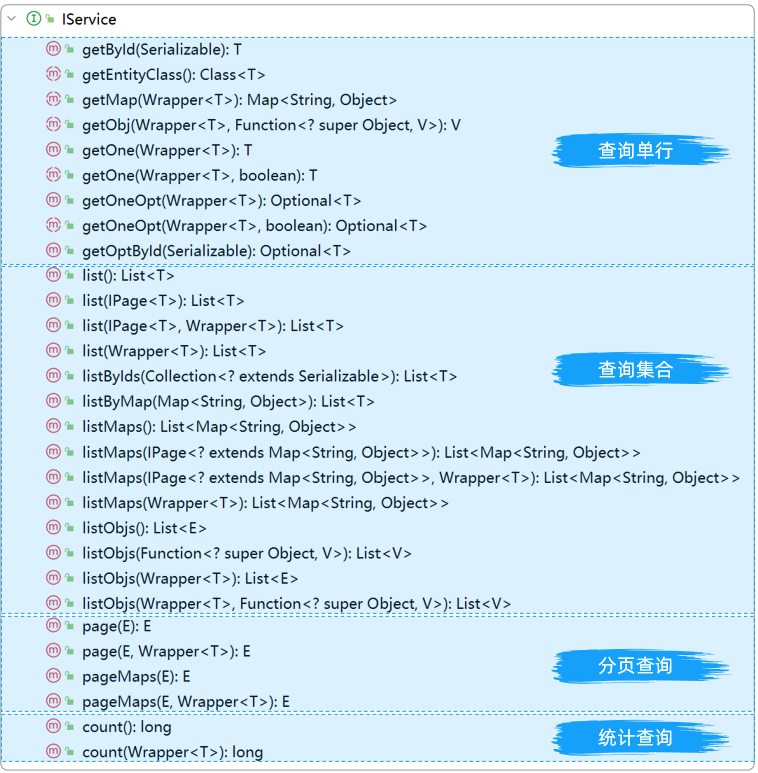

`get`：查询单个结果

`list`：查询集合结果

`count`：计数

`page`：分页查询


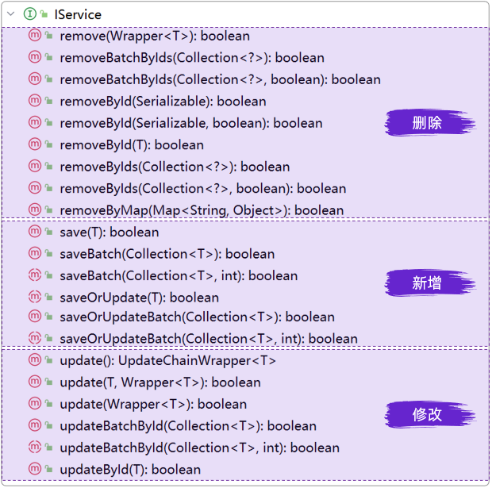

`save`：新增

`remove`：删除

`update`：更新

#### 2.1.基本的增删改查

我们先来看下基本的CRUD接口，新增

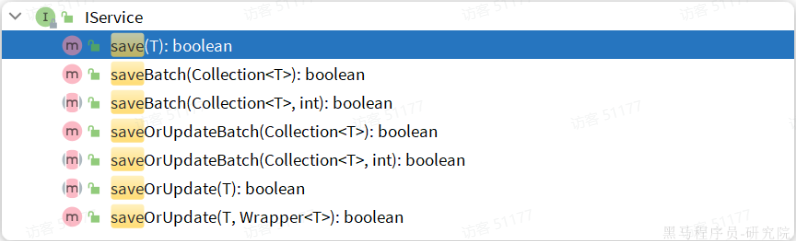

`save`是新增单个元素

`saveBatch`是批量新增

`saveOrUpdate`是根据id判断，如果数据存在就更新，不存在则新增

`saveOrUpdateBatch`是批量的新增或修改

删除：

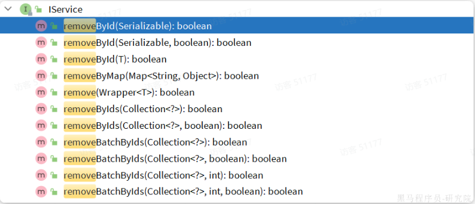

`removeById`：根据id删除

`removeByIds`：根据id批量删除

`removeByMap`：根据Map中的键值对条件删除

`remove(Wrapper<T>)`：根据Wrapper条件删除

`~~removeBatchByIds~~`：暂不支持

修改：

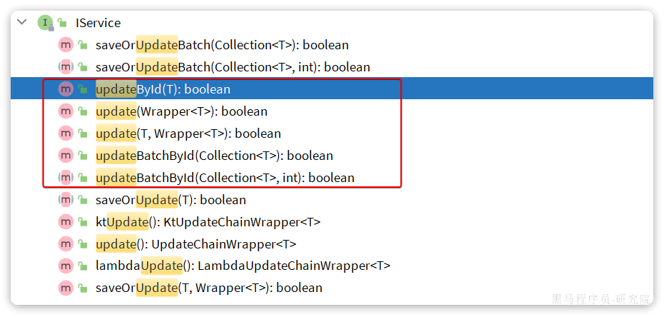

`updateById`：根据id修改

`update(Wrapper<T>)`：根据`UpdateWrapper`修改，`Wrapper`中包含`set`和`where`部分

`update(T，Wrapper<T>)`：按照`T`内的数据修改与`Wrapper`匹配到的数据

`updateBatchById`：根据id批量修改

Get：

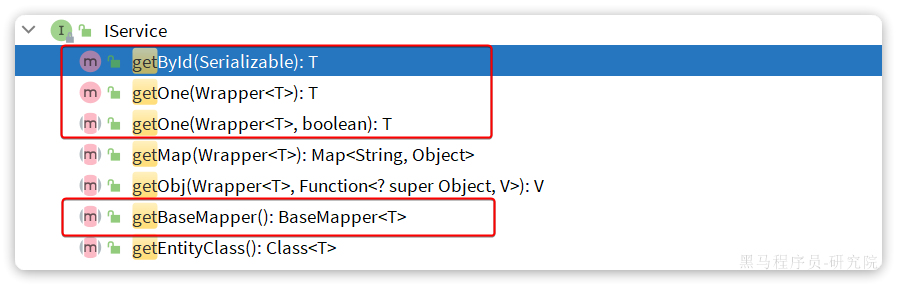

`getById`：根据id查询1条数据

`getOne(Wrapper<T>)`：根据`Wrapper`查询1条数据

`getBaseMapper`：获取`Service`内的`BaseMapper`实现，某些时候需要直接调用`Mapper`内的自定义`SQL`时可以用这个方法获取到`Mapper`

List：

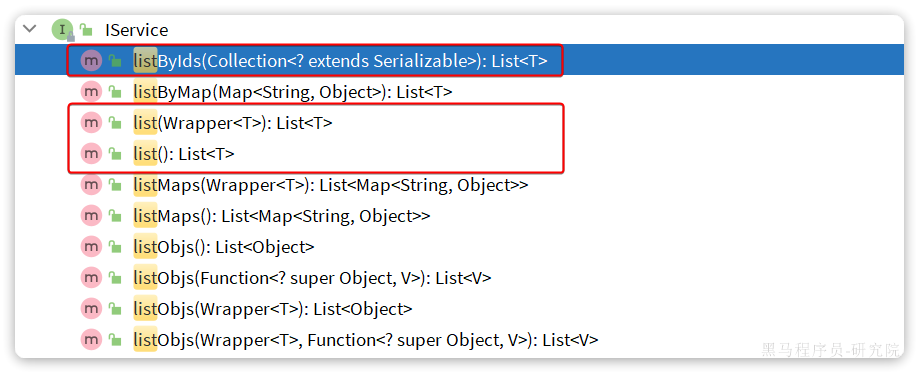

`listByIds`：根据id批量查询

`list(Wrapper<T>)`：根据Wrapper条件查询多条数据

`list()`：查询所有

Count：

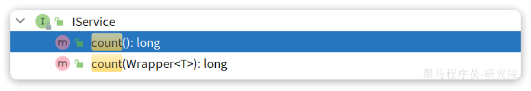

`count()`：统计所有数量

`count(Wrapper<T>)`：统计符合`Wrapper`条件的数据数量

#### 2.2.基本用法与快速入门

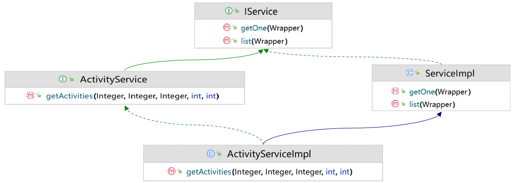

由于`Service`中经常需要定义与业务有关的自定义方法，因此我们不能直接使用`IService`，而是自定义`Service`接口，然后继承`IService`以拓展方法。

同时，让自定义的`Service实现类`继承`ServiceImpl`，这样就不用自己实现`IService`中的接口了。怎么样？听上去是不是很厉害？那接下来咱们就通过一个入门程序来感受一下是不是如此吧。

需求：基于Mybatis\-Plus的 Iservice 接口，实现轻客管家项目活动管理页面的所有功能：

- 新增活动功能

- 根据id查询活动信息

- 根据id更新活动信息

- 根据id删除活动信息

1.改造`ActivityMapper`接口 

找到`ActivityMapper`接口，让它继承`BaseMapper`接口，并在泛型上指定实体类的类型\(保留分页查询的方法\)

```java
package com.itheima.mapper;

import com.baomidou.mybatisplus.core.mapper.BaseMapper;
import com.itheima.entity.Activity;

/**
 * 活动管理Mapper接口
 */
@Mapper
public interface ActivityMapper extends BaseMapper<Activity> {
    /**
     * 条件分页查询活动列表
     * @param channel 渠道来源
     * @param type 活动类型
     * @param status 状态
     * @return 活动列表
     */
    List<Activity> getActivities(Integer channel, Integer type, Integer status);
}
```

2.改造`ActivityService`接口 

找到`ActivityService`接口，让它继承`IService`接口，并在泛型上指定实体类的类型\(保留分页查询的方法\)

```java
package com.itheima.service;

import com.baomidou.mybatisplus.extension.service.IService;
import com.itheima.common.PageResult;
import com.itheima.entity.Activity;

public interface ActivityService extends IService<Activity> {
    /**
     * 条件分页查询活动列表
     * @param channel 渠道来源
     * @param type 活动类型
     * @param status 状态
     * @param page 页码
     * @param pageSize 每页记录数
     * @return 分页结果
     */
    PageResult<Activity> getActivities(Integer channel, Integer type, Integer status, int page, int pageSize);
}
```

3.改造`ActivityServiceImpl`接口，继承ServiceImpl\<ActivityMapper, Activity\>，实现自己的ActivityService方法，同时保留分页查询的方法。

```java
package com.itheima.service.impl;

import com.baomidou.mybatisplus.core.conditions.query.LambdaQueryWrapper;
import com.baomidou.mybatisplus.extension.service.impl.ServiceImpl;
import com.github.pagehelper.Page;
import com.github.pagehelper.PageHelper;
import com.itheima.common.PageResult;
import com.itheima.entity.Activity;
import com.itheima.mapper.ActivityMapper;
import com.itheima.service.ActivityService;
import org.springframework.stereotype.Service;
import java.time.LocalDateTime;
import java.util.List;

/**
 * 活动管理Service实现类
 */
@Service
public class ActivityServiceImpl extends ServiceImpl<ActivityMapper, Activity> implements ActivityService {
    @Autowired
    private ActivityMapper activityMapper;
    /**
     * 查询活动列表
     */
    @Override
    public PageResult<Activity> getActivities(Integer channel, Integer type, Integer status, int page, int pageSize) {
        // 开始分页
        PageHelper.startPage(page, pageSize);
        // 执行查询
        List<Activity> activities = activityMapper.getActivities(channel, type, status);
        // 获取分页信息
        Page<Activity> pageInfo = (Page<Activity>) activities;
        // 封装成 PageResult 对象
        return new PageResult<>(pageInfo.getTotal(), pageInfo.getResult());
    }
}
```

4.最后，修改ActivityController中报错的代码，改一下方法调用就可以啦。

```java
package com.itheima.controller;

import com.itheima.common.PageResult;
import com.itheima.common.Result;
import com.itheima.entity.Activity;
import com.itheima.service.ActivityService;
import org.springframework.beans.factory.annotation.Autowired;
import org.springframework.web.bind.annotation.*;

import java.time.LocalDateTime;

/**
 * 活动管理控制器
 */
@RestController
@RequestMapping("/activities")
public class ActivityController {

    @Autowired
    private ActivityService activityService;

    /**
     * 新增活动
     */
    @PostMapping
    public Result addActivity(@RequestBody Activity activity) {
        activity.setCreateTime(LocalDateTime.now());
        activity.setUpdateTime(LocalDateTime.now());
        activityService.save(activity);
        return Result.success();
    }

    /**
     * 根据ID查询活动信息
     */
    @GetMapping("/{id}")
    public Result getActivityById(@PathVariable("id") Integer id) {
        Activity activity = activityService.getById(id);
        return Result.success(activity);
    }

    /**
     * 条件分页查询活动列表
     */
    @GetMapping
    public Result getActivities(
            @RequestParam(required = false) Integer channel,
            @RequestParam(required = false) Integer type,
            @RequestParam(required = false) Integer status,
            @RequestParam(defaultValue = "1") int page,
            @RequestParam(defaultValue = "10") int pageSize) {
        PageResult<Activity> activityPage = activityService.getActivities(channel, type, status, page, pageSize);
        return Result.success(activityPage);
    }

    /**
     * 更新活动信息
     */
    @PutMapping
    public Result updateActivity(@RequestBody Activity activity) {
        activity.setUpdateTime(LocalDateTime.now());
        activityService.updateById(activity);
        return Result.success();
    }

    /**
     * 删除活动
     */
    @DeleteMapping("/{id}")
    public Result deleteActivity(@PathVariable("id") Integer id) {
        activityService.removeById(id);
        return Result.success();
    }
}
```

这样，就搞定了哦，接下来，重启程序，打开页面测试一下部门管理的增删改查是不是都还完全正确吧\~

> 提示：
>
> 如果我们使用了MybatisPlus中提供的IService接口，那么对于一些简单的增删改查操作，我们就可以直接使用IService接口中提供的方法就可以了，就无需在我们自己的Service接口及实现类中定义对应的业务方法了。
>
> 而对于一些业务相对复杂一点的功能，我们还是建议，要将业务代码定义在自己编写Service层的接口及实现类中。比如上述的分页查询操作。

## 五、自动填充

MyBatis\-Plus提供了一个便捷的自动填充功能，用于在插入或更新数据时自动填充某些字段，如创建时间、更新时间等。

自动填充功能通过实现MetaObjectHandler 接口来实现。我们需要创建一个类来实现这个接口，并在其中定义插入和更新时的填充逻辑。

使用步骤：

1.定义实体类，使用 @TableField 注解来标记哪些字段需要自动填充，并指定填充的策略。

```java
@Data
public class Activity {
    //省略了其它属性
    /** 创建时间 */
    @TableField(fill = FieldFill.INSERT)
    private LocalDateTime createTime;
    /** 修改时间 */
    @TableField(fill = FieldFill.INSERT_UPDATE)
    private LocalDateTime updateTime;
}
```

FieldFill是一个枚举，内部定义了不同的填充方式

```java
public enum FieldFill {
    DEFAULT,   //默认不处理
    INSERT,    //插入数据时填充
    UPDATE,    //更新数据时填充
    INSERT_UPDATE;    //插入数据和更新数据时填充
}
```

2.创建一个类来实现 MetaObjectHandler 接口，并重写 insertFill 和 updateFill 方法。

原始代码

```java
// java example
@Slf4j
@Component
public class MyMetaObjectHandler implements MetaObjectHandler {

    @Override
    public void insertFill(MetaObject metaObject) {
        log.info("开始插入填充...");
        this.strictInsertFill(metaObject, "createUserId", Long.class, 123456L)
        this.strictInsertFill(metaObject, "createTime", LocalDateTime.class, LocalDateTime.now());
    }

    @Override
    public void updateFill(MetaObject metaObject) {
        log.info("开始更新填充...");
        this.strictInsertFill(metaObject, "updateUserId", Long.class, 123456L)
        this.strictUpdateFill(metaObject, "updateTime", LocalDateTime.class, LocalDateTime.now());
    }
}
```

改造后

```java
@Slf4j
@Component
public class MyMetaObjectHandler implements MetaObjectHandler {
    /**
     设置新增时填充的逻辑
     * @param metaObject 代表要新增的对象，例如新增活动，metaObject表示Activity对象。如果时新增课程，metaObject表示Course对象
     */
    @Override
    public void insertFill(MetaObject metaObject) {
        log.info("开始插入填充...");
        //方案一：使用MetaObjectHandler提供的strictInsertFill填充，遵守默认策略
        //this.strictInsertFill(metaObject, "createTime", LocalDateTime.class, LocalDateTime.now());
        //this.strictUpdateFill(metaObject, "updateTime", LocalDateTime.class, LocalDateTime.now());
        //方案二：使用metaObject提供的setValue()填充，可以强制设置值
        metaObject.setValue("createTime",LocalDateTime.now());
        metaObject.setValue("updateTime",LocalDateTime.now());
    }
    
    /**
     设置修改时填充的逻辑
     * @param metaObject 代表要修改的对象，例如修改活动，metaObject表示Activity对象。如果时修改课程，metaObject表示Course对象
     */
    @Override
    public void updateFill(MetaObject metaObject) {
        log.info("开始更新填充...");
        //注意：MetaObjectHandler 提供的默认方法策略是：如果属性有值则不覆盖
        //this.strictUpdateFill(metaObject, "updateTime", LocalDateTime.class, LocalDateTime.now());
        //方案二：使用metaObject提供的setValue()填充，可以强制设置值
        metaObject.setValue("updateTime",LocalDateTime.now());
    }
}
```

## 六、扩展插件

那在上述代码演示的过程中，我们在进行分页查询时，我们依然使用的是Mybatis的分页插件PageHelper，当然使用这种方式来进行分页也可以，但是略微还是有一点麻烦。

而在MybatisPlus中，也给我们提供的分页插件，那接下来，我们就一起来看看MybatisPlus中提供的分页插件。

具体使用步骤如下：

1.定义配置类，声明分页插件

```java
@Configuration  //表示该类是一个配置类，类中的方法由spring调用做配置
public class MybatisConfig {
    @Bean //将方法的返回值对象添加到IOC容器中
    public MybatisPlusInterceptor mybatisPlusInterceptor() {
        // 初始化Mybatis-Plus核心插件
        MybatisPlusInterceptor mybatisPlusInterceptor = new MybatisPlusInterceptor();
        // 添加分页插件
        mybatisPlusInterceptor.addInnerInterceptor(new PaginationInnerInterceptor(DbType.MYSQL));
        return mybatisPlusInterceptor;
    }
}
```

2.修改ActivityServiceImpl中分页查询的操作

```java
package com.itheima.service.impl;

import com.baomidou.mybatisplus.core.conditions.query.LambdaQueryWrapper;
import com.baomidou.mybatisplus.extension.plugins.pagination.Page;
import com.baomidou.mybatisplus.extension.service.impl.ServiceImpl;
import com.itheima.common.PageResult;
import com.itheima.entity.Activity;
import com.itheima.mapper.ActivityMapper;
import com.itheima.service.ActivityService;
import org.springframework.beans.factory.annotation.Autowired;
import org.springframework.stereotype.Service;

import java.time.LocalDateTime;
/**
 * 活动管理Service实现类
 */
@Service
public class ActivityServiceImpl extends ServiceImpl<ActivityMapper, Activity> implements ActivityService {
    /**
     * 查询活动列表
     */
    @Override
    public PageResult<Activity> getActivities(Integer channel, Integer type, Integer status, int page, int pageSize) {

        //构建查询条件
        LambdaQueryWrapper<Activity> queryWrapper =  new LambdaQueryWrapper<>();
        //设置动态条件。参数1为true，就使用参数2和参数3构建查询条件。参数1为false则不生成这个查询条件
        queryWrapper.eq(channel!=null,Activity::getChannel,channel); //<if test="channel!=null">channel=#{channel}</if>
        queryWrapper.eq(type!=null,Activity::getType,type);//<if test="type!=null">type=#{type}</if>
        //未开始 status!=null && status==1   开始时间start_time > now()
        queryWrapper.gt(status!=null && status==1,Activity::getStartTime,LocalDateTime.now()); //<if test="status!=null && status==2">and start_time>Now()</if>
        //进行中 status!=null && status==2   开始时间start_time < now()  && 结束时间end_time > now()
        queryWrapper.lt(status!=null && status==2,Activity::getStartTime,LocalDateTime.now()); //<if test="status!=null && status==2">and start_time<Now()</if>
        queryWrapper.gt(status!=null && status==2,Activity::getEndTime,LocalDateTime.now());//<if test="status!=null && status==2">and end_time>Now()</if>
        //已结束 status!=null && status==3   结束时间end_time < now()
        queryWrapper.lt(status!=null && status==3,Activity::getEndTime,LocalDateTime.now());//<if test="status!=null && status==2">and end_time<Now()</if>

        //调用baseMapper的分页方法
        //Page<Activity> P = activityMapper.selectPage(new Page<>(page, pageSize), queryWrapper); //直接调用mapper中的方法分页
        //Page<Activity> P = super.page(new Page<>(page, pageSize), queryWrapper);  //调用父类中的page方法分页
        //Page<Activity> P = this.page(new Page<>(page, pageSize), queryWrapper);  //调用本类中的page方法，本类没有就找父类
        Page<Activity> P = page(new Page<>(page, pageSize), queryWrapper);  //调用本类中的page方法，本类没有就找父类，省略了this

        // 封装成 PageResult 对象
        return new PageResult<>(P.getTotal(),P.getRecords());
    }
}
```

好的，那到此呢，关于MybatisPlus的核心功能，我们就讲解完毕了，那在完成后面的功能模块的时候呢，我们会基于MybatisPlus来操作数据库。

> 提示：MybatisPlus的优势在于简化单表的增删改查操作，大大的提高开发效率。 但是如果在项目开发中，涉及到复杂SQL或者是多表查询的操作，那么此时我们就需要按照Mybatis的方式来自定义SQL语句会更简单。
>

