# 一、Mybatis介绍

## 1.引入

在前面我们学习Mysql数据库时，都是利用图形化客户端工具\(如：idea、datagrip\)，来操作数据库的。

我们做为后端程序开发人员，在项目开发中，我们会使用java程序来完成对数据库的操作。java程序操作数据库的技术呢，有很多啊，而最为底层、最为基础的就是JDBC。

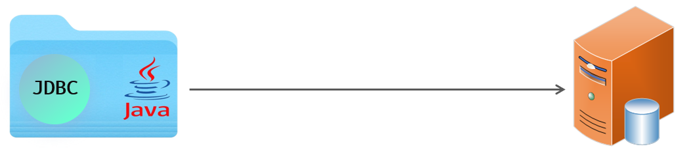

JDBC：（java DataBase Connectivity），就是sun公司提供的一套，使用java语言操作关系型数据库的一套API。 【是操作数据库最为基础、底层的技术】

但是使用JDBC来操作数据库，会比较繁琐，所以现在在企业项目开发中呢，一般都会使用基于JDBC的封装的高级框架，比如：Mybatis、MybatisPlus、Hibernate、SpringDataJPA。 

而这些技术，目前的市场占有份额如下图所示：

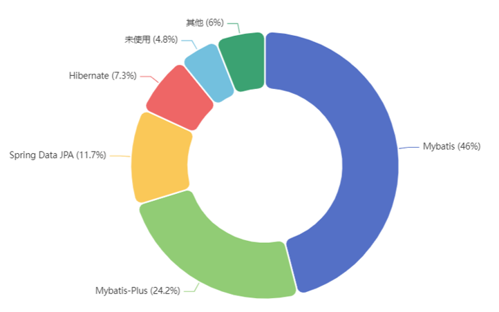

从上图中，我们也可以看到，目前最为主流的就是Mybatis，其次是MybatisPlus。

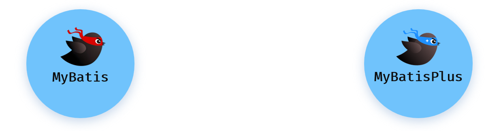

这两种主流的操作数据库的框架我们都要学习，那我们先来学习基于Mybatis框架如何来操作数据库，后面我们再来讲解基于MybatisPlus如何来操作数据库。

那首先，就先来认识一下什么是Mybatis。

## 2.介绍


Mybatis是一款优秀的持久层框架，用来简化JDBC的开发。

MyBatis本是 Apache的一个开源项目iBatis，2010年这个项目由apache迁移到了google code，并且改名为MyBatis 。2013年11月迁移到Github。

官网：https://mybatis\.org/mybatis\-3/zh/index\.html 

在上面我们提到了两个词：一个是持久层，另一个是框架。

持久层：指的是就是数据访问层\(dao\)，是用来操作数据库的。

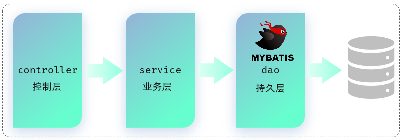

框架：是一个半成品软件，是一套可重用的、通用的、软件基础代码模型。在框架的基础上进行软件开发更加高效、规范、通用、可拓展。

通过Mybatis就可以大大简化原生的JDBC程序的代码编写，比如 通过 `select * from user` 查询所有的用户数据，通过JDBC程序操作呢，需要大量的代码实现，而如果通过Mybatis实现相同的功能，只需要简单的三四行就可以搞定。

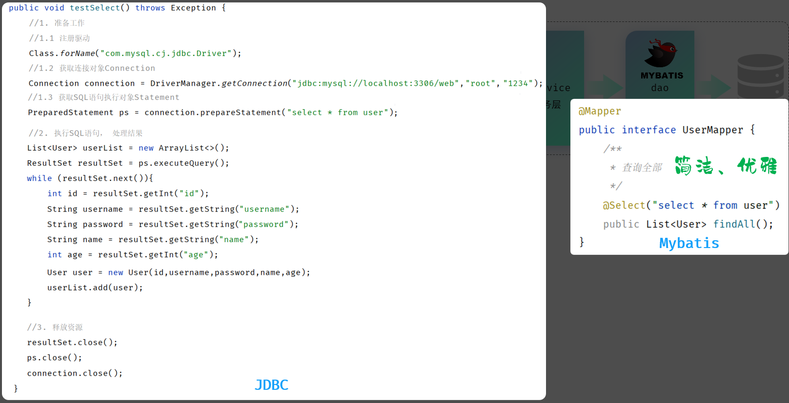

那通过对比，我们可以看到，Mybatis确实是可以大大的简化JDBC操作数据库的代码，更加简洁、更加优雅 。

# 二、Mybatis快速入门

需求：查询所有的用户信息，并输出到控制台。

## 1.分析

之前，我们都是在命令行 或者 datagrip这类的图形化界面工具中，连接并操作数据库中的数据。 那现在呢，我们要通过java程序来操作数据库，其实对应的原理都是类似的。

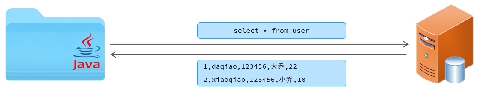

在java程序中操作数据库，我们也需要将对应的要执行的sql语句发送给数据库，数据库来执行这条sql语句，然后将执行完的结果再返回给应用程序。

而大家可以思考一下，现在java程序要操作数据库，来查询数据库中的数据。 那在java程序中要不要指定，要访问的是哪个数据库？ 执行的sql语句？以及查询结果该怎么封装？ 毫无疑问是需要的。

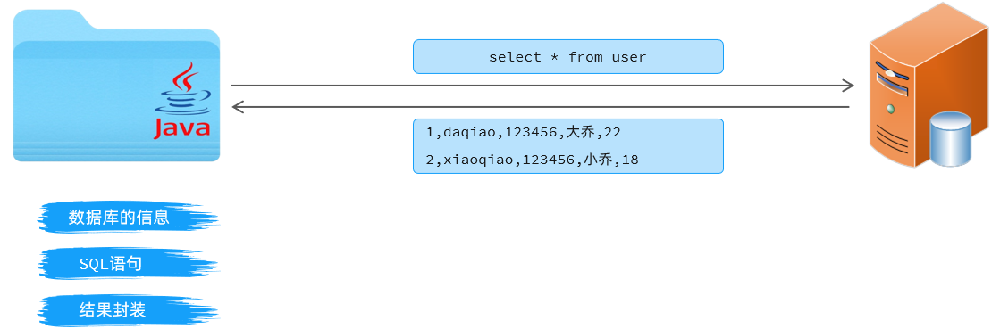

## 2.实现步骤

1.执行下方的sql语句创建`user`表：

```sql
-- 创建mybatis数据库
create database if not exists mybatis;
-- 使用mybatis数据库
use mybatis;
-- 创建usr表
create table user
(
    id       int unsigned primary key auto_increment comment 'ID,主键',
    username varchar(20) comment '用户名',
    password varchar(32) comment '密码',
    name     varchar(10) comment '姓名',
    age      tinyint unsigned comment '年龄'
) comment '用户表';
-- 批量添加数据
insert into user(id, username, password, name, age)
values (1, 'daqiao', '123456', '大乔', 22),
       (2, 'xiaoqiao', '123456', '小乔', 18),
       (3, 'diaochan', '123456', '貂蝉', 24),
       (4, 'lvbu', '123456', '吕布', 28),
       (5, 'zhaoyun', '12345678', '赵云', 27);
```

2.创建SpringBoot项目，勾选mybatis、mysql相关依赖，并手动引入lombok的依赖。

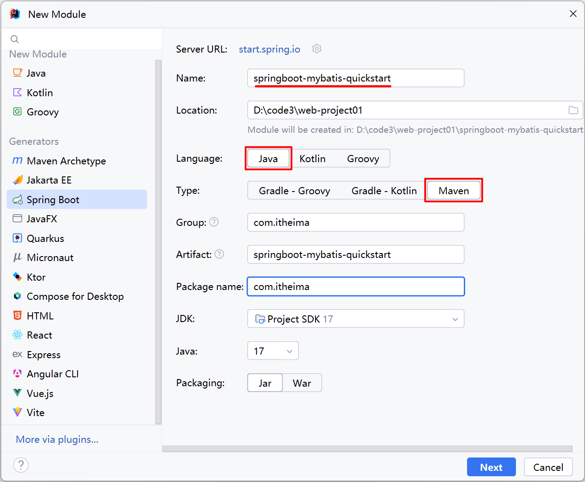

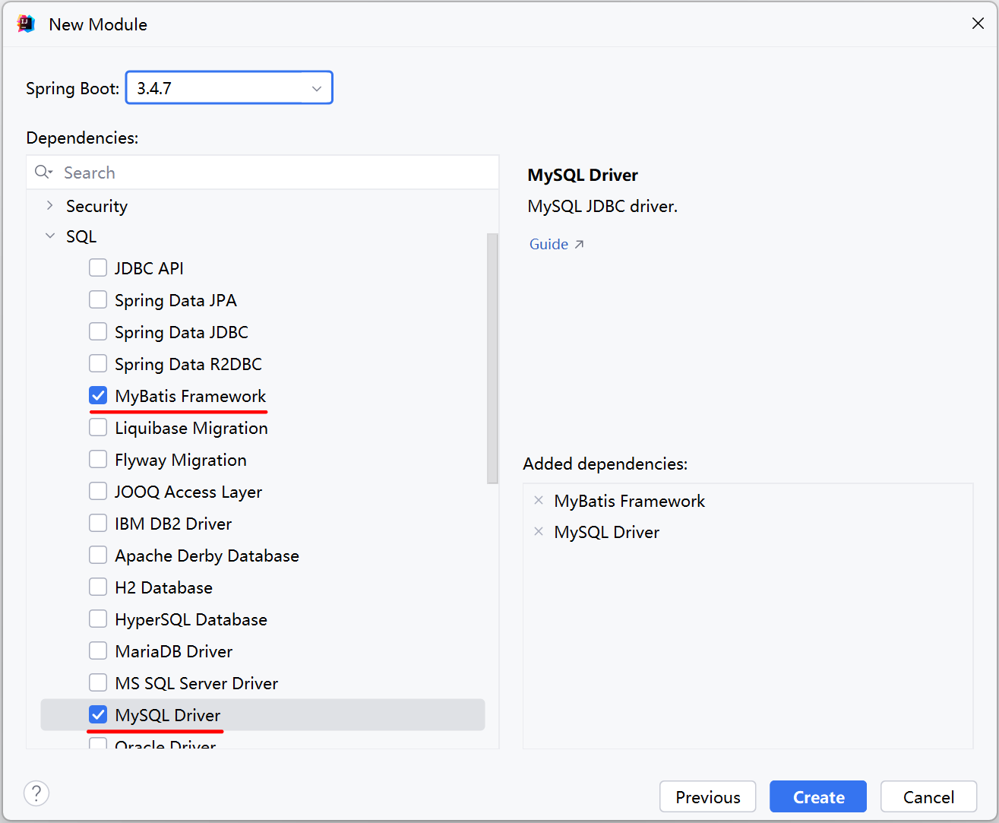

项目创建完毕后，在项目的`pom.xml`配置文件中，再引入`lombok`的依赖。最终`pom.xml`文件中的依赖配置如下：

```xml
<dependencies>
    <!--springboot 整合mybatis的起步依赖-->
    <dependency>
        <groupId>org.mybatis.spring.boot</groupId>
        <artifactId>mybatis-spring-boot-starter</artifactId>
        <version>3.0.5</version>
    </dependency>
    <!--mysql 依赖jar包-->
    <dependency>
        <groupId>com.mysql</groupId>
        <artifactId>mysql-connector-j</artifactId>
        <scope>runtime</scope>
    </dependency>
    <!--spring boot 单元测试-->
    <dependency>
        <groupId>org.springframework.boot</groupId>
        <artifactId>spring-boot-starter-test</artifactId>
        <scope>test</scope>
    </dependency>
    <!--mybatis的测试包，可以不要-->
    <dependency>
        <groupId>org.mybatis.spring.boot</groupId>
        <artifactId>mybatis-spring-boot-starter-test</artifactId>
        <version>3.0.5</version>
        <scope>test</scope>
    </dependency>
    <!--lombok-->
    <dependency>
        <groupId>org.projectlombok</groupId>
        <artifactId>lombok</artifactId>
    </dependency>
</dependencies>
```

mysql\-connector\-j : 这个是mysql数据库的驱动包，是由Mysql官方提供的，我们要操作Mysql数据库，就需要引入其驱动包。如果说，我们将来要操作的是Oracle数据库，那么要引入的驱动就是Oracle数据库的驱动。

> 注意：在创建springboot项目的时候，不要勾选lombok的依赖，需要在项目创建好之后，单独在pom\.xml文件中引入。
>
> 原因说明：springboot项目创建的时候，如果勾选了lombok的依赖，在创建springboot项目的时候，会在pom\.xml文件中引入额外的配置，会导致lombok中的注解不生效。
>

3.在`com.itheima`包下再创建一个包`entity`，用来存放实体类。

```java
package com.itheima.pojo;

import lombok.AllArgsConstructor;
import lombok.Data;
import lombok.NoArgsConstructor;

@Data
@NoArgsConstructor
@AllArgsConstructor
public class User {
    private Integer id; //ID
    private String username; //用户名
    private String password; //密码
    private String name; //姓名
    private Integer age; //年龄
}
```

代码结构如下: 

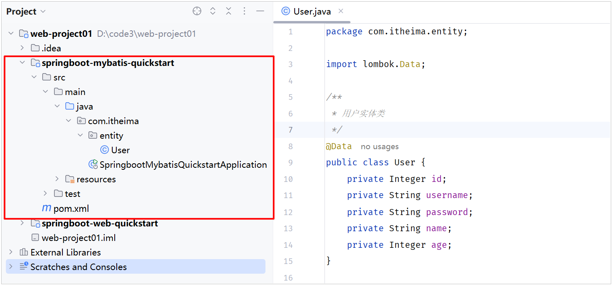

4.在`application.properties`中配置数据库连接的信息

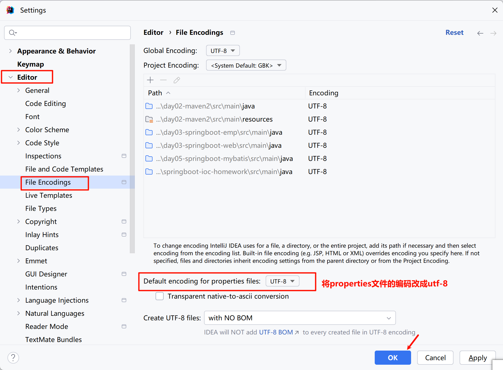

```properties
# 配置连接数据库的信息
# 数据库驱动类名
spring.datasource.driver-class-name=com.mysql.cj.jdbc.Driver
# 数据库连接路径
spring.datasource.url=jdbc:mysql://localhost:3306/mybatis
# 用户名
spring.datasource.username=root
# 密码
spring.datasource.password=1234
```

5.在`com.itheima`包下创建子包 `mapper`，定义`UserMapper`接口，基于注解的方式声明sql语句

```java
@Mapper //①、让mybatis给接口创建实现类对象（底层基于动态代理技术）。②、让spring将实现类对象保存到IOC容器中，将来可以使用@Autowired自动注入
public interface UserMapper {
    /**
     查询所有用户
     */
    @Select("select * from user")  //@Select注解配置查询语句
    public List<User> findAll();
}
```

注解说明：

@Mapper注解：表示是mybatis中的Mapper接口

程序运行时，框架会自动生成接口的实现类对象\(代理对象\)，并给交Spring的IOC容器管理

@Select注解：代表的就是select查询，用于书写select查询语句

代码结构如下: 

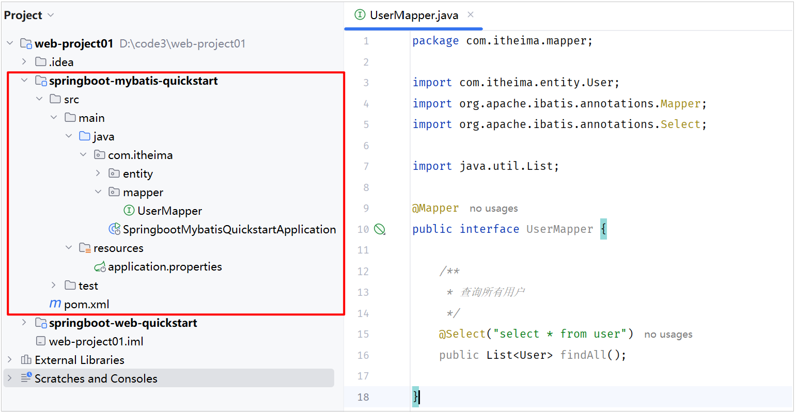

在Mybatis的开发规范中，这个持久层接口的命名规范为 XxxxMapper，Xxxx代表操作的模块名，所以这个接口我们也称为Mapper接口。

6.单元测试

在创建出来的SpringBoot工程中，在src下的`test`目录下，已经自动帮我们创建好了测试类 。

测试类代码如下：

```java
package com.itheima;

import com.itheima.entity.User;
import com.itheima.mapper.UserMapper;
import org.junit.jupiter.api.Test;
import org.springframework.beans.factory.annotation.Autowired;
import org.springframework.boot.test.context.SpringBootTest;

import java.util.List;

@SpringBootTest
class SpringbootMybatisQuickstartApplicationTests {

    @Autowired
    private UserMapper userMapper;

    @Test
    public void testFindAll() {
       List<User> userList = userMapper.findAll();
       userList.forEach(System.out::println);
    }
    
}
```

@SpringBootTest：测试类上已经添加了该注解 ，代表该测试类已经与SpringBoot整合。 该测试类在运行时，会自动通过引导类加载Spring的环境（IOC容器）。我们要测试那个bean对象，就可以直接通过`@Autowired`注解直接将其注入进行，然后就可以测试了。 

运行结果：

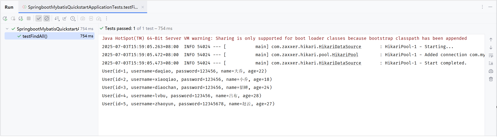

注意：测试类所在包，需要与引导类所在包相同（或者放在引导类所在包的子包下）。

## 3.Mybatis辅助配置

### 3.1.配置sql提示

默认我们在UserMapper接口上加的 `@Select` 注解中编写sql语句是没有提示的。 如果想让idea给我们提示对应的sql语句，我们需要在IDEA中配置与Mysql数据库的链接。 

默认我们在UserMapper接口上的 `@Select` 注解中编写sql语句是没有提示的。如果想让idea给出提示，可以做如下配置：`alt+enter---Inject language or reference--->搜索mysql`

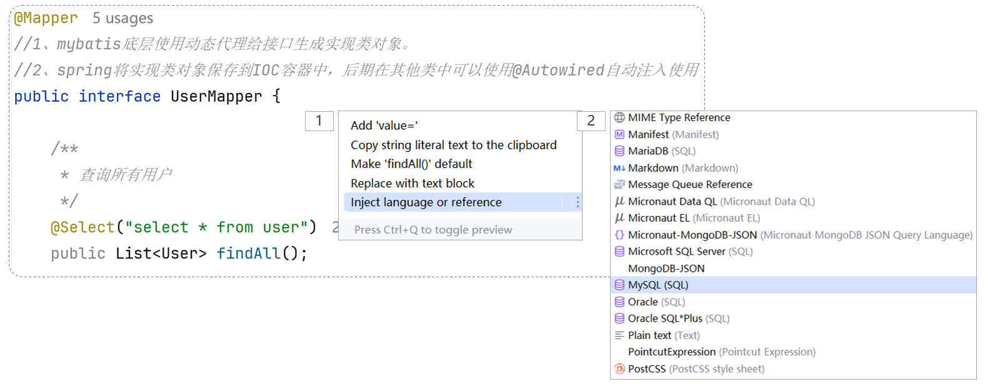

配置完成之后，发现sql语句中的关键字有提示了，但还存在不识别表名\(列名\)的情况：

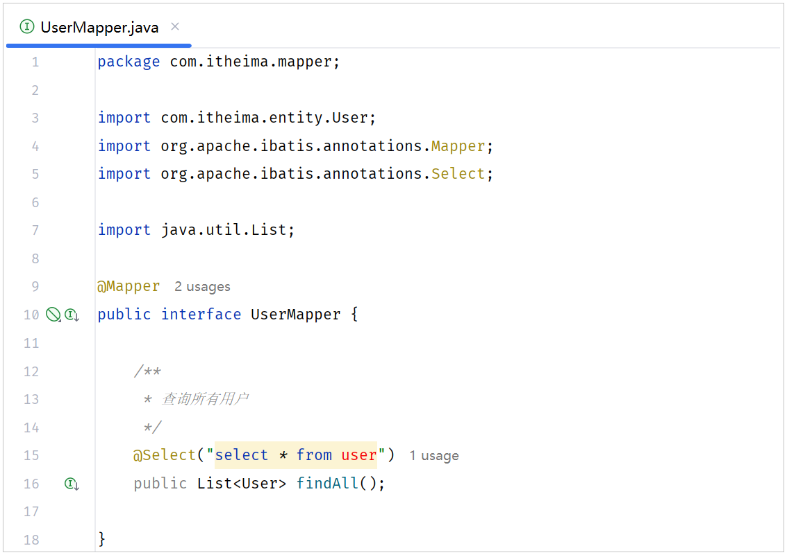

产生原因：Idea和数据库没有建立连接，不识别表信息

解决方案：在Idea中配置Mysql数据库连接

按照如下方如下方式，来配置当前IDEA关联的Mysql数据库（必须要指定连接的是哪个数据库）。

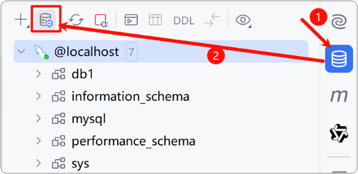

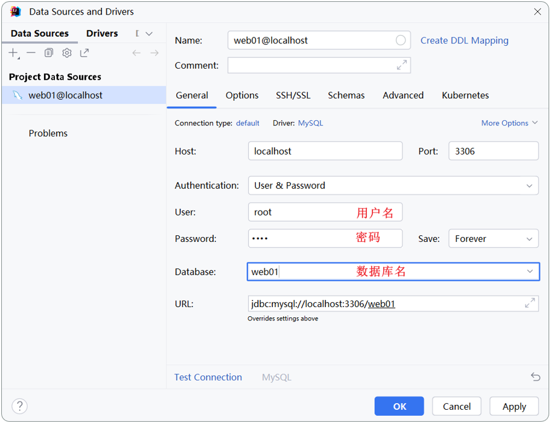

在配置的时候指定连接那个数据库，如上图所示连接的就是web01数据库（自己的数据库名是什么就指定什么）。

注意：该配置的目的，仅仅是为了在编写sql语句时，有语法提示（写错了会报错），不会影响运行，即使不配置也是可以的。

### 3.2.配置日志输出

默认情况下，在Mybatis中，sql语句执行时，我们并看不到sql语句的执行日志。 在`application.properties`加入如下配置，即可查看日志： 

```properties
#mybatis日志输出
mybatis.configuration.log-impl=org.apache.ibatis.logging.stdout.StdOutImpl
```

打开上述开关之后，再次运行单元测试，就可以看到控制台输出的sql语句是什么样子的。

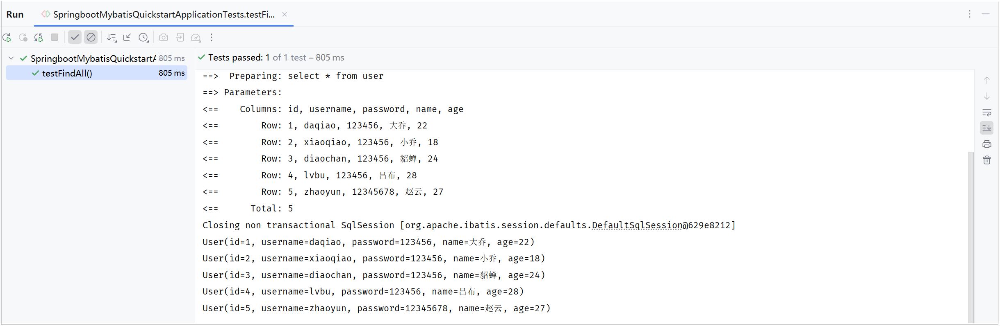

最终我们可以看到，在执行的时候，控制台会输出具体指定的sql语句，这样可以方便我们开发、调试，排查问题。

# 三、Mybatis基本操作

## 1.准备工作

在讲解Mybatis的增删改查操作的时候，我们将会操作另一张表 employee 员工表，所以这里需要在mapper包下再创建一个新的Mapper接口EmployeeMapper，并准备一个与 employee 表对应的实体类 Employee。

employee的表结构，就是我们前一天课程中用到的employee表。

具体表结构及测试数据如下:

```sql
-- 员工表
create table `employee` (
  `id` int unsigned primary key auto_increment comment '主键',
  `name` varchar(10) not null comment '姓名',
  `image` varchar(255) comment '头像',
  `gender` tinyint unsigned not null comment '性别, 1:男, 2:女',
  `job` tinyint unsigned comment '职位, 1:班主任, 2:讲师, 3:学工主管, 4:教研主管, 5:咨询师',
  `salary` int unsigned not null comment '薪资',
  `entry_date` date comment '入职日期',
  `create_time` datetime comment '创建时间',
  `update_time` datetime comment '更新时间'
)  comment '员工信息表';

INSERT INTO `employee` (`id`, `name`, `image`, `gender`, `job`, `salary`, `entry_date`, `create_time`, `update_time`) VALUES
       (1,'夫子','https://zxy-data.oss-cn-hangzhou.aliyuncs.com/icon/1.png',1,4,30000,'2005-08-19','2025-04-16 16:30:39','2025-04-16 16:30:39'),
       (2,'颜瑟','https://zxy-data.oss-cn-hangzhou.aliyuncs.com/icon/2.png',1,3,18000,'2010-03-22','2025-04-16 16:30:39','2025-04-16 16:30:39'),
       (3,'君陌','https://zxy-data.oss-cn-hangzhou.aliyuncs.com/icon/3.png',1,2,22000,'2015-09-01','2025-04-16 16:30:39','2025-04-16 16:30:39'),
       (4,'李慢慢','https://zxy-data.oss-cn-hangzhou.aliyuncs.com/icon/4.png',1,2,17000,'2018-12-25','2025-04-16 16:30:39','2025-04-16 16:30:39'),
       (5,'叶红鱼','https://zxy-data.oss-cn-hangzhou.aliyuncs.com/icon/1.png',2,2,21000,'2013-07-14','2025-04-16 16:30:39','2025-04-16 16:30:39'),
       (6,'柳白','https://zxy-data.oss-cn-hangzhou.aliyuncs.com/icon/2.png',1,2,13000,'2021-04-17','2025-04-16 16:30:39','2025-04-16 16:30:39'),
       (7,'余帘','https://zxy-data.oss-cn-hangzhou.aliyuncs.com/icon/3.png',2,2,14500,'2020-10-31','2025-04-16 16:30:39','2025-04-16 16:30:39'),
       (8,'宁缺','https://zxy-data.oss-cn-hangzhou.aliyuncs.com/icon/4.png',1,1,6800,'2022-06-11','2025-04-16 16:30:39','2025-04-16 16:30:39'),
       (9,'李渔','https://zxy-data.oss-cn-hangzhou.aliyuncs.com/icon/1.png',2,1,4500,'2024-02-28','2025-04-16 16:30:39','2025-04-16 16:30:39'),
       (10,'唐小棠','https://zxy-data.oss-cn-hangzhou.aliyuncs.com/icon/2.png',2,1,6000,'2017-05-09','2025-04-16 16:30:39','2025-04-16 16:30:39'),
       (11,'陈皮皮','https://zxy-data.oss-cn-hangzhou.aliyuncs.com/icon/3.png',1,1,4700,'2025-01-15','2025-04-16 16:30:39','2025-04-16 16:30:39'),
       (12,'桑桑','https://zxy-data.oss-cn-hangzhou.aliyuncs.com/icon/4.png',2,5,8000,'2023-08-08','2025-04-16 16:30:39','2025-04-16 16:30:39'),
       (13,'莫山山','https://zxy-data.oss-cn-hangzhou.aliyuncs.com/icon/1.png',2,5,6500,'2020-10-31','2025-04-16 16:30:39','2025-04-16 16:30:39'),
       (14,'隆庆','https://zxy-data.oss-cn-hangzhou.aliyuncs.com/icon/2.png',1,5,5500,'2016-09-22','2025-04-16 16:30:39','2025-04-16 16:30:39'),
       (15,'夏侯','https://zxy-data.oss-cn-hangzhou.aliyuncs.com/icon/3.png',1,5,7500,'2011-12-12','2025-04-16 16:30:39','2025-04-16 16:30:39'),
       (16,'曲妮','https://zxy-data.oss-cn-hangzhou.aliyuncs.com/icon/4.png',2,5,6800,'2024-06-01','2025-04-16 16:30:39','2025-04-16 16:30:39'),
       (17,'何明池','https://zxy-data.oss-cn-hangzhou.aliyuncs.com/icon/1.png',1,5,6200,'2019-03-19','2025-04-16 16:30:39','2025-04-16 16:30:39'),
       (18,'陆晨迦','https://zxy-data.oss-cn-hangzhou.aliyuncs.com/icon/2.png',2,5,5800,'2015-09-01','2025-04-16 16:30:39','2025-04-16 16:30:39'),
       (19,'唐王','https://zxy-data.oss-cn-hangzhou.aliyuncs.com/icon/3.png',1,5,6800,'2022-07-07','2025-04-16 16:30:39','2025-04-16 16:30:39'),
       (20,'卫光明','https://zxy-data.oss-cn-hangzhou.aliyuncs.com/icon/4.png',1,2,19000,'2009-11-11','2025-04-16 16:30:39','2025-04-16 16:30:39'),
       (21,'朝小树','https://zxy-data.oss-cn-hangzhou.aliyuncs.com/icon/1.png',1,2,18500,'2020-05-05','2025-04-16 16:30:39','2025-04-16 16:30:39'),
       (22,'夏天','https://zxy-data.oss-cn-hangzhou.aliyuncs.com/icon/2.png',2,1,5500,'2014-08-16','2025-04-16 16:30:39','2025-04-16 16:30:39'),
       (23,'钟大俊','https://zxy-data.oss-cn-hangzhou.aliyuncs.com/icon/3.png',1,1,5500,'2015-09-01','2025-04-16 16:30:39','2025-04-16 16:30:39'),
       (24,'柯浩然','https://zxy-data.oss-cn-hangzhou.aliyuncs.com/icon/4.png',2,2,21000,'2023-01-01','2025-04-16 16:30:39','2025-04-16 16:30:39'),
       (25,'齐四','https://zxy-data.oss-cn-hangzhou.aliyuncs.com/icon/1.png',1,1,6500,'2018-10-10','2025-04-16 16:30:39','2025-04-16 16:30:39'),
       (26,'叶苏','https://zxy-data.oss-cn-hangzhou.aliyuncs.com/icon/2.png',1,5,5200,'2025-03-03','2025-04-16 16:30:39','2025-04-16 16:30:39'),
       (27,'七念','https://zxy-data.oss-cn-hangzhou.aliyuncs.com/icon/3.png',2,5,5500,'2015-06-18','2025-04-16 16:30:39','2025-04-16 16:30:39'),
       (28,'程立雪','https://zxy-data.oss-cn-hangzhou.aliyuncs.com/icon/4.png',2,5,6000,'2012-09-09','2025-04-16 16:30:39','2025-04-16 16:30:39'),
       (29,'观主','https://zxy-data.oss-cn-hangzhou.aliyuncs.com/icon/1.png',1,2,21000,'2007-07-07','2025-04-16 16:30:39','2025-04-16 16:30:39'),
       (30,'熊初墨','https://zxy-data.oss-cn-hangzhou.aliyuncs.com/icon/2.png',1,5,7000,'2024-04-04','2025-04-16 16:30:39','2025-04-16 16:30:39'),
       (31,'水珠儿',NULL,2,1,5000,'2019-09-23','2025-04-16 16:30:39','2025-04-16 16:30:39'),
       (32,'徐崇山','https://zxy-data.oss-cn-hangzhou.aliyuncs.com/icon/3.png',1,NULL,13000,'2021-12-25','2025-04-16 16:30:39','2025-04-16 16:30:39'),
       (33,'司徒依兰','https://zxy-data.oss-cn-hangzhou.aliyuncs.com/icon/4.png',2,NULL,22500,'2013-03-21','2025-04-16 16:30:39','2025-04-16 16:30:39');
```

Employee实体类如下：

```java
/**
 * 员工实体类
 */
@Data
@NoArgsConstructor
@AllArgsConstructor
public class Employee {
    private Integer id; // ID
    private String name; // 姓名
    private String image; // 头像
    private Integer gender; // 性别
    private Integer job; // 职位
    private Integer salary; // 薪资
    private LocalDate entryDate; // 入职日期
    private LocalDateTime createTime; // 创建时间
    private LocalDateTime updateTime; // 更新时间
}
```

EmployeeMapper的基础代码如下：

```java
package com.itheima.mapper;

import org.apache.ibatis.annotations.Mapper;

@Mapper
public interface EmployeeMapper {
    
    
}
```

## 2.删除操作

### 2.1.基本实现

需求：根据ID删除用户信息

sql：`delete from employee where id = 5`;

Mapper接口方法：

方式一： 增、删、改操作，不需要返回值的，直接将方法返回值设置为 void。

```java
@Mapper
public interface EmployeeMapper {

    /**
     根据id查询员工
     #{id}：mybatis提供的参数占位符，id为占位符的名称。如果方法形参是普通类型(基本类型、包装类类型、String类型)，占位符的名称虽然可以任意写，但是一般写变量名，表示取这个变量的值。
     */
    @Delete("delete from employee where id=#{id}")
    void deleteById(Integer id);

}
```

> 在Mybatis中，我们可以通过参数占位符号 `#{...}` 来占位，在调用`deleteById`方法时，传递的参数值，最终会替换占位符。
>
> 将来要删除哪个id对应的员工，只需要在调用`deleteById`方法的时候，将ID值传递进来就可以了。
>

方式二：DML语句执行完毕，是有返回值的，返回值代表增删改影响的行数，可以返回一个Integer类型的值。如下：

```java
@Mapper
public interface EmployeeMapper {

    /**
     * 根据ID删除员工
     */
    @Delete("delete from employee where id = #{id}")
    public Integer deleteById(Integer id);

}
```

编写单元测试

```java
@SpringBootTest
class SpringbootMybatisQuickstartApplicationTests {
    
    @Autowired
    private EmployeeMapper employeeMapper;
    
    /**
     * 测试删除
     */
    @Test
    public void testDeleteById(){
       Integer count = employeeMapper.deleteById(30);
       System.out.println("影响的行数 = " + count);
    }
    
}
```

运行单元测试，结果如下：

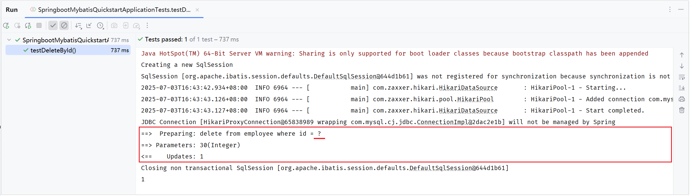

运行之后，我们发现，`#{...}` 占位符，其实最终被替换成了 ？占位符，这种sql语句，也称为预编译sql 。【性能高、安全，推荐方式】

如果执行的是预编译的sql，最终发送给数据库的内容，包含两个部分：

- sql语句：`delete from employee where id = ?`

- ？占位符对应的参数：`30`

最终，数据库在执行的时候，会使用传递过来的参数，将对应的？占位符替换掉 。

### 2.2.预编译sql

预编译sql是将sql语句模板\(含参数占位符\)提前发送给数据库编译优化，执行时只需传入具体的参数值的机制。

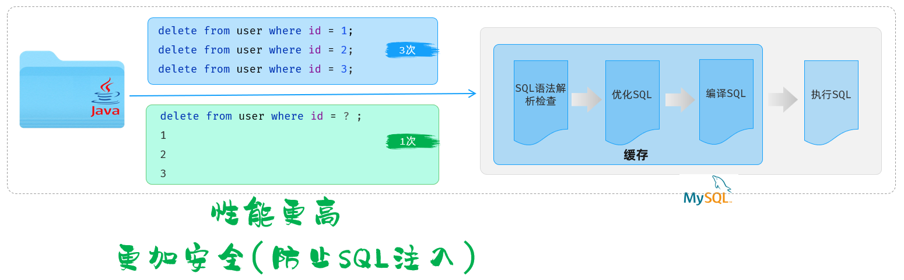

非预编译sql：

执行图中的三条sql语句，由于三条sql语句，都不一样，所以需要语法检查、优化、编译3次 ，性能不高。

预编译sql：

执行图中的sql语句（`delete from user where id = ?`），执行了三次，但是每一次执行的sql语句都是一样的，由于数据库中缓存的存在，所以只需要在第一次执行sql语句的时候，对sql进行语法检查、优化、编译即可，只要操作一次即可，性能更高。

预编译sql除了性能更高以外，还可以防止sql注入，更加安全。 那什么是sql注入呢，接下来，我们来介绍一下。

sql注入：通过控制输入来修改事先定义好的sql语句，以达到执行代码对服务器进行攻击的方法。

sql注入最典型的场景，就是用户登录功能。


注入演示：

1.打开课程资料中的文件夹 `资料/02. sql注入演示`，运行其中的jar包 `sql_Injection_demo-0.0.1-SNAPSHOT.jar`，进入该目录后，执行命令：

```java
java -jar sql_Injection_demo-0.0.1-SNAPSHOT.jar
```

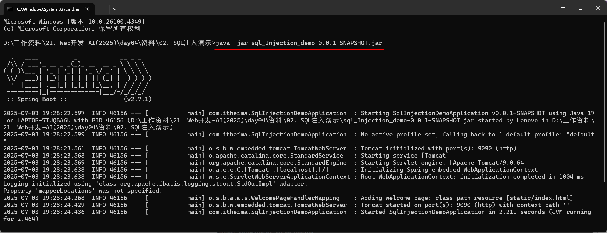

2.打开浏览器访问 `http://localhost:9090/` ，必须登录后才能访问到系统。我们先测试正常的用户名和密码


3.接下来，我们再来测试一下错误的用户名和密码 。


我们看到，如果用户名密码错误，是不能进入到系统中进行访问的，会提示 `用户名和密码错误`。

4.那接下来，我们就要演示一下sql注入现象，我们可以通过控制表单输入，来修改事先定义好的sql语句的含义。 从而来攻击服务器。

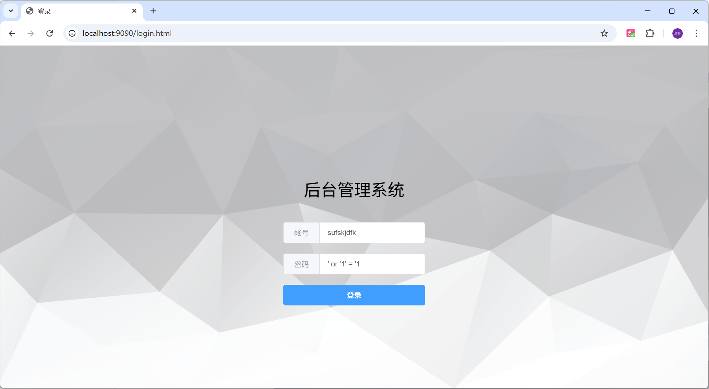

点击登录后，我们看到居然可以成功进入到系统中。

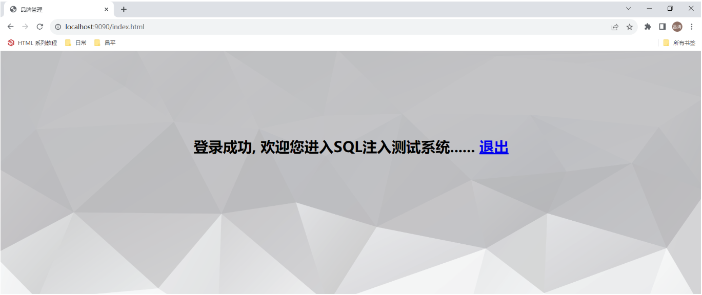

为什么会出现这种现象呢？

在进行登录操作时，怎么样才算登录成功呢？ 如果我们查询到了数据，就说明用户名密码是对的。 如果没有查询到数据，就说明用户名或密码错误。

而出现上述现象，原因就是因为，我们我们编写的sql语句是基于字符串进行拼接的 。 我们输入的用户名无所谓，比如：`shfhsjfhja` ，而密码呢，就是我们精心设计的，如：`' or '1' = '1` 。

那最终拼接的sql语句，如下所示：

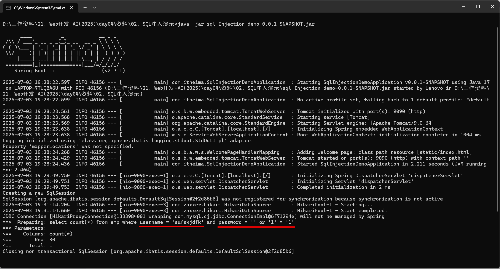

我们知道，`or` 连接的条件，是或的关系，两者满足其一就可以。 所以，虽然用户名密码输入错误，也是可以查询返回结果的，而只要查询到了数据，就说明用户名和密码是正确的。

sql注入解决

而通过预编译sql（`select * from emp where ``username = ? and password = ?`），就可以直接解决上述sql注入的问题。 接下来，我们再来演示一下，通过预编译sql是否能够解决sql注入问题。

1.打开资料中的文件夹 `资料/02. sql注入演示`，运行其中的jar包 `sql_prepared_demo-0.0.1-SNAPSHOT.jar`，进入该目录后，执行命令：

```java
java -jar sql_prepared_demo-0.0.1-SNAPSHOT.jar
```

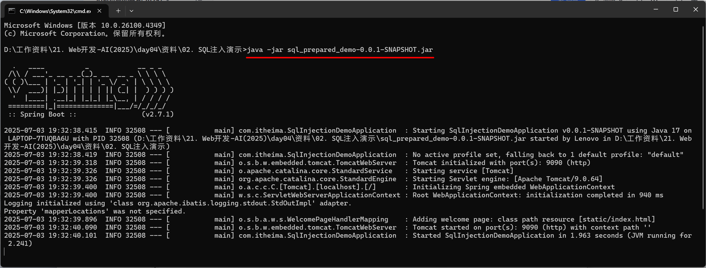

2.打开浏览器访问 `http://localhost:9090/` ，必须登录后才能访问到系统 。我们先测试正常的用户名和密码 


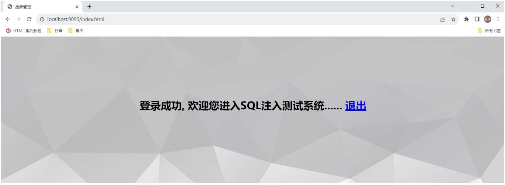

3.那接下来，我们就要演示一下是否可以基于上述的密码 `' or '1' = '1`，来完成sql注入 。

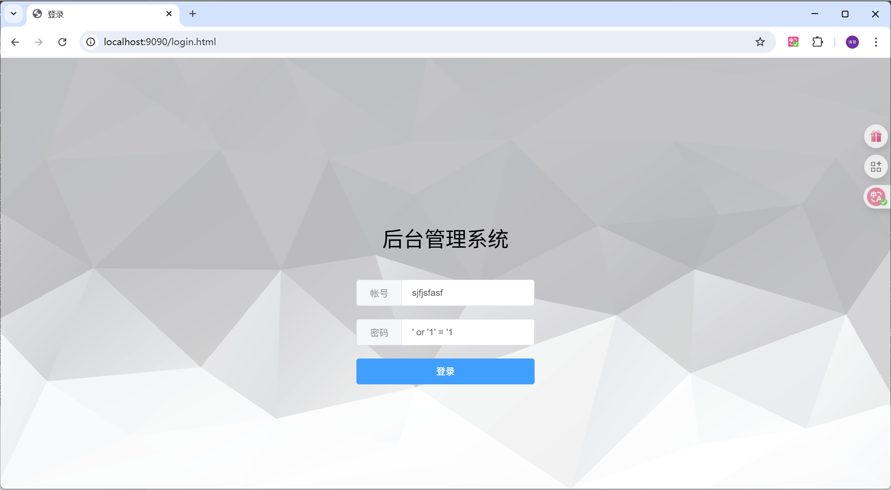

通过控制台，可以看到输入的sql语句，是预编译sql语句。

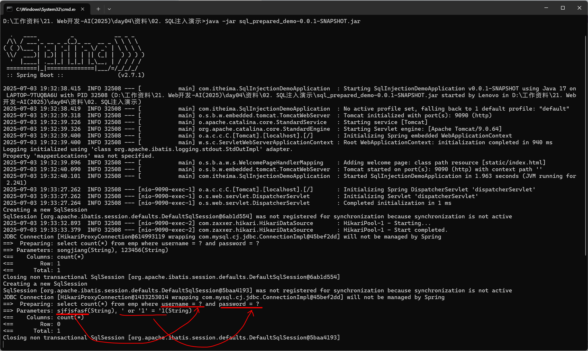

而在预编译sql语句中，当我们执行的时候，会把整个`' or '1'='1`作为一个完整的参数，赋值给第2个问号（`' or '1'='1`进行了转义，只当做字符串使用）

那么此时再查询时，就查询不到对应的数据了，登录失败。

### 2.3.Mybatis中的\#与$

Mybatis的提供的符号，有两个，一个是 `#{...}`，另一个是 `${...}`，区别如下：

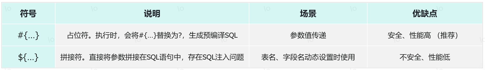

例如: 

- Mybatis中定义的sql为 `delete from employee where id = #{id}` ，最终执行的sql就是如下：`delete from employee where id = ?`;

- Mybatis中顶一顶sql为 `delete from employee where id = ${id}` ，最终执行的sql就是：`delete from employee where id = 5`;

> 注意：在以后的项目开发中，我们使用的基本全部都是预编译sql语句。 
>

## 3.新增操作

需求：添加一个员工

sql：`insert into employee(name, image, gender, job, salary, entry_date, create_time, update_time) values ('王姑娘', '1.jpg', 2, 1, 6500, '2023-01-01', '2025-07-01 00:00:00', '2025-07-01 00:00:00');`

Mapper接口：

```java
/**
 添加员工
 #{name}：当参数是对象是，#{}中占位符的名称必须是对象的属性名，表示获取该属性值，底层实际调用的是get方法获取值
 */
@Insert("insert into employee(name,image,gender,job,salary,entry_date,create_time,update_time) values(#{name},#{image},#{gender},#{job},#{salary},#{entryDate},#{createTime},#{updateTime})")
void insert(Employee employee);
```

如果在sql语句中，我们需要传递多个参数，我们可以把多个参数封装到一个对象中。然后在sql语句中，我们可以通过`#{对象属性名}`的方式，获取到对象中封装的属性值。

单元测试：

在测试类中添加测试方法，代码如下：

```java
/**
 * 测试添加
 */
@Test
void testInsert() {
    Employee employee = new Employee(null, "大王", "d:/image/a.jpg", 1, 1, 15000, LocalDate.now(), LocalDateTime.now(), LocalDateTime.now());
    employeeMapper.insert(employee);
}
```

运行结果如下：

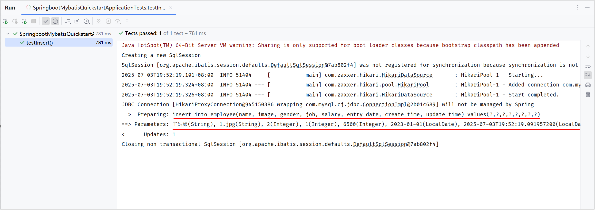

## 4.修改操作

需求：根据ID更新员工信息

sql：`update employee set name = '周姑娘', image = '2.jpg', gender = 1, job = 2, salary = 5800, entry_date = '2024-05-05', update_time = '2025-07-01 00:00:00' where id = 34;`

Mapper接口:

```java
/**
 * 根据ID更新员工
 */
@Update("update employee set name=#{name}, image=#{image}, gender=#{gender}, job=#{job}, salary=#{salary}, entry_date=#{entryDate}, update_time=#{updateTime} where id=#{id}")
public void update(Employee employee);
```

单元测试：

在测试类中添加测试方法，代码如下：

```java
/**
 * 测试修改
 */
@Test
void testUpdate() {
    Employee employee = new Employee(35, "张伟", "d:/image/b.jpg", 1, 2, 16000, LocalDate.now(), null, LocalDateTime.now());
    employeeMapper.update(employee);
}
```

运行结果如下：

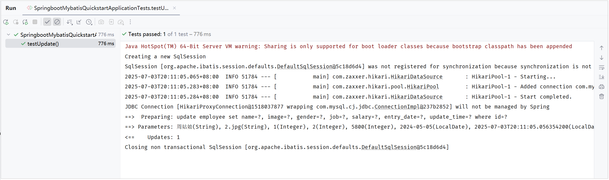

## 5.单条件查询

### 5.1.基本实现

需求：根据ID查询员工信息

sql：`select id, name, image, gender, job, salary, entry_date, create_time, update_time from employee where id = 1;`

Mapper接口：

```java
/**
 根据id查询员工
 问题：当查询结果的字段名和javabean的属性名一样，mybatis能自动封装结果到javabean中，如果不一样，就无法自动封装。
 原因：查询结果的字段名和javabean的属性名不一样。
 解决：
    解决1：给查询结果的字段名取别名，别名要和javabean的属性名一样。例如：entry_date AS entryDate
        应用场景：如果查询结果的字段名和javabean的属性名不满足驼峰命名规则，则需要使用起别名解决
    解决2：mybatis支持通过配置的方式开启驼峰命名映射。即entry_date--->entryDate
          mybatis.configuration.map-underscore-to-camel-case=true
 */
@Select("select id, name, image, gender, job, salary, entry_date, create_time, update_time from employee where id=#{id}")
//解决1：给查询结果的字段名取别名，别名要和javabean的属性名一样。例如：entry_date AS entryDate
//@Select("select id, name, image, gender, job, salary, entry_date AS entryDate, create_time createTime, update_time updateTime from employee where id=#{id}")
Employee findById(Integer id);
```

> 提示：由于根据ID（主键）查询，最多只会查询出一条数据，封装到一个对象中就可以了，所以返回值直接声明为Employee。
>

单元测试：

在测试类中添加测试方法，代码如下：

```java
/**
 * 根据id查询
 */
@Test
public void testFindById(){
    Employee employee = employeeMapper.findById(1);
    System.out.println(employee);
}
```

运行结果如下：

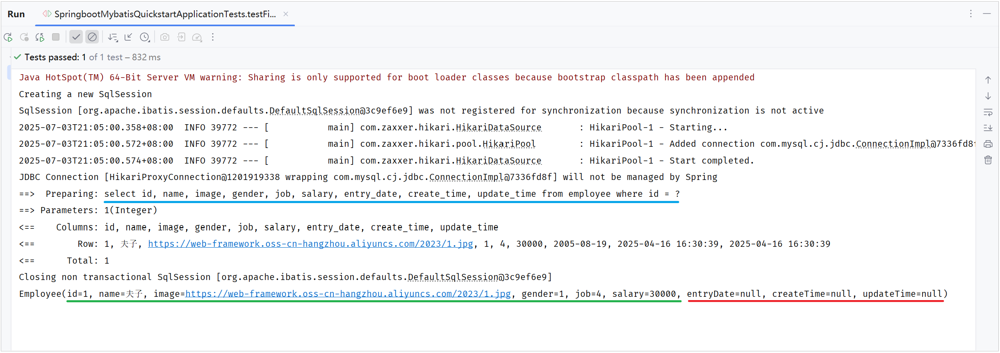

数据库中的数据：

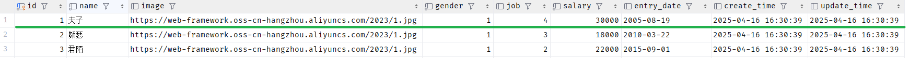

那通过测试我们可以发现，员工的信息确实是查询并且封装到了Employee对象当中了，但是大家会发现啊，数据库表中的id为1的数据是完整的，所有的字段都是有值的。然后查询返回的employee对象中，大家却发现，`id、name、image、gender、job、salary`属性是有值的，`entryDate、createTime、updateTime`这三个属性全部为null，也就意味着 `entry_date、create_time、update_time` 这几个字段的值并未成功封装。

这是为什么呢？原因啊，是因为查询返回的结果，是由Mybatis进行自动封装的，封装成了一个对象，而`entry_date、create_time、update_time` 这几个字段，是不符合Mybatis自动封装的规则的。

> 在Mybatis中，进行结果封装时，如果查询返回的字段名与实体类的属性名一致，框架会自动完成结果封装；如果不一致，就不能自动完成结果的封装。
>
> - `id、name、image、gender、job、salary`这几个字段的字段名与属性名一致，所以可以成功封装。
>
> - `entry_date、create_time、update_time` 这几个字段的字段名与属性名（`entryDate、createTime、updateTime`）不一致，所以并未成功封装。
>
> 那常见的解决方案有两种： ①\. 起别名；②\. 开启驼峰命名
>

### 5.2.结果封装

1.起别名

在sql语句中，对不一样的列名起别名，别名和实体类属性名一样。

```java
/**
 * 根据ID查询员工
 */
@Select("select id, name, image, gender, job, salary, entry_date entryDate, create_time createTime, update_time updateTime from employee where id = #{id}")
public Employee findById(Integer id);
```

再次执行单元测试，效果如下：

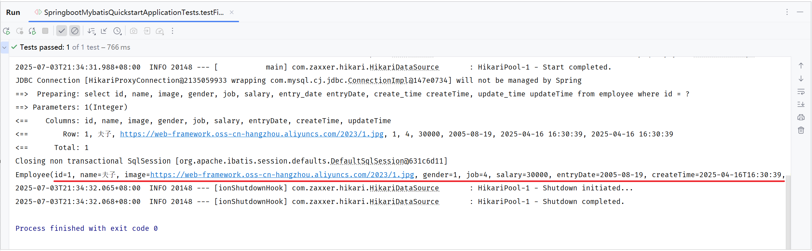

所有的字段值，全部都查询封装成功了。 

2.开启驼峰命名 \(推荐\)

如果字段名与属性名符合驼峰命名规则，mybatis会自动通过驼峰命名规则映射。驼峰命名规则：   abc\_xyz    =\>   abcXyz

- 表中字段名：abc\_xyz

- 类中属性名：abcXyz

在application\.properties中做如下配置，开启开关。

```properties
#驼峰命名映射开关
mybatis.configuration.map-underscore-to-camel-case=true
```

再次执行单元测试，效果如下：

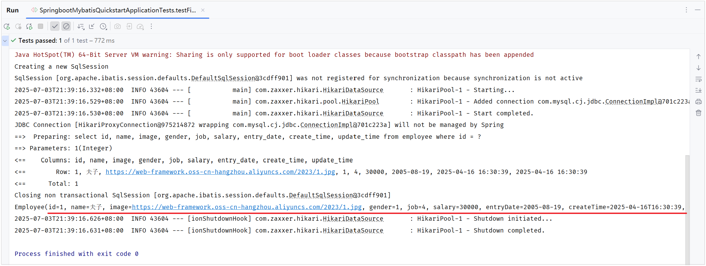

所有的字段值，全部都查询封装成功了。

> 要使用驼峰命名前提是 实体类的属性 与 数据库表中的字段名严格遵守驼峰命名。而在项目开发中，我们实体类的属性 与 数据库表中的字段名基本全部都是遵守驼峰命名的，所以这也是项目开发的推荐方式。（一劳永逸）
>

## 6.多条件查询

需求：根据姓名、性别、职位查询员工信息

sql：`select id, name, image, gender, job, salary, entry_date, create_time, update_time from employee where name like '%李%' and gender = 1 and job = 2;`

Mapper接口：

```java
/**
 多条件查询员工。需求：根据姓名（模糊查询）、性别、职位查询员工信息
 concat('%',#{name},'%')：拼接给定的参数值为一个字符串。
 */
@Select("select * from employee where name like concat('%',#{name},'%') and gender=#{gender} and job=#{job}")
List<Employee> findByNameAndGenderAndJob(String name, Integer gender, Integer job);
```

如果是基于阿里云脚手架创建的SpringBoot项目，需要给形参添加`@Param`注解，作用是为接口的方法形参起名字的，作为sql中\#\{\}占位符的名字。

```java
/**
 多条件查询员工。需求：根据姓名（模糊查询）、性别、职位查询员工信息
 concat('%',#{name},'%')：拼接给定的参数值为一个字符串。
 */
@Select("select * from employee where name like concat('%',#{name},'%') and gender=#{gender} and job=#{job}")
List<Employee> findByNameAndGenderAndJob(@Param("name") String name, @Param("gender") Integer gender, @Param("job") Integer job);
```

> 提示：`@param`注解的作用是为接口的方法形参起名字的 ，参数通过`@Param`注解指定的名字后，在`#{}`里面写的就是我们通过注解所制定的名字。

> 说明：对于阿里云脚手架创建的项目，默认情况下，接口中定义的方法在编译成class字节码文件后，形参名称将不会被保留,使用的是（`var1, var2...`类似这样），所以需要通过@Param注解来指定每一个参数的名字。 但是基于官方骨架创建的springboot项目中，接口编译时会保留方法形参名，所以`@Param`注解可以省略 \(`#{形参名}`\)。
>

> 注意：
>
> - `#{...}` 是占位符，不能够出现在引号之内，如果出现在引号之内（如：`name like '%#{name}%'`），会被认为就是一个普通的字符串，而不是占位符。
>
> - 而`${...}`是可以出现在引号里的，因为`${...}`就是专门用来拼接字符串的。
>
> - 编写单元测试，单元测试代码如下：
>

```java
/**
 * 根据条件查询
 */
@Test
public void testFindByNameAndGenderAndJob(){
    List<Employee> list= employeeMapper.findByNameAndGenderAndJob("李", 1, 2);
    list.forEach(employee -> System.out.println(employee));
}
```

运行之后效果如下：

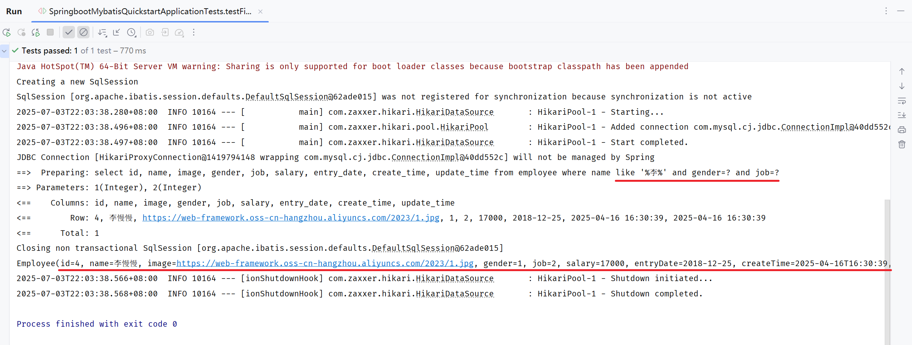

在输出的日志中，我们可以看到查询条件中 name 这个条件对应的值 （`name like '%李%'`）直接拼接在了sql语句中，这种方式并未预编译sql，性能不高，而且存在sql注入的风险。

优化方案：

```java
/**
 * 根据姓名、性别、职位查询员工信息
 */
@Select("select id, name, image, gender, job, salary, entry_date, create_time, update_time from employee where name like concat('%', #{name}, '%') and gender=#{gender} and job=#{job}")
public List<Employee> findByNameAndGenderAndJob(@Param("name") String name, @Param("gender") Integer gender, @Param("job") Integer job);
```

> `concat(str1, str2, str3)` 是Mysql中用于做字符串拼接的函数，可以将多个字符串拼接在一起。

再次运行单元测试，运行之后效果如下：

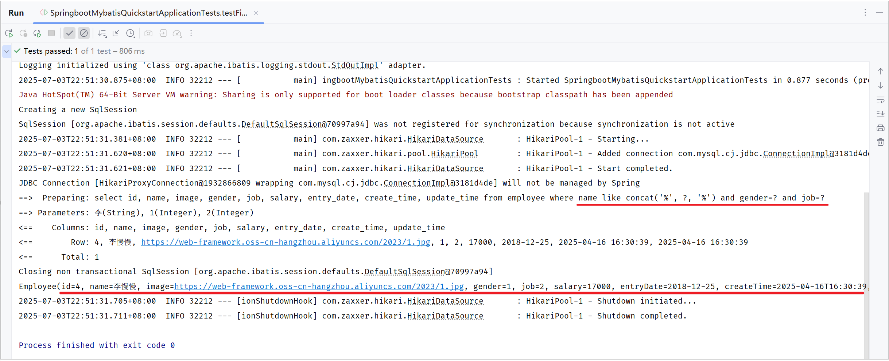

此时，我们可以看到生成的sql就是预编译sql，并且数据也可以正常的查询出来。

# 四、Mybatis映射配置

Mybatis的开发有两种方式：①\. 注解 ；②\. xml 。

## 1.xml配置文件规范

使用Mybatis的注解方式，主要是来完成一些简单的增删改查功能。如果需要实现复杂的sql功能，建议使用xml来配置映射语句，也就是将sql语句写在xml配置文件中。

> 在Mybatis中使用xml映射文件方式开发，需要符合一定的规范：
>
> 1. xml映射文件的名称与Mapper接口名称一致，并且将xml映射文件和Mapper接口放置在相同包下（同包同名）
>
> 2. xml映射文件的namespace属性为Mapper接口全限定名一致
>
> 3. xml映射文件中sql语句的id与Mapper接口中的方法名一致，并保持返回类型一致。
>

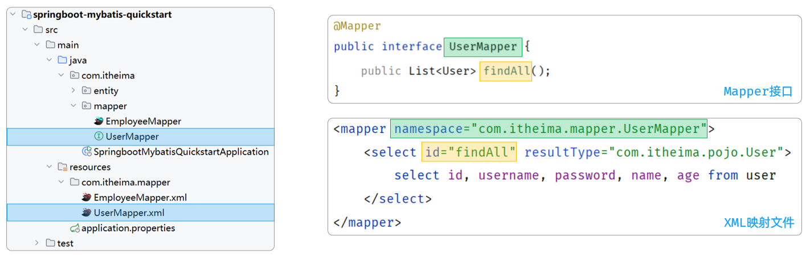

> `<select>`标签：就是用于编写select查询语句的。
>
> resultType属性，指的是查询返回的单条记录所封装的类型。

## 2.xml配置文件实现

1.在resources目录下创建一个目录，与Mapper接口所在包的目录一致。

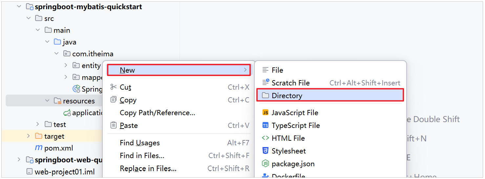

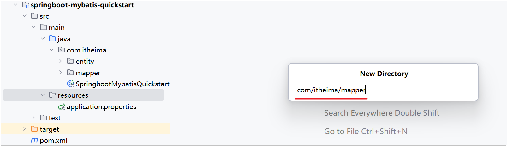

> 注意：由于创建的是目录，目录之间的分隔符使用 / ，而不是 com\.itheima\.mapper。
>

创建完毕后的效果:

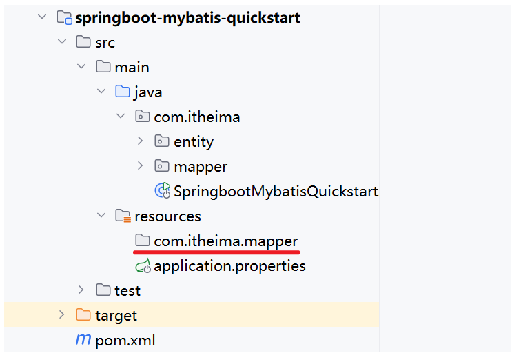

2.在 `com/itheima/mapper` 目录下创建配置文件 `EmployeeMapper.xml`，并引入xml的基础骨架配置

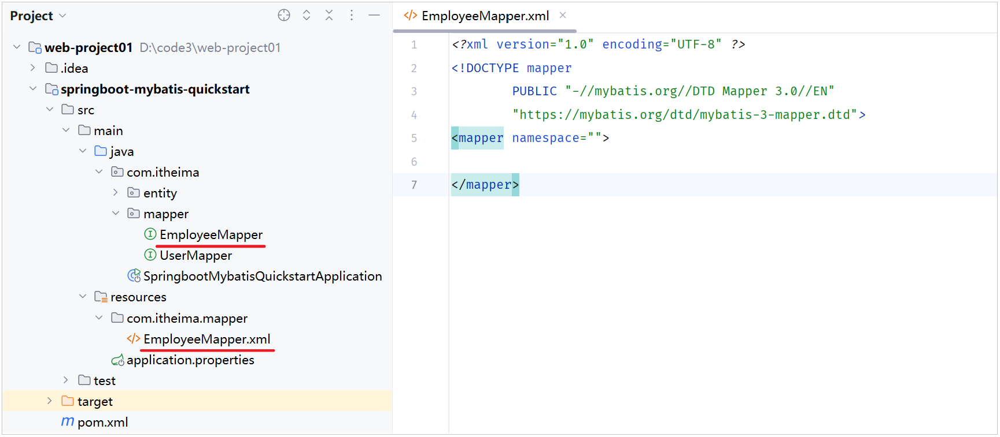

```xml
<?xml version="1.0" encoding="UTF-8" ?>
<!DOCTYPE mapper
        PUBLIC "-//mybatis.org//DTD Mapper 3.0//EN"
        "https://mybatis.org/dtd/mybatis-3-mapper.dtd">
<mapper namespace="">

</mapper>
```

> 注意：映射配置文件的名字一定要和接口名保持一致，一个字母都不能差。这个xml映射文件的基本结构，可参照官方文档：[https://mybatis.net.cn/getting-started.html](https://mybatis.net.cn/getting-started.html)
>

3.配置namespace属性为Mapper接口的全限定名

```xml
<?xml version="1.0" encoding="UTF-8" ?>
<!DOCTYPE mapper
        PUBLIC "-//mybatis.org//DTD Mapper 3.0//EN"
        "https://mybatis.org/dtd/mybatis-3-mapper.dtd">
<mapper namespace="com.itheima.mapper.EmployeeMapper">

</mapper>
```

4.xml映射文件中sql语句的id与Mapper接口中的方法名一致，并保持返回类型一致

那这里呢，我们就将刚才完成的根据条件查询员工信息的sql，配置在xml文件中。

Mapper接口方法：

```java
//@Select("select id, name, image, gender, job, salary, entry_date, create_time, update_time from employee where id=#{id}")
Employee findById(Integer id);

/**
 * 根据姓名、性别、职位查询员工信息
 */
//@Select("select id, name, image, gender, job, salary, entry_date, create_time, update_time from employee where name like concat('%', #{name}, '%') and gender=#{gender} and job=#{job}")
public List<Employee> findByNameAndGenderAndJob(String name,Integer gender, Integer job);
```

xml配置文件：

```xml
<?xml version="1.0" encoding="UTF-8" ?>
<!DOCTYPE mapper
        PUBLIC "-//mybatis.org//DTD Mapper 3.0//EN"
        "https://mybatis.org/dtd/mybatis-3-mapper.dtd">
<mapper namespace="com.itheima.mapper.EmployeeMapper">

    <!-- 在这里编写SQL语句 -->
    <!--    Employee findById(Integer id);
        id="findById"：当前文件中SQL的唯一表示，要和方法名一样。namespace+id唯一确定一条SQL对应的方法
        resultType="com.itheima.entity.Employee"：告诉mybatis将查到的每一行数据要封装的类型。
    -->
    
    <select id="findById" resultType="com.itheima.entity.Employee">
        select * from employee where id=#{id}
    </select>
    
    <!--@Select("select * from employee where name like concat('%',#{name},'%') and gender=#{gender} and job=#{job}")
    List<Employee> findByNameAndGenderAndJob(String name, Integer gender, Integer job);-->
    <select id="findByNameAndGenderAndJob" resultType="com.itheima.entity.Employee">
        select * from employee where name like concat('%',#{name},'%') and gender=#{gender} and job=#{job}
    </select>

</mapper>
```

> 提示：`<select>`标签中的 `resultType` 属性的值，与查询返回的单条记录封装的类型一致。
>

> 注意：Mybatis 中的sql语句，要么基于注解配置，要么基于xml配置，只能二选一，不能同时配置，否则将会报错。
>

配置完毕后，运行单元测试效果如下：

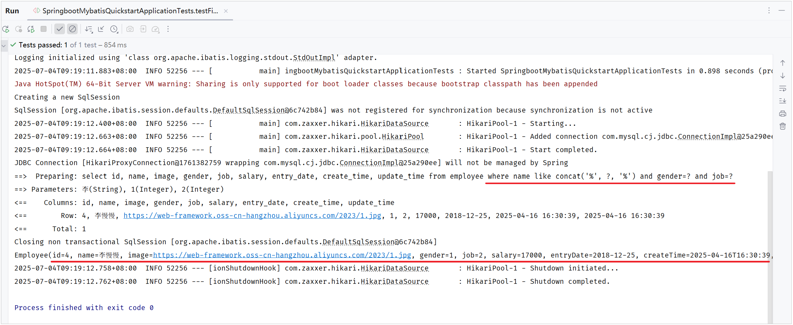

> 学习了Mybatis中xml配置文件的开发方式了，大家可能会存在一个疑问：到底是使用注解方式开发还是使用xml方式开发？

官方说明：https://mybatis\.net\.cn/getting\-started\.html。下面是官方说明:

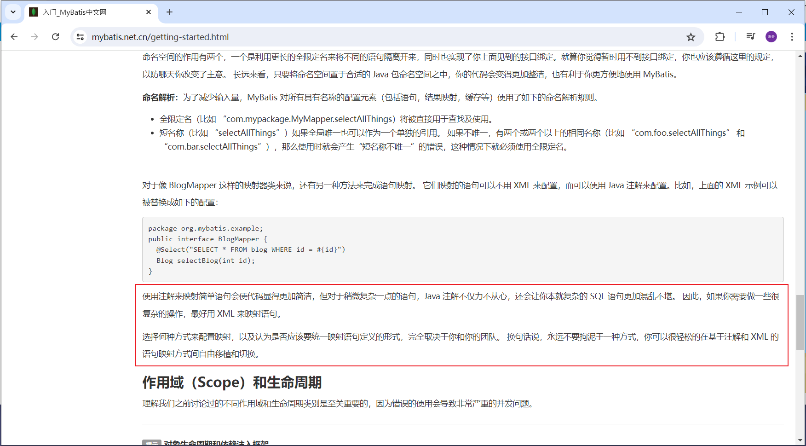

结论：使用Mybatis的注解，主要是来完成一些简单的增删改查功能。如果需要实现复杂的sql功能，建议使用xml来配置映射语句。

## 3.动态条件查询

```xml
<?xml version="1.0" encoding="UTF-8" ?>
<!DOCTYPE mapper
        PUBLIC "-//mybatis.org//DTD Mapper 3.0//EN"
        "https://mybatis.org/dtd/mybatis-3-mapper.dtd">
<mapper namespace="com.itheima.mapper.EmployeeMapper">

    <!--resultType: 查询结果中单行数据的要封装的类型-->
    <select id="findByNameAndGenderAndJob" resultType="com.itheima.entity.Employee">
        select id, name, image, gender, job, salary, entry_date, create_time, update_time from employee 
        where name like concat('%', #{name}, '%') and gender=#{gender} and job=#{job}
    </select>

</mapper>
```

之前我们编写的条件查询员工信息的sql语句，是固定死的查询条件。那接下来，我们可以将其改造成为动态变化的sql，简称动态sql。

> 动态sql：指sql语句随着外部传入的条件变化而变化的sql。
>

改造之后的形式如下：

```xml
<!--@Select("select * from employee where name like concat('%',#{name},'%') and gender=#{gender} and job=#{job}")
List<Employee> findByNameAndGenderAndJob(String name, Integer gender, Integer job);
<where>：只会在有成立的if条件时，才会被转换成wHERE关键字，而且还会自动去除第一个条件前面多余的and/or。
<if>：条件判断，在test属性中指定的条件成立时，才会拼接对应的sQL片段，test中判断的名称为占位符中的名称。
-->
<select id="findByNameAndGenderAndJob" resultType="com.itheima.entity.Employee">
    select id, name, image, gender, job, salary, entry_date, create_time, update_time from employee
    <where>
        <if test="name!=null and name!=''">
            name like concat('%',#{name},'%')
        </if>
        <if test="gender!=null">
            and gender=#{gender}
        </if>
        <if test="job!=null">
            and job=#{job}
        </if>
    </where>
</select>
```

> 动态sql标签：
>
> - `<where>`：只会在有成立的if条件时，才会插入WHERE子句，而且还会自动去除第一个条件前面多余的and/or。
>
> - `<if>`：条件判断，在test属性中指定的条件成立时，才会拼接对应的sql片段。
>

## 4.分页查询

如下图所示，我们在做查询时，如果查到的结果非常多，我们还需要进行分页。

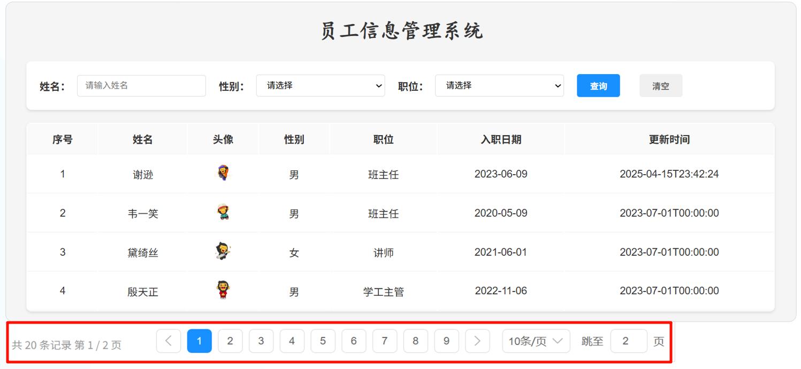

我们回顾一下分页查询的sql语句：

```sql
select * from employee where name like concat('%',#{name},'%') and gender = #{gender} and job = #{job} limit #{start},#{pageSize} ;
```

问题：如果我们在sql中直接使用limit关键字做分页查询，将来一旦换了数据库，我们的程序是否有问题？

有问题。limit是Mysql的方言，不同的数据库使用的分页关键字不一样。所以最好能够根据不同的数据库使用不同的分页关键字。自己判断实现很麻烦，这里就给大家介绍一个PageHelper分页助手。

PageHelper是第三方提供的Mybatis框架的分页插件，用来简化分页查询操作，提高开发效率。

官网地址：https://pagehelper\.github\.io/

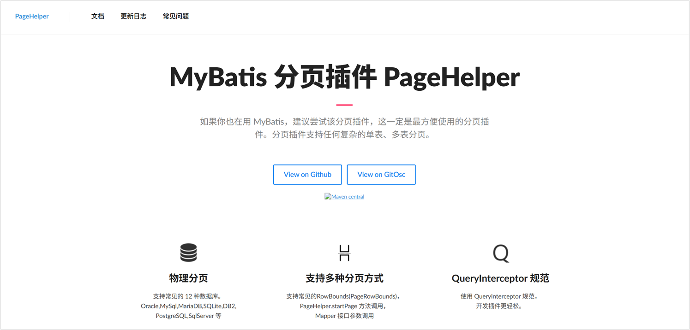

使用步骤如下：

第一步：引入PageHelper分页插件依赖

```xml
<!--pagehelper分页助手-->
<dependency>
    <groupId>com.github.pagehelper</groupId>
    <artifactId>pagehelper-spring-boot-starter</artifactId>
    <version>2.1.0</version>
</dependency>
```

第二步：定义Mapper接口实现条件查询\(sql语句中无需写limit\)【使用之前的多条件查询的方法即可】

```java
List<Employee> findByNameAndGenderAndJob(String name, Integer gender, Integer job);
```

```xml
<!--@Select("select * from employee where name like concat('%',#{name},'%') and gender=#{gender} and job=#{job}")
List<Employee> findByNameAndGenderAndJob(String name, Integer gender, Integer job);
<where>：只会在有成立的if条件时，才会被转换成wHERE关键字，而且还会自动去除第一个条件前面多余的and/or。
<if>：条件判断，在test属性中指定的条件成立时，才会拼接对应的sQL片段，test中判断的名称为占位符中的名称。
-->
<select id="findByNameAndGenderAndJob" resultType="com.itheima.entity.Employee">
    select id, name, image, gender, job, salary, entry_date, create_time, update_time from employee
    <where>
        <if test="name!=null and name!=''">
            name like concat('%',#{name},'%')
        </if>
        <if test="gender!=null">
            and gender=#{gender}
        </if>
        <if test="job!=null">
            and job=#{job}
        </if>
    </where>
</select>
```

第三步：在service/测试类中调用PageHelper提供的API实现分页操作。

```java
//测试多条件分页查询
@Test
void testFindByNameAndGenderAndJobLimit() {
    //1 设置分页参数(当前页码和每页条数)
    PageHelper.startPage(2,5);

    //2 调用mapper层方法，如果上方设置了分页参数，此处就是分页查询，如果没有设置就不是分页查询
    //不传任何条件的SQL：select * from employee limit 2,5
    Page<Employee> page = (Page<Employee>) employeeMapper.findByNameAndGenderAndJob(null, null, null);

    //3 获取分页结果并打印
    long total = page.getTotal();  //总记录数
    System.out.println("总记录数 = " + total);
    List<Employee> list = page.getResult();  //当前页数据
    list.forEach(employee -> System.out.println(employee));
}
```

## 5.xml映射文件辅助配置

1.指定xml映射文件路径

如果xml映射配置文件，存放路径，没有按照规范放在与Mapper接口相同的包下。

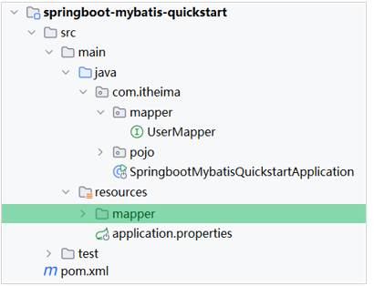

此时我们就需要做如下额外的配置，来制定xml映射文件的位置。

```xml
#指定xml映射配置文件的位置
mybatis.mapper-locations=classpath:mapper/*.xml
```

2.MybatisX插件

MybatisX是一款基于IDEA的快速开发Mybatis的插件，为效率而生。MybatisX的安装：


可以通过MybatisX快速定位：

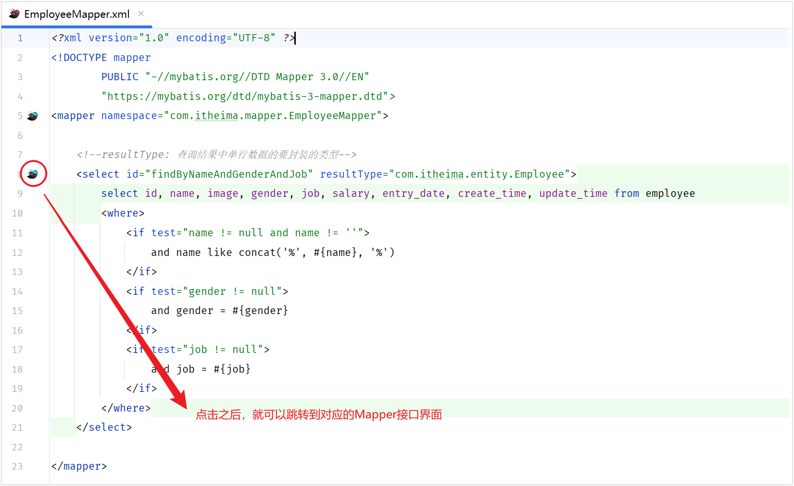

# 五、SpringBoot配置文件

## 1.介绍

前面我们一直使用springboot项目创建完毕后自带的`application.properties`进行属性的配置，而如果在项目中，我们需要配置大量的属性，采用properties配置文件这种 `key=value` 的配置形式，就会显得配置文件的层级结构不清晰，也比较臃肿。


那其实呢，在springboot项目当中是支持多种配置方式的，除了支持properties配置文件以外，还支持另外一种类型的配置文件，就是我们接下来要讲解的yml格式的配置文件。yml格式配置文件名字为：`application.yaml` , `application.yml` 这两个配置文件的后缀名虽然不一样，但是里面配置的内容形式都是一模一样的。

我们可以来对比一下，采用 `application.properties` 和 `application.yml` 来配置同一段信息\(数据库连接信息\)，两者之间的配置对比：

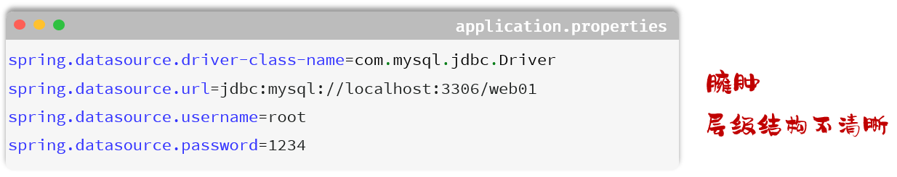

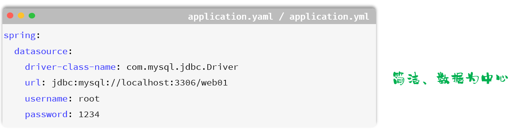

在项目开发中，我们推荐使用application\.yml配置文件来配置信息，简洁、明了、以数据为中心。

## 2.语法

简单的了解过springboot所支持的配置文件，以及不同类型配置文件之间的优缺点之后，接下来我们就来了解下yml配置文件的基本语法：

- 大小写敏感

- 数值前边必须有空格，作为分隔符

- 使用缩进表示层级关系，缩进时，不允许使用Tab键，只能用空格（idea中会自动将Tab转换为空格）

- 缩进的空格数目不重要，只要相同层级的元素左侧对齐即可

- `#`表示注释，从这个字符一直到行尾，都会被解析器忽略

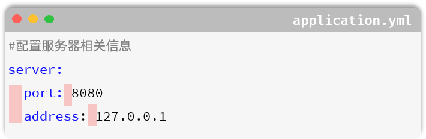

了解完yml格式配置文件的基本语法之后，接下来我们再来看下yml文件中常见的数据格式。在这里我们主要介绍最为常见的两类：

- 定义对象或Map集合

- 定义数组、list或set集合

对象/Map集合

```YAML
user:
  name: zhangsan
  age: 18
  password: 123456
```

数组/List/Set集合

```YAML
hobby: 
  - java
  - game
  - sport
```

> 在yml格式的配置文件中，如果配置项的值是以 0 开头的，值需要使用 '' 引起来，因为以0开头在yml中表示8进制的数据。
>

## 3.案例

熟悉完了yml文件的基本语法后，我们修改下之前案例中使用的配置文件，变更为application\.yml配置方式：

1. 修改application\.properties名字为：`_application.properties`（名字随便更换，只要加载不到即可）

2. 创建新的配置文件： `application.yml`

原有的 `application.properties` 配置文件

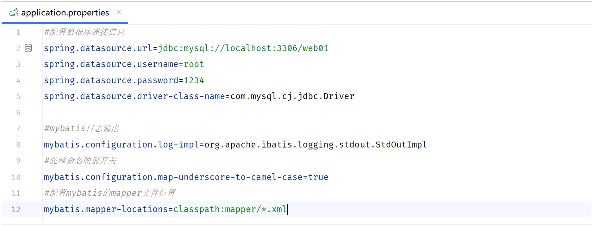

新建的 `application.`yml 配置文件

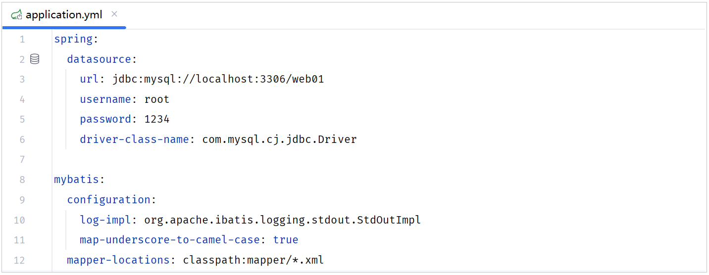

配置文件的内容如下：

```YAML
# 配置连接数据库的信息
spring:
  datasource:
    driver-class-name: com.mysql.cj.jdbc.Driver # 数据库驱动类名
    url: jdbc:mysql://localhost:3306/mybatis  # 数据库连接路径
    username: root  # 用户名
    password: 1234  # 密码

# 配置mybatis
mybatis:
  configuration:
    # 配置mybatis的日志输出
    log-impl: org.apache.ibatis.logging.stdout.StdOutImpl
    # 解决2：mybatis支持通过配置的方式开启驼峰命名映射。即entry_date--->entryDate
    map-underscore-to-camel-case: true
  # 指定xml映射文件的位置
  mapper-locations: classpath:mapper/*.xml
```

> 书写技巧：
>
> 1.如果不知道对齐关系，可以光标移动到最前面，定格书写会自动对齐。
>
> 2.如果书写的是框架提供的配置信息，结果配置的名称有个黄色背景，一般是对齐不正确。

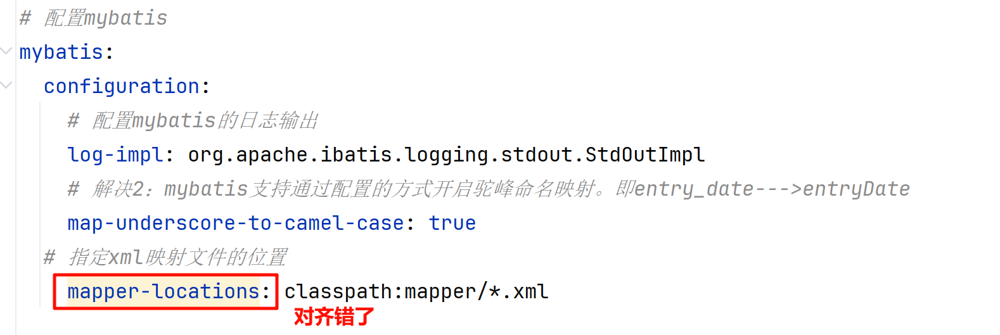


