# 一、spring介绍

## 1.引入

我们学习了前端网页开发的三剑客HTML、CSS、JS，通过这三项技术，我们就可以制作前端页面了。 那最终，这些个页面资料，我们就可以部署在服务器上，然后打开浏览器就可以直接访问服务器上部署的前端页面了。

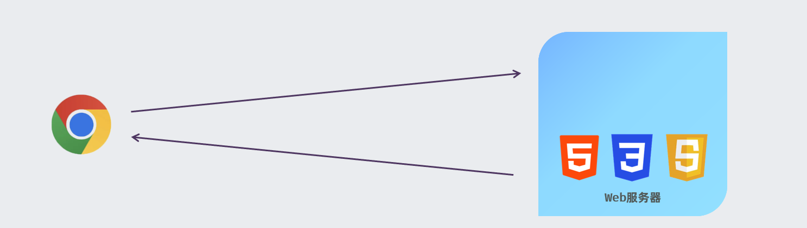

而像HTML、CSS、JS 以及图片、音频、视频等这些资源，我们都称为 静态资源。 所谓静态资源，就是指在服务器上存储的不会改变的数据，通常不会根据用户的请求而变化。

那与静态资源对应的还有一类资源，就是动态资源。那所谓 动态资源，就是指在服务器端上存储的，会根据用户请求和其他数据动态生成的，内容可能会在每次请求时都发生变化。比如：Servlet、JSP等\(负责逻辑处理\)。而Servlet、JSP这些技术现在早都被企业淘汰了，现在在企业项目开发中，都是直接基于Spring框架来构建动态资源。

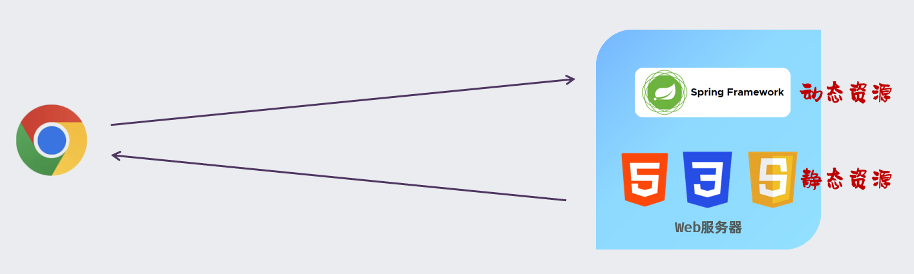

而对于我们java程序开发的动态资源来说，我们通常会将这些动态资源部署在Tomcat，这样的Web服务器中运行。 而浏览器与服务器在通信的时候，基本都是基于HTTP协议的。

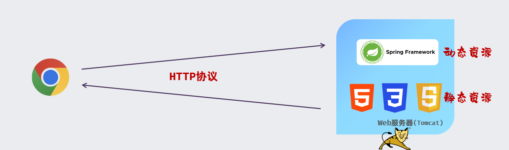

那上述所描述的这种浏览器/服务器的架构模式呢，我们称之为：BS架构。

- BS架构：Browser/Server，浏览器/服务器架构模式。客户端只需要浏览器，应用程序的逻辑和数据都存储在服务端。

    - 优点：维护方便

    - 缺点：体验一般

- CS架构：Client/Server，客户端/服务器架构模式。需要单独开发维护客户端。

    - 优点：体验不错

    - 缺点：开发维护麻烦

那前面我们已经学习了静态资源开发技术，包括：HTML、CSS、JS以及JS的高级框架Vue，异步交互技术Axios。 那接下来呢，我们就要来学习动态资料开发技术，而动态资源开发技术中像早期的Servlet、JSP这些个技术早都被企业淘汰了，现在企业开发主流的就是基于Spring体系中的框架来开发这些动态资源 。那到底什么是Spring呢，接下来，我们就来介绍一下。

## 2.初识Spring

我们可以打开Spring的官网([https://spring.io](https://spring.io))，去看一下Spring的简介：Spring makes java simple。

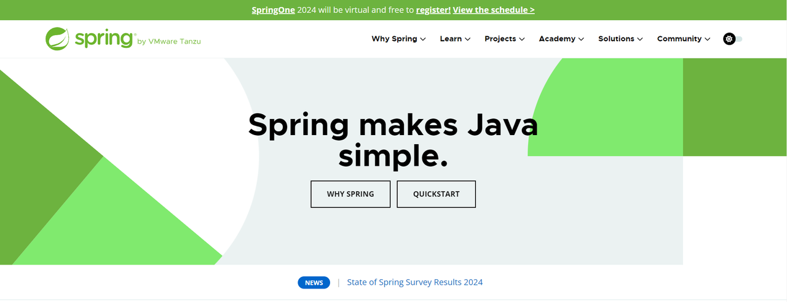

Spring的官方提供很多开源的项目，我们可以点击上面的projects，看到spring家族旗下的项目，按照流行程度排序为：

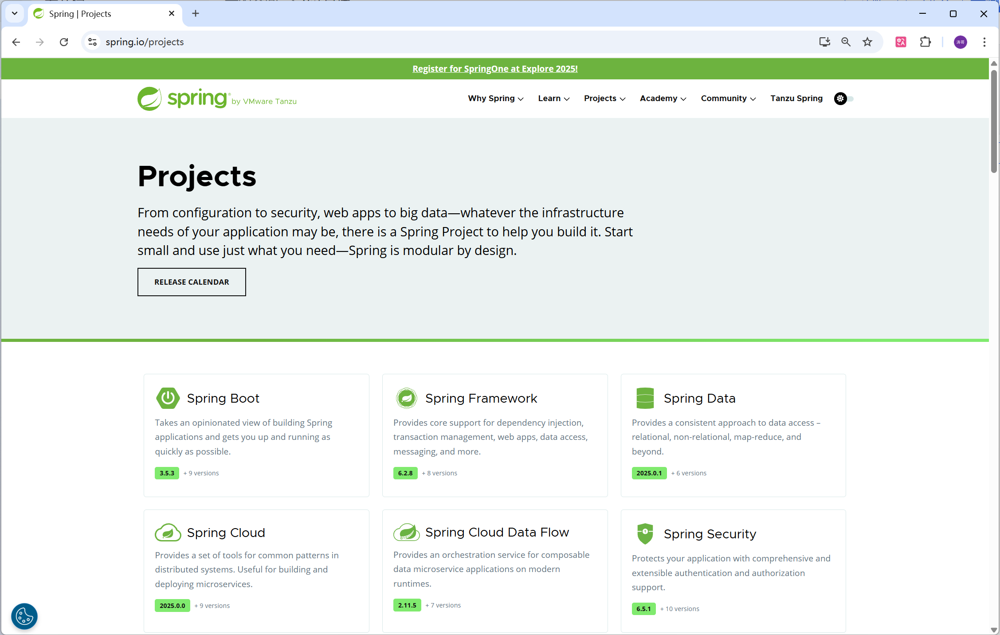

Spring发展到今天已经形成了一种开发生态圈，Spring提供了若干个子项目，每个项目用于完成特定的功能。而我们在项目开发时，一般会偏向于选择这一套spring家族的技术，来解决对应领域的问题，那我们称这一套技术为 spring全家桶。

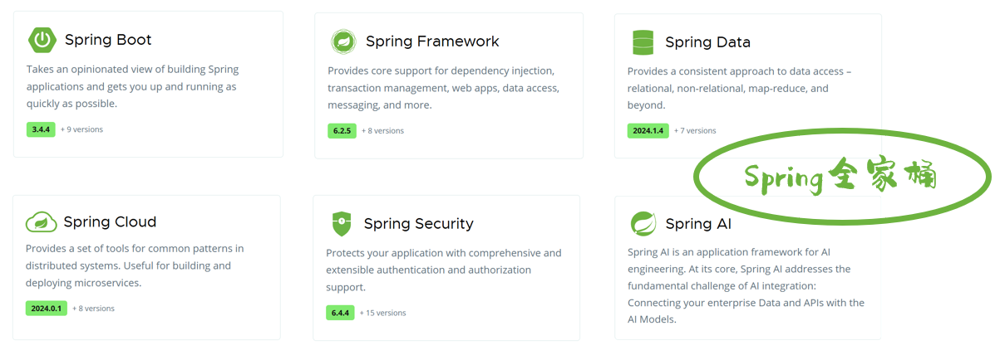

而Spring家族旗下这么多的技术，最基础、最核心的是 SpringFramework。其他的spring家族的技术，都是基于SpringFramework的，SpringFramework中提供很多实用功能，如：依赖注入、事务管理、web开发支持、数据访问、消息服务等等。

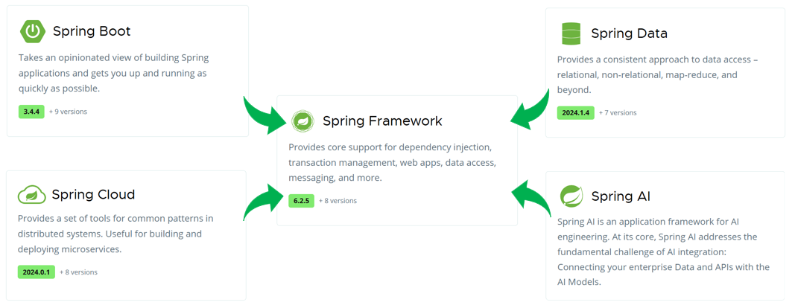

而如果我们在项目中，直接基于SpringFramework进行开发，存在两个问题：

- 配置繁琐

- 入门难度大

所以基于此呢，spring官方推荐我们从另外一个项目开始学习，那就是目前最火爆的SpringBoot。 通过springboot就可以快速的帮我们构建应用程序，所以springboot呢，最大的特点有两个 ：

- 简化配置

- 快速开发

Spring Boot 可以帮助我们非常快速的构建应用程序、简化开发、提高效率 。

而直接基于SpringBoot进行项目构建和开发，不仅是Spring官方推荐的方式，也是现在企业开发的主流。

# 二、Web入门程序

## 1.入门程序

### 1.1.需求

需求：基于SpringBoot的方式开发一个web应用，浏览器发起请求/hello后，给浏览器返回字符串 "Hello xxx \~"。

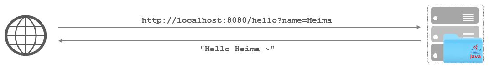

### 1.2.开发步骤

第1步：创建SpringBoot工程，并勾选Web开发相关依赖

第2步：定义HelloController类，添加方法hello，并添加注解

具体步骤如下：

1.创建SpringBoot工程（需要联网）

基于Spring官方骨架，创建SpringBoot工程。


基本信息描述完毕之后，勾选web开发相关依赖。

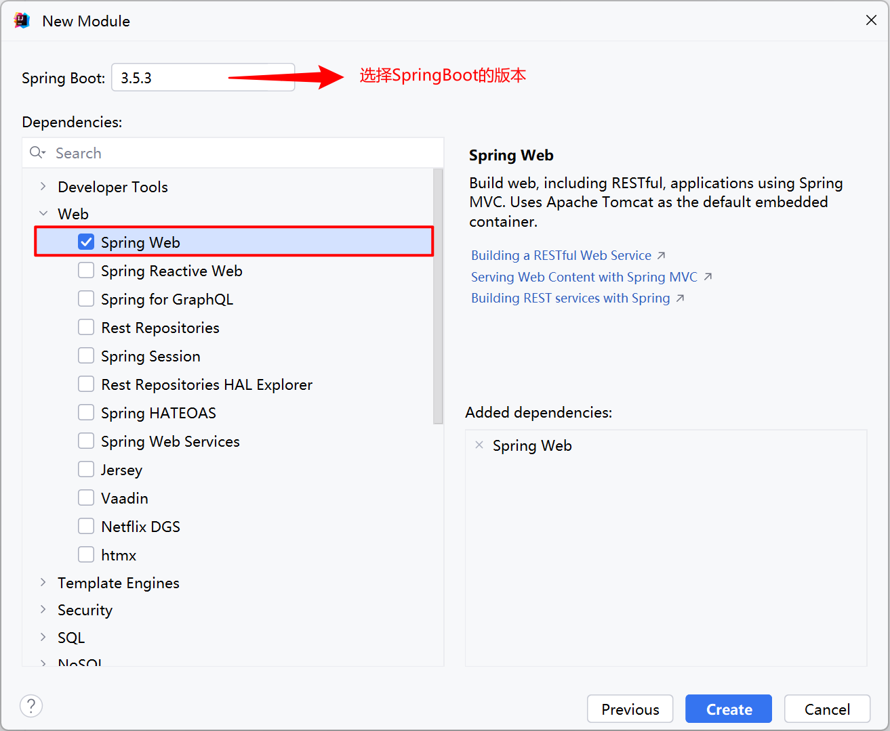

SpringBoot官方提供的脚手架，里面只能够选择SpringBoot的几个最新的版本，如果要选择其他相对低一点的版本，可以在springboot项目创建完毕之后，修改项目的pom\.xml文件中的版本号。

点击Create之后，就会联网创建这个SpringBoot工程，创建好之后，结构如下：

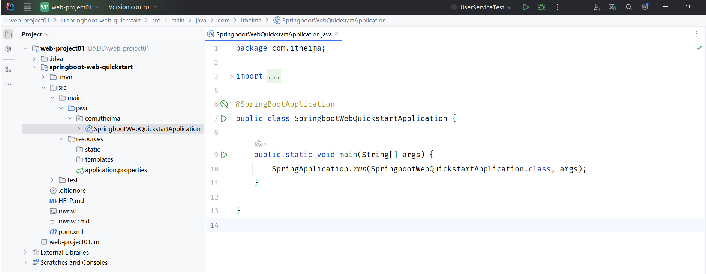

注意：在联网创建过程中，会下载相关资源\(请耐心等待)

2.定义HelloController类，添加方法hello，并添加注解

在`com.itheima`这个包下新建一个类：`HelloController`


HelloController中的内容，具体如下：

```java
@RestController  //表示该类是一个处理请求的类，类中定义方法方法处理完请求之后响应结果给页面
public class HelloController {

    @RequestMapping("/hello") //给方法定义一个访问路径，一个路径对应一个方法。
    public String hello(String name){  //形参name表示接收请求参数name的值
        System.out.println("name = " + name);
        return "hello " + name;
    }

    @RequestMapping("/say") //给方法定义一个访问路径，一个路径对应一个方法。
    public String say(String name){  //形参name表示接收请求参数name的值
        System.out.println("name = " + name);
        return "say " + name;
    }
}
```

3.运行测试

运行SpringBoot自动生成的引导类 \(标识有`@SpringBootApplication`注解的类\)


打开浏览器，输入 `http://localhost:8080/hello?name=itheima`


### 1.3.pom\.xml配置文件

```xml
<?xml version="1.0" encoding="UTF-8"?>
<project xmlns="http://maven.apache.org/POM/4.0.0" xmlns:xsi="http://www.w3.org/2001/xmlSchema-instance"
         xsi:schemaLocation="http://maven.apache.org/POM/4.0.0 https://maven.apache.org/xsd/maven-4.0.0.xsd">
    <modelVersion>4.0.0</modelVersion>
    <!--每一个springboot项目都有一个父工程，父工程中定义了常用jar包的版本号-->
    <parent>
        <groupId>org.springframework.boot</groupId>
        <artifactId>spring-boot-starter-parent</artifactId>
        <version>3.5.14</version>
        <relativePath/> <!-- lookup parent from repository -->
    </parent>
    <!--本模块的唯一标识坐标-->
    <groupId>com.itheima</groupId>
    <artifactId>day03-springboot-web</artifactId>
    <version>0.0.1-SNAPSHOT</version>

    <!--<name>day03-springboot-web</name>
    <description>day03-springboot-web</description>
    <url/>
    <licenses>
        <license/>
    </licenses>
    <developers>
        <developer/>
    </developers>
    <scm>
        <connection/>
        <developerConnection/>
        <tag/>
        <url/>
    </scm>
    <properties>
        <java.version>17</java.version>
    </properties>-->
    <!--导入程序需要用到的依赖jar包-->
    <dependencies>
        <!--springboot web开发依赖-->
        <dependency>
            <groupId>org.springframework.boot</groupId>
            <artifactId>spring-boot-starter-web</artifactId>
        </dependency>
        <!--springboot 单元测试依赖-->
        <dependency>
            <groupId>org.springframework.boot</groupId>
            <artifactId>spring-boot-starter-test</artifactId>
            <scope>test</scope>
        </dependency>
    </dependencies>

    <build>
        <plugins>
            <!--sspringboot项目构建的插件(完成编译、打包、运行等动作)，必须保留-->
            <plugin>
                <groupId>org.springframework.boot</groupId>
                <artifactId>spring-boot-maven-plugin</artifactId>
            </plugin>
        </plugins>
    </build>

</project>
```

### 1.4.常见问题

大家在联网基于spring的脚手架创建SpringBoot项目，偶尔可能会因为网内网络的原因，链接不上SpringBoot的脚手架网站，此时会出现如下现象：

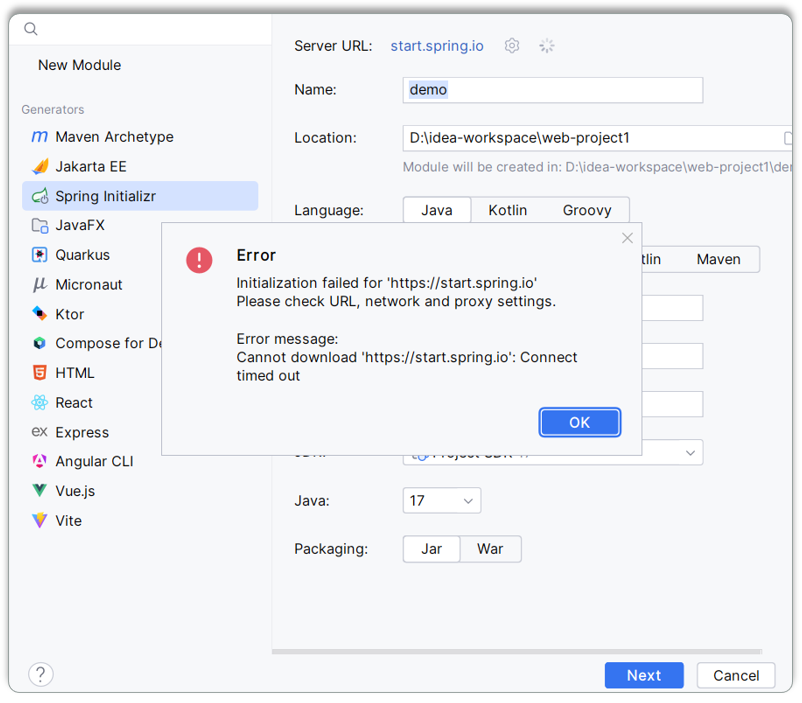

此时可以使用阿里云提供的脚手架，网址为：`https://start.aliyun.com`

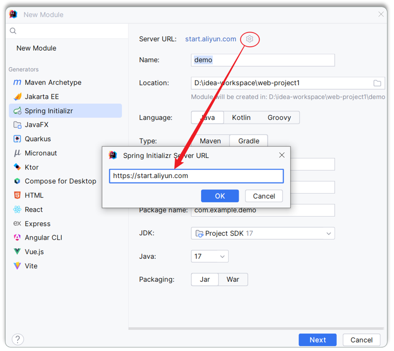

然后按照项目创建的向导，一步一步的创建项目即可。

## 2.程序解析

那在上面呢，我们已经完成了SpringBootWeb的入门程序，并且测试通过。 在入门程序中，我们发现，我们只需要一个main方法就可以将web应用启动起来了，然后就可以打开浏览器访问了。

那接下来我们需要明确两个问题：

1.为什么一个main方法就可以将Web应用启动了？

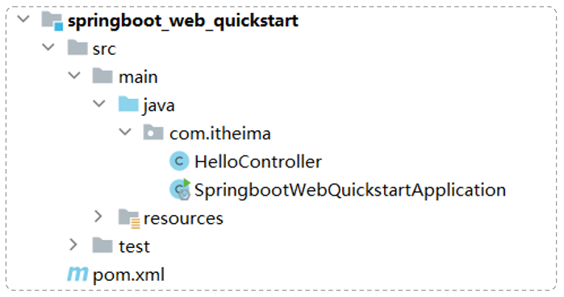

因为我们在创建springboot项目的时候，选择了web开发的起步依赖 `spring-boot-starter-web`。而`spring-boot-starter-web`依赖，又依赖了`spring-boot-starter-tomcat`，由于maven的依赖传递特性，那么在我们创建的springboot项目中也就已经有了tomcat的依赖，这个其实就是springboot中内嵌的tomcat。 


而我们运行引导类中的main方法，其实启动的就是springboot中内嵌的Tomcat服务器。 而我们所开发的项目，也会自动的部署在该tomcat服务器中，并占用8080端口号 。 

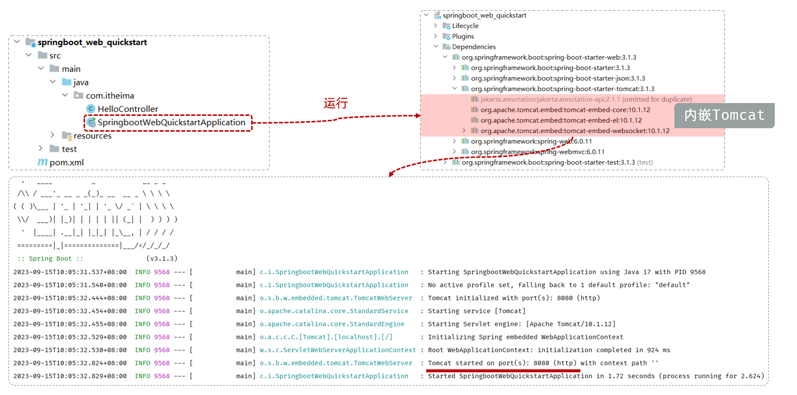

起步依赖：

一种为开发者提供简化配置和集成的机制，使得构建Spring应用程序更加轻松。起步依赖本质上是一组预定义的依赖项集合，它们一起提供了在特定场景下开发Spring应用所需的所有库和配置。

- spring\-boot\-starter\-web：包含了web应用开发所需要的常见依赖。

- spring\-boot\-starter\-test：包含了单元测试所需要的常见依赖。

官方提供的starter：[https://docs\.spring\.io/spring\-boot/docs/3\.1\.3/reference/htmlsingle/\#using\.build\-systems\.starters](https://docs.spring.io/spring-boot/docs/3.1.3/reference/htmlsingle/)

# 三、Web案例

## 1.需求说明

基于SpringBoot，开发Web程序，完成员工列表的渲染展示。

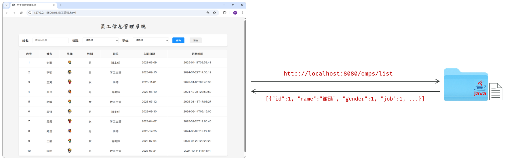

当在浏览器地址栏，访问前端静态页面（`http://localhost:8080/emp.html`）后，在前端页面上，会发送ajax请求，请求服务端（`http://localhost:8080/emps/list`），服务端程序加载 `emp.txt` 文件中的数据，读取出来后最终给前端页面响应json格式的数据，前端页面再将数据渲染展示在表格中。

## 2.代码实现

### 2.1.准备工作

1.创建一个SpringBoot，勾选web依赖，并引入lombok依赖。

这里，我们可以不用再创建新的springboot项目，直接使用入门程序中所创建的springboot项目即可，在其pom\.xml文件中引入lombok的依赖即可 （引入依赖后，记得刷新maven项目）。

```xml
<dependency>
    <groupId>org.projectlombok</groupId>
    <artifactId>lombok</artifactId>
</dependency>
```

2.引入资料中准备好的员工数据的文件 emp\.txt，将其放在resources目录下。 静态页面 emp\.html , 放在 resources/static 目录下。 

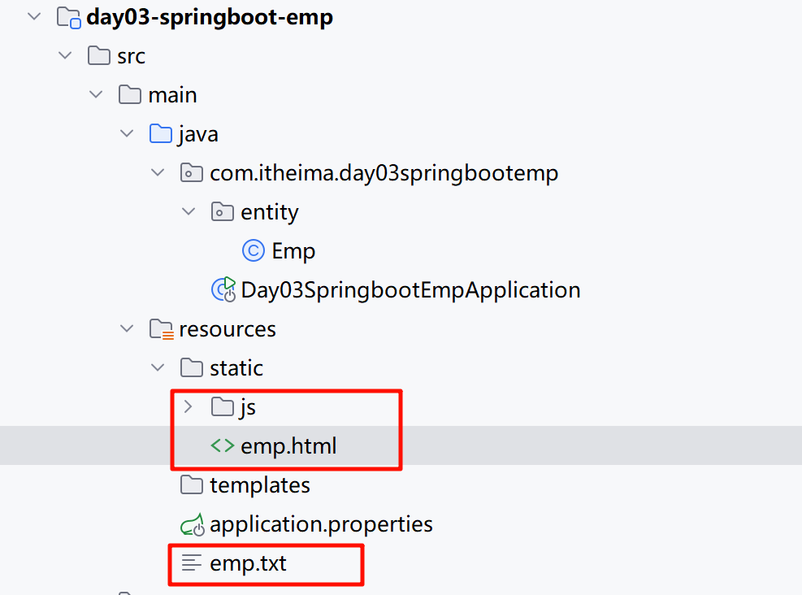

emp\.txt 文件内容如下: 

```java
1,谢逊,https://zxy-data.oss-cn-hangzhou.aliyuncs.com/icon/1.png,1,1,2023-06-09,2025-12-11 08:59:41
2,李明,https://zxy-data.oss-cn-hangzhou.aliyuncs.com/icon/2.png,1,3,2023-02-15,2025-12-22 14:30:12
3,王芳,https://zxy-data.oss-cn-hangzhou.aliyuncs.com/icon/3.png,2,2,2023-11-01,2026-01-05 09:45:33
4,张伟,https://zxy-data.oss-cn-hangzhou.aliyuncs.com/icon/4.png,1,5,2023-08-19,2025-12-31 23:59:59
5,赵敏,https://zxy-data.oss-cn-hangzhou.aliyuncs.com/icon/1.png,2,4,2023-05-12,2026-03-18 17:08:27
6,周强,https://zxy-data.oss-cn-hangzhou.aliyuncs.com/icon/2.png,1,1,2023-09-30,2025-06-14 06:15:00
7,吴霞,https://zxy-data.oss-cn-hangzhou.aliyuncs.com/icon/3.png,2,3,2023-04-07,2026-02-28 12:00:45
8,郑浩,https://zxy-data.oss-cn-hangzhou.aliyuncs.com/icon/4.png,1,2,2023-12-25,2025-08-09 19:27:03
```

3.定义一个实体类Emp，用来封装员工信息。

创建一个包 `entity` ，将实体类放在该包中。

```java
@Data
@NoArgsConstructor
@AllArgsConstructor
public class Emp {
    private Integer id; //编号
    private String name; //姓名
    private String image; //头像
    private Integer gender; //性别
    private String job; //职位
    private LocalDate entryDate; //入职日期
    private LocalDateTime updateTime; //更新时间
}
```

4.项目搭建完成之后运行启动类，通过浏览器访问前端页面：

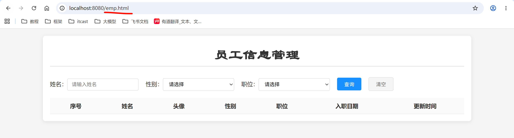

### 2.2.服务端程序

创建一个包 `com.itheima.controller` ，在该包中定义一个EmpController。具体代码如下：

```java
package com.itheima.day03springbootemp.controller;

import com.itheima.day03springbootemp.entity.Emp;
import org.springframework.util.ResourceUtils;
import org.springframework.web.bind.annotation.RequestMapping;
import org.springframework.web.bind.annotation.ResponseBody;
import org.springframework.web.bind.annotation.RestController;

import java.io.File;
import java.io.FileNotFoundException;
import java.io.IOException;
import java.nio.file.Files;
import java.time.LocalDate;
import java.time.LocalDateTime;
import java.time.format.DateTimeFormatter;
import java.util.List;
import java.util.stream.Collectors;

//@ResponseBody  //表示类中的所有方法的返回值会响应给客户端，如果返回值是对象或者集合，会自动转成json响应给客户端
//@RestController 等价于  @Controller+@ResponseBody，所以我们直接使用@RestController即可
@RestController//表示该类是一个处理请求的类，类中定义方法方法处理完请求之后响应结果给页面
public class EmpController {


    //@ResponseBody  //表示方法的返回值会响应给客户端，如果返回值是对象或者集合，会自动转成json响应给客户端
    @RequestMapping("/list")//给方法定义一个访问路径，一个路径对应一个方法。
    public List<Emp> list() throws IOException {
        //1 加载并读取emp.txt文本中的数据--->List<String>
        File file = ResourceUtils.getFile("classpath:emp.txt");
        List<String> list = Files.readAllLines(file.toPath());

        //2 处理数据，并将List<String>转换成List<Emp>集合
        List<Emp> empList = list.stream().map(line -> {
            //line="1,谢逊,https://zxy-data.oss-cn-hangzhou.aliyuncs.com/icon/1.png,1,1,2023-06-09,2025-12-11 08:59:41"
            //2.1 字符串切割，得到每一个数据的数组
            String[] split = line.split(","); //["1","谢逊","图片地址","1","1",...]
            //2.2 处理编号(id)、性别(gender)、入职日期(entryDate)、更新时间(updateTime)
            int id = Integer.parseInt(split[0]);
            int gender = Integer.parseInt(split[3]);
            LocalDate entryDate = LocalDate.parse(split[5], DateTimeFormatter.ofPattern("yyyy-MM-dd"));
            LocalDateTime updateTime = LocalDateTime.parse(split[6], DateTimeFormatter.ofPattern("yyyy-MM-dd HH:mm:ss"));
            //2.3 封装成Emp对象返回
            return new Emp(id, split[1], split[2], gender, split[4], entryDate, updateTime);
            //2.4 回收到List集合中
        }).toList();

        //3 响应结果，spring能自动将empList集合转成json响应给客户端
        return empList;
    }
}
```

代码编写完毕后，我们可以启动项目，进行测试，直接访问：http://localhost:8080/emp\.html 。最终我们可以看到员工的数据，可以正常加载并展示在页面上 。

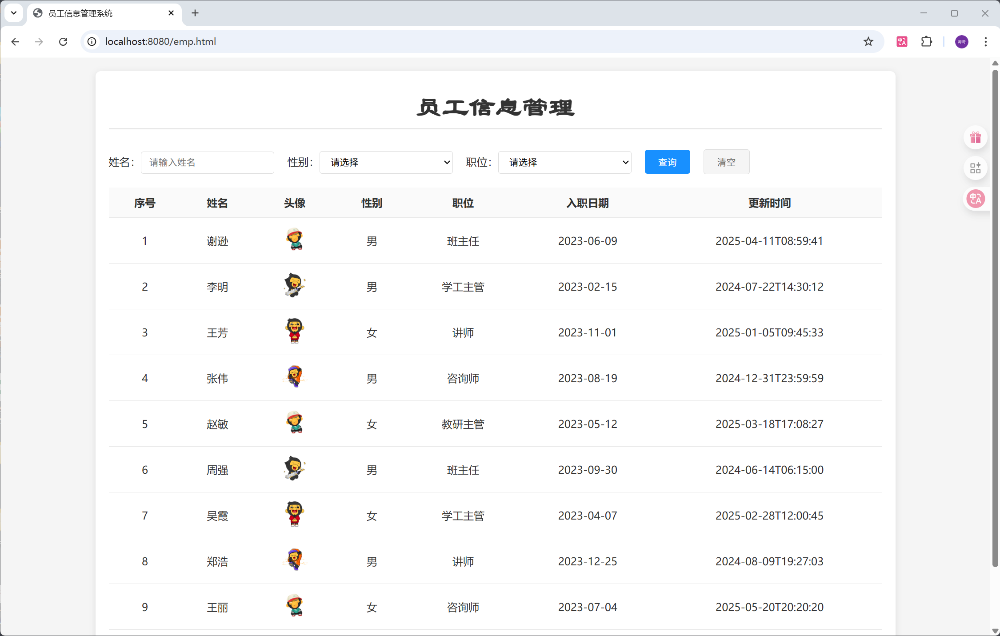

上述案例的功能，我们虽然已经实现，但是呢，我们会发现案例中：解析文本文件中的数据，处理数据的逻辑代码，给页面响应的代码全部都堆积在一起了，全部都写在controller方法中了。

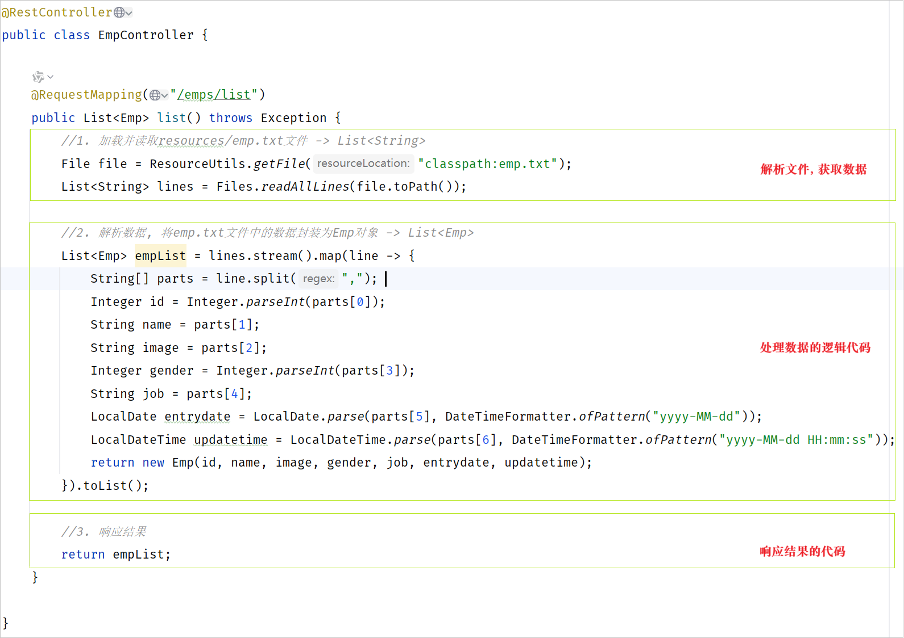

当前程序的这个业务逻辑还是比较简单的，如果业务逻辑再稍微复杂一点，我们会看到Controller方法的代码量就很大了。

- 当我们要修改操作数据部分的代码，需要改动Controller

- 当我们要完善逻辑处理部分的代码，需要改动Controller

- 当我们需要修改数据响应的代码，还是需要改动Controller

这样呢，就会造成我们整个工程代码的复用性比较差，而且代码难以维护。 那如何解决这个问题呢？其实在现在的开发中，有非常成熟的解决思路，那就是分层开发。 

## 3.三层架构

### 3.1.介绍

在我们进行程序设计以及程序开发时，尽可能让每一个接口、类、方法的职责更单一些（单一职责原则）。

单一职责原则：一个类或一个方法，就只做一件事情，只管一块功能。这样就可以让类、接口、方法的复杂度更低，可读性更强，扩展性更好，也更利于后期的维护。

我们之前开发的程序呢，并不满足单一职责原则。下面我们来分析下之前的程序：

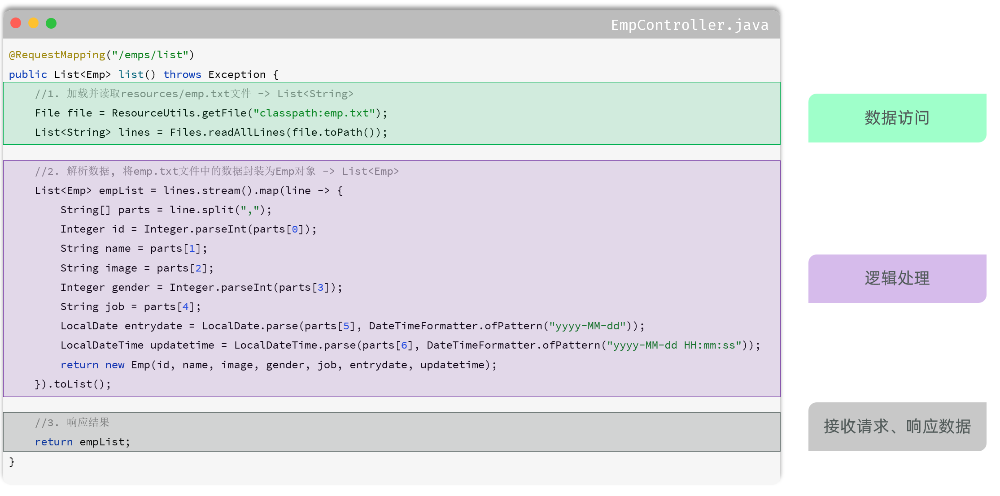

那其实我们上述案例的处理逻辑呢，从组成上看可以分为三个部分：

- 数据访问：负责业务数据的维护操作，包括增、删、改、查等操作。

- 逻辑处理：负责业务逻辑处理的代码。

- 请求处理、响应数据：负责，接收页面的请求，给页面响应数据。

按照上述的三个组成部分，在我们项目开发中呢，可以将代码分为三层，如图所示：

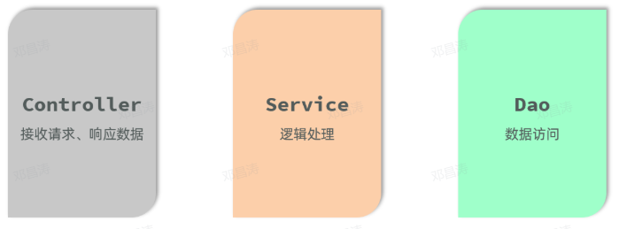

- Controller：控制层。接收前端发送的请求，对请求进行处理，并响应数据。

- Service：业务逻辑层。处理具体的业务逻辑。

- Dao：数据访问层\(Data Access Object\)，也称为持久层。负责数据访问操作，包括数据的增、删、改、查。

基于三层架构的程序执行流程，如图所示：

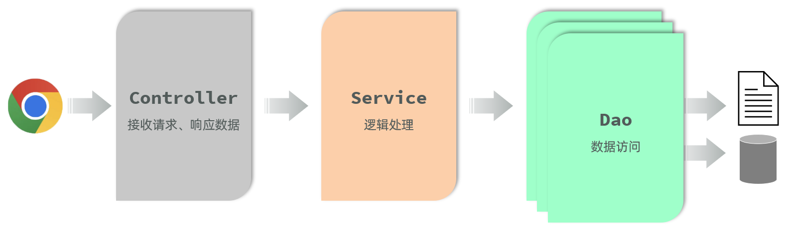

- 前端发起的请求，由Controller层接收（Controller响应数据给前端）
- Controller层调用Service层来进行逻辑处理（Service层处理完后，把处理结果返回给Controller层）
- Serivce层调用Dao层（逻辑处理过程中需要用到的一些数据要从Dao层获取）
- Dao层操作文件中的数据（Dao拿到的数据会返回给Service层）

思考：按照三层架构的思想，如果要对业务逻辑\(Service层\)进行变更，会影响到Controller层和Dao层吗？ 

答案：不会影响。 （程序的扩展性、维护性变得更好了）

### 3.2.代码实现

我们使用三层架构思想，来改造下之前的程序：

- 控制层包名：`com.itheima.controller`

- 业务逻辑层包名：`com.itheima.service`

- 数据访问层包名：`com.itheima.dao`


1.控制层：接收前端发送的请求，对请求进行处理，并响应数据

在 `com.itheima.controller` 中创建EmpController类 \(已经存在就不用再创建了\)，代码如下：

```java
package com.itheima.controller;

import com.itheima.entity.Emp;
import com.itheima.service.EmpService;
import com.itheima.service.impl.EmpServiceImpl;
import org.springframework.web.bind.annotation.RequestMapping;
import org.springframework.web.bind.annotation.RestController;
import java.util.List;

@RestController
public class EmpController {

    private EmpService empService = new EmpServiceImpl();

    @RequestMapping("/list")
    public List<Emp> list() throws Exception {
        //1. 调用EmpService获取数据
        List<Emp> empList = empService.list();
        //3. 响应结果
        return empList;
    }

}
```

2.业务逻辑层：处理具体的业务逻辑

在 `com.itheima.service`中创建EmpSerivce接口，代码如下：

```java
package com.itheima.service;

import com.itheima.entity.Emp;

import java.util.List;

public interface EmpService {

    /**
     * 查询所有员工
     */
    public List<Emp> list() throws Exception;

}
```

在 `com.itheima.service.impl` 中创建EmpSerivceImpl接口，代码如下：

```java
package com.itheima.service.impl;

import com.itheima.dao.EmpDao;
import com.itheima.dao.impl.EmpDaoImpl;
import com.itheima.entity.Emp;
import com.itheima.service.EmpService;

import java.time.LocalDate;
import java.time.LocalDateTime;
import java.time.format.DateTimeFormatter;
import java.util.List;

public class EmpServiceImpl implements EmpService {

    private EmpDao empDao = new EmpDaoImpl();

    @Override
    public List<Emp> list() throws Exception {
        //1. 调用EmpDao中的list()方法, 获取emp.txt文件中的数据
        List<String> lines = empDao.list();

        //2. 解析数据, 将emp.txt文件中的数据封装为Emp对象 -> List<Emp>
        List<Emp> empList = lines.stream().map(line -> {
            String[] parts = line.split(",");
            Integer id = Integer.parseInt(parts[0]);
            String name = parts[1];
            String image = parts[2];
            Integer gender = Integer.parseInt(parts[3]);
            String job = parts[4];
            LocalDate entrydate = LocalDate.parse(parts[5], DateTimeFormatter.ofPattern("yyyy-MM-dd"));
            LocalDateTime updatetime = LocalDateTime.parse(parts[6], DateTimeFormatter.ofPattern("yyyy-MM-dd HH:mm:ss"));
            return new Emp(id, name, image, gender, job, entrydate, updatetime);
        }).toList();

        return empList;
    }
}
```

3.数据访问层：负责数据的访问操作，包含数据的增、删、改、查

在 `com.itheima.dao`中创建EmpDao接口，代码如下：

```java
package com.itheima.dao;

import java.util.List;

public interface EmpDao {

    /**
     * 查询所有员工
     */
    public List<String> list() throws Exception;

}
```

在 `com.itheima.dao.impl` 中创建EmpDaoImpl接口，代码如下：

```java
package com.itheima.dao.impl;

import com.itheima.dao.EmpDao;
import org.springframework.util.ResourceUtils;
import java.io.File;
import java.nio.file.Files;
import java.util.List;

public class EmpDaoImpl implements EmpDao {
    @Override
    public List<String> list() throws Exception {
        //1. 加载并读取resources/emp.txt文件 -> List<String>
        File file = ResourceUtils.getFile("classpath:emp.txt");
        List<String> list= Files.readAllLines(file.toPath());
        return list;
    }
}
```

具体的请求调用流程：

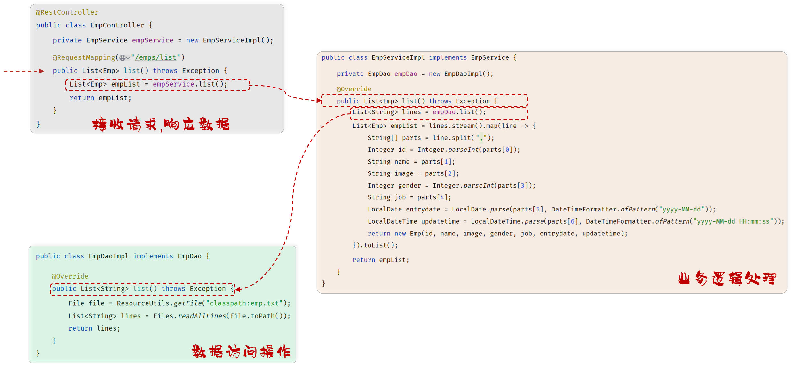

# 四、分层解耦

## 1.问题分析

由于我们现在在程序中，需要什么对象，直接new一个对象 `new EmpServiceImpl()`  

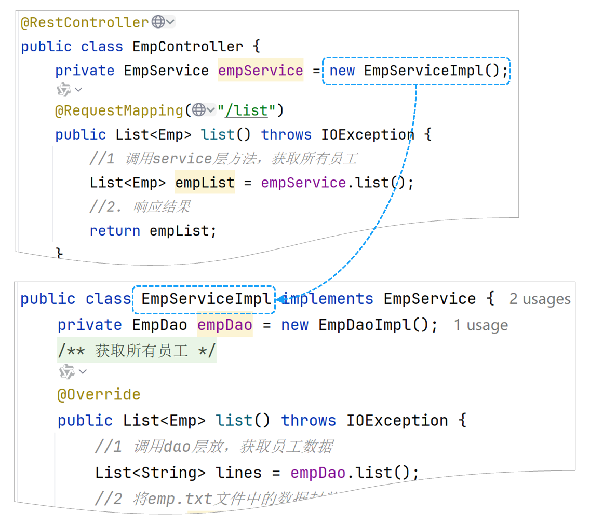

如果说我们需要更换实现类，比如由于业务的变更，EmServiceImpl 不能满足现有的业务需求，我们需要切换为 EmpServiceImpl2 这套实现，就需要修改Contorller的代码，需要创建 EmpServiceImpl2 的实现`new EmpServicImpl2()` 。

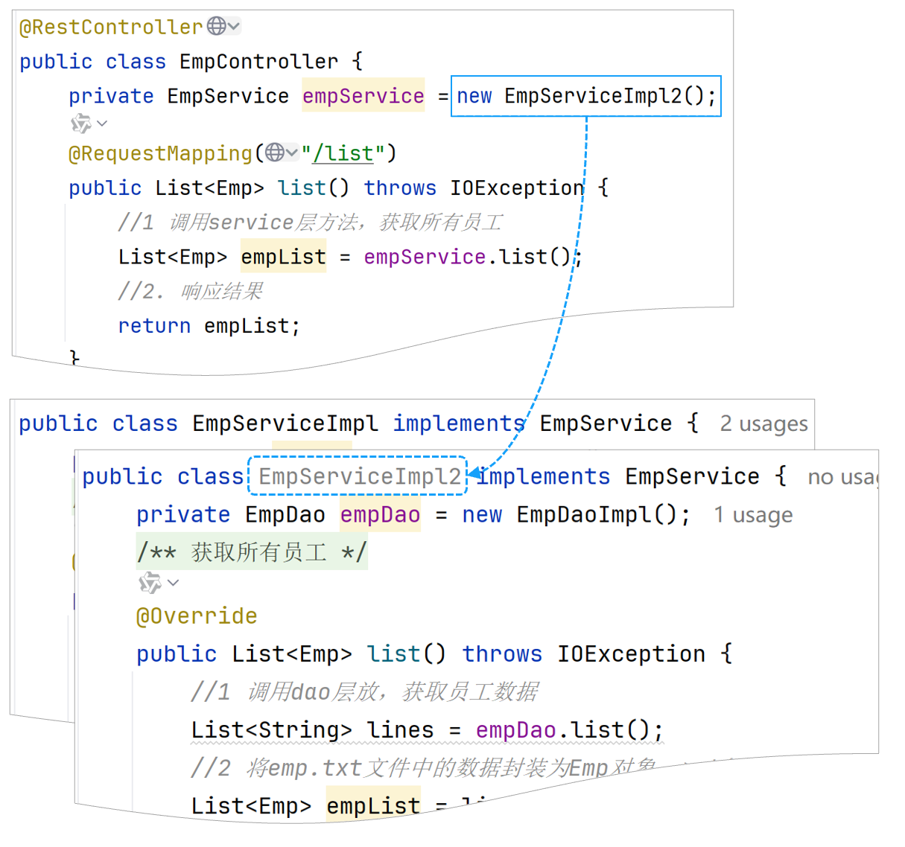

Controller中调用Service，也是类似的问题。这种呢，我们就称之为层与层之间 耦合 了。 那什么是耦合呢 ？

耦合：衡量软件中各个层/模块之间的依赖、关联的程度。

软件设计原则：低耦合。

低耦合：指的是软件中各个层、模块之间的依赖关联程序越低越好。

目前层与层之间是存在耦合的，Controller耦合了Service、Service耦合了Dao。而 高内聚、低耦合的目的是使程序模块的可重用性、移植性大大增强。

那最终我们的目标呢，就是做到层与层之间，尽可能的降低耦合，甚至解除耦合。

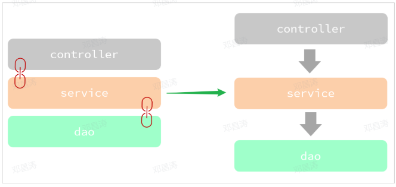

## 2.解耦思路

之前我们在编写代码时，需要什么对象，就直接new一个就可以了。 这种做法呢，层与层之间代码就耦合了，当Dao层的实现变了之后， 我们还需要修改Service层的代码。

那应该怎么解耦呢？

1.首先不能在EmpController中使用new对象。代码如下：

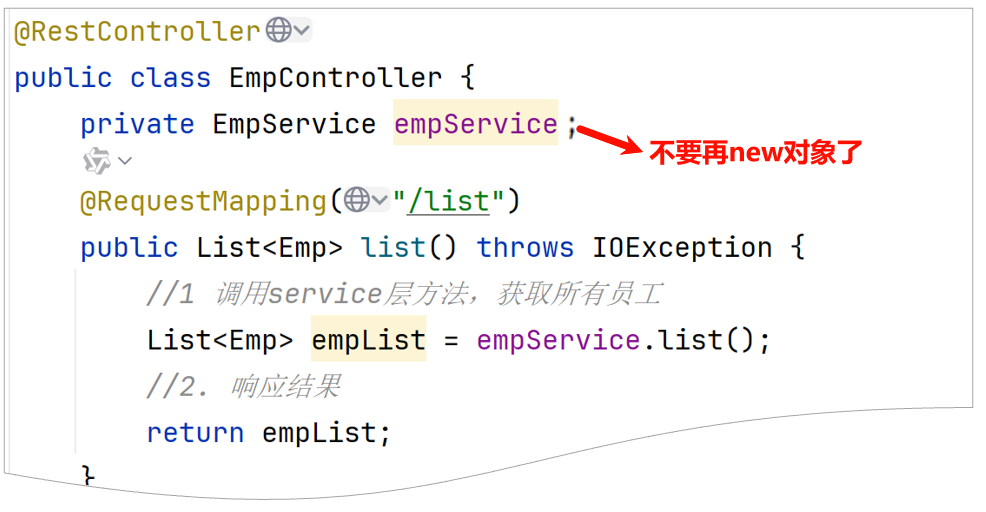

此时，就存在另一个问题了，不能new，就意味着没有Service层对象（程序运行就报错），怎么办呢? 

我们的解决思路是：

- Spring提供一个容器，容器中存储一些对象\(例：EmpServiceImpl对象\)

- Spring程序从容器中获取EmpService类型的对象

2.将要用到的对象交给一个容器管理。

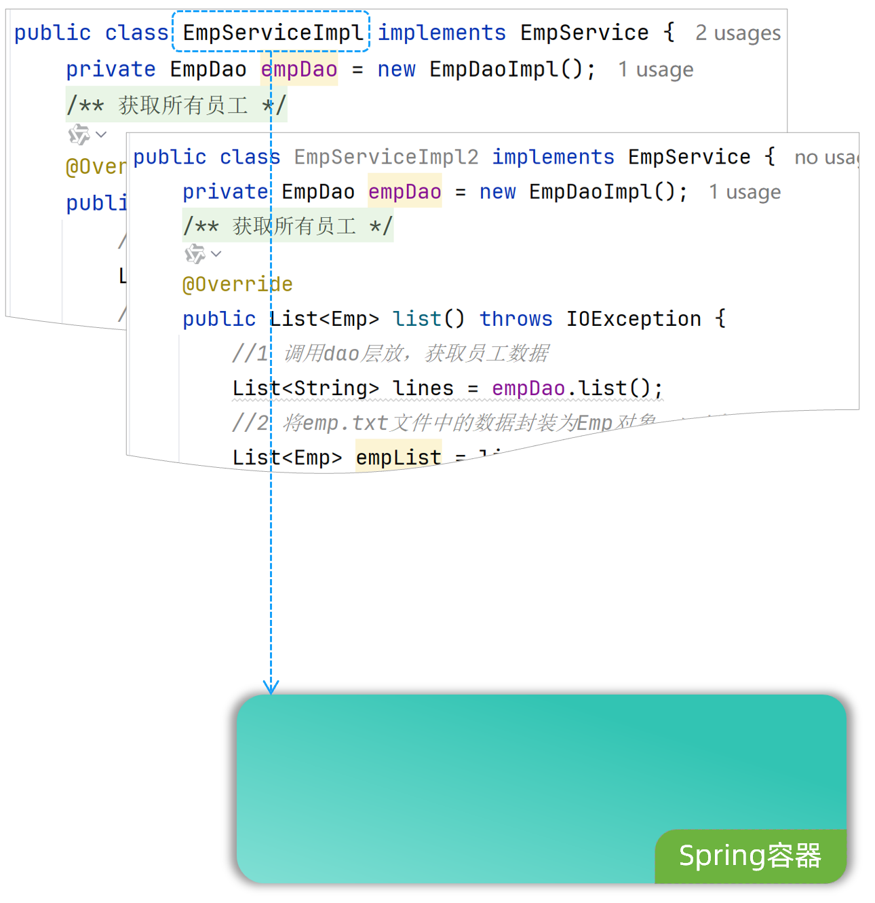

3.应用程序中用到这个对象，就直接从容器中获取

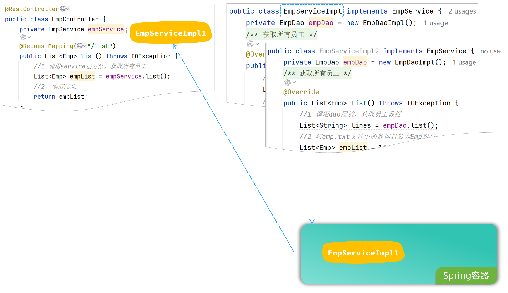

那问题来了，我们如何将对象交给容器管理呢？ 程序运行时，容器如何为程序提供依赖的对象呢？ 

我们想要实现上述解耦操作，就涉及到Spring中的两个核心概念：

- 控制反转： Inversion Of Control，简称IOC。将创建对象的权力由自身交给Spring（容器），这种思想称为控制反转。

    对象的创建权由程序员主动创建转移到容器\(由容器创建、管理对象\)。这个容器称为：IOC容器或Spring容器。

- 依赖注入： Dependency Injection，简称DI。容器为应用程序提供运行时，所依赖的资源\(对象\)，称之为依赖注入。

    程序运行时需要某个资源，此时容器就为其提供这个资源。

    例：EmpController程序运行时需要EmpService对象，Spring容器就为其提供并注入EmpService对象。

- bean对象：IOC容器中创建、管理的对象，称之为：bean对象。

## 3.IOC\&DI入门

1.将Service及Dao层的实现类，交给IOC容器管理

在实现类加上 `@Component` 注解，就代表把当前类产生的对象交给IOC容器管理。

EmpDaoImpl

```java
import com.itheima.dao.EmpDao;
import org.springframework.stereotype.Component;
import org.springframework.util.ResourceUtils;
import java.io.File;
import java.nio.file.Files;
import java.util.List;

@Component //属于IOC注解，让spring创建该类的对象保存到IOC容器(spring容器)中
public class EmpDaoImpl implements EmpDao {
    @Override
    public List<String> list() throws Exception {
        //1. 加载并读取resources/emp.txt文件 -> List<String>
        File file = ResourceUtils.getFile("classpath:emp.txt");
        List<String> lines = Files.readAllLines(file.toPath());
        return lines;
    }
}
```

EmpServiceImpl

```java
@Component //属于IOC注解，让spring创建该类的对象保存到IOC容器(spring容器)中
public class EmpServiceImpl implements EmpService {

    private EmpDao empDao;

    @Override
    public List<Emp> list() throws Exception {
        //1. 调用EmpDao中的list()方法, 获取emp.txt文件中的数据
        List<String> lines = empDao.list();

        //2. 解析数据, 将emp.txt文件中的数据封装为Emp对象 -> List<Emp>
        List<Emp> empList = lines.stream().map(line -> {
            String[] parts = line.split(",");
            Integer id = Integer.parseInt(parts[0]);
            String name = parts[1];
            String image = parts[2];
            Integer gender = Integer.parseInt(parts[3]);
            String job = parts[4];
            LocalDate entrydate = LocalDate.parse(parts[5], DateTimeFormatter.ofPattern("yyyy-MM-dd"));
            LocalDateTime updatetime = LocalDateTime.parse(parts[6], DateTimeFormatter.ofPattern("yyyy-MM-dd HH:mm:ss"));
            return new Emp(id, name, image, gender, job, entrydate, updatetime);
        }).toList();

        return empList;
    }
}
```

2.为Controller 及 Service注入运行时所依赖的对象

EmpServiceImpl

```java
package com.itheima.service.impl;

import com.itheima.dao.EmpDao;
import com.itheima.entity.Emp;
import com.itheima.service.EmpService;
import org.springframework.beans.factory.annotation.Autowired;
import org.springframework.stereotype.Component;

import java.time.LocalDate;
import java.time.LocalDateTime;
import java.time.format.DateTimeFormatter;
import java.util.List;

@Component
public class EmpServiceImpl implements EmpService {

    @Autowired //DI注解，让spring从IOC容器中找EmpDao类型的对象，有就赋值，没有就报错
    private EmpDao empDao;

    @Override
    public List<Emp> list() throws Exception {
        //1. 调用EmpDao中的list()方法, 获取emp.txt文件中的数据
        List<String> lines = empDao.list();

        //2. 解析数据, 将emp.txt文件中的数据封装为Emp对象 -> List<Emp>
        List<Emp> empList = lines.stream().map(line -> {
            String[] parts = line.split(",");
            Integer id = Integer.parseInt(parts[0]);
            String name = parts[1];
            String image = parts[2];
            Integer gender = Integer.parseInt(parts[3]);
            String job = parts[4];
            LocalDate entrydate = LocalDate.parse(parts[5], DateTimeFormatter.ofPattern("yyyy-MM-dd"));
            LocalDateTime updatetime = LocalDateTime.parse(parts[6], DateTimeFormatter.ofPattern("yyyy-MM-dd HH:mm:ss"));
            return new Emp(id, name, image, gender, job, entrydate, updatetime);
        }).toList();

        return empList;
    }
}
```

EmpController

```java
package com.itheima.controller;

import com.itheima.entity.Emp;
import com.itheima.service.EmpService;
import org.springframework.beans.factory.annotation.Autowired;
import org.springframework.web.bind.annotation.RequestMapping;
import org.springframework.web.bind.annotation.RestController;
import java.util.List;

@RestController
public class EmpController {
    
    @Autowired //DI注解，让spring从IOC容器中找EmpService类型的对象，有就赋值，没有就报错
    private EmpService empService ;
    
    @RequestMapping("/list")
    public List<Emp> list() throws Exception {
        //1. 调用EmpService获取数据
        List<Emp> empList = empService.list();
        //3. 响应结果
        return empList;
    }
    
}
```

启动服务，运行测试。 打开浏览器，地址栏直接访问：http://localhost:8080/emp\.html 。 依然正常访问，就说明入门程序完成了。 已经完成了层与层之间的解耦。

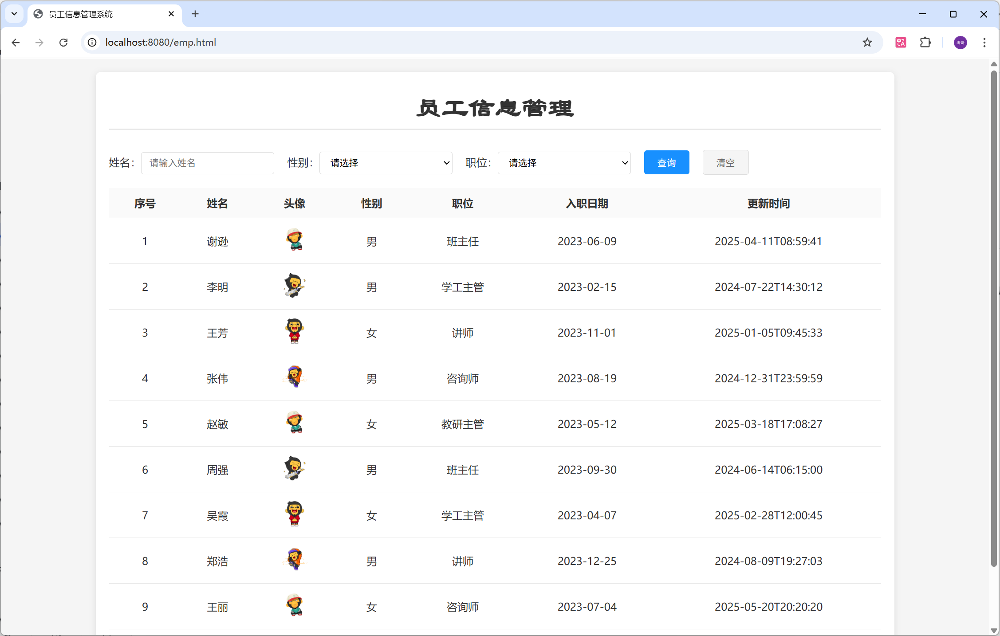

## 4.IOC详解

### 4.1.bean的声明

前面我们提到IOC控制反转，就是将对象的控制权交给Spring的IOC容器，由IOC容器创建及管理对象。IOC容器创建的对象称为bean对象。

在之前的入门案例中，要把某个对象交给IOC容器管理，需要在类上添加一个注解：`@Component`

而Spring框架为了更好的标识web应用程序开发当中，bean对象到底归属于哪一层，又提供了@Component的衍生注解：

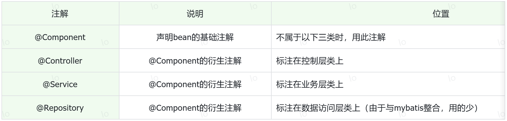

那么此时，我们就可以使用 `@Service` 注解声明Service层的bean。 使用 `@Repository` 注解声明Dao层的bean。 代码实现如下：

Service层:

```java
package com.itheima.service.impl;

import com.itheima.dao.EmpDao;
import com.itheima.entity.Emp;
import com.itheima.service.EmpService;
import org.springframework.beans.factory.annotation.Autowired;
import org.springframework.stereotype.Service;
import java.time.LocalDate;
import java.time.LocalDateTime;
import java.time.format.DateTimeFormatter;
import java.util.List;

//@Service  //属于IOC注解，将Service层的类交给spring创建对象保存到IOC容器(spring容器)中
public class EmpServiceImpl implements EmpService {

    @Autowired
    private EmpDao empDao;

    @Override
    public List<Emp> list() throws Exception {
        //1. 调用EmpDao中的list()方法, 获取emp.txt文件中的数据
        List<String> lines = empDao.list();

        //2. 解析数据, 将emp.txt文件中的数据封装为Emp对象 -> List<Emp>
        List<Emp> empList = lines.stream().map(line -> {
            String[] parts = line.split(",");
            Integer id = Integer.parseInt(parts[0]);
            String name = parts[1];
            String image = parts[2];
            Integer gender = Integer.parseInt(parts[3]);
            String job = parts[4];
            LocalDate entrydate = LocalDate.parse(parts[5], DateTimeFormatter.ofPattern("yyyy-MM-dd"));
            LocalDateTime updatetime = LocalDateTime.parse(parts[6], DateTimeFormatter.ofPattern("yyyy-MM-dd HH:mm:ss"));
            return new Emp(id, name, image, gender, job, entrydate, updatetime);
        }).toList();

        return empList;
    }
}
```

Dao层:

```java
package com.itheima.dao.impl;

import com.itheima.dao.EmpDao;
import org.springframework.stereotype.Repository;
import org.springframework.util.ResourceUtils;
import java.io.File;
import java.nio.file.Files;
import java.util.List;

@Repository  //属于IOC注解，将Dao层的类交给spring创建对象保存到IOC容器(spring容器)中,以后不用
public class EmpDaoImpl implements EmpDao {
    @Override
    public List<String> list() throws Exception {
        //1. 加载并读取resources/emp.txt文件 -> List<String>
        File file = ResourceUtils.getFile("classpath:emp.txt");
        List<String> lines = Files.readAllLines(file.toPath());
        return lines;
    }
}
```

注意1：声明bean的时候，可以通过注解的value属性指定bean的名字，如果没有指定，默认为类名首字母小写。

注意2：使用以上四个注解都可以声明bean，但是在springboot集成web开发中，声明控制器bean只能用@Controller。

### 4.2.组件扫描

问题：使用前面学习的四个注解声明的bean，一定会生效吗？

答案：不一定。（原因：bean想要生效，还需要被组件扫描）

前面声明bean的四大注解，要想生效，还需要被组件扫描注解 `@ComponentScan` 扫描。

该注解虽然没有显式配置，但是实际上已经包含在了启动类声明注解 `@SpringBootApplication` 中，默认扫描的范围是启动类所在包及其子包。

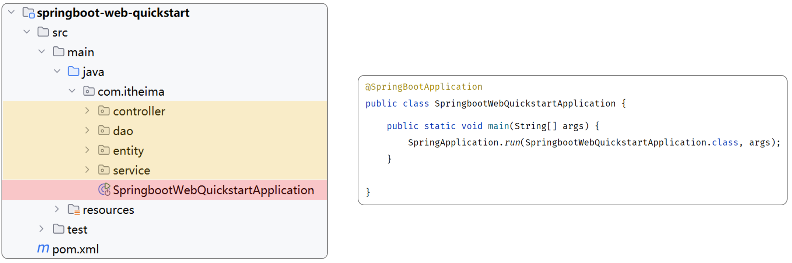

所以，我们在项目开发中，只需要按照如上项目结构，将项目中的所有的业务类，都放在启动类所在包的子包中，就无需考虑组件扫描问题。

## 5.DI详解

我们讲解了控制反转IOC的细节，接下来呢，我们学习依赖注解DI的细节。

依赖注入，是指IOC容器要为应用程序去提供运行时所依赖的资源，而资源指的就是对象。

在入门程序案例中，我们使用了@Autowired这个注解，完成了依赖注入的操作，而这个Autowired翻译过来叫：自动装配。

`@Autowired`注解，默认是按照类型进行自动装配的（去IOC容器中找某个类型的对象，然后完成注入操作）

入门程序举例：在EmpController运行的时候，就要到IOC容器当中去查找EmpService这个类型的对象，而我们的IOC容器中刚好有一个EmpService这个类型的对象，所以就找到了这个类型的对象完成注入操作。

### 5.1.@Autowired用法

@Autowired 进行依赖注入，常见的方式，有如下三种：

1.属性注入

```java
@RestController
public class EmpController {

    //方式一: 属性注入
    @Autowired
    private EmpService empService;
    
  }
```

- 优点：代码简洁、方便快速开发。

- 缺点：隐藏了类之间的依赖关系、可能会破坏类的封装性。

2.构造函数注入

```java
@RestController
public class EmpController {

    //方式一: 属性注入
    @Autowired
    private EmpService empService;
    
  }
```

- 优点：能清晰地看到类的依赖关系、提高了代码的安全性。

- 缺点：代码繁琐、如果构造参数过多，可能会导致构造函数臃肿。

- 注意：如果只有一个构造函数，@Autowired注解可以省略。（通常来说，也只有一个构造函数）

3.setter注入

```java
/**
 * 用户信息Controller
 */
@RestController
public class EmpController {
       
    private EmpService empService ;
    //方式三: setter注入
    @Autowired
    public void setUserService(EmpService empService) {
        this.empService= empService;
    }
    
}    
```

- 优点：保持了类的封装性，依赖关系更清晰。

- 缺点：需要额外编写setter方法，增加了代码量。

在项目开发中，基于@Autowired进行依赖注入时，基本都是第一种和第二种方式。（官方推荐第二种方式，因为会更加规范）但是在企业项目开发中，很多的项目中，也会选择第一种方式因为更加简洁、高效（在规范性方面进行了妥协）。

### 5.2.注意事项

那如果在IOC容器中，存在多个相同类型的bean对象，会出现什么情况呢？

在下面的例子中，我们准备了两个EmpService的实现类，并且都交给了IOC容器管理。 代码如下：

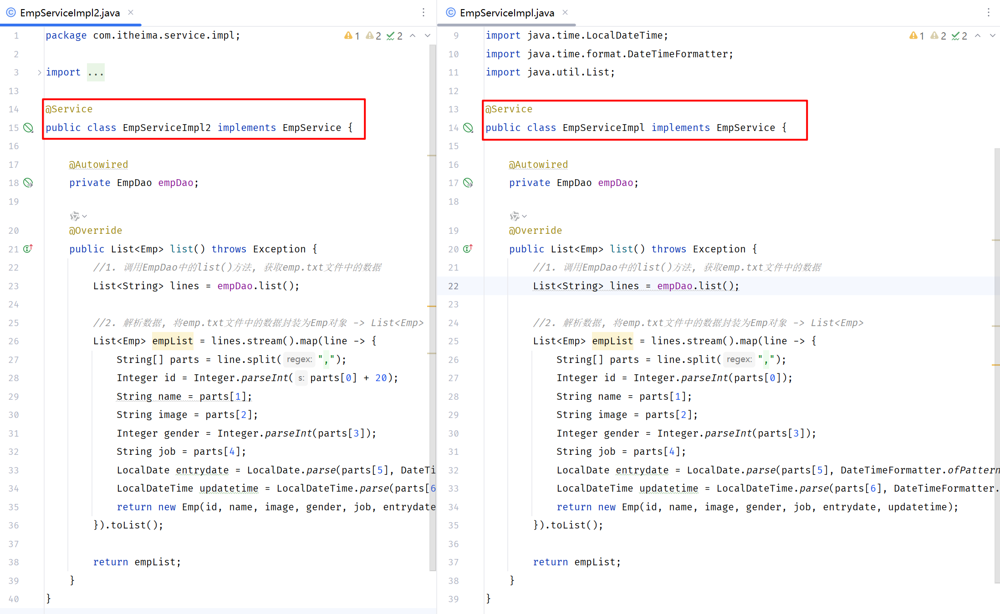

此时，我们启动项目会发现，控制台报错了：

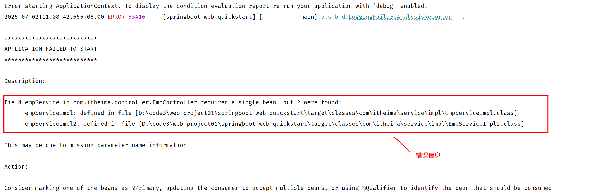

出现错误的原因呢，是因为在Spring的容器中，UserService这个类型的bean存在两个，框架不知道具体要注入哪个bean使用，所以就报错了。

如何解决上述问题呢？Spring提供了以下几种解决方案：

- @Primary

- @Qualifier

- @Resource

方案一：使用@Primary注解

当存在多个相同类型的Bean注入时，加上@Primary注解，来确定默认的实现。

```java
@Primary
@Service
public class EmpServiceImpl implements EmpService {
}
```

方案二：使用@Qualifier注解

指定当前要注入的bean对象。 在@Qualifier的value属性中，指定注入的bean的名称。 @Qualifier注解不能单独使用，必须配合@Autowired使用。

```java
@RestController
public class EmpController {

    @Autowired //DI注解，让spring从IOC容器中找EmpService类型的对象，有就赋值，没有就报错
    //方案二：使用@Autowired + @Qualifier注解
    @Qualifier("empServiceImpl")  //指定要注入哪个Bean，参数为Bean的名称，必须配合@Autowired一起用
    private EmpService empService;
    
}
```

方案三：使用@Resource注解

是按照bean的名称进行注入。通过name属性指定要注入的bean的名称。

```java
@RestController
public class EmpController {
        
    //方案三：使用Resource注解根据名称注入
    //@Resource  //Java提供的注解，spring也能识别，默认按照名称注入，从容器中找和变量名同名的Bean对象，如果找到就注入，找不到就根据类型找，如果找到就注入，没找到就报错，同类型有多个Bean对象也报错。
    @Resource(name = "empServiceImpl") //手动指定要注入的Bean对象的名字
    private EmpService empService;
    
}
```

面试题：@Autowird 与 @Resource的区别

- @Autowired 是spring框架提供的注解，而@Resource是JDK提供的注解

- @Autowired 默认是按照类型注入，而@Resource是按照名称注入

# 五、常见状态码

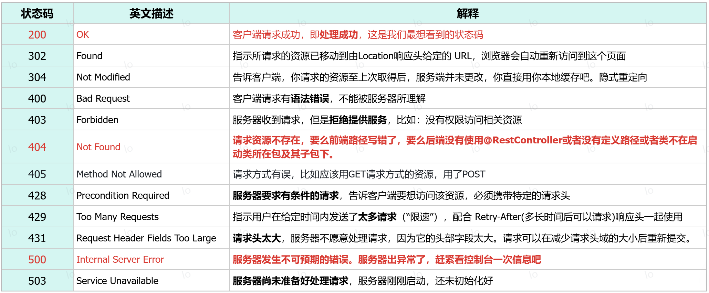

状态码大全：https://cloud.tencent.com/developer/chapter/13553 


