# 一、spring介绍

## 1.引入

我们学习了前端网页开发的三剑客HTML、CSS、JS，通过这三项技术，我们就可以制作前端页面了。 那最终，这些个页面资料，我们就可以部署在服务器上，然后打开浏览器就可以直接访问服务器上部署的前端页面了。


而像HTML、CSS、JS 以及图片、音频、视频等这些资源，我们都称为 静态资源。 所谓静态资源，就是指在服务器上存储的不会改变的数据，通常不会根据用户的请求而变化。

那与静态资源对应的还有一类资源，就是动态资源。那所谓 动态资源，就是指在服务器端上存储的，会根据用户请求和其他数据动态生成的，内容可能会在每次请求时都发生变化。比如：Servlet、JSP等\(负责逻辑处理\)。而Servlet、JSP这些技术现在早都被企业淘汰了，现在在企业项目开发中，都是直接基于Spring框架来构建动态资源。

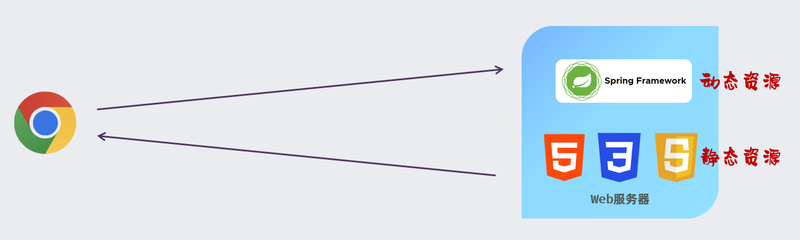

而对于我们java程序开发的动态资源来说，我们通常会将这些动态资源部署在Tomcat，这样的Web服务器中运行。 而浏览器与服务器在通信的时候，基本都是基于HTTP协议的。

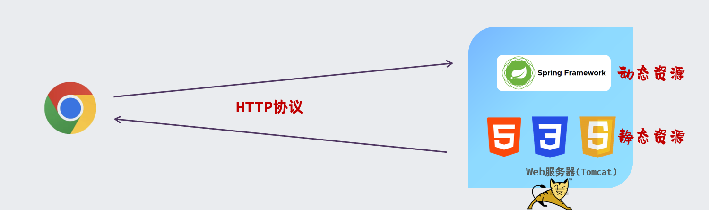

那上述所描述的这种浏览器/服务器的架构模式呢，我们称之为：BS架构。

BS架构：Browser/Server，浏览器/服务器架构模式。客户端只需要浏览器，应用程序的逻辑和数据都存储在服务端。

- 优点：维护方便

- 缺点：体验一般

CS架构：Client/Server，客户端/服务器架构模式。需要单独开发维护客户端。

- 优点：体验不错

- 缺点：开发维护麻烦

那前面我们已经学习了静态资源开发技术，包括：HTML、CSS、JS以及JS的高级框架Vue，异步交互技术Axios。 那接下来呢，我们就要来学习动态资料开发技术，而动态资源开发技术中像早期的Servlet、JSP这些个技术早都被企业淘汰了，现在企业开发主流的就是基于Spring体系中的框架来开发这些动态资源 。那到底什么是Spring呢，接下来，我们就来介绍一下。

## 2.初识Spring

我们可以打开Spring的官网([https://spring.io](https://spring.io))，去看一下Spring的简介：Spring makes java simple。

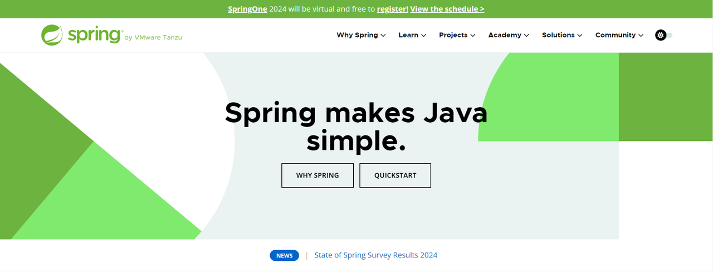

Spring的官方提供很多开源的项目，我们可以点击上面的projects，看到spring家族旗下的项目，按照流行程度排序为：

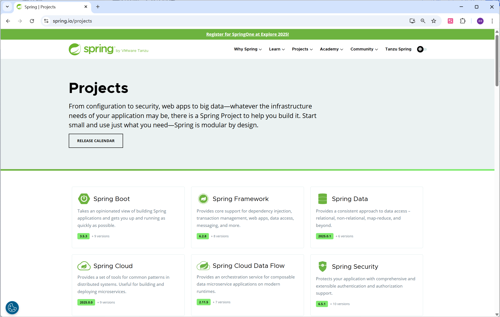

Spring发展到今天已经形成了一种开发生态圈，Spring提供了若干个子项目，每个项目用于完成特定的功能。而我们在项目开发时，一般会偏向于选择这一套spring家族的技术，来解决对应领域的问题，那我们称这一套技术为 spring全家桶。

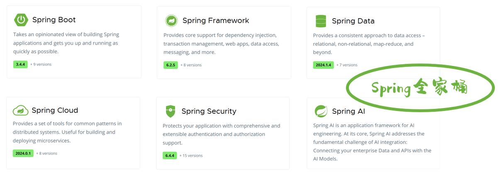

而Spring家族旗下这么多的技术，最基础、最核心的是 SpringFramework。其他的spring家族的技术，都是基于SpringFramework的，SpringFramework中提供很多实用功能，如：依赖注入、事务管理、web开发支持、数据访问、消息服务等等。

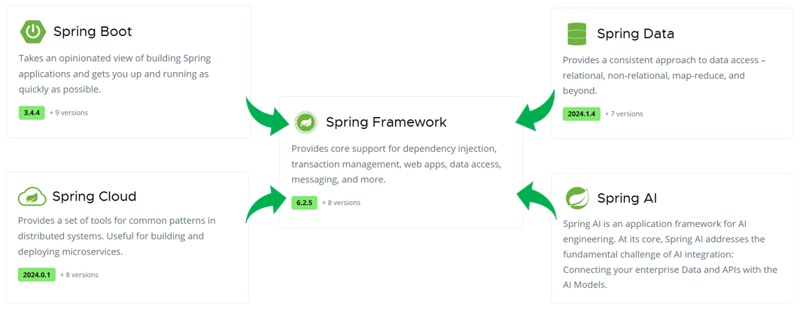

而如果我们在项目中，直接基于SpringFramework进行开发，存在两个问题：

- 配置繁琐

- 入门难度大

所以基于此呢，spring官方推荐我们从另外一个项目开始学习，那就是目前最火爆的SpringBoot。 通过springboot就可以快速的帮我们构建应用程序，所以springboot呢，最大的特点有两个 ：

- 简化配置

- 快速开发

Spring Boot 可以帮助我们非常快速的构建应用程序、简化开发、提高效率 。

而直接基于SpringBoot进行项目构建和开发，不仅是Spring官方推荐的方式，也是现在企业开发的主流。

# 二、Web入门程序

## 1.入门程序

### 1.1.需求

需求：基于SpringBoot的方式开发一个web应用，浏览器发起请求/hello后，给浏览器返回字符串 "Hello xxx \~"。


### 1.2.开发步骤

第1步：创建SpringBoot工程，并勾选Web开发相关依赖

第2步：定义HelloController类，添加方法hello，并添加注解

具体步骤如下：

1.创建SpringBoot工程（需要联网）

基于Spring官方骨架，创建SpringBoot工程。

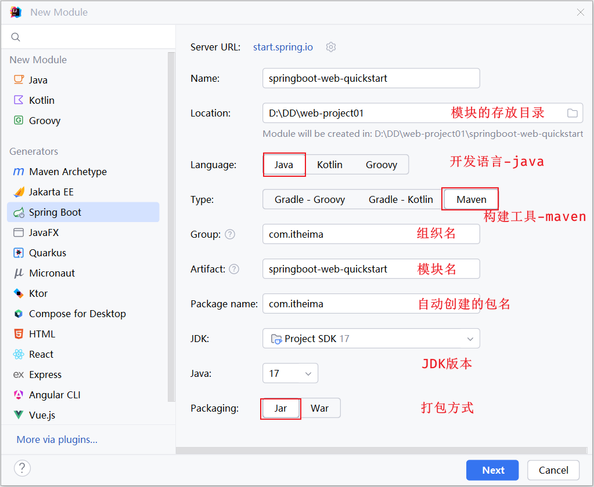

基本信息描述完毕之后，勾选web开发相关依赖。

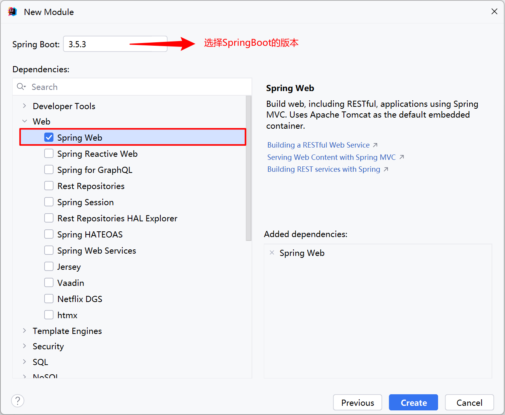

SpringBoot官方提供的脚手架，里面只能够选择SpringBoot的几个最新的版本，如果要选择其他相对低一点的版本，可以在springboot项目创建完毕之后，修改项目的pom\.xml文件中的版本号。

点击Create之后，就会联网创建这个SpringBoot工程，创建好之后，结构如下：

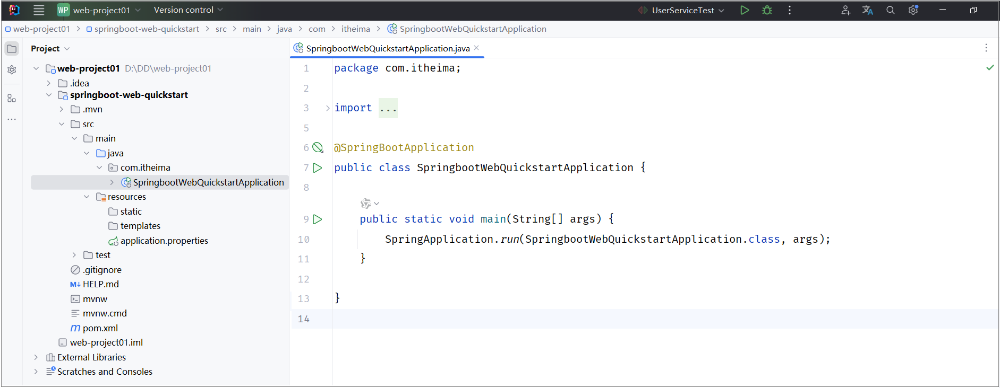

注意：在联网创建过程中，会下载相关资源\(请耐心等待)

2.定义HelloController类，添加方法hello，并添加注解

在`com.itheima`这个包下新建一个类：`HelloController`

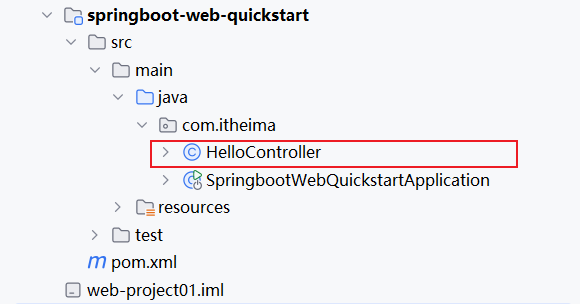

HelloController中的内容，具体如下：

```java
@RestController  //表示该类是一个处理请求的类，类中定义方法方法处理完请求之后响应结果给页面
public class HelloController {

    @RequestMapping("/hello") //给方法定义一个访问路径，一个路径对应一个方法。
    public String hello(String name){  //形参name表示接收请求参数name的值
        System.out.println("name = " + name);
        return "hello " + name;
    }

    @RequestMapping("/say") //给方法定义一个访问路径，一个路径对应一个方法。
    public String say(String name){  //形参name表示接收请求参数name的值
        System.out.println("name = " + name);
        return "say " + name;
    }
}
```

3.运行测试

运行SpringBoot自动生成的引导类 \(标识有`@SpringBootApplication`注解的类\)

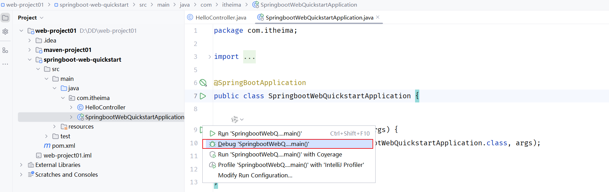

打开浏览器，输入 `http://localhost:8080/hello?name=itheima`

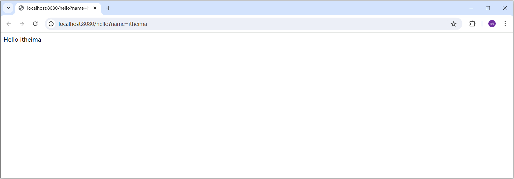

### 1.3.pom\.xml配置文件

```xml
<?xml version="1.0" encoding="UTF-8"?>
<project xmlns="http://maven.apache.org/POM/4.0.0" xmlns:xsi="http://www.w3.org/2001/xmlSchema-instance"
         xsi:schemaLocation="http://maven.apache.org/POM/4.0.0 https://maven.apache.org/xsd/maven-4.0.0.xsd">
    <modelVersion>4.0.0</modelVersion>
    <!--每一个springboot项目都有一个父工程，父工程中定义了常用jar包的版本号-->
    <parent>
        <groupId>org.springframework.boot</groupId>
        <artifactId>spring-boot-starter-parent</artifactId>
        <version>3.5.14</version>
        <relativePath/> <!-- lookup parent from repository -->
    </parent>
    <!--本模块的唯一标识坐标-->
    <groupId>com.itheima</groupId>
    <artifactId>day03-springboot-web</artifactId>
    <version>0.0.1-SNAPSHOT</version>

    <!--<name>day03-springboot-web</name>
    <description>day03-springboot-web</description>
    <url/>
    <licenses>
        <license/>
    </licenses>
    <developers>
        <developer/>
    </developers>
    <scm>
        <connection/>
        <developerConnection/>
        <tag/>
        <url/>
    </scm>
    <properties>
        <java.version>17</java.version>
    </properties>-->
    <!--导入程序需要用到的依赖jar包-->
    <dependencies>
        <!--springboot web开发依赖-->
        <dependency>
            <groupId>org.springframework.boot</groupId>
            <artifactId>spring-boot-starter-web</artifactId>
        </dependency>
        <!--springboot 单元测试依赖-->
        <dependency>
            <groupId>org.springframework.boot</groupId>
            <artifactId>spring-boot-starter-test</artifactId>
            <scope>test</scope>
        </dependency>
    </dependencies>

    <build>
        <plugins>
            <!--sspringboot项目构建的插件(完成编译、打包、运行等动作)，必须保留-->
            <plugin>
                <groupId>org.springframework.boot</groupId>
                <artifactId>spring-boot-maven-plugin</artifactId>
            </plugin>
        </plugins>
    </build>

</project>
```

### 1.4.常见问题

大家在联网基于spring的脚手架创建SpringBoot项目，偶尔可能会因为网内网络的原因，链接不上SpringBoot的脚手架网站，此时会出现如下现象：

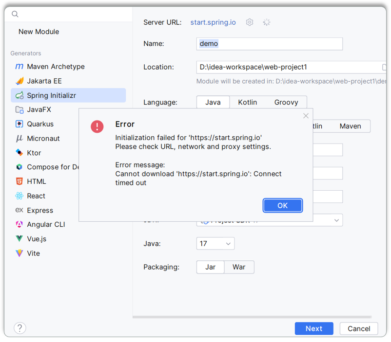

此时可以使用阿里云提供的脚手架，网址为：`https://start.aliyun.com`

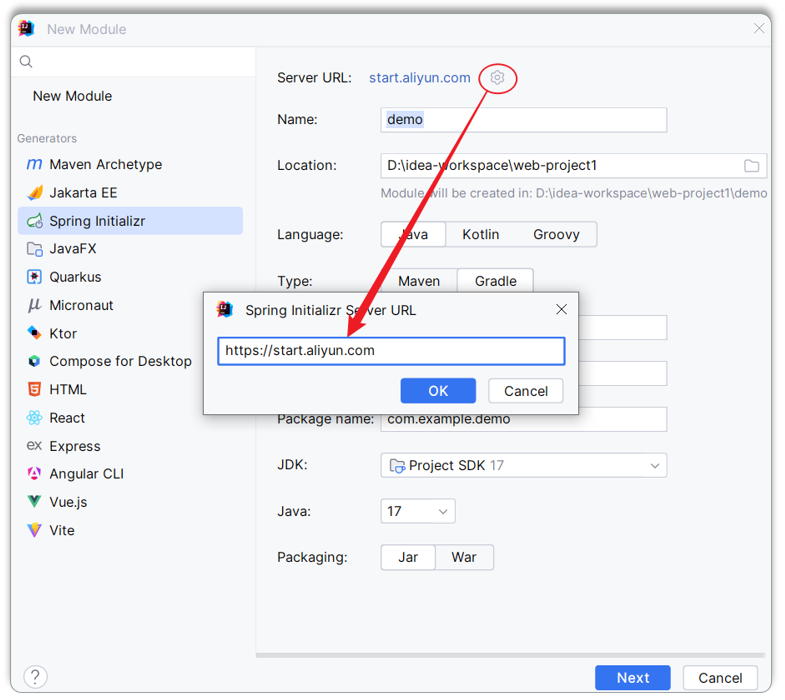

然后按照项目创建的向导，一步一步的创建项目即可。

## 2.程序解析

那在上面呢，我们已经完成了SpringBootWeb的入门程序，并且测试通过。 在入门程序中，我们发现，我们只需要一个main方法就可以将web应用启动起来了，然后就可以打开浏览器访问了。

那接下来我们需要明确两个问题：

1.为什么一个main方法就可以将Web应用启动了？

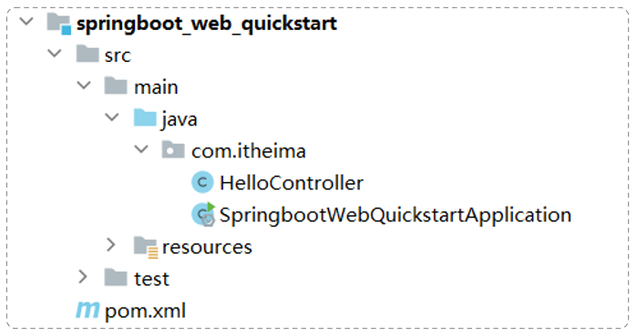

因为我们在创建springboot项目的时候，选择了web开发的起步依赖 `spring-boot-starter-web`。而`spring-boot-starter-web`依赖，又依赖了`spring-boot-starter-tomcat`，由于maven的依赖传递特性，那么在我们创建的springboot项目中也就已经有了tomcat的依赖，这个其实就是springboot中内嵌的tomcat。 

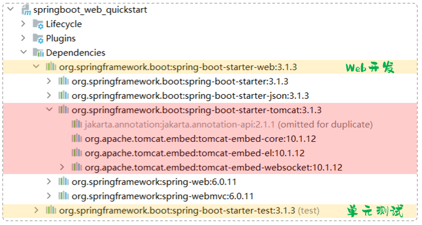

而我们运行引导类中的main方法，其实启动的就是springboot中内嵌的Tomcat服务器。 而我们所开发的项目，也会自动的部署在该tomcat服务器中，并占用8080端口号 。 

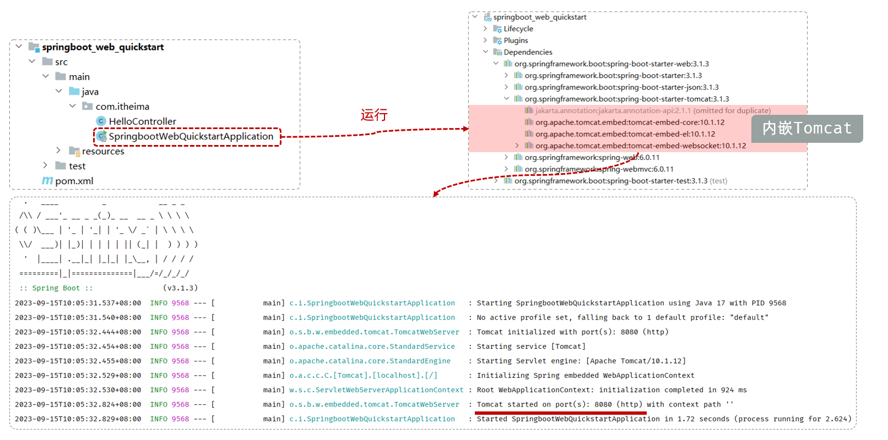

起步依赖：

一种为开发者提供简化配置和集成的机制，使得构建Spring应用程序更加轻松。起步依赖本质上是一组预定义的依赖项集合，它们一起提供了在特定场景下开发Spring应用所需的所有库和配置。

- spring\-boot\-starter\-web：包含了web应用开发所需要的常见依赖。

- spring\-boot\-starter\-test：包含了单元测试所需要的常见依赖。

官方提供的starter：[https://docs\.spring\.io/spring\-boot/docs/3\.1\.3/reference/htmlsingle/\#using\.build\-systems\.starters](https://docs.spring.io/spring-boot/docs/3.1.3/reference/htmlsingle/)

# 三、Web案例

## 1.需求说明

基于SpringBoot，开发Web程序，完成员工列表的渲染展示。

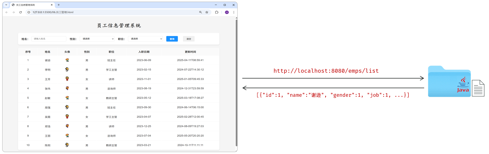

当在浏览器地址栏，访问前端静态页面（`http://localhost:8080/emp.html`）后，在前端页面上，会发送ajax请求，请求服务端（`http://localhost:8080/emps/list`），服务端程序加载 `emp.txt` 文件中的数据，读取出来后最终给前端页面响应json格式的数据，前端页面再将数据渲染展示在表格中。

## 2.代码实现

### 2.1.准备工作

1.创建一个SpringBoot，勾选web依赖，并引入lombok依赖。

这里，我们可以不用再创建新的springboot项目，直接使用入门程序中所创建的springboot项目即可，在其pom\.xml文件中引入lombok的依赖即可 （引入依赖后，记得刷新maven项目）。

```xml
<dependency>
    <groupId>org.projectlombok</groupId>
    <artifactId>lombok</artifactId>
</dependency>
```

2.引入资料中准备好的员工数据的文件 emp\.txt，将其放在resources目录下。 静态页面 emp\.html , 放在 resources/static 目录下。 

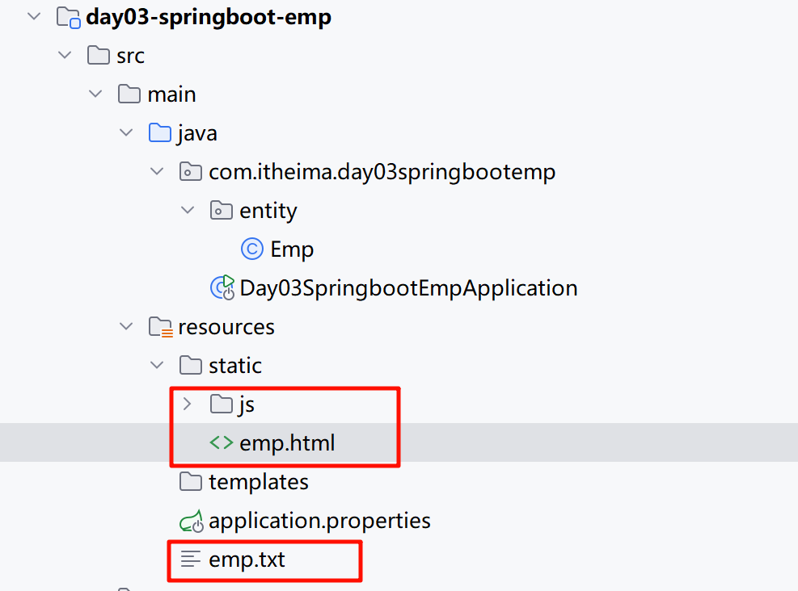

emp\.txt 文件内容如下: 

```java
1,谢逊,https://zxy-data.oss-cn-hangzhou.aliyuncs.com/icon/1.png,1,1,2023-06-09,2025-12-11 08:59:41
2,李明,https://zxy-data.oss-cn-hangzhou.aliyuncs.com/icon/2.png,1,3,2023-02-15,2025-12-22 14:30:12
3,王芳,https://zxy-data.oss-cn-hangzhou.aliyuncs.com/icon/3.png,2,2,2023-11-01,2026-01-05 09:45:33
4,张伟,https://zxy-data.oss-cn-hangzhou.aliyuncs.com/icon/4.png,1,5,2023-08-19,2025-12-31 23:59:59
5,赵敏,https://zxy-data.oss-cn-hangzhou.aliyuncs.com/icon/1.png,2,4,2023-05-12,2026-03-18 17:08:27
6,周强,https://zxy-data.oss-cn-hangzhou.aliyuncs.com/icon/2.png,1,1,2023-09-30,2025-06-14 06:15:00
7,吴霞,https://zxy-data.oss-cn-hangzhou.aliyuncs.com/icon/3.png,2,3,2023-04-07,2026-02-28 12:00:45
8,郑浩,https://zxy-data.oss-cn-hangzhou.aliyuncs.com/icon/4.png,1,2,2023-12-25,2025-08-09 19:27:03
```

3.定义一个实体类Emp，用来封装员工信息。

创建一个包 `entity` ，将实体类放在该包中。

```java
@Data
@NoArgsConstructor
@AllArgsConstructor
public class Emp {
    private Integer id; //编号
    private String name; //姓名
    private String image; //头像
    private Integer gender; //性别
    private String job; //职位
    private LocalDate entryDate; //入职日期
    private LocalDateTime updateTime; //更新时间
}
```

4.项目搭建完成之后运行启动类，通过浏览器访问前端页面：

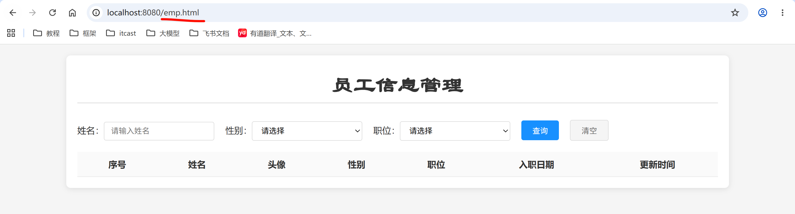

### 2.2.服务端程序

创建一个包 `com.itheima.controller` ，在该包中定义一个EmpController。具体代码如下：

```java
package com.itheima.day03springbootemp.controller;

import com.itheima.day03springbootemp.entity.Emp;
import org.springframework.util.ResourceUtils;
import org.springframework.web.bind.annotation.RequestMapping;
import org.springframework.web.bind.annotation.ResponseBody;
import org.springframework.web.bind.annotation.RestController;

import java.io.File;
import java.io.FileNotFoundException;
import java.io.IOException;
import java.nio.file.Files;
import java.time.LocalDate;
import java.time.LocalDateTime;
import java.time.format.DateTimeFormatter;
import java.util.List;
import java.util.stream.Collectors;

//@ResponseBody  //表示类中的所有方法的返回值会响应给客户端，如果返回值是对象或者集合，会自动转成json响应给客户端
//@RestController 等价于  @Controller+@ResponseBody，所以我们直接使用@RestController即可
@RestController//表示该类是一个处理请求的类，类中定义方法方法处理完请求之后响应结果给页面
public class EmpController {


    //@ResponseBody  //表示方法的返回值会响应给客户端，如果返回值是对象或者集合，会自动转成json响应给客户端
    @RequestMapping("/list")//给方法定义一个访问路径，一个路径对应一个方法。
    public List<Emp> list() throws IOException {
        //1 加载并读取emp.txt文本中的数据--->List<String>
        File file = ResourceUtils.getFile("classpath:emp.txt");
        List<String> list = Files.readAllLines(file.toPath());

        //2 处理数据，并将List<String>转换成List<Emp>集合
        List<Emp> empList = list.stream().map(line -> {
            //line="1,谢逊,https://zxy-data.oss-cn-hangzhou.aliyuncs.com/icon/1.png,1,1,2023-06-09,2025-12-11 08:59:41"
            //2.1 字符串切割，得到每一个数据的数组
            String[] split = line.split(","); //["1","谢逊","图片地址","1","1",...]
            //2.2 处理编号(id)、性别(gender)、入职日期(entryDate)、更新时间(updateTime)
            int id = Integer.parseInt(split[0]);
            int gender = Integer.parseInt(split[3]);
            LocalDate entryDate = LocalDate.parse(split[5], DateTimeFormatter.ofPattern("yyyy-MM-dd"));
            LocalDateTime updateTime = LocalDateTime.parse(split[6], DateTimeFormatter.ofPattern("yyyy-MM-dd HH:mm:ss"));
            //2.3 封装成Emp对象返回
            return new Emp(id, split[1], split[2], gender, split[4], entryDate, updateTime);
            //2.4 回收到List集合中
        }).toList();

        //3 响应结果，spring能自动将empList集合转成json响应给客户端
        return empList;
    }
}
```

代码编写完毕后，我们可以启动项目，进行测试，直接访问：http://localhost:8080/emp\.html 。最终我们可以看到员工的数据，可以正常加载并展示在页面上 。

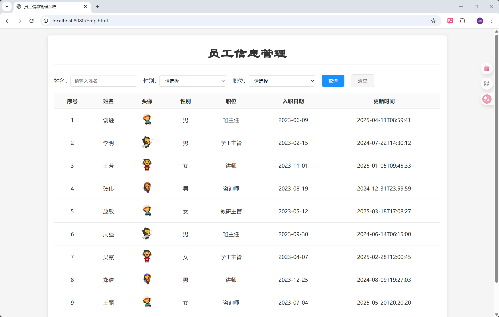

上述案例的功能，我们虽然已经实现，但是呢，我们会发现案例中：解析文本文件中的数据，处理数据的逻辑代码，给页面响应的代码全部都堆积在一起了，全部都写在controller方法中了。

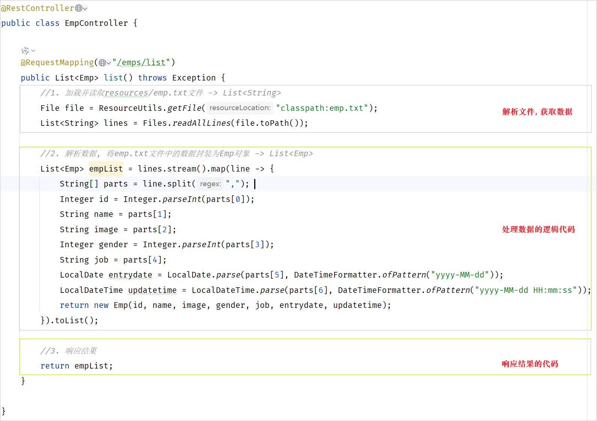

当前程序的这个业务逻辑还是比较简单的，如果业务逻辑再稍微复杂一点，我们会看到Controller方法的代码量就很大了。

- 当我们要修改操作数据部分的代码，需要改动Controller

- 当我们要完善逻辑处理部分的代码，需要改动Controller

- 当我们需要修改数据响应的代码，还是需要改动Controller

这样呢，就会造成我们整个工程代码的复用性比较差，而且代码难以维护。 那如何解决这个问题呢？其实在现在的开发中，有非常成熟的解决思路，那就是分层开发。 

## 3.三层架构

### 3.1.介绍

在我们进行程序设计以及程序开发时，尽可能让每一个接口、类、方法的职责更单一些（单一职责原则）。

单一职责原则：一个类或一个方法，就只做一件事情，只管一块功能。这样就可以让类、接口、方法的复杂度更低，可读性更强，扩展性更好，也更利于后期的维护。

我们之前开发的程序呢，并不满足单一职责原则。下面我们来分析下之前的程序：

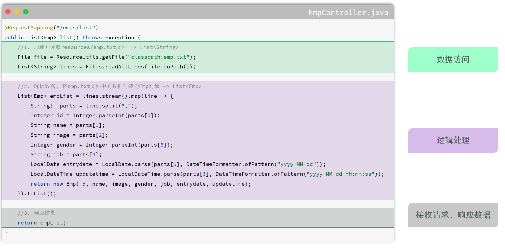

那其实我们上述案例的处理逻辑呢，从组成上看可以分为三个部分：

- 数据访问：负责业务数据的维护操作，包括增、删、改、查等操作。

- 逻辑处理：负责业务逻辑处理的代码。

- 请求处理、响应数据：负责，接收页面的请求，给页面响应数据。

按照上述的三个组成部分，在我们项目开发中呢，可以将代码分为三层，如图所示：

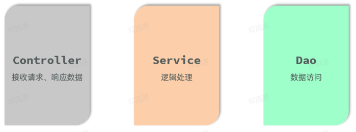

- Controller：控制层。接收前端发送的请求，对请求进行处理，并响应数据。

- Service：业务逻辑层。处理具体的业务逻辑。

- Dao：数据访问层\(Data Access Object\)，也称为持久层。负责数据访问操作，包括数据的增、删、改、查。

基于三层架构的程序执行流程，如图所示：

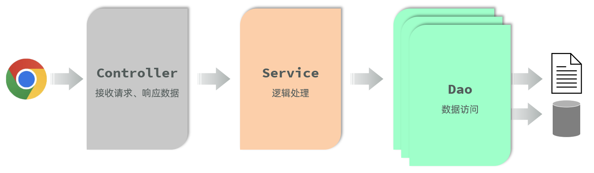

- 前端发起的请求，由Controller层接收（Controller响应数据给前端）
- Controller层调用Service层来进行逻辑处理（Service层处理完后，把处理结果返回给Controller层）
- Serivce层调用Dao层（逻辑处理过程中需要用到的一些数据要从Dao层获取）
- Dao层操作文件中的数据（Dao拿到的数据会返回给Service层）

思考：按照三层架构的思想，如果要对业务逻辑\(Service层\)进行变更，会影响到Controller层和Dao层吗？ 

答案：不会影响。 （程序的扩展性、维护性变得更好了）

### 3.2.代码实现

我们使用三层架构思想，来改造下之前的程序：

- 控制层包名：`com.itheima.controller`

- 业务逻辑层包名：`com.itheima.service`

- 数据访问层包名：`com.itheima.dao`


1.控制层：接收前端发送的请求，对请求进行处理，并响应数据

在 `com.itheima.controller` 中创建EmpController类 \(已经存在就不用再创建了\)，代码如下：

```java
package com.itheima.controller;

import com.itheima.entity.Emp;
import com.itheima.service.EmpService;
import com.itheima.service.impl.EmpServiceImpl;
import org.springframework.web.bind.annotation.RequestMapping;
import org.springframework.web.bind.annotation.RestController;
import java.util.List;

@RestController
public class EmpController {

    private EmpService empService = new EmpServiceImpl();

    @RequestMapping("/list")
    public List<Emp> list() throws Exception {
        //1. 调用EmpService获取数据
        List<Emp> empList = empService.list();
        //3. 响应结果
        return empList;
    }

}
```

2.业务逻辑层：处理具体的业务逻辑

在 `com.itheima.service`中创建EmpSerivce接口，代码如下：

```java
package com.itheima.service;

import com.itheima.entity.Emp;

import java.util.List;

public interface EmpService {

    /**
     * 查询所有员工
     */
    public List<Emp> list() throws Exception;

}
```

在 `com.itheima.service.impl` 中创建EmpSerivceImpl接口，代码如下：

```java
package com.itheima.service.impl;

import com.itheima.dao.EmpDao;
import com.itheima.dao.impl.EmpDaoImpl;
import com.itheima.entity.Emp;
import com.itheima.service.EmpService;

import java.time.LocalDate;
import java.time.LocalDateTime;
import java.time.format.DateTimeFormatter;
import java.util.List;

public class EmpServiceImpl implements EmpService {

    private EmpDao empDao = new EmpDaoImpl();

    @Override
    public List<Emp> list() throws Exception {
        //1. 调用EmpDao中的list()方法, 获取emp.txt文件中的数据
        List<String> lines = empDao.list();

        //2. 解析数据, 将emp.txt文件中的数据封装为Emp对象 -> List<Emp>
        List<Emp> empList = lines.stream().map(line -> {
            String[] parts = line.split(",");
            Integer id = Integer.parseInt(parts[0]);
            String name = parts[1];
            String image = parts[2];
            Integer gender = Integer.parseInt(parts[3]);
            String job = parts[4];
            LocalDate entrydate = LocalDate.parse(parts[5], DateTimeFormatter.ofPattern("yyyy-MM-dd"));
            LocalDateTime updatetime = LocalDateTime.parse(parts[6], DateTimeFormatter.ofPattern("yyyy-MM-dd HH:mm:ss"));
            return new Emp(id, name, image, gender, job, entrydate, updatetime);
        }).toList();

        return empList;
    }
}
```

3.数据访问层：负责数据的访问操作，包含数据的增、删、改、查

在 `com.itheima.dao`中创建EmpDao接口，代码如下：

```java
package com.itheima.dao;

import java.util.List;

public interface EmpDao {

    /**
     * 查询所有员工
     */
    public List<String> list() throws Exception;

}
```

在 `com.itheima.dao.impl` 中创建EmpDaoImpl接口，代码如下：

```java
package com.itheima.dao.impl;

import com.itheima.dao.EmpDao;
import org.springframework.util.ResourceUtils;
import java.io.File;
import java.nio.file.Files;
import java.util.List;

public class EmpDaoImpl implements EmpDao {
    @Override
    public List<String> list() throws Exception {
        //1. 加载并读取resources/emp.txt文件 -> List<String>
        File file = ResourceUtils.getFile("classpath:emp.txt");
        List<String> list= Files.readAllLines(file.toPath());
        return list;
    }
}
```

具体的请求调用流程：

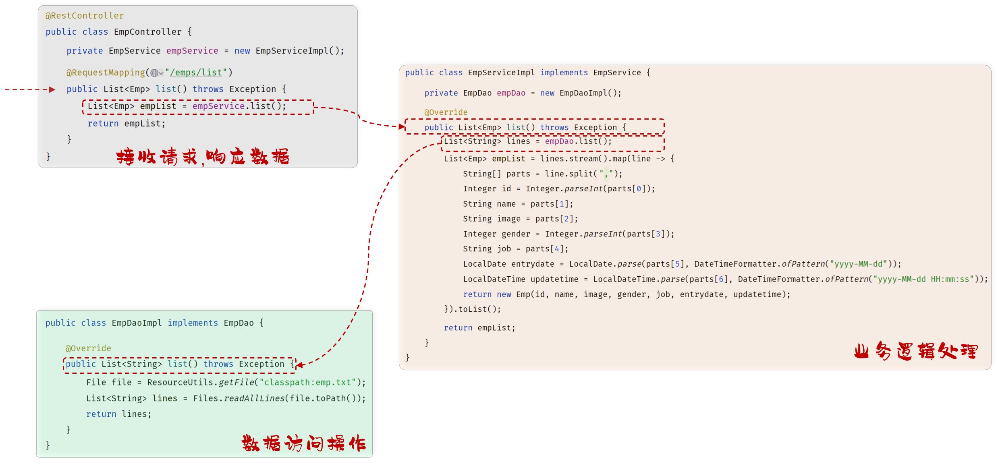

# 四、分层解耦

## 1.问题分析

由于我们现在在程序中，需要什么对象，直接new一个对象 `new EmpServiceImpl()`  

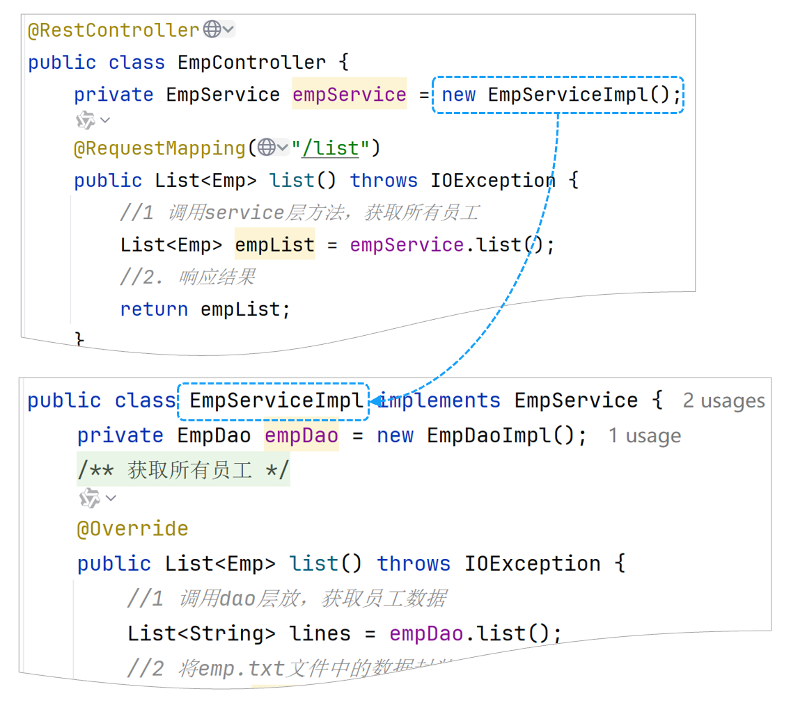

如果说我们需要更换实现类，比如由于业务的变更，EmServiceImpl 不能满足现有的业务需求，我们需要切换为 EmpServiceImpl2 这套实现，就需要修改Contorller的代码，需要创建 EmpServiceImpl2 的实现`new EmpServicImpl2()` 。

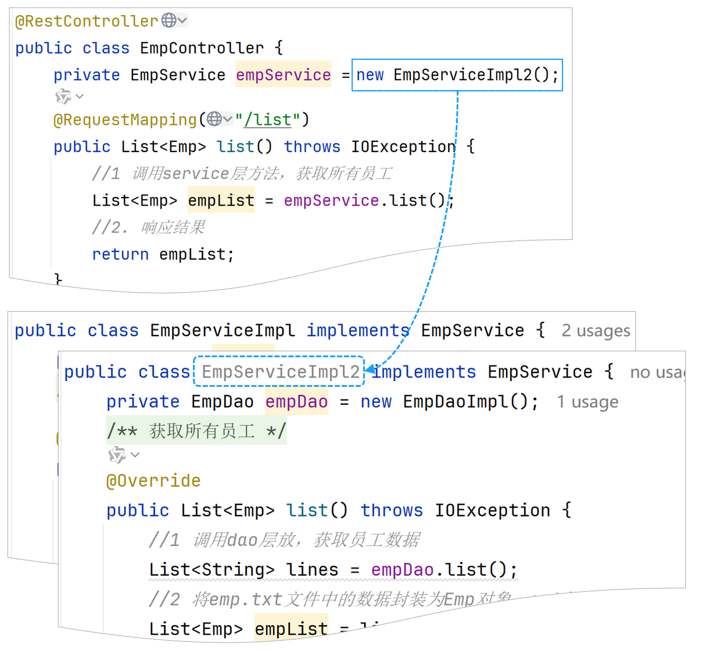

Controller中调用Service，也是类似的问题。这种呢，我们就称之为层与层之间 耦合 了。 那什么是耦合呢 ？

耦合：衡量软件中各个层/模块之间的依赖、关联的程度。

软件设计原则：低耦合。

低耦合：指的是软件中各个层、模块之间的依赖关联程序越低越好。

目前层与层之间是存在耦合的，Controller耦合了Service、Service耦合了Dao。而 高内聚、低耦合的目的是使程序模块的可重用性、移植性大大增强。

那最终我们的目标呢，就是做到层与层之间，尽可能的降低耦合，甚至解除耦合。

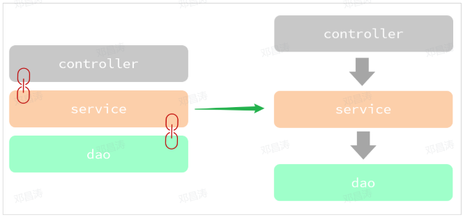

## 2.解耦思路

之前我们在编写代码时，需要什么对象，就直接new一个就可以了。 这种做法呢，层与层之间代码就耦合了，当Dao层的实现变了之后， 我们还需要修改Service层的代码。

那应该怎么解耦呢？

1.首先不能在EmpController中使用new对象。代码如下：

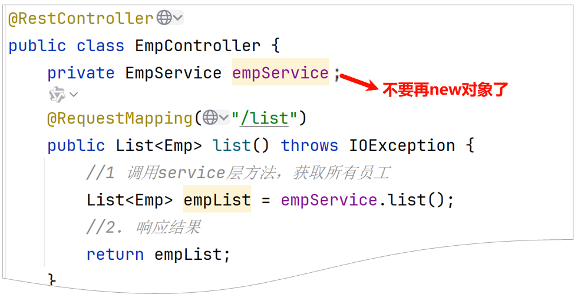

此时，就存在另一个问题了，不能new，就意味着没有Service层对象（程序运行就报错），怎么办呢? 

我们的解决思路是：

- Spring提供一个容器，容器中存储一些对象\(例：EmpServiceImpl对象\)

- Spring程序从容器中获取EmpService类型的对象

2.将要用到的对象交给一个容器管理。

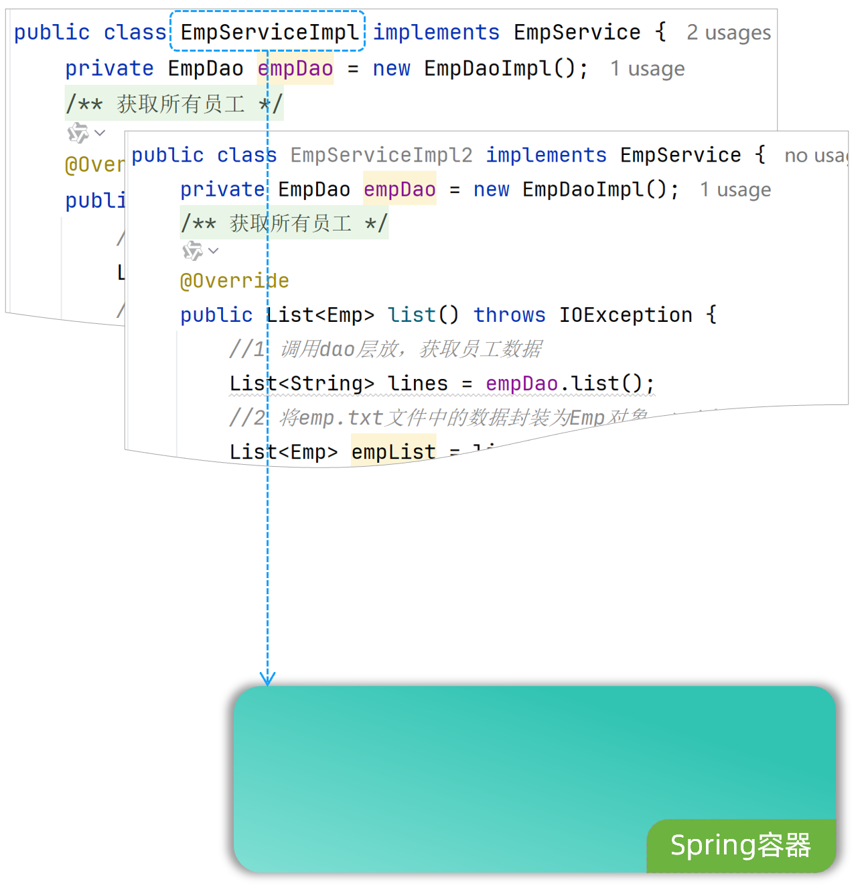

3.应用程序中用到这个对象，就直接从容器中获取

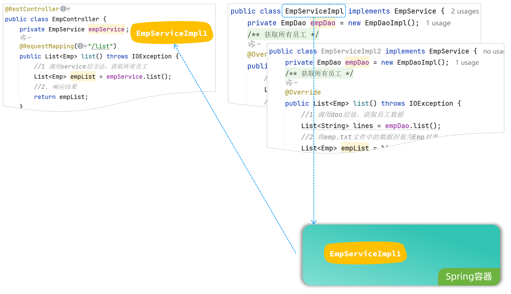

那问题来了，我们如何将对象交给容器管理呢？ 程序运行时，容器如何为程序提供依赖的对象呢？ 

我们想要实现上述解耦操作，就涉及到Spring中的两个核心概念：

- 控制反转： Inversion Of Control，简称IOC。将创建对象的权力由自身交给Spring（容器），这种思想称为控制反转。

    对象的创建权由程序员主动创建转移到容器\(由容器创建、管理对象\)。这个容器称为：IOC容器或Spring容器。

- 依赖注入： Dependency Injection，简称DI。容器为应用程序提供运行时，所依赖的资源\(对象\)，称之为依赖注入。

    程序运行时需要某个资源，此时容器就为其提供这个资源。

    例：EmpController程序运行时需要EmpService对象，Spring容器就为其提供并注入EmpService对象。

- bean对象：IOC容器中创建、管理的对象，称之为：bean对象。

## 3.IOC\&DI入门

1.将Service及Dao层的实现类，交给IOC容器管理

在实现类加上 `@Component` 注解，就代表把当前类产生的对象交给IOC容器管理。

EmpDaoImpl

```java
import com.itheima.dao.EmpDao;
import org.springframework.stereotype.Component;
import org.springframework.util.ResourceUtils;
import java.io.File;
import java.nio.file.Files;
import java.util.List;

@Component //属于IOC注解，让spring创建该类的对象保存到IOC容器(spring容器)中
public class EmpDaoImpl implements EmpDao {
    @Override
    public List<String> list() throws Exception {
        //1. 加载并读取resources/emp.txt文件 -> List<String>
        File file = ResourceUtils.getFile("classpath:emp.txt");
        List<String> lines = Files.readAllLines(file.toPath());
        return lines;
    }
}
```

EmpServiceImpl

```java
@Component //属于IOC注解，让spring创建该类的对象保存到IOC容器(spring容器)中
public class EmpServiceImpl implements EmpService {

    private EmpDao empDao;

    @Override
    public List<Emp> list() throws Exception {
        //1. 调用EmpDao中的list()方法, 获取emp.txt文件中的数据
        List<String> lines = empDao.list();

        //2. 解析数据, 将emp.txt文件中的数据封装为Emp对象 -> List<Emp>
        List<Emp> empList = lines.stream().map(line -> {
            String[] parts = line.split(",");
            Integer id = Integer.parseInt(parts[0]);
            String name = parts[1];
            String image = parts[2];
            Integer gender = Integer.parseInt(parts[3]);
            String job = parts[4];
            LocalDate entrydate = LocalDate.parse(parts[5], DateTimeFormatter.ofPattern("yyyy-MM-dd"));
            LocalDateTime updatetime = LocalDateTime.parse(parts[6], DateTimeFormatter.ofPattern("yyyy-MM-dd HH:mm:ss"));
            return new Emp(id, name, image, gender, job, entrydate, updatetime);
        }).toList();

        return empList;
    }
}
```

2.为Controller 及 Service注入运行时所依赖的对象

EmpServiceImpl

```java
package com.itheima.service.impl;

import com.itheima.dao.EmpDao;
import com.itheima.entity.Emp;
import com.itheima.service.EmpService;
import org.springframework.beans.factory.annotation.Autowired;
import org.springframework.stereotype.Component;

import java.time.LocalDate;
import java.time.LocalDateTime;
import java.time.format.DateTimeFormatter;
import java.util.List;

@Component
public class EmpServiceImpl implements EmpService {

    @Autowired //DI注解，让spring从IOC容器中找EmpDao类型的对象，有就赋值，没有就报错
    private EmpDao empDao;

    @Override
    public List<Emp> list() throws Exception {
        //1. 调用EmpDao中的list()方法, 获取emp.txt文件中的数据
        List<String> lines = empDao.list();

        //2. 解析数据, 将emp.txt文件中的数据封装为Emp对象 -> List<Emp>
        List<Emp> empList = lines.stream().map(line -> {
            String[] parts = line.split(",");
            Integer id = Integer.parseInt(parts[0]);
            String name = parts[1];
            String image = parts[2];
            Integer gender = Integer.parseInt(parts[3]);
            String job = parts[4];
            LocalDate entrydate = LocalDate.parse(parts[5], DateTimeFormatter.ofPattern("yyyy-MM-dd"));
            LocalDateTime updatetime = LocalDateTime.parse(parts[6], DateTimeFormatter.ofPattern("yyyy-MM-dd HH:mm:ss"));
            return new Emp(id, name, image, gender, job, entrydate, updatetime);
        }).toList();

        return empList;
    }
}
```

EmpController

```java
package com.itheima.controller;

import com.itheima.entity.Emp;
import com.itheima.service.EmpService;
import org.springframework.beans.factory.annotation.Autowired;
import org.springframework.web.bind.annotation.RequestMapping;
import org.springframework.web.bind.annotation.RestController;
import java.util.List;

@RestController
public class EmpController {
    
    @Autowired //DI注解，让spring从IOC容器中找EmpService类型的对象，有就赋值，没有就报错
    private EmpService empService ;
    
    @RequestMapping("/list")
    public List<Emp> list() throws Exception {
        //1. 调用EmpService获取数据
        List<Emp> empList = empService.list();
        //3. 响应结果
        return empList;
    }
    
}
```

启动服务，运行测试。 打开浏览器，地址栏直接访问：http://localhost:8080/emp\.html 。 依然正常访问，就说明入门程序完成了。 已经完成了层与层之间的解耦。

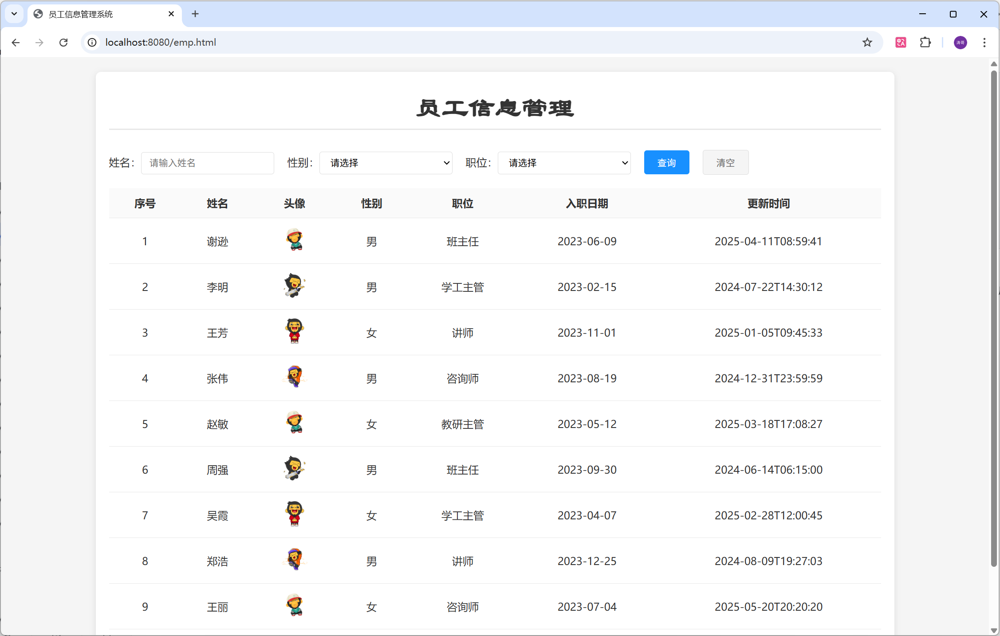

## 4.IOC详解

### 4.1.bean的声明

前面我们提到IOC控制反转，就是将对象的控制权交给Spring的IOC容器，由IOC容器创建及管理对象。IOC容器创建的对象称为bean对象。

在之前的入门案例中，要把某个对象交给IOC容器管理，需要在类上添加一个注解：`@Component`

而Spring框架为了更好的标识web应用程序开发当中，bean对象到底归属于哪一层，又提供了@Component的衍生注解：

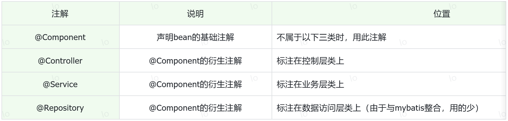

那么此时，我们就可以使用 `@Service` 注解声明Service层的bean。 使用 `@Repository` 注解声明Dao层的bean。 代码实现如下：

Service层:

```java
package com.itheima.service.impl;

import com.itheima.dao.EmpDao;
import com.itheima.entity.Emp;
import com.itheima.service.EmpService;
import org.springframework.beans.factory.annotation.Autowired;
import org.springframework.stereotype.Service;
import java.time.LocalDate;
import java.time.LocalDateTime;
import java.time.format.DateTimeFormatter;
import java.util.List;

//@Service  //属于IOC注解，将Service层的类交给spring创建对象保存到IOC容器(spring容器)中
public class EmpServiceImpl implements EmpService {

    @Autowired
    private EmpDao empDao;

    @Override
    public List<Emp> list() throws Exception {
        //1. 调用EmpDao中的list()方法, 获取emp.txt文件中的数据
        List<String> lines = empDao.list();

        //2. 解析数据, 将emp.txt文件中的数据封装为Emp对象 -> List<Emp>
        List<Emp> empList = lines.stream().map(line -> {
            String[] parts = line.split(",");
            Integer id = Integer.parseInt(parts[0]);
            String name = parts[1];
            String image = parts[2];
            Integer gender = Integer.parseInt(parts[3]);
            String job = parts[4];
            LocalDate entrydate = LocalDate.parse(parts[5], DateTimeFormatter.ofPattern("yyyy-MM-dd"));
            LocalDateTime updatetime = LocalDateTime.parse(parts[6], DateTimeFormatter.ofPattern("yyyy-MM-dd HH:mm:ss"));
            return new Emp(id, name, image, gender, job, entrydate, updatetime);
        }).toList();

        return empList;
    }
}
```

Dao层:

```java
package com.itheima.dao.impl;

import com.itheima.dao.EmpDao;
import org.springframework.stereotype.Repository;
import org.springframework.util.ResourceUtils;
import java.io.File;
import java.nio.file.Files;
import java.util.List;

@Repository  //属于IOC注解，将Dao层的类交给spring创建对象保存到IOC容器(spring容器)中,以后不用
public class EmpDaoImpl implements EmpDao {
    @Override
    public List<String> list() throws Exception {
        //1. 加载并读取resources/emp.txt文件 -> List<String>
        File file = ResourceUtils.getFile("classpath:emp.txt");
        List<String> lines = Files.readAllLines(file.toPath());
        return lines;
    }
}
```

注意1：声明bean的时候，可以通过注解的value属性指定bean的名字，如果没有指定，默认为类名首字母小写。

注意2：使用以上四个注解都可以声明bean，但是在springboot集成web开发中，声明控制器bean只能用@Controller。

### 4.2.组件扫描

问题：使用前面学习的四个注解声明的bean，一定会生效吗？

答案：不一定。（原因：bean想要生效，还需要被组件扫描）

前面声明bean的四大注解，要想生效，还需要被组件扫描注解 `@ComponentScan` 扫描。

该注解虽然没有显式配置，但是实际上已经包含在了启动类声明注解 `@SpringBootApplication` 中，默认扫描的范围是启动类所在包及其子包。

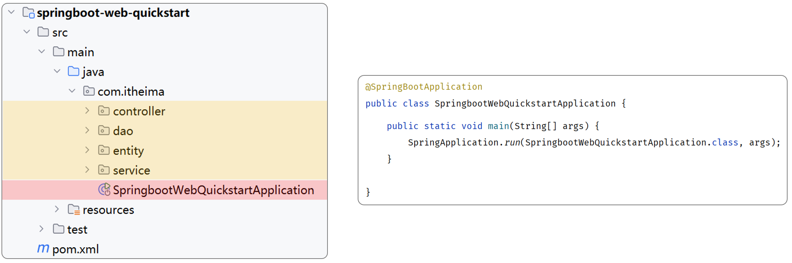

所以，我们在项目开发中，只需要按照如上项目结构，将项目中的所有的业务类，都放在启动类所在包的子包中，就无需考虑组件扫描问题。

## 5.DI详解

我们讲解了控制反转IOC的细节，接下来呢，我们学习依赖注解DI的细节。

依赖注入，是指IOC容器要为应用程序去提供运行时所依赖的资源，而资源指的就是对象。

在入门程序案例中，我们使用了@Autowired这个注解，完成了依赖注入的操作，而这个Autowired翻译过来叫：自动装配。

`@Autowired`注解，默认是按照类型进行自动装配的（去IOC容器中找某个类型的对象，然后完成注入操作）

入门程序举例：在EmpController运行的时候，就要到IOC容器当中去查找EmpService这个类型的对象，而我们的IOC容器中刚好有一个EmpService这个类型的对象，所以就找到了这个类型的对象完成注入操作。

### 5.1.@Autowired用法

@Autowired 进行依赖注入，常见的方式，有如下三种：

1.属性注入

```java
@RestController
public class EmpController {

    //方式一: 属性注入
    @Autowired
    private EmpService empService;
    
  }
```

- 优点：代码简洁、方便快速开发。

- 缺点：隐藏了类之间的依赖关系、可能会破坏类的封装性。

2.构造函数注入

```java
@RestController
public class EmpController {

    //方式一: 属性注入
    @Autowired
    private EmpService empService;
    
  }
```

- 优点：能清晰地看到类的依赖关系、提高了代码的安全性。

- 缺点：代码繁琐、如果构造参数过多，可能会导致构造函数臃肿。

- 注意：如果只有一个构造函数，@Autowired注解可以省略。（通常来说，也只有一个构造函数）

3.setter注入

```java
/**
 * 用户信息Controller
 */
@RestController
public class EmpController {
       
    private EmpService empService ;
    //方式三: setter注入
    @Autowired
    public void setUserService(EmpService empService) {
        this.empService= empService;
    }
    
}    
```

- 优点：保持了类的封装性，依赖关系更清晰。

- 缺点：需要额外编写setter方法，增加了代码量。

在项目开发中，基于@Autowired进行依赖注入时，基本都是第一种和第二种方式。（官方推荐第二种方式，因为会更加规范）但是在企业项目开发中，很多的项目中，也会选择第一种方式因为更加简洁、高效（在规范性方面进行了妥协）。

### 5.2.注意事项

那如果在IOC容器中，存在多个相同类型的bean对象，会出现什么情况呢？

在下面的例子中，我们准备了两个EmpService的实现类，并且都交给了IOC容器管理。 代码如下：

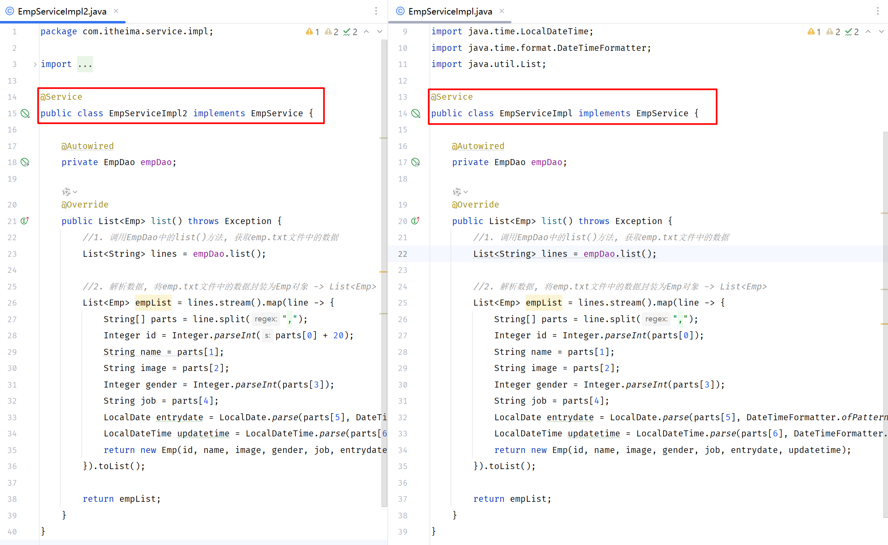

此时，我们启动项目会发现，控制台报错了：

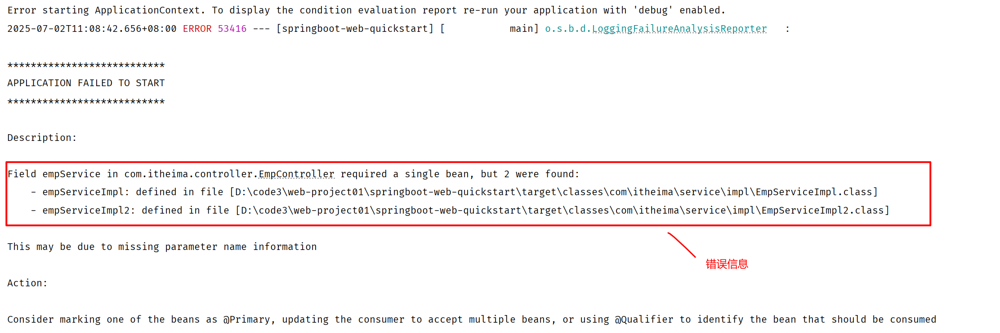

出现错误的原因呢，是因为在Spring的容器中，UserService这个类型的bean存在两个，框架不知道具体要注入哪个bean使用，所以就报错了。

如何解决上述问题呢？Spring提供了以下几种解决方案：

- @Primary

- @Qualifier

- @Resource

方案一：使用@Primary注解

当存在多个相同类型的Bean注入时，加上@Primary注解，来确定默认的实现。

```java
@Primary
@Service
public class EmpServiceImpl implements EmpService {
}
```

方案二：使用@Qualifier注解

指定当前要注入的bean对象。 在@Qualifier的value属性中，指定注入的bean的名称。 @Qualifier注解不能单独使用，必须配合@Autowired使用。

```java
@RestController
public class EmpController {

    @Autowired //DI注解，让spring从IOC容器中找EmpService类型的对象，有就赋值，没有就报错
    //方案二：使用@Autowired + @Qualifier注解
    @Qualifier("empServiceImpl")  //指定要注入哪个Bean，参数为Bean的名称，必须配合@Autowired一起用
    private EmpService empService;
    
}
```

方案三：使用@Resource注解

是按照bean的名称进行注入。通过name属性指定要注入的bean的名称。

```java
@RestController
public class EmpController {
        
    //方案三：使用Resource注解根据名称注入
    //@Resource  //Java提供的注解，spring也能识别，默认按照名称注入，从容器中找和变量名同名的Bean对象，如果找到就注入，找不到就根据类型找，如果找到就注入，没找到就报错，同类型有多个Bean对象也报错。
    @Resource(name = "empServiceImpl") //手动指定要注入的Bean对象的名字
    private EmpService empService;
    
}
```

面试题：@Autowird 与 @Resource的区别

- @Autowired 是spring框架提供的注解，而@Resource是JDK提供的注解

- @Autowired 默认是按照类型注入，而@Resource是按照名称注入

# 五、常见状态码

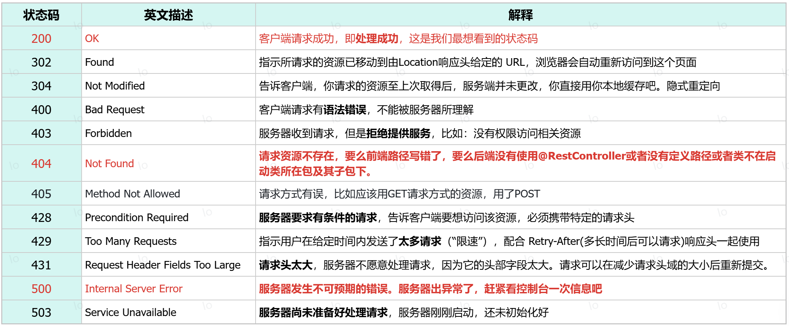

状态码大全：https://cloud.tencent.com/developer/chapter/13553 

# 五、SpringAOP

## 1.AOP引入

接下来我们进入到AOP的学习。 AOP也是spring框架的第二大核心，我们先来学习AOP的基础。

什么是AOP？

AOP：Aspect Oriented Programming（面向切面编程、面向方面编程），其实说白了，面向切面编程就是面向特定方法编程。 

那什么又是面向方法编程呢，为什么又需要面向方法编程呢？

来，我们举个例子做一个说明：

比如，我们这里有一个项目，项目中开发了很多的业务功能。然而有一些业务功能执行效率比较低，执行耗时较长，我们需要针对于这些业务方法进行优化。 那首先第一步就需要定位出执行耗时比较长的业务方法，再针对于业务方法再来进行优化。

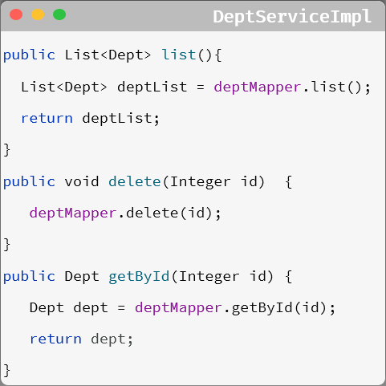

此时我们就需要统计当前这个项目当中每一个业务方法的执行耗时。那么统计每一个业务方法的执行耗时该怎么实现？

可能多数人首先想到的就是在每一个业务方法运行之前，记录这个方法运行的开始时间。在这个方法运行完毕之后，再来记录这个方法运行的结束时间。拿结束时间减去开始时间，不就是这个方法的执行耗时吗。

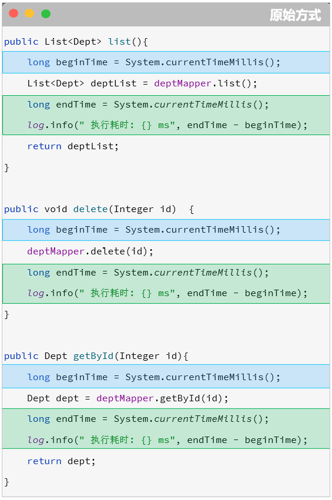

而这个功能如果通过AOP来实现，我们只需要单独定义下面这一小段代码即可，不需要修改原始的任何业务方法即可记录每一个业务方法的执行耗时。

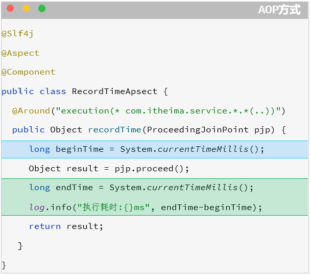

所以，AOP的优势主要体现在以下四个方面：

- 减少重复代码：不需要在业务方法中定义大量的重复性的代码，只需要将重复性的代码抽取到AOP程序中即可。

- 代码无侵入：在基于AOP实现这些业务功能时，对原有的业务代码是没有任何侵入的，不需要修改任何的业务代码。

- 提高开发效率

- 维护方便

> AOP是一种思想，而在Spring框架中，对这种思想进行了实现，那我们要学习的就是Spring AOP。
>

## 2.AOP基础

### 2.1.AOP入门

在了解了什么是AOP后，我们下面通过一个快速入门程序，体验下AOP的开发，并掌握Spring中AOP的开发步骤。

需求：统计部门管理各个业务层方法执行耗时。

原始方式：

在原始的实现方式中，我们需要在业务层的也一个方法执行执行，获取方法运行的开始时间； 然后运行原始的方法逻辑； 最后在每一个方法运行结束时，获取方法运行结束时间，计算执行耗时。

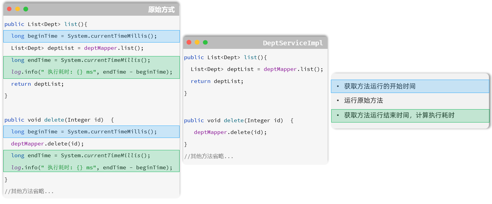

SpringAOP实现步骤：

为演示方便，可以直接导入资料中提供的`springboot-aop-quickstart`项目工程

1.导入依赖：在 pom\.xml 文件中导入 AOP 的依赖

```xml
<dependency>
    <groupId>org.springframework.boot</groupId>
    <artifactId>spring-boot-starter-aop</artifactId>
</dependency>
```

2.编写AOP程序：针对于特定方法根据业务需要进行编程

```java
@Component
@Aspect //当前类为切面类
@Slf4j
public class RecordTimeAspect {

    @Around("execution(* com.itheima.service.impl.*.*(..))")
    public Object recordTime(ProceedingJoinPoint pjp) throws Throwable {
        //记录方法执行开始时间
        long begin = System.currentTimeMillis();

        //执行原始方法
        Object result = pjp.proceed();

        //记录方法执行结束时间
        long end = System.currentTimeMillis();

        //计算方法执行耗时
        log.info("方法执行耗时: {}毫秒",end-begin);
        return result;
    }
}
```

重新启动SpringBoot服务，打开浏览器访问部门管理的功能进行测试：

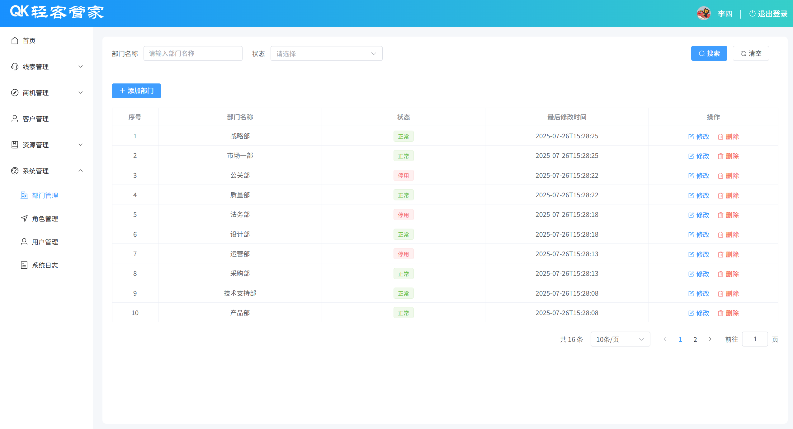

我们可以看到，在控制台中输出了方法的执行耗时：

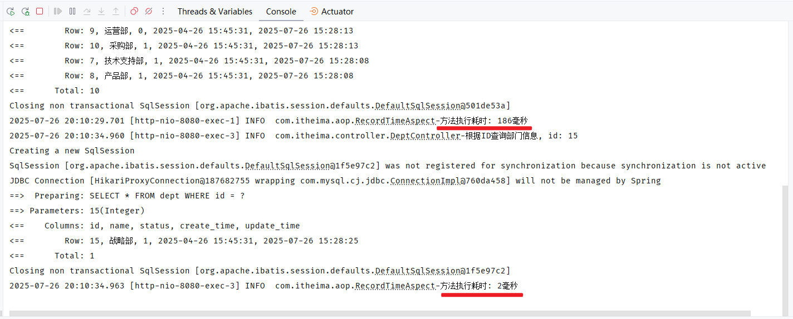

我们通过AOP入门程序完成了业务方法执行耗时的统计，那其实AOP的功能远不止于此，常见的应用场景如下：

- 记录系统的操作日志

- 权限控制

- 事务管理：我们前面所讲解的Spring事务管理，底层其实也是通过AOP来实现的，只要添加@Transactional注解之后，AOP程序自动会在原始方法运行前先来开启事务，在原始方法运行完毕之后提交或回滚事务

这些都是AOP应用的典型场景。

通过入门程序，我们也应该感受到了AOP面向切面编程的一些优势：

- 代码无侵入：没有修改原始的业务方法，就已经对原始的业务方法进行了功能的增强或者是功能的改变

- 减少了重复代码

- 提高开发效率

- 维护方便

### 2.2.AOP核心概念

通过SpringAOP的快速入门，感受了一下AOP面向切面编程的开发方式。下面我们再来学习AOP当中涉及到的一些核心概念。

1.**连接点**：JoinPoint，可以被AOP控制的方法（暗含方法执行时的相关信息）

连接点指的是可以被aop控制的方法。例如：入门程序当中所有的业务方法都是可以被aop控制的方法。

在SpringAOP提供的JoinPoint当中，封装了连接点方法在执行时的相关信息。（后面会有具体的讲解）

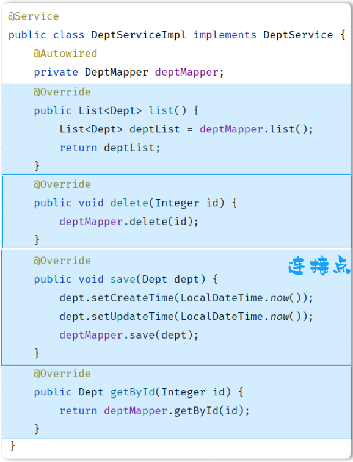

2.**通知**：Advice，指哪些重复的逻辑，也就是共性功能（最终体现为一个方法）

在入门程序中是需要统计各个业务方法的执行耗时的，此时我们就需要在这些业务方法运行开始之前，先记录这个方法运行的开始时间，在每一个业务方法运行结束的时候，再来记录这个方法运行的结束时间。

是在AOP面向切面编程当中，我们只需要将这部分重复的代码逻辑抽取出来单独定义。抽取出来的这一部分重复的逻辑，也就是共性的功能。

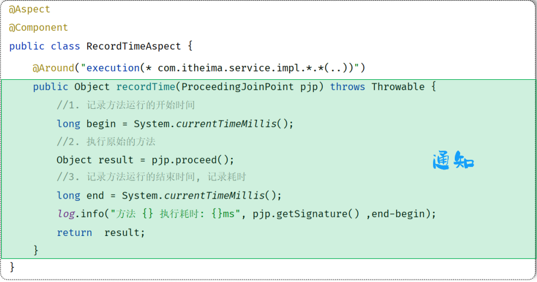

3.**切入点**：PointCut，匹配连接点的条件，通知仅会在切入点方法执行时被应用。

在通知当中，我们所定义的共性功能到底要应用在哪些方法上？此时就涉及到了切入点pointcut概念。切入点指的是匹配连接点的条件。通知仅会在切入点方法运行时才会被应用。

在aop的开发当中，我们通常会通过一个切入点表达式来描述切入点\(后面会有详解\)。

假如：切入点表达式改为DeptServiceImpl\.list\(\)，此时就代表仅仅只有list这一个方法是切入点。只有list\(\)方法在运行的时候才会应用通知。

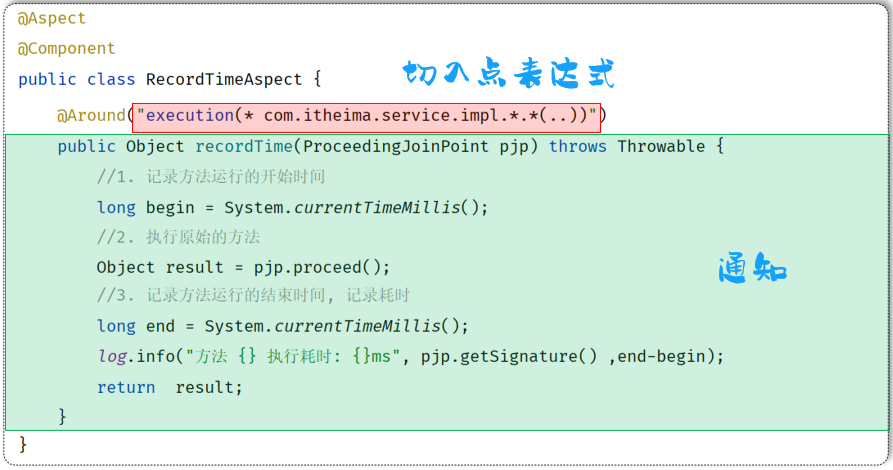

4.**切面**：Aspect，描述通知与切入点的对应关系（通知\+切入点）

当通知和切入点结合在一起，就形成了一个切面。通过切面就能够描述当前aop程序需要针对于哪个原始方法，在什么时候执行什么样的操作。

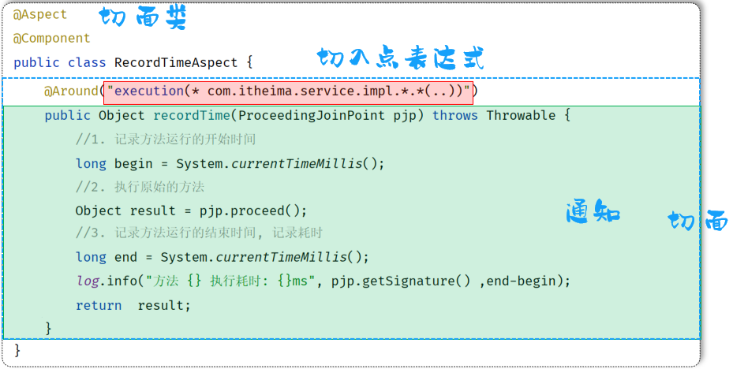

而切面所在的类，称之为切面类（被`@Aspect`注解标识的类）。

5.**目标对象**：Target，通知所应用的对象

目标对象指的就是通知所应用的对象，我们就称之为目标对象。

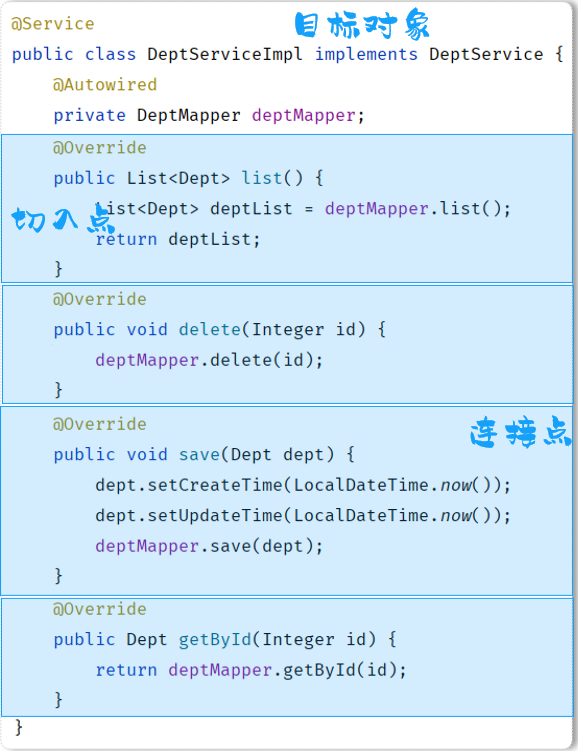

AOP的核心概念我们介绍完毕之后，接下来我们再来分析一下我们所定义的通知是如何与目标对象结合在一起，对目标对象当中的方法进行功能增强的。

Spring的AOP底层是基于动态代理技术来实现的，也就是说在程序运行的时候，会自动的基于动态代理技术为目标对象生成一个对应的代理对象。在代理对象当中就会对目标对象当中的原始方法进行功能的增强。

> SpringAOP 旨在管理bean对象的过程中，主要通过底层的动态代理机制，对特定的方法进行编程 。
>

## 3.AOP进阶

AOP的基础知识学习完之后，下面我们对AOP当中的各个细节进行详细的学习。主要分为4个部分：

1. 通知类型
2. 通知顺序
3. 切入点表达式
3. 连接点

我们先来学习第一部分通知类型。

### 3.1.通知类型

在入门程序当中，我们已经使用了一种功能最为强大的通知类型：Around环绕通知。

```java
@Component
@Aspect //当前类为切面类
@Slf4j
public class TimeAspect {

    @Around("execution(* com.itheima.service.impl.DeptServiceImpl.*(..))")
    public Object recordTime(ProceedingJoinPoint pjp) throws Throwable {
        //记录方法执行开始时间
        long begin = System.currentTimeMillis();
        //执行原始方法
        Object result = pjp.proceed();
        //记录方法执行结束时间
        long end = System.currentTimeMillis();
        //计算方法执行耗时
        log.info("方法执行耗时: {}毫秒",end-begin);
        return result;
    }
}
```

只要我们在通知方法上加上了`@Around`注解，就代表当前通知是一个环绕通知。

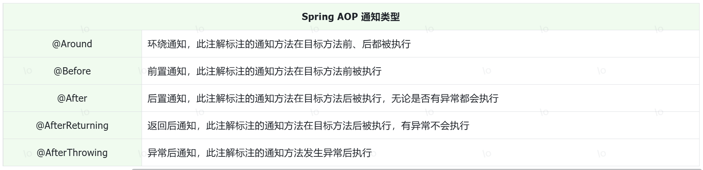

下面我们通过代码演示，来加深对于不同通知类型的理解：

```java
@Slf4j
@Component
@Aspect
public class MyAspect1 {
    //前置通知
    @Before("execution(* com.itheima.service.impl.*.*(..))")
    public void before(JoinPoint joinPoint){
        log.info("before ...");

    }

    //环绕通知
    @Around("execution(* com.itheima.service.impl.*.*(..))")
    public Object around(ProceedingJoinPoint proceedingJoinPoint) throws Throwable {
        log.info("around before ...");

        //调用目标对象的原始方法执行
        Object result = proceedingJoinPoint.proceed();
        
        //原始方法如果执行时有异常，环绕通知中的后置代码不会在执行了
        
        log.info("around after ...");
        return result;
    }

    //后置通知
    @After("execution(* com.itheima.service.impl.*.*(..))")
    public void after(JoinPoint joinPoint){
        log.info("after ...");
    }

    //返回后通知（程序在正常执行的情况下，会执行的后置通知）
    @AfterReturning("execution(* com.itheima.service.impl.*.*(..))")
    public void afterReturning(JoinPoint joinPoint){
        log.info("afterReturning ...");
    }

    //异常通知（程序在出现异常的情况下，执行的后置通知）
    @AfterThrowing("execution(* com.itheima.service.impl.*.*(..))")
    public void afterThrowing(JoinPoint joinPoint){
        log.info("afterThrowing ...");
    }
}
```

重新启动SpringBoot服务，进行测试：

1.没有异常情况下：

使用 Apifox 测试查询所有部门数据


查看idea中控制台日志输出：

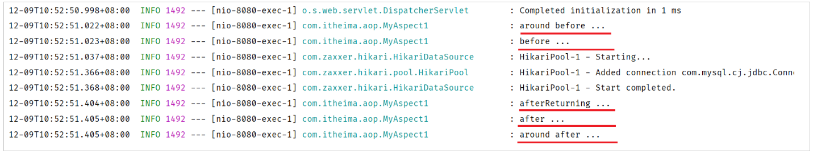

> 程序没有发生异常的情况下，@AfterThrowing标识的通知方法不会执行。
> 

2.出现异常情况下：

修改DeptServiceImpl业务实现类中的代码： 添加异常

```java
@Slf4j
@Service
public class DeptServiceImpl implements DeptService {
    @Autowired
    private DeptMapper deptMapper;

    @Override
    public List<Dept> list() {

        List<Dept> deptList = deptMapper.list();
        //模拟异常
        int num = 10/0;
        return deptList;
    }
    
    //省略其他代码...
}
```

重新启动SpringBoot服务，测试发生异常情况下通知的执行：

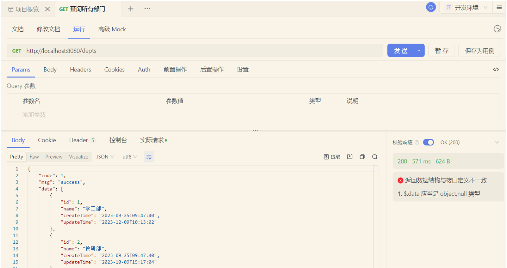

查看idea中控制台日志输出

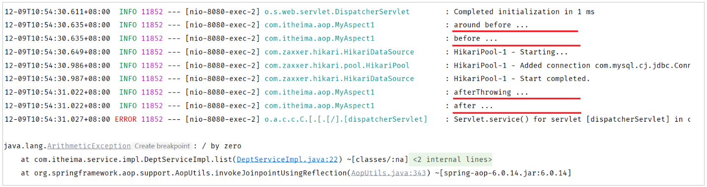

> 程序发生异常的情况下：
>
> - @AfterReturning标识的通知方法不会执行，@AfterThrowing标识的通知方法执行了
>
> - @Around环绕通知中原始方法调用时有异常，通知中的环绕后的代码逻辑也不会在执行了 （因为原始方法调用已经出异常了）
>

> 在使用通知时的注意事项：
>
> - @Around环绕通知需要自己调用 ProceedingJoinPoint\.proceed\(\) 来让原始方法执行，其他通知不需要考虑目标方法执行
>
> - @Around环绕通知方法的返回值，必须指定为Object，来接收原始方法的返回值，否则原始方法执行完毕，是获取不到返回值的。
>

五种常见的通知类型，我们已经测试完毕了，此时我们再来看一下刚才所编写的代码，有什么问题吗？

```java
//前置通知
@Before("execution(* com.itheima.service.impl.*.*(..))")

//环绕通知
@Around("execution(* com.itheima.service.impl.*.*(..))")
  
//后置通知
@After("execution(* com.itheima.service.impl.*.*(..))")

//返回后通知（程序在正常执行的情况下，会执行的后置通知）
@AfterReturning("execution(* com.itheima.service.impl.*.*(..))")

//异常通知（程序在出现异常的情况下，执行的后置通知）
@AfterThrowing("execution(* com.itheima.service.impl.*.*(..))")
```

我们发现啊，每一个注解里面都指定了切入点表达式，而且这些切入点表达式都一模一样。此时我们的代码当中就存在了大量的重复性的切入点表达式，假如此时切入点表达式需要变动，就需要将所有的切入点表达式一个一个的来改动，就变得非常繁琐了。

怎么来解决这个切入点表达式重复的问题？ 答案就是：抽取

Spring提供了`@PointCut`注解，该注解的作用是将公共的切入点表达式抽取出来，需要用到时引用该切入点表达式即可。

```java
@Slf4j
@Component
@Aspect
public class MyAspect1 {

    //切入点方法（公共的切入点表达式）
    @Pointcut("execution(* com.itheima.service.impl.*.*(..))")
    private void pt(){}

    //前置通知（引用切入点）
    @Before("pt()")
    public void before(JoinPoint joinPoint){
        log.info("before ...");

    }

    //环绕通知
    @Around("pt()")
    public Object around(ProceedingJoinPoint proceedingJoinPoint) throws Throwable {
        log.info("around before ...");

        //调用目标对象的原始方法执行
        Object result = proceedingJoinPoint.proceed();
        //原始方法在执行时：发生异常
        //后续代码不在执行

        log.info("around after ...");
        return result;
    }

    //后置通知
    @After("pt()")
    public void after(JoinPoint joinPoint){
        log.info("after ...");
    }

    //返回后通知（程序在正常执行的情况下，会执行的后置通知）
    @AfterReturning("pt()")
    public void afterReturning(JoinPoint joinPoint){
        log.info("afterReturning ...");
    }

    //异常通知（程序在出现异常的情况下，执行的后置通知）
    @AfterThrowing("pt()")
    public void afterThrowing(JoinPoint joinPoint){
        log.info("afterThrowing ...");
    }
}
```

需要注意的是：当切入点方法使用`private`修饰时，仅能在当前切面类中引用该表达式， 当外部其他切面类中也要引用当前类中的切入点表达式，就需要把`private`改为`public`，而在引用的时候，具体的语法为：

```java
@Slf4j
@Component
@Aspect
public class MyAspect2 {
    //引用MyAspect1切面类中的切入点表达式
    @Before("com.itheima.aspect.MyAspect1.pt()")
    public void before(){
        log.info("MyAspect2 -> before ...");
    }
}
```

### 3.2.通知顺序

讲解完了Spring中AOP所支持的5种通知类型之后，接下来我们再来研究通知的执行顺序。

当在项目开发当中，我们定义了多个切面类，而多个切面类中多个切入点都匹配到了同一个目标方法。此时当目标方法在运行的时候，这多个切面类当中的这些通知方法都会运行。

此时我们就有一个疑问，这多个通知方法到底哪个先运行，哪个后运行？ 下面我们通过程序来验证（这里呢，我们就定义两种类型的通知进行测试，一种是前置通知`@Before`，一种是后置通知`@After`）

定义多个切面类：

```java
@Slf4j
@Component
@Aspect
public class MyAspect2 {
    //前置通知
    @Before("execution(* com.itheima.service.impl.*.*(..))")
    public void before(){
        log.info("MyAspect2 -> before ...");
    }

    //后置通知
    @After("execution(* com.itheima.service.impl.*.*(..))")
    public void after(){
        log.info("MyAspect2 -> after ...");
    }
}
```

```java
@Slf4j
@Component
@Aspect
public class MyAspect3 {
    //前置通知
    @Before("execution(* com.itheima.service.impl.*.*(..))")
    public void before(){
        log.info("MyAspect3 -> before ...");
    }

    //后置通知
    @After("execution(* com.itheima.service.impl.*.*(..))")
    public void after(){
        log.info("MyAspect3 ->  after ...");
    }
}
```

```java
@Slf4j
@Component
@Aspect
public class MyAspect4 {
    //前置通知
    @Before("execution(* com.itheima.service.impl.*.*(..))")
    public void before(){
        log.info("MyAspect4 -> before ...");
    }

    //后置通知
    @After("execution(* com.itheima.service.impl.*.*(..))")
    public void after(){
        log.info("MyAspect4 -> after ...");
    }
}
```

重新启动SpringBoot服务，测试通知的执行顺序：

> 备注：
> 
> 1. 把DeptServiceImpl实现类中模拟异常的代码删除或注释掉。
> 
> 2. 注释掉其他切面类\(把`@Aspect`注释即可\)，仅保留MyAspect2、MyAspect3、MyAspect4 ，这样就可以清晰看到执行的结果，而不被其他切面类干扰。
> 

使用 Apifox 测试查询所有部门数据。

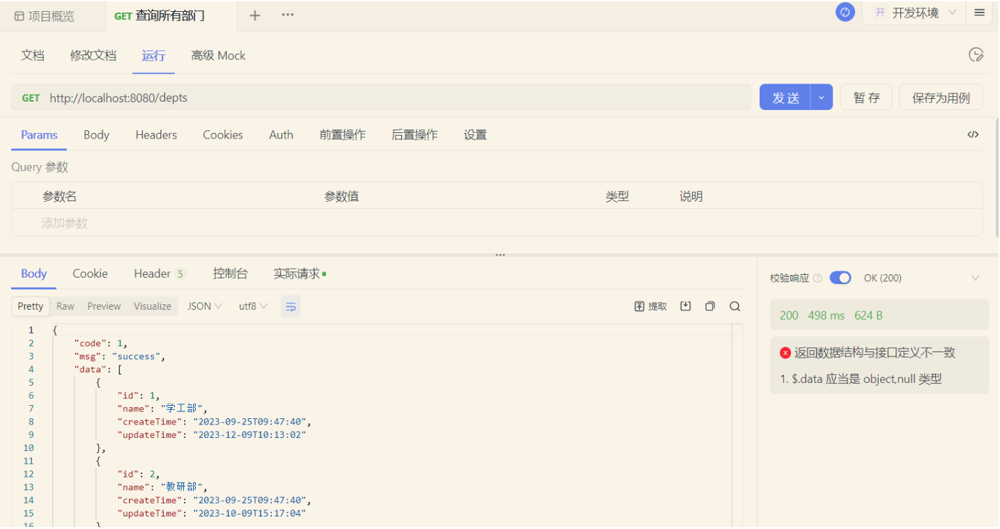

查看idea中控制台日志输出

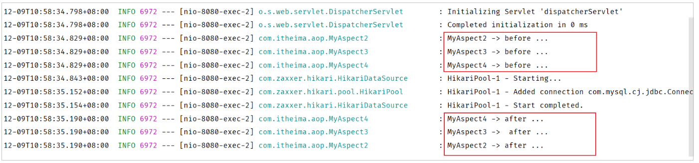

通过以上程序运行可以看出在不同切面类中，默认按照切面类的类名字母排序：

- 目标方法前的通知方法：字母排名靠前的先执行

- 目标方法后的通知方法：字母排名靠前的后执行

如果我们想控制通知的执行顺序有两种方式：

- 修改切面类的类名（这种方式非常繁琐、而且不便管理）

- 使用Spring提供的`@Order`注解

使用@Order注解，控制通知的执行顺序：

```java
@Slf4j
@Component
@Aspect
@Order(2)  //切面类的执行顺序（前置通知：数字越小先执行; 后置通知：数字越小越后执行）
public class MyAspect2 {
    //前置通知
    @Before("execution(* com.itheima.service.impl.*.*(..))")
    public void before(){
        log.info("MyAspect2 -> before ...");
    }

    //后置通知 
    @After("execution(* com.itheima.service.impl.*.*(..))")
    public void after(){
        log.info("MyAspect2 -> after ...");
    }
}
```

```java
@Slf4j
@Component
@Aspect
@Order(3)  //切面类的执行顺序（前置通知：数字越小先执行; 后置通知：数字越小越后执行）
public class MyAspect3 {
    //前置通知
    @Before("execution(* com.itheima.service.impl.*.*(..))")
    public void before(){
        log.info("MyAspect3 -> before ...");
    }

    //后置通知
    @After("execution(* com.itheima.service.impl.*.*(..))")
    public void after(){
        log.info("MyAspect3 ->  after ...");
    }
}
```

```java
@Slf4j
@Component
@Aspect
@Order(1) //切面类的执行顺序（前置通知：数字越小先执行; 后置通知：数字越小越后执行）
public class MyAspect4 {
    //前置通知
    @Before("execution(* com.itheima.service.impl.*.*(..))")
    public void before(){
        log.info("MyAspect4 -> before ...");
    }

    //后置通知
    @After("execution(* com.itheima.service.impl.*.*(..))")
    public void after(){
        log.info("MyAspect4 -> after ...");
    }
}
```

重新启动SpringBoot服务，测试通知执行顺序：

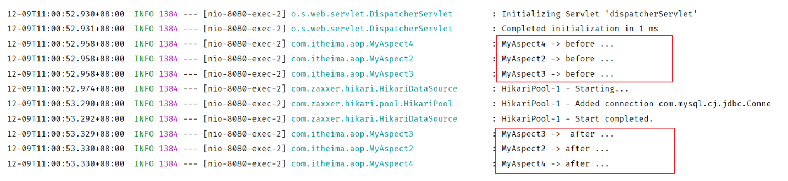

> 通知的执行顺序大家主要知道两点即可：
>
> - 不同的切面类当中，默认情况下通知的执行顺序是与切面类的类名字母排序是有关系的
>
> - 可以在切面类上面加上@Order注解，来控制不同的切面类通知的执行顺序
>

### 3.3.切入点表达式

从AOP的入门程序到现在，我们一直都在使用切入点表达式来描述切入点。下面我们就来详细的介绍一下切入点表达式的具体写法。

切入点表达式：描述切入点方法的一种表达式

作用：主要用来决定项目中的哪些方法需要加入通知

常见形式：

- execution\(……\)：根据方法的签名来匹配

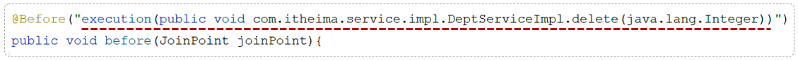

- @annotation(……) ：根据注解匹配


首先我们先学习第一种最为常见的execution切入点表达式。

**execution**

execution主要根据方法的返回值、包名、类名、方法名、方法参数等信息来匹配，语法为：

```java
execution(访问修饰符?  返回值  包名.类名.?方法名(方法参数) throws 异常?)
```

其中带`?`的表示可以省略的部分

- 访问修饰符：可省略（比如: public、protected）

- 包名\.类名： 可省略

- throws 异常：可省略（注意是方法上声明抛出的异常，不是实际抛出的异常）

示例：

```java
@Before("execution(void com.itheima.service.impl.DeptServiceImpl.delete(java.lang.Integer))")
```

可以使用通配符描述切入点

- `*` ：单个独立的任意符号，可以通配任意返回值、包名、类名、方法名、任意类型的一个参数，也可以通配包、类、方法名的一部分

- `..` ：多个连续的任意符号，可以通配任意层级的包，或任意类型、任意个数的参数

切入点表达式的语法规则：

1. 方法的访问修饰符可以省略

2. 返回值可以使用`*`号代替（任意返回值类型）

3. 包名可以使用`*`号代替，代表任意包（一层包使用一个`*`）

4. 使用`..`配置包名，标识此包以及此包下的所有子包

5. 类名可以使用`*`号代替，标识任意类

6. 方法名可以使用`*`号代替，表示任意方法

7. 可以使用 `*`  配置参数，一个任意类型的参数

8. 可以使用`..` 配置参数，任意个任意类型的参数

切入点表达式示例

- 省略方法的修饰符号 

```java
execution(void com.itheima.service.impl.DeptServiceImpl.delete(java.lang.Integer))
```

- 使用`*`代替返回值类型

```java
execution(* com.itheima.service.impl.DeptServiceImpl.delete(java.lang.Integer))
```

- 使用`*`代替包名（一层包使用一个`*`）

```java
execution(* com.itheima.*.*.DeptServiceImpl.delete(java.lang.Integer))
```

- 使用`..`省略包名

```java
execution(* com..DeptServiceImpl.delete(java.lang.Integer))  
```

- 使用`*`代替类名

```java
execution(* com..*.delete(java.lang.Integer))
```

- 使用`*`代替方法名

```java
execution(* com..*.*(java.lang.Integer))
```

- 使用 `*` 代替参数

```java
execution(* com.itheima.service.impl.DeptServiceImpl.delete(*))
```

- 使用`..`省略参数

```java
execution(* com..*.*(..))
```

注意事项：

- 根据业务需要，可以使用 且（\&\&）、或（\|\|）、非（\!） 来组合比较复杂的切入点表达式。

```java
execution(* com.itheima.service.DeptService.list(..)) || execution(* com.itheima.service.DeptService.delete(..))
```

切入点表达式的书写建议：

- 所有业务方法名在命名时尽量规范，方便切入点表达式快速匹配。如：查询类方法都是 find 开头，更新类方法都是update开头

```java
//业务类
@Service
public class DeptServiceImpl implements DeptService {
    
    public List<Dept> findAllDept() {
       //省略代码...
    }
    
    public Dept findDeptById(Integer id) {
       //省略代码...
    }
    
    public void updateDeptById(Integer id) {
       //省略代码...
    }
    
    public void updateDeptByMoreCondition(Dept dept) {
       //省略代码...
    }
    //其他代码...
}
```

- 匹配DeptServiceImpl类中以find开头的方法

```java
execution(* com.itheima.service.impl.DeptServiceImpl.find*(..))
```

- 描述切入点方法通常基于接口描述，而不是直接描述实现类，增强拓展性

```java
execution(* com.itheima.service.DeptService.*(..))
```

- 在满足业务需要的前提下，尽量缩小切入点的匹配范围。如：包名匹配尽量不使用 \.\.，使用 \* 匹配单个包

```java
execution(* com.itheima.*.*.DeptServiceImpl.find*(..))
```

> 切入点表达式书写建议：
>
> - 所有业务方法名在命名时尽量规范，方便切入点表达式快速匹配。如：findXxx，updateXxx。
>
> - 描述切入点方法通常基于接口描述，而不是直接描述实现类，增强拓展性。
>
> - 在满足业务需要的前提下，尽量缩小切入点的匹配范围。如：包名尽量不使用\.\.，使用 `*` 匹配单个包。
>

**@annotation**

已经学习了execution切入点表达式的语法。那么如果我们要匹配多个无规则的方法，比如：list\(\)和 delete\(\)这两个方法。这个时候我们基于execution这种切入点表达式来描述就不是很方便了。而在之前我们是将两个切入点表达式组合在了一起完成的需求，这个是比较繁琐的。

我们可以借助于另一种切入点表达式 `@annotation` 来描述这一类的切入点，从而来简化切入点表达式的书写。

实现步骤：

1. 编写自定义注解

2. 在业务类要做为连接点的方法上添加自定义注解

自定义注解：`LogOperation`

```java
@Target(ElementType.METHOD)
@Retention(RetentionPolicy.RUNTIME)
public @interface LogOperation{
}
```

> 元注解：指的是修饰注解的注解。
>
> - @Target：声明注解作用的位置。
>
> - @Retention：声明注解的保留周期。
>

业务类：`DeptServiceImpl`

```java
@Slf4j
@Service
public class DeptServiceImpl implements DeptService {
    @Autowired
    private DeptMapper deptMapper;

    @Override
    @LogOperation //自定义注解（表示：当前方法属于目标方法）
    public List<Dept> list() {
        List<Dept> deptList = deptMapper.list();
        //模拟异常
        //int num = 10/0;
        return deptList;
    }

    @Override
    @LogOperation //自定义注解（表示：当前方法属于目标方法）
    public void delete(Integer id) {
        //1. 删除部门
        deptMapper.delete(id);
    }


    @Override
    public void save(Dept dept) {
        dept.setCreateTime(LocalDateTime.now());
        dept.setUpdateTime(LocalDateTime.now());
        deptMapper.save(dept);
    }

    @Override
    public Dept getById(Integer id) {
        return deptMapper.getById(id);
    }

    @Override
    public void update(Dept dept) {
        dept.setUpdateTime(LocalDateTime.now());
        deptMapper.update(dept);
    }
}
```

切面类

```java
@Slf4j
@Component
@Aspect
public class MyAspect6 {
    //针对list方法、delete方法进行前置通知和后置通知

    //前置通知
    @Before("@annotation(com.itheima.anno.LogOperation)")
    public void before(){
        log.info("MyAspect6 -> before ...");
    }
    
    //后置通知
    @After("@annotation(com.itheima.anno.LogOperation)")
    public void after(){
        log.info("MyAspect6 -> after ...");
    }
}
```

重启SpringBoot服务，测试查询所有部门数据，查看控制台日志：

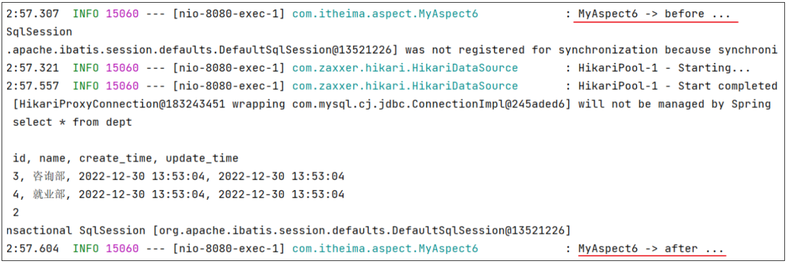

到此我们两种常见的切入点表达式我已经介绍完了。

execution切入点表达式

- 根据我们所指定的方法的描述信息来匹配切入点方法，这种方式也是最为常用的一种方式

- 如果我们要匹配的切入点方法的方法名不规则，或者有一些比较特殊的需求，通过execution切入点表达式描述比较繁琐

annotation 切入点表达式

- 基于注解的方式来匹配切入点方法。这种方式虽然多一步操作，我们需要自定义一个注解，但是相对来比较灵活。我们需要匹配哪个方法，就在方法上加上对应的注解就可以了

> 根据业务需要，可以使用 \&\& ，\|\|，！ 来组合比较复杂的切入点表达式。
>

### 3.4.连接点

我们前面在讲解AOP核心概念的时候，我们提到过什么是连接点，连接点可以简单理解为可以被AOP控制的方法。

我们目标对象当中所有的方法是不是都是可以被AOP控制的方法。而在SpringAOP当中，连接点又特指方法的执行。

在Spring中用JoinPoint抽象了连接点，用它可以获得方法执行时的相关信息，如目标类名、方法名、方法参数等。

对于`@Around`通知，获取连接点信息只能使用`ProceedingJoinPoint`类型

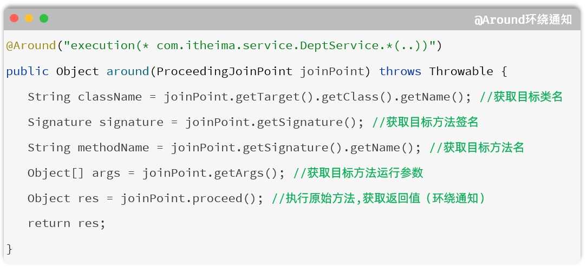

对于其他四种通知，获取连接点信息只能使用`JoinPoint`，它是`ProceedingJoinPoint`的父类型

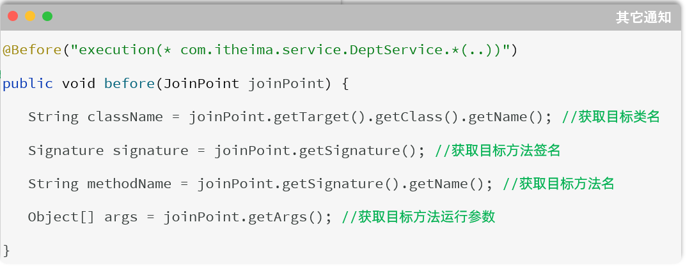

## 4.AOP案例

SpringAOP的相关知识我们就已经全部学习完毕了。最后我们要通过一个案例来对AOP进行一个综合的应用。

### 4.1.需求

需求：将案例（轻客管家）中增、删、改相关接口的操作日志记录到数据库表中

就是当访问部门管理和员工管理当中的增、删、改相关功能接口时，需要详细的操作日志，并保存在数据表中，便于后期数据追踪。

操作日志信息包含：

操作人、操作类、操作方法、请求参数、返回值、方法执行时长

> 所记录的日志信息包括当前接口的操作人是谁操作的，什么时间点操作的，以及访问的是哪个类当中的哪个方法，在访问这个方法的时候传入进来的参数是什么，访问这个方法最终拿到的返回值是什么，以及整个接口方法的运行时长是多长时间。
>

### 4.2.分析

1.问题1：项目当中增删改相关的方法是不是有很多？

很多

2.问题2：我们需要针对每一个功能接口方法进行修改，在每一个功能接口当中都来记录这些操作日志吗？

这种做法比较繁琐

以上两个问题的解决方案：可以使用AOP解决\(每一个增删改功能接口中要实现的记录操作日志的逻辑代码是相同\)。

可以把这部分记录操作日志的通用的、重复性的逻辑代码抽取出来定义在一个通知方法当中，我们通过AOP面向切面编程的方式，在不改动原始功能的基础上来对原始的功能进行增强。目前我们所增强的功能就是来记录操作日志，所以也可以使用AOP的技术来实现。使用AOP的技术来实现也是最为简单，最为方便的。

3.问题3：既然要基于AOP面向切面编程的方式来完成的功能，那么我们要使用 AOP五种通知类型当中的哪种通知类型？

答案：环绕通知 `@Around`。因为所记录的操作日志当中包括：操作人、操作时间，访问的是哪个类、哪个方法、方法运行时参数、方法的返回值、方法的运行时长。方法返回值，是在原始方法执行后才能获取到的。方法的运行时长，需要原始方法运行之前记录开始时间，原始方法运行之后记录结束时间。通过计算获得方法的执行耗时。基于以上的分析我们确定要使用Around环绕通知。

4.问题4：最后一个问题，切入点表达式我们该怎么写？

答案：使用 `@annotation` 来描述切入点表达式。要匹配业务接口当中所有的增删改的方法，而增删改方法在命名上没有共同的前缀或后缀。此时如果使用`execution`切入点表达式也可以，但是会比较繁琐。 当遇到增删改的方法名没有规律时，就可以使用 `@annotation`切入点表达式


### 4.3.步骤

简单分析了一下大概的实现思路后，接下来我们就要来完成案例了。案例的实现步骤其实就两步：

准备工作

- 引入AOP的起步依赖

- 导入资料中准备好的数据库表结构，并引入对应的实体类

编码实现

- 自定义注解`@Log`

- 定义切面类，完成记录操作日志的逻辑

### 4.4.代码实现

1.准备工作

在 pom\.xml 中引入AOP的依赖

```xml
<dependency>
    <groupId>org.springframework.boot</groupId>
    <artifactId>spring-boot-starter-aop</artifactId>
</dependency>
```

创建数据库表结构

```SQL
-- 操作日志表
create table operate_log(
    id int unsigned auto_increment comment 'ID' primary key,
    operate_user_id int unsigned comment '操作用户ID',
    operate_time datetime comment '操作时间',
    class_name varchar(100) comment '操作的类名',
    method_name varchar(100) comment '操作的方法名',
    method_params varchar(1000) comment '方法参数',
    return_value varchar(2000) comment '返回值',
    cost_time bigint comment '方法执行耗时, 单位:ms'
) comment '操作日志表';
```

创建实体类

```java
package com.qk.entity;

import lombok.Data;
import java.time.LocalDateTime;

@Data
@NoArgsConstructor
@AllArgsConstructor
public class OperateLog {
    private Integer id; //ID
    private Integer operateUserId; //操作用户ID
    private LocalDateTime operateTime; //操作时间
    private String className; //类名称
    private String methodName; //方法名称
    private String methodParams; //方法参数
    private String returnValue; //返回值
    private Long costTime; //耗时
}
```

创建日志操作Mapper接口 `OperateLogMapper`

```java
package com.qk.mapper;

import com.baomidou.mybatisplus.core.mapper.BaseMapper;
import com.qk.entity.OperateLog;

/**
 * 操作日志管理Mapper
 */
@Mapper
public interface OperateLogMapper extends BaseMapper<OperateLog> {
}
```

2.自定义注解 `@Log`

在 `qk-management` 模块的 `com.qk.anno` 包下\.

```java
package com.qk.anno;

import java.lang.annotation.ElementType;
import java.lang.annotation.Retention;
import java.lang.annotation.RetentionPolicy;
import java.lang.annotation.Target;

@Target(ElementType.METHOD)
@Retention(RetentionPolicy.RUNTIME)
public @interface Log{
}
```

2. 在qk\-management的aop包中定义AOP记录日志的切面类

```java
package com.qk.aop;

import com.qk.anno.LogOperation;
import com.qk.entity.OperateLog;
import com.qk.mapper.OperateLogMapper;
import com.qk.utils.CurrentUserHoler;
import org.aspectj.lang.ProceedingJoinPoint;
import org.aspectj.lang.annotation.Around;
import org.aspectj.lang.annotation.Aspect;
import org.aspectj.lang.reflect.MethodSignature;
import org.springframework.beans.factory.annotation.Autowired;
import org.springframework.stereotype.Component;
import java.lang.reflect.Method;
import java.time.LocalDateTime;
import java.util.Arrays;

@Aspect
@Component
public class LogAspect {

    @Autowired
    private OperateLogMapper operateLogMapper;

    @Around("@annotation(com.qk.anno.Log)") 
    public Object aroundAdvice(ProceedingJoinPoint pjp) throws Throwable {
        //1 获取日志信息
        //1.1 private Integer operateUserId; //操作用户ID
        Integer operateUserId = CurrentUserHoler.getCurrentUser();
        //1.2 private LocalDateTime operateTime; //操作时间
        LocalDateTime operateTime = LocalDateTime.now();
        //1.3 private String className; //类名称
        String className = pjp.getTarget().getClass().getName();
        //1.4 private String methodName; //方法名称
        String methodName = pjp.getSignature().getName();
        //1.5 private String methodParams; //方法参数
        String methodParams = Arrays.toString(pjp.getArgs());
        long start = System.currentTimeMillis();
        //1.6 private String returnValue; //返回值
        Object result = pjp.proceed();
        String returnValue = result.toString();
        //1.7 private Long costTime; //耗时
        Long costTime = System.currentTimeMillis() - start;
        
        //2 将日志信息封装成OperateLog对象
        OperateLog log = new OperateLog(null, operateUserId, operateTime, className, methodName, methodParams, returnValue, costTime);
        //3 调用mapper层方法保存日志
        operateLogMapper.insert(log);
        return result;
    }
}
```

3.在需要记录的日志的Controller层的增、删、改方法上，加上注解 `@Log`

```java
package com.qk.controller;

import com.qk.anno.LogOperation;
import com.qk.common.PageResult;
import com.qk.common.Result;
import com.qk.dto.UserDto;
import com.qk.entity.User;
import com.qk.service.UserService;
import lombok.extern.slf4j.Slf4j;
import org.springframework.beans.factory.annotation.Autowired;
import org.springframework.web.bind.annotation.*;

import java.util.List;

/**
 * 用户管理控制器
 */
@Slf4j
@RestController
@RequestMapping("/users")
public class UserController {

    @Autowired
    private UserService userService;

    /**
     * 条件分页查询用户列表
     */
    @GetMapping
    public Result getUsers(UserDto userDto) {
        PageResult<User> userPage = userService.getUsers(userDto);
        return Result.success(userPage);
    }

    /**
     * 根据ID查询用户信息
     */
    @GetMapping("/{id}")
    public Result getUserById(@PathVariable Integer id) {
        User user = userService.getUserById(id);
        return Result.success(user);
    }

    /**
     * 根据角色标识查询用户列表
     */
    @GetMapping("/role/{roleLabel}")
    public Result getUsersByRoleLabel(@PathVariable String roleLabel) {
        log.info("根据角色标识查询用户列表, roleLabel: {}", roleLabel);
        List<User> users = userService.getUsersByRoleLabel(roleLabel);
        return Result.success(users);
    }

    /**
     * 新增用户
     */
    @Log
    @PostMapping
    public Result addUser(@RequestBody User user) {
        log.info("新增用户, user: " + user);
        userService.addUser(user);
        return Result.success();
    }

    /**
     * 修改用户信息
     */
    @Log
    @PutMapping
    public Result updateUser(@RequestBody User user) {
        userService.updateUser(user);
        return Result.success();
    }

    /**
     * 批量删除用户
     */
    @Log
    @DeleteMapping("/{ids}")
    public Result deleteUsers(@PathVariable List<Integer> ids) {
        log.info("批量删除用户, ids: {}" , ids);
        userService.deleteUsers(ids);
        return Result.success();
    }
}
```

重启SpringBoot服务，测试操作日志记录功能：

打开浏览器，针对于员工的数据、部门的数据进行增删改之后。我们打开数据库表结构可以来看一下：

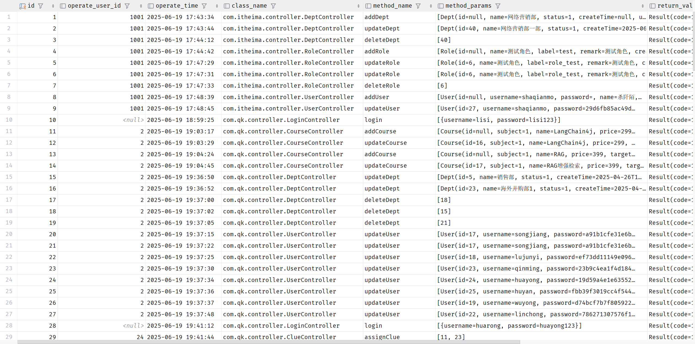

我们会看到，在数据库表中，就清晰的记录了谁、什么时间点、调用了哪个类的哪个方法、传入了什么参数、返回了什么数据，都清晰的记录在数据库中了。

在前面我们学习的都是web开发的技术使用，都是面向应用层面的，我们学会了怎么样去用。而我们今天所要学习的是web后端开发的最后一个篇章springboot原理篇，主要偏向于底层原理。

# 六、SpringBoot原理

## 1.配置优先级

我们已经讲解了SpringBoot项目当中支持的三类配置文件：

- application\.properties

- application\.yml

- application\.yaml

在SpringBoot项目当中，我们要想配置一个属性，可以通过这三种方式当中的任意一种来配置都可以，那么如果项目中同时存在这三种配置文件，且都配置了同一个属性，如：Tomcat端口号，到底哪一份配置文件生效呢？

application\.properties

```Properties
server.port=8081
```

application\.yml

```yaml
server:
   port: 8082
```

application\.yaml

```yaml
server:
   port: 8082
```

我们启动SpringBoot程序，测试下三个配置文件中哪个Tomcat端口号生效：

properties、yaml、yml三种配置文件同时存在。 配置好了，启动服务，测试一下：

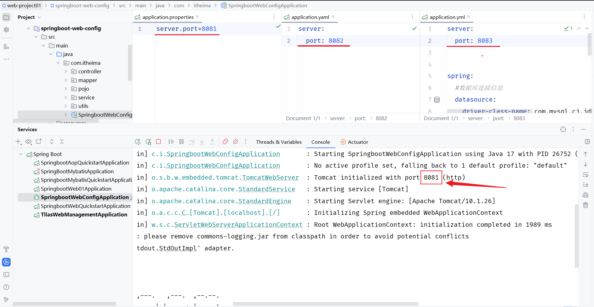

> properties、yaml、yml三种配置文件，优先级最高的是properties
>

yaml、yml两种配置文件同时存在

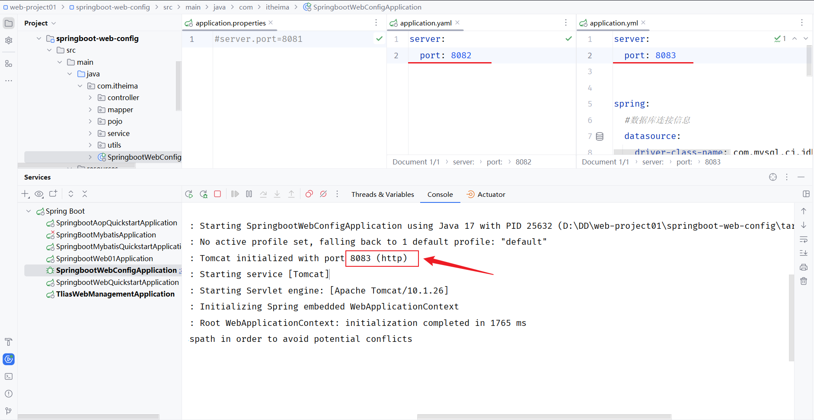

> yaml、yml 两种配置文件，优先级最高的是yml。
>
> 配置文件优先级排名（从高到低）：
>
> 1. properties配置文件
>
> 2. yml配置文件
>
> 3. yaml配置文件
>

> 注意事项：虽然springboot支持多种格式配置文件，但是在项目开发时，推荐统一使用一种格式的配置。（yml是主流）
>

在SpringBoot项目当中除了以上3种配置文件外，SpringBoot为了增强程序的扩展性，除了支持配置文件的配置方式以外，还支持另外两种常见的配置方式：

java系统属性配置 （格式： \-Dkey=value）

```yaml
-Dserver.port=9000
```

命令行参数 （格式：\-\-key=value）

```yaml
--server.port=10010
```

那在idea当中运行程序时，如何来指定java系统属性和命令行参数呢？

编辑启动程序的配置信息

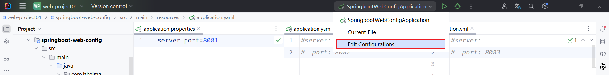

打开之后，选择 `Modify options` , 选择 `Add VM options`, `Program arguments`

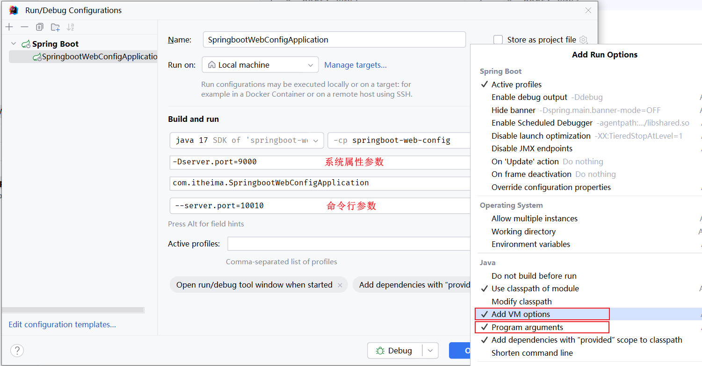

重启服务，同时配置Tomcat端口\(application\.properties、系统属性、命令行参数\)，测试哪个Tomcat端口号生效：

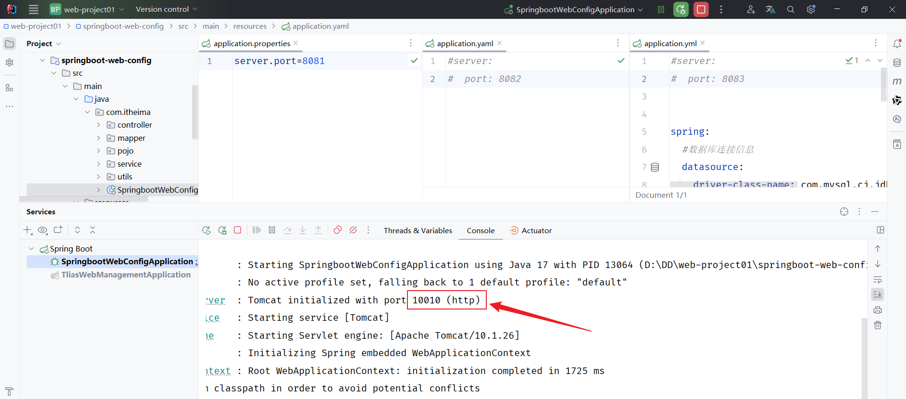

> 说明，命令行参数的优先级时最高的，同时配置的情况下，命令行参数的配置项生效。
>

删除命令行参数配置，重启SpringBoot服务：

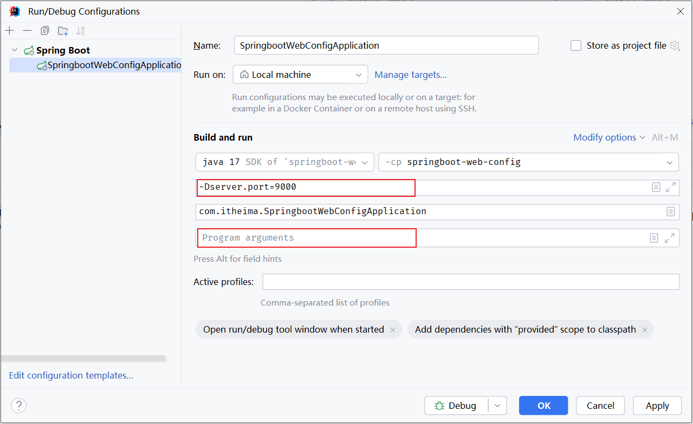

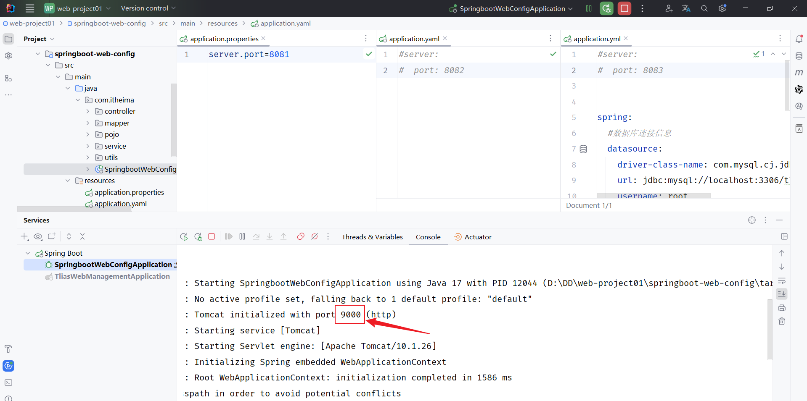

> 五种配置方式的优先级： 命令行参数 \>  系统属性参数 \> properties参数 \> yml参数 \> yaml参数
>

思考：如果项目已经打包上线了，这个时候我们又如何来设置java系统属性和命令行参数呢？

```shell
java -Dserver.port=9000 -jar XXXXX.jar --server.port=10010
```

下面我们来演示下打包程序运行时指定java系统属性和命令行参数：

1.执行maven打包指令package，把项目打成jar文件

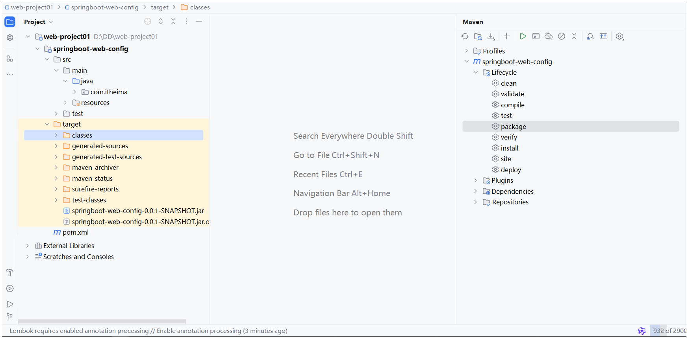

2.使用命令：java \-jar 方式运行jar文件程序。

同时设置java系统属性和命令行参数

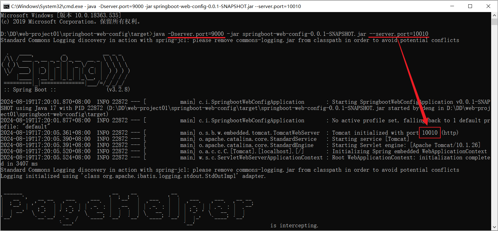

仅设置java系统属性

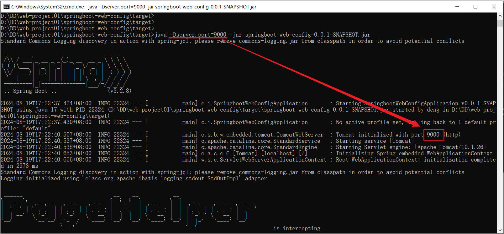

> 注意事项：
>
> Springboot项目进行打包时，需要引入插件 `spring-boot-maven-plugin` \(基于官网骨架创建项目，会自动添加该插件\)

在SpringBoot项目当中，常见的属性配置方式有5种， 3种配置文件，加上2种外部属性的配置\(java系统属性、命令行参数\)。通过以上的测试，我们也得出了优先级\(从低到高\)：

- application\.yaml（忽略）

- application\.yml

- application\.properties

- java系统属性（\-Dxxx=xxx）

- 命令行参数（\-\-xxx=xxx）

## 2.Bean的管理

我们已经讲过了我们可以通过Spring当中提供的注解@Component以及它的三个衍生注解（@Controller、@Service、@Repository）来声明IOC容器中的bean对象，我们也学习了如何为应用程序注入运行时所需要依赖的bean对象，也就是依赖注入DI。

我们今天主要学习IOC容器中Bean的其他使用细节，主要学习以下三方面：

1. bean的作用域配置

2. 管理第三方的bean对象

接下来我们先来学习第一方面，Bean的作用域。

### 2.1.Bean的作用域

在前面我们提到的IOC容器当中，默认bean对象是单例的 \(只有一个实例对象\)。在Spring中支持五种作用域，后三种在web环境才生效：

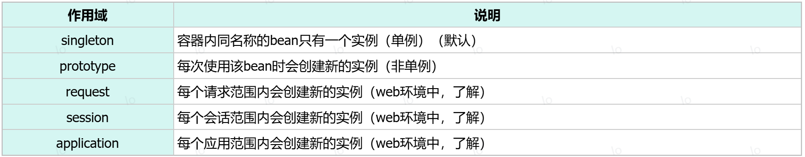

知道了bean的5种作用域了，我们要怎么去设置一个bean的作用域呢？

可以借助Spring中的@Scope注解来进行配置作用域

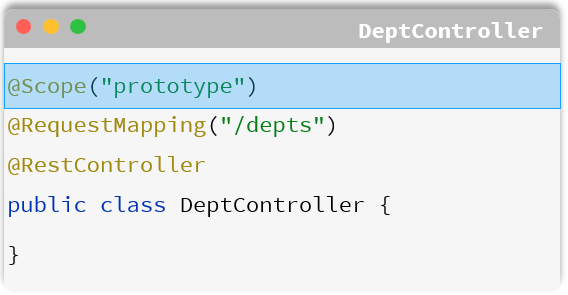

1.测试一

控制器

```java
//默认bean的作用域为：singleton (单例)
@RestController
@RequestMapping("/depts")
public class DeptController {

    @Autowired
    private DeptService deptService;

    public DeptController(){
        System.out.println("DeptController constructor ....");
    }

    //省略其他代码...
}
```

测试类

```java
@SpringBootTest
class SpringbootWebConfig2ApplicationTests {

    @Autowired
    private ApplicationContext applicationContext; //IOC容器对象

    //bean的作用域
    @Test
    public void testScope(){
        for (int i = 0; i < 10; i++) {
            DeptController deptController = applicationContext.getBean(DeptController.class);
            System.out.println(deptController);
        }
    }
}
```

重启SpringBoot服务，运行测试方法，查看控制台打印的日志：

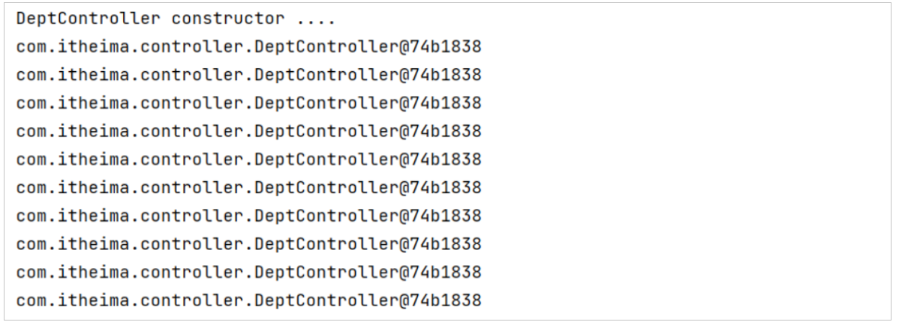

> 注意事项：
>
> - IOC容器中的bean默认使用的作用域：singleton \(单例\)
>
> - 默认singleton的bean，在容器启动时被创建，可以使用@Lazy注解来延迟初始化\(延迟到第一次使用时\)
>

2.测试二

修改控制器DeptController代码：

```java
@Scope("prototype") //bean作用域为非单例
@RestController
@RequestMapping("/depts")
public class DeptController {

    @Autowired
    private DeptService deptService;

    public DeptController(){
        System.out.println("DeptController constructor ....");
    }

    //省略其他代码...
}
```

重启SpringBoot服务，再次执行测试方法，查看控制吧打印的日志：

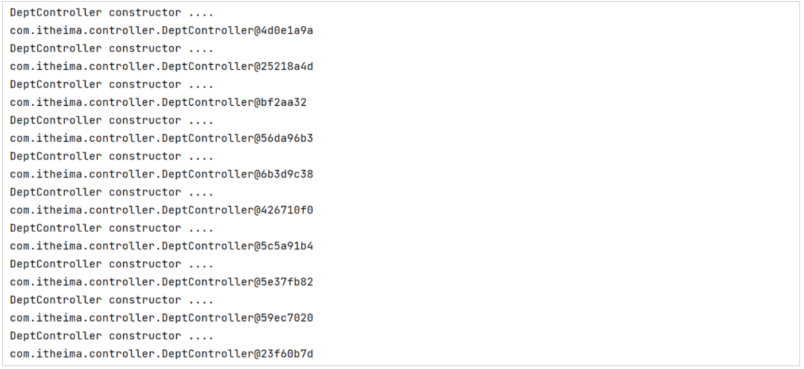

> 注意事项：
>
> - prototype的bean，每一次使用该bean的时候都会创建一个新的实例
>
> - 实际开发当中，绝大部分的Bean是单例的，也就是说绝大部分Bean不需要配置scope属性
>
> - 默认singleton的bean，在容器启动时被创建，可以使用@Lazy注解来延迟初始化（延迟到第一次使用时）
>
> - prototype的bean，每一次使用该bean的时候都会创建一个新的实例。
>
> - 实际开发当中，绝大部分的bean是单例的，也就是说绝大部分bean不需要配置scope属性。
>

### 2.2.第三方Bean

学习完bean的获取、bean的作用域之后，接下来我们再来学习第三方bean的配置。

之前我们所配置的bean，像controller、service，dao三层体系下编写的类，这些类都是我们在项目当中自己定义的类\(自定义类\)。当我们要声明这些bean，也非常简单，我们只需要在类上加上`@Component`以及它的这三个衍生注解（`@Controller`、`@Service`、`@Repository`），就可以来声明这个bean对象了。

但是在我们项目开发当中，还有一种情况就是这个类它不是我们自己编写的，而是我们引入的第三方依赖当中提供的，那么此时我们是无法使用 `@Component` 及其衍生注解来声明bean的，此时就需要使用`@Bean`注解来声明bean 了。

演示1：

在启动类中直接声明这个Bean。比如：我们可以将我们之前使用的日期格式化的工具类，基于@Bean注解的方式来声明Bean。

```java
import com.itheima.utils.AliyunOSSOperator;
import com.itheima.utils.AliyunOSSProperties;
import org.springframework.boot.SpringApplication;
import org.springframework.boot.autoconfigure.SpringBootApplication;
import org.springframework.boot.web.servlet.ServletComponentScan;
import org.springframework.context.annotation.Bean;
import org.springframework.scheduling.annotation.EnableScheduling;

@ServletComponentScan
@EnableScheduling
@SpringBootApplication
public class TliasWebManagementApplication {

    public static void main(String[] args) {
        SpringApplication.run(TliasWebManagementApplication.class, args);
    }

    @Bean // 项目运行时会自动执行该方法, 方法执行完毕的返回值对象 交给 IOC容器管理 --> bean对象
    public DateTimeFormatter dateTimeFormatter(){
        return DateTimeFormatter.ofPattern("yyyy年MM月dd日 HH时mm分ss秒");
    }
}
```

测试：

```java
package com.itheima;

import com.itheima.controller.DeptController;
import org.junit.jupiter.api.Test;
import org.springframework.beans.factory.annotation.Autowired;
import org.springframework.boot.test.context.SpringBootTest;
import org.springframework.context.ApplicationContext;

import java.time.LocalDateTime;
import java.time.format.DateTimeFormatter;

@SpringBootTest
class SpringbootAopQuickstartApplicationTests {

    @Autowired
    private ApplicationContext applicationContext;// Spring容器 - IOC容器
    @Autowired
    private DateTimeFormatter dateTimeFormatter;

    @Test
    public void testScope(){
        for (int i = 0; i < 100; i++) {
            DeptController deptController = applicationContext.getBean(DeptController.class);
            System.out.println(deptController);
        }
    }

    @Test
    public void testDateTimeFormatter(){
        System.out.println(dateTimeFormatter.format(LocalDateTime.now()));
    }

}
```

演示2：

若要管理的第三方 bean 对象，建议对这些bean进行集中分类配置，可以通过 `@Configuration` 注解声明一个配置类。【推荐】

```java
package com.itheima.config;

import org.springframework.context.annotation.Bean;
import org.springframework.context.annotation.Configuration;
import java.time.format.DateTimeFormatter;

/**
 * 配置类
 */
@Configuration
public class CommonConfig {

    @Bean // 项目运行时会自动执行该方法, 方法执行完毕的返回值对象 交给 IOC容器管理 --> bean对象
    public DateTimeFormatter dateTimeFormatter(){
        return DateTimeFormatter.ofPattern("yyyy年MM月dd日 HH时mm分ss秒");
    }

}
```

> 通过`@Bean`注解的name 或 value属性可以声明bean的名称，如果不指定，默认bean的名称就是方法名。
>
> 如果第三方bean需要依赖其他bean对象，直接在bean定义方法中设置形参即可，容器会根据类型自动装配。

## 3.基本概述

经过前面的学习，大家也会发现基于SpringBoot进行web程序的开发是非常简单、非常高效的。

SpringBoot使我们能够集中精力地去关注业务功能的开发，而不用过多地关注框架本身的配置使用。而我们前面所讲解的都是面向应用层面的技术，接下来我们开始学习SpringBoot的原理，这部分内容偏向于底层的原理分析。

在剖析SpringBoot的原理之前，我们先来快速回顾一下我们前面所讲解的Spring家族的框架。

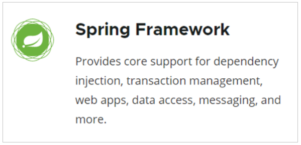

Spring是目前世界上最流行的java框架，它可以帮助我们更加快速、更加容易的来构建java项目。而在Spring家族当中提供了很多优秀的框架，而所有的框架都是基于一个基础框架的SpringFramework\(也就是Spring框架\)。而前面我们也提到，如果我们直接基于Spring框架进行项目的开发，会比较繁琐。

这个繁琐主要体现在两个地方：

1. 在pom\.xml中依赖配置比较繁琐，在项目开发时，需要自己去找到对应的依赖，还需要找到依赖它所配套的依赖以及对应版本，否则就会出现版本冲突问题。

2. 在使用Spring框架进行项目开发时，需要在Spring的配置文件中做大量的配置，这就造成Spring框架入门难度较大，学习成本较高。

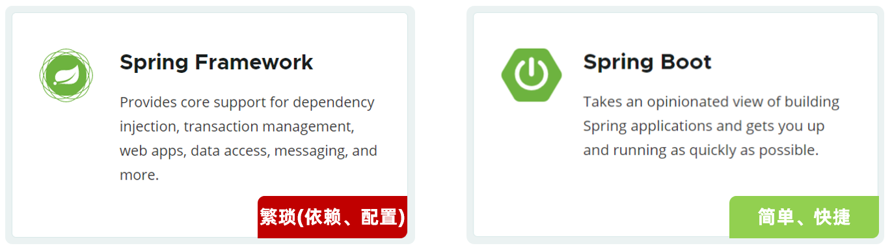

> - 基于Spring存在的问题，官方在Spring框架4\.0版本之后，又推出了一个全新的框架：SpringBoot。
> 
> - 通过 SpringBoot来简化Spring框架的开发\(是简化不是替代\)。我们直接基于SpringBoot来构建java项目，会让我们的项目开发更加简单，更加快捷。
> 

SpringBoot框架之所以使用起来更简单更快捷，是因为SpringBoot框架底层提供了两个非常重要的功能：一个是起步依赖，一个是自动配置。

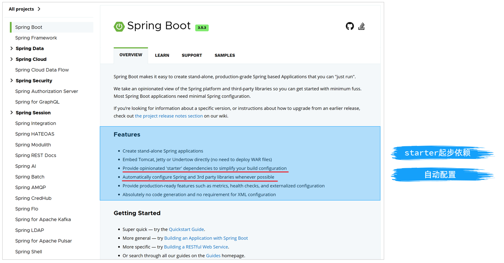


> - 通过SpringBoot所提供的起步依赖，就可以大大的简化pom文件当中依赖的配置，从而解决了Spring框架当中依赖配置繁琐的问题。
> 
> - 通过自动配置的功能就可以大大的简化框架在使用时bean的声明以及bean的配置。我们只需要引入程序开发时所需要的起步依赖，项目开发时所用到常见的配置都已经有了，我们直接使用就可以了。
> 

简单回顾之后，接下来我们来学习下SpringBoot的原理。其实学习SpringBoot的原理就是来解析SpringBoot当中的起步依赖与自动配置的原理。我们首先来学习SpringBoot当中起步依赖的原理。

## 4.起步依赖

假如我们没有使用SpringBoot，用的是Spring框架进行web程序的开发，此时我们就需要引入web程序开发所需要的一些依赖。

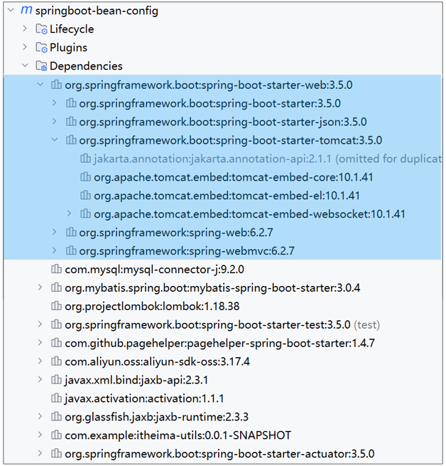

当我们引入了 spring\-boot\-starter\-web 之后，maven会通过依赖传递特性，将web开发所需的常见依赖都传递下来。

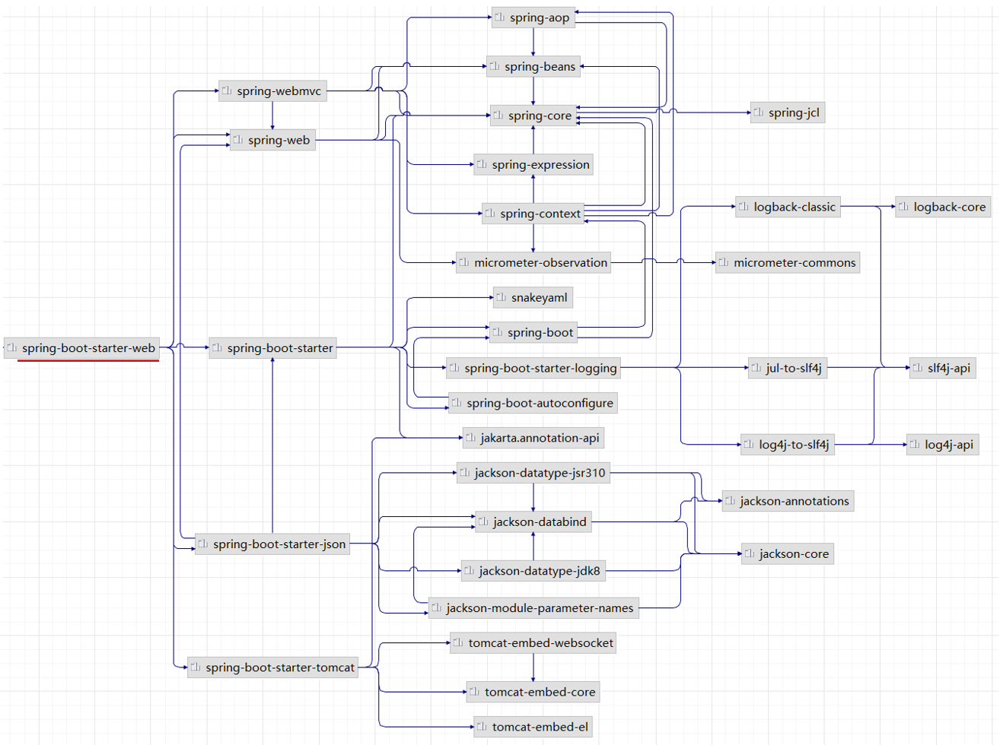

所以，起步依赖的原理就是Maven的依赖传递。

> - 在SpringBoot给我们提供的这些起步依赖当中，已提供了当前程序开发所需要的所有的常见依赖(官网地址：https://docs.spring.io/spring-boot/docs/2.7.7/reference/htmlsingle/#using.build-systems.starters)。
> - 比如：springboot-starter-web，这是web开发的起步依赖，在web开发的起步依赖当中，就集成了web开发中常见的依赖：json、web、webmvc、tomcat等。我们只需要引入这一个起步依赖，其他的依赖都会自动的通过Maven的依赖传递进来。

## 5.自动配置说明

SpringBoot的自动配置就是当spring容器启动后，一些配置类、bean对象就自动存入到了IOC容器中，不需要我们手动去声明，从而简化了开发，省去了繁琐的配置操作。

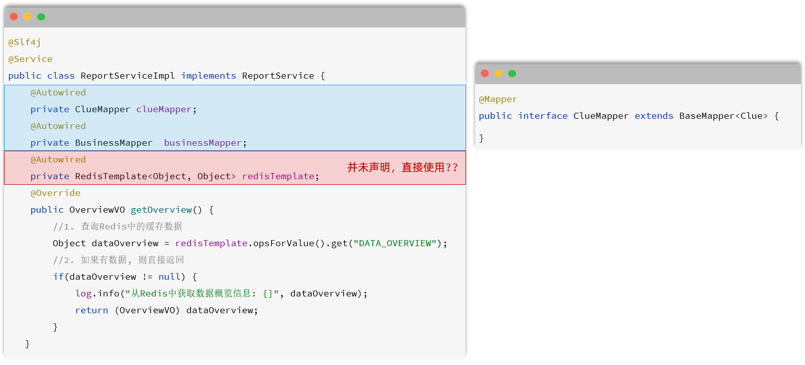

比如，在我们前面讲解首页数据概览的时候，我们要操作Redis，我们就直接基于`@Autowired` 注入一个`RedisTemplate` 进来，就可以直接操作，而这个 `RedisTemplate` 我们并未声明这个bean，为什么可以直接注入使用呢？ 

原因就是因为这个bean，springboot中已经帮我们自动配置完毕了，我们是可以直接使用的。

那接下来，我们就要来解析，SpringBoot中到底是如何完成自动配置的。

## 6.自动配置实现方案

我们知道了什么是自动配置之后，接下来我们就要来剖析自动配置的原理。解析自动配置的原理就是分析在 SpringBoot项目当中，我们引入对应的依赖之后，是如何将依赖jar包当中所提供的bean以及配置类直接加载到当前项目的SpringIOC容器当中的。

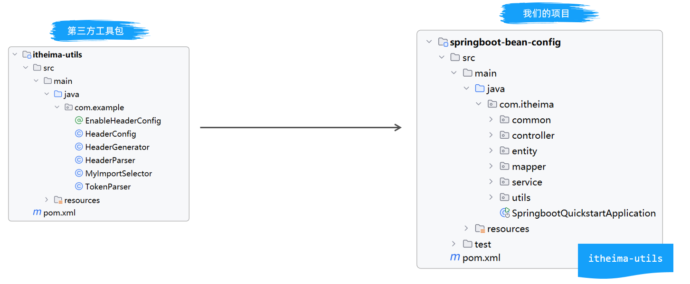

接下来，我们就直接通过代码来分析自动配置原理。

准备工作：在Idea中导入资料中 `itheima-utils` 工程

在SpringBoot项目 `spring-boot-web-config` 工程中，通过坐标引入`itheima-utils`依赖

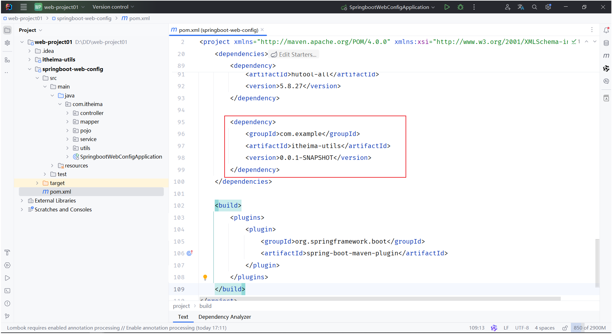

1.引入的 `itheima-utils` 中配置如下:

```java
@Component
public class TokenParser {
    public void parse(){
        System.out.println("TokenParser ... parse ...");
    }
}
```

2.在测试类中，添加测试方法

```java
@SpringBootTest
public class AutoConfigurationTests {
    @Autowired
    private ApplicationContext applicationContext;

    @Test
    public void testTokenParse(){
        System.out.println(applicationContext.getBean(TokenParser.class));
    }

    //省略其他代码...
}
```

3、执行测试方法

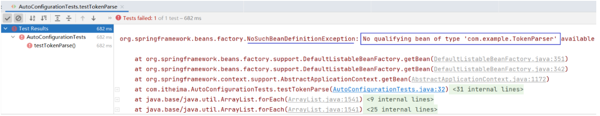

> 异常信息描述： 没有com\.example\.TokenParse类型的bean
> 
> 说明：在Spring容器中没有找到com\.example\.TokenParse类型的bean对象
> 

思考：引入进来的第三方依赖当中的bean以及配置类为什么没有生效？

- 原因在我们之前讲解IOC的时候有提到过，在类上添加`@Component`注解来声明bean对象时，还需要保证`@Component`注解能被Spring的组件扫描到。

- SpringBoot项目中的`@SpringBootApplication`注解，具有包扫描的作用，但是它只会扫描启动类所在的当前包以及子包。 

- 当前包：com\.itheima， 第三方依赖中提供的包：com\.example（扫描不到）

那么如何解决以上问题的呢？

- 方案1：`@ComponentScan` 组件扫描

- 方案2：`@Import` 导入（使用`@Import`导入的类会被Spring加载到IOC容器中）

### 6.1.方案一

`@ComponentScan`组件扫描

```java
@SpringBootApplication
@ComponentScan({"com.itheima","com.example"}) //指定要扫描的包
public class SpringbootWebConfigApplication {
    public static void main(String[] args) {
        SpringApplication.run(SpringbootWebConfigApplication.class, args);
    }
}
```

重新执行测试方法，控制台日志输出：

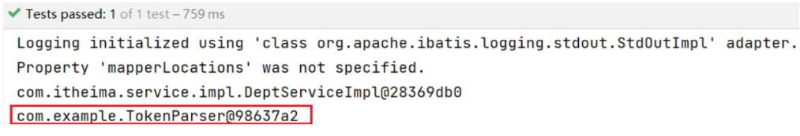

> 大家可以想象一下，如果采用以上这种方式来完成自动配置，那我们进行项目开发时，当需要引入大量的第三方的依赖，就需要在启动类上配置N多要扫描的包，这种方式会很繁琐。而且这种大面积的扫描性能也比较低。
>
> 缺点：
>
> 1. 使用繁琐
>
> 2. 性能低
>
> 结论：SpringBoot中并没有采用以上这种方案。
>

### 6.2.方案二

@Import导入

导入形式主要有以下几种：

- 导入普通类

- 导入配置类

- 导入ImportSelector接口实现类

1.使用@Import导入普通类：

```java
@Import(TokenParser.class) //导入的类会被Spring加载到IOC容器中
@SpringBootApplication
public class SpringbootWebConfigApplication {
    public static void main(String[] args) {
        SpringApplication.run(SpringbootWebConfigApplication.class, args);
    }
}
```

重新执行测试方法，控制台日志输出：

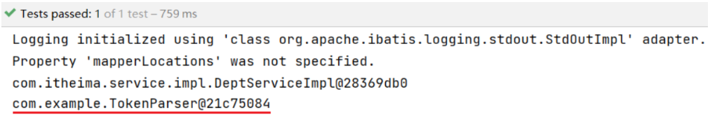

2.使用@Import导入配置类：

配置类

```java
@Configuration
public class HeaderConfig {
    @Bean
    public HeaderParser headerParser(){
        return new HeaderParser();
    }

    @Bean
    public HeaderGenerator headerGenerator(){
        return new HeaderGenerator();
    }
}
```

启动类

```java
@Import(HeaderConfig.class) //导入配置类
@SpringBootApplication
public class SpringbootWebConfig2Application {
    public static void main(String[] args) {
        SpringApplication.run(SpringbootWebConfig2Application.class, args);
    }
}
```

测试类

```java
@SpringBootTest
public class AutoConfigurationTests {
    @Autowired
    private ApplicationContext applicationContext;

    @Test
    public void testHeaderParser(){
        System.out.println(applicationContext.getBean(HeaderParser.class));
    }

    @Test
    public void testHeaderGenerator(){
        System.out.println(applicationContext.getBean(HeaderGenerator.class));
    }
    
    //省略其他代码...
}
```

执行测试方法：

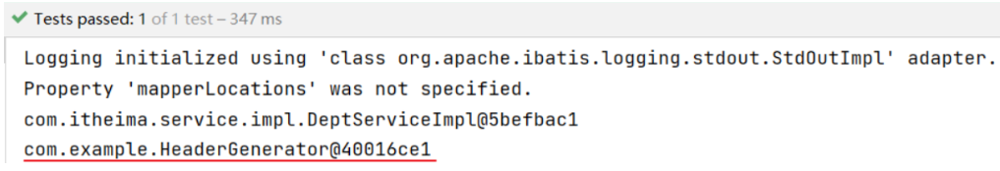

3.使用@Import导入ImportSelector接口实现类：

ImportSelector接口实现类

```java
public class MyImportSelector implements ImportSelector {
    public String[] selectImports(AnnotationMetadata importingClassMetadata) {
        //返回值字符串数组（数组中封装了全限定名称的类）
        return new String[]{"com.example.HeaderConfig"};
    }
}
```

启动类

```java
@Import(MyImportSelector.class) //导入ImportSelector接口实现类
@SpringBootApplication
public class SpringbootWebConfig2Application {
    public static void main(String[] args) {
        SpringApplication.run(SpringbootWebConfig2Application.class, args);
    }
}
```

执行测试方法：

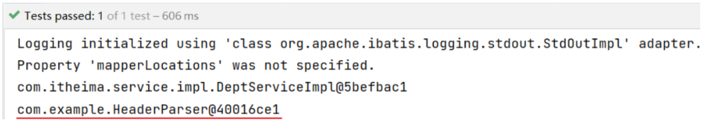

我们使用@Import注解通过这三种方式都可以导入第三方依赖中所提供的bean或者是配置类。

> 思考：如果基于以上方式完成自动配置，当要引入一个第三方依赖时，是不是还要知道第三方依赖中有哪些配置类和哪些Bean对象？
>
> 答案：是的。 （对程序员来讲，很不友好，而且比较繁琐）

> 思考：当我们要使用第三方依赖，依赖中到底有哪些bean和配置类，谁最清楚？
>
> 答案：第三方依赖自身最清楚。

> 结论：我们不用自己指定要导入哪些bean对象和配置类了，让第三方依赖它自己来指定。
>

怎么让第三方依赖自己指定bean对象和配置类？

比较常见的方案就是第三方依赖给我们提供一个注解，这个注解一般都以@EnableXxxx开头的注解，注解中封装的就是@Import注解

4.使用第三方依赖提供的 @EnableXxxxx注解

第三方依赖中提供的注解

```java
@Retention(RetentionPolicy.RUNTIME)
@Target(ElementType.TYPE)
@Import(MyImportSelector.class)//指定要导入哪些bean对象或配置类
public @interface EnableHeaderConfig { 
}
```

在使用时只需在启动类上加上@EnableXxxxx注解即可

```java
@EnableHeaderConfig  //使用第三方依赖提供的Enable开头的注解
@SpringBootApplication
public class SpringbootWebConfig2Application {
    public static void main(String[] args) {
        SpringApplication.run(SpringbootWebConfig2Application.class, args);
    }
}
```

执行测试方法：

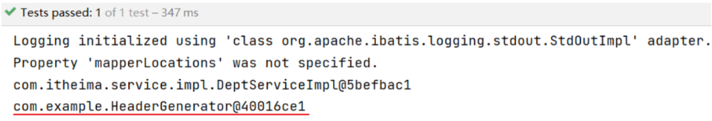

以上四种方式都可以完成导入操作，但是第4种方式会更方便更优雅，而这种方式也是SpringBoot当中所采用的方式。

## 7.自动配置原理分析

### 7.1.源码跟踪

前面我们讲解了在项目当中引入第三方依赖之后，如何加载第三方依赖中定义好的bean对象以及配置类，从而完成自动配置操作。那下面我们通过源码跟踪的形式来剖析下SpringBoot底层到底是如何完成自动配置的。

> 源码跟踪技巧：
>
> 在跟踪框架源码的时候，一定要抓住关键点，找到核心流程。一定不要从头到尾一行代码去看，一个方法的去研究，一定要找到关键流程，抓住关键点，先在宏观上对整个流程或者整个原理有一个认识，有精力再去研究其中的细节。
>

要搞清楚SpringBoot的自动配置原理，要从SpringBoot启动类上使用的核心注解`@SpringBootApplication`开始分析：

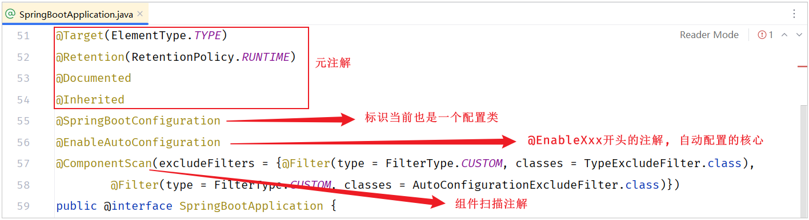

在`@SpringBootApplication`注解中包含了：

- 元注解（不再解释）

- `@SpringBootConfiguration`

- `@EnableAutoConfiguration`

- `@ComponentScan`

我们先来看第一个注解：`@SpringBootConfiguration`

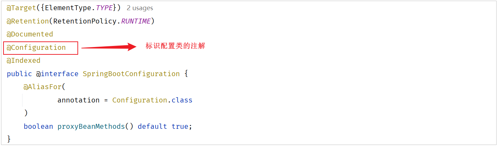

> @SpringBootConfiguration注解上使用了@Configuration，表明SpringBoot启动类就是一个配置类。
> 
> @Indexed注解，是用来加速应用启动的（不用关心）。
> 

接下来再先看`@ComponentScan`注解：

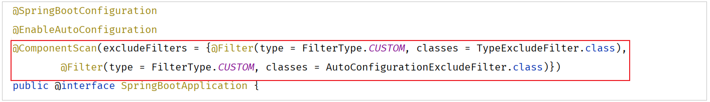

> @ComponentScan注解是用来进行组件扫描的，扫描启动类所在的包及其子包下所有被@Component及其衍生注解声明的类。
> 
> SpringBoot启动类，之所以具备扫描包功能，就是因为包含了@ComponentScan注解。
> 

最后我们来看看`@EnableAutoConfiguration`注解（自动配置核心注解）：

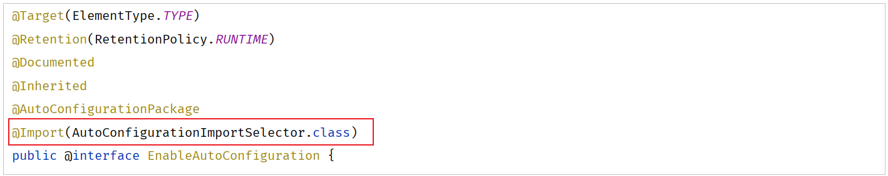

使用`@Import`注解，导入了实现`ImportSelector`接口的实现类。

`AutoConfigurationImportSelector`类是`ImportSelector`接口的实现类。

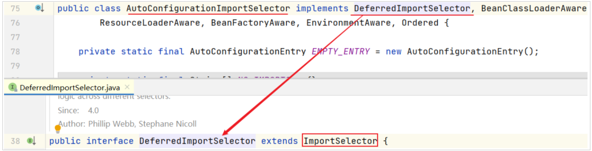

`AutoConfigurationImportSelector`类中重写了`ImportSelector`接口的`selectImports()`方法：

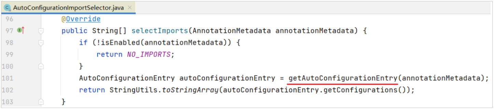

> selectImports\(\)方法底层调用getAutoConfigurationEntry\(\)方法，获取可自动配置的配置类信息集合
> 

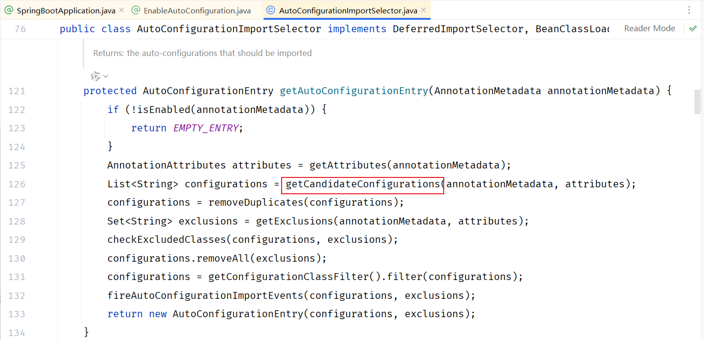

> getAutoConfigurationEntry\(\)方法通过调用getCandidateConfigurations\(annotationMetadata, attributes\)方法获取在配置文件中配置的所有自动配置类的集合
> 

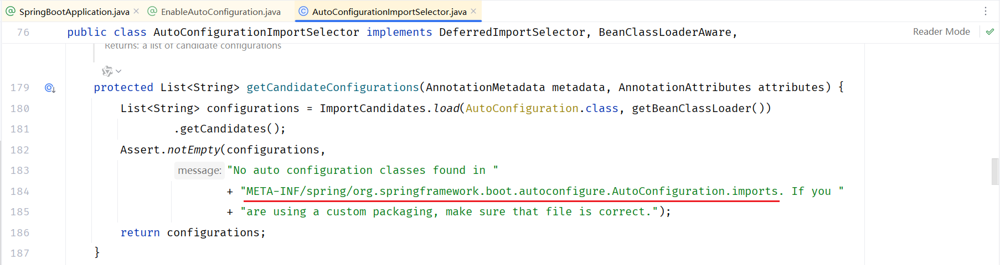

> `getCandidateConfigurations`方法的功能：
> 
> 获取所有基于 `META-INF/spring/org.springframework.boot.autoconfigure.AutoConfiguration.imports`文件中配置类的集合
> 

`META-INF/spring/org.springframework.boot.autoconfigure.AutoConfiguration.imports`文件这两个文件在哪里呢？

通常在引入的起步依赖中，都有包含以上文件 

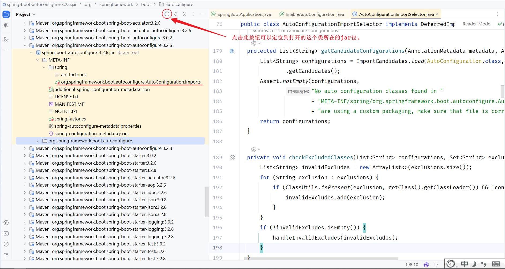

在前面在给大家演示自动配置的时候，我们直接在测试类当中注入了一个叫`gson`的bean对象，进行JSON格式转换。虽然我们没有配置bean对象，但是我们是可以直接注入使用的。原因就是因为在自动配置类当中做了自动配置。到底是在哪个自动配置类当中做的自动配置呢？我们通过搜索来查询一下。

在`META-INF/spring/org.springframework.boot.autoconfigure.AutoConfiguration.imports` 配置文件中指定了第三方依赖`RedisTemplate`的配置类：`RedisAutoConfiguration`

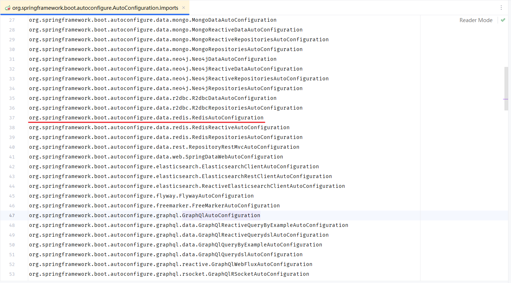

打开上面的第三方依赖中提供的 `RedisAutoConfiguration` 类：


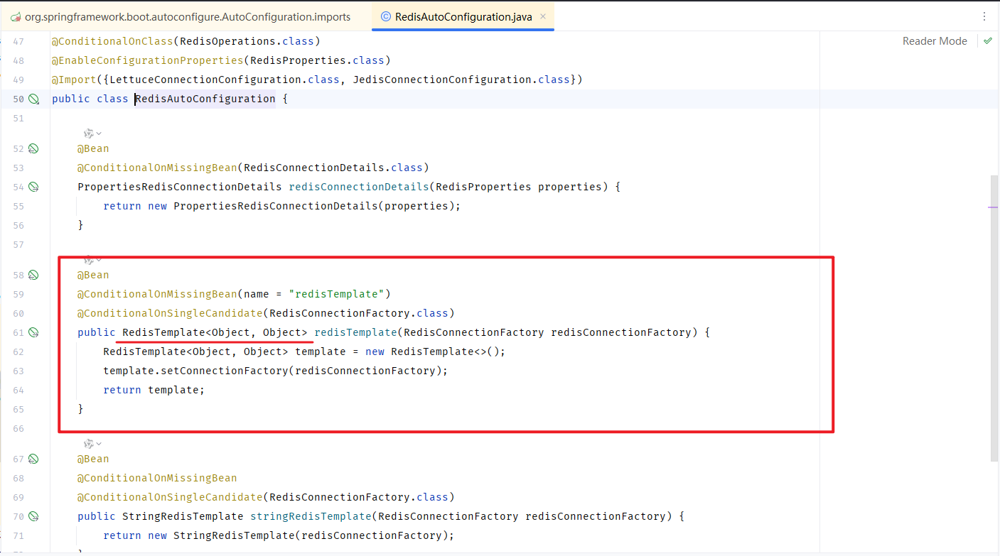

在`RedisAutoConfiguration`类上，添加了注解`@AutoConfiguration`，通过查看源码，可以明确：`RedisAutoConfiguration` 类是一个配置。

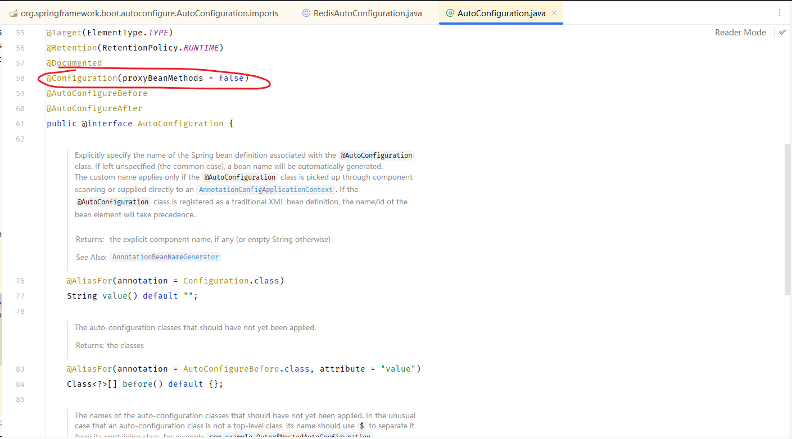

看到这里，大家就应该明白为什么可以完成自动配置了，原理就是在配置类中定义一个`@Bean`标识的方法，而Spring会自动调用配置类中使用`@Bean`标识的方法，并把方法的返回值注册到IOC容器中。

自动配置源码小结：

自动配置原理源码入口就是 `@SpringBootApplication` 注解，在这个注解中封装了3个注解，分别是：

1.@SpringBootConfiguration

声明当前类是一个配置类

2.@ComponentScan

进行组件扫描（SpringBoot中默认扫描的是启动类所在的当前包及其子包）

3.@EnableAutoConfiguration

封装了@Import注解（Import注解中指定了一个ImportSelector接口的实现类）

在实现类重写的selectImports\(\)方法，读取当前项目下所有依赖jar包中`META-INF/spring/org.springframework.boot.autoconfigure.AutoConfiguration.imports`两个文件里面定义的配置类（配置类中定义了@Bean注解标识的方法）。

当SpringBoot程序启动时，就会加载配置文件当中所定义的配置类，并将这些配置类信息\(类的全限定名\)封装到String类型的数组中，最终通过@Import注解将这些配置类全部加载到Spring的IOC容器中，交给IOC容器管理。

> 最后呢给大家抛出一个问题：在 `META-INF/spring/org.springframework.boot.autoconfigure.AutoConfiguration.imports` 文件中定义的配置类非常多，而且每个配置类中又可以定义很多的bean，那这些bean都会注册到Spring的IOC容器中吗？
> 
> 答案：并不是。 在声明bean对象时，上面有加一个以 `@Conditional` 开头的注解，这种注解的作用就是按照条件进行装配，只有满足条件之后，才会将bean注册到Spring的IOC容器中（下面会详细来讲解）
> 

### 7.2.@Conditional

我们在跟踪SpringBoot自动配置的源码的时候，在自动配置类声明bean的时候，除了在方法上加了一个@Bean注解以外，还会经常用到一个注解，就是以Conditional开头的这一类的注解。以Conditional开头的这些注解都是条件装配的注解。下面我们就来介绍下条件装配注解。

@Conditional注解：

作用：按照一定的条件进行判断，在满足给定条件后才会注册对应的bean对象到Spring的IOC容器中。

位置：方法、类

@Conditional本身是一个父注解，派生出大量的子注解：

- @ConditionalOnClass：判断环境中有对应字节码文件，才注册bean到IOC容器。

- @ConditionalOnMissingBean：判断环境中没有对应的bean\(类型或名称\)，才注册bean到IOC容器。

- @ConditionalOnProperty：判断配置文件中有对应属性和值，才注册bean到IOC容器。

下面我们通过代码来演示下Conditional注解的使用：

1.`@ConditionalOnClass`注解

```java
@Configuration
public class HeaderConfig {

    @Bean
    @ConditionalOnClass(name="io.jsonwebtoken.Jwts")//环境中存在指定的这个类，才会将该bean加入IOC容器
    public HeaderParser headerParser(){
        return new HeaderParser();
    }
    
    //省略其他代码...
}
```

pom\.xml

```xml
<!--JWT令牌-->
<dependency>
     <groupId>io.jsonwebtoken</groupId>
     <artifactId>jjwt</artifactId>
     <version>0.9.1</version>
</dependency>
```

测试类

```java
@SpringBootTest
public class AutoConfigurationTests {
    @Autowired
    private ApplicationContext applicationContext;

    @Test
    public void testHeaderParser(){
        System.out.println(applicationContext.getBean(HeaderParser.class));
    }
    
    //省略其他代码...
}
```

执行testHeaderParser\(\)测试方法：

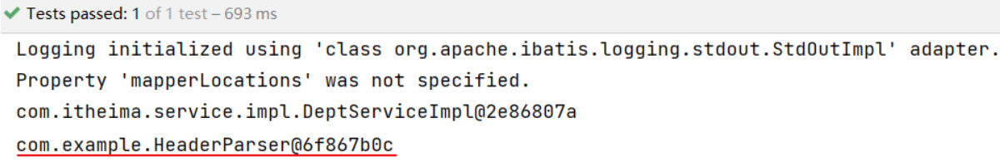

> 因为 `io.jsonwebtoken.Jwts` 字节码文件在启动SpringBoot程序时已存在，所以创建HeaderParser对象并注册到IOC容器中。
>

2.@ConditionalOnMissingBean注解

```java
@Configuration
public class HeaderConfig {
        
    @Bean
    @ConditionalOnMissingBean //不存在该类型的bean，才会将该bean加入IOC容器
    public HeaderParser headerParser(){
        return new HeaderParser();
    }
    
    //省略其他代码...
}
```

执行testHeaderParser\(\)测试方法：

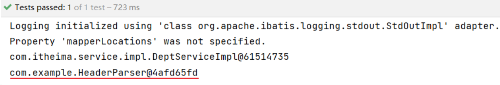

> SpringBoot在调用@Bean标识的headerParser\(\)前，IOC容器中是没有HeaderParser类型的bean，所以HeaderParser对象正常创建，并注册到IOC容器中。
>

再次修改@ConditionalOnMissingBean注解

```java
@Configuration
public class HeaderConfig {

    @Bean
    @ConditionalOnMissingBean//不存在指定类型的bean，才会将该bean加入IOC容器
    public HeaderParser headerParser(){
        return new HeaderParser();
    }
    
    //省略其他代码...
}
```

执行testHeaderParser\(\)测试方法：

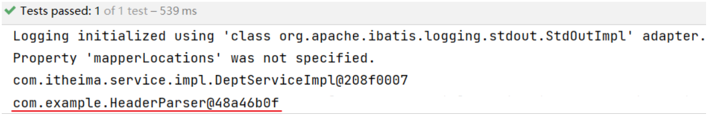

3.`@ConditionalOnProperty`注解（这个注解和配置文件当中配置的属性有关系）

先在`application.yml`配置文件中添加如下的键值对：

```yaml
name: itheima
```

在声明bean的时候就可以指定一个条件@ConditionalOnProperty

```java
@Configuration
public class HeaderConfig {

    @Bean
    @ConditionalOnProperty(name ="name",havingValue = "itheima")//配置文件中存在指定属性名与值，才会将bean加入IOC容器
    public HeaderParser headerParser(){
        return new HeaderParser();
    }

    @Bean
    public HeaderGenerator headerGenerator(){
        return new HeaderGenerator();
    }
}
```

执行testHeaderParser\(\)测试方法：

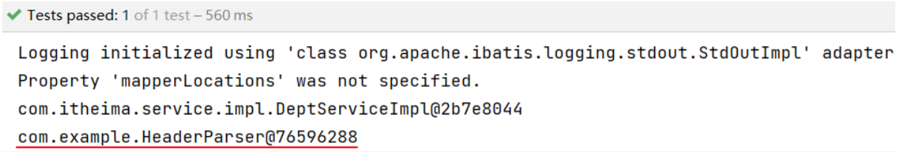

修改`@ConditionalOnProperty`注解：  havingValue的值修改为"itheima2"

```java
@Bean
@ConditionalOnProperty(name ="name",havingValue = "itheima2")//配置文件中存在指定属性名与值，才会将bean加入IOC容器
public HeaderParser headerParser(){
        return new HeaderParser();
}
```

再次执行testHeaderParser\(\)测试方法：

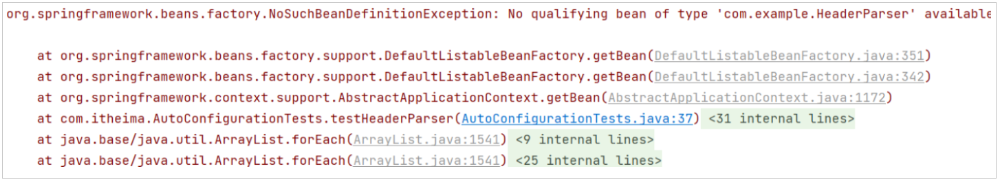

> 因为 `application.yml` 配置文件中，不存在： name:  itheima2，所以HeaderParser对象在IOC容器中不存在
> 

我们再回头看看之前讲解SpringBoot源码时提到的一个配置类：`GsonAutoConfiguration`

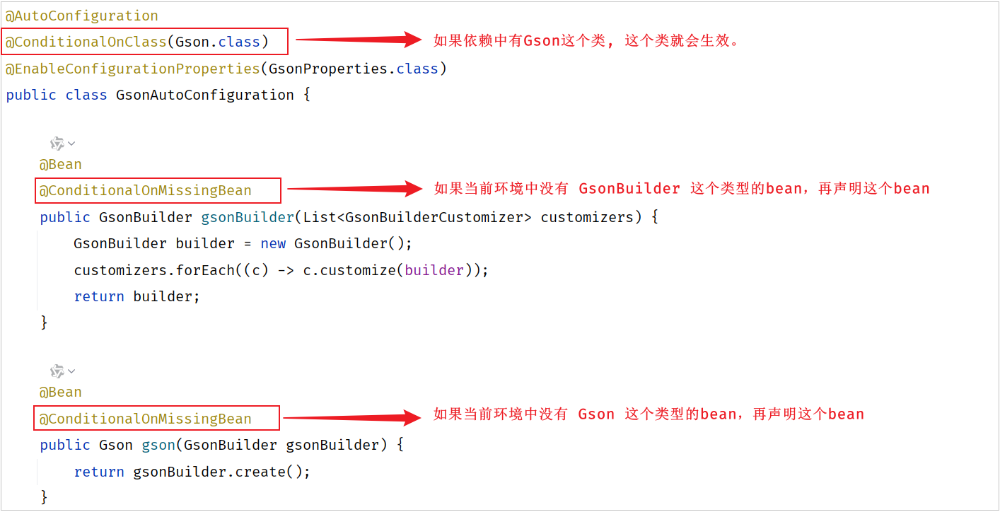

最后再给大家梳理一下自动配置原理：

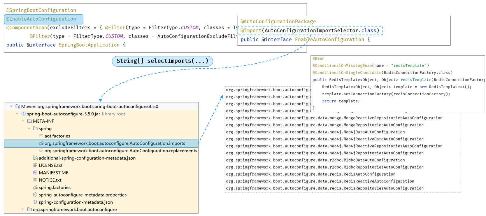

> 自动配置的核心就在@SpringBootApplication注解上，SpringBootApplication这个注解底层包含了3个注解，分别是：
>
> - @SpringBootConfiguration
>
> - @ComponentScan
>
> - @EnableAutoConfiguration
>
> @EnableAutoConfiguration这个注解才是自动配置的核心。
>
> - 它封装了一个@Import注解，Import注解里面指定了一个ImportSelector接口的实现类。
>
> - 在这个实现类中，重写了ImportSelector接口中的selectImports\(\)方法。
>
> - 而selectImports\(\)方法中会去读取两份配置文件，并将配置文件中定义的配置类做为selectImports\(\)方法的返回值返回，返回值代表的就是需要将哪些类交给Spring的IOC容器进行管理。
>
> - 那么所有自动配置类的中声明的bean都会加载到Spring的IOC容器中吗? 其实并不会，因为这些配置类中在声明bean时，通常都会添加@Conditional开头的注解，这个注解就是进行条件装配。而Spring会根据Conditional注解有选择性的进行bean的创建。
>
> - @Enable 开头的注解底层，它就封装了一个注解 import 注解，它里面指定了一个类，是 ImportSelector 接口的实现类。在实现类当中，我们需要去实现 ImportSelector  接口当中的一个方法 selectImports 这个方法。这个方法的返回值代表的就是我需要将哪些类交给 spring 的 IOC容器进行管理。
>
> - 此时它会去读取两份配置文件，一份儿是 spring\.factories，另外一份儿是 autoConfiguration\.imports。而在  autoConfiguration\.imports 这份儿文件当中，它就会去配置大量的自动配置的类。
>
> - 而前面我们也提到过这些所有的自动配置类当中，所有的 bean都会加载到 spring 的 IOC 容器当中吗？其实并不会，因为这些配置类当中，在声明 bean 的时候，通常会加上这么一类@Conditional 开头的注解。这个注解就是进行条件装配。所以SpringBoot非常的智能，它会根据 @Conditional 注解来进行条件装配。只有条件成立，它才会声明这个bean，才会将这个 bean 交给 IOC 容器管理。
>

## 8.自定义starter

### 8.1.分析

前面我们解析了SpringBoot中自动配置的原理，下面我们就通过一个自定义starter案例来加深大家对于自动配置原理的理解。首先介绍一下自定义starter的业务场景，再来分析一下具体的操作步骤。

所谓starter指的就是SpringBoot当中的起步依赖。在SpringBoot当中已经给我们提供了很多的起步依赖了，我们为什么还需要自定义 starter 起步依赖？

这是因为在实际的项目开发当中，我们可能会用到很多第三方的技术，并不是所有的第三方的技术官方都给我们提供了与SpringBoot整合的starter起步依赖，但是这些技术又非常的通用，在很多项目组当中都在使用。

业务场景：

我们前面案例当中所使用的阿里云OSS对象存储服务，现在阿里云的官方是没有给我们提供对应的起步依赖的，这个时候使用起来就会比较繁琐，我们需要引入对应的依赖。我们还需要在配置文件当中进行配置，还需要基于官方SDK示例来改造对应的工具类，我们在项目当中才可以进行使用。

大家想在我们当前项目当中使用了阿里云OSS，我们需要进行这么多步的操作。在别的项目组当中要想使用阿里云OSS，是不是也需要进行这么多步的操作，所以这个时候我们就可以自定义一些公共组件，在这些公共组件当中，我就可以提前把需要配置的bean都提前配置好。将来在项目当中，我要想使用这个技术，我直接将组件对应的坐标直接引入进来，就已经自动配置好了，就可以直接使用了。我们也可以把公共组件提供给别的项目组进行使用，这样就可以大大的简化我们的开发。

在SpringBoot项目中，一般都会将这些公共组件封装为SpringBoot当中的starter，也就是我们所说的起步依赖。

而在springboot中，官方提供的起步依赖 或 第三方提供的起步依赖，基本都会包含两个模块，如下所示：

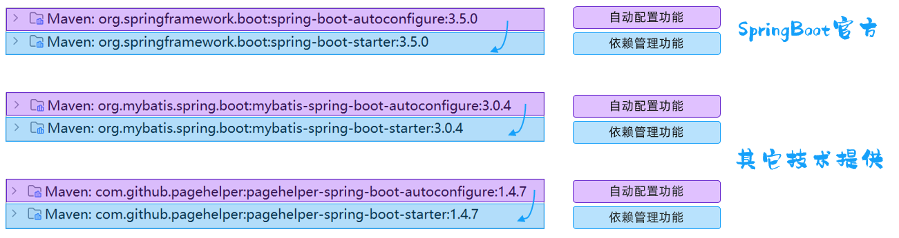

其中，`spring-boot-starter`  或  `xxx-spring-boot-starter` 这个模块主要是依赖管理的功能。 而 `spring-boot-autoconfigure` 或 `xxxx-spring-boot-autoconfigure` 主要是起到自动配置的作用，自动配置的核心代码就在这个模块中编写。

> SpringBoot官方starter命名： spring\-boot\-starter\-xxxx
>
> 第三组织提供的starter命名：  xxxx\-spring\-boot\-starter
>

而自动配置模块的核心，就是编写自动配置的核心代码，然后将自动配置的核心类，配置在核心的配置文件 `META-INF/spring/org.springframework.boot.autoconfigure.AutoConfiguration.imports` 中。 配置如下：

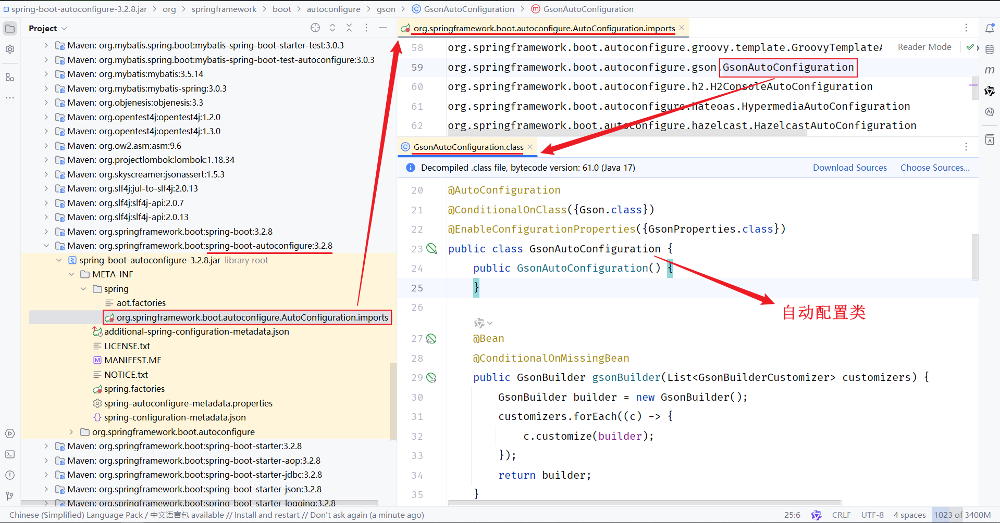

> SpringBoot官方的自动配置依赖 `spring-boot-autoconfiure` 中就提供了配置类，并且也提供了springboot会自动读取的配置文件。当SpringBoot项目启动时，会读取到`META-INF/spring/org.springframework.boot.autoconfigure.AutoConfiguration.imports`配置文件中的配置类并加载配置类，生成相关bean对象注册到IOC容器中。
>
> 结果：我们可以直接在SpringBoot程序中使用自动配置的bean对象。
>

在自定义一个起步依赖starter的时候，按照规范需要定义两个模块：

1. starter模块（进行依赖管理\[把程序开发所需要的依赖都定义在starter起步依赖中\]）

2. autoconfigure模块（自动配置）

> 将来在项目当中进行相关功能开发时，只需要引入一个起步依赖就可以了，因为它会将autoconfigure自动配置的依赖给传递下来。
> 

### 8.2.需求

上面我们简单介绍了自定义starter的场景，以及自定义starter时涉及到的模块之后，接下来我们就来完成一个自定义starter的案例。

需求：自定义`aliyun-oss-spring-boot-starter`，完成阿里云OSS操作工具类 `AliyunOSSOperator` 的自动配置。

目标：引入起步依赖引入之后，要想使用阿里云OSS，注入`AliyunOSSOperator` 直接使用即可。

之前我们的用法：

1.在pom\.xml中引入阿里云oss的所有依赖

```xml
<!--阿里云OSS-->
<dependency>
    <groupId>com.aliyun.oss</groupId>
    <artifactId>aliyun-sdk-oss</artifactId>
    <version>3.17.4</version>
</dependency>
<dependency>
    <groupId>javax.xml.bind</groupId>
    <artifactId>jaxb-api</artifactId>
    <version>2.3.1</version>
</dependency>
<dependency>
    <groupId>javax.activation</groupId>
    <artifactId>activation</artifactId>
    <version>1.1.1</version>
</dependency>
<!-- no more than 2.3.3-->
<dependency>
    <groupId>org.glassfish.jaxb</groupId>
    <artifactId>jaxb-runtime</artifactId>
    <version>2.3.3</version>
</dependency>
```

2.application\.yml 中配置阿里云OSS的配置信息

```yaml
#阿里云oss配置
aliyun:
  oss:
    endpoint: https://oss-cn-beijing.aliyuncs.com
    bucketName: java422-web-ai
```

3.定义实体类封装配置信息

```java
package com.itheima.utils;

import lombok.Data;
import org.springframework.boot.context.properties.ConfigurationProperties;
import org.springframework.stereotype.Component;

@Data
@Component
@ConfigurationProperties(prefix = "aliyun.oss")
public class AliyunOSSProperties {
    private String endpoint;
    private String bucketName;
}
```

4.定义工具类`AliyunOSSOperator` 

```java
package com.itheima.utils;

import com.aliyun.oss.OSS;
import com.aliyun.oss.OSSClientBuilder;
import com.aliyun.oss.common.auth.CredentialsProviderFactory;
import com.aliyun.oss.common.auth.EnvironmentVariableCredentialsProvider;
import com.aliyun.oss.model.OSSObjectSummary;
import com.aliyun.oss.model.ObjectListing;
import org.springframework.beans.factory.annotation.Autowired;
import org.springframework.stereotype.Component;

import java.io.ByteArrayInputStream;
import java.time.LocalDate;
import java.time.format.DateTimeFormatter;
import java.util.List;
import java.util.UUID;
import java.util.stream.Collectors;

@Component
public class AliyunOSSOperator {

    @Autowired
    private AliyunOSSProperties aliyunOSSProperties;

    /**
     * 文件上传
     */
    public String upload(byte[] content, String originalFilename) throws Exception {
        String endpoint = aliyunOSSProperties.getEndpoint();
        String bucketName = aliyunOSSProperties.getBucketName();

        // 从环境变量中获取访问凭证。运行本代码示例之前，请确保已设置环境变量OSS_ACCESS_KEY_ID和OSS_ACCESS_KEY_SECRET。
        EnvironmentVariableCredentialsProvider credentialsProvider = CredentialsProviderFactory.newEnvironmentVariableCredentialsProvider();

        // 填写Object完整路径，例如202406/1.png。Object完整路径中不能包含Bucket名称。
        //获取当前系统日期的字符串,格式为 yyyy/MM
        String dir = LocalDate.now().format(DateTimeFormatter.ofPattern("yyyy/MM"));
        //根据原始文件名originalFilename, 生成一个新的不重复的文件名
        String newFileName = UUID.randomUUID().toString() + originalFilename.substring(originalFilename.lastIndexOf("."));
        String objectName = dir + "/" + newFileName;

        // 创建OSSClient实例。
        OSS ossClient = new OSSClientBuilder().build(endpoint, credentialsProvider);

        //文件上传
        try {
            ossClient.putObject(bucketName, objectName, new ByteArrayInputStream(content));
        } finally {
            if (ossClient != null) {
                ossClient.shutdown();
            }
        }

        return endpoint.split("//")[0] + "//" + bucketName + "." + endpoint.split("//")[1] + "/" + objectName;
    }


    /**
     * 查询文件列表
     */
    public List<String> listFiles() throws Exception {
        String endpoint = aliyunOSSProperties.getEndpoint();
        String bucketName = aliyunOSSProperties.getBucketName();
        // 从环境变量中获取访问凭证。运行本代码示例之前，请确保已设置环境变量OSS_ACCESS_KEY_ID和OSS_ACCESS_KEY_SECRET。
        EnvironmentVariableCredentialsProvider credentialsProvider = CredentialsProviderFactory.newEnvironmentVariableCredentialsProvider();
        // 指定前缀，例如exampledir/object。
        String keyPrefix = null;

        // 创建OSSClient实例。
        OSS ossClient = new OSSClientBuilder().build(endpoint, credentialsProvider);

        try {
            // 列举文件。如果不设置keyPrefix，则列举存储空间下的所有文件。如果设置keyPrefix，则列举包含指定前缀的文件。
            ObjectListing objectListing = ossClient.listObjects(bucketName, keyPrefix);
            List<OSSObjectSummary> sums = objectListing.getObjectSummaries();
            if(sums != null && !sums.isEmpty()){
                return sums.stream().map(OSSObjectSummary::getKey).collect(Collectors.toList());
            }
        } finally {
            if (ossClient != null) {
                ossClient.shutdown();
            }
        }
        return null;
    }

    /**
     * 删除指定对象
     */
    public void deleteFile(String objectName) throws Exception {
        String endpoint = aliyunOSSProperties.getEndpoint();
        String bucketName = aliyunOSSProperties.getBucketName();

        // 从环境变量中获取访问凭证。运行本代码示例之前，请确保已设置环境变量OSS_ACCESS_KEY_ID和OSS_ACCESS_KEY_SECRET。
        EnvironmentVariableCredentialsProvider credentialsProvider = CredentialsProviderFactory.newEnvironmentVariableCredentialsProvider();
        // 创建OSSClient实例。
        OSS ossClient = new OSSClientBuilder().build(endpoint, credentialsProvider);

        try {
            // 删除文件或目录。如果要删除目录，目录必须为空。
            ossClient.deleteObject(bucketName, objectName);
        } finally {
            if (ossClient != null) {
                ossClient.shutdown();
            }
        }
    }

}
```

5.其他地方要使用阿里云OSS，注入工具类，再使用

```java

@Slf4j
@RestController
public class UploadController {
    @Autowired
    private AliyunOSSOperator aliyunOSSOperator;

    /**
     * 文件上传
     */
    @PostMapping("/upload")
    public Result upload(MultipartFile file) throws Exception {
        log.info("上传文件：{}",file.getOriginalFilename());
        //调用aliyun OSS进行文件上传
        String url = aliyunOSSOperator.upload(file.getBytes(), file.getOriginalFilename());
        //返回结果
        return Result.success(url);
    }
}
```

我们可以看到，在项目中使用阿里云OSS，需要这么五步操作，而阿里云OSS这个云服务还是非常常见的，很多项目中都要使用。

大家再思考，现在我们使用阿里云OSS，需要做这么几步，将来大家在开发其他的项目的时候，你使用阿里云OSS，这几步你要不要做？当团队中其他小伙伴也在使用阿里云OSS的时候，步骤 不也是一样的。

所以这个时候我们就可以制作一个公共组件\(自定义starter\)。starter定义好之后，将来要使用阿里云OSS进行文件上传，只需要将起步依赖引入进来之后，就可以直接注入 `AliyunOSSOperator` 使用了。

### 8.3.实现

需求明确了，接下来我们再来分析一下具体的实现步骤：

第1步：创建自定义starter模块 `aliyun-oss-spring-boot-starter`（进行依赖管理）

- 把阿里云OSS所有的依赖统一管理起来

第2步：创建autoconfigure模块 `aliyun-oss-spring-boot-autoconfigure`

- 在starter中引入autoconfigure （我们使用时只需要引入starter起步依赖即可）

第3步：在autoconfigure模块`aliyun-oss-spring-boot-autoconfigure`中完成自动配置

- 定义一个自动配置类，在自动配置类中将所要配置的bean都提前配置好

- 定义配置文件，把自动配置类的全类名定义在配置文件\(`META-INF/spring/xxxx.imports`\)中

我们分析完自定义阿里云OSS自动配置的操作步骤了，下面我们就按照分析的步骤来实现自定义starter。

首先我们先来创建两个Maven模块：

1.创建 `aliyun-oss-spring-boot-starter`

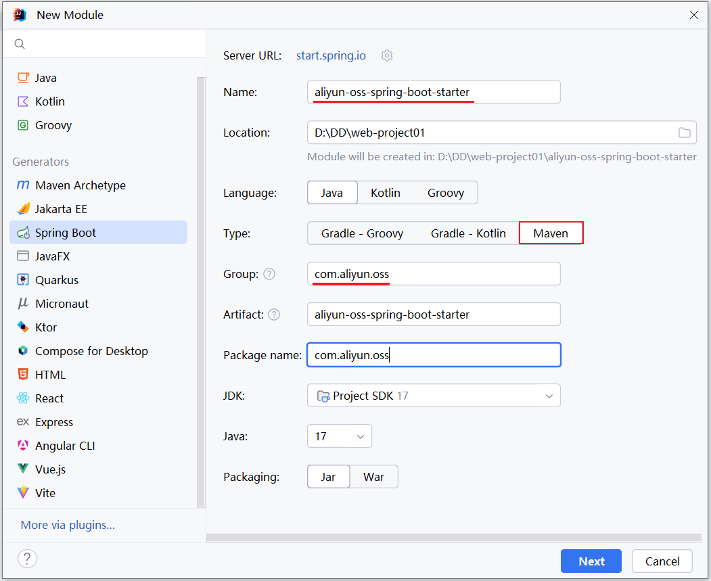

选择springboot的版本，不需要勾选任何的依赖。直接点击 `create` 创建项目。

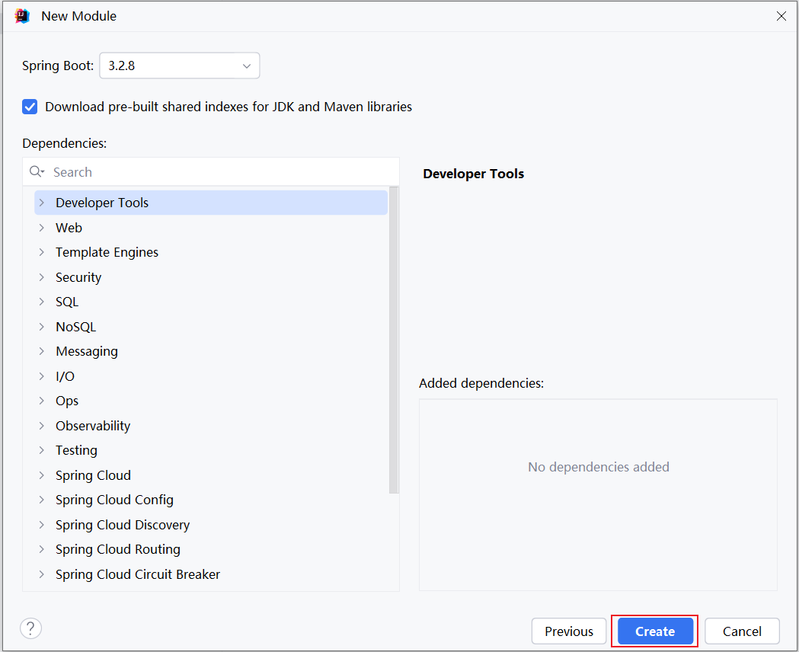

创建完starter模块后，删除多余的文件，只保留一个pom\.xml文件。最终保留内容如下：


pom\.xml 中的配置如下:

```xml
<?xml version="1.0" encoding="UTF-8"?>
<project xmlns="http://maven.apache.org/POM/4.0.0" xmlns:xsi="http://www.w3.org/2001/XMLSchema-instance"
         xsi:schemaLocation="http://maven.apache.org/POM/4.0.0 https://maven.apache.org/xsd/maven-4.0.0.xsd">
    <modelVersion>4.0.0</modelVersion>
    <parent>
        <groupId>org.springframework.boot</groupId>
        <artifactId>spring-boot-starter-parent</artifactId>
        <version>3.2.8</version>
        <relativePath/> <!-- lookup parent from repository -->
    </parent>

    <groupId>com.aliyun.oss</groupId>
    <artifactId>aliyun-oss-spring-boot-starter</artifactId>
    <version>0.0.1-SNAPSHOT</version>

    <properties>
        <java.version>17</java.version>
    </properties>

    <dependencies>
        <dependency>
            <groupId>org.springframework.boot</groupId>
            <artifactId>spring-boot-starter</artifactId>
        </dependency>
    </dependencies>

</project>
```

2.创建 `aliyun-oss-spring-boot-autoconfigure` 模块

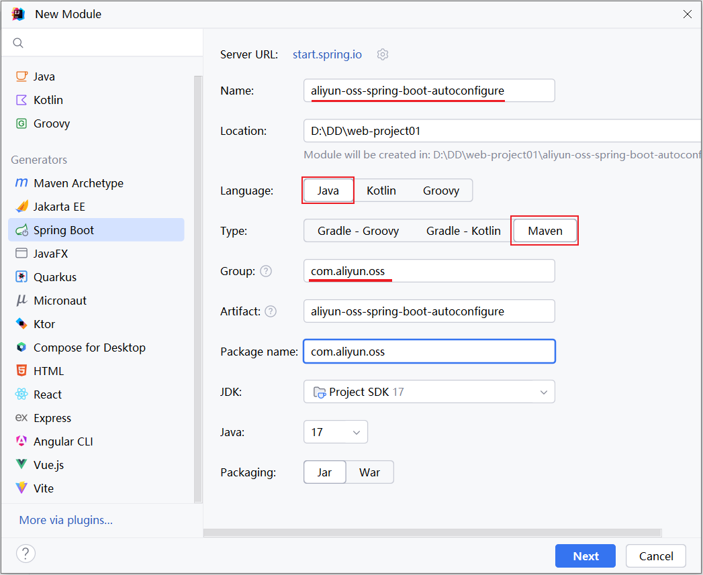

选择Springboot的版本，不用勾选任何依赖。

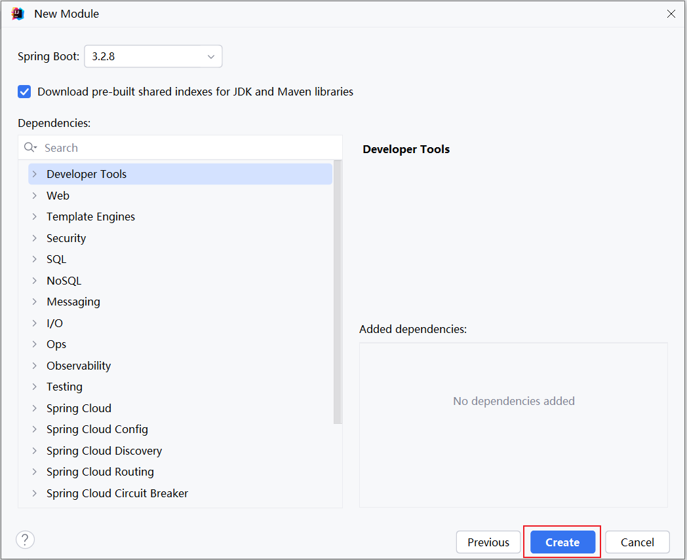

创建完starter模块后，删除多余的文件，只保留 `src` 和 `pom.xml` 。最终保留内容如下：

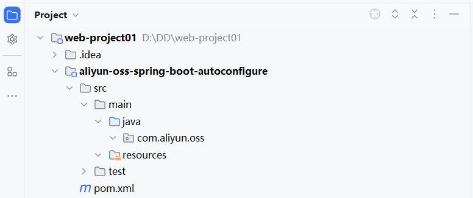

该模块的pom\.xml内容如下：

```xml
<?xml version="1.0" encoding="UTF-8"?>
<project xmlns="http://maven.apache.org/POM/4.0.0" xmlns:xsi="http://www.w3.org/2001/XMLSchema-instance"
         xsi:schemaLocation="http://maven.apache.org/POM/4.0.0 https://maven.apache.org/xsd/maven-4.0.0.xsd">
    <modelVersion>4.0.0</modelVersion>
    <parent>
        <groupId>org.springframework.boot</groupId>
        <artifactId>spring-boot-starter-parent</artifactId>
        <version>3.2.8</version>
        <relativePath/> <!-- lookup parent from repository -->
    </parent>

    <groupId>com.aliyun.oss</groupId>
    <artifactId>aliyun-oss-spring-boot-autoconfigure</artifactId>
    <version>0.0.1-SNAPSHOT</version>

    <properties>
        <java.version>17</java.version>
    </properties>

    <dependencies>
        <dependency>
            <groupId>org.springframework.boot</groupId>
            <artifactId>spring-boot-starter</artifactId>
        </dependency>
    </dependencies>

</project>
```

按照我们之前的分析，是需要在starter模块中来引入autoconfigure这个模块的。打开starter模块中的pom文件：

```xml
<?xml version="1.0" encoding="UTF-8"?>
<project xmlns="http://maven.apache.org/POM/4.0.0" xmlns:xsi="http://www.w3.org/2001/XMLSchema-instance"
         xsi:schemaLocation="http://maven.apache.org/POM/4.0.0 https://maven.apache.org/xsd/maven-4.0.0.xsd">
    <modelVersion>4.0.0</modelVersion>
    <parent>
        <groupId>org.springframework.boot</groupId>
        <artifactId>spring-boot-starter-parent</artifactId>
        <version>3.2.8</version>
        <relativePath/> <!-- lookup parent from repository -->
    </parent>

    <groupId>com.aliyun.oss</groupId>
    <artifactId>aliyun-oss-spring-boot-starter</artifactId>
    <version>0.0.1-SNAPSHOT</version>

    <properties>
        <java.version>17</java.version>
    </properties>

    <dependencies>
        <dependency>
            <groupId>org.springframework.boot</groupId>
            <artifactId>spring-boot-starter</artifactId>
        </dependency>

        <dependency>
            <groupId>com.aliyun.oss</groupId>
            <artifactId>aliyun-oss-spring-boot-autoconfigure</artifactId>
            <version>0.0.1-SNAPSHOT</version>
        </dependency>
    </dependencies>

</project>
```

前两步已经完成了，接下来是最关键的就是第三步：在`aliyun-oss-spring-boot-autoconfigure`模块当中来完成自动配置操作。

> 我们将之前案例中所使用的阿里云OSS部分的代码直接拷贝到autoconfigure模块下，然后进行改造就行了。
> 

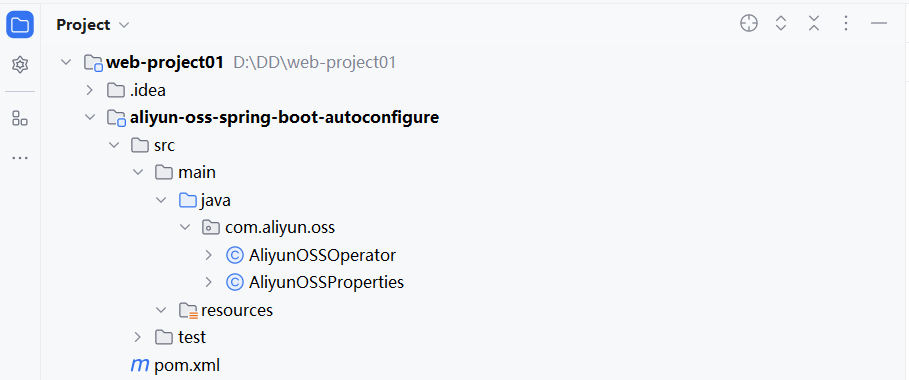

拷贝过来后，还缺失一些相关的依赖，需要把相关依赖也拷贝过来：

```xml
<?xml version="1.0" encoding="UTF-8"?>
<project xmlns="http://maven.apache.org/POM/4.0.0" xmlns:xsi="http://www.w3.org/2001/XMLSchema-instance"
         xsi:schemaLocation="http://maven.apache.org/POM/4.0.0 https://maven.apache.org/xsd/maven-4.0.0.xsd">
    <modelVersion>4.0.0</modelVersion>
    <parent>
        <groupId>org.springframework.boot</groupId>
        <artifactId>spring-boot-starter-parent</artifactId>
        <version>3.2.8</version>
        <relativePath/> <!-- lookup parent from repository -->
    </parent>

    <groupId>com.aliyun.oss</groupId>
    <artifactId>aliyun-oss-spring-boot-autoconfigure</artifactId>
    <version>0.0.1-SNAPSHOT</version>

    <properties>
        <java.version>17</java.version>
    </properties>

    <dependencies>
        <dependency>
            <groupId>org.springframework.boot</groupId>
            <artifactId>spring-boot-starter</artifactId>
        </dependency>

        <dependency>
            <groupId>org.projectlombok</groupId>
            <artifactId>lombok</artifactId>
        </dependency>

        <!--阿里云OSS-->
        <dependency>
            <groupId>com.aliyun.oss</groupId>
            <artifactId>aliyun-sdk-oss</artifactId>
            <version>3.17.4</version>
        </dependency>
        <dependency>
            <groupId>javax.xml.bind</groupId>
            <artifactId>jaxb-api</artifactId>
            <version>2.3.1</version>
        </dependency>
        <dependency>
            <groupId>javax.activation</groupId>
            <artifactId>activation</artifactId>
            <version>1.1.1</version>
        </dependency>
        <!-- no more than 2.3.3-->
        <dependency>
            <groupId>org.glassfish.jaxb</groupId>
            <artifactId>jaxb-runtime</artifactId>
            <version>2.3.3</version>
        </dependency>

    </dependencies>

</project>
```

那此时，大家思考下，在类上添加的 `@Component` 注解还有用吗？

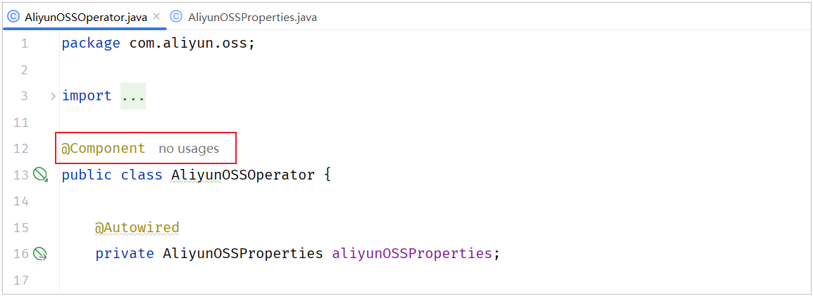

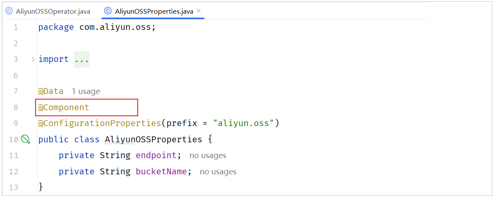

答案：没用了。  在SpringBoot项目中，并不会去扫描com\.aliyun\.oss这个包，不扫描这个包那类上的注解也就失去了作用。

@Component注解不需要使用了，可以从类上删除了。

1.删除 AliyunOSSOperator 工具类上的 @Component 注解 和 @Autowired 注解。

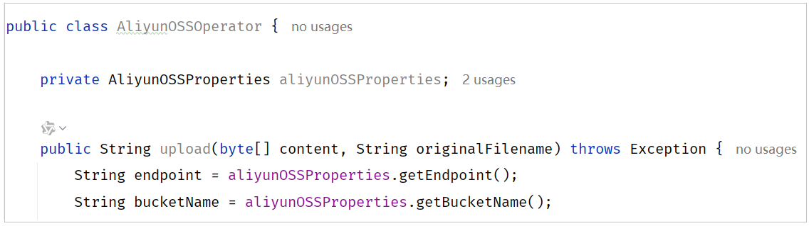

2.删除 AliyunOSSProperties 实体类上的 @Component 注解。

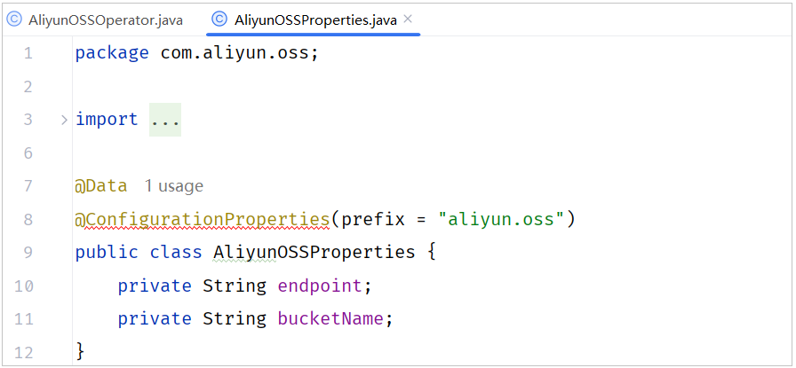

删除后报红色错误，暂时不理会，后面再来处理。

3.既然不能用 `@Component` 注解声明bean，那就需要按照 starter 的定义规范，定义一个自动配置类，在自动配置类中声明bean。

下面我们就要定义一个自动配置类 `AliOSSAutoConfiguration` 了，在自动配置类当中来声明 `AliOSSOperator` 的bean对象。

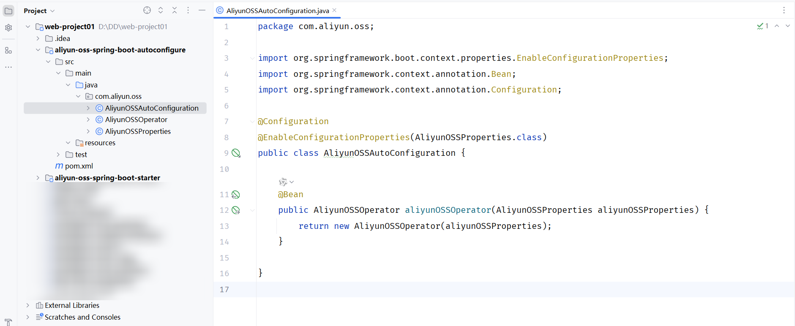

具体代码如下：

```java
package com.aliyun.oss;

import org.springframework.boot.context.properties.EnableConfigurationProperties;
import org.springframework.context.annotation.Bean;
import org.springframework.context.annotation.Configuration;

@Configuration
@EnableConfigurationProperties(AliyunOSSProperties.class)
public class AliyunOSSAutoConfiguration {
    
    @Bean
    public AliyunOSSOperator aliyunOSSOperator(AliyunOSSProperties aliyunOSSProperties) {
        return new AliyunOSSOperator(aliyunOSSProperties);
    }
    
}
```

AliyunOSSOperator 的代码中需要增加一个有参构造，将 AliyunOSSProperties 对象传递给工具类。代码改造如下：

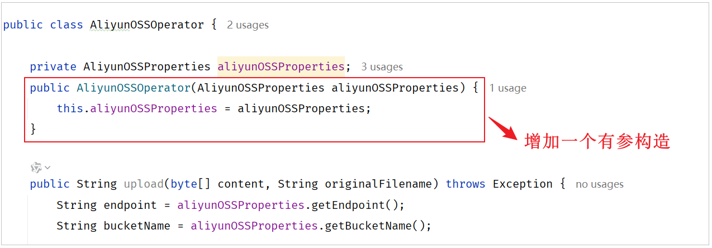

4.在 `aliyun-oss-spring-boot-autoconfigure` 模块中的resources下，新建自动配置文件 `META-INF/spring/org.springframework.boot.autoconfigure.AutoConfiguration.imports`

将自动配置类的全类名，配置在文件中，这样在springboot启动的时候，就会加载到这份文件，并加载到其中的配置类了。

配置内容如下：

```java
com.aliyun.oss.AliyunOSSAutoConfiguration
```

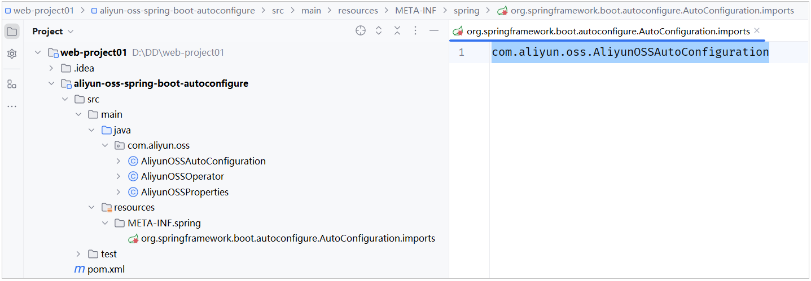

到此呢，这个 `aliyun-oss-spring-boot-stater` 就定义好了，哪里要想使用，就可以直接导入依赖，直接注入使用了。

### 8.4.测试

阿里云OSS的starter我们刚才已经定义好了，接下来我们就来做一个测试。

> 资料当中提供了一个自定义starter的测试工程。我们直接打开文件夹，里面有一个测试工程。测试工程就是 `springboot-autoconfiguration-test`，我们只需要将测试工程直接导入到Idea当中即可。
> 

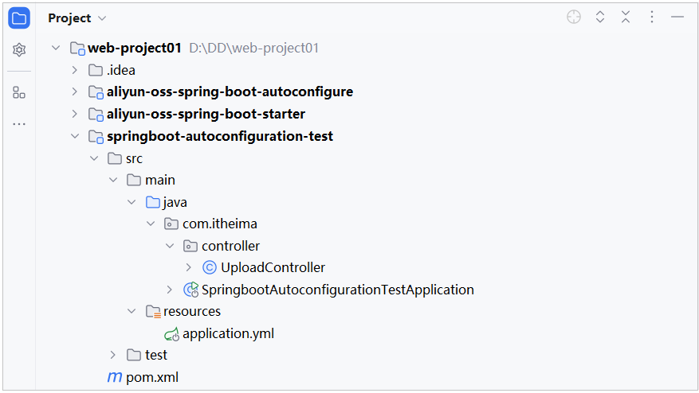

测试前准备：

1.在导入的test工程中引入阿里云starter依赖

```xml
<dependency>
    <groupId>com.aliyun.oss</groupId>
    <artifactId>aliyun-oss-spring-boot-starter</artifactId>
    <version>0.0.1-SNAPSHOT</version>
</dependency>
```

2.在导入的test工程中的 `application.yml` 中配置阿里云OSS的配置信息

```yaml
aliyun:
  oss:
    endpoint: https://oss-cn-beijing.aliyuncs.com
    bucketName: java422-web-ai
```

3.在test工程中的 `UploadController` 类编写代码

```java
package com.itheima.controller;

import com.aliyun.oss.AliyunOSSOperator;
import org.springframework.beans.factory.annotation.Autowired;
import org.springframework.web.bind.annotation.PostMapping;
import org.springframework.web.bind.annotation.RestController;
import org.springframework.web.multipart.MultipartFile;

@RestController
public class UploadController {
    
    @Autowired
    private AliyunOSSOperator aliyunOSSOperator;
    
    @PostMapping("/upload")
    public String upload(MultipartFile image) throws Exception {
        //上传文件到阿里云 OSS
        String url = aliyunOSSOperator.upload(image.getBytes(), image.getOriginalFilename());
        return url;
    }
    
}
```

编写完代码后，我们启动当前的SpringBoot测试工程，使用Apifox工具进行文件上传：

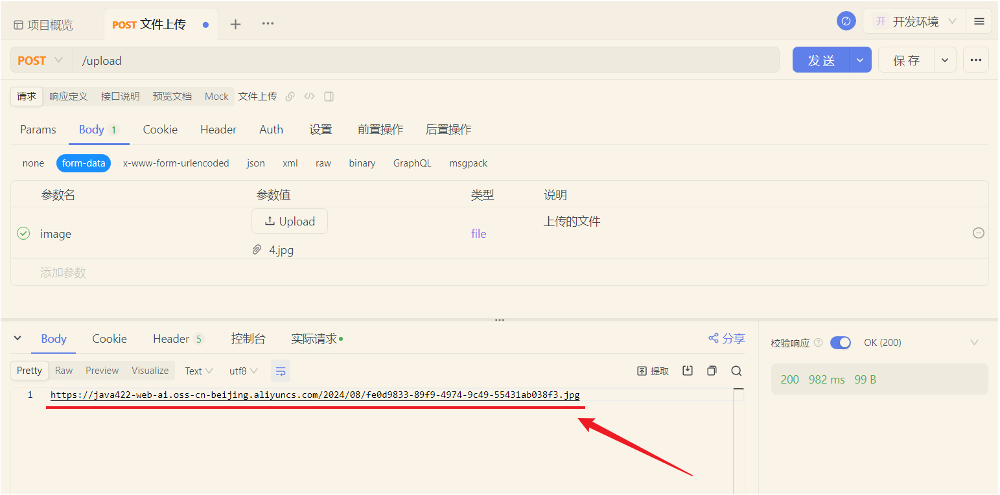

这样，我们就完成了starter的定义。在其他项目中要想使用，引入依赖，配置一下阿里云OSS的信息，就可以直接注入是用了 。


