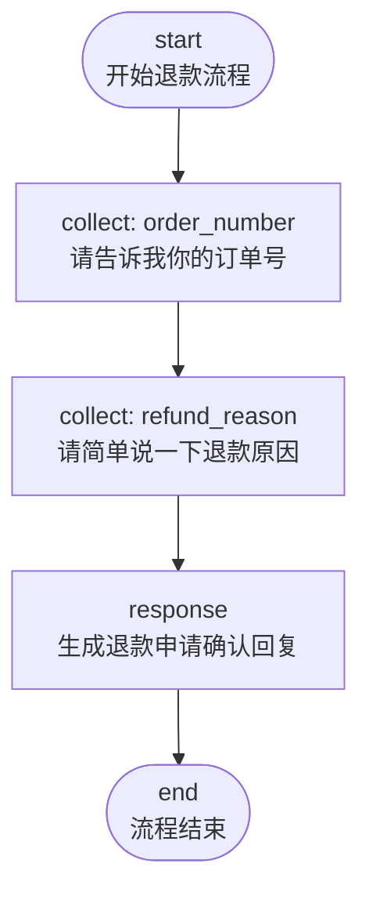
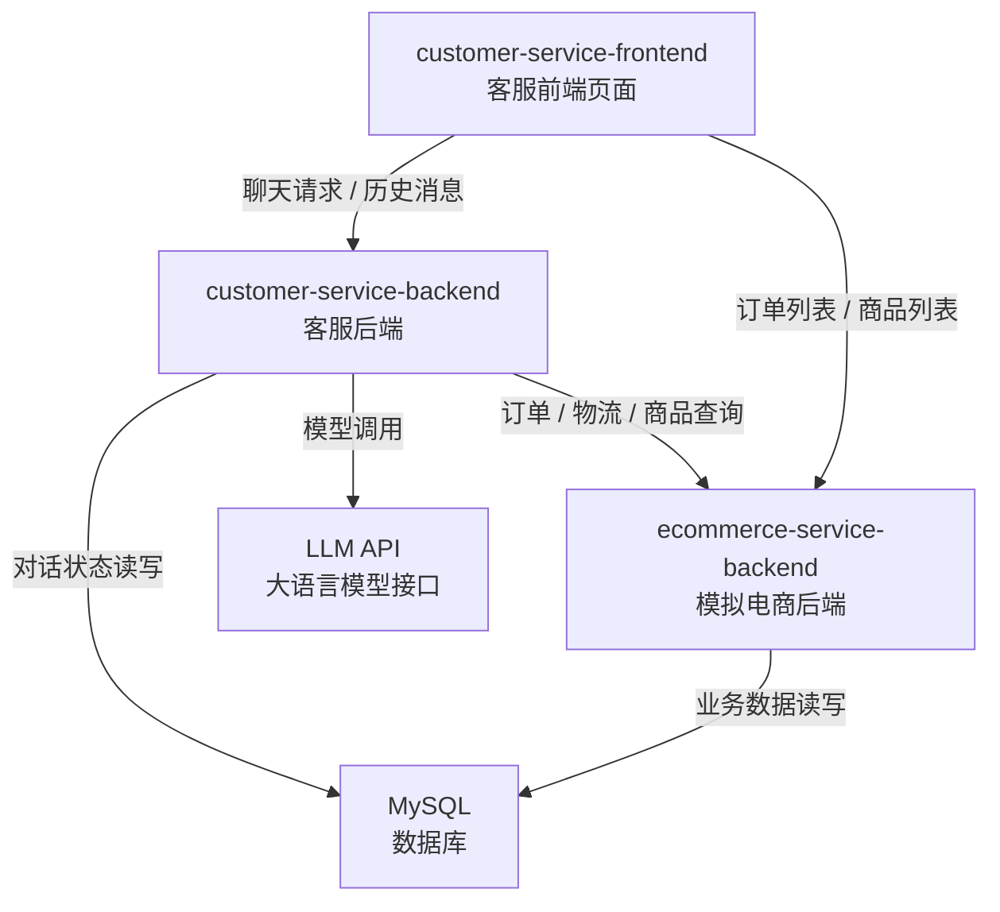
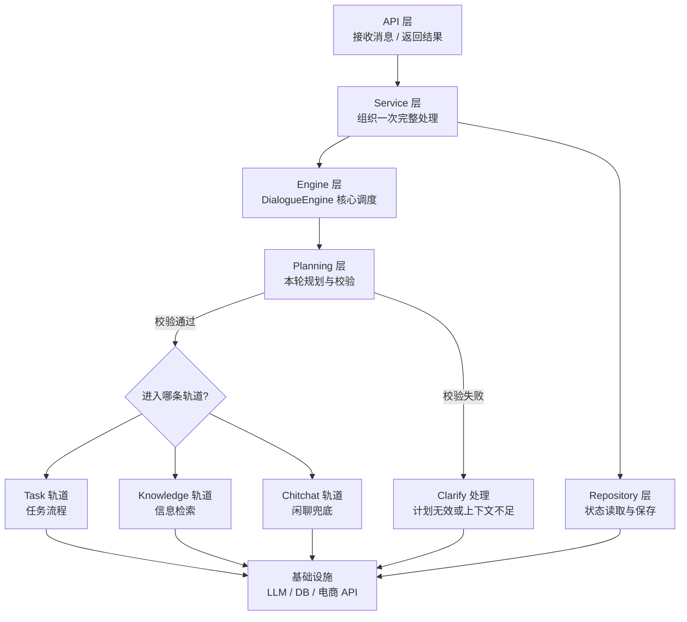
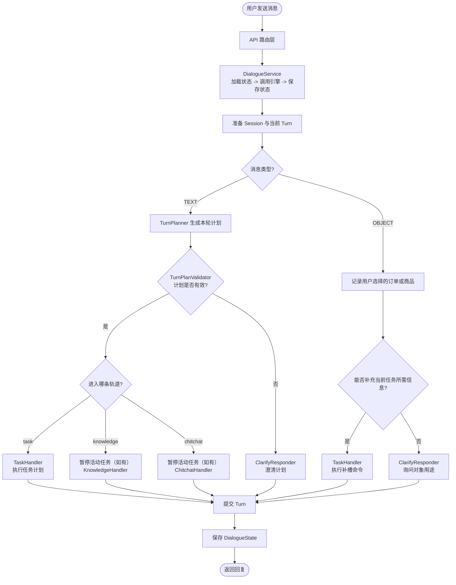

# 第1章 项目概述

## 1.1 为什么要做这套系统

电商客服每天都在处理大量重复又零散的对话：

- "帮我查下订单状态" "我那个快递到哪了"
- "这件衣服什么材质" "支持退货吗"
- "你好" "我要退款" "算了不退了"

如果靠人工坐席，要养一个大团队；如果用传统关键词机器人，遇到稍微复杂的问法就答非所问。  

在大模型逐渐成熟之后，"用 LLM 理解用户意图 + 用代码执行具体动作" 成为了一种新的工程范式。本课程要做的就是这样一套系统：

**让用户用自然语言描述需求，由系统判断这句话该交给谁处理，再用工程化的方式把事情做完。**

## 1.2 传统系统和 AI 系统的差异

在写第一行代码之前，先建立一个认知。本项目的写法和大家熟悉的 CRUD 项目有几个关键的不同。  

| 维度     | 传统 CRUD 系统      | 本项目（AI 驱动）                   |
| -------- | ------------------- | ----------------------------------- |
| 输入     | 结构化参数          | 用户的自然语言                      |
| 路由     | 由 URL / 方法名决定 | 由 LLM 现场推断                     |
| 输出     | 严格 JSON           | 自然语言 + 结构化对象               |
| 响应时间 | 毫秒级              | 秒级（LLM 推理 1~5 秒）             |
| 不确定性 | 几乎没有            | LLM 可能返回幻觉、漂移、违反 schema |
| 状态     | 通常无状态          | 多轮对话强状态                      |

这套差异决定了我们整个项目要围绕一个核心命题来设计：

> **如何用工程化的方式驯服 LLM 的不确定性，保证业务结果稳定可控？**

这门课后续讲到的三个关键设计——**结构化输出 + 校验白名单 + 澄清兜底**、**LLM 路由 + YAML 流程编排引擎**、**会话状态与任务栈管理**——本质上都是在回答这个命题。

## 1.3 功能概览

这是一套面向电商场景的智能客服系统，主要支持三大类能力：

| 能力类型 | 说明 | 典型场景 |
|---------|------|---------|
| 任务流程 | 处理步骤明确的业务任务 | 查询订单、申请退款、查物流 |
| 信息检索 | 处理查询型问题 | 询问商品信息、退款政策 |
| 闲聊 | 处理轻量自然对话 | 打招呼、简单寒暄 |

### 1.3.1 任务流程

任务流程，指的是那些步骤比较稳定、处理顺序比较明确、适合按步骤推进的客服任务。这类任务通常不是用户一句话就能直接完成，而是需要系统逐步收集信息、执行动作，并返回处理结果。

在当前项目中，比较典型的固定任务流程包括：

| 流程名称 | 触发场景 | 当前实现方式 |
|---------|---------|-------------|
| 订单状态查询 | “帮我查下订单状态” | 收集订单号 → 查询订单接口 → 回复结果 |
| 物流查询 | “我的快递到哪了” | 收集订单号 → 查询物流接口 → 回复结果 |
| 退款申请 | “我要退款” | 收集订单号 → 收集退款原因 → 返回提交确认文案 |

本项目支持通过 YAML 文件自定义业务流程。下面以“退款申请”流程为例进行说明：

```yaml
refund_request:
  name: 退款申请
  description: 帮用户提交简单的退款申请，收集订单号和退款原因。
  steps:
    - id: start
      type: start
      next: ask_order_number

    - id: ask_order_number
      type: collect
      slot_name: order_number
      template:
        text: "请告诉我你的订单号。"
      next: ask_refund_reason

    - id: ask_refund_reason
      type: collect
      slot_name: refund_reason
      template:
        text: "请简单说一下退款原因。"
      next: refund_submitted

    - id: refund_submitted
      type: response
      template:
        text: "好的，订单{{ slots.order_number }}的退款申请已提交，原因是：{{ slots.refund_reason }}。后续会尽快为你处理。"
      next: end

    - id: end
      type: end
      next: []
```

从这个配置可以看出，一个业务流程是由多个步骤组成的。在当前示例中，主要涉及以下几种步骤类型：

- `start`：流程起点
- `collect`：收集某个槽位信息，例如订单号、退款原因
- `action`：调用业务能力并更新流程数据
- `response`：响应步骤，根据当前上下文生成用户回复
- `end`：流程结束

其对应的流程图如下：



交互示例如下：

```text
用户：我想申请退款
客服：好的，我们先处理退款申请。
客服：请告诉我你的订单号。
用户：A20240315001
客服：请简单说一下退款原因。
用户：尺码不合适
客服：好的，订单 A20240315001 的退款申请已提交，原因是：尺码不合适。后续会尽快为你处理。
```

### 1.3.2 信息检索

除了任务流程之外，电商客服中还有大量问题并不要求系统“执行一个流程”，而是希望系统先查到相关信息，再用自然语言组织成回答返回给用户。这类问题就属于信息检索场景。

在当前项目中，信息检索相关的问题主要涵盖以下几个方面：

| 知识意图 | 示例问题 |
|---------|---------|
| 商品信息咨询 | “这件商品是什么材质？” |
| 订单信息咨询 | “这个订单现在是什么情况？” |
| 退款政策咨询 | “退款政策是怎样的？” |
| 退货政策咨询 | “支持退货吗？” |
| 配送政策咨询 | “多久发货？包邮吗？” |
| 平台规则咨询 | “平台有哪些限制规则？” |
| 通用电商问题 | “优惠券怎么用？” |

不同类型的问题，其检索方式并不完全相同。

- 商品信息、订单信息这类问题，通常需要调用业务 API 获取实时数据
- 退款政策、退货政策、配送政策这类问题，可以同时从 FAQ（Frequently Asked Questions，常见问题）和知识库中检索
- 平台规则主要通过知识库检索，通用电商问题可以结合 FAQ 和知识库进行回答

也就是说，信息检索链路的核心思路不是“直接让模型自由回答”，而是先找到可信的信息来源，再让模型基于这些信息生成更自然的回复。

交互示例如下：

```text
用户：这件商品大概是什么情况？
客服：这件商品的名称是“轻薄连帽防晒衣”，当前价格为 129 元，库存状态为有货。
      如果你想进一步了解规格参数或售后信息，也可以继续问我。

用户：适合什么季节穿？
客服：从商品名称和描述来看，这是一件偏轻薄款的防晒衣，更适合春夏季节或日常通勤、户外防晒场景使用。

用户：那现在有货吗？
客服：当前库存状态为有货。如果你需要，我也可以继续帮你看看这件商品的更多信息。
```

### 1.3.3 闲聊

当用户输入的内容不属于明确任务，也不适合走知识检索时，系统会进入闲聊轨道。

闲聊能力的作用主要是：

- 让系统对话体验更自然
- 在轻量输入场景下给出合理回应
- 在系统暂时无法进入明确业务流程时提供兜底体验

**交互示例**

```text
用户：你好
客服：你好，这里是 Atguigu 电商助手。我可以帮你查订单状态、查物流、了解商品信息，或者提交退款申请。

用户：你还挺聪明
客服：谢谢夸奖。如果你有订单、物流或者商品相关的问题，我都可以继续帮你看一下。
```


# 第2章 项目开发环境

## 2.1 整体环境说明

项目所需环境如下：

- `数据库环境`：MySQL 环境

- `ecommerce-service-backend/`：模拟电商业务后端
- `customer-service-frontend/`：客服前端页面

## 2.2 各组件关系图

下面这张图展示了各组件之间的协作关系：



## 2.3 环境启动说明

建议按下面顺序启动环境：

### 第一步：启动数据库

```bash
# 1 使用docker安装mysql容器

# 2 或者使用本地MySQL服务
```

### 第二步：启动模拟电商后端

```bash
cd ecommerce-service-backend
uv sync
uv run python main.py
```

### 第三步：启动客服前端

```bash
cd customer-service-frontend
npm install
npm run dev
```

启动后访问 [http://127.0.0.1:5173](http://127.0.0.1:5173) 即可看到页面。


# 第3章 项目架构

## 3.1 总体设计思路

核心设计思路如下图所示：



## 3.2 一条消息的完整处理流程

下面这张图展示了一条用户消息从进入系统到生成回复的大致流程：


