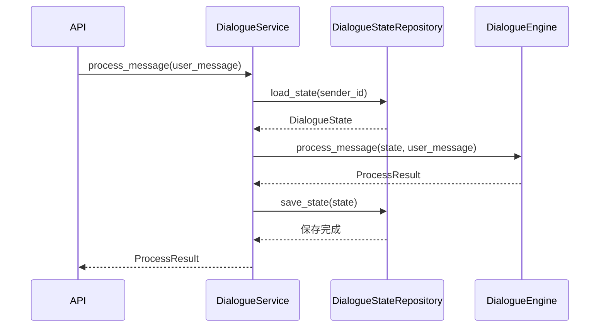

# 第1章 实现 DialogueService

## 1.1 DialogueService 的职责

`DialogueService` 负责组织一条用户消息的完整处理过程，是接口层与对话引擎之间的入口。

它主要完成以下工作：

1. 根据用户 ID 加载对话状态。
2. 将用户消息和对话状态交给 `DialogueEngine` 处理。
3. 保存处理后的对话状态。
4. 返回本轮处理结果。

`DialogueService` 不负责处理具体的对话逻辑，也不负责访问数据库。具体的对话逻辑由 `DialogueEngine` 完成，对话状态的读取和保存由 `DialogueStateRepository` 完成。

## 1.2 处理流程

一条用户消息的处理流程如下：



在这个过程中，`DialogueEngine` 直接修改传入的 `DialogueState`，并返回本轮产生的处理结果。`DialogueService` 随后保存修改后的状态。

## 1.3 实现 DialogueService

在 `atguigu.service` 包下创建 `dialogue_service.py` 文件。

`DialogueService` 依赖 `DialogueStateRepository` 和 `DialogueEngine`，通过构造方法接收这两个对象，并通过 `process_message()` 组织一条用户消息的处理过程，具体代码如下：

```python
from atguigu.domain.messages import ProcessResult, UserMessage
from atguigu.engine.dialogue_engine import DialogueEngine
from atguigu.repository.dialogue_state_repository import (
    DialogueStateRepository,
)


class DialogueService:

    def __init__(
        self,
        dialogue_state_repository: DialogueStateRepository,
        dialogue_engine: DialogueEngine,
    ) -> None:
        self.dialogue_state_repository = dialogue_state_repository
        self.dialogue_engine = dialogue_engine

    async def process_message(
        self,
        user_message: UserMessage,
    ) -> ProcessResult:
        state = await self.dialogue_state_repository.load_state(
            user_message.sender_id
        )

        process_result = await self.dialogue_engine.process_message(
            state,
            user_message,
        )

        await self.dialogue_state_repository.save_state(state)
        return process_result
```

下面分别介绍 `DialogueService` 的属性和方法。

### 1.3.1 属性

`DialogueService` 包含以下两个属性：

| 属性 | 类型 | 作用 |
|------|------|------|
| `dialogue_state_repository` | `DialogueStateRepository` | 读取和保存对话状态。 |
| `dialogue_engine` | `DialogueEngine` | 处理用户消息并更新对话状态。 |

这两个属性都由构造方法接收。`DialogueService` 只依赖它们对外提供的方法，不负责创建这些对象。

### 1.3.2 process_message() 方法

`process_message()` 按照固定顺序完成四个步骤：

1. 使用 `sender_id` 加载当前用户的 `DialogueState`。
2. 调用 `DialogueEngine` 处理用户消息。
3. 保存已经更新的 `DialogueState`。
4. 返回 `ProcessResult`。

`DialogueService` 只负责组织调用过程，不需要知道对话状态中保存了哪些内容，也不需要知道 `DialogueEngine` 如何生成回复。

在这段代码中出现了两类对象：

| 类型 | 对象 |
|------|------|
| 领域模型 | `UserMessage`、`ProcessResult`、`DialogueState` |
| 协作对象 | `DialogueEngine`、`DialogueStateRepository` |

接下来沿着 `DialogueService` 使用的对象，逐层定义这些领域模型和协作对象。

# 第2章 定义领域模型

## 2.1 消息

`DialogueService.process_message()` 接收 `UserMessage`，返回 `ProcessResult`。

在 `atguigu.domain` 包下创建 `messages.py` 文件，具体代码如下：

### 2.1.1 UserMessage

`UserMessage` 表示 `DialogueService` 接收的一条用户消息。首先定义 `UserMessage`：

```python
@dataclass
class UserMessage:
    sender_id: str
    message_id: str
    type: "MessageType"
    text: str | None = None
    object: "MessageObject | None" = None
```

它包含以下属性：

| 属性 | 类型 | 说明 |
|------|------|------|
| `sender_id` | `str` | 用户唯一标识。 |
| `message_id` | `str` | 消息唯一标识。 |
| `type` | `MessageType` | 消息类型。 |
| `text` | `str \| None` | 文本消息内容。 |
| `object` | `MessageObject \| None` | 对象消息内容。 |

当 `type` 为 `MessageType.TEXT` 时，消息内容保存在 `text` 中；当 `type` 为 `MessageType.OBJECT` 时，消息内容保存在 `object` 中。

其中，`type` 使用 `MessageType`，`object` 使用 `MessageObject`。下面沿着这两个属性继续向下定义。

#### 2.1.1.1 MessageType

系统支持文本消息和对象消息，使用 `MessageType` 表示消息类型：

```python
class MessageType(Enum):
    TEXT = "text"
    OBJECT = "object"
```

#### 2.1.1.2 MessageObject

用户可以从页面中选择订单或商品，这类结构化消息使用 `MessageObject` 表示：

```python
@dataclass
class MessageObject:
    type: str
    id: str
    title: str | None = None
    attributes: dict[str, Any] = field(default_factory=dict)
```

各属性含义如下：

| 属性 | 类型 | 说明 |
|------|------|------|
| `type` | `str` | 对象类型，例如 `order`、`product`。 |
| `id` | `str` | 对象的唯一标识。 |
| `title` | `str | None` | 对象标题。 |
| `attributes` | `dict[str, Any]` | 对象携带的扩展属性。 |

### 2.1.2 ProcessResult

`ProcessResult` 表示 `DialogueService` 返回的一次处理结果。首先定义 `ProcessResult`：

```python
@dataclass
class ProcessResult:
    sender_id: str
    message_id: str
    messages: list["BotMessage"]
```

它包含以下属性：

| 属性 | 类型 | 说明 |
|------|------|------|
| `sender_id` | `str` | 当前用户 ID。 |
| `message_id` | `str` | 当前用户消息 ID。 |
| `messages` | `list[BotMessage]` | 本轮产生的客服消息。 |

其中，`messages` 中的每个元素都是一条 `BotMessage`，下面沿着这个属性继续向下定义。

#### 2.1.2.1 BotMessage

`BotMessage` 表示一条客服消息：

```python
@dataclass
class BotMessage:
    text: str | None = None
    object: MessageObject | None = None
```

客服既可以回复文本，也可以返回订单或商品等对象。一次处理可能产生多条客服消息。

## 2.2 对话状态

`DialogueService` 只负责在 `DialogueStateRepository` 和 `DialogueEngine` 之间传递对话状态，不会直接读取或修改状态属性。因此，本章暂时不展开 `DialogueState` 的内部结构。

在 `atguigu.domain` 包下创建 `state.py` 文件，并定义 `DialogueState`：

```python
class DialogueState:
    pass
```

后续再定义 `DialogueState` 的具体属性。

# 第3章 定义协作对象

## 3.1 DialogueEngine

`DialogueService.process_message()` 调用了 `DialogueEngine.process_message()`。该方法接收当前对话状态和用户消息，直接修改传入的 `DialogueState`，并返回本轮处理结果。

本章只定义 `DialogueService` 所需的方法签名，不展开具体的对话处理过程。

在 `atguigu.engine` 包下创建 `dialogue_engine.py` 文件，并编写如下代码：

```python
from atguigu.domain.messages import ProcessResult, UserMessage
from atguigu.domain.state import DialogueState


class DialogueEngine:

    async def process_message(
        self,
        state: DialogueState,
        user_message: UserMessage,
    ) -> ProcessResult:
        ...
```

## 3.2 DialogueStateRepository

`DialogueService` 调用了 `DialogueStateRepository` 的两个方法：

| 方法 | 作用 |
|------|------|
| `load_state()` | 根据用户 ID 加载对话状态。 |
| `save_state()` | 保存处理后的对话状态。 |

本章只定义这两个方法的签名，不涉及数据库和状态序列化。

在 `atguigu.repository` 包下创建 `dialogue_state_repository.py` 文件，并编写如下代码：

```python
from atguigu.domain.state import DialogueState


class DialogueStateRepository:

    async def load_state(
        self,
        sender_id: str,
    ) -> DialogueState:
        ...

    async def save_state(
        self,
        state: DialogueState,
    ) -> None:
        ...
```

至此，`DialogueService` 及其直接依赖已经定义完成。`DialogueState`、`DialogueEngine` 和 `DialogueStateRepository` 的内部实现将在后续逐步补充。
