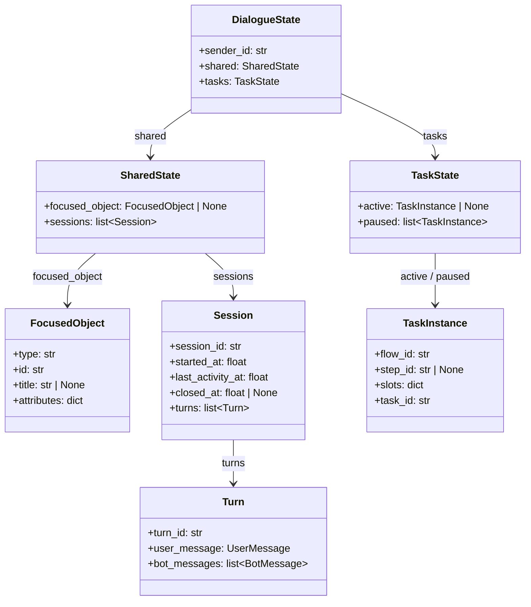

# 第1章 DialogueState 设计

## 1.1 DialogueState 的作用

`DialogueState` 保存某个用户的完整对话状态。

每次处理用户消息时，`DialogueService` 先根据 `sender_id` 加载 `DialogueState`，再将它交给 `DialogueEngine`。消息处理完成后，同一个 `DialogueState` 会被重新保存。

## 1.2 整体结构

`DialogueState` 需要同时保存以下两类状态：

- 三种对话类型共同使用的全局状态。
- 任务型对话独立使用的任务状态。

具体结构如下图所示：



## 1.3 定义 DialogueState

03 文档已经在 `app.domain.state` 模块中定义了一个空的 `DialogueState`。现在使用以下定义替换它：

```python
from dataclasses import dataclass, field
from typing import Any

from app.domain.messages import BotMessage, UserMessage
from app.domain.task import TaskState


@dataclass
class DialogueState:
    sender_id: str
    shared: SharedState = field(
        default_factory=lambda: SharedState()
    )
    tasks: TaskState = field(
        default_factory=lambda: TaskState()
    )
```

`DialogueState` 包含以下属性：

| 属性 | 类型 | 说明 |
|------|------|------|
| `sender_id` | `str` | 当前状态所属的用户 ID。 |
| `shared` | `SharedState` | 三种对话类型共同使用的全局状态。 |
| `tasks` | `TaskState` | 任务型对话使用的任务状态。 |

# 第2章 全局状态

## 2.1 SharedState

`shared` 保存任务型对话、知识检索型对话和闲聊型对话共同使用的状态。

继续在 `app.domain.state` 模块中定义 `SharedState`：

```python
@dataclass
class SharedState:
    focused_object: FocusedObject | None = None
    sessions: list[Session] = field(default_factory=list)
```

`SharedState` 包含以下属性：

| 属性 | 类型 | 说明 |
|------|------|------|
| `focused_object` | `FocusedObject | None` | 当前聚焦的订单、商品等对象。 |
| `sessions` | `list[Session]` | 当前用户的全部历史会话。 |

下面分别展开聚焦对象和会话历史。

## 2.2 聚焦对象

### 2.2.1 FocusedObject

`focused_object` 表示用户当前关注的业务对象。例如，用户从页面中选择了一张订单卡片，后续问题通常都与该订单有关。

继续在 `app.domain.state` 模块中定义 `FocusedObject`：

```python
@dataclass
class FocusedObject:
    type: str
    id: str
    title: str | None = None
    attributes: dict[str, Any] = field(default_factory=dict)
```

`FocusedObject` 包含以下属性：

| 属性 | 类型 | 说明 |
|------|------|------|
| `type` | `str` | 对象类型，例如 `order`、`product`。 |
| `id` | `str` | 对象的唯一标识。 |
| `title` | `str | None` | 对象标题。 |
| `attributes` | `dict[str, Any]` | 对象携带的扩展属性。 |

`MessageObject` 表示一条消息携带的对象，`FocusedObject` 表示保存在对话状态中的当前聚焦对象。二者属性相近，但承担的职责不同。

## 2.3 会话历史

`sessions` 保存用户的全部历史会话，具体定义如下：

### 2.3.1 Session

`Session` 表示一段连续的对话。继续在 `app.domain.state` 模块中定义 `Session`：

```python
@dataclass
class Session:
    session_id: str
    started_at: float
    last_activity_at: float
    closed_at: float | None = None
    turns: list[Turn] = field(default_factory=list)
```

`Session` 包含以下属性：

| 属性 | 类型 | 说明 |
|------|------|------|
| `session_id` | `str` | 会话的唯一标识。 |
| `started_at` | `float` | 会话开始时间。 |
| `last_activity_at` | `float` | 最近一次活动时间。 |
| `closed_at` | `float \| None` | 会话结束时间，`None` 表示尚未结束。 |
| `turns` | `list[Turn]` | 当前会话包含的全部对话轮次。 |

`started_at`、`last_activity_at` 和 `closed_at` 使用 Unix 时间戳。

### 2.3.2 Turn

`Session.turns` 中的每个元素都是一个 `Turn`。一个 `Turn` 对应一次用户输入以及由这次输入产生的全部客服回复。

继续在 `app.domain.state` 模块中定义 `Turn`：

```python
@dataclass
class Turn:
    turn_id: str
    user_message: UserMessage
    bot_messages: list[BotMessage] = field(default_factory=list)
```

`Turn` 包含以下属性：

| 属性 | 类型 | 说明 |
|------|------|------|
| `turn_id` | `str` | 对话轮次的唯一标识。 |
| `user_message` | `UserMessage` | 当前轮次的用户消息。 |
| `bot_messages` | `list[BotMessage]` | 当前轮次产生的全部客服消息。 |

`bot_messages` 使用列表，是因为一次用户输入可能连续产生多条客服消息。

# 第3章 任务状态

## 3.1 TaskState

`tasks` 保存任务型对话独立使用的状态。它只关心当前正在执行的任务，以及已经暂停、后续可以恢复的任务。

在 `app.domain` 包下创建 `task.py` 文件，并添加以下导入：

```python
import uuid
from dataclasses import dataclass, field
from typing import Any
```

首先定义 `TaskState`：

```python
@dataclass
class TaskState:
    active: TaskInstance | None = None
    paused: list[TaskInstance] = field(default_factory=list)
```

`TaskState` 包含以下属性：

| 属性 | 类型 | 说明 |
|------|------|------|
| `active` | `TaskInstance | None` | 当前正在执行的任务。 |
| `paused` | `list[TaskInstance]` | 已经暂停、后续可以恢复的任务。 |

同一时刻最多只有一个活动任务。当用户切换到其他任务时，原任务可以进入 `paused`，其执行进度和已经收集的数据仍保存在对应的 `TaskInstance` 中。

## 3.2 TaskInstance

`active` 和 `paused` 中保存的都是 `TaskInstance`。一个 `TaskInstance` 表示某条任务流程的一次具体执行。

继续在 `app.domain.task` 模块中定义 `TaskInstance`：

```python
@dataclass
class TaskInstance:
    flow_id: str
    step_id: str | None = None
    slots: dict[str, Any] = field(default_factory=dict)
    task_id: str = field(
        default_factory=lambda: str(uuid.uuid4())
    )
```

`TaskInstance` 包含以下属性：

| 属性 | 类型 | 说明 |
|------|------|------|
| `flow_id` | `str` | 当前任务使用的 Flow ID。 |
| `step_id` | `str | None` | 当前执行到的 Step ID。 |
| `slots` | `dict[str, Any]` | 当前任务已经收集的数据。 |
| `task_id` | `str` | 当前任务实例的唯一标识。 |

`flow_id` 标识任务执行的是哪一条 Flow，`step_id` 标识已经执行到哪个 Step。`slots` 归属于具体的任务实例，因此多个任务之间的数据相互隔离。

`task_id` 标识某一次具体的任务执行。即使两个任务使用相同的 `flow_id`，它们也拥有不同的 `task_id`，从而可以被准确地区分。

至此，`DialogueState` 及其全部属性已经定义完成。本章只确定状态的数据结构，不涉及这些状态如何创建、修改、切换、恢复或持久化。
