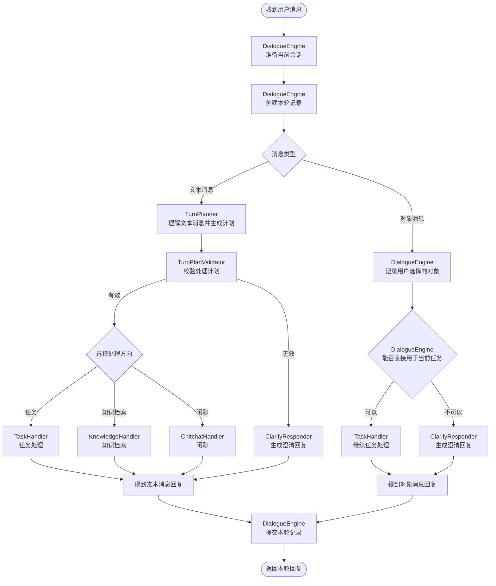
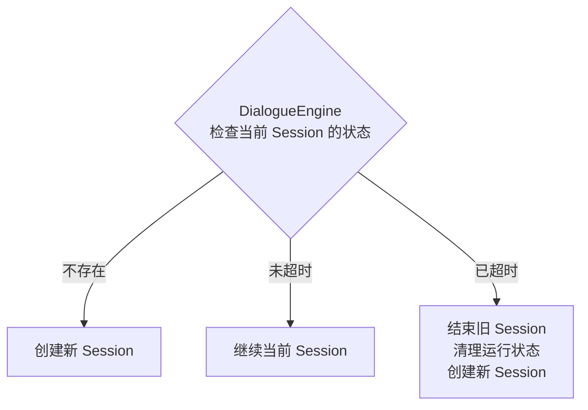
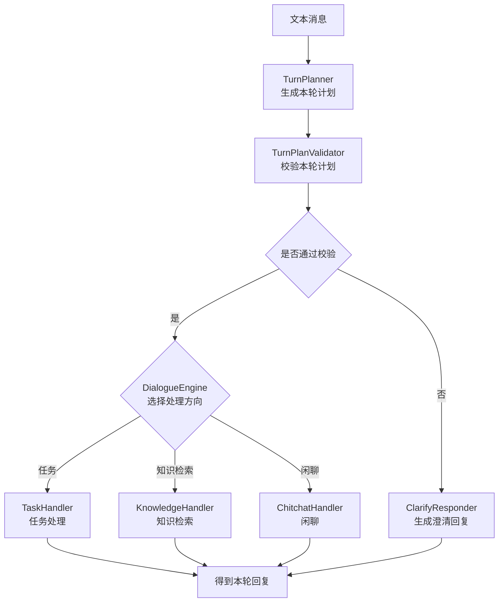
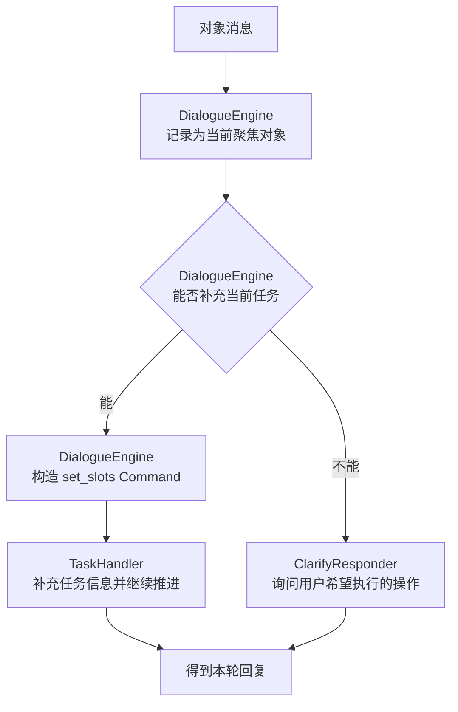
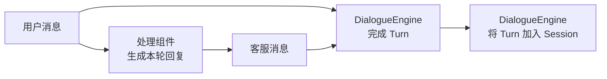

# 第1章 DialogueEngine 的定位

`DialogueEngine` 是一条用户消息进入客服系统后的对话调度中心。

`DialogueService` 负责加载和保存 `DialogueState`，`DialogueEngine` 则负责根据当前状态和用户消息，决定本轮应该进入哪一种处理方式，并组织得到最终回复。

`DialogueEngine` 的具体职责如下：

1. 准备当前会话和本轮对话记录。
2. 区分文本消息和对象消息。
3. 理解文本消息，形成当前轮次的处理计划。
4. 检查处理计划是否明确、完整并且可以执行。
5. 将消息交给任务、知识检索、闲聊或澄清模块。
6. 汇总本轮产生的客服回复。
7. 将完整轮次写入会话历史。

# 第2章 一条消息的处理过程

## 2.1 整体流程

一条用户消息的完整处理过程如下：



# 第3章 会话准备

收到消息后，`DialogueEngine` 首先需要确定当前消息应该归入哪个 Session。



如果活动会话仍在有效时间内，本轮继续使用该会话。如果会话已经超时，则结束原会话，清理只对当前会话有效的运行状态，再创建新会话。

历史 Session 不会被删除，它们仍然保存在 `DialogueState` 中。

# 第4章 文本消息的处理

## 4.1 整体流程

文本消息依次经过计划生成、计划校验和分流处理三个阶段：



计划校验通过后，本轮进入任务、知识检索或闲聊中的一个方向；计划校验不通过时，本轮进入澄清处理。

## 4.2 生成本轮计划

`TurnPlanner` 负责理解文本消息，并生成本轮处理计划。

### 4.2.1 理解依据

`TurnPlanner` 不会只根据当前一句话作出判断，还需要结合对话上下文和系统能力。

主要参考以下信息：

| 信息 | 作用 |
|------|------|
| 最近的对话历史 | 理解省略、指代和对上一轮的延续。 |
| 当前活动任务 | 判断用户是否在继续办理当前业务。 |
| 已暂停任务 | 判断用户是否想恢复之前的业务。 |
| 当前聚焦对象 | 确定“这个订单”“这个商品”等表达指向什么。 |
| 系统支持的任务 | 限定可以办理的业务范围。 |
| 系统支持的知识意图 | 限定可以检索和回答的问题范围。 |

### 4.2.2 计划内容

本轮计划可以理解为一张“处理决策单”，它需要明确本轮的处理方向，以及该方向需要使用的信息。具体结构如下：

```json
{
  "task": {
    "commands": [
      {
        "command": "start_flow",
        "flow": "order_status_query"
      },
      {
        "command": "set_slots",
        "slots": {
          "order_number": "10001"
        }
      }
    ]
  },
  "knowledge": {
    "intents": ["refund_policy"]
  },
  "chitchat": null
}
```

一轮计划只能选择一个主要方向。被选中的方向保存本轮需要的信息，另外两个方向保持为空，避免同一轮同时推进多个互相独立的处理过程。

## 4.3 校验本轮计划

处理计划生成后，`TurnPlanValidator` 检查它是否与当前上下文和系统能力一致。

### 4.3.1 校验内容

主要检查以下问题：

- 是否明确选择了一个处理方向。
- 是否同时选择了互相冲突的方向。
- 任务操作是否与当前任务状态一致。
- 知识意图是否在系统支持的范围内。
- 依赖订单或商品的问题是否已经具备对应对象。
- 当前信息是否足以继续处理。

检查通过后，本轮计划可以继续执行；检查不通过时，本轮进入澄清处理。

### 4.3.2 澄清处理

`ClarifyResponder` 用于处理计划不明确、上下文不足或计划无法执行的情况。

| 场景 | 示例 |
|------|------|
| 处理方向不明确 | “这个怎么办？” |
| 缺少业务对象 | “它现在多少钱？”，但没有商品上下文。 |
| 多个方向冲突 | 一句话同时要求办理任务和查询无关知识。 |
| 任务操作无法执行 | 用户要求恢复一个不存在的暂停任务。 |
| 知识方向未知 | 本轮问题不属于系统支持的知识范围。 |

澄清的目标是补齐下一轮处理所需的信息。本轮生成澄清回复后，不再执行其他处理方向。

## 4.4 执行本轮计划

计划校验通过后，`DialogueEngine` 根据计划中被选中的方向，将对应内容交给相应的处理组件：

| 计划内容 | 处理组件 | 处理依据 |
|----------|----------|----------|
| `task.commands` | `TaskHandler` | 本轮需要执行的任务操作。 |
| `knowledge.intents` | `KnowledgeHandler` | 本轮需要检索的知识意图。 |
| `chitchat` | `ChitchatHandler` | 本轮被判定为闲聊，不需要额外的操作或意图。 |

### 4.4.1 任务处理

`TaskHandler` 负责处理需要按步骤推进的业务，例如订单状态查询、物流查询和退款申请。

`TaskHandler` 按照 `task.commands` 中的顺序执行 Command。这些 Command 可以启动新任务、补充任务信息、恢复任务或取消任务。Command 执行完成后，`TaskHandler` 再从活动任务的当前 Step 开始推进 Flow，最终返回本轮产生的任务消息。

### 4.4.2 知识检索

`KnowledgeHandler` 负责回答商品信息、订单信息、平台政策和常见问题。

`KnowledgeHandler` 读取 `knowledge.intents` 中的知识意图，根据每个意图选择合适的信息来源。取得相关信息后，它结合当前用户消息和最近对话历史组织回复。

如果当前存在活动任务，`DialogueEngine` 会先将它暂停，再调用 `KnowledgeHandler`，使用户之后仍然可以恢复原任务。

### 4.4.3 闲聊

`ChitchatHandler` 负责问候、寒暄和其他不需要办理业务或检索知识的轻量对话。

当计划中的 `chitchat` 被选中时，`ChitchatHandler` 结合当前用户消息和最近对话历史生成自然语言回复。

如果当前存在活动任务，`DialogueEngine` 同样会先将它暂停，再调用 `ChitchatHandler`。

# 第5章 对象消息的处理

收到对象消息后，首先记录用户当前关注的对象，再判断该对象能否补充当前任务，并根据判断结果继续任务或澄清用户意图：



## 5.1 记录聚焦对象

收到对象消息后，`DialogueEngine` 首先将用户选择的订单、商品等对象记录为当前聚焦对象。

聚焦对象属于共享上下文。无论它能否在本轮直接推进任务，后续的任务处理、知识检索和文本消息理解都可以继续使用它。例如，用户选择商品后再说“这个还有货吗”，系统可以根据聚焦对象理解“这个”指向哪件商品。

新的对象消息会替换原有的聚焦对象，使共享上下文始终反映用户当前关注的对象。

## 5.2 匹配当前任务

记录聚焦对象后，`DialogueEngine` 判断该对象能否补充当前任务所需的信息。需要同时满足以下条件：

- 当前存在活动任务。
- 活动任务正在等待用户补充对象信息。
- 用户选择的对象类型与任务所需的信息相匹配。

常见的匹配关系如下：

| 任务正在等待的信息 | 用户选择的对象 | 是否匹配 |
|--------------------|----------------|----------|
| 订单编号 | 订单 | 是 |
| 商品编号 | 商品 | 是 |
| 订单编号 | 商品 | 否 |

对象匹配时，`DialogueEngine` 从对象中取得相应标识，构造 `set_slots` Command，再交给 `TaskHandler` 补充当前任务并继续推进 Flow。

## 5.3 澄清操作意图

当对象无法补充当前任务时，`DialogueEngine` 保留已经记录的聚焦对象，再由 `ClarifyResponder` 询问用户希望对该对象执行什么操作。

对象消息只明确了用户当前关注的对象，不一定包含具体意图。因此，本轮不直接推测用户想办理的业务，而是通过澄清取得明确意图。用户下一轮给出“查一下物流”“申请退款”等文本消息后，再按照文本消息的处理过程生成并执行本轮计划。

# 第6章 完成本轮处理

## 6.1 汇总客服回复

无论本轮进入 `TaskHandler`、`KnowledgeHandler`、`ChitchatHandler` 还是 `ClarifyResponder`，这些组件都只返回本轮产生的客服消息。

`DialogueEngine` 将这些消息加入本轮 Turn，使一条用户消息与它产生的全部回复保持在同一个对话单元中。

## 6.2 提交 Turn

当本轮处理完成后，Turn 被加入当前 Session 的历史记录。



这样可以保证：

- 用户输入和客服回复始终成组保存。
- 一轮产生多条回复时不会丢失顺序。
- 后续 Planning 可以读取完整的对话历史。

## 6.3 返回处理结果

Turn 提交完成后，引擎返回本轮处理结果，其中包含用户 ID、消息 ID 和客服消息列表。

对话状态的数据库保存仍由 `DialogueService` 和 `DialogueStateRepository` 负责，不属于 `DialogueEngine` 的职责。
