# 第1章 TaskHandler 设计

## 1.1 定位与职责

`TaskHandler` 是任务处理的统一入口。它接收 Planning 模块已经确定的任务操作，根据这些操作修改任务状态，再从活动任务的当前 Step 开始推进 Flow。

`TaskHandler` 的输入包括：

| 输入 | 作用 |
|------|------|
| `commands` | Planning 模块为本轮生成的任务操作。 |
| `state` | 当前用户的 `DialogueState`，其中保存活动任务、暂停任务和共享上下文。 |
| `user_message` | 当前用户消息，在生成 Flow 回复时使用。 |

`TaskHandler` 返回 `list[BotMessage]`，其中包含本轮产生的任务状态提示和 Flow 消息。

`TaskHandler` 不负责理解用户的自然语言，也不负责加载和保存 `DialogueState`。它只处理已经确定的任务操作，并组织任务方向在本轮产生的回复。

## 1.2 处理流程

从 `TaskHandler` 的角度看，一轮任务处理分为四个阶段：

1. 执行 Commands，修改任务状态。
2. 根据任务状态变化生成提示消息。
3. 从活动任务的当前 Step 开始推进 Flow。
4. 合并前两个阶段产生的消息。

前三个阶段分别由 `CommandProcessor`、`TaskLifecycleResponder` 和 `FlowExecutor` 完成：

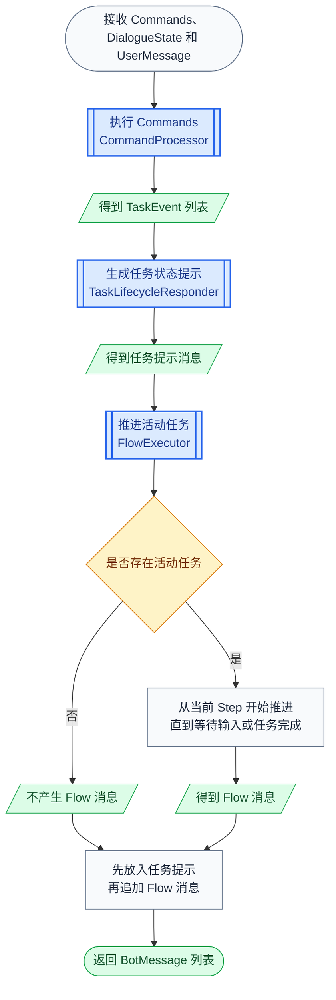

具体过程如下：

1. `CommandProcessor` 按顺序执行本轮 Commands。每个 Command 会立即修改 `DialogueState` 中的任务状态；开始、切换、恢复和取消任务时还会产生 `TaskEvent`，`set_slots` 不产生事件。
2. `TaskLifecycleResponder` 按照事件顺序生成任务状态提示。例如，任务切换时告知用户原任务已暂停，并开始处理新任务。
3. `FlowExecutor` 读取 Command 执行后的最新任务状态。没有活动任务时不产生 Flow 消息；存在活动任务时，从当前 Step 开始推进，直到需要等待用户输入或任务完成。
4. `TaskHandler` 先保留任务状态提示，再追加 Flow 产生的消息，最终返回同一个 `list[BotMessage]`。

## 1.3 组件协作

通过处理流程可以看出，`TaskHandler` 依次调用三个核心处理组件：

| 核心组件 | 在处理流程中的作用 |
|----------|--------------------|
| `CommandProcessor` | 执行 Commands，修改任务状态并返回任务生命周期事件。 |
| `TaskLifecycleResponder` | 将任务生命周期事件转换成任务状态提示。 |
| `FlowExecutor` | 推进活动任务并返回 Flow 消息。 |

三个核心组件共同使用 `FlowCatalog`。它保存系统支持的 Flow 和 Slot，为 Command 执行、任务提示和 Flow 推进提供定义。

`FlowExecutor` 在推进 Flow 时，还依赖三个支撑组件：

| `FlowExecutor` 的支撑组件 | 作用 |
|-----------------------------|------|
| `ActionRunner` | 执行 `action` Step 中声明的业务 Action。 |
| `ResponseRenderer` | 渲染 `collect` 和 `response` Step 的客服消息。 |
| `ConditionEvaluator` | 计算 Slot 校验和条件跳转表达式。 |

## 1.4 实现顺序

后续按照 `TaskHandler` 的依赖关系逐步实现：

| 章节 | 实现内容 |
|------|----------|
| 第 2 章 | 定义和加载 Flow，为任务执行提供配置。 |
| 第 3 章 | 定义 Command、TaskEvent，并实现 `CommandProcessor`。 |
| 第 4 章 | 实现 `TaskLifecycleResponder`，生成任务状态提示。 |
| 第 5 章 | 实现 `FlowExecutor` 主循环，并逐步补齐各类 Step 的执行逻辑。 |
| 第 6 章 | 组装各个组件并实现 `TaskHandler`。 |

# 第2章 定义和加载 Flow

Flow 描述一项任务由哪些 Step 组成，以及每个 Step 完成后应该进入哪里。任务实例只保存当前 `flow_id`、`step_id` 和已经得到的 Slot，具体执行规则由 Flow 配置提供。

## 2.1 Flow 配置语法

一个 Flow 配置文件由 `slots` 和 `flows` 两部分组成：

```yaml
slots:
  # Slot 定义

flows:
  # Flow 定义
```

### 2.1.1 Slots

`slots` 声明所有 Flow 可以使用的业务字段。Flow 收集的用户输入和 Action 产生的业务结果都保存在 Slot 中。

#### 2.1.1.1 Slot 定义

每个 Slot 以名称作为键，并包含类型、显示名称和说明：

```yaml
slots:
  order_number:
    type: text
    label: 订单号
    description: 用户的订单号

  order_status:
    type: text
    label: 订单状态
    description: 订单当前状态
```

| 字段 | 说明 |
|------|------|
| Slot 名称 | Slot 的唯一标识，例如 `order_number`。 |
| `type` | Slot 的数据类型。 |
| `label` | 面向用户或管理人员展示的名称。 |
| `description` | Slot 的业务含义。 |

### 2.1.2 Flows

`flows` 声明系统支持的任务。每个 Flow 由基本信息和一组有序连接的 Step 组成。

#### 2.1.2.1 Flow 定义

下面定义一个订单状态查询 Flow：

```yaml
flows:
  order_status_query:
    name: 订单状态查询
    description: 帮用户查询订单当前的处理状态。
    steps: [] # Step 定义
```

| 字段 | 说明 |
|------|------|
| Flow ID | Flow 的唯一标识，例如 `order_status_query`。 |
| `name` | Flow 的显示名称。 |
| `description` | Flow 可以完成的任务。Planning 模块会使用该说明理解任务能力。 |
| `steps` | Flow 包含的 Step。 |

#### 2.1.2.2 Steps

Step 表示 Flow 中的一个执行节点。

##### 2.1.2.2.1 Step 结构

所有 Step 都包含以下公共字段：

| 字段 | 说明 |
|------|------|
| `id` | Step 在当前 Flow 中的唯一标识。 |
| `type` | Step 类型。 |
| `description` | Step 的补充说明，可以省略。 |
| `next` | 当前 Step 完成后的跳转规则。 |

```yaml
- id: ask_order_number
  type: collect
  description: 收集订单号
  next: lookup_order_status
```

##### 2.1.2.2.2 type

Flow 支持 `start`、`collect`、`action`、`response` 和 `end` 五种 Step。

###### 2.1.2.2.2.1 start

`start` 是 Flow 的入口，只负责进入下一个 Step。除了公共字段之外，不包含其他配置：

```yaml
- id: start
  type: start
  description: 进入订单状态查询流程
  next: ask_order_number
```

一个 Flow 需要且只需要一个 `start` Step。任务启动时，任务实例的 `step_id` 指向该 Step。

###### 2.1.2.2.2.2 collect

`collect` 负责取得一个 Slot。完整配置如下：

```yaml
- id: ask_order_number
  type: collect
  description: 收集并校验订单号
  slot_name: order_number
  template:
    mode: static
    text: "请告诉我你的订单号。"
  validation:
    condition: "slots.get('order_number')"
    failure_template:
      mode: static
      text: "订单号不能为空，请重新输入。"
  next: lookup_order_status
```

`collect` 在公共字段之外支持以下字段：

| 字段 | 是否必填 | 说明 |
|------|----------|------|
| `slot_name` | 是 | 需要取得的 Slot 名称，该名称必须在 `slots` 中声明。 |
| `template` | 是 | 当前任务缺少该 Slot 时使用的询问模板。 |
| `validation` | 否 | Slot 的校验规则。 |
| `validation.condition` | 是 | 配置 `validation` 时，需要提供的条件表达式。 |
| `validation.failure_template` | 是 | 校验失败后使用的回复模板。 |

`template` 和 `failure_template` 都使用回复模板语法：

```yaml
template:
  mode: static
  text: "请告诉我你的订单号。"
  prompt: null
```

回复模板支持以下字段：

| 字段 | 是否必填 | 说明 |
|------|----------|------|
| `mode` | 否 | 回复模式，默认为 `static`。 |
| `text` | 取决于模式 | 基础回复，可以使用 `slots` 中的数据。 |
| `prompt` | 取决于模式 | 调用大模型时使用的提示词。 |

`mode` 支持三种取值：

| mode | `text` | `prompt` | 处理方式 |
|------|--------|----------|----------|
| `static` | 必填 | 不使用 | 渲染 `text` 后直接回复。 |
| `rephrase` | 必填 | 必填 | 渲染 `text`，再由大模型结合对话上下文改写。 |
| `generate` | 可选 | 必填 | 由大模型根据提示词和对话上下文生成回复。 |

未配置 `validation` 时，只判断 Slot 是否为空；配置后，还需要通过 `condition` 才能进入下一个 Step。

###### 2.1.2.2.2.3 action

`action` 负责调用业务代码。完整配置如下：

```yaml
- id: lookup_order_status
  type: action
  description: 调用电商服务查询订单状态
  action: action_lookup_order_status
  args:
    include_summary: true
  next: show_order_status
```

`action` 在公共字段之外支持以下字段：

| 字段 | 是否必填 | 说明 |
|------|----------|------|
| `action` | 是 | 需要执行的 Action 名称。 |
| `args` | 否 | 传给 Action 的固定参数，默认为空字典。 |

任务运行过程中收集的动态数据保存在 Slots 中，Flow 配置提供的固定参数保存在 `args` 中。Action 可以同时读取这两部分数据，并通过 `ActionResult` 返回需要写回的 Slot。

###### 2.1.2.2.2.4 response

`response` 负责生成客服回复。完整配置如下：

```yaml
- id: show_order_status
  type: response
  description: 回复订单状态查询结果
  template:
    mode: rephrase
    text: "订单{{ slots.order_number }}当前状态是：{{ slots.order_status }}。"
    prompt: |
      请结合对话历史，对下面的查询结果进行自然改写：
      {{ current_response }}
  next: end
```

`response` 在公共字段之外只包含 `template`。其结构与 `collect.template`、`validation.failure_template` 完全相同，可以使用 `static`、`rephrase` 或 `generate` 三种模式。

静态回复可以省略 `mode`：

```yaml
- id: show_order_status
  type: response
  template:
    text: "订单{{ slots.order_number }}当前状态是：{{ slots.order_status }}。"
  next: end
```

模板中的 `slots` 表示当前任务已经保存的业务字段。非静态模式的提示词还可以使用 `history`、`user_message` 和 `current_response`。

###### 2.1.2.2.2.5 end

`end` 表示 Flow 执行完成。除了公共字段之外，不包含其他配置：

```yaml
- id: end
  type: end
  description: 完成订单状态查询
  next: []
```

执行到 `end` 后，当前活动任务完成。`end` 没有后续 Step，因此 `next` 固定为空列表。

##### 2.1.2.2.3 next

`next` 用于连接 Step。直接跳转时，将目标 Step ID 写成字符串：

```yaml
next: ask_order_number
```

需要根据当前任务数据选择下一步时，使用 `if`、`then` 和 `else`：

```yaml
next:
  - if: "slots.get('product_id')"
    then: recommend
  - else: ask_product
```

条件按照配置顺序判断。第一个成立的 `if` 决定下一步；所有条件都不成立时进入 `else`。

#### 2.1.2.3 完整示例

将前面的定义组合起来，订单状态查询 Flow 如下：

```yaml
slots:
  order_number:
    type: text
    label: 订单号
    description: 用户的订单号

  order_status:
    type: text
    label: 订单状态
    description: 订单当前状态

flows:
  order_status_query:
    name: 订单状态查询
    description: 帮用户查询订单当前的处理状态。
    steps:
      - id: start
        type: start
        next: ask_order_number

      - id: ask_order_number
        type: collect
        slot_name: order_number
        template:
          text: "请告诉我你的订单号。"
        next: lookup_order_status

      - id: lookup_order_status
        type: action
        action: action_lookup_order_status
        next: show_order_status

      - id: show_order_status
        type: response
        template:
          text: "订单{{ slots.order_number }}当前状态是：{{ slots.order_status }}。"
        next: end

      - id: end
        type: end
        next: []
```

## 2.2 Flow 模型

### 2.2.1 整体结构

Flow 配置对应的模型关系如下：

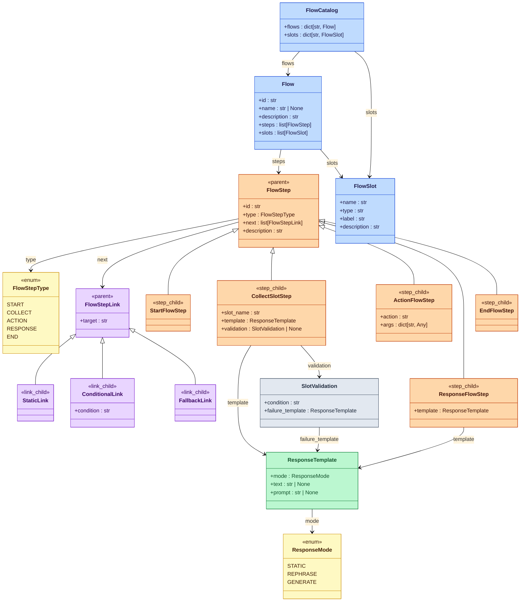

### 2.2.2 FlowCatalog

`FlowCatalog` 是 Flow 模型的入口，集中保存加载完成的 Flow 和 Slot。

在 `atguigu.task.flow.models.py` 模块中定义 `FlowCatalog`。此处只定义属性：

```python
from dataclasses import dataclass, field


@dataclass
class FlowCatalog:
    flows: dict[str, "Flow"] = field(default_factory=dict)
    slots: dict[str, "FlowSlot"] = field(default_factory=dict)
```

`flows` 以 Flow ID 为键，`slots` 以 Slot 名称为键。使用字典可以直接根据标识找到对应配置。

### 2.2.3 FlowSlot

`FlowSlot` 描述 Flow 可以使用的一个业务字段。Slot 由 `FlowCatalog` 统一保存，可以被多个 Flow 引用。

继续在 `atguigu.task.flow.models.py` 模块中定义 `FlowSlot`：

```python
@dataclass
class FlowSlot:
    name: str
    type: str = "any"
    label: str = ""
    description: str = ""
```

`FlowSlot` 只描述字段本身；任务运行时得到的具体值保存在 `TaskInstance.slots` 中。

### 2.2.4 Flow

`Flow` 表示一项完整任务。它保存任务的基本信息，以及任务包含的 Steps 和使用的 Slots。

继续在 `atguigu.task.flow.models.py` 模块中定义 `Flow`：

```python
from atguigu.task.flow.steps import FlowStep


@dataclass
class Flow:
    id: str
    description: str = ""
    steps: list[FlowStep] = field(default_factory=list)
    slots: list[FlowSlot] = field(default_factory=list)
    name: str | None = None
```

`Flow` 包含以下属性：

| 属性 | 说明 |
|------|------|
| `id` | Flow 的唯一标识。 |
| `name` | Flow 的显示名称。 |
| `description` | Flow 能够完成的任务。 |
| `steps` | Flow 包含的 Step。 |
| `slots` | Flow 在执行过程中使用的 Slot。 |

#### 2.2.4.1 FlowStep

`FlowStep` 表示 Flow 中的一个执行节点。所有 Step 共享 `id`、`type`、`next` 和 `description` 四个属性。

在 `atguigu.task.flow.steps.py` 模块中定义 `FlowStep`：

```python
from dataclasses import dataclass, field

from atguigu.task.flow.links import FlowStepLink


@dataclass
class FlowStep:
    id: str
    type: FlowStepType
    next: list[FlowStepLink] = field(default_factory=list)
    description: str = ""
```

##### 2.2.4.1.1 Step 类型

`FlowStepType` 表示配置中的五种 Step 类型。继续在 `atguigu.task.flow.steps.py` 模块中定义枚举和具体 Step：

```python
from enum import Enum
from typing import Any

from atguigu.task.response.models import ResponseTemplate


class FlowStepType(Enum):
    START = "start"
    ACTION = "action"
    RESPONSE = "response"
    COLLECT = "collect"
    END = "end"


@dataclass
class StartFlowStep(FlowStep):
    pass


@dataclass
class ActionFlowStep(FlowStep):
    action: str = ""
    args: dict[str, Any] = field(default_factory=dict)


@dataclass
class ResponseFlowStep(FlowStep):
    template: ResponseTemplate = field(default_factory=ResponseTemplate)


@dataclass
class CollectSlotStep(FlowStep):
    slot_name: str = ""
    template: ResponseTemplate = field(default_factory=ResponseTemplate)
    validation: "SlotValidation | None" = None


@dataclass
class EndFlowStep(FlowStep):
    pass
```

父类保存所有 Step 的公共属性，具体类型只添加自己需要的属性。

##### 2.2.4.1.2 Step 连接

`FlowStep.next` 保存当前 Step 的跳转规则。在 `atguigu.task.flow.links.py` 模块中定义三种连接：

```python
from dataclasses import dataclass


@dataclass
class FlowStepLink:
    target: str


@dataclass
class StaticLink(FlowStepLink):
    pass


@dataclass
class ConditionalLink(FlowStepLink):
    condition: str


@dataclass
class FallbackLink(FlowStepLink):
    pass
```

`StaticLink` 表示直接跳转，`ConditionalLink` 表示条件成立时跳转，`FallbackLink` 对应 `else`。

##### 2.2.4.1.3 回复模板与 Slot 校验

`CollectSlotStep` 和 `ResponseFlowStep` 都使用 `ResponseTemplate`。在 `atguigu.task.response.models.py` 模块中定义回复模式和回复模板：

```python
from dataclasses import dataclass
from enum import StrEnum


class ResponseMode(StrEnum):
    STATIC = "static"
    REPHRASE = "rephrase"
    GENERATE = "generate"


@dataclass
class ResponseTemplate:
    mode: ResponseMode = ResponseMode.STATIC
    text: str | None = None
    prompt: str | None = None
```

三种回复模式的含义如下：

| 模式 | 处理方式 |
|------|----------|
| `STATIC` | 渲染 `text` 后直接返回。 |
| `REPHRASE` | 先渲染 `text`，再由大模型结合上下文改写。 |
| `GENERATE` | 由大模型根据 `prompt` 和对话上下文生成回复。 |

`CollectSlotStep.validation` 使用 `SlotValidation` 描述 Slot 校验条件和失败回复。继续在 `atguigu.task.flow.steps.py` 模块中定义 `SlotValidation`：

```python
@dataclass
class SlotValidation:
    condition: str
    failure_template: ResponseTemplate
```

## 2.3 加载 Flow

Flow 的加载过程从一个完整配置文件开始，再沿着配置结构逐层转换 Slots、Flows、单个 Flow 和 Step：

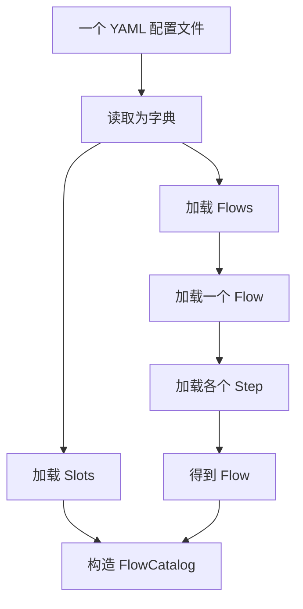

### 2.3.1 加载一个配置文件

#### 2.3.1.1 加载入口

在 `atguigu.task.flow.loader.py` 模块中定义 `FlowLoader`，并添加 `load()` 方法：

```python
from pathlib import Path

import yaml

from atguigu.task.flow.models import Flow, FlowCatalog, FlowSlot
from atguigu.task.flow.steps import CollectSlotStep, FlowStep


class FlowLoader:
    def load(self, path: Path) -> FlowCatalog:
        with open(path, "r", encoding="utf-8") as file:
            data = yaml.safe_load(file)

        slots = self._load_slots(data.get("slots", {}))
        flows = self._load_flows(
            data.get("flows", {}),
            slots,
        )
        return FlowCatalog(flows=flows, slots=slots)
```

`yaml.safe_load()` 将 YAML 转换成字典。`load()` 从顶层分别取得 `slots` 和 `flows`，完成加载后将两部分组合成 `FlowCatalog`。

#### 2.3.1.2 加载 Slots

继续在 `FlowLoader` 类中添加 `_load_slots()` 方法：

```python
def _load_slots(
    self,
    slots_data: dict[str, dict],
) -> dict[str, FlowSlot]:
    slots: dict[str, FlowSlot] = {}
    for slot_name, slot_data in slots_data.items():
        slots[slot_name] = FlowSlot(
            **slot_data,
            name=slot_name,
        )
    return slots
```

YAML 中的 Slot 名称同时作为 `FlowSlot.name` 和加载结果的字典键：

```text
slot_name → FlowSlot
```

#### 2.3.1.3 加载 Flows

Slots 加载完成后，再加载配置中的 `flows`。继续在 `FlowLoader` 类中添加 `_load_flows()` 方法：

```python
def _load_flows(
    self,
    flows_data: dict[str, dict],
    slots: dict[str, FlowSlot],
) -> dict[str, Flow]:
    flows: dict[str, Flow] = {}
    for flow_id, flow_data in flows_data.items():
        flows[flow_id] = self._load_flow(
            flow_id,
            flow_data,
            slots,
        )
    return flows
```

`_load_flows()` 负责遍历配置，每一轮将一个 Flow 交给 `_load_flow()`，最终得到以下结构：

```text
flow_id → Flow
```

继续在 `FlowLoader` 类中添加 `_load_flow()` 方法：

```python
def _load_flow(
    self,
    flow_id: str,
    flow_data: dict,
    slots: dict[str, FlowSlot],
) -> Flow:
    steps = [
        FlowStep.from_dict(step_data)
        for step_data in flow_data["steps"]
    ]
    flow_slots = [
        slots[step.slot_name]
        for step in steps
        if isinstance(step, CollectSlotStep)
    ]
    return Flow(
        id=flow_id,
        name=flow_data.get("name"),
        description=flow_data.get("description", ""),
        steps=steps,
        slots=flow_slots,
    )
```

注意：上述代码中`_load_flow()` 对 `steps` 中的每条配置调用 `FlowStep.from_dict()`。

在 `atguigu.task.flow.steps.py` 模块的 `FlowStep` 类中添加该方法：

```python
@classmethod
def from_dict(cls, step_data: dict[str, Any]) -> "FlowStep":
    step_type = step_data["type"]
    step_class = STEP_TYPE_TO_CLASS[step_type]
    return step_class.from_dict(step_data)
```

同时，在该模块中定义 Step 类型映射：

```python
STEP_TYPE_TO_CLASS = {
    "start": StartFlowStep,
    "collect": CollectSlotStep,
    "action": ActionFlowStep,
    "response": ResponseFlowStep,
    "end": EndFlowStep,
}
```

`FlowStep.from_dict()` 先根据 `type` 找到具体类型，再由具体 Step 继续解析自己的配置。

所有 Step 的公共字段采用相同方式解析。继续在 `FlowStep` 类中添加 `base_fields()`：

```python
@staticmethod
def base_fields(
    step_data: dict[str, Any],
) -> dict[str, Any]:
    return {
        "id": step_data["id"],
        "type": FlowStepType(step_data["type"]),
        "description": step_data.get("description", ""),
        "next": FlowStep.build_links(step_data["next"]),
    }
```

其中，`next` 需要继续转换成 Step 连接。在 `FlowStep` 类中添加 `build_links()`：

```python
@staticmethod
def build_links(
    next_data: str | list,
) -> list[FlowStepLink]:
    if isinstance(next_data, str):
        return [StaticLink(target=next_data)]

    links: list[FlowStepLink] = []
    for link_data in next_data:
        if "if" in link_data:
            links.append(ConditionalLink(
                target=link_data["then"],
                condition=link_data["if"],
            ))
        else:
            links.append(
                FallbackLink(target=link_data["else"])
            )
    return links
```

不同类型的 Step 在公共字段之外继续解析自己的属性：

| Step | 额外解析的配置 |
|------|----------------|
| `start` | 无。 |
| `collect` | `slot_name`、`template`、`validation`。 |
| `action` | `action`、`args`。 |
| `response` | `template`。 |
| `end` | 无。 |

在 `StartFlowStep` 类中添加 `from_dict()`：

```python
@classmethod
def from_dict(
    cls,
    step_data: dict[str, Any],
) -> "StartFlowStep":
    return cls(**FlowStep.base_fields(step_data))
```

在 `CollectSlotStep` 类中添加 `from_dict()`：

```python
@classmethod
def from_dict(
    cls,
    step_data: dict[str, Any],
) -> "CollectSlotStep":
    validation = None
    if "validation" in step_data:
        validation_data = step_data["validation"]
        validation = SlotValidation(
            condition=validation_data["condition"],
            failure_template=ResponseTemplate.from_dict(
                validation_data["failure_template"]
            ),
        )

    return cls(
        **FlowStep.base_fields(step_data),
        slot_name=step_data["slot_name"],
        template=ResponseTemplate.from_dict(
            step_data["template"]
        ),
        validation=validation,
    )
```

在 `ActionFlowStep` 类中添加 `from_dict()`：

```python
@classmethod
def from_dict(
    cls,
    step_data: dict[str, Any],
) -> "ActionFlowStep":
    return cls(
        **FlowStep.base_fields(step_data),
        action=step_data["action"],
        args=step_data.get("args", {}),
    )
```

在 `ResponseFlowStep` 类中添加 `from_dict()`：

```python
@classmethod
def from_dict(
    cls,
    step_data: dict[str, Any],
) -> "ResponseFlowStep":
    return cls(
        **FlowStep.base_fields(step_data),
        template=ResponseTemplate.from_dict(
            step_data.get("template", {})
        ),
    )
```

在 `EndFlowStep` 类中添加 `from_dict()`：

```python
@classmethod
def from_dict(
    cls,
    step_data: dict[str, Any],
) -> "EndFlowStep":
    return cls(**FlowStep.base_fields(step_data))
```

`collect` 和 `response` 还需要解析回复模板。在 `atguigu.task.response.models.py` 模块的 `ResponseTemplate` 类中添加 `from_dict()`：

```python
@classmethod
def from_dict(cls, data: dict) -> "ResponseTemplate":
    return cls(
        mode=ResponseMode(
            data.get("mode", ResponseMode.STATIC)
        ),
        text=data.get("text"),
        prompt=data.get("prompt"),
    )
```

到这里，一条 Step 配置就被完整转换成对应的 Step 对象。对 `steps` 中的每条配置执行相同转换，即可得到一个 Flow 的 `list[FlowStep]`。

### 2.3.2 加载多个配置文件

加载多个配置文件建立在 `load()` 之上。继续在 `FlowLoader` 类中添加 `load_many()` 方法：

```python
def load_many(self, paths: list[Path]) -> FlowCatalog:
    flows: dict[str, Flow] = {}
    slots: dict[str, FlowSlot] = {}

    for path in paths:
        catalog = self.load(path)
        flows.update(catalog.flows)
        slots.update(catalog.slots)

    return FlowCatalog(flows=flows, slots=slots)
```

每个文件先独立加载成 `FlowCatalog`，多个 Catalog 再合并成一个完整的配置集合。

# 第3章 处理 Command

Planning 模块不会直接修改任务状态，而是用 Command 表达本轮需要执行的任务操作。`CommandProcessor` 负责把这些操作应用到 `DialogueState.tasks`。

## 3.1 整体处理过程

`CommandProcessor` 是 Command 处理的入口。它按照 Planner 给出的顺序逐个执行 Command，修改任务状态，并收集执行过程中产生的 TaskEvent。

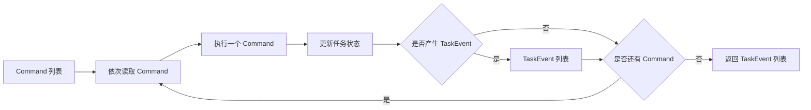

启动、切换、恢复和取消任务会产生生命周期变更事件；写入 Slot 只修改当前任务的数据，不产生事件。具体的数据类型和处理代码将在后续小节中定义。

## 3.2 Command 定义和解析

### 3.2.1 Command 定义

第 06 篇文档已经介绍了本轮计划的整体结构。当计划选择任务处理时，Planner 会在 `task.commands` 中输出一个 Command 列表：

```json
[
  {"command": "start_flow", "flow": "order_status_query"},
  {"command": "set_slots", "slots": {"order_number": "10001"}}
]
```

上面的 Command 列表表示：先启动订单状态查询 Flow，再把用户提供的订单号写入新任务。一个任务计划可以包含一个或多个 Command，它们按照列表中的顺序执行。

Planner 只会输出以下四种 Command：

| command | 完整形式 | 作用 |
|---------|----------|------|
| `start_flow` | `{"command": "start_flow", "flow": "<flow_id>"}` | 启动指定 Flow。 |
| `set_slots` | `{"command": "set_slots", "slots": {"<slot_name>": "<value>"}}` | 向当前活动任务写入 Slot。 |
| `cancel_task` | `{"command": "cancel_task", "task_id": "<task_id>"}` | 取消指定任务。 |
| `resume_task` | `{"command": "resume_task", "task_id": "<task_id>"}` | 恢复指定的暂停任务。 |

将这四种 Command 分别定义成对应的 Python 模型。

在 `atguigu.task.command.models.py` 模块中定义 Command 模型：

```python
from dataclasses import dataclass
from typing import Any


@dataclass
class Command:
    command: str


@dataclass
class StartFlowCommand(Command):
    flow: str


@dataclass
class SetSlotsCommand(Command):
    slots: dict[str, Any]


@dataclass
class CancelTaskCommand(Command):
    task_id: str


@dataclass
class ResumeTaskCommand(Command):
    task_id: str
```

### 3.2.2 Command 解析

在该模块中添加 Command 类型映射：

```python
COMMAND_NAME_TO_CLASS: dict[str, type[Command]] = {
    "start_flow": StartFlowCommand,
    "set_slots": SetSlotsCommand,
    "cancel_task": CancelTaskCommand,
    "resume_task": ResumeTaskCommand,
}
```

然后在 `Command` 类中添加 `from_dict()` 方法：

```python
@classmethod
def from_dict(cls, data: dict[str, Any]) -> "Command":
    command_class = COMMAND_NAME_TO_CLASS[data["command"]]
    return command_class(**data)
```

Planning 输出的 Command 默认符合约定，解析时直接根据 `command` 选择具体类型。

## 3.3 定义 TaskEvent

TaskEvent 用于记录任务生命周期的变化，并为生成相应提示提供依据。TaskEvent 主要记录发生变化的任务引用，引用中包含 `task_id` 和 `flow_id`。

例如，用户从退款申请切换到物流查询时，会产生 `TaskSwitched`，其中分别记录原任务和当前任务的引用，系统可以据此生成任务切换提示。

TaskEvent 的完整定义如下：

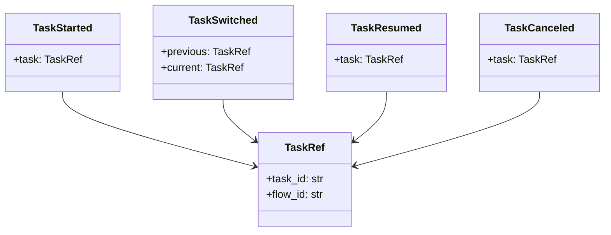

在 `atguigu.task.lifecycle.models.py` 模块中定义这些类型：

```python
from dataclasses import dataclass

@dataclass
class TaskRef:
    task_id: str
    flow_id: str


@dataclass
class TaskStarted:
    task: TaskRef


@dataclass
class TaskSwitched:
    previous: TaskRef
    current: TaskRef


@dataclass
class TaskResumed:
    task: TaskRef


@dataclass
class TaskCanceled:
    task: TaskRef


TaskEvent: TypeAlias = (
        TaskStarted
        | TaskSwitched
        | TaskResumed
        | TaskCanceled
)
```

## 3.4 实现 CommandProcessor

前面的 Command 和 TaskEvent 分别构成 `CommandProcessor` 的输入和输出。现在实现完整的 Command 处理过程。

### 3.4.1 整体结构

在 `atguigu.task.command.processor.py` 模块中定义 `CommandProcessor`。`run()` 负责依次处理本轮 Commands，`_apply()` 负责根据 Command 类型选择对应的处理分支：

```python
from atguigu.domain.state import DialogueState
from atguigu.domain.task_lifecycle import TaskEvent
from atguigu.task.command.models import (
    CancelTaskCommand,
    Command,
    ResumeTaskCommand,
    SetSlotsCommand,
    StartFlowCommand,
)
from atguigu.task.flow.models import FlowCatalog


class CommandProcessor:
    def run(
        self,
        commands: list[Command],
        state: DialogueState,
        flows: FlowCatalog,
    ) -> list[TaskEvent]:
        events: list[TaskEvent] = []
        for command in commands:
            event = self._apply(command, state, flows)
            if event is not None:
                events.append(event)
        return events

    def _apply(
        self,
        command: Command,
        state: DialogueState,
        flows: FlowCatalog,
    ) -> TaskEvent | None:
        if isinstance(command, StartFlowCommand):
            ...

        if isinstance(command, SetSlotsCommand):
            ...

        if isinstance(command, CancelTaskCommand):
            ...

        if isinstance(command, ResumeTaskCommand):
            ...
```

`run()` 按照列表顺序将 Command 交给 `_apply()`，并收集其中产生的 TaskEvent。`_apply()` 在这里只搭建四种 Command 的类型分支，各分支的具体逻辑将在下一节逐步实现。

### 3.4.2 实现各个分支

下面按照四种 Command，依次补全 `_apply()` 中的分支，并实现分支使用的任务状态操作。

四种 Command 中，`start_flow`、`cancel_task` 和 `resume_task` 会改变任务生命周期并返回 TaskEvent；`set_slots` 只更新任务数据，不产生事件。下面分别说明它们的执行逻辑。

任务状态发生变化时，需要根据 `TaskInstance` 创建 `TaskRef`。在 `atguigu.domain.state.py` 模块的 `TaskInstance` 类中添加 `to_ref()` 方法：

```python
def to_ref(self) -> TaskRef:
    return TaskRef(
        task_id=self.task_id,
        flow_id=self.flow_id,
    )
```

`to_ref()` 将当前任务实例转换为任务引用。`TaskRef` 只负责描述任务引用，不需要反向依赖 `TaskInstance`。

该函数位于 `TaskInstance` 与 `TaskState` 之间，由 `TaskState` 的生命周期方法调用。`TaskRef` 只负责描述任务引用，不需要依赖 `TaskInstance`。

#### 3.4.2.1 start_flow

将 `StartFlowCommand` 分支替换为：

```python
if isinstance(command, StartFlowCommand):
    flow = flows.get_flow(command.flow)
    task = TaskInstance(
        flow_id=flow.id,
        step_id=flow.get_start_step().id,
    )
    return state.tasks.start(task)
```

该分支先根据 `flow` 取得 Flow 和起始 Step，再创建 `TaskInstance`，最后通过 `TaskState.start()` 启动任务：

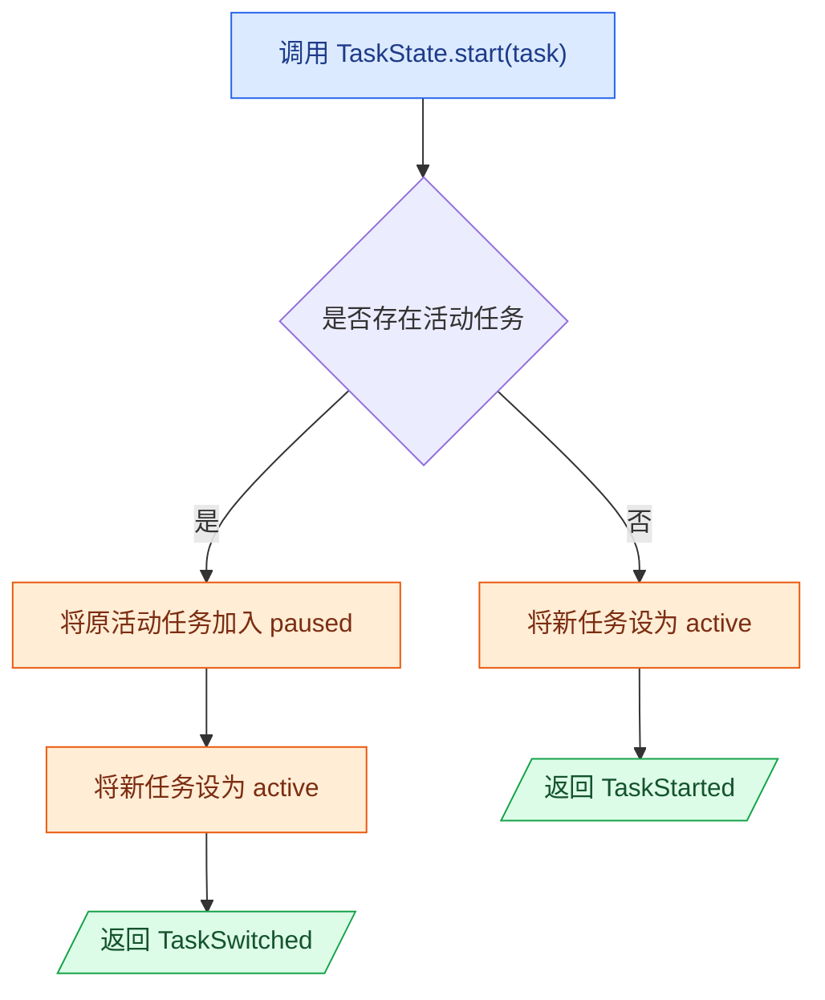

在 `atguigu.task.flow.models.py` 模块的 `FlowCatalog` 类中添加 `get_flow()`：

```python
def get_flow(self, flow_id: str) -> Flow:
    return self.flows[flow_id]
```

调用方按照 Flow 一定存在处理，因此直接通过 Flow ID 取得对象，不再返回可选值。

然后在该模块的 `Flow` 类中添加 `get_start_step()`：

```python
def get_start_step(self) -> FlowStep:
    for step in self.steps:
        if step.type is FlowStepType.START:
            return step
```

在 `TaskState` 类中添加 `start()` 方法：

```python
def start(self, task: TaskInstance) -> TaskEvent:
    if self.active is None:
        self.active = task
        return TaskStarted(task=task.to_ref())

    previous = self.active
    self.paused.append(previous)
    self.active = task
    return TaskSwitched(
        previous=previous.to_ref(),
        current=task.to_ref(),
    )
```

没有活动任务时，新任务直接成为活动任务，并产生 `TaskStarted`。已经存在活动任务时，原任务进入暂停列表，新任务成为活动任务，并产生 `TaskSwitched`。

#### 3.4.2.2 set_slots

`set_slots` 将 Planner 从用户消息中取得的数据写入当前活动任务。

将 `SetSlotsCommand` 分支中的 `...` 替换为：

```python
if isinstance(command, SetSlotsCommand):
    state.tasks.set_slots(command.slots)
    return None
```

在 `TaskState` 类中添加 `set_slots()` 方法：

```python
def set_slots(self, slots: dict[str, Any]) -> None:
    self.active.slots.update(slots)
```

写入 Slot 只更新当前任务的数据，不改变任务的生命周期，因此不产生 TaskEvent。

#### 3.4.2.3 cancel_task

`cancel_task` 根据 `task_id` 取消活动任务或暂停任务。

将 `CancelTaskCommand` 分支中的 `...` 替换为：

```python
if isinstance(command, CancelTaskCommand):
    return state.tasks.cancel(command.task_id)
```

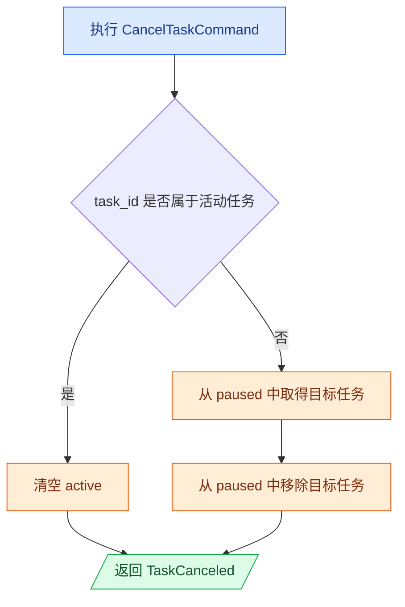

在 `TaskState` 类中添加 `cancel()` 方法：

```python
def cancel(self, task_id: str) -> TaskCanceled:
    if self.active is not None and self.active.task_id == task_id:
        canceled = self.active
        self.active = None
        return TaskCanceled(task=canceled.to_ref())

    canceled = next(
        task
        for task in self.paused
        if task.task_id == task_id
    )
    self.paused.remove(canceled)
    return TaskCanceled(task=canceled.to_ref())
```

取消活动任务会清空 `active`；取消暂停任务只会将指定任务从 `paused` 中移除。

#### 3.4.2.4 resume_task

`resume_task` 根据 `task_id` 从暂停列表中恢复目标任务。

将 `ResumeTaskCommand` 分支中的 `...` 替换为：

```python
if isinstance(command, ResumeTaskCommand):
    return state.tasks.resume(command.task_id)
```

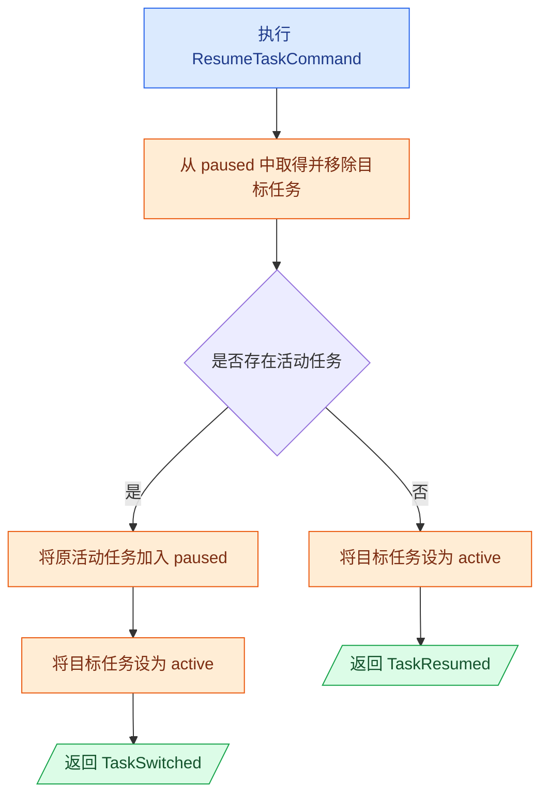

在 `TaskState` 类中添加 `resume()` 方法：

```python
def resume(self, task_id: str) -> TaskEvent:
    target = next(
        task
        for task in self.paused
        if task.task_id == task_id
    )
    self.paused.remove(target)

    if self.active is None:
        self.active = target
        return TaskResumed(task=target.to_ref())

    previous = self.active
    self.paused.append(previous)
    self.active = target
    return TaskSwitched(
        previous=previous.to_ref(),
        current=target.to_ref(),
    )
```

没有活动任务时产生 `TaskResumed`。存在活动任务时，当前任务先进入暂停列表，目标任务再成为活动任务，因此产生 `TaskSwitched`。

# 第4章 生成任务回复

任务回复是任务状态发生变化时，系统向用户发送的提示消息。例如，开始、切换、恢复或取消任务时，系统需要将任务的变化明确告知用户。

## 4.1 整体过程

任务回复的生成过程如下：

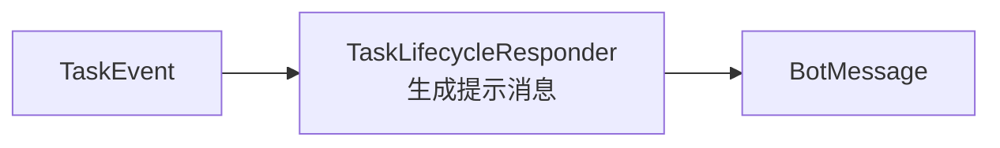

`TaskLifecycleResponder` 根据事件类型和相关任务的 Flow 名称，直接生成 `BotMessage`。

## 4.2 实现 TaskLifecycleResponder

`TaskLifecycleResponder` 接收 `CommandProcessor` 产生的一组 `TaskEvent`，逐个生成任务状态变化提示。

事件与提示的对应关系如下：

| 事件 | 回复作用 |
|------|----------|
| `TaskStarted` | 提示开始处理目标任务。 |
| `TaskSwitched` | 提示暂停原任务并切换到目标任务。 |
| `TaskResumed` | 提示继续指定任务。 |
| `TaskCanceled` | 提示指定任务已经取消。 |

在 `atguigu.task.lifecycle.responder.py` 模块中定义 `TaskLifecycleResponder`：

```python
from atguigu.domain.messages import BotMessage
from atguigu.domain.task_lifecycle import (
    TaskCanceled,
    TaskEvent,
    TaskResumed,
    TaskStarted,
    TaskSwitched,
)
from atguigu.task.flow.models import FlowCatalog


class TaskLifecycleResponder:
    def __init__(self, flows: FlowCatalog) -> None:
        self.flows = flows

    def respond(
        self,
        events: list[TaskEvent],
    ) -> list[BotMessage]:
        messages: list[BotMessage] = []
        for event in events:
            messages.append(self._message_for(event))
        return messages
```

`respond()` 按照事件产生的顺序，将每个事件交给 `_message_for()` 生成回复。

### 4.2.1 选择回复内容

在 `TaskLifecycleResponder` 类中添加 `_message_for()` 方法：

```python
def _message_for(
    self,
    event: TaskEvent,
) -> BotMessage:
    if isinstance(event, TaskStarted):
        flow_name = self._flow_name(event.task.flow_id)
        return BotMessage(
            text=f"好的，我们先处理{flow_name}。"
        )

    if isinstance(event, TaskSwitched):
        previous_name = self._flow_name(
            event.previous.flow_id
        )
        current_name = self._flow_name(event.current.flow_id)
        return BotMessage(
            text=(
                f"好的，我们先把{previous_name}放一放，"
                f"先处理{current_name}。"
            )
        )

    if isinstance(event, TaskResumed):
        flow_name = self._flow_name(event.task.flow_id)
        return BotMessage(
            text=f"好的，我们继续刚才的{flow_name}。"
        )

    if isinstance(event, TaskCanceled):
        flow_name = self._flow_name(event.task.flow_id)
        return BotMessage(
            text=f"好的，{flow_name}先帮你取消。"
        )

    raise TypeError(
        f"Unsupported task event: {type(event).__name__}"
    )
```

暂停任务是切换对话类型时的内部状态变化，不产生 TaskEvent。任务开始、切换、恢复和取消则需要明确告知用户。

### 4.2.2 获取 Flow 名称

回复中应当使用用户可以理解的 Flow 名称，而不是内部使用的 Flow ID。在 `TaskLifecycleResponder` 类中添加 `_flow_name()` 方法：

```python
def _flow_name(self, flow_id: str) -> str:
    flow = self.flows.get_flow(flow_id)
    return flow.name or flow.id
```

# 第5章 实现 FlowExecutor

`FlowExecutor` 负责从活动任务的当前 Step 开始执行，直到需要等待用户输入或者直到任务完成。

## 5.1 Flow 执行机制

### 5.1.1 一轮推进

在一轮对话中，`FlowExecutor` 可以连续执行多个 Step。以订单状态查询为例，在正常情况下，只需两轮对话，即可执行完整整个工作流中的所有Step。

```yaml
flows:
  order_status_query:
    steps:
      - id: start
        type: start
        next: ask_order_number

      - id: ask_order_number
        type: collect
        slot_name: order_number
        template:
          text: "请告诉我你的订单号。"
        next: lookup_order_status

      - id: lookup_order_status
        type: action
        action: action_lookup_order_status
        next: show_order_status

      - id: show_order_status
        type: response
        template:
          text: "订单{{ slots.order_number }}当前状态是：{{ slots.order_status }}。"
        next: end

      - id: end
        type: end
        next: []
```

第一轮用户只提出查询订单状态，没有提供订单号。新任务从 `start` 开始执行：

```text
start
→ ask_order_number
→ 缺少 order_number
→ 生成“请告诉我你的订单号。”
→ 停止推进
```

第二轮用户提供订单号。TurnPlanner会生成 `set_slots` Command，执行 Command 后，`order_number` 会被写入当前任务，之后`FlowExecutor` 会从原来的 `ask_order_number` 继续执行：

```text
ask_order_number
→ order_number 已存在
→ lookup_order_status
→ 写回 order_status
→ show_order_status
→ 生成订单状态消息
→ end
→ 返回本轮累计的消息
```

### 5.1.2 整体执行过程

`FlowExecutor` 按照下面的过程执行当前活动任务：

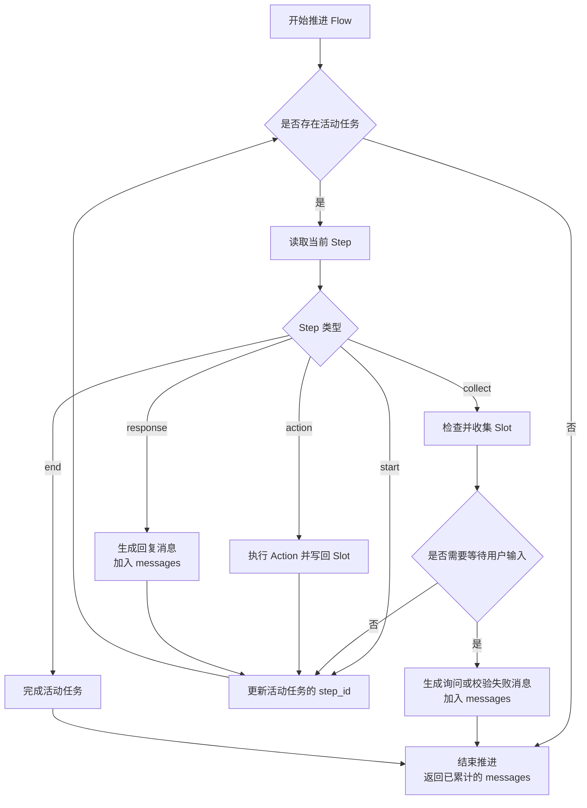

`FlowExecutor` 通过循环连续执行 Flow 中的 Step。每次循环先判断是否存在活动任务：不存在时结束执行并返回已经累计的 `messages`；存在时读取任务的当前 Step，再根据 Step 类型进行处理。

- `start`：根据 `next` 选择下一个 Step，将活动任务的 `step_id` 修改为该 Step 的 ID，然后继续循环；
- `collect`：先尝试取得需要的 Slot。缺少 Slot 时，生成询问消息并加入 `messages`，保持当前 `step_id` 不变，然后返回 `messages`；Slot 校验失败时，删除无效值，生成失败提示并加入 `messages`，同样保持当前 `step_id` 不变并返回；Slot 有效时，根据 `next` 更新活动任务的 `step_id`，然后继续循环；
- `action`：根据配置构造 `ActionCall` 并执行对应 Action，将执行结果写入活动任务的 `slots`，再根据 `next` 更新活动任务的 `step_id`，然后继续循环；
- `response`：渲染配置中的回复模板，将生成的 `BotMessage` 加入 `messages`，再根据 `next` 更新活动任务的 `step_id`，然后继续循环；
- `end`：完成当前活动任务，将 `active` 置空，然后返回已经累计的 `messages`。


## 5.2 实现主循环

先在 `atguigu.task.flow.executor.py` 模块中定义 `FlowExecutor`，并添加 `run_task()`。具体代码如下：

```python
from atguigu.domain.messages import BotMessage, UserMessage
from atguigu.domain.state import DialogueState
from atguigu.task.flow.models import FlowCatalog
from atguigu.task.flow.steps import (
    ActionFlowStep,
    CollectSlotStep,
    EndFlowStep,
    ResponseFlowStep,
    StartFlowStep,
)


class FlowExecutor:
    def __init__(
        self,
        max_steps_per_turn: int = 100,
    ) -> None:
        self.max_steps_per_turn = max_steps_per_turn

    async def run_task(
        self,
        state: DialogueState,
        flows: FlowCatalog,
        user_message: UserMessage,
    ) -> list[BotMessage]:
        messages: list[BotMessage] = []

        for _ in range(self.max_steps_per_turn):
            task = state.tasks.active
            if task is None:
                return messages

            flow = flows.get_flow(task.flow_id)
            step = flow.get_step(task.step_id)

            if isinstance(step, StartFlowStep):
                ...

            if isinstance(step, ResponseFlowStep):
                ...

            if isinstance(step, CollectSlotStep):
                ...

            if isinstance(step, ActionFlowStep):
                ...

            if isinstance(step, EndFlowStep):
                ...
```

`messages` 在循环开始前创建，用于保存本轮产生的回复。循环每次重新读取 `state.tasks.active`，再根据活动任务的 `flow_id` 和 `step_id` 取得当前 Step。这样，后续分支修改任务状态后，下一次循环可以读取到最新结果。

在 `atguigu.task.flow.models.py` 模块的 `Flow` 类中添加 `get_step()`，用于根据 step_id 获取FlowStep。

```python
def get_step(self, step_id: str) -> FlowStep:
    for step in self.steps:
        if step.id == step_id:
            return step
```


## 5.3 实现不同类型的 Step

`run_task()` 根据当前 Step 的具体类型选择处理方式。下面按照 `start`、`response`、`collect`、`action`、`end` 的顺序补充各个类型分支。

### 5.3.1 处理 start Step

`start` Step 是 Flow 的入口，它不执行任何业务逻辑。

将 `run_task()` 中 `StartFlowStep` 分支改为

```python
if isinstance(step, StartFlowStep):
    self._advance(step, state)
    continue
```

`_advance()` 表示将活动任务从当前 Step 推进到下一个 Step。它先根据当前 Step 的 `next` 选择目标 Step，再将活动任务的 `step_id` 修改为目标 Step 的 ID。此时只是改变任务的执行位置，并不会立即执行目标 Step。

`continue` 会开始下一次循环。主循环根据更新后的 `step_id` 重新取得当前 Step，再执行该 Step 的处理逻辑。

`_advance()` 的具体逻辑如下：

```python
def _advance(
    self,
    step: FlowStep,
    state: DialogueState,
) -> None:
    for link in step.next:
        if isinstance(link, StaticLink):
            state.tasks.active.step_id = link.target
            return
        if (
            isinstance(link, ConditionalLink)
            and self.condition_evaluator.evaluate(
                link.condition,
                {
                    "slots": state.tasks.active.slots,
                },
            )
        ):
            state.tasks.active.step_id = link.target
            return
        if isinstance(link, FallbackLink):
            state.tasks.active.step_id = link.target
            return
```

其中，条件连接需要判断配置的表达式是否成立。该判断与后面 Slot 校验使用相同的表达式计算逻辑，因此可以定义统一的 `ConditionEvaluator`。它接收条件表达式和计算表达式所需的数据，返回条件是否成立。

在 `atguigu.task.flow.conditions.py` 模块中定义 `ConditionEvaluator`：

```python
from typing import Any


class ConditionEvaluator:
    def evaluate(
        self,
        expression: str,
        data: dict[str, Any],
    ) -> bool:
        return bool(eval(
            expression,
            {"__builtins__": {}},
            data,
        ))
```

> [!note]
>
> `eval()` 是 Python 提供的内置函数，用于计算字符串形式的表达式，并返回表达式的计算结果。基本语法如下：
>
> ```python
> eval(expression, globals, locals)
> ```
>
> | 参数         | 作用                                                         |
> | ------------ | ------------------------------------------------------------ |
> | `expression` | 要计算的字符串表达式。                                       |
> | `globals`    | 用于指定表达式能访问的全局变量，值为字典类型。其中`__builtins__` 属性，用于指定表达式能够访问的Python内置函数，值也是字典类型。例如：若将 `globals`设置为`{"__builtins__": {"len": len}` ,则表示式将只能访问`len()`函数。默认情况下，表示式能访问全部的内置函数。 |
> | `locals`     | 用于指定表达式能访问的局部变量，值为字典类型。               |
>
> 具体示例如下：
>
> ```python
> result = eval(
>     "price * count",
>     {"__builtins__": {}},
>     {
>         "price": 10,
>         "count": 3,
>     },
> )
> 
> # result: 30
> ```
>

然后在 `FlowExecutor` 的构造函数中增加 `condition_evaluator` 属性：

```python
def __init__(
    self,
    condition_evaluator: ConditionEvaluator,
    max_steps_per_turn: int = 100,
) -> None:
    self.condition_evaluator = condition_evaluator 
    self.max_steps_per_turn = max_steps_per_turn
```

### 5.3.2 处理 response Step

`response` Step 用于在任务执行过程中生成客服消息。下面是一个完整配置：

```yaml
- id: show_order_status
  type: response
  description: 回复订单状态查询结果
  template:
    mode: rephrase
    text: "订单{{ slots.order_number }}当前状态是：{{ slots.order_status }}。"
    prompt: |
      请结合对话历史和当前用户消息，对基础回复进行自然改写。

      对话历史：{{ history }}
      当前用户消息：{{ user_message }}
      基础回复：{{ current_response }}
  next: end
```

`template.text` 和 `template.prompt` 都可以配置模板变量，但二者可以使用的变量不同：

| 配置位置 | 可以使用的变量 | 变量内容 |
|----------|----------------|----------|
| `template.text` | `slots` | 当前活动任务已经保存的业务数据。 |
| `template.prompt` | `history` | 当前会话的对话历史。 |
| `template.prompt` | `user_message` | 当前用户消息。 |
| `template.prompt` | `current_response` | `template.text` 渲染后的基础回复；`generate` 模式下为空字符串。 |

这些变量使用 Jinja2 模板语法编写。

> [!NOTE]
>
> Jinja2 是 Python 中常用的模板引擎，它将文本结构与运行时数据分开保存：模板负责描述最终文本的格式，程序在渲染时提供数据，Jinja2 再将二者组合成最终字符串。
>
> 除了基础的变量替换，Jinja2 还支持以下能力：
>
> | 能力     | 语法示例                                 | 作用                           |
> | -------- | ---------------------------------------- | ------------------------------ |
> | 变量属性 | `{{ user.name }}`                        | 将变量的属性值写入最终文本。   |
> | 条件判断 | `...`             | 根据数据决定是否输出一段内容。 |
> | 循环     | `...` | 根据列表重复生成内容。         |
>
> Jinja2的具体用法如下：
>
> ```python
> from jinja2 import Template
> 
> template = Template("你好，{{ user }}")
> text = template.render(user='小明')
> ```
>
> `Template()` 根据字符串创建模板，`render()` 通过关键字参数向模板传入数据。渲染结果为：
>
> ```text
> 你好，小明
> ```
>

明确模板的写法后，再看 `response` Step 的处理过程。执行该 Step 时，先根据 `template` 生成一条 `BotMessage`，再将消息加入本轮的 `messages`。消息生成后，活动任务推进到下一个 Step，主循环不会停下来等待用户输入。

将 `run_task()` 中 `ResponseFlowStep` 分支改为：

```python
if isinstance(step, ResponseFlowStep):
    message = await self.response_renderer.render(
        step.template,
        state,
        user_message=user_message,
    )
    messages.append(message)
    self._advance(step, state)
    continue
```

代码中的`response_renderer.render()` 负责将 `ResponseTemplate` 渲染为最终的 `BotMessage`。接下来在 `atguigu.task.response.renderer.py` 模块中定义 `ResponseRenderer`：

```python
from typing import Any

from jinja2 import Template
from langchain_core.output_parsers import StrOutputParser
from langchain_core.prompts import PromptTemplate

from atguigu.domain.messages import BotMessage, UserMessage
from atguigu.domain.state import DialogueState
from atguigu.prompts.history_builder import HistoryBuilder
from atguigu.task.response.models import (
    ResponseMode,
    ResponseTemplate,
)


class ResponseRenderer:
    def __init__(self, llm: Any | None = None) -> None:
        self.llm = llm

    async def render(
        self,
        template: ResponseTemplate,
        state: DialogueState,
        user_message: UserMessage | None = None,
    ) -> BotMessage:
        if template.mode is ResponseMode.STATIC:
            slots = (
                state.tasks.active.slots
                if state.tasks.active
                else {}
            )
            rendered_text = Template(
                template.text
            ).render(slots=slots)
            return BotMessage(text=rendered_text)

        if template.mode is ResponseMode.REPHRASE:
            slots = (
                state.tasks.active.slots
                if state.tasks.active
                else {}
            )
            rendered_text = Template(
                template.text
            ).render(slots=slots)
            text = await self._call_llm(
                template.prompt,
                state,
                user_message,
                current_response=rendered_text,
            )
            return BotMessage(text=text)

        if template.mode is ResponseMode.GENERATE:
            text = await self._call_llm(
                template.prompt,
                state,
                user_message,
            )
            return BotMessage(text=text)
```

`render()` 根据回复模式进入对应分支，每个分支只处理自身需要的数据：

- `STATIC`：渲染 `template.text`，再将结果直接包装为 `BotMessage`；
- `REPHRASE`：渲染 `template.text`，再将结果作为基础回复传给 `_call_llm()`；
- `GENERATE`：不读取 `template.text`，直接调用 `_call_llm()` 生成回复。

`STATIC` 和 `REPHRASE` 分支先读取当前活动任务的 Slots，再通过 `Template(template.text).render(slots=slots)` 完成模板渲染。

非静态回复还需要根据提示词调用大模型。继续在 `ResponseRenderer` 类中添加 `_call_llm()`：

```python
async def _call_llm(
    self,
    prompt_text: str,
    state: DialogueState,
    user_message: UserMessage,
    current_response: str = "",
) -> str:
    prompt = PromptTemplate.from_template(
        prompt_text,
        template_format="jinja2",
    )
    chain = prompt | self.llm | StrOutputParser()
    session = state.shared.current_session
    turns = session.turns if session else []
    return await chain.ainvoke({
        "history": HistoryBuilder.build(turns),
        "user_message": HistoryBuilder.render_user_message(
            user_message
        ),
        "current_response": current_response,
    })
```

`PromptTemplate.from_template()` 通过 `template_format="jinja2"` 使用 Jinja2 解析提示词。`current_response` 的默认值为空字符串：`REPHRASE` 模式传入待改写的基础回复，`GENERATE` 模式不需要基础回复，因此调用 `_call_llm()` 时可以省略该参数。`ainvoke()` 可以统一接收 `history`、`user_message` 和 `current_response`；提示词中没有使用的变量不会出现在最终提交给大模型的文本中。

`_call_llm()` 使用 `HistoryBuilder` 将会话中的消息转换为提示词需要的文本。在 `atguigu.prompts.history_builder.py` 模块中定义 `HistoryBuilder`：

```python
import json
from dataclasses import asdict

from atguigu.domain.messages import (
    BotMessage,
    MessageObject,
    MessageType,
    UserMessage,
)
from atguigu.domain.state import Turn


class HistoryBuilder:
    @staticmethod
    def build(turns: list[Turn]) -> str:
        messages: list[str] = []

        for turn in turns:
            user_message = HistoryBuilder.render_user_message(
                turn.user_message
            )
            messages.append(f"USER: {user_message}")

            for bot_message in turn.bot_messages:
                rendered_bot_message = (
                    HistoryBuilder._render_bot_message(
                        bot_message
                    )
                )
                messages.append(
                    f"BOT: {rendered_bot_message}"
                )

        return "\n".join(messages)

    @staticmethod
    def render_user_message(
        user_message: UserMessage,
    ) -> str:
        if user_message.type is MessageType.TEXT:
            return HistoryBuilder._render_text(
                user_message.text
            )
        return HistoryBuilder._render_object(
            user_message.object
        )

    @staticmethod
    def _render_bot_message(
        bot_message: BotMessage,
    ) -> str:
        if bot_message.text:
            return HistoryBuilder._render_text(
                bot_message.text
            )
        return HistoryBuilder._render_object(
            bot_message.object
        )

    @staticmethod
    def _render_text(text: str) -> str:
        return text.strip()

    @staticmethod
    def _render_object(
        message_object: MessageObject,
    ) -> str:
        return json.dumps(
            asdict(message_object),
            ensure_ascii=False,
        )
```

Object 消息先通过 `asdict()` 转换为字典，再通过 `json.dumps()` 转换为 JSON 字符串。`ensure_ascii=False` 用于保留中文字符；不设置 `indent`，生成的 JSON 不会换行。

最后，在 `FlowExecutor` 的构造函数中增加 `response_renderer`：

```python
def __init__(
    self,
    response_renderer: ResponseRenderer,
    condition_evaluator: ConditionEvaluator,
    max_steps_per_turn: int = 100,
) -> None:
    self.response_renderer = response_renderer
    self.condition_evaluator = condition_evaluator
    self.max_steps_per_turn = max_steps_per_turn
```

至此，`response` 分支所需的回复生成能力已经完整。后面的 `collect` Step 也会复用 `ResponseRenderer` 生成询问消息和校验失败提示。

### 5.3.3 处理 collect Step

`collect` Step 用于收集工作流所需的 slot 信息。

一次 `collect` Step 的处理过程如下：

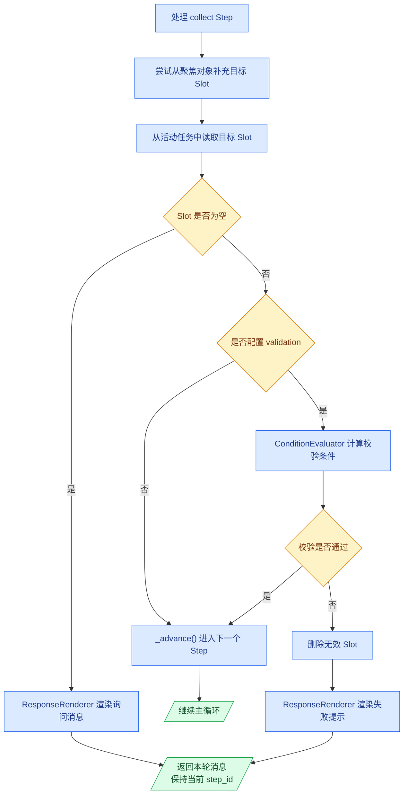

将 `run_task()` 中 `CollectSlotStep` 分支替换为：

```python
if isinstance(step, CollectSlotStep):
    should_wait = await self._run_collect_step(
        step,
        state,
        messages,
        user_message,
    )
    if should_wait:
        return messages
    continue
```

在 `FlowExecutor` 类中添加 `_run_collect_step()` 方法：

```python
async def _run_collect_step(
    self,
    step: CollectSlotStep,
    state: DialogueState,
    messages: list[BotMessage],
    user_message: UserMessage,
) -> bool:
    self._try_to_fill_slot_from_focused_object(step, state)
    task = state.tasks.active
    value = task.slots.get(step.slot_name)
    if value is None or value == "":
        messages.append(
            await self.response_renderer.render(
                step.template,
                state,
                user_message=user_message,
            )
        )
        return True

    if (
        step.validation
        and not self.condition_evaluator.evaluate(
            step.validation.condition,
            {
                "slots": state.tasks.active.slots,
            },
        )
    ):
        state.tasks.remove_slot(step.slot_name)
        messages.append(
            await self.response_renderer.render(
                step.validation.failure_template,
                state,
                user_message=user_message,
            )
        )
        return True

    self._advance(step, state)
    return False
```

`_run_collect_step()` 返回是否需要等待新的用户输入。缺少 Slot 或校验失败时，方法将提示消息加入 `messages` 并返回 `True`，`run_task()` 随即返回这些消息；Slot 有效时，方法调用 `_advance()` 更新任务的 `step_id` 并返回 `False`，主循环继续执行下一个 Step。

为了删除校验失败的 Slot，在 `atguigu.domain.task.py` 模块的 `TaskState` 类中添加 `remove_slot()`：

```python
def remove_slot(self, slot_name: str) -> None:
    self.active.slots.pop(slot_name, None)
```

继续在 `FlowExecutor` 类中添加 `_try_to_fill_slot_from_focused_object()`：

```python
@staticmethod
def _try_to_fill_slot_from_focused_object(
    step: CollectSlotStep,
    state: DialogueState,
) -> None:
    focused_object = state.shared.focused_object
    if focused_object is None:
        return

    if (
        step.slot_name == "order_number"
        and focused_object.type == "order"
    ):
        state.tasks.set_slots({
            step.slot_name: focused_object.id
        })
    elif (
        step.slot_name == "product_id"
        and focused_object.type == "product"
    ):
        state.tasks.set_slots({
            step.slot_name: focused_object.id
        })
```

订单对象可以补充 `order_number`，商品对象可以补充 `product_id`。因此，用户先选择订单或商品，再发起相关任务时，不需要重复提供对象 ID。

### 5.3.4 处理 action Step

`action` Step 为 Flow 提供业务扩展能力。业务开发者可以编写自定义 Action 实现新的业务操作，再通过 Action 名称将这些业务能力配置到 Flow 中。

例如，项目原本没有查询会员积分的能力。业务开发者可以新增一个自定义 Action：

```python
class LookupMemberPointsAction(Action):
    name = "action_lookup_member_points"

    async def run(
        self,
        state: DialogueState,
        action_kwargs: dict[str, Any],
    ) -> ActionResult:
        ...
```

然后在 Flow 中通过名称引用它：

```yaml
- id: lookup_member_points
  type: action
  action: action_lookup_member_points
  next: show_member_points
```

#### 5.3.4.1 Action 扩展规范

自定义 Action 需要遵循以下约束：

- 每个自定义 Action 都有唯一名称，供 Flow 引用；
- 每个自定义 Action 都通过 `run()` 方法执行；
- `run()` 统一接收 `DialogueState` 和 Action 参数；
- `run()` 统一返回 `ActionResult`。

这些约束由抽象父类 `Action` 定义，具体业务 Action 通过继承 `Action` 实现相应的业务逻辑，如下图所示：

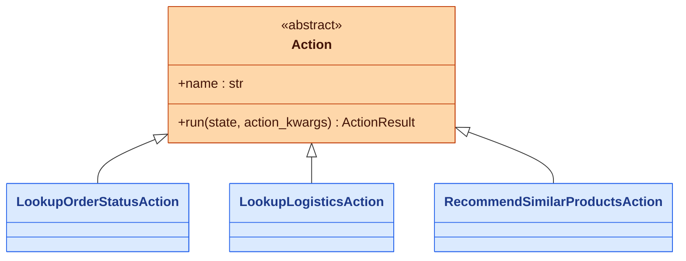

在 `atguigu.task.action.base.py` 模块中定义 `ActionResult` 和 `Action`：

```python
from abc import ABC, abstractmethod
from dataclasses import dataclass, field
from typing import Any

from atguigu.domain.state import DialogueState


@dataclass
class ActionResult:
    slot_updates: dict[str, Any] = field(default_factory=dict)


class Action(ABC):
    name: str

    @abstractmethod
    async def run(
        self,
        state: DialogueState,
        action_kwargs: dict[str, Any],
    ) -> ActionResult:
        pass
```

`Action` 对自定义 Action 规定了以下内容：

| 约定 | 作用 |
|------|------|
| `name` | 为每个自定义 Action 提供唯一标识。 |
| `run()` | 为所有自定义 Action 提供统一执行入口。 |
| `ActionResult` | 为所有自定义 Action 提供统一返回结果。 |

`run()` 从 `DialogueState` 读取当前任务数据，通过 `action_kwargs` 接收 Flow 中配置的固定参数，再使用 `ActionResult.slot_updates` 返回需要写回任务的数据。

#### 5.3.4.2 编写自定义 Action

有了统一的扩展规范，业务开发者就可以按照以下步骤增加新的 Action：

1. 定义 `Action` 子类。
2. 声明唯一的 `name`。
3. 实现 `run()` 方法。
4. 使用 `ActionResult` 返回业务数据。

以订单状态查询为例，具体代码如下：

```python
from typing import Any

from atguigu.clients.http_client import get_http_client
from atguigu.conf.config import settings
from atguigu.domain.state import DialogueState
from atguigu.task.action.base import Action, ActionResult


class LookupOrderStatusAction(Action):
    name = "action_lookup_order_status"

    async def run(
        self,
        state: DialogueState,
        action_kwargs: dict[str, Any],
    ) -> ActionResult:
        order_number = state.tasks.active.slots.get(
            "order_number"
        )
        url = (
            f"{settings.commerce_api_base_url}"
            f"/orders/{order_number}"
        )
        response = await get_http_client().get(url)
        payload = response.json()["data"]

        return ActionResult(slot_updates={
            "order_status": (
                payload.get("status_desc")
                or payload.get("status")
                or "未知"
            ),
            "order_summary": (
                f"订单金额 ¥{payload['amount']}。"
            ),
        })
```

#### 5.3.4.3 注册自定义 Action

自定义 Action 编写完成后，还需要让系统知道它的存在，也就是需要向系统注册。`ActionRegistry` 负责注册自定义Action。在 `atguigu.task.action.registry.py` 模块中定义 `ActionRegistry`：

```python
from atguigu.task.action.base import Action


class ActionRegistry:
    def __init__(self) -> None:
        self._actions: dict[str, Action] = {}

    def register(self, action: Action) -> None:
        self._actions[action.name] = action

    def get(self, name: str) -> Action:
        return self._actions[name]
```

`ActionRegistry.register()` 使用 Action 的 `name` 保存实例，`get()` 根据名称返回已经注册的 Action。

`ActionRegistry`最直接的用法是逐个创建并注册自定义 Action：

```python
registry = ActionRegistry()
registry.register(LookupOrderStatusAction())
registry.register(LookupLogisticsAction())
```

但是，这种方式要求每增加一个自定义 Action，都要修改构建代码。

为了让自定义 Action 与组装代码保持独立，项目将它们统一放在 `atguigu.task.action.custom` 包中，并在构建阶段自动完成以下过程：

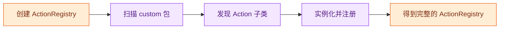

在 `atguigu.task.action.builder.py` 模块中定义 `register_custom_actions()`：

```python
import importlib
import inspect
import pkgutil

from atguigu.task.action.base import Action
from atguigu.task.action.registry import ActionRegistry


def register_custom_actions(
    registry: ActionRegistry,
) -> None:
    package = importlib.import_module(
        "atguigu.task.action.custom"
    )

    for _, module_name, is_package in pkgutil.iter_modules(
        package.__path__,
        prefix=f"{package.__name__}.",
    ):
        if is_package:
            continue

        module = importlib.import_module(module_name)
        for _, action_class in inspect.getmembers(
            module,
            inspect.isclass,
        ):
            if (
                not issubclass(action_class, Action)
                or action_class is Action
            ):
                continue
            if action_class.__module__ != module.__name__:
                continue
            registry.register(action_class())
```

`register_custom_actions()` 先导入 `custom` 包，再依次导入包中的模块。每个模块中符合条件的 Action 子类都会被实例化，并注册到 `ActionRegistry`。扫描只在构建阶段执行一次，因此新增业务 Action 时，只需要在 `custom` 包中定义 Action 子类，不需要修改注册代码。

> [!NOTE]
>
> **技术说明：Python 类的自动发现**
>
> Python 的自动发现机制通常用于插件系统、命令发现和任务发现。它的目标是：将一个实现类放入约定的包中后，程序能够自动找到这个类、创建实例并完成注册，而不需要逐个编写导入语句。
>
> 假设项目具有以下结构：
>
> ```text
> my_app/
>   plugin_base.py
>   plugins/
>     __init__.py
>     send_email.py
>     export_file.py
> ```
>
> 在 Python 中，一个 `.py` 文件称为模块，包含 `__init__.py` 的目录称为包。因此，`my_app.plugins` 是包，`my_app.plugins.send_email` 和 `my_app.plugins.export_file` 是完整模块名。
>
> 自动发现首先需要在运行时导入目标包。`importlib.import_module()` 接收模块名称字符串，并返回导入后的模块对象：
>
> ```python
> import importlib
> 
> package = importlib.import_module("my_app.plugins")
> ```
>
> 普通 `import` 语句要求在编写代码时确定模块名，动态导入则允许模块名来自配置或扫描结果。导入包以后，可以使用两个特殊属性：
>
> | 属性               | 说明                                           |
> | ------------------ | ---------------------------------------------- |
> | `package.__name__` | 包的完整名称，例如 `my_app.plugins`。          |
> | `package.__path__` | 包的搜索路径，包扫描工具通过它查找包中的模块。 |
>
> `pkgutil.iter_modules()` 可以扫描指定路径中的模块：
>
> ```python
> import pkgutil
> 
> for finder, module_name, is_package in pkgutil.iter_modules(
>     package.__path__,
>     prefix=f"{package.__name__}.",
> ):
>     print(finder, module_name, is_package)
> ```
>
> 每次扫描返回三个值：
>
> | 返回值        | 说明                                                      |
> | ------------- | --------------------------------------------------------- |
> | `finder`      | 模块查找器，知道如何在指定路径中找到模块。                |
> | `module_name` | 模块名称。设置 `prefix` 后得到可以直接导入的完整模块名。  |
> | `is_package`  | 当前结果是否为包，`True` 表示子包，`False` 表示普通模块。 |
>
> 如果只需要扫描当前包中的普通模块，可以忽略 `finder` 并跳过子包：
>
> ```python
> for _, module_name, is_package in pkgutil.iter_modules(
>     package.__path__,
>     prefix=f"{package.__name__}.",
> ):
>     if is_package:
>         continue
> 
>     module = importlib.import_module(module_name)
> ```
>
> 由于配置了 `prefix`，`module_name` 的值类似于 `my_app.plugins.send_email`，可以直接交给 `importlib.import_module()`。
>
> 模块导入后，可以使用 `inspect.getmembers()` 查看其中的成员。第二个参数传入 `inspect.isclass` 后，只会返回类：
>
> ```python
> import inspect
> 
> for class_name, candidate in inspect.getmembers(
>     module,
>     inspect.isclass,
> ):
>     print(class_name, candidate)
> ```
>
> `inspect.getmembers()` 每次返回成员名称和成员对象。成员名称是字符串，成员对象是实际的类，可以继续用于继承关系判断和实例化。
>
> 假设所有插件都继承自 `BasePlugin`，可以使用 `issubclass()` 筛选实现类：
>
> ```python
> if not issubclass(candidate, BasePlugin):
>     continue
> if candidate is BasePlugin:
>     continue
> ```
>
> 第一项判断只保留 `BasePlugin` 的子类，第二项判断排除抽象父类本身。由于前面已经使用 `inspect.isclass` 过滤成员，因此这里的 `candidate` 一定是类，可以直接传给 `issubclass()`。
>
> `inspect.getmembers()` 不仅会返回当前模块中定义的类，也会返回该模块从其他位置导入的类。每个类的 `__module__` 属性记录了它实际定义所在的模块，因此可以继续过滤：
>
> ```python
> if candidate.__module__ != module.__name__:
>     continue
> ```
>
> 只有当类的 `__module__` 与当前模块的 `__name__` 相同时，这个类才是直接定义在当前模块中的类。
>
> 将以上步骤组合后，可以得到一段通用的自动发现与注册代码：
>
> ```python
> import importlib
> import inspect
> import pkgutil
> 
> 
> def discover_and_register(
>     package_name: str,
>     base_class: type,
>     registry,
> ) -> None:
>     package = importlib.import_module(package_name)
> 
>     for _, module_name, is_package in pkgutil.iter_modules(
>         package.__path__,
>         prefix=f"{package.__name__}.",
>     ):
>         if is_package:
>             continue
> 
>         module = importlib.import_module(module_name)
>         for _, candidate in inspect.getmembers(
>             module,
>             inspect.isclass,
>         ):
>             if (
>                 not issubclass(candidate, base_class)
>                 or candidate is base_class
>             ):
>                 continue
>             if candidate.__module__ != module.__name__:
>                 continue
> 
>             registry.register(candidate())
> ```
>
> 调用时只需要提供待扫描的包名、实现类必须继承的父类，以及负责保存实例的注册表：
>
> ```python
> discover_and_register(
>     package_name="my_app.plugins",
>     base_class=BasePlugin,
>     registry=plugin_registry,
> )
> ```
>
> 这段代码要求实现类能够通过无参数构造函数创建实例。完整过程可以概括为：导入目标包、扫描包中模块、动态导入模块、查找目标子类、过滤外部导入类，最后实例化并注册。

#### 5.3.4.4 执行自定义 Action

完成自动注册后，`ActionRegistry` 中已经保存了所有自定义 Action。接下来使用 `ActionRunner` 统一执行 Action。`ActionRunner` 根据 Action 名称从注册表中取得实例，调用它的 `run()` 方法，再将 `ActionResult` 返回给调用方：

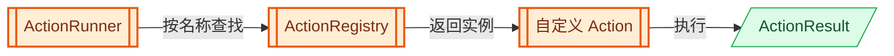

为了完成一次执行，`ActionRunner` 需要知道两个信息：执行哪个 Action，以及本次调用携带哪些固定参数。项目使用 `ActionCall` 将这两个信息组织成一次 Action 调用：

| 概念 | 表示什么 |
|------|----------|
| `Action` | 一个可以执行的业务操作。 |
| `ActionCall` | 对某个 Action 发起的一次调用。 |

在 `atguigu.task.action.runner.py` 模块中定义 `ActionCall`：

```python
from dataclasses import dataclass, field
from typing import Any


@dataclass
class ActionCall:
    action_name: str
    action_kwargs: dict[str, Any] = field(
        default_factory=dict
    )
```

`action_name` 指定需要执行的 Action，`action_kwargs` 保存 Flow 配置中的固定参数。

继续在该模块中定义 `ActionRunner`：

```python
from atguigu.domain.state import DialogueState
from atguigu.task.action.base import ActionResult
from atguigu.task.action.registry import ActionRegistry


class ActionRunner:
    def __init__(self, registry: ActionRegistry) -> None:
        self.registry = registry

    async def run(
        self,
        action_call: ActionCall,
        state: DialogueState,
    ) -> ActionResult:
        action = self.registry.get(action_call.action_name)
        return await action.run(
            state,
            action_call.action_kwargs,
        )
```

`ActionRunner.run()` 先使用 `ActionCall.action_name` 从注册表中取得自定义 Action，再将 `state` 和 `ActionCall.action_kwargs` 传给该 Action 的 `run()` 方法。自定义 Action 返回的 `ActionResult` 会直接交还给调用方。

使用 `ActionRunner` 时，先创建 `ActionCall`，再连同当前的 `DialogueState` 一起传给 `run()`：

```python
action_call = ActionCall(
    action_name="action_lookup_order_status",
    action_kwargs={},
)
result = await action_runner.run(action_call, state)
```

`ActionRunner` 定义完成后，继续在 `atguigu.task.action.builder.py` 模块中补充导入并定义 `build_action_runner()`：

```python
from atguigu.task.action.runner import ActionRunner


def build_action_runner() -> ActionRunner:
    registry = ActionRegistry()
    register_custom_actions(registry)
    return ActionRunner(registry)
```

`build_action_runner()` 先创建注册表并自动注册所有自定义 Action，再使用该注册表创建 `ActionRunner`。

#### 5.3.4.5 实现action Step处理逻辑

先在 `atguigu.task.flow.executor.py` 模块的 `FlowExecutor` 的构造函数中增加 `action_runner`：

```python
def __init__(
    self,
    action_runner: ActionRunner,
    response_renderer: ResponseRenderer,
    condition_evaluator: ConditionEvaluator,
    max_steps_per_turn: int = 100,
) -> None:
    self.action_runner = action_runner
    self.response_renderer = response_renderer
    self.condition_evaluator = condition_evaluator
    self.max_steps_per_turn = max_steps_per_turn
```

然后将 `run_task()` 中的 `ActionFlowStep` 分支替换为：

```python
if isinstance(step, ActionFlowStep):
    action_call = ActionCall(
        action_name=step.action,
        action_kwargs=step.args,
    )
    result = await self.action_runner.run(
        action_call,
        state,
    )
    state.tasks.set_slots(result.slot_updates)
    self._advance(step, state)
    continue
```

action 分支按照以下顺序处理：

1. 将 Step 中的 `action` 和 `args` 转换为 `ActionCall`。
2. 将 `ActionCall` 交给 `ActionRunner`。
3. 根据名称找到并执行已经注册的自定义 Action。
4. 将 `ActionResult.slot_updates` 写入活动任务。
5. 调用 `_advance()` 进入下一个 Step。
6. 通过 `continue` 继续主循环。

至此，从编写自定义 Action、自动发现注册，到 Flow 按名称执行 Action 的完整扩展链路已经实现。

### 5.3.5 处理 end Step

将 `run_task()` 中 `EndFlowStep` 分支替换为：

```python
if isinstance(step, EndFlowStep):
    state.tasks.complete_active()
    return messages
```

`end` Step 调用 `TaskState.complete_active()` 将 `active` 置空，然后立即返回已经累计的 `messages`。暂停任务不受影响，之后仍然可以通过 `resume_task` 恢复。

此时首次需要完成活动任务，因此在 `atguigu.domain.task.py` 模块的 `TaskState` 类中添加 `complete_active()` 方法：

```python
def complete_active(self) -> None:
    self.active = None
```

# 第6章 实现 TaskHandler

`CommandProcessor`、`TaskLifecycleResponder` 和 `FlowExecutor` 已经实现完成。`TaskHandler` 将这些组件组织起来，作为任务处理的统一入口。具体处理逻辑如下：

在 `atguigu.task.handler.py` 模块中定义完整的 `TaskHandler`：

```python
from atguigu.domain.messages import BotMessage, UserMessage
from atguigu.domain.state import DialogueState
from atguigu.task.command.models import Command
from atguigu.task.command.processor import CommandProcessor
from atguigu.task.flow.executor import FlowExecutor
from atguigu.task.flow.models import FlowCatalog
from atguigu.task.lifecycle.responder import TaskLifecycleResponder


class TaskHandler:
    def __init__(
        self,
        command_processor: CommandProcessor,
        flows: FlowCatalog,
        flow_executor: FlowExecutor,
        lifecycle_responder: TaskLifecycleResponder,
    ) -> None:
        self.command_processor = command_processor
        self.flows = flows
        self.flow_executor = flow_executor
        self.lifecycle_responder = lifecycle_responder

    async def handle(
        self,
        commands: list[Command],
        state: DialogueState,
        user_message: UserMessage,
    ) -> list[BotMessage]:
        events = self.command_processor.run(
            commands,
            state,
            self.flows,
        )
        messages = self.lifecycle_responder.respond(events)
        messages.extend(
            await self.flow_executor.run_task(
                state,
                self.flows,
                user_message,
            )
        )
        return messages
```

构造函数保存四项依赖：

| 属性 | 类型 | 说明 |
|------|------|------|
| `command_processor` | `CommandProcessor` | 执行本轮 Commands，更新任务状态。 |
| `flows` | `FlowCatalog` | 提供任务对应的 Flow 配置。 |
| `flow_executor` | `FlowExecutor` | 推进当前活动任务。 |
| `lifecycle_responder` | `TaskLifecycleResponder` | 将任务生命周期事件转换为状态提示。 |

`handle()` 按照以下顺序组织一次任务处理：

1. 使用 `CommandProcessor` 执行本轮 Commands，得到 `TaskEvent` 列表。
2. 使用 `TaskLifecycleResponder` 将这些事件转换为任务状态提示。
3. 使用 `FlowExecutor` 推进 Commands 执行后处于活动状态的任务。
4. 将 Flow 产生的消息追加到任务状态提示之后。
5. 返回本轮产生的全部消息。
