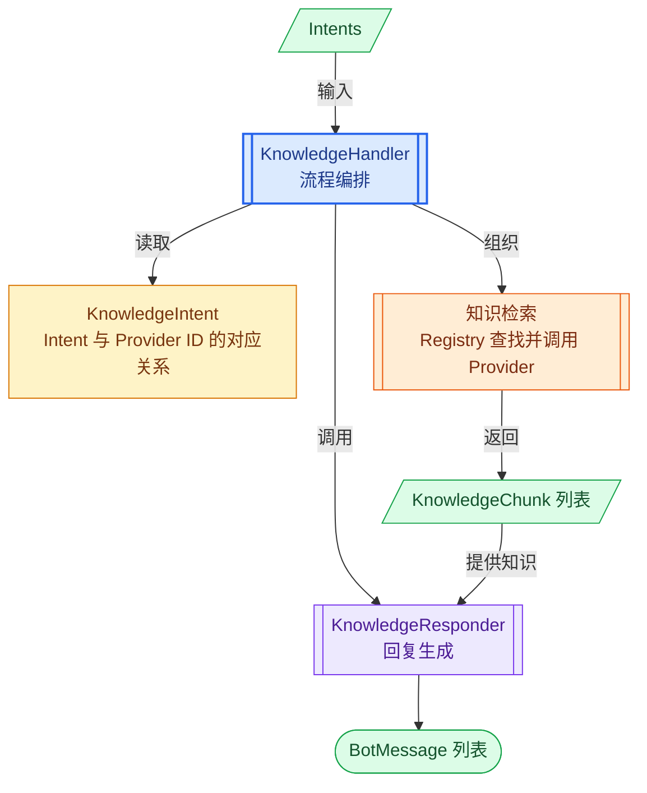
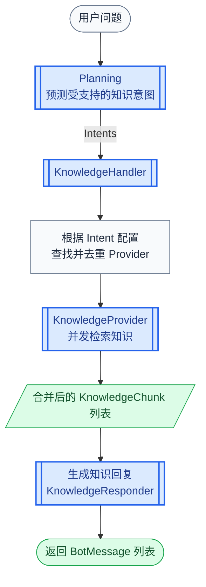
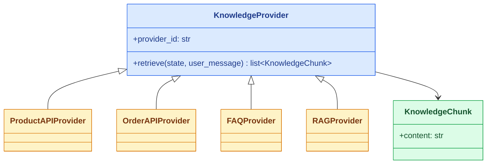
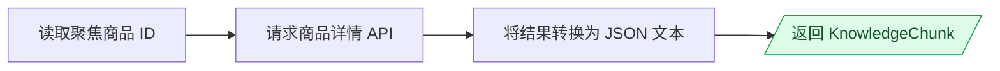
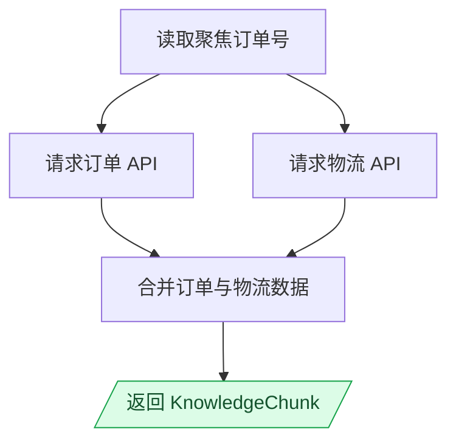
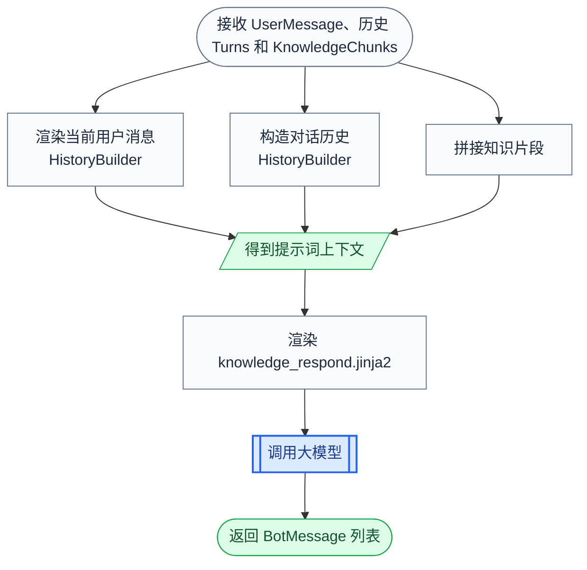

# 第1章 KnowledgeHandler 设计

## 1.1 核心思路

`KnowledgeHandler` 负责处理知识检索型对话。它的核心思路非常直接：先根据用户问题检索相关知识，再由大模型根据这些知识生成回复。

```text
用户问题
    ↓
检索相关知识
    ↓
LLM 根据知识生成回复
```

## 1.2 电商场景中的知识来源

在电商客服场景中，用户需要查询的知识并不都保存在同一个地方。

用户可能询问商品价格、库存、商品详情，也可能询问订单状态和物流进度。这些信息会随业务状态实时变化，检索时需要根据当前商品 ID 或订单号调用相应的业务 API。

除此之外，用户还会咨询退款政策、退货条件、配送规则等相对稳定的知识。这些内容可以从已有 FAQ 中查找，也可以从文档知识库中检索相关片段。

不同知识的来源和检索方式如下：

| 知识 | 来源 | 检索依据 |
|------|------|----------|
| 商品信息、订单信息 | 商品 API、订单 API | 商品ID或者订单ID。 |
| 常见政策问题 | FAQ | 当前用户问题。 |
| 平台规则和文档知识 | 文档知识库 | 当前用户问题。 |

这些来源的访问方式和返回格式并不相同。为了封装这些差异，项目为不同知识来源提供不同的 `KnowledgeProvider`：

| 知识来源 | Provider |
|----------|----------|
| 商品 API | `ProductAPIProvider` |
| 订单 API | `OrderAPIProvider` |
| FAQ | `FAQProvider` |
| 文档知识库 | `RAGProvider` |

每个 Provider 只负责一类知识的获取。商品和订单 Provider 根据 `state` 中的聚焦对象调用业务 API，FAQ 和 RAG Provider 则可以根据 `user_message` 检索与当前问题相关的内容。

虽然内部实现不同，但所有 Provider 都遵循相同的调用约定：

```text
retrieve(state, user_message) -> list[KnowledgeChunk]
```

`KnowledgeChunk` 使用统一形式保存检索结果。这样，`KnowledgeHandler` 可以用同一种方式调用所有 Provider，不需要了解具体知识来自 API、FAQ 还是文档知识库。

## 1.3 整体设计

不同 Provider 解决了如何访问知识来源的问题，但程序还需要确定当前问题应该交给哪些 Provider。

为此，项目预先定义系统支持的 `KnowledgeIntent`。在 Planning 阶段，LLM 根据用户问题预测一个或多个受支持的知识意图。每个 `KnowledgeIntent` 又通过 `provider_ids` 绑定负责提供相关知识的 Provider：

```text
product_info  ->  api.product
order_info    ->  api.order
refund_policy ->  faq.default、rag.default
```

Planning 只需要判断用户希望查询哪类知识，不需要了解具体 API 或知识库的调用方式。`KnowledgeHandler` 收到 Intent 后，再读取它绑定的 Provider ID，并通过 `KnowledgeProviderRegistry` 找到对应的 Provider 对象。

因此，完整设计包含以下对象：

| 对象 | 作用 |
|------|------|
| `KnowledgeIntent` | 描述知识意图，并配置该意图需要使用的 Provider ID。 |
| `KnowledgeProviderRegistry` | 保存 Provider，并根据 Provider ID 返回对应对象。 |
| `KnowledgeProvider` | 访问具体知识来源，返回统一的知识片段。 |
| `KnowledgeChunk` | 保存一段可以提供给大模型的知识内容。 |
| `KnowledgeResponder` | 根据知识片段、对话历史和当前问题调用大模型生成回复。 |
| `KnowledgeHandler` | 组织 Provider 选择、知识检索和回复生成。 |

Planning 负责输出 Intent ID，不属于 `KnowledgeHandler` 的内部组件。`KnowledgeHandler` 内部各个对象之间的关系如下：



Planning 通过 `KnowledgeIntent` 了解系统支持哪些知识意图；`KnowledgeIntent` 又将每个意图与 Provider 关联起来。Registry 避免在 Handler 中编写 Provider 类型判断；Provider 屏蔽不同知识来源的访问差异；`KnowledgeChunk` 则将知识检索与回复生成分开。最终，`KnowledgeHandler` 只保留稳定的流程编排逻辑。

## 1.4 完整处理流程

理解知识检索和回复生成的设计后，最后通过一轮完整处理过程将各个部分串联起来：



完整过程如下：

1. Planning 阶段的 LLM 根据用户问题，从系统支持的 `KnowledgeIntent` 中预测本轮 Intents。
2. `DialogueEngine` 将校验通过的 Intents、当前 `DialogueState` 和 `UserMessage` 交给 `KnowledgeHandler`。
3. `KnowledgeHandler` 读取每个 `KnowledgeIntent` 的 `provider_ids`，合并后进行去重。
4. `KnowledgeProviderRegistry` 根据每个 Provider ID 找到对应的 Provider 对象。
5. `KnowledgeHandler` 并发调用这些 Provider 的 `retrieve(state, user_message)`。
6. 每个 Provider 访问自己的知识来源，并将结果转换为 `list[KnowledgeChunk]`。
7. `KnowledgeHandler` 将各个 Provider 返回的列表合并成一个 `KnowledgeChunk` 列表。
8. `KnowledgeResponder` 结合知识片段、对话历史和当前用户消息调用大模型。
9. 大模型生成的文本被包装成 `BotMessage` 列表并返回。

以 `product_info` 为例，Intent 配置将它指向 `api.product`；注册表根据该 ID 找到 `ProductAPIProvider`；Provider 使用当前聚焦商品的 ID 查询商品 API，并返回商品信息片段；最后由 `KnowledgeResponder` 将商品信息组织成用户可以直接理解的回复。

## 1.5 实现顺序

后续按照 `KnowledgeHandler` 的依赖关系逐步实现：

| 章节 | 实现内容 |
|------|----------|
| 第 2 章 | 定义统一的知识检索接口，并实现 API、FAQ 和 RAG 等知识来源。 |
| 第 3 章 | 定义知识意图，建立 Intent、Provider ID 与 Provider 对象之间的对应关系。 |
| 第 4 章 | 实现 `KnowledgeResponder`，根据检索结果生成回复。 |
| 第 5 章 | 组装各个组件并实现 `KnowledgeHandler`。 |

# 第2章 实现知识来源

不同知识来源具有不同的访问方式，但都要向 `KnowledgeHandler` 返回统一的检索结果。本章先定义所有知识来源共同遵循的接口，再分别实现 API、FAQ 和 RAG Provider。

## 2.1 整体结构

所有知识来源都实现统一的 `KnowledgeProvider` 接口，并使用唯一的 `provider_id` 标识。检索得到的内容统一包装成 `KnowledgeChunk`，再交给后续组件处理。



`KnowledgeProvider` 规定统一的知识检索方式，`KnowledgeChunk` 统一检索结果。商品、订单、FAQ 和 RAG Provider 分别实现接口，并负责访问自己的知识来源。

## 2.2 定义 KnowledgeProvider

在 `app.knowledge.providers.py` 模块中定义 `KnowledgeChunk` 和 `KnowledgeProvider`：

```python
from abc import ABC, abstractmethod
from dataclasses import dataclass

from app.domain.messages import UserMessage
from app.domain.state import DialogueState


@dataclass
class KnowledgeChunk:
    content: str


class KnowledgeProvider(ABC):
    provider_id = ""

    @abstractmethod
    async def retrieve(
        self,
        state: DialogueState,
        user_message: UserMessage,
    ) -> list[KnowledgeChunk]:
        pass
```

`KnowledgeChunk.content` 保存可以直接提供给大模型的知识文本。一个 Provider 可以返回多个知识片段，也可以返回空列表。

`KnowledgeProvider` 规定了所有知识来源需要遵循的两个约定：

| 约定 | 说明 |
|------|------|
| `provider_id` | Provider 的唯一标识，需要与 `KnowledgeIntent.provider_ids` 中的值一致。 |
| `retrieve()` | 根据当前状态和用户消息检索知识，并返回 `list[KnowledgeChunk]`。 |

`ABC` 表示抽象基类，`@abstractmethod` 表示子类必须实现的方法。只要 Provider 子类没有实现 `retrieve()`，就不能创建该子类的实例。

## 2.3 实现商品 API Provider

商品信息来自商城提供的商品 API。`ProductAPIProvider` 从当前聚焦对象中取得商品 ID，请求商品详情，并将接口结果转换为知识片段。

处理过程如下：



继续在 `app.knowledge.providers.py` 模块中补充导入：

```python
import json
from typing import Any

from app.clients import http_client
from app.conf.config import settings
```

然后定义 `ProductAPIProvider`：

```python
class ProductAPIProvider(KnowledgeProvider):
    provider_id = "api.product"

    async def retrieve(
        self,
        state: DialogueState,
        user_message: UserMessage,
    ) -> list[KnowledgeChunk]:
        product_id = state.shared.focused_object.id
        data: dict[str, Any] = (
            await self._get_product_info_by_id(product_id)
        )
        text = json.dumps(
            data,
            ensure_ascii=False,
            indent=2,
        )
        return [
            KnowledgeChunk(content=f"商品信息:\n{text}")
        ]

    async def _get_product_info_by_id(
        self,
        product_id: str,
    ) -> dict[str, Any]:
        url = (
            f"{settings.commerce_api_base_url}"
            f"/products/{product_id}"
        )
        response = await http_client.http_client.get(url)
        return response.json()["data"]
```

`ProductAPIProvider` 根据当前聚焦商品执行查询，因此调用它之前，`state.shared.focused_object` 中需要已经保存当前商品。知识意图对聚焦对象的要求将在下一章配置。

`_get_product_info_by_id()` 负责调用商城接口，`retrieve()` 负责将业务数据转换成知识文本。接口返回的数据使用 JSON 表示，可以完整保留商品数据的字段结构。

## 2.4 实现订单 API Provider

订单信息咨询同时需要订单数据和物流数据。两个接口之间没有依赖关系，因此可以同时发送请求。



继续在 `app.knowledge.providers.py` 模块中补充导入：

```python
import asyncio
```

然后定义 `OrderAPIProvider`：

```python
class OrderAPIProvider(KnowledgeProvider):
    provider_id = "api.order"

    async def retrieve(
        self,
        state: DialogueState,
        user_message: UserMessage,
    ) -> list[KnowledgeChunk]:
        focused_object = state.shared.focused_object
        order_number = focused_object.id

        order_payload, logistics_payload = (
            await asyncio.gather(
                self._fetch_order(order_number),
                self._fetch_logistics(order_number),
            )
        )

        content = json.dumps(
            {
                "order_number": order_number,
                "order": order_payload,
                "logistics": logistics_payload,
            },
            ensure_ascii=False,
            indent=2,
        )
        return [
            KnowledgeChunk(
                content=f"订单与物流信息：\n{content}"
            )
        ]

    async def _fetch_order(
        self,
        order_number: str,
    ) -> dict[str, Any]:
        url = (
            f"{settings.commerce_api_base_url}"
            f"/orders/{order_number}"
        )
        response = await http_client.http_client.get(url)
        return response.json()["data"]

    async def _fetch_logistics(
        self,
        order_number: str,
    ) -> dict[str, Any]:
        url = (
            f"{settings.commerce_api_base_url}"
            f"/orders/{order_number}/logistics"
        )
        response = await http_client.http_client.get(url)
        return response.json().get("data", {})
```

`asyncio.gather()` 接收多个协程，并等待它们全部执行完成。这里的订单请求和物流请求可以在同一段等待时间内推进，返回结果的顺序与传入协程的顺序一致，因此可以分别赋值给 `order_payload` 和 `logistics_payload`。

## 2.5 实现 FAQ 和 RAG Provider

FAQ 和 RAG 分别表示标准问答库与文档知识库。当前先提供能够参与完整处理流程的基础实现，后续可以在 `retrieve()` 中根据 `user_message` 接入具体的 FAQ 查询或向量检索逻辑。

继续在 `app.knowledge.providers.py` 模块中定义：

```python
class FAQProvider(KnowledgeProvider):
    provider_id = "faq.default"

    async def retrieve(
        self,
        state: DialogueState,
        user_message: UserMessage,
    ) -> list[KnowledgeChunk]:
        return [
            KnowledgeChunk(content="未检索到相关问题")
        ]


class RAGProvider(KnowledgeProvider):
    provider_id = "rag.default"

    async def retrieve(
        self,
        state: DialogueState,
        user_message: UserMessage,
    ) -> list[KnowledgeChunk]:
        return [
            KnowledgeChunk(content="未检索到相关信息")
        ]
```

四个 Provider 都遵循相同的接口，`KnowledgeHandler` 可以用同一种方式调用它们。

至此，商品、订单、FAQ 和 RAG 都已经通过统一的 Provider 接口接入知识检索过程。

# 第3章 定义知识意图

具体 Provider 已经实现完成。下面定义系统支持的知识意图，通过 Provider ID 建立 Intent 与知识来源之间的对应关系，再使用注册表将 Provider ID 转换为 Provider 对象。

## 3.1 定义 KnowledgeIntent

以商品信息咨询为例，Planning 模块可以输出：

```json
{
  "intents": ["product_info"]
}
```

`product_info` 只是一个稳定的意图标识。程序还需要知道它对应商品 API，并且必须具备一个商品对象。这些信息由 `KnowledgeIntent` 统一描述。

在 `app.knowledge.intents.py` 模块中定义 `KnowledgeIntent`：

```python
from dataclasses import dataclass, field


@dataclass
class KnowledgeIntent:
    id: str
    description: str
    provider_ids: list[str] = field(default_factory=list)
    requires_object: str | None = None
```

各个属性的含义如下：

| 属性 | 说明 |
|------|------|
| `id` | 知识意图的唯一标识。 |
| `description` | 知识意图的自然语言说明，供 Planning 模块理解其含义。 |
| `provider_ids` | 处理该意图时需要访问的 Provider ID。 |
| `requires_object` | 该意图依赖的对象类型；不依赖对象时为 `None`。 |

`requires_object` 用于表达意图对上下文的要求。例如，`product_info` 需要一个商品对象，`order_info` 需要一个订单对象，而退货政策不依赖某个具体商品或订单。

## 3.2 配置知识意图

继续在 `app.knowledge.intents.py` 模块中定义系统支持的知识意图：

```python
KNOWLEDGE_INTENTS: dict[str, KnowledgeIntent] = {
    "product_info": KnowledgeIntent(
        id="product_info",
        description="商品信息咨询",
        provider_ids=["api.product"],
        requires_object="product",
    ),
    "order_info": KnowledgeIntent(
        id="order_info",
        description="订单信息咨询",
        provider_ids=["api.order"],
        requires_object="order",
    ),
    "refund_policy": KnowledgeIntent(
        id="refund_policy",
        description="退款政策咨询",
        provider_ids=["faq.default", "rag.default"],
    ),
    "return_policy": KnowledgeIntent(
        id="return_policy",
        description="退货政策咨询",
        provider_ids=["faq.default", "rag.default"],
    ),
    "shipping_policy": KnowledgeIntent(
        id="shipping_policy",
        description="配送政策咨询",
        provider_ids=["faq.default", "rag.default"],
    ),
    "platform_rule": KnowledgeIntent(
        id="platform_rule",
        description="平台规则咨询",
        provider_ids=["rag.default"],
    ),
    "general_ecommerce_info": KnowledgeIntent(
        id="general_ecommerce_info",
        description="电商通用信息咨询",
        provider_ids=["faq.default", "rag.default"],
    ),
}
```

系统支持的知识意图及其知识来源如下：

| Intent ID | Provider ID | 依赖对象 |
|-----------|-------------|----------|
| `product_info` | `api.product` | `product` |
| `order_info` | `api.order` | `order` |
| `refund_policy` | `faq.default`、`rag.default` | 无 |
| `return_policy` | `faq.default`、`rag.default` | 无 |
| `shipping_policy` | `faq.default`、`rag.default` | 无 |
| `platform_rule` | `rag.default` | 无 |
| `general_ecommerce_info` | `faq.default`、`rag.default` | 无 |

`KNOWLEDGE_INTENTS` 使用 Intent ID 作为键。Planning 模块通过这些配置了解系统支持的知识意图，`KnowledgeHandler` 则根据预测得到的 Intent ID 读取其 `provider_ids`。

## 3.3 实现 Provider 注册表

知识意图使用字符串形式的 Provider ID 配置知识来源。程序实际执行检索时，还需要根据 Provider ID 找到对应的 Provider 对象：

```text
Provider ID  ->  KnowledgeProvider 对象
```

`KnowledgeProviderRegistry` 负责维护这一映射。在 `app.knowledge.registry.py` 模块中定义：

```python
from app.knowledge.providers import KnowledgeProvider


class KnowledgeProviderRegistry:
    def __init__(
        self,
        providers: list[KnowledgeProvider],
    ) -> None:
        self._providers_by_id = {
            provider.provider_id: provider
            for provider in providers
        }

    def get(
        self,
        provider_id: str,
    ) -> KnowledgeProvider:
        return self._providers_by_id[provider_id]
```

构造注册表时，Provider 列表被转换成以 `provider_id` 为键的字典。调用方按照 Provider 一定存在处理，因此 `get()` 直接返回对应对象。

# 第4章 生成知识回复

Provider 返回的是供程序使用的知识片段，还不是可以直接发送给用户的客服消息。`KnowledgeResponder` 负责将知识片段、历史消息和当前问题交给大模型，生成自然语言回复。

## 4.1 整体过程

`KnowledgeResponder` 的处理过程如下：



`HistoryBuilder` 已经在上一文档中实现。文本消息会去除首尾空白，Object 消息会转换为单行 JSON；多轮历史则按照 `USER` 和 `BOT` 的顺序组成文本。

## 4.2 定义提示词

在 `app.prompts.jinja2.knowledge_respond.jinja2` 中编写知识回复提示词：

```jinja2
你是一个中文电商客服助手，语气自然、友好、简洁。

以下是与用户问题相关的商品或业务信息，请优先基于这些内容作答：
{{ knowledge_content }}

要求：
- 只根据已知信息作答，不要编造不存在的内容。
- 如果信息不足，坦诚告知并引导用户提供更多细节。
- 语气自然，不要机械复述资料原文。

对话历史：
{{ history }}

用户当前问题：{{ user_message }}

助手回复：
```

提示词使用三个变量：

| 变量 | 内容 |
|------|------|
| `knowledge_content` | 本轮检索到的全部知识片段。 |
| `history` | 当前 Session 中已经完成的历史对话。 |
| `user_message` | 当前用户消息。 |

知识内容和历史消息都可能为空，因此使用 Jinja2 的 `` 按需输出对应部分。当前用户问题始终保留，使大模型明确本轮需要回答的内容。

## 4.3 加载提示词

提示词保存在单独的 Jinja2 文件中，`KnowledgeResponder` 需要先读取文件内容，再使用 `PromptTemplate` 进行处理。

在 `app.prompts.prompt_loader.py` 模块中定义 `load_prompt()`：

```python
from pathlib import Path


def load_prompt(file_name: str) -> str:
    prompt_path = (
        Path(__file__).parent
        / "jinja2"
        / f"{file_name}.jinja2"
    )
    return prompt_path.read_text(encoding="utf-8")
```

`Path(__file__).parent` 表示 `prompt_loader.py` 所在的 `prompts` 目录。在 `Path` 对象之间使用 `/` 可以逐层拼接路径，因此传入：

```python
load_prompt("knowledge_respond")
```

最终读取的是 `prompts` 目录下 `jinja2` 中的 `knowledge_respond.jinja2`。`read_text(encoding="utf-8")` 以 UTF-8 编码读取文件，并返回完整的提示词字符串。

不同组件只需要传入提示词名称，就可以使用同一个方法加载对应的 Jinja2 文件。

## 4.4 实现 KnowledgeResponder

在 `app.knowledge.responder.py` 模块中定义 `KnowledgeResponder`：

```python
from langchain_core.output_parsers import StrOutputParser
from langchain_core.prompts import PromptTemplate

from app.clients.llm import llm
from app.domain.messages import BotMessage, UserMessage
from app.domain.state import Turn
from app.knowledge.providers import KnowledgeChunk
from app.prompts.history_builder import HistoryBuilder
from app.prompts.prompt_loader import load_prompt


class KnowledgeResponder:
    async def respond(
        self,
        user_message: UserMessage,
        recent_turns: list[Turn],
        chunks: list[KnowledgeChunk],
    ) -> list[BotMessage]:
        user_message = HistoryBuilder.render_user_message(
            user_message
        )
        history = HistoryBuilder.build(recent_turns)
        knowledge_content = "\n\n".join(
            chunk.content for chunk in chunks
        )

        prompt_text = load_prompt("knowledge_respond")
        prompt = PromptTemplate.from_template(
            prompt_text,
            template_format="jinja2",
        )
        chain = prompt | llm | StrOutputParser()

        response = await chain.ainvoke({
            "user_message": user_message,
            "history": history,
            "knowledge_content": knowledge_content,
        })

        return [BotMessage(text=response)]
```

`respond()` 首先准备提示词所需的三个变量。多个知识片段之间使用两个换行符分隔，避免不同来源的内容连在一起。

随后使用 `load_prompt()` 加载提示词，通过 `PromptTemplate`、大模型和 `StrOutputParser` 构造 Chain。`StrOutputParser` 将大模型输出转换为字符串，最后再包装成 `BotMessage` 列表，与其他对话处理组件保持相同的返回类型。

# 第5章 实现 KnowledgeHandler

知识意图、知识来源和回复组件都已经实现完成。现在使用这些组件实现 `KnowledgeHandler`，作为知识检索型对话的统一入口。

## 5.1 定义 KnowledgeHandler

在 `app.knowledge.handler.py` 模块中定义 `KnowledgeHandler`，先通过构造函数接收它所需的三个依赖：

```python
import asyncio

from app.domain.messages import BotMessage, UserMessage
from app.domain.state import DialogueState
from app.knowledge.intents import KnowledgeIntent
from app.knowledge.registry import (
    KnowledgeProviderRegistry,
)
from app.knowledge.responder import KnowledgeResponder


class KnowledgeHandler:
    def __init__(
        self,
        knowledge_intents: dict[str, KnowledgeIntent],
        provider_registry: KnowledgeProviderRegistry,
        knowledge_responder: KnowledgeResponder,
    ) -> None:
        self.knowledge_intents = knowledge_intents
        self.provider_registry = provider_registry
        self.knowledge_responder = knowledge_responder
```

三个属性分别保存知识意图配置、Provider 注册表和回复生成组件：

| 属性 | 作用 |
|------|------|
| `knowledge_intents` | 根据 Intent ID 取得知识意图配置。 |
| `provider_registry` | 根据 Provider ID 取得具体知识来源。 |
| `knowledge_responder` | 根据检索结果生成最终回复。 |

## 5.2 实现 handle

继续在 `KnowledgeHandler` 类中添加 `handle()` 方法，自顶向下组织一次完整的知识检索：

```python
async def handle(
    self,
    intents: list[str],
    state: DialogueState,
    user_message: UserMessage,
) -> list[BotMessage]:
    provider_ids = self._get_provider_ids_by_intents(
        intents
    )

    retrieve_coroutines = [
        self.provider_registry.get(provider_id).retrieve(
            state,
            user_message,
        )
        for provider_id in provider_ids
    ]
    provider_chunks = await asyncio.gather(
        *retrieve_coroutines
    )
    chunks = [
        chunk
        for current_chunks in provider_chunks
        for chunk in current_chunks
    ]

    return await self.knowledge_responder.respond(
        user_message=user_message,
        recent_turns=state.shared.current_session.turns,
        chunks=chunks,
    )
```

`handle()` 与第 1 章的整体流程一致：

1. `_get_provider_ids_by_intents()` 根据 Intents 取得去重后的 Provider ID。
2. 使用列表推导式为每个 Provider 构造 `retrieve()` 协程。
3. 使用 `asyncio.gather()` 并发执行所有协程。
4. 每个 Provider 返回一个 `list[KnowledgeChunk]`，列表推导式将这些列表展开为一个列表。
5. `KnowledgeResponder` 使用当前消息、当前 Session 中的历史 Turns 和知识片段生成回复。

假设两个 Provider 分别返回：

```python
provider_chunks = [
    [KnowledgeChunk(content="FAQ 内容")],
    [KnowledgeChunk(content="RAG 内容")],
]
```

展开后得到：

```python
chunks = [
    KnowledgeChunk(content="FAQ 内容"),
    KnowledgeChunk(content="RAG 内容"),
]
```

`DialogueEngine` 在调用 `KnowledgeHandler` 之前已经准备好当前 Session，因此这里可以直接读取 `state.shared.current_session.turns`。

## 5.3 根据 Intent 选择 Provider

`handle()` 已经描述了完整处理过程，最后补充其中使用的 `_get_provider_ids_by_intents()`：

```python
def _get_provider_ids_by_intents(
    self,
    intents: list[str],
) -> list[str]:
    provider_ids: list[str] = []
    for intent in intents:
        provider_ids.extend(
            self.knowledge_intents[intent].provider_ids
        )
    return list(set(provider_ids))
```

该方法先合并所有 Intent 配置的 `provider_ids`，再使用 `set()` 去除重复值，最后使用 `list()` 转回列表。

例如：

```python
intents = ["refund_policy", "return_policy"]
```

两个 Intent 都配置了 `faq.default` 和 `rag.default`。合并后虽然会出现重复值，最终只会保留两个不同的 Provider ID：

```python
["faq.default", "rag.default"]
```

至此，`KnowledgeHandler` 可以根据 Planning 模块输出的知识意图选择知识来源，并发取得知识片段，再生成本轮知识回复。
