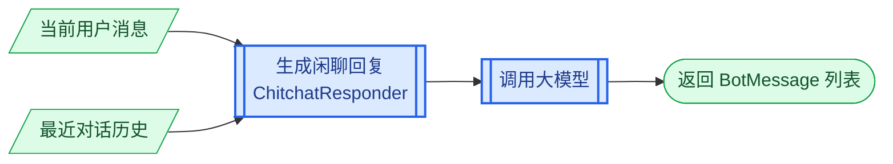

# 第1章 ChitchatHandler 设计

## 1.1 核心思路

`ChitchatHandler` 负责处理问候、寒暄和简单社交对话。它结合当前用户消息和最近的对话历史，由大模型直接生成自然语言回复。

```text
当前用户消息 + 最近对话历史
              ↓
          LLM 生成回复
```

## 1.2 处理过程

一轮闲聊的处理过程如下：



`DialogueEngine` 将当前状态和用户消息交给 `ChitchatHandler`。`ChitchatHandler` 从当前 Session 中取得最近的 Turns，再由 `ChitchatResponder` 构造提示词、调用大模型，并将生成的文本包装成 `BotMessage` 列表。

如果当前存在活动任务，`DialogueEngine` 会在进入闲聊处理前暂停该任务。本轮记录也由 `DialogueEngine` 在得到回复后统一提交，这些都不属于 `ChitchatHandler` 的职责。

## 1.3 实现顺序

后续从闲聊入口开始，逐层向下实现：

| 章节 | 实现内容 |
|------|----------|
| 第 2 章 | 实现 `ChitchatHandler`，建立闲聊处理入口。 |
| 第 3 章 | 定义闲聊提示词并实现 `ChitchatResponder`。 |

# 第2章 实现 ChitchatHandler

按照自顶向下的顺序，先从闲聊模块对外提供的入口开始实现。

`ChitchatHandler.handle()` 接收当前对话状态和用户消息。它不直接调用大模型，而是从当前 Session 中取得最近的对话历史，再将历史和当前消息交给 `ChitchatResponder`。

在 `atguigu.chitchat.handler.py` 模块中定义 `ChitchatHandler`：

```python
from atguigu.chitchat.responder import ChitchatResponder
from atguigu.domain.messages import BotMessage, UserMessage
from atguigu.domain.state import DialogueState


class ChitchatHandler:
    def __init__(
        self,
        responder: ChitchatResponder,
    ) -> None:
        self.responder = responder

    async def handle(
        self,
        state: DialogueState,
        user_message: UserMessage,
    ) -> list[BotMessage]:
        recent_turns = state.shared.current_session.turns
        return await self.responder.respond(
            user_message=user_message,
            recent_turns=recent_turns,
        )
```

构造方法接收 `ChitchatResponder`，并将它保存到 `responder` 属性。`ChitchatHandler` 只依赖 Responder 对外提供的 `respond()`，不负责创建或配置大模型调用过程。

`handle()` 按照以下顺序处理闲聊消息：

1. 从 `state.shared.current_session` 中取得当前 Session。
2. 读取 Session 中已经完成的 `turns`。
3. 将当前用户消息和历史 Turns 交给 `ChitchatResponder.respond()`。
4. 返回 Responder 生成的 `BotMessage` 列表。

当前轮次尚未提交到 Session，因此 `recent_turns` 只包含本轮之前已经完成的对话。当前用户消息通过 `user_message` 单独传入，不会在历史中重复出现。

至此，闲聊处理的入口已经建立完成。下面继续实现 `ChitchatResponder`，解决如何根据当前消息和历史对话生成回复的问题。

# 第3章 实现 ChitchatResponder

`ChitchatResponder` 负责准备提示词、调用大模型，并将生成的文本转换为客服消息。

## 3.1 定义闲聊提示词

调用大模型之前，首先需要定义闲聊回复的内容和规则。

在 `atguigu.prompts.jinja2.chitchat_respond.jinja2` 中编写提示词：

```jinja2
你是一个中文电商客服助手，语气自然、友好、简洁。

请直接回复用户最后一句话。

要求：
- 如果用户是在打招呼，就自然地回一句中文问候。
- 如果用户问你是谁或你叫什么，就说明你是"Atguigu 电商助手"。
- 如果用户问的是基于最近对话的简单社交问题，也直接自然回答。
- 不要主动切回业务办理，除非用户明确提出电商诉求。


对话历史：
{{ history }}


用户最后一句：{{ user_message }}

助手回复：
```

提示词先定义客服助手的身份和表达风格，再规定几类常见闲聊的处理方式。为了结合当前消息和对话上下文生成回复，模板使用以下两个变量：

| 变量 | 内容 |
|------|------|
| `user_message` | 当前用户消息。 |
| `history` | 当前 Session 中已经完成的历史对话。 |

`history` 可能为空，因此使用 `` 控制是否输出“对话历史”部分。`user_message` 始终保留，因为它是本轮需要回答的内容。

明确提示词所需的变量后，下面准备这两个变量。

## 3.2 准备提示词变量

`ChitchatResponder.respond()` 接收 `user_message` 和 `recent_turns`：

| 参数 | 类型 | 作用 |
|------|------|------|
| `user_message` | `UserMessage` | 当前需要回复的用户消息。 |
| `recent_turns` | `list[Turn]` | 当前 Session 中已经完成的历史轮次。 |

这两个参数需要通过 `HistoryBuilder` 转换为适合写入提示词的文本：

```python
user_message = HistoryBuilder.render_user_message(
    user_message
)
history = HistoryBuilder.build(recent_turns)
```

`render_user_message()` 将当前用户消息转换为文本，得到模板中的 `user_message`；`build()` 按照 `USER`、`BOT` 的顺序组织历史 Turns，得到模板中的 `history`。

当前 Session 没有已完成的历史轮次时，`history` 为空字符串，提示词中的条件判断会省略整个对话历史部分。

## 3.3 实现 respond()

提示词及其变量都已经准备完成。`load_prompt()` 已经在前文中实现，这里直接使用它加载闲聊提示词。现在在 `atguigu.chitchat.responder.py` 模块中定义 `ChitchatResponder`：

```python
from langchain_core.output_parsers import StrOutputParser
from langchain_core.prompts import PromptTemplate

from atguigu.clients.llm import llm
from atguigu.domain.messages import BotMessage, UserMessage
from atguigu.domain.state import Turn
from atguigu.prompts.history_builder import HistoryBuilder
from atguigu.prompts.prompt_loader import load_prompt


class ChitchatResponder:

    async def respond(
        self,
        user_message: UserMessage,
        recent_turns: list[Turn],
    ) -> list[BotMessage]:
        user_message = HistoryBuilder.render_user_message(
            user_message
        )
        history = HistoryBuilder.build(recent_turns)

        prompt_text = load_prompt("chitchat_respond")
        prompt = PromptTemplate.from_template(
            prompt_text,
            template_format="jinja2",
        )
        chain = prompt | llm | StrOutputParser()

        response = await chain.ainvoke({
            "user_message": user_message,
            "history": history,
        })
        return [BotMessage(text=response)]
```

`respond()` 按照代码中的顺序完成以下工作：

1. 使用 `HistoryBuilder` 准备 `user_message` 和 `history`。
2. 使用 `load_prompt()` 加载 `chitchat_respond.jinja2`。
3. 使用 `PromptTemplate`、大模型和 `StrOutputParser` 构造 Chain。
4. 将两个模板变量传入 Chain，并异步调用大模型。
5. 将大模型返回的字符串包装成 `BotMessage` 列表。

`StrOutputParser` 将大模型输出转换为普通字符串。返回值使用 `list[BotMessage]`，与任务处理、知识检索和澄清处理保持相同的回复类型。

至此，`ChitchatHandler` 可以接收 `DialogueEngine` 分配的闲聊消息，并通过 `ChitchatResponder` 生成本轮回复。
