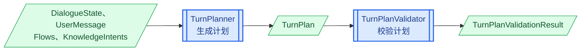
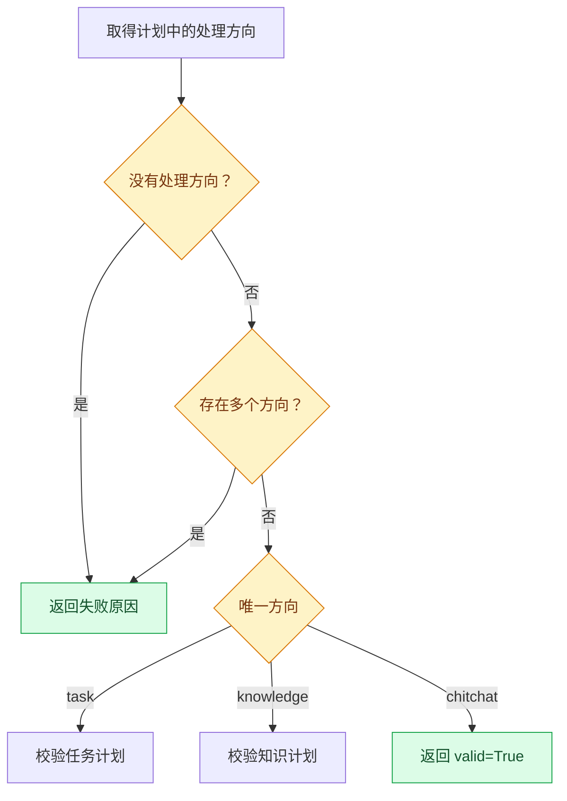

# 第1章 Planning 模块设计

## 1.1 核心思路

Planning 模块负责理解文本消息，并形成本轮处理计划。它的处理过程分为两个阶段：

1. `TurnPlanner` 结合当前消息、对话状态和系统能力，调用大模型生成 `TurnPlan`。
2. `TurnPlanValidator` 使用确定性规则检查该计划能否在当前状态下执行。

`TurnPlanner` 负责理解用户真实表达的意图。用户在一句话中表达多个方向时，Planner 可以将这些方向都记录下来。`TurnPlanValidator` 再根据系统的执行规则进行检查：只有一个明确且可执行的方向才能通过校验，其余情况需要进一步澄清。

将计划生成和计划校验分开，可以让大模型专注于自然语言理解，让普通代码负责系统能力和状态约束。

## 1.2 整体过程

Planning 模块的整体处理过程如下：



`TurnPlanner` 生成的计划包含任务、知识检索和闲聊三个方向：

| 计划内容 | 含义 | 后续处理组件 |
|----------|------|--------------|
| `task.commands` | 本轮需要执行的任务命令。 | `TaskHandler` |
| `knowledge.intents` | 本轮需要查询的知识意图。 | `KnowledgeHandler` |
| `chitchat` | 本轮属于闲聊。 | `ChitchatHandler` |

`TurnPlanValidator` 不执行这些计划，也不生成回复。它只返回计划是否有效以及无效原因。`DialogueEngine` 根据校验结果决定执行计划，或者将失败原因交给 `ClarifyResponder`。

## 1.3 实现顺序

后续按照 Planning 模块的处理顺序逐步实现：

| 章节 | 实现内容 |
|------|----------|
| 第 2 章 | 实现 `TurnPlanner`，生成本轮处理计划。 |
| 第 3 章 | 实现 `TurnPlanValidator`，校验计划能否执行。 |

# 第2章 实现 TurnPlanner

`TurnPlanner.predict()` 是计划生成的入口。下面先实现入口方法，再沿着入口使用的内容，依次定义计划模型、Planning 提示词、提示词输入和大模型调用过程。

## 2.1 实现计划生成入口

在 `app.plan.turn_planner.py` 模块中编写导入，并定义 `TurnPlanner`：

```python
import json
from dataclasses import asdict
from typing import Any

from langchain_core.output_parsers import JsonOutputParser
from langchain_core.prompts import PromptTemplate

from app.clients.llm import llm
from app.domain.messages import UserMessage
from app.domain.state import DialogueState
from app.knowledge.intents import KnowledgeIntent
from app.plan.models import TurnPlan
from app.prompts.history_builder import HistoryBuilder
from app.prompts.prompt_loader import load_prompt
from app.task.flow.models import Flow, FlowCatalog


class TurnPlanner:
    async def predict(
        self,
        state: DialogueState,
        user_message: UserMessage,
        flows: FlowCatalog,
        knowledge_intents: dict[str, KnowledgeIntent],
    ) -> TurnPlan:
        prompt_inputs = self._build_prompt_inputs(
            state,
            user_message,
            flows,
            knowledge_intents,
        )
        return await self._predict_from_prompt_inputs(
            prompt_inputs
        )
```

`predict()` 接收以下信息：

| 参数 | 作用 |
|------|------|
| `state` | 提供历史对话、任务状态和当前聚焦对象。 |
| `user_message` | 提供本轮需要理解的用户消息。 |
| `flows` | 提供系统支持的任务及其描述。 |
| `knowledge_intents` | 提供系统支持的知识意图及其描述。 |

入口方法将计划生成分为两步：

1. `_build_prompt_inputs()` 将这些信息转换为提示词变量。
2. `_predict_from_prompt_inputs()` 调用大模型，并返回 `TurnPlan`。

继续实现这两个方法之前，先定义 `predict()` 的返回值。

## 2.2 定义 TurnPlan

### 2.2.1 计划结构

`TurnPlan` 使用 `task`、`knowledge` 和 `chitchat` 三个字段表示本轮识别到的处理方向：

```json
{
  "task": null,
  "knowledge": null,
  "chitchat": null
}
```

任务方向使用 `commands` 保存需要执行的 Command：

```json
{
  "task": {
    "commands": [
      {
        "command": "start_flow",
        "flow": "refund_request"
      }
    ]
  },
  "knowledge": null,
  "chitchat": null
}
```

知识检索方向使用 `intents` 保存需要查询的知识意图：

```json
{
  "task": null,
  "knowledge": {
    "intents": ["refund_policy"]
  },
  "chitchat": null
}
```

闲聊方向不需要额外信息，使用一个空对象表示：

```json
{
  "task": null,
  "knowledge": null,
  "chitchat": {}
}
```

如果用户在一句话中表达多个方向，Planner 可以同时记录这些方向。例如：

```json
{
  "task": {
    "commands": [
      {
        "command": "start_flow",
        "flow": "refund_request"
      }
    ]
  },
  "knowledge": {
    "intents": ["shipping_policy"]
  },
  "chitchat": null
}
```

这类计划完整保留了用户表达的内容，但无法由当前引擎在一轮中同时执行，后续会由 `TurnPlanValidator` 返回需要澄清的原因。

### 2.2.2 定义计划模型

在 `app.plan.models.py` 模块中定义与 JSON 结构对应的模型：

```python
from dataclasses import dataclass, field

from app.task.command.models import Command


@dataclass
class TaskTurnPlan:
    commands: list[Command] = field(default_factory=list)

    @classmethod
    def from_dict(cls, data: dict) -> "TaskTurnPlan":
        return cls(
            commands=[
                Command.from_dict(command)
                for command in data["commands"]
            ]
        )


@dataclass
class KnowledgeTurnPlan:
    intents: list[str] = field(default_factory=list)

    @classmethod
    def from_dict(
        cls,
        data: dict,
    ) -> "KnowledgeTurnPlan":
        return cls(intents=data["intents"])


@dataclass
class ChitchatTurnPlan:
    pass


@dataclass
class TurnPlan:
    task: TaskTurnPlan | None = None
    knowledge: KnowledgeTurnPlan | None = None
    chitchat: ChitchatTurnPlan | None = None

    @classmethod
    def from_dict(cls, data: dict) -> "TurnPlan":
        return cls(
            task=(
                TaskTurnPlan.from_dict(data["task"])
                if data.get("task") is not None
                else None
            ),
            knowledge=(
                KnowledgeTurnPlan.from_dict(data["knowledge"])
                if data.get("knowledge") is not None
                else None
            ),
            chitchat=(
                ChitchatTurnPlan()
                if data.get("chitchat") is not None
                else None
            ),
        )
```

各个模型与计划字段的对应关系如下：

| 模型 | 对应内容 |
|------|----------|
| `TaskTurnPlan` | `task` 对象，其中包含 Command 列表。 |
| `KnowledgeTurnPlan` | `knowledge` 对象，其中包含 Intent ID 列表。 |
| `ChitchatTurnPlan` | `chitchat` 对象，当前不包含额外属性。 |
| `TurnPlan` | 完整的本轮处理计划。 |

`JsonOutputParser` 会将大模型输出的 JSON 转换为字典。`TurnPlan.from_dict()` 再根据三个字段是否为空，构造对应的计划模型。

任务计划中的每个 Command 仍然是字典，因此 `TaskTurnPlan.from_dict()` 使用前文实现的 `Command.from_dict()`，将它们转换为具体的 Command 对象。

## 2.3 定义 Planning 提示词

`TurnPlanner` 需要告诉大模型可以输出什么计划、系统支持哪些能力，以及当前对话处于什么状态。

在 `app.prompts.jinja2.turn_plan.jinja2` 中编写提示词：

````jinja2
## 任务说明
你的任务是分析当前对话上下文，并生成一个 TurnPlan JSON。

TurnPlan 顶层只允许以下三个字段：
- `task`
- `knowledge`
- `chitchat`

规则：
- 这三个字段的值必须是 JSON 对象或 null。
- 请根据用户真实表达的意图生成结果。
- 如果用户同时表达了多个意图，可以同时填写多个轨道。
- 后续执行引擎一次只能处理一个轨道；如果你输出多个轨道，系统会再向用户澄清先处理哪一个。
- 不要输出额外字段。
- 只输出合法 JSON，不要输出 markdown。
- 最终答案只能是 JSON 文本本身，不要使用 Markdown 代码块包裹，例如以三个反引号和 json 开头的结构。

---

## Task 结构
当用户是在办理业务时，填写 `task`：

Task 对象示例：
{
  "commands": [
    {"command": "start_flow", "flow": "<flow_id>"},
    {"command": "resume_task", "task_id": "<paused_task_id>"},
    {"command": "cancel_task", "task_id": "<task_id>"},
    {"command": "set_slots", "slots": {"<slot_name>": "<value>"}}
  ]
}

仅允许以下 task commands：
- `start_flow`
- `resume_task`
- `cancel_task`
- `set_slots`

可用 flows：
{{ available_flows_json }}

规则：
- 开始新任务使用 `start_flow` 和可用的 flow id。
- 恢复暂停任务必须使用 Interrupted Tasks 中真实存在的 `task_id`。
- 取消任务必须使用 Active Task 或 Interrupted Tasks 中真实存在的 `task_id`。
- 用户提供当前任务所需信息时使用 `set_slots`。

---

## Knowledge 结构
当用户是在咨询信息时，填写 `knowledge`：

Knowledge 对象示例：
{
  "intents": ["<intent>"]
}

允许的 intent（从下列选项中选择，可以选择一个或多个）：
{{ knowledge_intents_json }}

---

## Chitchat 结构
当用户是在闲聊时，填写 `chitchat`：

Chitchat 对象示例：
{}

---

## 当前状态

### Active Task
{{ active_task_json }}

### Interrupted Tasks
{{ interrupted_tasks_json }}

### Focused Object
{{ focused_object_json }}

---

## 对话历史
{{ current_conversation }}

---

## 当前任务
请根据用户最后一句话生成 TurnPlan：
"""{{ user_message }}"""

TurnPlan 只允许输出以下形状：

{
  "task": null,
  "knowledge": null,
  "chitchat": null
}

请根据用户真实意图，把对应字段替换成对象；没有命中的字段保持 null。

不要输出解释。
不要使用 markdown 代码块。
你的 TurnPlan：
````

提示词中的变量可以分为三类：

| 类型 | 变量 | 作用 |
|------|------|------|
| 当前对话 | `current_conversation`、`user_message` | 理解当前消息及其对话上下文。 |
| 当前状态 | `active_task_json`、`interrupted_tasks_json`、`focused_object_json` | 判断用户是否在继续、恢复或取消任务，以及当前关注的对象。 |
| 系统能力 | `available_flows_json`、`knowledge_intents_json` | 限定可以生成的任务和知识意图。 |

提示词先定义 `TurnPlan` 的输出结构，再分别说明三个处理方向允许包含的内容。当前状态和系统能力都由程序动态传入，使 Planner 可以结合每一轮的真实上下文生成计划。

## 2.4 构造提示词输入

提示词已经确定，因此可以根据其中的变量实现 `_build_prompt_inputs()`。继续在 `TurnPlanner` 类中添加：

```python
def _build_prompt_inputs(
    self,
    state: DialogueState,
    user_message: UserMessage,
    flows: FlowCatalog,
    knowledge_intents: dict[str, KnowledgeIntent],
) -> dict[str, Any]:
    rendered_user_message = (
        HistoryBuilder.render_user_message(user_message)
    )
    history = HistoryBuilder.build(
        state.shared.current_session.turns
    )
    active_task = state.tasks.active
    focused_object = state.shared.focused_object
    available_flows: list[Flow] = list(
        flows.flows.values()
    )

    return {
        "current_conversation": history,
        "user_message": rendered_user_message,
        "available_flows_json": json.dumps(
            {
                "flows": [
                    {
                        key: value
                        for key, value in asdict(flow).items()
                        if key != "steps"
                    }
                    for flow in available_flows
                ]
            },
            ensure_ascii=False,
        ),
        "active_task_json": json.dumps(
            (
                asdict(active_task)
                if active_task is not None
                else None
            ),
            ensure_ascii=False,
        ),
        "interrupted_tasks_json": json.dumps(
            [
                asdict(task)
                for task in state.tasks.paused
            ],
            ensure_ascii=False,
        ),
        "focused_object_json": json.dumps(
            (
                asdict(focused_object)
                if focused_object is not None
                else None
            ),
            ensure_ascii=False,
        ),
        "knowledge_intents_json": json.dumps(
            [
                {
                    "id": intent.id,
                    "description": intent.description,
                }
                for intent in knowledge_intents.values()
            ],
            ensure_ascii=False,
        ),
    }
```

各个变量的构造方式如下：

| 变量 | 构造方式 |
|------|----------|
| `current_conversation` | 使用 `HistoryBuilder` 将当前 Session 的 Turns 转换为历史文本。 |
| `user_message` | 使用 `HistoryBuilder` 将当前用户消息转换为文本。 |
| `available_flows_json` | 将所有 Flow 转换为 JSON，并去掉 Planning 不需要的 `steps`。 |
| `active_task_json` | 将当前活动任务转换为 JSON；没有活动任务时为 `null`。 |
| `interrupted_tasks_json` | 将所有暂停任务转换为 JSON 数组。 |
| `focused_object_json` | 将当前聚焦对象转换为 JSON；没有聚焦对象时为 `null`。 |
| `knowledge_intents_json` | 只保留每个知识意图的 ID 和说明。 |

Planning 只需要知道系统支持哪些任务，不需要了解任务内部每个 Step 的执行细节。因此，`available_flows_json` 在转换 Flow 时排除了 `steps`。

`asdict()` 将 dataclass 对象递归转换为字典，`json.dumps()` 再将字典或列表转换为 JSON 字符串。设置 `ensure_ascii=False` 后，中文内容会直接保留在 JSON 中。

## 2.5 调用大模型

提示词输入准备完成后，继续在 `TurnPlanner` 类中添加 `_predict_from_prompt_inputs()`：

```python
async def _predict_from_prompt_inputs(
    self,
    prompt_inputs: dict[str, Any],
) -> TurnPlan:
    prompt_text = load_prompt("turn_plan")
    prompt = PromptTemplate.from_template(
        prompt_text,
        template_format="jinja2",
    )

    chain = prompt | llm | JsonOutputParser()
    llm_output = await chain.ainvoke(prompt_inputs)
    return TurnPlan.from_dict(llm_output)
```

该方法依次完成以下工作：

1. 使用 `load_prompt()` 加载 `turn_plan.jinja2`。
2. 使用 `PromptTemplate`、大模型和 `JsonOutputParser` 构造 Chain。
3. 将提示词变量传入 Chain，并异步调用大模型。
4. 使用 `TurnPlan.from_dict()` 将输出字典转换为 `TurnPlan`。

`JsonOutputParser` 要求大模型输出合法 JSON，并将 JSON 文本直接解析为 Python 字典，因此这里不需要再调用 `json.loads()`。

# 第3章 实现 TurnPlanValidator

`TurnPlanner` 已经能够生成 `TurnPlan`，但大模型输出的计划不一定符合当前系统的执行条件。`TurnPlanValidator` 负责在执行前完成确定性校验。

## 3.1 实现校验入口

在 `app.plan.validator.py` 模块中编写导入，并定义 `TurnPlanValidator`：

```python
from app.domain.state import DialogueState
from app.knowledge.intents import KnowledgeIntent
from app.plan.models import (
    ClarifyReason,
    TurnPlan,
    TurnPlanValidationResult,
)
from app.task.command.models import (
    CancelTaskCommand,
    ResumeTaskCommand,
    SetSlotsCommand,
    StartFlowCommand,
)
from app.task.flow.models import FlowCatalog


class TurnPlanValidator:
    def validate(
        self,
        turn_plan: TurnPlan,
        state: DialogueState,
        flows: FlowCatalog,
        knowledge_intents: dict[str, KnowledgeIntent],
    ) -> TurnPlanValidationResult:
        active_tracks = self._active_tracks(turn_plan)
        if not active_tracks:
            return self._reject(
                ClarifyReason.MISSING_TRACK
            )
        if len(active_tracks) > 1:
            return self._reject(
                ClarifyReason.MULTIPLE_TRACKS
            )

        track = active_tracks[0]
        if track == "task":
            return self._validate_task(
                turn_plan,
                state,
                flows,
            )
        if track == "knowledge":
            return self._validate_knowledge(
                turn_plan,
                state,
                knowledge_intents,
            )
        return TurnPlanValidationResult(valid=True)
```

`validate()` 首先确定计划命中了哪些方向，再按照以下规则处理：



任务和知识计划还需要结合当前状态与系统能力进行校验；闲聊计划不包含额外内容，因此可以直接通过。

入口代码使用了校验结果和失败原因，下面先定义这两个模型。

## 3.2 定义校验结果

继续在 `app.plan.models.py` 模块中补充导入：

```python
from enum import Enum
```

然后定义 `ClarifyReason` 和 `TurnPlanValidationResult`：

```python
class ClarifyReason(str, Enum):
    MISSING_TRACK = "missing_track"
    MULTIPLE_TRACKS = "multiple_tracks"
    MISSING_TASK_COMMANDS = "missing_task_commands"
    MISSING_KNOWLEDGE_INTENT = "missing_knowledge_intent"
    MISSING_FOCUSED_OBJECT = "missing_focused_object"
    OBJECT_REQUIRES_INTENT = "object_requires_intent"
    INVALID_TASK_COMMAND = "invalid_task_command"
    UNKNOWN_KNOWLEDGE_INTENT = (
        "unknown_knowledge_intent"
    )


@dataclass
class TurnPlanValidationResult:
    valid: bool
    reason: ClarifyReason | None = None
```

`TurnPlanValidationResult.valid` 表示计划是否可以执行；校验失败时，`reason` 保存具体原因：

| 原因 | 含义 |
|------|------|
| `MISSING_TRACK` | 三个处理方向都为空。 |
| `MULTIPLE_TRACKS` | 同时识别出多个处理方向。 |
| `MISSING_TASK_COMMANDS` | 任务计划中没有 Command。 |
| `MISSING_KNOWLEDGE_INTENT` | 知识计划中没有 Intent。 |
| `MISSING_FOCUSED_OBJECT` | 知识意图所需的聚焦对象不存在或类型不匹配。 |
| `INVALID_TASK_COMMAND` | Command 无法在当前任务状态下执行。 |
| `UNKNOWN_KNOWLEDGE_INTENT` | Intent 不属于系统支持的知识意图。 |
| `OBJECT_REQUIRES_INTENT` | 用户只提供了对象，还没有说明希望执行的操作。 |

`OBJECT_REQUIRES_INTENT` 用于对象消息的处理，不由 `TurnPlanValidator` 返回。它与其他失败原因统一定义，后续可以由 `ClarifyResponder` 使用同一种方式生成澄清回复。

## 3.3 识别处理方向

`validate()` 使用 `_active_tracks()` 找出计划中所有不为空的处理方向。继续在 `TurnPlanValidator` 类中添加：

```python
@staticmethod
def _active_tracks(turn_plan: TurnPlan) -> list[str]:
    return [
        name
        for name, value in (
            ("task", turn_plan.task),
            ("knowledge", turn_plan.knowledge),
            ("chitchat", turn_plan.chitchat),
        )
        if value is not None
    ]
```

例如，一个计划同时包含 `task` 和 `knowledge` 时，该方法返回：

```python
["task", "knowledge"]
```

校验失败时，入口方法通过 `_reject()` 构造统一的失败结果。继续添加：

```python
@staticmethod
def _reject(
    reason: ClarifyReason,
) -> TurnPlanValidationResult:
    return TurnPlanValidationResult(
        valid=False,
        reason=reason,
    )
```

`TurnPlanValidator` 只记录失败原因，不在这里生成面向用户的回复。

## 3.4 校验任务计划

任务计划不仅需要包含 Command，每个 Command 还必须能够按照当前顺序执行。`_validate_task()` 使用任务 ID 模拟执行 Command 时的任务状态变化，但不会修改真正的 `DialogueState`。

继续在 `TurnPlanValidator` 类中添加：

```python
def _validate_task(
    self,
    turn_plan: TurnPlan,
    state: DialogueState,
    flows: FlowCatalog,
) -> TurnPlanValidationResult:
    task_plan = turn_plan.task
    if task_plan is None or not task_plan.commands:
        return self._reject(
            ClarifyReason.MISSING_TASK_COMMANDS
        )

    active_task_id = (
        state.tasks.active.task_id
        if state.tasks.active is not None
        else None
    )
    paused_task_ids = {
        task.task_id
        for task in state.tasks.paused
    }
    new_task_index = 0

    for command in task_plan.commands:
        if isinstance(command, StartFlowCommand):
            if command.flow not in flows.flows:
                return self._reject(
                    ClarifyReason.INVALID_TASK_COMMAND
                )
            if active_task_id is not None:
                paused_task_ids.add(active_task_id)
            new_task_index += 1
            active_task_id = (
                f"<new-task-{new_task_index}>"
            )
        elif isinstance(command, ResumeTaskCommand):
            if command.task_id not in paused_task_ids:
                return self._reject(
                    ClarifyReason.INVALID_TASK_COMMAND
                )
            paused_task_ids.remove(command.task_id)
            if active_task_id is not None:
                paused_task_ids.add(active_task_id)
            active_task_id = command.task_id
        elif isinstance(command, CancelTaskCommand):
            if command.task_id == active_task_id:
                active_task_id = None
            elif command.task_id in paused_task_ids:
                paused_task_ids.remove(command.task_id)
            else:
                return self._reject(
                    ClarifyReason.INVALID_TASK_COMMAND
                )
        elif isinstance(command, SetSlotsCommand):
            if active_task_id is None:
                return self._reject(
                    ClarifyReason.INVALID_TASK_COMMAND
                )
        else:
            return self._reject(
                ClarifyReason.INVALID_TASK_COMMAND
            )

    return TurnPlanValidationResult(valid=True)
```

各类 Command 的校验和模拟结果如下：

| Command | 校验条件 | 模拟后的任务状态 |
|---------|----------|------------------|
| `start_flow` | Flow ID 必须存在。 | 原活动任务进入暂停集合，新任务成为活动任务。 |
| `resume_task` | Task ID 必须属于暂停任务。 | 原活动任务进入暂停集合，目标任务成为活动任务。 |
| `cancel_task` | Task ID 必须属于活动任务或暂停任务。 | 从对应位置移除目标任务。 |
| `set_slots` | 当前必须存在活动任务。 | 任务关系不变。 |

新任务还没有真实的 Task ID，因此校验过程中使用 `<new-task-1>`、`<new-task-2>` 等临时值表示。临时值只用于判断后续 Command 是否具备活动任务，不会写入对话状态。

按照 Command 顺序模拟任务变化，可以校验同一计划中相互依赖的操作。例如，`start_flow` 后可以继续执行 `set_slots`；取消当前活动任务后，再执行 `set_slots` 则无法通过校验。

## 3.5 校验知识计划

知识计划需要检查 Intent 是否存在，以及 Intent 所需的聚焦对象是否已经具备。继续在 `TurnPlanValidator` 类中添加：

```python
def _validate_knowledge(
    self,
    turn_plan: TurnPlan,
    state: DialogueState,
    knowledge_intents: dict[str, KnowledgeIntent],
) -> TurnPlanValidationResult:
    knowledge_plan = turn_plan.knowledge
    if knowledge_plan is None or not knowledge_plan.intents:
        return self._reject(
            ClarifyReason.MISSING_KNOWLEDGE_INTENT
        )

    for intent_id in knowledge_plan.intents:
        intent = knowledge_intents.get(intent_id)
        if intent is None:
            return self._reject(
                ClarifyReason.UNKNOWN_KNOWLEDGE_INTENT
            )

        required_object = intent.requires_object
        focused_object = state.shared.focused_object
        if required_object is not None and (
            focused_object is None
            or focused_object.type != required_object
        ):
            return self._reject(
                ClarifyReason.MISSING_FOCUSED_OBJECT
            )

    return TurnPlanValidationResult(valid=True)
```

每个 Intent 依次经过以下检查：

1. Intent ID 必须存在于 `knowledge_intents`。
2. `requires_object` 为空时，不需要聚焦对象。
3. `requires_object` 不为空时，当前必须存在相同类型的 `focused_object`。

例如，`product_info` 需要 `product` 类型的聚焦对象，`order_info` 需要 `order` 类型的聚焦对象；`refund_policy` 等政策类意图不依赖具体对象，可以直接通过对象检查。

至此，Planning 模块可以根据文本消息生成 `TurnPlan`，并在执行前检查计划的方向、任务 Command、知识 Intent 和上下文条件。
