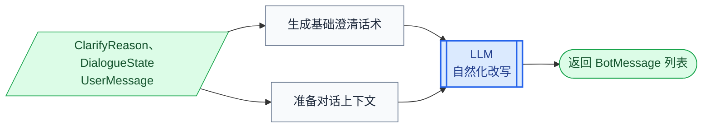

# 第1章 ClarifyResponder 设计

## 1.1 核心思路

`ClarifyResponder` 负责在系统无法直接处理当前消息时，生成一条澄清回复，引导用户补充信息或明确下一步操作。

调用方会传入一个明确的 `ClarifyReason`，`ClarifyResponder` 根据这个原因先生成基础澄清话术，再结合当前对话上下文调用大模型进行自然化改写。

```text
ClarifyReason
      ↓
生成基础澄清话术
      ↓
结合上下文进行改写
      ↓
返回 BotMessage
```

## 1.2 使用场景

`ClarifyResponder` 主要处理两类情况：

| 来源 | 情况 | ClarifyReason 示例 |
|------|------|--------------------|
| `TurnPlanValidator` | 文本消息生成的计划不明确或无法执行。 | `MISSING_TRACK`、`MULTIPLE_TRACKS`、`INVALID_TASK_COMMAND` |
| `DialogueEngine` | 用户发送了对象，但没有说明希望执行的操作。 | `OBJECT_REQUIRES_INTENT` |

`TurnPlanValidator` 和 `DialogueEngine` 只负责确定澄清原因。`ClarifyResponder` 接收原因、当前状态和用户消息，统一生成面向用户的回复。

## 1.3 处理过程

一条澄清回复的生成过程如下：



## 1.4 实现顺序

后续从 `ClarifyResponder.respond()` 的处理过程出发，依次实现：

1. 根据 `ClarifyReason` 生成基础澄清话术。
2. 定义自然化改写所需的提示词。
3. 根据提示词准备上下文变量。
4. 完成 `respond()`，调用大模型并返回客服消息。

# 第2章 实现 ClarifyResponder

`ClarifyResponder.respond()` 接收 `state`、`user_message` 和 `reason`，返回 `list[BotMessage]`。它内部依次完成基础话术生成、上下文准备和大模型改写。

## 2.1 生成基础澄清话术

基础澄清话术由 `build_clarify_message()` 生成。该方法使用普通条件分支，将每个 `ClarifyReason` 转换为一条含义明确的建议回复。

在 `atguigu.clarify.responder.py` 模块中编写导入，并定义 `ClarifyResponder`：

```python
import json
from dataclasses import asdict

from langchain_core.output_parsers import StrOutputParser
from langchain_core.prompts import PromptTemplate

from atguigu.clients.llm import llm
from atguigu.domain.messages import BotMessage, UserMessage
from atguigu.domain.state import DialogueState
from atguigu.plan.models import ClarifyReason
from atguigu.prompts.history_builder import HistoryBuilder
from atguigu.prompts.prompt_loader import load_prompt


class ClarifyResponder:
    def build_clarify_message(
        self,
        reason: ClarifyReason,
        state: DialogueState,
    ) -> str:
        if reason is ClarifyReason.MULTIPLE_TRACKS:
            return (
                "你这次同时提到了多个方向。我们先处理一个，"
                "你想先办业务还是先咨询信息呢？"
            )

        if reason is ClarifyReason.MISSING_FOCUSED_OBJECT:
            return "请先发送你想咨询的对象，我再继续帮你看。"

        if reason is ClarifyReason.MISSING_KNOWLEDGE_INTENT:
            return (
                "你是想了解商品信息、订单信息，"
                "还是售后配送规则呢？"
            )

        if reason is ClarifyReason.MISSING_TRACK:
            return "你是想先处理业务问题，还是先咨询信息呢？"

        if reason is ClarifyReason.MISSING_TASK_COMMANDS:
            return (
                "你这次是想办理什么业务呢？"
                "比如查订单、查物流，或者申请退款。"
            )

        if reason is ClarifyReason.INVALID_TASK_COMMAND:
            return (
                "当前任务状态不支持这个操作，"
                "请告诉我你想开始、继续还是取消哪个任务。"
            )

        if reason is ClarifyReason.UNKNOWN_KNOWLEDGE_INTENT:
            return (
                "我暂时无法识别这个咨询方向，"
                "你可以具体说说想了解的商品、订单或售后问题。"
            )

        if reason is ClarifyReason.OBJECT_REQUIRES_INTENT:
            focused_object = state.shared.focused_object
            if (
                focused_object is not None
                and focused_object.type == "order"
            ):
                return (
                    "我已经收到这个订单了。你想查订单状态、"
                    "查物流，还是申请退款呢？"
                )
            if (
                focused_object is not None
                and focused_object.type == "product"
            ):
                return (
                    "我已经收到这个商品了。你想了解它的商品信息、"
                    "发货情况，还是售后相关问题呢？"
                )

        return (
            "我还需要再确认一下你的意思，"
            "你可以换个更具体的说法告诉我。"
        )
```

大多数澄清原因可以直接映射为固定话术。`OBJECT_REQUIRES_INTENT` 还需要读取当前聚焦对象，因为订单和商品可以执行的操作不同：

| 聚焦对象 | 澄清方向 |
|----------|----------|
| 订单 | 订单状态、物流或退款。 |
| 商品 | 商品信息、发货或售后问题。 |

当原因没有对应分支，或者对象类型不是订单和商品时，方法返回最后的通用澄清话术。

## 2.2 定义改写提示词

基础话术已经明确了需要表达的内容。接下来定义提示词，让大模型结合上下文调整表达方式。

在 `atguigu.prompts.jinja2.clarify_respond.jinja2` 中编写：

```jinja2
你是一个中文电商客服助手，语气自然、友好、简洁。
你的任务是把一条系统澄清提示改写成更自然的一句话，不要扩写，不要新增信息，不要改变澄清意图。

澄清原因：{{ reason }}
建议回复：{{ clarify_message }}

当前聚焦对象：{{ focused_object }}


对话历史：
{{ history }}

用户最后一句：{{ user_message }}

改写后的回复：
```

提示词使用以下变量：

| 变量 | 内容 |
|------|------|
| `reason` | `ClarifyReason` 对应的字符串值。 |
| `clarify_message` | `build_clarify_message()` 生成的基础话术。 |
| `focused_object` | 当前聚焦对象的 JSON；没有聚焦对象时为 `None`。 |
| `history` | 当前 Session 中已经完成的历史对话。 |
| `user_message` | 当前用户消息。 |

`clarify_message` 是大模型改写的核心内容。其余变量用于提供上下文，帮助回复与当前对话自然衔接，但不能改变基础话术表达的澄清目标。

`focused_object` 和 `history` 都可能为空，因此提示词使用 Jinja2 条件判断，只在存在相应内容时输出。

## 2.3 准备提示词变量

提示词已经确定，下面按照模板需要的变量准备数据：

```python
clarify_message = self.build_clarify_message(
    reason=reason,
    state=state,
)
rendered_user_message = (
    HistoryBuilder.render_user_message(user_message)
)
history = HistoryBuilder.build(
    state.shared.current_session.turns
)
focused_object = (
    json.dumps(
        asdict(state.shared.focused_object),
        ensure_ascii=False,
    )
    if state.shared.focused_object is not None
    else None
)
```

各个变量的构造方式如下：

| 变量 | 构造方式 |
|------|----------|
| `clarify_message` | 根据 `reason` 和当前状态生成基础话术。 |
| `rendered_user_message` | 使用 `HistoryBuilder` 将当前用户消息转换为文本。 |
| `history` | 使用 `HistoryBuilder` 将当前 Session 的 Turns 转换为文本。 |
| `focused_object` | 使用 `asdict()` 和 `json.dumps()` 将聚焦对象转换为 JSON。 |

没有聚焦对象时，`focused_object` 直接设置为 `None`。这样 `` 的判断结果为假，提示词不会输出“当前聚焦对象”部分。

## 2.4 实现 respond()

提示词及其变量都已经准备完成。继续在 `ClarifyResponder` 类中添加 `respond()`：

```python
async def respond(
    self,
    state: DialogueState,
    user_message: UserMessage,
    reason: ClarifyReason,
) -> list[BotMessage]:
    clarify_message = self.build_clarify_message(
        reason=reason,
        state=state,
    )
    rendered_user_message = (
        HistoryBuilder.render_user_message(user_message)
    )
    history = HistoryBuilder.build(
        state.shared.current_session.turns
    )
    focused_object = (
        json.dumps(
            asdict(state.shared.focused_object),
            ensure_ascii=False,
        )
        if state.shared.focused_object is not None
        else None
    )

    prompt_text = load_prompt("clarify_respond")
    prompt = PromptTemplate.from_template(
        prompt_text,
        template_format="jinja2",
    )
    chain = prompt | llm | StrOutputParser()

    rewritten = await chain.ainvoke({
        "reason": reason.value,
        "clarify_message": clarify_message,
        "focused_object": focused_object,
        "history": history,
        "user_message": rendered_user_message,
    })

    return [BotMessage(text=rewritten)]
```

`respond()` 按照以下顺序生成澄清回复：

1. 根据 `ClarifyReason` 生成基础澄清话术。
2. 准备当前用户消息、历史对话和聚焦对象。
3. 使用 `load_prompt()` 加载 `clarify_respond.jinja2`。
4. 使用 `PromptTemplate`、大模型和 `StrOutputParser` 构造 Chain。
5. 调用大模型完成自然化改写。
6. 将改写结果包装成 `BotMessage` 列表。

大模型接收到的是完整的基础话术和对话上下文，最终只返回改写后的文本。`ClarifyResponder` 不修改 `DialogueState`，也不决定澄清完成后进入哪个处理方向。用户下一轮提供新的消息后，系统会重新进行消息理解和计划生成。
