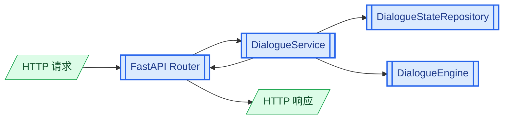
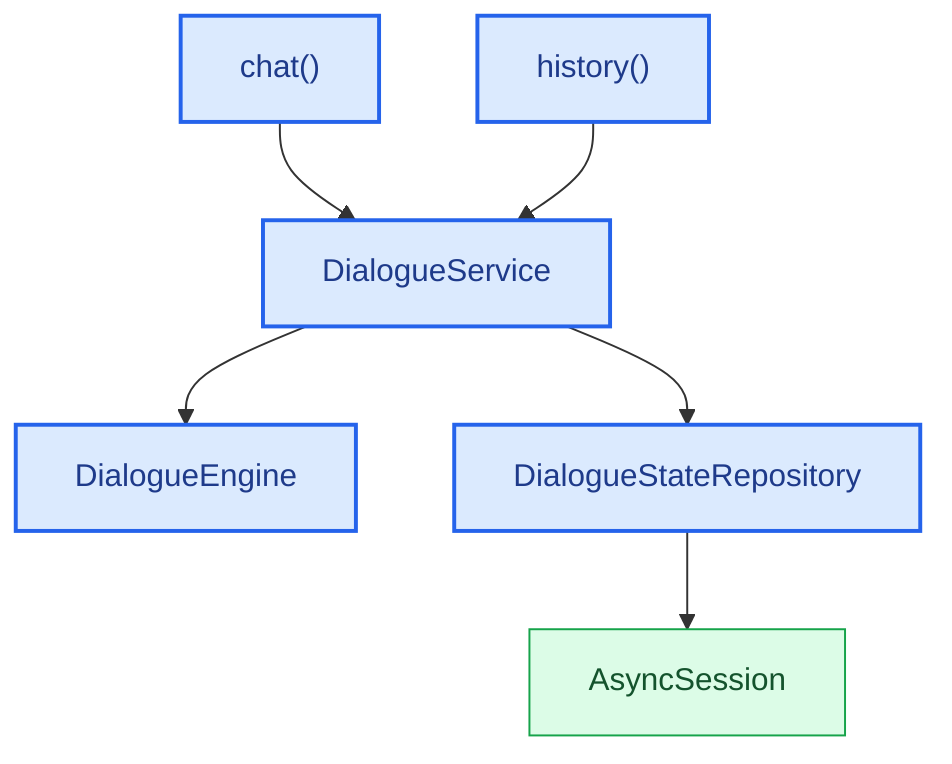

# 第1章 完成客服应用

02 文档已经确定了客服后端提供的两个接口：

- `POST /api/chat`：接收一条用户消息，返回本轮客服回复。
- `GET /api/chat/history`：接收用户 ID，返回该用户的聊天历史。

两个接口及其接口类型都已经定义完成，目前只缺少具体的业务逻辑。前面的文档已经完成 `DialogueService`、`DialogueStateRepository`、`DialogueEngine` 及其各个处理模块，现在可以将它们接入接口。

一条聊天请求进入系统后的调用过程如下：



本篇按照以下顺序完成客服应用：

| 章节 | 内容 |
|------|------|
| 第 2 章 | 构建 `DialogueEngine`，并通过依赖注入为接口提供 `DialogueService`。 |
| 第 3 章 | 为已经确定的接口补充处理逻辑。 |
| 第 4 章 | 管理应用生命周期，创建并启动 FastAPI 应用。 |

# 第2章 处理依赖

## 2.1 依赖关系

完整依赖关系如下：



`chat()` 和 `history()` 都依赖 `DialogueService` 完成业务调用。`DialogueService` 同时依赖 `DialogueEngine` 和 `DialogueStateRepository`，前者负责处理消息，后者负责读取和保存对话状态。`DialogueStateRepository` 再通过 `AsyncSession` 访问数据库。

`DialogueEngine` 在应用启动时创建，并在所有请求之间共享。每次请求则使用独立的数据库 Session，并据此创建当前请求使用的 Repository 和 Service。后续的依赖函数只负责按照这组关系提供相应对象。

## 2.2 实现依赖函数

在 `atguigu.api.dependencies.py` 模块中编写：

```python
from fastapi import Depends
from sqlalchemy.ext.asyncio import AsyncSession

from atguigu.clients import database
from atguigu.engine.builder import build_dialogue_engine
from atguigu.engine.dialogue_engine import DialogueEngine
from atguigu.repository.dialogue_state_repository import (
    DialogueStateRepository,
)
from atguigu.service.dialogue_service import DialogueService


_dialogue_engine: DialogueEngine | None = None


def init_dialogue_engine() -> None:
    global _dialogue_engine
    _dialogue_engine = build_dialogue_engine()


def get_engine() -> DialogueEngine:
    return _dialogue_engine


async def get_db():
    async with database.session_factory() as session:
        yield session


async def get_repository(
    db: AsyncSession = Depends(get_db),
) -> DialogueStateRepository:
    return DialogueStateRepository(db)


async def get_dialogue_service(
    engine: DialogueEngine = Depends(get_engine),
    repository: DialogueStateRepository = Depends(
        get_repository
    ),
) -> DialogueService:
    return DialogueService(
        dialogue_state_repository=repository,
        dialogue_engine=engine,
    )
```

依赖函数按照对象的生命周期分成两部分。

`init_dialogue_engine()` 在应用启动时构建一次 `DialogueEngine`，`get_engine()` 在请求期间返回这个共享对象。引擎包含已经加载的 Flow、注册完成的 Action 和无请求状态的处理组件，因此不需要为每个请求重复创建。

`get_db()` 使用异步生成器为一次请求提供数据库 Session：

```python
async with database.session_factory() as session:
    yield session
```

执行到 `yield` 时，Session 被交给当前请求使用。请求处理结束后，FastAPI 继续执行生成器并退出 `async with`，当前 Session 随之关闭。

`get_repository()` 使用当前请求的数据库 Session 创建 Repository，`get_dialogue_service()` 再使用当前 Repository 和共享 Engine 创建 Service。FastAPI 会分析 `Depends()` 中的关系，自动完成整条依赖链。

## 2.3 构建 DialogueEngine

`init_dialogue_engine()` 调用了尚未实现的 `build_dialogue_engine()`。下面继续实现该函数，创建 `DialogueEngine` 及其全部依赖，并将前面各篇文档实现的组件组装成一个完整对象。

在 `atguigu.engine.builder.py` 模块中编写：

```python
from pathlib import Path

from atguigu.chitchat.handler import ChitchatHandler
from atguigu.chitchat.responder import ChitchatResponder
from atguigu.clarify.responder import ClarifyResponder
from atguigu.clients.llm import llm
from atguigu.engine.dialogue_engine import DialogueEngine
from atguigu.knowledge.handler import KnowledgeHandler
from atguigu.knowledge.intents import KNOWLEDGE_INTENTS
from atguigu.knowledge.providers import (
    FAQProvider,
    OrderAPIProvider,
    ProductAPIProvider,
    RAGProvider,
)
from atguigu.knowledge.registry import (
    KnowledgeProviderRegistry,
)
from atguigu.knowledge.responder import KnowledgeResponder
from atguigu.plan.turn_planner import TurnPlanner
from atguigu.plan.validator import TurnPlanValidator
from atguigu.task.action.builder import build_action_runner
from atguigu.task.command.processor import CommandProcessor
from atguigu.task.flow.conditions import ConditionEvaluator
from atguigu.task.flow.executor import FlowExecutor
from atguigu.task.flow.loader import FlowLoader
from atguigu.task.flow.steps import ActionFlowStep
from atguigu.task.handler import TaskHandler
from atguigu.task.lifecycle.responder import (
    TaskLifecycleResponder,
)
from atguigu.task.response.renderer import ResponseRenderer


_PACKAGE_ROOT = Path(__file__).parents[1]
_FLOW_CONFIG_FILE = (
    _PACKAGE_ROOT / "flow_config" / "user_flows.yml"
)


def build_dialogue_engine() -> DialogueEngine:
    flows = FlowLoader().load(_FLOW_CONFIG_FILE)
    response_renderer = ResponseRenderer(llm=llm)
    action_runner = build_action_runner()

    return DialogueEngine(
        turn_planner=TurnPlanner(),
        task_handler=TaskHandler(
            flows=flows,
            command_processor=CommandProcessor(),
            flow_executor=FlowExecutor(
                action_runner=action_runner,
                response_renderer=response_renderer,
                condition_evaluator=ConditionEvaluator(),
            ),
            lifecycle_responder=TaskLifecycleResponder(
                flows=flows,
            ),
        ),
        knowledge_handler=KnowledgeHandler(
            knowledge_intents=KNOWLEDGE_INTENTS,
            knowledge_responder=KnowledgeResponder(),
            provider_registry=KnowledgeProviderRegistry(
                [
                    ProductAPIProvider(),
                    OrderAPIProvider(),
                    FAQProvider(),
                    RAGProvider(),
                ]
            ),
        ),
        chitchat_handler=ChitchatHandler(
            responder=ChitchatResponder(),
        ),
        clarify_responder=ClarifyResponder(),
        turn_plan_validator=TurnPlanValidator(),
    )
```

Builder 从底层依赖开始创建对象，最终返回可以处理用户消息的 `DialogueEngine`。

# 第3章 实现已经定义的接口

接口地址、请求参数、返回值以及对应的接口类型都已经定义完成。本章保持这些内容不变，只使用已经完成的 `DialogueService` 替换接口中的临时处理逻辑。

## 3.1 实现消息处理接口

`POST /api/chat` 已经确定接收 `ChatRequest` 并返回 `ChatResponse`。现在为该接口补充完整的消息处理过程。

使用以下代码替换 `chat()` 中的临时实现：

```python
@chat_router.post("/api/chat")
async def chat(
    chat_request: ChatRequest,
    dialogue_service: DialogueService = Depends(
        get_dialogue_service
    ),
) -> ChatResponse:
    user_message = _build_user_message(chat_request)
    process_result = await dialogue_service.process_message(
        user_message
    )
    return _build_chat_response(process_result)
```

接口函数完成三步转换和调用：

```text
ChatRequest
    -> UserMessage
    -> DialogueService.process_message()
    -> ProcessResult
    -> ChatResponse
```

FastAPI 负责将 HTTP 请求体解析为 `ChatRequest`，Router 负责接口模型和领域模型之间的转换，消息处理本身仍然由 `DialogueService` 组织。

### 3.1.1 转换用户消息

继续在 `chat_router.py` 中定义 `_build_user_message()`：

```python
def _build_user_message(
    chat_request: ChatRequest,
) -> UserMessage:
    return UserMessage(
        sender_id=chat_request.sender_id,
        message_id=(
            chat_request.message_id
            or str(uuid.uuid4())
        ),
        type=(
            MessageType.TEXT
            if chat_request.text is not None
            else MessageType.OBJECT
        ),
        text=chat_request.text,
        object=(
            MessageObject(
                type=chat_request.object.type,
                id=chat_request.object.id,
                title=chat_request.object.title,
                attributes=dict(
                    chat_request.object.attributes
                ),
            )
            if chat_request.object is not None
            else None
        ),
    )
```

客户端提供 `message_id` 时直接使用，没有提供时由服务端生成。`ChatRequest` 已经保证 `text` 和 `object` 只能存在一个，因此可以根据 `text` 是否为 `None` 确定 `MessageType`。

接口对象进入领域层时，`attributes` 使用 `dict()` 创建新字典，避免接口模型和领域模型共同持有同一个可变对象。

### 3.1.2 转换处理结果

`DialogueService.process_message()` 返回 `ProcessResult`。继续定义 `_build_chat_response()`，将其中的客服消息转换为接口响应：

```python
def _build_chat_response(
    process_result: ProcessResult,
) -> ChatResponse:
    return ChatResponse(
        sender_id=process_result.sender_id,
        message_id=process_result.message_id,
        messages=[
            ChatBotMessage(
                text=message.text,
                object=_build_chat_object(message.object),
            )
            for message in process_result.messages
        ],
    )
```

对象消息还需要从领域层的 `MessageObject` 转换为接口层的 `ChatObject`。继续添加：

```python
def _build_chat_object(
    message_object: MessageObject | None,
) -> ChatObject | None:
    if message_object is None:
        return None

    return ChatObject(
        type=message_object.type,
        id=message_object.id,
        title=message_object.title,
        attributes=dict(message_object.attributes),
    )
```

`_build_chat_object()` 同时供消息处理接口和历史记录接口使用，避免重复编写对象转换代码。

## 3.2 实现历史记录接口

`GET /api/chat/history` 已经确定通过 `sender_id` 查询用户的聊天历史。接口需要先读取该用户的 `DialogueState`，再将 Sessions 和 Turns 展开为连续的消息列表。

在 `DialogueService` 类中添加：

```python
async def get_state(
    self,
    sender_id: str,
) -> DialogueState:
    return await self.dialogue_state_repository.load_state(
        sender_id
    )
```

`get_state()` 只读取状态，不调用 `DialogueEngine`，也不重新保存状态。

然后使用以下代码替换 `history()` 中的临时实现：

```python
@chat_router.get("/api/chat/history")
async def history(
    sender_id: str,
    dialogue_service: DialogueService = Depends(
        get_dialogue_service
    ),
) -> HistoryResponse:
    state = await dialogue_service.get_state(sender_id)
    messages: list[HistoryMessage] = []

    for session in state.shared.sessions:
        for turn in session.turns:
            messages.append(
                HistoryMessage(
                    role="user",
                    text=turn.user_message.text,
                    object=_build_chat_object(
                        turn.user_message.object
                    ),
                )
            )
            messages.extend(
                [
                    HistoryMessage(
                        role="bot",
                        text=message.text,
                        object=_build_chat_object(
                            message.object
                        ),
                    )
                    for message in turn.bot_messages
                ]
            )

    return HistoryResponse(
        sender_id=sender_id,
        messages=messages,
    )
```

接口按照 Sessions 和 Turns 的保存顺序逐层遍历。每个 Turn 先追加一条 `user` 消息，再追加该轮产生的全部 `bot` 消息，最终得到前端可以直接展示的一维消息列表。

# 第4章 管理应用生命周期

`DialogueEngine`、数据库 Engine 和 HTTP Client 都需要在接口开始提供服务之前初始化。数据库 Engine 和 HTTP Client 还需要在应用关闭时释放资源。

## 4.1 定义应用生命周期

在 `atguigu.api.app.py` 模块中编写：

```python
from contextlib import asynccontextmanager

from fastapi import FastAPI

from atguigu.api.dependencies import init_dialogue_engine
from atguigu.api.routers.chat_router import chat_router
from atguigu.clients.database import (
    close_db_engine,
    init_db_engine,
)
from atguigu.clients.http_client import (
    close_http_client,
    init_http_client,
)


@asynccontextmanager
async def lifespan(app: FastAPI):
    init_http_client()
    init_dialogue_engine()
    init_db_engine()
    yield
    await close_db_engine()
    await close_http_client()

app = FastAPI(lifespan=lifespan)
app.include_router(chat_router)
```

## 4.2 启动应用

在根目录 `main.py` 中编写：

```python
import uvicorn

from atguigu.conf.config import settings


def main() -> None:
    uvicorn.run(
        "atguigu.api.app:app",
        host=settings.app_host,
        port=settings.app_port,
        reload=True,
    )


if __name__ == "__main__":
    main()
```

在项目根目录执行：

```shell
uv run python main.py
```
