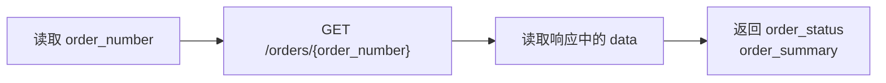
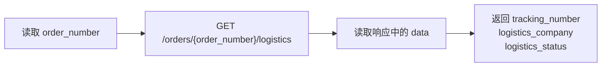
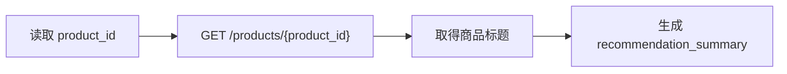

# 第1章 自定义 Action 概述

Flow 负责描述业务步骤，但不会直接包含订单查询、物流查询等具体业务代码。执行到 `action` Step 时，`FlowExecutor` 根据配置中的 Action 名称找到对应的自定义 Action，再由自定义 Action 调用电商服务并返回需要写入任务的 Slot。

当前 Flow 配置使用了三个自定义 Action：

| Action 名称 | 所属 Flow | 输入 Slot | 输出 Slot |
|-------------|-----------|-----------|-----------|
| `action_lookup_order_status` | `order_status_query` | `order_number` | `order_status`、`order_summary` |
| `action_lookup_logistics` | `logistics_tracking` | `order_number` | `tracking_number`、`logistics_company`、`logistics_status` |
| `action_recommend_similar_products` | `similar_product_recommendation` | `product_id` | `recommendation_summary` |

每个自定义 Action 使用一个独立模块实现，并遵循以下约定：

- 一个模块只定义一个 Action；
- Action 之间不相互导入，也不相互调用；
- Action 直接从 `DialogueState` 读取自身需要的输入 Slot；
- Action 独立调用所需的业务接口；
- Action 使用 `ActionResult.slot_updates` 返回自身产生的数据。

三个 Action 都依赖项目提供的 Action 接口、对话状态、HTTP 客户端和配置对象，但彼此之间没有依赖关系。删除或替换其中一个 Action，不会影响另外两个 Action 的实现。

# 第2章 查询订单状态

`order_status_query` Flow 在取得订单号后执行 `action_lookup_order_status`：

```yaml
- id: lookup_order_status
  type: action
  action: action_lookup_order_status
  next: show_order_status
```

该 Action 使用 `order_number` 查询订单详情，并返回订单状态和订单摘要：



在 `atgugiu.task.action.custom.lookup_order_status.py` 模块中编写以下代码：

```python
from typing import Any

from app.clients import http_client
from app.conf.config import settings
from app.domain.state import DialogueState
from app.task.action.base import Action, ActionResult


class LookupOrderStatusAction(Action):
    name = "action_lookup_order_status"

    async def run(
            self,
            state: DialogueState,
            action_kwargs: dict[str, Any],
    ) -> ActionResult:
        order_number = state.task_state.active.slots.get(
            "order_number"
        )
        url = (
            f"{settings.commerce_api_base_url}"
            f"/orders/{order_number}"
        )
        response = await http_client.http_client.get(url)
        payload = response.json()["data"]

        return ActionResult(slot_updates={
            "order_status": (
                    payload.get("status_desc")
                    or payload.get("status")
                    or "未知"
            ),
            "order_summary": (
                f"订单金额 ¥{payload['amount']}。"
            ),
        })

```

`run()` 的处理过程如下：

1. 从活动任务的 `slots` 中读取 `order_number`。
2. 使用商城服务地址构造订单详情接口 URL。
3. 通过共享 HTTP 客户端异步调用接口。
4. 从响应的 `data` 字段取得订单数据。
5. 将订单状态和订单摘要封装为 `ActionResult`。

返回的 `slot_updates` 会由 `FlowExecutor` 写入活动任务：

```python
{
    "order_status": "运输中",
    "order_summary": "订单金额 ¥299.00。",
}
```

后续 `show_order_status` Step 可以直接使用这两个 Slot 渲染回复。

# 第3章 查询物流信息

`logistics_tracking` Flow 在取得订单号后执行 `action_lookup_logistics`：

```yaml
- id: lookup_logistics
  type: action
  action: action_lookup_logistics
  next: show_logistics
```

该 Action 根据订单号查询物流信息，并返回物流公司、物流单号和当前物流状态：



在 `atgugiu.task.action.custom.lookup_logistics.py` 模块中编写以下代码：

```python
from typing import Any

from app.clients import http_client
from app.conf.config import settings
from app.domain.state import DialogueState
from app.task.action.base import Action, ActionResult


class LookupLogisticsAction(Action):
    name = "action_lookup_logistics"

    async def run(
            self,
            state: DialogueState,
            action_kwargs: dict[str, Any],
    ) -> ActionResult:
        order_number = state.task_state.active.slots.get(
            "order_number"
        )
        url = (
            f"{settings.commerce_api_base_url}"
            f"/orders/{order_number}/logistics"
        )
        response = await http_client.http_client.get(url)
        payload = response.json().get("data", {"detail": "未知"})

        return ActionResult(slot_updates={
            "tracking_number": (
                    payload.get("tracking_number")
                    or "未知"
            ),
            "logistics_company": (
                    payload.get("logistics_company")
                    or "未知"
            ),
            "logistics_status": (
                    payload.get("status_desc")
                    or payload.get("status")
                    or "未知"
            ),
        })

```

`run()` 的处理过程如下：

1. 从活动任务中读取 `order_number`。
2. 调用对应订单的物流查询接口。
3. 从响应中取得物流公司、物流单号和物流状态。
4. 使用 `ActionResult` 返回三个 Slot。

返回结果的结构如下：

```python
{
    "tracking_number": "SF1234567890",
    "logistics_company": "顺丰速运",
    "logistics_status": "快件正在运输中",
}
```

接口中的 `status_desc` 是面向用户展示的状态说明，因此优先使用该字段；没有 `status_desc` 时，再使用状态编码 `status`，两个字段都不存在时使用“未知”。

# 第4章 推荐相似商品

`similar_product_recommendation` Flow 在取得商品 ID 后执行 `action_recommend_similar_products`：

```yaml
- id: respond
  type: action
  action: action_recommend_similar_products
  next: show_recommendation
```

当前项目还没有接入正式的商品推荐服务。该 Action 先查询商品标题，再生成一段说明文字写入 `recommendation_summary`，为后续接入真实推荐能力保留完整的 Flow 执行链路。



在 `atgugiu.task.action.custom.recommend_similar_products.py` 模块中编写以下代码：

```python
from typing import Any

from app.clients import http_client
from app.conf.config import settings
from app.domain.state import DialogueState
from app.task.action.base import Action, ActionResult


class RecommendSimilarProductsAction(Action):
    name = "action_recommend_similar_products"

    async def run(
            self,
            state: DialogueState,
            action_kwargs: dict[str, Any],
    ) -> ActionResult:
        product_id = state.task_state.active.slots.get(
            "product_id"
        )
        label = product_id or "这件商品"

        url = (
            f"{settings.commerce_api_base_url}"
            f"/products/{product_id}"
        )
        response = await http_client.http_client.get(url)
        payload = response.json()["data"]

        if payload:
            title = str(payload.get("title") or "").strip()
            label = title or label

        summary = (
            f'我已经收到你对"{label}"的相似商品推荐需求。'
            "不过当前版本还没有接入正式的推荐系统，"
            "稍后可以继续补上这部分能力。"
        )
        return ActionResult(slot_updates={
            "recommendation_summary": summary
        })

```

该 Action 的输入和输出仍然遵守统一约定：

- 输入来自活动任务中的 `product_id`；
- 商品接口只用于取得更适合展示的商品标题；
- 最终文本通过 `recommendation_summary` 返回；
- Action 不依赖订单状态 Action 或物流 Action。

接入正式推荐服务时，只需要替换这个文件内部的接口调用和结果整理逻辑，不需要修改其他自定义 Action，也不需要修改 Flow 的 Action 名称。

